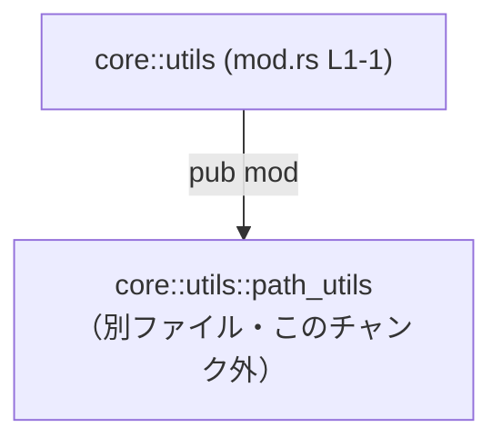

# core/src/utils/mod.rs コード解説

## 0. ざっくり一言

- `core::utils` モジュールのルートとして、`path_utils` サブモジュールを **公開（`pub`）** しているだけのモジュールです。  
  根拠: `core/src/utils/mod.rs:L1-1` の `pub mod path_utils;`

---

## 1. このモジュールの役割

### 1.1 概要

- このファイルは `core::utils` 名前空間のエントリポイントです。
- `path_utils` というサブモジュールを外部から利用できるように公開します。
- このファイル自体には関数や型の定義はありません。

根拠:  
`core/src/utils/mod.rs:L1-1` に `pub mod path_utils;` の 1 行のみが存在し、それ以外の定義がないためです。

### 1.2 アーキテクチャ内での位置づけ

`core::utils` と、その配下の `core::utils::path_utils` モジュールとの関係は次のようになります。



- `core::utils` モジュール（このファイル）は、`path_utils` サブモジュールを **公開** していることだけが分かります。
- `path_utils` の中身（関数・構造体など）は、このチャンクには一切現れないため、不明です。

### 1.3 設計上のポイント（このチャンクから読み取れる範囲）

- **責務の分割**
  - `core::utils` は自前の処理を持たず、`path_utils` サブモジュールの公開だけを行うルートモジュールになっています。  
    根拠: `core/src/utils/mod.rs:L1-1` に他の記述が存在しないため。
- **状態管理**
  - グローバル変数や構造体定義がないため、このファイルは状態を持っていません。
- **エラーハンドリング・並行性**
  - 関数やロジックが存在しないため、このファイル単体ではエラーハンドリング・並行処理に関する方針は読み取れません。

---

## 2. 主要な機能一覧

このファイルが提供する「機能」は、モジュール公開に限定されます。

- `path_utils` サブモジュールの公開: `core::utils::path_utils` を外部から参照可能にする

`path_utils` 内の具体的な機能（パス操作ユーティリティである可能性はありますが）は、このチャンクには現れないため不明です。

---

## 2.x コンポーネントインベントリー（このチャンク分）

このチャンクから確認できるコンポーネント（モジュール）の一覧です。

| 名前                         | 種別     | 定義位置                           | 説明 |
|------------------------------|----------|------------------------------------|------|
| `core::utils`               | モジュール（ルート） | `core/src/utils/mod.rs:L1-1` | `utils` 名前空間のルート。`path_utils` を公開する |
| `core::utils::path_utils`   | サブモジュール       | （別ファイル・このチャンク外）     | 中身不明。`pub mod path_utils;` により公開されていることのみ分かる |

根拠: `core/src/utils/mod.rs:L1-1` の `pub mod path_utils;`

---

## 3. 公開 API と詳細解説

### 3.1 型一覧（構造体・列挙体など）

- このファイルには、構造体・列挙体・型エイリアスなどの **型定義は存在しません**。

根拠: `core/src/utils/mod.rs:L1-1` が唯一の行であり、型定義構文（`struct`、`enum`、`type` など）がないため。

### 3.2 関数詳細

- このファイルには **関数定義が存在しません**。  
  したがって、関数に対する詳細テンプレートを適用できる公開 API はありません。

根拠: `core/src/utils/mod.rs:L1-1` に `fn` キーワードを含む行がないため。

### 3.3 その他の関数

- 補助関数・ラッパー関数なども、このファイルには一切定義されていません。

---

## 4. データフロー

このファイルは実行時のロジックを持たず、**データフローは「名前空間の公開」に限られます**。

### 4.1 モジュール公開の流れ

外部コードが `core::utils::path_utils` を利用する際の概念的なシーケンスを示します。  
（`path_utils` 内の具体的な API 名は、このチャンクには現れないため「不明」としています。）

```mermaid
sequenceDiagram
    participant External as "外部コード"
    participant Utils as "core::utils (mod.rs L1-1)"
    participant PathUtils as "core::utils::path_utils\n（別ファイル・このチャンク外）"

    External->>Utils: use core::utils::path_utils;
    Note right of Utils: pub mod path_utils;\nにより外部公開（L1-1）
    Utils-->>External: path_utils 名前空間を公開
    External->>PathUtils: path_utils 内の関数・型を利用（名前や挙動は不明）
```

ポイント:

- `core::utils` は、**名前空間の中継地点** として機能しているだけです。
- 実際のデータ処理・エラー処理・並行処理は `path_utils` 側に存在すると考えられますが、このチャンクからは確認できません。

---

## 5. 使い方（How to Use）

### 5.1 基本的な使用方法

このファイル自体には呼び出すべき関数はないため、主な用途は「モジュールのインポート経路」としての利用になります。

```rust
// core クレート内から利用する例（仮想的なコード例）
use crate::utils::path_utils; // core::utils（mod.rs L1-1）が pub mod しているためインポート可能

fn example() {
    // ここで path_utils 内の関数や型を利用することが想定される
    // ただし、このチャンクには path_utils の中身がないため、
    // 実際の関数名や使い方は不明です。
}
```

注意:

- この例は **モジュールの経路** のみを示しています。
- 具体的な API（例: `path_utils::join_paths` のような関数）の存在は、このチャンクからは断定できません。

### 5.2 よくある使用パターン

このファイルは `pub mod` しか持たないため、使用パターンもモジュールの再エクスポートに限定されます。

- `use crate::utils::path_utils;` としてインポートし、`path_utils` 内の API を利用する。
- 他のモジュールから `crate::utils::path_utils` とフルパス指定で参照する。

いずれの場合も、**具体的に何が使えるかは `path_utils` 側の定義に依存**しており、このチャンクには現れません。

### 5.3 よくある間違い（この種のモジュール一般）

このファイル固有ではなく、`pub mod` を持つルートモジュール一般に起こり得る注意点です。

```rust
// 間違い例: path_utils が pub でないファイル側
// mod path_utils;  // 非公開のまま

// 正しい例: 外部から使わせたい場合は pub を付ける
pub mod path_utils;
```

- このファイルではすでに `pub mod path_utils;` となっているため、外部から `core::utils::path_utils` を利用できます。

### 5.4 使用上の注意点（まとめ）

- **前提条件**
  - `path_utils` の実装ファイル（例: `core/src/utils/path_utils.rs` または `core/src/utils/path_utils/mod.rs`）が存在している必要があります。  
    （これは Rust のモジュール規則に基づく一般的な前提であり、このチャンクには実ファイルは現れません。）
- **エラー・パニック**
  - このファイルには実行ロジックがないため、このファイル由来のランタイムエラーやパニックはありません。
- **並行性・スレッド安全性**
  - このファイル単体では共有状態を持たず、スレッド安全性に関する懸念点はありません。  
    実際の並行性に関する考慮は `path_utils` の実装に依存します。

---

## 6. 変更の仕方（How to Modify）

### 6.1 新しい機能を追加する場合

このファイルにおける「機能追加」は、主に **新しいサブモジュールを公開する** ことを意味します。

一般的な手順:

1. 新しいユーティリティモジュール（例: `string_utils`）のソースファイルを  
   `core/src/utils/string_utils.rs` または `core/src/utils/string_utils/mod.rs` として作成する。
2. `core/src/utils/mod.rs` に次の 1 行を追加する。

   ```rust
   pub mod string_utils; // 新しいサブモジュールを公開
   ```

3. 他のコードから `crate::utils::string_utils` を経由して利用する。

※ 上記パス・名前は Rust の一般的なルールに基づいた例であり、実際のリポジトリ構成はこのチャンクからは不明です。

### 6.2 既存の機能を変更する場合

このファイルで変更しうる点は主に **公開範囲** です。

- `pub mod path_utils;` を `mod path_utils;` に変更すると、
  - `core::utils::path_utils` はクレート内部からしか見えなくなります（外部クレートや上位モジュールから利用できなくなる）。
- 影響範囲を確認するには、
  - リポジトリ全体で `utils::path_utils` や `core::utils::path_utils` を検索し、利用箇所を確認する必要があります。  
    （検索結果はこのチャンクには含まれていません。）

注意すべき契約:

- このファイルは「`core::utils::path_utils` を公開する」という **名前空間レベルの契約** を提供していると解釈できます。
- これを非公開化すると、その契約が崩れ、外部コードがコンパイルエラーになる可能性があります。

---

## 7. 関連ファイル

このチャンクから直接参照される関連ファイル・モジュールをまとめます。

| パス                          | 役割 / 関係 |
|-------------------------------|------------|
| `core/src/utils/mod.rs`      | 本ファイル。`core::utils` ルートモジュールとして `pub mod path_utils;` を定義（L1-1）。 |
| `core/src/utils/path_utils.rs` または `core/src/utils/path_utils/mod.rs` | Rust の標準的なモジュール規則上、`pub mod path_utils;` が参照する実装ファイルである可能性が高いが、このチャンクには現れないため **実在パスは不明**。 |

---

### このチャンクから分からないこと（明示）

- `core::utils::path_utils` 内にどのような
  - 関数
  - 型（構造体・列挙体など）
  - エラーハンドリング戦略
  - 非同期処理・並行処理の仕組み  
  が存在するかは、このチャンクには一切現れません。
- `core::utils` が他にどのようなサブモジュール（`string_utils` など）を持つかどうかも不明です。

以上が、`core/src/utils/mod.rs` のコードから読み取れる範囲での客観的な解説です。
