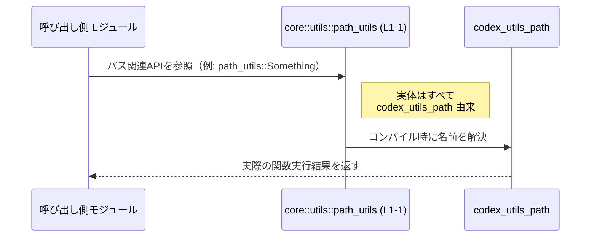

# core/src/utils/path_utils.rs コード解説

## 0. ざっくり一言

- `codex_utils_path` クレート（またはモジュール）の **全公開アイテムをそのまま再エクスポートする薄いラッパーモジュール** です（`core/src/utils/path_utils.rs:L1-1`）。

---

## 1. このモジュールの役割

### 1.1 概要

- このモジュールは、パス操作系のユーティリティをまとめたと考えられる `codex_utils_path` から、公開アイテムを一括して再公開します。
- これにより、`core` クレート側のコードは `crate::utils::path_utils` を通じて、`codex_utils_path` の API 群にアクセスできます。
- 自身では **関数・構造体・列挙体などの定義は一切持たず**、1 行のみで構成されています（`core/src/utils/path_utils.rs:L1-1`）。

### 1.2 アーキテクチャ内での位置づけ

このモジュールは、`core` クレート内の「utils 層」と、外部（または別クレート）の `codex_utils_path` との間の **名前空間の橋渡し** を担う位置づけと解釈できます。


- 依存関係として、このモジュールが参照しているのは `codex_utils_path` のみです（`core/src/utils/path_utils.rs:L1-1`）。
- どのモジュールからこのモジュールが呼ばれているかは、このチャンクには現れません。

### 1.3 設計上のポイント

- **再エクスポート専用**  
  - `pub use codex_utils_path::*;` の 1 行のみで構成されており（`core/src/utils/path_utils.rs:L1-1`）、独自のロジックや状態管理は行っていません。
- **API 集約／ファサード的役割**  
  - `core::utils::path_utils` という名前で、`codex_utils_path` の API をまとめて提供する設計になっています。
- **エラー処理・安全性・並行性の委譲**  
  - このモジュールには実行時コードがなく、エラー処理やスレッド安全性、パフォーマンス特性はすべて `codex_utils_path` 側の実装に依存します。
- **公開範囲の拡張**  
  - `pub use ...::*` により、`codex_utils_path` のすべての公開アイテムが、このモジュールの公開 API に含まれます（具体的なアイテム内容はこのチャンクには現れません）。

---

## 2. 主要な機能一覧

このファイル自身が提供する「機能」は、実質的には **再エクスポートのみ** です。

- `codex_utils_path` の全公開アイテムの再エクスポート  
  - 役割: `core::utils::path_utils` から `codex_utils_path` の関数・型などを利用できるようにする（`core/src/utils/path_utils.rs:L1-1`）。
  - 具体的な関数・型はこのチャンクには現れないため、詳細は `codex_utils_path` 側のコード／ドキュメントに依存します。

---

## 3. 公開 API と詳細解説

### 3.1 コンポーネント一覧（インベントリー）

このファイル内で **新たに定義されている型や関数はありません**（`core/src/utils/path_utils.rs:L1-1`）。  
唯一のコンポーネントは、`codex_utils_path` からのグロブ再エクスポートです。

| 名前 | 種別 | 役割 / 用途 | 定義位置（根拠） |
|------|------|-------------|------------------|
| `codex_utils_path::*` | 再エクスポート | `codex_utils_path` の全公開アイテムを `core::utils::path_utils` 経由で再公開する | `core/src/utils/path_utils.rs:L1-1` |

> 補足: `codex_utils_path` 自体に含まれる関数・構造体・列挙体などの一覧は、このチャンクには現れません。

### 3.2 関数詳細

- このファイルには **関数定義が 1 つも存在しません**（`pub use` 文のみ: `core/src/utils/path_utils.rs:L1-1`）。
- そのため、関数ごとの詳細テンプレート（引数・戻り値・エラー・エッジケースなど）を、このファイルの中身から構築することはできません。
- `codex_utils_path` 内の関数についても、このチャンクだけからは名称やシグネチャが分からないため、個別の解説は行えません。

### 3.3 その他の関数

- 補助的な関数やラッパー関数も含め、**いかなる関数定義も存在しません**（`core/src/utils/path_utils.rs:L1-1`）。

---

## 4. データフロー

このモジュールには実行時のロジックがないため、データの流れというよりは **名前解決と呼び出し経路** の流れを整理します。

### 4.1 呼び出しの流れ（概念図）

`core` 内の別モジュールがパス関連のユーティリティを利用する場合の、呼び出し経路をシーケンス図として表現します。



- 実際には、`path_utils` が関数呼び出しを **ランタイムで中継するわけではなく**、`pub use` によるコンパイル時の名前解決によって、呼び出し元から `codex_utils_path` の関数・型へ直接アクセスできるようになります。
- したがって、このファイルが追加のエラー処理や並行性制御を挟むことはありません。

---

## 5. 使い方（How to Use）

### 5.1 基本的な使用方法

このモジュールを利用する典型的なフローは、「`codex_utils_path` を直接参照する代わりに `core::utils::path_utils` を経由して扱う」という形になります。

```rust
// core クレート内のどこかから利用する例（擬似コード）

// パス関連ユーティリティをまとめてインポートする
use crate::utils::path_utils;

// 実際には、codex_utils_path で定義されている型や関数を
// `path_utils::...` として利用できます。
// 具体的な名前（関数名・型名など）は、このチャンクには現れません。
```

- 上記コードは、`path_utils` モジュールをインポートしているだけであり、具体的な関数呼び出しは示していません。
- これは、このファイルからは `codex_utils_path` の API 名が分からないためです。

### 5.2 よくある使用パターン

- このファイルだけからは、「どの関数が頻繁に使われるか」「同期／非同期でどう使い分けるか」といった具体的な利用パターンは読み取れません。
- 一般的には、以下のような目的でこの種の再エクスポートモジュールが利用されます（あくまで一般論です）。
  - `core::utils::path_utils` という名前空間で、パス関連の処理をまとめたい。
  - 外部クレート名（`codex_utils_path`）に依存せず、コアロジックからは内部ユーティリティとして扱いたい。

### 5.3 よくある間違い（このファイルから分かる範囲）

このファイル自体にロジックがないため、特有の誤用パターンはコードからは読み取れません。

一般的な注意点としては：

- 再エクスポートモジュールを導入している場合、
  - **`codex_utils_path` を直接 use するコード**
  - **`crate::utils::path_utils` 経由で use するコード**  
  が混在すると、どの API がどこ経由で利用されているか分かりづらくなることがあります。  
  ただし、これはあくまで一般的な話であり、このリポジトリの方針はこのチャンクからは分かりません。

### 5.4 使用上の注意点（まとめ）

- **エラーと例外的な挙動**  
  - このモジュールはエラー処理を追加しないため、エラー発生条件やエラーメッセージはすべて `codex_utils_path` 側の実装に依存します。
- **スレッド安全性・並行性**  
  - このモジュールは状態やスレッド操作を一切持たないため、並行性の特性は `codex_utils_path` 内の型・関数に依存します。
- **契約と互換性**  
  - `pub use ...::*` により、`codex_utils_path` の公開 API がそのまま `core::utils::path_utils` の契約になります。
  - `codex_utils_path` 側の API 変更（削除・シグネチャ変更など）は、このモジュールを経由して `core` の利用者にも直接影響します。

---

## 6. 変更の仕方（How to Modify）

### 6.1 新しい機能を追加する場合

このファイルに新しい機能を追加する場合の考慮事項です。

1. **どこに実装するかの検討**
   - パス関連のロジックを **`codex_utils_path` に追加するのか**、あるいは **`core::utils::path_utils` に独自のラッパー関数を定義するのか** を選択する必要があります。
   - 現状、このファイルは再エクスポート専用であり、新しいロジックは存在しません（`core/src/utils/path_utils.rs:L1-1`）。

2. **`pub use` の形を維持するか**
   - 現在は `pub use codex_utils_path::*;` というグロブ再エクスポートです（`core/src/utils/path_utils.rs:L1-1`）。
   - 特定のアイテムだけを公開したい場合は、`pub use codex_utils_path::{ItemA, ItemB};` のように明示的に列挙する形へ変更することもあります。

3. **API 追加の影響**
   - `path_utils` に独自の関数や型を追加すると、このモジュールの役割が「再エクスポート専用」から「ラッパー＋集約モジュール」に変わります。
   - その場合、追加した関数の契約（引数・戻り値・エラー条件・エッジケース）を明示的に決める必要があります。

### 6.2 既存の機能を変更する場合

このファイルに対する変更が持つ影響範囲です。

- **`codex_utils_path` の差し替え**
  - もし `codex_utils_path` の代わりに別のクレート／モジュールへ切り替える場合（例: `pub use another_path_utils::*;` へ変更）は、`core::utils::path_utils` を利用しているすべてのコードに影響します。
- **公開アイテムの制限**
  - グロブ再エクスポートをやめて公開アイテムを絞り込むと、既存コードがコンパイルエラーになる可能性があります。
- **テストおよび契約の確認**
  - このファイルにはテストは含まれていません（`core/src/utils/path_utils.rs:L1-1`）。
  - 変更後は、`path_utils` を利用している箇所のテスト（存在する場合）や、`codex_utils_path` 側のテストが依然として通るかを確認する必要があります（テストコード自体はこのチャンクには現れません）。

---

## 7. 関連ファイル

このモジュールと密接に関係するコンポーネントは、`pub use` の対象である `codex_utils_path` のみが明示されています。

| パス / クレート名 | 役割 / 関係 |
|-------------------|------------|
| `codex_utils_path` | 本ファイルが `pub use codex_utils_path::*;` で再エクスポートしているパス関連ユーティリティの実体。具体的な中身（型・関数など）はこのチャンクには現れません。 |

- `core` 内で `core::utils::path_utils` をどのファイルが利用しているか、あるいは `codex_utils_path` がどのように実装されているかは、このファイルの内容だけからは分かりません。

---

## 補足: Bugs / Security / エッジケース・テスト・性能など（このファイルに限定した観点）

このファイルに関する付帯情報を、簡潔にまとめます。

- **バグの可能性**
  - 実行時ロジックがないため、このファイル単体でランタイムバグを引き起こす要素はほぼありません。
  - ただし、`codex_utils_path` の API 変更に追従しない場合、コンパイルエラーや期待しない API 露出が発生する可能性があります。

- **セキュリティ**
  - このファイルは I/O や権限操作を行わず、単なる再エクスポートであるため、直接的なセキュリティリスクは読み取れません。
  - 実際のセキュリティ特性は `codex_utils_path` 側の実装に依存します。

- **契約・エッジケース**
  - `path_utils` の公開 API = `codex_utils_path` の公開 API という契約になっています（`core/src/utils/path_utils.rs:L1-1`）。
  - このモジュール自身には入力値や境界条件の処理が存在しないため、エッジケースはすべて `codex_utils_path` の関数・型のレベルで扱われます。

- **テスト**
  - このファイル内にはテストコードが存在しません（`core/src/utils/path_utils.rs:L1-1`）。
  - 動作保証は主に `codex_utils_path` 側のテスト、および `core::utils::path_utils` を利用する側の統合テストに依存すると考えられます（ただし、それらの有無はこのチャンクには現れません）。

- **パフォーマンス・スケーラビリティ**
  - 再エクスポート自体はコンパイル時の名前解決のみであり、ランタイムのオーバーヘッドは基本的にありません。
  - 性能特性やスケーラビリティ上のボトルネックは、`codex_utils_path` 内の実装に依存します。

以上の通り、このファイルは「パス関連ユーティリティの公開窓口」としての役割に特化しており、実際のロジックや安全性・エラー処理・並行性などの詳細はすべて `codex_utils_path` 側に委ねられています。
