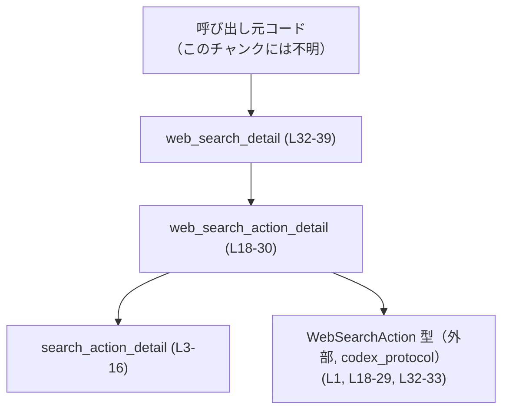
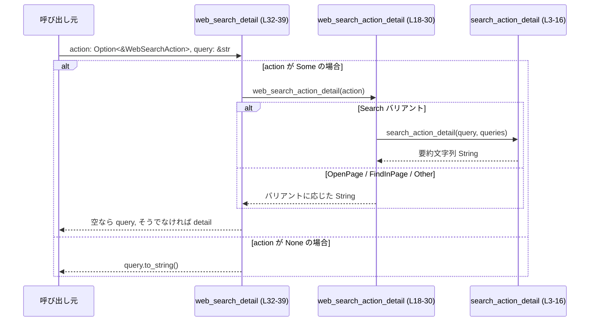

core/src/web_search.rs のコード解説です。

# core/src/web_search.rs コード解説

## 0. ざっくり一言

`WebSearchAction`（外部型）から、「検索内容／ページ操作」を説明する短い文字列を生成するユーティリティ関数群です。  
主に `Option` を使って欠損し得るクエリや URL を安全に処理し、空ならフォールバック文字列を返す構造になっています。  
（根拠: `core/src/web_search.rs:L3-39`）

---

## 1. このモジュールの役割

### 1.1 概要

- このモジュールは、`WebSearchAction` 値と元の検索クエリ文字列から、UI 表示やログ用と思われる「説明テキスト」を組み立てるために存在しています。（用途自体は推測であり、コードからは用途の詳細は分かりません）
- `WebSearchAction` の各バリアント（Search / OpenPage / FindInPage / Other）ごとに別の表現を生成し、`Option` が `None` の場合や文字列が空の場合は、空文字列やフォールバックのクエリ文字列に置き換えます。  
（根拠: `core/src/web_search.rs:L1, L18-29, L32-38`）

### 1.2 アーキテクチャ内での位置づけ

このモジュール内部だけを見ると、依存関係は次のようになっています。

- 外部クレート `codex_protocol::models` の `WebSearchAction` 型に依存しています。（根拠: `core/src/web_search.rs:L1`）
- 公開関数 `web_search_detail` → 公開関数 `web_search_action_detail` → 非公開関数 `search_action_detail` の順に呼び出されます。（根拠: `core/src/web_search.rs:L18-21, L32-33`）



この図は、本ファイル内における関数呼び出しと外部型の依存関係を表しています。

### 1.3 設計上のポイント

- **状態を持たない純粋関数のみ**  
  - すべての関数は引数から文字列を生成して返すだけであり、グローバル状態・I/O・ミューテーションはありません。（根拠: `core/src/web_search.rs:L3-39`）
- **`Option` とデフォルト値による安全な値処理**  
  - 文字列が存在しない場合や空文字列の場合に、`unwrap_or_default` や `unwrap_or_else` で安全にフォールバックします。`unwrap` は使われておらず、パニック要因はありません。（根拠: `core/src/web_search.rs:L4, L9, L21, L26, L33`）
- **フォールバック戦略の一元化**  
  - 検索クエリ関連の詳細文字列生成は `search_action_detail` に集約し、`web_search_action_detail` から再利用しています。（根拠: `core/src/web_search.rs:L3-16, L20-21`）
- **単方向の依存（上位 → 下位）**  
  - 公開 API から非公開ヘルパーへ一方向に依存しており、循環や複雑なコールグラフはありません。（根拠: `core/src/web_search.rs:L18-21, L32-33`）
- **エラー型ではなく文字列で結果を表現**  
  - エラー時・情報欠如時も `Result` や `Option` ではなく、空文字列やフォールバック文字列として表現します。（根拠: `core/src/web_search.rs:L21, L26-27, L32-38`）

### 1.4 コンポーネントインベントリー（関数・型一覧）

| 名前 | 種別 | 公開範囲 | 役割 / 用途 | 定義・使用位置（行番号） |
|------|------|----------|-------------|---------------------------|
| `WebSearchAction` | 列挙体（外部定義） | 外部クレート `codex_protocol::models` | Web 検索やページ操作を表現するアクション型。各バリアントごとに説明文字列を生成するために使用されます。 | インポート: `core/src/web_search.rs:L1` / 利用: `L18-29, L32-33` |
| `search_action_detail` | 関数（ヘルパー） | モジュール内のみ（非公開） | `Search` バリアントの `query` / `queries` から、代表的な検索文字列（必要に応じて「...」付き）を組み立てます。 | 定義: `core/src/web_search.rs:L3-16` / 呼び出し: `L20` |
| `web_search_action_detail` | 関数 | 公開 (`pub`) | 単一の `WebSearchAction` から、その内容を説明する文字列を生成します。 | 定義: `core/src/web_search.rs:L18-30` |
| `web_search_detail` | 関数 | 公開 (`pub`) | `Option<&WebSearchAction>` と元のクエリ文字列から、「アクションの説明」またはクエリ文字列を返す高レベルなラッパーです。 | 定義: `core/src/web_search.rs:L32-39` |

このファイル内に独自の構造体や列挙体の定義はありません。（根拠: `core/src/web_search.rs:L1-39`）

---

## 2. 主要な機能一覧

- `WebSearchAction` 1 件から、人間可読な説明文字列を生成する。
- 検索クエリ（`Search` バリアント）について、単一/複数クエリの有無に応じた要約文字列を生成する。
- `Option<&WebSearchAction>` がない、または説明文字列が空の場合に、元の検索クエリ文字列でフォールバックする。  
（根拠: `core/src/web_search.rs:L3-16, L18-30, L32-38`）

---

## 3. 公開 API と詳細解説

### 3.1 型一覧（構造体・列挙体など）

| 名前 | 種別 | 役割 / 用途 | 定義場所 / このファイル内での扱い |
|------|------|-------------|-----------------------------------|
| `WebSearchAction` | 列挙体（外部） | Web 検索やページ操作を表現するドメインアクション。少なくとも `Search { query, queries }`, `OpenPage { url }`, `FindInPage { url, pattern }`, `Other` のバリアントを持ちます。 | 定義は `codex_protocol::models` クレート側にあり、このチャンクには現れません。利用は `web_search_action_detail` と `web_search_detail` の引数・パターンマッチとして行われます。（根拠: `core/src/web_search.rs:L1, L18-29, L32-33`） |

このファイル内には新たな型定義はありません。

---

### 3.2 関数詳細

#### `pub fn web_search_detail(action: Option<&WebSearchAction>, query: &str) -> String`

**概要**

- `Option<&WebSearchAction>` と元の検索クエリ文字列から、最適な説明文字列を返す高レベル API です。
- `action` が与えられていて、その説明が空でない場合はその説明を返し、そうでなければ `query` をそのまま返します。  
（根拠: `core/src/web_search.rs:L32-38`）

**根拠コード**

- 定義: `core/src/web_search.rs:L32-39`

**引数**

| 引数名 | 型 | 説明 |
|--------|----|------|
| `action` | `Option<&WebSearchAction>` | 説明したい Web アクション。`None` の場合は `query` がそのまま返されます。 |
| `query` | `&str` | 元の検索クエリ文字列。`action` から説明文字列を得られない場合のフォールバックとして使用されます。 |

**戻り値**

- `String`: アクション内容または元のクエリを表す説明文字列です。空文字列になる可能性もあります（`action` が `Some` かつ `web_search_action_detail` の結果が空で、`query` も空の場合）。  
  （根拠: `core/src/web_search.rs:L32-38`）

**内部処理の流れ**

1. `action.map(web_search_action_detail)` で、`Some(&WebSearchAction)` なら `web_search_action_detail` を呼び出して `Some(String)` を得ます。`None` の場合は `None` のままです。（根拠: `core/src/web_search.rs:L33`）
2. その `Option<String>` に対して `unwrap_or_default()` を呼び、`None` の場合は `String::new()`（空文字列）に置き換えます。（根拠: `core/src/web_search.rs:L33`）
3. 得られた `detail` が空文字列なら `query.to_string()` を返し、空でなければ `detail` をそのまま返します。（根拠: `core/src/web_search.rs:L34-38`）

**Examples（使用例）**

`Search` アクションがある場合に、アクションの説明を優先的に返す例です。

```rust
use codex_protocol::models::WebSearchAction;

// シンプルな検索アクションを作成する                              
let action = WebSearchAction::Search {
    query: Some("rust ownership".to_string()),           // メインの検索クエリ
    queries: None,                                       // サジェスト等がない場合
};

// アクションとクエリから詳細文字列を取得する                      
let detail = web_search_detail(Some(&action), "rust ownership");

// Search バリアントの query がそのまま返される想定               
assert_eq!(detail, "rust ownership");
```

- 上記は、このファイルの関数シグネチャおよび `Search { query, queries }` のパターンから推測される構造に基づいた例です。（根拠: `core/src/web_search.rs:L3, L20`）
- 実際の `WebSearchAction` の定義はこのチャンクにはないため、フィールド名・型はコード上のパターンに基づくものです。

**Errors / Panics**

- `Result` を返さず、エラーを表現する機構は持ちません。
- `unwrap_or_default` は `Option` に対する安全なデフォルト変換であり、パニックを起こしません。（根拠: `core/src/web_search.rs:L33`）
- 本関数内で `unwrap` や `expect` は使用されていないため、引数がどのような値でもパニックは発生しません。（根拠: `core/src/web_search.rs:L32-39`）

**Edge cases（エッジケース）**

- `action` が `None` の場合  
  - `detail` は空文字列になり、常に `query.to_string()` が返されます。（根拠: `core/src/web_search.rs:L33-36`）
- `action` が `Some` だが `web_search_action_detail` が空文字列を返す場合  
  - `detail.is_empty()` が真になり、`query.to_string()` が返されます。（根拠: `core/src/web_search.rs:L33-36`）
- `query` が空文字列の場合  
  - `action` が `None` かつ `query` が空の場合、戻り値は空文字列になります。（根拠: `core/src/web_search.rs:L34-37`）

**使用上の注意点**

- **空文字列の可能性**  
  - 呼び出し側で「必ず非空文字列が欲しい」場合は、戻り値が空かどうかをチェックする必要があります。
- **スレッド安全性**  
  - 引数は不変参照とコピー可能な値のみであり、内部で共有状態を変更しないため、複数スレッドから同時に呼び出しても問題ない構造になっています。（根拠: `core/src/web_search.rs:L32-39`）
- **パフォーマンス**  
  - 行っている処理は文字列のコピーと比較程度であり、一般的な Web 検索クエリの長さを考えるとコストは軽微です。

---

#### `pub fn web_search_action_detail(action: &WebSearchAction) -> String`

**概要**

- 単一の `WebSearchAction` 値に対して、人間が読める形の短い説明文字列を生成します。
- アクションの種類に応じて `search_action_detail` を呼び出したり、URL や検索パターンを組み込んだ文字列を返したりします。  
（根拠: `core/src/web_search.rs:L18-29`）

**根拠コード**

- 定義: `core/src/web_search.rs:L18-30`

**引数**

| 引数名 | 型 | 説明 |
|--------|----|------|
| `action` | `&WebSearchAction` | 説明対象の Web アクション。各バリアントごとに異なるフォーマットで文字列化されます。 |

**戻り値**

- `String`: `action` の内容を表現する説明文字列です。特定のバリアント（`Other` など）の場合は空文字列を返すことがあります。  
  （根拠: `core/src/web_search.rs:L18-29`）

**内部処理の流れ**

1. `match action` で `WebSearchAction` のバリアントごとに分岐します。（根拠: `core/src/web_search.rs:L19`）
2. `Search { query, queries }`  
   - 非公開ヘルパー `search_action_detail(query, queries)` を呼び、その結果をそのまま返します。（根拠: `core/src/web_search.rs:L20`）
3. `OpenPage { url }`  
   - `url.clone().unwrap_or_default()` を呼び、`Some(url)` ならその文字列を、`None` なら空文字列を返します。（根拠: `core/src/web_search.rs:L21`）
4. `FindInPage { url, pattern }`  
   - `(pattern, url)` の組み合わせごとにさらに `match` します。（根拠: `core/src/web_search.rs:L22-27`）
     - `Some(pattern), Some(url)` → `"'{pattern}' in {url}"` というフォーマットの文字列を返します。（根拠: `core/src/web_search.rs:L23`）
     - `Some(pattern), None` → `"'{pattern}'"` というフォーマットで、パターンだけを返します。（根拠: `core/src/web_search.rs:L24`）
     - `None, Some(url)` → `url.clone()` を返します。（根拠: `core/src/web_search.rs:L25`）
     - `None, None` → `String::new()`（空文字列）を返します。（根拠: `core/src/web_search.rs:L26`）
5. `Other`  
   - 常に空文字列 `String::new()` を返します。（根拠: `core/src/web_search.rs:L28`）

**Examples（使用例）**

`FindInPage` バリアントの説明文字列を生成する例です。

```rust
use codex_protocol::models::WebSearchAction;

// ページ内検索のアクションを構築する                            
let action = WebSearchAction::FindInPage {
    url: Some("https://example.com".to_string()),       // 検索対象ページの URL
    pattern: Some("rust".to_string()),                  // ページ内で探す文字列
};

// アクションの詳細を文字列化する                               
let detail = web_search_action_detail(&action);

assert_eq!(detail, "'rust' in https://example.com");    // pattern と URL が含まれる
```

`Search` バリアントの例（`search_action_detail` が利用される）は後述の `search_action_detail` の例を参照できます。

**Errors / Panics**

- すべてのバリアント分岐で `String` を返しており、`match` は網羅的です。（根拠: `core/src/web_search.rs:L19-29`）
- `unwrap_or_default` のみを使用し、`unwrap` は使っていないため、入力値に依存するパニック要因はありません。（根拠: `core/src/web_search.rs:L21, L26`）
- したがって、この関数はどのような `WebSearchAction` を受け取ってもパニックは発生しません。

**Edge cases（エッジケース）**

- `Search` バリアントで `query`/`queries` の両方が `None` または空の場合  
  - `search_action_detail` が空文字列を返す可能性があり、そのまま空文字列が返ります。（根拠: `core/src/web_search.rs:L3-16, L20`）
- `OpenPage` で `url` が `None` の場合  
  - 空文字列が返ります。（根拠: `core/src/web_search.rs:L21`）
- `FindInPage` で `pattern`・`url` のどちらか一方だけが `Some` の場合  
  - `pattern` のみ、または `url` のみを含む文字列が返ります。（根拠: `core/src/web_search.rs:L23-25`）
- `Other` バリアント  
  - 常に空文字列を返します。（根拠: `core/src/web_search.rs:L28`）

**使用上の注意点**

- **空文字列を返し得るバリアント**  
  - `OpenPage` の `None`、`FindInPage` の `None, None`、`Other` などでは空文字列になります。呼び出し側で「何かしらの表示テキスト」が必須な場合は、空文字列に対するフォールバック処理が必要です。
- **パターン文字列の引用符**  
  - `FindInPage` では、パターン文字列がシングルクォートで囲まれた形で返されます（例: `'pattern' in url`）。このフォーマットに依存したパースを行う場合は、その仕様を前提として扱う必要があります。（根拠: `core/src/web_search.rs:L23-24`）
- **並行性**  
  - 不変参照のみを扱い、副作用がないため、複数スレッドから同時に呼び出しても安全と解釈できます。

---

#### `fn search_action_detail(query: &Option<String>, queries: &Option<Vec<String>>) -> String`

**概要**

- `WebSearchAction::Search` バリアント用のヘルパー関数で、主となる検索文字列と、必要に応じて複数クエリの先頭要素と「...」を使った短い要約を生成します。  
（根拠: `core/src/web_search.rs:L3-16, L20`）

**根拠コード**

- 定義: `core/src/web_search.rs:L3-16`

**引数**

| 引数名 | 型 | 説明 |
|--------|----|------|
| `query` | `&Option<String>` | メインの検索クエリ（省略可能）。`Some` かつ非空ならこれを優先的に使用します。 |
| `queries` | `&Option<Vec<String>>` | 補助的な複数クエリ（省略可能）。`query` が使えない場合に、先頭要素や「...」付きの表現に利用します。 |

**戻り値**

- `String`: 検索クエリを表す短い文字列。条件によっては空文字列になることもあります。  
  （根拠: `core/src/web_search.rs:L3-16`）

**内部処理の流れ**

1. `query.clone().filter(|q| !q.is_empty())`  
   - `query` が `Some(String)` ならクローンし、空文字列なら `None` に落とします。`None` の場合はそのままです。（根拠: `core/src/web_search.rs:L4`）
2. `unwrap_or_else` ブロック  
   - 上記の結果が `Some(non-empty)` ならそれを返し、`None` の場合にクロージャが実行されます。（根拠: `core/src/web_search.rs:L4-5`）
3. クロージャ内部:  
   1. `let items = queries.as_ref();` で `Option<&Vec<String>>` を取得します。（根拠: `core/src/web_search.rs:L5`）
   2. `let first = items.and_then(|queries| queries.first()).cloned().unwrap_or_default();`  
      - `queries` が `Some` かつ非空なら先頭要素のクローンを、そうでなければ空文字列を得ます。（根拠: `core/src/web_search.rs:L6-9`）
   3. `if items.is_some_and(|queries| queries.len() > 1) && !first.is_empty()`  
      - `queries` が 2 件以上かつ `first` が非空なら `"first ..."` という文字列を返します。（根拠: `core/src/web_search.rs:L10-11`）
      - それ以外の場合は `first` をそのまま返します。（根拠: `core/src/web_search.rs:L12-13`）

**Examples（使用例）**

複数クエリから代表的な要約を生成する例です。

```rust
use codex_protocol::models::WebSearchAction;

// Search バリアントを想定したクエリとサジェスト群                      
let query = Some("rust".to_string());                    // メインクエリ
let queries = Some(vec![
    "rust".to_string(),                                  // 先頭要素
    "rust ownership".to_string(),                        // 2つ目
]);

// 通常は WebSearchAction::Search から呼ばれるが、ここでは直接利用      
let detail = search_action_detail(&query, &queries);

assert_eq!(detail, "rust");                              // query が優先される
```

別パターン: `query` が空で `queries` に複数要素がある場合:

```rust
let query = Some("".to_string());                        // 空文字列
let queries = Some(vec![
    "rust".to_string(),
    "rust lifetimes".to_string(),
]);

let detail = search_action_detail(&query, &queries);
// first = "rust", 要素数 > 1 なので "rust ..." 形式になる想定          
assert_eq!(detail, "rust ...");
```

**Errors / Panics**

- `unwrap_or_else` と `unwrap_or_default` のみを使用しており、`unwrap` は使われていません。（根拠: `core/src/web_search.rs:L4, L9`）
- ベクタの先頭要素取得には `first()` を使っており、空の場合は `None` になり、その後 `unwrap_or_default` で空文字列にフォールバックするため、インデックスによるパニックもありません。（根拠: `core/src/web_search.rs:L6-9`）

**Edge cases（エッジケース）**

- `query` が `Some("")`（空文字列）の場合  
  - `filter(|q| !q.is_empty())` によって `None` と扱われ、`queries` にフォールバックします。（根拠: `core/src/web_search.rs:L4-5`）
- `query` が `None` かつ `queries` も `None` または空ベクタの場合  
  - `first` は空文字列となり、そのまま空文字列が返されます。（根拠: `core/src/web_search.rs:L6-9, L12-13`）
- `queries` が `Some` だが、先頭要素が空文字列の場合  
  - `first` は空文字列となり、要素数が 2 以上でも `!first.is_empty()` が偽になるため、「...」は付かず空文字列が返されます。（根拠: `core/src/web_search.rs:L6-13`）

**使用上の注意点**

- この関数はモジュール内非公開であり、外部から直接呼ばれる想定ではありません。（根拠: `core/src/web_search.rs:L3`）
- 検索クエリの要約ロジックを変更する場合は、本関数のみを修正すれば `Search` バリアントの表現が一括で変わる構造になっています。（根拠: `core/src/web_search.rs:L20`）

---

### 3.3 その他の関数

- 本モジュールには、上記 3 関数以外の関数は定義されていません。（根拠: `core/src/web_search.rs:L1-39`）

---

## 4. データフロー

ここでは、`web_search_detail` を呼び出して説明文字列を得る典型的なフローを示します。

1. 呼び出し元が `action: Option<&WebSearchAction>` と `query: &str` を用意し、`web_search_detail` を呼び出します。（根拠: `core/src/web_search.rs:L32`）
2. `action` が `Some` の場合、`web_search_action_detail` で `String` に変換します。（根拠: `core/src/web_search.rs:L33`）
3. `Search` バリアントであれば、さらに `search_action_detail` が `query`/`queries` から要約を生成します。（根拠: `core/src/web_search.rs:L20`）
4. 最後に、`web_search_detail` は得られた文字列が空なら `query` を返し、そうでなければその文字列を返します。（根拠: `core/src/web_search.rs:L34-38`）



---

## 5. 使い方（How to Use）

### 5.1 基本的な使用方法

`WebSearchAction` と元クエリから説明文字列を得る基本的なフローの例です。

```rust
use codex_protocol::models::WebSearchAction;

// 検索アクションを構築する                                       // Search バリアントの例
let action = WebSearchAction::Search {
    query: Some("rust ownership".to_string()),             // メインの検索語
    queries: Some(vec![
        "rust ownership".to_string(),                      // 先頭クエリ
        "rust borrow checker".to_string(),                 // 補助クエリ
    ]),
};

// アクションとクエリから詳細文字列を取得する                      
let detail = web_search_detail(Some(&action), "rust ownership");

// query が非空なので、そのまま "rust ownership" が返る想定         
println!("{detail}");
```

- `web_search_detail` に `Some(&action)` を渡すと、内部で `web_search_action_detail` → `search_action_detail` の順に呼び出されます。（根拠: `core/src/web_search.rs:L20, L32-33`）

### 5.2 よくある使用パターン

1. **アクションがない場合のフォールバック**

```rust
let query = "rust tutorial";                            // ユーザー入力の検索語
let detail = web_search_detail(None, query);           // action がないケース

assert_eq!(detail, "rust tutorial".to_string());       // query がそのまま使われる
```

1. **`FindInPage` の説明生成**

```rust
use codex_protocol::models::WebSearchAction;

let action = WebSearchAction::FindInPage {
    url: Some("https://example.com".to_string()),
    pattern: Some("async".to_string()),
};

let detail = web_search_action_detail(&action);
assert_eq!(detail, "'async' in https://example.com");
```

1. **`OpenPage` で URL がない場合**

```rust
use codex_protocol::models::WebSearchAction;

let action = WebSearchAction::OpenPage { url: None };  // URL が欠落しているケース
let detail = web_search_action_detail(&action);

assert!(detail.is_empty());                            // 空文字列が返る
```

### 5.3 よくある間違い

```rust
use codex_protocol::models::WebSearchAction;

// 間違い例: 空文字列になる可能性を考慮していない
let action = WebSearchAction::Other;
let label = web_search_action_detail(&action);
// label は "" になる可能性があるが、そのまま UI ラベルに使うと無表示になりうる

// 正しい例: 空文字列の場合にフォールバックを用意する
let label = {
    let raw = web_search_action_detail(&action);
    if raw.is_empty() {
        "(no description)".to_string()
    } else {
        raw
    }
};
```

### 5.4 使用上の注意点（まとめ）

- **空文字列の扱い**  
  - いくつかのバリアントや入力パターンで空文字列が返るため、UI ラベル等にそのまま使う場合はフォールバック文言を用意する必要があります。
- **エスケープ処理は行っていない**  
  - 出力文字列はそのまま引数文字列を結合したものであり、HTML やシェルコマンド等に埋め込む場合のエスケープ処理はこの関数群では行っていません。（根拠: `core/src/web_search.rs:L3-39`）
- **スレッド安全性**  
  - どの関数も外部状態を持たず、引数は不変参照・所有 `String`・`Vec` だけなので、同一インスタンスを複数スレッドから同時に呼び出してもデータ競合は発生しません。
- **エラー処理**  
  - `Result` は返さず、エラーや欠損は「空文字列」「フォールバック文字列」という形で表現します。そのため、エラーとして扱いたい状況を呼び出し側で判定する必要があります。

---

## 6. 変更の仕方（How to Modify）

### 6.1 新しい機能を追加する場合

**例: `WebSearchAction` に新しいバリアントを追加し、その説明文字列を生成したい場合**

1. `codex_protocol::models::WebSearchAction` 側に新しいバリアントを追加します。（この作業はこのチャンクには現れません）
2. 本ファイルの `web_search_action_detail` の `match action` に、そのバリアント用の分岐を追加します。（根拠: `core/src/web_search.rs:L19-29`）
3. 必要に応じて、`search_action_detail` のような専用ヘルパー関数を追加し、複雑なフォーマットロジックを分離します。
4. `web_search_detail` は `web_search_action_detail` の戻り値が空かどうかでしか分岐しないため、通常変更は不要です。（根拠: `core/src/web_search.rs:L32-38`）

### 6.2 既存の機能を変更する場合

- **`Search` クエリの要約ロジックを変更したい場合**  
  - `search_action_detail` のみを編集すれば、`Search` バリアントの表現が一括で変わります。（根拠: `core/src/web_search.rs:L3-16, L20`）
- **フォールバック条件を変更したい場合**  
  - 「空文字列なら `query` を返す」という条件を変更するには、`web_search_detail` の `if detail.is_empty()` 部分を編集します。（根拠: `core/src/web_search.rs:L34-37`）
- **影響範囲の確認**  
  - これらの関数は公開 API（特に `web_search_detail`, `web_search_action_detail`）であるため、変更前にクレート内での呼び出し箇所を検索し、期待される文字列フォーマットに依存したコードがないか確認する必要があります。この情報はこのチャンクには現れないため、リポジトリ全体の検索が必要です。

---

## 7. 関連ファイル

このモジュールと密接に関係する外部ファイル・型は次の通りです。

| パス / シンボル | 役割 / 関係 |
|----------------|------------|
| `codex_protocol::models::WebSearchAction` | Web 検索やページ操作を表す列挙体であり、本モジュールの主要な入力型です。`web_search_action_detail` と `web_search_detail` の引数として利用されます。（根拠: `core/src/web_search.rs:L1, L18-29, L32-33`） |

このチャンクにはテストコード（`#[cfg(test)]` モジュールなど）は含まれておらず、どのようなテストが存在するかはファイル外を確認する必要があります。（根拠: `core/src/web_search.rs:L1-39`）

---

## Bugs / Security / Tests / 性能などの補足（見出しではなく要点のみ）

- **明確なバグ候補**  
  - コード上からは、即時にパニックや明らかなロジック破綻を引き起こす箇所は見当たりません。すべての `Option` は安全に処理されています。（根拠: `core/src/web_search.rs:L3-39`）
- **セキュリティ上の観点**  
  - 入力文字列をそのまま結合して返すだけであり、SQL やシェル呼び出しは行っていません。このチャンクだけからは直接的なセキュリティホールは読み取れません。ただし、HTML など特定のコンテキストで利用する場合は呼び出し側でエスケープやサニタイズが必要になる可能性があります。
- **テスト**  
  - 本ファイル内にテストは存在しません。挙動を検証するには、各バリアントと代表的なエッジケース（`None`/空文字列/複数クエリ）を入力とする単体テストを別途用意する必要があります。
- **性能・スケーラビリティ**  
  - 処理内容は短い文字列のコピー・結合と簡単なベクタ操作に限られており、一般的な Web 検索用途で性能上のボトルネックになる可能性は低いと考えられます。
- **オブザーバビリティ（観測性）**  
  - ログ出力やメトリクス計測は行っていません。生成された文字列の利用状況を追跡したい場合は、呼び出し側でログ記録などを追加する必要があります。
