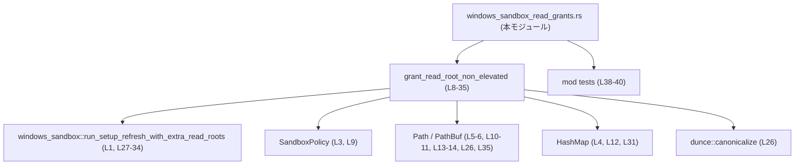
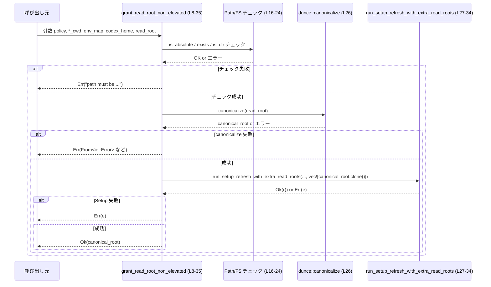
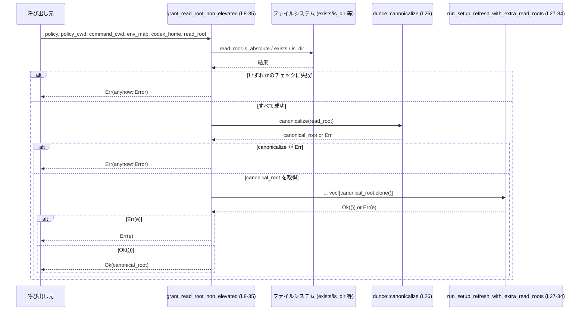

# core/src/windows_sandbox_read_grants.rs

---

## 0. ざっくり一言

Windows サンドボックスのセットアップ関数に対して、**追加の読み取りルートディレクトリを 1 つ渡すための薄いラッパ関数**を提供するモジュールです（`grant_read_root_non_elevated`）。  
渡されたパスが「絶対パス・存在する・ディレクトリ」であることを検証し、正規化したうえで委譲します。

---

## 1. このモジュールの役割

### 1.1 概要

- このモジュールは、Windows サンドボックスに関連するセットアップ処理の一部として、  
  「読み取り専用ルート候補のパスを検証・正規化し、セットアップロジックへ渡す」という問題を解決するために存在しています（`grant_read_root_non_elevated`、根拠: L8-35）。
- 具体的には、呼び出し元から渡された `read_root` が **絶対パスで存在するディレクトリ**であることを確認し（根拠: L16-24）、`dunce::canonicalize` で正規化したパスを `run_setup_refresh_with_extra_read_roots` に渡します（根拠: L26-34）。

### 1.2 アーキテクチャ内での位置づけ

このモジュールは、以下の外部コンポーネントに依存しています。

- `crate::windows_sandbox::run_setup_refresh_with_extra_read_roots`  
  サンドボックスセットアップ本体の関数（実装はこのチャンクには現れません、根拠: L1）。
- `codex_protocol::protocol::SandboxPolicy`  
  サンドボックスのポリシー設定を表す型（詳細はこのチャンクには現れませんが、シグネチャに現れます、根拠: L3, L9）。
- 標準ライブラリ:
  - `std::path::Path`, `PathBuf`（ファイルパス表現、根拠: L5-6, L10-11, L13-14）
  - `std::collections::HashMap<String, String>`（環境変数のマップとして使用、根拠: L4, L12）
- クレート `dunce` の `canonicalize` 関数（パス正規化に使用、根拠: L26）。

依存関係を簡略化した図は次のとおりです。



### 1.3 設計上のポイント

- **単一関数・ステートレス**  
  このファイルで定義される公開 API は `grant_read_root_non_elevated` 1 つのみで、状態（フィールド等）を持ちません（根拠: L8-36）。
- **入力バリデーションの明示**  
  `read_root` に対して「絶対パスか」「存在するか」「ディレクトリか」を順に検査し、条件を満たさない場合は即座にエラーを返します（根拠: L16-24）。
- **エラー処理に `anyhow::Result` を利用**  
  戻り値が `anyhow::Result<PathBuf>` であり、`anyhow::bail!` や `?` 演算子を用いてエラーを早期リターンしています（根拠: L2, L15-24, L26, L27-34）。
- **外部セットアップ処理への委譲**  
  実際のサンドボックス設定変更は `run_setup_refresh_with_extra_read_roots` に委譲し、この関数は前処理と引数の組み立てに集中しています（根拠: L27-34）。
- **テストは別ファイルで管理**  
  `#[path = "windows_sandbox_read_grants_tests.rs"]` でテストモジュールが別ファイルにあることが指定されています（根拠: L38-40）。テスト内容はこのチャンクには現れません。

---

## 2. 主要な機能一覧（＋コンポーネントインベントリ）

このファイルで定義される主要コンポーネントは次のとおりです。

### 2.1 コンポーネント一覧

| 名前 | 種別 | 公開性 | 役割 / 用途 | 根拠 |
|------|------|--------|-------------|------|
| `grant_read_root_non_elevated` | 関数 | `pub` | 読み取りルート候補のパスを検証・正規化し、`run_setup_refresh_with_extra_read_roots` に 1 件分の「追加 read root」として渡すラッパー | `core/src/windows_sandbox_read_grants.rs:L8-35` |
| `tests` | モジュール | `cfg(test)` 内 | このモジュール専用のテストコードを収めるテストモジュール | `core/src/windows_sandbox_read_grants.rs:L38-40` |

---

## 3. 公開 API と詳細解説

### 3.1 型一覧（このモジュールのシグネチャに現れる型）

このファイル自身は新しい型を定義していませんが、公開関数のインターフェースに現れる主要な型を整理します。

| 名前 | 種別 | 出どころ | 役割 / 用途 | 根拠 |
|------|------|----------|-------------|------|
| `SandboxPolicy` | 構造体 or 列挙体等（詳細不明） | `codex_protocol::protocol` | サンドボックスのポリシー設定を表すと考えられますが、具体的なフィールドや振る舞いはこのチャンクからは分かりません。 | L3, L9 |
| `Path` | 構造体 | `std::path` | 値を所有しないファイルパスの参照型。ここでは `policy_cwd` / `command_cwd` / `codex_home` / `read_root` の型として使用されています。 | L5, L10-11, L13-14 |
| `PathBuf` | 構造体 | `std::path` | 所有権を持つパス型。正規化後の `canonical_root` と、関数の戻り値として使用されています。 | L6, L26, L35 |
| `HashMap<String, String>` | 構造体 | `std::collections` | 環境変数などの key/value マップとして `env_map` 引数に使用されています。具体的な内容は呼び出し側に依存します。 | L4, L12, L31 |
| `Result<T>` | 型エイリアス | `anyhow` | エラー情報を `anyhow::Error` でラップする汎用的な `Result`。ここでは `Result<PathBuf>` として使用されています。 | L2, L15 |

### 3.2 関数詳細

#### `grant_read_root_non_elevated(...) -> Result<PathBuf>`

```rust
pub fn grant_read_root_non_elevated(
    policy: &SandboxPolicy,
    policy_cwd: &Path,
    command_cwd: &Path,
    env_map: &HashMap<String, String>,
    codex_home: &Path,
    read_root: &Path,
) -> Result<PathBuf> { /* ... */ }
```

**概要**

- `read_root` 引数で指定されたディレクトリパスについて
  - 絶対パスであること
  - 実在すること
  - ディレクトリであること  
  を検証したうえで（根拠: L16-24）、
- `dunce::canonicalize` で正規化したパスを 1 要素の `Vec<PathBuf>` に詰め、  
  `run_setup_refresh_with_extra_read_roots` に「追加の読み取りルート」として渡します（根拠: L26-34）。
- 正常終了時には、正規化済みの `PathBuf` を返します（根拠: L26, L35）。

**引数**

| 引数名 | 型 | 説明 | 根拠 |
|--------|----|------|------|
| `policy` | `&SandboxPolicy` | サンドボックスのポリシー設定。`run_setup_refresh_with_extra_read_roots` にそのまま渡されます。具体的内容はこのチャンクからは不明です。 | L9, L28 |
| `policy_cwd` | `&Path` | ポリシーの基準カレントディレクトリ。`run_setup_refresh_with_extra_read_roots` にそのまま渡されます。 | L10, L29 |
| `command_cwd` | `&Path` | 実際のコマンド実行時のカレントディレクトリ。`run_setup_refresh_with_extra_read_roots` に渡されます。 | L11, L30 |
| `env_map` | `&HashMap<String, String>` | 環境変数などの name/value マップ。`run_setup_refresh_with_extra_read_roots` に渡されます。 | L12, L31 |
| `codex_home` | `&Path` | Codex のホームディレクトリと思われるパス（名称からの推測）。`run_setup_refresh_with_extra_read_roots` に渡されます。具体的な意味はこのチャンクからは不明です。 | L13, L32 |
| `read_root` | `&Path` | 追加の読み取りルートとして登録したいディレクトリパス。絶対パスかつ存在するディレクトリである必要があります。 | L14, L16-24, L26 |

**戻り値**

- 型: `anyhow::Result<PathBuf>`（根拠: L2, L15）
- 意味:
  - `Ok(canonical_root)`  
    `read_root` を `dunce::canonicalize` で正規化した `PathBuf`。  
    サンドボックス側に渡された「実際の読み取りルート」として利用できます（根拠: L26, L35）。
  - `Err(e)`  
    下記「Errors / Panics」で挙げる条件のいずれかで発生するエラー。

**内部処理の流れ（アルゴリズム）**

1. `read_root` が絶対パスかを確認  
   - `Path::is_absolute` を使い、絶対パスでなければ `anyhow::bail!` でエラーを返します（根拠: L16-18）。
2. `read_root` が存在するかを確認  
   - `Path::exists` により存在チェックを行い、存在しない場合はエラーを返します（根拠: L19-21）。
3. `read_root` がディレクトリかを確認  
   - `Path::is_dir` によりディレクトリ性を確認し、ディレクトリでなければエラーを返します（根拠: L22-24）。
4. パスの正規化  
   - `dunce::canonicalize(read_root)?` を呼び出し、正規化された `PathBuf` を取得します（根拠: L26）。  
     ここでエラーが発生した場合は `?` により即座に呼び出し元へ伝播されます。
5. セットアップ関数の呼び出し  
   - 正規化したパスを `canonical_root.clone()` として `Vec<PathBuf>` に 1 件だけ格納し（根拠: L33）、  
     `run_setup_refresh_with_extra_read_roots` に引数として渡します（根拠: L27-34）。  
     ここで発生したエラーも `?` によりそのまま伝播します。
6. 正常終了  
   - セットアップ関数が成功したら `Ok(canonical_root)` を返します（根拠: L35）。

**処理フロー図（関数内部）**

`grant_read_root_non_elevated (L8-35)` 内での主な呼び出し関係をシーケンス図として示します。



**Examples（使用例）**

この関数を利用して、1 つのディレクトリを追加の読み取りルートとしてセットアップする例です。  
`SandboxPolicy` や `run_setup_refresh_with_extra_read_roots` の詳細な初期化方法はこのファイルからは分からないため、コメントで示しています。

```rust
use std::collections::HashMap;                           // 環境変数マップに使用
use std::path::Path;                                     // Path 型のためにインポート
use anyhow::Result;                                      // anyhow::Result
use codex_protocol::protocol::SandboxPolicy;             // サンドボックスポリシー
use crate::windows_sandbox_read_grants::grant_read_root_non_elevated;

fn configure_read_root(policy: &SandboxPolicy) -> Result<()> {
    // これらの具体的な値や生成方法は、このファイルからは分かりません。
    let policy_cwd = Path::new("C:\\path\\to\\policy_cwd");   // ポリシー基準の CWD（絶対パスを想定）
    let command_cwd = Path::new("C:\\path\\to\\command_cwd"); // コマンド実行時の CWD（絶対パスを想定）

    // 環境変数を HashMap<String, String> に収集する一例
    let env_map: HashMap<String, String> = std::env::vars().collect();

    let codex_home = Path::new("C:\\path\\to\\codex_home");   // Codex のホームディレクトリ（絶対パス）
    let read_root = Path::new("C:\\data\\read_root");         // 追加したい読み取りルート（絶対パスの既存ディレクトリ）

    let canonical_root = grant_read_root_non_elevated(
        policy,
        policy_cwd,
        command_cwd,
        &env_map,
        codex_home,
        read_root,
    )?;                                                       // 失敗すると Err を返す

    println!("Granted read root: {}", canonical_root.display());
    Ok(())
}
```

**Errors / Panics**

この関数は panic を起こすコード（`unwrap` 等）を含まず、エラーはすべて `Result` 経由で返されます（根拠: L16-35）。

`Err` になりうる条件は次のとおりです。

1. **絶対パスでない場合**  
   - 条件: `!read_root.is_absolute()`（根拠: L16）  
   - エラー: `anyhow::bail!("path must be absolute: {}", read_root.display())`（根拠: L17-18）

2. **パスが存在しない場合**  
   - 条件: `!read_root.exists()`（根拠: L19）  
   - エラー: `anyhow::bail!("path does not exist: {}", read_root.display())`（根拠: L20-21）

3. **ディレクトリでない場合**  
   - 条件: `!read_root.is_dir()`（根拠: L22）  
   - エラー: `anyhow::bail!("path must be a directory: {}", read_root.display())`（根拠: L23-24）

4. **`dunce::canonicalize` の失敗**  
   - 条件: `dunce::canonicalize(read_root)` が `Err` を返した場合（根拠: L26）  
   - エラー: `?` により、そのエラーが `anyhow::Error` に変換されてこの関数の `Err` になります。  
     具体的な原因（アクセス権限不足、パスの不正、など）は `canonicalize` 実装依存で、このチャンクからは分かりません。

5. **`run_setup_refresh_with_extra_read_roots` の失敗**  
   - 条件: 同関数が `Err` を返した場合（根拠: L27-34）  
   - エラー: `?` により、そのエラーがそのまま呼び出し元に伝播します。エラー種別や内容は、このチャンクには現れません。

**Edge cases（エッジケース）**

- **`read_root` が相対パス**  
  - 例: `Path::new("relative\\dir")`  
  - 結果: 即座に `Err("path must be absolute: ...")` となります（根拠: L16-18）。
- **`read_root` が存在しないパス**  
  - 結果: `Err("path does not exist: ...")`（根拠: L19-21）。
- **`read_root` がファイルでありディレクトリでない**  
  - 結果: `Err("path must be a directory: ...")`（根拠: L22-24）。
- **`read_root` がシンボリックリンクやジャンクションを含むパス**  
  - `dunce::canonicalize` の挙動に依存します。  
    一般に「正規化された実パス」を返すことが期待されますが、具体的なルール（UNC パスの扱い等）は `dunce` クレート側の仕様であり、このチャンクからは断定できません（根拠: L26）。
- **ファイルシステムアクセスが失敗するケース**  
  - 読み取り権限がない・ネットワークドライブ不調などの場合、`exists` / `is_dir` / `canonicalize` の内部でエラーまたは偽が返る可能性があります。  
    このファイルからは詳細なエラーコードは分かりませんが、少なくとも `canonicalize` の失敗は `Err` として伝播します（根拠: L26）。

**使用上の注意点（安全性 / エラー / 並行性）**

- **呼び出し前の前提条件**
  - `read_root` は「絶対パスのディレクトリ」である必要があります。そうでないと必ずエラーになります（根拠: L16-24）。
  - `policy_cwd`, `command_cwd`, `codex_home` も、Windows 路径として意味のあるパスであることが期待されますが、ここでは検証されていません（このチャンクにはそのチェックはありません）。
- **エラー伝播**
  - ファイルシステムアクセスやサンドボックスセットアップ中のエラーは、`anyhow::Error` として上位に伝播します（根拠: L2, L26, L27-34）。  
    呼び出し側は `?` や `match` を使ってハンドリングする設計になっています。
- **並行性**
  - この関数自体はグローバルな可変状態を持たず、引数を借用しているだけなので、関数単体としてはスレッドセーフな作りになっています（根拠: すべての引数が参照であり、内部に `static mut` やグローバル変数操作がないこと、L8-35）。  
  - ただし、`run_setup_refresh_with_extra_read_roots` がスレッドセーフかどうかはこのチャンクからは分かりません。複数スレッドから同時にこの関数を呼び出す場合は、その実装側の仕様を確認する必要があります。
- **セキュリティ的観点**
  - この関数は `read_root` を検証し、正規化することで、少なくとも「存在しないパス」や「ファイル」をセットアップ関数へ渡さないようにしています（根拠: L16-24, L26）。  
  - どのようなパスがサンドボックスからアクセス可能になるかは `run_setup_refresh_with_extra_read_roots` の実装依存であり、このチャンクからはアクセス制御の詳細を判断できません。

### 3.3 その他の関数

このファイル内には、補助関数やラッパ関数など、`grant_read_root_non_elevated` 以外の関数定義はありません（根拠: L8-36 に 1 つの関数定義のみが存在）。

---

## 4. データフロー

代表的なシナリオとして、「1 つのディレクトリを追加の読み取りルートとして登録する」場合のデータフローを示します。

1. 呼び出し元は、サンドボックスポリシー、各種カレントディレクトリ、環境変数マップ、Codex ホームパス、`read_root` を構築して `grant_read_root_non_elevated` を呼び出す（根拠: L8-14）。
2. 関数内部で `read_root` に対する検証と正規化が行われ、問題なければ `run_setup_refresh_with_extra_read_roots` に引き渡される（根拠: L16-34）。
3. セットアップ関数が成功すると、正規化された `PathBuf` が呼び出し元へ返る（根拠: L26, L35）。



---

## 5. 使い方（How to Use）

### 5.1 基本的な使用方法

典型的なフローは「依存オブジェクトの用意 → `grant_read_root_non_elevated` 呼び出し → 返ってきたパスの利用」です。

```rust
use std::collections::HashMap;                           // 環境変数マップ用
use std::path::Path;                                     // Path 型
use anyhow::Result;                                      // anyhow::Result
use codex_protocol::protocol::SandboxPolicy;             // ポリシー（定義は他モジュール）
use crate::windows_sandbox_read_grants::grant_read_root_non_elevated;

fn main_flow(policy: &SandboxPolicy) -> Result<()> {
    // 1. 設定や依存オブジェクトを用意する
    let policy_cwd = Path::new("C:\\policy_root");
    let command_cwd = Path::new("C:\\workspace");
    let codex_home = Path::new("C:\\Users\\me\\.codex");
    let env_map: HashMap<String, String> = std::env::vars().collect();

    // 2. 読み取りルートにしたい絶対パスのディレクトリを指定する
    let read_root = Path::new("C:\\data\\project");      // 事前に存在させておく必要あり

    // 3. メインの処理を呼び出す
    let canonical_root = grant_read_root_non_elevated(
        policy,
        policy_cwd,
        command_cwd,
        &env_map,
        codex_home,
        read_root,
    )?;

    // 4. 結果を利用する
    println!("Sandbox can read: {}", canonical_root.display());
    Ok(())
}
```

### 5.2 よくある使用パターン

1. **複数ディレクトリを順に登録する**

この関数は 1 度に 1 つの `read_root` しか受け取らないため、複数ディレクトリを登録したい場合はループで呼び出す形になります。

```rust
fn grant_multiple_roots(
    policy: &SandboxPolicy,
    policy_cwd: &Path,
    command_cwd: &Path,
    env_map: &HashMap<String, String>,
    codex_home: &Path,
    roots: &[&Path],
) -> anyhow::Result<Vec<PathBuf>> {
    let mut granted = Vec::new();                        // 正規化されたルートのリスト

    for &root in roots {
        // 各 root ごとに検証とセットアップ処理が走る
        let canonical = grant_read_root_non_elevated(
            policy,
            policy_cwd,
            command_cwd,
            env_map,
            codex_home,
            root,
        )?;
        granted.push(canonical);
    }

    Ok(granted)
}
```

1. **CLI から受け取ったパスの検証**

CLI 引数で指定されたパスが、サンドボックスに追加可能かどうかを判定しながら登録する、といった用途にも直接利用できます。  
相対パスが渡された場合はこの関数がエラーを返すので、呼び出し側でフィードバックできます（根拠: L16-18）。

### 5.3 よくある間違い

**誤り例: 相対パスを渡してしまう**

```rust
// 誤り例: read_root に相対パスを渡している
let read_root = Path::new("relative\\data");             // 相対パス
let canonical_root = grant_read_root_non_elevated(
    policy,
    policy_cwd,
    command_cwd,
    &env_map,
    codex_home,
    read_root,
)?;                                                      // ここで Err("path must be absolute: ...")
```

**正しい例: 絶対パスに変換してから渡す**

```rust
// 正しい例: 事前に絶対パスを構成する
let cwd = std::env::current_dir()?;                      // カレントディレクトリを取得
let read_root = cwd.join("relative\\data");              // 絶対パスへ解決

let canonical_root = grant_read_root_non_elevated(
    policy,
    policy_cwd,
    command_cwd,
    &env_map,
    codex_home,
    &read_root,                                          // &PathBuf は &Path に自動参照変換される
)?;
```

### 5.4 使用上の注意点（まとめ）

- **バリデーションは `read_root` のみ**  
  他のパス引数 (`policy_cwd`, `command_cwd`, `codex_home`) についてはこの関数ではチェックされません（根拠: L16-24 で `read_root` のみが検査対象）。  
  これらが不正な場合の挙動は `run_setup_refresh_with_extra_read_roots` 側の仕様に依存します。
- **I/O コスト**  
  `exists`, `is_dir`, `canonicalize` は通常ファイルシステムへアクセスするため、非常に高頻度に呼ぶ場合はディスクやネットワークストレージへの負荷が増える可能性があります。  
  このファイルからは具体的な性能特性は分かりませんが、ループ内で大量に呼び出す場合は注意が必要です。
- **再実行の影響**  
  同じ `read_root` に対して何度も呼び出した場合、毎回 `run_setup_refresh_with_extra_read_roots` が実行されます（根拠: L27-34）。  
  それが冪等かどうか、またコストがどの程度かは、外部関数の実装に依存します。

---

## 6. 変更の仕方（How to Modify）

### 6.1 新しい機能を追加する場合

例として、「複数の読み取りルートを一度に登録する関数」を追加したい場合の考え方を示します。

1. **追加先ファイル**  
   - 同種の責務（Windows サンドボックスの read grants）を扱っているため、まずはこのファイル `windows_sandbox_read_grants.rs` に新しい関数を追加するのが自然です。

2. **既存機能の再利用**  
   - すでに `read_root` 1 件の検証・正規化ロジックが `grant_read_root_non_elevated` にまとまっているため、  
     新関数内でこの関数をループから呼び出す、あるいはバリデーションだけ切り出して再利用する、という設計が考えられます（根拠: L16-35）。

3. **セットアップ関数呼び出し方法の検討**
   - `run_setup_refresh_with_extra_read_roots` はすでに「複数の read roots」を `Vec<PathBuf>` で受け取れる形になっていると解釈できます（引数に `vec![canonical_root.clone()]` を渡していることから、根拠: L27-34）。  
   - 複数渡しを行う関数では、`Vec<PathBuf>` をまとめて構成したうえで 1 回だけ呼ぶか、現状と同じく 1 件ずつ呼ぶかを選ぶ必要があります。  
     ただし、外部関数の仕様はこのチャンクには現れないため、実際に変更する際は該当モジュールを確認する必要があります。

4. **公開 API の設計**
   - 新関数も公開 API (`pub fn`) とするか、内部利用限定にするかは利用範囲に応じて判断します。

### 6.2 既存の機能を変更する場合

`grant_read_root_non_elevated` を変更する際に注意すべき点です。

- **前提条件（契約）の維持**
  - 現状、この関数は「絶対パス・存在・ディレクトリ」の 3 条件を前提としています（根拠: L16-24）。  
    これらの条件を緩和／強化すると、呼び出し元の期待する挙動が変わる可能性があるため、影響範囲を確認する必要があります。
- **エラー文言の互換性**
  - エラーメッセージは文字列比較などに使用されている可能性があります（テストやログ解析など）。  
    `anyhow::bail!` のメッセージを変更する場合は、`windows_sandbox_read_grants_tests.rs` や呼び出し元のコードを確認することが推奨されます（根拠: L17-18, L20-21, L23-24, L38-40）。
- **`Vec` の構築方法**
  - 現在は `vec![canonical_root.clone()]` として `Vec<PathBuf>` を作成しています（根拠: L33）。  
    ここを変更する場合、`run_setup_refresh_with_extra_read_roots` がどのような形のベクタを期待しているか（空許容か、重複許容か等）を確認する必要があります。
- **エラー型の変更**
  - 戻り値が `anyhow::Result<PathBuf>` から別のエラー型を含む `Result` に変わると、呼び出し側のエラー処理ロジックにも影響します。  
    現状は `?` による透過的なエラー伝播を意図した設計になっているため（根拠: L26, L27-34）、エラー型を変える場合は全呼び出しサイトの書き換えが必要です。

---

## 7. 関連ファイル

このモジュールと密接に関係するファイル・モジュールは次のとおりです。

| パス / モジュール | 役割 / 関係 | 根拠 |
|------------------|------------|------|
| `crate::windows_sandbox::run_setup_refresh_with_extra_read_roots`（実ファイルパスはこのチャンクからは不明） | 実際のサンドボックスセットアップ処理を行う関数。本モジュールのコアロジックが最終的にここへ委譲されます。 | L1, L27-34 |
| `codex_protocol::protocol::SandboxPolicy`（同様に実ファイルパスは不明） | サンドボックスポリシーの定義を提供し、本モジュールの公開関数シグネチャに登場します。 | L3, L9 |
| `core/src/windows_sandbox_read_grants_tests.rs` | このモジュール専用のテストコードを含むファイル。`#[path = "..."]` 属性によって同一ディレクトリ内のこのファイルがテストモジュールとしてインクルードされます。 | L38-40 |

このチャンクに現れるコードから読み取れる情報は以上であり、他のモジュールの内部実装や、サンドボックス全体の挙動の詳細については、このファイルだけからは判断できません。
