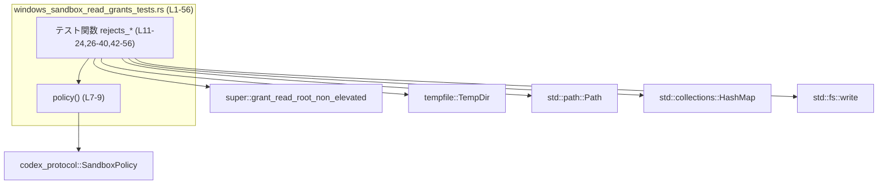
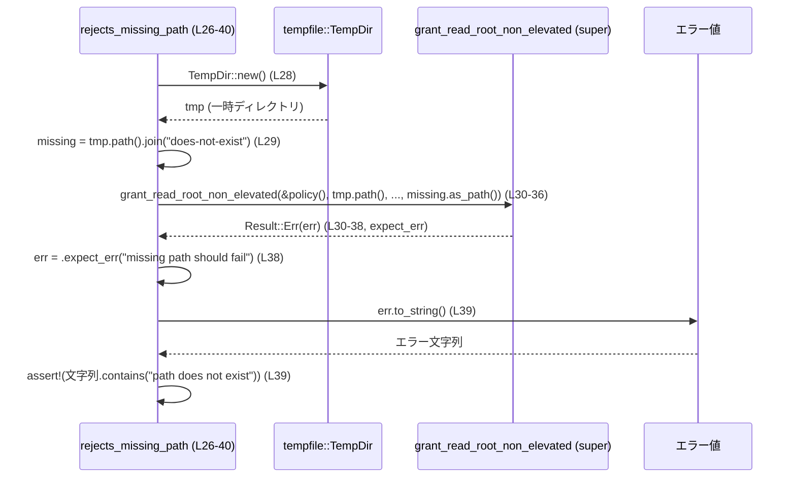

# core/src/windows_sandbox_read_grants_tests.rs コード解説

## 0. ざっくり一言

Windows サンドボックス関連の関数 `grant_read_root_non_elevated` に対して、**不正なパス入力時に正しくエラーになること**を検証するテストモジュールです（相対パス／存在しないパス／ファイルパスを拒否する挙動を確認しています）。  
（根拠: `use super::grant_read_root_non_elevated;` と 3 つの `#[test]` 関数からの呼び出し `windows_sandbox_read_grants_tests.rs:L1-3,L11-24,L26-40,L42-56`）

---

## 1. このモジュールの役割

### 1.1 概要

- このモジュールは、非特権（non‑elevated）環境での読み取りルートを付与する関数 `grant_read_root_non_elevated` が、**不適切なパスを拒否する**ことをテストします。  
  （根拠: 相対パス／存在しないパス／ファイルパスに対して `expect_err` している `windows_sandbox_read_grants_tests.rs:L11-24,L26-40,L42-56`）
- サンドボックス用ポリシー `SandboxPolicy` を共通の初期値で生成するヘルパー関数 `policy()` を提供します。  
  （根拠: `fn policy() -> SandboxPolicy { SandboxPolicy::new_workspace_write_policy() } windows_sandbox_read_grants_tests.rs:L7-9`）

### 1.2 アーキテクチャ内での位置づけ

このファイルは「テストモジュール」として、親モジュール（`super`）にある本体関数 `grant_read_root_non_elevated` の振る舞いを検証します。外部クレートや標準ライブラリも利用しています。

- 親モジュール: `super::grant_read_root_non_elevated` をテスト対象として利用  
  （根拠: `use super::grant_read_root_non_elevated; windows_sandbox_read_grants_tests.rs:L1`）
- ポリシー型: `SandboxPolicy`（`codex_protocol::protocol`）  
  （根拠: `use codex_protocol::protocol::SandboxPolicy; windows_sandbox_read_grants_tests.rs:L2`）
- 一時ディレクトリ: `tempfile::TempDir`  
  （根拠: `use tempfile::TempDir; windows_sandbox_read_grants_tests.rs:L5`）
- パス操作: `std::path::Path` と `TempDir::path()`  
  （根拠: `use std::path::Path; windows_sandbox_read_grants_tests.rs:L4` および `tmp.path()` 呼び出し `L16-20,L32-36,L48-52`）
- エラー文字列検査: `err.to_string().contains("...")`  
  （根拠: `windows_sandbox_read_grants_tests.rs:L23,L39,L56`）

依存関係を簡単な Mermaid 図で示します（このファイル全体 `L1-56` の範囲）。



### 1.3 設計上のポイント

- **テスト専用モジュール**  
  公開 API は定義せず、すべてテスト関数とテスト用ヘルパーのみで構成されています。  
  （根拠: `pub` 付きの定義がなく、`#[test]` 関数のみ定義されている `windows_sandbox_read_grants_tests.rs:L7-9,L11-24,L26-40,L42-56`）

- **一時ディレクトリの利用による隔離**  
  各テストで `TempDir::new()` を呼び出し、一時ディレクトリを作成してからファイルシステム操作を行っています。テスト終了時にディレクトリは自動削除され、ファイルシステム状態が汚染されにくい構造です。  
  （根拠: `let tmp = TempDir::new().expect("tempdir"); windows_sandbox_read_grants_tests.rs:L13,L28,L44`）

- **Result に対する明示的なエラーチェック**  
  `grant_read_root_non_elevated` の戻り値に対して `expect_err(...)` を呼んでおり、「エラーになること」がテストの成功条件です。  
  （根拠: `.expect_err("... should fail"); windows_sandbox_read_grants_tests.rs:L22,L38,L55`）

- **メッセージレベルの検証**  
  エラーの `to_string()` に対して `contains("...")` を行い、エラーの原因がメッセージとして区別できることを確認しています。  
  （根拠: `assert!(err.to_string().contains("...")); windows_sandbox_read_grants_tests.rs:L23,L39,L56`）

- **並行性**  
  このファイル内にはスレッド生成や `async` 関連処理はなく、すべて同期的なテストです。テストランナーが並列に実行する場合でも、各テストは別々の `TempDir` を使うため共有状態は持っていません。  
  （根拠: スレッド／async 構文の不在、および各テストで独立した `TempDir::new()` を呼び出していること `windows_sandbox_read_grants_tests.rs:L13,L28,L44`）

---

## 2. 主要な機能一覧（コンポーネントインベントリー）

### 2.1 このファイル内の関数一覧

| 名前 | 種別 | 役割 / 用途 | 根拠 |
|------|------|-------------|------|
| `policy` | 非公開関数 | サンドボックス用の `SandboxPolicy` を共通の初期値で生成するヘルパー | `windows_sandbox_read_grants_tests.rs:L7-9` |
| `rejects_relative_path` | テスト関数 (`#[test]`) | 相対パスを渡したときに `grant_read_root_non_elevated` がエラーを返すことを確認 | `windows_sandbox_read_grants_tests.rs:L11-24` |
| `rejects_missing_path` | テスト関数 (`#[test]`) | 存在しないパスを渡したときにエラーを返すことを確認 | `windows_sandbox_read_grants_tests.rs:L26-40` |
| `rejects_file_path` | テスト関数 (`#[test]`) | ディレクトリではなくファイルパスを渡したときにエラーを返すことを確認 | `windows_sandbox_read_grants_tests.rs:L42-56` |

### 2.2 主要な外部コンポーネント一覧（このファイルから参照）

| 名前 | 種別 | 役割 / 用途 | 根拠 |
|------|------|-------------|------|
| `grant_read_root_non_elevated` | 親モジュールの関数 | Windows サンドボックスの「読み取りルート権限」を設定する関数と考えられるが、実装はこのチャンクには現れません。テストからは Result を返すことと、エラー時メッセージを持つことのみが分かります。 | `windows_sandbox_read_grants_tests.rs:L1,L14-22,L30-38,L47-55` |
| `SandboxPolicy` | 構造体（外部クレート） | サンドボックスのポリシーを表す型。ここでは `new_workspace_write_policy()` で初期化されます。内容の詳細は不明です。 | `windows_sandbox_read_grants_tests.rs:L2,L7-9` |
| `TempDir` | 構造体（`tempfile`） | テスト用の一時ディレクトリを作成／削除するために使用 | `windows_sandbox_read_grants_tests.rs:L5,L13,L28,L44` |
| `Path` | 構造体（標準ライブラリ） | 相対パス `"relative"` を絶対パスではない形で表現するために使用 | `windows_sandbox_read_grants_tests.rs:L4,L20` |
| `HashMap` | コレクション（標準ライブラリ） | `grant_read_root_non_elevated` に渡す空のマップ。キー／値の型や意味はこのチャンクからは分かりません。 | `windows_sandbox_read_grants_tests.rs:L3,L18,L34,L51` |

---

## 3. 公開 API と詳細解説

このファイルには **新たな公開 API は定義されていません**。  
ただし、テスト関数は `grant_read_root_non_elevated` の契約（少なくともエラー時の振る舞い）を知るうえで重要な情報源なので、ここではそれらも詳細に解説します。

### 3.1 型一覧（構造体・列挙体など）

このファイル内で新規定義される型はありません（構造体／列挙体の `struct` / `enum` 定義が存在しません）。  
利用している主な型はすべて外部から `use` されています。

| 名前 | 種別 | 役割 / 用途 | 根拠 |
|------|------|-------------|------|
| `SandboxPolicy` | 構造体（外部定義） | サンドボックスのポリシーを表現する型。ここではテスト用に `new_workspace_write_policy()` でインスタンス化されています。 | `windows_sandbox_read_grants_tests.rs:L2,L7-9` |

> `SandboxPolicy` のフィールド構造やメソッド群の詳細は、このチャンクには定義が現れないため不明です。

### 3.2 関数詳細

#### `policy() -> SandboxPolicy`

**概要**

- テストで共通して使用する `SandboxPolicy` インスタンスを生成するヘルパー関数です。  
  （根拠: `fn policy() -> SandboxPolicy { SandboxPolicy::new_workspace_write_policy() } windows_sandbox_read_grants_tests.rs:L7-9`）

**引数**

- なし

**戻り値**

- 型: `SandboxPolicy`（外部クレート `codex_protocol` の型）  
- 意味: ワークスペースに対する書き込みポリシーを表す設定オブジェクト。具体的なポリシー内容はこのチャンクからは分かりませんが、テストでは「標準的なポリシー」として使われています。  
  （根拠: 戻り値に `SandboxPolicy::new_workspace_write_policy()` を直接返している `windows_sandbox_read_grants_tests.rs:L8`）

**内部処理の流れ**

1. `SandboxPolicy::new_workspace_write_policy()` を呼び出す。  
2. その戻り値をそのまま呼び出し元に返す。  
   （根拠: 関数本体が 1 行のみである `windows_sandbox_read_grants_tests.rs:L7-9`）

**Examples（使用例）**

テスト関数内での利用例です。

```rust
let policy = policy(); // テストに共通の SandboxPolicy を取得する
// 以降、grant_read_root_non_elevated に &policy として渡す
```

（テストではインラインで `&policy()` を使っていますが、本質的には上記と同じです。根拠: `&policy(), windows_sandbox_read_grants_tests.rs:L15,L31,L48`）

**Errors / Panics**

- `policy()` 自体には `panic` や `Result` の返却はありません。
- ただし、`SandboxPolicy::new_workspace_write_policy()` の内部実装に依存するエラー条件は、このチャンクからは分かりません。

**Edge cases（エッジケース）**

- 引数がないため、入力に関するエッジケースはありません。
- 返り値についても初期化に失敗するような条件はコードからは読み取れません。

**使用上の注意点**

- この関数はテスト専用のヘルパーとして定義されており、本番コードから直接呼ばれることを前提とした設計かどうかは、このファイルからは判断できません。
- 必要に応じて、本体側（`super`）でも同様のファクトリ関数を用意するか検討することになります。

---

#### `rejects_relative_path()`

**概要**

- 相対パスを `grant_read_root_non_elevated` に渡した場合、**エラーを返し、そのエラー文字列に `"path must be absolute"` を含むこと**を確認するテストです。  
  （根拠: `Path::new("relative")` を渡し `expect_err` + `contains("path must be absolute")` している `windows_sandbox_read_grants_tests.rs:L12-23`）

**引数**

- なし（テスト関数なので固定条件で実行されます）

**戻り値**

- 型: `()`（テスト関数のデフォルトの戻り値）  
- 意味: 期待通りにエラーが発生すれば問題なく終了し、条件を満たさなければ `panic` によりテスト失敗となります。

**内部処理の流れ**

1. `TempDir::new()` を呼び出し、一時ディレクトリ `tmp` を生成する。失敗すれば `expect("tempdir")` により `panic`。  
   （根拠: `let tmp = TempDir::new().expect("tempdir"); windows_sandbox_read_grants_tests.rs:L13`）
2. `grant_read_root_non_elevated` を次の引数で呼び出す:  
   - 第 1 引数: `&policy()`  
   - 第 2–5 引数: すべて `tmp.path()` の戻り値  
   - 第 6 引数: `Path::new("relative")`（相対パス）  
   （根拠: 関数呼び出し部分 `windows_sandbox_read_grants_tests.rs:L14-21`）
3. 戻り値に対して `expect_err("relative path should fail")` を呼び出し、**Err であること**を期待する。もし Ok なら `panic` する。  
   （根拠: `.expect_err("relative path should fail"); windows_sandbox_read_grants_tests.rs:L22`）
4. 得られたエラー値について `err.to_string().contains("path must be absolute")` を `assert!` で検証する。  
   （根拠: `assert!(err.to_string().contains("path must be absolute")); windows_sandbox_read_grants_tests.rs:L23`）

**Examples（使用例）**

テスト自体が `grant_read_root_non_elevated` の誤った使い方（相対パスを渡す）を示す例になっています。

```rust
let tmp = TempDir::new().expect("tempdir");          // 一時ディレクトリを作成
let err = grant_read_root_non_elevated(
    &policy(),                                      // サンドボックスポリシー
    tmp.path(),                                     // 2〜5番目の引数に一時ディレクトリ
    tmp.path(),
    &HashMap::new(),
    tmp.path(),
    Path::new("relative"),                          // 相対パス: 不正な入力
)
.expect_err("relative path should fail");           // Err を期待する

assert!(err.to_string().contains("path must be absolute")); // エラーメッセージ内容を確認
```

**Errors / Panics**

- `TempDir::new()` が失敗した場合、`expect("tempdir")` によりテストは `panic` して失敗します。
- `grant_read_root_non_elevated` が Ok を返した場合、`expect_err("relative path should fail")` が `panic` し、テスト失敗になります。
- `err.to_string()` の実装や `contains("path must be absolute")` が false を返す場合、`assert!` により `panic` します。

**Edge cases（エッジケース）**

- **相対パス**: `Path::new("relative")` のように、ルートから始まらない相対パスを渡すと Err になることがテストされています。  
  （根拠: `Path::new("relative")` を渡し `expect_err` している `windows_sandbox_read_grants_tests.rs:L20-22`）
- **エラー文字列**: Err 値を `to_string()` した結果に `"path must be absolute"` が含まれることが期待されています。  
  （根拠: `contains("path must be absolute") windows_sandbox_read_grants_tests.rs:L23`）

**使用上の注意点**

- `grant_read_root_non_elevated` を呼ぶコードでは、**必ず絶対パス**を渡すべきであることが、このテストから分かります（少なくとも、相対パスはエラーになる契約になっています）。
- エラー文言に `"path must be absolute"` という文字列が含まれることが前提になっているため、実装側でメッセージを変更するとこのテストが失敗します（メッセージ仕様を変える際にはテストの更新が必要です）。

---

#### `rejects_missing_path()`

**概要**

- 存在しないパスを `grant_read_root_non_elevated` に渡した場合に、**エラーとなり `"path does not exist"` を含むエラーメッセージが返ること**を確認するテストです。  
  （根拠: `join("does-not-exist")` で存在しないパスを作り `contains("path does not exist")` を検証している `windows_sandbox_read_grants_tests.rs:L27-39`）

**引数**

- なし

**戻り値**

- 型: `()`（テスト関数）

**内部処理の流れ**

1. `TempDir::new().expect("tempdir")` で一時ディレクトリ `tmp` を作成。  
   （根拠: `windows_sandbox_read_grants_tests.rs:L28`）
2. `let missing = tmp.path().join("does-not-exist");` で **存在しないサブパス**を指す `PathBuf` を生成。ここで実際にファイルやディレクトリは作成していません。  
   （根拠: `windows_sandbox_read_grants_tests.rs:L29`）
3. `grant_read_root_non_elevated` を、最後の引数に `missing.as_path()` を渡して呼び出す。  
   （根拠: `windows_sandbox_read_grants_tests.rs:L30-36`）
4. 戻り値に対し `expect_err("missing path should fail")` を呼び出し、Err であることを期待する。  
   （根拠: `windows_sandbox_read_grants_tests.rs:L38`）
5. 得られたエラーの `to_string()` に `"path does not exist"` が含まれることを `assert!` で確認する。  
   （根拠: `windows_sandbox_read_grants_tests.rs:L39`）

**Examples（使用例）**

```rust
let tmp = TempDir::new().expect("tempdir");          // 一時ディレクトリ
let missing = tmp.path().join("does-not-exist");     // 作成していないサブパス（存在しない）

let err = grant_read_root_non_elevated(
    &policy(),
    tmp.path(),
    tmp.path(),
    &HashMap::new(),
    tmp.path(),
    missing.as_path(),                               // 存在しないパスを渡す
)
.expect_err("missing path should fail");             // Err を期待

assert!(err.to_string().contains("path does not exist")); // エラーメッセージ検証
```

**Errors / Panics**

- `TempDir::new()` の失敗、または `grant_read_root_non_elevated` が Ok を返した場合、`expect`/`expect_err` によりテストは `panic` します。
- エラーメッセージに `"path does not exist"` が含まれない場合、`assert!` により `panic` します。

**Edge cases（エッジケース）**

- **存在しないパスの扱い**: 実際にファイルやディレクトリを作成していない `tmp.path().join("does-not-exist")` を渡すと Err になることが確認されています。  
  （根拠: `windows_sandbox_read_grants_tests.rs:L29-38`）
- **エラー文字列**: `"path does not exist"` という文字列がエラーに含まれる前提になっています。  
  （根拠: `windows_sandbox_read_grants_tests.rs:L39`）

**使用上の注意点**

- 本番コードで `grant_read_root_non_elevated` を呼ぶ際には、対象のパスが**実際に存在している**ことを事前に確認するか、Err 側を適切に処理する必要があります。
- このテストにより、少なくとも「存在しないパスをサンドボックスの読み取りルートとして認めない」というバリデーションが行われていることが保証されています。

---

#### `rejects_file_path()`

**概要**

- ディレクトリではなくファイルパスを `grant_read_root_non_elevated` に渡したときに、**エラーとなり `"path must be a directory"` を含むメッセージが返ること**を確認するテストです。  
  （根拠: `std::fs::write` でファイルを実際に作成し、そのパスを渡して `contains("path must be a directory")` を検証している `windows_sandbox_read_grants_tests.rs:L43-56`）

**引数**

- なし

**戻り値**

- 型: `()`（テスト関数）

**内部処理の流れ**

1. `TempDir::new().expect("tempdir")` で一時ディレクトリ `tmp` を作成。  
   （根拠: `windows_sandbox_read_grants_tests.rs:L44`）
2. `let file_path = tmp.path().join("file.txt");` でファイルパスとなる `PathBuf` を生成。  
   （根拠: `windows_sandbox_read_grants_tests.rs:L45`）
3. `std::fs::write(&file_path, "hello").expect("write file");` で実際にファイルを作成。  
   （根拠: `windows_sandbox_read_grants_tests.rs:L46`）
4. `grant_read_root_non_elevated` を、最後の引数に `file_path.as_path()` を渡して呼び出す。  
   （根拠: `windows_sandbox_read_grants_tests.rs:L47-53`）
5. 戻り値に対し `expect_err("file path should fail")` を呼び出し、Err であることを期待。  
   （根拠: `windows_sandbox_read_grants_tests.rs:L55`）
6. エラーの文字列に `"path must be a directory"` が含まれるかを `assert!` で確認する。  
   （根拠: `windows_sandbox_read_grants_tests.rs:L56`）

**Examples（使用例）**

```rust
let tmp = TempDir::new().expect("tempdir");          // 一時ディレクトリ
let file_path = tmp.path().join("file.txt");         // ファイルパス
std::fs::write(&file_path, "hello").expect("write file"); // 実際にファイルを作成

let err = grant_read_root_non_elevated(
    &policy(),
    tmp.path(),
    tmp.path(),
    &HashMap::new(),
    tmp.path(),
    file_path.as_path(),                             // ファイルパスを渡す
)
.expect_err("file path should fail");                // Err を期待

assert!(err.to_string().contains("path must be a directory")); // ディレクトリ要求のメッセージを検証
```

**Errors / Panics**

- `TempDir::new()` や `std::fs::write` が失敗すると、それぞれ `expect("tempdir")` / `expect("write file")` により `panic` します。
- `grant_read_root_non_elevated` が Ok を返した場合、`expect_err("file path should fail")` により `panic` します。
- エラーメッセージに `"path must be a directory"` が含まれない場合も `assert!` により `panic` します。

**Edge cases（エッジケース）**

- **ファイルとディレクトリの区別**: 存在するパスであっても、それがファイルである場合は Err になることがテストされています。  
  （根拠: ファイル作成後にそのパスを渡して `expect_err` している `windows_sandbox_read_grants_tests.rs:L45-55`）
- **エラー文字列**: `"path must be a directory"` という文字列で、ディレクトリでないことが原因であることを明示しています。  
  （根拠: `windows_sandbox_read_grants_tests.rs:L56`）

**使用上の注意点**

- `grant_read_root_non_elevated` の引数として渡すパスは、**ディレクトリでなければならない**、という契約がこのテストから分かります。
- 本番コードでは、ファイルパスを誤って渡してしまうとこのテストが想定している Err が返るため、呼び出し側で種類チェックを行うか、Err を適切に扱う必要があります。

---

### 3.3 その他の関数

このファイルには、上記 4 つ以外の関数定義は存在しません。  
（根拠: `fn` 定義が 4 件しかない `windows_sandbox_read_grants_tests.rs:L7-9,L12,L27,L43`）

---

## 4. データフロー

ここでは、`rejects_missing_path (L26-40)` を例に、テスト内でのデータの流れを示します。

### 4.1 `rejects_missing_path` におけるデータフロー

- 一時ディレクトリ `tmp` をルートとして、存在しないサブパス `missing` を作成します。
- その `missing` を `grant_read_root_non_elevated` に渡し、戻り値として `Result::Err(err)` が返ってくることを期待します。
- Err に含まれるメッセージ文字列に `"path does not exist"` が含まれるかを検証します。

Mermaid のシーケンス図で表すと次のようになります。



> `grant_read_root_non_elevated` 内部で何が行われるかは、このチャンクには現れないため不明です。ここでは「Result::Err を返す」ことだけが分かります（`expect_err` がコンパイルできるため）。  
> （根拠: `.expect_err("missing path should fail") windows_sandbox_read_grants_tests.rs:L38`）

---

## 5. 使い方（How to Use）

このファイルはテスト専用ですが、`grant_read_root_non_elevated` の **エラー処理と前提条件** を理解するための実用的な情報源になります。

### 5.1 基本的な使用方法（テストから見えるパターン）

テストコードからは、`grant_read_root_non_elevated` が次のように使用されていることが分かります。

- 第 1 引数に `&SandboxPolicy`  
- 複数の `Path`/`PathBuf`（ここでは `TempDir::path()` や `Path::new(...)`）  
- 1 つの `&HashMap`（キー／値や意味は不明）  
- 戻り値は `Result<_, E>` 型で、`E` は `Display` 実装を持つ（`to_string` が利用できる）  

この関数を呼んでエラーを処理する最小のパターンは、テストを参考にすると次のようになります（擬似コードであり、Ok 側の型や引数の正確な型情報はこのチャンクからは分かりません）。

```rust
// このコードは概念的な例です。grant_read_root_non_elevated の正確なシグネチャは
// このファイルからは分からないため、実際の型に応じて修正が必要です。

let tmp = TempDir::new().expect("tempdir");
let policy = policy(); // テストと同じポリシーを利用

let result = grant_read_root_non_elevated(
    &policy,
    tmp.path(),
    tmp.path(),
    &HashMap::new(),
    tmp.path(),
    some_path, // 実際に使いたい絶対パス・既存ディレクトリ
);

match result {
    Ok(ok_value) => {
        // ok_value の型や使い方はこのチャンクからは分かりません
        // todo!() などで必要な処理を実装する想定
        todo!()
    }
    Err(e) => eprintln!("grant_read_root_non_elevated failed: {e}"),
}
```

### 5.2 よくある使用パターン（テストに基づく）

テストから見える「典型的なパターン」は、**エラーが起きることを前提にした検証**です。

1. **相対パスの検証**

```rust
let err = grant_read_root_non_elevated(..., Path::new("relative"))
    .expect_err("relative path should fail");
assert!(err.to_string().contains("path must be absolute"));
```

1. **存在しないパスの検証**

```rust
let missing = tmp.path().join("does-not-exist");
let err = grant_read_root_non_elevated(..., missing.as_path())
    .expect_err("missing path should fail");
assert!(err.to_string().contains("path does not exist"));
```

1. **ファイルパスの検証**

```rust
let file_path = tmp.path().join("file.txt");
std::fs::write(&file_path, "hello").expect("write file");

let err = grant_read_root_non_elevated(..., file_path.as_path())
    .expect_err("file path should fail");
assert!(err.to_string().contains("path must be a directory"));
```

これらはいずれも「**どのような入力がエラーになるか**」を示すパターンです。

### 5.3 よくある間違い（テストが検出しようとしているもの）

テストコードから推測できる、`grant_read_root_non_elevated` の誤用パターンは次の 3 つです（いずれも Err になることが期待されています）。

```rust
// 間違い例 1: 相対パスを渡してしまう
grant_read_root_non_elevated(..., Path::new("relative"));
// → テストでは "path must be absolute" を含むエラーを期待（L12-23）

// 間違い例 2: 存在しないパスを渡してしまう
let missing = tmp.path().join("does-not-exist");
grant_read_root_non_elevated(..., missing.as_path());
// → "path does not exist" を含むエラーを期待（L27-39）

// 間違い例 3: ディレクトリではなくファイルパスを渡してしまう
let file_path = tmp.path().join("file.txt");
std::fs::write(&file_path, "hello").expect("write file");
grant_read_root_non_elevated(..., file_path.as_path());
// → "path must be a directory" を含むエラーを期待（L42-56）
```

### 5.4 使用上の注意点（まとめ）

このテストファイルから読み取れる、`grant_read_root_non_elevated` 利用時の前提条件・注意点をまとめます。

- **パスは絶対パスである必要がある**  
  相対パスを渡すと `"path must be absolute"` を含むエラーになります。  
  （根拠: `rejects_relative_path` テスト `windows_sandbox_read_grants_tests.rs:L12-23`）

- **パスは実在している必要がある**  
  実在しないパスを渡すと `"path does not exist"` を含むエラーになります。  
  （根拠: `rejects_missing_path` テスト `windows_sandbox_read_grants_tests.rs:L27-39`）

- **パスはディレクトリを指している必要がある**  
  ファイルパスを渡すと `"path must be a directory"` を含むエラーになります。  
  （根拠: `rejects_file_path` テスト `windows_sandbox_read_grants_tests.rs:L42-56`）

- **並行性について**  
  各テストは独自の `TempDir` を作成し、共有状態を持たないため、テストランナーが並列実行してもファイルシステム上の競合は起こりにくい構造です。

- **Bugs/Security 観点**  
  - これらのテストが通っている限り、サンドボックスの読み取りルートに対して「相対パス」や「存在しないパス」「ファイルパス」が指定されることはなく、パス検証の抜けを防ぐ一助になります。  
  - 一方、エラーメッセージの文言に強く依存しているため、国際化（i18n）やメッセージ形式の変更時にはテストの更新が必要です。

---

## 6. 変更の仕方（How to Modify）

### 6.1 新しい機能（テストケース）を追加する場合

`grant_read_root_non_elevated` に対して、さらに別の前提条件やエッジケースをテストしたい場合の基本的な流れです。

1. **新しいテスト関数を追加**

   - 既存の `rejects_*` 関数と同様に、`#[test]` 属性付きの関数を追加します。  
   - 必要であれば `TempDir` を利用して一時ディレクトリ環境を構築します。

2. **入力条件の準備**

   - 例えば「パスがシンボリックリンクの場合」や「非常に長いパスの場合」など、検証したい条件に応じて `Path` / `PathBuf` を構築します。

3. **`grant_read_root_non_elevated` の呼び出し**

   - 既存テストと同様の引数パターンで呼び出し、`Result` を取得します。

4. **期待する結果の検証**

   - 成功を期待するなら `expect("...")` や `assert!(result.is_ok())` を使用します。  
   - 失敗を期待するなら `expect_err("...")` と、メッセージ検証が必要であれば `contains(...)` などを組み合わせます。

5. **影響範囲の確認**

   - 追加したテストが、既存のエラーメッセージ仕様やパス検証ロジックとの整合性を保っているか確認します。

### 6.2 既存の機能（テスト or 実装）を変更する場合

- **`grant_read_root_non_elevated` 実装を変更する場合**

  - 相対パス／存在しないパス／ファイルパスの扱いを変えると、これら 3 つのテストに影響します。  
  - 特にエラーメッセージの文言を変更する場合は、  
    - `contains("path must be absolute")`  
    - `contains("path does not exist")`  
    - `contains("path must be a directory")`  
    をそれに合わせて更新する必要があります。  
    （根拠: テストが文字列に直接依存している `windows_sandbox_read_grants_tests.rs:L23,L39,L56`）

- **テスト側の変更時の注意点**

  - `TempDir::new()` や `std::fs::write` のエラー処理には `expect` を使っているため、テストが「失敗を期待しているのか」「環境異常を即時に検出したいのか」を混同しないようにする必要があります。
  - 並列実行時の独立性を保つため、複数テストで同じディレクトリやファイル名を共有しないよう、一時ディレクトリごとに完結させる現在のパターンを維持することが望ましいです。

---

## 7. 関連ファイル

このファイルと密接に関係するモジュールや外部コンポーネントをまとめます。

| パス / モジュール | 役割 / 関係 |
|------------------|------------|
| `super` モジュール（具体的なファイル名はこのチャンクには現れません） | `grant_read_root_non_elevated` を定義している本体側モジュール。テスト対象の実装がここにあります。根拠: `use super::grant_read_root_non_elevated; windows_sandbox_read_grants_tests.rs:L1` |
| `codex_protocol::protocol::SandboxPolicy` | サンドボックス用のポリシー型を提供する外部クレート。ここでは `new_workspace_write_policy()` でテスト用のポリシーを生成しています。根拠: `windows_sandbox_read_grants_tests.rs:L2,L7-9` |
| `tempfile::TempDir` | 一時ディレクトリを提供する外部クレート。各テストで一時ファイルシステム環境を構築するために使用。根拠: `windows_sandbox_read_grants_tests.rs:L5,L13,L28,L44` |
| `std::fs` / `std::path::Path` / `std::collections::HashMap` | ファイルシステム操作・パス表現・マップ構造を提供する標準ライブラリ。`grant_read_root_non_elevated` の引数に必要な値を準備するために使用されています。根拠: `windows_sandbox_read_grants_tests.rs:L3-4,L18,L34,L46,L51` |

このファイルは、`grant_read_root_non_elevated` の「パス検証まわりの契約」をテストとして明示する位置づけにあります。実装側を調査するときは、まずこのテストファイルでどのような前提が置かれているかを確認しておくと、安全に仕様変更や拡張ができるようになります。
