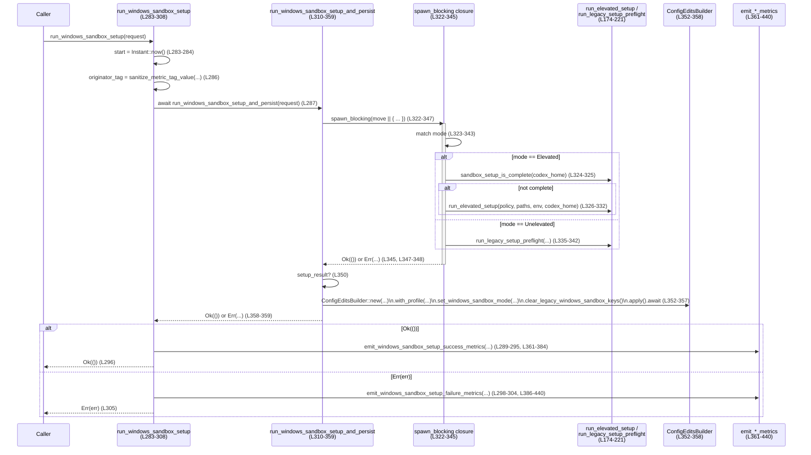

# core/src/windows_sandbox.rs

## 0. ざっくり一言

Windows サンドボックス機能の「レベル決定」「設定ファイルとの連携」「OS 依存セットアップ実行」「メトリクス送信」をまとめて扱うユーティリティモジュールです（`core/src/windows_sandbox.rs:L19-451`）。

---

## 1. このモジュールの役割

### 1.1 概要

- このモジュールは **Windows サンドボックス機能の有効/無効やレベル（Elevated / Unelevated / Disabled）を決定し、そのセットアップを実行して結果を永続化する** ために存在します（`L25-48, L59-76, L266-359`）。
- TOML ベースの設定 (`ConfigToml`, `ConfigProfile`) や `FeaturesToml` からサンドボックスモードを解決し、レガシーな feature フラグとの互換性も維持します（`L59-76, L91-130`）。
- 実際のサンドボックス環境構築は別クレート `codex_windows_sandbox` に委譲し、このモジュールは **橋渡しとオーケストレーション（非同期/同期の切り分け、メトリクス送信、設定更新）** を担います（`L132-135, L174-193, L206-241, L283-359, L361-440`）。

### 1.2 アーキテクチャ内での位置づけ

主な依存関係と呼び出し方向を図示します（すべて `core/src/windows_sandbox.rs` 内の関数。行番号付き）。

```mermaid
graph TD
    WS["windows_sandbox.rs\n(run_windows_sandbox_setup L283-308)"]

    WS --> LevelCfg["WindowsSandboxLevelExt::from_config\nL31-37"]
    WS --> LevelFeat["WindowsSandboxLevelExt::from_features\nL39-48"]

    WS --> ModeResolve["resolve_windows_sandbox_mode\nL59-76"]
    WS --> PrivDesk["resolve_windows_sandbox_private_desktop\nL78-89"]

    WS --> SetupOrch["run_windows_sandbox_setup_and_persist\nL310-359"]
    SetupOrch --> WSetupCompl["sandbox_setup_is_complete\nL132-140"]
    SetupOrch --> RunElev["run_elevated_setup\nL174-203"]
    SetupOrch --> RunLegacy["run_legacy_setup_preflight\nL206-221, L243-251"]

    SetupOrch --> CfgEdit["ConfigEditsBuilder::new(...)\nL352-358"]

    WS --> MetricsSucc["emit_windows_sandbox_setup_success_metrics\nL361-384"]
    WS --> MetricsFail["emit_windows_sandbox_setup_failure_metrics\nL386-440"]

    WS --> ExtCfg["Config / ConfigToml / ConfigProfile\n(imports L1-5)"]
    WS --> ExtFeat["Features / FeaturesToml\n(imports L6-8)"]
    WS --> ExtOtel["codex_otel metrics\nL361-440"]
    WS --> ExtWin["codex_windows_sandbox\nL132-135, L143-148, L155-167, L174-193, L206-241"]
```



位置づけ:

- **設定層との接点**  
  - `Config`, `ConfigToml`, `ConfigProfile`, `Features`, `FeaturesToml` からサンドボックスモードやプライベートデスクトップ設定を解決します（`L51-57, L59-89, L91-130`）。
- **OS 依存セットアップのオーケストレータ**  
  - `run_windows_sandbox_setup` → `run_windows_sandbox_setup_and_persist` → `sandbox_setup_is_complete` / `run_elevated_setup` / `run_legacy_setup_preflight` / `run_setup_refresh_with_extra_read_roots` の流れでセットアップを実行します（`L283-359, L132-135, L174-241`）。
- **メトリクス/テレメトリー**  
  - 成功/失敗を `codex_otel` に記録し、Windows の elevated セットアップ失敗時には詳細コード・メッセージをタグとして添付します（`L361-440`）。

### 1.3 設計上のポイント

（行番号はすべて `core/src/windows_sandbox.rs`）

- **責務の分割**
  - サンドボックスレベル決定ロジックを `WindowsSandboxLevelExt` に集約（`L25-48`）。
  - レガシー feature キー処理を `legacy_windows_sandbox_*` 系関数に分離し、新旧設定の共存を明示（`L91-130`）。
  - OS 依存処理は `#[cfg(target_os = "windows")]` / `#[cfg(not(...))]` 付きのラッパー関数に隠蔽（`L132-140, L143-152, L155-172, L174-204, L206-264`）。
- **状態管理**
  - セットアップ時の状態は `WindowsSandboxSetupRequest` 構造体で一括管理し、`run_windows_sandbox_setup` にまとめて渡す構造です（`L272-281, L283-287`）。
  - セットアップ完了後、`ConfigEditsBuilder` で `windows_sandbox_mode` を永続化し、レガシーキーをクリアすることで「設定上の状態」と「実際のセットアップ状態」を揃えています（`L352-358`）。
- **エラーハンドリング**
  - 外部 API との境界はすべて `anyhow::Result<()>` でラップし、`anyhow::bail!` や `map_err` で文脈付きエラーに変換しています（`L195-203, L243-251, L255-263, L348-359`）。
  - 非 Windows 環境で Windows 専用機能が使われた場合は、即座にエラーまたは panic することで誤用を検知します（`L169-172, L195-203, L243-251, L255-263`）。
- **並行性・非同期**
  - メインの公開 API `run_windows_sandbox_setup` は async 関数であり、内部で `tokio::task::spawn_blocking` を用いてブロッキングなセットアップ処理を別スレッドに退避しています（`L283-284, L322-347`）。
  - これにより、非同期ランタイムのコアスレッドをブロックせずに OS レベルのセットアップ処理を実行する設計になっています。
- **安全性**
  - このファイル内には `unsafe` ブロックはありません（`L1-451` を通して `unsafe` 不在）。
  - Elevation されたセットアップ失敗時のエラーコード・メッセージは専用のサニタイズ関数を通してからメトリクスタグに載せています（`L143-147`）。

---

## 2. 主要な機能一覧

- サンドボックスレベル解決: `Config` / `Features` から `WindowsSandboxLevel` を導出（`L25-48, L51-57`）。
- TOML 設定からのサンドボックスモード解決: 新旧設定（`windows.sandbox` と legacy feature フラグ）を統合（`L59-76, L91-130`）。
- プライベートデスクトップ設定解決: `windows.sandbox_private_desktop` の有無を profile / global の順に解決し、デフォルト true（`L78-89`）。
- セットアップ状態確認: Windows サンドボックスセットアップ済みかどうかの問い合わせ API（`L132-140`）。
- Elevated/レガシーセットアップ実行: Windows 専用のセットアップ手続きラッパー（`L174-204, L206-241`）。
- 追加 read-root を含めたセットアップリフレッシュ: 既存セットアップの read-only ルート更新機能（`L223-241, L255-263`）。
- 非同期セットアップオーケストレーション: `run_windows_sandbox_setup` による一括実行＋メトリクス送信＋設定永続化（`L283-359, L361-440`）。
- Elevated セットアップ失敗詳細の抽出とメトリクス名解決（`L143-167, L386-432`）。
- Elevated サンドボックス NUX の kill switch 定数提供（`L19-23`）。

---

## 3. 公開 API と詳細解説

### 3.1 型・コンポーネント一覧

#### 3.1.1 型・定数・トレイト

| 名前 | 種別 | 公開 | 役割 / 用途 | 根拠 |
|------|------|------|-------------|------|
| `ELEVATED_SANDBOX_NUX_ENABLED` | 定数 `bool` | `pub` | Elevated サンドボックス NUX を有効にする kill switch。false にすると旧 NUX 挙動に戻る（コメントより）。このファイル内では参照なし。 | `core/src/windows_sandbox.rs:L19-23` |
| `WindowsSandboxLevelExt` | トレイト | `pub` | `WindowsSandboxLevel` に対して、`Config` や `Features` からレベルを解決する拡張メソッドを提供。 | `L25-28, L30-48` |
| `WindowsSandboxSetupMode` | enum | `pub` | セットアップモードを Elevated / Unelevated の 2 種類で表現。メトリクスや設定永続化のタグにも利用。 | `L266-270, L442-446` |
| `WindowsSandboxSetupRequest` | struct | `pub` | サンドボックスセットアップを行うために必要な情報を一括で保持するリクエストオブジェクト。 | `L272-281, L283-320` |

#### 3.1.2 関数（コンポーネント）一覧

| 関数名 / メソッド名 | 公開 | OS | 役割（1行） | 根拠 |
|---------------------|------|----|------------|------|
| `WindowsSandboxLevelExt::from_config` | pub(trait) | 共通 | `Config` から `WindowsSandboxLevel` を決定（permissions.windows_sandbox_mode を優先）。 | `L31-37` |
| `WindowsSandboxLevelExt::from_features` | pub(trait) | 共通 | `Features` から `WindowsSandboxLevel` を決定（Elevated/WindowsSandbox feature の有無に基づく）。 | `L39-48` |
| `windows_sandbox_level_from_config` | `pub` | 共通 | トレイトメソッド `from_config` の薄いラッパー。 | `L51-53` |
| `windows_sandbox_level_from_features` | `pub` | 共通 | トレイトメソッド `from_features` の薄いラッパー。 | `L55-57` |
| `resolve_windows_sandbox_mode` | `pub` | 共通 | TOML 設定（profile / global）と legacy feature を組み合わせて `WindowsSandboxModeToml` を解決。 | `L59-76` |
| `resolve_windows_sandbox_private_desktop` | `pub` | 共通 | `windows.sandbox_private_desktop` を profile → global の順で解決し、未設定時は true。 | `L78-89` |
| `legacy_windows_sandbox_keys_present` | `fn` | 共通 | legacy feature キー（Elevated / WindowsSandbox / enable_experimental_windows_sandbox）が存在するか判定。 | `L91-98` |
| `legacy_windows_sandbox_mode` | `pub` | 共通 | `FeaturesToml` から legacy mode（Elevated/Unelevated）を解決。 | `L100-105` |
| `legacy_windows_sandbox_mode_from_entries` | `pub` | 共通 | `BTreeMap<String, bool>` のエントリから legacy mode を解決。 | `L107-130` |
| `sandbox_setup_is_complete` | `pub` | Windows | `codex_home` 以下のセットアップが完了しているか `codex_windows_sandbox` に委譲。 | `L132-135` |
| `sandbox_setup_is_complete` | `pub` | 非Windows | 常に false を返すダミー実装。 | `L137-140` |
| `elevated_setup_failure_details` | `pub` | Windows | elevated セットアップ失敗からコードとメッセージを抽出し、メトリクスタグ向けにサニタイズ。 | `L143-148` |
| `elevated_setup_failure_details` | `pub` | 非Windows | 常に `None`。 | `L150-152` |
| `elevated_setup_failure_metric_name` | `pub` | Windows | エラーの種類に応じて失敗メトリクス名（キャンセルか一般失敗か）を返す。 | `L155-167` |
| `elevated_setup_failure_metric_name` | `pub` | 非Windows | 呼び出されると panic するガード実装。 | `L169-172` |
| `run_elevated_setup` | `pub` | Windows | elevated サンドボックスセットアップを `codex_windows_sandbox::run_elevated_setup` に委譲。 | `L174-193` |
| `run_elevated_setup` | `pub` | 非Windows | 「Windows のみ対応」というエラーで失敗するスタブ。 | `L195-203` |
| `run_legacy_setup_preflight` | `pub` | Windows | legacy サンドボックスの事前チェック処理を呼び出す。 | `L206-221` |
| `run_legacy_setup_preflight` | `pub` | 非Windows | 「Windows のみ対応」というエラーで失敗するスタブ。 | `L243-251` |
| `run_setup_refresh_with_extra_read_roots` | `pub` | Windows | 追加 read root を含めてサンドボックスセットアップをリフレッシュ。 | `L223-241` |
| `run_setup_refresh_with_extra_read_roots` | `pub` | 非Windows | 「Windows のみ対応」というエラーで失敗するスタブ。 | `L255-263` |
| `run_windows_sandbox_setup` | `pub async` | 共通 | `WindowsSandboxSetupRequest` を受け取り、セットアップを実行・結果に応じてメトリクス送信。 | `L283-308` |
| `run_windows_sandbox_setup_and_persist` | `async fn` | 共通 | 実際のセットアップ処理＋設定ファイルへの永続化を行う内部ヘルパー。 | `L310-359` |
| `emit_windows_sandbox_setup_success_metrics` | `fn` | 共通 | セットアップ成功時のメトリクス（duration, counter）を送信。 | `L361-384` |
| `emit_windows_sandbox_setup_failure_metrics` | `fn` | 共通 | セットアップ失敗時のメトリクスを送信し、Elevated 失敗時は詳細タグも添付。 | `L386-440` |
| `windows_sandbox_setup_mode_tag` | `fn` | 共通 | `WindowsSandboxSetupMode` を `"elevated"` / `"unelevated"` の文字列タグに変換。 | `L442-446` |

---

### 3.2 重要関数の詳細

#### 3.2.1 `WindowsSandboxLevelExt::from_config(config: &Config) -> WindowsSandboxLevel`

**概要**

`Config.permissions.windows_sandbox_mode` と `Config.features` から、実行時の `WindowsSandboxLevel`（Disabled / RestrictedToken / Elevated）を決定します（`L31-37`）。

**引数**

| 引数名 | 型 | 説明 |
|--------|----|------|
| `config` | `&Config` | アプリケーション全体の実効設定。`permissions.windows_sandbox_mode` および `features` を参照します。 |

**戻り値**

- `WindowsSandboxLevel`: 実際にサンドボックスをどのレベルで動かすかを表す列挙体（定義は別クレート `codex_protocol::config_types`。このチャンクには定義なし）。

**内部処理の流れ**

1. `config.permissions.windows_sandbox_mode` を `match` で分岐（`L32`）。
2. `Some(Elevated)` → `WindowsSandboxLevel::Elevated`（`L33`）。
3. `Some(Unelevated)` → `WindowsSandboxLevel::RestrictedToken`（`L34`）。
4. `None` の場合のみ `Self::from_features(&config.features)` にフォールバック（`L35`）。

**Examples（使用例・擬似コード）**

```rust
// Config から WindowsSandboxLevel を決定する例
fn decide_level_from_config(config: &Config) -> WindowsSandboxLevel {
    // permissions.windows_sandbox_mode が設定されていればそれを優先し、
    // なければ feature フラグから判定します。
    WindowsSandboxLevel::from_config(config) // core/src/windows_sandbox.rs:L31-37
}
```

**Errors / Panics**

- この関数自体は `Result` ではなく、エラーや panic を発生させるコードも見当たりません（`L31-37`）。
- 無効な値は enum には存在しないため、型システム側で不整合を防いでいます（定義は別ファイル）。

**Edge cases（エッジケース）**

- `permissions.windows_sandbox_mode == None`  
  → features ベースの判定にフォールバックします（`L35`）。
- `permissions.windows_sandbox_mode` が `Some(…)` の場合、`features` は無視されます。

**使用上の注意点**

- **設定優先度**: `permissions.windows_sandbox_mode` が最優先であり、features で Elevated を有効にしていても、明示的な `Unelevated` 設定があれば RestrictedToken になります（`L32-35`）。
- 実際のサンドボックス挙動は `WindowsSandboxLevel` を解釈する他コンポーネントに依存します。このファイルから詳細は分かりません。

---

#### 3.2.2 `WindowsSandboxLevelExt::from_features(features: &Features) -> WindowsSandboxLevel`

**概要**

`Features` に含まれる feature フラグから Windows サンドボックスレベルを判定します（`L39-48`）。

**引数**

| 引数名 | 型 | 説明 |
|--------|----|------|
| `features` | `&Features` | 有効な feature フラグ集合。`enabled(Feature::WindowsSandboxElevated)` などを参照。 |

**戻り値**

- `WindowsSandboxLevel`: `Elevated` / `RestrictedToken` / `Disabled` のいずれか。

**内部処理の流れ**

1. `features.enabled(Feature::WindowsSandboxElevated)` が true なら `Elevated` を返す（`L40-41`）。
2. そうでなければ `features.enabled(Feature::WindowsSandbox)` をチェック（`L43`）。
3. true なら `RestrictedToken`, false なら `Disabled` を返す（`L44-47`）。

**Edge cases**

- 複数フラグが有効化されている場合でも、`WindowsSandboxElevated` が最優先です（`L40-41`）。
- どちらの feature も有効でないときに `Disabled` になります（`L45-47`）。

**使用上の注意点**

- この判定ロジックを変更すると、既存の feature 設定との互換性に影響します。
- `Features::enabled` の実装はこのファイルにはないため、フラグ名の一致などは別実装に依存します。

---

#### 3.2.3 `resolve_windows_sandbox_mode(cfg: &ConfigToml, profile: &ConfigProfile) -> Option<WindowsSandboxModeToml>`

**概要**

TOML 設定（グローバル `ConfigToml` と `ConfigProfile`）および legacy feature フラグから、**設定ファイル上でのサンドボックスモード** を解決します（`L59-76`）。

**引数**

| 引数名 | 型 | 説明 |
|--------|----|------|
| `cfg` | `&ConfigToml` | 全体設定（`windows` セクションや `features` セクションを含む）。 |
| `profile` | `&ConfigProfile` | プロファイル固有設定。`profile.windows` や `profile.features` を含む。 |

**戻り値**

- `Option<WindowsSandboxModeToml>`  
  - `Some(Elevated)` / `Some(Unelevated)` / `None` のいずれか。

**内部処理の流れ**

1. まず `legacy_windows_sandbox_mode(profile.features.as_ref())` を試し、`Some(mode)` ならそれを返して終了（`L63-64`）。
2. 次に `legacy_windows_sandbox_keys_present(profile.features.as_ref())` が true であれば `None` を返す（`L66-67`）。  
   → プロファイルに legacy キーが存在するが、モード決定には至らない（すべて false）場合、「明示的に legacy で無効化」とみなし、他設定へのフォールバックは行わない。
3. 上記に該当しない場合:
   1. `profile.windows.as_ref().and_then(|w| w.sandbox)` を試す（`L70-73`）。
   2. なければ `cfg.windows.as_ref().and_then(|w| w.sandbox)` を試す（`L74`）。
   3. それもなければ `legacy_windows_sandbox_mode(cfg.features.as_ref())` を最後のフォールバックとする（`L75`）。

**Examples（使用例・擬似コード）**

```rust
fn effective_mode(cfg: &ConfigToml, profile: &ConfigProfile) -> WindowsSandboxModeToml {
    // プロファイルの legacy feature がモードを決めていればそれを使い、
    // そうでなければ profile.windows.sandbox → cfg.windows.sandbox → cfg.features の順にフォールバック。
    resolve_windows_sandbox_mode(cfg, profile)
        .unwrap_or(WindowsSandboxModeToml::Unelevated) // デフォルトは呼び出し側ポリシーで決定
}
```

**Errors / Panics**

- この関数自体は panic もエラーも返しません（`L59-76`）。

**Edge cases**

- プロファイル側に legacy キーが「存在するが、全て false」の場合  
  - `legacy_windows_sandbox_mode` は `None` を返しますが、`legacy_windows_sandbox_keys_present` は true となり、返り値は `None` になります（`L63-67, L91-98, L100-105`）。
  - そのため、global 設定にはフォールバックしません。
- プロファイルに何もなく、global でも `windows.sandbox` が未設定の場合  
  - `legacy_windows_sandbox_mode(cfg.features.as_ref())` の結果がそのまま戻ります（`L75`）。

**使用上の注意点**

- **優先順序**: 「profile の legacy feature」>「profile.windows.sandbox」>「cfg.windows.sandbox」>「cfg の legacy feature」の順で解決されます。
- 設定の移行（legacy feature から `windows.sandbox` へ移る）時は、この優先順位を踏まえて新旧設定を調整する必要があります。

---

#### 3.2.4 `resolve_windows_sandbox_private_desktop(cfg: &ConfigToml, profile: &ConfigProfile) -> bool`

**概要**

サンドボックスでプライベートデスクトップを使用するかどうかを、profile → global の順に解決し、どちらにも設定されていない場合は **true（有効）** を返します（`L78-89`）。

**内部処理**

1. `profile.windows.as_ref().and_then(|w| w.sandbox_private_desktop)` を試す（`L79-82`）。
2. なければ `cfg.windows.as_ref().and_then(|w| w.sandbox_private_desktop)` を試す（`L83-87`）。
3. 最後に `unwrap_or(true)` でデフォルト true を適用（`L88`）。

**Edge cases**

- どちらにも設定がない環境では常に true になるため、「明示的に無効にしたい場合」はいずれかに false を書く必要があります。

**使用上の注意点**

- 意図せず常に true になることを避けるため、GUI や CLI で「未設定 / 明示的 false」の違いを意識した UI が必要になる可能性がありますが、このファイルからは UI 実装は分かりません。

---

#### 3.2.5 `pub async fn run_windows_sandbox_setup(request: WindowsSandboxSetupRequest) -> anyhow::Result<()>`

**概要**

サンドボックスセットアップのフロントエンド API です。非同期コンテキストから呼び出し、内部でブロッキングなセットアップ処理を実行し、その成否をメトリクスに記録します（`L283-308`）。

**引数**

| 引数名 | 型 | 説明 |
|--------|----|------|
| `request` | `WindowsSandboxSetupRequest` | セットアップに必要な情報（モード、ポリシー、作業ディレクトリ、環境変数、`codex_home`、アクティブプロファイル）を保持。 |

**戻り値**

- `anyhow::Result<()>`  
  - 成功時: `Ok(())`  
  - 失敗時: セットアップの失敗理由を含む `anyhow::Error`。

**内部処理の流れ**

1. 現在時刻を取得（`Instant::now()`）し、計測開始（`L283-284`）。
2. `mode = request.mode` を取り出す（`L285`）。
3. `originator()` から originator 情報を取得し、`sanitize_metric_tag_value` でメトリクスタグ向けにサニタイズ（`L286`）。
4. `run_windows_sandbox_setup_and_persist(request).await` を呼び出し、結果を `result` に格納（`L287`）。
5. `match result` で分岐:
   - `Ok(())` の場合: 成功メトリクスを送信 (`emit_windows_sandbox_setup_success_metrics`) し、そのまま `Ok(())` を返す（`L289-297`）。
   - `Err(err)` の場合: 失敗メトリクスを送信 (`emit_windows_sandbox_setup_failure_metrics`) し、そのまま `Err(err)` を返す（`L298-306`）。

**Examples（使用例）**

```rust
// tokio ランタイム上での典型的な呼び出し例
#[tokio::main]
async fn main() -> anyhow::Result<()> {
    // SandboxPolicy やその他の依存は別モジュールで定義されている前提
    let policy: SandboxPolicy = /* ... */;              // サンドボックスのポリシー
    let request = WindowsSandboxSetupRequest {          // core/src/windows_sandbox.rs:L272-281
        mode: WindowsSandboxSetupMode::Elevated,       // Elevated または Unelevated
        policy,
        policy_cwd: std::env::current_dir()?,          // ポリシーファイルの基準ディレクトリ
        command_cwd: std::env::current_dir()?,         // コマンド実行ディレクトリ
        env_map: std::env::vars().collect(),           // 環境変数マップ
        codex_home: /* Codex のホームディレクトリ */.into(),
        active_profile: Some("default".to_string()),
    };

    // 非同期にセットアップを実行
    run_windows_sandbox_setup(request).await?;          // core/src/windows_sandbox.rs:L283-308
    Ok(())
}
```

**Errors / Panics**

- `run_windows_sandbox_setup_and_persist` からの `Err(anyhow::Error)` がそのまま返されます（`L298-306`）。
- この関数自体は panic を呼び出しません。
- メトリクス送信中に発生しうるエラーは無視（`let _ = metrics...`）しており、結果には影響しません（`L370-383, L396-408`）。

**Edge cases**

- `codex_otel::global()` が `None` の環境では、成功/失敗に関わらずメトリクスは送信されません（`L366-368, L392-394`）。
- `originator()` や `sanitize_metric_tag_value` が内部でどのような制約を持つかはこのファイルからは不明です。

**使用上の注意点（並行性 / 安全性）**

- `async fn` なので、tokio などの非同期ランタイム内で `.await` する必要があります（`L283`）。
- 内部で `spawn_blocking` を使用しているため、ブロッキング I/O を安全に扱えますが、過度に頻繁に呼び出すとスレッドプール負荷が高くなる可能性があります（`L322-347`）。
- 戻り値が `Result` なので、呼び出し側で必ずエラーを処理する必要があります。特に非 Windows 環境で Windows 専用モードを指定した場合、内部のラッパーが `anyhow::bail!` によりエラーを返します（`L195-203, L243-251, L255-263`）。

---

#### 3.2.6 `async fn run_windows_sandbox_setup_and_persist(request: WindowsSandboxSetupRequest) -> anyhow::Result<()>`

**概要**

`run_windows_sandbox_setup` からのみ呼ばれる内部関数で、実際のセットアップ処理（Windows / 非 Windows 両対応）を `spawn_blocking` で実行し、その後設定ファイルに選択されたモードを永続化します（`L310-359`）。

**内部処理の流れ**

1. `request` から各フィールドを move で取り出しローカル変数に保存（`L313-320`）。
2. `setup_codex_home` として `codex_home.clone()` を用意（`L320`）。
3. `tokio::task::spawn_blocking(move || -> anyhow::Result<()> { ... })` でブロッキングタスクを起動（`L322-347`）。
   - クロージャ内部:
     - `match mode` で分岐（`L323`）。
     - `Elevated`:
       - `sandbox_setup_is_complete(setup_codex_home.as_path())` が false の場合のみ `run_elevated_setup(...)` を実行（`L324-333`）。
     - `Unelevated`:
       - 常に `run_legacy_setup_preflight(...)` を実行（`L335-342`）。
     - 成功時 `Ok(())` を返す（`L345`）。
4. `spawn_blocking` の `JoinHandle` を `.await` し、join 失敗時には `"windows sandbox setup task failed: {join_err}"` というメッセージ付きで `anyhow::Error` に変換（`L347-348`）。
5. `setup_result?;` でブロッキングタスク内の結果を伝搬（`L350`）。
6. `ConfigEditsBuilder::new(codex_home.as_path())` から設定編集チェーンを構築し:
   - `.with_profile(active_profile.as_deref())`
   - `.set_windows_sandbox_mode(windows_sandbox_setup_mode_tag(mode))`
   - `.clear_legacy_windows_sandbox_keys()`
   - `.apply().await`
   を実行（`L352-357`）。
7. `.map_err` で永続化失敗を `"failed to persist windows sandbox mode: {err}"` というメッセージ付き `anyhow::Error` に変換（`L358`）。

**並行性に関する注意**

- `spawn_blocking` に move クロージャを渡しているため、`mode`, `policy`, `policy_cwd`, `command_cwd`, `env_map`, `setup_codex_home` などが `Send + 'static` である必要があります（コンパイル時にチェックされる想定）（`L322-345`）。
- クロージャは `spawn_blocking` のワーカー・スレッド上で実行されるため、内部でブロッキング I/O や OS 呼び出しを安全に行える設計になっています。

**Errors / Panics**

- ブロッキングタスク:
  - `run_elevated_setup` / `run_legacy_setup_preflight` が `Err` を返した場合、そのまま `.await` の後の `setup_result?` で伝搬（`L350`）。
  - 非 Windows 環境でこれらを呼ぶと、内部の `anyhow::bail!` によりエラーになります（`L195-203, L243-251`）。
- `spawn_blocking` の join エラー（パニックやキャンセル）は `anyhow::anyhow!` によりラップされます（`L347-348`）。
- 設定永続化の `apply().await` が失敗すると、 `"failed to persist windows sandbox mode: {err}"` のメッセージで `Err` を返します（`L352-359`）。
- panic は明示的には発生させていません。

**Edge cases**

- Elevated モードで `sandbox_setup_is_complete` が true の場合、`run_elevated_setup` は呼ばれず、何もせずに成功扱いになります（`L324-333`）。
- Unelevated モードでは `sandbox_setup_is_complete` のチェックは行われず、毎回 `run_legacy_setup_preflight` が実行されます（`L335-342`）。
- 非 Windows 環境で Elevated/Unelevated を指定すると、ブロッキングタスク内のラッパーがエラーを返し、そのまま呼び出し側に伝搬します。

**使用上の注意点**

- 直接呼び出すのではなく、公開 API である `run_windows_sandbox_setup` 経由の利用が前提になっています（メトリクス送信のため）（`L283-308`）。
- 設定永続化が失敗した場合、サンドボックスセットアップ自体が成功していても `Err` になります。呼び出し側は「セットアップ済みだが設定ファイルは古い可能性」を考慮する必要があります。

---

#### 3.2.7 `pub fn run_elevated_setup(...) -> anyhow::Result<()>`（および非 Windows 版）

**シグネチャ**

```rust
#[cfg(target_os = "windows")]
pub fn run_elevated_setup(
    policy: &SandboxPolicy,
    policy_cwd: &Path,
    command_cwd: &Path,
    env_map: &HashMap<String, String>,
    codex_home: &Path,
) -> anyhow::Result<()> { ... } // L174-193

#[cfg(not(target_os = "windows"))]
pub fn run_elevated_setup(...) -> anyhow::Result<()> { ... } // L195-203
```

**概要**

Windows 上では `codex_windows_sandbox::run_elevated_setup` を呼び出す薄いラッパーです。非 Windows 上では「Windows のみ対応」というエラーを返します（`L174-193, L195-203`）。

**引数**

| 引数名 | 型 | 説明 |
|--------|----|------|
| `policy` | `&SandboxPolicy` | サンドボックスのポリシー定義。 |
| `policy_cwd` | `&Path` | ポリシー解決のカレントディレクトリ。 |
| `command_cwd` | `&Path` | サンドボックス内で実行するコマンドのカレントディレクトリ。 |
| `env_map` | `&HashMap<String, String>` | サンドボックス内に引き渡す環境変数マップ。 |
| `codex_home` | `&Path` | Codex のホームディレクトリ。 |

**戻り値**

- Windows: Elevated セットアップが成功すれば `Ok(())`、失敗すれば `Err(anyhow::Error)`（`L181-193`）。
- 非 Windows: 常に `Err(anyhow::Error)` で `"elevated Windows sandbox setup is only supported on Windows"` というメッセージ（`L195-203`）。

**内部処理の流れ（Windows）**

1. `codex_windows_sandbox::SandboxSetupRequest` を構築（`L183-190`）。
   - `proxy_enforced: false` に固定されている点が仕様です。
2. `codex_windows_sandbox::run_elevated_setup` にリクエストと `SetupRootOverrides::default()` を渡してそのまま返します（`L181-193`）。

**Errors / Panics**

- 非 Windows 版のみ `anyhow::bail!` を使用してエラーを返します（`L195-203`）。
- panic はありません。

**使用上の注意点**

- この関数は OS による分岐を `#[cfg]` で行っているため、呼び出し側は OS を意識せず同じシグネチャで利用できます（ただし非 Windows では常にエラー）。
- 高レベル API `run_windows_sandbox_setup` の内部から呼び出されており、通常は直接呼び出す必要はありません（`L326-332`）。

---

#### 3.2.8 `fn emit_windows_sandbox_setup_failure_metrics(...)`

**概要**

セットアップ失敗時のメトリクスを送信し、Elevated モードの場合は Windows 専用の追加メトリクス（失敗コード・メッセージ付き）も送信します（`L386-440`）。

**引数**

| 引数名 | 型 | 説明 |
|--------|----|------|
| `mode` | `WindowsSandboxSetupMode` | セットアップモード（Elevated / Unelevated）。 |
| `originator_tag` | `&str` | 呼び出し元識別子（サニタイズ済み）。 |
| `duration` | `std::time::Duration` | セットアップにかかった時間。 |
| `_err` | `&anyhow::Error` | 失敗の原因となったエラー。Elevated の詳細メトリクス生成に使用。 |

**内部処理の流れ**

1. `codex_otel::global()` からメトリクスハンドルを取得。`None` なら何もせず return（`L392-394`）。
2. `mode_tag = windows_sandbox_setup_mode_tag(mode)` でモード文字列を取得（`L395, L442-446`）。
3. 共通の duration メトリクスと failure カウンタを送信（`L396-408`）。
4. `if matches!(mode, WindowsSandboxSetupMode::Elevated)` で Elevated の場合の分岐（`L411`）。
   - Windows のみコンパイルされるブロック内（`#[cfg(target_os = "windows")]`、`L412-432`）で:
     1. `failure_tags` を `("originator", originator_tag)` から開始（`L414`）。
     2. `elevated_setup_failure_details(_err)` でエラーコードとメッセージを取得（`L417`）。
     3. 存在すれば `"code"` / `"message"` タグとして `failure_tags` に追加（`L421-425`）。
     4. `elevated_setup_failure_metric_name(_err)` でメトリクス名を決定し、カウンタをインクリメント（`L427-431`）。
5. Unelevated の場合は `"codex.windows_sandbox.legacy_setup_preflight_failed"` カウンタをインクリメント（`L433-438`）。

**Errors / Panics**

- メトリクス送信時のエラーは無視されます（`let _ = ...`、`L396-408, L427-431, L434-438`）。
- 非 Windows 環境では、Elevated 分岐の Windows ブロックがコンパイルされないため `elevated_setup_failure_metric_name` の非 Windows 版（panic 実装）は呼び出されません（`L169-172` と `L411-432` の組み合わせ）。

**Edge cases**

- メトリクスバックエンドが未初期化 (`codex_otel::global() == None`) の場合、何も送信されません（`L392-394`）。
- Elevated だが `elevated_setup_failure_details(_err)` が `None` を返す場合、`"code"` / `"message"` タグは付与されません（`L417-425`）。

**使用上の注意点（セキュリティ）**

- `elevated_setup_failure_details` 内でメッセージを `sanitize_setup_metric_tag_value` に通しており、メトリクスに含めるエラーメッセージがサニタイズされています（`L143-147`）。  
  → 詳細なサニタイズポリシーは `codex_windows_sandbox` 側に依存し、このチャンクからは分かりません。
- エラーオブジェクト `_err` 自体はここではログなどには使用されていません（`L390-391`）。

---

### 3.3 その他の関数

説明を簡略化した補助的関数の一覧です。

| 関数名 | 役割（1行） | 根拠 |
|--------|-------------|------|
| `windows_sandbox_level_from_config` | `WindowsSandboxLevel::from_config` への薄いラッパー。 | `L51-53` |
| `windows_sandbox_level_from_features` | `WindowsSandboxLevel::from_features` への薄いラッパー。 | `L55-57` |
| `legacy_windows_sandbox_keys_present` | legacy feature キーが存在するかどうかのみを判定。 | `L91-98` |
| `legacy_windows_sandbox_mode` | `FeaturesToml` から entries を取り出して `legacy_windows_sandbox_mode_from_entries` に渡す。 | `L100-105` |
| `legacy_windows_sandbox_mode_from_entries` | entries map から Elevated / Unelevated / None を判定。 | `L107-130` |
| `sandbox_setup_is_complete` (両 OS 版) | セットアップ済みかどうかを問い合わせる or 常に false を返す。 | `L132-140` |
| `elevated_setup_failure_details` (両 OS 版) | Elevated セットアップ失敗からコード・メッセージを抽出する or 常に None。 | `L143-152` |
| `elevated_setup_failure_metric_name` (両 OS 版) | エラー内容に応じたメトリクス名を返す or 非 Windows で panic。 | `L155-167, L169-172` |
| `run_legacy_setup_preflight` (両 OS 版) | legacy サンドボックスセットアップ事前チェックのラッパー or 非 Windows でエラー。 | `L206-221, L243-251` |
| `run_setup_refresh_with_extra_read_roots` (両 OS 版) | 追加 read root を含むセットアップリフレッシュのラッパー or 非 Windows でエラー。 | `L223-241, L255-263` |
| `emit_windows_sandbox_setup_success_metrics` | 成功時の duration と success カウンタを送信。 | `L361-384` |
| `windows_sandbox_setup_mode_tag` | `WindowsSandboxSetupMode` を `"elevated"` / `"unelevated"` に変換。 | `L442-446` |

---

## 4. データフロー

ここでは `run_windows_sandbox_setup` を起点とし、Elevated モードで Windows サンドボックスをセットアップする典型フローを示します。

### 4.1 処理の要点

1. 呼び出し側が `WindowsSandboxSetupRequest` を構築し、`run_windows_sandbox_setup` を `await` する（`L272-281, L283-287`）。
2. 関数内部で計測用タイムスタンプと originator タグを取得し、`run_windows_sandbox_setup_and_persist` を実行（`L283-287`）。
3. `run_windows_sandbox_setup_and_persist` 内で `spawn_blocking` によりブロッキングなセットアップ処理を別スレッドに退避し、Elevated モードなら `sandbox_setup_is_complete` → `run_elevated_setup` の順に実行（`L322-345`）。
4. セットアップ成功後、`ConfigEditsBuilder` でモードを永続化し、legacy キーをクリア（`L352-358`）。
5. 呼び出し元に戻ってから、成功/失敗に応じてメトリクスが送信される（`L289-307, L361-440`）。

### 4.2 シーケンス図



---

## 5. 使い方（How to Use）

### 5.1 基本的な使用方法

#### 5.1.1 サンドボックスレベルの決定

```rust
// Config から Windows サンドボックスレベルを取得する例
fn get_windows_sandbox_level(config: &Config) -> WindowsSandboxLevel {
    // WindowsSandboxLevelExt トレイトの from_config をラップする関数を利用
    // core/src/windows_sandbox.rs:L51-53
    windows_sandbox_level_from_config(config)
}
```

#### 5.1.2 非同期セットアップの実行

```rust
use std::collections::HashMap;
use std::path::PathBuf;

// tokio ランタイム上で、サンドボックスセットアップを実行する例
#[tokio::main]
async fn main() -> anyhow::Result<()> {
    // SandboxPolicy の具体的な生成方法はこのチャンクにはありません。
    // ここではプレースホルダとします。
    let policy: SandboxPolicy = /* ... ポリシー構築 ... */;

    // WindowsSandboxSetupRequest を組み立てる（L272-281）
    let request = WindowsSandboxSetupRequest {
        mode: WindowsSandboxSetupMode::Elevated,              // Elevated または Unelevated
        policy,
        policy_cwd: PathBuf::from("C:/path/to/policy"),       // ポリシーのカレントディレクトリ
        command_cwd: PathBuf::from("C:/path/to/command"),     // コマンドのカレントディレクトリ
        env_map: HashMap::new(),                              // 必要に応じて環境変数を設定
        codex_home: PathBuf::from("C:/Users/me/.codex"),      // Codex のホームディレクトリ
        active_profile: Some("default".to_string()),          // アクティブなプロファイル名
    };

    // 非同期にセットアップを実行（L283-308）
    run_windows_sandbox_setup(request).await?;                 

    Ok(())
}
```

### 5.2 よくある使用パターン

1. **起動時に一度だけセットアップを行う**
   - アプリケーション起動時に `resolve_windows_sandbox_mode` でモードを決定し、その結果に応じて `WindowsSandboxSetupMode` を選び、`run_windows_sandbox_setup` を 1 回だけ呼び出すパターンです（`L59-76, L266-281, L283-308`）。
2. **設定変更時のみ再セットアップ**
   - 設定ファイル変更検知後に再度 `run_windows_sandbox_setup` を実行する。ただし Elevated モードでは `sandbox_setup_is_complete` により二重セットアップが避けられます（`L324-333`）。
3. **read root だけを更新する**
   - Windows で既にセットアップ済みの場合に、`run_setup_refresh_with_extra_read_roots` を利用して read-only root を追加するパターン（`L223-241`）。  
     （この関数は `run_windows_sandbox_setup` からは直接使われていません。）

### 5.3 よくある間違い

```rust
// 間違い例: 非 Windows 環境で run_elevated_setup を直接呼び出す
fn bad_non_windows_usage(
    policy: &SandboxPolicy,
    policy_cwd: &Path,
    command_cwd: &Path,
    env_map: &HashMap<String, String>,
    codex_home: &Path,
) {
    // 非 Windows 版は anyhow::bail! でエラーになる（L195-203）
    let _ = run_elevated_setup(policy, policy_cwd, command_cwd, env_map, codex_home);
}

// 正しい例: OS を意識せず run_windows_sandbox_setup を使う
async fn good_usage(request: WindowsSandboxSetupRequest) -> anyhow::Result<()> {
    // 内部で OS に応じたラッパーが呼ばれ、非 Windows なら適切なエラーが返る
    run_windows_sandbox_setup(request).await               // L283-308
}
```

### 5.4 使用上の注意点（まとめ）

- **OS サポート**
  - `run_elevated_setup`, `run_legacy_setup_preflight`, `run_setup_refresh_with_extra_read_roots` には Windows 版と非 Windows 版があり、非 Windows 版は `anyhow::bail!` でエラーを返します（`L195-203, L243-251, L255-263`）。
  - `elevated_setup_failure_metric_name` は非 Windows では panic を起こす実装ですが、現在のコードでは Windows 専用ブロック内からのみ呼ばれます（`L169-172, L411-432`）。
- **並行性**
  - ブロッキングな OS レベル処理は `spawn_blocking` で別スレッドに逃がされており、非同期ランタイムの反応性を保つ設計です（`L322-347`）。
  - 高頻度に `run_windows_sandbox_setup` を呼ぶと、`spawn_blocking` のワーカーが増え、スレッドプールの負荷が高まる可能性があります。
- **エラー処理**
  - `run_windows_sandbox_setup` / `run_windows_sandbox_setup_and_persist` は `anyhow::Result<()>` でエラーを返すため、呼び出し側で確実に `Result` を処理する必要があります（`L283-308, L310-359`）。
  - 設定永続化失敗は `"failed to persist windows sandbox mode: ..."` というメッセージで区別できるようになっています（`L358`）。
- **設定の一貫性**
  - Elevated モードで `sandbox_setup_is_complete` が true の場合、実際にはセットアップを行わず、設定だけを上書きすることはありません（`L324-333`）。
  - Legacy feature キーが存在する場合の優先度と挙動を把握しておく必要があります（`L59-76, L91-130`）。
- **セキュリティ**
  - Elevated セットアップ関連のエラー情報は `sanitize_setup_metric_tag_value` を通してメトリクスに載せられるため、エラーメッセージ中の機微情報の扱いはサニタイズ関数に依存します（`L143-147`）。
  - `WindowsSandboxSetupMode::Elevated` は名前から昇格された権限の利用を示唆しますが、実際にどの権限がどのように使われるかは `codex_windows_sandbox` の実装に依存し、このチャンクからは分かりません。

---

## 6. 変更の仕方（How to Modify）

### 6.1 新しい機能を追加する場合

例として、新しいサンドボックスセットアップモード（例: `Isolated`）を追加するケースを考えます。ここでは「どう変更すべき場所か」を示すだけで、具体的な設計意図はこのチャンクからは分かりません。

1. **モード enum の拡張**
   - `WindowsSandboxSetupMode` に新しいバリアントを追加（`L266-270`）。
2. **タグ変換の更新**
   - `windows_sandbox_setup_mode_tag` に新バリアントへのマッピングを追加（`L442-446`）。
3. **セットアップ本体の分岐追加**
   - `run_windows_sandbox_setup_and_persist` の `match mode` に新バリアントのブランチを追加し、適切なラッパー関数（新規または既存）を呼び出す（`L323-343`）。
4. **メトリクス**
   - `emit_windows_sandbox_setup_success_metrics` / `emit_windows_sandbox_setup_failure_metrics` は `mode_tag` をタグとして使用しているため、そのまま新しいモードもタグとしてメトリクスに現れます（`L369-383, L395-408`）。
5. **Config 永続化**
   - `ConfigEditsBuilder::set_windows_sandbox_mode` が期待する値との整合性を確認する必要があります（`L352-358`）。具体的な受け入れ値はこのチャンクからは分かりません。

### 6.2 既存の機能を変更する場合

- **サンドボックスレベル決定ロジックを変更する場合**
  - `WindowsSandboxLevelExt::from_config` / `from_features` の判定ロジック（`L31-48`）を変更する際は、既存の設定ファイルや feature フラグとの互換性に注意する必要があります。
  - 外部から直接呼ばれている `windows_sandbox_level_from_config` / `windows_sandbox_level_from_features` の挙動も変わるため、影響範囲を grep などで確認することが推奨されます。
- **legacy 設定の扱いを変更する場合**
  - `legacy_windows_sandbox_mode_from_entries` の条件分岐（`L107-129`）や `legacy_windows_sandbox_keys_present`（`L91-98`）を変更することで、新旧設定の優先度や意味が変わります。
  - `resolve_windows_sandbox_mode` のフォールバック順序も合わせて確認する必要があります（`L59-76`）。
- **メトリクス仕様の変更**
  - メトリクス名・タグを変更する場合は `emit_windows_sandbox_setup_success_metrics` / `emit_windows_sandbox_setup_failure_metrics`（`L361-440`）を確認します。
  - Elevated セットアップ失敗時の詳細メトリクス（コード・メッセージ）を削除/追加する場合、`elevated_setup_failure_details` および `elevated_setup_failure_metric_name` との連携も確認が必要です（`L143-167, L386-432`）。
- **テスト**
  - テストコードは `#[path = "windows_sandbox_tests.rs"] mod tests;` で別ファイルとして存在しますが、このチャンクには内容がありません（`L449-451`）。  
    変更時はこのテストファイル内のテストケースを更新する必要があります。

---

## 7. 関連ファイル

このモジュールと密接に関係するファイル・クレートを、インポートや型名から推測できる範囲で列挙します（実際の実装内容はこのチャンクにはありません）。

| パス / クレート | 役割 / 関係 | 根拠 |
|-----------------|------------|------|
| `crate::config::Config` | 実行時設定オブジェクト。`WindowsSandboxLevelExt::from_config` などで使用。内部構造は不明。 | `L1, L31-37, L51-53` |
| `crate::config::edit::ConfigEditsBuilder` | 設定ファイルへの編集・永続化を行うビルダー。サンドボックスモードの保存と legacy キークリアに使用。 | `L2, L352-358` |
| `codex_config::config_toml::ConfigToml` | TOML ベースのグローバル設定。`resolve_windows_sandbox_mode` / `resolve_windows_sandbox_private_desktop` で使用。 | `L3, L59-76, L78-89` |
| `codex_config::profile_toml::ConfigProfile` | プロファイル単位の TOML 設定。上記関数で profile 側の設定を読み取るために使用。 | `L4, L59-76, L78-89` |
| `codex_config::types::WindowsSandboxModeToml` | 設定ファイル上でのサンドボックスモード型。Elevated / Unelevated などを表す。 | `L5, L32-35, L59-76, L100-130` |
| `codex_features::{Feature, Features, FeaturesToml}` | feature フラグ定義と実行時の有効フラグ集合、および TOML 上の feature マップ。レベル判定と legacy モード判定に利用。 | `L6-8, L39-48, L91-105` |
| `codex_login::default_client::originator` | 呼び出し元の識別情報を取得する関数。メトリクスタグ `originator` として使用。実装は不明。 | `L9, L286` |
| `codex_otel` | OpenTelemetry ベースと思われるメトリクスライブラリ。`global()` と `sanitize_metric_tag_value` を提供。 | `L10, L286, L361-408` |
| `codex_protocol::config_types::WindowsSandboxLevel` | 実行時のサンドボックスレベル enum。`WindowsSandboxLevelExt` により設定/feature から解決される。 | `L11, L25-48, L51-57` |
| `codex_protocol::protocol::SandboxPolicy` | サンドボックスポリシーの型。run_*setup 系関数の引数として使われる。 | `L12, L174-221, L272-281, L310-342` |
| `codex_windows_sandbox` クレート | Windows サンドボックス機能の実装本体。セットアップ完了判定、セットアップ実行、エラー抽出などを提供。 | `L132-135, L143-148, L155-167, L174-193, L206-241` |
| `core/src/windows_sandbox_tests.rs` | 本モジュールのテストコード。具体的なテスト内容はこのチャンクには現れません。 | `L449-451` |

---

このレポートは、`core/src/windows_sandbox.rs` のコード（`L1-451`）から読み取れる事実に基づいています。それ以外の挙動や仕様（例えば `codex_windows_sandbox` や `ConfigEditsBuilder` の詳細な実装）は、このチャンクからは分からないため記述していません。
