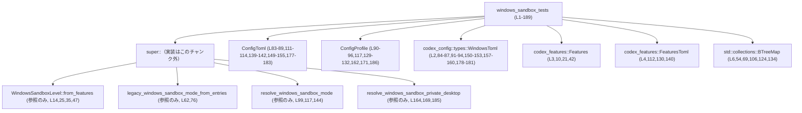
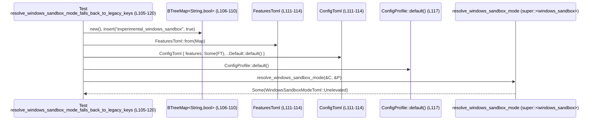
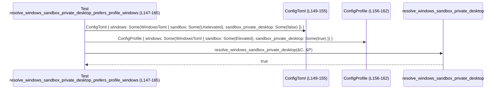

# core/src/windows_sandbox_tests.rs コード解説

## 0. ざっくり一言

Windows サンドボックス機能に関する **フラグ／設定値の解決ロジック** を検証するための単体テスト群です。  
機能フラグ（`Feature`）、古い TOML キー（レガシーキー）、`ConfigToml` / `ConfigProfile` の優先順位を確認しています（根拠: `core/src/windows_sandbox_tests.rs:L8-189`）。

---

## 1. このモジュールの役割

### 1.1 概要

- Windows サンドボックスの動作レベル（`WindowsSandboxLevel`）を、`Features` の有効フラグから決定するロジックをテストします（`WindowsSandboxLevel::from_features` の挙動）（L8-50）。
- レガシーな TOML キー群からサンドボックスモード（`WindowsSandboxModeToml`）を解決する関数 `legacy_windows_sandbox_mode_from_entries` の挙動をテストします（L53-79）。
- `ConfigToml` と `ConfigProfile` から最終的なサンドボックスモードを決定する `resolve_windows_sandbox_mode` と、`sandbox_private_desktop` の有効／無効を決定する `resolve_windows_sandbox_private_desktop` の優先順位ロジックをテストします（L81-145, L147-189）。

### 1.2 アーキテクチャ内での位置づけ

このモジュールは **テスト専用** であり、本体実装（親モジュール `super::*`）の公開 API を呼び出して検証します（L1）。  
外部クレートの設定型・機能フラグ型を利用している点も特徴です（L2-4, L6）。



> 親モジュールの具体的なファイルパスや内部実装は、このチャンクには現れません。

### 1.3 設計上のポイント

- **複数の設定ソースの優先順位テスト**  
  - `ConfigToml`（トップレベル設定）と `ConfigProfile`（プロファイル別設定）のどちらを優先するかを明示的にテストしています（L82-102, L147-165）。
- **レガシーキーと新キーの橋渡し**  
  - `"experimental_windows_sandbox"` や `"enable_experimental_windows_sandbox"` などのレガシーキーから `WindowsSandboxModeToml` へのマッピングがテストされています（L53-78, L105-120, L123-145）。
- **無効値（`None`）の扱いのテスト**  
  - プロファイルレベルでレガシーキーを `false` にすると、トップレベルで `true` にしていても最終結果が `None` になることを確認しており、**明示的な無効化** が優先される契約を示しています（L123-145）。
- **Rust の安全性・エラー・並行性の観点**
  - すべてのテストは参照渡し（`&ConfigToml`, `&ConfigProfile`, `&Features`, `&BTreeMap`）で API を呼び出しており、共有の所有権やライフタイムの問題は見られません（L14, L62, L99, L164）。
  - エラーは `Result` ではなく、`Option` や `bool` の戻り値として encode されていると読み取れます（`Some(...)` / `None` / `assert!(...)` の使用から）（L61-64, L116-120, L144, L164-188）。
  - スレッドや async は登場せず、並行性に関する情報はこのチャンクには現れません。

---

## 2. 主要な機能一覧 ＋ コンポーネントインベントリー

### 2.1 機能の概要（テスト観点）

- フィーチャーフラグから `WindowsSandboxLevel` を決定する挙動のテスト  
  - Elevated フラグ単体 / Restricted フラグ単体 / フラグなし / 両方有効時の優先順位（L8-50）。
- レガシー TOML キーから `WindowsSandboxModeToml` を決定する挙動のテスト  
  - `experimental_windows_sandbox` + `elevated_windows_sandbox` の組み合わせ、およびエイリアスキー `enable_experimental_windows_sandbox` の扱い（L53-79）。
- `ConfigToml` / `ConfigProfile` からのサンドボックスモード解決ロジックのテスト  
  - `windows.sandbox` のプロファイル優先（L81-102）。  
  - レガシーキーへのフォールバック（L105-120）。  
  - プロファイルレベルでのレガシーキー `false` によるトップレベル `true` の無効化（L123-145）。
- `sandbox_private_desktop` の解決ロジックのテスト  
  - プロファイルの `windows.sandbox_private_desktop` を優先（L147-165）。  
  - 両方未設定時は `true` デフォルト（L168-172）。  
  - Config に明示的 `false` がある場合はそれを尊重（L176-188）。

### 2.2 コンポーネント一覧（関数）

| 名前 | 種別 | 位置 | 役割 / 用途 |
|------|------|------|-------------|
| `elevated_flag_works_by_itself` | テスト関数 | `core/src/windows_sandbox_tests.rs:L8-17` | Elevated フラグ単体で `WindowsSandboxLevel::Elevated` になることを確認。 |
| `restricted_token_flag_works_by_itself` | テスト関数 | `core/src/windows_sandbox_tests.rs:L19-28` | Restricted フラグ単体で `WindowsSandboxLevel::RestrictedToken` になることを確認。 |
| `no_flags_means_no_sandbox` | テスト関数 | `core/src/windows_sandbox_tests.rs:L30-38` | どのフラグも有効でない場合に `WindowsSandboxLevel::Disabled` になることを確認。 |
| `elevated_wins_when_both_flags_are_enabled` | テスト関数 | `core/src/windows_sandbox_tests.rs:L40-50` | Elevated と Restricted 両方有効な場合に Elevated が優先されることを確認。 |
| `legacy_mode_prefers_elevated` | テスト関数 | `core/src/windows_sandbox_tests.rs:L52-65` | レガシーキー `experimental_windows_sandbox` と `elevated_windows_sandbox` の両方が `true` のとき Elevated が選ばれることを確認。 |
| `legacy_mode_supports_alias_key` | テスト関数 | `core/src/windows_sandbox_tests.rs:L67-79` | エイリアスキー `enable_experimental_windows_sandbox` で Unelevated モードが有効になることを確認。 |
| `resolve_windows_sandbox_mode_prefers_profile_windows` | テスト関数 | `core/src/windows_sandbox_tests.rs:L81-102` | `profile.windows.sandbox` が `cfg.windows.sandbox` より優先されることを確認。 |
| `resolve_windows_sandbox_mode_falls_back_to_legacy_keys` | テスト関数 | `core/src/windows_sandbox_tests.rs:L104-120` | 新しい `windows.sandbox` が設定されていない場合にレガシーキーからモードを解決することを確認。 |
| `resolve_windows_sandbox_mode_profile_legacy_false_blocks_top_level_legacy_true` | テスト関数 | `core/src/windows_sandbox_tests.rs:L122-145` | プロファイルのレガシーキーが `false` だとトップレベルの `true` を打ち消し、結果が `None` になることを確認。 |
| `resolve_windows_sandbox_private_desktop_prefers_profile_windows` | テスト関数 | `core/src/windows_sandbox_tests.rs:L147-165` | `profile.windows.sandbox_private_desktop` が `cfg.windows.sandbox_private_desktop` より優先されることを確認。 |
| `resolve_windows_sandbox_private_desktop_defaults_to_true` | テスト関数 | `core/src/windows_sandbox_tests.rs:L167-173` | `sandbox_private_desktop` 未設定時にデフォルトで `true` になることを確認。 |
| `resolve_windows_sandbox_private_desktop_respects_explicit_cfg_value` | テスト関数 | `core/src/windows_sandbox_tests.rs:L175-189` | Config に明示的な `sandbox_private_desktop: false` があるとき、それが最終結果に反映されることを確認。 |
| `WindowsSandboxLevel::from_features` | 本番 API（関連型の関連関数, 参照のみ） | `core/src/windows_sandbox_tests.rs:L14,25,35,47` | `Features` のフラグから `WindowsSandboxLevel` を計算する関数であると読み取れます。 |
| `legacy_windows_sandbox_mode_from_entries` | 本番 API（自由関数, 参照のみ） | `core/src/windows_sandbox_tests.rs:L62,76` | レガシーな機能フラグ辞書から `Option<WindowsSandboxModeToml>` を返す関数と読み取れます。 |
| `resolve_windows_sandbox_mode` | 本番 API（自由関数, 参照のみ） | `core/src/windows_sandbox_tests.rs:L99,117,144` | `ConfigToml` と `ConfigProfile` から `Option<WindowsSandboxModeToml>` を決定する関数と読み取れます。 |
| `resolve_windows_sandbox_private_desktop` | 本番 API（自由関数, 参照のみ） | `core/src/windows_sandbox_tests.rs:L164,169,185` | `ConfigToml` と `ConfigProfile` から `sandbox_private_desktop` の最終的な `bool` を決定する関数と読み取れます。 |

### 2.3 コンポーネント一覧（型・その他）

| 名前 | 種別 | 位置 | 役割 / 用途 |
|------|------|------|-------------|
| `Features` | 構造体（外部クレート） | `core/src/windows_sandbox_tests.rs:L3,10,21,42` | 機能フラグ集合。`with_defaults` で初期化し、`enable` でフラグを有効化して `WindowsSandboxLevel::from_features` に渡しています。 |
| `Feature::{WindowsSandbox, WindowsSandboxElevated}` | 列挙体のバリアント（外部クレート, 参照のみ） | `core/src/windows_sandbox_tests.rs:L11,22,43,44` | Windows サンドボックス関連のフィーチャーフラグ名。 |
| `WindowsSandboxLevel::{Elevated, RestrictedToken, Disabled}` | 列挙体のバリアント（本番コード, 参照のみ） | `core/src/windows_sandbox_tests.rs:L15,26,36,48` | Windows サンドボックスの動作レベル。テストから 3 種類の値があることが分かります。 |
| `WindowsToml` | 構造体（`codex_config::types`） | `core/src/windows_sandbox_tests.rs:L2,84-87,91-94,150-153,157-160,178-181` | `ConfigToml` / `ConfigProfile` の `windows` セクション用設定型。`sandbox` や `sandbox_private_desktop` フィールドを持つことが読み取れます。 |
| `WindowsSandboxModeToml::{Elevated, Unelevated}` | 列挙体のバリアント（本番コード, 参照のみ） | `core/src/windows_sandbox_tests.rs:L63,77,85,92,100,118` | TOML 上でのサンドボックスモードを表す列挙型であると読み取れます。少なくとも `Elevated` と `Unelevated` が存在します。 |
| `ConfigToml` | 構造体（本番コード, 参照のみ） | `core/src/windows_sandbox_tests.rs:L83-89,111-114,139-142,149-155,177-183` | トップレベル設定。`windows: Option<WindowsToml>` と `features: Option<FeaturesToml>` フィールドを持つことが読み取れます。 |
| `ConfigProfile` | 構造体（本番コード, 参照のみ） | `core/src/windows_sandbox_tests.rs:L90-96,129-132,157-162,171,186` | プロファイル単位の設定。`windows` と `features` を持つことが読み取れます。 |
| `FeaturesToml` | 構造体（`codex_features`） | `core/src/windows_sandbox_tests.rs:L4,112,130,140` | レガシーな機能フラグ辞書をラップする TOML 表現。`FeaturesToml::from(BTreeMap<String, bool>)` で構築しています。 |
| `BTreeMap<String, bool>` | 標準ライブラリコレクション | `core/src/windows_sandbox_tests.rs:L6,54,69,106,124,134` | レガシーな機能フラグキーと bool 値のマップ。キーの順序性が必要な可能性がありますが、このチャンクからは理由は分かりません。 |

---

## 3. 公開 API と詳細解説（テストから分かる範囲）

> ここでは **本番側 API**（`super::*` の関数・型）の挙動を、テストから読み取れる範囲で説明します。  
> 実装詳細はこのチャンクには現れないため、「推測」の場合はその旨を明示します。

### 3.1 型一覧（外部・親モジュールの主な型）

| 名前 | 種別 | 役割 / 用途 | 根拠 |
|------|------|-------------|------|
| `WindowsSandboxLevel` | 列挙体（本番コード） | Windows サンドボックスのレベル。`Elevated` / `RestrictedToken` / `Disabled` が存在し、`from_features` で決定されます。 | `core/src/windows_sandbox_tests.rs:L14-16,25-27,34-37,46-49` |
| `WindowsSandboxModeToml` | 列挙体（本番コード） | 設定ファイル中のサンドボックスモード。少なくとも `Elevated` / `Unelevated` があり、レガシーキーや `windows.sandbox` から解決されます。 | `core/src/windows_sandbox_tests.rs:L63,77,85,92,100,118` |
| `ConfigToml` | 構造体（本番コード） | アプリ全体の TOML 設定。`windows` セクションや `features` セクションを含むと読み取れます。 | `core/src/windows_sandbox_tests.rs:L83-89,111-114,139-142,149-155,177-183` |
| `ConfigProfile` | 構造体（本番コード） | プロファイル別の設定。`windows` や `features` を個別に上書き可能です。 | `core/src/windows_sandbox_tests.rs:L90-96,129-132,157-162,171,186` |

### 3.2 重要な関数の詳細

#### `WindowsSandboxLevel::from_features(features: &Features) -> WindowsSandboxLevel`

**概要**

- 機能フラグ集合 `Features` から Windows サンドボックスの動作レベルを決定する関連関数です（L10-16, 21-27, 32-37, 42-49）。

**引数**

| 引数名 | 型 | 説明 |
|--------|----|------|
| `features` | `&Features` | 機能フラグ集合。`Feature::WindowsSandbox` / `Feature::WindowsSandboxElevated` を含みます（L10-11,21-22,42-44）。 |

**戻り値**

- `WindowsSandboxLevel`  
  - テストから `Elevated` / `RestrictedToken` / `Disabled` の 3 値を取りうることが確認できます（L15,26,36,48）。

**内部処理の流れ（テストから読み取れる契約）**

テストから、少なくとも次のような優先順位ルールを持つことが読み取れます。

1. `Feature::WindowsSandboxElevated` が有効なら `WindowsSandboxLevel::Elevated` を返す（L8-17）。
2. それ以外で `Feature::WindowsSandbox` が有効なら `WindowsSandboxLevel::RestrictedToken` を返す（L19-28）。
3. どちらのフラグも有効でない場合は `WindowsSandboxLevel::Disabled` を返す（L30-38）。
4. 両方のフラグが有効な場合は Elevated が優先される（L40-50）。

実際の実装（どのようにフラグを保持・判定しているか）はこのチャンクには現れません。

**Examples（使用例）**

```rust
// Features をデフォルト値で初期化する（詳細は codex_features 側の実装）            // L10
let mut features = Features::with_defaults();

// Elevated サンドボックスフラグのみを有効化する                               // L11
features.enable(Feature::WindowsSandboxElevated);

// フラグ集合から Sandbox レベルを決定する                                    // L14-16
let level = WindowsSandboxLevel::from_features(&features);
assert_eq!(level, WindowsSandboxLevel::Elevated);
```

**Errors / Panics**

- 戻り値は列挙型 `WindowsSandboxLevel` であり、`Result` や `Option` ではないため、**エラーは戻り値では表現されていません**（L14-16,25-27,34-37,46-49）。
- パニック条件はこのチャンクには現れません。テストはいずれも正常終了を期待しています。

**Edge cases（エッジケース）**

- フラグなし → `Disabled`（L30-38）。
- Elevated のみ → `Elevated`（L8-17）。
- Restricted のみ → `RestrictedToken`（L19-28）。
- Elevated と Restricted の両方有効 → `Elevated` が優先（L40-50）。
- これ以外のエッジケース（未知のフラグ値、無効な設定など）はこのチャンクには現れません。

**使用上の注意点**

- `Features` に対して複数のフラグを設定した場合、**Elevated フラグがあると他のサンドボックスフラグに優先する**ことを前提に利用する必要があります（L40-50）。
- 並行性について：`features` はミュータブルに構築されていますが、`from_features` には不変参照で渡されます（L10-14）。この関数自体がスレッドセーフかどうかは実装がこのチャンクには現れないため不明です。

---

#### `legacy_windows_sandbox_mode_from_entries(entries: &BTreeMap<String, bool>) -> Option<WindowsSandboxModeToml>`

**概要**

- レガシーな機能フラグキー群から `WindowsSandboxModeToml` を解決する関数です（L54-59,69-73,61-64,75-78）。

**引数**

| 引数名 | 型 | 説明 |
|--------|----|------|
| `entries` | `&BTreeMap<String, bool>` | レガシーキーとその有効フラグのマップ。 |

テストで使用されるキーは次の通りです。

- `"experimental_windows_sandbox"`（L56,108,126,136）
- `"elevated_windows_sandbox"`（L59）
- `"enable_experimental_windows_sandbox"`（L71）

**戻り値**

- `Option<WindowsSandboxModeToml>` と読み取れます。  
  - `Some(WindowsSandboxModeToml::Elevated)`（L63）。  
  - `Some(WindowsSandboxModeToml::Unelevated)`（L77）。  
  - `None` を直接検証するテストはありませんが、`resolve_windows_sandbox_mode` 経由で `None` が返されるケースがあります（L144）。

**内部処理の流れ（テストから読み取れる契約）**

テストから読み取れるのは以下のルールです。

1. `"experimental_windows_sandbox" = true` かつ `"elevated_windows_sandbox" = true` のとき、`Some(Elevated)` を返す（L54-59,61-64）。
2. `"enable_experimental_windows_sandbox" = true` のみ存在するとき、`Some(Unelevated)` を返す（L69-73,75-78）。

これ以外の入力（`false` 値やその他のキー）での挙動は、このチャンクからは分かりません。

**Examples（使用例）**

```rust
let mut entries = BTreeMap::new();                               // レガシーキーを格納するマップを作成  // L54
entries.insert("experimental_windows_sandbox".to_string(), true);
entries.insert("elevated_windows_sandbox".to_string(), true);    // 両方 true にする                 // L59

let mode = legacy_windows_sandbox_mode_from_entries(&entries);   // レガシーモードを解決                // L62
assert_eq!(mode, Some(WindowsSandboxModeToml::Elevated));        // Elevated が選ばれる                 // L63
```

**Errors / Panics**

- 戻り値に `Option` が使われており、**解決できない場合は `None` を返す設計**であると推測できます（L63,77）。
- パニック条件や不正キー入力時の挙動は、このチャンクには現れません。

**Edge cases（エッジケース）**

- 両方のレガシーキーが `true` → Elevated（L54-64）。
- エイリアスキー `"enable_experimental_windows_sandbox"` のみ `true` → Unelevated（L69-79）。
- すべて `false` / 未設定 / 矛盾した組み合わせ等での挙動は不明です（このチャンクには現れません）。

**使用上の注意点**

- レガシーキーの名前に依存しているため、設定ファイル側のキー名を変更する場合はこの関数との整合性を保つ必要があります（L56,59,71,108,126,136）。
- レガシーキーを新しい設定に完全移行する際には、この関数の利用箇所とともに削除・移行計画を検討する必要がありますが、その詳細はこのチャンクには現れません。

---

#### `resolve_windows_sandbox_mode(cfg: &ConfigToml, profile: &ConfigProfile) -> Option<WindowsSandboxModeToml>`

**概要**

- トップレベル設定 `cfg` とプロファイル設定 `profile` を統合し、最終的な `WindowsSandboxModeToml` を決定する関数です（L82-102,105-120,123-145）。

**引数**

| 引数名 | 型 | 説明 |
|--------|----|------|
| `cfg` | `&ConfigToml` | グローバル設定。`windows` セクションと `features` セクションを持つと読み取れます（L83-89,111-114,139-142）。 |
| `profile` | `&ConfigProfile` | プロファイル毎の上書き設定（L90-96,129-132）。 |

**戻り値**

- `Option<WindowsSandboxModeToml>` と読み取れます。  
  - `Some(WindowsSandboxModeToml::Elevated)`（L100）。  
  - `Some(WindowsSandboxModeToml::Unelevated)`（L118）。  
  - `None`（L144）。

**内部処理の流れ（テストから読み取れる契約）**

テストから確実に読み取れるルールは次の通りです。

1. **`profile.windows.sandbox` は `cfg.windows.sandbox` より優先**  
   - `cfg.windows.sandbox = Some(Unelevated)`、`profile.windows.sandbox = Some(Elevated)` のとき、結果は `Some(Elevated)`（L83-96,99-101）。
2. **トップレベルのレガシーキーへのフォールバック**  
   - `cfg.features` に `"experimental_windows_sandbox" = true` があり、`profile` はデフォルト（何もオーバーライドしていない）とき、結果は `Some(Unelevated)` になる（L105-120）。
3. **プロファイルのレガシーキー `false` はトップレベル `true` を打ち消す**  
   - `profile.features["experimental_windows_sandbox"] = false`、`cfg.features["experimental_windows_sandbox"] = true` の場合、結果は `None`（L123-145）。

これらから、**プロファイル設定が常にトップレベル設定より優先**される方針がうかがえますが、`profile.features = true` vs `cfg.windows.sandbox` など他の組み合わせの優先順位は、このチャンクには現れません。

**Examples（使用例）**

```rust
// トップレベル設定: Unelevated を要求                                         // L83-89
let cfg = ConfigToml {
    windows: Some(WindowsToml {
        sandbox: Some(WindowsSandboxModeToml::Unelevated),
        ..Default::default()
    }),
    ..Default::default()
};

// プロファイル設定: Elevated を要求                                         // L90-96
let profile = ConfigProfile {
    windows: Some(WindowsToml {
        sandbox: Some(WindowsSandboxModeToml::Elevated),
        ..Default::default()
    }),
    ..Default::default()
};

// プロファイル設定が優先されるため Elevated になる                         // L98-101
assert_eq!(
    resolve_windows_sandbox_mode(&cfg, &profile),
    Some(WindowsSandboxModeToml::Elevated)
);
```

**Errors / Panics**

- 戻り値 `Option<WindowsSandboxModeToml>` により、「サンドボックスを有効にしない（または決定できない）」ことを `None` で表現していると解釈できます（L144）。
- パニック条件のテストはなく、エラーはすべて戻り値に encode される設計と推測されますが、実装はこのチャンクには現れません。

**Edge cases（エッジケース）**

- `profile.windows.sandbox` と `cfg.windows.sandbox` が異なる → プロファイルが優先（L82-102）。
- `windows.sandbox` が未設定でレガシーキー `"experimental_windows_sandbox" = true` のみ存在 → Unelevated（L105-120）。
- プロファイルレベルで `"experimental_windows_sandbox" = false` と明示され、トップレベルで同キーが `true` → `None`（L123-145）。
- 他のレガシーキー組み合わせ、`Unset` 状態などの詳細な挙動はこのチャンクには現れません。

**使用上の注意点**

- 呼び出し側は `None` をサンドボックス無効（もしくはモード不確定）として扱う必要があります（L144）。
- セキュリティ観点では、「プロファイルで `false` を明示するとトップレベルの `true` を打ち消す」という契約を前提に、意図しないサンドボックス無効化が起きないよう設定の流れを把握する必要があります（L123-145）。
- 並行性：引数は不変参照なので、この関数自体は共有読み取りに適している API であると推測されますが、内部でグローバル状態を参照しているかどうかはこのチャンクには現れません。

---

#### `resolve_windows_sandbox_private_desktop(cfg: &ConfigToml, profile: &ConfigProfile) -> bool`

**概要**

- `ConfigToml` と `ConfigProfile` から `sandbox_private_desktop` の最終的な有効／無効を決定する関数です（L147-189）。

**引数**

| 引数名 | 型 | 説明 |
|--------|----|------|
| `cfg` | `&ConfigToml` | トップレベル設定。`windows.sandbox_private_desktop: Option<bool>` を持ちます（L149-155,177-183）。 |
| `profile` | `&ConfigProfile` | プロファイル設定。`windows.sandbox_private_desktop: Option<bool>` を持ちます（L156-162）。 |

**戻り値**

- `bool`  
  - テストから `true` / `false` のいずれかを返すことが確認できます（L164,169,185）。

**内部処理の流れ（テストから読み取れる契約）**

1. **`profile.windows.sandbox_private_desktop` があればそれが最優先**  
   - `cfg.windows.sandbox_private_desktop = Some(false)`  
     `profile.windows.sandbox_private_desktop = Some(true)` → 戻り値 `true`（L149-162,164）。
2. **両方未設定ならデフォルト `true`**  
   - `ConfigToml::default()` と `ConfigProfile::default()` を渡したとき戻り値は `true`（L168-172）。
3. **プロファイル未設定かつ `cfg.windows.sandbox_private_desktop` が明示されている場合、それが使用される**  
   - `cfg.windows.sandbox_private_desktop = Some(false)`、`profile` はデフォルト → 戻り値 `false`（L176-188）。

**Examples（使用例）**

```rust
// cfg 側で private desktop を無効にした設定                                  // L177-183
let cfg = ConfigToml {
    windows: Some(WindowsToml {
        sandbox_private_desktop: Some(false),
        ..Default::default()
    }),
    ..Default::default()
};

// profile 側は何も指定しない                                                // L186-187
let profile = ConfigProfile::default();

// cfg の明示値 false がそのまま返る                                         // L185-188
assert!(!resolve_windows_sandbox_private_desktop(&cfg, &profile));
```

**Errors / Panics**

- 戻り値は `bool` であり、`Option` や `Result` ではないため、「未設定」状態は関数内部でデフォルト処理に変換されています（L168-172）。
- パニックのテストは存在せず、通常利用での panic 条件はこのチャンクには現れません。

**Edge cases（エッジケース）**

- 両方未設定 → `true`（L168-172）。
- `cfg` は `false`、`profile` は `true` → `true`（プロフィール優先）（L147-165）。
- `cfg` は `false`、`profile` は未設定 → `false`（L176-188）。
- `profile` が `false` を明示した場合など、その他のパターンはこのチャンクには現れません。

**使用上の注意点**

- デフォルトが `true` であるため、「何も設定しなければ private desktop を使う」という前提になります（L168-172）。  
  セキュリティ／ユーザビリティ上の意図は実装コメントがないため、このチャンクからは読み取れません。
- `cfg` と `profile` のどちらかで明示した値がどのように優先されるかを理解して設定する必要があります。特に、プロファイル側の設定がトップレベル設定を上書きする点に注意が必要です（L149-162）。

---

### 3.3 その他の関数（テスト用）

テスト関数は前述の「コンポーネント一覧（関数）」に列挙されています（2.2 節）。  
いずれも単純に設定値を組み立てて対象関数を 1 回呼び、`assert_eq!` / `assert!` で期待値を検証する構造です（L8-189）。

---

## 4. データフロー

ここでは、`resolve_windows_sandbox_mode` と `resolve_windows_sandbox_private_desktop` の典型的なデータフローを示します。

### 4.1 サンドボックスモード解決のフロー

`resolve_windows_sandbox_mode_falls_back_to_legacy_keys (L105-120)` を例にしたデータフローです。



- テスト関数はまず `BTreeMap<String, bool>` でレガシーキーを構築します（L106-110）。
- それを `FeaturesToml::from` に渡して TOML 表現に変換し（L111-112）、`ConfigToml` に埋め込みます（L111-114）。
- プロファイルはデフォルト値（オーバーライドなし）で生成されます（L117）。
- 最後に `resolve_windows_sandbox_mode` を呼び出し、戻り値が `Some(Unelevated)` であることを確認します（L116-119）。

内部で `legacy_windows_sandbox_mode_from_entries` を呼ぶかどうかなどの詳細な実装フローは、このチャンクには現れません。

### 4.2 private desktop 解決のフロー

`resolve_windows_sandbox_private_desktop_prefers_profile_windows (L147-165)` を例とします。



- Config では private desktop は `false`、Profile では `true` に設定します（L149-162）。
- 解決関数は profile の `true` を優先し、最終的に `true` を返すことが確認されます（L164）。

---

## 5. 使い方（How to Use）

> 実際の利用コードはこのチャンクには現れないため、テストを元にした **呼び出しパターンの例** を示します。

### 5.1 基本的な使用方法：フィーチャーフラグからレベル決定

```rust
// 機能フラグ集合をデフォルト値で作成                                  // L10
let mut features = Features::with_defaults();

// 必要に応じてサンドボックス関連フラグを有効化                        // L11,22
features.enable(Feature::WindowsSandbox);           // Restriced Token モード相当
features.enable(Feature::WindowsSandboxElevated);   // Elevated モード相当

// フラグ集合からサンドボックスレベルを解決                            // L14-16,25-27,34-37,46-48
let level = WindowsSandboxLevel::from_features(&features);

// level の値に応じて、実際の起動方法やプロセス権限を切り替える（例）
// match level { ... } などで分岐することが想定されますが、このチャンクには具体例はありません。
```

### 5.2 設定ファイルからサンドボックスモードを解決

```rust
// トップレベル設定を読み込んだ結果としての ConfigToml を持っていると仮定
let cfg: ConfigToml = /* 設定ローダーから取得 */;

// 実行時のプロファイル（例: "dev", "ci", "release"）に対応する ConfigProfile を取得
let profile: ConfigProfile = /* プロファイルローダーから取得 */;

// モード解決関数を呼び出す                                      // L99,117,144
let mode = resolve_windows_sandbox_mode(&cfg, &profile);

match mode {
    Some(WindowsSandboxModeToml::Elevated) => {
        // Elevated サンドボックスで実行
    }
    Some(WindowsSandboxModeToml::Unelevated) => {
        // Unelevated サンドボックスで実行
    }
    None => {
        // サンドボックスを使わない、またはデフォルトの挙動
    }
}
```

### 5.3 private desktop の利用有無を決定

```rust
let cfg: ConfigToml = /* ... */;       // L149-155,177-183
let profile: ConfigProfile = /* ... */; // L156-162

// 最終的な private desktop 利用フラグを解決                         // L164,169,185
let use_private_desktop = resolve_windows_sandbox_private_desktop(&cfg, &profile);

if use_private_desktop {
    // Windows の private desktop 機能付きでサンドボックスを起動
} else {
    // 通常のデスクトップ上で起動
}
```

### 5.4 よくある間違い（テストから想定されるもの）

```rust
// 誤り例: トップレベル設定だけを見て、profile 側の設定を無視してしまう
let mode = /* cfg.windows.sandbox だけを読む */;

// 正しい例: 必ず resolve_windows_sandbox_mode を通して、
// cfg と profile の両方を統合した結果を使う                           // L81-102,105-120,123-145
let mode = resolve_windows_sandbox_mode(&cfg, &profile);
```

---

## 6. 変更の仕方（How to Modify）

このファイル自体はテスト専用であり、**仕様変更や新機能追加の際にテストをどう追従させるか** が主な関心になります。

### 6.1 新しい機能を追加する場合（例: 新しいサンドボックスレベル）

1. 親モジュール（`super` 側）で新しいフラグ・モードを追加する。  
   - 例: `Feature::WindowsSandboxFoo` や `WindowsSandboxLevel::Foo` など。  
   - 親モジュールのソースはこのチャンクには現れないため、実際の追加箇所は不明です。
2. このテストファイルに、追加したフラグ・モード用のテスト関数を追加する。  
   - 既存の `elevated_flag_works_by_itself` 等を参考に、1 フラグだけを有効化したケース、他フラグとの組み合わせ、未設定時のデフォルトなどをカバーします（L8-50）。
3. レガシーキーとの互換性が必要なら、`legacy_windows_sandbox_mode_from_entries` に対応するテストも追加する（L52-79 を参考）。

### 6.2 既存の優先順位ロジックを変更する場合

- 影響範囲の確認
  - `resolve_windows_sandbox_mode` の優先順位を変える場合は、少なくとも以下のテストに影響します。  
    - `resolve_windows_sandbox_mode_prefers_profile_windows`（L81-102）  
    - `resolve_windows_sandbox_mode_falls_back_to_legacy_keys`（L105-120）  
    - `resolve_windows_sandbox_mode_profile_legacy_false_blocks_top_level_legacy_true`（L122-145）
  - `sandbox_private_desktop` の優先順位を変える場合は L147-189 の 3 テストが影響します。
- 契約の確認
  - 「プロファイルがトップレベルより優先」という契約を維持するかどうかを明確にし、テスト名・期待値が新しい仕様と一致するように修正します（L81-102, L147-165）。
- セキュリティ上の観点
  - サンドボックスモードや private desktop のデフォルト値はセキュリティに直接影響する可能性があります。  
    デフォルトを変更する場合は、その挙動を明示するテスト（例: `defaults_to_true` 系）を更新・追加します（L168-172）。

---

## 7. 関連ファイル

このチャンクから直接分かる関連コンポーネントをまとめます。

| パス / モジュール | 役割 / 関係 |
|------------------|------------|
| `super` モジュール（具体的なファイルパス不明） | `use super::*;` 経由で `WindowsSandboxLevel`, `WindowsSandboxModeToml`, `ConfigToml`, `ConfigProfile`, `legacy_windows_sandbox_mode_from_entries`, `resolve_windows_sandbox_mode`, `resolve_windows_sandbox_private_desktop` などが提供されています（L1, L14, L62, L99, L164）。ソースファイル自体はこのチャンクには現れません。 |
| `codex_config::types::WindowsToml` | Windows セクションの TOML 設定型。`sandbox` と `sandbox_private_desktop` フィールドを含み、`ConfigToml` / `ConfigProfile` から利用されています（L2, L84-87, L91-94, L150-153, L157-160, L178-181）。 |
| `codex_features::Features` / `Feature` | 機能フラグ管理。`with_defaults` / `enable` を通じて Windows サンドボックス関連のフラグを制御し、`WindowsSandboxLevel::from_features` の入力となります（L3, L10-11, L21-22, L42-44）。 |
| `codex_features::FeaturesToml` | レガシーな機能フラグ辞書を TOML 設定として保持する型。`BTreeMap<String,bool>` から `from` で構築され、`ConfigToml.features` に格納されます（L4, L111-114, L129-132, L139-142）。 |
| `std::collections::BTreeMap` | レガシーなフラグ名と bool 値を保持するために使用されています（L6, L54-59, L69-73, L106-110, L124-128, L134-138）。 |

---

### Bugs / Security に関する補足（このチャンクから分かる範囲）

- サンドボックス設定はセキュリティに直結しますが、テストから読み取れるのは **優先順位とデフォルト値** のみです。  
  具体的な権限レベルや攻撃面の削減効果などは、このチャンクには現れません。
- プロファイルレベルの `false` がトップレベル `true` を打ち消して `None` になる挙動（L123-145）は、設定ミスによりサンドボックスが無効化される可能性も含むため、運用上は特に注意が必要な契約と考えられます。内部実装の安全性検証には本体コードの確認が必要です。

### 言語固有の安全性・エラー・並行性（まとめ）

- **所有権／借用**: すべての API 呼び出しは不変参照（`&T`）経由で行われ、複雑な所有権移動は発生していません（L14, L62, L99, L164）。
- **エラーハンドリング**:  
  - `WindowsSandboxLevel::from_features` は列挙値を直接返し、「エラー」は存在しない前提の API です（L14-16）。  
  - `resolve_windows_sandbox_mode` / `legacy_windows_sandbox_mode_from_entries` は `Option` 型で「解決できない」ケースを表現しており、Rust らしい明示的なエラー表現になっています（L63, L77, L118, L144）。  
  - `resolve_windows_sandbox_private_desktop` はデフォルト値（`true`）を内部で採用するため、呼び出し側は「必ず bool が返る」ことを前提にできます（L168-172）。
- **並行性**: スレッドや async は登場せず、並行呼び出し時の制約はこのチャンクには現れません。
