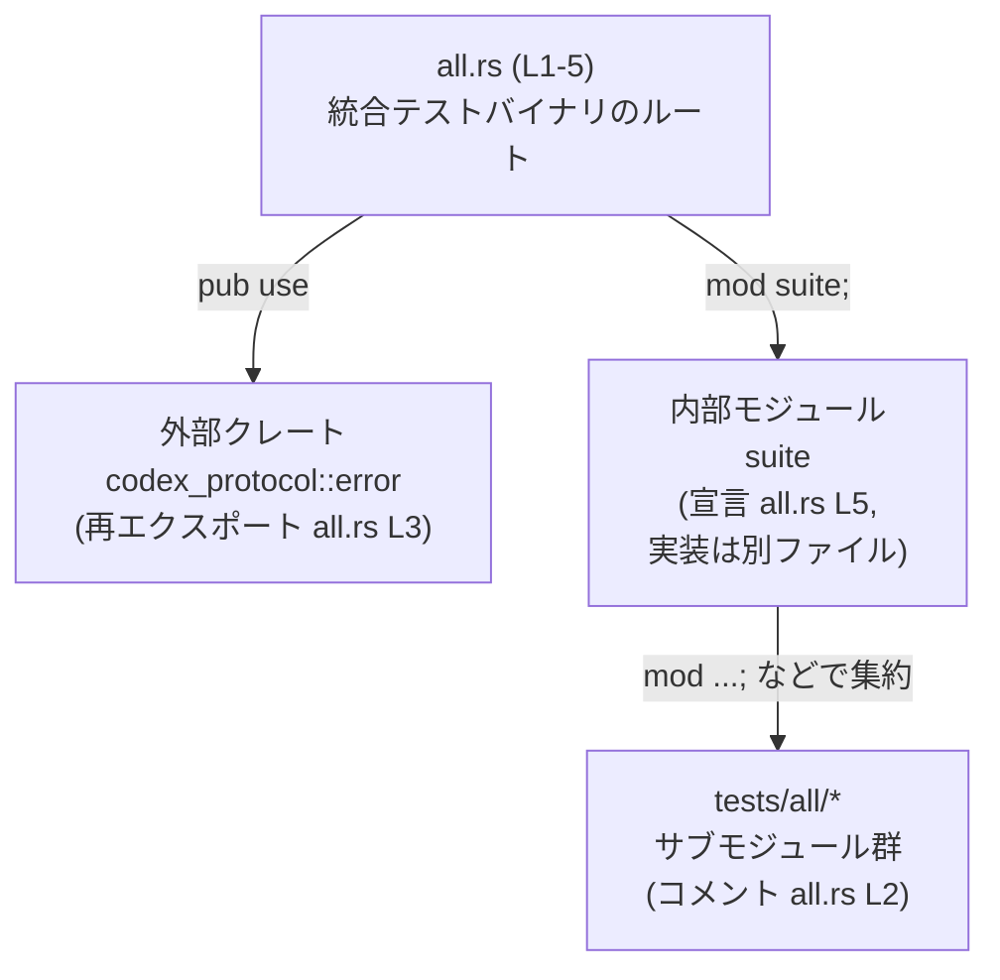

# core/tests/all.rs コード解説

## 0. ざっくり一言

`core/tests/all.rs` は、1つの統合テストバイナリとして動作するテストクレートのルートであり、  
外部クレート `codex_protocol` の `error` モジュールを再エクスポートし、`suite` モジュール以下に存在するテスト群を束ねる役割を持ちます（all.rs:L1-5）。

---

## 1. このモジュールの役割

### 1.1 概要

- コメントに「Single integration test binary that aggregates all test modules.」とあるように（all.rs:L1）、このファイルは **単一の統合テストバイナリ** を構成します。
- 「The submodules live in `tests/all/`.」というコメントから（all.rs:L2）、実際のテストコードは `tests/all/` 配下のサブモジュール側にあり、このファイルはそれらを集約する立場にあります。
- `pub use codex_protocol::error;` により（all.rs:L3）、`codex_protocol` クレートの `error` モジュールを再エクスポートし、テストコードから `crate::error` 経由で利用できるようにしています。
- `mod suite;` により（all.rs:L5）、`suite` モジュールを読み込み、その中からさらに個々のテストモジュールが読み込まれる構成であることが示唆されます。

### 1.2 アーキテクチャ内での位置づけ

このファイルを中心とした依存関係の位置づけは、次のように整理できます。



- ノード A はこのファイル自身です（all.rs:L1-5）。
- ノード B は `pub use codex_protocol::error;` によって再エクスポートされている外部モジュールです（all.rs:L3）。
- ノード C は `mod suite;` で読み込まれるローカルモジュールです（all.rs:L5）。Rust のモジュール規則から、実体は `core/tests/all/suite.rs` または `core/tests/all/suite/mod.rs` などに存在すると考えられます（このファイルには実装は現れません）。
- ノード D はコメントにある `tests/all/` 配下の「サブモジュール」を抽象的に表したものです（all.rs:L2）。具体的なファイル名やテスト内容はこのチャンクには現れません。

### 1.3 設計上のポイント

コードから読み取れる設計上の特徴は次のとおりです。

- **薄い集約レイヤ**  
  - このファイル自体には関数・構造体・テスト関数は存在せず、モジュール宣言と再エクスポートのみです（all.rs:L1-5）。
  - 実際のロジックやテストケースは `suite` モジュールおよびその配下に委ねられています（all.rs:L2, L5）。
- **依存の明示化（再エクスポート）**  
  - `pub use codex_protocol::error;` により、テストコードは `codex_protocol` クレートに直接依存するのではなく、`crate::error` というエイリアス経由でエラー関連 API にアクセスできるようになっています（all.rs:L3）。
  - これは、テストコード側の `use` 文を簡潔にし、外部クレート構成が変わった際の影響範囲を狭める効果があります。
- **状態を持たない構成**  
  - グローバル変数、静的変数、`lazy_static!`・`once_cell` 等は一切登場しません（all.rs:L1-5）。
  - そのため、このファイル単体では共有状態や初期化順序に関する問題は発生しません。
- **安全性・エラーハンドリング・並行性**  
  - `unsafe` ブロックや FFI 呼び出しは存在せず、このファイルの範囲では **完全に安全な Rust** しか使われていません（all.rs:L1-5）。
  - 実行時エラーを発生させるようなロジックはなく、`codex_protocol::error` との紐付けが壊れた場合はコンパイルエラーとして検知されます（all.rs:L3）。
  - スレッド生成や非同期処理 (`async`/`await`) は一切なく、並行性に関わる挙動はこのファイルからは読み取れません（all.rs:L1-5）。実際の並行テスト実行の影響は、あくまで `suite` 以下のテストコード側の実装に依存します。

---

## 2. 主要な機能一覧とコンポーネントインベントリー

### 2.1 主要機能一覧

このファイルが提供する主要な役割は次の2点です。

- 統合テストバイナリのルート定義  
  - コメントで「Single integration test binary」とされており（all.rs:L1）、このファイルがテストバイナリの入口になっています。
- エラー関連モジュールの再エクスポートとテストスイートの集約
  - `codex_protocol::error` モジュールの再エクスポート（all.rs:L3）。
  - `suite` モジュールの読み込みと、その配下のテストモジュールの集約（all.rs:L2, L5）。

### 2.2 コンポーネントインベントリー

このチャンクに現れるコンポーネント（モジュール・再エクスポート）の一覧です。

| 名前         | 種別                   | 役割 / 用途                                                                                  | 定義位置 |
|--------------|------------------------|----------------------------------------------------------------------------------------------|----------|
| `error`      | モジュール再エクスポート | 外部クレート `codex_protocol::error` をテストクレートのルート名前空間から利用可能にする      | all.rs:L3 |
| `suite`      | 内部モジュール宣言     | `tests/all/` 配下にあるテスト群を集約するモジュール。実装は別ファイルに存在（このチャンク外） | all.rs:L5 |

> このファイルには構造体・列挙体・関数の定義は **1つも存在しません**（all.rs:L1-5）。

---

## 3. 公開 API と詳細解説

### 3.1 型一覧（構造体・列挙体など）

- このファイル自身には構造体（`struct`）、列挙体（`enum`）、型エイリアス（`type`）の定義は存在しません（all.rs:L1-5）。
- `error` モジュール配下には何らかのエラー型や補助型があると考えられますが、それらは `codex_protocol` クレート側の定義であり、このチャンクには現れません。

### 3.2 関数詳細（最大 7 件）

- このファイルには **関数定義（`fn`）が存在しません**（all.rs:L1-5）。
- したがって、このセクションで詳細テンプレートを適用できる関数はありません。

### 3.3 その他の関数

- ヘルパー関数やテスト関数なども、このファイルには一切定義されていません（all.rs:L1-5）。
- 実際のテスト関数は `suite` モジュールおよびそのサブモジュールに存在しているとコメントから読み取れますが（all.rs:L2, L5）、具体的なシグネチャや挙動はこのチャンクには現れません。

---

## 4. データフロー

このファイル単体には実行時ロジックやデータ変換処理はありませんが、**テスト実行時の高レベルな流れ**を、コメントとモジュール宣言を根拠に概観します。

- `all.rs` は「単一の統合テストバイナリ」としてコンパイルされます（all.rs:L1）。
- そのバイナリの中には `suite` モジュールが含まれ（all.rs:L5）、`suite` 以下が実際のテストケースを保持します（all.rs:L2）。
- テストコード側がエラー型やエラー生成ユーティリティを使う必要がある場合、`crate::error` 経由で `codex_protocol::error` の API にアクセスできます（all.rs:L3）。

この高レベルな流れをシーケンス図で表現します。

```mermaid
sequenceDiagram
    participant Runner as "テストランナー\n（Rust標準機構・このファイル外）"
    participant All as "all.rs (L1-5)\n統合テストバイナリ"
    participant Suite as "suite モジュール\n(宣言 all.rs L5,\n実装は別ファイル)"
    participant Sub as "tests/all/* サブモジュール\n(コメント all.rs L2)"

    Note over Runner,All: Runner → All の関係は Rust の一般的なテスト実行仕様による（all.rs には明記なし）

    Runner->>All: 統合テストバイナリを起動
    All->>Suite: suite モジュールをロード/利用（mod suite; all.rs L5）
    Suite->>Sub: サブモジュール群のテスト関数を実行（tests/all/*, all.rs L2）
```

> 注意: 上記の「Runner（テストランナー）」との関係は、Rust の一般的なテストバイナリの挙動に基づく説明であり、`all.rs` 単体には直接記述されていません。  
> `All → Suite → Sub` の関係自体は `mod suite;` とコメントから読み取れます（all.rs:L2, L5）。

**安全性・エラー・並行性の観点（このファイル由来）**

- **実行時エラー**  
  - このファイル内にはランタイムロジックがなく、実行時エラーの発生源にはなりません（all.rs:L1-5）。
  - `codex_protocol::error` が存在しない、あるいはモジュール名が変わった場合はコンパイルエラーとして検出されます（all.rs:L3）。
- **並行性**  
  - テストは通常、Rust のテストランナーによって並行実行される可能性がありますが、このファイルは単にモジュールを束ねるだけで状態を持たないため、並行性によるデータ競合の原因にはなりません（all.rs:L1-5）。
  - 実際の並行性上の注意点は `suite` 以下のテストコードに依存します（このチャンクには現れません）。

---

## 5. 使い方（How to Use）

### 5.1 基本的な使用方法

このファイルはテストクレートのルートとして自動的に利用されるため、通常は直接呼び出すことはありません。  
テストを書く側から見た典型的な利用方法は **再エクスポートされた `error` モジュールの利用** です。

以下は、`tests/all/` 配下のテストモジュールから `error` モジュールを利用するイメージ例です（具体的な API 名はこのチャンクからは分からないため抽象的に記述します）。

```rust
// 例: tests/all/example_test.rs （仮のファイル名）
// このファイルは all.rs の `mod suite;` → suite モジュール経由で取り込まれていると想定されます。

use crate::error; // all.rs L3 で再エクスポートされた `error` モジュールにアクセスする

#[test]
fn it_handles_error_correctly() {
    // ここで error モジュール内の型や関数を用いてテストを実装する
    // 具体的な型名・関数名は codex_protocol::error の定義に依存し、このチャンクには現れません。
}
```

このように、テストコードは `codex_protocol::error` を直接参照するのではなく、`crate::error` を使うことで、外部クレートの構成変更の影響を減らせます（all.rs:L3）。

### 5.2 よくある使用パターン

このファイル起点で考えられる典型的な使用パターンは次の通りです。

1. **エラー型・ユーティリティの共有**  
   - すべての統合テストで共通のエラー型・結果型を使うために、`crate::error` をインポートして利用する（all.rs:L3）。
2. **テストモジュールの階層化**  
   - `suite` モジュール内で、`mod http; mod persistence;` 等のように用途別のテストモジュールを読み込み、それらがさらに `tests/all/` 以下のファイルに対応する構成が想定されます（コメント all.rs:L2 と `mod suite;` all.rs:L5 からの推測レベルの解釈。実際の構造はこのチャンクには現れません）。

### 5.3 よくある間違い（推測できる範囲）

コードから推測できる、起こりうる誤用とその回避方法を示します。

```rust
// 誤りの可能性: テスト側で外部クレートに直接依存してしまう
// use codex_protocol::error; // こう書くとテストコードが外部クレート構成に強く依存する

// より意図に沿った使い方（all.rs L3 が想定する使い方）
use crate::error; // all.rs で再エクスポートされたパスを使う
```

- `crate::error` を使うことで、`codex_protocol` クレート側のモジュール構成が変わっても、`all.rs` 側の `pub use` を修正するだけでテストコードはそのままにできる可能性が高くなります（all.rs:L3）。
- これは、「外部依存を1カ所に集約する」という意味で、このファイルの存在意義の1つと解釈できます。

### 5.4 使用上の注意点（まとめ）

- **前提条件**
  - このファイルがコンパイルされるには、`codex_protocol` クレートが依存関係として存在し、かつ `codex_protocol::error` モジュールが定義されている必要があります（all.rs:L3）。
  - `suite` モジュールの実体となるファイル（`tests/all/suite.rs` など）が存在している必要があります（all.rs:L5）。
- **禁止事項 / 注意点**
  - このファイルに実際のテストロジックや重い処理を追加すると、テスト構成が分かりにくくなる可能性があります。現状は「集約専用」の薄いレイヤに保たれています（all.rs:L1-5）。
- **エラー・パニック条件**
  - このファイルに起因する実行時パニックは想定されません。問題があればコンパイルエラーになります（`mod suite;` 先が存在しない、`codex_protocol::error` が見つからない等）（all.rs:L3, L5）。
- **並行性**
  - このファイル自体は何の状態も持たないため、テストの並行実行に関して特別な配慮は不要です（all.rs:L1-5）。
  - スレッド安全性やデータ競合の可能性は `suite` 以下の実装に依存し、このチャンクからは判断できません。

---

## 6. 変更の仕方（How to Modify）

### 6.1 新しい機能（テスト）を追加する場合

「新しいテスト機能を追加する」という意味では、このファイルではなく **`suite` モジュールとその配下** を変更するのが自然です。

一般的な手順（このチャンクと Rust のモジュール規則から読み取れる範囲）をまとめると次のようになります。

1. `suite` モジュールの実装ファイルを確認する  
   - `mod suite;` から、実際のファイルは `core/tests/all/suite.rs` または `core/tests/all/suite/mod.rs` にあると考えられます（all.rs:L5）。
2. `suite` モジュール内で新しいテストモジュールを宣言する  
   - 例: `mod new_feature_tests;` といったモジュール宣言を `suite` 内に追加する（この部分のコードはこのチャンクには現れません）。
3. `tests/all/new_feature_tests.rs` などにテストを実装する  
   - その際、共通のエラー型等が必要なら `use crate::error;` として `codex_protocol::error` を利用可能にする（all.rs:L3）。
4. 必要であれば、`all.rs` はそのままで済む  
   - このファイルは `suite` を1回 `mod` しているだけなので（all.rs:L5）、通常は追加の変更は不要です。

### 6.2 既存の機能を変更する場合

このファイル自体を変更するケースとして現実的にありそうなのは次のような場合です。

- **`codex_protocol::error` の場所や名前が変わった場合**
  - `pub use codex_protocol::error;` のパスを変更する必要があります（all.rs:L3）。
  - 変更時には、`crate::error` を使っているすべてのテストコードのコンパイルが通るかを確認します（テストコードはこのチャンクには現れません）。
- **テストスイート構成の大幅な変更**
  - 統合テストバイナリを複数に分割するなどの大きな設計変更を行う場合は、このファイルに加え、新しい `tests/*.rs` などを作ることになります。  
    具体的な設計はこのチャンクからは分かりませんが、コメントにある「Single integration test binary」（all.rs:L1）を複数に分ける判断になります。

変更時に注意すべき点（契約）:

- `crate::error` という公開名は多数のテストから参照されている可能性が高く、名前やモジュール構成を変える場合は影響範囲が広いことが想定されます（all.rs:L3）。
- `mod suite;` を削除または名前変更した場合、既存のテストが一切コンパイルされなくなる可能性があります（all.rs:L5）。変更前に `suite` 以下の構成を十分に把握する必要があります（このチャンクには構成は現れません）。

---

## 7. 関連ファイル

このファイルと密接に関係するファイル・モジュールを、コードとコメントから分かる範囲で整理します。

| パス / モジュール名                       | 役割 / 関係                                                                                           |
|------------------------------------------|--------------------------------------------------------------------------------------------------------|
| `core/tests/all/suite.rs` または `core/tests/all/suite/mod.rs` | `mod suite;`（all.rs:L5）で読み込まれる `suite` モジュールの実装ファイル。全テストを集約する中核になると考えられます。 |
| `core/tests/all/*.rs` / `core/tests/all/*/mod.rs`     | コメント「The submodules live in `tests/all/`.」（all.rs:L2）が示すサブモジュール群。個々のテストケースが定義される場所です。 |
| `codex_protocol::error`                  | `pub use codex_protocol::error;` によって再エクスポートされるモジュール（all.rs:L3）。テストで利用されるエラー型・ユーティリティが含まれていると考えられます。 |

> 上記のうち、`suite` の実装や `tests/all/*` の具体的な中身は **このチャンクには含まれていません**。  
> 役割は `all.rs` のコメントとモジュール宣言、および Rust の標準的なモジュール規則からの解釈に基づきます。

---

### Bugs / Security の観点（このファイルに限定）

- **バグの可能性**
  - このファイルはモジュール宣言と再エクスポートのみであり、ロジックを持たないため、実行時バグの温床にはなりにくい構造です（all.rs:L1-5）。
  - 考えられる問題は、`codex_protocol::error` や `suite` のパスが変わった場合のコンパイルエラー程度です（all.rs:L3, L5）。
- **セキュリティ**
  - 外部からの入力を扱ったり、ネットワーク・ファイル I/O を行うコードは一切ありません（all.rs:L1-5）。
  - したがって、このファイル単体からセキュリティ上のリスクは読み取れません。実際のリスクは `suite` 以下のテスト内容に依存します。

### Contracts / Edge Cases（契約とエッジケース）

- 契約:
  - `crate::error` は `codex_protocol::error` の別名として利用可能であること（all.rs:L3）。
  - `suite` モジュールが存在し、テストを集約していること（all.rs:L2, L5）。
- エッジケース:
  - `codex_protocol::error` が削除・名前変更された場合、`pub use` 行でコンパイルエラーが発生します（all.rs:L3）。
  - `suite` のソースファイルが存在しない場合、`mod suite;` に対してコンパイルエラーが発生します（all.rs:L5）。
  - これらはいずれも **コンパイル時に検出される** ため、実行時に不正な状態でテストが走ることは防がれます。

以上が、`core/tests/all.rs` のコードから読み取れる、役割・構造・データフロー・安全性に関する解説です。
