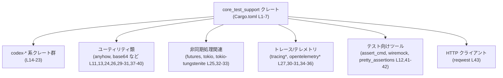
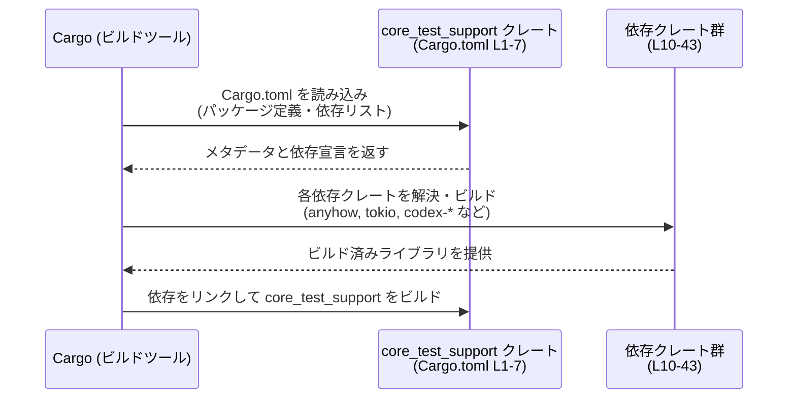

# core\tests\common\Cargo.toml コード解説

## 0. ざっくり一言

- `core_test_support` という名前の **テスト用サポートクレート** を定義し、そのビルド設定と依存クレート一覧を記述した Cargo.toml です（`[package]`〜`[lib]` セクション、`core\tests\common\Cargo.toml:L1-7`）。
- 実際のテスト支援ロジックは `lib.rs` 側にあり、このファイルは **メタデータと依存関係のハブ** の役割を持ちます（`core\tests\common\Cargo.toml:L6-7,10-43`）。

---

## 1. このモジュールの役割

### 1.1 概要

- このファイルは、`core_test_support` クレートの **パッケージ情報とビルドターゲット（ライブラリ）** を定義しています（`[package]`, `[lib]`, `core\tests\common\Cargo.toml:L1-7`）。
- バージョン・エディション・ライセンス・lints などを **ワークスペース共通設定から継承** するよう指定しています（`version.workspace`, `edition.workspace`, `license.workspace`, `[lints] workspace = true`, `core\tests\common\Cargo.toml:L3-5,8-9`）。
- `[dependencies]` と `[dev-dependencies]` セクションで、このテストサポート用ライブラリが利用する **依存クレート群** を宣言しています（`core\tests\common\Cargo.toml:L10-43`）。
- ファイルパスとクレート名から、このクレートは「core 関連テストの共通処理をまとめたライブラリ」であると解釈できますが、実装である `lib.rs` がこのチャンクには含まれていないため、**具体的な関数や型の内容は不明**です（`core\tests\common\Cargo.toml:L6-7`）。

### 1.2 アーキテクチャ内での位置づけ

このファイルから読み取れる範囲では、次のような位置づけになります。

- `core_test_support` は **ライブラリクレート** として定義され、`lib.rs` がエントリポイントです（`[lib] path = "lib.rs"`, `core\tests\common\Cargo.toml:L6-7`）。
- 依存クレートは、エラー処理・非同期処理・トレース・テストユーティリティなど、テストサポート向けの機能を提供するものが並んでいます（`[dependencies]`, `[dev-dependencies]`, `core\tests\common\Cargo.toml:L10-43`）。
- すべての依存は `workspace = true` で定義されており、**バージョンや機能フラグがワークスペースルートに集約管理**されます（`core\tests\common\Cargo.toml:L3-5,9,11-43`）。

依存関係の概略図（ノードをグルーピングしています）:



> この図は、`core_test_support` クレート（Cargo.toml L1-7）が、どの種別の依存クレート群（L11-43）を利用するかをグループ単位で示しています。  
> 各グループ内の具体的な使われ方は `lib.rs` に依存し、このチャンクからは不明です。

### 1.3 設計上のポイント

コード（Cargo.toml）から読み取れる設計上の特徴は次の通りです。

- **ライブラリクレートのみ**  
  - `[lib]` セクションのみがあり、バイナリターゲット（`[[bin]]` 等）は定義されていません（`core\tests\common\Cargo.toml:L6-7`）。
  - テストサポート用の関数や型を他のテストコードから `use core_test_support::...` のように利用する形が想定されますが、実際の API 名は不明です（`core\tests\common\Cargo.toml:L1-2,6-7`）。

- **ワークスペース集中管理**  
  - `version.workspace = true` / `edition.workspace = true` / `license.workspace = true` により、バージョン・エディション・ライセンスをワークスペース共通設定に委ねています（`core\tests\common\Cargo.toml:L3-5`）。
  - `[lints] workspace = true` により、lint 設定もワークスペース単位で一元管理されています（`core\tests\common\Cargo.toml:L8-9`）。
  - すべての依存に `workspace = true` が付いており、依存クレートのバージョンもワークスペースのルート `Cargo.toml` で統一管理されます（`core\tests\common\Cargo.toml:L11-43`）。

- **テスト向け依存に特化**  
  - テスト実行・モック・アサーション強化のための依存（`assert_cmd`, `wiremock`, `pretty_assertions` など）が含まれています（`core\tests\common\Cargo.toml:L12,41-42`）。
  - ネットワーク・非同期処理・トレース・JSON など、テストで多用される機能をカバーする依存がまとまっています（`tokio`, `futures`, `tracing*`, `serde_json`, など、`core\tests\common\Cargo.toml:L25,27,30-31,32-36`）。

- **安全性 / エラー / 並行性に関する情報**  
  - 実際の Rust コード（`lib.rs` やテストコード）がこのチャンクには含まれていないため、エラー処理や並行性制御の **実装詳細は不明**です。
  - ただし、依存として `anyhow`（汎用エラーラッパー）、`tokio`・`futures`（非同期処理）、`tracing` / `opentelemetry` 系（観測性）が指定されているため、これらを活用した設計である可能性があります（`core\tests\common\Cargo.toml:L11,25,27,30-31,34-36`）。実際の使い方は `lib.rs` 側のコードを確認する必要があります。

---

## 2. 主要な機能一覧

このファイルは Cargo 設定ファイルであり、**関数や型そのものは定義していません**。  
そのため、ここでは「Cargo.toml としての機能」に絞って整理します。

- クレート定義:  
  - `core_test_support` というライブラリクレートを定義し、`lib.rs` をエントリポイントとする（`core\tests\common\Cargo.toml:L1-2,6-7`）。

- ワークスペース設定の継承:  
  - バージョン・エディション・ライセンス・lint 設定をワークスペース共通設定から継承する（`core\tests\common\Cargo.toml:L3-5,8-9`）。

- 依存クレートの宣言:  
  - テストサポートに必要な依存クレート（エラー処理、非同期処理、ネットワーク、トレース、モック、ユーティリティなど）を `[dependencies]` / `[dev-dependencies]` に列挙する（`core\tests\common\Cargo.toml:L10-43`）。

> 実際に「どのようなテスト用ヘルパー関数があるか」「どう呼び出すか」といった**コアロジックや公開 API** は、`lib.rs` などの実装ファイルにあり、このチャンクからは分かりません。

---

## 3. 公開 API と詳細解説

### 3.1 型一覧（構造体・列挙体など）

このファイルには Rust の型定義は含まれていません（TOML 設定ファイルのため）。  
`[lib] path = "lib.rs"` から、型定義は `lib.rs` に存在すると考えられますが、このチャンクには現れません（`core\tests\common\Cargo.toml:L6-7`）。

| 名前 | 種別 | 役割 / 用途 | 根拠 |
|------|------|-------------|------|
| （このファイルには型定義なし） | - | 型・構造体・列挙体などの Rust コードは `Cargo.toml` には書かれていません | `core\tests\common\Cargo.toml:L1-43` を見ても Rust コード断片が存在しない |

### 3.2 関数詳細（最大 7 件）

- このチャンクには **関数定義やシグネチャが一切含まれていません**。
- したがって、「関数詳細テンプレート」を適用できる公開関数を特定できません。

> 実際の公開関数やメソッドは `lib.rs`（`core\tests\common\Cargo.toml:L6-7`）やテストコード側に記述されていると考えられますが、ここではそれらを参照できないため、関数名・引数・戻り値・エラー条件などは **不明**です。

### 3.3 その他の関数

- 同様の理由で、この Cargo.toml から補助的な関数やラッパー関数の一覧も特定できません。
- 「このチャンクには現れない」と言えます。

---

## 4. データフロー

このファイルはビルド設定ファイルであるため、**実行時のデータフロー** は読み取れません。  
代わりに、Cargo がこのファイルを利用してテストサポートクレートをビルドする際の、**依存解決フロー（ビルド時のデータフロー）** を示します。

- Cargo は `core_test_support` クレートの `Cargo.toml` を読み取り、パッケージ情報と依存リストを取得します（`core\tests\common\Cargo.toml:L1-5,10-43`）。
- 依存として列挙されたクレートを順次解決・ビルドし、その結果をリンクして `core_test_support` のライブラリを生成します（`core\tests\common\Cargo.toml:L10-43`）。
- その後、テストコードから `core_test_support` クレートがリンクされ、テスト実行時にテストサポート機能が利用されます（テストコードはこのチャンクには現れません）。

Mermaid のシーケンス図（Cargo ビルド時の流れ）:



> この図はあくまで Cargo の一般的な挙動を示したもので、実行時の関数呼び出しやデータ構造の流れは、このチャンクからは分かりません。

---

## 5. 使い方（How to Use）

### 5.1 基本的な使用方法

このファイル自体は「使う」ものではなく、Cargo によって読み込まれる設定ファイルです。  
利用者（テストコード側）から見た基本的な流れは、概ね次のようになります。

1. クレート `core_test_support` がワークスペースの一員としてビルドされる（`core\tests\common\Cargo.toml:L1-7`）。
2. テストコードから `core_test_support` クレートを `use` して、テスト用の共通機能を利用する（具体的な API は `lib.rs` に依存し、このチャンクからは不明）。

テストコード側からの利用イメージ（API 名は不明なため、プレースホルダとして示します）:

```rust
// core_test_support クレート全体をインポートする                      // crate 名は Cargo.toml の name に対応 (L2)
use core_test_support::*;                                              // 実際の公開 API 名は lib.rs を参照する必要がある

#[test]                                                                 // 通常のテスト関数定義
fn example_test_using_support() {                                      // テスト関数名は任意
    // ここで core_test_support 内のヘルパー関数や構造体を呼び出す     // 具体的な関数名はこのチャンクには現れない
    // 例: setup やモックサーバ起動などが想定されるが詳細は不明
}
```

> 上記コードは「crate 名の使い方」のみを示すための一般的なイメージであり、具体的な関数・型名は **このチャンクからは特定できません**。

### 5.2 よくある使用パターン

- この Cargo.toml から、どの関数がどのように呼び出されるかといった **使用パターンの詳細は分かりません**。
- ただし依存クレートの種類から、以下のようなテストパターンが **想定** されます（推測であり、このファイルだけでは断定できません）。
  - コマンドラインツールのテスト: `assert_cmd`（L12）を使った外部コマンドやバイナリのテスト補助。
  - HTTP / WebSocket のテスト: `reqwest`（L43）, `tokio-tungstenite`（L33）, `wiremock`（L38）を利用した通信テストの補助。
  - ログ・トレースの検証: `tracing`, `tracing-opentelemetry`, `tracing-subscriber`, `opentelemetry`, `opentelemetry_sdk`（L27,30-31,34-36）を利用した観測性関連の検証。
- 実際にどのパターンが実装されているかは `lib.rs` / テストコードを確認する必要があります。

### 5.3 よくある間違い

Cargo.toml の内容から、想定される誤用例を **設定レベルに限定して** 挙げます。

- **依存クレートの features を追加し忘れる**  
  - `tokio` は `features = ["net", "time"]` のみが有効化されています（`core\tests\common\Cargo.toml:L32`）。
  - もし `rt-multi-thread` など別の機能が必要なコードを `lib.rs` に追加した場合、features を追加しないとコンパイルエラーになる可能性があります。
  - この点は、`tokio` の利用方法と features を一致させる必要がある、という一般的な注意点です。

- **ワークスペース設定との不整合**  
  - すべての依存に `workspace = true` が付いているため（`core\tests\common\Cargo.toml:L11-43`）、ワークスペースルートの依存バージョンと整合性が取れていないとビルド設定でエラーになります。
  - 新しい依存を追加する際には、ワークスペースルート側にも `[workspace.dependencies]` や該当設定の追加が必要になる場合があります（ただしワークスペースルートの内容はこのチャンクには現れません）。

### 5.4 使用上の注意点（まとめ）

- **このファイル単体では API 情報は得られない**  
  - 関数・構造体・エラー型などの詳細はすべて `lib.rs` 以降にあり、このチャンクからは不明です（`core\tests\common\Cargo.toml:L6-7`）。
  - テストサポート機能を安全に利用するには、`lib.rs` の公開 API と、その内部で利用されている依存クレートの契約（例: 非同期関数なら `tokio` ランタイムの前提など）を確認する必要があります。

- **非同期処理とランタイムの前提**  
  - `tokio`, `futures`, `tokio-tungstenite` が依存に含まれているため（`core\tests\common\Cargo.toml:L25,32-33`）、非同期関数が公開されている可能性があります。
  - その場合、テストで使用する際は「どのランタイムで実行するか」「テスト用ランタイムの初期化方法」などが前提条件になることが多いですが、具体的な実装は不明です。

- **観測性関連の設定**  
  - `tracing`, `opentelemetry` 系の依存があり（`core\tests\common\Cargo.toml:L27,30-31,34-36`）、トレースやメトリクスに依存したテストが存在する可能性があります。
  - その場合、テスト実行環境で適切なエクスポータやサブスクライバ設定が必要になることがありますが、このファイルだけでは詳細は分かりません。

---

## 6. 変更の仕方（How to Modify）

### 6.1 新しい機能を追加する場合（このファイルに関する観点）

`core_test_support` クレートに新しいテスト支援機能を追加する際、この Cargo.toml で関係しうる変更は次のようになります。

1. **新しい依存クレートが必要かを検討する**  
   - 例: 新しい種類のモック、特定のプロトコルクライアントなどが必要になった場合。
   - 必要であれば `[dependencies]` または `[dev-dependencies]` セクションに追加します（`core\tests\common\Cargo.toml:L10-43`）。

2. **ワークスペース依存として追加するかどうか**  
   - このファイルでは既存の依存はすべて `workspace = true` で指定されています（`core\tests\common\Cargo.toml:L11-43`）。
   - 新しい依存もワークスペース全体で共有するなら、ワークスペースルート側の設定も合わせて変更する必要があります（ワークスペースルートの内容はこのチャンクには現れません）。

3. **既存依存の features を調整する**  
   - 既存の依存に対して追加機能が必要になった場合（例: `tokio` の別 feature）、このファイルの該当行に features を追記します（`core\tests\common\Cargo.toml:L32`）。

4. **実装ファイル側での変更**  
   - 実際の新機能は `lib.rs` 側に追加されますが、そのファイルはこのチャンクに無いため、影響範囲や API 設計は別途確認が必要です（`core\tests\common\Cargo.toml:L6-7`）。

### 6.2 既存の機能を変更する場合（このファイルに関する観点）

- **依存バージョンや種類を変更する**  
  - 依存クレートを別のものに置き換える、または削除する際は、  
    - 利用箇所（`lib.rs` やテストコード）をすべて確認する必要があります（このチャンクには現れません）。  
    - 依存を削除した場合、未使用の `use` 文や型・関数呼び出しが残っていないかを確認します。

- **ワークスペース設定との整合性**  
  - `workspace = true` を解除して個別バージョンを指定する場合、ワークスペースの他のクレートとのバージョン差異が発生しうるため、それによる影響（ビルド時間増加、互換性問題など）を考慮する必要があります（`core\tests\common\Cargo.toml:L11-43`）。

- **テストの並行性・非同期性への影響**  
  - `tokio` や `futures` の依存を削除・変更する場合、非同期テストが存在すれば影響が大きくなりますが、その有無はこのチャンクからは分かりません。
  - 実装側のテストコードと `lib.rs` を併せて確認し、非同期テストや並行実行の前提が崩れないかを確認する必要があります。

---

## 7. 関連ファイル

この Cargo.toml と密接に関係しそうなファイル・ディレクトリを、コードから分かる範囲で列挙します。

| パス | 役割 / 関係 | 根拠 |
|------|------------|------|
| `core/tests/common/lib.rs` | `core_test_support` クレートのライブラリ実装。本ファイルが `[lib] path = "lib.rs"` として指すエントリポイントです。 | `core\tests\common\Cargo.toml:[lib] (L6), path = "lib.rs" (L7)` |
| （ワークスペースルート）`Cargo.toml` | `version.workspace`, `edition.workspace`, `license.workspace`, `[lints] workspace = true` およびすべての `workspace = true` 依存の設定値を実際に保持するファイル。ここで各依存クレートのバージョンや共通 lints が定義されていると考えられます。 | `core\tests\common\Cargo.toml:L3-5,8-9,11-43` |
| codex-* 各クレートの `Cargo.toml` | `codex-arg0`, `codex-core`, `codex-exec-server`, `codex-features`, `codex-login`, `codex-model-provider-info`, `codex-models-manager`, `codex-protocol`, `codex-utils-absolute-path`, `codex-utils-cargo-bin` などのクレートの設定ファイル。`core_test_support` から依存しているため、API を通じて連携していると考えられますが、パスはこのチャンクには現れません。 | 依存宣言 `core\tests\common\Cargo.toml:L14-23,25-26` |

> 上記のうち、`lib.rs` 以外のファイルパスはこのチャンクには明示されていないため、**ワークスペースの一般的な構成からの推測を含みます**。厳密なパスや実装内容を確認するには、実際のリポジトリ構成を見る必要があります。

---

### まとめ

- `core\tests\common\Cargo.toml` は、`core_test_support` というテスト用サポートライブラリの **メタデータと依存関係** を定義するファイルです（`core\tests\common\Cargo.toml:L1-7,10-43`）。
- 実際の公開 API やコアロジック（安全性・エラー処理・並行性を含む）は **このチャンクには存在せず**、`lib.rs` などの実装ファイルを参照する必要があります（`core\tests\common\Cargo.toml:L6-7`）。
- 依存クレートの一覧から、非同期処理・トレース・モック・HTTP 通信など、テスト用の多様な機能が利用されている可能性が読み取れますが、その具体的な使われ方はこのファイルだけでは断定できません。
