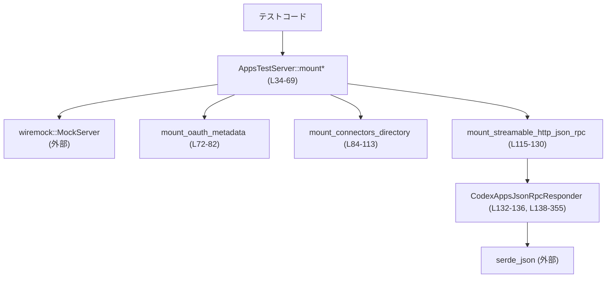
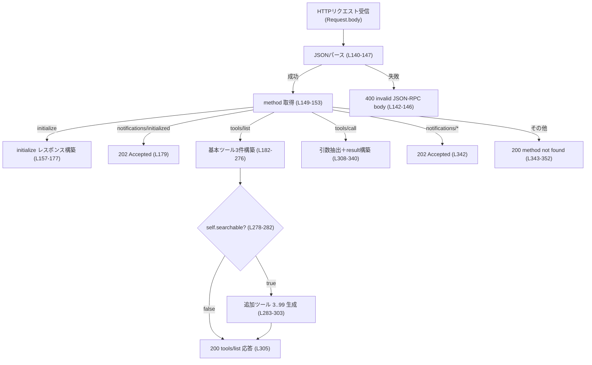
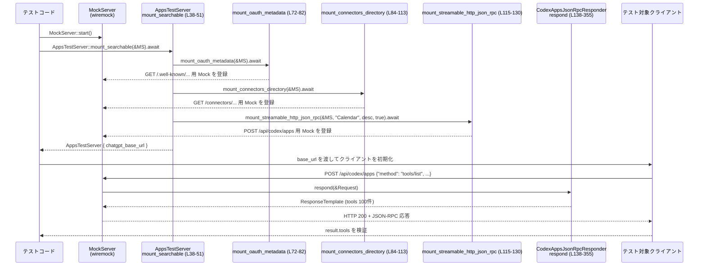

# core/tests/common/apps_test_server.rs コード解説

## 0. ざっくり一言

ChatGPT Apps 形式の JSON-RPC API を `wiremock::MockServer` 上にモック実装するためのテスト用サーバヘルパです。OAuth メタデータ、コネクタディレクトリ、`/api/codex/apps` JSON-RPC エンドポイントをまとめて立ち上げ、カレンダー関連ツールや検索可能ツール群を返す挙動をエミュレートします（apps_test_server.rs:L13-26, L28-70, L115-130, L132-355）。

---

## 1. このモジュールの役割

### 1.1 概要

- テスト内で利用する「Apps サーバ」を簡単に起動するための `AppsTestServer` 構造体とマウント関数群を提供します（apps_test_server.rs:L28-70）。
- `wiremock::MockServer` に対して、OAuth メタデータのエンドポイント、コネクタディレクトリエンドポイント、ChatGPT Apps 互換の JSON-RPC エンドポイント（`/api/codex/apps`）を登録します（L72-82, L84-113, L115-130）。
- JSON-RPC エンドポイントは `initialize` / `tools/list` / `tools/call` / 各種 `notifications/*` / 未知メソッドを処理するモック実装になっています（L155-354）。

### 1.2 アーキテクチャ内での位置づけ

このファイルの中での主要コンポーネントと依存関係は次のようになっています。



- テストコードは `MockServer` を立ち上げ、`AppsTestServer::mount*` を呼び出します（L34-69）。
- `mount_*` 関数群が `MockServer` に対して HTTP パスとレスポンダを登録します（L72-82, L84-113, L115-130）。
- `/api/codex/apps` への POST は `CodexAppsJsonRpcResponder` によって JSON-RPC として処理されます（L121-127, L138-355）。

### 1.3 設計上のポイント

- **責務の分離**
  - `AppsTestServer` は「テスト用にモックサーバを組み立てる」役割のみを持ち、実際のリクエスト処理ロジックは `CodexAppsJsonRpcResponder` に集約されています（L28-70, L132-355）。
  - OAuth / コネクタディレクトリ / JSON-RPC の 3 種類のエンドポイント設定が、それぞれ個別の `mount_*` 関数として分割されています（L72-82, L84-113, L115-130）。
- **状態管理**
  - `AppsTestServer` はモックサーバのベース URL 文字列のみを保持する軽量な構造体です（L28-31）。
  - `CodexAppsJsonRpcResponder` もコネクタ名・説明・検索可能かどうかの 3 つのフィールドのみを持ち、リクエストごとに内部状態は変更しません（L132-136）。
- **エラーハンドリング方針**
  - JSON パース失敗や JSON-RPC の `method` 欄欠如に対しては HTTP 400 とエラーメッセージを返します（L140-147, L149-153）。
  - 未知のメソッドは HTTP 200 で JSON-RPC 標準の「method not found」エラー（コード -32601）を返します（L343-352）。
  - ツール名や引数が欠けている場合も、`unwrap_or_default` で空文字列として扱い、常に成功レスポンスを返します（L310-324, L327-340）。
- **非同期・並行性**
  - エンドポイントのマウント処理はすべて `async fn` として定義されており、テストコード側が非同期コンテキストで await して利用します（L34-69, L72-113, L115-130）。
  - 実際のリクエスト処理 `respond` は同期関数で、`&self` を不変借用しているため、内部で共有状態を変更しません（L138-139）。並行なリクエスト処理においてもこの構造体によるデータ競合は発生しません。

---

## 2. 主要な機能一覧

### 2.1 コンポーネント一覧（構造体・関数・定数）

#### 構造体

| 名前 | 種別 | 公開 | 位置 | 役割 / 用途 |
|------|------|------|------|-------------|
| `AppsTestServer` | 構造体 | `pub` | apps_test_server.rs:L28-31 | テスト用モックサーバのベース URL (`chatgpt_base_url`) を保持するラッパ。マウント済みの `MockServer` に対応。 |
| `CodexAppsJsonRpcResponder` | 構造体 | 非公開 | apps_test_server.rs:L132-136 | `/api/codex/apps` に届く JSON-RPC リクエストを処理するレスポンダ。コネクタ名・説明・検索可否フラグを保持。 |

#### 主な関数・メソッド

| 名前 | 種別 | 公開 | 位置 | 概要 |
|------|------|------|------|------|
| `AppsTestServer::mount` | `async fn` | `pub` | L34-36 | デフォルトのコネクタ名（"Calendar"）でモックサーバをマウントする簡易エントリポイント。 |
| `AppsTestServer::mount_searchable` | `async fn` | `pub` | L38-51 | 多数の検索可能ツールを返す設定でモックサーバをマウントする。 |
| `AppsTestServer::mount_with_connector_name` | `async fn` | `pub` | L53-69 | 任意のコネクタ名を指定してモックサーバをマウントする。検索可能ツールは無効。 |
| `mount_oauth_metadata` | `async fn` | 非公開 | L72-82 | OAuth メタデータの well-known エンドポイントをモックする。 |
| `mount_connectors_directory` | `async fn` | 非公開 | L84-113 | コネクタディレクトリの list / list_workspace エンドポイントをモックする。 |
| `mount_streamable_http_json_rpc` | `async fn` | 非公開 | L115-130 | `/api/codex/apps` の JSON-RPC エンドポイントをモックし、`CodexAppsJsonRpcResponder` を登録する。 |
| `CodexAppsJsonRpcResponder::respond` | メソッド | トレイト実装 | L138-355 | JSON-RPC リクエストを解析し、`initialize` / `tools/list` / `tools/call` などのメソッドごとにレスポンスを組み立てる。 |

#### 定数

| 名前 | 公開 | 位置 | 役割 |
|------|------|------|------|
| `CONNECTOR_ID` | 非公開 | L13 | ツールメタデータ中の `connector_id`（"calendar"）。 |
| `CONNECTOR_NAME` | 非公開 | L14 | デフォルトのコネクタ表示名（"Calendar"）。 |
| `DISCOVERABLE_CALENDAR_ID` | 非公開 | L15 | ディレクトリで返すカレンダーアプリの ID。 |
| `DISCOVERABLE_GMAIL_ID` | 非公開 | L16 | ディレクトリで返す Gmail アプリの ID。 |
| `CONNECTOR_DESCRIPTION` | 非公開 | L17 | コネクタ説明文。 |
| `PROTOCOL_VERSION` | 非公開 | L18 | JSON-RPC `initialize` レスポンスで用いるデフォルトのプロトコルバージョン。 |
| `SERVER_NAME` / `SERVER_VERSION` | 非公開 | L19-20 | サーバ情報として返す名前とバージョン。 |
| `SEARCHABLE_TOOL_COUNT` | 非公開 | L21 | 検索可能ツール群の総数 (100)。 |
| `CALENDAR_CREATE_EVENT_RESOURCE_URI` | `pub` | L22-23 | `calendar_create_event` ツールの resource URI。 |
| `CALENDAR_LIST_EVENTS_RESOURCE_URI` | 非公開 | L24 | `calendar_list_events` ツールの resource URI。 |
| `DOCUMENT_EXTRACT_TEXT_RESOURCE_URI` | `pub` | L25-26 | `calendar_extract_text` ツールの resource URI。 |

### 2.2 機能一覧（要約）

- Apps テストサーバの起動:  
  `AppsTestServer::mount*` で `MockServer` に各種エンドポイントを登録し、テストで利用可能なベース URL を提供する（L34-69）。
- OAuth メタデータ提供:  
  `/.well-known/oauth-authorization-server/mcp` に GET すると、authorization/token エンドポイント URL を返す（L72-82）。
- コネクタディレクトリ提供:  
  `/connectors/directory/list` と `/connectors/directory/list_workspace` をモックし、Google Calendar / Gmail などの存在をテスト用に返す（L84-113）。
- JSON-RPC Apps API 提供:  
  `/api/codex/apps` に対する POST を JSON-RPC として解釈し、`initialize` / `tools/list` / `tools/call` などを処理する（L115-127, L138-355）。
- 検索可能ツール群の生成:  
  `searchable` フラグが true の場合、基本 3 ツールに加えて `calendar_timezone_option_3`〜`calendar_timezone_option_99` まで 97 個の追加ツールを動的に生成し、合計 100 個のツールリストを返す（L186-276, L278-304）。

---

## 3. 公開 API と詳細解説

### 3.1 型一覧（構造体）

| 名前 | 種別 | 位置 | 役割 / 用途 |
|------|------|------|-------------|
| `AppsTestServer` | 構造体 | apps_test_server.rs:L28-31 | `chatgpt_base_url` を保持するテスト用サーバハンドル。マウント済み `MockServer` に対応。 |
| `CodexAppsJsonRpcResponder` | 構造体 | apps_test_server.rs:L132-136 | JSON-RPC リクエストを処理する wiremock のレスポンダ。 |

#### `AppsTestServer`

- フィールド
  - `pub chatgpt_base_url: String`（L29-30）  
    モックサーバのベース URL（例: `http://127.0.0.1:12345`）。テストコードはこれを使って HTTP クライアントを設定します。

### 3.2 関数詳細

以下の 7 つの関数・メソッドについて、詳細を説明します（すべて apps_test_server.rs 内）。

---

#### `AppsTestServer::mount(server: &MockServer) -> Result<Self>`

**シグネチャ**

```rust
pub async fn mount(server: &MockServer) -> Result<Self> // apps_test_server.rs:L34-36
```

**概要**

- デフォルトコネクタ名 `"Calendar"` を用いて `mount_with_connector_name` を呼び出し、テスト用 Apps サーバをマウントするエントリポイントです（L34-36）。

**引数**

| 引数名 | 型 | 説明 |
|--------|----|------|
| `server` | `&MockServer` | `wiremock::MockServer` への参照。すでに起動済みであることが前提です。 |

**戻り値**

- `anyhow::Result<AppsTestServer>`  
  - 正常時: AppsTestServer インスタンス（`chatgpt_base_url` に `server.uri()` を格納）を返します（L66-68）。
  - この関数内では `Err` を返すコードはなく、常に `Ok` になります。

**内部処理の流れ**

1. `Self::mount_with_connector_name(server, CONNECTOR_NAME)` を await します（L35）。
2. `CONNECTOR_NAME` は `"Calendar"` というデフォルトのコネクタ名です（L14）。
3. 結果をそのまま呼び出し元に返します（L35-36）。

**Examples（使用例）**

```rust
use wiremock::MockServer;
use core::tests::common::apps_test_server::AppsTestServer;

#[tokio::test]
async fn use_default_apps_server() -> anyhow::Result<()> {
    // MockServer を起動する（wiremock 側の典型的な API 例）
    let server = MockServer::start().await;
    // デフォルトコネクタ名 "Calendar" で Apps サーバをマウント
    let apps = AppsTestServer::mount(&server).await?;
    // ベース URL を使ってテスト対象のクライアントを初期化するイメージ
    let base_url = &apps.chatgpt_base_url;
    // ... ここで base_url 経由で /api/codex/apps などを呼び出すテストを書く
    Ok(())
}
```

※ `MockServer::start()` は wiremock クレート側の一般的な API 例であり、このファイル内には定義されていません。

**Errors / Panics**

- この関数内で `Err` になるコードはありません。`mount_with_connector_name` も `Ok(Self)` のみを返す実装です（L57-69）。
- パニックを起こしうる操作（`unwrap` など）は行っていません。

**Edge cases**

- `server` がまだ起動していない場合でもコンパイル時には検出されませんが、その場合は後続の HTTP リクエストが失敗します。コード上のチェックはありません。
- `CONNECTOR_NAME` は固定文字列のため、ここでコネクタ名をカスタマイズすることはできません。

**使用上の注意点**

- `MockServer` インスタンスのライフタイムは呼び出し元で管理されます。`AppsTestServer` は URI 文字列を保持するだけなので、`MockServer` を drop してしまうと、`chatgpt_base_url` は死んだサーバを指す URL になります（設計上の注意）。

---

#### `AppsTestServer::mount_searchable(server: &MockServer) -> Result<Self>`

```rust
pub async fn mount_searchable(server: &MockServer) -> Result<Self> // L38-51
```

**概要**

- OAuth・コネクタディレクトリ・JSON-RPC エンドポイントをマウントし、`tools/list` で 100 個の検索可能ツールを返す設定で Apps サーバを起動します（L38-47, L186-276, L278-304）。

**引数**

| 引数名 | 型 | 説明 |
|--------|----|------|
| `server` | `&MockServer` | 既に起動中の `MockServer`。 |

**戻り値**

- `Result<AppsTestServer>`  
  - 正常時: `chatgpt_base_url` に `server.uri()` を入れた `AppsTestServer`（L48-50）。
  - この関数内で `Err` は返しません。

**内部処理の流れ**

1. `mount_oauth_metadata(server).await` で OAuth メタデータのエンドポイントを登録します（L39）。
2. `mount_connectors_directory(server).await` でディレクトリエンドポイントを登録します（L40）。
3. `mount_streamable_http_json_rpc` を `searchable = true` で呼び、JSON-RPC エンドポイントを登録します（L41-47）。
4. 最後に `AppsTestServer { chatgpt_base_url: server.uri() }` を返します（L48-50）。

**Examples（使用例）**

```rust
use wiremock::MockServer;
use core::tests::common::apps_test_server::AppsTestServer;

#[tokio::test]
async fn list_many_tools_via_apps_server() -> anyhow::Result<()> {
    let server = MockServer::start().await;
    // 検索可能ツールを含む設定でマウント
    let apps = AppsTestServer::mount_searchable(&server).await?;
    let base_url = &apps.chatgpt_base_url;

    // 例: reqwest で tools/list を叩くイメージ（実コードではエラー処理等が必要）
    let client = reqwest::Client::new();
    let resp = client
        .post(format!("{base_url}/api/codex/apps"))
        .json(&serde_json::json!({
            "jsonrpc": "2.0",
            "id": 1,
            "method": "tools/list",
        }))
        .send()
        .await?;
    let json = resp.json::<serde_json::Value>().await?;
    // json["result"]["tools"] に 100 個のツールが入っていることをテストする、など
    Ok(())
}
```

**Errors / Panics**

- 内部で呼び出している 3 つの `mount_*` 関数はいずれもエラーを返さない実装のため、この関数も常に `Ok` になります（L39-47, L72-82, L84-113, L115-130）。

**Edge cases**

- すでに同じパスに別のモックがマウントされている場合の挙動は wiremock の仕様に依存し、このファイルからは分かりません。
- `searchable` = true による追加ツール生成は `tools/list` ハンドラ内の `if self.searchable && let Some(tools) = ...` で条件付き実行されます（L278-282）。

**使用上の注意点**

- 多数のツールを返すため、レスポンス JSON のサイズが大きくなります。テスト内でレスポンス全体を何度もコピーするような処理は避ける方がよいです（パフォーマンス上の注意）。
- 検索可能ツールの有無を切り替えたい場合は、この関数ではなく `mount_with_connector_name` + `searchable=false` を使う必要があります（L53-69, L119-120）。

---

#### `AppsTestServer::mount_with_connector_name(server: &MockServer, connector_name: &str) -> Result<Self>`

```rust
pub async fn mount_with_connector_name(
    server: &MockServer,
    connector_name: &str,
) -> Result<Self> // L53-69
```

**概要**

- コネクタ名のみカスタマイズ可能なマウント関数です。`searchable` は false 固定で、基本 3 ツール版の Apps サーバを起動します（L59-64, L186-276）。

**引数**

| 引数名 | 型 | 説明 |
|--------|----|------|
| `server` | `&MockServer` | 起動済みのモックサーバ。 |
| `connector_name` | `&str` | ツールの `_meta.connector_name` に入る表示名。 |

**戻り値**

- `Result<AppsTestServer>`  
  `mount_searchable` と同様、常に `Ok`。

**内部処理の流れ**

1. `mount_oauth_metadata(server).await`（L57）。
2. `mount_connectors_directory(server).await`（L58）。
3. `mount_streamable_http_json_rpc(server, connector_name.to_string(), CONNECTOR_DESCRIPTION.to_string(), /*searchable*/ false).await` を呼ぶ（L59-64）。
4. `chatgpt_base_url` に `server.uri()` を入れた `AppsTestServer` を返す（L66-68）。

**Examples（使用例）**

```rust
let server = MockServer::start().await;
// コネクタ名だけカスタマイズし、検索可能ツールは無効
let apps = AppsTestServer::mount_with_connector_name(&server, "My Custom Connector").await?;
assert!(apps.chatgpt_base_url.starts_with("http://"));
```

**Edge cases / 使用上の注意点**

- `connector_name` が空文字列でも特にバリデーションは行われず、そのまま `_meta.connector_name` に反映されます（L206-208, L231-233, L263-265）。
- `searchable` が false なので、`tools/list` において追加のタイムゾーンツールは一切生成されません（L278-304）。

---

#### `mount_oauth_metadata(server: &MockServer)`

```rust
async fn mount_oauth_metadata(server: &MockServer) // L72-82
```

**概要**

- `GET /.well-known/oauth-authorization-server/mcp` へのレスポンスとして OAuth メタデータ JSON を返すモックエンドポイントを登録します（L72-81）。

**内部処理の流れ**

1. `Mock::given(method("GET"))` で GET メソッドのリクエストをマッチ（L73）。
2. `.and(path("/.well-known/oauth-authorization-server/mcp"))` でパスを指定（L74）。
3. `.respond_with(ResponseTemplate::new(200).set_body_json(json!({...})))` で 200 OK と JSON ボディを返すレスポンダを設定（L75-79）。
   - `authorization_endpoint` / `token_endpoint` に `server.uri()` ベースの URL を埋め込みます（L76-77）。
4. `.mount(server).await` で `MockServer` に登録（L80-81）。

**Errors / Edge cases**

- エラー処理は行っておらず、`anyhow::Result` も返しません。wiremock 側でのマウント失敗はここからは検出しません。
- `scopes_supported` は空文字列を一つ含む配列 `[""]` として返していますが、意味的な正当性はテスト用途次第です（L78）。

---

#### `mount_connectors_directory(server: &MockServer)`

```rust
async fn mount_connectors_directory(server: &MockServer) // L84-113
```

**概要**

- コネクタディレクトリ API をモックします。
  - `/connectors/directory/list`: Google Calendar と Gmail の 2 アプリを返す（L85-103）。
  - `/connectors/directory/list_workspace`: 空リストを返す（L105-112）。

**内部処理の流れ**

1. 1つ目のモック
   - GET `/connectors/directory/list` に対して 2 つのアプリ ID（`DISCOVERABLE_CALENDAR_ID`, `DISCOVERABLE_GMAIL_ID`）を含む JSON を返す（L85-101）。
2. 2つ目のモック
   - GET `/connectors/directory/list_workspace` に対して `apps: []` を返す（L105-110）。
3. それぞれ `.mount(server).await` でサーバに登録（L102-103, L111-112）。

**Edge cases / 使用上の注意点**

- ページングのための `nextToken` はどちらも `null` 固定です（L100, L109）。
- `list_workspace` が空である理由やワークスペースの概念は、このファイルからは分かりません。

---

#### `mount_streamable_http_json_rpc(server: &MockServer, connector_name: String, connector_description: String, searchable: bool)`

```rust
async fn mount_streamable_http_json_rpc(
    server: &MockServer,
    connector_name: String,
    connector_description: String,
    searchable: bool,
) // L115-120
```

**概要**

- `POST /api/codex/apps` を受け付ける JSON-RPC エンドポイントを `MockServer` に登録します（L121-129）。
- 実際のリクエスト処理は `CodexAppsJsonRpcResponder` に委譲されます（L123-127, L138-355）。

**引数**

| 引数名 | 型 | 説明 |
|--------|----|------|
| `server` | `&MockServer` | モックサーバ。 |
| `connector_name` | `String` | ツール `_meta` に入れるコネクタ名。 |
| `connector_description` | `String` | `_meta.connector_description` に入れる説明文。 |
| `searchable` | `bool` | `tools/list` で追加ツールを返すかどうか。 |

**内部処理の流れ**

1. `Mock::given(method("POST"))` で POST をマッチ（L121）。
2. `.and(path_regex("^/api/codex/apps/?$"))` で末尾の `/` の有無を許容するパス正規表現を設定（L122）。
3. `.respond_with(CodexAppsJsonRpcResponder { ... })` でレスポンダを構築（L123-127）。
4. `.mount(server).await` で登録（L128-129）。

**使用上の注意点**

- `connector_name` と `connector_description` は `CodexAppsJsonRpcResponder` 内でクローンされて `_meta.connector_name`, `_meta.connector_description` として各ツール定義に埋め込まれます（L205-208, L230-233, L262-265, L298-300）。
- `searchable` フラグはレスポンダの `self.searchable` として保持され、`tools/list` の追加ツール生成に利用されます（L132-136, L278-304）。

---

#### `CodexAppsJsonRpcResponder::respond(&self, request: &Request) -> ResponseTemplate`

```rust
impl Respond for CodexAppsJsonRpcResponder {
    fn respond(&self, request: &Request) -> ResponseTemplate { ... } // L138-355
}
```

**概要**

- wiremock の `Respond` トレイト実装であり、`/api/codex/apps` に届く JSON-RPC リクエストを解析して適切な HTTP レスポンス（`ResponseTemplate`）を返します。
- サポートする `method` は:
  - `"initialize"`
  - `"notifications/initialized"`
  - `"tools/list"`
  - `"tools/call"`
  - `"notifications/...（任意）"`
  - その他（未知メソッド）

**引数**

| 引数名 | 型 | 説明 |
|--------|----|------|
| `self` | `&CodexAppsJsonRpcResponder` | 不変参照。内部状態は変更されません。 |
| `request` | `&Request` | wiremock の HTTP リクエスト情報。本文を JSON として解析します。 |

**戻り値**

- `ResponseTemplate`  
  HTTP ステータスコードと JSON ボディを含むレスポンス定義。wiremock が実際の HTTP レスポンスに変換します。

**内部処理の流れ（アルゴリズム）**

1. **JSON パース**  
   - `serde_json::from_slice(&request.body)` でボディを `serde_json::Value` としてパースします（L140-141）。
   - 失敗した場合は、HTTP 400 とエラーメッセージ `{"error": "invalid JSON-RPC body: ..."} を返します（L142-146）。

2. **`method` 取得と検証**
   - `body.get("method").and_then(Value::as_str)` で JSON-RPC メソッド名を文字列として取得します（L149）。
   - `method` フィールドが無い場合は HTTP 400 で `"missing method in JSON-RPC request"` エラーを返します（L149-153）。

3. **メソッドごとのマッチ**
   - `match method { ... }` で処理を分岐します（L155）。
   - `"initialize"`:
     - `id` を `body["id"]` から取得（無ければ `null`）（L157）。
     - `protocolVersion` を `/params/protocolVersion` から取得し、無ければ定数 `PROTOCOL_VERSION` を用います（L158-161）。
     - `capabilities.tools.listChanged = true`、`serverInfo` を含む JSON を 200 OK で返します（L162-177）。
   - `"notifications/initialized"`:
     - 本文無し・202 Accepted のみ返します（L179）。
   - `"tools/list"`:
     - `id` を取得し（L181）、基本ツール 3 つ（`calendar_create_event`, `calendar_list_events`, `calendar_extract_text`）を持つ `response` を構築します（L182-276）。
     - もし `self.searchable` が true で、`response.pointer_mut("/result/tools")` が配列を返す場合、`for index in 3..SEARCHABLE_TOOL_COUNT` で追加ツールを 97 個生成し、配列に push します（L278-304）。
     - 最終的な JSON を 200 OK で返します（L305）。
   - `"tools/call"`:
     - `id` を取得（L308）。
     - `tool_name = /params/name`, `title = /params/arguments/title`, `starts_at = /params/arguments/starts_at`, `file_id = /params/arguments/file/file_id` をそれぞれ取得し、無い場合は空文字列とします（L309-324）。
     - `/params/_meta/_codex_apps` をそのまま `structuredContent._codex_apps` にコピーします（L325-336）。
     - `"called {tool_name} for {title} at {starts_at} with {file_id}"` というテキストおよび `structuredContent` を含む `result` を返します（L327-340）。
   - `method if method.starts_with("notifications/")`:
     - `"notifications/..."` で始まるが `"notifications/initialized"` ではない場合、202 Accepted を返します（L342）。
   - `_`（それ以外のメソッド）:
     - `id` を取得し（L344）、JSON-RPC エラーオブジェクト `{"code": -32601, "message": "method not found: {method}"}` を含むレスポンスを 200 OK で返します（L345-352）。

**Mermaid フロー（respond の処理パス, L138-355）**



**Errors / Panics**

- **HTTP 400 エラー**
  - JSON パースに失敗した場合（L140-147）。
  - `method` フィールドが存在しない場合（L149-153）。
- **JSON-RPC エラー（HTTP 200）**
  - 未知のメソッド名（`initialize`, `tools/list`, `tools/call`, `notifications/...` に該当しないすべて）が指定された場合（L343-352）。
- パニック可能性:
  - この関数内で `unwrap` や `expect` は使われておらず、すべて `unwrap_or` / `unwrap_or_default` / `and_then` / `pointer` / `pointer_mut` を用いた防御的なアクセスになっているため、入力 JSON の形が想定と異なっていてもパニックしない設計です（L157-161, L181-182, L278-282, L308-325）。

**Edge cases**

- `tools/list`:
  - `self.searchable == false` の場合は、基本の 3 ツールのみが `tools` 配列に含まれます（L278-282）。
  - `response.pointer_mut("/result/tools")` が `Some` を返さない場合（JSON 構築のバグや構造変更がある場合）、追加ツール生成はスキップされますが、パニックにはなりません（L278-282）。
  - `SEARCHABLE_TOOL_COUNT` は 100 なので、インデックス 3〜99 の 97 個のツールが基本 3 個に追加され、合計 100 個になります（L21, L283-303）。
- `tools/call`:
  - 期待するフィールド（`params.name`, `params.arguments.title`, `starts_at`, `file.file_id`）が存在しない場合、全て空文字列として扱われます（L309-324）。
  - `_meta._codex_apps` が存在しない場合、`structuredContent._codex_apps` は `null` になります（`cloned()` 結果が `None` のため）（L325-336）。
- `"notifications/*"`:
  - `notifications/` で始まる任意のメソッド名（例: `"notifications/toolStarted"`）はすべて 202 を返し、ボディはありません（L342）。
- **セキュリティ観点（テスト用途）**
  - リクエストから取り出した文字列をそのままレスポンスのテキストに埋め込んでいますが、テスト用モックであり、外部ユーザ入力に直接晒される前提ではないため、ここで XSS などは考慮されていません（L331-334）。

**使用上の注意点**

- 入力 JSON を厳密に検証するわけではなく、欠けたフィールドには寛容にデフォルト値を用いるため、テストで「不正入力に対する厳密なバリデーション」を確認したい用途には向きません。
- `method not found` 応答でも HTTP ステータスは 200 となるため、クライアント側が JSON-RPC エラーオブジェクトの `code` / `message` を見て処理する前提になっています（L345-351）。

---

### 3.3 その他の関数

このファイルに存在する関数は上記 7 件のみであり、全て詳細解説済みです。

---

## 4. データフロー

ここでは代表的なシナリオとして、「検索可能ツールを含む Apps サーバを立ち上げ、`tools/list` を呼び出す」場合のデータフローを示します。

### 4.1 処理の流れ（概要）

1. テストコードが `MockServer` を起動し、`AppsTestServer::mount_searchable(&server).await` を呼びます（L38-51）。
2. `mount_searchable` は内部で `mount_oauth_metadata`, `mount_connectors_directory`, `mount_streamable_http_json_rpc` を順に呼び、`MockServer` にエンドポイントを登録します（L39-47, L72-82, L84-113, L115-129）。
3. テスト対象のクライアントが `POST /api/codex/apps` に JSON-RPC `"tools/list"` リクエストを送ります。
4. `MockServer` はそのリクエストを `CodexAppsJsonRpcResponder::respond` に渡し、レスポンダは `tools` 配列を生成して `ResponseTemplate` を返します（L180-305）。
5. クライアントは HTTP レスポンスボディ中の `result.tools` 配列を解釈します。

### 4.2 シーケンス図



---

## 5. 使い方（How to Use）

### 5.1 基本的な使用方法

典型的には、テストコードで `MockServer` を立ち上げた後、このモジュールのマウント関数を呼びます。

```rust
use wiremock::MockServer;
use core::tests::common::apps_test_server::AppsTestServer;

#[tokio::test]
async fn basic_apps_flow() -> anyhow::Result<()> {
    // 1. MockServer を起動
    let server = MockServer::start().await;

    // 2. Apps テストサーバをマウント（検索可能ツール版）
    let apps = AppsTestServer::mount_searchable(&server).await?;

    // 3. ベース URL を使ってクライアントを作成
    let base_url = &apps.chatgpt_base_url;

    // 4. 例として initialize を呼び出す
    let client = reqwest::Client::new();
    let resp = client
        .post(format!("{base_url}/api/codex/apps"))
        .json(&serde_json::json!({
            "jsonrpc": "2.0",
            "id": 1,
            "method": "initialize",
            "params": { "protocolVersion": "2025-11-25" }
        }))
        .send()
        .await?;
    let json = resp.json::<serde_json::Value>().await?;

    assert_eq!(json["result"]["serverInfo"]["name"], "codex-apps-test");
    Ok(())
}
```

### 5.2 よくある使用パターン

1. **デフォルトコネクタ名＋少数ツール**

   - `AppsTestServer::mount(&server).await` または  
     `AppsTestServer::mount_with_connector_name(&server, "Calendar").await` を使用（L34-36, L53-69）。
   - `tools/list` の結果には 3 ツールのみが含まれます（L186-276）。

2. **カスタムコネクタ名**

   - `mount_with_connector_name(&server, "My Connector")` で `_meta.connector_name` を自由に変更できます（L53-69, L205-208, L230-233, L262-265）。
   - クライアント側でコネクタ名によるフィルタや表示内容をテストしたい場合に有用です。

3. **検索可能ツールの負荷テスト**

   - `mount_searchable(&server)` を用いることで、ツール一覧が 100 件になる状況を作れます（L21, L186-276, L278-304）。
   - クライアントが多件数ツールを扱う際のパフォーマンスや UI 表示の確認に利用できます。

### 5.3 よくある間違い

```rust
// 間違い例: MockServer を起動せずに mount を呼ぶ
// let server = MockServer {}; // 実際にはこうは生成できないが、未起動のサーバを想定
// let apps = AppsTestServer::mount(&server).await; // HTTP レベルでは動作しない可能性

// 正しい例: MockServer を適切に起動してから mount を呼ぶ
let server = MockServer::start().await;
let apps = AppsTestServer::mount(&server).await?;
```

```rust
// 間違い例: /api/codex/apps に GET を送る
// GET /api/codex/apps?method=tools/list

// 正しい例: POST で JSON-RPC ボディを送る
POST /api/codex/apps
{
  "jsonrpc": "2.0",
  "id": 1,
  "method": "tools/list"
}
```

- `/api/codex/apps` は POST のみマッチします（L121-122）。GET を送ってもこのモックには到達しません。

### 5.4 使用上の注意点（まとめ）

- **サーバライフタイム**
  - `AppsTestServer` は URL 文字列のみ保持しているため、`MockServer` インスタンスが生きている間に HTTP リクエストを行う必要があります（L28-31, L48-50, L66-68）。
- **入力検証**
  - `respond` は JSON 構造に対して寛容であり、多くのフィールドを省略可能として扱います（L157-161, L309-325）。厳密なバリデーションテストには追加のモックが必要です。
- **エラー確認**
  - 未知メソッド時のエラーは HTTP 200 で返るため、テスト対象クライアントが JSON-RPC エラーオブジェクトを正しく解釈しているかを検証する必要があります（L345-351）。
- **並行性**
  - `CodexAppsJsonRpcResponder` は不変フィールドのみを持ち、`respond` 内で共有状態を変更しないため、並行リクエストによるデータ競合は発生しません（L132-136, L138-355）。  
    実際の並行リクエスト処理は wiremock ランタイム側に依存します。

- **観測性（ログ・トレース）**
  - このモジュール内ではログ出力やメトリクスは行っていません。テストの失敗時には、HTTP レスポンスボディを直接出力するなど、テスト側で観測ロジックを追加することが想定されます。

---

## 6. 変更の仕方（How to Modify）

### 6.1 新しい機能を追加する場合

例として、新しい JSON-RPC メソッド `"tools/describe"` を追加したい場合の手順イメージです。

1. **レスポンダへの分岐追加**
   - `match method { ... }` に `"tools/describe"` 分岐を追加し、`body` から必要なフィールドを取り出してレスポンスを組み立てます（L155 付近）。
2. **ツール定義の追加（必要なら）**
   - `tools/list` 内の `tools` 配列に新しいツール定義を追加します（L186-276）。  
     新しいツール名が `"calendar_describe"` なら、その `_meta` にも適宜 `resource_uri` や `connector_id` を設定します。
3. **テスト側の修正**
   - テストコードで `"tools/describe"` を呼び出し、期待する JSON を検証するケースを追加します。

### 6.2 既存の機能を変更する場合

- **影響範囲の確認**
  - `initialize` 応答やツール定義の変更は、クライアント側のパースロジックやスナップショットテストに影響する可能性があるため、`tools/list` / `tools/call` を利用している全テストを検索して確認する必要があります。
- **契約（前提条件・返り値の意味）**
  - `initialize` の `protocolVersion` は、リクエストの `params.protocolVersion` があればそれを優先し、無ければ定数値を返す契約になっています（L158-161）。この振る舞いを変える場合は、クライアントとの整合性を確認する必要があります。
  - `tools/call` が常に `"isError": false` を返す点（L338-339）を変えると、クライアントのエラーハンドリングテストに影響します。
- **JSON 形状の一貫性**
  - `tools/list` の `tools` 配列に含まれる各要素のフィールド（`name`, `description`, `annotations`, `inputSchema`, `_meta` など）は、クライアントが前提としている JSON スキーマと整合させる必要があります（L186-275）。

---

## 7. 関連ファイル

このファイルは `core/tests/common` 下のテスト用ユーティリティであり、他のテストコードから利用されることが想定されますが、このチャンクには具体的な呼び出し元ファイルは現れません。

関連し得る要素として、外部クレートを挙げます。

| パス / クレート | 役割 / 関係 |
|-----------------|------------|
| `wiremock` クレート | `MockServer`, `Mock`, `Request`, `Respond`, `ResponseTemplate` を提供し、本モジュールの HTTP モック基盤となっています（L4-11, L72-82, L84-113, L115-130, L138-355）。 |
| `serde_json` クレート | JSON のシリアライズ／デシリアライズと JSON パス操作（`pointer`, `pointer_mut`）に利用されています（L2-3, L75-79, L87-101, L107-110, L140-147, L158-161, L181-182, L182-276, L278-282, L283-303, L327-340, L345-352）。 |
| `anyhow` クレート | `Result<Self>` のエラー型に使用されています（L1, L34-36, L38-51, L53-69）。 |

この他のテストコード（例えば `core/tests/...` 下の個別テストファイル）が、このモジュールの公開 API（`AppsTestServer` と 2 つの `pub const`）を利用していると考えられますが、具体的なファイル名や内容はこのチャンクからは分かりません。
