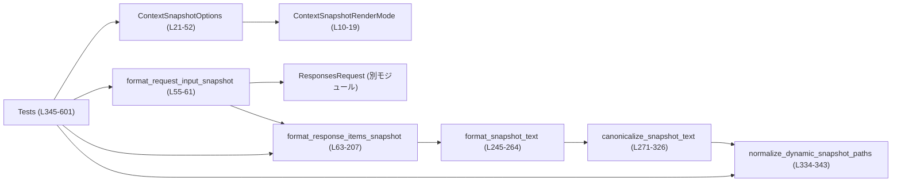
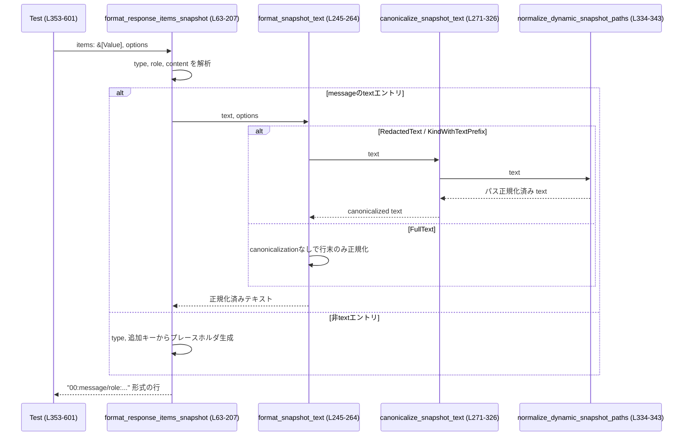

# core/tests/common/context_snapshot.rs コード解説

## 0. ざっくり一言

LLM の入出力コンテキスト（メッセージ群や関数呼び出しなど）を、テスト用の**安定したスナップショット文字列**に変換するユーティリティです。  
機密情報や一時パスなどをプレースホルダに正規化し、レンダリングモードに応じて全文・種別のみ・短いプレフィックスなどを出力します。  
（core/tests/common/context_snapshot.rs:L10-19, L55-61, L63-207, L271-343）

---

## 1. このモジュールの役割

### 1.1 概要

- このモジュールは、`ResponsesRequest` や `serde_json::Value` で表現されたコンテキスト（主にメッセージ配列）を、**スナップショット比較しやすい文字列形式に変換する**ために存在します。（L5, L55-61, L63-207）
- 出力はレンダリングモード（`ContextSnapshotRenderMode`）とオプション（`ContextSnapshotOptions`）により、  
  - テキストを正規化・マスキングした形  
  - 元テキストをほぼそのまま  
  - 種別のみ  
  - 種別＋テキストのプレフィックス  
  のいずれかになります。（L10-18, L245-264）
- `<environment_context>` や `<apps_instructions>` など特定のパターンは、テストが安定するよう**プレースホルダ文字列**に正規化されます。（L271-325, L334-343）

### 1.2 アーキテクチャ内での位置づけ

主な依存関係と呼び出し関係を Mermaid のフローチャートで表します。



- テストコードは `ContextSnapshotOptions` をビルダー風メソッドで構成し（L38-52, L353-367 など）、`format_response_items_snapshot` や `format_request_input_snapshot` を呼び出します。（L55-61, L63-207, L353-601）
- テキスト部分の変換は `format_snapshot_text` → `canonicalize_snapshot_text` → `normalize_dynamic_snapshot_paths` という流れで行われます。（L245-264, L271-326, L334-343）

### 1.3 設計上のポイント

- **責務の分割**  
  - 「項目配列全体のフォーマット」と「テキスト断片の正規化」を分離しています。  
    - 配列全体：`format_response_items_snapshot` が JSON 構造を解釈し、行単位の文字列に変換（L63-207）。  
    - テキスト断片：`format_snapshot_text` と `canonicalize_snapshot_text` がモード別の正規化を担当（L245-264, L271-326）。
- **状態の扱い**  
  - 大半はステートレスな純粋関数ですが、`normalize_dynamic_snapshot_paths` は `OnceLock<Regex>` を使い、正規表現インスタンスを**スレッド安全な遅延初期化の静的変数**として保持します。（L334-341）
- **エラーハンドリング方針**  
  - 外部 API はすべて `String` を返し、`Result` は使っていません。入力の欠損などは、`<MISSING_TYPE>` や `<NO_TEXT>` などのプレースホルダ文字列で表現し、エラーとしては扱いません。（L68-70, L134-139, L195-202）
  - 正規表現のコンパイル失敗は `expect` により panic となりますが、パターンがリテラルであるため通常は発生しない前提です。（L337-338）
- **並行性**  
  - `OnceLock<Regex>` により正規表現コンパイルは一度だけ行われ、複数スレッドからも安全に共有されます。（L334-341）
  - それ以外は共有可変状態を持たない関数のみです。

---

## 2. 主要な機能一覧

- コンテキスト配列のスナップショット化: `format_response_items_snapshot` が `Vec<Value>` 相当を人間可読な行形式に整形します。（L63-207）
- リクエスト全体のスナップショット化: `format_request_input_snapshot` が `ResponsesRequest` の `input()` を読み取り、スナップショット文字列を生成します。（L55-61）
- スナップショットのラベリング出力:  
  - `format_labeled_requests_snapshot` が複数の `ResponsesRequest` を「Scenario: ...」＋ Markdown セクション付きで整形します。（L209-225）  
  - `format_labeled_items_snapshot` が生の `&[Value]` に対して同様の形式を提供します。（L227-243）
- テキストの正規化とマスキング:  
  - `format_snapshot_text` / `canonicalize_snapshot_text` が、行末正規化・タグのプレースホルダ化・環境コンテキストの集約などを行います。（L245-264, L271-326）
- 一時パスの正規化: `normalize_dynamic_snapshot_paths` がシステムスキルの一時ディレクトリパスを安定したパスに置き換えます。（L334-343）
- Capability / AGENTS.md コンテキストの除去オプション: `ContextSnapshotOptions` のフラグにより、特定種別のコンテント部分をスナップショットから除外できます。（L21-26, L38-52, L88-104）

---

## 3. 公開 API と詳細解説

### 3.1 型一覧（構造体・列挙体など）

| 名前 | 種別 | 定義行 | 役割 / 用途 |
|------|------|--------|-------------|
| `ContextSnapshotRenderMode` | enum | L10-19 | スナップショットのレンダリング方法（全文・マスク・種別のみ等）を表すモード。（L10-18） |
| `ContextSnapshotOptions` | struct | L21-26 | レンダリングモードと、Capability や AGENTS.md コンテキストを除去するかどうかのフラグをまとめたオプション。（L21-26, L28-36, L38-52） |

※ テストモジュール内の型（`json!` マクロの出力など）はここでは省略します。

### 3.2 関数詳細（主要 7 件）

#### `format_response_items_snapshot(items: &[Value], options: &ContextSnapshotOptions) -> String`

**概要**

`serde_json::Value` の配列として表現されたコンテキスト（メッセージや関数呼び出しなど）を、  
1 行 1 アイテムのスナップショット文字列に変換します。（core/tests/common/context_snapshot.rs:L63-207）

**引数**

| 引数名 | 型 | 説明 |
|--------|----|------|
| `items` | `&[Value]` | `type` フィールドなどを持つ JSON オブジェクト配列。メッセージや関数呼び出しなどを表現。（L63-70, L81-203） |
| `options` | `&ContextSnapshotOptions` | レンダリングモードおよびフィルタリング設定。（L72-79, L88-104） |

**戻り値**

- 各要素を `"{idx:02}:..."` 形式で整形し、`\n` 区切りで連結した `String` を返します。（L64-67, L204-206）

**内部処理の流れ**

1. `items.iter().enumerate()` でインデックス付きで走査します。（L64-67）
2. 各要素の `type` を `item.get("type").and_then(Value::as_str)` で取得し、存在しなければ `"{idx:02}:<MISSING_TYPE>"` を返します。（L68-70）
3. `options.render_mode` が `KindOnly` の場合、内容を見ずに種別とロールのみを出力して終了します。  
   - `message` の場合: `"00:message/role"`（L72-76）  
   - それ以外: `"00:type"`（L77-78）
4. それ以外のモードでは `match item_type` により種別ごとに処理します。（L81-203）  
   - `"message"`:  
     - `role` を取得（なければ `"unknown"`）。（L83-83）  
     - `content` 配列を走査し、各エントリについて以下を行います。（L84-88, L89-125）  
       - `text` フィールドがある場合:  
         - オプションに応じて Capability / AGENTS.md コンテキストをスキップ。（L91-103）  
         - 残ったテキストを `format_snapshot_text` で正規化。（L104-104）  
       - `text` が無い場合:  
         - `type` を見て、`entry` がオブジェクトなら `"type"` / `"text"` 以外のキー名を収集（ソート）し、`"<type>"` または `"<type:key1,key2>"` の形で表現。（L106-124）  
         - オブジェクトでなければ `"<type>"`。（L111-113）  
       - エントリが完全に不明なら `"<UNKNOWN_CONTENT_ITEM>"` を使います。（L106-110）
     - `rendered_parts` の数に応じて、  
       - 0 個: `"...:<NO_TEXT>"`（L129-136）  
       - 1 個: `"...:{part0}"`（L137-139）  
       - 2 個以上: 複数行のインデント付き形式（`[01] ...`）。（L129-131, L141-147）
   - `"function_call"`: `name` フィールドを読み `"00:function_call/name"`。（L149-152）
   - `"function_call_output"`: `output` を読み `format_snapshot_text` で正規化し `"00:function_call_output:..."`。（L153-159）
   - `"local_shell_call"`:  
     - `action.command` 配列から文字列要素を結合し、`format_snapshot_text` で正規化。空なら `<NO_COMMAND>`。（L161-176）
   - `"reasoning"`:  
     - `summary` 配列の先頭要素の `text` を取り出して正規化（なければ `<NO_SUMMARY>`）。  
     - `encrypted_content` の有無を `encrypted=true/false` として付与。（L178-193）
   - `"compaction"`: `encrypted_content` の有無だけを `encrypted=true/false` で出力。（L195-200）
   - その他の `type`: `"00:other_type"` として出力。（L201-202）
5. 全行を `Vec<String>` に収集し、最後に `join("\n")` して返します。（L204-206）

**Examples（使用例）**

ユーザーのテキストメッセージ 1 件をデフォルト設定（RedactedText）でスナップショット化する例です。

```rust
use serde_json::json;
use core::tests::common::context_snapshot::{
    ContextSnapshotOptions,
    format_response_items_snapshot,
};

// 単一の user メッセージを JSON で構築する                     // Content は input_text 1 つ
let items = vec![json!({
    "type": "message",
    "role": "user",
    "content": [{
        "type": "input_text",
        "text": "hello"
    }]
})];

// デフォルトオプション（RedactedText モード）でレンダリング      // デフォルトは RedactedText（L28-35）
let options = ContextSnapshotOptions::default();
let snapshot = format_response_items_snapshot(&items, &options);

assert_eq!(snapshot, "00:message/user:hello");
```

**Errors / Panics**

- 当関数自体は `Result` を返さず、明示的なエラーは発生しません。
- ただし内部で呼び出す `format_snapshot_text` などが `unreachable!()` を持っていますが、  
  `render_mode == KindOnly` の場合は早期 return して `format_snapshot_text` を呼ばない設計のため、通常は panic に至りません。（L72-79, L245-264）

**Edge cases（エッジケース）**

- `type` が無い場合: `00:<MISSING_TYPE>` のように出力します。（L68-70）
- `message` で `content` が無い、もしくは空配列の場合: `<NO_TEXT>` を出力します。（L84-88, L126-128, L134-136）
- `content` 内エントリに `type` も `text` も無い場合: `<UNKNOWN_CONTENT_ITEM>` となります。（L106-110）
- `local_shell_call` で `command` が空または文字列でない場合: `<NO_COMMAND>` を出力します。（L161-176）
- `reasoning` / `compaction` で `encrypted_content` が空文字または存在しない場合: `encrypted=false` になります。（L187-200）
- レンダリングモード `KindOnly` の場合は**内容のテキストは一切出力されません**。（L72-79）

**使用上の注意点**

- **前提条件**: `items` 内の各オブジェクトは少なくとも `"type"` を持つことが想定されています。無い場合でも `<MISSING_TYPE>` として処理されますが、スナップショットの有用性は下がります。（L68-70）
- **テキストのマスキング**はレンダリングモードによって異なります。`FullText` モードでは `canonicalize_snapshot_text` を通さないため、AGENTS.md などもそのまま表示されます。（L245-252, L353-373）
- `ContextSnapshotOptions` のフラグ（Capability/AGENTS.md の除去）は、`KindOnly` モードでは適用されません。KindOnly はそもそも content を読まずに終了するためです。（L72-79, L88-104）

---

#### `format_request_input_snapshot(request: &ResponsesRequest, options: &ContextSnapshotOptions) -> String`

**概要**

`ResponsesRequest` 型のリクエストから `input()` を取得し、その配列を `format_response_items_snapshot` でスナップショット化します。（L55-61）

**引数**

| 引数名 | 型 | 説明 |
|--------|----|------|
| `request` | `&ResponsesRequest` | 別モジュールで定義されたリクエスト型。`input()` メソッドでコンテキスト配列を返すことが期待されています。（L55-60） |
| `options` | `&ContextSnapshotOptions` | レンダリングモードとフィルタ設定。（L56-58） |

**戻り値**

- `ResponsesRequest::input()` が返す配列に対する `format_response_items_snapshot` の結果文字列。（L59-60）

**内部処理の流れ**

1. `let items = request.input();` で入力配列への参照を取得します。（L59）
2. `items.as_slice()` を `format_response_items_snapshot` に渡し、その戻り値をそのまま返します。（L59-60）

**Examples（使用例）**

`ResponsesRequest` の定義はこのチャンクにはありませんが、概念的な使用例は次のようになります。

```rust
use core::tests::common::context_snapshot::{
    ContextSnapshotOptions,
    ContextSnapshotRenderMode,
    format_request_input_snapshot,
};
use crate::responses::ResponsesRequest; // 実際の定義は別モジュール

fn snapshot_request(req: &ResponsesRequest) -> String {
    let options = ContextSnapshotOptions::default()
        .render_mode(ContextSnapshotRenderMode::RedactedText); // モードを指定

    format_request_input_snapshot(req, &options)
}
```

**Errors / Panics**

- 当関数単体ではエラーを発生させず、`ResponsesRequest::input()` がパニックしないという前提です。  
  `input()` の仕様はこのチャンクには現れないため不明です。

**Edge cases**

- `input()` が空配列を返した場合、結果は空文字列（`""`）になります。（`format_response_items_snapshot` の仕様から推定、L63-67, L204-206）

**使用上の注意点**

- `ResponsesRequest` の `input()` がどのような JSON 構造を返すかは別モジュールの契約に依存します。このモジュールはその内容を前提にしているため、フォーマットが変わる場合はここも合わせて更新する必要があります。（L5, L55-61）

---

#### `format_labeled_requests_snapshot(scenario: &str, sections: &[(&str, &ResponsesRequest)], options: &ContextSnapshotOptions) -> String`

**概要**

複数の `ResponsesRequest` を「シナリオ名＋サブセクション」形式の文字列にまとめて出力します。  
各セクションは `## タイトル` の Markdown 見出しと、その下に `format_request_input_snapshot` の結果を含みます。（L209-225）

**引数**

| 引数名 | 型 | 説明 |
|--------|----|------|
| `scenario` | `&str` | 全体のシナリオ名。出力先頭に `Scenario: ...` として埋め込まれます。（L209-213, L224） |
| `sections` | `&[(&str, &ResponsesRequest)]` | `(タイトル, リクエスト)` の組の配列。各要素が 1 セクションになります。（L210-212, L214-223） |
| `options` | `&ContextSnapshotOptions` | 全セクション共通で使うオプション。（L212, L219-220） |

**戻り値**

- 以下のような形式の `String` を返します。（L214-225）

```text
Scenario: {scenario}

## {title_1}
{snapshot_1}

## {title_2}
{snapshot_2}
...
```

**内部処理の流れ**

1. `sections.iter()` で各 `(title, request)` を走査します。（L214-216）
2. 各要素に対して `format!("## {title}\n{}", format_request_input_snapshot(request, options))` を生成します。（L217-220）
3. それらを `"\n\n"` 区切りで連結します。（L221-223）
4. 最後に `format!("Scenario: {scenario}\n\n{sections}")` でシナリオヘッダを付けて返します。（L224）

**Examples（使用例）**

```rust
fn print_scenarios(sectioned: &[(&str, &ResponsesRequest)]) {
    use core::tests::common::context_snapshot::{
        ContextSnapshotOptions, format_labeled_requests_snapshot,
    };

    let options = ContextSnapshotOptions::default();
    let snapshot = format_labeled_requests_snapshot("tool calling", sectioned, &options);

    println!("{snapshot}");
}
```

**Errors / Panics**

- 当関数自体はエラーを返さず、内部の `format_request_input_snapshot` 依存です。（L217-220）

**Edge cases**

- `sections` が空の場合でも、`"Scenario: {scenario}\n\n"` という最小構造を返します。（L214-225）

**使用上の注意点**

- シナリオをまたいでスナップショット比較を行う場合、セクションタイトルとシナリオ名が両方スナップショットの一部になる点に注意が必要です。テストの安定性のため、これらを頻繁に変更しないようにする必要があります。

---

#### `format_labeled_items_snapshot(scenario: &str, sections: &[(&str, &[Value])], options: &ContextSnapshotOptions) -> String`

**概要**

`format_labeled_requests_snapshot` の `ResponsesRequest` 版ではなく、生の `&[Value]` を直接受け取るバージョンです。  
テストで手書きの JSON をスナップショット化したい場合に使われます。（L227-243）

**引数**

| 引数名 | 型 | 説明 |
|--------|----|------|
| `scenario` | `&str` | シナリオ名。（L227-231, L242） |
| `sections` | `&[(&str, &[Value])]` | `(タイトル, items スライス)` の配列。（L228-230, L232-239） |
| `options` | `&ContextSnapshotOptions` | レンダリング設定。（L230-231） |

**戻り値**

- `Scenario: ...` ヘッダと各セクションのスナップショットをまとめた文字列。（L232-243）

**内部処理の流れ**

- `format_labeled_requests_snapshot` と同様ですが、内部で `format_response_items_snapshot(items, options)` を呼び出します。（L235-238）

**Examples（使用例）**

テストからの典型的な使い方（単一セクションの例）：

```rust
use serde_json::json;
use core::tests::common::context_snapshot::{
    ContextSnapshotOptions,
    format_labeled_items_snapshot,
};

let items = vec![json!({
    "type": "message",
    "role": "user",
    "content": [{ "type": "input_text", "text": "hello" }]
})];

let options = ContextSnapshotOptions::default();
let sections = &[("single message", items.as_slice())];

let snapshot = format_labeled_items_snapshot("basic scenario", sections, &options);

println!("{snapshot}");
```

**Errors / Panics**

- パニックやエラーは発生しません。内部は `format_response_items_snapshot` に依存します。（L235-238）

**Edge cases**

- `sections` が空の場合、`Scenario:` 行だけを返します。（L232-243）

**使用上の注意点**

- `items` 配列の各要素の構造は `format_response_items_snapshot` の契約に従います。  
  ここでは追加のバリデーションは行っていません。

---

#### `format_snapshot_text(text: &str, options: &ContextSnapshotOptions) -> String`

**概要**

単一のテキスト断片に対して、レンダリングモードに応じた**正規化・マスキング**を行うユーティリティです。（L245-264）

**引数**

| 引数名 | 型 | 説明 |
|--------|----|------|
| `text` | `&str` | 元のテキスト。Capability 指示や環境コンテキストなどを含むことがあります。（L245-245, L271-326） |
| `options` | `&ContextSnapshotOptions` | `render_mode` を参照します。他のフラグはここでは使用しません。（L245-247） |

**戻り値**

- 行末を正規化し、必要に応じて canonicalization を行ったうえで、内部の改行を `\\n` にエスケープした文字列を返します。（L247-252, L254-261）

**内部処理の流れ**

1. `match options.render_mode` でモードを分岐します。（L245-247）
2. `RedactedText` の場合:  
   - `canonicalize_snapshot_text(text)` でタグや環境コンテキストなどをプレースホルダに変換します。（L247-249, L271-326）  
   - `normalize_snapshot_line_endings` で CRLF を LF に統一し、行内の `\n` を `\\n` に置き換えます。（L247-249, L267-269）
3. `FullText` の場合:  
   - canonicalization は行わず、`normalize_snapshot_line_endings` のみ適用したうえで、同様に `\n` を `\\n` に変換します。（L250-252）
4. `KindWithTextPrefix { max_chars }` の場合:  
   - `RedactedText` と同様に canonicalization と行末正規化を行い、`\\n` に変換したあと、`chars().count()` が `max_chars` 以下ならそのまま、超えるなら先頭 `max_chars` 文字＋`"..."` に切り詰めます。（L253-261）
5. `KindOnly` はここでは到達しない前提で `unreachable!()` になっています。（L263-263）

**Examples（使用例）**

`canonicalize_snapshot_text` と合わせて、RedactedText で環境コンテキストをマスクする例：

```rust
use core::tests::common::context_snapshot::{
    ContextSnapshotOptions,
    ContextSnapshotRenderMode,
    format_snapshot_text,
};

let text = "<environment_context>\n  <cwd>/tmp/example</cwd>\n</environment_context>";
let options = ContextSnapshotOptions::default()
    .render_mode(ContextSnapshotRenderMode::RedactedText);

let out = format_snapshot_text(text, &options);

// ENVIRONMENT_CONTEXT と cwd がマスクされ、改行が \n に変換される
assert_eq!(out, "<ENVIRONMENT_CONTEXT:cwd=<CWD>>");
```

※ 実際には `format_response_items_snapshot` 経由で呼ばれるため、`"00:message/user:..."` の形になります。（L84-104, L134-139）

**Errors / Panics**

- `ContextSnapshotRenderMode::KindOnly` が渡された場合、`unreachable!()` により panic します。（L263）  
  ただし、現状の呼び出し側（`format_response_items_snapshot`）では `KindOnly` の場合にこの関数を呼ばないようになっています。（L72-79）
- それ以外のモードでは panic しません。

**Edge cases**

- `max_chars` が非常に小さい場合、`KindWithTextPrefix` で末尾の `"..."` を含めると、テキスト本体がごく短くなります。（L253-261）
- 絵文字やサロゲートペアを含む場合でも、`chars()` ベースでカウントしているため、文字単位できれいに切り詰められます。（L256-260）

**使用上の注意点**

- `FullText` モードでは canonicalization を行わないため、機密情報や一時ディレクトリパスをマスクしたい場合には不適切です。（L250-252）
- `KindOnly` モードでこの関数を直接呼ぶのは契約違反です。`KindOnly` の処理は `format_response_items_snapshot` に任せる前提になっています。（L72-79, L263）

---

#### `canonicalize_snapshot_text(text: &str) -> String`

**概要**

特定のプレフィックスやタグを持つテキストを、スナップショット比較に適した**安定したプレースホルダ**に変換します。  
環境コンテキスト、AGENTS.md、各種 instructions、コンパクションメッセージなどを対象とします。（L271-326）

**引数**

| 引数名 | 型 | 説明 |
|--------|----|------|
| `text` | `&str` | 元のテキスト。タグや説明文が先頭に現れることを前提にしています。（L271-325） |

**戻り値**

- 必要に応じて各種プレースホルダ（例: `<APPS_INSTRUCTIONS>`, `<ENVIRONMENT_CONTEXT:cwd=<CWD>>`）に置き換えた `String`。該当しない場合は `normalize_dynamic_snapshot_paths(text)` の結果を返します。（L272-325, L334-343）

**内部処理の流れ**

1. `<permissions instructions>` で始まる場合: `<PERMISSIONS_INSTRUCTIONS>` に置換。（L272-274）
2. `APPS_INSTRUCTIONS_OPEN_TAG` で始まる場合: `<APPS_INSTRUCTIONS>`。（L275-277）
3. `SKILLS_INSTRUCTIONS_OPEN_TAG` で始まる場合: `<SKILLS_INSTRUCTIONS>`。（L278-280）
4. `PLUGINS_INSTRUCTIONS_OPEN_TAG` で始まる場合: `<PLUGINS_INSTRUCTIONS>`。（L281-283）
5. `"# AGENTS.md instructions for "` で始まる場合: `<AGENTS_MD>`。（L284-286）
6. `<environment_context>` で始まる場合:  
   - `<subagents> ... </subagents>` 内の行から、`"- "` で始まる行の数を数え `subagent_count` とします。（L287-297）  
   - `subagent_count > 0` なら `":subagents={n}"` を suffix として構築。（L298-302）  
   - `<cwd>...</cwd>` が存在する場合、  
     - 値が `"PRETURN_CONTEXT_DIFF_CWD"` で終わるなら `<ENVIRONMENT_CONTEXT:cwd=PRETURN_CONTEXT_DIFF_CWD{subagents_suffix}>`。（L303-307）  
     - それ以外は `<ENVIRONMENT_CONTEXT:cwd=<CWD>{subagents_suffix}>`。（L303-309）  
   - `<cwd>` が無い場合は `<ENVIRONMENT_CONTEXT{subagents_suffix}>` または `<ENVIRONMENT_CONTEXT>`。（L311-315）
7. `"You are performing a CONTEXT CHECKPOINT COMPACTION."` で始まる場合: `<SUMMARIZATION_PROMPT>`。（L317-319）
8. `"Another language model started to solve this problem"` で始まり、`\n` で本文と分割できる場合: `<COMPACTION_SUMMARY>\n{summary}` に変換。（L320-323）
9. 上記のいずれにも該当しない場合: `normalize_dynamic_snapshot_paths(text)` を呼んで返します。（L325-325, L334-343）

**Examples（使用例）**

```rust
use core::tests::common::context_snapshot::canonicalize_snapshot_text;

let text = "<environment_context>\n  <cwd>/tmp/example</cwd>\n</environment_context>";
let canonical = canonicalize_snapshot_text(text);

assert_eq!(canonical, "<ENVIRONMENT_CONTEXT:cwd=<CWD>>");
```

**Errors / Panics**

- 当関数には panic を起こすコードは含まれていません。`split_once`, `find` 等は `Option` を返し、`unwrap` や `expect` は使用していません。（L288-297, L303-310）

**Edge cases**

- `<subagents>` ブロックが存在しても、`"- "` で始まる行が無ければ `subagents=0` として扱い、省略します。（L292-302）
- `<cwd>` タグの順序や位置には特に制約が無く、`find` により最初の出現を使用します。（L303-305）
- `"Another language model started..."` のケースでは、先頭行以外の内容は `summary` 部分としてそのまま保持されます。（L320-323）
- いずれの条件にも当てはまらない場合は、そのまま `normalize_dynamic_snapshot_paths` に委譲されます。（L325, L334-343）

**使用上の注意点**

- この関数は**先頭一致**で判定しており、途中に `<environment_context>` 等が現れても処理されません。（L272-287, L317-320）
- 文字列全体を解析するわけではないため、構造不正な HTML 風タグが含まれていても基本的には無視されます。

---

#### `normalize_dynamic_snapshot_paths(text: &str) -> String`

**概要**

システムスキルの一時ディレクトリパスのような、「実行ごとに変わる可能性がある」パス文字列を、安定したプレースホルダパス  
`<SYSTEM_SKILLS_ROOT>/{skill_name}/SKILL.md` に置き換えます。（L334-343）

**引数**

| 引数名 | 型 | 説明 |
|--------|----|------|
| `text` | `&str` | パスを含む任意のテキスト。行全体でなくても構いません。（L334-343） |

**戻り値**

- 対象パス部分を置換した `String`。マッチしない部分はそのまま残ります。（L340-342）

**内部処理の流れ**

1. 静的変数 `SYSTEM_SKILL_PATH_RE: OnceLock<Regex>` に、必要に応じて正規表現をコンパイルして格納します。（L335-339）  
   - パターン: `r"/[^)\n]*/skills/\.system/([^/\n]+)/SKILL\.md"`  
     - 任意のディレクトリパス（`/` から始まり `)` か改行以外）  
     - `/skills/.system/{skill_name}/SKILL.md` の形をキャプチャ。（L337）
2. `replace_all` により、すべてのマッチを `<SYSTEM_SKILLS_ROOT>/$1/SKILL.md` に置換します。（L340-342）
3. `Cow<str>` を `into_owned()` して `String` として返します。（L341-342）

**Examples（使用例）**

テストにも同様のケースが存在します。（L585-600）

```rust
use core::tests::common::context_snapshot::normalize_dynamic_snapshot_paths;

let input = "file: /tmp/.tmp123/skills/.system/openai-docs/SKILL.md";
let out = normalize_dynamic_snapshot_paths(input);

assert_eq!(out, "file: <SYSTEM_SKILLS_ROOT>/openai-docs/SKILL.md");
```

**Errors / Panics**

- 正規表現コンパイル時（`Regex::new`）に失敗した場合、`expect` により panic します。（L337-338）  
  ただしパターンはソースコード中の固定文字列であり、通常はコンパイル時と同等に安全とみなされます。
- それ以外の処理で panic する可能性はありません。

**Edge cases**

- 文中に複数の対象パスが含まれている場合、すべて置換されます。（L340-342）
- パスが `")"` や改行を含む場合はマッチしないため、そのまま残ります。（L337）
- スキル名の部分（`([^/\n]+)`）には `/` と改行以外を許容しているため、空文字や `/` を含むケースはマッチしません。

**使用上の注意点**

- この正規表現は「`/skills/.system/` 以降の 1 セグメント」をスキル名として想定しています。それ以外の構造のパスはプレースホルダ化されないため、テストの安定性確保のためにはこの形に揃える必要があります。（L337）

---

### 3.3 その他の関数・メソッド

| 名前 | 種別 | 定義行 | 役割（1 行） |
|------|------|--------|--------------|
| `ContextSnapshotOptions::default` | `impl Default` | L28-36 | `render_mode` を `RedactedText`、フラグをすべて `false` に設定したデフォルトオプションを返します。 |
| `ContextSnapshotOptions::render_mode(self, render_mode)` | メソッド | L38-42 | 現在のオプションから `render_mode` を変更した新しい `ContextSnapshotOptions` を返すビルダー風メソッドです。 |
| `ContextSnapshotOptions::strip_capability_instructions(self)` | メソッド | L44-47 | Capability instructions をスナップショットから除外するフラグを `true` にしたオプションを返します。 |
| `ContextSnapshotOptions::strip_agents_md_user_context(self)` | メソッド | L49-52 | `# AGENTS.md instructions ...` をユーザーメッセージから除外するフラグを `true` にしたオプションを返します。 |
| `normalize_snapshot_line_endings(text)` | 関数 | L267-269 | `\r\n` や単独 `\r` をすべて `\n` に変換して行末を正規化します。 |
| `is_capability_instruction_text(text)` | 関数 | L328-332 | `APPS_`/`SKILLS_`/`PLUGINS_` instructions の開始タグで始まるかどうかをチェックします。 |

**メソッド使用例（ビルダーパターン）**

テストで実際に使われている書き方です。（L457-462）

```rust
use core::tests::common::context_snapshot::{
    ContextSnapshotOptions,
    ContextSnapshotRenderMode,
};

let options = ContextSnapshotOptions::default()
    .render_mode(ContextSnapshotRenderMode::RedactedText)
    .strip_capability_instructions()
    .strip_agents_md_user_context();
```

---

## 4. データフロー

ここでは、`format_response_items_snapshot` が user/developer メッセージを処理する典型的なフローを示します。

### 処理の要点（メッセージテキストの流れ）

1. テストコードが `serde_json::Value` でメッセージ配列を構築し、`format_response_items_snapshot` を呼びます。（L353-362, L63-207）
2. 各メッセージの `content` 内の `text` フィールドが抽出され、必要に応じて Capability / AGENTS.md が削除されます。（L88-104）
3. 残ったテキストは `format_snapshot_text` → `canonicalize_snapshot_text` → `normalize_dynamic_snapshot_paths` の順に処理され、  
   行末正規化・タグプレースホルダ化・パスプレースホルダ化が行われます。（L245-264, L271-326, L334-343）
4. 最終的に `"00:message/role:..."` 形式の行が組み立てられ、全アイテムを `\n` で連結した文字列として返されます。（L129-147, L204-206）

### シーケンス図（メッセージ 1 件の処理）



この図は、`format_response_items_snapshot`（L63-207）およびその下位関数がどのように連携してテキストを正規化しているかを表します。

---

## 5. 使い方（How to Use）

### 5.1 基本的な使用方法

典型的には、テストコードから JSON 形式のメッセージ配列を作り、`ContextSnapshotOptions` を設定してスナップショットを生成します。

```rust
use serde_json::json;
use core::tests::common::context_snapshot::{
    ContextSnapshotOptions,
    ContextSnapshotRenderMode,
    format_response_items_snapshot,
};

// 1. 入力メッセージを JSON で構築する                                  // user ロールの単純なメッセージ
let items = vec![json!({
    "type": "message",
    "role": "user",
    "content": [{
        "type": "input_text",
        "text": "Hello\nWorld"
    }]
})];

// 2. オプションを準備する                                              // RedactedText で行末を正規化しつつ出力
let options = ContextSnapshotOptions::default()
    .render_mode(ContextSnapshotRenderMode::RedactedText);

// 3. スナップショット文字列を生成する
let snapshot = format_response_items_snapshot(&items, &options);

// 4. スナップショットをテストの期待値と比較する
assert_eq!(snapshot, "00:message/user:Hello\\nWorld");
```

`ResponsesRequest` がある場合は、`format_request_input_snapshot` 経由で同様に扱えます。（L55-61）

### 5.2 よくある使用パターン

1. **全文スナップショット（Diff を見たい場合）**

```rust
let snapshot = format_response_items_snapshot(
    &items,
    &ContextSnapshotOptions::default()
        .render_mode(ContextSnapshotRenderMode::FullText),
);
// テキストは canonicalization されず、そのまま出力されます。（L250-252）
```

1. **マスク付きスナップショット（機密情報を避けたい場合）**

```rust
let snapshot = format_response_items_snapshot(
    &items,
    &ContextSnapshotOptions::default()
        .render_mode(ContextSnapshotRenderMode::RedactedText)
        .strip_capability_instructions()              // Capability instruction を除外（L44-47, L92-97）
        .strip_agents_md_user_context(),              // AGENTS.md コンテキストを除外（L49-52, L98-103）
);
```

1. **種別＋プレフィックスのみ（大きなテキストをざっくり確認したい場合）**

```rust
let snapshot = format_response_items_snapshot(
    &items,
    &ContextSnapshotOptions::default()
        .render_mode(ContextSnapshotRenderMode::KindWithTextPrefix { max_chars: 80 }),
);
// 長いテキストは先頭 80 文字＋ "..." に切り詰められます。（L253-261）
```

1. **種別のみ（KindOnly）でログ量を減らす**

```rust
let snapshot = format_response_items_snapshot(
    &items,
    &ContextSnapshotOptions::default()
        .render_mode(ContextSnapshotRenderMode::KindOnly),
);
// "00:message/user" や "01:function_call/tool_name" のような形になります。（L72-78）
```

### 5.3 よくある間違い

```rust
use core::tests::common::context_snapshot::{
    ContextSnapshotOptions,
    ContextSnapshotRenderMode,
    format_snapshot_text,
};

// 間違い例: KindOnly モードで format_snapshot_text を直接呼ぶ
let options = ContextSnapshotOptions::default()
    .render_mode(ContextSnapshotRenderMode::KindOnly);
// let text_out = format_snapshot_text("hello", &options); // panic する可能性あり（unreachable!、L263）

// 正しい例: KindOnly モードの処理は format_response_items_snapshot に任せる
let snapshot = format_response_items_snapshot(&items, &options);
```

```rust
// 間違い例: FullText でも AGENTS.md をマスクしてくれると思い込む
let options = ContextSnapshotOptions::default()
    .render_mode(ContextSnapshotRenderMode::FullText);
// このモードでは canonicalize_snapshot_text が呼ばれない（L250-252）
// → AGENTS.md などは生テキストのまま出力される

// 正しい例: マスクしたい場合は RedactedText または KindWithTextPrefix を使う
let options = ContextSnapshotOptions::default()
    .render_mode(ContextSnapshotRenderMode::RedactedText);
```

### 5.4 使用上の注意点（まとめ）

- **モードとマスキングの関係**  
  - `RedactedText` / `KindWithTextPrefix`: `canonicalize_snapshot_text` によるプレースホルダ化を行います。（L247-249, L253-256）  
  - `FullText`: プレースホルダ化を行わず、行末正規化のみです。（L250-252）  
  - `KindOnly`: テキストの中身は一切見ません。（L72-79）
- **Capability / AGENTS.md 除去フラグ**  
  - Capability 指示の除去は developer メッセージの `text` にのみ作用します。（L92-97）  
  - AGENTS.md の除去は user メッセージの `text` にのみ作用します。（L98-103）
- **並行性・安全性**  
  - 静的な正規表現は `OnceLock` によりスレッド安全に初期化されます。（L334-341）  
  - それ以外は共有可変状態を持たない純粋関数であり、読み取り専用の引数のみを扱います。
- **エラー/パニック条件**  
  - `format_snapshot_text` を `KindOnly` モードで直接呼ぶと panic し得ます（契約違反）。（L263）  
  - 正規表現パターンの変更時に誤ったパターンを指定すると、最初の呼び出しで panic します。（L337-338）

---

## 6. 変更の仕方（How to Modify）

### 6.1 新しい機能を追加する場合

1. **新しい `type` を扱いたい場合**  
   - `format_response_items_snapshot` の `match item_type` に新しい分岐を追加します。（L81-203）  
   - 必要であれば、その type 固有の正規化関数を別途定義し、`format_snapshot_text` を活用します。
2. **新しいプレースホルダ変換ルールを追加したい場合**  
   - `canonicalize_snapshot_text` に `text.starts_with("...")` のブロックを追加し、適切なプレースホルダ文字列を返します。（L271-325）  
   - 必要に応じてテストを追加して期待する出力を固定します。（L353-601）
3. **新しい動的パスパターンを正規化したい場合**  
   - `normalize_dynamic_snapshot_paths` に正規表現を追加するか、既存のパターンを拡張します。（L334-343）  
   - パターン変更時は必ず `Regex::new(...)` がコンパイルに成功することを確認します。（L337-338）

### 6.2 既存の機能を変更する場合

- **影響範囲の確認**  
  - `format_response_items_snapshot` の出力フォーマットを変更すると、多数のスナップショットテストに影響します。  
    テストモジュール内の期待値（`assert_eq!` の右辺）を一斉に確認する必要があります。（L353-601）
- **契約の維持**  
  - `ContextSnapshotRenderMode::KindOnly` が `format_snapshot_text` に到達しないという前提（`unreachable!()`）を維持するか、  
    もし直接使用したいなら `KindOnly` ブランチを `format_snapshot_text` に実装する必要があります。（L72-79, L263）
  - `ContextSnapshotOptions` のビルダーメソッドはすべて `self` を消費して返す形になっているため、この API の形を変えると既存コードとの互換性に影響します。（L38-52）
- **テストとスナップショットの更新**  
  - 出力形式やプレースホルダの命名を変更した場合、対応するテストを更新し、新旧の差分を確認することが重要です。（L353-601）

---

## 7. 関連ファイル

| パス / モジュール | 役割 / 関係 |
|-------------------|------------|
| `crate::responses::ResponsesRequest` | `format_request_input_snapshot` および `format_labeled_requests_snapshot` から使用されるリクエスト型。`input()` メソッドでスナップショット対象の items を取得します。（L5, L55-61, L209-220） |
| `codex_protocol::protocol::{APPS_INSTRUCTIONS_OPEN_TAG, SKILLS_INSTRUCTIONS_OPEN_TAG, PLUGINS_INSTRUCTIONS_OPEN_TAG}` | Capability instructions の開始タグ定数。`canonicalize_snapshot_text` と `is_capability_instruction_text` が使用します。（L6-8, L275-283, L328-332） |
| `regex_lite::Regex` | 動的パス正規化のための正規表現ライブラリ。`normalize_dynamic_snapshot_paths` で使用されます。（L1, L334-343） |
| テストモジュール `core/tests/common/context_snapshot.rs::tests` | 本モジュールの動作を検証するユニットテスト群。レンダリングモードごとの挙動や canonicalization の結果を固定します。（L345-601） |

このチャンクには、`ResponsesRequest` 自体の定義や、`crate::responses` がどのファイルに存在するかといった詳細は現れていません。そのため、それらの内部構造や仕様はここからは分かりません。
