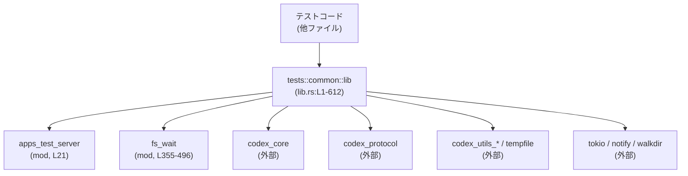

# core/tests/common/lib.rs コード解説

## 0. ざっくり一言

`core/tests/common/lib.rs` は Codex コアクレートのテスト共通ユーティリティ集であり、  
テスト用の設定生成・パス操作・イベント待ち・ファイル監視・SSE フィクスチャ生成・環境依存のテストスキップマクロなどを提供するモジュールです（lib.rs:L21-29, L64-353, L355-496, L498-611）。

---

## 1. このモジュールの役割

### 1.1 概要

このモジュールは **Codex の統合テストを環境に依存せず安定して実行する** ために存在し、主に次のような機能を提供します。

- テストプロセス起動時の一括初期化（決定的な PID・スレッド管理、`insta` スナップショット用ワークスペース設定）（lib.rs:L33-37, L39-42, L45-62）
- OS ごとの差異を吸収したパス／絶対パスユーティリティおよび `TempDir` 拡張（lib.rs:L74-125, L109-117）
- テスト用の Codex `Config` を一時ディレクトリに閉じ込めて構築するヘルパー（lib.rs:L163-188）
- DotSlash リソース取得、SSE フィクスチャ文字列生成などの周辺ユーティリティ（lib.rs:L127-161, L207-253）
- Codex スレッドからのイベント待ちヘルパー（タイムアウト付き）（lib.rs:L255-294）
- ファイル生成／変更を待つ非同期ユーティリティ（`fs_wait` サブモジュール）（lib.rs:L355-496）
- サンドボックス／ネットワーク有無／リモート環境などに応じたテストスキップ用マクロ群（lib.rs:L498-611）

### 1.2 アーキテクチャ内での位置づけ

このファイルは `tests/common` の「テスト共通基盤」として、他のテストモジュールから再利用されます（lib.rs:L21-29）。

- 外部依存:
  - `codex_core`（`CodexThread`, 設定ビルダ, spawn/shell など）（lib.rs:L11-14, L296-302, L331-343）
  - `codex_protocol` の `EventMsg`（イベント待ち系）（lib.rs:L255-281）
  - `codex_utils_absolute_path`, `codex_utils_cargo_bin`（パス／バイナリ探索）（lib.rs:L15-17, L6, L50-52, L175-182, L351-353）
  - Tokio（非同期・タイムアウト制御、`spawn_blocking`）（lib.rs:L262, L274-283, L366-367, L369-388）
  - `notify` + `walkdir`（ファイルシステム監視）（lib.rs:L358-359, L367, L390-468）

- 内部依存:
  - 上記ユーティリティ関数を `skip_if_*` 等のマクロから利用（`$crate::sandbox_env_var()` など）（lib.rs:L498-521, L524-541, L544-565, L569-601）
  - `fs_wait` 内で `nearest_existing_ancestor`, `scan_for_match` を内部ヘルパーとして利用（lib.rs:L390-429, L431-468, L471-495）

代表的な依存関係を図示します。



### 1.3 設計上のポイント

- **プロセス起動時の一括初期化**  
  - `#[ctor]` 属性を付けた関数でテストモードや決定的な PID 生成を有効化しています（lib.rs:L33-37, L39-42）。
  - スナップショットテスト用の `INSTA_WORKSPACE_ROOT` を、未設定の場合のみリポジトリルートから設定します（lib.rs:L45-61）。

- **テストの「閉じた世界」を作る設計**  
  - `TempDir` を基準とした `load_default_config_for_test` により、テストのディスク書き込みをテスト専用ディレクトリに隔離しています（lib.rs:L163-173）。
  - Linux の場合は `ConfigOverrides` を使って sandbox バイナリをテスト用に差し替えています（lib.rs:L175-183, L191-205）。

- **エラーハンドリングの方針**  
  - 多くのテスト用関数は「失敗 = テスト失敗」として `expect` や `panic!` を使用しており（例: `assert_regex_match`, `load_default_config_for_test`、lib.rs:L65-71, L171-172）、戻り値でのエラー通知は `fetch_dotslash_file`, `fs_wait` など一部のユーティリティに限定されています（lib.rs:L127-161, L369-388）。

- **並行性への配慮**  
  - イベント待ちは Tokio の `timeout` を用い、テストが無限に待ち続けないようにしています（lib.rs:L274-294）。
  - ファイル監視はブロッキング I/O で実装しつつ、`tokio::task::spawn_blocking` により非同期ランタイムのワーカースレッドをブロックしないようにしています（lib.rs:L369-375, L377-388, L390-429, L431-468）。

- **環境依存テストの切り替え**  
  - サンドボックス／ネットワーク／リモート実行環境を環境変数で検出し、それぞれに対応する `skip_if_*` マクロでテストをスキップできるようにしています（lib.rs:L498-541, L544-565, L569-601, L604-611）。

---

## 2. 主要な機能一覧

このモジュールが提供する主な機能は次のとおりです。

- テスト初期化:
  - 決定的なスレッド管理・プロセス ID の有効化（lib.rs:L33-37）
  - `insta` 用ワークスペースルートの自動設定（lib.rs:L45-61）
- パス／絶対パス・一時ディレクトリユーティリティ（Windows/Unix 両対応）（lib.rs:L74-125, L109-121）
- DotSlash リソース取得（外部 `dotslash` コマンドの実行）（lib.rs:L127-161）
- テスト用 Codex 設定 (`Config`) の構築（sandbox バイナリの上書きを含む）（lib.rs:L163-188, L191-205）
- SSE ストリームフィクスチャ文字列の生成（ファイル／文字列から）（lib.rs:L207-253）
- Codex イベントストリームからのイベント待ちヘルパー（条件付き／タイムアウト付き）（lib.rs:L255-294）
- サンドボックス／ネットワーク／リモート環境の検出とテストスキップマクロ群（lib.rs:L296-308, L498-601）
- 現在のユーザーシェルに応じたコマンドラインの構築・表示用ヘルパー（lib.rs:L331-349）
- テスト用 stdio サーバーバイナリの探索（lib.rs:L351-353）
- ファイル存在・条件付きファイル検出を待つ非同期ヘルパー群（`fs_wait`）（lib.rs:L355-496）

### 2.1 コンポーネント一覧（インベントリー）

主な構成要素の一覧です。

| 種別 | 名前 | 公開 | 役割 / 用途 | 定義 |
|------|------|------|-------------|------|
| モジュール | `apps_test_server` ほか 8 モジュール | `pub` | 各種テスト用サブモジュールの入り口 | lib.rs:L21-29 |
| 再エクスポート | `PathBufExt`, `PathExt` | `pub use` | `AbsolutePathBuf` 周辺のテストサポート拡張メソッド | lib.rs:L15-17 |
| 静的変数 | `TEST_ARG0_PATH_ENTRY` | `static` | `codex_arg0` の `Arg0PathEntryGuard` をキャッシュし、テスト中のバイナリ解決に利用 | lib.rs:L31 |
| トレイト | `TempDirExt` | `pub trait` | `TempDir` から `AbsolutePathBuf` を取得する拡張 | lib.rs:L109-117 |
| 構造体 | `RemoteEnvConfig` | `pub struct` | リモートテスト環境（コンテナ名）の設定保持 | lib.rs:L310-313 |
| サブモジュール | `fs_wait` | `pub mod` | ファイル存在・条件一致ファイル検出を待つ非同期ユーティリティ群 | lib.rs:L355-496 |
| マクロ | `skip_if_sandbox`, `skip_if_no_network`, `skip_if_remote`, `codex_linux_sandbox_exe_or_skip`, `skip_if_windows` | `#[macro_export]` | 環境に応じてテストをスキップするためのマクロ群 | lib.rs:L498-521, L524-541, L545-565, L569-601, L605-611 |

---

## 3. 公開 API と詳細解説

### 3.1 型一覧（構造体・トレイトなど）

| 名前 | 種別 | 公開 | 役割 / 用途 | フィールド / メソッド概要 | 定義 |
|------|------|------|-------------|----------------------------|------|
| `TempDirExt` | トレイト | `pub` | `tempfile::TempDir` から `AbsolutePathBuf` を取得する拡張。テストコードが簡単に絶対パスを扱えるようにする。 | `fn abs(&self) -> AbsolutePathBuf` | lib.rs:L109-117 |
| `RemoteEnvConfig` | 構造体 | `pub` | リモートテスト環境の情報を保持。現在はコンテナ名のみ。 | `container_name: String` | lib.rs:L310-313 |

---

### 3.2 関数詳細（代表的な 7 件）

#### `assert_regex_match(pattern: &str, actual: &'s str) -> regex_lite::Captures<'s>`（lib.rs:L64-72）

**概要**

- 正規表現 `pattern` が文字列 `actual` にマッチすることを検証し、マッチ結果のキャプチャを返すテスト用ヘルパーです。
- パターン不正やマッチ失敗時には `panic!` し、`#[track_caller]` により呼び出し元の位置をエラーメッセージに反映します。

**引数**

| 引数名 | 型 | 説明 |
|--------|----|------|
| `pattern` | `&str` | `regex_lite` 形式の正規表現パターン |
| `actual` | `&'s str` | マッチ対象の文字列 |

**戻り値**

- `regex_lite::Captures<'s>`  
  マッチに成功した場合のキャプチャオブジェクト。キャプチャグループを使用している場合はこれを通じて取得できます。

**内部処理の流れ**

1. `Regex::new(pattern)` で正規表現をコンパイルし、失敗した場合は `panic!("failed to compile regex ...")`（lib.rs:L66-68）。
2. `regex.captures(actual)` でマッチを試みる（lib.rs:L69-70）。
3. マッチ結果が `None` の場合は `panic!("regex ... did not match ...")`（lib.rs:L71）。
4. 成功した場合は `Captures` をそのまま返却。

**Examples（使用例）**

```rust
// 出力テキストが "error: <数値>" という形式か検証する例
let output = "error: 42"; // テスト対象の出力

let caps = core::tests::common::assert_regex_match(r"^error: (\d+)$", output);
// caps[1] に数値部分 "42" が入っていることを検証できる
assert_eq!(&caps[1], "42");
```

**Errors / Panics**

- パターンが不正な場合: `Regex::new` がエラーとなり `panic!`（lib.rs:L66-68）。
- `actual` にマッチしない場合: `captures` が `None` となり `panic!`（lib.rs:L69-71）。

**Edge cases（エッジケース）**

- 空文字列 `actual` でもパターン次第でマッチ可能です。マッチしなければ `panic!` になります。
- 非常に複雑な正規表現や巨大な入力に対しては、コンパイル時間・マッチング時間が長くなり得ます（`regex_lite` の仕様に依存）。

**使用上の注意点**

- コード内のパニックは「テスト失敗」を意味する前提で設計されています。プロダクションコードでの利用は想定されていません。
- 正規表現はテストコード側で管理するため、誤ったパターンによるテスト失敗に注意が必要です。

---

#### `fetch_dotslash_file(dotslash_file: &Path, dotslash_cache: Option<&Path>) -> anyhow::Result<PathBuf>`（lib.rs:L127-161）

**概要**

- DotSlash リソース（`.dotslash` ファイル等）を `dotslash` コマンド経由でフェッチし、解決された実行ファイルまたはファイルのパスを返すユーティリティです。
- テスト内で外部ツールを DotSlash 経由で取得する用途を想定しています。

**引数**

| 引数名 | 型 | 説明 |
|--------|----|------|
| `dotslash_file` | `&std::path::Path` | DotSlash リソースファイルのパス |
| `dotslash_cache` | `Option<&std::path::Path>` | `DOTSLASH_CACHE` 環境変数として渡すキャッシュディレクトリ（任意） |

**戻り値**

- `Ok(PathBuf)`  
  フェッチされたリソースへのファイルパス。
- `Err(anyhow::Error)`  
  コマンド実行失敗・非 0 終了コード・出力形式不正等のエラー。

**内部処理の流れ**

1. `"dotslash"` コマンドを生成し、`-- fetch <dotslash_file>` を引数として追加（lib.rs:L132-133）。
2. `dotslash_cache` が指定されていれば `DOTSLASH_CACHE` 環境変数を設定（lib.rs:L134-136）。
3. `command.output()` を実行し、失敗時には `with_context` でエラーメッセージを付加（lib.rs:L137-142）。
4. `output.status.success()` を `ensure!` でチェックし、失敗時には標準エラー出力を含むエラーを返す（lib.rs:L143-148）。
5. `output.stdout` を UTF-8 文字列に変換し、トリムした結果が空でないことを `ensure!` で確認（lib.rs:L149-153）。
6. 得られたパス文字列を `PathBuf` に変換し、それが `is_file()` であることを `ensure!` で確認（lib.rs:L154-159）。
7. 問題なければ `Ok(fetched_path)` を返却（lib.rs:L160）。

**Examples（使用例）**

```rust
use std::path::Path;
use core::tests::common::fetch_dotslash_file;

// テスト用の dotslash ファイルから実体のバイナリパスを取得する
let dotslash_path = Path::new("fixtures/tools/mytool.dotslash"); // テストフィクスチャ
let fetched = fetch_dotslash_file(dotslash_path, None)?;         // キャッシュは指定しない

assert!(fetched.is_file());                                      // 実ファイルであることを確認
```

**Errors / Panics**

- 外部コマンド起動失敗: `command.output()` のエラーとして `Err(anyhow::Error)`（lib.rs:L137-142）。
- コマンドが非 0 終了コードで終了: `ensure!(output.status.success(), ...)` により `Err(anyhow::Error)`（lib.rs:L143-148）。
- 標準出力が UTF-8 でない: `String::from_utf8` のエラーとして `Err(anyhow::Error)`（lib.rs:L149-151）。
- 標準出力が空文字列: `ensure!(!fetched_path.is_empty(), ...)`（lib.rs:L153）。
- 出力パスがファイルでない（ディレクトリ等）: `ensure!(fetched_path.is_file(), ...)`（lib.rs:L155-158）。

**Edge cases（エッジケース）**

- `dotslash` バイナリが PATH に存在しない場合、`command.output()` が OS 依存のエラーを返します。
- `dotslash_cache` が不正（存在しない等）でも、DotSlash 側がどう扱うかに依存しますが、結果として非 0 終了になる可能性があります。

**使用上の注意点**

- 外部コマンド実行を伴うため、テスト用ユーティリティとしての利用を前提とするのが自然です。プロダクションコードに流用する場合は、入力の検証やパスインジェクション等のセキュリティリスクに注意が必要です。
- 実行はブロッキングであり、Tokio ランタイム内で直接大量に呼び出すとワーカースレッドをブロックします。

---

#### `load_default_config_for_test(codex_home: &TempDir) -> Config`（`async`、lib.rs:L163-173）

**概要**

- 指定された一時ディレクトリ `codex_home` の下に Codex のホームディレクトリを閉じ込めた `Config` を非同期に構築するテスト用ヘルパーです。
- Linux では、sandbox 実行ファイルパスを `ConfigOverrides` で明示的に上書きします（lib.rs:L175-183, L191-205）。

**引数**

| 引数名 | 型 | 説明 |
|--------|----|------|
| `codex_home` | `&TempDir` | Codex 用ホームディレクトリとして利用する一時ディレクトリ |

**戻り値**

- `Config`（`codex_core::config::Config`）  
  テスト用に構成された設定オブジェクト。`build().await` の結果が `Ok` である前提で `expect` しています。

**内部処理の流れ**

1. `ConfigBuilder::default()` でビルダを作成（lib.rs:L167）。
2. `.codex_home(codex_home.path().to_path_buf())` でホームディレクトリを `TempDir` に設定（lib.rs:L168）。
3. `.harness_overrides(default_test_overrides())` でテスト用のオーバーライドを適用（lib.rs:L169）。
   - Linux の場合は `codex_linux_sandbox_exe` フィールドに `find_codex_linux_sandbox_exe()` の結果を設定（lib.rs:L175-183）。
4. `.build().await` で非同期に `Config` を構築（lib.rs:L170-171）。
5. `expect("defaults for test should always succeed")` により、構築失敗時はパニック（lib.rs:L172）。

**Linux 限定の補足ロジック（`default_test_overrides` / `find_codex_linux_sandbox_exe`）**

- `default_test_overrides`（lib.rs:L175-183）:
  - `ConfigOverrides::default()` をベースに、`codex_linux_sandbox_exe` を `Some(path)` に設定。
- `find_codex_linux_sandbox_exe`（lib.rs:L191-205）:
  1. `TEST_ARG0_PATH_ENTRY` に登録されたパスの `codex_linux_sandbox_exe` を優先（lib.rs:L192-197）。
  2. なければ `std::env::current_exe()` を用いて現在の実行ファイルを返す（lib.rs:L200-201）。
  3. それも失敗した場合、`codex_utils_cargo_bin::cargo_bin("codex-linux-sandbox")` で Cargo ビルド済みバイナリを探す（lib.rs:L204-205）。

**Examples（使用例）**

```rust
use tempfile::TempDir;
use core::tests::common::load_default_config_for_test;

// Tokio ランタイム内でのテスト例
#[tokio::test]
async fn test_with_isolated_codex_home() {
    let temp_home = TempDir::new().expect("create temp dir"); // 一時ディレクトリを作成

    let config = load_default_config_for_test(&temp_home).await; // テスト用 Config を構築

    // 以降、この config を使って Codex を起動する等の処理を行う
    assert!(config.codex_home().starts_with(temp_home.path()));
}
```

**Errors / Panics**

- `ConfigBuilder::build().await` が `Err` を返した場合、`expect` によりパニック（lib.rs:L171-172）。
- Linux で `find_codex_linux_sandbox_exe()` が失敗すると `default_test_overrides` 自体が `expect` でパニック（lib.rs:L178-180）。

**Edge cases（エッジケース）**

- `TempDir` が既に削除されている状態で呼び出すと、`ConfigBuilder` 内部でホームディレクトリの検証に失敗する可能性があります（コードから直接は読み取れませんが、一般的な前提として）。
- 非 Linux 環境では `default_test_overrides` が単に `ConfigOverrides::default()` を返すため、sandbox 実行ファイルの設定は行われません（lib.rs:L185-188）。

**使用上の注意点**

- 非同期関数のため、Tokio などの非同期ランタイム内で `await` する必要があります。
- テストでは「構築失敗 = テスト失敗」とみなす設計のため、外部要因（権限不足など）で構築に失敗するとその場でパニックになります。

---

#### `wait_for_event_with_timeout<F>(codex: &CodexThread, predicate: F, wait_time: Duration) -> EventMsg`（`async`、lib.rs:L274-294）

**概要**

- `CodexThread` のイベントストリームからイベントを繰り返し読み出し、与えられた述語 `predicate` を満たす `EventMsg` が来るまで待つ非同期ヘルパーです。
- 単一イベントの待機に Tokio の `timeout` を用いており、一定時間内にイベントが届かない場合はパニックします。

**引数**

| 引数名 | 型 | 説明 |
|--------|----|------|
| `codex` | `&CodexThread` | Codex イベントストリームを提供するスレッドハンドル（lib.rs:L255, L274） |
| `predicate` | `F`（`FnMut(&EventMsg) -> bool`） | イベントが「条件を満たした」と見なすかを判定する述語 |
| `wait_time` | `tokio::time::Duration` | 各イベント待ちに用いる基準タイムアウト |

**戻り値**

- `codex_protocol::protocol::EventMsg`  
  `predicate` が `true` を返したイベントの `msg` フィールド。

**内部処理の流れ**

1. `use tokio::time::{Duration, timeout};` をインポート（lib.rs:L282-283）。
2. 無限ループ内で以下を繰り返す（lib.rs:L284-293）。
3. `wait_time.max(Duration::from_secs(10))` により、最低 10 秒のタイムアウトを設定して `codex.next_event()` を `timeout` でラップ（lib.rs:L286）。
4. `timeout(...).await` が:
   - タイムアウトした場合: `expect("timeout waiting for event")` でパニック（lib.rs:L287-288）。
   - `Ok(result)` だが `result` が `Err`（ストリーム終了など）の場合: `expect("stream ended unexpectedly")` でパニック（lib.rs:L288-289）。
5. 成功したイベント `ev` から `ev.msg` を取り出し、`predicate(&ev.msg)` が `true` ならその `msg` を返して終了（lib.rs:L290-291）。
6. そうでなければループを継続（lib.rs:L284-293）。

**Examples（使用例）**

```rust
use core::tests::common::{wait_for_event_with_timeout};
use codex_core::CodexThread;
use tokio::time::Duration;

// 例: 特定のイベントタイプが届くまで待つ
async fn wait_for_ready_event(codex: &CodexThread) {
    use codex_protocol::protocol::EventMsg;

    let msg = wait_for_event_with_timeout(
        codex,
        |ev: &EventMsg| ev.event_type == "ready", // ここは実際のフィールドに合わせて修正
        Duration::from_secs(2),
    ).await;

    assert_eq!(msg.event_type, "ready");
}
```

（`EventMsg` のフィールド名はこのチャンクには現れないため、上記は擬似コードです。）

**Errors / Panics**

- 指定時間内に `codex.next_event()` が完了しない場合: `timeout` が `Err` を返し `expect("timeout waiting for event")` でパニック（lib.rs:L286-288）。
- イベントストリームが終了した場合（`codex.next_event()` が `None` / `Err` を返すなど）: `expect("stream ended unexpectedly")` でパニック（lib.rs:L288-289）。
- `predicate` が常に `false` の場合、上記のいずれかのパニックに到達するか、無限にリトライし続けます（タイムアウトが十分長い場合）。

**Edge cases（エッジケース）**

- `wait_time` が 10 秒未満でも、`wait_time.max(Duration::from_secs(10))` により最低 10 秒まで引き上げられます（lib.rs:L286）。非常に短いタイムアウトを指定しても意味を持たない点に注意が必要です。
- 非常に大量のイベントが高速に流れる場合、ループ内で `predicate` が軽量であることが望ましいです。

**使用上の注意点**

- `CodexThread::next_event()` が Tokio ランタイム上で非同期にイベントを供給する前提で設計されています。
- テストで「条件を満たすイベントが必ず発生する」ことが論理的に保証されているケースで利用するのが適しています。
- より単純な用途では、ラッパーの `wait_for_event` や `wait_for_event_match` を使うと記述が簡潔になります（lib.rs:L255-272）。

---

#### `fs_wait::wait_for_path_exists(path: impl Into<PathBuf>, timeout: Duration) -> Result<PathBuf>`（`async`、lib.rs:L369-375, L390-429）

**概要**

- 指定パスが存在するようになるまで、最大 `timeout` まで待機する非同期ユーティリティです。
- 存在すればただちに返し、存在しない場合はファイルシステム監視 (`notify`) とポーリングを組み合わせて待機します。

**引数**

| 引数名 | 型 | 説明 |
|--------|----|------|
| `path` | `impl Into<PathBuf>` | 存在を待つパス（ファイルまたはディレクトリ） |
| `timeout` | `Duration` | 最大待機時間 |

**戻り値**

- `Ok(PathBuf)`  
  指定パスが存在するようになった時点のパス。
- `Err(anyhow::Error)`  
  タイムアウト・監視エラーなど。

**内部処理の流れ**

1. `path.into()` で `PathBuf` に変換し、`tokio::task::spawn_blocking` でブロッキング処理を別スレッドに移譲（lib.rs:L369-375）。
2. ブロッキング側 `wait_for_path_exists_blocking` では:
   1. `path.exists()` が `true` なら即座に `Ok(path)` を返す（lib.rs:L391-393）。
   2. 最も近い既存の祖先ディレクトリ `watch_root` を `nearest_existing_ancestor` で求める（lib.rs:L395, L484-495）。
   3. `notify::recommended_watcher` と `mpsc::channel` でファイルシステムイベントを受信するセットアップを行う（lib.rs:L396-400）。
   4. `deadline = now + timeout` を計算し、ループで:
      - `path.exists()` を確認し、存在すれば `Ok(path)`（lib.rs:L402-406）。
      - 残り時間を計算し、`rx.recv_timeout(remaining)` でイベントまたはタイムアウトを待つ（lib.rs:L407-413）。
      - イベントを受信したら再度 `path.exists()` を確認し、存在すれば返却（lib.rs:L413-416）。
      - 監視エラーなら `Err(err.into())`、タイムアウト／切断ならループを抜ける（lib.rs:L418-421）。
   5. ループ終了後に再度 `path.exists()` を確認し、存在すれば `Ok`、存在しなければ `Err(anyhow!("timed out ..."))`（lib.rs:L424-428）。

**Examples（使用例）**

```rust
use core::tests::common::fs_wait::wait_for_path_exists;
use std::time::Duration;
use std::path::PathBuf;

#[tokio::test]
async fn waits_for_file_creation() {
    let path = PathBuf::from("tmp/output.log");

    // 別タスクでファイルを作成する処理を起動しておくと仮定
    // ...

    let found = wait_for_path_exists(&path, Duration::from_secs(5)).await?;
    assert_eq!(found, path);
}
```

**Errors / Panics**

- 監視のセットアップ (`notify::recommended_watcher`, `watcher.watch`) に失敗した場合: `Err(anyhow::Error)`（lib.rs:L397-400）。
- `mpsc::channel` の受信で監視スレッドがエラーを返した場合: `Err(err.into())`（lib.rs:L418）。
- `timeout` 経過後もパスが存在しない場合: `Err(anyhow!("timed out waiting for {path:?}"))`（lib.rs:L427-428）。
- `spawn_blocking(...).await?` により、ジョインエラーがあれば `Err(anyhow::Error)` になります（lib.rs:L374）。

**Edge cases（エッジケース）**

- パスがすでに存在している場合は監視を行わず即座に返ります（lib.rs:L391-393）。
- 指定したパスにも、その祖先のいずれにも存在するディレクトリがない場合、`nearest_existing_ancestor` は `"."` を返します（lib.rs:L484-495）。この場合カレントディレクトリ以下を監視することになります。
- `timeout` が非常に短い場合、イベントを受信する前にタイムアウトする可能性が高くなります。

**使用上の注意点**

- 非同期関数ですが、内部でブロッキング I/O とファイルシステム監視を使用するため、適切な `timeout` を設定しないとテストが長時間ブロックする可能性があります。
- パスに対して書き込み権限がない場合など、監視してもそもそもファイルが作成されないケースでは、タイムアウトで終了します。

---

#### `fs_wait::wait_for_matching_file(root: impl Into<PathBuf>, timeout: Duration, predicate: impl FnMut(&Path) -> bool + Send + 'static) -> Result<PathBuf>`（`async`、lib.rs:L377-388, L431-468）

**概要**

- 指定ディレクトリ `root` 配下で、述語 `predicate` を満たすファイルが現れるまで最大 `timeout` まで待機する非同期ユーティリティです。
- すでに存在するファイルにマッチする場合は即座に返し、存在しない場合は `notify` による監視でファイル作成を待ちます。

**引数**

| 引数名 | 型 | 説明 |
|--------|----|------|
| `root` | `impl Into<PathBuf>` | 探索を行うルートディレクトリ |
| `timeout` | `Duration` | 最大待機時間 |
| `predicate` | `impl FnMut(&Path) -> bool + Send + 'static` | マッチ対象とみなすファイルパスの条件。非同期タスク間で送るため `Send + 'static` 制約あり（lib.rs:L380-381）。 |

**戻り値**

- `Ok(PathBuf)`  
  最初に条件を満たしたファイルパス。
- `Err(anyhow::Error)`  
  タイムアウト・監視エラーなど。

**内部処理の流れ**

1. `root.into()` で `PathBuf` に変換し、`spawn_blocking` でブロッキング処理を別スレッドに移譲（lib.rs:L377-388）。
2. ブロッキング側 `blocking_find_matching_file` では:
   1. `wait_for_path_exists_blocking(root, timeout)?` で `root` 自体が存在するまで待つ（lib.rs:L436）。
   2. `scan_for_match(&root, predicate)` で既存ファイルを深さ優先探索し、マッチするファイルがあれば即座に返す（lib.rs:L438-440, L471-481）。
   3. 見つからない場合、`notify::recommended_watcher` と `mpsc::channel` を用いて `root` 以下の変更を監視する（lib.rs:L442-447）。
   4. `deadline = now + timeout` を設定し、`recv_timeout` でイベントまたはタイムアウトを待つループ（lib.rs:L448-461）。
      - イベント受信時には再度 `scan_for_match` で探索し、見つかれば返す（lib.rs:L452-456）。
      - 監視エラーなら `Err(err.into())`、タイムアウト／切断ならループ終了（lib.rs:L458-460）。
   5. ループ終了後に最後の `scan_for_match` を行い、見つかれば返却、見つからなければタイムアウトエラー（lib.rs:L464-468）。

**Examples（使用例）**

```rust
use core::tests::common::fs_wait::wait_for_matching_file;
use std::time::Duration;
use std::path::Path;

#[tokio::test]
async fn waits_for_json_file_under_dir() {
    let root = "tmp/results";

    // ".json" 拡張子を持つ最初のファイルを待つ
    let found = wait_for_matching_file(
        root,
        Duration::from_secs(10),
        |p: &Path| p.extension().and_then(|e| e.to_str()) == Some("json"),
    ).await?;

    assert_eq!(found.extension().and_then(|e| e.to_str()), Some("json"));
}
```

**Errors / Panics**

- `wait_for_path_exists_blocking(root, timeout)` がタイムアウトまたは監視エラー: `Err(anyhow::Error)`（lib.rs:L436, L390-429）。
- `notify::recommended_watcher` や `watcher.watch` の失敗: `Err(anyhow::Error)`（lib.rs:L443-447）。
- `timeout` 経過後も条件を満たすファイルが見つからない場合: `Err(anyhow!("timed out waiting for matching file in {root:?}"))`（lib.rs:L467-468）。

**Edge cases（エッジケース）**

- `root` 配下のファイル数が非常に多い場合、`scan_for_match` による全走査コストが高くなります（lib.rs:L471-481）。
- `predicate` が高コストな処理（ファイル内容の読み出し等）を行うと、イベント発生のたびにそれが繰り返されるため、パフォーマンスに影響します。

**使用上の注意点**

- `predicate` はブロッキングコンテキスト内で実行されるため、内部で更にブロッキング I/O を行うとより重くなります。
- 検索対象が限定的であれば、`predicate` 内で簡易なフィルタ（拡張子・ファイル名パターン）にとどめるのが望ましいです。

---

#### `get_remote_test_env() -> Option<RemoteEnvConfig>`（lib.rs:L315-329）

**概要**

- リモートテスト環境が有効かどうかを、環境変数 `CODEX_TEST_REMOTE_ENV` の有無により判定し、設定があれば `RemoteEnvConfig` を返します。
- 環境変数が未設定ならテストをスキップすべきである旨を標準エラーに表示し `None` を返します。

**引数**

- なし。

**戻り値**

- `Some(RemoteEnvConfig)`  
  `CODEX_TEST_REMOTE_ENV` が設定されており、空でない UTF-8 文字列である場合。
- `None`  
  環境変数が設定されていない場合。

**内部処理の流れ**

1. `std::env::var_os(REMOTE_ENV_ENV_VAR)` が `None` の場合:
   - `eprintln!("Skipping test because {REMOTE_ENV_ENV_VAR} is not set.")` を出力し（lib.rs:L317）、`return None`（lib.rs:L318）。
2. 設定されている場合:
   - `std::env::var(REMOTE_ENV_ENV_VAR)` を呼び出し、取得できなければ `panic!("{REMOTE_ENV_ENV_VAR} must be set")`（環境変数が非 UTF-8 の場合など）（lib.rs:L321-322）。
   - 得られた `container_name` について、`trim().is_empty()` で空文字でないことを `assert!` で検証（lib.rs:L323-325）。
   - 問題なければ `Some(RemoteEnvConfig { container_name })` を返す（lib.rs:L328）。

**Examples（使用例）**

```rust
use core::tests::common::get_remote_test_env;

#[test]
fn maybe_skip_remote_only_tests() {
    let Some(cfg) = get_remote_test_env() else {
        // 環境変数が無ければここでテストを終了する（本物のテストでは return する）
        return;
    };

    // cfg.container_name を用いてリモート環境向けのテストを実行
    assert!(!cfg.container_name.is_empty());
}
```

**Errors / Panics**

- `CODEX_TEST_REMOTE_ENV` が設定されているものの、非 UTF-8 な値である場合（`std::env::var` がエラー）:
  - `unwrap_or_else` 内の `panic!("{REMOTE_ENV_ENV_VAR} must be set")` でパニック（lib.rs:L321-322）。
- `CODEX_TEST_REMOTE_ENV` が空文字または空白のみの場合:
  - `assert!( !container_name.trim().is_empty(), ...)` によりパニック（lib.rs:L323-325）。

**Edge cases（エッジケース）**

- CI 環境などで `CODEX_TEST_REMOTE_ENV` が未設定のときは、常に `None` が返り、テスト側でスキップ処理を行う前提になります。
- 環境変数が設定されていても、実際にリモート環境が利用可能かどうかはこの関数からは分かりません（コードからは読み取れません）。

**使用上の注意点**

- この関数は「リモート環境が利用可能なときにだけリモート向けテストを走らせる」ためのゲートとして使う想定です。
- 環境変数が不正な場合にパニックするため、CI 設定などで値を誤って設定していないか確認が必要です。

---

#### `wait_for_event(codex: &CodexThread, predicate: F) -> EventMsg`（`async`、lib.rs:L255-264）  

および `wait_for_event_match<T, F>(codex: &CodexThread, matcher: F) -> T`（lib.rs:L266-272）

これらは `wait_for_event_with_timeout` のシンプルなラッパーです。

**概要**

- `wait_for_event`:
  - 固定の 1 秒タイムアウト（ただし実際は最低 10 秒に切り上げ）で `wait_for_event_with_timeout` を呼び出す簡易版（lib.rs:L255-264）。
- `wait_for_event_match`:
  - `matcher: Fn(&EventMsg) -> Option<T>` を使い、「条件を満たすイベント」かつ「結果 T を抽出できるイベント」が来るまで待ちます（lib.rs:L266-272）。

**主な使用例**

```rust
use core::tests::common::{wait_for_event, wait_for_event_match};
use codex_core::CodexThread;

// 条件付きイベント待ち
let msg = wait_for_event(&codex, |ev| ev.event_type == "done").await;

// マッチしつつ型変換
let id: String = wait_for_event_match(&codex, |ev| {
    if ev.event_type == "done" {
        Some(ev.id.clone()) // 実際のフィールド名はコードからは不明
    } else {
        None
    }
}).await;
```

---

### 3.3 その他の関数・マクロ一覧

#### 補助関数一覧

| 名前 | 種別 | 役割（1 行） | 定義 |
|------|------|--------------|------|
| `test_path_buf_with_windows` | `pub fn` | Unix/Windows 双方で同一論理パスを得るための `PathBuf` 生成ユーティリティ | lib.rs:L74-91 |
| `test_path_buf` | `pub fn` | Unix 形式のパスから `PathBuf` を生成する簡易ラッパー | lib.rs:L93-95 |
| `test_absolute_path_with_windows` | `pub fn` | 上記パスを `AbsolutePathBuf` に変換（テスト用） | lib.rs:L97-103 |
| `test_absolute_path` | `pub fn` | Unix パスから `AbsolutePathBuf` を生成する簡易ラッパー | lib.rs:L105-107 |
| `TempDirExt::abs` | メソッド | `TempDir` のパスを `AbsolutePathBuf` として取得 | lib.rs:L113-116 |
| `test_tmp_path` | `pub fn` | `/tmp` 相当（Windows ではユーザーの Local\\Temp）の `AbsolutePathBuf` を取得 | lib.rs:L119-121 |
| `test_tmp_path_buf` | `pub fn` | 上記の `PathBuf` 版 | lib.rs:L123-125 |
| `default_test_overrides` | `fn` | テスト用 `ConfigOverrides` を構築（Linux では sandbox 実行ファイルを指定） | lib.rs:L175-188 |
| `find_codex_linux_sandbox_exe` | `pub fn` (Linux) | sandbox 実行ファイルのパスを環境・現在の実行ファイル・Cargo ビルド成果物から探索 | lib.rs:L191-205 |
| `load_sse_fixture` | `pub fn` | JSON フィクスチャファイルから SSE ストリーム文字列を生成 | lib.rs:L215-233 |
| `load_sse_fixture_with_id_from_str` | `pub fn` | 文字列中の `__ID__` を置換しつつ JSON を読み込み SSE 文字列を生成 | lib.rs:L235-253 |
| `sandbox_env_var` | `pub fn` | Codex サンドボックス環境フラグ用環境変数名を返す | lib.rs:L296-298 |
| `sandbox_network_env_var` | `pub fn` | サンドボックスのネットワーク無効化フラグ用環境変数名を返す | lib.rs:L300-302 |
| `remote_env_env_var` | `pub fn` | リモート環境用環境変数名 `CODEX_TEST_REMOTE_ENV` を返す | lib.rs:L304-307 |
| `format_with_current_shell` | `pub fn` | 現在のユーザーシェルでコマンドを実行するための引数リスト（ログインシェル）を生成 | lib.rs:L331-333 |
| `format_with_current_shell_display` | `pub fn` | 上記の引数リストを `shlex` で 1 本の表示用文字列にシリアライズ | lib.rs:L335-338 |
| `format_with_current_shell_non_login` | `pub fn` | 非ログインシェル版の引数リストを生成 | lib.rs:L340-343 |
| `format_with_current_shell_display_non_login` | `pub fn` | 非ログインシェル版の表示用文字列を生成 | lib.rs:L345-349 |
| `stdio_server_bin` | `pub fn` | `test_stdio_server` バイナリのフルパスを `cargo_bin` で探索し、文字列で返す | lib.rs:L351-353 |
| `fs_wait::scan_for_match` | `fn` | ディレクトリ配下を再帰的に探索し、述語にマッチするファイルを返す | lib.rs:L471-481 |
| `fs_wait::nearest_existing_ancestor` | `fn` | 指定パスの、実際に存在する最も近い祖先（または `"."`）を返す | lib.rs:L484-495 |

#### マクロ一覧

| マクロ名 | 役割（1 行） | 条件 | 定義 |
|---------|--------------|------|------|
| `skip_if_sandbox!()` / `skip_if_sandbox!($ret)` | Codex サンドボックス環境が `"seatbelt"` のときテストをスキップする | `std::env::var(sandbox_env_var()) == Ok("seatbelt".to_string())`（lib.rs:L501-503, L512-514） | lib.rs:L498-521 |
| `skip_if_no_network!()` / `skip_if_no_network!($ret)` | Codex サンドボックスでネットワークが無効化されているときテストをスキップする | `std::env::var(sandbox_network_env_var()).is_ok()`（lib.rs:L526-536） | lib.rs:L524-541 |
| `skip_if_remote!($reason)` / `skip_if_remote!($ret, $reason)` | リモート環境下（`CODEX_TEST_REMOTE_ENV` が設定されている）でテストをスキップする | `std::env::var_os(remote_env_env_var()).is_some()`（lib.rs:L547, L557） | lib.rs:L545-565 |
| `codex_linux_sandbox_exe_or_skip!()` / `codex_linux_sandbox_exe_or_skip!($ret)` | Linux で sandbox バイナリが見つからない場合にテストをスキップし、見つかった場合はパスを `Some` で返す | `find_codex_linux_sandbox_exe()` の結果に応じて `Some(path)` かスキップ（lib.rs:L573-579, L589-595） | lib.rs:L569-601 |
| `skip_if_windows!($ret)` | Windows 環境では実行できないテストをスキップする | `cfg!(target_os = "windows")`（lib.rs:L606-609） | lib.rs:L605-611 |

---

## 4. データフロー

ここでは、Codex イベントストリームから条件付きイベントを待つパスのデータフローを例示します（lib.rs:L255-294）。

### シナリオ: `wait_for_event_match` によるイベント待ち

- テストコードは `wait_for_event_match` に `CodexThread` と `matcher` 関数を渡します（lib.rs:L266-272）。
- `wait_for_event_match` は内部で `wait_for_event` を呼び出し、これはさらに `wait_for_event_with_timeout` を呼び出します（lib.rs:L255-264, L266-272）。
- `wait_for_event_with_timeout` が `CodexThread::next_event()` を使ってイベントを取得し、`predicate`/`matcher` により条件を満たしたイベントが見つかるまでループします（lib.rs:L274-294）。

```mermaid
sequenceDiagram
    participant Test as "テストコード"
    participant WMM as "wait_for_event_match\n(lib.rs:L266-272)"
    participant WFE as "wait_for_event\n(lib.rs:L255-264)"
    participant WFET as "wait_for_event_with_timeout\n(lib.rs:L274-294)"
    participant CT as "CodexThread\n(codex_core::CodexThread)"

    Test->>WMM: 呼び出し(matcher)
    WMM->>WFE: 呼び出し(|ev| matcher(ev).is_some())
    WFE->>WFET: 呼び出し(predicate, 1秒)
    loop 条件を満たすまで
        WFET->>CT: next_event().await
        CT-->>WFET: ev { msg }
        WFET->>WFET: predicate(&ev.msg)?
        alt predicate == true
            WFET-->>WFE: EventMsg
            WFE-->>WMM: EventMsg
            WMM->>WMM: matcher(&ev) で T を生成
            WMM-->>Test: T
            break
        end
    end
```

このフローにより、テストコード側は具体的なイベントストリーム操作を意識せず「この条件のイベントが来るまで待つ」という高レベルな記述だけで済むようになっています。

---

## 5. 使い方（How to Use）

### 5.1 基本的な使用方法

ここでは、テスト内で本モジュールの機能を組み合わせて利用する基本パターンを示します。

```rust
use tempfile::TempDir;                                            // 一時ディレクトリ生成用
use core::tests::common::{                                        // 本モジュールから必要な関数をインポート
    load_default_config_for_test,
    wait_for_event,
    format_with_current_shell_display,
};
use codex_core::CodexThread;                                      // Codex スレッド

#[tokio::test]                                                    // Tokio ランタイム上で実行するテスト
async fn integration_test_example() -> anyhow::Result<()> {
    let home = TempDir::new()?;                                  // テスト専用の Codex ホームディレクトリを作成

    let config = load_default_config_for_test(&home).await;      // テスト用 Config を構築（lib.rs:L163-173）

    // （ここで config を使って CodexThread を起動したと仮定）
    let codex: CodexThread = /* ... */ unimplemented!();

    // Codex が READY になるイベントを待つ（lib.rs:L255-264, L274-294）
    let _ready = wait_for_event(&codex, |ev| {
        // 実際の EventMsg の構造はこのチャンクにはないためダミー
        ev.event_type == "ready"
    }).await;

    // 現在のユーザーシェルでコマンドを実行するための表示用文字列を作る（lib.rs:L331-338）
    let cmd_str = format_with_current_shell_display("echo 'hello'");
    println!("Running: {}", cmd_str);

    Ok(())
}
```

### 5.2 よくある使用パターン

1. **OS 非依存のパス構築**

```rust
use core::tests::common::{test_path_buf, test_absolute_path};

// Unix 形式で書かれたフィクスチャパスを OS ごとの PathBuf に変換（lib.rs:L74-95）
let rel = test_path_buf("/fixtures/config/default.yaml");

// 絶対パス版（lib.rs:L97-107）
let abs = test_absolute_path("/fixtures/config/default.yaml");
```

1. **SSE フィクスチャのロード**

```rust
use core::tests::common::load_sse_fixture;
use std::path::Path;

// JSON ファイルから SSE ボディ文字列を生成（lib.rs:L215-233）
let sse_body = load_sse_fixture(Path::new("fixtures/sse/events.json"));
// sse_body を HTTP モックサーバーのレスポンスボディに使う等
```

1. **ファイル生成を待つ**

```rust
use core::tests::common::fs_wait::wait_for_path_exists;
use std::time::Duration;
use std::path::PathBuf;

// バックグラウンドで生成されるログファイルの出現を待つ（lib.rs:L369-375, L390-429）
let log_path = PathBuf::from("logs/app.log");
let found = wait_for_path_exists(&log_path, Duration::from_secs(10)).await?;
assert_eq!(found, log_path);
```

### 5.3 よくある間違いと正しい使い方

#### 例 1: `wait_for_event_with_timeout` で述語が永遠に `false`

```rust
// 間違い例: predicate が常に false なので、タイムアウトかストリーム終了までループし続ける
let _ = wait_for_event_with_timeout(&codex, |_ev| false, Duration::from_secs(1)).await;

// 正しい例: 実際に発生するイベント条件を記述する
let _ = wait_for_event_with_timeout(&codex, |ev| ev.event_type == "done", Duration::from_secs(1)).await;
```

#### 例 2: `skip_if_*` マクロをテストの途中で呼ぶ

```rust
// 間違い例: テストの途中で skip マクロを呼ぶと、どこまで実行されたか分かりにくい
#[test]
fn test_something() {
    // ここで重い初期化をしてしまう
    heavy_setup();

    skip_if_sandbox!(); // ここでスキップすると時間の無駄
}

// 正しい例: テスト冒頭でスキップ条件をチェックする
#[test]
fn test_something() {
    skip_if_sandbox!(); // まずスキップ判定

    heavy_setup();      // 実際に必要なときだけ重い初期化を行う
}
```

### 5.4 使用上の注意点（まとめ）

- **非同期関数の実行環境**
  - `load_default_config_for_test`, `wait_for_event*`, `fs_wait::*` はいずれも `async fn` であり、Tokio などの非同期ランタイム上で `await` する必要があります（lib.rs:L166, L255, L266, L274, L369, L377）。
  - `fs_wait` は内部で `spawn_blocking` を使うため、ランタイムが `spawn_blocking` をサポートしている必要があります（Tokio は対応）。

- **タイムアウトとパニック**
  - `wait_for_event_with_timeout` はタイムアウトやストリーム終了時に `expect` でパニックします（lib.rs:L286-289）。
  - テストの設計上、「イベントが来ない」状況はバグ扱いであることを前提にしています。

- **外部リソースへの依存**
  - `fetch_dotslash_file` は外部コマンド `dotslash` に依存し、環境によっては利用できません（lib.rs:L132-142）。
  - `find_codex_linux_sandbox_exe`／`stdio_server_bin` は Cargo ビルド済みバイナリの存在を前提にしています（lib.rs:L191-205, L351-353）。

- **環境変数による挙動切り替え**
  - `skip_if_*` マクロや `get_remote_test_env` は環境変数で挙動が変わるため、CI やローカル環境での設定値に注意が必要です（lib.rs:L296-308, L315-329, L498-601）。
  - 特に `CODEX_TEST_REMOTE_ENV` が不正な値だとパニックにつながります（lib.rs:L321-325）。

---

## 6. 変更の仕方（How to Modify）

### 6.1 新しい機能を追加する場合

1. **テスト用ユーティリティ関数の追加**
   - パス操作や設定構築などの汎用ヘルパーは、この `lib.rs` に `pub fn` として追加するのが自然です。
   - 既存のパターン（`test_*` 命名、`AbsolutePathBuf` の利用など）に合わせると一貫性が保てます（例: `test_absolute_path*` 系、lib.rs:L97-107）。

2. **ファイル監視系の拡張**
   - 既存の `fs_wait` モジュールの内部ヘルパー (`scan_for_match`, `nearest_existing_ancestor`) を再利用し、新たな待機条件を追加できます（lib.rs:L471-495）。
   - ブロッキング処理は `tokio::task::spawn_blocking` でラップする既存パターンに従うと、非同期ランタイムとの親和性が保たれます（lib.rs:L369-375, L377-388）。

3. **新しいスキップ条件マクロの追加**
   - 追加の環境変数に基づいてテストをスキップしたい場合、`skip_if_*` と同様に `#[macro_export]` 付きマクロを定義し、`$crate::...` 経由で共通関数を呼び出すパターンを踏襲するとよいです（lib.rs:L498-541, L545-565, L569-601）。

### 6.2 既存の機能を変更する場合

- **影響範囲の確認**
  - 公開関数・マクロは多くのテストから参照される可能性が高いため、IDE などで参照元を検索してからシグネチャ変更の可否を判断する必要があります。
  - 特に `wait_for_event*`, `fs_wait::*`, `skip_if_*` はテストの基盤となるため、互換性に注意します。

- **前提条件・契約の維持**
  - `wait_for_event_with_timeout` は「条件を満たすイベントが来ない場合はパニックする」という性質を前提にテストが書かれている可能性があります（lib.rs:L286-289）。
  - `get_remote_test_env` は「環境変数未設定なら `None`、設定済みなら有効な値である前提で `Some`」という契約を持っています（lib.rs:L315-329）。

- **テストと挙動の再確認**
  - 変更後は、タイムアウト値や環境変数名を含む挙動が想定通りかをテストで確認する必要があります。
  - ファイル監視周りは OS 依存の挙動もありうるため、可能なら複数 OS で確認することが望ましいです（コードからは具体的な動作までは分かりませんが、`cfg(target_os)` を利用している点からも OS ごとの違いを意識した設計になっています: lib.rs:L175-188, L569-601, L605-611）。

---

## 7. 関連ファイル

このモジュールと密接に関係するファイル・ディレクトリは次のとおりです（いずれも `pub mod` で再エクスポートされています: lib.rs:L21-29）。

| パス | 役割 / 関係 |
|------|------------|
| `core/tests/common/apps_test_server.rs` | `pub mod apps_test_server;` として公開されるテスト用サーバーモジュール。本チャンクには実装がないため詳細不明です（lib.rs:L21）。 |
| `core/tests/common/context_snapshot.rs` | スナップショットテスト関連のユーティリティモジュールと推測されますが、実装はこのチャンクには現れません（lib.rs:L22）。 |
| `core/tests/common/process.rs` | プロセス起動／制御に関するテストユーティリティと推測されます（lib.rs:L23）。 |
| `core/tests/common/responses.rs` | テスト用レスポンス生成ユーティリティと推測されます（lib.rs:L24）。 |
| `core/tests/common/streaming_sse.rs` | SSE ストリームテスト用のモジュールと推測されます（lib.rs:L25）。 |
| `core/tests/common/test_codex.rs` | Codex 本体をテストから起動するためのユーティリティと推測されます（lib.rs:L26）。 |
| `core/tests/common/test_codex_exec.rs` | Codex 実行系の統合テストユーティリティと推測されます（lib.rs:L27）。 |
| `core/tests/common/tracing.rs` | ロギング／トレース設定に関するテストユーティリティと推測されます（lib.rs:L28）。 |
| `core/tests/common/zsh_fork.rs` | Zsh 関連のテストユーティリティモジュールと推測されます（lib.rs:L29）。 |

（これらのモジュールの具体的な内容は、このチャンクには含まれていないため詳細は不明です。）
