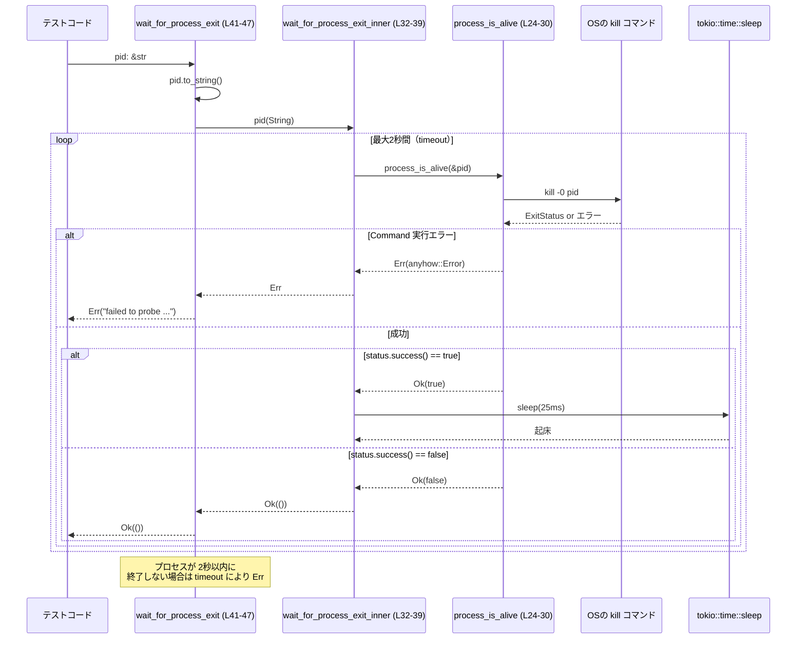

# core/tests/common/process.rs

## 0. ざっくり一言

PID ファイルの出現と、指定 PID のプロセス終了を **ポーリング＋タイムアウト付きで待ち合わせる**、テスト用の非同期ユーティリティ関数群です（`process_is_alive` だけ同期）。  
（根拠: `wait_for_pid_file`, `process_is_alive`, `wait_for_process_exit` の定義内容から判断。`core/tests/common/process.rs:L6-47`）

---

## 1. このモジュールの役割

### 1.1 概要

- このモジュールは、外部プロセスを用いたテストにおいて
  - PID ファイルが生成されるまで待つ
  - プロセスが生きているかを確認する
  - プロセスが終了するまで待つ
- といった処理を簡潔に書けるようにするためのヘルパー関数を提供します  
  （根拠: 各関数名と処理内容。`core/tests/common/process.rs:L6-47`）

### 1.2 アーキテクチャ内での位置づけ

このファイル自体は `core/tests/common` 配下にあり、テストコードから呼び出される「共通ユーティリティ」という位置づけと解釈できますが、どのテストから呼ばれているかはこのチャンクからは分かりません。

このモジュール内と標準ライブラリ／外部クレートとの関係を図示します。

```mermaid
graph TD
    subgraph "core/tests/common/process.rs (L6-47)"
        WPF["wait_for_pid_file (L6-22)"]
        PIA["process_is_alive (L24-30)"]
        WPEI["wait_for_process_exit_inner (L32-39)"]
        WPE["wait_for_process_exit (L41-47)"]
    end

    WPF --> FS["std::fs::read_to_string"]
    WPF --> TTO1["tokio::time::timeout"]
    WPF --> TSL1["tokio::time::sleep"]

    WPE --> WPEI
    WPE --> TTO2["tokio::time::timeout"]
    WPEI --> PIA
    WPEI --> TSL2["tokio::time::sleep"]

    PIA --> KILL["std::process::Command::new(\"kill\")"]

    TTO1 -.外部クレート.-> TOKIO["tokio"]
    TTO2 -.外部クレート.-> TOKIO
```

（根拠: 実際の呼び出し関係。`core/tests/common/process.rs:L6-47`）

### 1.3 設計上のポイント

- **ポーリング＋スリープ**  
  - PID ファイルの存在やプロセス存否を、25ms 間隔でループしつつチェックしています  
    （根拠: `tokio::time::sleep(Duration::from_millis(25))`。`core/tests/common/process.rs:L15,L37`）
- **全体に 2 秒のタイムアウト**  
  - PID ファイル待ち・プロセス終了待ちのいずれも、`tokio::time::timeout(Duration::from_secs(2), ...)` で 2 秒で打ち切る設計です  
    （根拠: `Duration::from_secs(2)` を timeout に渡している。`core/tests/common/process.rs:L7,L43`）
- **anyhow によるエラー伝搬＋コンテキスト**  
  - すべて `anyhow::Result` を返しており、`Context` トレイトで分かりやすいメッセージを付与しています  
    （根拠: `context("...")?` の利用。`core/tests/common/process.rs:L19,L28,L45`）
- **非同期関数内でのブロッキング I/O**  
  - `wait_for_process_exit_inner` は非同期関数ですが、内部で同期的な `std::process::Command::status()` を呼びます。そのため、非常に高頻度・大量に呼ぶと、非同期ランタイムのスレッドをブロックしうる設計です  
    （根拠: `async fn wait_for_process_exit_inner` 内で `process_is_alive` を呼び、その中で `Command::status()` を使っている。`core/tests/common/process.rs:L24-28,L32-38`）

---

## 2. 主要な機能一覧

- PID ファイル待ち: 指定パスの PID ファイルが存在し、かつ非空になるまで非同期に待機する（`wait_for_pid_file`）
- プロセス存否確認: `kill` コマンドを用いて PID のプロセスが生きているかを確認する（`process_is_alive`）
- プロセス終了待ち（内部実装）: プロセスが死ぬまでポーリングし続ける非公開非同期関数（`wait_for_process_exit_inner`）
- プロセス終了待ち（公開 API）: 上記内部関数に 2 秒のタイムアウトをかけた公開非同期 API（`wait_for_process_exit`）

### 2.1 コンポーネント（関数）一覧

| 名前 | 種別 | 可視性 | 非同期 | 戻り値型 | 役割 / 用途 | 定義位置 |
|------|------|--------|--------|----------|-------------|----------|
| `wait_for_pid_file` | 関数 | `pub` | `async` | `anyhow::Result<String>` | PID ファイルが生成されて非空になるまで待機し、内容（PID 文字列）を返す | `core/tests/common/process.rs:L6-22` |
| `process_is_alive` | 関数 | `pub` | なし | `anyhow::Result<bool>` | `kill -0 <pid>` を実行し、プロセスが生きているかどうかを返す | `core/tests/common/process.rs:L24-30` |
| `wait_for_process_exit_inner` | 関数 | 非公開 | `async` | `anyhow::Result<()>` | プロセスが死ぬまで `process_is_alive` を繰り返し呼び、終了したら `Ok(())` を返す | `core/tests/common/process.rs:L32-39` |
| `wait_for_process_exit` | 関数 | `pub` | `async` | `anyhow::Result<()>` | プロセス終了待ち処理に 2 秒のタイムアウトを付与した公開 API | `core/tests/common/process.rs:L41-47` |

---

## 3. 公開 API と詳細解説

### 3.1 型一覧（構造体・列挙体など）

このファイル内には、ユーザー定義の構造体・列挙体・タイプエイリアス等は存在しません。  
（根拠: 全コードを確認しても `struct`, `enum`, `type` が定義されていない。`core/tests/common/process.rs:L1-47`）

---

### 3.2 関数詳細

#### `wait_for_pid_file(path: &Path) -> anyhow::Result<String>`

**概要**

- 引数 `path` が指す PID ファイルを 25ms 間隔で監視し、ファイルが読み込めて **trim 後に非空の内容** が得られた時点で、その内容を `String` として返します。  
- 最大待ち時間は 2 秒で、それまでに条件を満たさない場合はタイムアウトエラーを返します。  
  （根拠: `timeout`＋無限ループ内で `fs::read_to_string(path)` と `trim().is_empty()` をチェック。`core/tests/common/process.rs:L6-19`）

**引数**

| 引数名 | 型 | 説明 |
|--------|----|------|
| `path` | `&Path` | 監視対象の PID ファイルのパス。ファイルの作成と書き込みは呼び出し元側が行う前提です。 |

**戻り値**

- `Ok(String)`  
  - `path` のファイルが読み込め、その内容を `trim()` した結果が非空になった時点で、その文字列を返します。通常は PID（プロセス ID）の 10 進表現が入る想定の値です。  
- `Err(anyhow::Error)`  
  - 2 秒以内に条件を満たさなかった場合、`"timed out waiting for pid file"` というメッセージ付きのエラーになります。  
  （根拠: `.context("timed out waiting for pid file")?`。`core/tests/common/process.rs:L18-19`）

**内部処理の流れ**

1. `tokio::time::timeout(Duration::from_secs(2), async { ... })` で、内部の非同期ループに 2 秒のタイムアウトを設定します。  
   （`core/tests/common/process.rs:L7-8`）
2. ループ内で `fs::read_to_string(path)` を試み、成功 (`Ok`) した場合のみ内容を扱います。読み込み失敗 (`Err`) の場合は無視して継続します。  
   （`core/tests/common/process.rs:L9`）
3. 読み込んだ文字列を `trim()` し、結果が空でなければ `return trimmed.to_string()` でループを抜けます。  
   （`core/tests/common/process.rs:L10-13`）
4. 条件を満たさない場合は `tokio::time::sleep(Duration::from_millis(25)).await;` で 25ms 待機し、ループを継続します。  
   （`core/tests/common/process.rs:L15-16`）
5. 2 秒経過するまでに `return` が発生しなければ `timeout` が `Err(elapsed)` を返し、それに `"timed out waiting for pid file"` のコンテキストを付与して `Err(anyhow::Error)` として呼び出し元に返されます。  
   （`core/tests/common/process.rs:L18-19`）

**Examples（使用例）**

PID ファイルが書き込まれるまで待ち、その PID を文字列で取得するテストコードのイメージです。

```rust
use std::path::PathBuf;
use core::tests::common::process::wait_for_pid_file;

// tokio ランタイム上で実行されるテスト例
#[tokio::test]
async fn test_wait_for_pid_file() -> anyhow::Result<()> {
    let pid_file = PathBuf::from("/tmp/my_app.pid");      // 監視したい PID ファイル

    // 別スレッドや別プロセスで pid_file に PID を書き込む処理がある前提

    let pid = wait_for_pid_file(pid_file.as_path()).await?; // PID ファイルが非空になるまで待つ
    assert!(!pid.trim().is_empty());                        // 空文字列でないことを検証

    Ok(())
}
```

※ 実際には、この関数単体ではファイルを作成しないため、呼び出し側で PID ファイルを書き込む処理が必要です。

**Errors / Panics**

- `Errors`
  - 2 秒間待っても PID ファイルが読み込めず、または内容が非空にならない場合  
    → `"timed out waiting for pid file"` というメッセージ付き `anyhow::Error`。  
    （`core/tests/common/process.rs:L18-19`）
  - `tokio::time::timeout` 自体のエラー（ランタイムの異常など）も `?` により `Err` として伝搬しますが、そのようなケースは通常の tokio 利用では例外的な状況です。
- `Panics`
  - この関数内に `panic!` を直接呼ぶコードはありません。`tokio` や `std::fs` 内部でパニックが起きる可能性は一般的な話としてありますが、本チャンクからはその有無は判断できません。

**Edge cases（エッジケース）**

- ファイルが存在しない / パーミッションがない  
  - `fs::read_to_string(path)` が `Err` を返し、ループはそれを無視して再試行します。2 秒間ずっと読み込めない場合はタイムアウトで終了します。  
    （`core/tests/common/process.rs:L9-19`）
- ファイルが存在するが内容が常に空文字列または空白のみ  
  - `trim()` の結果が常に空のため、ループは終了せず、2 秒後にタイムアウトになります。  
    （`core/tests/common/process.rs:L10-16`）
- 非 UTF-8 内容のファイル  
  - `fs::read_to_string` がエラーになるため、上記「読み込み失敗」と同様に扱われ、最終的にタイムアウトする可能性があります。
- 2 秒以内にファイルが作成され、かつ有効な内容が書かれた場合  
  - そのタイミングで早期に `Ok(String)` を返します。

**使用上の注意点**

- 非同期関数のため、`tokio` などの非同期ランタイム内（`#[tokio::test]` など）で呼ぶ必要があります。
- 監視間隔は固定で 25ms のため、非常に高頻度のテストや多数の並列実行では、ファイルシステムへの負荷を多少増やす可能性があります。
- タイムアウト時間（2 秒）は固定値であり、テスト環境の性能やプロセス起動時間によっては不十分な場合があります。変更したい場合は `Duration::from_secs(2)` を調整する必要があります。  
  （`core/tests/common/process.rs:L7`）

---

#### `process_is_alive(pid: &str) -> anyhow::Result<bool>`

**概要**

- 引数 `pid` を `kill` コマンドに渡して `kill -0 <pid>` を実行し、その終了ステータスからプロセスが生きているかどうかを判定して返します。  
  （根拠: `"kill"` コマンドに `["-0", pid]` を渡し、`status.success()` を返している。`core/tests/common/process.rs:L24-29`）

**引数**

| 引数名 | 型 | 説明 |
|--------|----|------|
| `pid` | `&str` | 存否を確認したいプロセスの PID を文字列で表したもの。一般的な UNIX では 10 進数の PID を想定します。 |

**戻り値**

- `Ok(true)`  
  - `kill -0 pid` が正常終了（終了ステータスが成功）した場合。一般的な UNIX 系 OS では「プロセスが存在し、シグナルを送る権限がある」と解釈されます。
- `Ok(false)`  
  - コマンド自体は実行成功だが、終了ステータスが非成功の場合。プロセスが存在しない、またはアクセス権がないなどの理由が考えられます。
- `Err(anyhow::Error)`  
  - `Command::new("kill").status()` の実行自体が失敗した場合（`kill` コマンドが見つからないなど）。  
    （`core/tests/common/process.rs:L25-28`）

**内部処理の流れ**

1. `std::process::Command::new("kill")` で `kill` コマンド実行用のコマンドオブジェクトを生成します。  
   （`core/tests/common/process.rs:L25`）
2. `.args(["-0", pid])` で `kill -0 <pid>` を構成します。  
   （`core/tests/common/process.rs:L26`）
3. `.status()` でコマンドを同期的に実行し、`ExitStatus` を取得します。  
   （`core/tests/common/process.rs:L27`）
4. `.context("failed to probe process liveness with kill -0")?` により、`status()` が `Err` の場合にコンテキスト付きの `anyhow::Error` として返します。  
   （`core/tests/common/process.rs:L27-28`）
5. 成功した場合は `Ok(status.success())` を返します。  
   （`core/tests/common/process.rs:L29`）

**Examples（使用例）**

```rust
use core::tests::common::process::process_is_alive;

fn assert_child_process_alive(pid: u32) -> anyhow::Result<()> {
    let result = process_is_alive(&pid.to_string())?;  // PID を文字列化して渡す
    assert!(result, "child process should be alive at this point");
    Ok(())
}
```

**Errors / Panics**

- `Errors`
  - `kill` コマンドの起動に失敗した場合、あるいは実行中に I/O エラーが発生した場合  
    → `"failed to probe process liveness with kill -0"` というメッセージ付きで `Err` を返します。  
    （`core/tests/common/process.rs:L25-28`）
- `Panics`
  - この関数内には明示的な `panic!` 呼び出しはありません。

**Edge cases（エッジケース）**

- `pid` が数字でない文字列（例: `"abc"`）  
  - 一般的な `kill` コマンドではエラーになると予想され、その結果 `status.success()` が `false` になるか、状況によっては `status()` 自体が `Err` を返す可能性があります（これは OS依存であり、このチャンクからは詳細は分かりません）。
- 権限不足（他ユーザーのプロセスなど）  
  - `kill -0` はプロセスが存在しても権限がなければ失敗ステータスを返すため、`Ok(false)` になる可能性があります。
- `kill` コマンドが存在しない環境  
  - `Command::new("kill").status()` が `Err` を返し、`anyhow::Error` になります。

**使用上の注意点**

- 同期関数であり、呼び出しスレッドをブロックします。大量に・高頻度で呼び出すとパフォーマンスに影響します。
- 結果はあくまで OS の `kill` コマンドと権限モデルに依存し、「`true` なら必ずプロセスが生きている／`false` なら必ず死んでいる」と言い切れるものではありません（権限問題などが絡むため）。

---

#### `wait_for_process_exit_inner(pid: String) -> anyhow::Result<()>`（非公開）

**概要**

- 引数で渡された PID 文字列に対して `process_is_alive` を 25ms 間隔で呼び続け、`false`（プロセス終了）になるまで待機する内部ヘルパー関数です。  
  （根拠: `loop` 内で `process_is_alive(&pid)?` をチェックし、`false` なら `Ok(())` を返す。`core/tests/common/process.rs:L32-38`）

**引数**

| 引数名 | 型 | 説明 |
|--------|----|------|
| `pid` | `String` | 監視するプロセスの PID を文字列として所有権付きで受け取る。 |

**戻り値**

- `Ok(())`  
  - プロセスが終了したと判定された場合に返されます。
- `Err(anyhow::Error)`  
  - 内部で呼ぶ `process_is_alive` がエラーを返した場合、そのエラーをそのまま伝搬します。  
    （`core/tests/common/process.rs:L34`）

**内部処理の流れ**

1. 無限ループ `loop { ... }` を開始します。  
   （`core/tests/common/process.rs:L33`）
2. `process_is_alive(&pid)?` を実行し、`?` により `Err` であれば即座に関数自体が `Err` を返します。  
   （`core/tests/common/process.rs:L34`）
3. `process_is_alive` が `Ok(false)` を返した場合は `return Ok(())` としてループを抜けます。  
   （`core/tests/common/process.rs:L34-35`）
4. `Ok(true)` の場合は `tokio::time::sleep(Duration::from_millis(25)).await;` で 25ms 待機し、再度ループ先頭に戻ります。  
   （`core/tests/common/process.rs:L37-38`）

**Examples（使用例）**

この関数は `pub` ではないため、通常は `wait_for_process_exit` 経由で利用されます。直接の使用例は一般ユーザには不要ですが、イメージとしては以下のような形です。

```rust
// 通常は wait_for_process_exit を使用し、この関数を直接呼ぶことはありません。
// これはあくまで内部的な動作イメージです。
async fn example_inner_usage(pid: String) -> anyhow::Result<()> {
    wait_for_process_exit_inner(pid).await
}
```

**Errors / Panics**

- `Errors`
  - `process_is_alive` が `Err` を返した場合、そのエラーをそのまま伝搬します。  
    （`core/tests/common/process.rs:L34`）
- `Panics`
  - 明示的な `panic!` 呼び出しはありません。

**Edge cases（エッジケース）**

- プロセスが永遠に生き続ける場合  
  - この関数自体にはタイムアウトがありません。呼び出し側が別途タイムアウト等をかけない限り、無限にループし続けます。
- `process_is_alive` が頻繁にエラーを返す場合  
  - 最初のエラー発生時に `Err` として即座に終了します。

**使用上の注意点**

- タイムアウトなしの無限待ち関数であるため、必ず上位層（`wait_for_process_exit` や `tokio::time::timeout` など）で呼び出すことが前提になっています。
- 非同期関数内で同期的なプロセス起動（`Command::status()`）を繰り返し行うため、大量に並列実行すると非同期ランタイムのスレッドをブロックしうる点に注意が必要です。

---

#### `wait_for_process_exit(pid: &str) -> anyhow::Result<()>`

**概要**

- 文字列で渡された PID に対して `wait_for_process_exit_inner` を呼び、プロセス終了を待機します。  
- 内部処理に対して 2 秒のタイムアウトを設定し、その時間内にプロセスが終了しなければエラーを返します。  
  （根拠: `tokio::time::timeout(Duration::from_secs(2), wait_for_process_exit_inner(pid))`。`core/tests/common/process.rs:L41-45`）

**引数**

| 引数名 | 型 | 説明 |
|--------|----|------|
| `pid` | `&str` | 終了を待ちたいプロセスの PID を文字列で表現したもの。 |

**戻り値**

- `Ok(())`  
  - 2 秒以内にプロセスが終了した場合。
- `Err(anyhow::Error)`  
  - 内部処理がエラーになった場合、または 2 秒を超えてもプロセスが終了しなかった場合にエラーとなります。

**内部処理の流れ**

1. 引数の `pid: &str` を `pid.to_string()` で所有権を持つ `String` に変換します。  
   （`core/tests/common/process.rs:L42`）
2. `wait_for_process_exit_inner(pid)` を 2 秒のタイムアウト付きで `tokio::time::timeout` に渡します。  
   （`core/tests/common/process.rs:L43`）
3. `timeout` の結果を `.await` し、`context("timed out waiting for process to exit")??;` で二重 `?` を用いてアンラップします。  
   - 外側の `?` で `timeout` 自体の結果（タイムアウトしたかどうか）を処理し、  
   - 内側の `?` で `wait_for_process_exit_inner` に由来するエラーを処理します。  
   （`core/tests/common/process.rs:L43-45`）
4. すべて成功した場合に `Ok(())` を返します。  
   （`core/tests/common/process.rs:L47`）

**Examples（使用例）**

```rust
use core::tests::common::process::{wait_for_pid_file, wait_for_process_exit};
use std::path::PathBuf;

#[tokio::test]
async fn test_process_lifecycle() -> anyhow::Result<()> {
    let pid_file = PathBuf::from("/tmp/my_app.pid");

    // ここでテスト対象プロセスを起動し、pid_file に PID を書き込むとする

    let pid = wait_for_pid_file(&pid_file).await?;    // 起動完了（PID ファイル生成）を待つ

    // ここで何らかのテスト操作を行う

    wait_for_process_exit(&pid).await?;               // 終了を待つ（最大 2 秒）

    Ok(())
}
```

**Errors / Panics**

- `Errors`
  - `wait_for_process_exit_inner` が `Err` を返した場合  
    → そのまま `anyhow::Error` として伝搬します（`process_is_alive` 由来のエラーなど）。  
  - 2 秒以内にプロセスが終了しない場合  
    → `"timed out waiting for process to exit"` というメッセージが付与された `anyhow::Error` になります。  
    （`core/tests/common/process.rs:L43-45`）
- `Panics`
  - この関数内に `panic!` はありません。

**Edge cases（エッジケース）**

- PID が存在しない（すでに終了している）  
  - `process_is_alive` が最初から `false` を返す場合、ほぼ即座に `Ok(())` が返る可能性があります。
- PID が長時間生き続ける  
  - 2 秒を超えるとタイムアウトし、エラーとして終了します。
- `process_is_alive` がエラーを返す状況（`kill` コマンドが使用できないなど）  
  - そのエラーが `wait_for_process_exit_inner` から伝搬し、さらにこの関数からも伝搬します。

**使用上の注意点**

- `wait_for_process_exit_inner` と同様、非同期関数であるため `tokio` ランタイム内で使用する必要があります。
- タイムアウト時間は固定の 2 秒であり、より長い／短い時間を許容したい場合にはコードの修正が必要です。
- 内部で同期的な `kill` コマンド実行を繰り返す構造であるため、きわめて大量の並行呼び出しは避けた方が安全です。

---

### 3.3 その他の関数

このファイルには、上記 4 関数以外の補助的な関数は存在しません。  
（根拠: 全コードを確認。`core/tests/common/process.rs:L1-47`）

---

## 4. データフロー

ここでは代表的なシナリオとして、「PID ファイル生成を待ち、テストが終わったらプロセス終了を待つ」流れを示します。

### 4.1 プロセス終了待ちのデータフロー



（根拠: 関数実装の呼び出し関係と処理内容。`core/tests/common/process.rs:L24-45`）

### 4.2 PID ファイル待ちのデータフロー

```mermaid
sequenceDiagram
    participant T as テストコード
    participant WPF as wait_for_pid_file (L6-22)
    participant FS as std::fs::read_to_string
    participant S as tokio::time::sleep

    T->>WPF: path: &Path
    loop 最大2秒間（timeout）
        WPF->>FS: read_to_string(path)
        alt Ok(contents)
            FS-->>WPF: String
            WPF->>WPF: trimmed = contents.trim()
            alt trimmed 非空
                WPF-->>T: Ok(trimmed.to_string())
                break
            else trimmed 空
                WPF->>S: sleep(25ms)
                S-->>WPF: 起床
            end
        else Err(_)
            FS-->>WPF: Err
            WPF->>S: sleep(25ms)
            S-->>WPF: 起床
        end
    end
    note over WPF: 2秒以内に<br/>非空文字列を読めなければ Err("timed out waiting for pid file")
```

---

## 5. 使い方（How to Use）

### 5.1 基本的な使用方法

外部プロセスを起動して PID ファイルを書き出させ、そのプロセスの終了まで待つ典型的なテストの流れの一例です。

```rust
use std::path::PathBuf;
use core::tests::common::process::{wait_for_pid_file, wait_for_process_exit};

#[tokio::test]                                            // tokio ランタイム上でテスト
async fn test_external_process() -> anyhow::Result<()> {
    let pid_file = PathBuf::from("/tmp/my_app.pid");      // プロセスが書き出す PID ファイル

    // ここでテスト対象プロセスを起動し、pid_file に PID を書き出すように設定する
    // （プロセス起動コードはこのモジュールには含まれていません）

    let pid = wait_for_pid_file(&pid_file).await?;        // PID ファイル生成を待ち、その内容を取得
    assert!(!pid.trim().is_empty());

    // ここでプロセスに対するテスト操作（HTTP リクエストなど）を行う

    wait_for_process_exit(&pid).await?;                   // プロセス終了を最大 2秒まで待つ

    Ok(())
}
```

### 5.2 よくある使用パターン

1. **途中でプロセスが落ちていないかの確認**

```rust
use core::tests::common::process::process_is_alive;

fn assert_process_still_running(pid: &str) -> anyhow::Result<()> {
    let alive = process_is_alive(pid)?;                   // kill -0 で確認
    assert!(alive, "process unexpectedly died");
    Ok(())
}
```

1. **終了を待たずに単発で存否だけ確認**

- `wait_for_process_exit` を使わず、終了済みであることを確認したいときは `process_is_alive` を 1 回呼んで `false` であることを確認するだけで済みます。

```rust
fn assert_process_terminated(pid: &str) -> anyhow::Result<()> {
    let alive = process_is_alive(pid)?;
    assert!(!alive, "process should have been terminated");
    Ok(())
}
```

### 5.3 よくある間違い

```rust
use core::tests::common::process::wait_for_process_exit;

// 間違い例: tokio ランタイム外で async 関数を直接呼び出している
fn will_not_compile(pid: &str) {
    // let result = wait_for_process_exit(pid).await;     // コンパイルエラー: async コンテキスト外で .await
}

// 正しい例: tokio ランタイム内（#[tokio::test] や tokio::runtime など）で呼び出す
#[tokio::test]
async fn correct_usage(pid: &str) -> anyhow::Result<()> {
    wait_for_process_exit(pid).await?;
    Ok(())
}
```

```rust
use core::tests::common::process::process_is_alive;

// 間違い例: PID でない文字列を渡している
fn wrong_pid_usage() -> anyhow::Result<()> {
    let alive = process_is_alive("not-a-number")?;        // OS によってはエラーや false になる
    // ...
    Ok(())
}

// 正しい例: 実際の PID を u32 などから文字列化して渡す
fn correct_pid_usage(pid: u32) -> anyhow::Result<()> {
    let alive = process_is_alive(&pid.to_string())?;
    // ...
    Ok(())
}
```

### 5.4 使用上の注意点（まとめ）

- **非同期ランタイムの必要性**  
  - `wait_for_pid_file` と `wait_for_process_exit` / `wait_for_process_exit_inner` は `async fn` のため、`tokio` などのランタイム上で使用する必要があります。
- **タイムアウトと待ち時間**  
  - PID ファイル待ち・プロセス終了待ちともに最大 2 秒のタイムアウトを持ちます（ハング防止）。必要に応じて `Duration::from_secs(2)` を変更する設計になっています。
- **ポーリング間隔**  
  - 25ms ごとのポーリングのため、検出精度は 25ms 程度です。その代わり、負荷も 25ms 間隔で I/O が発生する点に注意してください。
- **同期 I/O の非同期コンテキストでの利用**  
  - プロセス存否チェックは `std::process::Command::status()` を利用しており、これはブロッキング I/O です。少数のテストでは問題にならないことが多いですが、大量の並列処理ではボトルネックになりうるため注意が必要です。

---

## 6. 変更の仕方（How to Modify）

### 6.1 新しい機能を追加する場合

例として、「任意のシグナルを送って終了を促し、その後終了を待つ」機能を追加したい場合を考えます。

1. **プロセス操作用の新関数を追加**

   - `core/tests/common/process.rs` に `send_signal(pid: &str, signal: &str)` のような関数を追加し、既存の `process_is_alive` と同様に `std::process::Command::new("kill")` を利用してシグナル送信を行う構造にすると、一貫性が保てます。

2. **既存の待ち処理と組み合わせる**

   - 新しい関数から `wait_for_process_exit` を呼ぶことで、「シグナル送信 → 終了待ち」という高レベルの API を構成できます。

3. **エラー伝搬とコンテキスト**

   - 既存コードでは `anyhow::Context` を用いてエラーメッセージを付与しているため、新関数でも同様に `.context("...")?` を用いると統一されたエラー表示になります。

### 6.2 既存の機能を変更する場合

- **タイムアウト時間を変更する場合**
  - `wait_for_pid_file` の `Duration::from_secs(2)`（`core/tests/common/process.rs:L7`）と  
    `wait_for_process_exit` の `Duration::from_secs(2)`（`core/tests/common/process.rs:L43`）を同時に見直すと、仕様の一貫性が保ちやすくなります。
- **ポーリング間隔を変更する場合**
  - PID ファイル待ちとプロセス終了待ちでそれぞれ `Duration::from_millis(25)` を使用しているため（`core/tests/common/process.rs:L15,L37`）、両者を揃えるかどうかを設計方針として決めた上で変更するとよいです。
- **エラーメッセージの変更**
  - `context("timed out waiting for pid file")` と  
    `context("failed to probe process liveness with kill -0")`、  
    `context("timed out waiting for process to exit")`  
    の文字列は、テストコードがメッセージ内容に依存している可能性があります。このリポジトリ全体のコードは本チャンクからは分かりませんが、一般的にはメッセージ変更時に依存箇所を検索して確認することが推奨されます。

---

## 7. 関連ファイル

このチャンクからは、他のプロジェクト内ファイルとの直接の依存関係（`mod` 宣言など）は確認できません。ただし、標準ライブラリ・外部クレートとの関係は以下の通りです。

| パス / クレート | 役割 / 関係 |
|----------------|------------|
| `anyhow` クレート | `anyhow::Result` と `Context` トレイトを用いてエラー処理とコンテキスト追加を行う（`core/tests/common/process.rs:L1,L6,L24,L32,L41`） |
| `tokio` クレート | 非同期時間管理（`tokio::time::timeout`, `tokio::time::sleep`）を提供し、非同期の待ち処理を実現する（`core/tests/common/process.rs:L7,L15,L37,L43`） |
| `std::fs` | PID ファイル内容の読み込みに使用（`core/tests/common/process.rs:L2,L9`） |
| `std::process::Command` | `kill` コマンドを起動してプロセス存否を確認（`core/tests/common/process.rs:L25-28`） |
| `std::time::Duration` | タイムアウト時間やスリープ時間の指定に使用（`core/tests/common/process.rs:L4,L7,L15,L37,L43`） |

プロジェクト内の他のテストファイルからの呼び出しは、このファイルだけからは追跡できないため、「どのテストケースで使われているか」については不明です。
