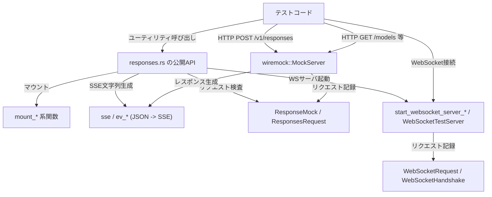
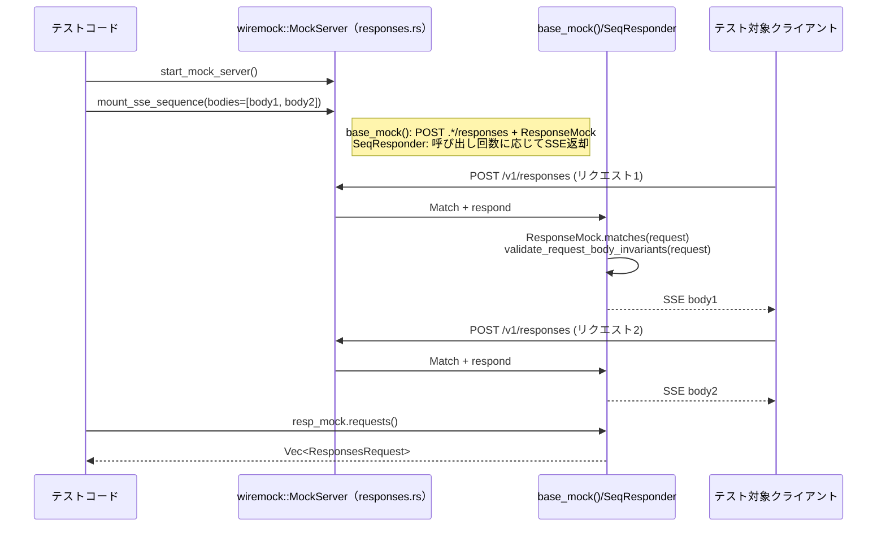

# core/tests/common/responses.rs コード解説

## 0. ざっくり一言

`/v1/responses`・`/responses/compact`・`/models` HTTP API と WebSocket `/v1/responses` をテストするための **モックサーバー／SSE生成／リクエスト検査ユーティリティ**をまとめたモジュールです。  
テストコードからは、このファイルのヘルパ関数・構造体を使うことで、HTTP/WS 通信を行う本体コードを「外部サービスなしで」検証できます。

> 注: この回答ではソースの行番号情報が与えられていないため、指示にある `ファイル名:L開始-終了` 形式での正確な行番号は付与できません。根拠は関数名・処理内容ベースで示します。

---

## 1. このモジュールの役割

### 1.1 概要

このモジュールは、主に次の問題を解決するために存在します。

- `/v1/responses` 系 API を呼び出すクライアントコードを、外部の OpenAI/Codex 互換サーバーなしでテストしたい。
- SSE（Server-Sent Events）や WebSocket ベースのストリーミング応答を、決まったシナリオに従って再現したい。
- クライアントが送る JSON リクエストボディの **構造上の不変条件（invariants）**をテスト中に厳密にチェックしたい。

そのために、以下の機能を提供します。

- `wiremock::MockServer` 上に `/v1/responses`・`/responses/compact`・`/models` エンドポイントを簡単にマウントするヘルパ。
- JSON から SSE 文字列や WebSocket メッセージを組み立てる `ev_*` 系関数群。
- 送信されたリクエストを `ResponseMock` / `ResponsesRequest` 経由で検査するユーティリティ。
- スクリプト化された WebSocket サーバー `WebSocketTestServer`。
- リクエストの不変条件をチェックする `validate_request_body_invariants`。

### 1.2 アーキテクチャ内での位置づけ

テストコードから見た依存関係の概略です。



- 本モジュールはテスト層にのみ依存し、本番コードからは呼ばれない構造になっています。
- HTTP 側は `wiremock::MockServer`、WebSocket 側は `tokio::net::TcpListener` + `tokio_tungstenite` を使ってテスト用サーバーを立てています。
- 送信されたリクエストは `ResponseMock`／`WebSocketTestServer` に蓄積され、テストが後から検査します。

### 1.3 設計上のポイント

- **責務分割**
  - HTTP モック: `mount_*`, `base_mock`, `ResponseMock`, `ModelsMock`, `validate_request_body_invariants`
  - SSEイベント生成: `sse`, `sse_response`, 多数の `ev_*` 関数
  - WebSocket モック: `start_websocket_server*`, `WebSocketTestServer`, `WebSocketConnectionConfig`
  - リクエスト検査・パース: `ResponsesRequest`, `output_value_to_text`
- **状態管理**
  - 複数スレッド／非同期タスクから参照される状態はすべて `Arc<Mutex<...>>` で共有しています。
  - WebSocket 側は `Arc<Notify>` や `oneshot::Sender<()>` を使って協調的なシャットダウンと待機を実現しています。
- **エラーハンドリング方針**
  - テスト用コードのため、入力が仕様と違う場合は基本的に **panic/`unwrap`/`expect`/`assert!`** で即座にテストを失敗させます。
  - 通信の一時的な失敗など、テスト目的に関係ないエラーは黙って `return` や `continue` で無視するケースがあります（WebSocket 接続エラーなど）。
- **安全性と不変条件**
  - `/v1/responses` への全ての POST に対して `validate_request_body_invariants` が走り、tool/function 呼び出しの入出力対応を厳密にチェックします。
  - zstd 圧縮ボディをサポートしており、ヘッダ `content-encoding` を見て自動デコードします。

---

## 2. 主要な機能一覧

- HTTP `/v1/responses` モック:
  - `mount_response_once(_match)`：固定レスポンスを 1 回だけ返しつつ、全リクエストを `ResponseMock` に記録。
  - `mount_sse_once(_match)`, `mount_sse_sequence`, `mount_response_sequence`：SSE/通常レスポンスを複数回分シナリオで返す。
- HTTP `/responses/compact` モック（履歴圧縮）:
  - `mount_compact_json_once`, `mount_compact_response_once`：任意 JSON/レスポンスを返す。
  - `mount_compact_user_history_with_summary_*`：ユーザー/デベロッパーメッセージだけを残し、指定の summary を compaction item として追加する。
- HTTP `/models` モック:
  - `mount_models_once(_with_delay/_with_etag)`：`ModelsResponse` を返す GET `/models` エンドポイントを準備。
  - `ModelsMock` により、どのパスにリクエストされたか検査可能。
- SSE / イベント JSON 生成:
  - `sse`, `sse_response`, `sse_completed`, `sse_failed`：SSE ストリーム文字列とレスポンステンプレート生成。
  - 多数の `ev_*` 関数（`ev_assistant_message`, `ev_function_call`, `ev_reasoning_item` など）で OpenAI/Codex 互換のイベント JSON を組み立てる。
- `/v1/responses` リクエスト検査:
  - `ResponseMock` / `ResponsesRequest` によるリクエストボディの JSON パース・入力メッセージ抽出・tool/function call の出力検査。
  - `validate_request_body_invariants` による call/output の整合性検証。
- WebSocket `/v1/responses` テストサーバー:
  - `start_websocket_server(_with_headers)` でスクリプト化された WebSocket サーバーを起動。
  - `WebSocketTestServer` 経由で受信リクエスト・ハンドシェイク情報を取得・待機・シャットダウン。
- 関数呼び出しエージェント用シナリオ:
  - `mount_function_call_agent_response`：1 回目のレスポンスで tool/function call を返し、2 回目で `done` メッセージを返すシナリオを構築。

---

## 3. 公開 API と詳細解説

### 3.1 型一覧（構造体・列挙体など）

| 名前 | 種別 | 役割 / 用途 |
|------|------|-------------|
| `ResponseMock` | 構造体 | `/v1/responses` への HTTP リクエストを `ResponsesRequest` として蓄積し、テストから検査するための `wiremock::Match` 実装。 |
| `ResponsesRequest` | 構造体（tuple） | 単一の `wiremock::Request` をラップし、JSON ボディから `input`・`message`・tool/function 呼び出し情報を取り出すユーティリティ。 |
| `WebSocketRequest` | 構造体 | WebSocket でクライアントから送信された 1 メッセージの JSON ボディ。 |
| `WebSocketHandshake` | 構造体 | 個々の WebSocket 接続の URI とヘッダ一覧（テストで認証ヘッダなどの確認に使用）。 |
| `WebSocketConnectionConfig` | 構造体 | WebSocket テストサーバー 1 接続分のシナリオ（受信リクエスト数、送信イベント、ハンドシェイクヘッダ、遅延、close 有無等）。 |
| `WebSocketTestServer` | 構造体 | テスト用 WebSocket サーバーインスタンス。接続ログ・ハンドシェイク情報・シャットダウン制御を提供。 |
| `ModelsMock` | 構造体 | `/models` へのリクエストを保存する `wiremock::Match`。パス検査等に用いる。 |
| `FunctionCallResponseMocks` | 構造体 | 関数呼び出しエージェント用シナリオの 1 回目レスポンス (`function_call`) と 2 回目レスポンス (`completion`) の `ResponseMock` セット。 |

※ 他に `UserHistorySummaryResponder`, `SeqResponder` などの内部構造体がありますが、モジュール外からは意識不要です。

---

### 3.2 関数詳細（重要なもの）

#### `ResponseMock::saw_function_call(&self, call_id: &str) -> bool`

**概要**

- 捕捉済みの全リクエストのうち、`input` 配列内に `type: "function_call"` かつ指定 `call_id` を持つ要素が存在するかを判定します。

**引数**

| 引数名 | 型 | 説明 |
|--------|----|------|
| `call_id` | `&str` | 探索対象の `function_call` の `call_id`。 |

**戻り値**

- `bool`：少なくとも 1 回その `call_id` を持つ `function_call` が送信されていれば `true`。

**内部処理の流れ**

1. `self.requests()` で `ResponsesRequest` のベクタを取得。
2. 各リクエストに対し `ResponsesRequest::has_function_call(call_id)` を呼び、`any` で存在判定。
3. 結果を返す。

**Examples（使用例）**

```rust
// モックサーバ起動
let server = start_mock_server().await;

// 1 回だけ SSE レスポンスを返すモックをセットアップ
let body = sse_completed("resp-1");
let resp_mock = mount_sse_once(&server, body).await;

// テスト対象コードが /v1/responses に POST し、function_call を送るはず
run_client_code_against(&server).await;

// 特定の call_id を持つ function_call を送ったか検査
assert!(resp_mock.saw_function_call("call-123"));
```

**Errors / Panics**

- 内部ではパニックしません（`has_function_call` は `Option` チェーンと `==` 比較のみ）。
- ただし、`ResponseMock` 自体は `/v1/responses` 以外には使われない前提で `validate_request_body_invariants` を呼んでいるため、**別の場所で** 不変条件違反により panic が発生する可能性があります。

**Edge cases（エッジケース）**

- リクエストが 0 件の場合：常に `false`。
- 同じ `call_id` が複数回送られていても、結果は `true` で変わりません。
- `call_id` が空文字列の場合は通常の文字列と同様に比較されます（ただし invariants で禁止されているので実際には panic します）。

**使用上の注意点**

- この関数は **「その call_id の function_call が1度でも送られたか」** を確認する用途に限られます。どのリクエストで送られたかを知りたい場合は `requests()` + `ResponsesRequest::has_function_call` を組み合わせてください。
- `/v1/responses` への POST 以外で `ResponseMock` を使うと、`validate_request_body_invariants` の前提（`input` 配列）が崩れ、panic する可能性があります。

---

#### `ResponsesRequest::message_input_texts(&self, role: &str) -> Vec<String>`

**概要**

- `input` 配列の中から `type: "message"` かつ指定 `role`（`"user"`や`"assistant"`など）の項目を探し、その `content` 配列内の `type: "input_text"` の `text` をすべて平坦化して返します。

**引数**

| 引数名 | 型 | 説明 |
|--------|----|------|
| `role` | `&str` | 抽出対象のメッセージロール（例: `"user"`, `"assistant"`, `"developer"`）。 |

**戻り値**

- `Vec<String>`：役割が一致するメッセージに含まれる `input_text` のテキストを、メッセージの順番・スパンの順番の通りに格納したベクタ。

**内部処理の流れ**

1. `self.inputs_of_type("message")` で `type: "message"` のみを抽出。
2. `item["role"]` が `role` と一致するものだけ残す。
3. 各 `item` の `content` 配列（`Value::Array`）を取り出す。
4. すべての `content` 要素をフラットに走査し、`type: "input_text"` かつ `text` が `String` のものだけ `String` 化。
5. そのすべてを `Vec<String>` に収集して返す。

**Examples（使用例）**

```rust
// "input" 配列に user/assistant メッセージを含むリクエストを構築
let req = ResponsesRequest(wiremock::Request {
    // url, method, headers などは省略
    url: "http://localhost/v1/responses".parse().unwrap(),
    method: wiremock::http::Method::POST,
    headers: wiremock::http::HeaderMap::new(),
    body: serde_json::to_vec(&serde_json::json!({
        "input": [
            {
                "type": "message",
                "role": "user",
                "content": [
                    {"type": "input_text", "text": "hello"},
                    {"type": "input_text", "text": "world"}
                ]
            }
        ]
    })).unwrap(),
});

// user メッセージ中の全 input_text テキストを取得
let texts = req.message_input_texts("user");
assert_eq!(texts, vec!["hello".to_string(), "world".to_string()]);
```

**Errors / Panics**

- `input` フィールドが存在しない・配列でない場合、`input()` 内の `expect("input array not found in request")` で panic します。
- `content` が配列でないメッセージは無視されます（`and_then(Value::as_array)` の時点で `None`）。

**Edge cases（エッジケース）**

- role が一致するメッセージが 1 つもない場合：空ベクタ。
- `content` に `input_text` 以外（`input_image` など）のスパンだけが含まれる場合：そのメッセージは結果に何も追加しません。
- `input_text` だが `text` が欠けている／文字列でない場合：そのスパンは無視されます。

**使用上の注意点**

- メッセージ単位のグルーピングが必要な場合は、`message_input_text_groups` を使うと、メッセージごとの `Vec<String>` を得られます。
- この関数は role のマッチだけを見ており、system/developer メッセージのような特殊なロールも文字列一致ベースで扱います。

---

#### `ResponsesRequest::function_call_output_content_and_success(&self, call_id: &str) -> Option<(Option<String>, Option<bool>)>`

**概要**

- 指定 `call_id` の `type: "function_call_output"` を `input` 配列から探し、その `output` フィールドから「人間向けテキスト」と「成功フラグ」を抽出します。  
  `custom_tool_call_output` 版も同じロジックを共有しています。

**引数**

| 引数名 | 型 | 説明 |
|--------|----|------|
| `call_id` | `&str` | 対象の `function_call_output` の `call_id`。 |

**戻り値**

- `Option<(Option<String>, Option<bool>)>`：
  - 外側の `Option`：対応する output がなければ `None`。
  - タプル内:
    - 第1要素: テキスト内容 (`Some(text)` または `None`)
    - 第2要素: `success` フラグ (`Some(true/false)` または `None`)

**内部処理の流れ**

1. `self.call_output(call_id, "function_call_output")` で該当アイテムを取得（見つからなければ panic）。
2. その `output` フィールドを `Value` として取得。存在しなければ `Value::Null`。
3. `output` の型ごとに処理:
   - `Value::String` or `Value::Array`：`output_value_to_text(&output)` でテキスト抽出し `(text, None)` を返す。
   - `Value::Object(obj)`：`obj["content"].as_str()` と `obj["success"].as_bool()` を取り出し、それぞれ `Option` として返す。
   - その他：`(None, None)` を返す。

**Examples（使用例）**

```rust
// 単一 input_text の output を持つ function_call_output
let req = request_with_input(serde_json::json!([
    {
        "type": "function_call_output",
        "call_id": "call-1",
        "output": [
            { "type": "input_text", "text": "hello" }
        ]
    }
]));

let result = req.function_call_output_content_and_success("call-1");
assert_eq!(result, Some((Some("hello".to_string()), None)));

// Object 形式 output: { content, success }
let req2 = request_with_input(serde_json::json!([
    {
        "type": "function_call_output",
        "call_id": "call-2",
        "output": {
            "content": "ok",
            "success": true
        }
    }
]));
let result2 = req2.function_call_output_content_and_success("call-2");
assert_eq!(result2, Some((Some("ok".to_string()), Some(true))));
```

**Errors / Panics**

- 対応する `function_call_output` アイテムが存在しない場合、`call_output` 内の `unwrap_or_else` で panic します（`"function call output {call_id} item not found in request"`）。
- `input` が配列でない場合も `input()` の `expect` で panic します。

**Edge cases（エッジケース）**

- `output` が配列だが、`input_text` 以外を含む/複数要素を含む場合:
  - `output_value_to_text` は `None` を返すため、`(None, None)` になります。
- `output` が Object だが `content` / `success` のどちらか一方しかない場合:
  - 片方だけ `Some(..)`、もう一方は `None` になります。
- `output` が全く存在しない（フィールドなし）場合:
  - `Value::Null` として扱われ、`(None, None)` 。

**使用上の注意点**

- 「**単一のテキストスパンからなる output**」を扱うケースと、「`{content, success}` オブジェクト」の両方をサポートしていますが、それ以外の形式は `None` 扱いになることに注意が必要です。
- 「必ず output が存在するはず」というテストでは、`Option` を unwrap しても問題ありませんが、仕様変更に敏感になるため、`match` で明示的に `None` ケースを処理するほうが安全です。

---

#### `start_mock_server() -> MockServer`

**概要**

- テスト用の `wiremock::MockServer` を起動し、ボディのログ出力量を制限した上で、デフォルトの `/models` レスポンス（空リスト）をマウントして返します。

**引数**

- なし。

**戻り値**

- `MockServer`：起動済みのモックサーバインスタンス。

**内部処理の流れ**

1. `MockServer::builder().body_print_limit(BodyPrintLimit::Limited(80_000)).start().await` を呼び出して、ボディログサイズ上限付きのサーバーを非同期に起動。
2. `mount_models_once(&server, ModelsResponse { models: Vec::new() }).await` を呼び、`GET /models` に空の `ModelsResponse` を返すモックを登録。
3. サーバーインスタンスを返す。

**Examples（使用例）**

```rust
#[tokio::test]
async fn client_fetches_models_against_mock() {
    let server = start_mock_server().await;

    // テスト対象のクライアントに server.uri() を渡して実行
    let client = MyClient::new(server.uri());
    let models = client.list_models().await.unwrap();

    assert!(models.is_empty());
}
```

**Errors / Panics**

- ポートバインドに失敗した場合には `expect("bind websocket server")` のような `expect` はありませんが、`MockServer::start` 自体が `await` 時に `panic` する可能性は通常ありません（ライブラリ依存）。
- `mount_models_once` 内で `body.clone()` を JSON にシリアライズできない場合、`expect` で panic しますが、`ModelsResponse` は `serde` 対応前提なので通常問題になりません。

**Edge cases**

- 既に同じポートで別プロセスがリッスンしているといったケースは、`MockServer::builder()` 側で処理されます（テストでは通常発生させない前提）。
- `/models` を別の内容にしたい場合は、`start_mock_server` 呼び出し後に追加で `mount_models_once*` を呼ぶ必要があります。

**使用上の注意点**

- 各テストごとに `start_mock_server().await` で独立したモックサーバーを起動する設計になっています。複数テストでサーバーを共有するとリクエストログが干渉するため注意が必要です。
- 返り値の `MockServer` は Drop 時に自動でシャットダウンされますが、テストの終了タイミングと整合性を取るため、通常はテスト関数内のローカル変数として保持します。

---

#### `start_websocket_server_with_headers(connections: Vec<WebSocketConnectionConfig>) -> WebSocketTestServer`

**概要**

- 与えられた接続シナリオ `WebSocketConnectionConfig` の列を消費する **テスト用 WebSocket サーバー** を起動します。  
  各クライアント接続ごとに、受信したリクエストを記録しつつ、事前に指定した JSON イベント列を WebSocket テキストフレームとして返します。

**引数**

| 引数名 | 型 | 説明 |
|--------|----|------|
| `connections` | `Vec<WebSocketConnectionConfig>` | 接続単位のシナリオ。各要素が「この接続では何リクエスト来て、それぞれに何イベントを返すか」を定義します。 |

**戻り値**

- `WebSocketTestServer`：起動済み WebSocket テストサーバー。URI、ログ取得、待機、シャットダウン API を提供。

**内部処理の流れ（高レベル）**

1. `TcpListener::bind("127.0.0.1:0").await` でランダムポートにバインドし、アドレスから `ws://...` 形式の URI を生成。
2. 受信リクエストログ・ハンドシェイクログ・通知用 `Notify` を `Arc<Mutex<...>>` / `Arc<Notify>` で初期化。
3. `connections` を `Arc<Mutex<VecDeque<...>>>` に包み、`oneshot::channel` でシャットダウンシグナルを用意。
4. `tokio::spawn` で accept ループを開始:
   - `tokio::select!` で `shutdown_rx` と `listener.accept()` を待機。
   - 接続確立ごとに `connections` から 1 つシナリオを `pop_front`。なければ接続を無視して次ループへ。
   - `accept_delay` があれば `tokio::time::sleep`。
   - `accept_hdr_async_with_config` を呼び、ハンドシェイク時に `WebSocketHandshake` をログし、レスポンスヘッダを追加。
   - `connections_log` に新しい空の接続ログを追加し、そのインデックスを取得。
   - シナリオの `requests`（`Vec<Vec<Value>>`）を 1 つずつ処理:
     1. `ws_stream.next().await` でクライアントからのメッセージを 1 つ受信。
     2. `parse_ws_request_body` で JSON パースし、成功したら `WebSocketRequest` として接続ログに追記。
     3. `request_log.notify_waiters()` で待機中の `wait_for_request` を起こす。
     4. そのリクエストに対応する `request_events`（`Vec<Value>`）を JSON 文字列にシリアライズし、`Message::Text` として順番に送信。
   - 全 `request_events` 消化後、`close_after_requests` に応じて `ws_stream.close()` するか、`shutdown_rx` を待つ。
   - `connections` が空になった時点でタスク終了。
5. `WebSocketTestServer` インスタンス（URI・ログ・シャットダウン送信側・JoinHandle）を返す。

**Examples（使用例）**

```rust
// 1 接続・1 リクエスト・1 イベントという簡単なシナリオ
let connections = vec![
    WebSocketConnectionConfig {
        requests: vec![
            // リクエスト #0 に対するサーバーのイベント列
            vec![serde_json::json!({
                "type": "response.output_item.done",
                "item": {"type": "message", "role": "assistant", "content": []}
            })],
        ],
        response_headers: vec![("x-test-header".into(), "ok".into())],
        accept_delay: None,
        close_after_requests: true,
    }
];

let server = start_websocket_server_with_headers(connections).await;

// テスト対象クライアントに server.uri() を渡して WS 接続させる。
// 送信した最初のメッセージが server.wait_for_request(0, 0) で観測できる。
let req = server.wait_for_request(0, 0).await;
println!("received WS body: {}", req.body_json());
server.shutdown().await;
```

**Errors / Panics**

- `TcpListener::bind` に失敗すると `expect("bind websocket server")` で panic。
- `accept_hdr_async_with_config` がエラーを返した場合は、その接続は無視され（`continue`）、タスク自体は続行。
- `serde_json::to_string(event)` が失敗したイベントはスキップされます（`let Ok(payload) = ... else { continue; }`）。
- `Mutex` ロック取得に失敗するとパニックしますが、これは通常発生しない前提です。

**Edge cases**

- `connections` が空の状態で接続が来た場合：シナリオなし接続は無視されます。
- `close_after_requests = false` の接続は、明示的に `WebSocketTestServer::shutdown()` を呼ぶまでクローズされません。
- クライアントが想定より少ないリクエストしか送らない場合：サーバー側は `ws_stream.next()` が `None` を返した時点でその接続のループを抜けます。

**使用上の注意点**

- `WebSocketTestServer::wait_for_request` は内部で `Arc<Notify>` による通知待機を行うため、**必ず `start_websocket_server_with_headers` が返したインスタンス**に対してのみ使用する必要があります（他の WS サーバーには使えません）。
- このテストサーバーは `std::sync::Mutex` を使っているので、非常に重い処理を `Mutex` ロック中に行うことは避ける設計になっています（実際にはログ追加程度に限定されています）。

---

#### `mount_compact_user_history_with_summary_sequence(server: &MockServer, summary_texts: Vec<String>) -> ResponseMock`

**概要**

- `/responses/compact` エンドポイントに対して、ユーザーとデベロッパーのメッセージだけを抜き出して返し、最後に「圧縮結果」を表す `compaction` アイテムを 1 つ追加するモックを、複数回ぶんのシナリオとしてセットアップします。

**引数**

| 引数名 | 型 | 説明 |
|--------|----|------|
| `server` | `&MockServer` | `wiremock` のモックサーバーインスタンス。 |
| `summary_texts` | `Vec<String>` | コンパクション結果として返す summary テキスト列。各 compact リクエストに対し 1 つずつ消費される。 |

**戻り値**

- `ResponseMock`：`/responses/compact` に対するリクエストログを取得するためのモック。

**内部処理の流れ**

1. 内部構造体 `UserHistorySummaryResponder`（`Respond` 実装）を定義。
   - `num_calls: AtomicUsize`：何回呼ばれたか。
   - `summary_texts: Vec<String>`：事前に与えられた summary テキスト。
2. `respond` 実装で以下を行う:
   1. `call_num = num_calls.fetch_add(1, Ordering::SeqCst)` で呼び出し回数をインクリメント。
   2. `summary_texts[call_num]` を取得。範囲外なら panic（想定回数より多く呼ばれた場合）。
   3. リクエストボディを `decode_body_bytes` でデコード（zstd 対応）。
   4. `serde_json::from_slice` で JSON パース（失敗時 panic）。
   5. `body_json["input"]` を配列として取り出し、以下でフィルタ:
      - `type == "message"` かつ `role` が `"user"` または `"developer"` のものだけ残す。
   6. それらを `Vec<Value>` に収集し、最後に `{"type":"compaction","encrypted_content": summary_text}` を 1 つ `push`。
   7. `{"output": output}` という JSON を `ResponseTemplate(200)` にセットし、`content-type: application/json` を付加して返す。
3. `compact_mock()` で `POST .*/responses/compact$` を受ける `MockBuilder` を取得し、上記 `responder` を `respond_with`。
4. `up_to_n_times(num_calls)` と `expect(num_calls)` で、**ちょうど `summary_texts.len()` 回だけ呼ばれる**ことを要求。
5. `mount(server).await` し、`ResponseMock` を返す。

**Examples（使用例）**

```rust
let server = start_mock_server().await;

// 2 回 compact が呼ばれるシナリオ：それぞれ異なる summary を返す
let resp_mock = mount_compact_user_history_with_summary_sequence(
    &server,
    vec!["summary-1".into(), "summary-2".into()],
).await;

// テスト対象コードは /responses/compact に 2 回 POST するはず。
// resp_mock.requests() で、送信した各 compact リクエストの内容を検査可能。
```

**Errors / Panics**

- コンパクションリクエスト回数が `summary_texts.len()` を超えた場合:
  - `summary_texts.get(call_num)` が `None` になり `panic!("no summary text for compact request {call_num}")`。
- リクエストボディが JSON でない・`input` が配列でない場合:
  - `serde_json::from_slice` の `unwrap_or_else` または `and_then(Value::as_array)` の `unwrap_or_default` で `[]` になり、`input` なしとして処理されます（panic はコメントされた箇所では発生しません）。
- `mount(...).expect(num_calls)` により、**呼び出し回数が不足しても** panic します。

**Edge cases**

- `summary_texts` が空 (`len() == 0`) の場合:
  - `up_to_n_times(0)` かつ `expect(0)` となり、**compact が1回でも呼ばれると panic** します（指定通りではありますが、ほぼ使わないケース）。
- input にアシスタントやツールのメッセージしか含まれない場合:
  - 出力には compaction item だけが含まれることになります（`output` 配列に 1 要素）。

**使用上の注意点**

- 実際のリモート compaction モデルの挙動とはコメントにもある通り完全一致しておらず、**現在のリモート挙動（ユーザー+デベロッパーメッセージのみ保持）に合わせたテスト用モック**です。
- テストで「最後の compact だけを確認したい」などの場合、`ResponseMock` から最後のリクエストボディを取り出し、`input` を検査することができます。

---

#### `validate_request_body_invariants(request: &wiremock::Request)`

**概要**

- `/v1/responses` に送られる POST リクエストの JSON ボディが、tool/function 呼び出しに関する不変条件を満たしているか検証し、違反があれば panic / assert でテストを失敗させます。  
  `ResponseMock` の `Match` 実装から毎回呼ばれます。

**引数**

| 引数名 | 型 | 説明 |
|--------|----|------|
| `request` | `&wiremock::Request` | 検査対象の HTTP リクエスト。 |

**戻り値**

- なし。条件違反時は panic / assert で終了。

**検証している不変条件の内容**

- 対象は `POST` かつパスが `/responses` で終わるリクエストのみ。
- `input` が配列でなければ panic（`"input array not found in request"`）。
- 以下のルールをチェック（`call_id` が空または欠落している場合は **即 panic**）:
  1. `function_call_output`：
     - `call_id` を必須とし、空文字は禁止（「orphan function_call_output with empty call_id should be dropped」）。
     - 対応する `function_call` または `local_shell_call` が同じ `input` 内になければ `assert!` で失敗。
  2. `custom_tool_call_output`：
     - `call_id` 必須・空禁止（同様のエラーメッセージ）。
     - 対応する `custom_tool_call` がなければ失敗。
  3. `tool_search_output`：
     - `call_id` があればそれを使用。
     - `call_id` が空/欠落の場合:
       - `execution == "server"` の場合は「サーバー実行のレガシー項目」として特別扱いし、ID 不要。
       - それ以外は panic（「orphan tool_search_output with empty call_id should be dropped」）。
     - `call_id` が存在する場合は、対応する `tool_search_call` がなければ失敗。
  4. 入力と出力の対称性:
     - すべての `function_call` / `custom_tool_call` / `tool_search_call` について、対応する output が存在すること（それぞれ `function_call_output` / `custom_tool_call_output` / `tool_search_output`）。

**内部処理の流れ**

1. メソッド・パスを見て対象外なら即 return。
2. `decode_body_bytes` で zstd デコードし、`serde_json::from_slice` で `Value` にパース。JSON でなければ即 return（不変条件を課さない）。
3. `body["input"].as_array()` を取り出し、`HashSet<String>` を使って各種 call / output の `call_id` 集合を構築。
4. 出力側集合を走査して、入力側集合に `call_id` が存在することを `assert!` で検証。
5. 逆に入力側集合を走査して、出力側集合に `call_id` が存在することを `assert!` で検証。

**Examples（使用例のイメージ）**

テストコード側から直接呼ばれることはありませんが、`ResponseMock` を使って `/v1/responses` に POST すると自動的に適用されます。

```rust
let server = start_mock_server().await;
let resp_mock = mount_sse_once(&server, some_sse_body).await;

// テスト対象コードが /v1/responses に function_call だけを送り、
// function_call_output を送らなかった場合、この時点で panic します。
run_client_code_that_violates_invariants(&server).await;
```

**Errors / Panics**

- 上記のいずれかの条件に違反すると、`panic!` または `assert!` 失敗でテストが即座に落ちます。
- JSON でないボディの場合、**何も検証しません**（`serde_json::from_slice` が `Err` で早期 return）。

**Edge cases**

- `tool_search_output` の `call_id` がないが `execution == "server"` の場合だけ特別に許容している点が重要です。
- `input` 配列が空でも問題ありません（call/call_output がなければ、集合はすべて空で整合性が取れる）。

**使用上の注意点**

- これは **テスト用の強い安全ネット** であり、本番コードに同じロジックを入れる想定ではありません。そのため `panic` ベースになっています。
- `/v1/responses` を呼ぶテストを書いていて、突然 panic が出た場合、多くはこの関数の不変条件に引っかかっているので、エラーメッセージに含まれる `call id` を手がかりにデバッグします。

---

### 3.3 その他の関数（概要一覧）

数が多いためカテゴリーごとにまとめます。

#### SSE 文字列・レスポンス生成

| 関数名 | 役割 |
|--------|------|
| `sse(events: Vec<Value>) -> String` | JSON イベント列を SSE 形式の文字列に変換する。`type` フィールドを `event:` 行に、残りを `data:` 行に出力。 |
| `sse_completed(id: &str) -> String` | 指定 `id` の `response.created` と `response.completed` の 2 イベントからなる SSE 文字列を生成。 |
| `sse_failed(id, code, message) -> String` | `response.failed` イベント 1 つだけからなる SSE 文字列を生成。 |
| `sse_response(body: String) -> ResponseTemplate` | SSE 文字列を `content-type: text/event-stream` 付きの `ResponseTemplate` に包む。 |

#### SSE イベント JSON 生成 (`ev_*`)

| 関数名 | 役割（1 行） |
|--------|--------------|
| `ev_completed`, `ev_response_created`, `ev_completed_with_tokens` | `response.completed` / `response.created` イベント JSON を生成。 |
| `ev_assistant_message`, `ev_message_item_added` | アシスタントメッセージ（`output_item.done/added`）イベントを生成。 |
| `ev_output_text_delta` | 部分出力用 `response.output_text.delta` イベントを生成。 |
| `ev_reasoning_item`, `ev_reasoning_item_added` | `reasoning` アイテムの done/added イベントを生成。encrypted_content を base64 で埋め込む。 |
| `ev_reasoning_summary_text_delta`, `ev_reasoning_text_delta` | reasoning の summary/content の delta イベント。 |
| `ev_web_search_call_added_partial`, `ev_web_search_call_done` | web_search_call の部分情報/完了イベント。 |
| `ev_image_generation_call` | image_generation_call イベント。 |
| `ev_function_call`, `ev_tool_search_call`, `ev_custom_tool_call`, `ev_local_shell_call` | function/tool/local_shell 呼び出しイベント。 |
| `ev_apply_patch_call` とその関連 (`ev_apply_patch_*`) | `ApplyPatchModelOutput` に応じて apply_patch を custom_tool/function/shell/shell_command として表現する系列。 |
| `ev_shell_command_call`, `ev_shell_command_call_with_args` | shell_command function call のラッパ。 |

#### HTTP モックマウント系

| 関数名 | 役割 |
|--------|------|
| `mount_response_once`, `mount_response_once_match` | `/v1/responses` に固定 `ResponseTemplate` を 1 回だけ返すモックをマウント。 |
| `mount_sse_once`, `mount_sse_once_match` | `/v1/responses` に指定 SSE 文字列を 1 回だけ返すモックをマウント。 |
| `mount_sse_sequence` | `/v1/responses` に対して複数の SSE ボディを順番に返すモックをマウント（余分な呼び出しで panic）。 |
| `mount_response_sequence` | 任意の `ResponseTemplate` 列を順に返すモック。 |
| `mount_compact_json_once`, `mount_compact_json_once_match` | `/responses/compact` に対して任意 JSON ボディを返すモック。 |
| `mount_compact_response_once` | `/responses/compact` に任意 `ResponseTemplate` を 1 回だけ返すモック。 |
| `mount_compact_user_history_with_summary_once` | `mount_compact_user_history_with_summary_sequence` の 1 回版。 |
| `mount_models_once`, `mount_models_once_with_delay`, `mount_models_once_with_etag` | `/models` に `ModelsResponse` を返すモック。遅延や ETag 付きもあり。 |
| `start_websocket_server` | シンプル構成で `start_websocket_server_with_headers` を呼ぶショートカット。 |
| `mount_function_call_agent_response` | function_call → completion という 2 回の SSE シナリオをマウントし、その両方の `ResponseMock` を返す。 |

#### リクエスト関連補助

| 関数名 | 役割 |
|--------|------|
| `ResponsesRequest::body_json`, `body_bytes`, `body_contains_text`, `instructions_text` | `/v1/responses` リクエストボディの JSON パース・テキスト検索・`instructions` 抽出。 |
| `ResponsesRequest::input`, `inputs_of_type` | `input` 配列全体・タイプ別の部分集合を取得。 |
| `ResponsesRequest::function_call_output`, `custom_tool_call_output`, `tool_search_output` | `call_id` とタイプで対応する output エントリを取得（なければ panic）。 |
| `ResponsesRequest::has_function_call`, `function_call_output_text` | function_call やその output の有無・テキストをチェック。 |
| `ResponsesRequest::header`, `path`, `query_param` | HTTP ヘッダ・パス・クエリパラメータの取得。 |
| `output_value_to_text` | `Value` から「人間向けテキスト」を抽出する小ヘルパ。 |

---

## 4. データフロー

ここでは、典型的な HTTP SSE テストシナリオを例に、データの流れを説明します。

### シナリオ: クライアントが `/v1/responses` に POST し、SSE ストリームを受け取るテスト

1. テストコードが `start_mock_server().await` でモックサーバーを起動。
2. `mount_sse_sequence(&server, vec![body1, body2]).await` で、2 回の `/v1/responses` 呼び出しごとに異なる SSE を返すモックを設定。
3. テスト対象クライアントが `POST /v1/responses` を行うたびに、wiremock は次の SSE ボディを返し、その際に `ResponseMock` がリクエストを保存。
4. `ResponseMock` は `validate_request_body_invariants` を呼んでリクエストボディの一貫性をチェック。
5. テストコードは `resp_mock.requests()` から `ResponsesRequest` を取り出し、`message_input_texts` や `function_call_output_*` で payload を検査。



同様に、WebSocket シナリオでは `start_websocket_server*` が `WebSocketTestServer` を返し、クライアントからの WS メッセージを `WebSocketRequest` として蓄積しつつ、あらかじめ指定した JSON イベントを送り返します。

---

## 5. 使い方（How to Use）

### 5.1 基本的な使用方法

#### HTTP + SSE モックとリクエスト検査

```rust
use crate::tests::common::responses::{
    start_mock_server, mount_sse_once, ResponseMock, ResponsesRequest, sse_completed,
};

#[tokio::test]
async fn test_client_sends_expected_input() {
    // 1. モックサーバーを起動する
    let server = start_mock_server().await;

    // 2. 1回だけ SSE を返す /v1/responses モックを登録する
    let sse_body = sse_completed("resp-1"); // response.created + response.completed
    let resp_mock: ResponseMock = mount_sse_once(&server, sse_body).await;

    // 3. テスト対象のクライアントをモックサーバーに向けて実行する
    let client = MyResponsesClient::new(server.uri());
    client.send_something().await.unwrap();

    // 4. 送信されたリクエストを検査する
    let req: ResponsesRequest = resp_mock.single_request();
    let user_texts = req.message_input_texts("user");
    assert_eq!(user_texts, vec!["hello".to_string()]);
}
```

### 5.2 よくある使用パターン

1. **tool/function call の往復テスト**

   - `mount_function_call_agent_response` を使って、
     - 1 回目レスポンス: `function_call` イベント
     - 2 回目レスポンス: アシスタントメッセージ `"done"`
   - をシナリオ化し、クライアントが tool 呼び出し→結果送信→完了メッセージ受信まで正しく処理するか確認します。

2. **compaction モデルとの相互作用テスト**

   - `mount_compact_user_history_with_summary_sequence` を使って、複数回の `/responses/compact` 呼び出しごとに違う summary を返しつつ、input から assistant/tool メッセージを除去した output を検査します。

3. **WebSocket ストリーミングテスト**

   - `start_websocket_server` で単純なシナリオを定義し、クライアントが音声やテキストを WS で送信したときの挙動や、ストリーム終端処理を検証します。
   - `WebSocketTestServer::wait_for_request` で、特定の接続／特定のリクエストがログに現れるまで待機できます。

### 5.3 よくある間違い

```rust
// 間違い例: /v1/responses に function_call だけを送って、function_call_output を送らない
async fn wrong_client(server_uri: &str) {
    // ... function_call を input に含めたリクエストを1度だけ送る ...
    // その後、output の function_call_output を送らない
}

// 正しい例: function_call と function_call_output の両方を送る
async fn correct_client(server_uri: &str) {
    // 1. function_call を含む input でリクエスト送信
    // 2. それに対応する function_call_output を含む input で別リクエスト送信
    // validate_request_body_invariants によって、call/output 対称性が満たされる
}
```

- **誤用 1**: `/v1/responses` に対して `ResponseMock` をマウントしていないのに、`resp_mock.single_request()` を呼ぶ。
  - → リクエストが 0 件のため `expected 1 request` で panic。
- **誤用 2**: JSON 以外のボディで `/v1/responses` に POST する。
  - → invariants はスキップされますが、`ResponsesRequest::body_json()` が panic します。
- **誤用 3**: WebSocket サーバーを `start_websocket_server_with_headers` で起動したあと、`shutdown()` を呼ばずにテストを終了し、タスクリークを起こす。

### 5.4 使用上の注意点（まとめ）

- **panic ベースのエラーハンドリング**
  - 本モジュールはテスト用であり、ほぼすべての「想定外の入力」に対して panic/unwrap/expect を使います。これは**バグを早期に表面化させる**ための設計です。
- **不変条件の理解**
  - `/v1/responses` の call/output の整合性は `validate_request_body_invariants` で強制されているため、クライアント実装のエラーがすぐに検出されます。
- **並行性**
  - `Arc<Mutex<...>>` を使ってログを共有しているため、テストコード側で同じ `ResponseMock` / `WebSocketTestServer` を複数タスクから同時に操作してもメモリ安全性は保たれますが、データ競合を避けるために**検査タイミング**を慎重に設計する必要があります。
- **圧縮ボディ**
  - `decode_body_bytes` が `content-encoding: zstd` のボディを自動解凍します。クライアントが zstd 圧縮を使う場合もテストがそのまま動作しますが、解凍エラー時は panic します。

---

## 6. 変更の仕方（How to Modify）

### 6.1 新しい機能を追加する場合

- **新しい SSE イベントタイプを追加したい場合**
  1. 既存の `ev_*` 関数と同様に、新しいイベント構造に対応するヘルパ関数（例: `ev_new_feature(...) -> Value`）を追加します。
  2. テストでは `sse(vec![ev_response_created(...), ev_new_feature(...), ev_completed(...)])` のように組み合わせて使用します。
- **新しい WebSocket シナリオをサポートしたい場合**
  1. `WebSocketConnectionConfig` に必要な設定があればフィールドを追加（例: 特定のクローズコード等）。
  2. `start_websocket_server_with_headers` 内でその新フィールドを解釈する処理を追加します。
  3. 変更により API が広がる場合は、それを覆うユーティリティ関数（例: `start_special_websocket_server(...)`）を別途用意するとテスト側の記述が単純になります。

### 6.2 既存の機能を変更する場合

- **HTTP リクエスト不変条件を変更したい場合**
  - 影響範囲:
    - `/v1/responses` を呼ぶすべてのテスト。
    - `ResponseMock` の `Match` 実装が必ず `validate_request_body_invariants` を呼ぶため、条件を緩める/厳しくすると多くのテストが影響を受けます。
  - 変更前に確認すべき点:
    - 現在のエラーメッセージ文字列（テストがそれをアサートしている可能性）。
    - `tool_search_output` の特殊扱い（`execution == "server"`）など、互換性前提の仕様。
- **WebSocket ログ形式を変えたい場合**
  - `WebSocketRequest` の `body` 型や `WebSocketTestServer::connections()` の戻り型が変わると、多くのテストが書き換えを必要とします。
  - `wait_for_request` の挙動（待機条件）を変える場合、テストのタイミング依存性への影響を検討する必要があります。

---

## 7. 関連ファイル

| パス | 役割 / 関係 |
|------|------------|
| `core/tests/test_codex.rs` など | 本モジュールの `mount_*`, `start_*`, `ev_*` 関数を実際に呼び出すテストコード群と推測されます（コードから `crate::test_codex::ApplyPatchModelOutput` を参照）。 |
| `codex_protocol::models` | `ResponseItem`, `ContentItem`, `ModelsResponse` など、SSE イベントや HTTP レスポンスの型定義を提供します。 |
| `tokio_tungstenite` / `wiremock` クレート | WebSocket/HTTP モックの基盤となる外部ライブラリ。 |

このモジュールは、これら外部型を前提として「テスト用の通信環境」を構築する役割を持っており、本番コードと外部サービスの間をテスト時に置き換えるための基盤となっています。
