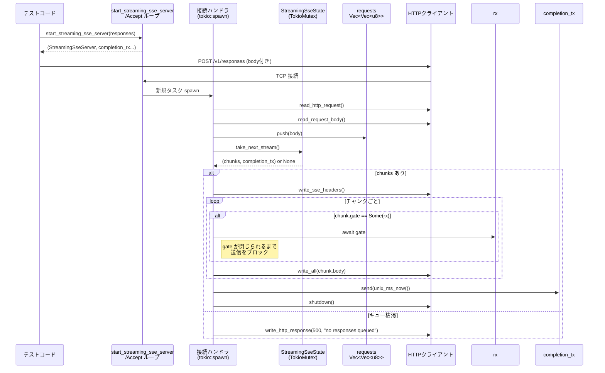

# core/tests/common/streaming_sse.rs コード解説

## 0. ざっくり一言

このファイルは、テスト用の **軽量な HTTP/SSE サーバ** を実装し、  
「チャンクごとにゲート信号で送信タイミングを制御できる SSE ストリーム」と、その挙動を検証するテスト群を提供するものです。

---

## 1. このモジュールの役割

### 1.1 概要

- このモジュールは、クライアントからの HTTP リクエストに対して、
  - `GET /v1/models` → 空の JSON モデル一覧を返す
  - `POST /v1/responses` → 事前にキューした SSE チャンク列を、チャンクごとにゲートで制御しながら送信する
- という簡易サーバを提供し、SSE ストリーミングに依存する他コンポーネントのテストで利用されます。

### 1.2 アーキテクチャ内での位置づけ

主なコンポーネント同士の関係は次のようになっています。

```mermaid
graph TD
    A[テストコード<br/> (mod tests)] --> B[start_streaming_sse_server<br/> (サーバ起動)]
    B --> C[StreamingSseServer<br/> (ハンドル)]
    B --> D[Accept ループタスク<br/> tokio::spawn]
    D --> E[接続ハンドラタスク<br/> tokio::spawn per connection]
    E --> F[read_http_request]
    E --> G[read_request_body]
    E --> H[take_next_stream<br/> (StreamingSseState)]
    H --> I[StreamingSseState<br/> responses/completions キュー]
    E --> J[write_sse_headers / write_http_response]
    E --> K[unix_ms_now<br/> (完了タイムスタンプ)]
    E --> L[Arc<TokioMutex<Vec<Vec<u8>>>><br/> (requests ログ)]
```

※行番号情報はこのチャンクには含まれていないため、関数名のみで示しています（すべて `core/tests/common/streaming_sse.rs` 内に定義）。

### 1.3 設計上のポイント

- **事前キュー方式のレスポンス**  
  - `StreamingSseState` 内の `responses: VecDeque<Vec<StreamingSseChunk>>` に、POST `/v1/responses` ごとの SSE チャンク列を FIFO でキューします。
- **完了通知**  
  - 各レスポンスストリームの送信完了時刻を、`oneshot::Sender<i64>`（UNIX ms）経由でテスト側に通知します。
- **ゲート付きチャンク送信**  
  - 各 `StreamingSseChunk` は `gate: Option<oneshot::Receiver<()>>` を持ち、`Some` の場合、そのゲートが発火するまでチャンク送信を待機します。
- **スレッド安全な共有状態**  
  - `Arc<TokioMutex<...>>` で `StreamingSseState` とリクエストボディログを共有し、複数接続からの並行アクセスを直列化しています。
- **エラー方針**  
  - 受信リクエストが不正な場合は 400、レスポンスキューが枯渇している場合は 500、未知ルートは 404 を返し、パニックではなく明示的な HTTP エラーで扱います（一部 I/O まわりでは `expect` によるパニックもありますが、テスト用コードに閉じています）。

---

## 2. 主要な機能一覧

- SSE チャンク構造体 `StreamingSseChunk`:  
  ゲート信号と本文を持つ 1 チャンク分の SSE データ表現。
- テスト用サーバハンドル `StreamingSseServer`:  
  サーバ URI 取得、受信リクエストボディの取得、シャットダウンを提供。
- `start_streaming_sse_server`:  
  SSE 応答キューを受け取り、ローカル TCP で HTTP/SSE サーバを起動。
- FIFO 状態管理 `StreamingSseState` と `take_next_stream`:  
  レスポンスチャンク列と完了通知を、POST リクエストごとに 1 つずつ取り出す。
- HTTP リクエスト読み取りユーティリティ  
  `read_http_request`, `read_request_body`, `parse_request_line`, `content_length` など。
- HTTP/SSE レスポンス書き出し  
  `write_sse_headers`, `write_http_response`。
- 補助関数  
  `unix_ms_now`（UNIX ミリ秒の現在時刻取得）と、テスト用の接続/読み書き関数・アサート群。

---

## 3. 公開 API と詳細解説

### 3.1 型一覧（構造体・列挙体など）

| 名前 | 種別 | 公開 | 役割 / 用途 | 根拠 |
|------|------|------|------------|------|
| `StreamingSseChunk` | 構造体 | `pub` | 1 つの SSE チャンク。`gate` で送信タイミングを制御し、`body` に生の SSE テキストを保持します。 | `StreamingSseChunk` 定義（ファイル前半） |
| `StreamingSseServer` | 構造体 | `pub` | 起動済み SSE サーバへのハンドル。URI 参照、受信リクエストログ取得、シャットダウンを提供します。 | `StreamingSseServer` 定義と `impl` |
| `StreamingSseState` | 構造体 | 非公開 | サーバ内部状態。レスポンスチャンク列 (`responses`) と、各レスポンス完了通知 (`completions`) を FIFO で管理します。 | `struct StreamingSseState` 定義 |
| `VecDeque<Vec<StreamingSseChunk>>` | 型エイリアスではないが重要 | 非公開 | 各 POST `/v1/responses` ごとの SSE チャンク列を順序付きで格納します。 | `StreamingSseState` のフィールド |
| `VecDeque<oneshot::Sender<i64>>` | 型 | 非公開 | 各レスポンスストリーム完了時刻を送る oneshot 送信側キュー。 | 同上 |

テストモジュール内の補助関数やテスト関数も多数ありますが、ここではサーバ本体の理解に必要なものに絞ります。

---

### 3.2 重要関数・メソッド詳細（7 件）

#### `start_streaming_sse_server(responses: Vec<Vec<StreamingSseChunk>>) -> (StreamingSseServer, Vec<oneshot::Receiver<i64>>)`

**概要**

- ローカルホストのエフェメラルポートで TCP リスナーを立て、  
  `GET /v1/models` と `POST /v1/responses` を処理する最小限の HTTP/SSE サーバを起動します。
- 引数で渡されたレスポンスチャンク列を FIFO で消費しつつ、各レスポンスの完了時刻を oneshot チャネルで通知します。  
  根拠: 関数定義と内部の `TcpListener::bind`, `VecDeque::from(responses)` 利用部。

**引数**

| 引数名 | 型 | 説明 |
|--------|----|------|
| `responses` | `Vec<Vec<StreamingSseChunk>>` | POST `/v1/responses` 1 リクエストあたりの SSE チャンク列を、順番付きのリストで渡します。外側の `Vec` がリクエスト順、内側がそのリクエストのチャンク順です。 |

**戻り値**

- `(StreamingSseServer, Vec<oneshot::Receiver<i64>>)`  
  - `StreamingSseServer`: 起動済みサーバへのハンドル。
  - `Vec<oneshot::Receiver<i64>>`: 各レスポンスストリームに対応する完了通知。値は完了時点の UNIX ミリ秒（`unix_ms_now`）。

**内部処理の流れ**

1. `TcpListener::bind("127.0.0.1:0")` でローカルの空きポートにバインドし、URI を `http://{addr}` 形式で組み立てます。
2. `responses.len()` と同じ個数の oneshot チャネルを作成し、送信側を `completion_senders`、受信側を `completion_receivers` として分離します。
3. `StreamingSseState` を `Arc<TokioMutex<_>>` でラップし、`responses` と `completions` を `VecDeque` として保持します。
4. `requests: Arc<TokioMutex<Vec<Vec<u8>>>>` を作成し、受信したリクエストボディを保存するために利用します。
5. シャットダウン用の oneshot チャネル (`shutdown_tx`, `shutdown_rx`) を作成します。
6. `tokio::spawn` で accept ループタスクを起動し、`tokio::select!` で
   - `shutdown_rx` が閉じられたらループを抜ける
   - 新規接続を `listener.accept()` で待ち受ける
   の 2 つを同時に待機します。
7. それぞれの接続ごとに別タスクを `tokio::spawn` し、HTTP リクエストの読み取りとルーティング、SSE 送信を行います。
8. 最後に `StreamingSseServer { ... }` と `completion_receivers` をタプルで返します。

**Examples（使用例）**

テストコードに近い最小例です。

```rust
use tokio::sync::oneshot;
use core::tests::common::streaming_sse::{
    start_streaming_sse_server, StreamingSseChunk,
};

// 非ゲートの SSE チャンクを 1 つ用意する
let chunks = vec![
    StreamingSseChunk {
        gate: None,                                      // ゲートなし → 即送信
        body: "event: test\n\n".to_string(),             // SSE 形式のテキスト
    },
];

// サーバ起動（レスポンスキューは 1 ストリームのみ）
let (server, mut completions) = start_streaming_sse_server(vec![chunks]).await;

// `server.uri()` で得た URI に対してクライアントから POST /v1/responses を投げる
let url = format!("{}/v1/responses", server.uri());
// ... 任意の HTTP クライアントで POST する ...

// 完了通知を待つ
let completion_rx = completions.pop().unwrap();
let finished_at_ms = completion_rx.await.unwrap();

// 終了処理
server.shutdown().await;
```

**Errors / Panics**

- `TcpListener::bind` / `listener.local_addr` / `listener.accept` などでエラーが起きると `expect` により **パニック** します。  
  テスト用コードのため、環境が正常であることを仮定しています。
- `responses` と `completion_senders` の長さは同じ（`responses.len()`）で作成されますが、内部ロジックによりズレる可能性はありません（常に `take_next_stream` で一緒に消費）。
- accept ループ内の接続ハンドラタスクは、I/O エラーやパースエラー時に HTTP エラーコードを返して終了します。

**Edge cases（エッジケース）**

- `responses` が空の状態で `POST /v1/responses` が来ると、`take_next_stream` が `None` を返し、HTTP 500 `"no responses queued"` を返します（テスト `post_responses_with_no_queue_returns_500` 参照）。
- 実際のテストでは `responses.len()` 回以上の POST を送ると、後続のリクエストは同様に 500 になります。
- シャットダウン (`server.shutdown()`) が呼ばれて accept ループが終了しても、既に処理中の接続タスクは個別に完了するまで動作し得ます。

**使用上の注意点**

- このサーバはテスト用途を前提としており、HTTP 実装やセキュリティは最小限です。
- 外部からの予期しない接続を避けるために、実行環境では `127.0.0.1` のみにバインドしていますが、同一マシン上の他プロセスからはアクセス可能です。
- `completion_receivers` はレスポンスの順に並んでいるため、テスト側で順番を変えないことが前提です。

---

#### `impl StreamingSseServer::uri(&self) -> &str`

**概要**

- 起動済みサーバのベース URI (`http://127.0.0.1:PORT`) を文字列スライスとして返します。

**引数**

- なし（`&self` のみ）

**戻り値**

- `&str`: ベース URI への参照。所有権は呼び出し元に移動しません。

**内部処理**

- `&self.uri` をそのまま返すだけのシンプルなゲッターです。

**使用上の注意点**

- レスポンスパス（`/v1/models` や `/v1/responses`）は呼び出し側で付加する必要があります。
- `StreamingSseServer` が `shutdown(self)` により消費された後は呼び出せません（所有権がムーブ済み）。

---

#### `impl StreamingSseServer::requests(&self) -> Vec<Vec<u8>>`（`async` メソッド）

**概要**

- サーバ起動後に受信した **全ての HTTP リクエストボディ** を、到着順に `Vec<Vec<u8>>` として返します。

**引数**

- なし（`&self`）

**戻り値**

- `Vec<Vec<u8>>`: リクエストボディのスナップショット。内部 `Vec` のクローンです。

**内部処理の流れ**

1. `self.requests.lock().await` で `TokioMutex<Vec<Vec<u8>>>` を非同期ロックします。
2. `clone()` を呼び出してコピーを作成し、それを返します。

**Errors / Panics**

- `Mutex` のロックでパニックが起こる可能性は通常ありません（`TokioMutex` は poisoning しません）。
- I/O は行わないため `Result` ではなく、常に成功します。

**Edge cases**

- リクエスト数が多い場合、全てのボディをクローンするのでメモリ使用量とコピーコストが増加します。

**使用上の注意点**

- テストで検証目的に使う前提のため、**パフォーマンスは重視されていません**。巨大なボディや大量のリクエストを扱う用途には向きません。
- `requests()` 呼び出し時点までに受信したリクエストのみが含まれます。

---

#### `impl StreamingSseServer::shutdown(self)`

**概要**

- シャットダウン用 oneshot チャネルにシグナルを送り、accept ループタスクの終了を待ちます。

**引数**

- `self`（所有権をムーブ）

**戻り値**

- なし (`()`)

**内部処理の流れ**

1. `let _ = self.shutdown.send(());` で accept ループ側の `shutdown_rx` にシグナル送信を試みます。  
   - 既に受信側がドロップされている場合はエラーになりますが、`let _ =` で無視します。
2. `let _ = self.task.await;` で accept ループタスクの終了を待ちます。  
   - タスクがパニックしている場合でも `JoinHandle` 内に格納され、`Result` は無視されています。

**Errors / Panics**

- `shutdown.send(())` は `Result` を返しますが、失敗しても無視します。
- `self.task.await` でタスクがパニックしていた場合、`JoinError` が返りますが、これも無視されます（テストコードのため簡素化）。

**Edge cases**

- 接続ハンドラタスクは個別に動作しているため、シャットダウンシグナル後もまだ進行中のものが存在し得ます。
- ただし、accept ループは停止するため、新しい接続は受け付けません。

**使用上の注意点**

- 必ずテストの最後で `server.shutdown().await` を呼び出し、バックグラウンドタスクのリークを防ぐ前提になっています（`shutdown_terminates_accept_loop` テスト参照）。
- `self` の所有権を消費するため、シャットダウン後に `uri` や `requests` は呼び出せません。

---

#### `take_next_stream(state: &TokioMutex<StreamingSseState>) -> Option<(Vec<StreamingSseChunk>, oneshot::Sender<i64>)>`

**概要**

- `StreamingSseState` 内の `responses` と `completions` を **ロックの下で同時に 1 つずつ消費** し、  
  次のレスポンスストリームに対応するチャンク列と完了通知送信側を返します。

**引数**

| 引数名 | 型 | 説明 |
|--------|----|------|
| `state` | `&TokioMutex<StreamingSseState>` | レスポンスキューと完了通知キューを保持する共有状態。`Arc` で共有されたものへの参照が渡されます。 |

**戻り値**

- `Option<(Vec<StreamingSseChunk>, oneshot::Sender<i64>)>`  
  - キューに要素があれば `Some((chunks, completion_sender))`  
  - どちらかが空になっていれば `None`

**内部処理の流れ**

1. `state.lock().await` で `StreamingSseState` をロックします。
2. `guard.responses.pop_front()?` で先頭のチャンク列を取り出します（なければ `None` を返して終了）。
3. 同様に `guard.completions.pop_front()?` で先頭の完了通知送信側を取り出します。
4. `(chunks, completion)` を `Some` でラップして返します。

**Errors / Panics**

- `VecDeque::pop_front` は panics しません。
- `TokioMutex` ロックでも通常パニックは発生しません。

**Edge cases**

- `responses` と `completions` の長さがずれていると、どちらかの `pop_front` が先に `None` を返し、`None` が返却されます。  
  実装では、初期化時に同じ長さで構築し、その後は常にロック下で同時に消費しているため、正常系では発生しません。
- テスト `take_next_stream_consumes_in_lockstep` で、この「ロックステップ消費」が検証されています。

**使用上の注意点**

- ロック中に `.await` を呼んでいないため、デッドロックのリスクは低い構造になっています。
- 長時間ロック保持するべきではない処理（チャンク送信など）を外に出している点が、非同期コードとして安全な設計になっています。

---

#### `read_http_request(stream: &mut tokio::net::TcpStream) -> (String, Vec<u8>)`

**概要**

- TCP ストリームから HTTP リクエストのヘッダ部分を読み取り、  
  ヘッダ末尾 (`\r\n\r\n`) までを文字列として返すとともに、その後に既に読み込まれたバイト列（ボディの先頭部分）を返します。

**引数**

| 引数名 | 型 | 説明 |
|--------|----|------|
| `stream` | `&mut tokio::net::TcpStream` | クライアントとの接続ストリーム。読み込み専用で使用します。 |

**戻り値**

- `(String, Vec<u8>)`  
  - `String`: ヘッダ部のテキスト。`\r\n\r\n` を含みます。
  - `Vec<u8>`: ヘッダ以降にすでに読み込まれているバイト列（ボディの先頭）。

**内部処理の流れ**

1. `buf: Vec<u8>` と `scratch: [u8; 1024]` を用意します。
2. `loop` で `stream.read(&mut scratch).await.unwrap_or(0)` を繰り返し、
   - 読み取ったバイト列を `buf` に追記。
   - `header_terminator_index(&buf)` で `\r\n\r\n` の位置を探す。
3. ヘッダ終端が見つかった場合:
   - `header_end = end + 4` とし、`buf[..header_end]` をヘッダ文字列に、`buf[header_end..]` をボディ先頭に分割して返す。
4. 接続が EOF（`read == 0`）になった場合:
   - `String::from_utf8_lossy(&buf)` をヘッダとして返し、ボディは空の `Vec::new()` を返す。

**Errors / Panics**

- `stream.read(&mut scratch).await.unwrap_or(0)`  
  - 読み取りでエラーが発生した場合、エラーを 0 バイト読み込みとして扱い、ループを終了します。パニックはしませんが、**I/O エラーを握りつぶして EOF と同等に扱う**点に注意が必要です。
- `String::from_utf8_lossy` により、ヘッダの不正な UTF-8 は U+FFFD に置き換えられ、パニックしません。

**Edge cases**

- ヘッダ終端が現れないまま接続が閉じられた場合、全ての読み込んだバイト列が「ヘッダ」として返り、ボディは空になります。  
  テスト `read_http_request_returns_after_header_terminator` は「終端がある場合にヘッダで止まる」パスを検証しています。
- 非常に長いヘッダでも、終端が見つかるまで読み続けます。サイズ制限はありません（テスト用途なので簡略化）。

**使用上の注意点**

- 実運用 HTTP サーバ用としては、ヘッダサイズの上限やタイムアウトがないため安全ではありませんが、このファイルはテスト専用です。
- I/O エラーが「ヘッダ読み込み完了」と見なされる可能性があるため、その後の処理（`parse_request_line` 等）で `None` になり 400 エラーとなることがあります。

---

#### `read_request_body(stream: &mut tokio::net::TcpStream, headers: &str, body_prefix: Vec<u8>) -> std::io::Result<Vec<u8>>`

**概要**

- すでに `read_http_request` によってヘッダとボディ先頭が読み込まれている前提で、  
  `Content-Length` ヘッダを参照し、指定バイト数になるまで残りのボディを読み取ります。

**引数**

| 引数名 | 型 | 説明 |
|--------|----|------|
| `stream` | `&mut tokio::net::TcpStream` | 残りのボディを読み取るストリーム。 |
| `headers` | `&str` | HTTP ヘッダ全体の文字列。`Content-Length` を抽出するために使われます。 |
| `body_prefix` | `Vec<u8>` | ヘッダ読み込み時点ですでに読み込まれているボディ先頭部分。 |

**戻り値**

- `std::io::Result<Vec<u8>>`  
  - `Ok(Vec<u8>)`: 完全なボディ（`Content-Length` バイト分、もしくはヘッダに `Content-Length` がない場合は `body_prefix` そのもの）。
  - `Err(e)`: `read_exact` での読み取り失敗など、I/O エラー。

**内部処理の流れ**

1. `content_length(headers)` を呼び出し、`Content-Length` ヘッダの値を `Option<usize>` として取得します。
2. `Content-Length` がない場合は、ボディを `body_prefix` だけとみなし、そのまま `Ok(body_prefix)` を返します。
3. `body_prefix.len()` が `content_len` より大きい場合は `truncate` で切り詰めます。
4. `remaining = content_len.saturating_sub(body_prefix.len())` を計算し、残りの読込が 0 なら `Ok(body_prefix)` を返します。
5. それ以外の場合は、`remaining` バイトのバッファ `rest` を用意し、`stream.read_exact(&mut rest).await?` でちょうど読み取ります。
6. `body_prefix.extend_from_slice(&rest);` で結合し、結果を返します。

**Errors / Panics**

- `read_exact` は指定バイト数に満たないまま EOF になると `Err` を返します。  
  呼び出し側では `?` ではなく `match` などで扱っており、400 エラーへの変換に使われています。
- `content_length` 内の `value.parse::<usize>().ok()` により、パース失敗は `None` として扱います（その場合も `body_prefix` だけを返す）。

**Edge cases**

- `body_prefix.len() > content_len` の場合、`truncate` により余剰分が切り捨てられます。  
  これは「ヘッダ終端後にすでに読み込み済みだったボディが Content-Length を超えていた」ケースに対応しています。
- `Content-Length` が異常に大きいと、それだけのバッファを確保して読み込もうとするため、メモリ使用量が増加します。

**使用上の注意点**

- 実運用では `Content-Length` 過信は危険ですが、テスト環境では入力が制御されていることを前提とした実装になっています。
- `Content-Length` がない場合でも `body_prefix` はそのまま返されるため、POST 以外のメソッドにも再利用できます。

---

### 3.3 その他の関数（概要のみ）

非公開の補助関数とテスト用ヘルパーの一覧です。

| 関数名 | 役割（1 行） |
|--------|--------------|
| `parse_request_line(request: &str) -> Option<(&str, &str)>` | 最初の行から HTTP メソッドとパスを抽出します。形式が不正なら `None`。 |
| `header_terminator_index(buf: &[u8]) -> Option<usize>` | `\r\n\r\n` シーケンスの開始位置を返します。 |
| `content_length(headers: &str) -> Option<usize>` | `Content-Length` ヘッダを大小文字無視で探索し、数値として返します。 |
| `write_sse_headers(stream: &mut TcpStream) -> io::Result<()>` | SSE 用の固定ヘッダ（`content-type: text/event-stream` など）を書き出します。 |
| `write_http_response(stream: &mut TcpStream, status: i64, body: &str, content_type: &str) -> io::Result<()>` | 単純な HTTP レスポンス（任意ステータスコード・コンテンツタイプ）を送信します。 |
| `unix_ms_now() -> i64` | `SystemTime::now()` から UNIX エポックまでのミリ秒を計算して返します。 |
| テストモジュール内 `split_response`, `status_code`, `header_value` など | レスポンスヘッダ・ボディ分割やステータスコード抽出など、テストの可読性を向上させるユーティリティ。 |

---

## 4. データフロー

### 4.1 POST `/v1/responses` に対する典型的な流れ

テストコードが `POST /v1/responses` を送ったときのデータの流れを図示します。



**要点**

- `StreamingSseState` は **リクエストごとに 1 回** `take_next_stream` され、レスポンスチャンク列と完了通知チャネルをセットで取り出します。
- 各チャンク送信前に `gate` が `Some(rx)` であれば、`rx.await` により外部のシグナルを待ちます。  
  これにより、テストコード側が任意のタイミングでチャンク送信を制御できます。
- 送信完了後に `completion_tx.send(unix_ms_now())` で完了時刻を通知します。

---

## 5. 使い方（How to Use）

このモジュールはテスト用ですが、他のテストや検証コードから再利用することも想定できます。

### 5.1 基本的な使用方法

1 ストリーム・非ゲートのシンプルな SSE 応答を返す例です。

```rust
use tokio::sync::oneshot;
use core::tests::common::streaming_sse::{
    start_streaming_sse_server, StreamingSseChunk,
};

#[tokio::test]
async fn example_basic_usage() {
    // 1. 応答する SSE チャンク列を用意
    let chunks = vec![
        StreamingSseChunk {
            gate: None,                                  // すぐ送信
            body: "event: message\ndata: hello\n\n".into(),
        },
    ];

    // 2. サーバ起動（レスポンスは1つだけ）
    let (server, mut completions) = start_streaming_sse_server(vec![chunks]).await;

    // 3. クライアントから POST /v1/responses を送信
    let url = format!("{}/v1/responses", server.uri());
    let client = reqwest::Client::new();
    let resp = client.post(url)
        .header("Content-Length", "0")
        .send()
        .await
        .unwrap();
    assert!(resp.status().is_success());

    // 4. SSE ボディを取得
    let body = resp.text().await.unwrap();
    assert_eq!(body, "event: message\ndata: hello\n\n");

    // 5. 完了時刻を取得
    let completion_rx = completions.pop().unwrap();
    let finished_at = completion_rx.await.unwrap();
    assert!(finished_at > 0);

    // 6. シャットダウン
    server.shutdown().await;
}
```

### 5.2 ゲート付きストリームの使用パターン

チャンクごとに外部からのシグナルで送信タイミングを制御する例です。

```rust
use tokio::sync::oneshot;
use core::tests::common::streaming_sse::{
    start_streaming_sse_server, StreamingSseChunk,
};

#[tokio::test]
async fn example_gated_stream() {
    // 2つのゲートを用意
    let (gate1_tx, gate1_rx) = oneshot::channel();
    let (gate2_tx, gate2_rx) = oneshot::channel();

    let chunks = vec![
        StreamingSseChunk {
            gate: Some(gate1_rx),                        // gate1 が閉じるまで送られない
            body: "event: one\n\n".into(),
        },
        StreamingSseChunk {
            gate: Some(gate2_rx),
            body: "event: two\n\n".into(),
        },
    ];

    let (server, _) = start_streaming_sse_server(vec![chunks]).await;

    let url = format!("{}/v1/responses", server.uri());
    let client = reqwest::Client::new();
    let mut resp = client.post(url).header("Content-Length", "0").send().await.unwrap();

    // まだ gate1 を閉じていないのでボディは届かない（タイムアウトで検証可能）

    // gate1 を閉じる → "event: one" が届く
    gate1_tx.send(()).unwrap();

    // gate2 を閉じる → "event: two" が届き、ストリームが終わる
    gate2_tx.send(()).unwrap();

    let body = resp.text().await.unwrap();
    assert_eq!(body, "event: one\n\nevent: two\n\n");

    server.shutdown().await;
}
```

### 5.3 よくある間違い

```rust
// 誤り例: レスポンスキューが空のまま複数回 POST する
let (server, _) = start_streaming_sse_server(Vec::new()).await;
// ここで POST /v1/responses を送ると 500 "no responses queued" が返る

// 正しい例: 必要な回数分のレスポンスをあらかじめキューしておく
let responses = vec![
    vec![StreamingSseChunk { gate: None, body: "event: first\n\n".into() }],
    vec![StreamingSseChunk { gate: None, body: "event: second\n\n".into() }],
];
let (server, _) = start_streaming_sse_server(responses).await;
// 2回までの POST /v1/responses にそれぞれ first, second をストリーム
```

別の典型的な落とし穴:

- サーバ終了前に `server.shutdown().await` を呼び忘れる → テストスイート終了時までバックグラウンドタスクが残り続ける可能性があります。

### 5.4 使用上の注意点（まとめ）

- **前提条件**
  - テストコードからのみ利用する設計であり、入力は「よく振る舞うクライアント」を仮定しています。
  - `start_streaming_sse_server` の `responses.len()` を、実際に送る `POST /v1/responses` の回数と合わせる必要があります。
- **エラー時の挙動**
  - 不正なリクエストライン → 400 `"bad request"`。
  - ボディ読み取り失敗 → 400 `"bad request"`。
  - レスポンスキュー枯渇 → 500 `"no responses queued"`。
  - 未知のパス → 404 `"not found"`。
- **並行性**
  - 複数クライアントから同時に `POST` しても、`StreamingSseState` は `TokioMutex` により排他制御され、レスポンスは FIFO で割り当てられます。
  - ただし、チャンク送信順序は各ストリーム内では固定ですが、**ストリーム間の完了時間** は I/O やゲートのタイミングに依存します（テストでは単調増加であることを確認）。

---

## 6. 変更の仕方（How to Modify）

### 6.1 新しい機能を追加する場合

例: 新しいエンドポイント `/v1/health` を追加したい場合。

1. 接続ハンドラタスク内のルーティング分岐（`if method == "GET" && path == "/v1/models" { ... }` など）に、新しい条件分岐を追加します。
2. 必要に応じて、レスポンス用の固定 JSON 文字列や SSE チャンク列を追加します。
3. テストモジュールに新しい `#[tokio::test]` を追加し、期待されるステータスコード・ヘッダ・ボディを検証します。

### 6.2 既存の機能を変更する場合

- **影響範囲の確認**
  - `GET /v1/models` や `POST /v1/responses` の挙動を変える場合は、該当するテスト（`get_models_returns_empty_list`, `post_responses_streams_in_order_and_closes` など）を確認します。
  - `StreamingSseState` のフィールドや `take_next_stream` の仕様を変える場合は、FIFO 性や完了通知の対応関係を保証するテストを更新する必要があります。
- **契約の維持**
  - `start_streaming_sse_server` の返り値の意味（レスポンス数分の completion receivers を返すこと）を変えると、多くのテストコードに影響します。
  - HTTP ステータスコードや content-type の値は、テストで文字列一致検証されているため変更に注意が必要です。
- **推奨手順**
  - まずテストを変更（または追加）し、その後実装を変更してテストを通す、という TDD 的な進め方が安全です。

---

## 7. 関連ファイル

このファイル単体でも完結していますが、テストコードからは他のコンポーネントも利用されています（ここでは明示されていません）。

| パス | 役割 / 関係 |
|------|------------|
| `core/tests/common/streaming_sse.rs` | 本ファイル。SSE テスト用の簡易 HTTP サーバとその挙動を検証するテスト群を提供します。 |
| その他のテスト用ユーティリティ | このチャンクには現れないため不明ですが、他の `core/tests/common/*.rs` が類似のサーバやモックを提供している可能性があります。 |

---

### 補足: 安全性・エラー・並行性に関するポイント（横断的）

- **メモリ安全性**  
  - Rust の所有権ルールにより、`StreamingSseServer` が `shutdown(self)` で所有権を消費することで、サーバハンドルの二重利用を防いでいます。
  - 共有状態は `Arc<TokioMutex<...>>` でラップされ、データ競合（data race）は起こりません。
- **エラーハンドリング**  
  - ネットワーク I/O エラーの多くは `Result` として扱われ、呼び出し側で HTTP 400/500 などに変換されます。
  - 一部テスト起動時の初期化（`bind`, `accept`）では `expect` によるパニックを許容しており、「テスト環境が正常であること」を前提にしています。
- **並行性モデル**  
  - `tokio::spawn` で accept ループと各接続ハンドラを独立タスクとして実行し、CPU コア数に応じて並列に処理できます。
  - `StreamingSseState` へのアクセスは短時間のロック取得・デキューのみで、`await` を含まないため、非同期コードとしてのブロッキング時間も短く抑えられています。

以上のように、このファイルは「テスト用に最小限の HTTP/SSE サーバ挙動を再現し、ゲート付き SSE ストリーミングや FIFO 性、完了通知などを検証する」ための補助モジュールとして設計されています。
