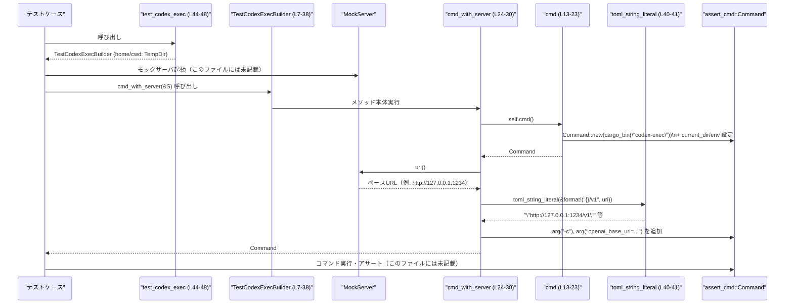

# core/tests/common/test_codex_exec.rs

## 0. ざっくり一言

`codex-exec` バイナリの統合テスト向けに、一時ディレクトリや環境変数を設定した `assert_cmd::Command` を組み立てるヘルパー（ビルダー）を提供するモジュールです。  
（根拠: `TestCodexExecBuilder` と `test_codex_exec` の定義と実装 `core/tests/common/test_codex_exec.rs:L7-10,L12-38,L44-48`）

---

## 1. このモジュールの役割

### 1.1 概要

- `TempDir` を使ってテスト専用の「ホームディレクトリ」と「カレントディレクトリ」を用意し、そのパスを `codex-exec` コマンドに設定します。（`core/tests/common/test_codex_exec.rs:L7-9,L18-20,L46-47`）
- `CODEX_HOME` / `CODEX_SQLITE_HOME` / `CODEX_API_KEY_ENV_VAR` などの環境変数を設定した `assert_cmd::Command` を生成します。（`core/tests/common/test_codex_exec.rs:L2,L18-21`）
- Wiremock の `MockServer` を使った HTTP モックサーバと接続するための `openai_base_url` 設定をコマンドライン引数として付与します。（`core/tests/common/test_codex_exec.rs:L4,L5,L24-30,L40-41`）

### 1.2 アーキテクチャ内での位置づけ

このモジュールはテストヘルパーであり、実際の本体コードではなく「テストコードから呼び出されるユーティリティ」です。  
外部クレートやツールとの関係は以下のようになります。

```mermaid
graph TD
    subgraph "core/tests/common/test_codex_exec.rs"
        A["test_codex_exec (L44-48)"]
        B["TestCodexExecBuilder (L7-38)"]
        B1["cmd (L13-23)"]
        B2["cmd_with_server (L24-30)"]
        B3["cwd_path (L32-34)"]
        B4["home_path (L35-37)"]
        C["toml_string_literal (L40-41)"]
    end

    A --> B
    B -.fields.-> T["tempfile::TempDir (home/cwd)"]
    B1 -->|"assert_cmd::Command::new"| D["assert_cmd::Command"]
    B1 -->|"codex_utils_cargo_bin::cargo_bin(\"codex-exec\")"| E["codex_utils_cargo_bin"]
    B1 -->|"env(CODEX_HOME / CODEX_SQLITE_HOME)| D
    B1 -->|"env(CODEX_API_KEY_ENV_VAR)| L["codex_login::CODEX_API_KEY_ENV_VAR"]
    B2 --> B1
    B2 -->|"&MockServer"| M["wiremock::MockServer"]
    B2 --> C
    C --> S["serde_json::to_string"]

    style A fill:#e0f7fa,stroke:#333
    style B fill:#e8f5e9,stroke:#333
    style B1 fill:#fffde7,stroke:#333
    style B2 fill:#fffde7,stroke:#333
    style C fill:#f3e5f5,stroke:#333
```

- どのテストファイルからこのビルダーが使われているかは、このチャンクには現れていません。（不明）

### 1.3 設計上のポイント

- **ビルダー構造体による共通初期化**  
  - テストごとに `TestCodexExecBuilder` を生成し、その上で `cmd` / `cmd_with_server` を呼ぶ形になっています。（`core/tests/common/test_codex_exec.rs:L7-10,L12-38,L44-48`）
- **一時ディレクトリ管理**  
  - `home` / `cwd` に `TempDir` を保持し、`cwd_path` / `home_path` でパスを公開しています。（`core/tests/common/test_codex_exec.rs:L7-9,L32-37`）
- **環境変数の一括設定**  
  - `cmd` 内で `CODEX_HOME` / `CODEX_SQLITE_HOME` / `CODEX_API_KEY_ENV_VAR` をまとめて設定します。（`core/tests/common/test_codex_exec.rs:L18-21`）
- **モックサーバとの連携**  
  - `cmd_with_server` で `MockServer::uri()` から URL を組み立て、`openai_base_url` 設定として渡します。（`core/tests/common/test_codex_exec.rs:L24-30`）
- **エラーハンドリング方針**  
  - `codex_utils_cargo_bin::cargo_bin`、`TempDir::new`、`serde_json::to_string` の失敗は全て `expect` により **panic** させる設計です。テスト用コードであるため、失敗時は即座にテストを落とす方針と解釈できます。（`core/tests/common/test_codex_exec.rs:L1,L15-16,L40-41,L46-47`）
- **並行性・スレッド安全性**  
  - このファイル内には `unsafe` や共有可変状態は登場せず、`&self` の不変参照のみでメソッドを呼び出しています。（`core/tests/common/test_codex_exec.rs:L13,L24,L32,L35`）
  - `TempDir` や `assert_cmd::Command` がスレッド安全かどうかは、このチャンクからは判断できません。

---

## 2. 主要な機能一覧

このモジュールが提供する主な機能とコンポーネントの一覧です。

### 2.1 コンポーネントインベントリー

| 名前 | 種別 | 公開性 | 役割 / 用途 | 根拠 |
|------|------|--------|------------|------|
| `TestCodexExecBuilder` | 構造体 | `pub` | `codex-exec` テスト用に一時ディレクトリと環境変数を束ねるビルダー | `core/tests/common/test_codex_exec.rs:L7-10` |
| `TestCodexExecBuilder::cmd` | メソッド | `pub` | `codex-exec` バイナリを起動する `assert_cmd::Command` を、ホーム/カレントディレクトリと環境変数付きで生成する | `core/tests/common/test_codex_exec.rs:L13-23` |
| `TestCodexExecBuilder::cmd_with_server` | メソッド | `pub` | 上記 `cmd` に、Wiremock サーバの `openai_base_url` 設定を CLI 引数で追加したコマンドを生成する | `core/tests/common/test_codex_exec.rs:L24-30` |
| `TestCodexExecBuilder::cwd_path` | メソッド | `pub` | ビルダーが保持するカレントディレクトリ用 `TempDir` のパスを返す | `core/tests/common/test_codex_exec.rs:L32-34` |
| `TestCodexExecBuilder::home_path` | メソッド | `pub` | ビルダーが保持するホームディレクトリ用 `TempDir` のパスを返す | `core/tests/common/test_codex_exec.rs:L35-37` |
| `toml_string_literal` | 関数 | `fn` (モジュール内 private) | 文字列を JSON 文字列としてシリアライズし、TOML 文字列リテラルとして使うためのヘルパー | `core/tests/common/test_codex_exec.rs:L40-41` |
| `test_codex_exec` | 関数 | `pub` | 新しい `TestCodexExecBuilder` を生成するファクトリー関数 | `core/tests/common/test_codex_exec.rs:L44-48` |

### 2.2 機能の箇条書き

- `codex-exec` バイナリのパス解決と `assert_cmd::Command` の生成（`cmd`）  
  （根拠: `core/tests/common/test_codex_exec.rs:L13-18`）
- `CODEX_HOME` / `CODEX_SQLITE_HOME` / `CODEX_API_KEY_ENV_VAR` の設定を伴う環境構築（`cmd`）  
  （根拠: `core/tests/common/test_codex_exec.rs:L18-21`）
- Wiremock の `MockServer` を用いた `openai_base_url` 設定付きコマンド生成（`cmd_with_server`）  
  （根拠: `core/tests/common/test_codex_exec.rs:L24-30`）
- 一時ホームディレクトリ・カレントディレクトリのパス公開（`cwd_path`, `home_path`）  
  （根拠: `core/tests/common/test_codex_exec.rs:L32-37`）
- TOML 設定用の安全な文字列リテラル生成（`toml_string_literal`）  
  （根拠: `core/tests/common/test_codex_exec.rs:L40-41`）
- 上記をまとめて初期化するビルダー生成（`test_codex_exec`）  
  （根拠: `core/tests/common/test_codex_exec.rs:L44-48`）

---

## 3. 公開 API と詳細解説

### 3.1 型一覧（構造体）

| 名前 | 種別 | 役割 / 用途 | フィールド概要 | 根拠 |
|------|------|-------------|----------------|------|
| `TestCodexExecBuilder` | 構造体 | `codex-exec` 用テスト環境（ホーム・カレントディレクトリ）とそれに基づくコマンド生成を行うビルダー | `home: TempDir` … ホームディレクトリ用一時ディレクトリ / `cwd: TempDir` … カレントディレクトリ用一時ディレクトリ | `core/tests/common/test_codex_exec.rs:L7-10` |

`TestCodexExecBuilder` 自体は `pub` ですが、そのフィールドはすべて private であり、外部からはメソッド経由でのみアクセスされます。（`core/tests/common/test_codex_exec.rs:L7-10,L12-38`）

---

### 3.2 関数・メソッド詳細

#### `TestCodexExecBuilder::cmd(&self) -> assert_cmd::Command`

**概要**

- `codex-exec` バイナリを起動する `assert_cmd::Command` を生成し、テスト用のカレントディレクトリと環境変数を設定して返します。（`core/tests/common/test_codex_exec.rs:L13-23`）

**引数**

| 引数名 | 型 | 説明 | 根拠 |
|--------|----|------|------|
| `&self` | `&TestCodexExecBuilder` | ホーム・カレントディレクトリ情報を含むビルダーの不変参照 | `core/tests/common/test_codex_exec.rs:L13` |

**戻り値**

- `assert_cmd::Command`  
  - `codex_utils_cargo_bin::cargo_bin("codex-exec")` で取得したバイナリパスを用いて生成されたコマンドオブジェクトです。（`core/tests/common/test_codex_exec.rs:L14-18`）

**内部処理の流れ**

1. `codex_utils_cargo_bin::cargo_bin("codex-exec")` を呼び出し、`codex-exec` バイナリの場所を解決します。（`core/tests/common/test_codex_exec.rs:L14-16`）
2. その結果を `assert_cmd::Command::new` に渡して新しいコマンドを作成します。（`core/tests/common/test_codex_exec.rs:L14-15`）
3. コマンドのカレントディレクトリを `self.cwd.path()` に設定します。（`core/tests/common/test_codex_exec.rs:L18`）
4. 環境変数 `CODEX_HOME` と `CODEX_SQLITE_HOME` を `self.home.path()` で設定します。（`core/tests/common/test_codex_exec.rs:L19-20`）
5. 環境変数 `CODEX_API_KEY_ENV_VAR`（`codex_login` からインポート）に `"dummy"` を設定します。（`core/tests/common/test_codex_exec.rs:L2,L21`）
6. 準備された `cmd` を返します。（`core/tests/common/test_codex_exec.rs:L22`）

**Examples（使用例）**

このファイル内には直接の使用例はありませんが、典型的なテスト内での利用イメージは次のようになります（`assert_cmd` 側の詳細な API はここでは扱いません）。

```rust
use core::tests::common::test_codex_exec::test_codex_exec; // 実際のモジュールパスはこのチャンクからは不明

#[test]
fn runs_codex_exec_with_default_env() {
    let builder = test_codex_exec();                  // TestCodexExecBuilder を作成
    let mut cmd = builder.cmd();                      // 環境済みの Command を取得

    cmd.arg("--help");                                // 必要な引数を追加（.arg は本ファイル内でも使用されている）

    // ここで assert_cmd::Command の API を使ってコマンド実行・アサートを行う
    // （具体的なメソッド名はこのファイルには書かれていません）
}
```

**Errors / Panics**

- `codex_utils_cargo_bin::cargo_bin("codex-exec")` が `Err` を返した場合、`expect("should find binary for codex-exec")` により **panic** します。（`core/tests/common/test_codex_exec.rs:L15-16`）
- `assert_cmd::Command::new` や、その後にコマンドを実際に実行する際のエラー挙動は、このファイルからは分かりません。

**Edge cases（エッジケース）**

- `TestCodexExecBuilder` の `home` / `cwd` フィールドが指すディレクトリが既に存在しない場合でも、`cwd_path()` / `home_path()` の戻り値はパス文字列として設定されます。実行時にどう扱われるかは OS と `Command` の挙動に依存し、このファイルからは分かりません。
- 環境変数 `CODEX_API_KEY_ENV_VAR` には必ず `"dummy"` が設定され、他の値になることはありません。（`core/tests/common/test_codex_exec.rs:L21`）

**使用上の注意点**

- `test_codex_exec().cmd()` のように、ビルダーを一時値として使って `cmd` だけを変数に束縛するパターンでは、ビルダー（および `TempDir`）のライフタイムとディレクトリ削除のタイミングに注意が必要です。  
  - 一般的な `tempfile::TempDir` の仕様では、ドロップ時にディレクトリが削除されますが、このファイルだけからは実際の実装は分かりません。  
  - そのため、**もし** `TempDir` がドロップ時にディレクトリを削除する型であれば、ビルダーが早期にドロップされると、コマンド実行時に `CODEX_HOME` / `CODEX_SQLITE_HOME` や `cwd` が存在しない可能性があります。
- 並行テストで同時に複数の `TestCodexExecBuilder` を使うこと自体を禁止するコードはありませんが、ファイルシステム・環境変数はプロセス全体で共有されるため、環境変数の上書き等には注意が必要です。このファイル内では環境変数の衝突回避の仕組みは特に設けられていません。（`core/tests/common/test_codex_exec.rs:L18-21`）

---

#### `TestCodexExecBuilder::cmd_with_server(&self, server: &MockServer) -> assert_cmd::Command`

**概要**

- `cmd` で用意したコマンドに対し、Wiremock の `MockServer` で提供されるベース URL を `openai_base_url` 設定として `-c` 引数経由で追加した `assert_cmd::Command` を返します。（`core/tests/common/test_codex_exec.rs:L24-30`）

**引数**

| 引数名 | 型 | 説明 | 根拠 |
|--------|----|------|------|
| `&self` | `&TestCodexExecBuilder` | 基本的な環境設定を提供するビルダー | `core/tests/common/test_codex_exec.rs:L24` |
| `server` | `&MockServer` | Wiremock のモックサーバインスタンスの参照 | `core/tests/common/test_codex_exec.rs:L4,L24` |

**戻り値**

- `assert_cmd::Command`  
  - `cmd()` と同様の環境を持ち、加えて `-c "openai_base_url=…"` 引数が付与されたコマンドです。（`core/tests/common/test_codex_exec.rs:L24-30`）

**内部処理の流れ**

1. `self.cmd()` を呼び出して、基本設定済みの `assert_cmd::Command` を取得します。（`core/tests/common/test_codex_exec.rs:L25`）
2. `server.uri()` を呼び出し、その結果に `"/v1"` を連結して `base` 文字列を作ります。（`core/tests/common/test_codex_exec.rs:L26`）
3. `toml_string_literal(&base)` を呼び出し、`base` を TOML 文字列リテラルとして使用できる形に変換します。（`core/tests/common/test_codex_exec.rs:L28,L40-41`）
4. コマンドに `"-c"` 引数と、`"openai_base_url={...}"` 形式の引数を `arg` チェーンで追加します。（`core/tests/common/test_codex_exec.rs:L27-28`）
5. 変更された `cmd` を返します。（`core/tests/common/test_codex_exec.rs:L29`）

**Examples（使用例）**

```rust
use wiremock::MockServer;
// use core::tests::common::test_codex_exec::test_codex_exec; // 実際のモジュールパスは不明

#[test]
fn runs_codex_exec_against_mock_server() {
    let server = MockServer::start().await;           // モックサーバを起動（実際の API は wiremock に依存）

    let builder = test_codex_exec();                  // テスト用ビルダー
    let mut cmd = builder.cmd_with_server(&server);   // モックサーバ設定付きコマンドを取得

    // 他の引数を必要に応じて追加
    cmd.arg("some-subcommand");

    // 実行・アサートは assert_cmd::Command の API に依存するためここでは省略
}
```

**Errors / Panics**

- `self.cmd()` 内で発生する panic 条件（バイナリが見つからない等）はすべて引き継ぎます。（`core/tests/common/test_codex_exec.rs:L25`）
- `toml_string_literal` 内で `serde_json::to_string` が `Err` を返した場合、`expect("serialize TOML string literal")` により panic します。（`core/tests/common/test_codex_exec.rs:L40-41`）
- `MockServer::uri()` のエラー挙動はこのファイルからは分かりません。

**Edge cases（エッジケース）**

- `server.uri()` の戻り値に末尾スラッシュが含まれているかどうかに関係なく、`format!("{}/v1", server.uri())` により `".../v1"` の形になります。（`core/tests/common/test_codex_exec.rs:L26`）
  - この文字列がどのように解釈されるかは `codex-exec` 側の実装次第であり、このチャンクからは分かりません。
- `base` に TOML 的に特別な文字（改行など）が含まれる場合でも、`toml_string_literal` により文字列リテラルとしてエスケープされることが期待されますが、具体的なエスケープ内容は `serde_json::to_string` の仕様に依存します。（`core/tests/common/test_codex_exec.rs:L40-41`）

**使用上の注意点**

- `cmd_with_server` は `cmd` をラップしているため、`cmd` と同じライフタイム上の注意（`TempDir` のドロップタイミングなど）を受けます。
- 引数 `server` のライフタイムに関して、このメソッドは `&MockServer` を受け取り、`MockServer` そのものを保持しません（値をコピーしていません）。よって、コマンドを実行する間は `MockServer` が有効なスコープに存在している必要があります。（`core/tests/common/test_codex_exec.rs:L24-28`）

---

#### `TestCodexExecBuilder::cwd_path(&self) -> &Path`

**概要**

- ビルダーが内部で保持しているカレントディレクトリ用の `TempDir` のパスを参照として返します。（`core/tests/common/test_codex_exec.rs:L32-34`）

**引数**

| 引数名 | 型 | 説明 | 根拠 |
|--------|----|------|------|
| `&self` | `&TestCodexExecBuilder` | ビルダーの不変参照 | `core/tests/common/test_codex_exec.rs:L32` |

**戻り値**

- `&Path`  
  - `self.cwd.path()` の戻り値であり、カレントディレクトリ用一時ディレクトリのパスです。（`core/tests/common/test_codex_exec.rs:L33`）

**内部処理の流れ**

1. `self.cwd.path()` を呼び出してパスを取得し、その参照を返します。（`core/tests/common/test_codex_exec.rs:L33`）

**Examples（使用例）**

```rust
let builder = test_codex_exec();                       // ビルダーを生成
let cwd = builder.cwd_path();                          // 一時カレントディレクトリの Path を取得

// 例: ここにテスト用のファイルを書き込むなど
// 実際のファイル操作は std::fs の API に依存します
```

**Errors / Panics**

- このメソッド自体には panic を引き起こすコード（`expect` など）は含まれていません。（`core/tests/common/test_codex_exec.rs:L32-34`）

**Edge cases / 使用上の注意点**

- `TempDir` がドロップされるとディレクトリが削除される実装である場合、パスは参照として残っても、実際のディレクトリは存在しない可能性があります。  
  この点は `TempDir` の仕様に依存し、このファイルからは確定できません。

---

#### `TestCodexExecBuilder::home_path(&self) -> &Path`

**概要**

- ビルダーが内部で保持しているホームディレクトリ用の `TempDir` のパスを参照として返します。（`core/tests/common/test_codex_exec.rs:L35-37`）

**引数**

| 引数名 | 型 | 説明 | 根拠 |
|--------|----|------|------|
| `&self` | `&TestCodexExecBuilder` | ビルダーの不変参照 | `core/tests/common/test_codex_exec.rs:L35` |

**戻り値**

- `&Path`  
  - `self.home.path()` の戻り値であり、ホームディレクトリ用一時ディレクトリのパスです。（`core/tests/common/test_codex_exec.rs:L36`）

**内部処理の流れ**

1. `self.home.path()` を呼び出してパスを取得し、その参照を返します。（`core/tests/common/test_codex_exec.rs:L36`）

**Examples（使用例）**

```rust
let builder = test_codex_exec();                       // ビルダーを生成
let home = builder.home_path();                        // 一時ホームディレクトリの Path を取得

// 例: 設定ファイルをこのディレクトリに書き込むなど
```

**Errors / Panics / Edge cases / 使用上の注意点**

- `cwd_path` と同様、このメソッド内には直接の panic 要因はなく、返されるのはパスの参照のみです。（`core/tests/common/test_codex_exec.rs:L35-37`）
- 実際のディレクトリの存在有無は `TempDir` のライフタイムと実装に依存します。

---

#### `fn toml_string_literal(value: &str) -> String`

**概要**

- 入力された文字列 `value` を `serde_json::to_string` で JSON 文字列としてシリアライズし、その結果を返します。関数名にある通り、TOML の文字列リテラルとして利用する目的のヘルパーです。（`core/tests/common/test_codex_exec.rs:L40-41`）

**引数**

| 引数名 | 型 | 説明 | 根拠 |
|--------|----|------|------|
| `value` | `&str` | シリアライズする元の文字列 | `core/tests/common/test_codex_exec.rs:L40` |

**戻り値**

- `String`  
  - `serde_json::to_string(value)` の結果です。通常は `"..."` 形式の JSON 文字列になります。（`core/tests/common/test_codex_exec.rs:L40-41`）

**内部処理の流れ**

1. `serde_json::to_string(value)` を呼び出し、`value` を JSON 文字列へ変換します。（`core/tests/common/test_codex_exec.rs:L41`）
2. 変換が失敗した場合は `expect("serialize TOML string literal")` により panic します。（`core/tests/common/test_codex_exec.rs:L41`）
3. 成功した場合はその文字列を返します。

**Examples（使用例）**

この関数は `cmd_with_server` 内でのみ使用されています。（`core/tests/common/test_codex_exec.rs:L28`）

```rust
let base = "http://localhost:1234/v1";
let lit = toml_string_literal(base);                   // 例: "\"http://localhost:1234/v1\"" のような文字列

// これを "openai_base_url=..." の右辺として使用する
let config_arg = format!("openai_base_url={}", lit);
```

（戻り値の具体的な形式は `serde_json` の仕様に依存します。）

**Errors / Panics**

- `serde_json::to_string` が `Err` を返した場合、`expect("serialize TOML string literal")` により panic します。（`core/tests/common/test_codex_exec.rs:L41`）

**Edge cases / 使用上の注意点**

- `value` が空文字列 `""` の場合でも、`serde_json::to_string` は何らかの JSON 文字列を返しますが、具体的な文字列表現はこのファイルからは分かりません。
- この関数は TOML のパーサではなく JSON のシリアライズを利用しているため、「TOML 文字列リテラル」としての妥当性は、JSON 文字列と TOML 文字列の互換性に依存します。

---

#### `pub fn test_codex_exec() -> TestCodexExecBuilder`

**概要**

- 新しい `TempDir` を使ってホームディレクトリとカレントディレクトリを作成し、それらをフィールドに持つ `TestCodexExecBuilder` を返すファクトリー関数です。（`core/tests/common/test_codex_exec.rs:L44-48`）

**引数**

- なし。

**戻り値**

- `TestCodexExecBuilder`  
  - `home` に `TempDir::new()` の結果、`cwd` に別の `TempDir::new()` の結果をセットしたビルダーです。（`core/tests/common/test_codex_exec.rs:L45-47`）

**内部処理の流れ**

1. `TempDir::new()` を呼び出して一時ディレクトリを作成し、`home` フィールドにセットします。（`core/tests/common/test_codex_exec.rs:L46`）
2. もう一度 `TempDir::new()` を呼び出し、別の一時ディレクトリを `cwd` フィールドにセットします。（`core/tests/common/test_codex_exec.rs:L47`）
3. `TempDir::new()` がどちらかで失敗した場合、`expect("create temp home")` / `expect("create temp cwd")` により panic します。（`core/tests/common/test_codex_exec.rs:L46-47`）
4. 構築した `TestCodexExecBuilder` を返します。（`core/tests/common/test_codex_exec.rs:L45-48`）

**Examples（使用例）**

```rust
#[test]
fn example_use_of_test_codex_exec() {
    let builder = test_codex_exec();                   // 一時 home/cwd 付きビルダー
    let mut cmd = builder.cmd();                       // 基本設定済みコマンドを取得

    cmd.arg("--version");
    // ここでコマンドを実行し、結果を検証する
}
```

**Errors / Panics**

- `TempDir::new()` のいずれかがエラーを返した場合、`expect("create temp home")` / `expect("create temp cwd")` により panic します。（`core/tests/common/test_codex_exec.rs:L46-47`）

**Edge cases / 使用上の注意点**

- この関数は常に新しい `TempDir` を生成するため、呼び出すたびに異なるディレクトリが作成されると考えられますが、実際のディレクトリパスや削除タイミングは `tempfile` クレートの仕様に依存します。
- 多数のテストで頻繁に呼び出すと一時ディレクトリが多く作成されるため、テスト実行環境のディスク容量に注意が必要になる場合があります。

---

### 3.3 その他の関数

上記以外に関数は存在せず、すべてすでに詳細解説済みです。（`core/tests/common/test_codex_exec.rs:L40-41,L44-48`）

---

## 4. データフロー

ここでは、代表的なシナリオとして「モックサーバと接続する `codex-exec` テスト」のデータフローを示します。

1. テストコードが `test_codex_exec()` を呼び出して `TestCodexExecBuilder` を取得します。（`core/tests/common/test_codex_exec.rs:L44-48`）
2. テストコードが `MockServer` を立ち上げ、その参照を `cmd_with_server(&server)` に渡します。（`core/tests/common/test_codex_exec.rs:L24-28`）
3. `cmd_with_server` 内で `self.cmd()` が呼ばれ、バイナリパスや環境変数を設定した `assert_cmd::Command` が生成されます。（`core/tests/common/test_codex_exec.rs:L13-23,L25`）
4. `MockServer::uri()` から取得した URL に `"/v1"` を付け、`toml_string_literal` で文字列リテラル化したものを `openai_base_url` 設定として `-c` 引数に追加します。（`core/tests/common/test_codex_exec.rs:L24-30,L40-41`）
5. テストコードが、この `Command` を用いて `codex-exec` を実行し、結果を検証します（実行部分はこのファイルには登場しません）。



---

## 5. 使い方（How to Use）

### 5.1 基本的な使用方法

ここでは、**モックサーバを使わない基本パターン** の使用例を示します。

```rust
// 実際のパスはプロジェクト構成に依存するため、このチャンクからは不明です。
// use crate::tests::common::test_codex_exec::test_codex_exec;

#[test]
fn basic_codex_exec_invocation() {
    // 1. ビルダーを生成する（TempDir が 2 つ作成される）
    let builder = test_codex_exec();                   // core/tests/common/test_codex_exec.rs:L44-48

    // 2. codex-exec 用コマンドを生成する
    let mut cmd = builder.cmd();                       // core/tests/common/test_codex_exec.rs:L13-23

    // 3. 必要な引数を追加する
    cmd.arg("--help");                                 // .arg はこのファイルでも使用されているので利用可能

    // 4. cmd を使ってコマンド実行・結果検証を行う
    //    具体的な実行方法は assert_cmd::Command の API に依存するためここでは省略
}
```

### 5.2 よくある使用パターン

1. **モックサーバを使った統合テスト**

   ```rust
   use wiremock::MockServer;
   // use crate::tests::common::test_codex_exec::test_codex_exec;

   #[tokio::test] // 実際に tokio を使うかどうかはこのチャンクからは不明
   async fn codex_exec_against_wiremock() {
       let server = MockServer::start().await;         // モックサーバ起動（wiremock 側のAPI）

       let builder = test_codex_exec();                // ビルダー生成
       let mut cmd = builder.cmd_with_server(&server); // openai_base_url 付きコマンド

       cmd.arg("some-subcommand");
       // コマンド実行・検証は assert_cmd::Command に依存
   }
   ```

2. **ビルダーのパスを使ったファイル操作**

   ```rust
   let builder = test_codex_exec();

   let home = builder.home_path();                     // 一時ホームディレクトリ
   let cwd = builder.cwd_path();                       // 一時カレントディレクトリ

   // ここで std::fs::write などを使って必要な設定ファイルを配置してから
   // builder.cmd() でコマンドを起動する、といった使い方が想定できます。
   ```

### 5.3 よくある間違い（想定されるもの）

コードから推測される、起こりうる誤用パターンを示します。

```rust
// 間違いの可能性がある例（TempDir の仕様によっては問題になる）:
let mut cmd = test_codex_exec().cmd();
// ↑ ここで一時値の TestCodexExecBuilder がスコープを抜けてドロップされる
//    一般的な TempDir 実装ではディレクトリが削除されるため、
//    cmd 実行時に CODEX_HOME/CODEX_SQLITE_HOME や cwd が存在しない可能性がある

// 推奨される例:
let builder = test_codex_exec();
let mut cmd = builder.cmd();                          // builder が生きている間に cmd を実行する
```

- 上記の問題は、`TempDir` がドロップ時にディレクトリを削除する実装である場合に発生します。  
  この挙動は `tempfile` クレートの仕様に依存し、このファイル自体からは確定できません。

### 5.4 使用上の注意点（まとめ）

- **環境変数の上書き**  
  - `cmd` は `CODEX_HOME` / `CODEX_SQLITE_HOME` / `CODEX_API_KEY_ENV_VAR` を上書きします。（`core/tests/common/test_codex_exec.rs:L18-21`）  
    同じプロセス内の他のテストもこれらの環境変数を使っている場合、干渉する可能性があります。
- **API キーの扱い**  
  - `CODEX_API_KEY_ENV_VAR` には常に `"dummy"` が設定されます。（`core/tests/common/test_codex_exec.rs:L21`）  
    これは実際の API キーをテストで使わないための安全策と解釈できますが、本番環境とは異なる挙動になることに注意が必要です。
- **panic ベースのエラーハンドリング**  
  - バイナリパス解決、TempDir 作成、文字列シリアライズのいずれかが失敗すると即座に panic します。（`core/tests/common/test_codex_exec.rs:L1,L15-16,L40-41,L46-47`）  
    これはテストコードとしては一般的ですが、「どの条件で panic するか」を理解しておく必要があります。
- **並行テスト時の注意**  
  - 本モジュールはグローバルな状態（環境変数）を変更するため、テストランナーがテストを並行実行する場合には、同じ環境変数に依存する他のテストと衝突しないように設計されているかを確認する必要があります。この点についての明示的な防御策はこのファイルには書かれていません。

---

## 6. 変更の仕方（How to Modify）

### 6.1 新しい機能を追加する場合

例として、「追加の環境変数を設定したい」ケースを考えます。

1. **どのファイルを編集するか**  
   - 本ファイル `core/tests/common/test_codex_exec.rs` に機能を追加します。
2. **変更の入口**  
   - 追加の環境変数を常に設定したい場合は `TestCodexExecBuilder::cmd` に `.env("NAME", "value")` を追加します。（`core/tests/common/test_codex_exec.rs:L18-21`）
   - モックサーバに関連する設定なら `cmd_with_server` に引数追加や `.arg` の追加を行います。（`core/tests/common/test_codex_exec.rs:L24-30`）
3. **再利用性を保つ**  
   - 共通で使えるヘルパー関数が必要になった場合は、`toml_string_literal` のように private 関数として定義し、`cmd` / `cmd_with_server` から呼び出す形が既存パターンと整合的です。（`core/tests/common/test_codex_exec.rs:L40-41`）
4. **panic の扱い**  
   - 新たに外部クレートを呼び出す場合、エラーを `expect` で panic させるか、`Result` を返すように API を変えるかを決める必要があります。  
     このファイルの既存スタイルに合わせるなら、テスト用ヘルパーでは `expect` による panic が採用されています。

### 6.2 既存の機能を変更する場合

- **影響範囲の確認方法**

  - `TestCodexExecBuilder` と `test_codex_exec` はテスト側から直接呼ばれる公開 API です。（`core/tests/common/test_codex_exec.rs:L7-10,L12-38,L44-48`）  
    変更する前に、このビルダーを利用しているテストファイルを検索し、期待されている挙動（環境変数、ディレクトリ構造、CLI 引数など）を確認する必要があります。
  - 特に `cmd_with_server` の CLI 引数形式（`-c`, `openai_base_url=...`）を変更すると、テストや `codex-exec` 側の設定読み込みロジックに影響します。（`core/tests/common/test_codex_exec.rs:L27-28`）

- **注意すべき契約（前提条件・返り値の意味）**

  - `cmd` / `cmd_with_server` が返す `assert_cmd::Command` は、**既に環境変数が設定されている** という性質を持っています。  
    この契約を変える（例: API キーを設定しないようにする）場合、依存しているテストが失敗する可能性があります。
  - `test_codex_exec` は **必ず新しい一時ディレクトリを割り当てる** という前提で使われている可能性があります。既存のディレクトリを再利用するような変更は、テスト間の独立性に影響する可能性があります。

- **テストの再確認**

  - 変更後は、`TestCodexExecBuilder` を利用するすべてのテストを実行して、環境変数やディレクトリパスに依存するテストが意図通り動作しているか確認することが重要です。

---

## 7. 関連ファイル・クレート

このモジュールと密接に関係する外部クレート・コンポーネントは次の通りです。

| パス / クレート名 | 役割 / 関係 | 根拠 |
|-------------------|------------|------|
| `codex_login::CODEX_API_KEY_ENV_VAR` | `cmd` 内で API キーの環境変数名として使用される定数 | `core/tests/common/test_codex_exec.rs:L2,L21` |
| `codex_utils_cargo_bin` | `"codex-exec"` バイナリのパスを解決するために使用されるユーティリティクレート | `core/tests/common/test_codex_exec.rs:L14-16` |
| `tempfile::TempDir` | 一時ディレクトリを表す型で、ホーム・カレントディレクトリ用として利用 | `core/tests/common/test_codex_exec.rs:L4,L7-9,L46-47` |
| `wiremock::MockServer` | HTTP モックサーバとして利用され、`cmd_with_server` で `openai_base_url` を設定するための URL を提供 | `core/tests/common/test_codex_exec.rs:L5,L24-28` |
| `serde_json` | `toml_string_literal` 内で文字列を JSON 文字列にシリアライズするために使用 | `core/tests/common/test_codex_exec.rs:L40-41` |
| `assert_cmd` | テストから外部バイナリを実行するための `Command` 型を提供 | `core/tests/common/test_codex_exec.rs:L13-15,L24-25` |

- このビルダーを実際に利用しているテストファイル（例: `core/tests/...` 内の個別テスト）は、このチャンクには現れていません。そのため、具体的にどのテストケースでどのように使われているかは不明です。
