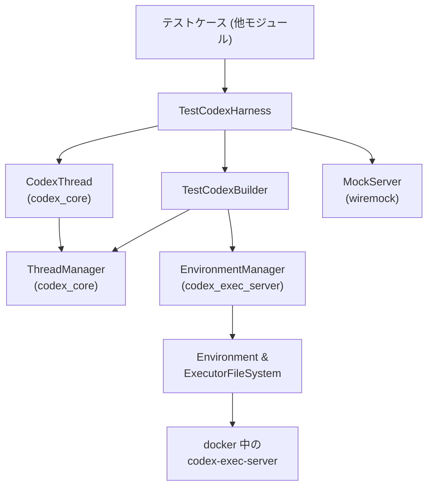
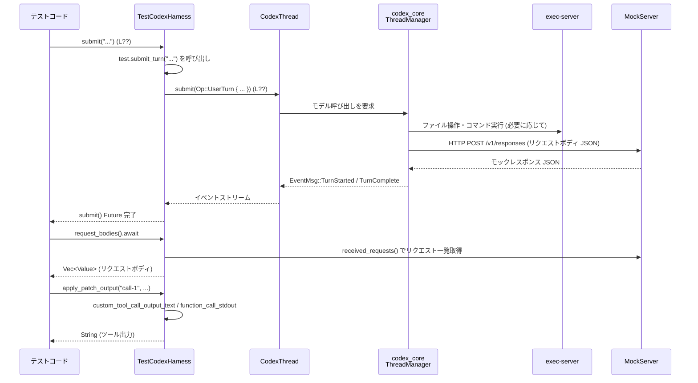

# core/tests/common/test_codex.rs コード解説

> 行番号について  
> このチャンクには行番号情報が含まれていないため、以降の根拠表記は  
> `core/tests/common/test_codex.rs:L??-??` のように、`L??` をプレースホルダとして示します。

---

## 0. ざっくり一言

Codex コアと exec-server を組み合わせた **統合テスト用の環境構築・セッションハーネス** を提供するモジュールです。  
ローカル／Docker 上のリモート exec-server を起動し、CodexThread との対話やモック HTTP サーバとのやりとりを簡潔に記述できるようにしています。

---

## 1. このモジュールの役割

### 1.1 概要

- このモジュールは **Codex の対話スレッドを使ったテスト** を簡単に書けるようにするために存在し、以下の機能を提供します。
  - ローカルまたは Docker コンテナ内での **exec-server 環境の構築**（`TestEnv`, `test_env`）。
  - Codex の設定やモデル情報を組み立てる **ビルダ（`TestCodexBuilder`）**。
  - 実際の CodexThread とファイルシステムへアクセスする **高レベルハーネス（`TestCodex`, `TestCodexHarness`）**。
  - モックモデルサーバへのリクエストボディから **ツール呼び出し結果を抽出するヘルパー**。

### 1.2 アーキテクチャ内での位置づけ

このファイルは、テストコードと Codex の本体／exec-server／モックサーバの間をつなぐ「テスト用ファサード」として機能します。



- テストコードは通常 `TestCodexHarness` だけを直接使います。
- `TestCodexBuilder` が `Config` と `ThreadManager` を組み立て、`TestCodex` を返します。
- `TestEnv` と `EnvironmentManager` が exec-server（ローカル or Docker 内）との接続を提供します。
- `MockServer` はモデル API（`/v1/responses` など）を模倣し、そのリクエスト内容を本モジュールのヘルパーで検査します。

### 1.3 設計上のポイント

- **責務の分割**
  - 環境構築（exec-server 起動・Docker 制御）は `TestEnv` と関連の自由関数に集約。
  - Codex 用設定や ThreadManager の構築は `TestCodexBuilder` が担当。
  - 実際のテストで使う API は `TestCodex` / `TestCodexHarness` に集約。
- **状態管理**
  - `Arc` と `TempDir` により、一時ディレクトリや exec-server 環境を所有権付きで管理し、Drop による自動クリーンアップを利用しています（`RemoteExecServerProcess` の `Drop` 実装）。
  - `AtomicU64` により、複数のリモート exec-server インスタンスに一意な ID を付与しています。
- **エラーハンドリング**
  - 実運用コードに近い部分は `anyhow::Result`／`?` 演算子でエラーを伝播。
  - テストで「起きてはならない状況」（ツール出力が見つからない等）は積極的に `panic!` します。
- **並行性**
  - メインの操作は `async fn` と Future を通じて非同期に行われます。
  - `AtomicU64` 以外に低レベルなスレッド同期はなく、共有状態は `Arc` 経由で安全に共有されています。
  - 一部、Docker ログ待機に `std::thread::sleep` を用いた同期的ポーリングがありますが、テスト用途に限定されています。

---

## 2. 主要な機能一覧（コンポーネントインベントリー）

### 2.1 型・コンポーネント一覧

| 名前 | 種別 | 公開性 | 役割 / 用途 | 根拠 |
|------|------|--------|-------------|------|
| `ConfigMutator` | 型エイリアス (`dyn FnOnce(&mut Config) + Send`) | 非公開 | `Config` をテスト用にカスタマイズするクロージャの型 | `test_codex.rs:L??-??` |
| `PreBuildHook` | 型エイリアス | 非公開 | ビルド前にホームディレクトリに対して処理を行うフック | 同上 |
| `WorkspaceSetup` | 型エイリアス | 非公開 | `cwd` と exec ファイルシステムに対する非同期セットアップ処理 | 同上 |
| `ApplyPatchModelOutput` | enum | 公開 | `apply_patch` ツール出力の形態（Freeform / Function / Shell 等）を表現 | 同上 |
| `ShellModelOutput` | enum | 公開 | シェル関連ツールの出力形態（Shell / ShellCommand / LocalShell）を表現 | 同上 |
| `RemoteExecServerProcess` | struct | 非公開 | Docker コンテナ内で動作する exec-server プロセスの情報とクリーンアップロジック | 同上 |
| `RemoteExecServerStart` | struct | 非公開 | 起動したリモート exec-server プロセスと、その `listen_url` の組 | 同上 |
| `TestEnv` | struct | 非公開 | exec-server 環境（ローカル or リモート）、CWD、一時ディレクトリの束ね | 同上 |
| `TestCodexBuilder` | struct | 公開 | `Config` と `ThreadManager`、環境を組み立てて `TestCodex` を生成するビルダ | 同上 |
| `TestCodex` | struct | 公開 | 実際の `CodexThread` と関連情報（`Config`, `ThreadManager`, CWD）を保持するハンドル | 同上 |
| `TestCodexHarness` | struct | 公開 | モックサーバと `TestCodex` をまとめ、ファイル操作やターン送信を簡略化する高レベル API | 同上 |

### 2.2 関数・メソッド一覧（概要）

> 行番号はすべて `L??` プレースホルダで表します。

#### exec-server / Docker 関連

| 名前 | 種別 | 説明 | 根拠 |
|------|------|------|------|
| `RemoteExecServerProcess::drop` | `Drop` 実装 | Docker コンテナ内の exec-server を `kill` し、ログ・バイナリ・作業ディレクトリを削除 | `L??-??` |
| `RemoteExecServerProcess::register_cleanup_path` | メソッド | コンテナ内で削除すべきパスを登録 | 同上 |
| `start_remote_exec_server` | 関数 | コンテナ内に `codex-exec-server` バイナリをコピー・起動し、PID と listen URL を取得 | 同上 |
| `wait_for_remote_listen_url` | 関数 | コンテナ内ログファイルをポーリングし、`ws://` で始まる listen URL を待機 | 同上 |
| `remote_exec_server_instance_id` | 関数 | プロセス ID + `AtomicU64` カウンタで一意なインスタンス ID を生成 | 同上 |
| `remote_container_ip` | 関数 | `docker inspect` からコンテナの IP アドレスを取得 | 同上 |
| `rewrite_websocket_host` | 関数 | `ws://IP:PORT` 形式の URL の IP 部分だけを差し替え | 同上 |
| `docker_command_success` | 関数 | `docker ...` コマンドを実行し、成功かを検証（失敗時 `Err`） | 同上 |
| `docker_command_capture_stdout` | 関数 | `docker` コマンドを実行し、stdout を UTF-8 文字列として返却 | 同上 |

#### 環境構築 / Config 関連

| 名前 | 種別 | 説明 | 根拠 |
|------|------|------|------|
| `TestEnv::local` | async メソッド | ローカル exec-server 環境と一時 CWD を作成 | `L??-??` |
| `TestEnv::cwd` | メソッド | exec-server 用の CWD を返す | 同上 |
| `TestEnv::environment` | メソッド | `codex_exec_server::Environment` への参照を返す | 同上 |
| `TestEnv::exec_server_url` | メソッド | exec-server の WebSocket URL（存在すれば）を返す | 同上 |
| `TestEnv::local_cwd_temp_dir` | メソッド | ローカル CWD の `TempDir` を返す（remote 環境時は `None`） | 同上 |
| `remote_aware_cwd_path` | 関数 | リモート exec-server 用のユニークな CWD パス(`/tmp/codex-core-test-cwd-...`)を生成 | 同上 |
| `test_env` | async 関数 | `get_remote_test_env()` に応じてローカル／リモート環境を切り替えて `TestEnv` を生成 | 同上 |
| `ensure_test_model_catalog` | 関数 | 特定のテスト用モデルを要求された場合に、`Config.model_catalog` をテスト用情報で埋める | 同上 |
| `TestCodexBuilder::with_config` 他各種 `with_...` | メソッド群 | `Config` やホームディレクトリ、ユーザーシェルを段階的に上書きするビルダ API | 同上 |
| `TestCodexBuilder::build*` 群 | async メソッド群 | MockServer / SSE / WebSocket サーバに対応した `TestCodex` インスタンスの構築 | 同上 |
| `TestCodexBuilder::build_with_home_and_base_url` | async メソッド | `Config` 準備・ワークスペースセットアップ・`TestCodex` 構築の中核 | 同上 |
| `TestCodexBuilder::build_from_config` | async メソッド | 渡された `Config` から `ThreadManager` と `CodexThread` を構築 | 同上 |
| `TestCodexBuilder::prepare_config` | async メソッド | `Config` にモデルプロバイダ情報・バイナリパス・Feature フラグ・mutator 適用を行う | 同上 |

#### Codex セッション / ハーネス関連

| 名前 | 種別 | 説明 | 根拠 |
|------|------|------|------|
| `TestCodex::cwd_path` | メソッド | ワークスペースのローカルパス（`TempDir` 内）を返却 | `L??-??` |
| `TestCodex::codex_home_path` | メソッド | `config.codex_home` のパスを返却 | 同上 |
| `TestCodex::workspace_path` | メソッド | CWD 配下の相対パスから絶対パスを生成 | 同上 |
| `TestCodex::executor_environment` | メソッド | 内部の `TestEnv` への参照を返却 | 同上 |
| `TestCodex::fs` | メソッド | `Arc<dyn ExecutorFileSystem>` を返し、 exec-server 経由の FS 操作を可能にする | 同上 |
| `TestCodex::submit_turn*` 一連 | async メソッド | `Op::UserTurn` を送信し、ターン完了まで待機するための高レベル API | 同上 |
| `TestCodex::submit_turn_with_context` | async メソッド | 承認ポリシー・サンドボックスポリシー・サービスティアを指定可能な低レベル実装 | 同上 |
| `TestCodexHarness::new` 他 `with_...` | async 関数/メソッド | デフォルトまたはカスタム `Config`／ビルダから `TestCodexHarness` を構築 | 同上 |
| `TestCodexHarness::server` | メソッド | 内部の `MockServer` 参照を取得 | 同上 |
| `TestCodexHarness::test` | メソッド | 内部の `TestCodex` 参照を取得 | 同上 |
| `TestCodexHarness::cwd` / `path` / `path_abs` | メソッド | テスト用ワークスペース内のパス操作を行う | 同上 |
| `TestCodexHarness::write_file` | async メソッド | exec-server FS 上にファイルを書き込む（親ディレクトリを必要なら作成） | 同上 |
| `TestCodexHarness::read_file_text` | async メソッド | exec-server FS 上のファイルを UTF-8 テキストとして読む | 同上 |
| `TestCodexHarness::create_dir_all` | async メソッド | ディレクトリを再帰的に作成 | 同上 |
| `TestCodexHarness::path_exists` / `abs_path_exists` | async メソッド | 指定パスが存在するかどうかを判定 | 同上 |
| `TestCodexHarness::remove_abs_path` | async メソッド | ファイル／ディレクトリを `force` オプション付きで削除 | 同上 |
| `TestCodexHarness::submit*` | async メソッド | プロンプトを送信し、ターン完了まで待つラッパ | 同上 |
| `TestCodexHarness::request_bodies` | async メソッド | モックサーバに送られた `/responses` リクエストのボディ一覧を取得 | 同上 |
| `TestCodexHarness::function_call_output_value` | async メソッド | 特定 `call_id` の function_call_output アイテムを抽出 | 同上 |
| `TestCodexHarness::function_call_stdout` | async メソッド | 上記アイテムの `"output"` フィールドを文字列として取得 | 同上 |
| `TestCodexHarness::custom_tool_call_output` | async メソッド | custom_tool_call_output アイテムからテキスト出力を取得 | 同上 |
| `TestCodexHarness::apply_patch_output` | async メソッド | `ApplyPatchModelOutput` に応じて apply_patch 呼び出しの出力文字列を取得 | 同上 |

#### モックレスポンス解析／ビルダ補助

| 名前 | 種別 | 説明 | 根拠 |
|------|------|------|------|
| `custom_tool_call_output` | 関数 | bodies から `"type": "custom_tool_call_output"` かつ `call_id` 一致の項目を検索 | `L??-??` |
| `custom_tool_call_output_text` | 関数 | 上記アイテムの `"output"` をテキスト化（欠如時は `panic!`） | 同上 |
| `function_call_output` | 関数 | `"type": "function_call_output"` かつ `call_id` 一致の項目を検索 | 同上 |
| `test_codex` | 関数 | デフォルトの `TestCodexBuilder` を生成 | 同上 |

#### テスト関数

| 名前 | 種別 | 説明 | 根拠 |
|------|------|------|------|
| `tests::custom_tool_call_output_text_returns_output_text` | 単体テスト | 正常な `"output"` フィールドから文字列を取り出せることを検証 | `L??-??` |
| `tests::custom_tool_call_output_text_panics_when_output_is_missing` | 単体テスト | `"output"` 欠如時に期待どおり `panic!` することを検証 | 同上 |

---

## 3. 公開 API と詳細解説

### 3.1 型一覧（公開）

| 名前 | 種別 | 役割 / 用途 | 備考 |
|------|------|-------------|------|
| `ApplyPatchModelOutput` | enum | apply_patch のモデル出力フォーマット（Freeform / Function / Shell / ここでの各種 Heredoc 形式）を表現 | `TestCodexHarness::apply_patch_output` で使用 |
| `ShellModelOutput` | enum | シェル関連のモデル出力形態（`Shell`, `ShellCommand`, `LocalShell`）を表現 | 将来のテストで利用予定とコメント有 |
| `TestCodexBuilder` | struct | `Config`・ホームディレクトリ・モデル・シェルなどを段階的に組み立てるビルダ | `test_codex()` から生成 |
| `TestCodex` | struct | 1 セッション分の CodexThread と関連設定をまとめたハンドル | ターン送信 API を提供 |
| `TestCodexHarness` | struct | `MockServer` と `TestCodex`、ファイル操作・レスポンス検査ユーティリティを提供する高レベルハーネス | テストコードが主に触る型 |
| `test_codex` | 関数 | デフォルト設定を持つ `TestCodexBuilder` を返すユーティリティ関数 | `auth` はダミー API キー |

---

### 3.2 重要関数・メソッド詳細（テンプレート適用）

#### `test_env() -> Result<TestEnv>`

**概要**

- テスト用 exec-server 環境を構築し、`TestEnv` を返します。
- `get_remote_test_env()` の結果に応じて **ローカル exec-server** か **Docker 内リモート exec-server** を自動選択します（`L??-??`）。

**引数**

- なし。

**戻り値**

- `Result<TestEnv>`:  
  - `Ok(TestEnv)` … 構築された環境。  
  - `Err(anyhow::Error)` … Docker コマンド失敗や exec-server 起動失敗など。

**内部処理の流れ**

1. `get_remote_test_env()` を呼び出し、設定の有無を確認（`L??`）。
2. `Some(remote_env)` の場合:
   - `start_remote_exec_server(remote_env)` で Docker コンテナ内に exec-server を起動。
   - `remote_container_ip` でコンテナ IP を取得。
   - `rewrite_websocket_host` で exec-server の `listen_url` のホストをコンテナ IP に書き換え。
   - `codex_exec_server::Environment::create(Some(websocket_url))` で環境を構築。
   - `remote_aware_cwd_path()` でリモート用 CWD を決定し、リモート FS 上にディレクトリ作成。
   - `RemoteExecServerProcess::register_cleanup_path` に CWD を登録して後始末対象に追加。
3. `None` の場合:
   - `TestEnv::local().await` を呼び出し、ローカル exec-server 環境を構築。
4. 構築した `TestEnv` を返す。

**Examples（使用例）**

```rust
// ローカル or リモート設定に応じて TestEnv を取得する
let env = test_env().await?;

// exec-server の URL を取得（リモートの場合のみ Some）
if let Some(url) = env.exec_server_url() {
    println!("exec-server ws url = {url}");
}
```

**Errors / Panics**

- Docker がインストールされていない、コンテナが存在しない、exec-server バイナリコピーに失敗などの場合、`Err(anyhow::Error)` を返します。
- `remote_container_ip` 内でコンテナの IP アドレスが空文字列だった場合は `Err` を返します（`L??`）。
- `start_remote_exec_server` 内の `bundled_models_response().unwrap_or_else(panic!)` のような `panic!` はありませんが、Docker コマンド失敗時は `anyhow::Error` です。

**Edge cases（エッジケース）**

- リモート設定が存在しない:
  - 自動的にローカル exec-server (`Environment::create(None)`) を使うため、特別なエラーにはなりません。
- リモート exec-server が起動しない:
  - `wait_for_remote_listen_url` がタイムアウトし `Err` になります（最大 5 秒待機）。

**使用上の注意点**

- この関数は `async` であり、Tokio などの非同期ランタイムから `await` して呼び出す前提です。
- テスト全体で複数回呼び出した場合、それぞれ独立した exec-server インスタンス（および CWD）が作られます。

---

#### `TestCodexBuilder::build_with_home_and_base_url(...) -> Result<TestCodex>`

**概要**

- モデル API の base URL、ホームディレクトリ、`TestEnv` を受け取り、`Config` を構築・調整した上で `TestCodex` を生成する中核メソッドです（`L??-??`）。

**引数**

| 引数名 | 型 | 説明 |
|--------|----|------|
| `base_url` | `String` | モックモデルサーバのベース URL（例: `http://127.0.0.1:1234/v1`） |
| `home` | `Arc<TempDir>` | Codex のホームディレクトリとして使う一時ディレクトリ |
| `resume_from` | `Option<PathBuf>` | 既存ロールアウトファイルからスレッドを再開する場合のパス |
| `test_env` | `TestEnv` | exec-server 環境（ローカル／リモート） |

**戻り値**

- `Result<TestCodex>`: 初期化された `TestCodex` インスタンス。

**内部処理の流れ**

1. `prepare_config(base_url, &home, test_env.cwd().clone()).await` を呼び出し、`Config` とフォールバック CWD (`TempDir`) を取得。
2. `EnvironmentManager` を `test_env.exec_server_url()` を元に生成。
3. `test_env.environment().get_filesystem()` から `Arc<dyn ExecutorFileSystem>` を取得。
4. `self.workspace_setups` をローカルベクタに `swap` で取り出し、各セットアップクロージャを `(config.cwd.clone(), file_system.clone())` で順に実行。
5. 実際の CWD として:
   - リモート環境でローカル CWD が無い場合は `fallback_cwd` を使用。
   - ローカル環境では `test_env.local_cwd_temp_dir()` を優先。
6. `build_from_config(config, cwd, home, resume_from, test_env, environment_manager).await` を呼び出し、`TestCodex` を構築して返す。

**Examples**

```rust
let server = start_mock_server().await;
let test_env = TestEnv::local().await?;
let mut builder = test_codex();
let home = Arc::new(TempDir::new()?);

let test = builder
    .build_with_home_and_base_url(
        format!("{}/v1", server.uri()),
        home,
        None,
        test_env,
    )
    .await?;
```

**Errors / Panics**

- `prepare_config` 内での設定ロード・一時ディレクトリ作成・バイナリ検出に失敗すると `Err` が返ります。
- 各 `workspace_setup` が `Err` を返した場合、その時点でエラーとして伝播されます。
- `build_from_config` 内での `ThreadManager` 構築やスレッド開始に失敗すると `Err` になります。

**Edge cases**

- `workspace_setups` が空の場合は、ワークスペースの追加セットアップは行われません。
- `resume_from` が `Some` の場合、`build_from_config` 内で `resume_thread_from_rollout` が使用され、ファイルが存在しない等で `Err` になる可能性があります。

**使用上の注意点**

- `self` 内部の `workspace_setups` は `swap` によって消費されるため、ビルダを再利用して別の `TestCodex` を作る場合、同じセットアップは再度登録する必要があります（`config_mutators` も同様の設計です）。
- `test_env` は所有権で受け取り、そのまま `TestCodex` に移されるため、呼び出し元で再利用することはできません。

---

#### `TestCodexBuilder::prepare_config(...) -> Result<(Config, Arc<TempDir>)>`

**概要**

- テスト用 `Config` を準備し、モデルプロバイダ情報、`codex_self_exe`、Feature フラグ、model catalog などを設定します（`L??-??`）。

**引数**

| 引数名 | 型 | 説明 |
|--------|----|------|
| `base_url` | `String` | モデルプロバイダのベース URL |
| `home` | `&TempDir` | Codex のホームディレクトリ |
| `cwd_override` | `AbsolutePathBuf` | `config.cwd` に設定するテスト用 CWD |

**戻り値**

- `Result<(Config, Arc<TempDir>)>`:  
  - `Config` … 各種 mutator・Feature 設定済みのコンフィグ。  
  - `Arc<TempDir>` … 新しく生成したフォールバック CWD。

**内部処理の流れ**

1. `ModelProviderInfo` を `built_in_model_providers()["openai"]` をベースに作成し、`base_url` と `supports_websockets:false` をセット。
2. `cwd = Arc::new(TempDir::new()?)` を作成（フォールバック用）。
3. `load_default_config_for_test(home).await` でベースとなる設定を読み込み。
4. `config.cwd = cwd_override; config.model_provider = model_provider;` を設定。
5. `pre_build_hooks` をドレインし、それぞれ `hook(home.path())` を実行。
6. `codex_utils_cargo_bin::cargo_bin("codex")` もしくは `"codex-exec"`、さらに `std::env::current_exe()` から `codex_self_exe` を探索し、見つかったパスを `config.codex_self_exe` に設定。
7. `config_mutators` を `swap` で取り出し、各 mutator を `mutator(&mut config)` で適用。
8. `ensure_test_model_catalog(&mut config)?` を呼び出し、必要なら model catalog を埋める。
9. `config.include_apply_patch_tool` に応じて `Feature::ApplyPatchFreeform` を enable / disable。
10. `(config, cwd)` を返却。

**Examples**

```rust
let home = TempDir::new()?;
let cwd_override = AbsolutePathBuf::from("/tmp/test-cwd").abs();

let (mut config, fallback_cwd) = builder
    .prepare_config("http://localhost:1234/v1".to_string(), &home, cwd_override)
    .await?;
assert_eq!(config.cwd, cwd_override);
```

**Errors / Panics**

- 一時ディレクトリ作成、設定ファイル読み込みに失敗すると `Err` になります。
- `ensure_test_model_catalog` 内で bundled models のパースに失敗した場合は `panic!` します（テストバンドル前提のため）。
- `codex_utils_cargo_bin::cargo_bin` の失敗自体は `Err` を握りつぶしており、代替経路にフォールバックします。

**Edge cases**

- `include_apply_patch_tool` が `false` の場合は `Feature::ApplyPatchFreeform` が明示的に disable されます。
- `model` が `TEST_MODEL_WITH_EXPERIMENTAL_TOOLS` でない場合、またはすでに `model_catalog` が設定されている場合、`ensure_test_model_catalog` は何も変更しません。

**使用上の注意点**

- `config_mutators` と `pre_build_hooks` は「一度きり」であり、`prepare_config` 呼び出し時に消費されます。
- `codex_self_exe` が見つからない場合でもエラーにはならず、`None` のままとなります。その場合、一部ツール関連テストが制限される可能性があります。

---

#### `TestCodexBuilder::build_from_config(...) -> Result<TestCodex>`

**概要**

- 既に構築済みの `Config` と環境から、`ThreadManager`／`CodexThread`／`TestCodex` を組み立てます（`L??-??`）。

**引数（要約）**

| 引数名 | 型 | 説明 |
|--------|----|------|
| `config` | `Config` | 準備済みコンフィグ（所有権あり） |
| `cwd` | `Arc<TempDir>` | ワークスペースのローカルディレクトリ |
| `home` | `Arc<TempDir>` | Codex HOME |
| `resume_from` | `Option<PathBuf>` | ロールアウトから再開するファイルパス |
| `test_env` | `TestEnv` | exec-server 環境 |
| `environment_manager` | `Arc<EnvironmentManager>` | exec-server 環境マネージャ |

**戻り値**

- `Result<TestCodex>`: 初期化済み `TestCodex`。

**内部処理の流れ**

1. `auth = self.auth.clone()` を取得。
2. `config.model_catalog.is_some()` かどうかで分岐:
   - `Some` の場合、`ThreadManager::new(...)` を直接呼び出し。
   - `None` の場合、`codex_core::test_support::thread_manager_with_models_provider_and_home(...)` を使用。
3. `thread_manager` を `Arc` で包む。
4. `user_shell_override` の有無と `resume_from` の有無で 4 パターンのマッチ:
   - 再開 + シェル指定 → `resume_thread_from_rollout_with_user_shell_override`。
   - 再開のみ → `thread_manager.resume_thread_from_rollout`。
   - 新規 + シェル指定 → `start_thread_with_user_shell_override`。
   - 新規のみ → `thread_manager.start_thread(config.clone())`。
5. それぞれの Future を `Box::pin(...).await?` で実行し、`new_conversation` を取得。
6. `TestCodex` を構築して返却。

**Examples**

```rust
let environment_manager = Arc::new(codex_exec_server::EnvironmentManager::new(None));
let test = builder
    .build_from_config(config, cwd, home, None, test_env, environment_manager)
    .await?;
println!("Model: {}", test.session_configured.model);
```

**Errors / Panics**

- `ThreadManager` の構築やスレッド開始／再開に失敗すると `Err` が返ります。
- `resume_from` が不正なパスの場合なども `Err` になります。

**Edge cases**

- `model_catalog` の有無により `ThreadManager` の構築経路が変わるため、テストが期待するモデル設定と整合している必要があります。
- `user_shell_override` を指定した場合、Codex の内部シェル選択ロジックは上書きされます。

**使用上の注意点**

- `config` は clone されて `ThreadManager` やスレッド開始 API に渡されますが、`TestCodex` にも所有されます。
- 再開パスとシェルオーバーライドの組み合わせを間違えると、テストの前提と異なるシェルでセッションが動作する可能性があります。

---

#### `TestCodex::submit_turn_with_context(...) -> Result<()>`

**概要**

- 1 回のユーザーターンを Codex に送信し、そのターン完了イベントを待つ低レベルメソッドです（`L??-??`）。
- 承認ポリシー、サンドボックスポリシー、サービスティアを細かく指定できます。

**引数**

| 引数名 | 型 | 説明 |
|--------|----|------|
| `prompt` | `&str` | ユーザーからのテキスト入力 |
| `approval_policy` | `AskForApproval` | モデルによる変更をどの程度ユーザー承認にかけるか |
| `sandbox_policy` | `SandboxPolicy` | exec-server のサンドボックスポリシー |
| `service_tier` | `Option<Option<ServiceTier>>` | サービスティア指定（`Some(Some)` / `Some(None)` / `None` の 3 状態） |

**戻り値**

- `Result<()>`: 成功時は `Ok(())`。送信やイベント待ちで問題があれば `Err(anyhow::Error)`。

**内部処理の流れ**

1. `session_model = self.session_configured.model.clone()` を取得し、ターン送信時のモデルとして使用。
2. `self.codex.submit(Op::UserTurn { ... })` を `await`:
   - `items` に `UserInput::Text { text: prompt.into(), text_elements: Vec::new() }` を設定。
   - `cwd` に `self.config.cwd.to_path_buf()` を設定。
   - その他、`approval_policy`, `sandbox_policy`, `service_tier` 等を指定。
3. `wait_for_event_match(&self.codex, ...)` で `EventMsg::TurnStarted` を待ち、`turn_id` を取得。
4. `wait_for_event(&self.codex, ...)` で `EventMsg::TurnComplete` を待ち、先ほどの `turn_id` と一致するイベントを待機。
5. 完了したら `Ok(())` を返却。

**Examples**

```rust
// Sandbox をフルアクセス、承認なしで 1 ターン送信
test_codex
    .submit_turn_with_context(
        "say hello",
        AskForApproval::Never,
        SandboxPolicy::DangerFullAccess,
        None,
    )
    .await?;
```

**Errors / Panics**

- `CodexThread::submit` がエラーを返した場合（通信エラー等）、`Err` として伝播します。
- `wait_for_event_match`／`wait_for_event` は `Result` ではなく、イベントが見つかるまで待機する前提のため、該当イベントが来ない場合はテスト自体がハングする可能性があります（タイムアウトはこのファイル内にはありません）。

**Edge cases**

- `service_tier` を `None` にした場合、セッションデフォルトのサービスティアが使用されます。
- プロンプトが空文字列でも特別な扱いはなく、通常どおりターンが送信されます（上位の Codex 実装側の挙動に依存）。

**使用上の注意点**

- この関数はターン完了までブロックするため、長いモデル推論を行うテストでは時間がかかります。
- 別のターンを送る前に、この Future の完了を待つことが前提です（同じスレッドに対する並列送信は想定されていません）。

---

#### `TestCodexHarness::write_file(&self, rel, contents) -> Result<()>`

**概要**

- exec-server のファイルシステムに対して、テスト用ファイルを作成するユーティリティです（`L??-??`）。

**引数**

| 引数名 | 型 | 説明 |
|--------|----|------|
| `rel` | `impl AsRef<Path>` | ワークスペース CWD からの相対パス |
| `contents` | `impl AsRef<[u8]>` | 書き込むバイト列 |

**戻り値**

- `Result<()>`: 成功時 `Ok(())`、FS 操作に失敗した場合 `Err`。

**内部処理の流れ**

1. `abs_path = self.path_abs(rel)` で絶対パス（`AbsolutePathBuf`）に変換。
2. `abs_path.parent()` があれば `ExecutorFileSystem::create_directory` を `recursive: true` で実行。
3. `ExecutorFileSystem::write_file(&abs_path, contents.as_ref().to_vec())` を実行。
4. `Ok(())` を返却。

**Examples**

```rust
harness.write_file("src/main.rs", b"fn main() {}\n").await?;
assert!(harness.path_exists("src/main.rs").await?);
```

**Errors / Panics**

- ディレクトリ作成やファイル書き込みが失敗した場合（パーミッション、パス不正等）、`Err(anyhow::Error)` になります。

**Edge cases**

- 親ディレクトリが存在しない場合でも `recursive: true` のため自動的に作成されます。
- `contents` が空でも、空ファイルが作成されます。

**使用上の注意点**

- ファイルサイズが大きい場合、`contents.to_vec()` によるメモリコピーが発生します。テストでは通常問題になりませんが、巨大ファイルを扱う場合は注意が必要です。

---

#### `custom_tool_call_output_text(bodies: &[Value], call_id: &str) -> String`

**概要**

- モックサーバのリクエストボディ（`serde_json::Value` の配列）から、指定 `call_id` に対応する `custom_tool_call_output` アイテムを探し、その `"output"` フィールドをテキスト化して返します（`L??-??`）。
- テスト用のヘルパーであり、見つからない場合やフォーマット不正の場合は `panic!` します。

**引数**

| 引数名 | 型 | 説明 |
|--------|----|------|
| `bodies` | `&[Value]` | モックサーバに送信されたリクエストボディ群 |
| `call_id` | `&str` | 抽出対象のツール呼び出し ID |

**戻り値**

- `String`: 対応する `"output"` のテキスト表現。

**内部処理の流れ**

1. `custom_tool_call_output(bodies, call_id)` を呼び出し、対象アイテムへの参照を取得。
2. `.get("output")` で `"output"` フィールドを取得し、`unwrap_or_else(panic!(...))` で欠如時は `panic!`。
3. `output_value_to_text(output)` を呼び出し、テキスト化された `Option<String>` を取得。
4. `unwrap_or_else(panic!(...))` で `None` の場合は `panic!`。
5. 得られた `String` を返す。

**Examples**

```rust
let bodies = harness.request_bodies().await;
let output = custom_tool_call_output_text(&bodies, "call-1");
assert!(output.contains("expected text"));
```

**Errors / Panics**

- `bodies` 内に `custom_tool_call_output` かつ `call_id` 一致のアイテムが存在しない場合、`custom_tool_call_output` が `panic!("custom_tool_call_output {call_id} not found")` します。
- `"output"` フィールドが存在しない場合、`panic!("custom_tool_call_output {call_id} missing output")` します。
- `"output"` がテキスト化できない場合も `panic!("custom_tool_call_output {call_id} missing text output")` します。

**Edge cases**

- `bodies` が空配列の場合は必ず `panic!` します（テストの前提が崩れているとみなす設計です）。
- `"output"` が複合的な JSON の場合でも、`output_value_to_text` の実装に依存してテキスト抽出を試みます（このファイル内では詳細不明）。

**使用上の注意点**

- テストでは「期待したツール呼び出しが必ず存在する」という前提の下で使用するべきです。存在しない可能性があるケースでは、自前で `bodies` を走査するなど、より防御的なコードが必要になります。

---

### 3.3 その他の関数（一覧）

上記で詳細説明しなかったが重要な補助関数をまとめます。

| 関数 / メソッド | 役割（1 行） |
|-----------------|--------------|
| `RemoteExecServerProcess::register_cleanup_path` | リモート exec-server 終了時に削除すべきパスを追加 |
| `TestEnv::exec_server_url` | exec-server の WebSocket URL を `Option<&str>` で返却 |
| `TestCodex::submit_turn` | デフォルトポリシー（承認なし・フルアクセス）で 1 ターン送信 |
| `TestCodex::submit_turn_with_policy` | サンドボックスポリシーのみを指定してターン送信 |
| `TestCodex::submit_turn_with_service_tier` | サービスティアを指定してターン送信 |
| `TestCodex::submit_turn_with_policies` | 承認・サンドボックスポリシーを指定してターン送信 |
| `TestCodexHarness::submit` | `TestCodex::submit_turn` をラップしたショートカット |
| `TestCodexHarness::submit_with_policy` | サンドボックスポリシー付きショートカット |
| `TestCodexHarness::function_call_output_value` | function_call_output アイテムを `Value` として取得 |
| `TestCodexHarness::function_call_stdout` | function_call_output の `"output"` を文字列として取得 |
| `TestCodexHarness::custom_tool_call_output` | custom_tool_call_output の `"output"` 文字列を取得 |
| `TestCodexHarness::apply_patch_output` | `ApplyPatchModelOutput` に応じて stdout または custom tool 出力を返却 |
| `function_call_output` | function_call_output アイテムを `&Value` として返却（見つからない場合は `panic!`） |
| `test_codex` | デフォルトの `TestCodexBuilder` を生成するエントリポイント |

---

## 4. データフロー

ここでは、典型的な「テストからプロンプトを投げ、モックサーバ経由でモデルレスポンスを受け取り、ツール出力を検査する」流れを示します。



要点:

- **入力**: テストコードは `TestCodexHarness::submit` などでプロンプトを投げます。
- **処理**: Codex コアが exec-server を通じてファイル操作やコマンドを行い、モデル API（MockServer）へ HTTP リクエストを送ります。
- **出力**: MockServer へのリクエストボディを `request_bodies` 経由で取得し、`custom_tool_call_output_text` 等でツール出力を検査します。

---

## 5. 使い方（How to Use）

### 5.1 基本的な使用方法

典型的なテストの流れは次の通りです。

1. `TestCodexHarness` を構築する。
2. 必要なファイルを `write_file` などでワークスペースに配置する。
3. `submit` でプロンプトを投げる。
4. `request_bodies` や各種ヘルパーでツール出力を検査する。

```rust
use core::tests::common::test_codex::*;

#[tokio::test]
async fn my_integration_test() -> anyhow::Result<()> {
    // 1. ハーネスを用意
    let harness = TestCodexHarness::new().await?;

    // 2. ワークスペースにファイルを用意
    harness.write_file("src/main.rs", b"fn main() { println!(\"hi\"); }\n").await?;

    // 3. Codex にプロンプトを送信
    harness.submit("build and run the project").await?;

    // 4. モデルへのリクエストを検査
    let bodies = harness.request_bodies().await;
    let output = harness.apply_patch_output("call-1", ApplyPatchModelOutput::Freeform).await;

    assert!(output.contains("git diff"));
    Ok(())
}
```

### 5.2 よくある使用パターン

- **Config のカスタマイズ**

```rust
let harness = TestCodexHarness::with_config(|cfg: &mut Config| {
    cfg.include_apply_patch_tool = true;
    cfg.model = Some("test-gpt-5.1-codex".into());
})
.await?;
```

- **リモート exec-server を利用したテスト**

```rust
let mut builder = test_codex();
let harness = TestCodexHarness::with_remote_aware_builder(builder).await?;
```

- **WebSocket ベースの realtime モデルテスト**

```rust
let server = WebSocketTestServer::new().await;
let mut builder = test_codex();
let test = builder.build_with_websocket_server(&server).await?;
```

### 5.3 よくある間違い

```rust
// 間違い例: TestCodexBuilder を再利用しつつ、mutator を2回適用したい
let mut builder = test_codex().with_model("model-1");
let test1 = builder.build(&server).await?;
// ここで builder.config_mutators は空にされている

builder = builder.with_model("model-2");  // 期待通りに効かない可能性
let test2 = builder.build(&server).await?;

// 正しい例: 各ビルドごとに新しいビルダを作成
let test1 = test_codex().with_model("model-1").build(&server).await?;
let test2 = test_codex().with_model("model-2").build(&server).await?;
```

理由: `prepare_config` 内で `config_mutators`／`workspace_setups` が `swap` で消費されるためです。

### 5.4 使用上の注意点（まとめ）

- **前提条件**
  - Docker を利用するリモートモードでは、`docker` CLI が使用可能であり、対象コンテナが起動している必要があります。
  - 非同期ランタイム（Tokio など）の中から呼び出す必要があります。
- **エラーとパニック**
  - モックサーバへのリクエストボディ解析ヘルパーは、想定したアイテムが存在しない場合に `panic!` します。  
    → 「テスト前提が崩れた」ことを早期に検知するための設計です。
- **並行性**
  - 同じ `TestCodex`/`CodexThread` に対して複数の `submit` を同時に走らせる設計にはなっていません。1 スレッドに対してはシーケンシャルにタスクを実行する前提です。
- **パフォーマンス**
  - Docker exec／inspect やファイルシステム操作を多用するため、テスト実行時間に一定のコストがかかりますが、あくまでテスト用であり大規模スケーリングは想定されていません。

---

## 6. 変更の仕方（How to Modify）

### 6.1 新しい機能を追加する場合

例: 新しいツール出力タイプのテスト支援を追加したい場合。

1. **enum の拡張**
   - `ApplyPatchModelOutput` または `ShellModelOutput` に新しいバリアントを追加します。
2. **ハーネス側の対応**
   - `TestCodexHarness::apply_patch_output` など、該当 enum を使っているメソッドに `match` の分岐を追加します。
3. **レスポンス解析ヘルパー**
   - 必要なら `custom_tool_call_output_*` と同様のヘルパー関数を追加します。
4. **テスト**
   - `#[cfg(test)] mod tests` 内、もしくは他のテストモジュールで新しい動作を検証するテストを書くと、回 regressions が防げます。

### 6.2 既存の機能を変更する場合

- **影響範囲の確認**
  - `TestCodexBuilder` と `TestCodexHarness` のメソッドは多くのテストで使用されるため、変更前に `rg "TestCodexHarness" -n` などで使用箇所を確認する必要があります。
  - `custom_tool_call_output_text` など、`panic!` メッセージを変更すると、`#[should_panic(expected = "...")]` テストが失敗する点に注意します。
- **契約（前提条件・返り値の意味）**
  - `submit_turn_with_context` が「ターン完了まで待つ」ことに依存したテストが多いと考えられます。この性質を変える場合、テスト全体の書き方が変わる可能性があります。
  - `ensure_test_model_catalog` は特定のモデル slug に従って動作しており、`TEST_MODEL_WITH_EXPERIMENTAL_TOOLS` の値を変更すると関連テストが影響を受けます。
- **テスト・使用箇所の再確認**
  - `cargo test -p core --test ...` のように、少なくともこのモジュールを利用するテスト群を実行してから変更を確定することが望ましいです。

---

## 7. 関連ファイル

| パス | 役割 / 関係 |
|------|------------|
| `core/tests/common/mod.rs` など | このファイルを `pub mod test_codex;` として再エクスポートしている可能性があります（このチャンクからは不明） |
| `codex_core::test_support` | `ThreadManager` 構築やスレッド開始／再開のためのテスト用ユーティリティを提供し、本モジュールから呼び出されています |
| `codex_exec_server` クレート | `Environment` や `ExecutorFileSystem` を提供し、ファイル操作・exec-server 接続の基盤となっています |
| `codex_models_manager::bundled_models_response` | `ensure_test_model_catalog` 内でモデルカタログ JSON を読み出すために使用されます |
| `crate::responses` (`WebSocketTestServer`, `output_value_to_text`, `start_mock_server`) | モックサーバ・WebSocket サーバの立ち上げとレスポンスのテキスト化に使用されます |
| `crate::streaming_sse::StreamingSseServer` | SSE ベースのモックサーバを扱うために `build_with_streaming_server` で使用されます |
| `crate::{RemoteEnvConfig, get_remote_test_env}` | リモート exec-server 用 Docker コンテナの設定を取得するために使用されます |

---

### Bugs / Security の観点（補足）

- **シェルコマンド文字列の組み立て**
  - `RemoteExecServerProcess::drop` では、`cleanup_paths` をスペース区切りで結合して `rm -rf {cleanup_paths}` を構築しています（`L??`）。
  - パスに空白やシェルメタ文字が含まれると意図しない挙動を起こす可能性がありますが、テスト用であり、パスは `/tmp/...` の生成文字列のみを使用しているため、実際には安全に設計されています。
- **Docker コマンドの失敗**
  - `docker_command_success`／`docker_command_capture_stdout` は失敗時に `anyhow::Error` を返すだけで、リトライ等は行いません。  
    テスト環境側で Docker が不安定な場合、テストが `Err` で終了します。
- **スレッドブロッキング**
  - `wait_for_remote_listen_url` は `std::thread::sleep` によるポーリングを行っており、Tokio ランタイムのワーカースレッドをブロックする可能性があります。ただしテスト用途かつ最大 5 秒タイムアウトであり、受容可能とされています。

この解説は、提供されたコード範囲から読み取れる事実に基づいています。コード外の仕様や意図については推測していません。
