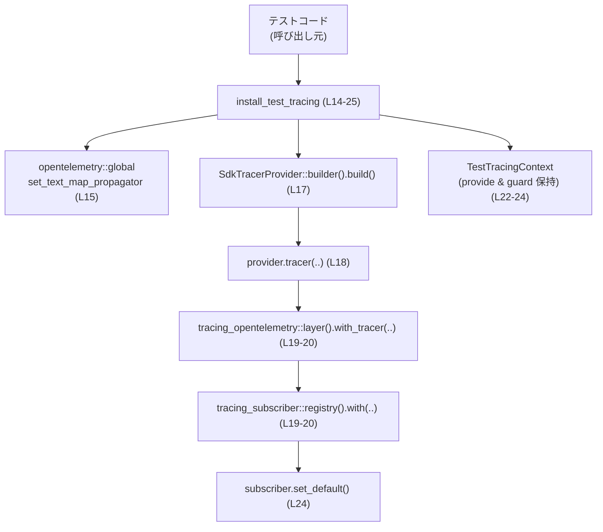
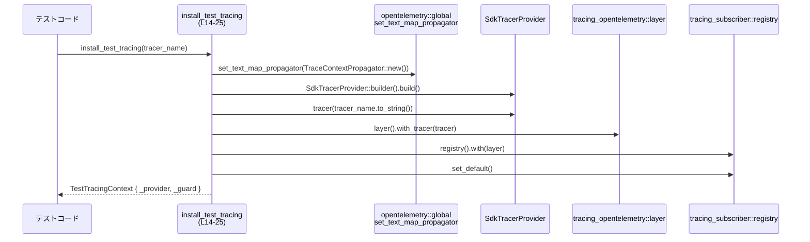

# core/tests/common/tracing.rs コード解説

## 0. ざっくり一言

- テスト実行時に OpenTelemetry と tracing を接続したトレーシング環境を一時的に構築し、そのライフタイムを RAII（Drop 時に自動後片付け）で管理するためのヘルパーモジュールです（`TestTracingContext`, `install_test_tracing`）。  
  根拠: `TestTracingContext` 定義とフィールド（`_provider`, `_guard`）および `install_test_tracing` の処理内容（`set_text_map_propagator`, `SdkTracerProvider::builder`, `subscriber.set_default`）  
  （`core/tests/common/tracing.rs:L9-25`）

---

## 1. このモジュールの役割

### 1.1 概要

- このモジュールは、テストコードから簡単にトレーシング（分散トレーシング）を有効化するための初期化処理を 1 関数にまとめ、コンテキスト構造体でそのスコープを管理する役割を持ちます。  
  根拠: 公開構造体 `TestTracingContext` と公開関数 `install_test_tracing` の存在（`core/tests/common/tracing.rs:L9-12, L14-25`）

- OpenTelemetry のトレーサプロバイダ（`SdkTracerProvider`）と tracing のディスパッチャ（`DefaultGuard`）を内部に保持し、スコープ内で tracing と OpenTelemetry を連携させるようになっています。  
  根拠: フィールド型 `SdkTracerProvider`, `DefaultGuard`（`core/tests/common/tracing.rs:L10-11`）、`tracing_opentelemetry::layer().with_tracer(tracer)` の利用（`core/tests/common/tracing.rs:L19-20`）

### 1.2 アーキテクチャ内での位置づけ

- 依存関係の概要:

  - OpenTelemetry のグローバル設定を行う: `opentelemetry::global::set_text_map_propagator`（`core/tests/common/tracing.rs:L1, L15`）
  - OpenTelemetry SDK のトレーサプロバイダを生成: `SdkTracerProvider::builder().build()`（`core/tests/common/tracing.rs:L4, L17`）
  - 生成したトレーサを tracing のサブスクライバに接続: `tracing_subscriber::registry().with(tracing_opentelemetry::layer().with_tracer(tracer))`（`core/tests/common/tracing.rs:L6-7, L19-20`）
  - サブスクライバを「デフォルト」として有効化し、そのガードを保持: `subscriber.set_default()`（`core/tests/common/tracing.rs:L20, L24`）

- このモジュール自体は、テストコードから呼び出される「初期化ユーティリティ」という位置づけと解釈できます（パス `core/tests/common/` と関数名 `install_test_tracing` からの推測であり、このファイルからは明示されていません）。

Mermaid で主要コンポーネントの関係を図示します（`install_test_tracing (L14-25)` の内部フロー）。



### 1.3 設計上のポイント

- **RAII によるスコープ管理**  
  - `TestTracingContext` が `SdkTracerProvider` と `DefaultGuard` を所有することで、値がスコープから外れたときに自動的に後片付けが行われる設計になっています。  
    根拠: フィールドが所有権を持つ構造体のメンバとして定義されている（`core/tests/common/tracing.rs:L9-11`）

- **グローバル状態の初期化**  
  - OpenTelemetry のテキストマッププロパゲータをグローバルに設定する処理を含みます。これはプロセス全体に影響する設定です。  
    根拠: `global::set_text_map_propagator(TraceContextPropagator::new())`（`core/tests/common/tracing.rs:L1, L3, L15`）

- **シンプルな API**  
  - 呼び出し側は `install_test_tracing(tracer_name)` を一度呼んで戻り値を保持するだけで、内部の詳細を意識せずにトレーシング環境を構築できます。  
    根拠: `install_test_tracing` のシグネチャと処理（`core/tests/common/tracing.rs:L14-25`）

- **エラー処理を行わない設計**  
  - 関数は `Result` などを返さず、内部の処理はすべて「成功する前提」で書かれています。外部ライブラリ呼び出しも含め、明示的なエラー分岐は存在しません。  
    根拠: 関数本体に `match` や `?` などのエラー制御がない（`core/tests/common/tracing.rs:L14-25`）

---

## 2. 主要な機能一覧

- `TestTracingContext` の生成と保持: トレーサプロバイダと tracing ディスパッチャガードを保持し、スコープによるライフタイム管理を行う。
- テスト用トレーシング初期化: `install_test_tracing` で OpenTelemetry プロパゲータ・トレーサ・tracing のサブスクライバをセットアップし、デフォルトサブスクライバとして有効化する。

---

## 3. 公開 API と詳細解説

### 3.1 型一覧（構造体・列挙体など）

| 名前 | 種別 | 公開性 | 役割 / 用途 | 主なフィールド | 定義位置 |
|------|------|--------|-------------|----------------|----------|
| `TestTracingContext` | 構造体 | `pub` | テスト時のトレーシング環境を保持するためのコンテキスト。所有している間、トレーサプロバイダと tracing ディスパッチャガードが生存する。 | `_provider: SdkTracerProvider`, `_guard: DefaultGuard` | `core/tests/common/tracing.rs:L9-12` |

#### フィールド詳細

| フィールド名 | 型 | 説明 | 定義位置 |
|-------------|----|------|----------|
| `_provider` | `SdkTracerProvider` | OpenTelemetry SDK のトレーサプロバイダ。テスト中に生成したトレーサのライフタイムを管理するために保持していると考えられます（型名からの推測）。 | `core/tests/common/tracing.rs:L10` |
| `_guard` | `DefaultGuard` | tracing のディスパッチャ設定をスコープで管理するガード。`subscriber.set_default()` から返される値を保持します。 | `core/tests/common/tracing.rs:L11, L24` |

> 備考: フィールド名が `_` から始まっているため、Rust の警告回避のために「未使用でもよいが保持しておく」意図があると推測できます（`core/tests/common/tracing.rs:L10-11`）。

### 3.2 関数詳細

このファイルの公開関数は 1 つです。

#### `install_test_tracing(tracer_name: &str) -> TestTracingContext`

**概要**

- OpenTelemetry のテキストマッププロパゲータ・トレーサプロバイダおよび tracing サブスクライバを初期化し、それらを束ねる `TestTracingContext` を返します。  
  根拠: 関数内で `set_text_map_propagator`・`SdkTracerProvider::builder().build()`・`provider.tracer(..)`・`tracing_subscriber::registry().with(tracing_opentelemetry::layer().with_tracer(tracer))` を呼び、最後に `TestTracingContext` を構築している（`core/tests/common/tracing.rs:L15-24`）

**シグネチャ**

```rust
pub fn install_test_tracing(tracer_name: &str) -> TestTracingContext
// core/tests/common/tracing.rs:L14
```

**引数**

| 引数名 | 型 | 説明 | 根拠 |
|--------|----|------|------|
| `tracer_name` | `&str` | 作成するトレーサに付与する名前。`provider.tracer(tracer_name.to_string())` に渡され、`String` に変換されて使用されます。 | `core/tests/common/tracing.rs:L14, L18` |

**戻り値**

- 型: `TestTracingContext`（`core/tests/common/tracing.rs:L14`）
- 意味: 関数内で生成された `SdkTracerProvider` と `DefaultGuard` を内部に保持したコンテキスト。  
  このインスタンスがスコープから外れるまで、少なくともそれら 2 つのオブジェクトのライフタイムが維持されます。  
  根拠: 構造体フィールドに `provider` と `subscriber.set_default()` の戻り値を代入している（`core/tests/common/tracing.rs:L22-24`）

**内部処理の流れ（アルゴリズム）**

1. **テキストマッププロパゲータの設定**  
   - `TraceContextPropagator::new()` でプロパゲータインスタンスを生成し（`core/tests/common/tracing.rs:L3, L15`）、  
     `global::set_text_map_propagator(..)` に渡してグローバル設定を更新します（`core/tests/common/tracing.rs:L1, L15`）。
2. **トレーサプロバイダの生成**  
   - `SdkTracerProvider::builder().build()` を呼び出し、新しいトレーサプロバイダ `provider` を生成します（`core/tests/common/tracing.rs:L4, L17`）。
3. **トレーサの取得**  
   - `provider.tracer(tracer_name.to_string())` により、指定された名前を持つトレーサ `tracer` を取得します（`core/tests/common/tracing.rs:L18`）。
4. **tracing サブスクライバの構築**  
   - `tracing_subscriber::registry()` でベースとなるレジストリを生成し（`core/tests/common/tracing.rs:L19`）、  
     `.with(tracing_opentelemetry::layer().with_tracer(tracer))` で OpenTelemetry 用のレイヤを追加したサブスクライバ `subscriber` を構築します（`core/tests/common/tracing.rs:L19-20`）。
5. **サブスクライバのデフォルト化とガードの取得**  
   - `subscriber.set_default()` を呼び、現在スレッド（およびライブラリ仕様に依存する範囲）でこのサブスクライバをデフォルトとして設定し、そのガードを取得します（`core/tests/common/tracing.rs:L24`）。
6. **コンテキストの返却**  
   - 新しい `TestTracingContext` インスタンスを作成し、`_provider` に `provider` を、`_guard` に `subscriber.set_default()` の戻り値を格納して返します（`core/tests/common/tracing.rs:L22-24`）。

**使用例（想定）**

次は、テストケース内でトレーシングを有効化する典型的な例です。このコードは本ファイルには含まれていませんが、公開 API のシグネチャに基づく想定例です。

```rust
// テストでトレーシングを有効にする例
#[test]
fn my_feature_works_with_tracing() {
    // トレーシング環境を初期化し、コンテキストを保持する
    let _tracing_ctx = install_test_tracing("my_feature_test");
    // _tracing_ctx がスコープにある間、tracing イベントが OpenTelemetry に流れることが期待される

    // ここでテスト対象の処理を実行する
    // run_my_feature();

    // 関数の終わりで _tracing_ctx が Drop され、トレーシング設定が元に戻る（挙動は外部ライブラリ仕様に依存）
}
```

**Errors / Panics**

- この関数は `Result` を返さず、内部で `unwrap` なども使用していないため、明示的なエラー処理やパニックの発生条件はコード上には書かれていません。  
  根拠: 戻り値型と関数本体（`core/tests/common/tracing.rs:L14-25`）

- ただし、外部ライブラリ（`opentelemetry`, `opentelemetry_sdk`, `tracing_subscriber`, `tracing_opentelemetry`）の関数呼び出しがパニックを起こすかどうかは、このファイルだけからは分かりません。その挙動は各ライブラリのドキュメントに依存します。

**Edge cases（エッジケース）**

- `tracer_name` が空文字列 `""` の場合  
  - コード上は特別扱いをしておらず、そのまま `String` に変換されて `provider.tracer` に渡されます（`core/tests/common/tracing.rs:L18`）。  
    空文字列に対する `tracer` の挙動は OpenTelemetry SDK の仕様に依存し、このファイルからは不明です。
- 関数を複数回呼び出した場合  
  - 毎回 `global::set_text_map_propagator` を呼び出してグローバル状態を更新します（`core/tests/common/tracing.rs:L15`）。  
    同時に複数の `TestTracingContext` が存在するケースで何が起きるかは、`DefaultGuard` や `set_default()` の仕様に依存し、このファイルからは挙動を断定できません。
- 呼び出し後すぐに戻り値を破棄した場合  
  - Rust の所有権ルールにより、`TestTracingContext` がすぐに Drop され、内部の `_provider` と `_guard` も破棄されます。結果として、設定したトレーシング環境の有効期間が極めて短くなることが推測されます。  
    根拠: 戻り値型が所有権を持つ構造体であり、呼び出し側で変数に束縛しなければすぐに Drop されるという Rust の一般的挙動。

**使用上の注意点（Rust 特有の観点を含む）**

- **所有権とスコープ**  
  - `TestTracingContext` のインスタンスを変数に束縛しておかないと、すぐに Drop されてしまいます。トレーシング環境をテスト全体で有効にしたい場合は、テスト関数の先頭で `let _ctx = install_test_tracing(..);` のように変数に保持する必要があります。  
    根拠: 構造体が RAII 的にリソースを所有している設計（`core/tests/common/tracing.rs:L9-12, L22-24`）
- **グローバル状態の書き換え**  
  - `global::set_text_map_propagator` はプロセス全体の設定を変更する API 名に見えます。並列テスト実行環境（スレッドやプロセス）でこの関数が複数回・同時に呼ばれると、設定が上書きされる可能性があります。この点はテストランナーやライブラリの挙動に依存し、このファイルだけからは安全性を断定できません。  
    根拠: `global::set_text_map_propagator` の呼び出し（`core/tests/common/tracing.rs:L15`）
- **並行性（Concurrency）**  
  - Rust の型システムによってメモリ安全性は保たれていますが、グローバル設定のような論理的な競合は防げません。この関数自体は同期的な処理であり、`async` やマルチスレッド API は使っていません（`core/tests/common/tracing.rs:L14-25`）。  
  - 並列テスト実行時のトレーシングの整合性については、このファイルでは何も制御していません。

### 3.3 その他の関数

- このファイルには補助的な非公開関数やラッパー関数は存在しません。  
  根拠: `pub fn install_test_tracing` 以外の `fn` 定義がない（`core/tests/common/tracing.rs` 全体）

---

## 4. データフロー

ここでは `install_test_tracing` 呼び出し時のデータと制御の流れを、1 つの代表シナリオとして整理します。

1. テストコードから `install_test_tracing("my_test")` が呼び出される（`tracer_name` は `&str`）。  
   根拠: 関数シグネチャ（`core/tests/common/tracing.rs:L14`）
2. 関数内部で、グローバルなテキストマッププロパゲータが `TraceContextPropagator::new()` により生成され、`set_text_map_propagator` へ渡される。  
   根拠: `core/tests/common/tracing.rs:L3, L15`
3. `SdkTracerProvider::builder().build()` によってトレーサプロバイダオブジェクトが生成される。  
   根拠: `core/tests/common/tracing.rs:L4, L17`
4. `provider.tracer(tracer_name.to_string())` によって、文字列名を持つトレーサが生成される。  
   根拠: `core/tests/common/tracing.rs:L18`
5. `tracing_opentelemetry::layer().with_tracer(tracer)` が OpenTelemetry トレーサを利用する tracing レイヤを構築し、それが `tracing_subscriber::registry().with(..)` によってサブスクライバに追加される。  
   根拠: `core/tests/common/tracing.rs:L19-20`
6. `subscriber.set_default()` により、そのサブスクライバが「デフォルト」として有効化され、そのガードが返る。  
   根拠: `core/tests/common/tracing.rs:L24`
7. これらの値をフィールドとして保持する `TestTracingContext` が作成され、呼び出し元に返る。  
   根拠: `core/tests/common/tracing.rs:L22-24`

Mermaid のシーケンス図で表すと次のようになります（`install_test_tracing (L14-25)` のデータフロー）。



---

## 5. 使い方（How to Use）

### 5.1 基本的な使用方法

テストでトレーシングを有効化する基本パターンです。

```rust
use core::tests::common::tracing::install_test_tracing; // 実際のパスはクレート構成に依存

#[test]
fn it_traces_my_feature() {
    // トレーシング環境を初期化し、コンテキストを変数に束縛する
    // 変数名を _ で始めることで「未使用でもよい」意図を明示できる
    let _tracing_ctx = install_test_tracing("it_traces_my_feature");

    // ここから下で発行される tracing イベントが、
    // OpenTelemetry SDK を通じて外部に送信されることが期待される
    // run_feature_under_test();

    // 関数の終わりで _tracing_ctx が Drop され、トレーシング設定の後片付けが行われる
}
```

ポイント:

- **1 回のテストにつき 1 回呼ぶ**: 一般的には各テスト関数で 1 回呼び出し、そのスコープ内でのみトレーシングを有効化する用途が想定されます（関数名と RAII 構造からの推測）。
- **戻り値を維持する**: `TestTracingContext` をスコープの先頭で束縛しておくことで、そのスコープ全体でトレーシングが有効になります。

### 5.2 よくある使用パターン

1. **複数のテストで共通設定を使う**

   テストモジュールのセットアップ関数（例: `#[test]` 毎に呼ばれるヘルパー）で `install_test_tracing` を呼び、その戻り値をテストごとに保持するパターンが考えられます。

   ```rust
   fn init_tracing() -> TestTracingContext {
       install_test_tracing("my_module_tests")
   }

   #[test]
   fn case1() {
       let _ctx = init_tracing();
       // ...
   }

   #[test]
   fn case2() {
       let _ctx = init_tracing();
       // ...
   }
   ```

2. **テスト中のみトレーシングを有効化する**

   本ファイルのパスから、このヘルパーは「テスト専用」として設計されていると考えられます（`core/tests/common/`）。本番コードからは利用せず、テストのときだけトレーシングを有効にするといった運用が自然です。

### 5.3 よくある間違い

```rust
// 間違い例: 戻り値を変数に束縛していない
#[test]
fn wrong_usage() {
    install_test_tracing("my_test"); // 戻り値を保持していない

    // この時点で TestTracingContext は一時値として生成され、すぐに Drop される
    // その結果、期待した期間トレーシング設定が有効にならない可能性がある
}

// 正しい例: 戻り値をスコープ全体で保持する
#[test]
fn correct_usage() {
    let _ctx = install_test_tracing("my_test");
    // ここから下の処理でトレーシングが有効（であることを期待）
}
```

- 上記の違いは、Rust の所有権とスコープに起因します。所有者がスコープから外れるとリソースが破棄されるため、トレーシング環境を維持したい期間だけ `TestTracingContext` を生かしておく必要があります。

### 5.4 使用上の注意点（まとめ）

- **グローバル設定の変更**  
  - `set_text_map_propagator` はプロセス全体に影響しうるため、他のテストやコードと同時に利用する場合は副作用に注意が必要です（`core/tests/common/tracing.rs:L15`）。
- **並列テストとの相性**  
  - テストランナーがテストを並列実行する場合、同時に複数のテストでこの関数が呼ばれると、グローバル設定やデフォルトサブスクライバの上書きが発生する可能性があります。このファイルではその調停ロジックを持っていません。
- **エラー処理の欠如**  
  - セットアップが失敗した場合のエラーハンドリングは行われていません。外部ライブラリ側がパニックやログで失敗を通知する可能性があり、その挙動は別途確認が必要です。

---

## 6. 変更の仕方（How to Modify）

### 6.1 新しい機能を追加する場合

たとえば「トレースのエクスポータ（Jaeger など）を追加したい」といった変更を行う場合、主に次の箇所が入口になります。

1. **トレーサプロバイダの構築部分を拡張**  
   - `SdkTracerProvider::builder().build()` の呼び出し部分（`core/tests/common/tracing.rs:L17`）で、エクスポータやサンプラーなどの設定を追加することが考えられます。  
     具体的なメソッド名や設定方法は `opentelemetry_sdk` の API に依存するため、このファイルだけでは詳細は分かりません。
2. **サブスクライバレイヤの構成変更**  
   - `tracing_opentelemetry::layer().with_tracer(tracer)` の部分（`core/tests/common/tracing.rs:L19-20`）に追加のレイヤやフィルタリングロジックを組み込むことで、テスト時に記録されるイベントを調整できます。
3. **新しいヘルパー関数の追加**  
   - 別の設定パターン（例: 簡易版／詳細版）を提供したい場合は、このファイルに新たな `pub fn` を追加し、`install_test_tracing` と同様に `TestTracingContext` を返すような API を設計することが自然です。

### 6.2 既存の機能を変更する場合

- **影響範囲の確認**  
  - `install_test_tracing` は公開関数であり、このクレート内の他のテストコードからも利用されている可能性があります。シグネチャ（引数や戻り値型）を変更すると、呼び出し側すべてを修正する必要があります。  
    根拠: `pub fn` であること（`core/tests/common/tracing.rs:L14`）
- **契約（前提条件・返り値の意味）**  
  - 現状の関数は「呼び出したらトレーシング環境が有効になる」という暗黙の前提でテストコードに使われていると考えられます。その契約を破る変更（例: 部分的にしか有効にならない）を行う際は、テスト側の期待も見直す必要があります。
- **並行性とグローバル状態**  
  - グローバルな設定を書き換える設計であるため、ここを変更するとテスト全体のトレーシング挙動に影響します。特に、テストスイートの一部だけ別設定にしたい場合などは、テストの実行順序や並列性も考慮する必要があります。

---

## 7. 関連ファイル

### 7.1 このモジュールと密接に関係するもの（推測を含む）

このチャンクから分かるのは、主に外部クレートとの関係です。クレート内の他ファイルとの関係は、このチャンクには現れません。

| パス / クレート | 役割 / 関係 | 根拠 |
|-----------------|------------|------|
| `opentelemetry` | グローバルなトレーシングコンテキストの伝搬方法（TextMap プロパゲータ）を設定するために使用されます。 | `use opentelemetry::global;` と `global::set_text_map_propagator(...)`（`core/tests/common/tracing.rs:L1, L15`） |
| `opentelemetry_sdk` | OpenTelemetry SDK 実装。トレーサプロバイダ `SdkTracerProvider` と `TraceContextPropagator` を提供します。 | `use opentelemetry_sdk::trace::SdkTracerProvider;` および `use opentelemetry_sdk::propagation::TraceContextPropagator;`（`core/tests/common/tracing.rs:L3-4`） |
| `tracing` | Rust の構造化ログ／トレーシングライブラリ。ここではディスパッチャのガード `DefaultGuard` を利用します。 | `use tracing::dispatcher::DefaultGuard;`（`core/tests/common/tracing.rs:L5`） |
| `tracing_subscriber` | tracing のサブスクライバ実装とレイヤ機構。OpenTelemetry レイヤを取り付けたサブスクライバを構築し、デフォルトに設定します。 | `use tracing_subscriber::layer::SubscriberExt;`, `use tracing_subscriber::util::SubscriberInitExt;` と `tracing_subscriber::registry().with(...).set_default()`（`core/tests/common/tracing.rs:L6-7, L19-20, L24`） |
| `tracing_opentelemetry` | tracing と OpenTelemetry を接続するレイヤを提供します。 | `tracing_opentelemetry::layer().with_tracer(tracer)` の利用（`core/tests/common/tracing.rs:L19-20`） |

> クレート内の他の Rust ファイル（例: テストコード本体やアプリケーションコード）との直接の依存関係は、このファイル内容だけからは特定できません。「このチャンクには現れない」ため不明です。
