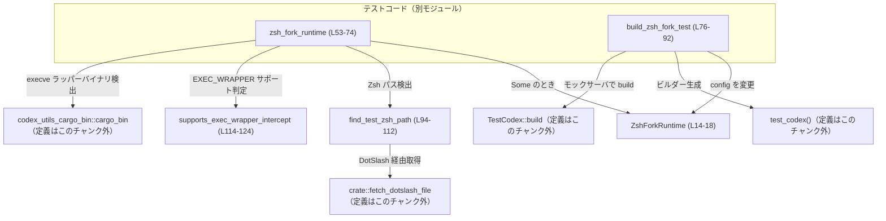
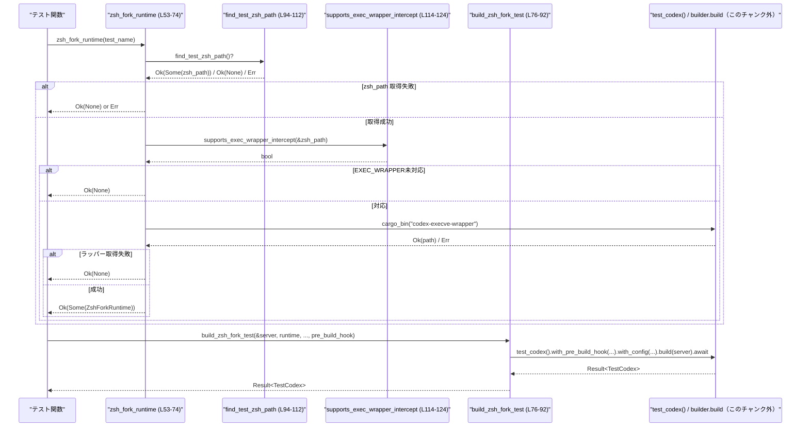

# core/tests/common/zsh_fork.rs コード解説

---

## 0. ざっくり一言

Zsh を使った「フォーク型シェル実行（zsh fork）」のテスト環境を構築するためのヘルパーです。  
Zsh 実行ファイルと execve ラッパーを検出し、`Config` と `SandboxPolicy` をテスト用に設定した `TestCodex` を組み立てます。

---

## 1. このモジュールの役割

### 1.1 概要

- このモジュールは **Zsh ベースのシェル実行を行うテスト** を行うために、最低限必要なランタイム情報と設定処理をカプセル化します。
- Zsh 実行ファイルのパス検出、`EXEC_WRAPPER` 機構のサポート可否判定、`SandboxPolicy` の生成、`Config` への反映、および `TestCodex` ビルダーの組み立てを行います。
- テスト環境が整っていない場合は、**テストをスキップするために `Ok(None)` を返す** 方針を取ります（`zsh_fork_runtime` / `find_test_zsh_path`）。  
  （`core/tests/common/zsh_fork.rs:L53-74`, `L94-112`）

### 1.2 アーキテクチャ内での位置づけ

このファイルはテスト補助モジュールであり、実際のテストコードから呼ばれます。依存関係は次の通りです。

- 上位（呼び出し元）
  - 各種 zsh-fork テストケース（このチャンクには登場しません）
- 下位（呼び出し先）
  - `codex_core::config::{Config, Constrained}`（設定値の保持と制約付き設定）`L5-6`
  - `codex_features::Feature`（機能フラグ）`L7`
  - `codex_protocol::protocol::{AskForApproval, SandboxPolicy}`（承認ポリシーとサンドボックス設定）`L8-9`
  - `crate::test_codex::{test_codex, TestCodex}`（テスト用 Codex ビルダー）`L11-12`
  - `codex_utils_cargo_bin::{repo_root, cargo_bin}`（リポジトリルート・バイナリパスの取得）`L94-96`, `L64`
  - `crate::fetch_dotslash_file`（DotSlash 経由で zsh を取得、定義はこのチャンク外）`L105`

依存関係の概要を図示します。



> この図は `core/tests/common/zsh_fork.rs` 全体（概ね L14-124）の関数間・外部モジュールとの関係を表します。

### 1.3 設計上のポイント

- **ランタイム情報のカプセル化**  
  - Zsh 実行ファイルと execve ラッパーのパスを `ZshForkRuntime` 構造体にまとめています（`L14-18`）。
- **Config への適用処理の一元化**  
  - `ZshForkRuntime::apply_to_config` で、機能フラグの有効化とパス設定、権限ポリシーの適用を一括で行います（`L20-40`）。
- **テスト環境不足時のスキップ戦略**  
  - Zsh が存在しない／DotSlash 取得に失敗する／EXEC_WRAPPER をサポートしない／ラッパーバイナリが見つからない場合、`Result<Option<...>>` で `Ok(None)` を返し、テストをスキップ可能にしています（`L53-68`, `L94-112`）。
- **エラーハンドリング方針**
  - 環境依存の問題は `eprintln!` で説明つきメッセージを出しつつ `Ok(None)` を返す（テストスキップ）形で扱います（`L58-62`, `L66-67`, `L98-102`, `L108-110`）。
  - 一部の設定更新については `expect` でパニックさせるため、**「テスト用 Config は機能フラグ更新を許す」という前提契約**があります（`L27-34`）。
- **並行性**
  - このモジュール内に共有可変状態はなく、すべてのデータは関数ローカルまたは引数経由です。
  - 非同期処理は `build_zsh_fork_test` の `async fn` のみであり、`pre_build_hook` は `Send + 'static` に制約されていて、スレッドを跨いだ実行が可能な設計です（`L76-85`）。

---

## 2. 主要な機能一覧

- Zsh ランタイム情報の保持: `ZshForkRuntime` が Zsh と execve ラッパーのパスを保持する。
- Config への Zsh-fork 設定適用: `ZshForkRuntime::apply_to_config` が `Config` を Zsh fork 実行向けに更新する。
- ワークスペース書き込みポリシーの定義: `restrictive_workspace_write_policy` が厳格な `SandboxPolicy` を生成する。
- Zsh ランタイムの検出・バリデーション: `zsh_fork_runtime` が Zsh パスと execve ラッパーを検出し、EXEC_WRAPPER サポートを確認する。
- Zsh fork テスト環境の組み立て: `build_zsh_fork_test` が `TestCodex` ビルダーに Zsh 設定とフックを組み込み、モックサーバを使って構築する。
- 環境依存のヘルパー:
  - `find_test_zsh_path` が DotSlash 経由でテスト用 Zsh を取得する。
  - `supports_exec_wrapper_intercept` が Zsh が `EXEC_WRAPPER` を解釈するかどうかをチェックする。

### 2.1 コンポーネントインベントリー

このチャンクで定義されている構造体・メソッド・関数の一覧です。

| 名称 | 種別 | 公開 | 概要 | 定義位置 |
|------|------|------|------|----------|
| `ZshForkRuntime` | 構造体 | `pub` | Zsh 実行ファイルと execve ラッパーのパスを保持するランタイム情報コンテナ | `core/tests/common/zsh_fork.rs:L14-18` |
| `ZshForkRuntime::apply_to_config` | メソッド | 非公開 | `Config` に Zsh fork 機能を有効化し、パスと承認・サンドボックスポリシーを適用する | `core/tests/common/zsh_fork.rs:L20-40` |
| `restrictive_workspace_write_policy` | 関数 | `pub` | ネットワークと `/tmp` を含め書き込みを厳しく制限した `SandboxPolicy` を返す | `core/tests/common/zsh_fork.rs:L43-51` |
| `zsh_fork_runtime` | 関数 | `pub` | テスト名を受け取り、利用可能なら `ZshForkRuntime` を返し、そうでなければ `Ok(None)` でスキップ可能にする | `core/tests/common/zsh_fork.rs:L53-74` |
| `build_zsh_fork_test` | 関数（`async`） | `pub` | `ZshForkRuntime` とポリシー・フックを使って `TestCodex` を非同期に構築する | `core/tests/common/zsh_fork.rs:L76-92` |
| `find_test_zsh_path` | 関数 | 非公開 | リポジトリ内の DotSlash エントリからテスト用 Zsh を取得する | `core/tests/common/zsh_fork.rs:L94-112` |
| `supports_exec_wrapper_intercept` | 関数 | 非公開 | `EXEC_WRAPPER` 環境変数を通じて zsh が exec ラップを行うかどうかを判定する | `core/tests/common/zsh_fork.rs:L114-124` |

---

## 3. 公開 API と詳細解説

### 3.1 型一覧（構造体・列挙体など）

| 名前 | 種別 | 役割 / 用途 | 主なフィールド | 定義位置 |
|------|------|-------------|----------------|----------|
| `ZshForkRuntime` | 構造体 | Zsh fork 実行に必要な実行ファイルパスをまとめるランタイム情報 | `zsh_path: PathBuf`（Zsh 実行ファイルパス）、`main_execve_wrapper_exe: PathBuf`（execve ラッパーバイナリのパス） | `core/tests/common/zsh_fork.rs:L14-18` |

`ZshForkRuntime` は `#[derive(Clone)]` が付与されており、所有権を移動せずに複製して使うことができます（`L14`）。  
これはテスト構築の際に複数のクロージャへ渡す可能性を考慮した設計と解釈できます（推測であり、コード外の根拠はありません）。

---

### 3.2 関数詳細

#### `impl ZshForkRuntime { fn apply_to_config(&self, config: &mut Config, approval_policy: AskForApproval, sandbox_policy: SandboxPolicy) }`

**概要**

Zsh fork テストに必要な機能フラグの有効化と、Zsh/execve ラッパーのパス、および承認ポリシー・サンドボックスポリシーを `Config` に書き込みます。`core/tests/common/zsh_fork.rs:L20-40`

**引数**

| 引数名 | 型 | 説明 |
|--------|----|------|
| `&self` | `&ZshForkRuntime` | Zsh 実行パスと execve ラッパーのパスを保持するランタイム情報 |
| `config` | `&mut Config` | 書き換えるテスト用設定オブジェクト |
| `approval_policy` | `AskForApproval` | 操作に対する承認ポリシー（プロトコル定義） |
| `sandbox_policy` | `SandboxPolicy` | 実行環境のサンドボックス方針 |

**戻り値**

- なし（`()`）。`config` が副作用として更新されます。

**内部処理の流れ**

1. `config.features.enable(Feature::ShellTool)` を呼び出し、Shell ツール機能を有効化し、失敗時は `expect` でパニックします（`L27-30`）。
2. `config.features.enable(Feature::ShellZshFork)` を呼び出し、Zsh fork 機能を有効化し、同様に失敗時はパニックします（`L31-34`）。
3. `config.zsh_path` に `self.zsh_path.clone()` を `Some(...)` として代入します（`L35`）。
4. `config.main_execve_wrapper_exe` に `self.main_execve_wrapper_exe.clone()` を `Some(...)` として代入します（`L36`）。
5. `config.permissions.allow_login_shell` を `false` に設定します（`L37`）。
6. `config.permissions.approval_policy` に `Constrained::allow_any(approval_policy)` を設定します（`L38`）。
7. `config.permissions.sandbox_policy` に `Constrained::allow_any(sandbox_policy)` を設定します（`L39`）。

**Examples（使用例）**

このメソッドは通常 `build_zsh_fork_test` 内の `with_config` クロージャから呼び出されます（`L88-89`）。

```rust
// runtime は事前に zsh_fork_runtime から取得した ZshForkRuntime とする
fn configure_config(config: &mut Config, runtime: ZshForkRuntime) {
    let approval_policy = AskForApproval::default();       // 仮のポリシー
    let sandbox_policy = restrictive_workspace_write_policy();

    runtime.apply_to_config(config, approval_policy, sandbox_policy);
}
```

※ `AskForApproval::default()` の有無・意味はこのチャンクには現れないため不明です。

**Errors / Panics**

- `config.features.enable(...)` の戻り値が `Err` の場合に `expect` によりパニックします（`L27-30`, `L31-34`）。
  - テスト用 Config が該当機能フラグの変更を許容することが契約となっています。
- それ以外に `Result` や `Option` を返す処理はなく、パニック以外のエラーはありません。

**Edge cases（エッジケース）**

- `approval_policy` / `sandbox_policy` がどのような条件を持つかは外部型のため、このチャンクからは判断できません。
- `self.zsh_path` / `self.main_execve_wrapper_exe` が存在しないパスであっても、そのまま `Config` に設定されます。実際に失敗するかどうかは後続のプロセス起動側に依存します。

**使用上の注意点**

- `Config` の型定義はこのチャンクにはないため、`features` や `permissions` が必ず存在することを前提にしています。
- `apply_to_config` は **テスト用の設定** を前提としており、プロダクション設定で同じ処理を行うと予期せぬ機能フラグ有効化になる可能性があります。
- 並行性については `&mut Config` を取るため、同一 `Config` を複数スレッドから同時に更新することは想定されていません。

**根拠**

- `core/tests/common/zsh_fork.rs:L20-40`

---

#### `pub fn restrictive_workspace_write_policy() -> SandboxPolicy`

**概要**

ワークスペース書き込みを強く制限した `SandboxPolicy::WorkspaceWrite` 変種を組み立てて返します。  
ネットワークアクセスと `/tmp` 絡みのアクセスが禁止される設定になっています。`L43-51`

**引数**

- なし。

**戻り値**

- `SandboxPolicy::WorkspaceWrite { ... }`  
  - `writable_roots: Vec::new()`（書き込み可能なルートはなし）`L45`  
  - `read_only_access: Default::default()`（読み取り専用アクセス設定はデフォルト）`L46`  
  - `network_access: false`（ネットワーク無効）`L47`  
  - `exclude_tmpdir_env_var: true`（`TMPDIR` 等の環境変数に指定されたディレクトリ除外）`L48`  
  - `exclude_slash_tmp: true`（`/tmp` を除外）`L49`

**内部処理の流れ**

1. `SandboxPolicy::WorkspaceWrite { ... }` 構文でフィールドを指定して構築します（`L44-50`）。
2. それをそのまま返します（`L43-51`）。

**Examples（使用例）**

```rust
let sandbox_policy = restrictive_workspace_write_policy();
// これを ZshForkRuntime::apply_to_config に渡してテスト環境のサンドボックスとして利用
```

**Errors / Panics**

- 単純な構造体リテラルの生成のみであり、パニック・エラー要因はありません。

**Edge cases（エッジケース）**

- 書き込み可能なルートが空なため、テストの中でファイルを書き込む場合は、別途ポリシーを拡張する必要があります。
- `/tmp` や `TMPDIR` が使えない前提になるため、一部のツールが `/tmp` を前提にしているとエラーになる可能性があります。

**使用上の注意点**

- 非常に制限の強いポリシーなので、「どこにも書き込まない」前提のテストに向いています。
- ネットワークアクセスも `false` のため、外部 HTTP アクセスが必要なテストでは使えません。

**根拠**

- `core/tests/common/zsh_fork.rs:L43-51`

---

#### `pub fn zsh_fork_runtime(test_name: &str) -> Result<Option<ZshForkRuntime>>`

**概要**

与えられたテスト名に対して、Zsh fork テストを実行できる環境かをチェックし、可能であれば `ZshForkRuntime` を `Some` で返します。  
環境不足の場合は標準エラーに理由を出力しつつ `Ok(None)` を返す設計です。`L53-74`

**引数**

| 引数名 | 型 | 説明 |
|--------|----|------|
| `test_name` | `&str` | ログメッセージに用いるテスト名（スキップ理由を表示するため） |

**戻り値**

- `Result<Option<ZshForkRuntime>>`
  - `Ok(Some(runtime))` : Zsh 実行ファイルと execve ラッパーが取得でき、`EXEC_WRAPPER` サポートも確認できたとき。
  - `Ok(None)` : 環境不足でテストをスキップすべき状況。
  - `Err(anyhow::Error)` : 主に `find_test_zsh_path()?` 内部での致命的なエラー発生時（`repo_root` 取得失敗等が想定されます）。

**内部処理の流れ**

1. `find_test_zsh_path()?` を呼び出し、`Option<PathBuf>` を取得します（`L54`）。
   - `Err` の場合はそのまま `Result` として伝播します（`?` 演算子）。
   - `Ok(None)` の場合は `return Ok(None)` で終了します（`L54-56`）。
2. `supports_exec_wrapper_intercept(&zsh_path)` を呼び、`EXEC_WRAPPER` 機構への対応を確認します（`L57`）。
   - `false` の場合、`eprintln!` でスキップ理由を表示し `Ok(None)` を返します（`L58-63`）。
3. `codex_utils_cargo_bin::cargo_bin("codex-execve-wrapper")` で execve ラッパーバイナリのパスを取得しようとします（`L64`）。
   - `Ok(path)` の場合、その値を `main_execve_wrapper_exe` として使います。
   - `Err(_)` の場合、`eprintln!` でメッセージを出して `Ok(None)` を返します（`L64-68`）。
4. すべて成功した場合、`ZshForkRuntime { zsh_path, main_execve_wrapper_exe }` を構築し、`Ok(Some(...))` を返します（`L69-73`）。

**Examples（使用例）**

典型的なテストコード中での利用イメージです。

```rust
#[tokio::test]
async fn my_zsh_fork_test() -> anyhow::Result<()> {
    let test_name = "my_zsh_fork_test";
    let runtime = match zsh_fork_runtime(test_name)? {
        Some(rt) => rt,
        None => return Ok(()), // 環境が整っていないのでテストを静かにスキップ
    };

    let server = wiremock::MockServer::start().await;
    let codex = build_zsh_fork_test(
        &server,
        runtime,
        AskForApproval::default(),                 // 仮
        restrictive_workspace_write_policy(),
        |_workspace| { /* 任意のプリビルド処理 */ },
    ).await?;

    // codex を使ったテスト本体 ...
    Ok(())
}
```

※ `AskForApproval::default()` や `MockServer::start` の詳細はこのチャンクにはありません。

**Errors / Panics**

- `find_test_zsh_path()?` が `Err` を返した場合、`zsh_fork_runtime` 自体も `Err` を返します（`L54`）。
- `supports_exec_wrapper_intercept` の内部エラーは `false` として扱われ、`Ok(None)` に変換されるため、ここから `Err` にはなりません（`L57-63`, `L114-123`）。
- `cargo_bin` のエラーも同様に `Ok(None)` に変換されます（`L64-68`）。
- パニックを起こすコードは含まれていません。

**Edge cases（エッジケース）**

- 非 Unix 系 OS で `/usr/bin/true` や `/usr/bin/false` が存在しない場合、`supports_exec_wrapper_intercept` 内の `Command::new` が `Err` を返し、結果的に `false` となるため、テストは常にスキップされます（`L114-123`）。
- DotSlash ファイルや `codex-execve-wrapper` バイナリが存在しない場合も、`Ok(None)` によってスキップされます（`L64-68`, `L94-112`）。
- `test_name` はログ表示にのみ用いられ、動作には影響しません。

**使用上の注意点**

- 戻り値が `Option` でラップされているため、呼び出し側で `Some` / `None` を必ず分岐処理する必要があります。
- `Ok(None)` を「スキップ」とみなすのが契約であり、`None` をエラーとして扱うと、意図しない失敗として報告される可能性があります。
- 環境によっては常に `None` になることがあり得るため、CI 環境などで zsh と `codex-execve-wrapper` の配置を確認する必要があります。

**根拠**

- `core/tests/common/zsh_fork.rs:L53-74`
- `supports_exec_wrapper_intercept` の挙動: `core/tests/common/zsh_fork.rs:L114-123`

---

#### `pub async fn build_zsh_fork_test<F>(server: &wiremock::MockServer, runtime: ZshForkRuntime, approval_policy: AskForApproval, sandbox_policy: SandboxPolicy, pre_build_hook: F) -> Result<TestCodex> where F: FnOnce(&Path) + Send + 'static`

**概要**

`test_codex()` ビルダーに対して Zsh fork 用の設定 (`runtime`, `approval_policy`, `sandbox_policy`) とプリビルドフック (`pre_build_hook`) を組み込み、指定された Wiremock サーバーに対して `TestCodex` を構築する非同期関数です。`L75-92`

**引数**

| 引数名 | 型 | 説明 |
|--------|----|------|
| `server` | `&wiremock::MockServer` | テスト用 HTTP モックサーバの参照 |
| `runtime` | `ZshForkRuntime` | Zsh 実行ファイルと execve ラッパーのパスを含むランタイム情報 |
| `approval_policy` | `AskForApproval` | 承認ポリシー |
| `sandbox_policy` | `SandboxPolicy` | サンドボックスポリシー |
| `pre_build_hook` | `F` | ワークスペースパス（`&Path`）を受け取る一回限りのフック。`Send + 'static` 制約つき |

**戻り値**

- `Result<TestCodex>`  
  `TestCodex` の構築に成功すれば `Ok(TestCodex)`、失敗すれば `Err(anyhow::Error)` を返します。エラーの具体的な要因は `test_codex().build(server)` の実装に依存し、このチャンクからは分かりません。

**内部処理の流れ**

1. `test_codex()` を呼び出して `builder` を取得します（`L86`）。
2. `.with_pre_build_hook(pre_build_hook)` により、ワークスペース生成前に実行されるフックを登録します（`L86-87`）。
3. `.with_config(move |config| { runtime.apply_to_config(config, approval_policy, sandbox_policy); })` により、Config を Zsh fork 用に調整するクロージャを登録します（`L87-89`）。
   - `move` により `runtime`, `approval_policy`, `sandbox_policy` がクロージャにムーブされます。
4. `builder.build(server).await` により、モックサーバを使って `TestCodex` を非同期に構築し、その結果の `Result<TestCodex>` をそのまま返します（`L90-91`）。

**Examples（使用例）**

`zsh_fork_runtime` と組み合わせた典型的なテストコード例は前述しました。ここでは `build_zsh_fork_test` 単体の使い方に焦点を当てます。

```rust
async fn build_for_test(server: &wiremock::MockServer, runtime: ZshForkRuntime) -> anyhow::Result<TestCodex> {
    build_zsh_fork_test(
        server,
        runtime,
        AskForApproval::default(),             // 仮
        restrictive_workspace_write_policy(),  // 厳しいサンドボックス
        |workspace: &std::path::Path| {
            // ワークスペース初期化処理（例: テスト用スクリプトを配置）
            // std::fs::write(workspace.join("script.sh"), "#!/bin/zsh\n...").unwrap();
        },
    ).await
}
```

**Errors / Panics**

- エラーは `builder.build(server).await` の戻り値に依存し、このチャンクでは詳細は不明です（`L90-91`）。
- 本関数内部でパニックを発生させるコード（`expect` 等）はありません。
- `pre_build_hook` 内でのパニックは、ビルドプロセス中に伝播する可能性がありますが、本チャンクからは制御されません。

**Edge cases（エッジケース）**

- `pre_build_hook` が `Send + 'static` である必要があり、短いライフタイムの参照をクロージャにキャプチャすることはできません（コンパイラによって拒否されます）。
- `runtime`/`approval_policy`/`sandbox_policy` は `move` クロージャにムーブされるため、`build_zsh_fork_test` 呼び出し後にそれらを再利用することはできません（所有権が消費される）。

**使用上の注意点**

- 非同期関数のため、呼び出し側は `async` コンテキスト内で `.await` する必要があります。
- `pre_build_hook` 内でブロッキング I/O（例: 大量のファイルコピー）を行うと、ビルド全体の時間に影響します。
- 並行性の観点からは、`pre_build_hook` が `Send` であり、`TestCodex` の実装側でスレッドを跨いで呼ばれても問題ない形で書く必要があります。

**根拠**

- `core/tests/common/zsh_fork.rs:L75-92`

---

#### `fn find_test_zsh_path() -> Result<Option<PathBuf>>`

**概要**

リポジトリルートから `codex-rs/app-server/tests/suite/zsh` への相対パスで DotSlash エントリを探し、存在すれば `crate::fetch_dotslash_file` を用いて実際の zsh バイナリを取得します。  
失敗時はメッセージを `eprintln!` しつつ `Ok(None)` を返します。`L94-112`

**引数**

- なし。

**戻り値**

- `Result<Option<PathBuf>>`
  - `Ok(Some(path))` : DotSlash 経由で zsh を取得できた場合。
  - `Ok(None)` : DotSlash エントリが見つからない、または `fetch_dotslash_file` が `Err` を返した場合。
  - `Err(anyhow::Error)` : `repo_root()` 取得など、上流の致命的エラー。

**内部処理の流れ**

1. `codex_utils_cargo_bin::repo_root()?` を呼び、リポジトリルートを取得します（`L95`）。
   - `Err` の場合はそのまま `Err` として関数を終了します。
2. `let dotslash_zsh = repo_root.join("codex-rs/app-server/tests/suite/zsh");` で DotSlash エントリのパスを組み立てます（`L96`）。
3. `dotslash_zsh.is_file()` でファイルの存在を確認し、存在しない場合は `eprintln!` でメッセージを出した後、`Ok(None)` を返します（`L97-103`）。
4. `crate::fetch_dotslash_file(&dotslash_zsh, /*dotslash_cache*/ None)` を呼び出します（`L105`）。
   - `Ok(path)` の場合、`Ok(Some(path))` を返します（`L105-106`）。
   - `Err(error)` の場合、`eprintln!` でエラー内容を含むメッセージを表示し、`Ok(None)` を返します（`L107-110`）。

**Examples（使用例）**

通常は `zsh_fork_runtime` 内部から呼ばれるため、直接呼び出されることは少ないと想定できます。

```rust
fn locate_zsh() -> anyhow::Result<()> {
    match find_test_zsh_path()? {
        Some(path) => eprintln!("Using test zsh at {}", path.display()),
        None => eprintln!("No test zsh found; tests will be skipped"),
    }
    Ok(())
}
```

**Errors / Panics**

- `repo_root()?` が失敗した場合に限り、本関数は `Err` を返します（`L95`）。
- それ以外の失敗（DotSlash ファイル非存在、`fetch_dotslash_file` 失敗）はすべて `Ok(None)` として扱われます（`L97-103`, `L105-110`）。
- パニックを起こすコードはありません。

**Edge cases（エッジケース）**

- リポジトリ構造が変更され `codex-rs/app-server/tests/suite/zsh` が移動した場合、常に `Ok(None)` になります。
- `fetch_dotslash_file` の挙動（ネットワークアクセスなど）はこのチャンクには現れず、セキュリティ・パフォーマンス特性はその実装に依存します。

**使用上の注意点**

- `Ok(None)` は「テストをスキップするべき環境」と解釈する契約になっています。呼び出し側で `None` をエラー扱いしないことが前提です。
- ログは `eprintln!` で出力されるため、標準エラー出力を収集するテストランナーであればスキップ理由を確認できます。

**根拠**

- `core/tests/common/zsh_fork.rs:L94-112`

---

#### `fn supports_exec_wrapper_intercept(zsh_path: &Path) -> bool`

**概要**

指定された `zsh_path` の zsh が `EXEC_WRAPPER` 環境変数による exec ラップ機構をサポートしているかどうかを、外部コマンドの終了ステータスで判定します。`L114-124`

**引数**

| 引数名 | 型 | 説明 |
|--------|----|------|
| `zsh_path` | `&Path` | 実行する zsh バイナリのパス |

**戻り値**

- `bool`
  - `true` : `EXEC_WRAPPER` に指定した `/usr/bin/false` が有効に機能したと推測される場合（終了ステータスが失敗）。
  - `false` : `EXEC_WRAPPER` が無視されているか、zsh の起動自体に失敗した場合。

**内部処理の流れ**

1. `std::process::Command::new(zsh_path)` でプロセスビルダーを生成します（`L115`）。
2. `.arg("-fc")` と `.arg("/usr/bin/true")` を指定し、zsh に「一度コマンドを評価して終了する」ようなモードで `/usr/bin/true` を実行させます（`L116-117`）。
3. `.env("EXEC_WRAPPER", "/usr/bin/false")` で環境変数を設定し、exec ラッパーを `/usr/bin/false` に設定します（`L118`）。
4. `.status()` でコマンドを実行し、`Result<ExitStatus>` を取得します（`L119`）。
5. `match status` で分岐し、`Ok(status)` の場合は `!status.success()` を返します（`L120-121`）。
   - `/usr/bin/true` が実行されていれば成功ステータス (`success() == true`) になり、`!true == false` → ラップされていないと判断。
   - `/usr/bin/false` にラップされていれば失敗ステータス (`success() == false`) であり、`!false == true` → ラップされていると判断。
6. `Err(_)` の場合は `false` を返します（`L122`）。

**Examples（使用例）**

通常は `zsh_fork_runtime` 内から呼び出されますが、単体で利用することも可能です。

```rust
fn check_exec_wrapper(zsh_path: &Path) {
    if supports_exec_wrapper_intercept(zsh_path) {
        eprintln!("zsh supports EXEC_WRAPPER");
    } else {
        eprintln!("zsh does NOT support EXEC_WRAPPER");
    }
}
```

**Errors / Panics**

- 外部プロセスの起動失敗（バイナリが存在しない、実行権限がないなど）は `Err(_)` となり、`false` を返しますが、パニックはしません（`L119-122`）。

**Edge cases（エッジケース）**

- `/usr/bin/true` や `/usr/bin/false` が存在しない環境では `Command::new(...).status()` が `Err` となり、常に `false` を返します。
- `zsh_path` が zsh 以外のバイナリを指している場合、結果は未定義ですが、本関数はそれを検証しません。
- 実際には `EXEC_WRAPPER` 機構があるが、特定のオプションや設定で無効化されている場合など、挙動が環境依存になる可能性があります。

**使用上の注意点**

- セキュリティ上、新たなプロセスを実行するため、**本来はテスト環境でのみ利用すべき処理**です。このファイルがテスト用ディレクトリにあることが、その意図を示しています。
- 実際の挙動はシステムの `/usr/bin/true` および `/usr/bin/false` の実装に依存します。

**根拠**

- `core/tests/common/zsh_fork.rs:L114-124`

---

#### `pub fn zsh_fork_runtime` / `build_zsh_fork_test` と他関数の関係

上記 4 関数に加えて、`ZshForkRuntime` と `build_zsh_fork_test` との連携は次のようになります。

- `zsh_fork_runtime` が `ZshForkRuntime` のインスタンスを生成する。
- `build_zsh_fork_test` がその `runtime` に対し `apply_to_config` を内部で呼び出し、`Config` に設定を適用する（`L88-89`）。

---

### 3.3 その他の関数

このファイルでは、3.2 で詳細説明した 6 つ以外に追加の関数やメソッドはありません。

---

## 4. データフロー

### 4.1 代表的な処理シナリオ

代表的なテスト実行シナリオは次の流れです。

1. テストコードが `zsh_fork_runtime(test_name)` を呼ぶ。
2. 内部で `find_test_zsh_path` → `supports_exec_wrapper_intercept` → `cargo_bin` を通じて `ZshForkRuntime` が生成されるかどうかが決まる。
3. `Some(runtime)` の場合、テストコードが `build_zsh_fork_test` を呼び、`TestCodex` を構築する。
4. `build_zsh_fork_test` 内で `test_codex()` → `with_pre_build_hook` → `with_config(move |config| runtime.apply_to_config(...))` → `build(server).await` が行われる。

これをシーケンス図で表すと次のようになります。



> この図は `core/tests/common/zsh_fork.rs` の関数群（概ね L53-92, L94-124）の呼び出し関係を表しています。

---

## 5. 使い方（How to Use）

### 5.1 基本的な使用方法

Zsh fork テストを書くときの基本フローです。

```rust
use anyhow::Result;
use wiremock::MockServer;
use codex_protocol::protocol::AskForApproval;

#[tokio::test]
async fn example_zsh_fork_test() -> Result<()> {
    // 1. ランタイム検出
    let runtime = match zsh_fork_runtime("example_zsh_fork_test")? {
        Some(rt) => rt,
        None => return Ok(()), // 環境不足のためテストをスキップ
    };

    // 2. モックサーバ起動
    let server = MockServer::start().await;

    // 3. TestCodex 構築
    let codex = build_zsh_fork_test(
        &server,
        runtime,
        AskForApproval::default(),            // 仮の承認ポリシー
        restrictive_workspace_write_policy(), // 厳しいサンドボックス
        |_workspace: &std::path::Path| {
            // 任意のワークスペース初期化ロジック
        },
    ).await?;

    // 4. codex を用いてテスト本体の検証を行う
    // ...

    Ok(())
}
```

### 5.2 よくある使用パターン

1. **厳格なサンドボックスでのテスト**

   - `restrictive_workspace_write_policy()` をそのまま `sandbox_policy` に渡す。
   - テスト内でファイル書き込みを行わず、主にコマンドの標準出力などを検証する用途に向きます。

2. **プリビルドフックでのセットアップ**

   - `pre_build_hook` でワークスペースにスクリプトや設定ファイルを配置し、それをテスト対象コマンドから参照させる。

   ```rust
   let hook = |workspace: &Path| {
       let script = workspace.join("script.zsh");
       std::fs::write(&script, "#!/usr/bin/env zsh\n echo hello").unwrap();
       // 実際のテストでは unwrap の代わりに適切なエラーハンドリングを行う
   };
   ```

### 5.3 よくある間違い

```rust
// 間違い例: None を考慮せずに unwrap している
let runtime = zsh_fork_runtime("my_test")?.unwrap(); // 環境不足時にパニック

// 正しい例: None をスキップとして扱う
let runtime = match zsh_fork_runtime("my_test")? {
    Some(rt) => rt,
    None => return Ok(()), // スキップ
};
```

```rust
// 間違い例: pre_build_hook で短いライフタイムの参照をキャプチャ
let local = String::from("data");
let hook = |_: &Path| {
    // &local を参照しようとすると 'static 制約によりコンパイルエラー
};

// 正しい例: 所有権を move して 'static にする
let local = String::from("data");
let hook = {
    let owned = local.clone();
    move |_: &Path| {
        println!("{owned}");
    }
};
```

### 5.4 使用上の注意点（まとめ）

- **契約・エッジケース**
  - `Result<Option<...>>` 形式（`zsh_fork_runtime`, `find_test_zsh_path`）は `None` を「スキップ」と解釈する契約です。
  - `ZshForkRuntime::apply_to_config` は対象 `Config` に `features` / `permissions` が存在し、更新を許可していることを前提とします。
- **安全性・エラー**
  - このファイル内はすべて安全な Rust（`unsafe` なし）です。
  - 外部プロセス起動（`supports_exec_wrapper_intercept`）は OS 環境に依存しますが、失敗時には `false` を返してテストをスキップする形でフェイルセーフになっています。
- **並行性**
  - 共有可変状態はなく、`build_zsh_fork_test` の `pre_build_hook: F: FnOnce(&Path) + Send + 'static` により、並行実行でもデータ競合が起きにくい設計です。
- **性能に関する注意**
  - `supports_exec_wrapper_intercept` が zsh プロセスを一度起動しますが、通常はテスト起動時に一回のみのため性能上の問題は小さいと考えられます。
- **セキュリティ**
  - 本ファイルはテスト用ディレクトリにあり、外部入力を直接扱わず、固定パスとリポジトリ内ファイルに基づいて動作するため、攻撃ベクトルは限定的です。
  - `fetch_dotslash_file` が何を行うかによってはネットワーク経由の取得等があり得ますが、そのセキュリティ特性はこのチャンクの範囲外です。

---

## 6. 変更の仕方（How to Modify）

### 6.1 新しい機能を追加する場合

例: 別のシェル（例えば `bash`）向けの fork テスト環境を追加したい場合。

1. **新しいランタイム構造体の追加**
   - `ZshForkRuntime` に倣い、`BashForkRuntime` のような構造体を追加し、必要なパスをフィールドとして定義します。
2. **Config 適用メソッドの追加**
   - `apply_to_config` と同様に、`Config` に対して必要な機能フラグやパスを設定するメソッドを実装します。
3. **検出系関数の追加**
   - `find_test_zsh_path` / `supports_exec_wrapper_intercept` に相当する関数を別名で定義し、新シェルに固有の検出ロジックを実装します。
4. **ビルダー関数の追加**
   - `build_zsh_fork_test` と同様の `build_bash_fork_test` を追加し、`test_codex().with_pre_build_hook(...).with_config(...)` パターンを踏襲します。

### 6.2 既存の機能を変更する場合

- **影響範囲の確認**
  - `zsh_fork_runtime` のシグネチャ変更は、全テストコードに影響します。
  - `restrictive_workspace_write_policy` の内容を変更すると、サンドボックスの挙動が変わり、多くのテストに影響する可能性があります。
- **契約の保持**
  - `Result<Option<...>>` で `Ok(None)` をスキップとして扱う契約は、既存のテストが依存しているため、極力維持するのが安全です。
- **テスト・ログの確認**
  - `eprintln!` のメッセージはスキップ理由の唯一の手がかりとなるため、変更時にはメッセージの意味が変わらないか確認する必要があります。

---

## 7. 関連ファイル

このモジュールと密接に関係するファイル・モジュールです。

| パス / モジュール | 役割 / 関係 |
|-------------------|------------|
| `crate::test_codex` | `test_codex()` 関数と `TestCodex` 型を提供し、Zsh fork 設定を組み込んだテスト環境を構築する。定義はこのチャンクには現れませんが、`build_zsh_fork_test` から使用されています（`L11-12`, `L86-91`）。 |
| `crate::fetch_dotslash_file` | DotSlash エントリ（`codex-rs/app-server/tests/suite/zsh`）から実際の zsh バイナリを取得する関数。定義はこのチャンクには現れません（`L105`）。 |
| `codex_core::config::{Config, Constrained}` | Codex の設定オブジェクトと制約付き設定を提供し、本モジュールで Zsh fork 設定の適用に使われています（`L5-6`, `L20-40`）。 |
| `codex_features::Feature` | Codex の機能フラグを列挙する型で、`ShellTool` / `ShellZshFork` を有効化するのに利用しています（`L7`, `L27-34`）。 |
| `codex_protocol::protocol::{AskForApproval, SandboxPolicy}` | 承認ポリシーとサンドボックスポリシーを表す型。本モジュールの公開 API の一部です（`L8-9`, `L43-51`, `L75-81`）。 |
| `codex_utils_cargo_bin::{repo_root, cargo_bin}` | リポジトリルート・バイナリのパス検出ユーティリティ。Zsh DotSlash ファイルや `codex-execve-wrapper` の検出に利用しています（`L94-96`, `L64`）。 |
| `wiremock::MockServer` | HTTP モックサーバ。本モジュールでは `build_zsh_fork_test` に引数として渡され、`TestCodex` の構築に使用されます（`L76`）。 |

以上が `core/tests/common/zsh_fork.rs` の公開 API・コアロジック・データフローおよび関連コンポーネントの解説になります。
