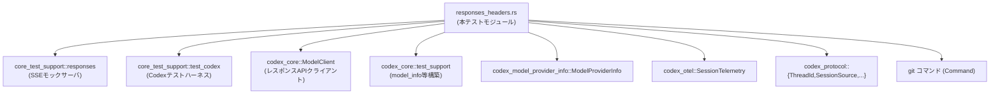
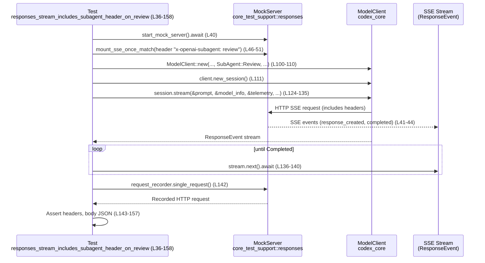
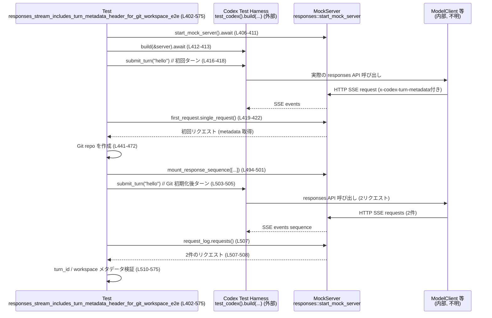

# core/tests/responses_headers.rs コード解説

## 0. ざっくり一言

`core/tests/responses_headers.rs` は、**Codex の「responses」ストリーミング API を呼び出したときに送出される HTTP ヘッダおよびメタデータが、期待どおりに付与されているかを検証する非同期テスト群**です。  
サブエージェント識別ヘッダや、インストール ID、Git ワークスペースメタデータなどを確認します。

---

## 1. このモジュールの役割

### 1.1 概要

このモジュールは次の問題を検証対象としています。

- **サブエージェントコンテキスト**（Review / Other）が、HTTP ヘッダ `x-openai-subagent` 等に正しく反映されているか (L36-158, L160-272)。
- コンフィグでオーバーライドした **推論サマリ設定** が、リクエストボディの `reasoning.summary` に反映されるか (L274-400)。
- Git ワークスペースを含む環境で、`x-codex-turn-metadata` ヘッダ内に **turn_id / sandbox / workspace メタデータ** が正しくエンコードされるか (L402-575)。

### 1.2 アーキテクチャ内での位置づけ

このファイル自体はテストモジュールであり、実装本体ではありません。外部の主なコンポーネントに依存しています：

- `ModelClient`（`codex_core`）: モデルへのストリーミングリクエストを発行 (L100-111, L225-236, L339-350)。
- `SessionTelemetry`（`codex_otel`）: テレメトリ情報の構築 (L87-98, L212-223, L326-337)。
- `ModelProviderInfo`（`codex_model_provider_info`）: モデルプロバイダ設定（ベース URL, リトライ回数等） (L53-70, L177-194, L286-303)。
- `core_test_support::responses` : Wiremock ベースの SSE モックサーバとリクエスト記録のユーティリティ (L40-51, L164-175, L278-285, L406-411, L415, L483-501)。
- `core_test_support::test_codex::test_codex` : Git ワークスペース付きテスト環境の構築 (L412-418)。

依存関係のイメージは次のとおりです。



> 注: B〜I の内部実装はこのチャンクには現れず、ここでは名前と利用箇所だけが分かります。

### 1.3 設計上のポイント

コードから読み取れる設計上の特徴は次のとおりです。

- **責務の分離**
  - HTTP / SSE 通信のモックやリクエスト記録は `core_test_support::responses` に委譲 (L40-51, L164-175, L278-285, L406-411, L415, L483-501)。
  - Codex 実行環境（ワークスペースディレクトリなど）は `test_codex` に委譲 (L412-418)。
  - このファイルは「期待されるヘッダ・ボディの値の検証」に集中しています。
- **状態管理**
  - 設定（config）は `Arc` で共有 (L72-80, L196-204, L305-315) し、スレッド安全な読み取り専用状態として扱います。
  - Git ワークスペースは一時ディレクトリ上に作成され、グローバルな副作用を避けています (L412-418, L441-467)。
- **エラーハンドリング方針**
  - テストであるため、全ての失敗は `expect` / `assert!` / `assert_eq!` により **即座に panic ＝ テスト失敗** として扱います (例: L72, L135, L281-285, L442, L450-457, L508)。
  - `skip_if_no_network!` によりネットワークが使えない環境ではテストをスキップする設計 (L38, L162, L276, L404)。
- **非同期・並行性**
  - すべてのテストは `#[tokio::test]` で非同期に実行されます (L36, L160, L274, L402)。
  - ストリーム処理は `futures::StreamExt::next` を用いた逐次 `await` で行われ、並行ストリーム処理は行っていません (L136-140, L261-265, L375-379)。

---

## 2. 主要な機能一覧

このモジュールが提供する（＝検証する）主要な機能は次のとおりです。

- Git リモート URL 正規化: `normalize_git_remote_url` で `.git` サフィックスや末尾 `/` を除去し、比較しやすくする (L26-32, L567-568)。
- サブエージェント Review 用ヘッダ検証:
  - `SessionSource::SubAgent(SubAgentSource::Review)` 利用時に `x-openai-subagent: review` 等のヘッダが付与されることを確認 (L36-158)。
- 任意サブエージェント（Other）用ヘッダ検証:
  - `SubAgentSource::Other("my-task")` のときに `x-openai-subagent: my-task` が送出されることを確認 (L160-272)。
- コンフィグによる「reasoning summary」オーバーライド検証:
  - `model_supports_reasoning_summaries = Some(true)` かつ `model_reasoning_summary = Some(Detailed)` の場合、リクエストボディ `reasoning.summary == "detailed"` になることを確認 (L305-313, L381-399)。
- Git ワークスペースメタデータの turn-metadata ヘッダ検証:
  - `x-codex-turn-metadata` ヘッダ内の `turn_id` が同一ターン内で共有されつつ、ターン間で変化すること (L419-439, L523-539)。
  - `sandbox` フィールドが `"none"` であること (L434-439, L541-542)。
  - ワークスペースメタデータに最新コミットハッシュ・origin リモート URL・変更有無が適切に反映されること (L548-575)。

---

## 3. 公開 API と詳細解説

このファイルはテスト用モジュールであり、`pub` な型・関数は定義していません。ただし、テストやヘルパー関数自体も「利用パターンを示す API」と考えられるため、それらを対象に解説します。

### 3.1 型一覧（構造体・列挙体など）

このファイル内で新たに定義される型はありません。利用している主な外部型のみ列挙します（実装はこのチャンクには現れません）。

| 名前 | 所属 | 種別 | 役割 / 用途 | 根拠 |
|------|------|------|-------------|------|
| `ModelClient` | `codex_core` | 構造体 | モデルへのストリーミングレスポンス API クライアント | L100-111, L225-236, L339-350 |
| `Prompt` | `codex_core` | 構造体 | モデルに与える入力（メッセージ列） | L113-122, L238-247, L352-361 |
| `ResponseEvent` | `codex_core` | 列挙体と推測 | レスポンスストリーム上のイベント種別（Completed など） | `ResponseEvent::Completed` 使用 (L137, L262, L376) から推測 |
| `SessionTelemetry` | `codex_otel` | 構造体 | セッション単位のテレメトリ情報 | L87-98, L212-223, L326-337 |
| `TelemetryAuthMode` | `codex_otel` | 列挙体と推測 | テレメトリ上の認証モード表現 | L83-84, L206-208, L319-321 |
| `ModelProviderInfo` | `codex_model_provider_info` | 構造体 | モデルプロバイダ設定（ベース URL やリトライ等） | L53-70, L177-194, L286-303 |
| `ThreadId` | `codex_protocol` | 構造体 | 会話スレッド ID。window_id に埋め込まれる | L82, L143-147 |
| `ReasoningSummary` | `codex_protocol::config_types` | 列挙体と推測 | reasoning summary の粒度指定（ここでは Detailed） | L311-312 |
| `ContentItem`, `ResponseItem` | `codex_protocol::models` | 列挙体と推測 | 入出力メッセージのコンテンツ種別 | L114-122, L239-247, L353-361 |
| `SessionSource`, `SubAgentSource` | `codex_protocol::protocol` | 列挙体 | セッションの起源（サブエージェント種別など） | L84, L208-209, L323-324 |
| `TempDir` | `tempfile` | 構造体 | 一時ディレクトリ管理 | L72, L196, L305 |
| `Command` | `std::process` | 構造体 | `git` コマンドを実行するためのプロセス生成 | L444-450 |

> これらの型の内部フィールドやメソッドは、このチャンクには現れません。

### 3.2 関数詳細（5件）

#### `normalize_git_remote_url(url: &str) -> String`  (core/tests/responses_headers.rs:L26-32)

**概要**

Git リモート URL を比較しやすくするために、**前後の空白、末尾の `/`、末尾の `.git` を取り除いた文字列**を返します。Git ワークスペースメタデータの `associated_remote_urls.origin` と `git remote get-url origin` の結果を比較する際に使用されています (L560-569)。

**引数**

| 引数名 | 型 | 説明 |
|--------|----|------|
| `url` | `&str` | 正規化対象の Git リモート URL 文字列 |

**戻り値**

- 型: `String`
- 内容: 前後の空白を除去し、末尾の `/` と `.git` を取り除いた文字列。

**内部処理の流れ**

1. `url.trim()` で前後の空白を削除し、さらに `trim_end_matches('/')` で末尾の `/` を削除して `normalized` に格納 (L27)。
2. `normalized.strip_suffix(".git")` で末尾 `.git` を削除しようとし、削除できた場合はその返り値、削除できない場合は `normalized` そのものを選択 (L29-30)。
3. 最終的な `&str` を `to_string()` で `String` に変換して返却 (L31)。

**Examples（使用例）**

```rust
// "https://github.com/openai/codex.git" -> "https://github.com/openai/codex"
let normalized = normalize_git_remote_url("https://github.com/openai/codex.git");
// "https://github.com/openai/codex" であることを期待

// 末尾 / 付きも同様に扱われる
let normalized = normalize_git_remote_url("https://github.com/openai/codex.git/");

// SCP形式でも .git だけが取り除かれる（と考えられる）
let normalized = normalize_git_remote_url("git@github.com:openai/codex.git");
```

> 上記は関数本体から導かれる挙動の例であり、このチャンク内では実際のテストは `actual_origin` と `expected_origin` の比較にのみ使われています (L560-569)。

**Errors / Panics**

- この関数内では `unwrap` などを使っておらず、パニックは発生しません。
- `strip_suffix` は失敗しても `None` を返すだけなので安全です (L29-30)。

**Edge cases（エッジケース）**

- 空文字 `""`:
  - `trim` によりそのまま空文字、`strip_suffix` でも変化せず、空文字を返します。
- 空白のみ `"   "`:
  - `trim` により空文字となり、そのまま空文字を返します。
- `.git` が途中に含まれるが末尾にはない場合（例: `"https://example.com/git.repo"`）:
  - `strip_suffix(".git")` はマッチせず、文字列は変更されません。

**使用上の注意点**

- URL の**プロトコルやユーザ名などは一切変更されない**ため、`https://` と `git@` 形式を同一視したい場合には別途処理が必要です。
- ここでは「末尾 `.git` を無視したい」「末尾の `/` の有無を無視したい」程度の用途に限定されます。

---

#### `responses_stream_includes_subagent_header_on_review()`  (L36-158)

**概要**

`SessionSource::SubAgent(SubAgentSource::Review)` を用いたレスポンスストリームリクエストが、**`x-openai-subagent: review` を含む HTTP ヘッダと、正しい Codex 独自ヘッダを送出するか**を検証する非同期テストです。

検証するヘッダ・ボディは主に以下です (L142-157)。

- `x-openai-subagent == "review"`
- `x-codex-window-id == "{conversation_id}:0"`
- `x-codex-parent-thread-id == None`
- JSON ボディ `client_metadata["x-codex-installation-id"] == TEST_INSTALLATION_ID`
- `x-codex-sandbox == None`

**引数**

- なし（テスト関数であり、テストランナーから呼び出されます）。

**戻り値**

- `()` （暗黙）。条件が満たされない場合は panic し、テスト失敗となります。

**内部処理の流れ**

1. ネットワークが利用できない場合にテストをスキップ (`skip_if_no_network!`) (L38)。
2. モック SSE サーバを起動し (L40)、`response_created` と `completed` イベントだけを返す SSE レスポンスを定義 (L41-44)。
3. `x-openai-subagent: review` ヘッダを要求するモックエンドポイントをマウントし、そのリクエストを記録する `request_recorder` を取得 (L46-51)。
4. `ModelProviderInfo` を組み立て、`WireApi::Responses` を指定 (L53-70)。
5. デフォルト設定を読み込み、プロバイダやモデルを設定し、`Arc` に包む (L72-80)。
6. 新しい `ThreadId` と `SessionSource::SubAgent(SubAgentSource::Review)` を生成し (L82-85)、`construct_model_info_offline` で `model_info` を構築 (L85-86)。
7. `SessionTelemetry` を作成 (L87-98)。
8. `ModelClient::new` でクライアントを作成し、新しいセッションを開始 (L100-111)。
9. `Prompt` を構築し、簡単なユーザメッセージ `"hello"` を設定 (L113-122)。
10. `client_session.stream(...)` を呼び出し、レスポンスイベントのストリームを取得 (L124-135)。
11. ストリームを `while let Some(event) = stream.next().await` で走査し、`ResponseEvent::Completed` を受け取ったらループを抜ける (L136-140)。
12. `request_recorder.single_request()` で送信された HTTP リクエストを取得し、ヘッダとボディの値を `assert_eq!` で検証 (L142-157)。

**Examples（使用例）**

このテストは、**サブエージェント Review 用のセッションを構築してストリーミング API を呼ぶ典型パターン**になっています。実装側で同等の処理を行うときの簡略版は次のようなイメージになります。

```rust
// ModelProviderInfo と config, model_info, session_telemetry を事前に用意している前提
let client = ModelClient::new(
    None,
    conversation_id,
    TEST_INSTALLATION_ID.to_string(),
    provider.clone(),
    SessionSource::SubAgent(SubAgentSource::Review),
    config.model_verbosity,
    false, // request compression
    false, // include_timing_metrics
    None,  // beta_features_header
); // L100-110 に相当

let mut client_session = client.new_session();

let mut prompt = Prompt::default();
prompt.input = vec![ResponseItem::Message {
    id: None,
    role: "user".into(),
    content: vec![ContentItem::InputText {
        text: "hello".into(),
    }],
    end_turn: None,
    phase: None,
}]; // L113-122 に相当

let mut stream = client_session
    .stream(
        &prompt,
        &model_info,
        &session_telemetry,
        effort,
        summary.unwrap_or(model_info.default_reasoning_summary),
        None, // service_tier
        None, // turn_metadata_header
    )
    .await
    .expect("stream failed"); // L124-135

while let Some(event) = stream.next().await {
    if matches!(event, Ok(ResponseEvent::Completed { .. })) {
        break;
    }
}
```

**Errors / Panics**

- ネットワーク利用不可時: `skip_if_no_network!` の定義はこのチャンクにはありませんが、通常はテストをスキップします (L38)。
- `TempDir::new().expect("failed to create TempDir")` が失敗すると panic (L72)。
- `client_session.stream(...).await` が `Err` を返した場合、`expect("stream failed")` により panic (L134-135)。
- 期待されるヘッダやボディ値が異なる場合、`assert_eq!` により panic (L144-157)。

**Edge cases（エッジケース）**

- `summary` が `None` の場合:
  - `summary.unwrap_or(model_info.default_reasoning_summary)` により `model_info` 側のデフォルト値が使われます (L129-130)。
- ストリームが `Completed` イベントを送出しない場合:
  - セットアップは `responses::ev_completed` を必ず含むため通常は起こりませんが、起こった場合には `stream.next()` が `None` になった時点でループを抜けます (L136-140)。
- モックサーバがリクエストを受け取らない場合:
  - `single_request()` の挙動はこのチャンクにはありませんが、通常は panic またはテスト失敗になります。

**使用上の注意点**

- このパターンを他のテストやコードで流用する場合、**ストリームを最後まで（Completed まで）消費しないとリクエストが完了しない可能性**があります。ストリーム処理を途中で打ち切ると、テスト対象が想定どおりに動かないことがあります。
- `SessionSource::SubAgent(SubAgentSource::Review)` を設定しないと、`x-openai-subagent: review` は付与されない前提です（実装はこのチャンクにはなく、ここではテストからその契約を読み取っています）。

---

#### `responses_stream_includes_subagent_header_on_other()`  (L160-272)

**概要**

`SubAgentSource::Other("my-task")` を使用したレスポンスストリームリクエストが、**`x-openai-subagent: my-task` ヘッダを含むか**を検証する非同期テストです。Review 用テストとほぼ同じ構造で、サブエージェント名だけが異なります。

**引数 / 戻り値**

- 引数なし、戻り値 `()`（テスト関数）。挙動は前述の Review テストと同様です。

**内部処理の流れ**

1. ネットワークチェック (`skip_if_no_network!`) (L162)。
2. モック SSE サーバ起動とレスポンス定義 (L164-168)。
3. `x-openai-subagent: my-task` ヘッダを要求するモックエンドポイントをマウント (L170-175)。
4. `ModelProviderInfo` 作成 (L177-194) と config のロード・適用 (L196-204)。
5. `SessionSource::SubAgent(SubAgentSource::Other("my-task".to_string()))` を設定 (L206-209)。
6. `SessionTelemetry` と `ModelClient`, `client_session` の構築 (L212-223, L225-236)。
7. `Prompt` の組み立てと `stream` の開始 (L238-260)。
8. ストリームを `Completed` イベントまで消費 (L261-265)。
9. 記録されたリクエストの `x-openai-subagent` ヘッダが `"my-task"` であることを検証 (L267-271)。

**Errors / Panics, Edge cases, 使用上の注意点**

基本的に Review テストと同じ構造です。`SubAgentSource::Other` の値がそのままヘッダ文字列になるという契約をテストしています (L208-209, L170-175, L267-271)。

---

#### `responses_respects_model_info_overrides_from_config()`  (L274-400)

**概要**

設定 (`config`) から指定された **モデル名と reasoning summary 設定** が、実際のリクエストボディの `reasoning` フィールドに正しく反映されるかを検証するテストです。

特に次を確認します (L381-399)。

- `reasoning` オブジェクトがリクエストボディに存在すること。
- `reasoning["summary"] == "detailed"` であること。

**内部処理の流れ**

1. ネットワークチェック (`skip_if_no_network!`) (L276)。
2. モック SSE サーバと単発 SSE レスポンスをセットアップ (L278-285)。
3. `ModelProviderInfo` を Responses 用として構築 (L286-303)。
4. デフォルト config をロードし、以下を明示的に上書き (L305-313)。
   - `config.model = Some("gpt-3.5-turbo".to_string())`
   - `config.model_supports_reasoning_summaries = Some(true)`
   - `config.model_reasoning_summary = Some(ReasoningSummary::Detailed)`
5. `effort` / `summary` / `model` を取り出し、`Arc` でラップ (L312-315)。
6. `CodexAuth::from_api_key("Test API Key")` から `auth_mode` を生成し、`TelemetryAuthMode` に変換 (L318-321)。
7. `SessionSource::SubAgent(SubAgentSource::Other("override-check"))` を設定 (L322-323)。
8. `construct_model_info_offline(model.as_str(), &config)` で `model_info` 構築 (L324-325)。
9. `SessionTelemetry`、`ModelClient`、`client_session`、`Prompt` を構築 (L326-361)。
10. `stream` を開始し、`Completed` まで消費 (L363-379)。
11. 記録されたリクエストボディを JSON として取得し、`reasoning` オブジェクトを取り出す (L381-386)。
12. `reasoning` が存在すること、かつ `reasoning["summary"] == "detailed"` であることを `assert!` / `assert_eq!` で検証 (L388-399)。

**Errors / Panics**

- `config.model.clone().expect("model configured")` により、`config.model` が `None` の場合は panic (L314)。
- `auth_manager_from_auth(...).auth_mode()` が `None` を返す場合の挙動はこのチャンクからは不明ですが、ここでは `map(TelemetryAuthMode::from)` を呼ぶだけで、`SessionTelemetry` 側で `Option` のまま扱われています (L318-321, L331-332)。
- `reasoning` がボディに存在しない場合、`assert!(reasoning.is_some(), ...)` が失敗し panic (L388-391)。
- `reasoning["summary"]` が `"detailed"` でない場合、`assert_eq!` が失敗し panic (L393-399)。

**Edge cases**

- `config.model_supports_reasoning_summaries = Some(false)` や `None` の場合の挙動は、このテストではカバーしていません。このテストはあくまで「true かつ Detailed のときに summary が detailed になる」ことだけを契約として確認しています。
- `body.get("reasoning")` が JSON としてオブジェクトでない場合（配列や文字列など）は `and_then(|v| v.as_object())` が `None` を返し、`reasoning.is_some()` が偽になります (L383-386)。

**使用上の注意点**

- 実装側で `config.model_reasoning_summary` を無視するような変更を加えた場合、このテストが失敗します。**コンフィグ→リクエストボディへの伝播経路を壊していないか**を確認するためのテストとみなせます。
- モデル名 `"gpt-3.5-turbo"` はここでは文字列リテラルであり、実際のオンライン環境の対応モデルと必ずしも一致するとは限りませんが、このテストは「オフライン構築された model_info に対して設定が反映されるか」を確認するものです (L307-315, L324-325)。

---

#### `responses_stream_includes_turn_metadata_header_for_git_workspace_e2e()`  (L402-575)

**概要**

実際に Git リポジトリを初期化したワークスペースを作成し、その上で Codex の turn を実行したときに、**`x-codex-turn-metadata` ヘッダに含まれる turn / workspace メタデータが正しく構成されるか**を検証するエンドツーエンドテストです。

検証ポイント (L419-439, L508-575):

- 初回（Git 未初期化）ターンでも `turn_id` が存在し、空でないこと。
- 同一ターン内の複数リクエストは同じ `turn_id` を共有すること。
- 異なるターン（Git 初期化後）は別の `turn_id` になること。
- `sandbox == "none"`。
- ワークスペースメタデータに:
  - `latest_git_commit_hash == git rev-parse HEAD`、
  - `associated_remote_urls.origin == git remote get-url origin` （ただし `.git` や末尾 `/` の違いは `normalize_git_remote_url` で吸収）、
  - `has_changes == false`
  が含まれること。

**内部処理の流れ（アルゴリズム）**

1. ネットワークチェック (`skip_if_no_network!`) (L404)。
2. モック SSE サーバと単純な SSE レスポンス（`resp-1`）を用意 (L406-411)。
3. `test_codex().build(&server)` で Codex テスト環境を構築し、作業ディレクトリ `cwd` を取得 (L412-414)。
4. 最初のターン:
   - `responses::mount_sse_once` で最初のリクエストを記録するハンドラを用意 (L415)。
   - `test.submit_turn("hello")` を実行し (L416-418)、`x-codex-turn-metadata` ヘッダを取得・JSON としてパース (L419-424)。
   - `turn_id` が存在し・空でないこと、および `sandbox == "none"` を検証 (L425-439)。
5. Git リポジトリの作成:
   - 空のグローバル Git 設定 `empty-git-config` を作成 (L441-442)。
   - クロージャ `run_git` を定義し、`GIT_CONFIG_GLOBAL` と `GIT_CONFIG_NOSYSTEM=1` を設定して `git` コマンドを実行、成功ステータスを `assert!` で検証 (L443-459)。
   - `git init`, `git config user.name`, `git config user.email`, README 作成 & add, `git commit`, `git remote add origin ...` を順に実行 (L461-472)。
6. 期待値の取得:
   - `git rev-parse HEAD` の結果を `expected_head` として取得 (L474-477)。
   - `git remote get-url origin` の結果を `expected_origin` として取得 (L478-481)。
7. 2つの SSE レスポンスを用意:
   - 最初のレスポンス: reasoning と shell command call を含む (L483-488)。
   - 2つ目のレスポンス: assistant message `"done"` を含む (L489-492)。
   - これらを `responses::mount_response_sequence` で順に返すようにモックサーバを設定し、リクエストログ `request_log` を取得 (L494-501)。
8. Git 初期化後のターン実行:
   - `test.submit_turn("hello")` 再実行 (L503-505)。
   - ログ内のリクエストを取得し、2件であることを検証 (L507-508)。
9. `x-codex-turn-metadata` の検証:
   - 1件目・2件目のヘッダを JSON としてパース (L510-521)。
   - 両者の `turn_id` が同一であること（1ターン内で共有）を検証 (L523-533)。
   - この `turn_id` が初回ターンの `initial_turn_id` と異なることを検証 (L535-539)。
   - `sandbox == "none"` を再度検証 (L541-542)。
10. ワークスペースメタデータの検証:
    - `second_parsed["workspaces"]` から最初のワークスペースオブジェクトを取得 (L548-553)。
    - `latest_git_commit_hash == expected_head` を検証 (L555-559)。
    - `associated_remote_urls.origin` と `expected_origin` を `normalize_git_remote_url` で正規化して比較 (L560-569)。
    - `has_changes == false` を検証 (L570-575)。

**並行性・安全性の観点**

- `Command::new("git").output()` は **ブロッキング I/O** ですが、テスト内で順次実行されているだけであり、他の非同期タスクへの影響は限定的です (L444-450)。
- `GIT_CONFIG_GLOBAL` と `GIT_CONFIG_NOSYSTEM` を設定することで、**システムやユーザのグローバル Git 設定に依存しない**ようにしており、テストの再現性を高めています (L444-447)。
- `cwd` は `test_codex` が用意した専用ディレクトリであり、他のテストと共有されません（と解釈できます）。これにより Git 操作の副作用はローカルに閉じます (L412-414)。

**Errors / Panics**

- Git コマンド実行失敗時:
  - `.output().expect("git command should run")` で `Command` 実行そのものが失敗すると panic (L444-450)。
  - `assert!(output.status.success(), ...)` でコマンドが非ゼロ終了コードなら panic (L451-457)。
- `serde_json::from_str` が無効な JSON に対して呼ばれた場合、`expect("... should be valid JSON")` により panic (L424, L515, L521)。
- メタデータの必須フィールドが欠けている場合は `expect("... should be present")` で panic (L425-429, L523-526, L561-565)。

**Edge cases**

- 複数ワークスペースが存在する場合:
  - このテストは `workspaces` オブジェクトの最初の要素のみを検証しています (L549-553)。複数ワークスペースを想定した挙動はカバーしていません。
- Git コミットがない状態:
  - テストでは必ず `initial commit` を作成してから検証しているため (L461-466)、コミットがない状態での `latest_git_commit_hash` の扱いは検証していません。

**使用上の注意点**

- 実際のアプリケーションコードで同様の Git メタデータ取得を行う場合も、**外部コマンドの失敗を必ずハンドリングする必要**があります。テストでは `expect` / `assert!` による即時失敗で済ませていますが、本番コードではユーザに適切なエラーメッセージを返すなどの処理が必要になります。
- このテストに依存する限り、実装側は「1ターン内の複数リクエストが同一 `turn_id` を共有する」契約を維持する必要があります (L523-533)。

---

### 3.3 その他の関数・ローカルコンポーネント

| 名前 | 種別 | 役割 | 根拠 |
|------|------|------|------|
| `responses_stream_includes_subagent_header_on_review` | `#[tokio::test] async fn` | Review サブエージェント用ヘッダ検証 | L36-158 |
| `responses_stream_includes_subagent_header_on_other` | `#[tokio::test] async fn` | Other サブエージェント用ヘッダ検証 | L160-272 |
| `responses_respects_model_info_overrides_from_config` | `#[tokio::test] async fn` | コンフィグの reasoning summary 反映検証 | L274-400 |
| `responses_stream_includes_turn_metadata_header_for_git_workspace_e2e` | `#[tokio::test] async fn` | Git ワークスペース付き turn metadata の E2E 検証 | L402-575 |
| `run_git` | クロージャ | Git コマンド実行と成功チェックを共通化 | L443-459 |

---

## 4. データフロー

### 4.1 代表的なシナリオ: サブエージェント Review のレスポンスストリーム (L36-158)

このシナリオでは、テストコードが `ModelClient` を通じてモックサーバに SSE リクエストを送り、その HTTP リクエストをキャプチャしてヘッダ・ボディを検証します。

1. テスト関数がモックサーバ (`core_test_support::responses::start_mock_server`) を起動。
2. モックサーバに、「`x-openai-subagent: review` ヘッダを持つ SSE リクエストを1回だけ受け付け、そのリクエストを記録する」ハンドラを設定。
3. `ModelClient::new` でクライアントを作成し、`client.new_session().stream(...)` で SSE ストリームを開始。
4. ストリームから `ResponseEvent` を読み進め、Completed イベントが来たら終了。
5. モックサーバ側で記録されたリクエストを取り出し、ヘッダ / JSON ボディを検査。



> `core_test_support::responses` や `ModelClient` の内部データフローはこのチャンクには現れませんが、外から見た振る舞いは上記のように整理できます。

### 4.2 turn metadata と Git ワークスペースのフロー (L402-575)

Git ワークスペーステストでは、`test_codex` が提供する Codex テストハーネスが、`submit_turn` の呼び出しに応じて内部で `ModelClient` 等を起動していると考えられます（実装はこのチャンクには現れません）。

簡略化したフロー:



---

## 5. 使い方（How to Use）

このファイル自体はテストコードですが、**Codex の responses API を利用したストリーミング処理や、サブエージェント・テレメトリ・turn metadata の取り扱い方**を示す実践的な例になっています。

### 5.1 基本的な使用方法（ModelClient + stream）

`responses_stream_includes_subagent_header_on_review` をベースにした最小構成のパターンです（エラーハンドリングはテスト同様に `expect` ベースにしています）。

```rust
use std::sync::Arc;
use codex_core::{ModelClient, Prompt, ResponseEvent};
use codex_model_provider_info::{ModelProviderInfo, WireApi};
use codex_otel::{SessionTelemetry, TelemetryAuthMode};
use codex_protocol::{ThreadId};
use codex_protocol::models::{ContentItem, ResponseItem};
use codex_protocol::protocol::{SessionSource, SubAgentSource};

// ... config などを読み込む

// 1. モデルプロバイダ情報を用意 (L53-70, L177-194, L286-303 に相当)
let provider = ModelProviderInfo {
    name: "mock".into(),
    base_url: Some("https://example.com/v1".to_string()),
    env_key: None,
    env_key_instructions: None,
    experimental_bearer_token: None,
    auth: None,
    wire_api: WireApi::Responses,
    query_params: None,
    http_headers: None,
    env_http_headers: None,
    request_max_retries: Some(0),
    stream_max_retries: Some(0),
    stream_idle_timeout_ms: Some(5_000),
    websocket_connect_timeout_ms: None,
    requires_openai_auth: false,
    supports_websockets: false,
};

// 2. config から model, effort, summary 等を取得し Arc で共有 (L72-80 など)
let config = Arc::new(load_default_config_for_test(/*...*/).await);

// 3. 会話 ID / セッションソース / テレメトリ構築 (L82-98)
let conversation_id = ThreadId::new();
let session_source = SessionSource::SubAgent(SubAgentSource::Review);
let model = codex_core::test_support::get_model_offline(config.model.as_deref());
let model_info = codex_core::test_support::construct_model_info_offline(&model, &config);
let session_telemetry = SessionTelemetry::new(
    conversation_id,
    &model,
    &model_info.slug,
    None,
    Some("test@test.com".to_string()),
    Some(TelemetryAuthMode::Chatgpt),
    "originator".to_string(),
    false,
    "test".to_string(),
    session_source.clone(),
);

// 4. ModelClient セッションを作成 (L100-111)
let client = ModelClient::new(
    None,
    conversation_id,
    "installation-id".to_string(),
    provider,
    session_source,
    config.model_verbosity,
    false,
    false,
    None,
);
let mut client_session = client.new_session();

// 5. Prompt を構築 (L113-122)
let mut prompt = Prompt::default();
prompt.input = vec![ResponseItem::Message {
    id: None,
    role: "user".into(),
    content: vec![ContentItem::InputText {
        text: "hello".into(),
    }],
    end_turn: None,
    phase: None,
}];

// 6. stream を開始し、Completed まで処理 (L124-140)
let effort = config.model_reasoning_effort;
let summary = config.model_reasoning_summary;
let mut stream = client_session
    .stream(
        &prompt,
        &model_info,
        &session_telemetry,
        effort,
        summary.unwrap_or(model_info.default_reasoning_summary),
        None, // service_tier
        None, // turn_metadata_header
    )
    .await
    .expect("stream failed");

while let Some(event) = stream.next().await {
    match event {
        Ok(ResponseEvent::Completed { .. }) => break,
        other => {
            // 他のイベント（トークン生成など）を処理
        }
    }
}
```

### 5.2 よくある使用パターン

このテストコードから読み取れる典型的なパターンを整理します。

1. **サブエージェント種別によるヘッダ制御**
   - `SessionSource::SubAgent(SubAgentSource::Review)` → `x-openai-subagent: review` (L84, L145-147)。
   - `SessionSource::SubAgent(SubAgentSource::Other("my-task".to_string()))` → `x-openai-subagent: my-task` (L208-209, L269-271)。
   - 新たなサブエージェント種別を追加する場合も、**SessionSource に適切なバリアントを設定する**ことが重要です。

2. **コンフィグによるモデル・reasoning 設定のオーバーライド**
   - `config.model` を文字列で上書き (L305-309)。
   - `config.model_supports_reasoning_summaries = Some(true)` (L310)。
   - `config.model_reasoning_summary = Some(ReasoningSummary::Detailed)` (L311)。
   - これにより `reasoning.summary` が `"detailed"` になることが期待されます (L393-399)。

3. **turn metadata によるワークスペース状況の伝達**
   - アプリケーション側では turn ごとに `x-codex-turn-metadata` ヘッダを付与し、`turn_id` や `workspaces` 情報を JSON でエンコードしていると考えられます（実装はこのチャンクには現れません）。
   - テストでは、その JSON を `serde_json::Value` でパースしてフィールドを検証しています (L423-439, L510-521, L548-575)。

### 5.3 よくある間違いと対比

このテストから推測できる誤用例と、正しいパターンを対比します。

```rust
// 誤った例: SessionSource を設定しない（もしくは SubAgent 以外にする）
// 期待: x-openai-subagent ヘッダが付かない可能性がある
let session_source = SessionSource::User; // 仮のバリアント名（このチャンクには現れない）

// 正しい例: サブエージェント Review としてセッションを作成 (L84)
let session_source = SessionSource::SubAgent(SubAgentSource::Review);
```

```rust
// 誤った例: stream を開始した後すぐ return してしまう
// → Completed イベントを受け取る前に処理が終わる可能性
let mut stream = client_session.stream(...).await?;
return Ok(());

// 正しい例: Completed イベントを待つ (L136-140, L261-265, L375-379)
let mut stream = client_session.stream(...).await?;
while let Some(event) = stream.next().await {
    if matches!(event, Ok(ResponseEvent::Completed { .. })) {
        break;
    }
}
```

```rust
// 誤った例: Git コマンドの失敗を無視する
let output = Command::new("git").args(&["rev-parse", "HEAD"]).output().unwrap();
// ここで status チェックをしない

// 正しい例: status による成功確認を行う (L444-457)
let output = Command::new("git")
    .args(&["rev-parse", "HEAD"])
    .current_dir(cwd)
    .output()
    .expect("git command should run");
assert!(
    output.status.success(),
    "git rev-parse failed: stdout={} stderr={}",
    String::from_utf8_lossy(&output.stdout),
    String::from_utf8_lossy(&output.stderr)
);
```

### 5.4 使用上の注意点（まとめ）

- **ネットワーク依存テスト**:
  - すべてのテストは `skip_if_no_network!` でガードされており (L38, L162, L276, L404)、CI やオフライン環境での安定性を確保しています。同様のテストを書く場合も、ネットワーク依存度を明示することが重要です。
- **非同期とブロッキング I/O の混在**:
  - Git コマンド実行はブロッキングですが、テストの範囲内で許容されています (L444-450)。本番コードでは、必要に応じて別スレッドに逃がすなどの配慮が必要です。
- **契約の明示化**:
  - このテストファイルは、ヘッダ名・ボディ構造・フィールド名などの「外部契約」を明確に固定しています。実装を変更する際には、このテストで表現されている契約を意識して変更の是非を検討する必要があります。

---

## 6. 変更の仕方（How to Modify）

### 6.1 新しい機能（検証項目）を追加する場合

例として、「responses API が新しいヘッダ `x-codex-feature-flags` を送信するか」を検証したい場合を考えます。

1. **どのファイルに追加するか**
   - 同じテーマ（responses API のヘッダ検証）であれば、このファイル `core/tests/responses_headers.rs` に `#[tokio::test]` 関数を追加するのが自然です。
2. **既存のどの関数・型に依存すべきか**
   - モックサーバ設定: `core_test_support::responses::{start_mock_server, mount_sse_once, mount_sse_once_match}` (L40-51, L164-175, L278-285)。
   - クライアント構築: `ModelProviderInfo`, `ModelClient`, `Prompt` (L53-70, L100-111 など)。
   - 必要であれば `SessionTelemetry` や `SessionSource` も再利用します。
3. **追加した機能をどこから呼び出すか**
   - テスト関数は Rust のテストランナーにより自動検出されます（`cargo test`）。特別な登録処理は不要です。

### 6.2 既存の機能を変更する場合

- **影響範囲の確認**
  - たとえば `x-openai-subagent` の値の命名規則を変更すると、`responses_stream_includes_subagent_header_on_review` と `responses_stream_includes_subagent_header_on_other` の両方のアサーションが影響を受けます (L144-147, L269-271)。
  - `reasoning` オブジェクトの JSON スキーマを変更すると、`responses_respects_model_info_overrides_from_config` の `reasoning` 関連アサーションが影響を受けます (L381-399)。
  - `x-codex-turn-metadata` の構造やフィールド名を変更すると、Git ワークスペーステストの多くのアサーションが影響を受けます (L425-439, L523-575)。
- **契約（前提条件・返り値の意味）の確認**
  - これらのテストが前提としているのは:
    - 1ターン内の複数リクエストが同じ `turn_id` を共有する。
    - `sandbox` フィールドが `"none"` やその他の文字列でサンドボックス状態を表す。
    - `workspaces` オブジェクトが、コミットハッシュや remote URL を含む。
  - これらの契約を変える場合には、テストの期待値を更新し、変更内容をコメント等で明文化することが望ましいです。
- **関連テストや使用箇所の再確認**
  - このファイル以外にも、同じヘッダやメタデータに依存するテストが存在する可能性があります。コード検索等で `x-codex-turn-metadata` や `x-openai-subagent` を探し、影響範囲を評価する必要があります（このチャンクには他ファイルの情報は現れません）。

---

## 7. 関連ファイル

このモジュールと密接に関係する（またはここから利用されている）他ファイル／モジュールは次のとおりです。実装はこのチャンクには現れないため、役割は推測を含みますが、その場合は明示します。

| パス / モジュール | 役割 / 関係 | 根拠 |
|-------------------|------------|------|
| `core_test_support::responses` | Wiremock を使った SSE モックサーバ・レスポンス生成・リクエスト記録のユーティリティ。`start_mock_server`, `sse`, `mount_sse_once`, `mount_sse_once_match`, `mount_response_sequence` 等を提供していると推測されます。 | 呼び出し多数 (L40-51, L164-175, L278-285, L406-411, L415, L483-501) |
| `core_test_support::load_default_config_for_test` | テスト用デフォルト設定（config）のロード関数。 | L72-80, L196-204, L305-313 |
| `core_test_support::test_codex::test_codex` | Codex のテストハーネス構築。`build(&server)` でテスト用 Codex インスタンスとワークスペースディレクトリを返していると推測されます。 | L412-418 |
| `codex_core::test_support` | `get_model_offline`, `construct_model_info_offline`, `auth_manager_from_auth` など、テスト用・オフライン用の補助関数群。 | L78-79, L85-86, L318-321, L324-325 |
| `codex_core::ModelClient` | responses API のクライアント実装本体。ストリーミング API やヘッダ付与ロジックはここに存在すると考えられます。 | L100-111, L225-236, L339-350 |
| `codex_model_provider_info::ModelProviderInfo` | モデルプロバイダ設定の構造体。ベース URL, 認証, リトライ戦略などを保持。 | L53-70, L177-194, L286-303 |
| `codex_otel::SessionTelemetry` | セッション単位のテレメトリ情報構造体。requests/headers にどう反映されるかはこのチャンクには現れませんが、ModelClient に渡されています。 | L87-98, L212-223, L326-337 |

---

### 潜在的なバグ・セキュリティ・パフォーマンス・観測性のメモ（このファイルに関するもの）

- **潜在的なバグ**
  - ストリーム処理ループは `Completed` を待つ設計ですが (L136-140, L261-265, L375-379)、もし今後レスポンスイベントの仕様が変わり、`Completed` が来なくなると、テスト挙動が変わる（早期終了または無限待機）可能性があります。
- **セキュリティ**
  - Git リモート URL をテレメトリに含める設計は、プライベートリポジトリや内部ホスト名を外部サービスに送ることになりうるため、実装側での扱いには注意が必要です。このテストでは「何を送っているか」を可視化する役割を持ちます (L560-569)。
- **パフォーマンス**
  - テスト内での Git コマンド多用は CI 実行時間に影響する可能性がありますが、通常は許容範囲と考えられます。
- **観測性**
  - `SessionTelemetry` が常に構築されている点から、実装側ではトレース/メトリクスなどが送信されていると考えられますが、このファイルではその検証は行っていません（このチャンクには現れません）。
