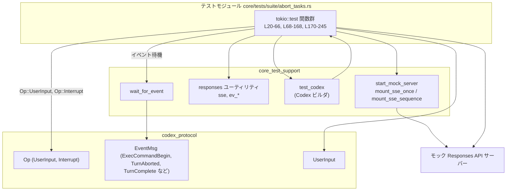
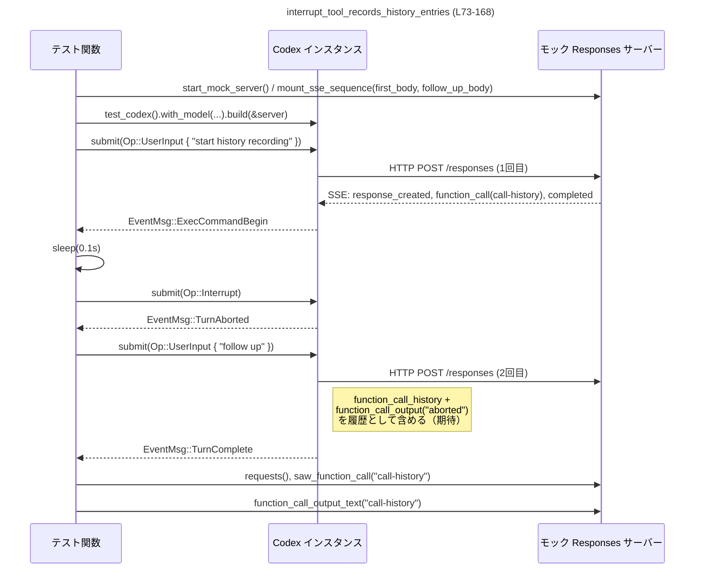

# core/tests/suite/abort_tasks.rs コード解説

## 0. ざっくり一言

長時間実行されるツール呼び出し（`shell_command`）を途中で中断したときに、  
Codex コアが **イベント** と **会話履歴（history）** をどのように記録・公開するかを検証する統合テスト群です。

---

## 1. このモジュールの役割

### 1.1 概要

このモジュールは、Codex コアが長時間ツール実行を中断 (`Interrupt`) されたときに、次の振る舞いをすることを検証します。

- 実行中断時に `EventMsg::TurnAborted` イベントを発行すること  
  （`interrupt_long_running_tool_emits_turn_aborted`、`L20-66`）。
- 中断されたツール呼び出しが、モデル向けリクエストの **function_call_output に `"aborted"` 情報** として記録されること  
  （`interrupt_tool_records_history_entries`、`L68-168`）。
- 中断されたターンを示す `<turn_aborted>` マーカーが、会話履歴として次回 `/responses` リクエストに含まれること  
  （`interrupt_persists_turn_aborted_marker_in_next_request`、`L170-245`）。

### 1.2 アーキテクチャ内での位置づけ

このテストモジュールは、以下のコンポーネント間の連携を検証します。

- **Codex コア**（具体的な型名はこのチャンクには登場しません）  
  - `test_codex().with_model(...).build(&server)` で生成（`L39-44`, `L95-100`, `L195-200`）。
- **mock Responses サーバー**  
  - `start_mock_server` と `mount_sse_once` / `mount_sse_sequence` でセットアップ（`L36-37`, `L92-93`, `L192-193`）。
- **protocol 型**  
  - `EventMsg`, `Op`, `UserInput`（`L5-7`, 利用は各テスト内）。
- **テストユーティリティ**  
  - `wait_for_event` によるイベント待機（`L60`, `L65`, `L114`, `L119`, `L133`, `L214`, `L219`, `L233`）。
  - `ev_function_call`, `ev_response_created`, `ev_completed`, `sse` による SSE レスポンス構築（`L31-34`, `L82-90`, `L181-190`）。

依存関係を簡略図にすると次のようになります。



> 注: `Codex` や `ResponseMock` の具体的な型名・実装は、このチャンクには現れません。

### 1.3 設計上のポイント

- **非同期 + マルチスレッド**  
  - すべてのテストが `#[tokio::test(flavor = "multi_thread", worker_threads = 2)]` を指定し、Tokio のマルチスレッドランタイム上で動作します（`L22`, `L72`, `L172`）。  
  - Codex 内部や mock サーバーの処理が別スレッドで進行してもテストが進むようにしています。
- **イベント駆動の同期**  
  - `wait_for_event` で `EventMsg::ExecCommandBegin` / `TurnAborted` / `TurnComplete` を待つことで、  
    非同期処理とのレースコンディションを避けています（例: `L59-60`, `L64-65`）。
- **共有状態の扱い**  
  - Codex インスタンスは `Arc` で共有しており（`L100`, `L200`）、複数の非同期タスクから安全に参照できる前提です。
- **SSE によるモック**  
  - `sse(ev_...)` で SSE ストリームの本文を組み立て、`mount_sse_once` / `mount_sse_sequence` で HTTP エンドポイントに取り付けています（`L31-37`, `L82-93`, `L181-193`）。
- **履歴の検証**  
  - mock サーバの `requests()`, `saw_function_call`, `function_call_output_text`, `message_input_texts` を通じて、  
    Codex が実際にどのような `/responses` リクエストを送ったかを検証しています（`L135-167`, `L235-245`）。

---

## 2. 主要な機能一覧

このファイルはテスト関数のみを定義していますが、それぞれが Codex の重要な振る舞いをカバーしています。

- `interrupt_long_running_tool_emits_turn_aborted`:  
  長時間実行ツールを中断すると `EventMsg::TurnAborted` が発行されることを検証（`L20-66`）。
- `interrupt_tool_records_history_entries`:  
  中断されたツール呼び出しが、次回の `/responses` リクエストに `"aborted"` な `function_call_output` として記録されることを検証（`L68-168`）。
- `interrupt_persists_turn_aborted_marker_in_next_request`:  
  中断されたターンを示す `<turn_aborted>` マーカーが、会話履歴として次回 `/responses` リクエストのユーザーメッセージに含まれることを検証（`L170-245`）。

### 2.1 コンポーネントインベントリー（本チャンク）

| 名称 | 種別 | 役割 / 用途 | 使用行 | 根拠 |
|------|------|-------------|--------|------|
| `interrupt_long_running_tool_emits_turn_aborted` | 非公開 async 関数（テスト） | 長時間ツール実行の中断で `TurnAborted` が出るか確認 | `L20-66` | 関数定義全体 |
| `interrupt_tool_records_history_entries` | 非公開 async 関数（テスト） | 中断されたツール呼び出しの履歴 (`function_call_output`) を検証 | `L68-168` | 関数定義全体 |
| `interrupt_persists_turn_aborted_marker_in_next_request` | 非公開 async 関数（テスト） | `<turn_aborted>` マーカーが履歴に残ることを検証 | `L170-245` | 関数定義全体 |
| `EventMsg` | 外部 enum（推定） | Codex からのイベント（`ExecCommandBegin`, `TurnAborted`, `TurnComplete` 等）を表現 | `L5`, `L60`, `L65`, `L114`, `L119`, `L133`, `L214`, `L219`, `L233` | `use codex_protocol::protocol::EventMsg;` 及び `matches!(ev, EventMsg::...)` |
| `Op` | 外部 enum（推定） | Codex への操作: `UserInput`, `Interrupt` を指定 | `L6`, `L48`, `L62`, `L103`, `L117`, `L122`, `L172`, `L203`, `L217`, `L222` | `use codex_protocol::protocol::Op;` と `Op::UserInput`, `Op::Interrupt` |
| `UserInput` | 外部型 | ユーザー入力（テキストなど）を表す | `L7`, `L49-52`, `L104-107`, `L123-126`, `L204-207`, `L223-226` | `use codex_protocol::user_input::UserInput;` と構築コード |
| `start_mock_server` | 外部 async 関数 | mock Responses サーバーを起動 | `L14`, `L36`, `L92`, `L192` | `use core_test_support::responses::start_mock_server;` と呼び出し |
| `mount_sse_once` | 外部 async 関数 | 単一 SSE ストリームをエンドポイントにマウント | `L11`, `L37` | `use ...::mount_sse_once;` と呼び出し |
| `mount_sse_sequence` | 外部 async 関数 | 複数 SSE ストリームのシーケンスをマウントし、`response_mock` を返す | `L12`, `L93`, `L193` | `use ...::mount_sse_sequence;` と `let response_mock = ...` |
| `sse` | 外部関数 | SSE イベントのベクタから HTTP ボディを生成 | `L13`, `L31`, `L82`, `L87`, `L181`, `L187` | `use ...::sse;` と呼び出し |
| `ev_function_call`, `ev_response_created`, `ev_completed` | 外部関数 | Responses SSE 用のイベントを生成（function call 開始、レスポンス開始/完了） | `L8-10`, `L31-34`, `L82-86`, `L87-90`, `L181-186`, `L187-190` | `use ...::responses::ev_*;` と呼び出し |
| `test_codex` | 外部関数 | Codex テスト用ビルダを返す | `L15`, `L39-44`, `L95-100`, `L195-200` | `use core_test_support::test_codex::test_codex;` とメソッドチェーン |
| `wait_for_event` | 外部 async 関数 | Codex からのイベントストリームから、指定条件を満たすイベントを待機 | `L16`, `L60`, `L65`, `L114`, `L119`, `L133`, `L214`, `L219`, `L233` | `use ...::wait_for_event;` と呼び出し |
| `Regex` | 外部型 | `function_call_output_text` の内容チェックに使用 | `L17`, `L149-151` | `use regex_lite::Regex;` と `Regex::new(...)` |
| `Arc` | `std::sync::Arc` | Codex インスタンスの共有（マルチスレッド環境を前提） | `L2`, `L100`, `L200` | `use std::sync::Arc;` と `Arc::clone(&fixture.codex)` |
| `Duration` | `std::time::Duration` | 中断までの待ち時間・経過時間測定に利用 | `L3`, `L116`, `L216` | `use std::time::Duration;` と `Duration::from_secs_f32(0.1)` |

---

## 3. 公開 API と詳細解説

このファイル自体はライブラリ API を公開しませんが、Codex の振る舞いを決める「契約」をテストとして明示しています。  
以下では各テスト関数が前提とする契約を整理します。

### 3.1 型一覧（このファイル内で新規定義されるもの）

このファイル内で新たに定義される構造体・列挙体はありません（テスト関数のみ定義されています）。

外部型（`EventMsg`, `Op`, `UserInput` など）は 2.1 のインベントリー表を参照してください。  
型定義自体はこのチャンクには現れないため、詳細なフィールド構成や全バリアントは不明です。

---

### 3.2 関数詳細

#### `interrupt_long_running_tool_emits_turn_aborted()`

**概要**

- モック SSE 経由で長時間実行される `shell_command` ツールを開始し、その途中で `Op::Interrupt` を送ると、  
  Codex が `EventMsg::TurnAborted` を発行することを検証する統合テストです（`core/tests/suite/abort_tasks.rs:L20-66`）。

**引数**

- なし（Tokio テストとしてフレームワークから呼び出される）。

**戻り値**

- `()`（暗黙）。  
  - すべての `unwrap` / `assert!` が通ればテスト成功、panic すればテスト失敗となります。

**内部処理の流れ**

1. **ツール呼び出し引数の構築**  
   - `command = "sleep 60"` を設定（`L24`）。  
   - `json!` マクロで `{"command": "sleep 60", "timeout_ms": 60000}` を作り、文字列化（`L26-30`）。
2. **SSE ボディの準備**  
   - `sse` に `ev_function_call("call_sleep", "shell_command", &args)` と `ev_completed("done")` を渡して SSE ストリーム本文を構築（`L31-34`）。  
     ここで、Responses サーバーは「`shell_command` ツールを呼び出す function_call → 完了」という流れを模倣します。
3. **モックサーバーと Codex の起動**  
   - `start_mock_server().await` で mock Responses サーバーを起動（`L36`）。  
   - `mount_sse_once(&server, body).await` で、次の `/responses` リクエストに対して上記 SSE を返すよう設定（`L37`）。  
   - `test_codex().with_model("gpt-5.1").build(&server).await.unwrap().codex` で Codex インスタンスを取得（`L39-44`）。
4. **ユーザー入力の送信**  
   - `Op::UserInput` を `codex.submit` で送信し（`L47-55`）、SSE の function_call がトリガーされるようにします。  
   - `await.unwrap()` して送信が成功することを前提とします（`L56-57`）。
5. **実行開始イベントの待機**  
   - `wait_for_event(&codex, |ev| matches!(ev, EventMsg::ExecCommandBegin(_))).await;` で、  
     実行開始イベント（ExecCommandBegin）が発行されるまで待機（`L59-60`）。
6. **中断と中断完了イベントの検証**  
   - `codex.submit(Op::Interrupt).await.unwrap();` で中断要求を送る（`L62`）。  
   - `wait_for_event(&codex, |ev| matches!(ev, EventMsg::TurnAborted(_))).await;` で、中断されたことを示すイベントを待機（`L64-65`）。

**Examples（使用例）**

このテスト関数自体が、「長時間ツールを中断したときの基本テストパターン」の見本になっています。  
他のツールでも同様の流れでテストできます。

```rust
// 別の長時間実行ツール "my_long_tool" を中断する例（概略）
// 実際には core_test_support 側で対応する ev_function_call を用意する必要があります。

#[tokio::test(flavor = "multi_thread", worker_threads = 2)]
async fn interrupt_my_long_tool_emits_turn_aborted() {
    let args = json!({ "some_param": "value" }).to_string();
    let body = sse(vec![
        ev_function_call("call_my_long_tool", "my_long_tool", &args),
        ev_completed("done"),
    ]);

    let server = start_mock_server().await;
    mount_sse_once(&server, body).await;

    let codex = test_codex().with_model("gpt-5.1").build(&server).await.unwrap().codex;

    codex
        .submit(Op::UserInput { /* ... */ })
        .await
        .unwrap();

    wait_for_event(&codex, |ev| matches!(ev, EventMsg::ExecCommandBegin(_))).await;

    codex.submit(Op::Interrupt).await.unwrap();

    wait_for_event(&codex, |ev| matches!(ev, EventMsg::TurnAborted(_))).await;
}
```

**Errors / Panics**

- `build(&server).await.unwrap()`（`L39-44`）  
  - Codex の初期化に失敗した場合は panic します。
- `codex.submit(...).await.unwrap()`（`L47-57`, `L62`）  
  - 送信がエラーを返した場合は panic します。
- `wait_for_event` の実装詳細はこのチャンクにはありませんが、  
  - タイムアウトを持たない場合、想定イベントが来なければテストがハングする可能性があります。  
  - ただし、それが意図されているかどうかはこのファイルからは分かりません。

**Edge cases（エッジケース）**

- **ExecCommandBegin が発生しない**  
  - `wait_for_event(...ExecCommandBegin...)` が完了しない可能性があります（`L59-60`）。  
  - 実際の挙動は `wait_for_event` の実装に依存し、このチャンクには現れません。
- **TurnAborted が発生しない**  
  - 同様に `TurnAborted` を待つ `wait_for_event`（`L64-65`）が完了しないか、  
    別種のイベントのみが来る場合、テストは失敗またはハングします。

**使用上の注意点**

- このテストは **イベント順序の契約** を前提にしています。  
  - `ExecCommandBegin` → `Interrupt` → `TurnAborted` という順序が守られていること（`L59-65`）。  
- `test_codex` と mock Responses サーバーの組み合わせが、実際の運用環境と十分に近いことが前提です。  
- マルチスレッドランタイムで実行されるため、`codex` の内部は `Send + Sync` を満たす必要があります（`Arc` 利用のため、`L2`, `L100`）。

---

#### `interrupt_tool_records_history_entries()`

**概要**

- 中断されたツール呼び出しが、次回の `/responses` リクエストのメッセージ履歴として  
  「元の function call」と `"aborted"` を含む `function_call_output` を持つことを検証するテストです（`L68-168`）。

**引数**

- なし。

**戻り値**

- `()`（テストとして使用）。

**内部処理の流れ（アルゴリズム）**

1. **SSE ストリームの準備**（`L74-90`）
   - 共通の `command = "sleep 60"` と `call_id = "call-history"` を設定（`L74-75`）。
   - `args` を JSON 文字列として用意（`L77-81`）。
   - `first_body`（1 回目の `/responses` 用）  
     - `ev_response_created("resp-history")`（レスポンス開始）  
     - `ev_function_call(call_id, "shell_command", &args)`（ツール呼び出し）  
     - `ev_completed("resp-history")`（レスポンス完了）（`L82-86`）。
   - `follow_up_body`（2 回目の `/responses` 用）  
     - 追加 function call のない単純なレスポンス（`L87-90`）。
2. **モックサーバーと Codex 初期化**（`L92-101`）
   - `start_mock_server().await` でサーバー起動（`L92`）。
   - `mount_sse_sequence(&server, vec![first_body, follow_up_body]).await` で  
     1 回目と 2 回目の SSE を順次返す mock を構成し、`response_mock` を取得（`L93`）。
   - `test_codex().with_model("gpt-5.1").build(&server)` で Codex を準備し、`Arc::clone` で共有参照を作る（`L95-100`）。
3. **1 回目のユーザー入力 → ツール実行開始 → 中断**（`L102-119`）
   - `Op::UserInput` を送信し、「history recording」を開始（`L102-112`）。  
   - `wait_for_event(...ExecCommandBegin...)` でツール実行開始を待機（`L114`）。  
   - `tokio::time::sleep(Duration::from_secs_f32(0.1)).await;` で 0.1 秒待ち（`L116`）。  
     - これにより、ツールの実行時間が 0.1 秒以上になることを期待します。  
   - `codex.submit(Op::Interrupt).await.unwrap();` で中断（`L117`）。  
   - `wait_for_event(...TurnAborted...)` で中断完了イベントを待機（`L119`）。
4. **2 回目のユーザー入力 → 通常ターン完了**（`L121-133`）
   - `Op::UserInput` で `"follow up"` を送信（`L121-131`）。  
   - `wait_for_event(...TurnComplete...)` でターン完了を待機（`L133`）。
5. **mock Responses へのリクエスト解析**（`L135-167`）
   - `response_mock.requests()` で `/responses` リクエスト一覧を取得し、2 回送信されたことを確認（`L135-140`）。  
   - `response_mock.saw_function_call(call_id)` で、`call-history` ID の function call が送信 payload に含まれていることを確認（`L142-145`）。  
   - `response_mock.function_call_output_text(call_id)` で、その function call の `function_call_output` テキストを取得（`L146-148`）。  
   - `Regex` で `"^Wall time: ([0-9]+(?:\.[0-9])?) seconds\naborted by user$"` パターンをコンパイルし（`L149-150`）、  
     `captures` によって経過秒数を抽出（`L151-163`）。  
   - 抽出した秒数 `secs` が `>= 0.1` であることを `assert!` で確認（`L157-167`）。

**Examples（使用例）**

このテストは、「中断されたツール呼び出し履歴を Responses に流し込む」処理の契約を示しています。  
別のツール ID を使ったテストの例は次のようになります（概略）。

```rust
// 別の call_id を使って、中断履歴の記録を検証する例（概略）
// 実装パターンは interrupt_tool_records_history_entries と同様です。

async fn assert_aborted_tool_is_recorded(call_id: &str) {
    // first_body / follow_up_body の構築は call_id だけ変える
    let args = json!({ "command": "sleep 60", "timeout_ms": 60_000 }).to_string();
    let first_body = sse(vec![
        ev_response_created("resp-1"),
        ev_function_call(call_id, "shell_command", &args),
        ev_completed("resp-1"),
    ]);
    let follow_up_body = sse(vec![
        ev_response_created("resp-2"),
        ev_completed("resp-2"),
    ]);

    let server = start_mock_server().await;
    let response_mock = mount_sse_sequence(&server, vec![first_body, follow_up_body]).await;
    let fixture = test_codex().with_model("gpt-5.1").build(&server).await.unwrap();
    let codex = Arc::clone(&fixture.codex);

    // ...（ユーザー入力 → ExecCommandBegin 待機 → Interrupt → TurnAborted → follow up → TurnComplete）

    // 最後に response_mock から function_call_output_text(call_id) を取得し、
    // "aborted by user" を含むことを検証する。
}
```

**Errors / Panics**

- `unwrap()` 系（`L95-99`, `L102-112`, `L117`, `L121-131`, `L146-148`, `L149-150`, `L157-163`）は、  
  - Codex 初期化失敗、`submit` エラー、function_call_output が存在しない、  
    正規表現コンパイルエラー、文字列のパースエラーなどで panic します。
- `response_mock.requests()` の戻り値長さが 2 でない場合に `assert!` が失敗（`L135-140`）。
- 正規表現にマッチしない場合に `assert_matches!` が失敗（`L151-156`）。

**Edge cases（エッジケース）**

- **`function_call_output_text(call_id)` が `None` を返す**  
  - `expect("missing function_call_output text")` により panic（`L146-148`）。  
  - これは「中断されたツール呼び出しが履歴に残らない」というバグを検出する狙いと考えられます。
- **出力書式の変更**  
  - `"Wall time: ... seconds\naborted by user"` 以外のフォーマットになった場合、  
    `Regex` がマッチせず `assert_matches!` が失敗（`L149-156`）。
- **経過秒数が非常に短い**  
  - `secs >= 0.1` という下限チェックにより、  
    実装が「即時に aborted とみなす」などに変わるとテストが落ちます（`L157-167`）。

**使用上の注意点**

- このテストは **書式 & テキスト内容に強く依存** します。  
  - `function_call_output` の文言や改行位置を変えるとテストが壊れます（`L149-150`）。
- 実時間ベースの条件（0.1 秒以上）を使っているため、  
  - CI 環境など非常に遅い / 早い環境でのタイミング依存のフレーク（不安定なテスト）になる可能性があります。  
  - ただし、`sleep(0.1)`→「最低 0.1 秒」チェックという範囲であり、多少の遅延には比較的強い設計です。
- `response_mock` の実装はこのチャンクには現れませんが、  
  - 並行に複数テストが同じ mock サーバーを使うような状況では、  
    リクエスト収集がテスト間で混ざらないような設計が必要です（ここではテストごとに `start_mock_server()` を呼んでいるため、互いに独立という前提です、`L92`, `L192`）。

---

#### `interrupt_persists_turn_aborted_marker_in_next_request()`

**概要**

- 中断されたターンが「モデル可視な `<turn_aborted>` マーカー」として会話履歴に保存され、  
  次回の `/responses` リクエストのユーザーメッセージに含まれることを検証するテストです（`L170-245`）。

**引数**

- なし。

**戻り値**

- `()`。

**内部処理の流れ**

全体の構造は `interrupt_tool_records_history_entries`（`L68-168`）とほぼ同じで、`call_id` とアサーション内容だけが異なります。

1. **SSE ストリーム設定**（`L174-190`）
   - `command = "sleep 60"`, `call_id = "call-turn-aborted-marker"`（`L174-175`）。
   - `args` 構築（`L177-181`）。
   - `first_body` と `follow_up_body` を構築（`L182-190`）。構造は前テストと同じ。
2. **mock サーバーと Codex 準備**（`L192-200`）
   - `start_mock_server`, `mount_sse_sequence`, `test_codex`, `Arc::clone` の流れも同じ（`L192-200`）。
3. **1 回目の入力 → ExecCommandBegin → Interrupt → TurnAborted**（`L202-219`）
   - `"start interrupt marker"` というユーザー入力を送信（`L202-212`）。  
   - `ExecCommandBegin` を待機（`L214`）。  
   - `sleep(0.1)` → `Interrupt` → `TurnAborted`（`L216-219`）。
4. **2 回目の入力 → TurnComplete**（`L221-233`）
   - `"follow up"` を送信（`L221-231`）。  
   - `TurnComplete` を待機（`L233`）。
5. **`<turn_aborted>` マーカーの検証**（`L235-245`）
   - `response_mock.requests()` の長さが 2 であることを確認（`L235-236`）。  
   - 2 番目のリクエスト `follow_up_request` を取り出し（`L238`）、  
     `follow_up_request.message_input_texts("user")` でユーザーメッセージのテキスト一覧を取得（`L239`）。  
   - その中に `<turn_aborted>` を含むテキストがあることを `any(|text| text.contains("<turn_aborted>"))` で検証（`L240-245`）。

**Examples（使用例）**

`<turn_aborted>` に限らず、任意の「内部イベント用マーカー」を会話履歴に載せたい場合の検証方法として使えます。

```rust
// 特定のマーカー "<some_internal_marker>" が user メッセージに含まれることを検証するイメージ
fn assert_marker_in_followup(requests: &[RequestType], marker: &str) {
    let follow_up_request = &requests[1];
    let user_texts = follow_up_request.message_input_texts("user");
    assert!(
        user_texts.iter().any(|text| text.contains(marker)),
        "expected {marker} marker in follow-up request"
    );
}
```

※ `RequestType` や `message_input_texts` の実際の型名/定義はこのチャンクには現れません。

**Errors / Panics**

- `assert_eq!(requests.len(), 2, ...)` が失敗するとテスト失敗（`L235-236`）。
- `<turn_aborted>` を含むテキストがない場合、`assert!(...any(...))` が失敗（`L240-245`）。
- それ以外の `unwrap()` は Codex 初期化・`submit` エラーなどに対して panic します（`L195-199`, `L202-212`, `L221-231`）。

**Edge cases（エッジケース）**

- **2 回目のリクエストがない / 別の順序**  
  - `requests[1]` を参照する前に `requests.len() == 2` でチェックしているため、  
    リクエスト数が 2 未満の場合は `assert_eq!` で早期に検出されます（`L235-238`）。
- **マーカーの挿入位置**  
  - テストは「user ロールのテキストのどこかに `<turn_aborted>` が含まれる」ことだけを検証しており、  
    具体的な位置や前後の内容は問わないため、ある程度のフォーマット変更に耐性があります（`L239-245`）。

**使用上の注意点**

- `<turn_aborted>` という文字列が **API/プロトコル上の契約** の一部になっている前提です。  
  - 別のマーカー名に変更する場合、このテストも更新が必要です。
- 会話履歴のフォーマットが大きく変わる（例: システムメッセージに移動するなど）と、  
  - `message_input_texts("user")` を使った検証ロジック自体を見直す必要があります（`L239-243`）。

---

### 3.3 その他の関数（外部ユーティリティの利用）

このファイル内で新たに定義された補助関数はありませんが、テストは多くの外部ユーティリティに依存しています。

| 関数 / メソッド | 所在（モジュール） | 役割（1 行） | 使用行 |
|----------------|---------------------|--------------|--------|
| `start_mock_server()` | `core_test_support::responses` | mock Responses サーバーを起動してハンドルを返す | `L36`, `L92`, `L192` |
| `mount_sse_once(&server, body)` | 同上 | 次の 1 回の `/responses` リクエストに対して `body` を SSE として返す | `L37` |
| `mount_sse_sequence(&server, bodies)` | 同上 | 複数回の `/responses` リクエストに順次 `bodies` を返し，リクエスト履歴を観測できるモックを返す | `L93`, `L193` |
| `sse(events)` | 同上 | SSE イベント列（`ev_*`）から文字列ボディを組み立てる | `L31`, `L82`, `L87`, `L181`, `L187` |
| `ev_function_call(id, tool, args)` | 同上 | Responses SSE でツール function call を表すイベントを生成 | `L32`, `L84`, `L184` |
| `ev_response_created(id)` | 同上 | 新しい Responses レスポンスが開始されたことを表すイベントを生成 | `L83`, `L182`, `L188` |
| `ev_completed(id)` | 同上 | Responses レスポンス完了を表すイベントを生成 | `L33`, `L85`, `L89`, `L185`, `L189` |
| `test_codex()` | `core_test_support::test_codex` | Codex インスタンス構築用のビルダを返す | `L39`, `L95`, `L195` |
| `wait_for_event(&codex, predicate)` | `core_test_support` | Codex のイベントストリームから predicate を満たすイベントが来るまで待機 | `L60`, `L65`, `L114`, `L119`, `L133`, `L214`, `L219`, `L233` |
| `requests()` | `mount_sse_sequence` の戻り値型 | 受信した `/responses` リクエストの一覧を返す | `L135`, `L235` |
| `saw_function_call(call_id)` | 同上 | いずれかのリクエストに指定 ID の function call が含まれていたかを返す | `L142` |
| `function_call_output_text(call_id)` | 同上 | 指定 ID の function call の出力テキストを取得する | `L146` |
| `message_input_texts("user")` | 同上 | 指定ロール（ここでは `"user"`）のメッセージテキスト一覧を取得 | `L239` |

内部実装はこのチャンクには現れないため、振る舞いは呼び出し側の使い方から推測しています。

---

## 4. データフロー

ここでは、最も複雑な `interrupt_tool_records_history_entries`（`L68-168`）のデータフローを説明します。

### 4.1 処理の要点（文章）

1. テストは mock Responses サーバーに **2 本の SSE ストリーム**（1 回目・2 回目）を登録します（`L82-90`, `L92-93`）。
2. Codex に 1 回目の `UserInput` を送ると、Codex は `/responses` にリクエストを送り、  
   SSE を消費する中で `shell_command` function call を実行しようとします。
3. Codex が `ExecCommandBegin` イベントを発行したあと、テストは少し待ってから `Interrupt` を送ります（`L114-117`）。  
   Codex はツールを中断し、`TurnAborted` イベントを発行します（`L119`）。
4. テストが 2 回目の `UserInput` を送ると、Codex は再び `/responses` にリクエストを送り、  
   今度は「元の function call」と `"aborted by user"` を含む `function_call_output` を履歴として含めます。
5. テストは mock サーバー側で 2 回のリクエストと、その内容（function call と output）を検証します（`L135-167`）。

### 4.2 シーケンス図



> `/responses` エンドポイント名は、コメント `next \`/responses\` request`（`L171`）から読み取れます。

---

## 5. 使い方（How to Use）

このファイル自体はテストですが、**Codex の「中断」機能をどう扱うか** を示す実用的な例になっています。

### 5.1 基本的な使用方法（Codex + Interrupt）

1. **Codex と mock Responses サーバーの初期化**  
   - `start_mock_server` → `mount_sse_*` → `test_codex().build(&server)`（`L36-44`, `L92-100`, `L192-200`）。
2. **`Op::UserInput` でユーザーターンを開始**  
   - `submit(Op::UserInput { ... }).await.unwrap();`（`L47-57`, `L102-112`, `L202-212`）。
3. **`wait_for_event` でツール実行開始を検知**  
   - `EventMsg::ExecCommandBegin` を待ってから `Interrupt` を送る（`L59-60`, `L114`, `L214`）。
4. **`Op::Interrupt` で実行を中断**  
   - `codex.submit(Op::Interrupt).await.unwrap();`（`L62`, `L117`, `L217`）。
5. **`EventMsg::TurnAborted` を確認し、必要なら続くターンを送信**  
   - `wait_for_event(...TurnAborted...)` → `submit(Op::UserInput { "follow up" })`（`L64-65`, `L119`, `L219`, `L121-131`, `L221-231`）。

Rust コードの最小イメージは次の通りです（テストでなくアプリケーションから使う場合の概略）。

```rust
// テスト支援ではなく実コードでの利用イメージ（概略）
// 実際の型名やモジュールパスはこのチャンクには現れません。

async fn run_and_maybe_interrupt(codex: Arc<CodexType>) -> Result<(), SomeError> {
    // 1. ユーザーからの入力を送る
    codex.submit(Op::UserInput {
        items: vec![UserInput::Text {
            text: "start long task".into(),
            text_elements: Vec::new(),
        }],
        final_output_json_schema: None,
        responsesapi_client_metadata: None,
    }).await?;

    // 2. 実行開始を待つ（wait_for_event 相当の処理）
    wait_for_event(&codex, |ev| matches!(ev, EventMsg::ExecCommandBegin(_))).await;

    // 3. 何らかの条件で中断
    codex.submit(Op::Interrupt).await?;

    // 4. 中断完了を確認
    wait_for_event(&codex, |ev| matches!(ev, EventMsg::TurnAborted(_))).await;

    Ok(())
}
```

※ `CodexType`, `SomeError` はこのチャンクには現れない仮の型名です。

### 5.2 よくある使用パターン

- **「長時間ツールをユーザー操作でキャンセル」する UI の裏側ロジック**  
  - `ExecCommandBegin` 受信後、ユーザーがキャンセルボタンを押したら `Op::Interrupt` を送る（テストと同じ流れ）。
- **「中断済み function call を履歴に残す」サーバーサイドロジック**  
  - このテストが確認しているように、いったん中断したあとも次のモデル呼び出しには  
    「呼び出されたが中断されたツール」の情報を含める設計になっている前提で、  
    フロントエンド側は `<turn_aborted>` などのマーカーを UI 表示に利用できます。

### 5.3 よくある間違い（テスト観点）

```rust
// 誤り例: ExecCommandBegin を待たずにすぐ Interrupt を送る
codex.submit(Op::UserInput { /* ... */ }).await.unwrap();
codex.submit(Op::Interrupt).await.unwrap(); // ツール実行が始まる前かもしれない

// 正しい例: ExecCommandBegin イベントを確認してから Interrupt
codex.submit(Op::UserInput { /* ... */ }).await.unwrap();
wait_for_event(&codex, |ev| matches!(ev, EventMsg::ExecCommandBegin(_))).await;
codex.submit(Op::Interrupt).await.unwrap();
```

このファイルのテストはすべて **実行開始を確認してから中断** しており（`L59-60`, `L114`, `L214`）、  
レースコンディションを避ける設計になっています。

### 5.4 使用上の注意点（まとめ）

- **イベント順序に依存**  
  - 実装がイベントの順序や種類を変えると、このテスト群は敏感に失敗します。
- **実時間に依存するアサーション**  
  - `Duration::from_secs_f32(0.1)` と `secs >= 0.1` の組み合わせ（`L116`, `L157-167`）は、  
    非常に遅い／速い環境でテストが不安定になる可能性があります。
- **プロトコル文字列に依存**  
  - `"aborted by user"` や `<turn_aborted>` などの文字列は API 契約の一部として扱われており、  
    変更時にはテストも更新する必要があります（`L149-150`, `L240-245`）。

---

## 6. 変更の仕方（How to Modify）

### 6.1 新しいシナリオを追加する場合

例: 「複数のツール呼び出しがあるターンを中断したときの挙動」をテストしたい場合。

1. **SSE ストリームの組み立て**  
   - `first_body` に複数の `ev_function_call` を含める（`L82-86`, `L182-186` が参考）。
2. **モックサーバー + Codex 準備**  
   - 既存の `start_mock_server` → `mount_sse_sequence` → `test_codex().build` パターンを再利用（`L92-100`）。
3. **イベント待機 + Interrupt**  
   - どの段階で中断するかに応じて `wait_for_event` の predicate を調整（`ExecCommandBegin` だけでなく他のイベントも条件にできるはずですが、このチャンクには詳細がありません）。
4. **履歴検証**  
   - `response_mock.requests()` と `function_call_output_text` / `message_input_texts` を組み合わせて、  
     期待する履歴構造を検証します（`L135-167`, `L235-245`）。

### 6.2 既存テストの変更時に注意すべき点

- **プロトコル契約の変更**  
  - `/responses` のペイロード形式、`function_call_output` の書式、  
    `<turn_aborted>` マーカーの位置などを変更するときは、  
    このテストファイルが想定している契約を必ず見直す必要があります。
- **タイミング・待機ロジックの変更**  
  - `wait_for_event` のタイムアウトや挙動を変えると、  
    「いつイベントが来ることを期待しているか」が変わり、テストの書き換えが必要になる可能性があります。
- **並行実行の影響**  
  - 他のテストと mock サーバーを共有するような変更を行う場合、  
    `start_mock_server()` をテストごとに呼んでいる前提（`L36`, `L92`, `L192`）が崩れないように注意する必要があります。

---

## 7. 関連ファイル / モジュール

このモジュールは多くのテスト支援モジュールに依存しています。パスはモジュールパスで表記します。

| モジュールパス | 役割 / 関係 |
|----------------|------------|
| `core_test_support::responses` | mock Responses サーバーと SSE イベント生成ユーティリティを提供（`start_mock_server`, `mount_sse_once`, `mount_sse_sequence`, `sse`, `ev_*` を定義、`L8-14`, `L31-37`, `L82-93`, `L181-193`） |
| `core_test_support::test_codex` | Codex インスタンスのテスト用ビルダ `test_codex` を提供し、mock Responses サーバーと接続してくれる（`L15`, `L39-44`, `L95-100`, `L195-200`） |
| `core_test_support`（ルート） | `wait_for_event` を提供し、Codex のイベントストリーム監視を抽象化（`L16`, `L60`, `L65`, `L114`, `L119`, `L133`, `L214`, `L219`, `L233`） |
| `codex_protocol::protocol` | Codex の操作用 enum `Op` とイベント用 enum `EventMsg` を定義（`L5-6`）。テストはここで定義されるイベントと操作の契約を検証している |
| `codex_protocol::user_input` | `UserInput` 型を定義し、ユーザー入力のフォーマットを表現（`L7`, `L49-52`, `L104-107`, `L123-126`, `L204-207`, `L223-226`） |
| `regex_lite` | `Regex` による文字列パターンマッチ機能を提供し、中断メッセージの書式検証に使用（`L17`, `L149-151`） |

---

## Bugs / Security 観点（このファイルから読み取れる範囲）

- **潜在的なテストフレーク要因**  
  - 実時間依存 (`sleep(0.1)` + `secs >= 0.1`) により、極端なスケジューリング遅延がある環境ではテストが不安定になる可能性があります（`L116`, `L157-167`）。
- **ハングの可能性**  
  - `wait_for_event` がタイムアウトを持たない実装であれば、  
    想定イベントが来ない場合にテストがハングする可能性があります（`L59-60`, `L64-65`, `L114`, `L119`, `L133`, `L214`, `L219`, `L233`）。  
    実装がどうなっているかは、このチャンクには現れません。
- **Security の観点**  
  - このファイルは完全にテスト用であり、外部からの入力は固定文字列 (`"start sleep"`, `"follow up"` など) のみです。  
    セキュリティ上のリスクとなる直接的な入力処理はこのチャンクには見当たりません。  
  - `shell_command` ツール自体が OS コマンドを実行する可能性はありますが、ここでは mock Responses サーバー上の SSE で模倣しているだけであり、実際に `sleep 60` が OS に対して実行されるかどうかはこのチャンクからは分かりません。

この範囲で、明確なバグや脆弱性は確認できませんが、上記のようなテスト安定性・ハングのリスクには注意が必要です。
