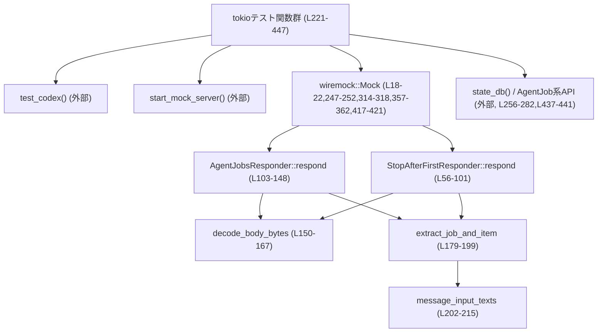
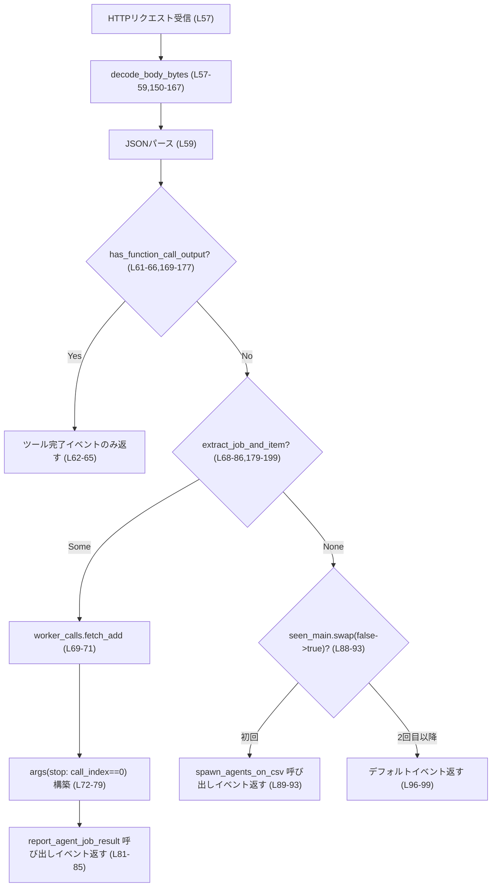
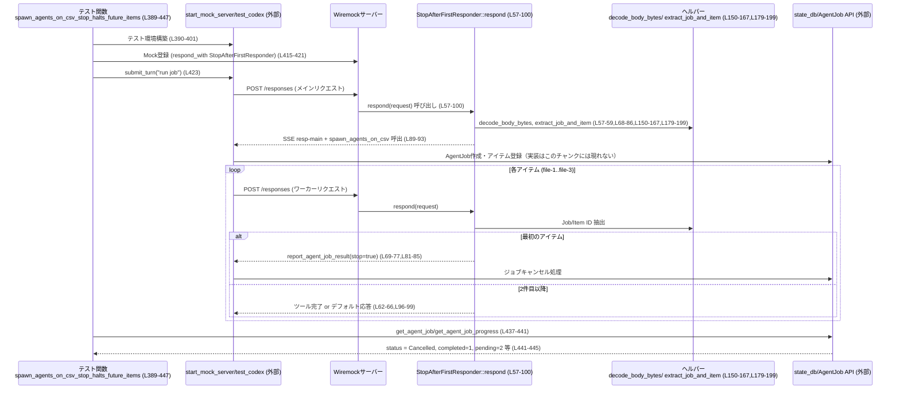

このファイルは、エージェントジョブ機能（`spawn_agents_on_csv` と `report_agent_job_result` など）の振る舞いを E2E に近い形で検証するテストと、そのための HTTP モックレスポンダを定義しています（`core/tests/suite/agent_jobs.rs`）。

---

## 0. ざっくり一言

- CSV から「エージェントジョブ」を起動し、ワーカーからの結果報告やキャンセル処理が正しく行われるかを、Wiremock ベースのモックサーバーを使って検証するテスト群です（`core/tests/suite/agent_jobs.rs:L221-447`）。
- LLM へのプロンプト（`input` や `instructions`）から Job ID / Item ID を抽出し、SSE でツール呼び出しイベントを返すレスポンダが含まれます（`core/tests/suite/agent_jobs.rs:L40-148,L169-215`）。

---

## 1. このモジュールの役割

### 1.1 概要

このテストモジュールは、次の問題を検証対象としています。

- CSV を基に複数アイテムのエージェントジョブを起動する `spawn_agents_on_csv` の挙動  
  - 結果の CSV 出力内容（列/JSON フォーマットなど）（`L287-327`）  
  - 重複する item_id の払い出し（`L329-385`）  
  - ジョブの「停止（stop）」指示によるキャンセル状態と進捗（`L388-447`）
- `report_agent_job_item_result` が、間違ったスレッド ID からの報告を拒否すること（`L221-285`）

これらを、Wiremock の `Respond` 実装を使ったモック HTTP サーバーでシミュレーションしています（`L18-22,L40-101,L103-148,L221-252`）。

### 1.2 アーキテクチャ内での位置づけ

このファイルは「テストコード」であり、本体ロジック（`spawn_agents_on_csv` や DB 操作）は他モジュールにあります（このチャンクには実装は現れません）。依存関係を簡略化すると次のようになります。



※ `test_codex`, `start_mock_server`, `state_db`, `spawn_agents_on_csv`, `report_agent_job_result` などの実体は他ファイルにあり、このチャンクには現れません。

### 1.3 設計上のポイント

コードから読み取れる特徴は次のとおりです。

- **モックレスポンダの状態管理に Atomic を使用**  
  - `seen_main: AtomicBool` により、「メイン呼び出し（spawn_agents_on_csv の起動）」用レスポンスを 1 回だけ返し、それ以降はワーカー用またはデフォルトのレスポンスを返す制御を行います（`L24-28,L40-44,L88-99,L135-146`）。  
  - `call_counter: AtomicUsize` や共有の `worker_calls: Arc<AtomicUsize>` で、ワーカー呼び出しの回数をスレッドセーフにカウントします（`L27,L43,L69-71,L415-416,L445-446`）。
- **HTTP ボディの zstd 対応デコード**  
  - `decode_body_bytes` で `content-encoding: zstd` の場合にのみ解凍し、失敗時は元のボディを返すフォールバック設計になっています（`L150-167`）。
- **LLM 風 JSON からの情報抽出ユーティリティ**  
  - `has_function_call_output`, `message_input_texts`, `extract_job_and_item` で、モデル入出力風の JSON 構造からイベント種別やテキスト・Job/Item ID を抽出します（`L169-199,L202-215`）。
- **非同期かつマルチスレッドなテスト**  
  - 全テストに `#[tokio::test(flavor = "multi_thread", worker_threads = 2)]` が指定されており（`L221,L287,L329,L388`）、モックレスポンダが複数スレッドから同時に呼ばれても安全に動作することが前提です（Atomic を使用）。

---

## 2. 主要な機能一覧

このモジュールが提供する主な「機能（テストシナリオ／ユーティリティ）」は次のとおりです。

- モックレスポンダ:
  - `AgentJobsResponder`:  
    - 最初のリクエストに対して `spawn_agents_on_csv` ツール呼び出しイベントを返し、その後のリクエストではジョブ・アイテムごとの `report_agent_job_result` 呼び出しをシミュレートします（`L24-28,L30-38,L103-148`）。
  - `StopAfterFirstResponder`:  
    - 最初のワーカー呼び出しで `stop: true` を返し、それ以降の処理がキャンセルされることを検証するためのレスポンダです（`L40-44,L46-54,L56-101,L69-77`）。
- ユーティリティ関数:
  - `decode_body_bytes`: HTTP リクエストボディを `content-encoding: zstd` を考慮してデコードします（`L150-167`）。
  - `has_function_call_output`: JSON ボディの `input` 配列に `function_call_output` 型のアイテムが含まれるかを判定します（`L169-177`）。
  - `extract_job_and_item`: LLM へのプロンプトテキストから Job ID / Item ID を抽出します（`L179-199`）。
  - `message_input_texts`: JSON ボディの message 型 input からテキストスパンを取り出します（`L202-215`）。
  - `parse_simple_csv_line`: シンプルなカンマ区切り行を分割してベクタにします（`L217-218`）。
- テストシナリオ:
  - `report_agent_job_result_rejects_wrong_thread`:  
    - 間違ったスレッド ID からの `report_agent_job_item_result` 呼び出しが拒否されることを確認します（`L221-285`）。
  - `spawn_agents_on_csv_runs_and_exports`:  
    - CSV 入力からジョブを起動し、結果 CSV に必要な列が出力されることを確認します（`L287-327`）。
  - `spawn_agents_on_csv_dedupes_item_ids`:  
    - 入力 CSV の ID 列が重複している場合、`item_id` が一意になるようにサフィックス付与されることを確認します（`L329-385`）。
  - `spawn_agents_on_csv_stop_halts_future_items`:  
    - ワーカーが `stop: true` を返したとき、ジョブがキャンセル状態となり、進捗が期待通りになることを確認します（`L388-447`）。

---

## 3. コンポーネントと公開 API 詳細

### 3.1 型一覧（構造体）

| 名前 | 種別 | 定義行 | 役割 / 用途 |
|------|------|--------|-------------|
| `AgentJobsResponder` | 構造体 | `agent_jobs.rs:L24-28` | Wiremock 用 `Respond` 実装の一部。`spawn_agents_on_csv` の起動と、その後の `report_agent_job_result` 呼び出しをシミュレートします。フィールドで初期引数 JSON と状態（メイン呼び出し済みか／ワーカー呼び出し回数）を保持します（`L24-28,L30-38,L103-148`）。 |
| `StopAfterFirstResponder` | 構造体 | `agent_jobs.rs:L40-44` | Wiremock 用 `Respond` 実装。最初のワーカー呼び出しで `stop: true` を返し、以降は通常動作させることで、ジョブキャンセル処理をテストします（`L40-44,L46-54,L56-101`）。 |

### 3.1 関数・メソッド インベントリー

| 名前 | 種別 | 行範囲 | 役割 / 備考 |
|------|------|--------|-------------|
| `AgentJobsResponder::new` | 関連関数 | `agent_jobs.rs:L31-37` | `AgentJobsResponder` を初期化。`seen_main = false`, `call_counter = 0` に設定し、`spawn_args_json` を保持します。 |
| `StopAfterFirstResponder::new` | 関連関数 | `agent_jobs.rs:L47-53` | `StopAfterFirstResponder` を初期化。`seen_main = false` と外部から渡された `worker_calls` カウンタを保持します。 |
| `StopAfterFirstResponder::respond` | トレイトメソッド (`Respond`) | `agent_jobs.rs:L57-100` | Wiremock からの HTTP リクエストに応じて SSE 応答を生成。ツール応答の完了・ワーカー呼び出し・メイン呼び出し・デフォルト応答を条件に応じて返します。 |
| `AgentJobsResponder::respond` | トレイトメソッド (`Respond`) | `agent_jobs.rs:L104-147` | `StopAfterFirstResponder` と同様だが、「stop フラグ」を扱わないシンプル版。全アイテムに対して `report_agent_job_result` を返します。 |
| `decode_body_bytes` | 関数 | `agent_jobs.rs:L150-167` | `content-encoding` ヘッダを見て zstd 圧縮を解凍し、解凍失敗時は元ボディを返します。 |
| `has_function_call_output` | 関数 | `agent_jobs.rs:L169-177` | JSON の `input` 配列に `type == "function_call_output"` な要素があるかを判定します。 |
| `extract_job_and_item` | 関数 | `agent_jobs.rs:L179-199` | `message_input_texts` と `instructions` を連結し、その中の Job ID / Item ID を正規表現で抽出します。 |
| `message_input_texts` | 関数 | `agent_jobs.rs:L202-215` | JSON の `input` のうち、`type == "message"` → `content` → `type == "input_text"` な `text` を全て収集して返します。 |
| `parse_simple_csv_line` | 関数 | `agent_jobs.rs:L217-218` | カンマで文字列を分割し、`Vec<String>` にします。 |
| `report_agent_job_result_rejects_wrong_thread` | 非同期テスト関数 | `agent_jobs.rs:L221-285` | 間違ったスレッド ID を渡した `report_agent_job_item_result` が `accepted == false` を返すかを検証します。 |
| `spawn_agents_on_csv_runs_and_exports` | 非同期テスト関数 | `agent_jobs.rs:L287-327` | `spawn_agents_on_csv` が run & export し、出力 CSV に `result_json`, `item_id` が出力されることを検証します。 |
| `spawn_agents_on_csv_dedupes_item_ids` | 非同期テスト関数 | `agent_jobs.rs:L329-385` | 同じ ID が複数行ある場合に `item_id` が一意になること（`foo`, `foo-2`）を検証します。 |
| `spawn_agents_on_csv_stop_halts_future_items` | 非同期テスト関数 | `agent_jobs.rs:L389-447` | ワーカーが `stop: true` を返した際のジョブ状態（Cancelled）と進捗数値、ワーカー呼び出し回数を検証します。 |

---

### 3.2 重要な関数の詳細解説（最大 7 件）

#### 1. `StopAfterFirstResponder::respond(&self, request: &wiremock::Request) -> ResponseTemplate`

**概要**

- Wiremock の `Respond` トレイト実装です。  
- リクエストボディから JSON をデコードし、状況に応じて以下のいずれかの SSE 応答を返します（`agent_jobs.rs:L57-100`）。  
  1. ツール応答完了イベントのみ  
  2. ワーカー用の `report_agent_job_result` 呼び出し  
  3. 最初のメイン呼び出しとして `spawn_agents_on_csv` 呼び出し  
  4. それ以外のデフォルト完了イベント

**引数**

| 引数名 | 型 | 説明 |
|--------|----|------|
| `self` | `&StopAfterFirstResponder` | レスポンダ自身。内部の Atomic 状態（`seen_main`, `worker_calls`）に基づき応答を変えます（`L40-44,L69-71,L88-99`）。 |
| `request` | `&wiremock::Request` | Wiremock が受け取った HTTP リクエスト。ボディは zstd 対応でデコードされます（`L57-59,L150-167`）。 |

**戻り値**

- `ResponseTemplate`  
  - SSE 形式の HTTP レスポンス。`sse_response(sse(vec![ ... ]))` で構築されています（`L62-65,L81-85,L89-93,L96-99`）。

**内部処理の流れ**

1. `decode_body_bytes` を使って、`content-encoding` を考慮したボディバイト列を取得します（`L57-59,L150-167`）。
2. そのバイト列を JSON (`serde_json::Value`) にパースし、失敗した場合は `Value::Null` を使います（`L59`）。
3. `has_function_call_output` が `true` の場合、「ツール応答完了」を意味する SSE イベントのみを返して処理終了します（`L61-66,L169-177`）。
4. `extract_job_and_item` で Job ID / Item ID が取れた場合は、`worker_calls` カウンタをインクリメントし（`fetch_add`）、  
   - `call_index == 0` のときは `stop: true`、それ以外は `stop: false` を args に含めた `report_agent_job_result` のツール呼び出しイベントを返します（`L68-85`）。
5. 上記に該当しない場合、`seen_main.swap(true, SeqCst)` が `false` だったとき（＝初回呼び出し時）は、`spawn_agents_on_csv` ツール呼び出しを返します（`L88-93`）。
6. どれにも該当しないときは、「デフォルト」のレスポンス（resp-default, completed）だけを返します（`L96-99`）。

**Mermaid（処理フロー図, respond (L57-100)**



**Examples（使用例）**

このレスポンダはテスト内で Wiremock に登録されます（`L415-421`）。

```rust
// worker_calls カウンタを共有で持つ                         // ワーカー呼び出し回数を数える
let worker_calls = Arc::new(AtomicUsize::new(0));           // L415
let responder = StopAfterFirstResponder::new(args_json, worker_calls.clone()); // L416

Mock::given(method("POST"))                                // POST リクエストにマッチ
    .and(path_regex(".*/responses$"))                      // /responses エンドポイント
    .respond_with(responder)                               // 本レスポンダで応答
    .mount(&server)                                        // モックに登録
    .await;                                                // L417-421
```

**Errors / Panics**

- JSON シリアライズ (`serde_json::to_string(&args)`) に失敗した場合、`panic!("worker args serialize: {err}")` になります（`L78-80`）。  
  → テスト用途であり、異常時は即座に失敗させたい意図と考えられます。
- zstd デコード失敗時には panic せず元のボディを返すため、この関数に起因するパニックはありません（`L162-164`）。

**Edge cases（エッジケース）**

- リクエストボディが JSON でない場合: `serde_json::from_slice` が失敗し `Value::Null` となり、`has_function_call_output` も `extract_job_and_item` もマッチせず、`seen_main` の値次第でメインまたはデフォルトレスポンスが返ります（`L59,L61-66,L68-86,L88-99`）。
- `content-encoding` がない、または `zstd` 以外の場合: `decode_body_bytes` は単に `request.body.clone()` を返します（`L150-167`）。
- `extract_job_and_item` が何も返さないボディ（Job/Item ID 文言なし）の場合: メイン起動 → デフォルト応答という流れになります（`L88-99,L179-199`）。

**使用上の注意点**

- このレスポンダは **状態を内部に持つ**（Atomic）ため、同じインスタンスを複数の Mock に使うと期待しない共有状態になる可能性があります。テストでは 1 サーバーに 1 インスタンスを登録しています（`L415-421`）。
- `worker_calls` カウンタは外部から参照される前提なので、`Arc<AtomicUsize>` を共有している点に注意します（`L40-44,L47-53,L415-416`）。

---

#### 2. `AgentJobsResponder::respond(&self, request: &wiremock::Request) -> ResponseTemplate`

**概要**

- `StopAfterFirstResponder` の stop 機能なしバージョンです。  
- Job/Item ID が抽出できたリクエストに対して、順に `report_agent_job_result` を呼ぶ SSE 応答を返します（`agent_jobs.rs:L104-147`）。

**引数 / 戻り値**

- 引数と戻り値は `StopAfterFirstResponder::respond` と同様です（`L104-105`）。
- 差分は、`stop` フィールドを持たない args を生成する点のみです（`L120-124`）。

**内部処理の流れ**

1. `decode_body_bytes` → JSON パース → `has_function_call_output` 判定（`L104-113,L150-167,L169-177`）。
2. `extract_job_and_item` に成功した場合、`call_counter.fetch_add` による連番 `call-worker-{n}` を作り、`report_agent_job_result` 用のツール呼び出しイベントを返します（`L115-133`）。
3. Job/Item 抽出に失敗した場合は、`seen_main.swap` によって初回のみ `spawn_agents_on_csv` 呼び出しを返し、それ以降はデフォルト応答を返します（`L135-146`）。

**Examples（使用例）**

```rust
let responder = AgentJobsResponder::new(args_json);        // 引数 JSON を保持 (L247)
Mock::given(method("POST"))
    .and(path_regex(".*/responses$"))
    .respond_with(responder)                               // このレスポンダを使う
    .mount(&server)
    .await;                                                // L248-252
```

**Errors / Panics / Edge cases**

- エラーハンドリング・エッジケースはほぼ `StopAfterFirstResponder::respond` と同様です。  
- 唯一の違いは `stop` フィールドが存在しないことです（`L120-124`）。

---

#### 3. `decode_body_bytes(request: &wiremock::Request) -> Vec<u8>`

**概要**

- HTTP リクエストの `content-encoding` ヘッダを見て、`zstd` が含まれていれば zstd 解凍したボディを返します（`agent_jobs.rs:L150-167`）。  
- 解凍に失敗した場合でも panic せず、元のボディを返します。

**引数**

| 引数名 | 型 | 説明 |
|--------|----|------|
| `request` | `&wiremock::Request` | Wiremock 受信リクエスト。`headers` と `body` フィールドを参照します（`L150-157`）。 |

**戻り値**

- `Vec<u8>`: デコード後のボディバイト列（`L150-167`）。

**内部処理の流れ**

1. `request.headers.get("content-encoding")` からヘッダ値を取り出し、`to_str().ok()` で UTF-8 変換に失敗した場合は `None` として扱います（`L151-155`）。
2. `content-encoding` が存在しない場合は、即座に `request.body.clone()` を返します（`L155-157`）。
3. 存在する場合は `,` 区切りで分割し（複数エンコーディング対応）、`trim()` + `eq_ignore_ascii_case("zstd")` で `zstd` を含むか判定します（`L158-161`）。
4. `zstd` を含む場合は `zstd::stream::decode_all(Cursor::new(&request.body))` を呼び、失敗時は `unwrap_or_else(|_| request.body.clone())` でフォールバックします（`L162-164`）。
5. 含まない場合は `request.body.clone()` を返します（`L164-166`）。

**Errors / Panics**

- `zstd::stream::decode_all` の失敗は `unwrap_or_else` で握りつぶされ、panic しません（`L162-164`）。
- `to_str()` は失敗時に `None` を返すように `ok()` 呼び出しをしているため、panic しません（`L151-155`）。

**Edge cases**

- `content-encoding` に複数値 `"gzip, zstd"` のように指定されている場合でも、`split(',')` により `zstd` を検出できます（`L158-161`）。
- 未知のエンコーディングやエンコーディングの指定ミスの場合、単にボディをそのまま返します（`L158-166`）。

**使用上の注意点**

- この関数はテストユーティリティであり、「zstd 以外の圧縮形式」はサポートしていません。必要なら別途拡張する必要があります（このチャンクにはそうした拡張は現れません）。

---

#### 4. `extract_job_and_item(body: &Value) -> Option<(String, String)>`

**概要**

- LLM プロンプト風 JSON から Job ID と Item ID を抽出します（`agent_jobs.rs:L179-199`）。  
- テキスト中に特定のフレーズ `"You are processing one item for a generic agent job."` が含まれることを前提とした、テスト用のシンプルなパーサです。

**引数**

| 引数名 | 型 | 説明 |
|--------|----|------|
| `body` | `&serde_json::Value` | LLM へのリクエスト JSON のボディ。`input` と `instructions` を参照します（`L179-185`）。 |

**戻り値**

- `Option<(String, String)>`  
  - `Some((job_id, item_id))`: 抽出に成功した場合  
  - `None`: 必要なテキストや正規表現にマッチしない場合

**内部処理の流れ**

1. `message_input_texts(body)` で `input` 部分からメッセージテキストを収集し、`\n` で結合します（`L179-181,L202-215`）。
2. `body["instructions"]` が文字列なら、テキストの末尾に改行＋ instructions を連結します（`L182-185`）。
3. 連結したテキストに `"You are processing one item for a generic agent job."` が含まれない場合は `None` を返します（`L186-187`）。
4. 含まれる場合は、正規表現 `Job ID:\s*([^\n]+)` と `Item ID:\s*([^\n]+)` を使って、それぞれの ID を抽出します（`L189-198`）。
5. 正規表現コンパイルに失敗した場合や、キャプチャに失敗した場合は `?` により `None` を返します（`L189-198`）。

**Errors / Panics**

- 全て `Option` ベースで処理しており、panic の可能性はありません（`Regex::new().ok()?` などで吸収, `L189-198`）。

**Edge cases**

- フレーズは含まれるが、`Job ID:` / `Item ID:` の行がない場合 → `None` を返す（`L189-198`）。
- Job/Item ID に改行が含まれている場合は、`[^\n]+` によって改行前までが ID として扱われます（`L189-198`）。
- 前後の空白は `trim()` で除去されます（`L193,L198`）。

**使用上の注意点**

- 正規表現のパターンやキーワード（Job ID / Item ID / 固定フレーズ）はテストに依存しており、実運用のフォーマットが変わるとテストも修正が必要です。

---

#### 5. `message_input_texts(body: &Value) -> Vec<String>`

**概要**

- JSON ボディの `input` 配列から、メッセージ型のテキスト (`input_text`) をすべて抽出して返します（`agent_jobs.rs:L202-215`）。

**引数 / 戻り値**

- `body: &Value`  
- 戻り値: `Vec<String>`（見つからない場合は空ベクタ, `L203-205`）

**内部処理の流れ**

1. `body["input"]` が配列でなければ空ベクタを返す（`L203-205`）。
2. 配列を走査し、`item["type"] == "message"` の要素に絞り込む（`L206-208`）。
3. 各 message の `content` を配列として取り出し、`flatten()` で 1 つのイテレータに統合する（`L209-210`）。
4. その中から `span["type"] == "input_text"` の要素だけを取り出し、`span["text"]` を文字列として収集する（`L211-214`）。

**Edge cases**

- `input` や `content` の構造が想定通りでない場合は、その部分は単にスキップされます（`filter_map` と `flatten` による, `L203-214`）。

---

#### 6. `report_agent_job_result_rejects_wrong_thread() -> Result<()>`（tokio テスト）

**概要**

- DB の `report_agent_job_item_result` API が、「ジョブ作成時とは異なるスレッド ID」からの結果報告を受け付けないこと（`accepted == false`）を検証するテストです（`agent_jobs.rs:L221-285`）。

**引数 / 戻り値**

- 引数なし、`Result<()>` を返す非同期関数（`L221-222`）。

**内部処理の流れ（要点）**

1. モックサーバーを起動し、機能フラグ `SpawnCsv` と `Sqlite` を有効にした Codex テスト環境を構築します（`L223-235`）。
2. 単一行の CSV 入力ファイルを作成します（`L236-238`）。
3. `spawn_agents_on_csv` に渡す引数 JSON を作成し、`AgentJobsResponder` を使って Wiremock に登録します（`L240-252`）。
4. `test.submit_turn("run job").await` によってジョブを起動します（`L254`）。
5. 出力 CSV から Job ID を推定（UUID 長 36 の列を探す）し、DB からジョブとジョブアイテム一覧を取得します（`L256-273`）。
6. `wrong_thread_id = "00000000-0000-0000-0000-000000000000"` として `report_agent_job_item_result` を呼び、戻り値 `accepted` が `false` であることを確認します（`L274-283`）。

**Edge cases / 契約として読み取れる点**

- `report_agent_job_item_result(job_id, item_id, thread_id, result_json)` の契約（実装はこのチャンクには現れません）：  
  - 正しい thread_id でないと `accepted == false` を返す、というビジネスルールがあると読み取れます（`L274-283`）。
  - 正しい thread_id での成功ケースはこのテストでは扱っていません（他テストや実装はこのチャンクには現れません）。

---

#### 7. `spawn_agents_on_csv_stop_halts_future_items() -> Result<()>`（tokio テスト）

**概要**

- `spawn_agents_on_csv` で複数アイテムを処理中に、最初のアイテム処理時に `stop: true` が返された場合の挙動（ジョブキャンセルと進捗数値、ワーカー呼び出し回数）を検証します（`agent_jobs.rs:L388-447`）。

**内部処理の流れ**

1. テスト環境（モックサーバー・機能フラグ）を構築（`L390-401`）。
2. 3 アイテムからなる CSV (`file-1`〜`file-3`) を作成（`L403-405`）。
3. `max_concurrency: 1` を指定した引数 JSON を作成し（`L407-412`）、`StopAfterFirstResponder` を登録します（`L415-421`）。
4. `test.submit_turn("run job").await` でジョブを起動（`L423`）。
5. 出力 CSV から Job ID を抽出し、DB からジョブと進捗情報を取得します（`L425-441`）。
6. 以下を検証します（`L441-446`）。
   - `job.status == AgentJobStatus::Cancelled`
   - `progress.total_items == 3`
   - `completed_items == 1`
   - `failed_items == 0`
   - `running_items == 0`
   - `pending_items == 2`
   - `worker_calls.load(Ordering::SeqCst) == 1`

**並行性の観点**

- `max_concurrency: 1` が指定されているため、本来ワーカー呼び出しが並列化される場面でも逐次処理になることが期待されます（`L407-412`）。
- stop フラグにより、新しいワーカーがさらに起動されないこと（`worker_calls == 1`）を検証しています（`L415-416,L445-446`）。

---

### 3.3 その他の関数（簡易一覧）

| 関数名 | 役割（1 行） | 行範囲 |
|--------|--------------|--------|
| `AgentJobsResponder::new` | メイン起動＋ワーカー応答用レスポンダの初期化 | `agent_jobs.rs:L31-37` |
| `StopAfterFirstResponder::new` | stop 付きレスポンダの初期化 | `agent_jobs.rs:L47-53` |
| `has_function_call_output` | JSON の input に `function_call_output` が含まれるかを判定 | `agent_jobs.rs:L169-177` |
| `parse_simple_csv_line` | 単純な CSV 行をカンマで分割 | `agent_jobs.rs:L217-218` |
| `spawn_agents_on_csv_runs_and_exports` | 出力 CSV に必要列が含まれることを確認するテスト | `agent_jobs.rs:L287-327` |
| `spawn_agents_on_csv_dedupes_item_ids` | `item_id` 列が重複しないようにサフィックス付与されることを確認するテスト | `agent_jobs.rs:L329-385` |

---

## 4. データフロー

### 4.1 代表的なシナリオ: `spawn_agents_on_csv_stop_halts_future_items` (L389-447)

このシナリオでは、以下のデータフローが発生します。

1. テストが CSV ファイルと引数 JSON を準備し、Wiremock に `StopAfterFirstResponder` を登録（`L403-421`）。
2. `test.submit_turn("run job")` が内部で HTTP POST を `/responses` に送り、Wiremock が `respond` を呼ぶ（`L423,L417-421,L57-100`）。
3. 最初のメインリクエストで `spawn_agents_on_csv` ツール呼び出しイベントが返され、Codex 側がジョブを登録（詳細実装はこのチャンクには現れません）。
4. 各アイテムの処理開始時にワーカー向けリクエストが `/responses` に送られ、`StopAfterFirstResponder::respond` が Job/Item ID を抽出し、`report_agent_job_result` ツール呼び出しイベントを返します（`L68-85,L179-199`）。
   - 最初のアイテムでは `stop: true` がセットされるため、ジョブがキャンセルされます（`L69-77`）。
5. Codex は stop 指示に従い残りのアイテムを実行せず、DB 上の進捗を `completed=1, pending=2` 等に設定します（`L441-445`）。
6. テストが DB からジョブと進捗を読み出し、期待通りであることを確認します（`L437-445`）。

**Mermaid シーケンス図（spawn_agents_on_csv_stop_halts_future_items (L389-447))**



---

## 5. 使い方（How to Use）

このファイル自体はテストモジュールですが、Wiremock + `Respond` 実装の使い方や、エージェントジョブ機能の契約を理解する参考になります。

### 5.1 モックレスポンダの基本的な使い方

```rust
// 1. テスト用のモックサーバーを起動する                      // L223, L289, L331, L390
let server = start_mock_server().await;

// 2. テスト用 Codex インスタンスを構築する                     // L224-235
let mut builder = test_codex().with_config(|config| {
    config.features.enable(Feature::SpawnCsv).expect("...");
    config.features.enable(Feature::Sqlite).expect("...");
});
let test = builder.build(&server).await?;

// 3. ワークロード（CSV）と引数 JSON を準備する                 // L236-245 など
let input_path = test.cwd_path().join("agent_jobs_input.csv");
let output_path = test.cwd_path().join("agent_jobs_output.csv");
fs::write(&input_path, "path,area\nfile-1,test\nfile-2,test\n")?;

let args = json!({
    "csv_path": input_path.display().to_string(),
    "instruction": "Return {path}",
    "output_csv_path": output_path.display().to_string(),
});
let args_json = serde_json::to_string(&args)?;

// 4. レスポンダを作成し、Wiremock に登録する                   // L247-252
let responder = AgentJobsResponder::new(args_json);
Mock::given(method("POST"))
    .and(path_regex(".*/responses$"))
    .respond_with(responder)
    .mount(&server)
    .await;

// 5. テスト対象処理をトリガーする                              // L254, L320, L364, L423
test.submit_turn("run batch job").await?;
```

### 5.2 よくある使用パターン

- **spawn + worker 型の対話をテストする**  
  - `AgentJobsResponder` で「最初の呼び出しで spawn、以降は worker」のパターンをシミュレートできます（`L103-148`）。
- **キャンセル処理をテストする**  
  - `StopAfterFirstResponder` で「最初の worker 呼び出しで stop」を返し、ジョブキャンセルと進捗確認を組み合わせたテストが書けます（`L56-101,L388-447`）。

### 5.3 よくある間違い

```rust
// 間違い例: Responder の状態を毎回新規インスタンスにしてしまう
for _ in 0..3 {
    let responder = AgentJobsResponder::new(args_json.clone());
    Mock::given(method("POST"))
        .and(path_regex(".*/responses$"))
        .respond_with(responder); // メイン呼び出しが毎回走ってしまう可能性
}

// 正しい例: 1つの Responder インスタンスを共有して登録する
let responder = AgentJobsResponder::new(args_json);
Mock::given(method("POST"))
    .and(path_regex(".*/responses$"))
    .respond_with(responder)
    .mount(&server)
    .await;
```

- このモジュールでは実際には 1 インスタンスのみを登録しており、`seen_main` フラグでメイン呼び出しの一度きり性を保証しています（`L135-141`）。

### 5.4 使用上の注意点（まとめ）

- レスポンダは内部に状態（Atomic）を持つため、**シングルトンとして使う前提** で設計されています（`L24-28,L40-44,L88-99,L135-146`）。
- JSON シリアライズ失敗時には panic させる設計であり、テスト環境以外で使うにはエラーハンドリングの見直しが必要です（`L78-80,L125-127`）。
- テスト内で DB API を直接呼んで検証しているため、DB スキーマや API の契約が変わるとこのテストも更新が必要です（`L256-283,L437-445`）。

---

## 6. 変更の仕方（How to Modify）

### 6.1 新しいテスト／機能を追加する場合

1. **新しいシナリオに応じた Responder を定義**  
   - 例: 失敗ケースを強制するために、特定の Item ID ではエラーを返す Responder を追加する。  
   - 追加場所: このファイルの `AgentJobsResponder`, `StopAfterFirstResponder` と同じ付近（`L24-54`）に新しい構造体＋`Respond` 実装を定義する。
2. **ユーティリティ関数の再利用**  
   - Job/Item ID の抽出や zstd デコードなどは既存の `decode_body_bytes`, `extract_job_and_item` を利用すると一貫性が保てます（`L150-199`）。
3. **テストケースの追加**  
   - 既存の tokio テスト関数をコピーし、シナリオ名と入力 CSV、期待値だけを変更する形で拡張できます（`L221-327,L329-447`）。

### 6.2 既存の機能を変更する場合

- **Responder の挙動を変更する場合**
  - `seen_main` の扱いや `stop` フラグの条件を変更する場合は、対応するテスト（特に `spawn_agents_on_csv_stop_halts_future_items`）の期待値も一緒に見直す必要があります（`L69-77,L441-446`）。
- **ID 抽出ロジックを変更する場合**
  - `extract_job_and_item` の正規表現やフレーズは、LLM プロンプトフォーマットの仕様に依存しているため、仕様変更時にはここを修正し、テストも合わせて更新する必要があります（`L186-198`）。
- **CSV 出力フォーマットを変更する場合**
  - `spawn_agents_on_csv_runs_and_exports`, `spawn_agents_on_csv_dedupes_item_ids` の assertions（列名・`item_id` の一意性など）が変わるため、対応するテストを更新します（`L322-325,L369-384`）。

---

## 7. Bugs / Security / Contracts / Edge Cases / Performance などの観点

### 7.1 潜在バグ・セキュリティ上の注意

- **テスト内 panic の可能性**  
  - `serde_json::to_string(&args)` の失敗時に panic します（`L78-80,L125-127`）。テスト用途としては妥当ですが、共通ユーティリティとして使うなら `Result` にした方が安全です。
- **Job ID 推定ロジックの単純さ**  
  - CSV から Job ID を「長さ 36 の値」として推定しており、フォーマット検証は行っていません（`L260-267,L428-435`）。テスト目的としては十分ですが、仕様変更に弱いです。

### 7.2 契約・エッジケース（SUT との関係）

テストから読み取れる、外部コンポーネント（SUT）の契約をまとめます（実装はこのチャンクには現れません）。

- `spawn_agents_on_csv`（ツールとして呼び出される関数）
  - CSV の各行をジョブアイテムとして登録する（`L302-305,L345-347,L403-405`から推測）。
  - `id_column` を指定した場合、その列を基準に `item_id` を決定し、重複時には `-2` などのサフィックスで一意化する（`L349-354,L375-384`）。
  - ジョブ停止指示（`stop: true`）を受けた場合、ジョブを `Cancelled` とし、未処理アイテムは `pending` のまま残す（`L69-77,L439-445`）。

- `report_agent_job_item_result`
  - 引数 `(job_id, item_id, thread_id, result_json)` を受け取り、`accepted: bool` を返す（`L274-283`）。
  - thread_id がジョブのスレッドと一致しない場合は `accepted == false`（`L274-283`）。

### 7.3 性能・スケーラビリティ

- このファイルはテストコードであり、大規模データに対する性能は考慮されていません。
- Atomics は `Ordering::SeqCst` を使用しており、厳密な順序保証と引き換えに若干のオーバーヘッドがありますが、テスト用途では問題にならないと考えられます（`L69-71,L88-89,L118-119,L135-136,L415-416,L445-446`）。

---

## 8. 関連ファイル

| パス | 役割 / 関係 |
|------|------------|
| `core_test_support::responses` 系（`ev_completed`, `ev_function_call`, `ev_response_created`, `sse`, `sse_response`, `start_mock_server`） | SSE イベントや Wiremock サーバー起動など、モック HTTP インフラを提供します（`agent_jobs.rs:L3-8`）。実装はこのチャンクには現れません。 |
| `core_test_support::test_codex::test_codex` | テスト用 Codex インスタンスのビルダ関数。機能フラグや DB を設定するために使用されています（`agent_jobs.rs:L9,L224-235,L290-300,L333-343,L391-401`）。 |
| `codex_features::Feature` | 機能トグル（`SpawnCsv`, `Sqlite`）を表す列挙体と推測されます（`agent_jobs.rs:L2,L225-232,L291-298,L334-341,L392-399`）。このチャンクには定義は現れません。 |
| `codex_state::AgentJobStatus` | ジョブ状態（Cancelled 等）を表す enum（`agent_jobs.rs:L439`）。定義はこのチャンクには現れません。 |
| `state_db` 関連 (`get_agent_job`, `list_agent_job_items`, `report_agent_job_item_result`, `get_agent_job_progress`) | ジョブとアイテムの状態・結果を永続化する DB アクセス API。テストで直接呼び出されていますが、実装は他ファイルです（`agent_jobs.rs:L256-283,L437-441`）。 |

このチャンクはあくまでテストとモックロジックを提供しており、エージェントジョブ機能の本体処理は他モジュールに存在します。そのため、実運用上の仕様や性能特性を確認する際は、関連する本体モジュールの実装を参照する必要があります。
