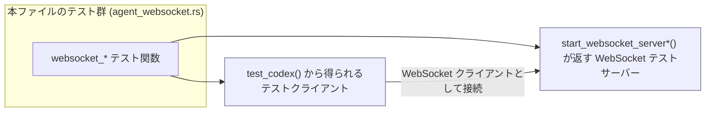
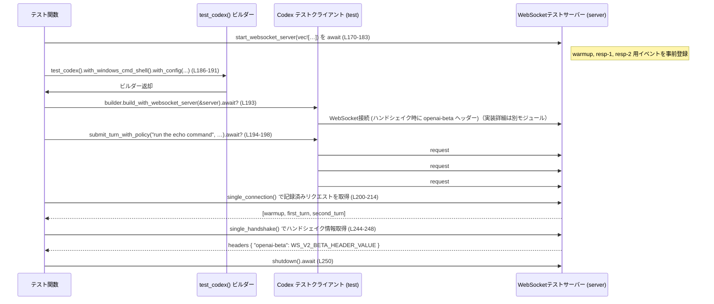

# core/tests/suite/agent_websocket.rs コード解説

## 0. ざっくり一言

- Codex コアと WebSocket ベースの「responses」バックエンドとのやり取りを、テスト用 WebSocket サーバーを使って検証する非同期テスト群です。
- 特に **ウォームアップ(prewarm) リクエスト**、**レスポンスチェーン**、および **WebSocket v2 / service_tier（Fast/priority）挙動** を確認しています。

---

## 1. このモジュールの役割

### 1.1 概要

- このモジュールは、Codex の「エージェント」あるいは応答処理が WebSocket バックエンドとどう対話するかを検証するテストをまとめています。
- テストごとに、テスト用 WebSocket サーバーへ送信される JSON リクエスト群（`response.create` など）の形と順序を検証します。
- WebSocket v2 の有効化時に送信される **Beta ヘッダー** や **service_tier フィールド** の値が期待どおりであることも確認します。

### 1.2 アーキテクチャ内での位置づけ

このファイル単体から分かる依存関係は以下の通りです。

- テストコード（このファイル）は、`core_test_support` クレートのテスト用ユーティリティに依存します。
- `core_test_support::responses::*` が WebSocket テストサーバーと事前定義イベント（`ev_response_created` など）を提供します（定義はこのファイル外です）。
- `test_codex()` が Codex のテストビルダーを返し、これを通じて WebSocket サーバーへの接続とターン送信を行います（`test_codex` の中身はこのファイルからは不明です）。

依存関係の概略を Mermaid で示します。



- 上記で `TC` と `WSS` は、本ファイル外のコンポーネントであり、具体的実装はこのチャンクには現れません。

### 1.3 設計上のポイント

- **責務の分割**
  - 「Codex 側の処理」は `test_codex()` から得られるオブジェクトに委譲し、テスト側は「WebSocket サーバーの振る舞いの指定」と「送信された JSON の検証」に集中しています（例: `test.submit_turn_with_policy` / `server.single_connection`；L40–47, L95–101 など）。
- **状態を持つコンポーネント**
  - WebSocket テストサーバー（`server`）は、接続やリクエストの履歴（`handshakes()`, `single_connection()`）を内部状態として保持しており、テストはその状態を読み出して検証します（L94–101, L144–152, L244–248, など）。
- **エラーハンドリング**
  - すべてのテスト関数は `anyhow::Result<()>` を返し、内部で `?` 演算子を使用することで失敗をテスト失敗として伝播します（例: `builder.build_with_websocket_server(&server).await?`; L40, L87, L137, L193, L274, L330, L390）。
  - 期待不一致は `assert_eq!`, `assert!`, `.expect()` による **パニック** として扱われます。
- **並行性**
  - すべてのテストは `#[tokio::test(flavor = "multi_thread", worker_threads = 2)]` で Tokio のマルチスレッドランタイム上で実行されます（L19, L72, L116, L166, L254, L309, L365）。

---

## 2. 主要な機能一覧

このファイルが提供する主な「機能」（= テストシナリオ）は以下の通りです。

- WebSocket シェルチェーンの検証 (v1)
  - `websocket_test_codex_shell_chain`（L19–70）  
    - シェルコマンド呼び出しを含む 2 ターンのレスポンスチェーンが生成されることを確認。
- 初回ターンにおけるウォームアップ + response.create の検証 (v1)
  - `websocket_first_turn_uses_startup_prewarm_and_create`（L72–114）  
    - 起動時の prewarm リクエストと、最初のターン用 `response.create` が 1 接続内で連続して送信されることを確認。
  - `websocket_first_turn_handles_handshake_delay_with_startup_prewarm`（L116–164）  
    - WebSocket 接続のハンドシェイクに遅延があっても、prewarm + ターンが正しく処理されることを確認。
- WebSocket v2 + シェルチェーン・ヘッダーの検証
  - `websocket_v2_test_codex_shell_chain`（L166–252）  
    - WebSocket v2 特有のウォームアップ + 2 ターンのチェーン、`previous_response_id` の設定、`openai-beta` ヘッダーを検証。
- WebSocket v2 + service_tier の初回ターン挙動
  - `websocket_v2_first_turn_uses_updated_fast_tier_after_startup_prewarm`（L254–307）  
    - warmup 終了後、`ServiceTier::Fast` 指定が `service_tier: "priority"` として反映されることを確認。
  - `websocket_v2_first_turn_drops_fast_tier_after_startup_prewarm`（L309–363）  
    - グローバル設定で Fast になっていても、ユーザー指定が None の場合に初回ターンから `service_tier` が落ちることを確認。
- WebSocket v2 + service_tier の次ターン挙動
  - `websocket_v2_next_turn_uses_updated_service_tier`（L365–440）  
    - 1 回目の Fast 指定が次のターンには引き継がれず、`service_tier` が指定されていない状態になることを確認。

### 2.1 本ファイル内のコンポーネント一覧（関数・定数）

| 名前 | 種別 | 役割 / 用途 | 定義位置 |
|------|------|-------------|----------|
| `WS_V2_BETA_HEADER_VALUE` | 定数 `&'static str` | WebSocket v2 で期待される `openai-beta` ハンドシェイクヘッダーの値 | `core/tests/suite/agent_websocket.rs:L17-17` |
| `websocket_test_codex_shell_chain` | 非公開 async 関数（Tokio テスト） | v1 WebSocket でシェルコマンド呼び出しチェーンを検証 | `core/tests/suite/agent_websocket.rs:L19-70` |
| `websocket_first_turn_uses_startup_prewarm_and_create` | 非公開 async 関数（Tokio テスト） | 初回ターン前の prewarm と通常 `response.create` の組み合わせを検証 | `core/tests/suite/agent_websocket.rs:L72-114` |
| `websocket_first_turn_handles_handshake_delay_with_startup_prewarm` | 非公開 async 関数（Tokio テスト） | WebSocket ハンドシェイク遅延時も prewarm + ターンが正しく動作するか検証 | `core/tests/suite/agent_websocket.rs:L116-164` |
| `websocket_v2_test_codex_shell_chain` | 非公開 async 関数（Tokio テスト） | WebSocket v2 での prewarm + シェルチェーン + ヘッダー検証 | `core/tests/suite/agent_websocket.rs:L166-252` |
| `websocket_v2_first_turn_uses_updated_fast_tier_after_startup_prewarm` | 非公開 async 関数（Tokio テスト） | warmup 後に Fast tier 指定を priority にマッピングする挙動を検証 | `core/tests/suite/agent_websocket.rs:L254-307` |
| `websocket_v2_first_turn_drops_fast_tier_after_startup_prewarm` | 非公開 async 関数（Tokio テスト） | warmup 時 priority であっても、初回ターンで tier を明示しないと service_tier が付かないことを検証 | `core/tests/suite/agent_websocket.rs:L309-363` |
| `websocket_v2_next_turn_uses_updated_service_tier` | 非公開 async 関数（Tokio テスト） | 1 回目 Fast, 2 回目デフォルトの tier 指定が、各ターンの service_tier にどう反映されるか検証 | `core/tests/suite/agent_websocket.rs:L365-440` |

---

## 3. 公開 API と詳細解説

このファイルはテストモジュールであり、**ライブラリ API を公開していません**。  
しかし、テストシナリオそのものが「WebSocket 統合の契約（contract）」を示しているため、テスト関数を API 的観点から説明します。

### 3.1 型一覧（構造体・列挙体など）

本ファイル内で新たに定義される構造体・列挙体はありません。

- `WebSocketConnectionConfig` は `core_test_support::responses` からのインポートであり、定義はこのチャンクには現れません（L4, L120–133 に使用のみが見えます）。
- `ServiceTier` 列挙体は `codex_protocol::config_types` からのインポートであり、ここでは `ServiceTier::Fast` だけが使用されています（L284, L328, L400）。

### 3.2 関数詳細（7 件）

#### `websocket_test_codex_shell_chain() -> Result<()>`

**概要**

- v1 WebSocket を使ったシェルコマンドチェーンのシナリオを検証するテストです（L19–70）。
- 2 回の `response.create` 呼び出しが行われ、2 回目のリクエスト input が非空であることを確認します（L59–66）。

**引数**

- 引数はありません（Tokio テスト関数）。

**戻り値**

- `anyhow::Result<()>`（L20）  
  - `Ok(())` の場合: テスト成功。  
  - `Err(_)` の場合: テスト失敗として扱われます（`?` でエラーが伝播; L40–45 など）。

**内部処理の流れ**

1. ネットワークを利用できない環境ではテストをスキップ（`skip_if_no_network!(Ok(()));` L21）。
2. テスト用 WebSocket サーバーをセットアップ  
   - 2 回のレスポンスシーケンスを持つサーバーを起動 (`start_websocket_server` へのネストした `vec!` 渡し; L24–35, L35–36)。
3. Codex テストクライアントを構築  
   - `test_codex().with_windows_cmd_shell()` でビルダー作成（L38）。  
   - `builder.build_with_websocket_server(&server).await?` で WebSocket サーバーに接続可能なテストオブジェクト `test` を得ます（L40）。
4. 1 回のターンを送信  
   - `test.submit_turn_with_policy("run the echo command", policy)`（L41–45）。
5. サーバー側に届いたリクエストの検証  
   - `server.single_connection()` から単一接続のリクエスト一覧を取得（L47）。  
   - 長さが 2 であることを検証（L48）。  
   - 最初と 2 番目のリクエスト JSON を `body_json()` で取得し（L50–57）、どちらも `"type": "response.create"` であることを検証（L59–60）。  
   - 2 番目のリクエストの `"input"` フィールドが非空配列であることを確認（L62–66）。
6. WebSocket サーバーをシャットダウンし、`Ok(())` を返して終了（L68–69）。

**Errors / Panics**

- `builder.build_with_websocket_server` や `submit_turn_with_policy` が `Err` を返した場合、`?` によりテストは早期終了します（L40, L45）。
- `connection.first().expect("...")` や `connection.get(1).expect("...")` が `None` を返した場合、`expect` によりパニックが発生します（L50–57）。
- `input_items` 取得時の `.expect("second response.create input array")` も同様にパニック条件です（L62–65）。
- `assert_eq!` / `assert!` に失敗した場合、テストはパニックして失敗します（L48–60, L66）。

**Edge cases（エッジケース）**

- 2 回目の `response.create` が送られない場合  
  - `connection.len()` が 2 でなくなるため、L48 の `assert_eq!` でテスト失敗となります。
- `input` フィールドが配列でない／存在しない場合  
  - `.and_then(Value::as_array)` が `None` となり、L65 の `expect` がパニックします。
- ネットワーク不可の環境  
  - L21 の `skip_if_no_network!(Ok(()))` により、テストはスキップされる前提です（具体的なマクロ挙動はこのファイルには現れません）。

**使用上の注意点**

- 新しいシナリオを追加する際は、同様に `server.single_connection()` などで **サーバー側の受信リクエスト** を検証するパターンを踏襲すると、このテストとの一貫性が保てます。
- `server.shutdown().await` を呼び出して WebSocket テストサーバーを明示的に停止させている点（L68）は、リソースを取りこぼさないための重要なパターンです。

---

同じテンプレートで、他のテストも要点のみ整理します。

#### `websocket_first_turn_uses_startup_prewarm_and_create() -> Result<()>`

**概要**

- 初回ターンで、**ウォームアップ (prewarm) 用の `response.create`** と **実際のターン用 `response.create`** の 2 つが送信されることを検証します（L72–114）。
- ウォームアップは `"generate": false` として送られ、ターンのリクエストには `tools` 配列が埋まっていることを確認します（L97–110）。

**内部処理の流れ（要約）**

1. ネットワーク利用可否のチェック（L74）。
2. 2 つのリクエスト（warm-1, resp-1）を返す WebSocket サーバーを起動（L76–83）。
3. Codex テストクライアントを作成し、`"hello"` ターンを 1 回送信（L86–92）。
4. ハンドシェイクが 1 回だけ行われたことを確認（L94）。
5. 単一接続内の 2 リクエスト（warmup, turn）を取得し、以下を検証（L95–110）。
   - warmup: `"type": "response.create"`, `"generate": false`（L102–103）。
   - turn: `"tools"` 配列が非空、 `"type": "response.create"`（L104–110）。
6. サーバー shutdown（L112）。

**Errors / Panics（代表）**

- ハンドシェイクが 1 回でない、または接続内のリクエストが 2 件でない、warmup/turn が見つからない場合は `assert_eq!` や `expect` によりパニック（L94–101）。
- `tools` が配列でない／空の場合は L104–109 の `assert!` で失敗。

**契約上のポイント**

- **ウォームアップリクエスト** には `generate: false` が必須である、という暗黙の契約をこのテストが表現しています（L102–103）。
- 通常ターンのリクエストには少なくとも 1 つ以上の `tools` が付与されることが前提です（L104–109）。

---

#### `websocket_first_turn_handles_handshake_delay_with_startup_prewarm() -> Result<()>`

**概要**

- WebSocket ハンドシェイクに 150ms の遅延がある条件でも、prewarm + 初回ターンが正しく処理されることを検証します（L116–164）。

**特徴的な点**

- サーバー起動に `start_websocket_server_with_headers` と `WebSocketConnectionConfig` を使用し、`accept_delay: Some(Duration::from_millis(150))` を指定しています（L120–133）。
- それ以外の検証内容は前テストと同様です（warmup の `generate: false`、turn の `tools` 検証; L147–160）。

**並行性に関するポイント**

- テスト自体は単一 async 関数ですが、`accept_delay` によりサーバー側の接続確立が非同期で遅延します。  
  Codex 側の実装はこの遅延を許容している必要があり、このテストはその契約を保証します。

---

#### `websocket_v2_test_codex_shell_chain() -> Result<()>`

**概要**

- WebSocket v2 を有効化した状態で、以下を検証するテストです（L166–252）。
  - warmup + 2 回の `response.create` チェーンが送られること（L170–183, L200–214）。
  - 各 `response.create` の `previous_response_id` フィールドが適切に設定されること（L219–220, L227）。
  - 2 回目の `response.create` の JSON input に `function_call_output` タイプの要素が含まれ、 `call_id` がシェルコマンド呼び出しの ID と一致すること（L229–242）。
  - WebSocket ハンドシェイクの `openai-beta` ヘッダーが `WS_V2_BETA_HEADER_VALUE` と一致すること（L244–248）。

**内部処理の流れ（要約）**

1. `start_websocket_server` で warmup + resp-1 + resp-2 の 3 シーケンスを持つサーバーを起動（L170–183）。
2. `test_codex().with_windows_cmd_shell().with_config(...)` で  
   `Feature::ResponsesWebsocketsV2` を有効化したビルダーを構築（L186–191）。
3. `build_with_websocket_server` と `submit_turn_with_policy` で 1 ターンを送信（L193–198）。
4. `server.single_connection()` から 3 件のリクエスト（warmup, first_turn, second_turn）を取得（L200–214）。
5. 各 JSON を検証（L216–227, L229–242）。
6. `server.single_handshake()` でハンドシェイクヘッダーを検証（L244–248）。

**Errors / Panics（代表）**

- `previous_response_id` が期待値と異なれば `assert_eq!` で失敗（L219–220, L227）。
- `function_call_output` が見つからなければ `.expect("function_call_output in create")` がパニック（L235–238）。
- ハンドシェイクヘッダーが指定定数と異なれば `assert_eq!` で失敗（L244–248）。

**v2 契約に関するポイント**

- warmup の次の `response.create` には `previous_response_id: "warm-1"` が付与される（L219–220）。
- 2 回目の `response.create` には `previous_response_id: "resp-1"` が付与される（L227）。
- `Feature::ResponsesWebsocketsV2` 有効時には `openai-beta` ヘッダーに `WS_V2_BETA_HEADER_VALUE` が付与される（L244–248）。

---

#### `websocket_v2_first_turn_uses_updated_fast_tier_after_startup_prewarm() -> Result<()>`

**概要**

- warmup 完了後、最初のターンで `ServiceTier::Fast` を明示すると、`service_tier` が `"priority"` として送信されることを検証します（L254–307）。

**重要な検証**

- warmup リクエストには `service_tier` が存在しないことを確認（L276–282）。
- `test.submit_turn_with_service_tier("hello", Some(ServiceTier::Fast))` の結果、1 回目の `response.create` に `"service_tier": "priority"` が含まれることを検証（L284–286, L295–297）。

---

#### `websocket_v2_first_turn_drops_fast_tier_after_startup_prewarm() -> Result<()>`

**概要**

- グローバル設定で `config.service_tier = Some(ServiceTier::Fast)` としていても、  
  `submit_turn_with_service_tier` が `None` を与えた場合には、初回ターンの `service_tier` が送信されないことを検証します（L309–363）。

**重要な検証**

- warmup では `service_tier: "priority"` が付与される（L332–338）。  
  → グローバル設定の Fast tier が warmup に反映されている。
- その後のターンでは `first_turn.get("service_tier")` が `None` であることを確認（L351–353）。

---

#### `websocket_v2_next_turn_uses_updated_service_tier() -> Result<()>`

**概要**

- v2 で 2 つのターンを送り、1 回目は Fast tier、2 回目は tier 指定なしとしたときの挙動を検証します（L365–440）。

**重要な検証**

- warmup の `service_tier` は `None`（L392–399）。
- 1 回目ターン: `"service_tier": "priority"`, `previous_response_id` は None（L418–421）。  
- 2 回目ターン: `service_tier` フィールド自体が存在しない (`get("service_tier")` が `None`)、`previous_response_id` も None（L428–431）。

**契約面のまとめ**

- Fast tier は **各ターンの指定に応じて反映され、過去のターンでの指定は引き継がれない** ことを、このテストが保証しています。

---

### 3.3 その他の関数

- このファイルには、補助的なローカル関数やヘルパー関数は定義されていません。  
  すべての処理は 7 つのテスト関数内に直接記述されています。

---

## 4. データフロー

ここでは代表的なシナリオとして、`websocket_v2_test_codex_shell_chain`（L166–252）のデータフローを説明します。

### 4.1 処理の要点

1. テスト内で `start_websocket_server` を使い、warmup + 2 ターン分のレスポンスイベントを持つ **テスト用 WebSocket サーバー** を起動します（L170–183）。
2. `test_codex()` から得たビルダーを通して、Codex テストクライアントが WebSocket サーバーに接続し、1 回のターン `"run the echo command"` を送信します（L186–191, L193–198）。
3. Codex 側は内部で warmup リクエスト、1 回目 `response.create`（シェルコマンド呼び出し）、2 回目 `response.create`（結果処理）を順に WebSocket サーバーへ送信します。
4. WebSocket サーバーは送信されたリクエスト JSON を記録し、テストコードは `server.single_connection()` でそれらを取得、内容を検証します（L200–214, L216–242）。
5. さらに `server.single_handshake()` で WebSocket ハンドシェイク情報を取得し、v2 用の Beta ヘッダー値を検証します（L244–248）。

### 4.2 シーケンス図



---

## 5. 使い方（How to Use）

このファイルはテスト専用モジュールです。**直接関数を呼び出すというよりも、`cargo test` でテストスイートとして実行する**ことが前提です。

### 5.1 基本的な実行方法

標準的には、プロジェクトルートで以下を実行すると、このファイルのテストも含めて実行される構成が想定されます（プロジェクト構成はこのチャンクには現れないため、一般的な説明です）。

```sh
cargo test --test suite  # 例: テストバイナリ名が "suite" の場合
# もしくは、テスト名を絞り込む:
cargo test websocket_v2_test_codex_shell_chain
```

### 5.2 新しい WebSocket テストを追加する場合のパターン

このファイルのテストは、おおむね次のようなパターンに従っています。

```rust
#[tokio::test(flavor = "multi_thread", worker_threads = 2)]
async fn websocket_custom_scenario() -> Result<()> {
    skip_if_no_network!(Ok(())); // ネットワーク環境でのみ実行 (L21 等と同パターン)

    // 1. テスト用 WebSocket サーバーを起動
    let server = start_websocket_server(vec![vec![
        // <-- ここでテストシナリオに応じたイベントを構築 (L24-35, L170-183 等参照)
    ]]).await;

    // 2. Codex テストクライアントを構築
    let mut builder = test_codex(); // 必要に応じて with_config や with_windows_cmd_shell を追加 (L38, L186 等)
    let test = builder.build_with_websocket_server(&server).await?;

    // 3. 1つ以上のターンを送信
    test.submit_turn_with_policy("some input", test.config.permissions.sandbox_policy.get().clone()).await?;

    // 4. WebSocket サーバー側の記録を検証
    let connection = server.single_connection();
    // connection[i].body_json() で JSON を取り出し、assert_eq! / assert! で検証 (L50-66 など参照)

    // 5. 後片付け
    server.shutdown().await;
    Ok(())
}
```

この例は、本ファイル内の複数テストから抽出した共通パターンに基づいています（L24–36, L38–45, L47–66, L68 など）。

### 5.3 よくあるミスと注意事項（このファイルから読み取れる範囲）

- **shutdown の呼び忘れ**
  - すべてのテストで最後に `server.shutdown().await` を呼んでいます（L68, L112, L162, L250, L305, L361, L438）。  
    テスト追加時にも同様にサーバーを停止することが前提と考えられます。
- **リクエスト数の前提**
  - `connection.len()` に対する `assert_eq!` でリクエスト数を固定値としてチェックしています（例: L48, L96, L146, L201, L289, L345, L407）。  
    既存の Codex 実装が変わり、送信する `response.create` の回数が変化すると、ここが壊れます。実装変更時にはこのテストも更新が必要です。
- **JSON フィールド名の前提**
  - `"type"`, `"generate"`, `"tools"`, `"input"`, `"service_tier"`, `"previous_response_id"` などのキー名をハードコードしています（L59–60, L102–103, L152–153, L216–227, L280–282, L336–338, L418–431）。  
    プロトコルのフィールド名変更があれば、テストも対応させる必要があります。

### 5.4 モジュール全体の使用上の注意点（まとめ）

- テストはすべて Tokio のマルチスレッドランタイム上で実行されるため、テスト内でブロッキング I/O を追加する場合はランタイムをブロックしないよう注意が必要です（ただし、このファイル内ではブロッキング I/O は見られません）。
- `skip_if_no_network!` に依存しているため、ネットワークが完全に禁止された環境ではこれらのテストはスキップされる前提です（L21, L74, L118, L168, L256, L311, L367）。

---

## 6. 変更の仕方（How to Modify）

### 6.1 新しい機能を追加する場合（新しいテストシナリオの追加）

1. **シナリオの整理**
   - 追加したい WebSocket 振る舞い（例: 新しいフィールド、別の `service_tier` 挙動）を明確にします。
2. **イベントシーケンスの定義**
   - `start_websocket_server` または `start_websocket_server_with_headers` に渡すネストした `vec!` を構築し、サーバーが返すイベントの順序を定義します（既存例: L24–35, L170–183, L258–265, L313–320, L369–381）。
3. **テストクライアントの構築**
   - 必要なら `.with_config(...)` で新しい `Feature` や設定を有効にします（例: v2 有効化 L186–191, L268–273, L323–329, L384–388）。
4. **ターン送信と検証**
   - `submit_turn_with_policy` または `submit_turn_with_service_tier` を呼び出し、`server.single_connection()` や `wait_for_request()` を使ってリクエスト JSON を取り出し、`assert_eq!` 等で検証します（L276–283, L392–399 など）。
5. **リソース解放**
   - 最後に `server.shutdown().await` を追加します（L68, L112, L162, L250, L305, L361, L438）。

### 6.2 既存のテストを変更する場合

- **影響範囲の確認**
  - 変更対象のテストが検証している契約を、コメントや `assert` の内容から読み取ります（例: service_tier 挙動 L295–297, L351–353, L418–431）。
- **プロトコル変更に追随**
  - WebSocket の JSON 構造やフィールド名が変わった場合、対応する `assert` と `expect` の対象キーを合わせて変更します。
- **前提条件との整合性**
  - `connection.len()` や `handshakes().len()` による数のチェックは、実装変更に合わせて見直す必要があります（L94–96, L144–146, L201, L287–289, L343–345, L405–407）。

---

## 7. 関連ファイル・外部コンポーネント

このモジュールが依存している主な外部コンポーネント（定義はこのチャンクには現れません）を列挙します。

| パス / シンボル | 役割 / 関係 | 根拠 |
|----------------|------------|------|
| `core_test_support::responses::start_websocket_server` | テスト用の WebSocket サーバーを起動し、事前定義されたイベントを返すユーティリティ関数 | 起動に使用（L24–36, L76–84, L170–183, L258–266, L313–321, L369–381） |
| `core_test_support::responses::start_websocket_server_with_headers` | ハンドシェイクの遅延やレスポンスヘッダー設定を行える WebSocket サーバー起動関数 | ハンドシェイク遅延テストで使用（L120–134） |
| `core_test_support::responses::WebSocketConnectionConfig` | WebSocket テストサーバーの設定（requests, response_headers, accept_delay 等）を保持する構造体 | ハンドシェイク遅延の設定に使用（L120–133） |
| `core_test_support::responses::{ev_response_created, ev_shell_command_call, ev_assistant_message, ev_completed}` | WebSocket サーバーが送信するイベント（JSON メッセージ）を生成するヘルパー | 各テストのシナリオ定義に使用（L24–34, L76–82, L122–127, L170–183, L258–265, L313–320, L369–381） |
| `core_test_support::test_codex::test_codex` | Codex のテスト用ビルダーを返す関数。WebSocket 接続付きテストクライアントを構築する | すべてのテストで使用（L38, L86, L136, L186, L268, L323, L384） |
| `core_test_support::skip_if_no_network`（マクロ） | ネットワークが利用不可の環境でテストをスキップするマクロ | すべてのテスト冒頭で使用（L21, L74, L118, L168, L256, L311, L367） |
| `codex_features::Feature::ResponsesWebsocketsV2` | WebSocket v2 を有効化するためのフィーチャーフラグ | v2 系テストで有効化（L186–191, L268–273, L323–327, L384–388） |
| `codex_protocol::config_types::ServiceTier` | サービスの優先度層（Fast 等）を表す列挙体 | v2 + service_tier テストで使用（L284, L328, L400） |

---

## バグになり得る点・セキュリティ上の観点（このチャンクから分かる範囲）

- **テストの脆さ（プロトコル依存）**
  - JSON のキー名や `service_tier` の文字列値 `"priority"` をハードコードしているため、プロトコル変更に非常に敏感です（例: L295–297, L351–353, L418–420）。
- **セキュリティ観点**
  - このファイルは完全にテスト用であり、外部入力のパースや認可チェックを実装していません。テストサーバーとの通信も、`core_test_support` レイヤーに隠蔽されています。  
  - したがって、このファイル単体から本番コードのセキュリティに関する直接的なリスクは読み取れません。

---

## エッジケース・契約の整理（テスト全体）

このファイルから読み取れる **WebSocket 統合の契約** と **エッジケース** をまとめます。

- **ウォームアップ(prewarm)**
  - v1/v2 とも、起動後の最初のリクエストは `response.create` であり `generate: false` が付与される（L102–103, L152–153, L216–218, L280–282, L336–338, L396–398）。
- **tools の存在**
  - 初回ターンのリクエストには `tools` 配列が存在し、非空であること（L104–109, L155–158）。
- **previous_response_id**
  - WebSocket v2 のチェーンでは、`previous_response_id` に warmup / 直前レスポンス ID が付与される（L219–220, L227）。
- **service_tier**
  - warmup では、明示的に Fast 指定されていない限り `service_tier` は付与されない（L276–282, L392–399）。  
  - グローバル設定で Fast にしている場合は warmup に `"priority"` として反映される（L332–338）。  
  - 各ターンの `service_tier` はそのターンの指定にのみ依存し、前ターンの指定を引き継がない（L295–297, L351–353, L418–420, L428–430）。
- **ハンドシェイク**
  - WebSocket v2 有効時には `openai-beta` ヘッダーに `WS_V2_BETA_HEADER_VALUE` が設定される（L244–248）。
  - ハンドシェイクに遅延があっても prewarm + 初回ターンが成立することが契約としてテストされている（L120–133, L144–152）。

---

このレポートは、`core/tests/suite/agent_websocket.rs` 内のコード（L1–440）から読み取れる事実のみを元に記述しています。それ以外の挙動（`core_test_support` や Codex 本体の内部実装など）は、このチャンクには現れないため「不明」と扱っています。
