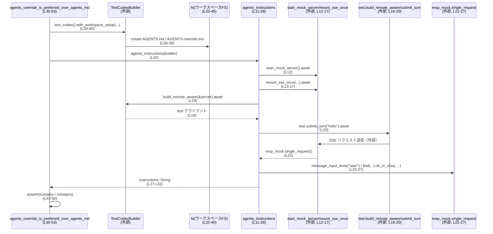

# core/tests/suite/agents_md.rs コード解説

## 0. ざっくり一言

AGENTS 関連ドキュメント（`AGENTS.md` / `AGENTS.override.md` など）を、Codex エージェントがどのように読み込んで「指示文」に変換するかを検証する、非同期統合テスト群です（`tokio` マルチスレッドランタイム上で実行）【core/tests/suite/agents_md.rs:L30-31,L55-56,L81-82】。

---

## 1. このモジュールの役割

### 1.1 概要

このテストモジュールは、AGENTS 系ドキュメント解決ロジックの挙動を検証します。

- `agents_instructions` ヘルパー関数で、モックサーバー・SSE・Codex テストハーネスをまとめて起動し、エージェントに 1 ターン送信して「AGENTS 指示文」を 1 本の `String` として取得します【L11-28】。
- 3 つの `#[tokio::test]` 関数で、以下のシナリオを検証します【L31-53,L56-79,L82-120】。
  - override ファイルが存在する場合は `AGENTS.override.md` が優先されること。
  - `AGENTS.md` が **ディレクトリ** だった場合、設定された fallback ドキュメント（`WORKFLOW.md`）が使われること。
  - プロジェクトルートから作業ディレクトリ (`cwd`) までの `AGENTS.md` が連結され、親ディレクトリ側の内容が先に来ること。

### 1.2 アーキテクチャ内での位置づけ

このテストは、本体側の「プロジェクトドキュメント解決ロジック」に対して、以下のコンポーネントを経由する統合テストになっています。

- `TestCodexBuilder`（外部）で Codex テスト環境を構築【L8,L19】。
- `start_mock_server` と `mount_sse_once` で SSE モックサーバーを起動し、エージェントからのリクエストを観測【L12-17,L22】。
- `with_workspace_setup` で、テストごとに異なるワークスペースファイル構成を作成【L33-40,L62-69,L88-105】。
- エージェントが送信した「ユーザーメッセージ」のうち、`"# AGENTS.md instructions for "` で始まるテキストを指示文として抽出【L23-27】。

依存関係の概要を Mermaid 図で表します。

```mermaid
graph TD
    T1[agents_override_is_preferred_over_agents_md<br/>(L30-53)] --> H[agents_instructions<br/>(L11-28)]
    T2[configured_fallback_is_used_when_agents_candidate_is_directory<br/>(L55-79)] --> H
    T3[agents_docs_are_concatenated_from_project_root_to_cwd<br/>(L81-120)] --> H

    T1 --> WS1[with_workspace_setup クロージャ<br/>(L33-40)]
    T2 --> Cfg1[with_config (fallback 設定)<br/>(L59-61)]
    T2 --> WS2[with_workspace_setup クロージャ<br/>(L62-69)]
    T3 --> Cfg2[with_config (cwd 変更)<br/>(L85-87)]
    T3 --> WS3[with_workspace_setup クロージャ<br/>(L88-105)]

    H --> MS[start_mock_server<br/>(外部, L12)]
    H --> SSE[mount_sse_once / sse / ev_*<br/>(外部, L13-17)]
    H --> Builder[TestCodexBuilder.build_remote_aware<br/>(外部, L19)]
    H --> Submit[test.submit_turn<br/>(外部, L20)]
    H --> Req[resp_mock.single_request().message_input_texts<br/>(外部, L22-27)]
```

> 図は、本ファイル内のテスト関数から `agents_instructions` を経由してモックサーバー・Codex テスト環境・ワークスペースセットアップへと処理が流れていることを示します。

### 1.3 設計上のポイント

- **責務分割**  
  - 実際のリクエスト送信〜指示文抽出までは `agents_instructions` に集約【L11-28】。
  - 各テストは「ファイルシステム状態の準備」と「期待される指示文の内容／順序の検証」に専念【L31-53,L56-79,L82-120】。
- **状態管理**  
  - テスト関数はすべて `async` で、共有状態を持たず、毎回新しい `TestCodexBuilder` を作っているため、テスト間の状態干渉を避けています【L32-33,L57-59,L83-85】。
- **エラーハンドリング**  
  - 関数は `anyhow::Result` を返し、`?` 演算子で外部処理（ファイル書き込み・ディレクトリ作成・Codex ビルドなど）のエラーを上位に伝播する構造です【L11,L19,L20,L33-40,L62-69,L88-105】。
  - `agents_instructions` 内で、期待する指示文が見つからなかった場合は `anyhow::anyhow!` で明示的にエラーを返します【L23-27】。
- **並行性**  
  - すべてのテストに `#[tokio::test(flavor = "multi_thread", worker_threads = 2)]` 属性が付与されており、複数スレッドでの非同期実行に対応【L30,L55,L81】。
  - 共有ミュータブル状態へのアクセスはこのチャンクには現れず、ワークスペースのファイル操作はテスト毎の一時ディレクトリ（`cwd`）に閉じているように見えます【L33-36,L62-67,L88-105】。

---

## 2. 主要な機能一覧

このファイル内の「機能」（関数）を一覧にします。

- `agents_instructions`: Codex テスト環境を起動し、AGENTS 指示文となるユーザーメッセージ `String` を 1 つ取得するヘルパー【L11-28】。
- `agents_override_is_preferred_over_agents_md`: `AGENTS.override.md` が存在する場合に、その内容のみが指示文に現れることを検証するテスト【L31-53】。
- `configured_fallback_is_used_when_agents_candidate_is_directory`: `AGENTS.md` がディレクトリの場合に、設定された fallback ファイル（`WORKFLOW.md`）が使用されることを検証するテスト【L56-79】。
- `agents_docs_are_concatenated_from_project_root_to_cwd`: プロジェクトルートから `cwd` までの `AGENTS.md` が順番に連結されること（親→子の順）を検証するテスト【L82-120】。

### 2.1 コンポーネントインベントリー（関数）

| 名前 | 種別 | 非同期 | 戻り値 | 役割 / 用途 | 定義箇所 |
|------|------|--------|--------|-------------|----------|
| `agents_instructions` | 非公開関数 | `async` | `Result<String>` | Codex テスト環境を構築し、AGENTS 指示文テキストを 1 つ抽出するヘルパー | `core/tests/suite/agents_md.rs:L11-28` |
| `agents_override_is_preferred_over_agents_md` | テスト関数 | `async` | `Result<()>` | override ファイル優先の挙動を検証 | `core/tests/suite/agents_md.rs:L31-53` |
| `configured_fallback_is_used_when_agents_candidate_is_directory` | テスト関数 | `async` | `Result<()>` | AGENTS 候補がディレクトリの場合の fallback 使用を検証 | `core/tests/suite/agents_md.rs:L56-79` |
| `agents_docs_are_concatenated_from_project_root_to_cwd` | テスト関数 | `async` | `Result<()>` | ルートから `cwd` までの AGENTS 文書連結と順序を検証 | `core/tests/suite/agents_md.rs:L82-120` |

---

## 3. 公開 API と詳細解説

このファイル内で**新たに公開される型や関数はありません**。すべてテスト用の内部関数／テスト関数です。

### 3.1 型一覧（外部型の利用）

このファイル内で利用されている主要な外部型をまとめます。

| 名前 | 種別 | 定義場所（モジュール） | 役割 / 用途 | 参照箇所 |
|------|------|------------------------|-------------|----------|
| `TestCodexBuilder` | 構造体（外部） | `core_test_support::test_codex` | Codex テスト環境の構築を行うビルダー。`build_remote_aware` などを通じてテスト用 Codex インスタンスを生成する | `core/tests/suite/agents_md.rs:L8,L11,L19` |
| `CreateDirectoryOptions` | 構造体（外部） | `codex_exec_server` | ディレクトリ作成時のオプション（ここでは `recursive: true` の設定に使用） | `core/tests/suite/agents_md.rs:L2,L65,L98` |

> これらの型の具体的なフィールドや実装は、このチャンクには現れません。

### 3.2 関数詳細

#### `agents_instructions(mut builder: TestCodexBuilder) -> Result<String>`

**概要**

Codex テスト環境（SSE モックサーバー + Codex クライアント）を起動し、ユーザーの一言 `"hello"` を送信して、その結果として生成される「AGENTS 指示文メッセージ」を 1 本の `String` として取り出すヘルパー関数です【L11-28】。

**引数**

| 引数名 | 型 | 説明 |
|--------|----|------|
| `builder` | `TestCodexBuilder`（外部） | Codex テスト環境を構築するためのビルダー。`build_remote_aware` を通じて実際のテストクライアントを生成する【L8,L19】。 |

**戻り値**

- `Result<String>`（`anyhow::Result` のエイリアス）【L1,L11】  
  - `Ok(String)` : エージェントが送信したユーザーメッセージのうち、`"# AGENTS.md instructions for "` で始まる 1 行のテキスト。
  - `Err(anyhow::Error)` : モックサーバー／Codex 構築失敗、送信失敗、もしくは期待するテキストが見つからなかった場合など。

**内部処理の流れ**

根拠: `core/tests/suite/agents_md.rs:L11-27`

1. `start_mock_server().await` を呼び出し、SSE モックサーバーを起動してハンドル `server` を取得【L12】。
2. `mount_sse_once` に `server` と SSE イベント `sse(vec![ev_response_created("resp1"), ev_completed("resp1")])` を渡し、1 回限りの SSE レスポンスモック `resp_mock` をセットアップ【L13-17】。
3. `builder.build_remote_aware(&server).await?` で、モックサーバーに接続する Codex テストクライアント `test` を生成【L19】。
4. `test.submit_turn("hello").await?` で、ユーザーからの入力 `"hello"` を 1 ターンとして Codex に送信【L20】。
5. `resp_mock.single_request()` により、モックサーバーが受け取った単一のリクエストオブジェクト `request` を取得【L22】。
6. `request.message_input_texts("user")` で、ユーザー役のメッセージ本文一覧を取得し、イテレータに変換【L23-25】。
7. その中から `text.starts_with("# AGENTS.md instructions for ")` を満たす最初のテキストを探し、見つかれば `Ok(text)` として返す。見つからない場合は `anyhow::anyhow!("instructions message not found")` でエラーを返す【L26-27】。

**Examples（使用例）**

以下は、ワークスペースに `AGENTS.md` を 1 つだけ作成し、その内容が指示文として含まれているかを確認するテスト例です。

```rust
use anyhow::Result;                                         // anyhow::Result をインポートする
use core_test_support::test_codex::test_codex;              // test_codex ビルダー関数をインポートする

#[tokio::test(flavor = "multi_thread", worker_threads = 2)] // マルチスレッド tokio ランタイムでテストを実行する
async fn simple_agents_instructions_example() -> Result<()> {
    // TestCodexBuilder を作成し、ワークスペースに AGENTS.md を用意する
    let builder = test_codex()                              // デフォルト設定の TestCodexBuilder を取得する
        .with_workspace_setup(|cwd, fs| async move {        // ワークスペースセットアップ用クロージャを設定する
            let agents_md = cwd.join("AGENTS.md");          // ワークスペース直下の AGENTS.md パスを作成する
            fs.write_file(&agents_md, b"simple doc".to_vec()) // ファイルシステムに "simple doc" を書き込む
                .await?;                                    // 非同期書き込みが失敗した場合はエラーを伝播する
            Ok::<(), anyhow::Error>(())                     // クロージャの Result 型を明示する
        });

    // ヘルパー関数で AGENTS 指示文を取得する
    let instructions = agents_instructions(builder).await?; // Codex を起動し、指示文テキストを取得する

    // 取得した指示文に "simple doc" が含まれることを検証する
    assert!(instructions.contains("simple doc"));           // 期待した内容が含まれているかを確認する

    Ok(())                                                  // テスト成功を表す Ok(()) を返す
}
```

> `test_codex` や `with_workspace_setup` の具体的な実装はこのチャンクには現れませんが、既存テストと同様の使い方です【L32-40】。

**Errors / Panics**

- `Err` になるケース（このチャンクで確認できるもの）【L19,L20,L27】:
  - `start_mock_server` / `mount_sse_once` / `build_remote_aware` / `submit_turn` がエラーを返した場合（外部実装）に `?` でそのまま伝播。
  - SSE から取得したリクエストに、`"# AGENTS.md instructions for "` で始まるユーザーメッセージが 1 つも存在しない場合、`anyhow::anyhow!("instructions message not found")` が返る【L26-27】。
- panic の直接的な可能性はこの関数内には見えません（`expect` や `unwrap` などは未使用）【L11-28】。

**Edge cases（エッジケース）**

- SSE のメッセージにユーザーメッセージがない場合  
  → `message_input_texts("user")` が空になり `find` でヒットせず、`instructions message not found` エラーになります【L23-27】。
- ユーザーメッセージが複数ある場合  
  → `find` なので、最初に `starts_with` 条件を満たしたものだけが返されます【L25-26】。
- 指示文のプレフィックス文字列（`"# AGENTS.md instructions for "`）が本体コード側で変更された場合  
  → このテストヘルパーは古いプレフィックスを探し続けるため、テストがエラーになる可能性があります【L26】。

**使用上の注意点**

- この関数はテスト専用のユーティリティです。並列テスト環境で使う前提で、モックサーバーや Codex インスタンスを毎回新規に生成します【L12,L19】。
- エージェントの指示文が **1 つも見つからない** 場合は、`Err` で返る設計のため、テストコード側では `?` でそのままテスト失敗として扱う前提になっています【L27,L31,L56,L82】。
- 非同期関数のため、`tokio` などの非同期ランタイム上で `.await` を付けて呼び出す必要があります【L31,L56,L82】。

---

#### `agents_override_is_preferred_over_agents_md() -> Result<()>`

**概要**

ワークスペースに `AGENTS.md` と `AGENTS.override.md` を両方作成したとき、エージェントが生成する指示文には override ファイルの内容のみが含まれ、ベースの `AGENTS.md` 内容は無視されることを検証するテストです【L31-53】。

**引数**

- なし（`#[tokio::test]` によるテスト関数）【L30-31】。

**戻り値**

- `Result<()>`（`anyhow::Result`）  
  テスト成功時は `Ok(())`、ファイル操作・Codex 実行・指示文抽出エラー等があれば `Err(...)` を返します【L31,L52】。

**内部処理の流れ**

根拠: `core/tests/suite/agents_md.rs:L31-53`

1. `test_codex()` で `TestCodexBuilder` 初期値を取得【L33】。
2. `with_workspace_setup` で、ワークスペース準備クロージャを登録【L33】。
   - `cwd.join("AGENTS.md")` と `cwd.join("AGENTS.override.md")` を作成【L34-35】。
   - `AGENTS.md` に `"base doc"`、`AGENTS.override.md` に `"override doc"` を書き込む【L36-38】。
3. そのビルダーを `agents_instructions` ヘルパーに渡して実行し、指示文 `instructions` を取得【L32-33,L41】。
4. `instructions` に `"override doc"` が含まれることを `assert!` で検証【L43-46】。
5. さらに `instructions` に `"base doc"` が **含まれない** ことを `assert!` で検証【L47-50】。
6. テスト成功として `Ok(())` を返す【L52】。

**Examples（使用例）**

`agents_instructions` を使った override テストの典型例なので、この関数自身がそのまま使用例です【L31-53】。

**Errors / Panics**

- 外部関数やファイル操作の失敗は `agents_instructions(...).await?` の `?` により `Err` としてテストから返されます【L41】。
- `assert!` 条件が満たされない場合は panic し、テストは失敗扱いとなります【L43-50】。

**Edge cases（エッジケース）**

- `AGENTS.override.md` のみ存在し、`AGENTS.md` が存在しないケースについては、このテストではカバーしていません（ここでは両方作成しています）【L34-38】。
- `instructions` が空文字列の場合  
  → `"override doc"` も `"base doc"` も含まれないため、最初の `assert!` で panic します【L43-46】。
- 指示文に複数回 `"override doc"` が現れても、このテストは単に `contains` で確認するだけなので、回数までは検証していません【L43-44】。

**使用上の注意点**

- `assert!` の第 2 引数として `"expected AGENTS.override.md contents: {instructions}"` と書かれていますが、これは単なる文字列リテラルであり、`{instructions}` はフォーマット展開されません【L45】。  
  テスト失敗時に `instructions` の内容を出力したい場合は、例えば次のように書く必要があります（一般論）:

```rust
// 現状の書き方（instructions の中身は出力されない）【L43-46】
assert!(
    instructions.contains("override doc"),
    "expected AGENTS.override.md contents: {instructions}"
);

// instructions を表示したい場合の一例
assert!(
    instructions.contains("override doc"),
    "expected AGENTS.override.md contents: {}",
    instructions,
);
```

---

#### `configured_fallback_is_used_when_agents_candidate_is_directory() -> Result<()>`

**概要**

`AGENTS.md` が「ディレクトリ」であるケースを模擬し、その場合に設定された fallback ドキュメント `WORKFLOW.md` の内容が指示文に使われることを検証するテストです【L56-79】。

**内部処理の流れ**

根拠: `core/tests/suite/agents_md.rs:L56-79`

1. `test_codex()` からビルダーを取得【L58】。
2. `with_config` で設定オブジェクトにアクセスし、`project_doc_fallback_filenames` を `["WORKFLOW.md"]` に上書き【L59-61】。
3. `with_workspace_setup` でワークスペース準備クロージャを登録【L62】。
   - `cwd.join("AGENTS.md")` を「ディレクトリ」として作成【L63,L65】。
   - `cwd.join("WORKFLOW.md")` を作成し、中身 `"fallback doc"` を書き込み【L64,L67】。
4. ビルダーを `agents_instructions` に渡して実行し、指示文 `instructions` を取得【L57-58,L70-71】。
5. `instructions` に `"fallback doc"` が含まれることを `assert!` で検証【L73-76】。
6. 成功時に `Ok(())` を返す【L78】。

**Errors / Panics**

- fallback ファイルが正しく読まれない場合や、AGENTS 候補がディレクトリ扱いされない場合などは、`instructions` に `"fallback doc"` が含まれず、`assert!` により panic します【L73-76】。
- ファイル／ディレクトリ操作の失敗は `?` によって `Err` として伝播します【L65-67,L70-71】。

**Edge cases**

- fallback ファイル名リストに複数候補があるケースや、fallback ファイルが存在しないケースは、このテストには現れません【L60-61,L63-67】。
- `AGENTS.md` が通常ファイルとしても存在する場合の挙動は、このテストではカバーしていません。ここでは `AGENTS.md` はディレクトリとしてのみ作成されています【L63,L65】。

---

#### `agents_docs_are_concatenated_from_project_root_to_cwd() -> Result<()>`

**概要**

プロジェクトルートとネストした作業ディレクトリの両方に `AGENTS.md` を配置した場合、指示文に含まれる文書の順序が「プロジェクトルートの `AGENTS.md` → ネストした `AGENTS.md`」になることを検証するテストです【L82-120】。

**内部処理の流れ**

根拠: `core/tests/suite/agents_md.rs:L82-120`

1. `test_codex()` からビルダーを取得【L84】。
2. `with_config` にて、`config.cwd` を `config.cwd.join("nested/workspace")` に書き換え、ネストされた作業ディレクトリを設定【L85-87】。
3. `with_workspace_setup` でワークスペース準備クロージャを登録【L88】。
   - `nested = cwd.clone()` を取得し、そこから 2 つ親ディレクトリを辿ったものを `root` として扱う【L89-93】。
   - `root` に `root_agents = root.join("AGENTS.md")` と `.git` ファイル `git_marker` を作成（プロジェクトルートのマーカーと推測されますが、詳細ロジックはこのチャンクには現れません）【L94-96,L100-102】。
   - `nested` に `nested_agents = nested.join("AGENTS.md")` を作成【L96,L103】。
   - `root_agents` に `"root doc"`, `nested_agents` に `"child doc"` を書き込む【L100,L103】。
4. ビルダーを `agents_instructions` に渡して実行し、`instructions` を取得【L83,L106-107】。
5. `instructions.find("root doc")` と `instructions.find("child doc")` で、それぞれのサブストリングの位置を取得し、それらが `root_pos < child_pos` となることを `assert!` で検証【L109-117】。
6. 成功時に `Ok(())` を返す【L120】。

**Errors / Panics**

- `find` が `None` を返した場合は `expect` により panic します【L109-114】。
- 位置関係が逆（子が先に現れる）場合も、`assert!(root_pos < child_pos, ...)` により panic します【L115-117】。
- ファイル作成・ディレクトリ作成の失敗は `?` を通じて `Err` になります【L98-103,L106-107】。

**Edge cases**

- プロジェクトルートよりさらに上位の階層にも `AGENTS.md` がある場合の挙動は、このテストでは検証していません【L89-96】。
- `.git` マーカーが存在しない場合にどのディレクトリをプロジェクトルートと認識するのか、といったロジックはこのチャンクには現れません【L95-96,L101-102】。

---

### 3.3 その他の関数

このファイルには、上記 4 つ以外の関数は定義されていません【L11-120】。

---

## 4. データフロー

代表的なシナリオとして、`agents_override_is_preferred_over_agents_md` 実行時のデータフローを示します。

1. テスト関数が `TestCodexBuilder` を構築し、ワークスペースに `AGENTS.md` と `AGENTS.override.md` を作成します【L33-40】。
2. そのビルダーを `agents_instructions` に渡し、モックサーバーと Codex テストクライアントを起動します【L32-33,L11-20】。
3. テストクライアントが `"hello"` を送信し、そのリクエストがモックサーバー側で観測されます【L20,L22】。
4. モック側で記録されたリクエストのユーザーメッセージから、AGENTS 指示文のテキストが抽出され、テスト関数に戻ります【L22-27,L32】。
5. テスト関数はそのテキストに含まれるコンテンツを検証します【L43-50】。

Mermaid のシーケンス図で表すと次のようになります。



> この図から、テストコードは実際のドキュメント解決ロジックにかなり近い経路を通っている（ファイルシステム・SSE・テスト Codex クライアントを含む）ことが分かります。

---

## 5. 使い方（How to Use）

このファイルはテストモジュールですが、`agents_instructions` ヘルパーと `test_codex` ビルダーの使い方は、他のテスト追加や既存テストの理解に有用です。

### 5.1 基本的な使用方法

AGENTS 関連ロジックに新しいシナリオを追加テストする場合の典型的なコードフローは次のようになります。

```rust
use anyhow::Result;                                         // anyhow::Result をインポートする
use core_test_support::test_codex::test_codex;              // TestCodexBuilder を生成する関数をインポートする

#[tokio::test(flavor = "multi_thread", worker_threads = 2)] // マルチスレッド tokio ランタイムでテストを実行する
async fn my_agents_scenario() -> Result<()> {
    // 1. TestCodexBuilder を取得し、必要な設定やワークスペース構成を追加する
    let builder = test_codex()                              // デフォルト設定のビルダーを取得する
        .with_config(|config| {                             // 設定を変更したい場合は with_config を使う
            // config のフィールドに対する変更を書き込む（例: fallback など）
        })
        .with_workspace_setup(|cwd, fs| async move {        // ワークスペースのファイル構成を定義する
            // cwd を基準に AGENTS.md などのファイルを作成する
            Ok::<(), anyhow::Error>(())                     // 非同期クロージャの戻り値を明示する
        });

    // 2. ヘルパー関数で AGENTS 指示文を取得する
    let instructions = agents_instructions(builder).await?; // Codex テスト環境を起動し、指示文を取得する

    // 3. 結果の検証を行う
    assert!(instructions.contains("期待する文字列"));        // 指示文に期待する内容が含まれていることを確認する

    Ok(())                                                  // テスト成功を表す Ok(()) を返す
}
```

### 5.2 よくある使用パターン

- **ファイル優先順位の検証**  
  - このファイルでは override > base や root > nested といった**優先順位／連結順**を `contains` と `find` によって検証しています【L43-50,L109-117】。
- **設定のカスタマイズ**  
  - `with_config` を通じて `project_doc_fallback_filenames` や `cwd` を変更し、設定駆動の挙動をテストしています【L59-61,L85-87】。
- **ワークスペースの構造を変えたテスト**  
  - 同じ `agents_instructions` を共有しつつ、`with_workspace_setup` のクロージャでファイルレイアウトを変えるだけで、複数シナリオを記述しています【L33-40,L62-69,L88-105】。

### 5.3 よくある間違い

このファイルのコードから推測される、起こりがちな誤りと正しい例を示します。

```rust
// 間違い例: assert! で instructions の中身を出力しようとしているが、展開されない【L43-46】
assert!(
    instructions.contains("override doc"),
    "expected AGENTS.override.md contents: {instructions}"
);

// 正しい例: 第 3 引数以降に format 引数を渡して文字列を整形する
assert!(
    instructions.contains("override doc"),
    "expected AGENTS.override.md contents: {}",
    instructions, // ここで instructions の内容が {} に埋め込まれる
);
```

```rust
// 間違い例: 非同期関数を同期コンテキストから呼び出している
// let instructions = agents_instructions(builder)?;        // .await がないためコンパイルエラー

// 正しい例: tokio の非同期コンテキスト内で .await を付けて呼び出す
let instructions = agents_instructions(builder).await?;     // 非同期に結果を待つ
```

### 5.4 使用上の注意点（まとめ）

- **非同期 / 並行性**
  - すべてのテストは `tokio` のマルチスレッドランタイム上で実行されます【L30,L55,L81】。
  - グローバルな共有ミュータブル状態はこのチャンクには現れず、ファイル操作はテストごとに分離された `cwd` 配下に限定されていると読み取れます【L33-36,L62-67,L88-103】。
- **エラーハンドリング**
  - `agents_instructions` は「指示文が見つからない」場合に `Err` を返すため、テストが意図せずそのエラーで失敗している場合、実際には AGENTS ロジックではなくテストセットアップに問題がある可能性があります【L23-27】。
- **ファイルシステム依存**
  - テストは仮想／一時的なファイルシステム上で動いていると考えられますが、具体的な実装はこのチャンクには現れません【L33-40,L62-69,L88-105】。  
    実ファイルシステムに依存したコードに移植するときはパス区切りや権限などに注意が必要です。
- **潜在的なバグ / セキュリティ観点**
  - このテストコード自体は外部からの入力を直接扱わず、一時ディレクトリに対するファイル操作のみを行っているため、セキュリティ上の懸念は見当たりません【L33-40,L62-69,L88-105】。
  - 失敗時メッセージの `{instructions}` が展開されない点は、デバッグ情報が乏しくなるという意味で注意が必要です【L45,L49】。

---

## 6. 変更の仕方（How to Modify）

### 6.1 新しい機能を追加する場合（新しいシナリオのテスト追加）

AGENTS 関連の新しい挙動をテストしたい場合の基本的な手順は次のとおりです。

1. **新しい `#[tokio::test]` 関数を追加する**  
   - 既存テストと同様に `flavor = "multi_thread", worker_threads = 2` を付けると整合性があります【L30,L55,L81】。
2. **`test_codex()` と `with_config` / `with_workspace_setup` を使ってシナリオを構成する**  
   - 例えば「別の fallback 名」「複数階層の AGENTS 連結」「AGENTS が存在しない場合の挙動」などを表現できます【L59-61,L63-67,L94-96】。
3. **`agents_instructions` を呼び出して指示文を取得する**  
   - すべてのシナリオでこのヘルパーを共有することで、テストが一貫した観点で Codex ロジックを exercise できます【L32,L57,L83】。
4. **取得した `instructions` に対する検証を記述する**  
   - `contains` / `find` / `starts_with` など、適切な文字列操作で期待する振る舞いを検証します【L43-50,L109-117】。

### 6.2 既存の機能を変更する場合（契約と影響範囲）

- **`agents_instructions` の契約（前提条件）**
  - 指示文となるメッセージは、`"# AGENTS.md instructions for "` で始まるユーザーメッセージである、という前提があります【L23-27】。
  - 本体コード側でこのプレフィックスが変更される場合、本関数の `starts_with(...)` も合わせて変更する必要があります【L26】。
- **影響範囲の確認**
  - `agents_instructions` を呼び出しているのはこのファイル内の 3 つのテスト関数のみです【L32-33,L57-58,L83】。  
    変更時には、これらのテストが意図通りに動くかを確認します。
- **テストの検証条件の変更**
  - たとえば「AGENTS 文書が複数ファイルから連結される際の区切り文字」を変更したい場合、  
    `agents_docs_are_concatenated_from_project_root_to_cwd` の `find` の境界条件（文字列や順序）を更新する必要があります【L109-117】。
- **panic と `Result` のバランス**
  - テストコード内では `assert!` や `expect` の panic を利用しています【L43-50,L109-114】。  
    エラーを `Result` として扱いたい場合は、`assert!` / `expect` を `if !condition { return Err(...); }` に置き換えるなどの調整が考えられますが、これはテストスタイルの話であり、このチャンクからは現行ポリシー以上は分かりません。

---

## 7. 関連ファイル

このモジュールと密接に関係するコンポーネント（モジュール／クレート）を一覧にします。  
実際のファイルパスはこのチャンクからは分からないため、モジュールパスで記載します。

| パス / モジュール | 役割 / 関係 |
|-------------------|------------|
| `core_test_support::test_codex` | `TestCodexBuilder` と `test_codex()` を提供し、Codex テスト環境の構築を担います【L8,L9】。このファイルのすべてのテストが依存しています。 |
| `core_test_support::responses` | `start_mock_server`, `mount_sse_once`, `sse`, `ev_response_created`, `ev_completed` を提供し、SSE モックサーバーとイベント生成を行います【L3-7】。 |
| `codex_exec_server::CreateDirectoryOptions` | ディレクトリ作成のオプション型で、`recursive: true` を指定するために利用されています【L2,L65,L98】。 |
| Codex 本体の AGENTS ドキュメント解決ロジック（モジュール名不明） | `agents_instructions` から間接的に exercise されているロジックですが、このチャンクには直接現れません。AGENTS ファイルの探索・fallback 使用・連結順序などを決めていると考えられます。 |

> AGENTS 関連のロジックそのもの（ファイル探索や連結処理）は、このテストファイルからは呼び出されているだけで、実装内容はこのチャンクには現れません。そのため、本レポートではテストが期待している「契約」（どう振る舞ってほしいか）を中心に整理しました。
