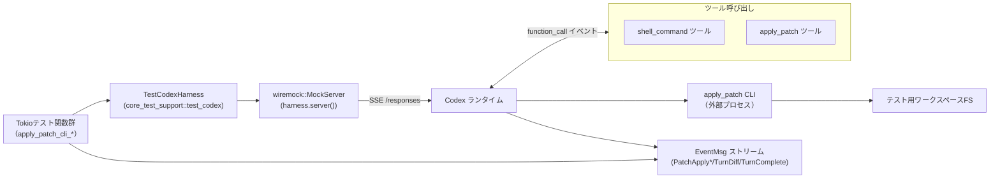
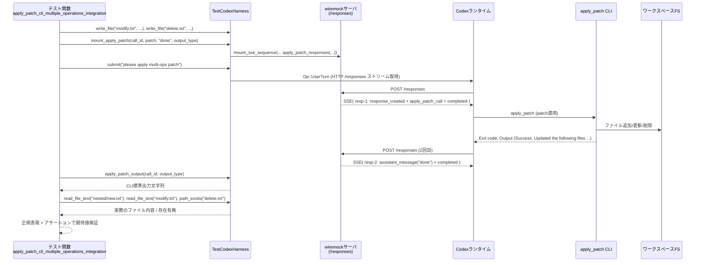

# core/tests/suite/apply_patch_cli.rs コード解説

## 0. ざっくり一言

- `apply_patch` CLI ツールと Codex ランタイムの統合動作を、SSE（Server-Sent Events）ベースのテストハーネス上で包括的に検証する統合テスト群です。
- ファイル追加・更新・削除・移動、検証エラー、パス・トラバーサル防止、TurnDiff 集約、`shell_command` 連携など、適用パッチの振る舞いをエンドツーエンドで確認します。

---

## 1. このモジュールの役割

### 1.1 概要

- このモジュールは **apply_patch CLI ツールのエンドツーエンド挙動** を検証するために存在し、テスト用ハーネスを用いて **ファイルシステム変更・エラー出力・差分イベント** を確認する機能を提供します。
- `TestCodexHarness` を初期化するヘルパー関数と、SSE 経由で apply_patch 呼び出しをモックするヘルパーを定義し、数十個の `#[tokio::test]` で様々なシナリオをカバーしています。

### 1.2 アーキテクチャ内での位置づけ

主なコンポーネント間の関係を簡略化した図です（関数名のみで、厳密な行番号はこのチャンクからは取得できません）。



- テスト関数は `TestCodexHarness` を経由して Codex に `Op::UserTurn` を送信し、`wiremock` にマウントされた SSE 応答がモデルのストリーム出力を模倣します。
- SSE 応答内の `apply_patch` / `shell_command` ツール呼び出しイベントを受けて、Codex ランタイムが実際の `apply_patch` CLI を起動し、テスト用ワークスペースのファイルを変更します。
- ファイル変更結果は
  - CLI の標準出力 (`apply_patch_output` / `function_call_stdout`)
  - ファイルシステムの実際の内容 (`read_file_text`, `path_exists`)
  - 差分イベント (`EventMsg::TurnDiff`, `PatchApplyBegin/End`)
 で検証されます。

### 1.3 設計上のポイント

- **責務分割**
  - `apply_patch_harness*` 系: Codex テストハーネスの構築と apply_patch ツールの有効化を行います。
  - `mount_apply_patch` / `apply_patch_responses`: 単一の apply_patch 呼び出しに対する SSE シーケンス生成を担当します。
  - 各 `apply_patch_cli_*` テスト: それぞれ特定のシナリオ（成功/失敗/セキュリティ/差分集約など）を検証するシナリオテストです。
  - `DynamicApplyFromRead`: `shell_command` の出力を `apply_patch` の入力に動的に接続する wiremock 用レスポンダーです。
- **状態管理**
  - テストごとに `TestCodexHarness` が独立したワークスペースディレクトリを管理する前提の設計です。
  - `DynamicApplyFromRead` は `AtomicI32` で呼び出し回数をカウントし、POST リクエストの順序に応じて異なる SSE を返します。
- **エラーハンドリング**
  - テスト関数はすべて `anyhow::Result<()>` を返し、`?` 演算子で I/O やハーネス操作の失敗を伝播させます（失敗するとテストがそのまま失敗します）。
  - apply_patch の失敗自体は **文字列出力**（例: `"apply_patch verification failed"`, `"patch rejected: empty patch"`）で検証され、ファイルシステムの副作用が適切に抑止されているかも合わせて確認します。
- **並行性**
  - 多くのテストは `#[tokio::test(flavor = "multi_thread", worker_threads = 2)]` を使用し、Tokio のマルチスレッドランタイム上で動作します。
  - wiremock のレスポンダー `DynamicApplyFromRead` は `AtomicI32` と `Ordering::SeqCst` を用いて、並行アクセス時でも呼び出し順が正しくカウントされるようになっています。
- **セキュリティ検証**
  - `SandboxPolicy::WorkspaceWrite` を用いたテストで、`../escape.txt` のようなパス・トラバーサルが「プロジェクト外書き込み」として拒否されることを確認しています。
  - ディレクトリ削除や存在しないファイルの削除/更新が検証エラーになることもテストされています。

---

## 2. 主要な機能一覧

### 2.1 機能サマリ

- テストハーネス構築:
  - `apply_patch_harness`: apply_patch ツールを有効化した `TestCodexHarness` を生成。
  - `apply_patch_harness_with`: builder の追加設定を行うための内部ヘルパー。
- SSE シーケンス組み立て:
  - `mount_apply_patch`: 特定の `call_id` とパッチ文字列に対応する SSE シーケンスを wiremock にマウント。
  - `apply_patch_responses`: `ev_apply_patch_call` とアシスタントメッセージから 2 チャンクの SSE 本文を生成。
- 正常系 apply_patch シナリオ検証:
  - 複数操作（追加/更新/削除）の同時適用、複数チャンク hunk の更新、ファイル移動、末尾改行付与、insert-only hunk など。
- エラー・検証系シナリオ検証:
  - 無効なヘッダー、コンテキスト不一致、対象ファイル欠如、ディレクトリ削除、空パッチ、2 チャンク目の `@@` 欠如などによる検証失敗を確認。
  - 検証エラー時に **副作用が発生しない**（すべてロールバックされる）ケースを検証。
- セキュリティ・サンドボックス:
  - `../escape.txt` や `../escape-move.txt` といったパス・トラバーサルが SandboxPolicy によって拒否されることの確認。
- TurnDiff / PatchApply イベント:
  - 純粋なリネームのみで TurnDiff が出ないこと、内容変更を伴うリネーム/追加で unified diff が生成されること。
  - 複数ツール呼び出しに跨る diff の集約、成功後の失敗が diff から成功分を消さないことの検証。
- shell_command 連携:
  - `apply_patch <<'EOF'` 形式の heredoc による適用と `cd` によるワークディレクトリ変更が正しく扱われること。
  - shell_command の出力（ファイル内容）をパッチ入力に再利用し、Unicode を含むテキストを正確にコピーできること。

### 2.2 コンポーネントインベントリー（関数・型）

> 行番号は元ファイル情報に含まれていないため、ここではファイルパスのみを示します。

| 名前 | 種別 | 役割 | 非同期 | ソース |
|------|------|------|--------|--------|
| `apply_patch_harness` | 関数（pub） | apply_patch ツールを有効化した `TestCodexHarness` を生成するヘルパー | async | `core/tests/suite/apply_patch_cli.rs:L?-?` |
| `apply_patch_harness_with` | 関数（非公開） | `TestCodexBuilder` に追加設定を行い、`TestCodexHarness` を構築 | async | 同上 |
| `mount_apply_patch` | 関数（pub） | 指定 `call_id`/パッチ/出力形式に対応する SSE シーケンスをマウント | async | 同上 |
| `apply_patch_responses` | 関数（非公開） | apply_patch 呼び出し + アシスタントメッセージから SSE 本文 `Vec<String>` を生成 | sync | 同上 |
| `apply_patch_cli_uses_codex_self_exe_with_linux_sandbox_helper_alias` | テスト関数 | Linux sandbox helper の実行ファイル名および簡単なファイル追加成功を検証 | async | 同上 |
| `apply_patch_cli_multiple_operations_integration` | テスト関数 | Add/Update/Delete を含む複数操作パッチの適用と CLI 出力を検証 | async | 同上 |
| `apply_patch_cli_multiple_chunks` | テスト関数 | 1 ファイル内の複数 hunk（`@@`）パッチ適用を検証 | async | 同上 |
| `apply_patch_cli_moves_file_to_new_directory` | テスト関数 | `*** Move to:` によるファイル移動 + 内容更新を検証 | async | 同上 |
| `apply_patch_cli_updates_file_appends_trailing_newline` | テスト関数 | 更新後ファイルに末尾改行が追加されることを検証 | async | 同上 |
| `apply_patch_cli_insert_only_hunk_modifies_file` | テスト関数 | 削除行なしで挿入のみの hunk による変更を検証 | async | 同上 |
| `apply_patch_cli_move_overwrites_existing_destination` | テスト関数 | 移動先に既存ファイルがある場合の上書き挙動を検証 | async | 同上 |
| `apply_patch_cli_move_without_content_change_has_no_turn_diff` | テスト関数 | 内容変更なしのリネームで TurnDiff イベントが出ないことを検証 | async | 同上 |
| `apply_patch_cli_add_overwrites_existing_file` | テスト関数 | `*** Add File` が既存ファイルを上書きするか検証 | async | 同上 |
| `apply_patch_cli_rejects_invalid_hunk_header` | テスト関数 | 無効なヘッダー（`*** Frobnicate File`）が検証エラーになることを確認 | async | 同上 |
| `apply_patch_cli_reports_missing_context` | テスト関数 | hunk の期待行が見つからない場合のエラーと無変更を検証 | async | 同上 |
| `apply_patch_cli_reports_missing_target_file` | テスト関数 | 更新対象ファイルが存在しない場合のエラー表示と無変更を検証 | async | 同上 |
| `apply_patch_cli_delete_missing_file_reports_error` | テスト関数 | 削除対象ファイルが存在しない場合のエラー表示と無変更を検証 | async | 同上 |
| `apply_patch_cli_rejects_empty_patch` | テスト関数 | 操作を含まないパッチを拒否するメッセージを検証 | async | 同上 |
| `apply_patch_cli_delete_directory_reports_verification_error` | テスト関数 | ディレクトリをファイルとして削除しようとした場合の検証エラーを確認 | async | 同上 |
| `apply_patch_cli_rejects_path_traversal_outside_workspace` | テスト関数 | `../` によるワークスペース外ファイル作成が SandboxPolicy により拒否されることを確認 | async | 同上 |
| `apply_patch_cli_rejects_move_path_traversal_outside_workspace` | テスト関数 | `*** Move to: ../...` によるワークスペース外移動が拒否されることを確認 | async | 同上 |
| `apply_patch_cli_verification_failure_has_no_side_effects` | テスト関数 | 途中で検証失敗する複合パッチが一切副作用を残さないことを検証 | async | 同上 |
| `apply_patch_shell_command_heredoc_with_cd_updates_relative_workdir` | テスト関数 | `cd` + `apply_patch <<'EOF'` 経由でサブディレクトリ内のファイルを更新できることを検証 | async | 同上 |
| `apply_patch_cli_can_use_shell_command_output_as_patch_input` | テスト関数 | shell_command の出力を基に動的にパッチを生成・適用できること（Unicode含む）を検証 | async | 同上 |
| `stdout_from_shell_output` | 関数（ローカル） | shell_command の標準出力をテキスト部分のみ抽出するユーティリティ | sync | 同上 |
| `function_call_output_text` | 関数（ローカル） | SSE リクエストボディから特定 `call_id` の `function_call_output` テキストを抽出 | sync | 同上 |
| `DynamicApplyFromRead` | 構造体 | wiremock 用レスポンダー。shell_command→apply_patch の 2 段階呼び出しを連結する状態を保持 | 構造体 | 同上 |
| `DynamicApplyFromRead::respond` | メソッド（`Respond` 実装） | POST 呼び出し回数に応じて、shell_command 呼び出し・apply_patch 呼び出し・最終メッセージの SSE を返す | sync | 同上 |
| `apply_patch_shell_command_heredoc_with_cd_emits_turn_diff` | テスト関数 | shell_command 経由 apply_patch 成功時に PatchApplyBegin/End と TurnDiff が発火することを検証 | async | 同上 |
| `apply_patch_shell_command_failure_propagates_error_and_skips_diff` | テスト関数 | apply_patch 検証失敗時に TurnDiff が出ず、エラー診断のみで FS が変化しないことを検証 | async | 同上 |
| `apply_patch_function_accepts_lenient_heredoc_wrapped_patch` | テスト関数 | heredoc 形式（ShellViaHeredoc など）でも apply_patch が寛容にパッチを受け付けることを検証 | async | 同上 |
| `apply_patch_cli_end_of_file_anchor` | テスト関数 | `*** End of File` アンカーを伴うパッチが末尾行に対して正しく適用されることを検証 | async | 同上 |
| `apply_patch_cli_missing_second_chunk_context_rejected` | テスト関数 | 2 つ目のチャンクに `@@` がない場合の検証エラーと副作用なしを検証 | async | 同上 |
| `apply_patch_emits_turn_diff_event_with_unified_diff` | テスト関数 | 単純なファイル追加で unified diff 形式の TurnDiff イベントが生成されることを検証 | async | 同上 |
| `apply_patch_turn_diff_for_rename_with_content_change` | テスト関数 | リネーム+内容変更で unified diff に旧パス/新パスと内容差分が含まれることを検証 | async | 同上 |
| `apply_patch_aggregates_diff_across_multiple_tool_calls` | テスト関数 | 同一ターン内の複数 apply_patch ツール呼び出しに跨って diff が集約されることを検証 | async | 同上 |
| `apply_patch_aggregates_diff_preserves_success_after_failure` | テスト関数 | 後続パッチが失敗しても、成功したパッチの diff が TurnDiff に残ることを検証 | async | 同上 |
| `apply_patch_change_context_disambiguates_target` | テスト関数 | `@@ fn b` のような change context によるターゲット行の曖昧性解消を検証 | async | 同上 |

---

## 3. 公開 API と詳細解説

### 3.1 型一覧（構造体・列挙体など）

このファイル内で定義されている主な型と、外部から重要になる型をまとめます。

| 名前 | 種別 | 役割 / 用途 |
|------|------|-------------|
| `DynamicApplyFromRead` | 構造体 | wiremock の `Respond` トレイトを実装し、1回目のリクエストで `shell_command`、2回目で `apply_patch`、3回目で最終メッセージを返すための状態（呼び出し回数と call_id）を保持します。 |
| `ApplyPatchModelOutput` | 列挙体（外部定義） | apply_patch モデルの出力形式（Freeform/Function/Shell/ShellViaHeredoc/ShellCommandViaHeredoc など）を指定します。テストではこの値に応じて `ev_apply_patch_*` 系イベント種別を変えています。 |
| `TestCodexHarness` | 構造体（外部定義） | Codex ランタイム、wiremock サーバ、ワークスペースディレクトリへのハンドルをまとめたテスト用ハーネスです。`submit`, `apply_patch_output`, `read_file_text` などの高レベル操作を提供します。 |

（`ApplyPatchModelOutput` と `TestCodexHarness` は `core_test_support` 側で定義されているため、詳細なフィールド構成はこのチャンクには現れません。）

---

### 3.2 関数詳細（代表 7 件）

#### `apply_patch_harness() -> Result<TestCodexHarness>`

**概要**

- apply_patch ツールを有効にした `TestCodexHarness` を構築するためのシンプルな公開ヘルパーです。
- 内部で `apply_patch_harness_with(|builder| builder)` を呼び出し、追加設定なしでハーネスを初期化します。

**引数**

なし。

**戻り値**

- `Result<TestCodexHarness>`: 成功時に初期化済みハーネス、失敗時には `anyhow::Error` を返します。  
  失敗要因には、test_codex の初期化失敗やネットワーク設定の問題などが考えられます（具体的な原因は `TestCodexHarness::with_remote_aware_builder` の実装依存で、このチャンクには現れません）。

**内部処理の流れ**

1. `apply_patch_harness_with` に「builder をそのまま返す」クロージャを渡して呼び出します。
2. `apply_patch_harness_with` 内で `test_codex()` などによりビルダーが構築・設定され、`TestCodexHarness` が生成されます。
3. 最終的な `Result<TestCodexHarness>` をそのまま呼び出し元に返します。

**Examples（使用例）**

テストで最も単純にハーネスを使う例です。

```rust
#[tokio::test(flavor = "multi_thread", worker_threads = 2)]
async fn simple_apply_patch_test() -> anyhow::Result<()> {
    let harness = apply_patch_harness().await?;           // apply_patch ツール有効なハーネスを取得

    harness.write_file("file.txt", "before\n").await?;    // 初期状態をセットアップ

    // ここで mount_apply_patch(...) などを呼び出して SSE をマウントし、
    // harness.submit(...) で apply_patch を実行する
    // ...

    Ok(())
}
```

**Errors / Panics**

- `TestCodexHarness` の構築に失敗した場合に `Err` を返します。テストでは `?` でそのままテスト失敗になります。

**Edge cases（エッジケース）**

- 特別な引数を取らないため、関数自体に顕著なエッジケースはありません。
- ネットワークを使用するため、`skip_if_no_network!` マクロをテスト側で適用している点に注意が必要です。

**使用上の注意点**

- apply_patch ツールを無効にしたハーネスを使いたい場合は、本関数ではなく別のビルダー設定ルートを用意する必要があります（このファイルでは常に有効化しています）。
- `skip_if_no_network!` によりネットワーク未利用環境ではテストがスキップされる前提で設計されています。

---

#### `apply_patch_harness_with(configure: impl FnOnce(TestCodexBuilder) -> TestCodexBuilder) -> Result<TestCodexHarness>`

**概要**

- `TestCodexBuilder` に対して追加設定を行った上で、apply_patch ツールを有効化し、`TestCodexHarness` を構築する内部ヘルパーです。
- モデル名の変更や feature フラグの有効化など、テストごとの個別設定に利用されます。

**引数**

| 引数名 | 型 | 説明 |
|--------|----|------|
| `configure` | `impl FnOnce(TestCodexBuilder) -> TestCodexBuilder` | ビルダーに対して任意のカスタマイズを行うクロージャ |

**戻り値**

- `Result<TestCodexHarness>`: 初期化されたハーネス。

**内部処理の流れ**

1. `test_codex()` を呼び出し、デフォルト設定の `TestCodexBuilder` を取得します。
2. `configure` クロージャを適用し、テスト固有のカスタマイズ（例: `.with_model("gpt-5.1")` や `.with_windows_cmd_shell()`）を行います。
3. さらに `.with_config(|config| { config.include_apply_patch_tool = true; })` を呼び出し、apply_patch ツールを確実に有効化します。
4. `TestCodexHarness::with_remote_aware_builder(builder)` を `Box::pin(...).await` で実行し、ハーネス構築を完了します。

**Examples（使用例）**

Windows shell を使用しつつ、モデルを指定する例は `apply_patch_cli_can_use_shell_command_output_as_patch_input` テスト内で使われています。

```rust
let harness = apply_patch_harness_with(|builder| {
    builder.with_model("gpt-5.1")                        // モデルを上書き
           .with_windows_cmd_shell()                     // Windows の cmd.exe シェルを使用
}).await?;
```

**Errors / Panics**

- builder 構築またはハーネス構築が失敗した場合に `Err` を返します。

**Edge cases**

- `configure` 内で apply_patch ツールを無効にするような変更を行った場合、本モジュールのテスト前提（apply_patch が利用可能）が崩れる点に注意が必要です。

**使用上の注意点**

- テストごとに異なる設定をしたい場合は、本関数を通じてビルダーをカスタマイズするのが想定パターンです。
- `Box::pin(...).await` でハーネス構築 Future をボックス化しているため、各テストのコンパイル時に巨大な async ステートマシンがインライン展開されることを避けています。

---

#### `mount_apply_patch(harness: &TestCodexHarness, call_id: &str, patch: &str, assistant_msg: &str, output_type: ApplyPatchModelOutput)`

**概要**

- 特定の apply_patch ツール呼び出しを模倣する SSE シーケンスを wiremock サーバにマウントする関数です。
- `call_id` 単位で、apply_patch の呼び出しとその後のアシスタントメッセージを 2 チャンクの SSE として登録します。

**引数**

| 引数名 | 型 | 説明 |
|--------|----|------|
| `harness` | `&TestCodexHarness` | テスト用ハーネス（内包する wiremock サーバに対して SSE をマウント） |
| `call_id` | `&str` | apply_patch ツール呼び出しの識別子 |
| `patch` | `&str` | apply_patch に渡すパッチ本文（`*** Begin Patch` 〜 `*** End Patch`） |
| `assistant_msg` | `&str` | apply_patch 実行後に送信されるアシスタントメッセージ本文 |
| `output_type` | `ApplyPatchModelOutput` | モデルの出力形式（Function/Shell/ShellViaHeredoc など） |

**戻り値**

- 返り値なし（`()`）。エラーは `mount_sse_sequence(...).await` 内で `Result` として扱われますが、この関数自体のシグネチャは `async fn` で `Result` を返さないため、パニックを引き起こさない範囲で完了する前提です（`mount_sse_sequence` のエラー型はこのチャンクには現れません）。

**内部処理の流れ**

1. `apply_patch_responses(call_id, patch, assistant_msg, output_type)` を呼び出し、2つの SSE メッセージ文字列の `Vec<String>` を生成します。
2. `mount_sse_sequence(harness.server(), bodies).await` を呼び出して、wiremock サーバに SSE 応答シーケンスを登録します。
3. テスト関数からは `harness.submit(...)` を呼ぶだけで、この SSE シーケンスに基づいて apply_patch が実行されます。

**Examples（使用例）**

```rust
let patch = "*** Begin Patch\n*** Add File: hello.txt\n+hi\n*** End Patch";
let call_id = "apply-hello";

mount_apply_patch(
    &harness,                          // ハーネスの wiremock サーバに
    call_id,                           // この call_id で
    patch,                             // 上記パッチを渡す apply_patch を
    "done",                            // 実行後に "done" というアシスタントメッセージを送る
    ApplyPatchModelOutput::Function,   // function 呼び出し形式としてマウント
).await;

harness.submit("please apply patch").await?;
```

**Errors / Panics**

- `mount_sse_sequence` 内部で起こりうるエラー内容はこのチャンクからは不明ですが、テストではエラーを `?` で扱っていないことから、「マウントに失敗したらパニックまたはテスト失敗」といった動作が予想されます。

**Edge cases**

- 同じ `call_id` に対して複数回マウントするとどのような挙動になるかは、このチャンクからは分かりません。
- `patch` が空のときも SSE は問題なくマウントされますが、実行時には `apply_patch_cli_rejects_empty_patch` テストで確認されているように CLI 側で拒否されます。

**使用上の注意点**

- `output_type` に応じて `ev_apply_patch_call` の内部実装（function_call / shell_command など）が切り替わるため、テストで想定している経路に合わせて正しい型を指定する必要があります。
- 複雑なシナリオ（複数 apply_patch 呼び出しを含む TurnDiff 集約など）では、本関数を複数回呼び出すか、`ev_apply_patch_function_call` などを直接用いて SSE を組み立てています。

---

#### `apply_patch_responses(call_id: &str, patch: &str, assistant_msg: &str, output_type: ApplyPatchModelOutput) -> Vec<String>`

**概要**

- 1 回の apply_patch 呼び出しに対応する SSE 本文（文字列）を 2 チャンク分生成します。
- 1 チャンク目: `ev_response_created` → `ev_apply_patch_call` → `ev_completed`  
  2 チャンク目: `ev_assistant_message` → `ev_completed`

**引数**

| 引数名 | 型 | 説明 |
|--------|----|------|
| `call_id` | `&str` | apply_patch ツール呼び出しの ID |
| `patch` | `&str` | パッチ本文 |
| `assistant_msg` | `&str` | 2 チャンク目のアシスタントメッセージ |
| `output_type` | `ApplyPatchModelOutput` | 出力形式（`ev_apply_patch_call` 内部で参照） |

**戻り値**

- `Vec<String>`: SSE 本文文字列 2 件が格納されたベクタ。

**内部処理の流れ**

1. `sse(...)` マクロ/関数を使って 1 チャンク目を構成:
   - `ev_response_created("resp-1")`
   - `ev_apply_patch_call(call_id, patch, output_type)`
   - `ev_completed("resp-1")`
2. 同様に 2 チャンク目:
   - `ev_assistant_message("msg-1", assistant_msg)`
   - `ev_completed("resp-2")`
3. 2 つの SSE 本文を `vec![...]` で返却します。

**Examples**

`mount_apply_patch` からのみ呼ばれており、外部から直接利用されるケースはこのファイルにはありません。

**Errors / Panics**

- 引数に対して特別な検証は行っていないため、この関数自体は panic を起こしません。

**Edge cases**

- `assistant_msg` が空文字列でも SSE は生成されます。
- `patch` が無効なパッチでも、この関数はそれを検知せず、後段の apply_patch ツールの検証で扱われます。

**使用上の注意点**

- 出力される SSE はテスト仕様に依存しているため、実運用のプロトコルとテスト専用実装の差異がないか確認する必要があります（このファイル単体からは判断できません）。

---

#### `apply_patch_cli_multiple_operations_integration(output_type: ApplyPatchModelOutput) -> Result<()>`

**概要**

- ファイル追加・更新・削除を 1 つのパッチで同時に行う統合シナリオを検証するテストです。
- CLI 出力に Exit code / Wall time / 更新ファイル一覧が含まれることも合わせて確認します。

**引数**

| 引数名 | 型 | 説明 |
|--------|----|------|
| `output_type` | `ApplyPatchModelOutput` | apply_patch の出力形式（Freeform, Function, Shell など） |

**戻り値**

- `Result<()>`: すべての操作が期待どおり成功すれば `Ok(())`。ハーネス操作や I/O エラーが発生すると `Err`。

**内部処理の流れ（要約）**

1. `skip_if_no_network!(Ok(()));` でネットワーク未利用環境ならテストをスキップ。
2. `apply_patch_harness_with(|builder| builder.with_model("gpt-5.1")).await?` でモデル指定付きハーネスを取得。
3. `modify.txt` と `delete.txt` を初期内容で作成。
4. 以下を含むパッチ文字列を構築:
   - `*** Add File: nested/new.txt`
   - `*** Delete File: delete.txt`
   - `*** Update File: modify.txt`（`line2` → `changed`）
5. `mount_apply_patch(&harness, call_id, patch, "done", output_type).await` で SSE をマウント。
6. `harness.submit("please apply multi-ops patch").await?` でユーザー操作をシミュレート。
7. `harness.apply_patch_output(call_id, output_type).await` を取得し、正規表現で以下を確認:
   - `Exit code: 0`
   - `Wall time: ... seconds`
   - 更新ファイル一覧に `A nested/new.txt`, `M modify.txt`, `D delete.txt` が含まれる。
8. 実際の FS を確認:
   - `nested/new.txt` の内容が `"created\n"`。
   - `modify.txt` の内容が `"line1\nchanged\n"`。
   - `delete.txt` が存在しない。

**Errors / Panics**

- apply_patch が失敗した場合は CLI 出力にエラー文言が含まれる想定ですが、このテストでは Exit code 0 を前提としているため、その場合はアサーション失敗になります。

**Edge cases**

- `output_type` によって apply_patch 呼び出しが function_call 経由か shell_command 経由かが変わりますが、テストではいずれの形式でも最終的な CLI 出力が同様になることを前提としています。
- 実行時間（Wall time）は正規表現で概形のみ検証しており、具体値には依存していません。

**使用上の注意点**

- CLI 出力の文言（"Success. Updated the following files:" など）に依存したテストのため、実装側でメッセージを変更する場合はテスト更新が必要です。
- ファイルパス表記は相対パスで扱われる前提です。

---

#### `apply_patch_cli_rejects_path_traversal_outside_workspace(model_output: ApplyPatchModelOutput) -> Result<()>`

**概要**

- `../escape.txt` のようなパス・トラバーサルによるワークスペース外ファイル書き込みが、SandboxPolicy により拒否されることを検証するテストです。

**引数**

| 引数名 | 型 | 説明 |
|--------|----|------|
| `model_output` | `ApplyPatchModelOutput` | 出力形式 |

**戻り値**

- `Result<()>`: セキュリティポリシーが正しく適用され、ファイルが作成されなければ `Ok(())`。

**内部処理の流れ**

1. ネットワークなし環境ではテストをスキップ。
2. `apply_patch_harness().await?` でハーネス作成。
3. `escape_path` を `config.cwd.parent().join("escape.txt")` として算出し、`harness.remove_abs_path(&escape_path).await?` で事前に削除。
4. パッチ: `*** Add File: ../escape.txt` に `+outside` を追加するパッチ文字列を構築。
5. `mount_apply_patch(&harness, call_id, patch, "fail", model_output).await` で SSE をマウント。
6. サンドボックスポリシーを以下のように構築し、`submit_with_policy` で送信:
   - `SandboxPolicy::WorkspaceWrite { writable_roots: vec![], read_only_access: Default::default(), network_access: false, exclude_tmpdir_env_var: true, exclude_slash_tmp: true }`
7. `harness.apply_patch_output(call_id, model_output).await` で CLI 出力を取得し、以下を確認:
   - `"patch rejected: writing outside of the project; rejected by user approval settings"` が含まれる。
8. `harness.abs_path_exists(&escape_path).await?` が `false` であることを確認（ファイルが生成されていない）。

**Errors / Panics**

- サンドボックス設定が apply_patch 側で無視されるとテスト失敗となります。

**Edge cases**

- `writable_roots` を空にしている点が重要です。ここにワークスペース外ディレクトリが含まれていると、このテストと異なる挙動になる可能性があります。
- Windows / Unix 間でパス解釈が異なる場合の挙動は、このテストからは分かりません。

**使用上の注意点**

- セキュリティテストとして、テキストメッセージと FS 両方で「書き込みが行われなかった」ことを確認している点がポイントです。
- 類似のテスト（`apply_patch_cli_rejects_move_path_traversal_outside_workspace`）では move 操作版の検証を行っています。

---

#### `apply_patch_cli_verification_failure_has_no_side_effects(model_output: ApplyPatchModelOutput) -> Result<()>`

**概要**

- 1 つのパッチ内で「ファイル作成」と「存在しないファイルの更新」を行いつつ、後者の検証失敗により **前者の作成もロールバックされる** ことを検証します。
- apply_patch の検証フェーズが「オール・オア・ナッシング」のトランザクション的挙動を取ることを確認しています。

**引数**

| 引数名 | 型 | 説明 |
|--------|----|------|
| `model_output` | `ApplyPatchModelOutput` | 出力形式 |

**戻り値**

- `Result<()>`: 検証失敗後に副作用がない場合に `Ok(())`。

**内部処理の流れ**

1. ネットワークチェック後、`apply_patch_harness_with` を用いてハーネス構築:
   - `config.features.enable(Feature::ApplyPatchFreeform)` を有効化（Feature を更新している点がこのテスト固有）。
2. パッチ文字列を構築:
   - `*** Add File: created.txt\n+hello`
   - `*** Update File: missing.txt\n@@\n-old\n+new`
   → `missing.txt` の更新が検証時に失敗することを意図。
3. `mount_apply_patch(&harness, call_id, patch, "failed", model_output).await` で SSE マウント。
4. `harness.submit("attempt partial apply patch").await?` で実行。
5. `harness.path_exists("created.txt").await?` が `false` であることを確認。

**Errors / Panics**

- apply_patch の検証失敗自体は正常な動作として扱われ、テストはそれを前提にしています。
- 仮に apply_patch が「作成は成功したまま、更新だけ失敗」という半端な状態を残す実装だった場合、このテストはアサーション失敗となり、その挙動の変更に気付きやすくなります。

**Edge cases**

- 複雑なパッチ（多くのファイル作成/更新/削除）に対しても、同様にトランザクション的な挙動が保たれるかどうかは、この 1 ケースからだけでは断定できません。

**使用上の注意点**

- apply_patch の仕様として「検証失敗時は一切副作用を残さない」ことを前提とするコードやドキュメントを書く場合、このテストがその前提を担保する根拠になります。
- 逆に、将来的に部分適用（成功分だけ残す）仕様に変えたい場合、このテストを調整する必要があります。

---

#### `apply_patch_cli_can_use_shell_command_output_as_patch_input() -> Result<()>`

**概要**

- `shell_command` ツールでファイル内容を読み出し、その出力を元に `apply_patch` のパッチ本文を動的生成して別ファイルにコピーするシナリオを検証します。
- エンコーディング（特に Windows + UTF-8 + 非 ASCII 文字）の取り扱いも含めて確認しています。

**引数**

なし。

**戻り値**

- `Result<()>`: ターゲットファイルにソースファイルと同一内容が書き込まれていれば `Ok(())`。

**内部処理の流れ（概要）**

1. ネットワークチェックと `skip_if_remote!`（このテストは runner 側で shell_command が動く前提）。
2. `apply_patch_harness_with(|builder| builder.with_model("gpt-5.1").with_windows_cmd_shell())` でハーネス生成。
3. `source.txt` に `"line1\nnaïve café\nline3\n"` を書き込み。
4. `read_call_id` / `apply_call_id` を設定。
5. ユーティリティ関数定義:
   - `stdout_from_shell_output(output: &str) -> String`: shell_command の総合出力から `Output:\n` 以降のみを取り出し、行末改行を調整。
   - `function_call_output_text(body: &serde_json::Value, call_id: &str) -> String`: SSE ボディ JSON から特定 `call_id` の `function_call_output` の `"output"` フィールドを取得。
6. `DynamicApplyFromRead` 構造体を定義（`num_calls: AtomicI32` など）。
7. `impl Respond for DynamicApplyFromRead`:
   - `call_num == 0`: shell_command 呼び出し用 SSE を返す。
     - Windows では UTF-16 を base64 エンコードした PowerShell スクリプトを `-EncodedCommand` として実行し、BOM なし UTF-8, Progress 非表示で `source.txt` を読む。
     - 非 Windows では `"cat source.txt"`。
   - `call_num == 1`: 要求ボディ JSON から shell_command 出力を抽出し、各行に `+` を付けてパッチ本文を作成し、`ev_apply_patch_custom_tool_call` を返す。
   - `call_num == 2`: 最終的な `ev_assistant_message` を返す。
8. このレスポンダーを `Mock::given(method("POST")).and(path_regex(".*/responses$")).respond_with(responder).expect(3)` で wiremock にマウント。
9. `harness.submit("read source.txt, then apply it to target.txt").await?` を実行。
10. `harness.read_file_text("target.txt").await?` を読み、`source_contents` と完全一致することを確認。

**Errors / Panics**

- `DynamicApplyFromRead::respond` では `call_num` が 0,1,2 以外の場合に `panic!("no response for call {call_num}")` を呼び出します。  
  → 想定より多いリクエストが来た場合はテストがパニックすることで異常を検知します。
- JSON 構造が期待通りでない場合（`function_call_output_text` 内の `expect`）にも panic となります。

**Edge cases**

- Windows の PowerShell コマンドは UTF-16 little endian を base64 にエンコードして渡しているため、実行環境のコードページに依存せず UTF-8 でテキストを読み出せるよう配慮されています。
- 改行コードの差異（`\r\n` vs `\n`）は `stdout_from_shell_output` 内で正規化しています。

**使用上の注意点**

- 実運用で同様の「ツール A の出力をツール B の入力に流用する」パターンを組みたい場合、このテストのロジックが良い参考になります。
- レスポンダーは `AtomicI32` と `Ordering::SeqCst` に依存しているため、wiremock が並行リクエストをさばく状況でも正しく動作するように設計されています。

---

### 3.3 その他の関数

上記で詳細説明していないテスト関数・ヘルパーは、2.2 のインベントリ表に列挙したとおりです。それぞれが特定のシナリオ（rename-only で TurnDiff 無し、End-of-File アンカー、複数ツール呼び出しの diff 集約など）を集中的に検証しています。

---

## 4. データフロー

ここでは代表的なシナリオとして、`apply_patch_cli_multiple_operations_integration` におけるデータフローを示します。

### 4.1 処理の要点

- テストはローカルワークスペース上にファイルを用意し、SSE で apply_patch 呼び出しをモックしつつ、`harness.submit` で Codex にユーザーターンを送信します。
- Codex ランタイムは SSE を消費し、apply_patch ツールを起動してファイルシステムを更新し、CLI 出力と差分イベントを生成します。
- テストは CLI 出力と FS の状態を確認して期待する結果であることを検証します。

### 4.2 シーケンス図



同様のパターンで、他のテストでは

- shell_command 呼び出し → apply_patch 呼び出し → FS 更新
- apply_patch 検証失敗 → FS 変更なし
- apply_patch 呼び出し後 → TurnDiff 集約 → `EventMsg::TurnDiff` 取得

といった流れが検証されています。

---

## 5. 使い方（How to Use）

このファイルはテストモジュールですが、ここでの「使い方」は **apply_patch 統合テストを追加・読み解く際の手順** という意味になります。

### 5.1 基本的な使用方法

新しい apply_patch シナリオテストを追加する場合の典型的な流れです。

```rust
#[tokio::test(flavor = "multi_thread", worker_threads = 2)]
async fn apply_patch_example_scenario() -> anyhow::Result<()> {
    skip_if_no_network!(Ok(()));                     // ネットワーク環境でのみ実行

    // 1. ハーネスを構築する
    let harness = apply_patch_harness().await?;      // apply_patch ツール有効なハーネス

    // 2. 初期ファイルをセットアップする
    harness.write_file("example.txt", "old\n").await?;

    // 3. パッチを用意し、SSE シーケンスをマウントする
    let patch = "*** Begin Patch\n*** Update File: example.txt\n@@\n-old\n+new\n*** End Patch";
    let call_id = "apply-example";
    mount_apply_patch(
        &harness,
        call_id,
        patch,
        "ok",                                        // アシスタントメッセージ
        ApplyPatchModelOutput::Function,            // 適切な output_type
    ).await;

    // 4. ユーザー入力を送信し、apply_patch を実行する
    harness.submit("please apply example patch").await?;

    // 5. CLI 出力とファイル内容を検証する
    let out = harness
        .apply_patch_output(call_id, ApplyPatchModelOutput::Function)
        .await;
    assert!(out.contains("Success."));              // 成功メッセージを確認

    let contents = harness.read_file_text("example.txt").await?;
    assert_eq!(contents, "new\n");                  // 内容が期待どおり変更されていること

    Ok(())
}
```

### 5.2 よくある使用パターン

- **正常系パッチ検証**
  - `mount_apply_patch` を使い、`submit` → `apply_patch_output` → `read_file_text` の順で確認。
  - 例: `apply_patch_cli_multiple_operations_integration`, `apply_patch_cli_multiple_chunks` など。
- **検証エラー系**
  - 期待されるエラーメッセージを `out.contains("...")` で確認し、元ファイルが変化していないことを `read_file_text` や `path_exists` で確認。
  - 例: `apply_patch_cli_reports_missing_context`, `apply_patch_cli_rejects_empty_patch`。
- **セキュリティ / サンドボックス**
  - `submit_with_policy` を使い、`SandboxPolicy::WorkspaceWrite` などを設定してパス・トラバーサルなどを検証。
  - 例: `apply_patch_cli_rejects_path_traversal_outside_workspace`。
- **TurnDiff / PatchApply イベント検証**
  - `harness.test().codex.clone()` から Codex クライアントを取得し、`wait_for_event` で `EventMsg::TurnDiff` や `EventMsg::PatchApplyBegin/End` を待つ。
  - 例: `apply_patch_shell_command_heredoc_with_cd_emits_turn_diff`, `apply_patch_emits_turn_diff_event_with_unified_diff`。
- **shell_command 連携**
  - `ev_shell_command_call` または `ev_function_call(..., "shell_command", ...)` を SSE に含め、shell_command の標準出力を確認したり、それを apply_patch に渡す。
  - 例: `apply_patch_shell_command_heredoc_with_cd_updates_relative_workdir`, `apply_patch_cli_can_use_shell_command_output_as_patch_input`。

### 5.3 よくある間違い

- **`skip_if_no_network!` / `skip_if_remote!` を付け忘れる**
  - ネットワークやローカル FS への直接アクセスに依存するテスト（TurnDiffTracker がローカル FS を読むものなど）では、環境によっては失敗します。
- **`call_id` の不整合**
  - `mount_apply_patch` した `call_id` と `apply_patch_output` に渡す `call_id` が一致していないと、出力を正しく取得できません。
- **`output_type` の不一致**
  - 実際の SSE イベントでは ShellViaHeredoc を使用しているのに、`apply_patch_output` 呼び出し側で `ApplyPatchModelOutput::Function` を指定してしまうと、テストサポート側のデータ構造が合わない可能性があります。
- **TurnDiff イベントの前にチェックを終了してしまう**
  - `wait_for_event` のクロージャで `EventMsg::TurnComplete(_)` を返すとループを抜ける設計のため、それより前に `TurnDiff` を観測してフラグを立てておく必要があります。

### 5.4 使用上の注意点（まとめ）

- **非同期 & 並行性**
  - ほとんどのテストが Tokio マルチスレッドランタイム上で動作します。`DynamicApplyFromRead` のように共有状態を扱う場合は `Atomic*` と適切な `Ordering` を使用してスレッドセーフに実装されています。
- **エラー処理**
  - テスト関数は `Result<()>` を返し、I/O やハーネス操作の失敗で即座にテスト失敗となる設計です。apply_patch の論理的失敗は CLI 出力文字列で検証されます。
- **セキュリティ検証**
  - パス・トラバーサルやディレクトリ削除など、危険な操作は検証エラーまたはポリシー拒否として扱われる前提をテストで固定化しています。
- **差分イベント**
  - TurnDiff は「ターン全体での差分」を表し、複数の apply_patch 呼び出しの結果が集約されることが `apply_patch_aggregates_diff_*` 系テストで確認されています。  
    → 新しい機能を追加する際も、この集約ロジックに影響を与えないか注意が必要です。

---

## 6. 変更の仕方（How to Modify）

### 6.1 新しい機能を追加する場合（新テスト追加）

1. **シナリオの整理**
   - 追加したい apply_patch の挙動（新しいヘッダー、特殊なコンテキストマッチング、別ツールとの連携など）を明確にします。
2. **ハーネスの選択**
   - apply_patch ツールと標準設定で十分なら `apply_patch_harness` を使用。
   - モデル・Shell・Feature などを変更したい場合は `apply_patch_harness_with` を用いてビルダーをカスタマイズします。
3. **SSE シーケンスの構築**
   - 単純な 1 回の apply_patch 呼び出しなら `mount_apply_patch` を使う。
   - 複数ツール連携や複数回の apply_patch 呼び出しが必要なら、`ev_apply_patch_function_call` や `ev_shell_command_call_with_args` と `mount_sse_sequence` を直接組み合わせます。
4. **検証コードの追加**
   - CLI 出力を `apply_patch_output` / `function_call_stdout` で取得し、必要な文字列や正規表現で検証。
   - FS 状態や TurnDiff イベントを必要に応じてチェック。
5. **環境依存のガード**
   - ネットワークやローカル FS への依存がある場合は `skip_if_no_network!` や `skip_if_remote!` を適切に配置します。

### 6.2 既存の機能を変更する場合（テスト修正）

- **影響範囲の確認**
  - 変更対象が CLI メッセージ文言であれば、そのメッセージに依存しているすべてのテスト（`out.contains("...")` や `assert_regex_match`）を検索して更新する必要があります。
  - apply_patch の検証ロジックや diff 生成ロジックを変更した場合:
    - 検証系テスト (`apply_patch_cli_reports_missing_context` など)
    - TurnDiff 系テスト (`apply_patch_emits_turn_diff_event_with_unified_diff` など)
    を重点的に見直します。
- **契約（前提条件・返り値の意味）の把握**
  - 例: 「検証失敗時には FS に何も書き込まない」という仕様を変える場合は、`apply_patch_cli_verification_failure_has_no_side_effects` のようなテストの期待を更新する必要があります。
- **関連テストの再確認**
  - シナリオ間で仕様を共有している箇所（例: path traversal の拒否メッセージ）は複数のテストが同じ文言に依存しているため、変更時には grep で横断的に確認するのが安全です。

---

## 7. 関連ファイル

| パス / モジュール | 役割 / 関係 |
|-------------------|------------|
| `core_test_support::test_codex` | `TestCodexBuilder`, `TestCodexHarness`, `test_codex` を提供し、本ファイルの全テストでハーネス構築に使用されます。 |
| `core_test_support::responses` | `ev_apply_patch_call`, `ev_shell_command_call`, `ev_assistant_message`, `ev_completed`, `mount_sse_sequence`, `sse` などの SSE イベント生成ユーティリティを提供します。 |
| `core_test_support::wait_for_event` | Codex からの `EventMsg` ストリームを待ち受け、指定条件で停止するヘルパー関数です。TurnDiff / PatchApply イベント検証に利用されています。 |
| `codex_protocol::protocol` | `Op::UserTurn`, `EventMsg`, `SandboxPolicy`, `AskForApproval` など、Codex のプロトコル型定義を提供します。テストではユーザーターン送信・サンドボックス設定・イベント判定に使用されます。 |
| `codex_sandboxing::landlock::CODEX_LINUX_SANDBOX_ARG0` | Linux 用サンドボックスヘルパーの実行ファイル名を表す定数で、`apply_patch_cli_uses_codex_self_exe_with_linux_sandbox_helper_alias` テストで検証されています。 |
| `wiremock` クレート | `/responses` エンドポイントのモックサーバーとして使用され、SSE シーケンスや `DynamicApplyFromRead` による動的レスポンスを提供します。 |

このファイルは、上記モジュール群を組み合わせて apply_patch CLI の統合挙動をカバーするテストスイートとして機能しています。
