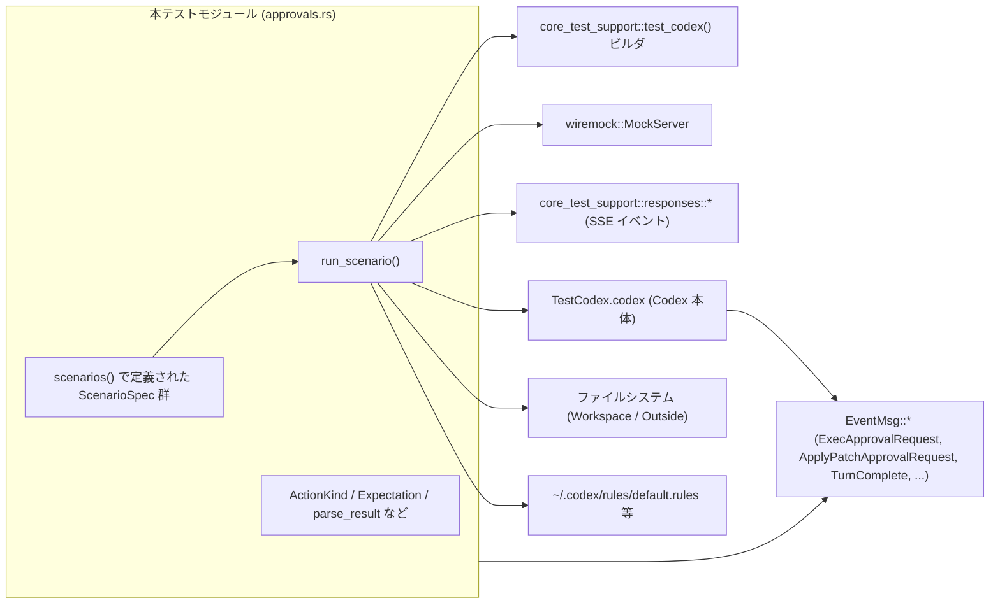
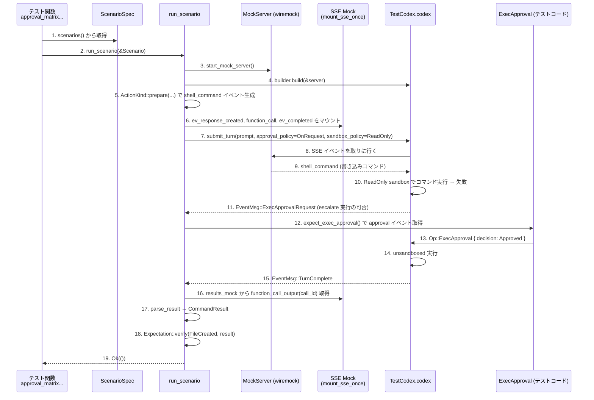

# core/tests/suite/approvals.rs コード解説

> 注: 提供されたコードには行番号情報が含まれていないため、根拠欄の `L?-?` は「このチャンク内に定義があるが正確な行範囲は不明」であることを表します（例: `approvals.rs:L?-?`）。  

---

## 0. ざっくり一言

Codex の「実行・ファイル操作・ネットワークアクセス」に関する承認フロー（approval）とサンドボックス設定が、様々な組み合わせで正しく動作することを検証する統合テスト群です。  
シナリオ定義（`ScenarioSpec`）をもとに、モックサーバー＋SSE で Codex を駆動し、必要な approval イベントが発火するかと、その後の結果（ファイル・標準出力・ポリシーファイルなど）を検証します。

---

## 1. このモジュールの役割

### 1.1 概要

このテストモジュールは、Codex の次のような振る舞いを検証します。

- ファイル書き込み・コマンド実行・ネットワークアクセス・`apply_patch` などの操作が、
  - 承認ポリシー（`AskForApproval`）  
  - サンドボックスポリシー（`SandboxPolicy`）  
  - 実行権限（`SandboxPermissions` や Feature フラグ）
  の組み合わせに応じて、自動実行／承認要求／拒否されること
- ExecPolicy / NetworkPolicy のルール（prefix rule, network rule）が保存され、  
  以降のセッションや子スレッドに正しく適用されること
- zsh fork や managed network など、特別なランタイム・ネットワーク条件での挙動

### 1.2 アーキテクチャ内での位置づけ

主なコンポーネント間の関係を簡略化すると、次のようになります。



- 本ファイルは **テストハーネス** としての役割を持ち、Codex 本体 (`TestCodex`, `CodexThread` 等) や設定 (`ConfigLayerStack`) を利用して「現実に近い」シナリオを再現しています。
- 具体的なサンドボックス・承認ロジックは `codex_core`, `codex_protocol`, `core_test_support` 側で実装されており、本ファイルはそれらを組み合わせて確認する統合テストという位置づけです。

### 1.3 設計上のポイント

- **シナリオ駆動**  
  - `ScenarioSpec` にテストケースを列挙し、`approval_matrix_covers_all_modes` が全てを一括実行する構成になっています。  
  - シナリオごとに「行いたい操作 (`ActionKind`)」「期待される approval フロー (`Outcome`)」「最終結果の検証 (`Expectation`)」を切り分けています。
- **イベント駆動 + SSE モック**  
  - SSE ストリームを `mount_sse_once` / `mount_sse_once_match` でモックし、Codex が function call を行う流れを実際に再現します。
  - `wait_for_event` / `wait_for_event_with_timeout` を用いて、Tokio の非同期イベントループ上で `EventMsg` を待ち受けます。
- **安全性・ポリシーの検証に特化**  
  - 危険なコマンドやネットワークアクセスは **実際には wiremock / テンポラリディレクトリ / サンドボックス** 上で完結し、ホスト環境に影響を与えないようになっています。
  - ExecPolicy / NetworkPolicy のルールファイル（`rules/default.rules`）への書き込みも、`TempDir` ベースの `home` 配下で完結します。
- **エラーハンドリング**  
  - テスト関数・多くのヘルパーは `anyhow::Result<()>` / `Result<Value>` を返し、`?` 演算子でラップされたエラーをそのままテスト失敗として扱います。
  - 内部の前提が崩れた場合（予期しないイベントが届く等）は `panic!` / `assert!` により即座にテスト失敗となる設計です。

---

## 2. 主要な機能一覧

このモジュールが提供する主な機能を列挙します。

- シナリオ定義:
  - `ScenarioSpec` と `scenarios()` による approval/sandbox 組み合わせマトリクスの定義
- アクション構築:
  - `ActionKind` とその `prepare` メソッドによる「実際に Codex が呼び出す function call イベント (shell_command / exec_command / apply_patch)」の生成
- 結果検証:
  - `Expectation::verify` による exit code / stdout / ファイル存在 / 内容の検証
  - `parse_result` による Codex からの function call 出力のパース
- 承認フロー検証:
  - `expect_exec_approval` / `expect_patch_approval` による approval イベントの待ち受けと検証
  - `wait_for_completion_without_approval` / `wait_for_completion` による「承認なしで完了する／承認後に完了する」挙動の確認
- ポリシー永続化の確認:
  - exec policy (prefix rule / fallback rule) の保存と再利用
  - network policy amendment (allow/deny rule) の保存と再利用
  - subagent (spawned thread) への exec policy 伝播
  - zsh fork ランタイムでの prefix rule 適用
- ネットワーク・サンドボックスの補助:
  - `body_contains` によるリクエストボディ（必要に応じ zstd 解凍）のマッチング
  - `wait_for_spawned_thread` による subagent スレッド検出

---

## 3. 公開 API と詳細解説

このファイルはテスト用モジュールであり外部公開 API はありませんが、  
モジュール内で再利用されている「事実上の公開インターフェース」として、以下の型・関数が中心的に使われています。

### 3.1 型一覧（構造体・列挙体など）

| 名前 | 種別 | 役割 / 用途 | 根拠 |
|------|------|-------------|------|
| `TargetPath` | enum | ワークスペース内／外部のどちらにファイルパスを解決するかを表す。`resolve_for_patch` で実パスを生成。 | `approvals.rs:L?-?` |
| `ActionKind` | enum | テストで行う具体的なアクションの種類（ファイル書き込み、URL フェッチ、コマンド実行、apply\_patch など）を表す。`prepare` で function call イベントを組み立てる。 | `approvals.rs:L?-?` |
| `Expectation` | enum | 期待される最終結果（ファイル作成／非作成、ネットワーク成功／失敗、コマンド成功／失敗など）を表現し、`verify` で検証を行う。 | `approvals.rs:L?-?` |
| `Outcome` | enum | シナリオにおける approval の期待パターン（完全自動 / ExecApproval が必要 / PatchApproval が必要）を表す。 | `approvals.rs:L?-?` |
| `ScenarioSpec` | struct | 1 シナリオ分の設定（名前、approval ポリシー、サンドボックス、アクション、使用 feature、期待 outcome・期待結果）を保持する。 | `approvals.rs:L?-?` |
| `CommandResult` | struct | function call（主にシェルコマンド）の結果を、`exit_code: Option<i64>` と `stdout: String` で表現する。 | `approvals.rs:L?-?` |

※ `TestCodex`, `SandboxPolicy`, `Feature`, `ExecPolicyAmendment`, `NetworkPolicyAmendment` などは他モジュールからのインポートです。詳細実装はこのチャンクには現れません。

### 3.2 重要関数の詳細

#### `ActionKind::prepare(&self, test: &TestCodex, server: &MockServer, call_id: &str, sandbox_permissions: SandboxPermissions) -> Result<(Value, Option<String>)>`

**概要**

- シナリオ中の「行いたい操作」をもとに、Codex が実行する **function call イベント（JSON Payload）** を構築します。
- 同時に、approval フローで検証するための「期待されるコマンド文字列」（シェルコマンドなど）を返します（不要な場合は `None`）。

**引数**

| 引数名 | 型 | 説明 |
|--------|----|------|
| `self` | `&ActionKind` | 実行したいアクション種別。 |
| `test` | `&TestCodex` | テスト環境（cwd, home, thread\_manager など）へのハンドル。パス解決等に使用。 |
| `server` | `&MockServer` | wiremock のモックサーバー。ネットワーク系シナリオでエンドポイントをマウントする。 |
| `call_id` | `&str` | function call の一意な ID。SSE 側、結果取得側ともにこの ID で対応付ける。 |
| `sandbox_permissions` | `SandboxPermissions` | サンドボックスの実行権限（通常 or エスカレーション必須）。イベントの `sandbox_permissions` フィールドに反映。 |

**戻り値**

- `Ok((event, expected_command))`
  - `event: Value` — Codex に渡す function call イベント（`ev_function_call` / `ev_apply_patch_function_call` など）。
  - `expected_command: Option<String>` — approval 検証用に、実際にシェルに渡るコマンド文字列等。apply\_patch function のように不要な場合は `None`。

**内部処理の流れ（抜粋）**

- `WriteFile`:
  - `TargetPath::resolve_for_patch` でパスを決定し、既存ファイルを削除。
  - Python ワンライナーで書き込み・内容表示を行うシェルコマンドを生成。
  - `shell_event` で `shell_command` function call を構築。
- `FetchUrl` / `FetchUrlNoProxy`:
  - `Mock::given(method("GET")).and(path(*endpoint))...` でモックレスポンスをセットアップ。
  - Python スクリプトで urllib を使って HTTP GET を行うコマンドを構築（`FetchUrlNoProxy` は Proxy 無効化）。
  - `shell_event` でイベント生成。
- `RunCommand`:
  - 任意のシェルコマンドを `shell_event` に渡すだけのシンプルなケース。
- `RunUnifiedExecCommand`:
  - `exec_command_event` を使って Unified Exec 経路用の `exec_command` function call を構築。
- `ApplyPatchFunction`:
  - `build_add_file_patch` で patch テキストを組み立て、`ev_apply_patch_function_call` イベントを構築（expected command は `None`）。
- `ApplyPatchShell`:
  - patch テキストを `shell_apply_patch_command` で `apply_patch <<'PATCH' ...` 形式のシェルコマンドに変換し、`shell_event` で実行イベントを作成。

**Examples（使用例）**

新しいシナリオから `ActionKind` を使うイメージです。

```rust
// ワークスペース内に "example.txt" を書き込むシナリオの ActionKind
let action = ActionKind::WriteFile {
    target: TargetPath::Workspace("example.txt"),
    content: "hello",
};

let (event, expected_command) = action
    .prepare(&test, &server, "call-id-1", SandboxPermissions::UseDefault)
    .await?;

// event を SSE ストリームに流し、expected_command は approval 検証に使う
```

**Errors / Panics**

- JSON シリアライズ (`serde_json::to_string`) や `fs::remove_file` などで OS / シリアライズエラーが起きた場合、`anyhow::Error` として `Err` を返します。
- テスト専用コードのため、ユーザー入力に直接依存する場面での panic はありません。

**Edge cases**

- 既存ファイルが存在しない場合の `fs::remove_file` エラーは結果を無視しています（`let _ = fs::remove_file(&path);`）。  
  → ファイルの有無に関わらず「書き込みテスト」を実行できるようにするためです。
- URL 内に `'` が含まれる場合、`.replace('\'', "\\'")` でエスケープしてから Python コードに埋め込んでいます。

**使用上の注意点**

- `prepare` は wiremock のモックサーバーへの操作を含むため、**必ず `MockServer` が起動済みであること**が前提です。
- `SandboxPermissions::RequireEscalated` を指定した場合、Unified Exec フローなどで **必ず approval が必要になる**シナリオを構成できます。

---

#### `Expectation::verify(&self, test: &TestCodex, result: &CommandResult) -> Result<()>`

**概要**

- 1 シナリオの「最終結果」が期待どおりかどうかを検証します。
- exit code, stdout, ファイルの存在・内容などを case ごとにチェックし、期待から外れていれば `assert!` / `panic!` によりテストを失敗させます。

**引数**

| 引数名 | 型 | 説明 |
|--------|----|------|
| `self` | `&Expectation` | 期待パターン（ファイル作成 / 非作成、ネットワーク成功 / 失敗など）。 |
| `test` | `&TestCodex` | ワークスペースパスなどの解決に使用。 |
| `result` | `&CommandResult` | `parse_result` で抽出した実行結果。 |

**戻り値**

- 正常時は `Ok(())`。  
- 条件違反時は `assert!` / `panic!` によりテストが失敗し、`Result` 自体は返されません（Rust テストの標準的なスタイル）。

**内部処理の流れ（例）**

- `FileCreated`:
  - `result.exit_code == Some(0)` を要求。
  - `result.stdout` に期待文字列 `content` が含まれること。
  - 対象ファイルを読み込み、内容に `content` が含まれること。
  - 検証後にファイルを削除。
- `FileNotCreated`:
  - `exit_code != Some(0)` を要求（非ゼロ終了）。
  - `message_contains` の各文字列が `stdout` に含まれることを確認。  
    - 文字列中に `|` があれば「いずれかを含めばよい」という OR 条件でチェック。
  - 対象パスにファイルが存在しないこと。
- `NetworkSuccess` / `NetworkFailure`:
  - 成功系: `exit_code == Some(0)`、`stdout` に `"OK:"` と期待 body 文字列が含まれること。
  - 失敗系: `exit_code != Some(0)`、`stdout` に `"ERR:"` と失敗タグが含まれること。
- `CommandSuccess` / `CommandFailure`:
  - 成功系: `exit_code == Some(0)`、`stdout` にキーワードが含まれること。
  - 失敗系: `exit_code != Some(0)`、`stdout` にエラーメッセージが含まれること。

**Edge cases**

- 一部の `*NoExitCode` 系バリアントでは、`exit_code.is_none() || exit_code == Some(0)` を許容しており、  
  モデルや実装差異により exit code が得られないケースもテストが通るよう配慮されています。
- OS ごとにエラーメッセージが異なるケース（Permission denied / Operation not permitted / Read-only file system）は、  
  `needle` に `|` 区切りで複数候補を列挙して吸収しています。

**使用上の注意点**

- `verify` 内でファイル削除を行うバリアントがあるため、**検証後にファイルが残っていることを期待してはいけません。**
- テストの可読性のため、`message_contains` の文字列はユーザー向けメッセージにできるだけ近づけておくと、不一致時のデバッグが容易になります。

---

#### `submit_turn(test: &TestCodex, prompt: &str, approval_policy: AskForApproval, sandbox_policy: SandboxPolicy) -> Result<()>`

**概要**

- Codex の「ユーザーターン」を開始するヘルパーです。
- 現在のセッション設定（モデルなど）を踏襲しつつ、与えられた `prompt` と approval/sandbox ポリシーで `Op::UserTurn` を送信します。

**引数**

| 引数名 | 型 | 説明 |
|--------|----|------|
| `test` | `&TestCodex` | Codex インスタンスおよびセッション設定へのアクセス。 |
| `prompt` | `&str` | ユーザーからのメッセージ。 |
| `approval_policy` | `AskForApproval` | このターンの approval ポリシー（OnRequest / UnlessTrusted / OnFailure / Never）。 |
| `sandbox_policy` | `SandboxPolicy` | このターンのサンドボックス設定。 |

**戻り値**

- `Ok(())` — 送信が成功した場合。
- エラー時は `anyhow::Error` でラップされて返ります（ネットワークや内部状態による）。

**内部処理の流れ**

1. セッションに設定されているモデルを取得 (`test.session_configured.model.clone()`).
2. `Op::UserTurn` を組み立て:
   - `items` に `UserInput::Text { text: prompt.into(), text_elements: Vec::new() }` を設定。
   - `cwd` を `test.cwd.path().to_path_buf()` に設定（ワークスペースディレクトリ）。
   - `approval_policy` / `sandbox_policy` を引数から設定。
   - その他オプション（`final_output_json_schema` など）は `None`。
3. `test.codex.submit(...)` を await し、結果を返す。

**使用例**

```rust
// approval_policy と sandbox_policy を既に構築済みとする
submit_turn(
    &test,
    "please write a file",
    approval_policy,
    sandbox_policy.clone(),
).await?;
```

**使用上の注意点**

- `sandbox_policy` を `clone()` して渡している箇所が多く、ポリシーオブジェクトが大きい場合は clone コストに注意が必要です（テストでは問題になりにくい前提です）。
- 実運用コードでは、この関数に相当する部分に **入力バリデーション** や **監査ログ** を追加するのが一般的です。

---

#### `parse_result(item: &Value) -> CommandResult`

**概要**

- Codex から返される function call 出力（JSON 文字列）を `CommandResult` にパースします。
- JSON 形式である場合と、テキスト形式（Exit code / Output）の場合の両方をサポートします。

**引数**

| 引数名 | 型 | 説明 |
|--------|----|------|
| `item` | `&Value` | `results_mock.single_request().function_call_output(call_id)` などで取得した JSON オブジェクト。 |

**戻り値**

- `CommandResult { exit_code: Option<i64>, stdout: String }`  
  - `exit_code` は取得できない場合（テキスト形式でコード不明など）は `None`。

**内部処理の流れ**

1. `item["output"]` を文字列として取得（`expect("shell output payload")` で存在を前提）。
2. `serde_json::from_str::<Value>(output_str)` を試みる。
   - 成功:
     - `exit_code = parsed["metadata"]["exit_code"].as_i64()`。
     - `stdout = parsed["output"].as_str().unwrap_or_default().to_string()`。
   - 失敗:
     - 正規表現 `structured`  
       `r"(?s)^Exit code:\s*(-?\d+).*?Output:\n(.*)$"` を試す。
     - 次に `regex`  
       `r"(?s)^.*?Process exited with code (\d+)\n.*?Output:\n(.*)$"` を試す。
     - いずれかがマッチした場合:
       - キャプチャから exit code と出力を取り出して `CommandResult` を構築。
     - どれにもマッチしない場合:
       - `exit_code: None`, `stdout: output_str.to_string()` として直接格納。

**Edge cases**

- exit code が負の値 (`-1` など) も許容するため、`-?\d+` でパースしています。
- JSON 形式で `metadata.exit_code` が存在しない場合は `None` になります。
- テキスト形式が想定外のフォーマットだった場合、`exit_code` は `None` となり、上位の `Expectation` が `*NoExitCode` バリアントで吸収する前提です。

**使用上の注意点**

- `item["output"]` が存在しないと `expect` により panic するため、**テスト用に信頼できる形でのみ使用される前提**です。
- 実運用コードでは、パース失敗時により詳細なエラーを返すなど、挙動を変える必要があるかもしれません。

---

#### `expect_exec_approval(test: &TestCodex, expected_command: &str) -> ExecApprovalRequestEvent`

**概要**

- Codex からの `EventMsg::ExecApprovalRequest` を 1 件待ち受け、  
  その内容が期待するコマンドと一致していることを検証します。
- もし `TurnComplete` が先に来れば「approval 要求が来るべきシナリオで来なかった」とみなし panic します。

**引数**

| 引数名 | 型 | 説明 |
|--------|----|------|
| `test` | `&TestCodex` | イベントを受け取る `CodexThread` へのハンドル。 |
| `expected_command` | `&str` | approval の対象となるべきコマンド文字列（シェルコマンドなど）。 |

**戻り値**

- `ExecApprovalRequestEvent` — 受信した approval リクエストイベント（以降の `Op::ExecApproval` 送信に使用）。

**内部処理の流れ**

1. `wait_for_event(&test.codex, |event| matches!(..., ExecApprovalRequest(_) | TurnComplete(_)))` でイベントを待つ。
2. 受信イベントが:
   - `ExecApprovalRequest(approval)` の場合:
     - `approval.command.last()`（最後の引数）を取り出し、`expected_command` と一致することを `assert_eq!`。
     - `approval` を返す。
   - `TurnComplete(_)` の場合:
     - `panic!("expected approval request before completion")`。
   - それ以外の場合:
     - `panic!("unexpected event: {other:?}")`。

**Edge cases**

- `approval.command` が空であれば `last().unwrap_or_default()` で空文字列比較になり、  
  期待コマンドと一致しないためテスト失敗になります。

**使用上の注意点**

- コマンド比較は **最後の引数のみ** で行われています。  
  これは `["/bin/sh", "-lc", "echo hello"]` のような実際のコマンド配列から、  
  人間が読みたい「実行対象コマンド部分」だけを比較するための設計です。
- approval 以外のイベント（例: 他種の function call）が先に来るケースは、フィルタ条件で除外されています。

---

#### `expect_patch_approval(test: &TestCodex, expected_call_id: &str) -> ApplyPatchApprovalRequestEvent`

**概要**

- `apply_patch` 関連の `EventMsg::ApplyPatchApprovalRequest` を待ち受け、指定した `call_id` と一致することを検証します。
- コマンド文字列ではなく `call_id` 単位で照合する点が `expect_exec_approval` と異なります。

（引数・戻り値・内部フローは `expect_exec_approval` とほぼ同様のため詳細は省略します）

---

#### `wait_for_spawned_thread(test: &TestCodex) -> Result<Arc<CodexThread>>`

**概要**

- コラボレーション機能（`Feature::Collab`）などにより **親セッションから spawn された sub-agent スレッド** を検出し、その `CodexThread` を返します。
- 一定時間内に見つからない場合はタイムアウトします。

**引数**

| 引数名 | 型 | 説明 |
|--------|----|------|
| `test` | `&TestCodex` | `thread_manager` へのアクセスを提供するテスト環境。 |

**戻り値**

- `Ok(Arc<CodexThread>)` — 見つかった子スレッド。
- `Err(anyhow::Error)` — タイムアウトまたは `get_thread` 失敗時。

**内部処理**

1. `deadline = now + 2秒` を設定。
2. ループ:
   - `ids = test.thread_manager.list_thread_ids().await` でスレッド ID 一覧を取得。
   - `ids.iter().find(|id| **id != test.session_configured.session_id)` で親セッション以外を探す。
   - 見つかれば `get_thread(*thread_id).await` して返す。
   - `now >= deadline` であれば `anyhow::bail!("timed out waiting for spawned thread")`。
   - 見つからなければ `tokio::time::sleep(10ms).await` してリトライ。

**並行性に関する注意**

- `list_thread_ids` / `get_thread` は非同期メソッドであり、Tokio ランタイム上で安全に呼び出されています。
- 2 秒という比較的短いタイムアウトを設けることで、テストがハングしないようになっています。

---

#### `run_scenario(scenario: &ScenarioSpec) -> Result<()>`

**概要**

- 1 つの `ScenarioSpec` を実行し、approval フローおよび最終結果を検証する中核関数です。
- `approval_matrix_covers_all_modes` テストから全シナリオに対して呼び出されます。

**引数**

| 引数名 | 型 | 説明 |
|--------|----|------|
| `scenario` | `&ScenarioSpec` | 実行したいシナリオ定義。 |

**戻り値**

- `Ok(())` — シナリオが期待どおりに動作した場合。
- `Err(anyhow::Error)` — Codex 呼び出しやファイル操作などでエラーが発生した場合（テスト失敗）。

**内部処理の流れ（要約）**

1. ログ出力（`eprintln!("running approval scenario: {}", scenario.name);`）。
2. wiremock サーバを起動 (`start_mock_server().await`)。
3. `test_codex()` ビルダに対して:
   - モデルを `scenario.model_override.unwrap_or("gpt-5.1")` に設定。
   - `config.permissions.approval_policy` / `sandbox_policy` にシナリオの値を設定。
   - `features` 配列に含まれる機能を enable。
4. `builder.build(&server).await` で `TestCodex` を構築。
5. `scenario.action.prepare(...)` で function call イベントと期待コマンドを取得。
6. SSE モックをセットアップ:
   - 第 1 ストリーム: `ev_response_created`, 準備したイベント, `ev_completed`。
   - 第 2 ストリーム: `ev_assistant_message`, `ev_completed`（結果取得用）。
7. `submit_turn(...)` でユーザーターンを開始。
8. `scenario.outcome` に応じて:
   - `Auto`: `wait_for_completion_without_approval(&test).await`。
   - `ExecApproval`: `expect_exec_approval` で approval を受信し、必要なら reason を検証。  
     その後 `Op::ExecApproval` を送信し、`wait_for_completion`。
   - `PatchApproval`: `expect_patch_approval` で approval を受信し、必要なら reason を検証。  
     その後 `Op::PatchApproval` を送信し、`wait_for_completion`。
9. `results_mock.single_request().function_call_output(call_id)` から結果を取得し、`parse_result` で `CommandResult` に変換。
10. `scenario.expectation.verify(&test, &result)?` で最終結果を検証。

**使用上の注意点**

- `ScenarioSpec` に設定する `Outcome` を誤ると、「approval が必要なのに Auto で進んでしまう」「その逆」といった誤検証になります。  
  → 期待するフローを正確に `Outcome` に反映することが重要です。
- `features` で必要な機能（`Feature::UnifiedExec`, `Feature::Collab`, `Feature::ApplyPatchFreeform` など）を有効化し忘れると、  
  シナリオ通りのイベントが発火しない可能性があります。

---

### 3.3 その他の関数一覧（コンポーネントインベントリ）

テスト内で使用されるヘルパー関数とテスト関数を一覧で整理します。

#### ヘルパー関数

| 関数名 | 役割（1 行） | 根拠 |
|--------|--------------|------|
| `TargetPath::resolve_for_patch` | `TestCodex` の cwd またはカレントディレクトリから、実際のファイルパスと論理パス文字列を生成する。 | `approvals.rs:L?-?` |
| `build_add_file_patch` | `apply_patch` 互換の「新規ファイル追加」パッチ文字列 (`*** Begin Patch` 形式) を生成する。 | `approvals.rs:L?-?` |
| `shell_apply_patch_command` | `apply_patch <<'PATCH' ... PATCH` 形式のシェルスクリプト文字列を組み立てる。 | `approvals.rs:L?-?` |
| `shell_event` | `shell_command` function call の JSON 引数を構築し、`ev_function_call` を返す。 | `approvals.rs:L?-?` |
| `shell_event_with_prefix_rule` | prefix rule を含めた `shell_command` function call を構築する拡張版。 | `approvals.rs:L?-?` |
| `exec_command_event` | Unified Exec 用の `exec_command` function call イベントを構築する。 | `approvals.rs:L?-?` |
| `wait_for_completion_without_approval` | `ExecApprovalRequest` が来ないことを保証しつつ、`TurnComplete` を待つ。 | `approvals.rs:L?-?` |
| `wait_for_completion` | `TurnComplete` イベントが届くまでブロックする。 | `approvals.rs:L?-?` |
| `body_contains` | wiremock `Request` のボディを（必要なら zstd 解凍した上で）文字列として検索する。 | `approvals.rs:L?-?` |
| `scenarios` | approval/sandbox/feature/モデルの組み合わせを網羅する `Vec<ScenarioSpec>` を構築する。 | `approvals.rs:L?-?` |

#### テスト関数（Tokio テスト）

| 関数名 | 役割（1 行） | 根拠 |
|--------|--------------|------|
| `approval_matrix_covers_all_modes` | `scenarios()` で定義された全シナリオを `run_scenario` で実行する総合テスト。 | `approvals.rs:L?-?` |
| `approving_apply_patch_for_session_skips_future_prompts_for_same_file` | あるファイルへの `apply_patch` を `ApprovedForSession` すると、同セッション中の同ファイル patch には再度の承認が不要になることを確認。 | `approvals.rs:L?-?` |
| `approving_execpolicy_amendment_persists_policy_and_skips_future_prompts` | ExecPolicyAmendment を承認すると prefix rule が `rules/default.rules` に保存され、同一コマンドに対する承認が以後不要になることを検証。 | `approvals.rs:L?-?` |
| `spawned_subagent_execpolicy_amendment_propagates_to_parent_session` | sub-agent（spawn された子スレッド）で承認した exec policy が親セッションにも適用されることを検証。 | `approvals.rs:L?-?` |
| `matched_prefix_rule_runs_unsandboxed_under_zsh_fork` | zsh fork ランタイム + prefix rule により、許可されたコマンドが unsandboxed で実行されることを確認。 | `approvals.rs:L?-?` |
| `invalid_requested_prefix_rule_falls_back_for_compound_command` | 不適切な prefix rule（複合コマンドに対して単一コマンドパターン）が要求された場合に、fallback としてフルコマンドに対する exec policy amendment が提案されることを検証。 | `approvals.rs:L?-?` |
| `approving_fallback_rule_for_compound_command_works` | fallback exec policy を承認すると、同じ複合コマンドが以後 approval なしで実行できることを検証。 | `approvals.rs:L?-?` |
| `denying_network_policy_amendment_persists_policy_and_skips_future_network_prompt` | NetworkPolicyAmendment で「特定ホストへのアクセス deny」ルールを保存すると、以後同ホストへのアクセス時に承認が不要かつ失敗が一貫することを検証。 | `approvals.rs:L?-?` |
| `compound_command_with_one_safe_command_still_requires_approval` | 部分的に安全な prefix rule が存在しても、危険なコマンドを含む複合コマンド全体としては approval が必要なことを検証。 | `approvals.rs:L?-?` |

---

## 4. データフロー（代表シナリオ）

ここでは、`run_scenario` を通じた典型的な approval フローのデータ流れを示します。

### シナリオ: 「read_only_on_request_requires_approval」

- 読み取り専用サンドボックス (`SandboxPolicy::new_read_only_policy`) 下で、ワークスペースにファイルを書き込もうとする。
- `approval_policy = OnRequest` なので、書き込みコマンドは sandbox error となり、Escalate（サンドボックス無効化）にはユーザー承認が必要。



このフローのポイント:

- **イベント駆動**: Codex は SSE で function call を取得し、実行結果や approval 要求を `EventMsg` として返します。
- **テスト側の介入**: テストコードは approval 要求に対して `Op::ExecApproval` / `Op::PatchApproval` を送ることで「ユーザーの意思決定」をシミュレートしています。
- **サンドボックスエラー → エスカレーション**: ReadOnly ポリシー下で書き込みが失敗した後、unsandboxed 実行への切り替えに approval が必要になります。

---

## 5. 使い方（How to Use）

このモジュールはテスト用ですが、新たな approval シナリオを追加したい場合に役立つ使い方を整理します。

### 5.1 基本的な使用方法（新しい ScenarioSpec の追加）

1. `scenarios()` の `Vec<ScenarioSpec>` に新しい要素を追加する。
2. `ActionKind` と `Expectation`、`Outcome` を適切に組み合わせる。

```rust
// 例: 新しいファイル書き込みシナリオを追加する
ScenarioSpec {
    name: "workspace_write_on_failure_escalates",
    approval_policy: AskForApproval::OnFailure,           // 失敗時にだけエスカレーションを求める
    sandbox_policy: SandboxPolicy::new_read_only_policy(),// 読み取り専用
    action: ActionKind::WriteFile {
        target: TargetPath::Workspace("on_failure.txt"),  // ワークスペース内
        content: "on-failure-escalation",                 // 書き込む内容
    },
    sandbox_permissions: SandboxPermissions::UseDefault,  // 通常権限
    features: vec![],                                     // 特別な feature は不要
    model_override: Some("gpt-5.1"),                      // モデル指定（任意）
    outcome: Outcome::ExecApproval {
        decision: ReviewDecision::Approved,               // エスカレーションを許可する想定
        expected_reason: Some("command failed; retry without sandbox?"),
    },
    expectation: Expectation::FileCreated {
        target: TargetPath::Workspace("on_failure.txt"),
        content: "on-failure-escalation",
    },
}
```

このシナリオは `approval_matrix_covers_all_modes` から自動的に実行されます。

### 5.2 よくある使用パターン

- **ファイル書き込みの制御**:
  - `ActionKind::WriteFile` + `SandboxPolicy::new_read_only_policy()` で「サンドボックスにより禁止された書き込み」を表現。
  - `Outcome::ExecApproval` を組み合わせて「失敗後に unsandboxed 実行するか」を検証。
- **ネットワークアクセスの制御**:
  - `ActionKind::FetchUrl` / `FetchUrlNoProxy` を使い、`SandboxPolicy` の `network_access` フラグや managed network の設定に応じた挙動を検証。
  - `denying_network_policy_amendment_persists_policy_and_skips_future_network_prompt` のように、NetworkPolicyAmendment によるルール保存もテスト可能。
- **Unified Exec / ExecPolicy ルール**:
  - `ActionKind::RunUnifiedExecCommand` と `Feature::UnifiedExec` を使い、Unified Exec に特化した approval フローを検証。
  - `Approving_execpolicy_amendment_*` / `invalid_requested_prefix_rule_*` などのテストが参考になります。

### 5.3 よくある間違い

```rust
// 間違い例: Feature を有効化せずに Unified Exec を使おうとしている
ScenarioSpec {
    // ...
    action: ActionKind::RunUnifiedExecCommand {
        command: "echo hello",
        justification: None,
    },
    features: vec![], // ← UnifiedExec を有効化していない
    // ...
}

// 正しい例: 必要な Feature を明示的に有効化する
ScenarioSpec {
    // ...
    action: ActionKind::RunUnifiedExecCommand {
        command: "echo hello",
        justification: None,
    },
    features: vec![Feature::UnifiedExec],
    // ...
}
```

```rust
// 間違い例: approval が必要なシナリオなのに Outcome::Auto にしている
ScenarioSpec {
    // ...
    outcome: Outcome::Auto, // ← ExecApproval を期待すべきケースでは誤り
    expectation: Expectation::CommandSuccess {
        stdout_contains: "trusted-unless",
    },
}

// 正しい例: ExecApproval を期待する Outcome にする
ScenarioSpec {
    // ...
    outcome: Outcome::ExecApproval {
        decision: ReviewDecision::Denied,
        expected_reason: None,
    },
    expectation: Expectation::CommandFailure {
        output_contains: "rejected by user",
    },
}
```

### 5.4 使用上の注意点（まとめ）

- **前提条件**
  - `skip_if_no_network!` マクロが付与されているテストは、ネットワーク利用が許可されている環境でのみ意味を持ちます。
  - `zsh_fork_runtime` が `None` を返した場合、zsh fork 関連テストは早期 return でスキップされます。
- **承認ポリシーの組み合わせ**
  - `OnRequest` / `UnlessTrusted` / `OnFailure` / `Never` の違いが approval 要求タイミングに大きく影響します。  
    シナリオ設計時には、この違いを明確に意識する必要があります。
- **並行性**
  - `#[tokio::test(flavor = "multi_thread", worker_threads = 2)]` のテストでは、**イベントの順序** に依存するテストが壊れないよう、  
    `wait_for_event` のフィルタ条件を慎重に設計することが重要です。
- **ファイル・ルールの掃除**
  - 多くのテストは最後にファイルを削除していますが、`TempDir` ベースの `home` / `cwd` を使っているといっても、  
    新しいテストを追加する際は **ファイルクリーンアップを忘れない** ことが望ましいです。

---

## 6. 変更の仕方（How to Modify）

### 6.1 新しい機能を追加する場合

例: 新しい種類の「アクション」をテストしたい（例: 別種の function call）。

1. **ActionKind にバリアントを追加**
   - `enum ActionKind` に `NewAction { ... }` を追加。
   - `prepare` 内の `match self` に新パターンを追加し、対応する function call イベントを構築する。

2. **Expectation に結果バリアントを追加（必要なら）**
   - 新しいアクション固有の結果検証が必要であれば、`enum Expectation` にバリアントを追加し、`verify` に検証ロジックを追加。

3. **ScenarioSpec にシナリオを追加**
   - `scenarios()` に 1 つ以上の `ScenarioSpec` を追加し、`Outcome` / `Expectation` と組み合わせる。

4. **個別テスト関数の追加（オプション）**
   - 複雑なポリシー永続化など、マトリクスだけでは表現しにくいケースは、既存の個別テスト関数を参考に新しい `#[tokio::test]` を追加する。

### 6.2 既存の機能を変更する場合

- **影響範囲の確認方法**
  - `ActionKind` / `Expectation` / `ScenarioSpec` は `approval_matrix_covers_all_modes` と多くの個別テストで利用されています。  
    → 変更時は `scenarios()` と、関連するテスト関数の利用箇所を `rg` / `grep` 等で確認するのが有効です。
- **前提条件・契約**
  - `expect_exec_approval` / `expect_patch_approval` は「必ず approval が来る」前提で書かれており、この契約が崩れるとテストが意図と異なる失敗をします。
  - `parse_result` は `item["output"]` の存在を前提に `expect` しています。フォーマットを変える場合は、ここを合わせて更新する必要があります。
- **テストの更新**
  - ExecPolicy / NetworkPolicy のルール文字列フォーマットを変更する場合は、関連テスト（`approving_execpolicy_amendment_*`, `denying_network_policy_amendment_*` など）の期待文字列も合わせて修正する必要があります。
  - OS ごとのエラーメッセージの差異を考慮している部分（`Permission denied|Read-only file system` など）を変更する際は、`cfg(target_os = "...")` との整合性に注意します。

---

## 7. 関連ファイル

このモジュールと密接に関係する外部ファイル・モジュールを列挙します（コードはこのチャンクには含まれませんが、`use` 句から読み取れる範囲で記述します）。

| パス / モジュール | 役割 / 関係 |
|------------------|------------|
| `core_test_support::test_codex` | `TestCodex` ビルダとテスト環境（cwd, home, CodexThread など）を提供し、本モジュールのほぼ全テストで使用されます。 |
| `core_test_support::responses::*` | `ev_function_call`, `ev_apply_patch_function_call`, `ev_assistant_message`, `ev_completed` などの SSE イベントヘルパーを提供し、Codex とのやり取りをモックします。 |
| `core_test_support::wait_for_event`, `wait_for_event_with_timeout` | `EventMsg` を受け取るための非同期ヘルパー。approval や turn completion の待ち受けに使用されます。 |
| `core_test_support::zsh_fork::*` | zsh fork ランタイムを利用したテスト（`matched_prefix_rule_runs_unsandboxed_under_zsh_fork`）向けのセットアップ関数とポリシー。 |
| `codex_core::sandboxing::SandboxPermissions` / `SandboxPolicy` | ファイル / ネットワーク / コマンド実行権限を記述するサンドボックス設定。本モジュールのシナリオで集中的に組み合わせ検証されます。 |
| `codex_protocol::protocol::{AskForApproval, ExecApprovalRequestEvent, ApplyPatchApprovalRequestEvent, Op, ReviewDecision, SandboxPolicy}` | approval ポリシーや approval リクエストイベント・オペレーション種別を定義するプロトコル。`Op::UserTurn`, `Op::ExecApproval`, `Op::PatchApproval` などが本モジュールから送信されます。 |
| `codex_protocol::approvals::{NetworkApprovalProtocol, NetworkPolicyAmendment, NetworkPolicyRuleAction}` | ネットワークアクセスに関する approval とポリシー変更を表現する型。network policy 関連テストで使用されます。 |
| `codex_core::config_loader::{ConfigLayerStack, NetworkConstraints, NetworkRequirementsToml, RequirementSource, Sourced}` | managed network requirements 機能に関わる設定スタック。`denying_network_policy_amendment_persists_policy_and_skips_future_network_prompt` で使用されます。 |
| `wiremock::*` | HTTP モックサーバー。ネットワークアクセスシナリオで外部サービスの代わりに使用されます。 |

このように、本ファイルは Codex の sandbox/approval/ネットワークポリシー機構と `core_test_support` のテストインフラをつなぐ **統合テストハーネス** として機能しています。
