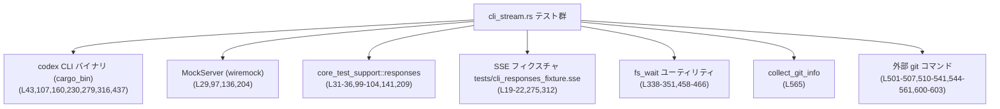
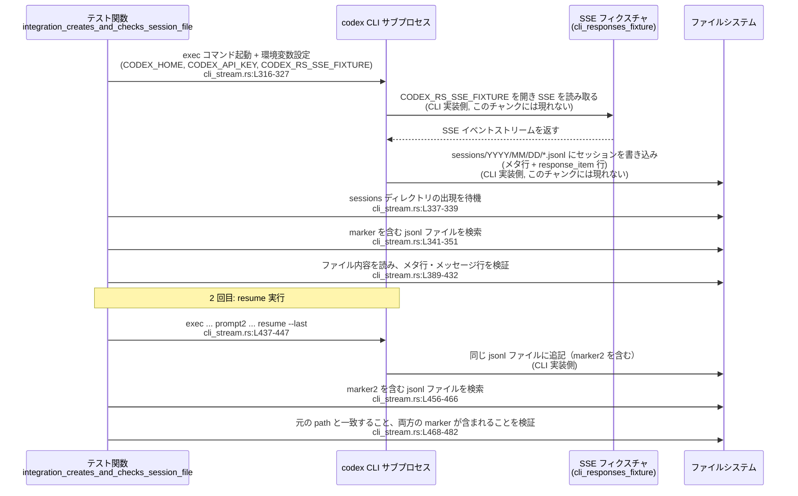

# core/tests/suite/cli_stream.rs

## 0. ざっくり一言

Codex CLI の「ストリーミング応答（Responses API）」「SSE フィクスチャ駆動実行」「セッションファイル出力」「Git メタデータ収集」まわりの振る舞いを、エンドツーエンドに近い形で検証する統合テスト群です（`cli_stream.rs:L24-628`）。

---

## 1. このモジュールの役割

### 1.1 概要

- このモジュールは Codex CLI の以下の振る舞いを検証するために存在します。
  - Responses API ストリーミング経由での対話実行と HTTP 経路の検証（`/v1/responses` であること）（`cli_stream.rs:L24-68, L92-125`）
  - `model_instructions_file`／プロファイル設定がリクエストボディの `instructions` に反映されること（`cli_stream.rs:L127-195, L197-263`）
  - SSE フィクスチャファイル（`tests/cli_responses_fixture.sse`）を使ったオフライン実行と標準出力の確認（`cli_stream.rs:L265-296`）
  - セッションファイルの生成レイアウトと JSONL 形式の内容、再開（resume）時の追記動作（`cli_stream.rs:L298-484`）
  - `collect_git_info` による Git メタデータ収集とシリアライズの検証（`cli_stream.rs:L486-628`）

### 1.2 アーキテクチャ内での位置づけ

このテストモジュールは、次のようなコンポーネントと連携します。

- Codex CLI バイナリ `codex` をサブプロセスとして起動し、挙動を検証（`AssertCommand::new` 経由、`cli_stream.rs:L43, L107, L160, L230, L279, L316, L437`）
- HTTP レイヤは `wiremock::MockServer` によるモックサーバ、または SSE フィクスチャファイルで代替（`cli_stream.rs:L29-36, L97-104, L136-142, L204-210, L275-276, L312-313`）
- テスト専用ヘルパー `core_test_support::{responses, fs_wait, skip_if_no_network}` を利用（`cli_stream.rs:L6-8, L31-36, L99-104, L141, L209, L338-351, L458-466`）
- Git 情報は `codex_git_utils::collect_git_info` を直接呼び出して検証（`cli_stream.rs:L2, L565`）

依存関係の概略は次のとおりです。



### 1.3 設計上のポイント

- **ネットワーク依存性の明示的な制御**  
  すべてのテストは `skip_if_no_network!()` マクロでガードされ、ネットワーク制限のある環境ではスキップされるようになっています（`cli_stream.rs:L27, L95, L132, L202, L273, L302`）。  
  `integration_creates_and_checks_session_file` は SSE フィクスチャだけを使いますが、CI と同条件を保つため `skip_if_no_network!(Ok(()))` を使っています（`cli_stream.rs:L298-303`）。

- **非同期・並行性**  
  すべてのテストは `#[tokio::test(flavor = "multi_thread", worker_threads = 2)]` で実行されます（`cli_stream.rs:L25, L93, L130, L200, L271, L299, L487`）。  
  各テスト内の処理は基本的に逐次実行であり、明示的な並列タスク生成は行っていません。

- **モックサーバと SSE フィクスチャによる疎結合テスト**  
  - HTTP 呼び出し系テストは `MockServer` + `core_test_support::responses` で SSE をエミュレート（`cli_stream.rs:L29-36, L97-104, L136-142, L204-210`）。
  - オフライン実行系テストは `CODEX_RS_SSE_FIXTURE` 環境変数を使って、CLI に対しローカル SSE ファイルを読み込ませています（`cli_stream.rs:L275-276, L288-290, L312-313, L325-327, L449-450`）。

- **契約仕様をテストが定義**  
  - HTTP パス `/v1/responses` でリクエストされること（`cli_stream.rs:L67-68, L123-124`）。
  - `model_instructions_file` がリクエスト JSON の `instructions` フィールドに含まれること（`cli_stream.rs:L185-193, L253-261`）。
  - セッションファイルのディレクトリ構造が `sessions/YYYY/MM/DD/<file>.jsonl` であること（`cli_stream.rs:L353-381`）。
  - Git 情報に含まれる commit hash が 40 文字の 16 進数であること、branch 名と remote URL が期待通りであること（`cli_stream.rs:L573-582, L585-590, L593-612`）。

---

## 2. 主要な機能一覧（コンポーネントインベントリ）

このモジュール内の関数（テスト関数を含む）と役割の一覧です。

| 名前 | 種別 | 役割 / 用途 | 定義位置 |
|------|------|-------------|----------|
| `repo_root` | 関数 | リポジトリルートパスを解決して返すヘルパー | `cli_stream.rs:L14-17` |
| `cli_responses_fixture` | 関数 | `tests/cli_responses_fixture.sse` のパスを解決するヘルパー | `cli_stream.rs:L19-22` |
| `responses_mode_stream_cli` | 非同期テスト | モック Responses API 経由の CLI ストリーミングと `/v1/responses` 呼び出し、標準出力へのメッセージを検証 | `cli_stream.rs:L24-90` |
| `responses_mode_stream_cli_supports_openai_base_url_config_override` | 非同期テスト | `openai_base_url` コンフィグでビルトイン OpenAI プロバイダの呼び出し先が上書きされることを検証 | `cli_stream.rs:L92-125` |
| `exec_cli_applies_model_instructions_file` | 非同期テスト | `-c model_instructions_file=...` オプションがリクエストボディの `instructions` フィールドを置き換えることを検証 | `cli_stream.rs:L127-195` |
| `exec_cli_profile_applies_model_instructions_file` | 非同期テスト | `--profile` 経由のプロファイル設定 `model_instructions_file` がリクエストに適用されることを検証 | `cli_stream.rs:L197-263` |
| `responses_api_stream_cli` | 非同期テスト | SSE フィクスチャファイルを使って Responses API ストリーミングをオフラインで再生し、CLI の標準出力を検証 | `cli_stream.rs:L265-296` |
| `integration_creates_and_checks_session_file` | 非同期テスト | CLI 実行によるセッションファイル生成と、`resume --last` による追記を検証するエンドツーエンドテスト | `cli_stream.rs:L298-484` |
| `integration_git_info_unit_test` | 非同期テスト | `collect_git_info` の Git メタデータ収集と `GitInfo` のシリアライズ／デシリアライズを検証 | `cli_stream.rs:L486-628` |

---

## 3. 公開 API と詳細解説

### 3.1 型一覧（構造体・列挙体など）

このモジュール内で新たに定義される構造体・列挙体はありません。

外部から読み込んで使用している主な型は次のとおりです。

| 名前 | 種別 | 役割 / 用途 | 根拠 |
|------|------|-------------|------|
| `GitInfo` | 構造体（外部 crate） | Git メタデータ（`commit_hash`・`branch`・`repository_url`）を保持し、セッションメタにシリアライズされる想定。ここでは値の有無・形式と JSON シリアライズを検証 | `use codex_protocol::protocol::GitInfo;`（`cli_stream.rs:L4`）、フィールド参照 `cli_stream.rs:L573-582, L585-590, L593-597, L623-625` |

### 3.2 関数詳細（重要 7 件）

#### `responses_mode_stream_cli()`

**概要**

- モック Responses API サーバを立ち上げ、Codex CLI を `exec` モードで起動し、SSE で流れてくるメッセージ `"hi"` が標準出力にちょうど 1 回だけ現れることと、HTTP パス `/v1/responses` が呼ばれることを検証します（`cli_stream.rs:L24-68`）。

**引数**

- なし（非同期テスト関数）。テストフレームワークから直接呼び出されます。

**戻り値**

- 戻り値は `()`（暗黙）。`#[tokio::test]` によりテストとして実行されます。

**内部処理の流れ**

1. ネットワークが利用できない環境では `skip_if_no_network!()` によりテストをスキップ（`cli_stream.rs:L27`）。
2. `MockServer::start().await` でモック HTTP サーバを起動（`cli_stream.rs:L29`）。
3. `responses::sse(...)` で SSE ストリームイベントを構築し、`mount_sse_once` でサーバに 1 回限りの SSE ハンドラとして登録（`cli_stream.rs:L31-36`）。
4. 一時ホームディレクトリと CLI 設定文字列 `model_providers.mock={...}` を構築（`cli_stream.rs:L38-42`）。
5. `codex_utils_cargo_bin::cargo_bin("codex")` で CLI バイナリパスを取得し、`AssertCommand` で `codex exec` を起動（`cli_stream.rs:L43-55`）。
   - `--skip-git-repo-check` や `-c` オプションでプロバイダ設定、`-C` でリポジトリルートを指定（`cli_stream.rs:L46-54`）。
   - `CODEX_HOME` と `OPENAI_API_KEY` を環境変数で渡す（`cli_stream.rs:L55-56`）。
6. コマンドを実行して出力を取得し、終了ステータスが成功であることを検証（`cli_stream.rs:L58-63`）。
7. 標準出力を行単位で走査し、内容が `"hi"` の行が 1 回だけ出現することを `assert_eq!` で検証（`cli_stream.rs:L63-65`）。
8. `resp_mock.single_request()` でモックサーバが受け取ったリクエストを取得し、`path()` が `"/v1/responses"` であることを検証（`cli_stream.rs:L67-68`）。

**Examples（使用例）**

テストコード内の CLI 呼び出しに相当する実行例は次のようになります（環境変数やパスは簡略化）。

```bash
CODEX_HOME=/tmp/codex-home \
OPENAI_API_KEY=dummy \
codex exec \
  --skip-git-repo-check \
  -c 'model_providers.mock={ name = "mock", base_url = "http://127.0.0.1:12345/v1", env_key = "PATH", wire_api = "responses" }' \
  -c 'model_provider="mock"' \
  -C /path/to/repo \
  'hello?'
```

このとき、CLI は `http://127.0.0.1:12345/v1/responses` に SSE ストリームを要求し、ボディに `"hi"` を含むメッセージを受け取って標準出力に出すことがテストで期待されています（`cli_stream.rs:L31-35, L63-65`）。

**Errors / Panics**

- `MockServer::start().await` や `mount_sse_once` が失敗した場合は `.await` の戻り値でエラーになりますが、ここでは `unwrap` を使用していないため、その部分に直接のパニックはありません（`cli_stream.rs:L29-36`）。  
  一方で:
  - `TempDir::new().unwrap()`（`cli_stream.rs:L38`）
  - `cargo_bin("codex").unwrap()`（`cli_stream.rs:L43`）
  - `cmd.output().unwrap()`（`cli_stream.rs:L58`）  
  などは失敗時にパニックします。
- `assert!(output.status.success())`（`cli_stream.rs:L62`）、`assert_eq!(hi_lines, 1, ...)`（`cli_stream.rs:L65`）、`assert_eq!(request.path(), "/v1/responses")`（`cli_stream.rs:L68`）も期待が満たされない場合にパニックします。

**Edge cases（エッジケース）**

- 標準出力に `"hi"` が 0 回または 2 回以上出力されると `hi_lines != 1` となりテスト失敗になります（`cli_stream.rs:L63-65`）。
- CLI が Responses API 以外のエンドポイント（例: `/v1/chat/completions`）にアクセスするように変わると、`request.path()` アサーションが失敗します（`cli_stream.rs:L67-68`）。
- ネットワークが利用できない環境ではテスト自体がスキップされるため、この振る舞いの検証は行われません（`cli_stream.rs:L27`）。

**使用上の注意点**

- テストの前提として、`codex` バイナリが `cargo_bin("codex")` で解決可能な位置にビルドされている必要があります（`cli_stream.rs:L43`）。
- CLI が `OPENAI_API_KEY` を要求するため、ダミー値であっても環境変数を渡す必要があります（`cli_stream.rs:L55-56`）。  
  これがない場合の CLI の挙動はこのチャンクには現れていません。
- モックサーバの SSE ストリーム構造（`response.created` → `message` → `response.completed`）に依存しているため、API 形式が変わった場合はテストとヘルパー双方の更新が必要です（`cli_stream.rs:L31-35`）。

---

#### `responses_mode_stream_cli_supports_openai_base_url_config_override()`

**概要**

- ビルトイン OpenAI プロバイダを使う場合でも、`-c openai_base_url=".../v1"` 設定により Responses API がモックサーバにルーティングされることを検証します（`cli_stream.rs:L92-125`）。

**引数**

- なし。

**戻り値**

- `()`。

**内部処理の流れ**

1. `skip_if_no_network!()` でネットワーク環境をチェック（`cli_stream.rs:L95`）。
2. モックサーバと SSE ストリーム、`resp_mock` をセットアップ（`cli_stream.rs:L97-104`）。
3. 一時ホームと `codex` バイナリを用意し、`codex exec` を起動（`cli_stream.rs:L106-116`）。
   - `-c openai_base_url=".../v1"` を渡し、`model_provider` の個別指定は行っていません（`cli_stream.rs:L113`）。
4. CLI 実行が成功ステータスで終了することを検証（`cli_stream.rs:L120-121`）。
5. モックサーバに届いたリクエストのパスが `/v1/responses` であることを検証（`cli_stream.rs:L123-124`）。

**Examples（使用例）**

```bash
CODEX_HOME=/tmp/codex-home \
OPENAI_API_KEY=dummy \
codex exec \
  --skip-git-repo-check \
  -c 'openai_base_url="http://127.0.0.1:12345/v1"' \
  -C /path/to/repo \
  'hello?'
```

この設定により、ビルトイン OpenAI プロバイダが `http://127.0.0.1:12345/v1/responses` を対象として Responses API を呼び出すことが期待されています（`cli_stream.rs:L113-114, L123-124`）。

**Errors / Panics**

- `TempDir::new().unwrap()`、`cargo_bin("codex").unwrap()`、`cmd.output().unwrap()` が失敗するとパニック（`cli_stream.rs:L106-108, L120`）。
- CLI が異常終了した場合に `assert!(output.status.success())` でパニック（`cli_stream.rs:L121`）。
- エンドポイントパスが変更された場合は `assert_eq!(request.path(), "/v1/responses")` がパニック（`cli_stream.rs:L123-124`）。

**Edge cases**

- `openai_base_url` に `/v1` 以外のサフィックスを渡した場合の挙動はこのテストでは検証されていません。
- OpenAI 以外のプロバイダ（例: `mock`）を併用した場合のルーティングは、このチャンクには現れません。

**使用上の注意点**

- `openai_base_url` はパスのベースとして扱われる前提であり、テストでは `/v1` を含めて指定しています（`cli_stream.rs:L113`）。  
  実運用で `/v1` を含めるかどうかは、CLI 実装側の仕様に依存します。

---

#### `exec_cli_applies_model_instructions_file()`

**概要**

- CLI 実行時に `-c model_instructions_file=".../instr.md"` を指定すると、そのファイルの内容がリクエストボディ JSON の `instructions` フィールドに含まれることを検証します（`cli_stream.rs:L127-195`）。

**引数**

- なし。

**戻り値**

- `()`。

**内部処理の流れ**

1. `skip_if_no_network!()` によりネットワークをチェック（`cli_stream.rs:L132`）。
2. モックサーバを起動し、最小限の SSE ストリーム（`response.created` → `response.completed`）を登録（`cli_stream.rs:L136-142`）。
3. 一時ディレクトリ配下に `instr.md` を作成し、マーカー文字列 `"cli-model-instructions-file-marker"` を書き込み（`cli_stream.rs:L145-149`）。
4. `model_providers.mock` 設定でモックプロバイダを定義し、Responses API をモックサーバに向ける（`cli_stream.rs:L151-156`）。
5. `codex exec` を `model_provider="mock"` とともに起動し、`-c model_instructions_file=".../instr.md"` を指定（`cli_stream.rs:L158-172`）。
6. CLI 実行が成功であることを検証し（`cli_stream.rs:L176-180`）、モックサーバが受けたリクエストボディ JSON を取得（`cli_stream.rs:L184-186`）。
7. `instructions` フィールドを文字列として取り出し、マーカー文字列を含んでいることを `assert!` で検証（`cli_stream.rs:L186-193`）。

**Examples（使用例）**

```rust
// 仮の呼び出し例（tests では AssertCommand で行っている処理を CLI コマンドで表現）
codex exec \
  --skip-git-repo-check \
  -c 'model_providers.mock={ name = "mock", base_url = "http://127.0.0.1:12345/v1", env_key = "PATH", wire_api = "responses" }' \
  -c 'model_provider="mock"' \
  -c 'model_instructions_file="/path/to/instr.md"' \
  -C /path/to/repo \
  'hello?'
```

`instr.md` の内容がまるごと `instructions` に入るか、少なくともマーカー文字列が含まれることが、このテストの契約です（`cli_stream.rs:L145-149, L186-193`）。

**Errors / Panics**

- 一時ディレクトリ作成やファイル書き込み、`cargo_bin("codex")` 取得、`cmd.output()` が失敗すると `unwrap()` によりパニック（`cli_stream.rs:L145, L148-149, L158, L160, L176`）。
- CLI の終了ステータスが失敗であれば `assert!(output.status.success())` によりパニック（`cli_stream.rs:L180`）。
- レスポンスボディが JSON でない、または `instructions` が文字列でない場合でも `.unwrap_or_default()` で空文字列にフォールバックするため、パニックはしませんが、`instructions.contains(marker)` が偽となりテスト失敗になります（`cli_stream.rs:L186-193`）。

**Edge cases**

- `model_instructions_file` が存在しないパスだった場合の CLI 側挙動はこのテストでは検証しておらず、このチャンクには現れません。
- `instructions` が配列やオブジェクトなど非文字列型として送信される設計に変わった場合、このテストは `and_then(|v| v.as_str())` が `None` を返し、空文字として扱うため、必ず失敗します（`cli_stream.rs:L186-190`）。

**使用上の注意点**

- パス区切りの違いに対応するため、`to_string_lossy().replace('\\', "/")` で Windows 風パスを UNIX 風に変換してから CLI に渡しています（`cli_stream.rs:L149`）。  
  CLI 実装側がこの形式を前提としている可能性があります。
- `model_provider` を `"mock"` に明示的に設定しているため、他のプロバイダを使う場合はこの値も変更する必要があります（`cli_stream.rs:L167`）。

---

#### `exec_cli_profile_applies_model_instructions_file()`

**概要**

- `CODEX_HOME/config.toml` にプロファイル `profiles.default.model_instructions_file` を設定し、`codex exec --profile default` で起動した場合に、その設定がリクエスト JSON の `instructions` に反映されることを検証します（`cli_stream.rs:L197-263`）。

**引数**

- なし。

**戻り値**

- `()`。

**内部処理の流れ**

1. ネットワークチェック（`skip_if_no_network!()`、`cli_stream.rs:L202`）。
2. モックサーバ・最小 SSE ストリーム・`resp_mock` をセットアップ（`cli_stream.rs:L204-210`）。
3. 一時ディレクトリに `instr.md` を作成し、マーカー `"cli-profile-model-instructions-file-marker"` を書き込み（`cli_stream.rs:L211-215`）。
4. 一時ホームディレクトリ直下に `config.toml` を作成し、`[profiles.default]` セクションで `model_instructions_file` を設定（`cli_stream.rs:L222-227`）。
5. `codex exec --profile default` を起動し、`model_providers.mock` と `model_provider="mock"` を指定（`cli_stream.rs:L231-242`）。
6. CLI が成功終了することを検証し（`cli_stream.rs:L246-250`）、モックサーバの受信リクエストから `instructions` フィールドを取り出してマーカーを含むことを確認（`cli_stream.rs:L252-261`）。

**Examples（使用例）**

`config.toml` の例（テストと同等）:

```toml
[profiles.default]
model_instructions_file = "/path/to/instr.md"
```

CLI 起動例:

```bash
CODEX_HOME=/path/to/home \
OPENAI_API_KEY=dummy \
codex exec \
  --skip-git-repo-check \
  --profile default \
  -c 'model_providers.mock={ name = "mock", base_url = "http://127.0.0.1:12345/v1", env_key = "PATH", wire_api = "responses" }' \
  -c 'model_provider="mock"' \
  -C /path/to/repo \
  'hello?'
```

**Errors / Panics**

- `TempDir::new().unwrap()`、`std::fs::write(...).unwrap()`、`cargo_bin("codex").unwrap()`、`cmd.output().unwrap()` が失敗するとパニック（`cli_stream.rs:L211, L214-215, L222-227, L229-231, L246`）。
- CLI の終了ステータスが失敗の場合、`assert!(output.status.success())` がパニック（`cli_stream.rs:L250`）。
- `instructions` が欠如または非文字列の場合、`unwrap_or_default()` により空文字列となり、`contains(marker)` が偽になればテスト失敗（`cli_stream.rs:L253-261`）。

**Edge cases**

- `--profile default` を指定しても CLI 側がプロファイル設定を引き継がない設計だった場合、`instructions` にマーカーが含まれずテストが失敗します。  
  テストはこの振る舞いを「契約」として固定しています（`cli_stream.rs:L222-227, L252-261`）。
- `config.toml` 内に他のプロファイルや設定があっても、このテストでは `profiles.default` しか参照していません。

**使用上の注意点**

- プロファイル指定の動作は、CLI 内部で「アプリサーバスレッド」にプロファイル名を伝搬できていることが前提であり、このテストはその保証として機能します（コメント、`cli_stream.rs:L197-200`）。
- 実運用でプロファイルを増やす場合も、テストと同様に `CODEX_HOME` 配下の `config.toml` に `[profiles.<name>]` セクションを追加することが想定されます。

---

#### `responses_api_stream_cli()`

**概要**

- ネットワークに依存せず、ローカル SSE フィクスチャファイルを利用して Responses API ストリーミングを再生し、CLI の標準出力にフィクスチャ内容（`"fixture hello"`）が含まれることを検証します（`cli_stream.rs:L265-296`）。

**引数**

- なし。

**戻り値**

- `()`。

**内部処理の流れ**

1. `skip_if_no_network!()` によりテストスキップ判定（`cli_stream.rs:L273`）。
2. `cli_responses_fixture()` を用いてフィクスチャファイル `tests/cli_responses_fixture.sse` のパスを解決（`cli_stream.rs:L275, L19-22`）。
3. リポジトリルートと一時ホーム、`codex` バイナリを取得（`cli_stream.rs:L276, L278-280`）。
4. `codex exec` を `openai_base_url="http://unused.local"` で起動し、`CODEX_RS_SSE_FIXTURE` 環境変数にフィクスチャパスを設定（`cli_stream.rs:L281-290`）。
5. CLI が成功終了することを検証し、標準出力に `"fixture hello"` を含むことを `assert!` で確認（`cli_stream.rs:L292-295`）。

**Examples（使用例）**

```bash
CODEX_HOME=/tmp/codex-home \
OPENAI_API_KEY=dummy \
CODEX_RS_SSE_FIXTURE=tests/cli_responses_fixture.sse \
codex exec \
  --skip-git-repo-check \
  -c 'openai_base_url="http://unused.local"' \
  -C /path/to/repo \
  'hello?'
```

**Errors / Panics**

- フィクスチャパス解決の `find_resource!` が失敗すると `expect("failed to resolve fixture path")` でパニック（`cli_stream.rs:L19-22`）。
- `TempDir::new().unwrap()` や `cargo_bin("codex").unwrap()`、`cmd.output().unwrap()` が失敗するとパニック（`cli_stream.rs:L278-280, L292`）。
- CLI 実行が失敗するか、標準出力に `"fixture hello"` を含まない場合、`assert!(output.status.success())` または `assert!(stdout.contains("fixture hello"))` によりパニック（`cli_stream.rs:L293-295`）。

**Edge cases**

- `CODEX_RS_SSE_FIXTURE` が不正なパスを指す場合の CLI のエラー処理は、このテストからは分かりません（テストでは常に解決可能なパスを渡しています）。
- フィクスチャの内容が変更された場合、`"fixture hello"` という文字列に依存しているこのテストが失敗します（`cli_stream.rs:L295`）。

**使用上の注意点**

- このテストは「オフライン SSE フィクスチャ経由で CLI が Responses ストリーミングを再生できること」という契約を定義しており、CLI 側でフィクスチャ対応を変更する際は、このテストを確認する必要があります。

---

#### `integration_creates_and_checks_session_file() -> anyhow::Result<()>`

**概要**

- Codex CLI がセッションファイル（JSON Lines 形式）を `CODEX_HOME/sessions/YYYY/MM/DD/*.jsonl` に書き出し、  
  その中にメタ行（`type = "session_meta"`）と、ユーザーのコマンドが含まれるメッセージ行が存在すること、  
  さらに `codex exec ... resume --last` で同じファイルに追記されることを検証するエンドツーエンドテストです（`cli_stream.rs:L298-484`）。

**引数**

- なし。

**戻り値**

- `anyhow::Result<()>`  
  - テスト本体で `?` 演算子を使うため、I/O や `fs_wait` からのエラーをラップして返します（`cli_stream.rs:L298-300, L305, L338-351, L458-466, L474-475`）。

**内部処理の流れ（アルゴリズム）**

1. ネットワーク制限に従い、必要に応じてスキップ（`skip_if_no_network!(Ok(()))`、`cli_stream.rs:L302`）。
2. 一時ホームディレクトリ `home` を作成（`cli_stream.rs:L305`）。
3. 一意なマーカー文字列 `marker = "integration-test-<UUID>"` を生成し、`prompt = "echo {marker}"` として CLI に渡すコマンドを構築（`cli_stream.rs:L308-309`）。
4. SSE フィクスチャファイルとリポジトリルートを取得（`cli_stream.rs:L312-313`）。
5. `codex exec` を実行:
   - `CODEX_HOME = home`、`CODEX_API_KEY_ENV_VAR`（実際の名前は import から、OpenAI ではなく Codex 用）と `CODEX_RS_SSE_FIXTURE` を環境変数で渡す（`cli_stream.rs:L325-327`）。
   - 成功ステータスで終了することを確認（`cli_stream.rs:L329-334`）。
6. `sessions` ディレクトリの生成を `fs_wait::wait_for_path_exists` で待機（`cli_stream.rs:L337-339`）。
7. `fs_wait::wait_for_matching_file` を用いて、拡張子 `.jsonl` かつファイル内容に `marker` を含むセッションファイルを探す（`cli_stream.rs:L341-351`）。
8. 見つかったパス `path` が `sessions/YYYY/MM/DD/<file>.jsonl` という 4 コンポーネント構成であること、  
   年・月・日ディレクトリが数値かつ範囲内であることを検証（`cli_stream.rs:L353-387`）。
9. ファイル内容を読み込み、最初の行を JSON としてパースし、
   - `type == "session_meta"`（`cli_stream.rs:L389-401`）
   - `payload.id` と `payload.timestamp` が存在する  
   ことを検証（`cli_stream.rs:L402-409`）。
10. 残りの行を順にパースし、次の条件を満たす行を探す（`cli_stream.rs:L411-428`）。
    - `type == "response_item"`
    - `payload.type == "message"`
    - `payload.content` の文字列表現が `marker` を含む
11. 見つからなければ `assert!(found_message)` でテスト失敗（`cli_stream.rs:L429-431`）。
12. 2 回目の CLI 実行（resume）:
    - `marker2` と `prompt2 = "echo {marker2}"` を生成（`cli_stream.rs:L435-436`）。
    - `codex exec ... &prompt2 resume --last` を実行し、成功を確認（`cli_stream.rs:L437-453`）。
    - 再度 `fs_wait::wait_for_matching_file` で `marker2` を含むセッションファイルを探す（`cli_stream.rs:L456-466`）。
13. 新しく見つかった `resumed_path` が元の `path` と一致すること（同じファイルに追記されること）を検証（`cli_stream.rs:L468-472`）。
14. ファイル内容を再読込し、`marker` と `marker2` の両方が含まれることを確認（`cli_stream.rs:L474-482`）。

**Examples（使用例）**

1 回目の実行に対応する CLI コマンド例:

```bash
CODEX_HOME=/tmp/home \
CODEX_API_KEY=dummy \
CODEX_RS_SSE_FIXTURE=/path/to/tests/cli_responses_fixture.sse \
codex exec \
  --skip-git-repo-check \
  -c 'openai_base_url="http://unused.local"' \
  -C /path/to/repo \
  "echo integration-test-<uuid>"
```

2 回目の resume 実行:

```bash
CODEX_HOME=/tmp/home \
OPENAI_API_KEY=dummy \
CODEX_RS_SSE_FIXTURE=/path/to/tests/cli_responses_fixture.sse \
codex exec \
  --skip-git-repo-check \
  -c 'openai_base_url="http://unused.local"' \
  -C /path/to/repo \
  "echo integration-resume-<uuid>" \
  resume --last
```

**Errors / Panics**

- `TempDir::new()?` や `fs_wait` の戻り値は `anyhow::Result` を介して伝搬されます（`cli_stream.rs:L305, L338-351, L458-466, L474-475`）。
- `cargo_bin("codex").unwrap()`、`cmd.output().unwrap()` はパニックし得ます（`cli_stream.rs:L316-317, L329, L437-438, L452`）。
- JSON パースには `unwrap_or_else` と `panic!` が使われており、メタ行が JSON でない場合や `payload` 欠如などでパニックします（`cli_stream.rs:L389-408`）。
- `assert_eq!(comps.len(), 4, ...)` を含む各種 `assert!` が、ディレクトリ構造やメタデータ形式の変更時にパニックします（`cli_stream.rs:L362-387`）。

**Edge cases**

- セッションファイルが複数存在する場合でも、このテストは「内容に `marker` を含むファイル」を選びます（`cli_stream.rs:L341-351`）。  
  他のセッションが同じマーカーを含む場合の挙動は考慮していません。
- JSONL ファイル内の `response_item` 行が大量にある場合でも、テストは単純な線形走査です（`cli_stream.rs:L411-428`）。性能の観点はここでは扱っていません。
- `resume` 実行が別ファイルに書き込む仕様になった場合、`assert_eq!(resumed_path, path)` で必ず失敗します（`cli_stream.rs:L468-472`）。

**使用上の注意点**

- CLI のセッションファイル仕様（パス構造・JSONL 形式）をこのテストが固定しており、フォーマット変更の際はテストも更新する必要があります。
- `CODEX_API_KEY_ENV_VAR`（実際の環境変数名）は `codex_login` クレートから import された値を使っているため、KEY 名の変更もテストに影響します（`cli_stream.rs:L3, L325-327`）。
- `fs_wait` によるポーリングはタイムアウトを持ちます（5 秒・10 秒）。非常に遅い I/O 環境ではタイムアウトによりテストが不安定になる可能性があります（`cli_stream.rs:L338-351, L458-466`）。

---

#### `integration_git_info_unit_test()`

**概要**

- 実際に一時 Git リポジトリを初期化してコミットとブランチ・リモートを作り、`collect_git_info` がそれらを正しく取得し、`GitInfo` が JSON シリアライズ／デシリアライズ可能であることを検証します（`cli_stream.rs:L486-628`）。

**引数**

- なし。

**戻り値**

- `()`。

**内部処理の流れ**

1. 一時ディレクトリを作り、そこを Git リポジトリとする（`cli_stream.rs:L493-495`）。
2. `envs` ベクタで `GIT_CONFIG_GLOBAL=/dev/null`、`GIT_CONFIG_NOSYSTEM=1` を設定し、グローバル・システム設定の影響を排除（`cli_stream.rs:L495-498`）。
3. `git init` を実行し、成功ステータスであることを検証（`cli_stream.rs:L501-507`）。
4. `git config user.name` と `user.email` を設定（`cli_stream.rs:L510-522`）。
5. `test.txt` を作成・追加し、`git add .` → `git commit -m ...` でコミットを作成（`cli_stream.rs:L525-541`）。
6. `git checkout -b integration-test-branch` で新しいブランチを作成（`cli_stream.rs:L543-549`）。
7. `git remote add origin https://github.com/example/integration-test.git` でリモートを追加（`cli_stream.rs:L551-561`）。
8. `collect_git_info(&git_repo).await` を呼び出し、`Some(git_info)` であることを検証（`cli_stream.rs:L565-570`）。
9. `commit_hash`, `branch`, `repository_url` フィールドの存在と形式を検証（`cli_stream.rs:L573-582, L585-590, L593-597`）。
10. 実際のリモート URL はホストによって書き換えられる可能性があるため、`git remote get-url origin` の結果と比較して一致することを確認（`cli_stream.rs:L598-612`）。
11. `serde_json::to_string` と `serde_json::from_str` を用いて `GitInfo` の JSON シリアライズ／デシリアライズが同値性を保つことを検証（`cli_stream.rs:L619-625`）。

**Examples（使用例）**

テストが前提とする `collect_git_info` の典型的な使い方は次のように解釈できます。

```rust
use codex_git_utils::collect_git_info;

let repo_path = std::path::PathBuf::from("/path/to/repo");
let git_info_opt = collect_git_info(&repo_path).await; // cli_stream.rs:L565

if let Some(git_info) = git_info_opt {
    // git_info.commit_hash, git_info.branch, git_info.repository_url を利用
}
```

**Errors / Panics**

- `git` コマンドが存在しない、または失敗した場合、`init_output.status.success()` などの `assert!` によりパニックします（`cli_stream.rs:L501-507, L535-541`）。
- `std::fs::write` などの I/O エラーでは `unwrap()` によりパニックします（`cli_stream.rs:L525-527`）。
- `collect_git_info` が `None` を返した場合 `assert!(git_info.is_some())` でパニック（`cli_stream.rs:L568-570`）。
- commit hash が 40 文字でない、16 進数でない、branch 名や repository_url が期待どおりでない場合も `assert!` / `assert_eq!` によるパニックとなります（`cli_stream.rs:L573-582, L585-590, L593-612`）。

**Edge cases**

- `collect_git_info` が commit hash なし・branch なしのリポジトリ（例: 初期化のみ）をどう扱うかは、このテストからは分かりません。  
  ここでは必ずコミット済み・ブランチ作成済みのリポジトリでしか呼んでいません（`cli_stream.rs:L525-541, L543-549`）。
- `git remote` の URL を SSH 形式で設定した場合など、`collect_git_info` がどのような形式で URL を返すかも、このテストでは「`git remote get-url origin` と一致する」という条件のみを指定しています（`cli_stream.rs:L598-612`）。

**使用上の注意点**

- テストでは Git の設定をローカルに閉じるため `GIT_CONFIG_GLOBAL`・`GIT_CONFIG_NOSYSTEM` を使っていますが、`collect_git_info` 自体は呼び出し元の環境設定の影響を受ける可能性があります。
- セッションメタに git 情報を埋め込む用途（コメントで示唆されている）を考えると、`GitInfo` の JSON 互換性を壊さないようにする必要があります（`cli_stream.rs:L619-625`）。

---

### 3.3 その他の関数

| 関数名 | 役割（1 行） | 定義位置 |
|--------|--------------|----------|
| `repo_root()` | テストで使用するリポジトリルートパスを `codex_utils_cargo_bin::repo_root()` から解決し、`expect` で非 `None` を保証します | `cli_stream.rs:L14-17` |
| `cli_responses_fixture()` | ビルド済みバイナリからテストリソース `tests/cli_responses_fixture.sse` のパスを `find_resource!` マクロで解決します | `cli_stream.rs:L19-22` |

両者とも `expect` により失敗時にパニックするため、テスト実行環境ではリポジトリ構造とビルド設定が前提条件となります。

---

## 4. データフロー

ここでは、セッションファイル生成と resume 動作を検証する  
`integration_creates_and_checks_session_file (L298-484)` のデータフローを示します。

### 4.1 処理の要点

- テスト関数が `codex exec` サブプロセスを起動し、SSE フィクスチャからの応答を受け取った CLI が `sessions/YYYY/MM/DD/*.jsonl` にセッションを書き出す、という前提で検証しています（`cli_stream.rs:L316-327, L337-351`）。
- テストはファイルシステムを監視し、セッションファイルの存在と内容（メタ行・メッセージ行・ resume 追記）を検査します（`cli_stream.rs:L337-432, L456-482`）。
- セッションファイルの生成ロジック自体は CLI の実装側であり、このチャンクには現れていませんが、テストからその契約が読み取れます。

### 4.2 シーケンス図



※ セッションファイル書き込み処理は CLI 実装側の責務であり、このファイルにはコードが存在しないため「推定」として図示しています。

---

## 5. 使い方（How to Use）

このファイル自体はテストコードですが、CLI の想定的な使い方の例として参考になります。

### 5.1 基本的な使用方法（Responses API ストリーミング）

SSE フィクスチャを使って Responses API ストリーミングを再生する CLI 呼び出しは、`responses_api_stream_cli` テストとほぼ同じです（`cli_stream.rs:L272-296`）。

```bash
# 1. 必要な環境変数
export CODEX_HOME=/tmp/codex-home
export OPENAI_API_KEY=dummy
export CODEX_RS_SSE_FIXTURE=/path/to/tests/cli_responses_fixture.sse

# 2. CLI を実行
codex exec \
  --skip-git-repo-check \
  -c 'openai_base_url="http://unused.local"' \
  -C /path/to/repo \
  'hello?'
```

この実行により、フィクスチャの SSE 内容が標準出力に流れ、その中に `"fixture hello"` が含まれることが `responses_api_stream_cli` で検証されています（`cli_stream.rs:L295`）。

### 5.2 よくある使用パターン

1. **モックプロバイダ + Responses API**

   `responses_mode_stream_cli`・`exec_cli_applies_model_instructions_file` などでは、次のようなパターンを使っています（`cli_stream.rs:L38-55, L158-172`）。

   ```bash
   codex exec \
     --skip-git-repo-check \
     -c 'model_providers.mock={ name = "mock", base_url = "http://127.0.0.1:12345/v1", env_key = "PATH", wire_api = "responses" }' \
     -c 'model_provider="mock"' \
     -C /path/to/repo \
     'hello?'
   ```

   これにより、CLI の呼び出し先がモックサーバに向けられ、HTTP パスは `/v1/responses` となります（`cli_stream.rs:L40-42, L67-68`）。

2. **モデル指示ファイルの指定**

   - コマンドラインオプションで指定する場合（`exec_cli_applies_model_instructions_file`）:

     ```bash
     codex exec \
       --skip-git-repo-check \
       -c 'model_providers.mock={ ... }' \
       -c 'model_provider="mock"' \
       -c 'model_instructions_file="/path/to/instr.md"' \
       -C /path/to/repo \
       'hello?'
     ```

     `instructions` に `/path/to/instr.md` の内容が入ることが期待されています（`cli_stream.rs:L145-149, L186-193`）。

   - プロファイルで指定する場合（`exec_cli_profile_applies_model_instructions_file`）:

     ```toml
     # CODEX_HOME/config.toml
     [profiles.default]
     model_instructions_file = "/path/to/instr.md"
     ```

     ```bash
     codex exec --skip-git-repo-check --profile default -C /path/to/repo 'hello?'
     ```

     こちらも `instructions` にファイル内容が入ることがテストで確認されています（`cli_stream.rs:L222-227, L252-261`）。

3. **セッション履歴と resume**

   `integration_creates_and_checks_session_file` からは、セッション履歴を使う基本パターンが読み取れます。

   ```bash
   # 1 回目: セッション開始
   codex exec ... "echo marker"

   # 2 回目: 最後のセッションを再開
   codex exec ... "echo marker2" resume --last
   ```

   再開時にも同じセッションファイルに追記されることが、このテストの契約です（`cli_stream.rs:L435-447, L468-482`）。

### 5.3 よくある間違い（と考えられるもの）

コードから読み取れる前提条件に基づき、起こり得る誤用パターンを挙げます。

```rust
// 誤りの可能性: CODEX_HOME を設定せずに実行
// 実際の CLI がどう振る舞うかはこのチャンクには現れませんが、
// テストは常に CODEX_HOME を設定しています (cli_stream.rs:L55-56, L117-118, L173-174, L243-244, L288-289, L325-326, L448-449)。

// 正しい例（テストが採用している前提）
cmd.env("CODEX_HOME", home.path());
```

```rust
// 誤りの可能性: model_instructions_file を指定したのに、model_provider を "mock" などに切り替え忘れる
// このテストでは常に model_provider="mock" とセットで指定されています (cli_stream.rs:L167, L239)。

// 正しい例
cmd.arg("-c")
   .arg(&provider_override)
   .arg("-c")
   .arg("model_provider=\"mock\"")
   .arg("-c")
   .arg(format!("model_instructions_file=\"{custom_path_str}\""));
```

### 5.4 使用上の注意点（まとめ）

- **環境変数の前提**  
  すべての CLI 実行は `CODEX_HOME` と `OPENAI_API_KEY`（または `CODEX_API_KEY_ENV_VAR`）をセットしています（`cli_stream.rs:L55-56, L117-118, L173-174, L243-244, L288-289, L325-327, L448-449`）。  
  これらがない場合の挙動はテストされていないため、利用側では明示的に設定するのが安全です。
- **ネットワーク依存性**  
  `skip_if_no_network!()` によりネットワーク制限下ではスキップされますが、実際の CLI 利用時には SSE フィクスチャか、モックサーバ／本番サーバのいずれかが必要です（`cli_stream.rs:L27, L95, L132, L202, L273, L302`）。
- **Git コマンド依存**  
  `integration_git_info_unit_test` では `git` コマンド前提であり、利用環境で Git がインストールされていない場合はテストが失敗します（`cli_stream.rs:L501-507, L535-541`）。

---

## 6. 変更の仕方（How to Modify）

### 6.1 新しい機能を追加する場合（テスト追加）

このモジュールに新しい CLI 機能の統合テストを追加する場合は、既存テストと同じパターンに従うのが自然です。

1. **テストのスケルトン作成**

   - `#[tokio::test(flavor = "multi_thread", worker_threads = 2)]` を付与した非同期関数として追加します（`cli_stream.rs:L25, L93, L130, L200, L271, L299, L487` を参照）。

2. **環境と依存の準備**

   - 必要なら `MockServer` や SSE フィクスチャ、`TempDir` でホームディレクトリを準備（`cli_stream.rs:L29-39, L97-107, L136-146, L204-213, L275-279`）。
   - CLI バイナリは `codex_utils_cargo_bin::cargo_bin("codex")` 経由で取得（`cli_stream.rs:L43, L107, L160, L230, L279, L316, L437`）。

3. **コマンド組み立て**

   - `AssertCommand::new(bin)` でコマンドを構築し、必要な `arg`・`env` を追加（`cli_stream.rs:L44-56, L108-118, L161-174, L231-244, L280-290, L317-327, L438-450`）。

4. **期待する挙動の検証**

   - HTTP リクエストパスやボディ、標準出力・標準エラーの内容、出力ファイルなど、検証したい「契約」を `assert!` で明示します。
   - 必要であれば `fs_wait` のような補助関数を使ってファイルの出現や条件を待機します（`cli_stream.rs:L338-351, L458-466`）。

### 6.2 既存の機能を変更する場合（CLI 実装変更に伴うテスト修正）

CLI 側に仕様変更を加える場合、このファイルのテストがどの契約を前提としているかを確認することが重要です。

- **HTTP エンドポイントの変更**

  - Responses API のパスが `/v1/responses` から変わる場合、`assert_eq!(request.path(), "/v1/responses")` を含むテストを更新する必要があります（`cli_stream.rs:L67-68, L123-124`）。

- **セッションファイル仕様の変更**

  - パス構造（`sessions/YYYY/MM/DD/<file>.jsonl`）やメタデータの JSON 形式を変える場合は、`integration_creates_and_checks_session_file` のアサーション部分（`cli_stream.rs:L353-381, L389-409, L419-424`）を見直す必要があります。

- **Git 情報収集の変更**

  - `collect_git_info` の戻り値フォーマット（例: `commit_hash` の長さや型）が変わる場合、`integration_git_info_unit_test` のアサーション（`cli_stream.rs:L573-582, L585-590, L593-612`）が影響を受けるため、合わせて更新する必要があります。

- **エラー処理の変更**

  - CLI がエラー時にどのようなメッセージを出力するかを変えると、`println!` や `assert!` で標準出力／標準エラーを確認している箇所への影響があり得ます（例: `cli_stream.rs:L59-61, L177-179, L247-249`）。

---

## 7. 関連ファイル

このモジュールと密接に関係する外部ファイル・クレートです。

| パス / クレート | 役割 / 関係 | 根拠 |
|-----------------|------------|------|
| `tests/cli_responses_fixture.sse` | SSE レスポンスの事前録画フィクスチャ。`CODEX_RS_SSE_FIXTURE` 経由で CLI の入力として使われる | パス解決 `cli_stream.rs:L19-22, L275, L312` |
| `codex_utils_cargo_bin` クレート | `cargo_bin("codex")`・`repo_root()` を提供し、テストから CLI バイナリ・リポジトリルートを取得する | `cli_stream.rs:L1, L14-17, L43, L107, L160, L230, L279, L316, L437` |
| `core_test_support::responses` | SSE ストリーム構築（`sse`, `ev_response_created` など）と `mount_sse_once` によるモックサーバへのマウントを提供 | `cli_stream.rs:L7, L31-36, L99-104, L141, L209` |
| `core_test_support::fs_wait` | パス出現待ち・条件付きファイル検索など、非同期ファイルシステム待機ユーティリティ | `cli_stream.rs:L6, L337-351, L458-466` |
| `core_test_support::skip_if_no_network` | ネットワーク制限環境でテストをスキップするマクロ | `cli_stream.rs:L8, L27, L95, L132, L202, L273, L302` |
| `codex_git_utils::collect_git_info` | Git リポジトリから commit hash・ブランチ・リモート URL などを収集する非同期関数。`integration_git_info_unit_test` で直接利用 | `cli_stream.rs:L2, L565` |
| `codex_login::CODEX_API_KEY_ENV_VAR` | Codex 用 API キーの環境変数名を表す定数。`integration_creates_and_checks_session_file` で利用 | `cli_stream.rs:L3, L325-327` |
| `wiremock::MockServer` | Responses API をモックする HTTP サーバの実装 | `cli_stream.rs:L12, L29, L97, L136, L204` |

※ `core_test_support`・`codex_git_utils` などの内部ファイルパスは、このチャンクには明示されていないため不明です。クレート名とモジュール名のみ記載しています。
