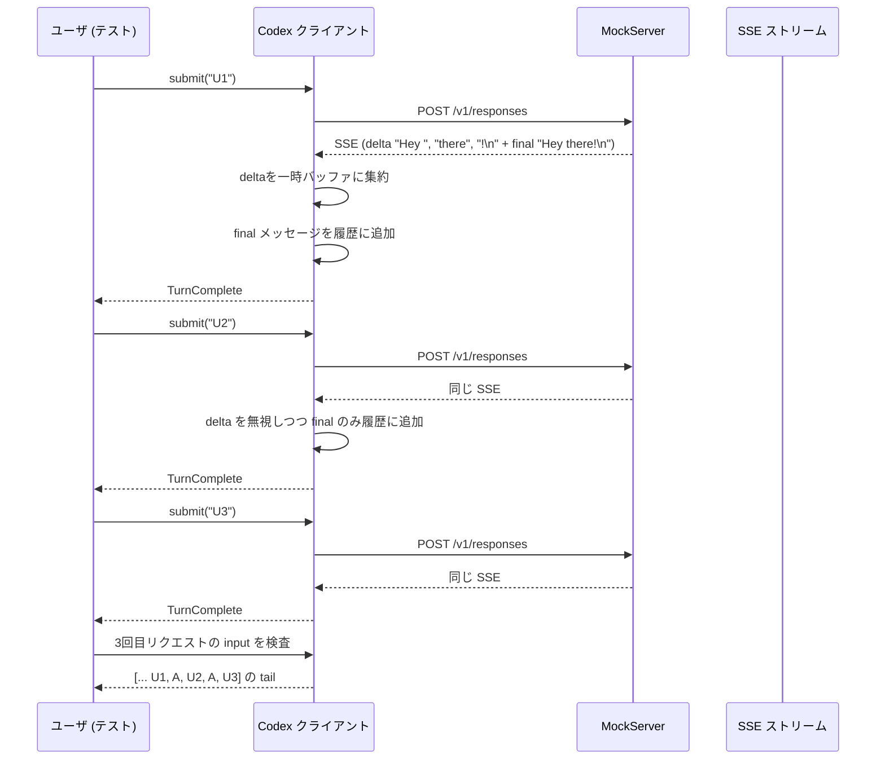

# core/tests/suite/client.rs

## 0. ざっくり一言

Codex のクライアント（`ModelClient` や `ThreadManager`、`test_codex` ラッパー）から各種モデルプロバイダ（OpenAI/ChatGPT/Azure/カスタム）へ送信する **`/responses` ストリーミング API リクエストの形・ヘッダ・履歴・トークンカウント・エラー挙動** を一通り検証する統合テスト群です（`client.rs:L1-2719`）。

---

## 1. このモジュールの役割

### 1.1 概要

- このテストモジュールは、Codex クライアントが
  - 認証情報（API キー / ChatGPT トークン / 環境変数 / コマンド実行）をどのヘッダとして送るか
  - 会話履歴や再開（resume）時の `input` 配列をどう組み立てるか
  - 推論強度（`reasoning.effort`）、要約（`reasoning.summary`）、冗長度（`text.verbosity`）などのオプションをどう送るか
  - Azure 特有の `store` や ID 付与、クエリパラメータ、ヘッダ上書きをどう行うか
  - 使用トークン・レート制限・文脈長エラー・コンテンツフィルタ等のエラーをどうイベントとして通知するか
- をモックサーバ（`wiremock::MockServer`）に対する HTTP 要求として検証します（`client.rs:L1-2719`）。

### 1.2 アーキテクチャ内での位置づけ

テストは、実際のプロダクションコード（`ModelClient`、`ThreadManager`、`test_codex` ビルダーなど）をブラックボックスとして利用し、その外部ふるまいをモックサーバ観測とイベントストリーム観測から確認します。

```mermaid
graph LR
    T["client.rs テスト群<br/>(tokio::test)"] --> B["TestCodex ビルダー<br/>core_test_support::test_codex"]
    B --> TM["ThreadManager<br/>codex_core::ThreadManager"]
    B --> MC["ModelClient<br/>codex_core::ModelClient"]
    TM --> MC
    MC -->|HTTP(SSE)| S["MockServer<br/>wiremock::MockServer"]
    MC --> EV["EventMsg ストリーム<br/>(ResponseEvent など)"]
    T -->|wait_for_event| EV
```

根拠: `test_codex`, `ThreadManager::new`, `ModelClient::new`, `MockServer::start`, `wait_for_event` の利用（`client.rs:L1-2719`）。

### 1.3 設計上のポイント

- **テストベース**  
  - すべて `#[tokio::test(flavor = "multi_thread", worker_threads = 2)]` で非同期統合テストとして実行（`client.rs:L1-2719`）。
  - ローカル `MockServer` を立て、`mount_sse_once` / `mount_sse_sequence` 等で SSE レスポンスを模擬。
- **ヘルパーの分離**
  - JSON 要求ボディからメッセージテキストを取り出すヘルパー（`message_input_texts`, `message_input_text_contains`）。
  - ファイルベースの認証（`auth.json`）を生成する `write_auth_json`。
  - コマンドベースのトークン供給をエミュレートする `ProviderAuthCommandFixture` と `send_provider_auth_request`。
- **エラーとイベントの検証**
  - `EventMsg::TokenCount`, `EventMsg::Error`, `EventMsg::TurnComplete` の順序・内容を検証。
  - レート制限 / コンテキストウィンドウ超過 / 不完全レスポンスなど、API からのエラーを Codex がどのようにラップして通知するかを確認。
- **Rust 特有の安全性・エラー処理**
  - テストコード内では `unwrap` / `expect` / `panic!` を積極的に使用（`#[expect(clippy::unwrap_used)]`）し、バグを即座に失敗として検出。
  - `NonZeroU64` で 0 以外の値を型で保証（`non_zero_u64`）。

---

## 2. 主要な機能一覧（＋コンポーネントインベントリー）

### 2.1 機能（テスト観点）の一覧

- ロールアウトファイルからの **会話再開（resume）** と、既存メッセージ・画像ツール結果の再送 (`resume_*` 系テスト)。
- 各種認証方式の検証:
  - ChatGPT トークンベース (`chatgpt_auth_*`)
  - API キー優先ロジック (`prefers_apikey_*`)
  - プロバイダコマンド実行での Bearer トークン取得・401 リトライ (`provider_auth_command_*`, `send_provider_auth_request`)
  - 環境変数によるトークン上書き (`azure_overrides_*`, `env_var_overrides_loaded_auth`)。
- `user_instructions` / `developer_instructions` / スキル / Apps ガイダンス / 環境コンテキストなどの **システムコンテキストメッセージ** 生成。
- 推論パラメータ:
  - `reasoning.effort` のモデル／設定／ユーザーターン／カタログ標準値との優先順位。
  - `reasoning.summary` の送信・省略条件。
  - `text.verbosity` のデフォルト・サポート有無判定。
- Azure 向けリクエストの特殊要件:
  - `store: true`・`stream: true`・`input` 各要素の ID / call_id 適用。
- トークン使用量とレート制限ヘッダの取り込み (`token_count_includes_rate_limits_snapshot`, `usage_limit_error_emits_rate_limit_event`)。
- コンテキストウィンドウ超過時のトークン数推定 (`context_window_error_sets_total_tokens_to_model_window`)。
- 不完全レスポンス（`response.incomplete`）とコンテンツフィルタに対するエラーイベント (`incomplete_response_emits_content_filter_error_message`)。
- ストリーミング中のデルタと最終メッセージの二重カウントを避けた履歴管理 (`history_dedupes_streamed_and_final_messages_across_turns`)。

### 2.2 コンポーネントインベントリー（関数・構造体）

行番号は本チャンク全体を指し、より細かい位置はこの情報からは分かりません（`client.rs:L1-2719`）。

#### 型・定数

| 名前 | 種別 | 役割 / 用途 | 根拠 |
|------|------|-------------|------|
| `INSTALLATION_ID_FILENAME` | `&'static str` 定数 | インストール ID を保存したファイル名 `"installation_id"`。リクエストの `client_metadata["x-codex-installation-id"]` との整合を検証する際に使用。 | `client.rs:L1-2719` |
| `ProviderAuthCommandFixture` | 構造体 | 一時ディレクトリ内に `tokens.txt` とシェル/バッチスクリプトを作成し、プロバイダのコマンドベース認証 (`ModelProviderAuthInfo`) を模擬するフィクスチャ。 | `client.rs:L1-2719` |
| `EXISTING_ENV_VAR_WITH_NON_EMPTY_VALUE` | `&'static str` 定数 | 環境変数由来のトークンを利用するテストで、既存で非空が保証される `PATH` を指すための定数。 | `client.rs:L1-2719` |

#### ヘルパー関数

| 関数名 | 役割（1 行） | 根拠 |
|--------|--------------|------|
| `assert_message_role` | JSON メッセージの `"role"` フィールドが期待値と一致することを `assert_eq!` で検証。 | `client.rs:L1-2719` |
| `message_input_texts` | OpenAI 形式の `"content"` 配列から `"text"` フィールドだけを `Vec<&str>` として抽出。 | `client.rs:L1-2719` |
| `message_input_text_contains` | `ResponsesRequest` のメッセージのうち特定ロールのテキストに指定文字列が含まれるか判定。 | `client.rs:L1-2719` |
| `write_auth_json` | テスト用の `auth.json` を構築し、偽の JWT と ChatGPT アカウント情報等を書き込む。戻り値として id_token 用の偽 JWT を返す。 | `client.rs:L1-2719` |
| `ProviderAuthCommandFixture::new` | 与えられたトークン列から `tokens.txt` と OS 依存スクリプトを生成する `io::Result<ProviderAuthCommandFixture>` コンストラクタ。 | `client.rs:L1-2719` |
| `ProviderAuthCommandFixture::auth` | フィクスチャから `ModelProviderAuthInfo` を構築し、コマンドと `cwd` を設定。 | `client.rs:L1-2719` |
| `non_zero_u64` | 0 でない `u64` から `NonZeroU64` を生成。0 の場合は `panic!`。 | `client.rs:L1-2719` |
| `send_provider_auth_request` | コマンドベース認証付き `ModelClient` を構成し、`stream` を開始して `ResponseEvent::Completed` まで読み続けるヘルパー。 | `client.rs:L1-2719` |
| `create_dummy_codex_auth` | テスト用のダミー ChatGPT 認証 (`CodexAuth`) を生成。 | `client.rs:L1-2719` |

#### 主なテスト関数（概要）

テスト関数はすべて `async fn` で `tokio::test` により実行されます（`client.rs:L1-2719`）。

| テスト名 | 役割（1 行） |
|---------|--------------|
| `resume_includes_initial_messages_and_sends_prior_items` | ロールアウト JSONL からの再開時に、既存のユーザー/アシスタントメッセージや権限・環境コンテキスト・新規入力が正しい順番・形式で `input` に入ることを検証。 |
| `resume_replays_legacy_js_repl_image_rollout_shapes` | 旧形式（カスタムツール出力＋独立した `input_image` メッセージ）の画像ツール結果を再開時に正しくリプレイすることを検証。 |
| `resume_replays_image_tool_outputs_with_detail` | 関数呼び出し・カスタムツール経由の画像出力に `detail: "original"` が保持されたまま再送されることを検証。 |
| `includes_conversation_id_and_model_headers_in_request` | `session_id` ヘッダ・`originator` ヘッダ・Authorization ヘッダ・インストール ID メタデータがリクエストに含まれることを確認。 |
| `provider_auth_command_supplies_bearer_token` | `ModelProviderAuthInfo` の `command` 実行結果が Authorization ヘッダの Bearer トークンとして用いられることを検証。 |
| `provider_auth_command_refreshes_after_401` | 401 応答を受けた後に再度コマンドを実行して新しいトークンで再試行することを検証。 |
| `includes_base_instructions_override_in_request` | `config.base_instructions` がリクエストの `instructions` フィールドに反映されることを検証。 |
| `chatgpt_auth_sends_correct_request` | ChatGPT 認証を用いると `chatgpt-account-id` ヘッダ等が付与され、`include` に `"reasoning.encrypted_content"` が含まれることを確認。 |
| `prefers_apikey_when_config_prefers_apikey_even_with_chatgpt_tokens` | `auth.json` に ChatGPT トークンがあっても設定が API キー優先なら Authorization に API キーが使われることを検証。 |
| `includes_user_instructions_message_in_request` | `user_instructions` は `instructions` ではなくユーザーコンテキストメッセージの中に埋め込まれることを確認。 |
| `includes_apps_guidance_as_developer_message_for_chatgpt_auth` | Apps 機能 + ChatGPT 認証時に Apps ガイダンスが developer ロールのメッセージに含まれることを検証。 |
| `omits_apps_guidance_for_api_key_auth_even_when_feature_enabled` | API キー認証の場合、Apps 機能が有効でも Apps ガイダンスが含まれないことを確認。 |
| `omits_apps_guidance_when_configured_off` | `include_apps_instructions = false` のとき Apps ガイダンスが含まれないことを検証。 |
| `omits_environment_context_when_configured_off` | `include_environment_context = false` のとき環境コンテキストがユーザーメッセージに含まれないことを検証。 |
| `skills_append_to_developer_message` | `skills/` ディレクトリにある SKILL.md の要約情報が developer メッセージに追記されることを検証。 |
| `includes_configured_effort_in_request` | `config.model_reasoning_effort` を設定した場合、その値（例: `"medium"`) が `reasoning.effort` に入ることを確認。 |
| `includes_no_effort_in_request` | 明示設定がない場合のデフォルト `reasoning.effort`（モデル/カタログに由来）を確認。 |
| `includes_default_reasoning_effort_in_request_when_defined_by_model_info` | モデルカタログにデフォルトの推論強度がある場合の反映を確認。 |
| `user_turn_collaboration_mode_overrides_model_and_effort` | `Op::UserTurn` に指定した `collaboration_mode` がモデル・推論強度の両方を上書きすることを検証。 |
| `configured_reasoning_summary_is_sent` | `config.model_reasoning_summary` 設定が `reasoning.summary` に反映されることを検証。 |
| `user_turn_explicit_reasoning_summary_overrides_model_catalog_default` | モデルカタログの `default_reasoning_summary` よりユーザーターンで明示した値が優先されることを確認。 |
| `reasoning_summary_is_omitted_when_disabled` | `ReasoningSummary::None` 設定時、`reasoning.summary` が送信されないことを検証。 |
| `reasoning_summary_none_overrides_model_catalog_default` | モデルカタログが Detailed をデフォルトにしていても、設定値 `None` が優先されることを確認。 |
| `includes_default_verbosity_in_request` | モデルが対応している場合のデフォルト冗長度（例: `"low"`）が `text.verbosity` に入ることを検証。 |
| `configured_verbosity_not_sent_for_models_without_support` | モデルが冗長度をサポートしない場合、設定値があっても `text.verbosity` を送らないことを検証。 |
| `configured_verbosity_is_sent` | 対応モデルに対しては `config.model_verbosity` の値を送信することを確認。 |
| `includes_developer_instructions_message_in_request` | `developer_instructions` が developer ロールのメッセージとして送られ、`user_instructions` はコンテキストメッセージ内に含まれることを検証。 |
| `azure_responses_request_includes_store_and_reasoning_ids` | Azure 互換プロバイダ向けに `store: true`・`stream: true`・各 `input` 要素に ID が付くことを検証。 |
| `token_count_includes_rate_limits_snapshot` | 完了 SSE に含まれるトークン数とレート制限ヘッダから `EventMsg::TokenCount` が 2 段階（スナップショット＋最終）で送られることを検証。 |
| `usage_limit_error_emits_rate_limit_event` | 429（usage_limit_reached）応答でレート制限情報を含む TokenCount イベントとエラーイベントが生成されることを検証。 |
| `context_window_error_sets_total_tokens_to_model_window` | 文脈長超過時に総トークン数がモデルの有効コンテキストウィンドウ（例: 95%）に設定されることを検証。 |
| `incomplete_response_emits_content_filter_error_message` | `response.incomplete` with `reason = "content_filter"` を受信したとき、ストリーム切断エラーとして `EventMsg::Error` が発生することを検証。 |
| `azure_overrides_assign_properties_used_for_responses_url` | カスタムプロバイダで `base_url`・`query_params`・ヘッダ・環境変数から Authorization を組み立て、`/openai/responses` に送信することを検証。 |
| `env_var_overrides_loaded_auth` | `env_key` により環境変数から 認証ヘッダを構築し、既存の `CodexAuth` を上書きすることを検証。 |
| `history_dedupes_streamed_and_final_messages_across_turns` | ストリーミングデルタと最終メッセージ A を複数ターンまたいで履歴に重複させず、A を 1 回だけ履歴として送信することを検証。 |

---

## 3. 公開 API と詳細解説

このファイル自身はライブラリ API を定義していませんが、テスト用ヘルパーや代表的なテスト関数を通して、上位の公開 API（`ModelClient`, `ThreadManager`, `test_codex` など）の使われ方を確認できます。

### 3.1 型一覧（構造体・列挙体など）

| 名前 | 種別 | 役割 / 用途 | 根拠 |
|------|------|-------------|------|
| `ProviderAuthCommandFixture` | 構造体 | コマンド実行で Bearer トークンを返す外部認証プロバイダを模擬するフィクスチャ。`tokens.txt` とスクリプトを生成し、`ModelProviderAuthInfo` を返す。 | `client.rs:L1-2719` |

フィールド定義はこのチャンクには現れていませんが、`new` と `auth` メソッドの実装から、少なくとも `tempdir: TempDir`, `command: String`, `args: Vec<String>` を持つことが分かります（`client.rs:L1-2719`）。

### 3.2 関数詳細（7件）

#### `write_auth_json(codex_home: &TempDir, openai_api_key: Option<&str>, chatgpt_plan_type: &str, access_token: &str, account_id: Option<&str>) -> String`

**概要**

テスト用の Codex ホームディレクトリに `auth.json` を生成し、OpenAI API キーと ChatGPT トークン情報（偽 JWT を含む）を書き込むユーティリティです。戻り値として `tokens.id_token` に書き込まれた偽 JWT を返します（`client.rs:L1-2719`）。

**引数**

| 引数名 | 型 | 説明 |
|--------|----|------|
| `codex_home` | `&TempDir` | `auth.json` を書き込む一時ディレクトリ。 |
| `openai_api_key` | `Option<&str>` | `OPENAI_API_KEY` に書き込む任意の API キー。`None` の場合は null。 |
| `chatgpt_plan_type` | `&str` | ChatGPT のプラン種別（例: `"pro"`）を JWT ペイロードに含める。 |
| `access_token` | `&str` | ChatGPT 用アクセストークン。`tokens.access_token` に保存。 |
| `account_id` | `Option<&str>` | ChatGPT アカウント ID。`Some` の場合は `tokens.account_id` として保存し、JWT ペイロードにも使用。 |

**戻り値**

- 型: `String`
- `id_token` として書き込んだ偽の JWT（ヘッダ・ペイロードを Base64URL エンコードし `"alg": "none"` のトークン）の文字列を返します。

**内部処理の流れ**

1. JWT ヘッダとペイロードの JSON を組み立て（`email` と `https://api.openai.com/auth` ネームスペースの情報）（`client.rs:L1-2719`）。
2. Base64 URL Safe (no pad) エンコーダでヘッダ・ペイロード・ダミー署名 `"sig"` をエンコードし、`"{header}.{payload}.{signature}"` の形式で `fake_jwt` を生成。
3. `tokens` オブジェクトを構築し、`id_token`, `access_token`, `refresh_token` を設定。`account_id` があれば `tokens["account_id"]` にも追加。
4. `auth_json` オブジェクトに `OPENAI_API_KEY`, `tokens`, `last_refresh`（`chrono::Utc::now()`）を含めて構築。
5. `codex_home.path().join("auth.json")` に `serde_json::to_string_pretty` した JSON を書き込む。失敗時は `unwrap()` により panic。
6. 最後に `fake_jwt` を返す。

**Examples（使用例）**

テスト `prefers_apikey_when_config_prefers_apikey_even_with_chatgpt_tokens` では、API キーと ChatGPT トークンが両方存在する状態を作るために使用しています。

```rust
let codex_home = TempDir::new().unwrap();              // 一時ディレクトリ
let _jwt = write_auth_json(                            // auth.json を生成
    &codex_home,
    Some("sk-test-key"),
    "pro",
    "Access-123",
    Some("acc-123"),
);
// 以降、CodexAuth::from_auth_storage で auth.json を読み取る
```

**Errors / Panics**

- ファイル書き込みや JSON シリアライズが失敗した場合、`unwrap()` により panic します。
- JWT はテスト用であり署名検証は意図していないため、実運用で利用すべきではありません。

**Edge cases（エッジケース）**

- `account_id` が `None` の場合、JWT ペイロードと `tokens` の両方で `"acc-123"` がデフォルトとして使用されます。
- `openai_api_key` が `None` の場合、`OPENAI_API_KEY` は JSON 上で `null` になります。

**使用上の注意点**

- テスト専用ユーティリティであり、本番コードでの使用は想定されていません。
- ファイルシステムへの書き込みが前提であり、読み取り専用ファイルシステムや権限のない環境では panic になります。

---

#### `ProviderAuthCommandFixture::new(tokens: &[&str]) -> std::io::Result<Self>`

**概要**

与えられたトークン列から `tokens.txt` と OS 依存のスクリプトを作成し、外部コマンドを通じて 1 行ずつトークンを返すプロバイダ認証を模擬するフィクスチャを構築します（`client.rs:L1-2719`）。

**引数**

| 引数名 | 型 | 説明 |
|--------|----|------|
| `tokens` | `&[&str]` | 1 行ずつファイルに書き込まれるトークン列。スクリプトは先頭行を出力し、残りを次回用に保存する。 |

**戻り値**

- 型: `std::io::Result<ProviderAuthCommandFixture>`
- 成功時は `tempdir`, `command`, `args` を含むフィクスチャ。IO エラー時は `Err`。

**内部処理の流れ**

1. `tempfile::tempdir()` で一時ディレクトリ `tempdir` を生成。
2. `tokens.txt` を作成し、`tokens` の各要素を 1 行ずつ書き込む。
3. OS に応じてスクリプトを生成：
   - Unix: `print-token.sh` を作成し、`sed` と `tail`/`mv` で先頭行を出力・ファイルをローテーション。実行権限 0o755 を付与。
   - Windows: `print-token.cmd` を作成し、`set /p` と `more`/`move` で同様の動作。`command` は `"cmd.exe"`, `args` に `["/D", "/Q", "/C", ".\\print-token.cmd"]` を設定。
4. `Ok(Self { tempdir, command, args })` を返す。

**Examples（使用例）**

```rust
let auth_fixture = ProviderAuthCommandFixture::new(&["first-token", "second-token"]).unwrap();
let auth_info = auth_fixture.auth(); // ModelProviderAuthInfo を作成
// auth_info.command は "./print-token.sh" または "cmd.exe"
```

**Errors / Panics**

- 戻り値が `io::Result` のため、ディレクトリ作成・ファイル作成・書き込み・パーミッション設定等が失敗すると `Err` を返します。
- テスト側は `.unwrap()` しているため、エラーはテスト失敗として扱われます。

**Edge cases**

- `tokens` が空配列の場合、スクリプトは最初から空ファイルを読むことになり、将来の実行時に終了コード 1 などで失敗する可能性があります（このテストでは常に 1 つ以上のトークンを渡しています）。

**使用上の注意点**

- あくまでテスト用であり、実際の認証スクリプト実装として再利用することは想定されていません。
- スクリプトのパスは `cwd`（後述の `auth` メソッド）に依存するため、別ディレクトリから実行すると失敗します。

---

#### `ProviderAuthCommandFixture::auth(&self) -> ModelProviderAuthInfo`

**概要**

`ProviderAuthCommandFixture` に対応する `ModelProviderAuthInfo` を構築し、Codex のモデルプロバイダ設定でコマンドベース認証を有効にするための情報を返します（`client.rs:L1-2719`）。

**引数**

なし（`&self` のメソッド）。

**戻り値**

- 型: `ModelProviderAuthInfo`
- コマンド・引数・タイムアウト・リフレッシュ間隔・カレントディレクトリ (`cwd`) を含む認証設定。

**内部処理の流れ**

1. `command` に `self.command.clone()` をセット。
2. `args` に `self.args.clone()` をセット。
3. `timeout_ms` に `non_zero_u64(5_000)`（5 秒）を設定。
4. `refresh_interval_ms` に `60_000`（60 秒）を設定。
5. `cwd` に `self.tempdir.path()` を `AbsolutePathBuf::try_from` 経由でセット。失敗した場合は `panic!("tempdir should be absolute: {err}")`。
6. `ModelProviderAuthInfo` 構造体を返す。

**Examples**

```rust
let fixture = ProviderAuthCommandFixture::new(&["command-token"]).unwrap();
let auth_info = fixture.auth();
// これを ModelProviderInfo { auth: Some(auth_info), .. } に埋め込む
```

**Errors / Panics**

- `cwd` の絶対パス変換に失敗した場合に panic しますが、`tempfile::tempdir()` は絶対パスを返す想定のため、テストでは発生しません。

**Edge cases**

- `timeout_ms` は `NonZeroU64` のため 0 を設定できません。`non_zero_u64` で値が確認されています。

**使用上の注意点**

- `refresh_interval_ms` が 60 秒にハードコードされているため、テスト内では 401 後の 2 回目のリクエストで新しいトークンが使われることを前提としています（リフレッシュタイミングのシミュレーション）。

---

#### `async fn send_provider_auth_request(server: &MockServer, auth: ModelProviderAuthInfo)`

**概要**

コマンドベース認証を持つ `ModelClient` を構成し、1 回の `stream` リクエストを発行して SSE ストリームが `ResponseEvent::Completed` に到達することだけを検証するヘルパーです（サーバ側の期待は呼び出し元が設定）（`client.rs:L1-2719`）。

**引数**

| 引数名 | 型 | 説明 |
|--------|----|------|
| `server` | `&MockServer` | SSE レスポンスを返す `wiremock::MockServer`。`base_url` を構築するために使用。 |
| `auth` | `ModelProviderAuthInfo` | コマンドベースの Bearer トークン取得設定。 |

**戻り値**

- 戻り値は `()`（`async fn`）。エラーがあれば `expect` / `unwrap` により panic し、テスト失敗となります。

**内部処理の流れ**

1. `ModelProviderInfo` を構成：
   - `name: "corp"`, `base_url: Some(format!("{}/v1", server.uri()))`
   - `auth: Some(auth)` とし、`wire_api: WireApi::Responses`、リトライ回数やタイムアウトを設定（`request_max_retries = Some(0)`, `stream_max_retries = Some(0)`）。
2. 一時 `codex_home` を作成し、`load_default_config_for_test` で設定をロード。
   - `config.model_provider_id` と `config.model_provider` を上記 `provider` に合わせる。
   - モデル名と `model_info` を `codex_core::test_support` から取得。
3. `SessionTelemetry` を構築（会話 ID やモデル slug、メールアドレスなどを設定）。
4. `ModelClient::new` を呼び出し：
   - 認証マネージャとして `AuthManager::from_auth_for_testing(CodexAuth::from_api_key("unused-api-key"))` を渡すが、実際の HTTP 認証は `provider.auth` によるコマンドベースを期待。
5. `client.new_session()` でセッションを作成。
6. `Prompt::default()` にユーザーメッセージ `"hello"` を 1 件追加。
7. `client_session.stream(&prompt, &model_info, &session_telemetry, effort, summary, None, None).await.expect("responses stream to start")` で SSE ストリームを開始。
8. `while let Some(event) = stream.next().await` でストリームを読み、`Ok(ResponseEvent::Completed { .. })` を受け取ったらループを `break`。

**Examples**

この関数自体がテストヘルパーであり、`provider_auth_command_supplies_bearer_token` や `provider_auth_command_refreshes_after_401` から呼び出されています。

```rust
let server = MockServer::start().await;
// server 側に適切な Mock を設定した後:
let auth_fixture = ProviderAuthCommandFixture::new(&["first-token", "second-token"]).unwrap();
send_provider_auth_request(&server, auth_fixture.auth()).await;
```

**Errors / Panics**

- `load_default_config_for_test` や `stream` の起動に失敗すると `expect` により panic します。
- サーバ側モックが不整合な場合（例えば SSE を返さない）は、ストリームエラーとして `expect` で panic します。

**Edge cases**

- ストリームが `Completed` イベントを返さない場合、ループは `None` を受け取るまで続きますが、wiremock の挙動によっては早期終了するためテストがハングしない前提です。
- タイムアウトは `ModelProviderInfo.stream_idle_timeout_ms`（5 秒）に依存します。

**使用上の注意点**

- 認証ヘッダの内容はこの関数では検証しません。呼び出し元のテストで `Mock::given(...)` を用いて期待するヘッダをセットする必要があります。

---

#### `async fn azure_responses_request_includes_store_and_reasoning_ids()`

**概要**

Azure 互換の Responses API に対して、`ModelClient` が `store: true`・`stream: true` を設定し、入力の各要素に ID / call_id を維持したまま送信することを検証するテストです（`client.rs:L1-2719`）。

**引数 / 戻り値**

- `tokio::test` によるテスト関数で、引数なし・戻り値 `()`。

**内部処理の流れ**

1. `MockServer` を起動し、SSE 形式の body を返すエンドポイント `/openai/responses` 用 `Mock` を立てる（`mount_sse_once`）。SSE は `response.created` と `response.completed` を返す簡単なもの。
2. Azure 風の `ModelProviderInfo` を構成：
   - `name = "azure"`, `base_url = Some("{mock}/openai")`, `wire_api = WireApi::Responses`, `requires_openai_auth = false`。
3. テスト用設定 `config` をロードし、`config.model_provider_id` と `config.model_provider` を Azure プロバイダに設定。
4. モデル名／`model_info`／`SessionTelemetry` を生成し、`AuthManager` は `CodexAuth::from_api_key("Test API Key")` から構築。
5. `ModelClient::new` でクライアントを作成（ここでは `auth_manager` に `None` を渡し、プロバイダ設定に任せる）。
6. `Prompt` を作成し、以下の 8 つの `ResponseItem` を順番に `prompt.input` に push:
   - `Reasoning`（`id: "reasoning-id"`）
   - `Message`（`id: "message-id"`）
   - `WebSearchCall`（`id: "web-search-id"`）
   - `FunctionCall`（`id: "function-id"`, `call_id: "function-call-id"`）
   - `FunctionCallOutput`（同 `call_id`）
   - `LocalShellCall`（`id: "local-shell-id"`, `call_id: "local-shell-call-id"`）
   - `CustomToolCall`（`id: "custom-tool-id"`, `call_id: "custom-tool-call-id"`）
   - `CustomToolCallOutput`（同 `call_id`）
7. `client_session.stream(&prompt, ...)` を開始し、`ResponseEvent::Completed` まで読み続ける。
8. `resp_mock.single_request()` で送信された HTTP リクエストを取得し、以下を `assert_eq!` で検証：
   - パスが `/openai/responses`。
   - 本文の `store` が `true`。
   - 本文の `stream` が `true`。
   - `input` 配列の長さが 8。
   - 各要素の `"id"` / `"call_id"` が元の `ResponseItem` と一致。

**Errors / Panics**

- 期待された SSE が届かない場合や HTTP 呼び出しが行われない場合、`single_request()` や `assert_eq!` で panic します。

**Edge cases**

- `store: true` は Azure 対応時の特別な挙動であり、他のプロバイダでは異なる可能性があります。このテストは Azure プロバイダ設定に限定されています。

**使用上の注意点**

- Azure 互換 API を利用する場合、Codex 側の設定（`ModelProviderInfo`）が正しく構成されている前提であることを確認するためのテストであり、アプリケーションから直接呼び出す関数ではありません。

---

#### `async fn token_count_includes_rate_limits_snapshot()`

**概要**

レスポンスの SSE と HTTP ヘッダに含まれるトークン数およびレート制限情報が、`EventMsg::TokenCount` として 2 段階（レート制限スナップショットのみ → トークン使用量込み）で発火することを検証するテストです（`client.rs:L1-2719`）。

**内部処理の流れ**

1. `MockServer` を起動。
2. SSE ボディとして、`ev_completed_with_tokens("resp_rate", 123)` のみを含む SSE を構築。
3. HTTP レスポンスヘッダにレート制限情報を付与：
   - `x-codex-primary-used-percent = "12.5"`
   - `x-codex-secondary-used-percent = "40.0"`
   - `x-codex-primary-window-minutes = "10"`
   - `x-codex-secondary-window-minutes = "60"`
   - `x-codex-primary-reset-at = "1704069000"`
   - `x-codex-secondary-reset-at = "1704074400"`
4. 上記レスポンスを `/v1/responses` に対する Mock としてマウント。
5. OpenAI 風 `ModelProviderInfo` を構成し、`test_codex().with_auth(...).with_config(...)` で Codex セッションを構築。
6. `codex.submit(Op::UserInput { text: "hello", .. })` を送信。
7. 最初の `EventMsg::TokenCount` を `wait_for_event` で取得し、JSON にシリアライズして **レート制限情報のみ** が含まれることを検証。
8. 次の `EventMsg::TokenCount` で、`info.total_token_usage.total_tokens == 123` など **トークン使用量とレート制限両方** が含まれることを検証。
9. `rate_limits.primary.used_percent == Some(12.5)` など個別フィールドも確認。

**Errors / Panics**

- Event が期待通り届かない場合、`wait_for_event` や `assert_eq!` で panic します。

**Edge cases**

- モデルのデフォルトコンテキストウィンドウ（95% の有効ウィンドウ）も `info.model_context_window` として検証されており、テスト環境の標準モデルが `gpt-5.1-codex-max` である前提に依存しています（コメント参照）。

**使用上の注意点**

- このテストは、トークン使用量を内部状態として積算していくロジックの仕様（最初はレート制限のみ、その後にトークン使用量付き）を前提としています。実装変更時にはテストの期待値も更新が必要です。

---

#### `async fn context_window_error_sets_total_tokens_to_model_window()`

**概要**

コンテキストウィンドウ超過エラーが発生した場合、Codex が **モデルの有効コンテキストウィンドウのサイズ** を総トークン数として `EventMsg::TokenCount` に反映し、適切なエラーイベントを発火することを検証するテストです（`client.rs:L1-2719`）。

**内部処理の流れ**

1. `MockServer` を起動し、定数 `EFFECTIVE_CONTEXT_WINDOW = (272_000 * 95) / 100` を定義（95% の有効ウィンドウ）。
2. `/v1/responses` に対して 2 つの SSE モックを設定：
   - ボディ中に `"trigger context window"` を含むリクエスト → `context_length_exceeded` エラーを返す `sse_failed` ストリーム。
   - ボディ中に `"seed turn"` を含むリクエスト → 正常完了する SSE ストリーム。
3. `test_codex().with_config(|config| { config.model = Some("gpt-5.1".to_string()); config.model_context_window = Some(272_000); })` で Codex セッションを構築。
4. 1 回目の `submit` で `"seed turn"` を送信し、正常な `TurnComplete` を待つ。
5. 2 回目の `submit` で `"trigger context window"` を送信。
6. `wait_for_event` で、`EventMsg::TokenCount` のうち `info` が `Some` で、かつ `info.model_context_window == Some(info.total_token_usage.total_tokens)` を満たすイベントを待つ。
7. `info.model_context_window == Some(EFFECTIVE_CONTEXT_WINDOW)` および `info.total_token_usage.total_tokens == EFFECTIVE_CONTEXT_WINDOW` を `assert_eq!` で確認。
8. 続いて、`EventMsg::Error` を待ち、エラーメッセージが `CodexErr::ContextWindowExceeded.to_string()` と一致することを検証。

**Errors / Panics**

- SSE が期待通り返らない場合やイベントが発火しない場合、`wait_for_event` または `assert_eq!` で panic します。

**Edge cases**

- `model_context_window` の 95% を有効ウィンドウとして扱う仕様がここに埋め込まれています。モデルごとの有効ウィンドウ比率が変わった場合、このテストも合わせて調整が必要です。

**使用上の注意点**

- 文脈長超過時の「実際のトークン数」は取得できないため、ここでは上限を総トークン数として扱う設計となっています。この仕様を前提に外部でのメトリクス解釈を行う必要があります。

---

#### `async fn history_dedupes_streamed_and_final_messages_across_turns()`

**概要**

ストリーミングレスポンスで、デルタ（`output_text.delta`）と最終メッセージ（`output_item.done` の完全文）を受け取る形のレスポンスが複数ターン続いた場合でも、**同じアシスタントメッセージを 2 重に履歴へ積まない** ことを検証するテストです（`client.rs:L1-2719`）。

**内部処理の流れ**

1. `MockServer` を起動し、共通の SSE フィクスチャ（デルタ `"Hey "`, `"there"`, `"!\n"` と最終 `"Hey there!\n"`、`response.completed` を含む）を文字列で定義。
2. `load_sse_fixture_with_id_from_str` で ID を `"resp1"` に書き換えた SSE を作成。
3. `mount_sse_sequence(&server, vec![sse1.clone(), sse1.clone(), sse1])` で **3 回同じ SSE を順番に返す** モックを設定。
4. `test_codex().with_auth(...)` で Codex クライアントを構築。
5. ターン 1〜3 で順に `"U1"`, `"U2"`, `"U3"` の `UserInput` を `submit` し、各ターンごとに `TurnComplete` を待つ。
6. 送信された 3 つのリクエストを `request_log.requests()` から取得し、すべてのパスが `/v1/responses` であることを確認。
7. 3 回目のリクエスト `r3` の `input` 配列末尾を取り出し、JSON として以下の期待値と等しいことを検証：

   ```json
   [
     { "type":"message","role":"user","content":[{"type":"input_text","text":"U1"}] },
     { "type":"message","role":"assistant","content":[{"type":"output_text","text":"Hey there!\n"}] },
     { "type":"message","role":"user","content":[{"type":"input_text","text":"U2"}] },
     { "type":"message","role":"assistant","content":[{"type":"output_text","text":"Hey there!\n"}] },
     { "type":"message","role":"user","content":[{"type":"input_text","text":"U3"}] }
   ]
   ```

   つまり、デルタは履歴に含まれず、最終メッセージだけがアシスタントメッセージとして 2 回分記録されていることを確認。

**Errors / Panics**

- リクエスト数が 3 にならない場合や `input` が期待通りの形でない場合、`assert_eq!` が失敗して panic します。

**Edge cases**

- フル配列ではなく「末尾だけ」を比較しているため、開発者メッセージやシステム文脈など前半部分はこのテストでは固定していません。これによりテストはより安定しますが、前半の変更は別のテストでカバーする必要があります。

**使用上の注意点**

- 会話履歴の仕様として「最終メッセージのみを履歴に残す」ことが前提になっています。デルタを別途保存したい場合は実装・テストの両方に変更が必要です。

---

### 3.3 その他の関数

上記で詳述しなかったテスト関数／ヘルパーは、前述のインベントリー表のとおりです。いずれも、

- Codex クライアント（`test_codex`, `ThreadManager`, `ModelClient`）
- モデルプロバイダ設定（`ModelProviderInfo`, `ModelProviderAuthInfo`）
- ユーザー入力（`Op::UserInput`, `Op::UserTurn`, `UserInput::Text`）
- SSE ストリームとイベント（`ResponseEvent`, `EventMsg`）

の組み合わせを少しずつ変え、ヘッダ・ボディ・イベントを `assert_eq!` やヘルパー関数で検証するパターンになっています（`client.rs:L1-2719`）。

---

## 4. データフロー

### 4.1 コマンドベース認証付き `ModelClient` のストリーミング

`send_provider_auth_request` を中心とした、認証トークン取得〜SSE 完了までのフローです（`client.rs:L1-2719`）。

```mermaid
sequenceDiagram
    participant Test as テスト関数<br/>(provider_auth_command_*; client.rs:L1-2719)
    participant Fix as ProviderAuthCommandFixture
    participant MC as ModelClient
    participant S as MockServer (wiremock)
    participant Stream as Responses Stream

    Test->>Fix: new(&["first-token", ...])
    Test->>Fix: auth() -> ModelProviderAuthInfo
    Test->>MC: ModelClient::new(..., provider{auth: Some(cmd)}, ...)
    Test->>MC: new_session()
    Test->>MC: stream(prompt="hello", model_info, telemetry, ...)
    MC->>S: POST /v1/responses (Authorization: Bearer first-token)
    S-->>MC: 401 Unauthorized (テストケース1) or 200 SSE
    alt 401 case
        MC->>Fix: 実行コマンド再起動 (tokens.txt の次行)
        Fix-->>MC: "second-token"
        MC->>S: 再度 POST /v1/responses (Authorization: Bearer second-token)
        S-->>MC: 200 SSE (response.created & completed)
    end
    MC->>Stream: SSE イベントストリーム
    loop until Completed
        Stream-->>MC: ResponseEvent
    end
    MC-->>Test: Completed
```

このフローから分かるように、テストでは

- 外部コマンド実行 → Bearer トークン発行 → 401 エラー後の再実行
- SSE ストリームの開始と完了

の一連の流れが正しく動いていることを確認しています。

### 4.2 会話履歴の蓄積とデデュープ

`history_dedupes_streamed_and_final_messages_across_turns` のフローです（`client.rs:L1-2719`）。



---

## 5. 使い方（How to Use）

このファイルはテストですが、Codex クライアントの典型的な利用パターンがよく表れています。

### 5.1 基本的な使用方法

代表的なパターンは「セッション初期化 → ユーザー入力送信 → イベント待機」です。

```rust
#[tokio::test(flavor = "multi_thread", worker_threads = 2)]
async fn example_usage() -> anyhow::Result<()> {
    let server = MockServer::start().await;                    // モックサーバ起動

    // SSE レスポンスを 1 回だけ返すモックを設定
    let _resp_mock = mount_sse_once(
        &server,
        sse(vec![ev_response_created("resp1"), ev_completed("resp1")]),
    )
    .await;

    // 認証と設定を含む TestCodex を構築
    let TestCodex { codex, .. } = test_codex()
        .with_auth(CodexAuth::from_api_key("Test API Key"))    // API キー認証
        .build(&server)
        .await?;                                               // セッション作成

    // ユーザーのテキスト入力を1件送信
    codex
        .submit(Op::UserInput {
            items: vec![UserInput::Text {
                text: "hello".into(),
                text_elements: Vec::new(),
            }],
            final_output_json_schema: None,
            responsesapi_client_metadata: None,
        })
        .await?;                                               // 送信

    // 非同期イベントストリームから TurnComplete を待つ
    wait_for_event(&codex, |ev| matches!(ev, EventMsg::TurnComplete(_))).await;

    Ok(())
}
```

このパターンは多くのテストで共通しており、

- `Op::UserInput` で単純なテキスト入力
- `wait_for_event` で `EventMsg::TurnComplete` を待つ

のが最小構成であることが分かります（`client.rs:L1-2719`）。

### 5.2 よくある使用パターン

1. **ユーザーターン（複数の設定を同時に指定）**

   ```rust
   codex
       .submit(Op::UserTurn {
           items: vec![UserInput::Text { text: "hello".into(), text_elements: Vec::new() }],
           cwd: config.cwd.to_path_buf(),
           approval_policy: config.permissions.approval_policy.value(),
           approvals_reviewer: None,
           sandbox_policy: config.permissions.sandbox_policy.get().clone(),
           model: session_configured.model.clone(),
           effort: Some(ReasoningEffort::Low),                // ユーザーターン側の effort
           summary: Some(ReasoningSummary::Concise),          // 要約設定
           service_tier: None,
           collaboration_mode: Some(collaboration_mode),      // 協調モード設定
           final_output_json_schema: None,
           personality: None,
       })
       .await?;
   ```

   ここでは `Op::UserTurn` を用いて、モデル・推論強度・要約などを一度に指定しています（`client.rs:L1-2719`）。

2. **ChatGPT 認証 + Apps 機能**

   ```rust
   let apps_server = AppsTestServer::mount(&server).await?;
   let apps_base_url = apps_server.chatgpt_base_url.clone();

   let TestCodex { codex, .. } = test_codex()
       .with_auth(create_dummy_codex_auth())                 // ChatGPT トークン
       .with_config(move |config| {
           config.features.enable(Feature::Apps).unwrap();
           config.chatgpt_base_url = apps_base_url.clone();
       })
       .build(&server)
       .await?;
   ```

   これにより、Apps ガイダンスが developer メッセージに含まれるようになります（`client.rs:L1-2719`）。

### 5.3 よくある間違い

テストから推測できる「誤用」と「正しい使い方」の例です。

```rust
// 誤り例: 必要な設定を行わずに ModelClient を直接使う
// let client = ModelClient::new(None, ThreadId::new(), "...".to_string(), provider, ...);
// let mut session = client.new_session();
// session.stream(&Prompt::default(), &model_info, &telemetry, None, ReasoningSummary::Auto, None, None).await?;

// 正しい例: テストサポートのビルダーか ThreadManager を通して構築する
let mut config = load_default_config_for_test(&codex_home).await;
let auth_manager = codex_core::test_support::auth_manager_from_auth(CodexAuth::from_api_key("..."));
let thread_manager = ThreadManager::new(
    &config,
    auth_manager,
    SessionSource::Exec,
    CollaborationModesConfig { default_mode_request_user_input: true },
    Arc::new(codex_exec_server::EnvironmentManager::new(None)),
    None,
);
let NewThread { thread: codex, .. } = thread_manager.start_thread(config).await?;
```

### 5.4 使用上の注意点（まとめ）

- **非同期コンテキスト**  
  すべての API 呼び出し（`submit`, `stream` など）は `async` であり、`tokio` ランタイム上で実行する必要があります（`#[tokio::test]` 参照）。

- **イベント駆動**  
  応答は `EventMsg` として非同期ストリームで流れてくるため、**レスポンスの完了やエラー検知には `wait_for_event` のようなイベント待ちロジックが必須**です。

- **認証の優先順位**  
  `env_key` → コマンドベース `ModelProviderAuthInfo` → `CodexAuth`（API キー / ChatGPT トークン）の順など、プロバイダ設定による上書きが発生します。テストはこの優先順位を前提にしています。

- **構成オプションの影響範囲**  
  `model_reasoning_effort`, `model_reasoning_summary`, `model_verbosity`, `include_environment_context`, `include_apps_instructions` などは、リクエストボディのオプションフィールドに直接影響するため、変更時には本ファイルのテストを更新する必要があります。

---

## 6. 変更の仕方（How to Modify）

### 6.1 新しい機能を追加する場合

例として、「新しいリクエストヘッダ `X-My-Feature` を送る」機能を追加する流れを考えます。

1. **実装側の変更**
   - `ModelClient` や `ThreadManager` など、ヘッダ組み立てを行うコードで `X-My-Feature` を追加します（このファイルには実装はありません）。

2. **テストサポートの更新**
   - 必要であれば `core_test_support::responses` や `test_codex` にヘルパーを追加し、モックサーバで新ヘッダを検証しやすくします。

3. **本ファイルにテストを追加**
   - 既存のヘッダ検証テスト（例: `includes_conversation_id_and_model_headers_in_request`, `chatgpt_auth_sends_correct_request`）を参考に、新テストを作成します。
   - `Mock::given(header("X-My-Feature", "expected-value"))` のように wiremock マッチャを設定し、期待する値が送られているかを検証します。

4. **データフロー・仕様の更新**
   - 必要に応じて、ドキュメントや図（Mermaid）を更新し、「どのコンポーネントでヘッダが設定されるか」を明示します。

### 6.2 既存の機能を変更する場合

- **影響範囲の確認**
  - 変更対象がどの設定フィールドに対応しているか（例: `model_reasoning_effort`, `model_reasoning_summary`, `model_verbosity`）を確認し、それに紐づくテストを探します（本ファイル内で名前に現れています）。
- **契約の確認**
  - たとえば `reasoning_summary` のデフォルト値の決定ロジックを変更する場合、以下の優先順位が変わらないか確認する必要があります：
    1. ユーザーターンの明示指定
    2. `config.model_reasoning_summary`
    3. モデルカタログの `default_reasoning_summary`
    4. それ以外は `Auto` など
- **テストの更新**
  - テストの期待 JSON（`assert_eq!` の右側）を新仕様に合わせて更新します。
  - イベントのシーケンス（例: TokenCount が 2 回来るかどうか）に変更がある場合は、`wait_for_event` の条件も見直します。

---

## 7. 関連ファイル

このモジュールと密接に関係する主なモジュール／コンポーネントです。正確なファイルパスはこのチャンクからは分かりませんが、モジュール名から関係を示します（`client.rs:L1-2719`）。

| パス（モジュール名） | 役割 / 関係 |
|----------------------|------------|
| `codex_core::ModelClient` | モデルプロバイダへの `/responses` リクエストと SSE ストリーム処理を行うクライアント。本テストの多くはこの挙動を検証。 |
| `codex_core::ThreadManager` | 会話スレッド（Codex クライアント）を生成するマネージャ。`prefers_apikey_*` テストなどで使用。 |
| `core_test_support::test_codex` | テスト用に Codex クライアントと設定を簡単に構築するビルダー。ほぼすべてのテストで利用。 |
| `core_test_support::responses` | `mount_sse_once`, `mount_sse_sequence`, `ev_response_created` など SSE 関連ヘルパーを提供。HTTP モックと SSE フィクスチャ構築に使用。 |
| `core_test_support::wait_for_event` | `EventMsg` ストリームから条件にマッチするイベントを待つユーティリティ。非同期テストの同期ポイントとして利用。 |
| `codex_model_provider_info::ModelProviderInfo` | モデルプロバイダ（OpenAI/Azure/カスタム）の設定を表す型。ヘッダやクエリパラメータ、`auth` 設定を含み、本テストで頻繁に構築。 |
| `codex_protocol::{ResponseItem, EventMsg, Op}` | リクエストの `input` 配列や、イベントストリームのメッセージ種別を表すプロトコル定義。本テストで JSON 形状の検証に使用。 |
| `wiremock::{Mock, MockServer, ResponseTemplate}` | HTTP モックサーバと期待リクエストマッチングを提供。本テスト全体の基盤。 |
| `codex_login::CodexAuth` | API キー / ChatGPT トークンなどの認証情報を表す型。`with_auth`, `from_auth_storage` などを通じて利用。 |

---

このファイル全体として、**Codex クライアントが外部 API とどう対話し、Rust の非同期／エラー処理の仕組みの中でどのような契約（contracts）を守っているか** をテストレベルで確認する役割を持っています。
