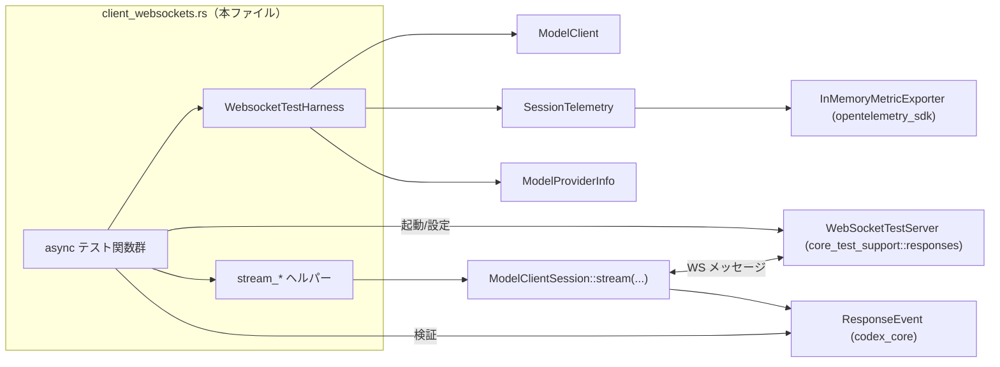
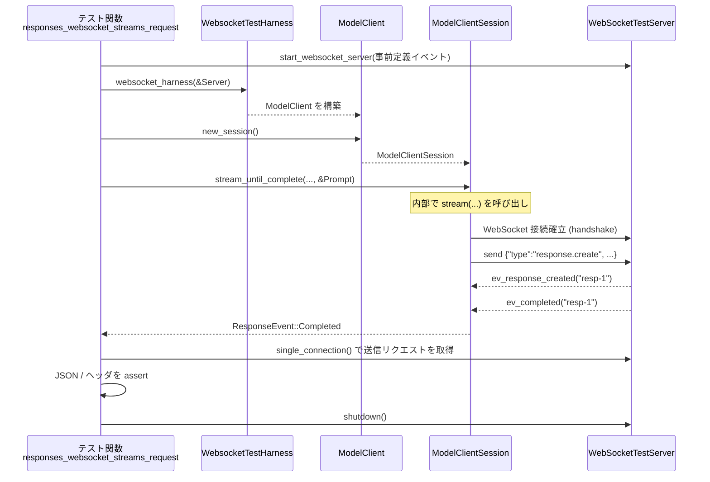

# core/tests/suite/client_websockets.rs コード解説

## 0. ざっくり一言

Responses API 向けの WebSocket ベースの `ModelClient` / `ModelClientSession` の挙動（接続再利用・増分リクエスト・エラー/レートリミット/テレメトリなど）を、モック WebSocket サーバーを使って検証する統合テスト群です。

---

## 1. このモジュールの役割

### 1.1 概要

- このテストモジュールは、`ModelClientSession::stream` および `preconnect_websocket` / `prewarm_websocket` を中心とした **WebSocket 経由の応答ストリーミングのプロトコルと接続管理** を検証します。
- 主な焦点は次の通りです。
  - WebSocket 接続の確立・再利用・ドロップ後の再利用
  - V2 WebSocket プロトコル（`OpenAI-Beta: responses_websockets=2026-02-06`）の利用条件
  - trace / turn metadata / runtime metrics / rate limits などの **メタデータ伝搬** とイベント発火
  - WebSocket レベルのエラー（usage limit / invalid request / connection limit / `response.failed`）に対するクライアント側の挙動

### 1.2 アーキテクチャ内での位置づけ

このファイルは「テスト側」であり、本番ロジックは `ModelClient` / `ModelClientSession` や `SessionTelemetry` 等の他 crate にあります。テストはそれらの API を組み合わせ、モックサーバー (`WebSocketTestServer`) の観測結果を検証します。



### 1.3 設計上のポイント

コードから読み取れる設計上の特徴です。

- **責務の分離**
  - テスト本体は「何を期待するか」を記述し、`WebsocketTestHarness` / `stream_until_complete_*` などのヘルパーが初期化・ストリーム消費を担当します。
- **状態の扱い**
  - `WebsocketTestHarness` が 1 テスト内で共有されるコンテキスト（`ModelClient`, `SessionTelemetry`, `ModelProviderInfo` など）を保持します。
  - 各テストで `ModelClient::new_session()` により新しい `ModelClientSession` を生成し、セッション単位の状態（前回の `response_id` など）を検証します。
- **エラーハンドリング方針**
  - テストでは基本的に `expect(...)` / `unwrap(...)` を用い、異常は即座に panic させることで失敗を検出します。
  - WebSocket プロトコル上のエラーは、`ResponseEvent::RateLimits` などのイベント・`EventMsg::Error` などを通じて **「制御されたエラー」** として扱われることを検証します。
- **並行性**
  - 全テストは `#[tokio::test(flavor = "multi_thread", worker_threads = 2)]` で実行され、非同期ストリーム (`StreamExt::next`) と `tokio::time::sleep` / `tokio::time::timeout` が利用されています。
  - メトリクス集計 (`SessionTelemetry`) は非同期に行われるため、テストでは短い `sleep` を挟んでからサマリを読み出しています。

---

## 2. 主要な機能一覧

このテストモジュールがカバーしている主要な振る舞いを列挙します。

- WebSocket リクエスト構造の検証
  - `response.create` リクエストの `model` / `stream` / `input` / `client_metadata` フィールド
  - `x-client-request-id` / `x-codex-installation-id` / `OpenAI-Beta` ヘッダの検証
- 接続再利用ロジック
  - 単一接続で複数ターンを処理できること
  - `preconnect_websocket` / `prewarm_websocket` による事前接続・ウォームアップと、その後のリクエスト再利用
  - セッション drop 後も接続が共有プールから再利用されること
- V2 WebSocket プロトコルの利用条件
  - 特定の feature / runtime metrics 有無による V2 利用の有無
  - V2 での **OpenAI-Beta ヘッダ** と **増分リクエスト（previous_response_id + 追記 input）の仕様**
- トレース・メタデータ伝搬
  - span ごとの `W3cTraceContext` が `client_metadata` にシリアライズされていること
  - `x-codex-turn-metadata` など任意 JSON メタデータが初回および増分リクエストに正しく付与されること
- ランタイムメトリクスとタイミングヘッダ
  - runtime metrics 有効時のみ `X_RESPONSESAPI_INCLUDE_TIMING_METRICS_HEADER` が付くこと
  - `responsesapi.websocket_timing` イベントから `SessionTelemetry` のフィールドが更新されること
- レート制限・理由付け・モデル情報イベント
  - `codex.rate_limits` イベントが `ResponseEvent::RateLimits` として表面化されること
  - `X-Models-Etag` / `X-Reasoning-Included` ヘッダが `ResponseEvent::ModelsEtag` / `ServerReasoningIncluded` として表面化されること
  - usage limit 到達時に `EventMsg::TokenCount` / `EventMsg::Error` が期待どおり生成されること
- エラー・リトライ
  - `usage_limit_reached` / `invalid_request_error` / `websocket_connection_limit_reached` / `response.failed` などのエラーに対する挙動
  - 接続制限エラー（`websocket_connection_limit_reached`）発生時に新しい接続で再試行すること
  - `response.failed` 後は `previous_response_id` を使わずフル `input` で再作成されること
  - WebSocket close ハンドシェイクがなくても `response.failed` がクライアントエラーとして伝播すること

---

## 3. 公開 API と詳細解説

### 3.1 型一覧（構造体など）

#### 構造体

| 名前 | 種別 | 役割 / 用途 | 定義場所 |
|------|------|-------------|----------|
| `WebsocketTestHarness` | 構造体 | 各テストで共有するコンテキスト。`ModelClient`, `ThreadId`（conversation_id）, `ModelInfo`, `ReasoningSummary`, `SessionTelemetry` を保持します。 | client_websockets.rs（行番号情報なし） |

`WebsocketTestHarness` のフィールドは次のとおりです（コード定義から読み取り）。

- `_codex_home: TempDir` – 一時ディレクトリ。テスト設定やログの出力先。
- `client: ModelClient` – WebSocket ベースでモデルに接続するクライアント。
- `conversation_id: ThreadId` – セッション/スレッド ID。`x-client-request-id` などに使用。
- `model_info: ModelInfo` – 使用するモデル (`gpt-5.2-codex`) に関するメタ情報。
- `effort: Option<ReasoningEffortConfig>` – reasoning effort 設定（ここでは常に `None`）。
- `summary: ReasoningSummary` – reasoning summary 設定（ここでは `ReasoningSummary::Auto`）。
- `session_telemetry: SessionTelemetry` – OTEL ベースのメトリクス／テレメトリコンテキスト。

### 3.1 関数・テスト関数インベントリー

> ※行番号がテキスト上に提供されていないため、「定義場所」列はファイル名のみを示します。

#### ヘルパー関数

| 名前 | 種別 | 役割（1 行） | 定義場所 |
|------|------|--------------|----------|
| `assert_request_trace_matches` | 非公開関数 | WebSocket リクエスト JSON の `client_metadata` が期待する `W3cTraceContext` と一致することを検証します。 | client_websockets.rs |
| `message_item` | 非公開関数 | ユーザー発話用の `ResponseItem::Message`（`ContentItem::InputText`）を生成します。 | client_websockets.rs |
| `assistant_message_item` | 非公開関数 | アシスタント応答用の `ResponseItem::Message`（`ContentItem::OutputText`）を生成します。 | client_websockets.rs |
| `prompt_with_input` | 非公開関数 | `Prompt::default()` に対し `input` を設定した `Prompt` を生成します。 | client_websockets.rs |
| `prompt_with_input_and_instructions` | 非公開関数 | `Prompt` に `input` と `BaseInstructions`（text）を設定します。 | client_websockets.rs |
| `websocket_provider` | 非公開関数 | デフォルトの WebSocket サポート付き `ModelProviderInfo` を `websocket_connect_timeout_ms: None` で構築します。 | client_websockets.rs |
| `websocket_provider_with_connect_timeout` | 非公開関数 | `ModelProviderInfo` を詳細設定（base_url, retries, stream_idle_timeout_ms, websocket_connect_timeout_ms 等）付きで構築します。 | client_websockets.rs |
| `websocket_harness` | 非公開 async 関数 | runtime metrics 無効で `WebsocketTestHarness` を作成します。 | client_websockets.rs |
| `websocket_harness_with_runtime_metrics` | 非公開 async 関数 | runtime metrics 有効/無効を指定して `WebsocketTestHarness` を作成します。 | client_websockets.rs |
| `websocket_harness_with_v2` | 非公開 async 関数 | V2 WebSocket 関連のテスト向けに `WebsocketTestHarness` を作成します（実装は `websocket_harness_with_options` に委譲）。 | client_websockets.rs |
| `websocket_harness_with_options` | 非公開 async 関数 | 任意の `WebSocketTestServer` と runtime metrics 設定から `WebsocketTestHarness` を作成します。 | client_websockets.rs |
| `websocket_harness_with_provider_options` | 非公開 async 関数 | 任意の `ModelProviderInfo` と runtime metrics 設定から `WebsocketTestHarness` を構築します（実際の初期化ロジックの中心）。 | client_websockets.rs |
| `stream_until_complete` | 非公開 async 関数 | service_tier/metadata なしで `ModelClientSession::stream` を呼び出し、`ResponseEvent::Completed` までストリームを消費します。 | client_websockets.rs |
| `stream_until_complete_with_service_tier` | 非公開 async 関数 | `ServiceTier` を指定可能な `stream_until_complete` のラッパーです。 | client_websockets.rs |
| `stream_until_complete_with_turn_metadata` | 非公開 async 関数 | `turn_metadata_header`（`x-codex-turn-metadata`）を指定可能な `stream_until_complete` のラッパーです。 | client_websockets.rs |
| `stream_until_complete_with_request_metadata` | 非公開 async 関数 | `ModelClientSession::stream` を直接呼び出し、`ResponseEvent::Completed` が来るまでイベントストリームを消費します。 | client_websockets.rs |

#### テスト関数（async）

| 名前 | 役割（1 行） | 種別 |
|------|--------------|------|
| `responses_websocket_streams_request` | 基本的な WebSocket ストリーミングリクエストとヘッダ（`OpenAI-Beta`, `x-client-request-id`, installation id）の整合性を検証します。 | tokio::test |
| `responses_websocket_streams_without_feature_flag_when_provider_supports_websockets` | プロバイダが WebSocket をサポートする場合、特別な feature flag なしでもストリーミングが行われることを確認します。 | tokio::test |
| `responses_websocket_reuses_connection_with_per_turn_trace_payloads` | 複数ターンを同一 WebSocket 接続で処理しつつ、各ターンごとに異なる trace コンテキストが送信されることを検証します。 | tokio::test |
| `responses_websocket_preconnect_does_not_replace_turn_trace_payload` | `preconnect_websocket` 実行済みでも、実リクエスト時にはターンの span から trace コンテキストが反映されることを確認します。 | tokio::test |
| `responses_websocket_preconnect_reuses_connection` | `preconnect_websocket` で貼った接続が、後続の `stream` 呼び出しで再利用されることを検証します。 | tokio::test |
| `responses_websocket_request_prewarm_reuses_connection` | `prewarm_websocket` がウォームアップ用リクエストを送り、その後のリクエストが同一接続を再利用することを検証します。 | tokio::test |
| `responses_websocket_reuses_connection_after_session_drop` | セッションを drop した後に新しいセッションから同一 WebSocket 接続を再利用できることを確認します。 | tokio::test |
| `responses_websocket_preconnect_is_reused_even_with_header_changes` | `preconnect_websocket` で確立した接続が、ヘッダ変更（runtime metrics など）があっても再利用されることを検証します。 | tokio::test |
| `responses_websocket_request_prewarm_is_reused_even_with_header_changes` | `prewarm_websocket` でのウォームアップ接続が、ヘッダ変更後も再利用され、ウォームアップと本リクエストの JSON 差異を検証します。 | tokio::test |
| `responses_websocket_prewarm_uses_v2_when_provider_supports_websockets` | V2 prewarm が WebSocket 上で実際に `response.create` を送信し、`OpenAI-Beta` に V2 トークンが含まれることを検証します。 | tokio::test |
| `responses_websocket_preconnect_runs_when_only_v2_feature_enabled` | V2 feature のみ有効な場合に `preconnect_websocket` が動作し、接続確立のみでリクエストは送られないことを確認します。 | tokio::test |
| `responses_websocket_v2_requests_use_v2_when_provider_supports_websockets` | V2 環境で、2 回目のターンが `previous_response_id` + 差分 input を使う増分 `response.create` になること、および V2 ヘッダが設定されることを確認します。 | tokio::test |
| `responses_websocket_v2_incremental_requests_are_reused_across_turns` | V2 で、異なる `ModelClientSession` 間でも prefix が一致すれば増分リクエストが行われることを検証します。 | tokio::test |
| `responses_websocket_v2_wins_when_both_features_enabled` | v1/v2 の両 feature が有効な場合でも V2 の動作（previous_response_id + 差分 input）が優先されることを確認します。 | tokio::test |
| `responses_websocket_emits_websocket_telemetry_events` | WebSocket 経由の呼び出しが runtime metrics において HTTP API ではなく WebSocket カウンタとして計上されることを検証します。 | tokio::test + traced_test |
| `responses_websocket_includes_timing_metrics_header_when_runtime_metrics_enabled` | runtime metrics 有効時に `X_RESPONSESAPI_INCLUDE_TIMING_METRICS_HEADER=true` が付き、`responsesapi.websocket_timing` イベントからメトリクスが更新されることを検証します。 | tokio::test |
| `responses_websocket_omits_timing_metrics_header_when_runtime_metrics_disabled` | runtime metrics 無効時には timing metrics ヘッダが付与されないことを確認します。 | tokio::test |
| `responses_websocket_emits_reasoning_included_event` | `X-Reasoning-Included: true` ヘッダが `ResponseEvent::ServerReasoningIncluded(true)` としてイベントストリームに現れることを検証します。 | tokio::test |
| `responses_websocket_emits_rate_limit_events` | `codex.rate_limits` イベントおよびレスポンスヘッダが、`ResponseEvent::RateLimits` / `ModelsEtag` / `ServerReasoningIncluded` として表面化されることを検証します。 | tokio::test |
| `responses_websocket_usage_limit_error_emits_rate_limit_event` | usage limit（429 & `usage_limit_reached`）エラーが `EventMsg::TokenCount` と `EventMsg::Error` を通じて通知されることを検証します。 | tokio::test |
| `responses_websocket_invalid_request_error_with_status_is_forwarded` | 400 & `invalid_request_error` が `EventMsg::Error` に期待どおりのメッセージとして現れることを検証します。 | tokio::test |
| `responses_websocket_connection_limit_error_reconnects_and_completes` | `websocket_connection_limit_reached` エラー後に新しい接続で再試行し、合計 2 リクエストで完了することを検証します。 | tokio::test |
| `responses_websocket_uses_incremental_create_on_prefix` | v1 的な prefix ロジックで、`previous_response_id` + 差分 input を使う「増分 create」が行われることを検証します。 | tokio::test |
| `responses_websocket_forwards_turn_metadata_on_initial_and_incremental_create` | 初回と増分リクエストで `x-codex-turn-metadata` の JSON が異なる値のまま正しく伝搬することを検証します。 | tokio::test |
| `responses_websocket_preserves_custom_turn_metadata_fields` | カスタムフィールドを含む turn metadata JSON がそのまま `client_metadata` に保存・転送されることを確認します。 | tokio::test |
| `responses_websocket_uses_previous_response_id_when_prefix_after_completed` | 完了済みレスポンスに対しても prefix が一致すれば `previous_response_id` を使った増分リクエストになることを検証します。 | tokio::test |
| `responses_websocket_creates_on_non_prefix` | prefix が一致しない場合には増分でなくフル `input` の `response.create` が送られることを確認します。 | tokio::test |
| `responses_websocket_creates_when_non_input_request_fields_change` | base instructions など非 `input` のフィールドが変化する場合、`previous_response_id` を使わずフル `input` で create することを検証します。 | tokio::test |
| `responses_websocket_v2_creates_with_previous_response_id_on_prefix` | V2 環境で prefix 一致時に `previous_response_id` + 差分 input で create されることを確認します。 | tokio::test |
| `responses_websocket_v2_creates_without_previous_response_id_when_non_input_fields_change` | V2 環境でも非 input フィールド変化時は `previous_response_id` なしのフル create となることを検証します。 | tokio::test |
| `responses_websocket_v2_after_error_uses_full_create_without_previous_response_id` | V2 で `response.failed` エラー発生後、次のリクエストが新しい接続&フル input の create になることを検証します。 | tokio::test |
| `responses_websocket_v2_surfaces_terminal_error_without_close_handshake` | WebSocket close ハンドシェイクがなくても `response.failed` が `Err` としてストリームから得られることを、timeout を使って検証します。 | tokio::test |
| `responses_websocket_v2_sets_openai_beta_header` | V2 環境で `OpenAI-Beta` ヘッダに `responses_websockets=2026-02-06` が含まれることを検証します。 | tokio::test |

### 3.2 重要関数の詳細解説

ここでは、他コードからの利用や仕様理解に重要と思われる 6 つの関数について詳しく説明します。

---

#### `assert_request_trace_matches(body: &serde_json::Value, expected_trace: &W3cTraceContext)`

**概要**

WebSocket リクエストの JSON ボディが、期待される `W3cTraceContext`（traceparent/tracestate）と一致していることを検証するテスト用関数です。

**引数**

| 引数名 | 型 | 説明 |
|--------|----|------|
| `body` | `&serde_json::Value` | WebSocket リクエストの JSON ボディ（`response.create` リクエスト）。 |
| `expected_trace` | `&W3cTraceContext` | 現在の span から取得した期待トレースコンテキスト。 |

**戻り値**

- 戻り値はありません。トレース情報が一致しない場合は `assert_eq!` で panic します。

**内部処理の流れ**

1. `body["client_metadata"]` をオブジェクトとして取得し、存在しなければ `expect("missing client_metadata payload")` で panic。
2. その中から `WS_REQUEST_HEADER_TRACEPARENT_CLIENT_METADATA_KEY` に対応する文字列を取り出し、存在しなければ panic。
3. `expected_trace.traceparent` から期待する traceparent 文字列を取得し、`assert_eq!` で比較。
4. `WS_REQUEST_HEADER_TRACESTATE_CLIENT_METADATA_KEY` に対応する文字列と `expected_trace.tracestate` を比較。
5. `body` のトップレベルに `"trace"` キーが存在しないことを `assert!(body.get("trace").is_none())` で確認。

**Examples（使用例）**

テスト内での使用例（簡略化）:

```rust
let expected_trace =
    current_span_w3c_trace_context().expect("current span should have trace context");
// ... stream を流してリクエストを送信 ...
let request_json = server.single_connection().first().unwrap().body_json();

assert_request_trace_matches(&request_json, &expected_trace);
```

**Errors / Panics**

- `client_metadata` が存在しない、あるいは traceparent/tracestate が見つからない場合に `expect` で panic します。
- 実際の traceparent/tracestate が期待と一致しない場合に `assert_eq!` で panic します。
- `expected_trace.traceparent` が `None` の場合も `expect("missing expected traceparent")` により panic します。

**Edge cases（エッジケース）**

- `expected_trace.tracestate` が `None` の場合、`client_metadata` 側も `None` であることが期待されます（`as_deref()` 同士の比較）。
- `body["trace"]` が存在した場合は「top-level trace should not be sent」としてテスト失敗になります。

**使用上の注意点**

- テスト用関数であり、本番コードから呼び出すことは想定されていません。
- traceparent/tracestate のフォーマット自体はこの関数では検証しておらず、文字列一致のみ行います。

---

#### `websocket_provider_with_connect_timeout(server: &WebSocketTestServer, websocket_connect_timeout_ms: Option<u64>) -> ModelProviderInfo`

**概要**

モック WebSocket サーバーに対して接続するための `ModelProviderInfo` を構築します。`wire_api: WireApi::Responses` として設定され、WebSocket サポートが有効化されます。

**引数**

| 引数名 | 型 | 説明 |
|--------|----|------|
| `server` | `&WebSocketTestServer` | モック WebSocket サーバー。`uri()` から base_url を構成します。 |
| `websocket_connect_timeout_ms` | `Option<u64>` | WebSocket 接続タイムアウト（ミリ秒）。`None` でデフォルト。 |

**戻り値**

- `ModelProviderInfo` – WebSocket サポート付きのプロバイダ設定。`supports_websockets: true` などがセットされます。

**内部処理の流れ**

1. `base_url` に `format!("{}/v1", server.uri())` を設定。
2. `wire_api` を `WireApi::Responses` に設定（Responses API 用のエンドポイントであることを示す）。
3. `request_max_retries` と `stream_max_retries` を `Some(0)` に設定し、テストで明示的に再試行回数を制御できるようにする。
4. `stream_idle_timeout_ms` を `Some(5000)` に設定。
5. 引数 `websocket_connect_timeout_ms` をそのままフィールドに反映。
6. `requires_openai_auth: false`, `supports_websockets: true` など、テスト用の簡略設定を行う。

**Examples（使用例）**

```rust
let server = start_websocket_server(...).await;
let provider = websocket_provider_with_connect_timeout(&server, Some(2_000));
let harness = websocket_harness_with_provider_options(provider, false).await;
```

**Errors / Panics**

- この関数自体には panic 要素はありません（`TempDir::new().unwrap()` 等は別関数内）。
- `server.uri()` は `WebSocketTestServer` のメソッドであり、ここでは失敗しない前提です。

**Edge cases**

- `websocket_connect_timeout_ms: None` の場合、タイムアウトはプロバイダのデフォルトに委ねられます。
- `base_url` は単純に `server.uri()` に `/v1` を付加するだけなので、パス末尾の `/` の有無に依存しない形になるよう `uri()` 側で整形されている前提です（コードからは uri 実装は不明）。

**使用上の注意点**

- テスト用のプロバイダ構成であり、本番環境用には `requires_openai_auth` などの設定が異なる可能性があります。
- retries/timeout を 0 や小さい値にしているため、この構成のまま実運用に使うと耐障害性が低くなります。

---

#### `websocket_harness_with_provider_options(provider: ModelProviderInfo, runtime_metrics_enabled: bool) -> WebsocketTestHarness`

**概要**

与えられた `ModelProviderInfo` と runtime metrics 有効フラグから、`WebsocketTestHarness` を初期化します。テストで使用する `ModelClient`・`SessionTelemetry`・`ModelInfo`・一時ディレクトリなどをまとめて構築する中核関数です。

**引数**

| 引数名 | 型 | 説明 |
|--------|----|------|
| `provider` | `ModelProviderInfo` | WebSocket 対応モデルプロバイダ設定。`websocket_provider` 系から渡されます。 |
| `runtime_metrics_enabled` | `bool` | runtime metrics を有効にするかどうか。Feature フラグ `RuntimeMetrics` の有効化にも影響。 |

**戻り値**

- `WebsocketTestHarness` – テストで使うクライアント・テレメトリ・モデル情報などをまとめた構造体。

**内部処理の流れ（高レベル）**

1. `TempDir::new().unwrap()` で一時ディレクトリを作成し、`_codex_home` に保存。
2. `load_default_config_for_test(&codex_home).await` でテスト用の共通設定を読み込み、`config.model = Some(MODEL.to_string())` をセット。
3. `runtime_metrics_enabled` が `true` の場合、`config.features.enable(Feature::RuntimeMetrics)` を呼び出し、Feature を有効化。
4. `construct_model_info_offline(MODEL, &config)` で `ModelInfo` を構築。
5. `ThreadId::new()` で `conversation_id` を生成。
6. `auth_manager_from_auth(CodexAuth::from_api_key("Test API Key"))` でテレメトリ用の auth manager を作成し、`TelemetryAuthMode` を導出。
7. `InMemoryMetricExporter::default()` と `MetricsClient::new(MetricsConfig::in_memory(...).with_runtime_reader())` で in-memory OTEL メトリクスクライアントを作成。
8. `SessionTelemetry::new(...)` でテレメトリコンテキストを生成し、上記メトリクスクライアントで `.with_metrics(metrics)` を呼び出して紐付け。
9. `effort = None`, `summary = ReasoningSummary::Auto` をセット。
10. `ModelClient::new(...)` を呼び出して WebSocket 対応クライアントを作成（`auth_manager` は `None`、`installation_id` は `TEST_INSTALLATION_ID`）。

**Examples（使用例）**

```rust
let server = start_websocket_server(...).await;
let provider = websocket_provider(&server);
let harness = websocket_harness_with_provider_options(provider, true).await;

let mut session = harness.client.new_session();
let prompt = prompt_with_input(vec![message_item("hello")]);
stream_until_complete(&mut session, &harness, &prompt).await;
```

**Errors / Panics**

- `TempDir::new().unwrap()` が失敗した場合に panic します（通常テスト環境ではまれ）。
- `Feature::RuntimeMetrics` の有効化が失敗すると `expect("test config should allow feature update")` で panic します。
- `MetricsClient::new(...)` に失敗すると `expect("in-memory metrics client")` で panic します。

**Edge cases**

- `runtime_metrics_enabled = false` の場合、`SessionTelemetry` は metrics を持たない/利用しない構成になりますが、`SessionTelemetry::new` は常に作られます。
- `auth_manager` は `ModelClient` には渡さず `SessionTelemetry` 側のみで `auth_mode` が使われています（テストでは API キーはダミー）。

**使用上の注意点**

- **本番コードでの初期化パターンの参考**にはなりますが、テスト専用の簡略設定（retries=0 等）である点に注意が必要です。
- `ModelClient` の `auth_manager` を `None` にしているため、実運用では認証方法に応じた `auth_manager` を渡す必要があります。

---

#### `stream_until_complete_with_request_metadata(...)`

```rust
async fn stream_until_complete_with_request_metadata(
    client_session: &mut ModelClientSession,
    harness: &WebsocketTestHarness,
    prompt: &Prompt,
    service_tier: Option<ServiceTier>,
    turn_metadata_header: Option<&str>,
)
```

**概要**

`ModelClientSession::stream` を呼び出し、`ResponseEvent::Completed` が返ってくるまでストリームからイベントを読み続けるユーティリティ関数です。多くのテストで共通の「1 ターン分のストリーミングを最後まで読む」処理をカプセル化しています。

**引数**

| 引数名 | 型 | 説明 |
|--------|----|------|
| `client_session` | `&mut ModelClientSession` | WebSocket セッション。`ModelClient::new_session()` から取得。 |
| `harness` | `&WebsocketTestHarness` | モデル情報・テレメトリ・reasoning 設定を保持するテストハーネス。 |
| `prompt` | `&Prompt` | クライアントが送信する入力（`Prompt::input` など）。 |
| `service_tier` | `Option<ServiceTier>` | サービスティア指定。ここでは多くのテストで `None`。 |
| `turn_metadata_header` | `Option<&str>` | 任意の turn metadata を JSON 文字列としてヘッダに付与する場合に使用。 |

**戻り値**

- 戻り値は `()` です。内部で `ResponseEvent::Completed` を受け取るまでブロック（非同期）します。エラーがあれば `expect("websocket stream failed")` により panic します。

**内部処理の流れ**

1. `client_session.stream(...)` を `await` し、`Result<impl Stream<Item = Result<ResponseEvent, _>>, _>` を取得。
   - 引数には `harness.model_info`, `harness.session_telemetry`, `harness.effort`, `harness.summary`, `service_tier`, `turn_metadata_header` を渡します。
2. `.expect("websocket stream failed")` で、ストリーム確立時のエラーは即 panic とします。
3. `while let Some(event) = stream.next().await` でイベントストリームを逐次消費。
4. `if matches!(event, Ok(ResponseEvent::Completed { .. })) { break; }` で Completed イベントを検出したらループを抜ける。
   - その他のイベント（`Ok` で Completed 以外、または `Err`）はループを継続するだけで特に処理しません。

**Examples（使用例）**

```rust
let mut session = harness.client.new_session();
let prompt = prompt_with_input(vec![message_item("hello")]);

stream_until_complete_with_request_metadata(
    &mut session,
    &harness,
    &prompt,
    None, // service_tier
    None, // turn_metadata_header
).await;
```

**Errors / Panics**

- `client_session.stream(...).await` が `Err` を返した場合に `expect("websocket stream failed")` で panic します。
- ストリームが `ResponseEvent::Completed` を一度も返さず終了した場合、この関数自体は panic せず普通に戻ります（ループを抜ける条件が「イベントがなくなる」 or 「Completed」なので）。その場合はテスト側で追加の assert を書く必要があります。

**Edge cases**

- `event` が `Err` の場合、`matches!` では `false` となり、Completed を待ち続けます。エラーのみ発生して Completed が来ないときは、ストリームが `None` を返すまで読み続け、静かに終了します。
  - これを意図的にテストしているのが `responses_websocket_v2_surfaces_terminal_error_without_close_handshake` などで、そこでは `tokio::time::timeout` で「エラーが来ること」を明示的に検証しています。
- `turn_metadata_header` を `Some` にすると、`x-codex-turn-metadata` に JSON 文字列が渡される（ことが他テストから読み取れます）。

**使用上の注意点**

- テスト用途では便利ですが、本番コードで同様のループを書く場合は「エラーが来たときにどうするか」（すぐ戻るか、リトライするか）を明示的に扱う必要があります。
- 長時間返ってこないストリームに対しては、別途 `timeout` をかけないとテストがハングする可能性があります。

---

#### `responses_websocket_streams_request()`（代表テスト）

**概要**

もっとも基本的な WebSocket ストリーミングケースとして、単一の `response.create` リクエストが期待どおりの JSON 構造とヘッダで送信されることを検証するテストです。

**内部処理の流れ**

1. `skip_if_no_network!();` でネットワークテスト実行可否をチェック。
2. `start_websocket_server(...)` で単一レスポンス（`resp-1`）を返すモックサーバを起動。
3. `websocket_harness(&server).await` でハーネスを構築し、`ModelClientSession` を取得。
4. `prompt_with_input(vec![message_item("hello")])` で 1 メッセージの `Prompt` を作成。
5. `stream_until_complete(&mut client_session, &harness, &prompt).await` で Completed までストリーミング。
6. `server.single_connection()` で送信された WebSocket リクエストを 1 件取得し、JSON ボディを検証:
   - `"type" == "response.create"`
   - `"model" == MODEL`
   - `"stream" == true`
   - `"input".len() == 1`
   - `client_metadata["x-codex-installation-id"] == TEST_INSTALLATION_ID`
7. ハンドシェイクヘッダを検証:
   - `OpenAI-Beta == WS_V2_BETA_HEADER_VALUE`（`responses_websockets=2026-02-06`）
   - `x-client-request-id == harness.conversation_id.to_string()`

**使用上の注意点 / 並行性**

- `start_websocket_server(...).await` は非同期でリスナーを立ち上げますが、テスト内では単一スレッド相当の直列フローです。
- `server.shutdown().await;` を最後に呼び、ソケット資源をクリーンアップします。

---

#### `responses_websocket_emits_rate_limit_events()`

**概要**

モックサーバーから `codex.rate_limits` イベントと特定のレスポンスヘッダを送信し、それが `ResponseEvent::RateLimits`・`ResponseEvent::ModelsEtag`・`ResponseEvent::ServerReasoningIncluded` としてクライアントに届くこと、および内容が正しくパースされることを検証するテストです。

**内部処理の流れ（要約）**

1. `rate_limit_event`（`json!({...})`）を定義（plan_type, primary.used_percent などを含む）。
2. `start_websocket_server_with_headers` で、最初のリクエストに対して
   - `rate_limit_event`
   - `ev_response_created("resp-1")`
   - `ev_completed("resp-1")`
   を返し、レスポンスヘッダ `X-Models-Etag` / `X-Reasoning-Included` を付与するサーバを起動。
3. ハーネス・セッション・プロンプトを構築し、`client_session.stream(...)` を開始。
4. イベントストリームをループし、マッチングで:
   - `ResponseEvent::RateLimits(snapshot)` → `saw_rate_limits = Some(snapshot)`
   - `ResponseEvent::ModelsEtag(etag)` → `saw_models_etag = Some(etag)`
   - `ResponseEvent::ServerReasoningIncluded(true)` → フラグセット
   - `ResponseEvent::Completed { .. }` → ループ終了
5. `saw_rate_limits` / `saw_models_etag` / `saw_reasoning_included` の内容を詳細に assert。

**Errors / Panics**

- `stream(...).await.expect("websocket stream failed")` により、ストリーム開始時のエラーは panic。
- `saw_rate_limits.expect("missing rate limits")` などで、期待するイベントが来なかった場合に panic します。

**言語特有のポイント**

- `while let Some(event) = stream.next().await { ... }` による非同期ストリーム処理。
- `match event.expect("event")` によって、ストリーム項目の `Result`（プロトコルエラー等）を unwrap し、エラーがあればテスト失敗とします。

---

#### `responses_websocket_connection_limit_error_reconnects_and_completes()`

**概要**

WebSocket サーバが `websocket_connection_limit_reached` エラーを返した場合に、クライアントが新しい WebSocket 接続を確立してリクエストをリトライし、最終的に正常完了することを検証するテストです。

**内部処理のポイント**

- サーバは 2 つの接続シナリオを提供：
  1. 最初の接続で `error (invalid_request_error, code=websocket_connection_limit_reached)` を返す。
  2. 2 回目の接続で `ev_response_created("resp-1"), ev_completed("resp-1")` を返す。
- `test_codex().with_config(...)` で `stream_max_retries = Some(1)` に設定し、「1 回だけ WebSocket レベルのリトライを許可する」挙動をテスト。
- `test.submit_turn("hello").await.expect(...)` で高レベル API を呼び出し、内部で WebSocket エラー → 再接続 → 完了となることを期待。
- 最後に `server.connections().iter().map(Vec::len).sum()` で合計 WebSocket リクエスト数が 2 であることを確認。

**契約 / エッジケース**

- このテストから、`websocket_connection_limit_reached` というエラーコードは「再接続すれば継続可能なエラー」として扱われることが読み取れます。
- `request_max_retries = Some(0)` ですが `stream_max_retries = Some(1)` により、ストリームに対して 1 回だけ再試行が行われます。

---

### 3.3 その他の関数

上で詳細説明していない関数は、用途が比較的単純なラッパーやテストパターンのバリエーションです。主に次のように分類できます。

| 関数名グループ | 役割（1 行） |
|----------------|--------------|
| `websocket_harness`, `websocket_harness_with_runtime_metrics`, `websocket_harness_with_v2`, `websocket_harness_with_options` | `websocket_harness_with_provider_options` の薄いラッパーであり、runtime metrics や V2 feature の有無に応じたハーネス構築を行います。 |
| `stream_until_complete`, `stream_until_complete_with_service_tier`, `stream_until_complete_with_turn_metadata` | `stream_until_complete_with_request_metadata` に対する引数固定版です。 |
| 各種 `responses_websocket_*` テスト（本文参照） | 特定のシナリオ（prefix ロジック、turn metadata、invalid request、usage limit、V2 プロトコルなど）を検証するパターンテストです。 |

---

## 4. データフロー

ここでは代表的なシナリオとして、`responses_websocket_streams_request` と `stream_until_complete_with_request_metadata` によるデータフローを示します。

### 処理の要点（テキスト）

1. テスト関数がモックサーバー (`WebSocketTestServer`) を立ち上げ、`WebsocketTestHarness` を生成します。
2. テストが `ModelClient::new_session()` から `ModelClientSession` を取得し、`Prompt` を作って `stream_until_complete` を呼び出します。
3. `stream_until_complete_with_request_metadata` が内部で `ModelClientSession::stream(...)` を呼び、WebSocket 接続を確立して `response.create` リクエストを送信します。
4. サーバーはあらかじめ定義されたイベント列 (`ev_response_created`, `ev_completed` など) を WebSocket 経由で送信し、クライアントはそれを `ResponseEvent` として受け取ります。
5. `ResponseEvent::Completed` を受け取った時点で、`stream_until_complete` がループを抜け、テストではサーバ側に記録されたリクエスト JSON やハンドシェイクヘッダを検証します。

### シーケンス図（Mermaid）



---

## 5. 使い方（How to Use）

このファイル自体はテストコードですが、`ModelClient` / `ModelClientSession` / WebSocket 利用の基本パターンを理解するのに役立ちます。

### 5.1 基本的な使用方法（テストからの抽出）

以下は、テストコードをベースにした「WebSocket 経由で 1 回のターンをストリーミングする」典型フローです。

```rust
// 1. プロバイダとテストハーネス（本番では独自の設定を構築）
let server = start_websocket_server(/*...*/).await;           // モックサーバ（テスト用）
let provider = websocket_provider(&server);                   // ModelProviderInfo（WebSocket対応）
let harness = websocket_harness_with_provider_options(
    provider,
    /*runtime_metrics_enabled*/ true,
).await;

// 2. セッションとプロンプトを用意
let mut session = harness.client.new_session();               // WebSocket セッションを開始
let prompt = prompt_with_input(vec![message_item("hello")]);  // Prompt を構築

// 3. ストリームを開始し、Completed まで処理
let mut stream = session
    .stream(
        &prompt,
        &harness.model_info,
        &harness.session_telemetry,
        harness.effort,
        harness.summary,
        /*service_tier*/ None,
        /*turn_metadata_header*/ None,
    )
    .await
    .expect("websocket stream failed");

// 4. イベントを逐次処理
while let Some(event) = stream.next().await {
    match event {
        Ok(ResponseEvent::Completed { .. }) => break,   // 完了
        Ok(other) => {
            // 途中のトークン・テレメトリ・レート制限イベントなどを処理
        }
        Err(e) => {
            // プロトコルエラーなどを処理
            break;
        }
    }
}
```

### 5.2 よくある使用パターン

1. **接続の事前確立（preconnect）**

   - レイテンシ削減のため、ユーザー入力前に WebSocket 接続だけ張っておきたい場合に利用されます（テスト: `responses_websocket_preconnect_*`）。

   ```rust
   let mut session = harness.client.new_session();
   session
       .preconnect_websocket(&harness.session_telemetry, &harness.model_info)
       .await
       .expect("websocket preconnect failed");

   // 後続の stream 呼び出しでこの接続が再利用される
   ```

2. **ウォームアップ（prewarm）**

   - 実際に軽い `response.create` リクエストを送ってエンジン側をウォームアップし、そのレスポンス `response_id` を次のターンで利用するケース（`responses_websocket_request_prewarm_*`）。

   ```rust
   session
       .prewarm_websocket(
           &prompt,
           &harness.model_info,
           &harness.session_telemetry,
           harness.effort,
           harness.summary,
           None,
           None,
       )
       .await?;
   // 後続の stream で previous_response_id 等を利用
   ```

3. **増分リクエスト（prefix ベース）**

   - 以前のターンの prefix を共有している場合、`previous_response_id` + 差分 `input` だけを送ることで効率化するパターンをテストしています（`responses_websocket_uses_incremental_create_on_prefix` など）。

### 5.3 よくある間違い（テストから読み取れる注意点）

```rust
// 間違い例: Completed を待たずにストリームをドロップしてしまう
let mut stream = session.stream(...).await?;
drop(stream);  // 途中でドロップすると、サーバー側は完了を認識できない可能性がある

// 正しい例: Completed イベントが来るまでイベントを読み続ける
while let Some(event) = stream.next().await {
    if matches!(event, Ok(ResponseEvent::Completed { .. })) {
        break;
    }
}
```

```rust
// 間違い例: usage limit や response.failed のようなエラーを無視してしまう
while let Some(event) = stream.next().await {
    let _ = event?;  // エラーをそのまま propagate せず握りつぶす可能性
}

// 正しい例: エラーを検出して対処する
while let Some(event) = stream.next().await {
    match event {
        Ok(ResponseEvent::Completed { .. }) => break,
        Ok(other) => { /* 中間イベント処理 */ }
        Err(e) => {
            // ログ出力・再試行・ユーザーへの通知など
            break;
        }
    }
}
```

### 5.4 使用上の注意点（まとめ）

- **非同期性**
  - すべての呼び出しは `tokio` ランタイム上で行う必要があります（テストは `#[tokio::test]` を利用）。
  - メトリクス集計は非同期で行われるため、直後に `runtime_metrics_summary()` を読む場合は小さな `sleep` を挟んでいます。

- **エラー伝播**
  - `stream()` 呼び出し時と、ストリーム中のイベントの両方で `Result` が返る設計です。どちらかのレイヤを無視すると、重要なエラー（usage limit, invalid_request_error, response.failed）を見逃します。
  - 特に V2 の `response.failed` は WebSocket close が発生しない場合でも `Err` として流れてくることがテストされています。

- **接続再利用ロジック**
  - prefix や request フィールドの変化によって、`previous_response_id` を利用した増分 create になるか、フル create になるかが変わります。
  - 非 `input` フィールド（BaseInstructions など）が変わった場合は常にフル create になる前提で設計されています。

- **レートリミット / トークンイベント**
  - usage limit に達しても、上位の `submit` が「成功」と見なされるケースがありますが、その際に別途 `EventMsg::TokenCount` や `EventMsg::Error` を購読しておく必要があります（`responses_websocket_usage_limit_error_emits_rate_limit_event` 参照）。

---

## 6. 変更の仕方（How to Modify）

### 6.1 新しい機能を追加する場合（テスト観点）

このファイルに追加テストを実装する場合の基本ステップです。

1. **シナリオの決定**
   - 例: 新しいヘッダ、追加の `ResponseEvent` バリアント、別のエラーコードなど。
2. **モックサーバの設定**
   - `start_websocket_server` または `start_websocket_server_with_headers` を使い、必要なイベント列・レスポンスヘッダを組み立てます。
3. **ハーネス構築**
   - 既存の `websocket_harness*` 関数を利用して `WebsocketTestHarness` を構築します。
4. **ストリーム実行**
   - `ModelClient::new_session()` → `stream_until_complete_with_request_metadata` など既存ヘルパーを活用し、イベントを取得します。
5. **アサーション**
   - 送信された WebSocket リクエスト / ハンドシェイクヘッダについては `server.single_connection()` / `single_handshake()` を使って検証します。
   - 受信イベントについては `while let Some(event) = stream.next().await` でループし、`match` 式で目的のイベントを取り出します。

### 6.2 既存の機能を変更する場合（注意点）

- **影響範囲の確認**
  - prefix ロジックや `previous_response_id` の扱いを変える場合、以下のテストが影響を受ける可能性が高いです。
    - `responses_websocket_uses_incremental_create_on_prefix`
    - `responses_websocket_creates_on_non-prefix`
    - `responses_websocket_creates_when_non_input_request_fields_change`
    - `responses_websocket_v2_*` 系
  - エラー処理を変える場合、`responses_websocket_usage_limit_error_emits_rate_limit_event` や `responses_websocket_v2_after_error_uses_full_create_without_previous_response_id` などを確認する必要があります。

- **契約（前提条件・返り値の意味）**
  - `ModelClientSession::stream` は Completed イベントを必ず 0〜1 回返す、という前提で多くのヘルパーが書かれています。Completed が複数回返る設計にすると、ループロジックの変更が必要です。
  - `response.failed` や 429 エラーなどが「リトライ可能か／不可か」を変える場合、リトライ回数の設定（`stream_max_retries` など）に基づく挙動も変更される可能性があります。

- **テストの更新**
  - 接続数やリクエスト数の期待値（`assert_eq!(server.handshakes().len(), ...)` 等）が変化する場合は、対応するテストの assert を更新するか、新旧挙動を区別するテストを追加します。

---

## 7. 関連ファイル / モジュール

このテストから名前だけ参照されている関連コンポーネントです（実際のファイルパスはこのチャンクからは分かりません）。

| パス / 型 | 役割 / 関係 |
|-----------|------------|
| `core_test_support::responses::WebSocketTestServer` | モック WebSocket サーバ。事前定義したイベント列とヘッダを送り、ハンドシェイクや送信メッセージを記録します。 |
| `core_test_support::responses::start_websocket_server` / `start_websocket_server_with_headers` | `WebSocketTestServer` を起動するヘルパー関数群。 |
| `core_test_support::responses::ev_response_created` / `ev_assistant_message` / `ev_completed` | WebSocket 上で送信されるテスト用イベント JSON を組み立てる関数です。 |
| `core_test_support::test_codex::test_codex` | 高レベルな Codex テストハーネスを構築するビルダー。`submit` / `submit_turn` を提供します。 |
| `codex_core::ModelClient` / `ModelClientSession` | 本番ロジック側のクライアント API。WebSocket ベースで Responses API に接続し、ストリーミングを行います。 |
| `codex_otel::SessionTelemetry` / `MetricsClient` | OTEL ベースのメトリクスとテレメトリを管理するコンポーネント。WebSocket 呼び出しや timing metrics イベントを記録します。 |
| `codex_protocol::protocol::EventMsg` | Codex 全体で使われるイベントメッセージ（`TokenCount`, `Error` など）。usage limit や invalid request エラーを表現します。 |
| `codex_protocol::models::{ResponseItem, ContentItem}` | `Prompt.input` の要素として送信されるメッセージ（ユーザー/アシスタント）を表す型。 |
| `codex_protocol::config_types::{ReasoningSummary, ServiceTier}` | reasoning やサービスティアの設定値。`ModelClientSession::stream` に渡されます。 |

---

## Bugs / Security（簡易メモ）

- このファイルはテストコードであり、`unsafe` ブロックは含まれていません。直接的なメモリ安全性の問題はありません。
- エラー処理に関しては、テストが usage limit や response.failed のような異常系もカバーしており、**クライアントがサイレントに失敗しない** ことを検証しています。
- 唯一注意が必要なのは、「Completed が来ない場合でもヘルパーが静かに終了し得る」点ですが、テストごとに追加の `assert` や `timeout` で補完されています。実運用コードでは、このようなケースに対して明示的なタイムアウト制御が必要です。
