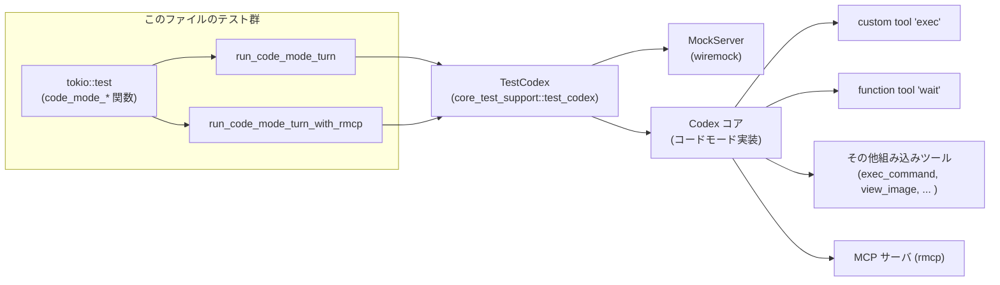

# core/tests/suite/code_mode.rs コード解説

## 0. ざっくり一言

このファイルは、Codex の **Code Mode（`exec` ツールと `wait` ツールを中心とするコード実行モード）** の挙動を統合テストするためのテスト群です。  
ネストしたツール呼び出し・並行実行・`yield_control`/`wait` による中断と再開・MCPツールの公開方法・画像／ストレージヘルパ・エラー伝播などを網羅的に検証します。

> 行番号情報はこのチャンクには含まれていないため、本解説では「関数名＋コード断片」を根拠として示し、`Lxx-yy` 形式の厳密な行番号は付与していません。

---

## 1. このモジュールの役割

### 1.1 概要

- このモジュールは **Code Mode 実行環境とツール群が期待どおりに振る舞うか** を検証する統合テストを提供します。
- `exec` カスタムツールを通じて JavaScript 風のコードを実行し、その中からさらに `tools.exec_command` や MCP ツールなどを呼び出すケースをテストします。
- 非同期実行・`yield_control` / `wait` による長時間ジョブの中断／再開、セッションの終了・強制終了・トークン制限・エラー表示などを確認します。

### 1.2 アーキテクチャ内での位置づけ

Code Mode テストの概念的な依存関係は次のようになります。



- テスト関数は `TestCodex`（テスト用 Codex クライアント）と `MockServer`（wiremock）を使い、SSE イベント列を模擬します。
- `exec` ツールは Code Mode のメインの実行手段で、テスト内の JavaScript 文字列がここで実行されます。
- `wait` ツールは `yield_control` されたセッションの状態を問い合わせる関数ツールです。
- 一部のテストでは MCP サーバ（`rmcp`）を `McpServerConfig` で起動し、Code Mode から `tools.mcp__rmcp__*` として利用できることを検証します。

### 1.3 設計上のポイント（このテストファイルから読み取れる範囲）

- **非同期＆並行性**
  - すべてのテストは `#[tokio::test(flavor = "multi_thread", worker_threads = 2)]` で実行され、マルチスレッドランタイム上で Code Mode の並行動作を検証しています。
  - `Promise.all` によるネストツールの並行実行や、複数の `yield_control` セッションが独立して動くことを確認しています（`code_mode_nested_tool_calls_can_run_in_parallel` など）。
- **エラーハンドリングの検証**
  - スクリプト内部の例外・ツールハンドラのエラー・セッションID不明など、多数のエラーシナリオで「Script failed」「Script error: ...」等のメッセージが構成されることを文字列・正規表現で検証しています。
- **テスト用ヘルパ関数による責務分割**
  - `custom_tool_output_items`, `custom_tool_output_body_and_success`, `function_tool_output_items` などが、テストの読みやすさのためにレスポンス解析を共通化しています。
  - `run_code_mode_turn` / `run_code_mode_turn_with_rmcp` は Code Mode セッションのセットアップと簡単な SSE モックをまとめたラッパです。
- **安全性への配慮**
  - シェルコマンドを生成する `wait_for_file_source` では `shlex::try_join` によるパスのシェルクオートを行い、パスに空白や特殊文字が入ってもコマンドインジェクションを避けるようになっています。

---

## 2. コンポーネント一覧・主要な機能

### 2.1 関数・テストのインベントリ

このファイル内で定義されている関数（ヘルパ＋テスト）の一覧です。

| 名前 | 種別 | 概要 |
|------|------|------|
| `custom_tool_output_items` | ヘルパ | `ResponsesRequest` からカスタムツール（`exec`）呼び出しの `output` を取り出して、統一的に `Vec<Value>` に変換します。 |
| `tool_names` | ヘルパ | レスポンスボディから `tools` 配列内の `name` / `type` を列挙して `Vec<String>` として返します。 |
| `function_tool_output_items` | ヘルパ | 関数ツール（例: `wait`）の出力 `output` を `Vec<Value>` として取得します。 |
| `text_item` | ヘルパ | content item の配列から `text` フィールドを取り出し `&str` として返します。存在しなければ `expect` でパニックします。 |
| `extract_running_cell_id` | ヘルパ | `"Script running with cell ID ..."` 形式のヘッダ文字列から cell ID を抽出します。 |
| `wait_for_file_source` | ヘルパ | 指定パスのファイル存在をポーリングする JavaScript ソースコード文字列を生成します（`tools.exec_command` 用）。 |
| `custom_tool_output_body_and_success` | ヘルパ | カスタムツール出力から、テキスト出力を 1 つの `String` にまとめ、`success: Option<bool>` と組にして返します。 |
| `custom_tool_output_last_non_empty_text` | ヘルパ | カスタムツール出力のうち最後の非空文字列テキストを `Option<String>` で返します。 |
| `run_code_mode_turn` | ヘルパ（公開テスト用） | Code Mode を有効化した `TestCodex` をセットアップし、1 回のユーザーターンとそれに続くフォローアップ SSE モックを構成します。 |
| `run_code_mode_turn_with_rmcp` | ヘルパ（公開テスト用） | 上記に加え、MCP サーバ `rmcp` を `stdio` で起動する設定を追加した Code Mode セッションを構成します。 |
| `code_mode_can_return_exec_command_output` | テスト | `tools.exec_command` の出力＆メタ情報（chunk_id, exit_code, wall_time）を `exec` から正しく受け取れることを検証します。 |
| `code_mode_only_restricts_prompt_tools` | テスト | `Feature::CodeModeOnly` 有効時に、プロンプトツールとして `exec`, `wait` のみが公開されることを検証します。 |
| `code_mode_only_can_call_nested_tools` | テスト | CodeModeOnly モードでも `exec` 内からさらに `tools.exec_command` を呼び出せることを検証します。 |
| `code_mode_update_plan_nested_tool_result_is_empty_object` | テスト | `tools.update_plan` の結果が空オブジェクト `{}` として返ることを検証します。 |
| `code_mode_nested_tool_calls_can_run_in_parallel` | テスト | `tools.test_sync_tool` を `Promise.all` で並列呼び出ししたとき、実時間の短さから並列実行されていることを確認します。 |
| `code_mode_can_truncate_final_result_with_configured_budget` | テスト | `@exec` コメントの `max_output_tokens` 設定に従って、最終出力がトークン単位で切り詰められることを検証します。 |
| `code_mode_returns_accumulated_output_when_script_fails` | テスト | 例外発生前までの `text` 出力が、失敗したスクリプトでも保持されることを確認します。 |
| `code_mode_exec_surfaces_handler_errors_as_exceptions` | テスト | ネストツール（`tools.exec_command({})` のような不正呼び出し）のエラーが JS 例外としてスクリプト側から `try/catch` できることを検証します。 |
| `code_mode_can_yield_and_resume_with_wait` | テスト | `yield_control` により `exec` セッションを中断し、`wait` ツールで同じ cell ID のスクリプトを段階的に再開できることを検証します。 |
| `code_mode_yield_timeout_works_for_busy_loop` | テスト | 応答しない無限ループスクリプトを `yield_time_ms` 設定で自動的に `Script running` 状態として切り上げ、後続の `wait` で強制終了できることを確認します。 |
| `code_mode_can_run_multiple_yielded_sessions` | テスト | 2 つの `yield_control` セッション（セッションA/B）が独立した cell ID で管理され、それぞれ別個に `wait` で完了できることを検証します。 |
| `code_mode_wait_can_terminate_and_continue` | テスト | `wait` ツールで `terminate: true` を指定した後も、新しい `exec` セッションを問題なく開始できることを確認します。 |
| `code_mode_wait_returns_error_for_unknown_session` | テスト | 存在しない `cell_id` を `wait` に指定した際、`Script failed` と「exec cell ... not found」メッセージが返ることを検証します。 |
| `code_mode_wait_terminate_returns_completed_session_if_it_finished_after_yield_control` | テスト | `terminate: true` を指定しても、その間にセッションが自然終了していれば `Script completed` と最終出力を返すケースがあることを検証します。 |
| `code_mode_background_keeps_running_on_later_turn_without_wait` | テスト | `yield_control` 後に `wait` を呼ばなくても、バックグラウンドでスクリプトが進行し、外部から `exec_command` で状況を確認できることをテストします。 |
| `code_mode_wait_uses_its_own_max_tokens_budget` | テスト | `exec` の `max_output_tokens` とは別に、`wait` の `max_tokens` 引数で独立した出力トークン制限が効くことを検証します。 |
| `code_mode_can_output_serialized_text_via_global_helper` | テスト | `text({ json: true })` のようにオブジェクトを渡すと JSON 文字列としてシリアライズされることを検証します。 |
| `code_mode_can_resume_after_set_timeout` | テスト | `setTimeout` をまたいだ非同期処理が正しく再開され、指定時間以上の経過後に出力されることを確認します。 |
| `code_mode_notify_injects_additional_exec_tool_output_into_active_context` | テスト | `notify()` ヘルパが、実行中の `exec` セッションの context に追加の `custom_tool_call_output` を注入することを検証します。 |
| `code_mode_exit_stops_script_immediately` | テスト | `exit()` ヘルパでスクリプトを即時終了した場合、以降のコードは実行されず、出力も途中までで止まることを確認します。 |
| `code_mode_surfaces_text_stringify_errors` | テスト | 循環参照オブジェクトを `text` に渡したときに `Converting circular structure to JSON` のような stringify エラーが Script error として表面化することを検証します。 |
| `code_mode_can_output_images_via_global_helper` | テスト | `image()` ヘルパが URL / data URL から `input_image` content item を生成することを確認します。 |
| `code_mode_can_use_view_image_result_with_image_helper` | テスト | `tools.view_image` の戻り値をそのまま `image()` に渡したとき、base64 data URL と detail が反映されることを検証します。 |
| `code_mode_can_apply_patch_via_nested_tool` | テスト | `tools.apply_patch` を `exec` 内から呼び出し、ファイル作成／内容を確認することで `apply_patch` ネスト呼び出しを検証します。 |
| `code_mode_can_print_structured_mcp_tool_result_fields` | テスト | MCP ツール `mcp__rmcp__echo` の `content` / `structuredContent` / `isError` などのフィールドが JS から正しく読めることを確認します。 |
| `code_mode_exposes_mcp_tools_on_global_tools_object` | テスト | `tools.mcp__rmcp__echo` がグローバル `tools` オブジェクトのプロパティとして存在し、関数として呼べることを検証します。 |
| `code_mode_exposes_namespaced_mcp_tools_on_global_tools_object` | テスト | `tools.exec_command` と `tools.mcp__rmcp__echo` が同じ `tools` 名前空間上で共存していることを JSON で確認します。 |
| `code_mode_exposes_normalized_illegal_mcp_tool_names` | テスト | 元の MCP ツール名が JS 識別子として不正な場合でも、`*_tool` のように正規化された名前として `tools.*` から呼び出せることを検証します。 |
| `code_mode_lists_global_scope_items` | テスト | `globalThis` のプロパティ一覧を取得し、許可されたグローバル（`text`, `image`, `tools`, `yield_control` 等）が揃っていることを期待値セットと照合します。 |
| `code_mode_exports_all_tools_metadata_for_builtin_tools` | テスト | 組み込みツール（例: `view_image`）のメタデータが `ALL_TOOLS` に含まれ、`description` に TypeScript の宣言コメントが含まれることを検証します。 |
| `code_mode_exports_all_tools_metadata_for_namespaced_mcp_tools` | テスト | MCP ツールのメタデータも `ALL_TOOLS` に含まれ、同様に TS 風宣言が `description` に含まれることを検証します。 |
| `code_mode_can_call_hidden_dynamic_tools` | テスト | スレッド開始時に付与された動的ツール（UI等では「隠し」扱い）でも、Code Mode から `ALL_TOOLS` 経由で検出・呼び出せることを検証します。 |
| `code_mode_can_print_content_only_mcp_tool_result_fields` | テスト | MCP ツール `image_scenario` のように `content` のみを返すケースで、そのテキスト／構造化データ有無／エラー判定が期待通りか検証します。 |
| `code_mode_can_print_error_mcp_tool_result_fields` | テスト | MCP ツールを誤った引数で呼び出したとき、`isError` が `true` になり、エラーメッセージが `content` に含まれることを検証します。 |
| `code_mode_can_store_and_load_values_across_turns` | テスト | `store` / `load` ヘルパで、Code Mode の内部ストレージに値を保存し別ターンで読み出せることを確認します。 |
| `code_mode_can_compare_elapsed_time_around_set_timeout` | テスト | `Date.now()` と `setTimeout` を使い、100ms 以上の経過時間が測れていることを JSON で確認します。 |

### 2.2 このテストファイルが検証している主な機能

- Exec ツール・ネストツール
  - `exec` → `tools.exec_command` / `tools.update_plan` / `tools.apply_patch` / MCP ツール / 動的ツール などの呼び出しパス。
- 長時間ジョブの制御
  - `yield_control` と `wait` による中断／再開、`terminate` フラグによる強制終了。
  - セッションID不明時のエラー応答。
  - `yield_time_ms` による自動 yield（busy loop 対応）。
- 出力とトークン制限
  - 正常終了 (`Script completed`)／実行中 (`Script running`)／失敗 (`Script failed`)／強制終了 (`Script terminated`) のヘッダ。
  - `max_output_tokens`／`max_tokens` による出力の切り詰め。
  - 失敗時でもそれまでの `text` 出力が保持されること。
- グローバルヘルパ／環境
  - `text`, `image`, `notify`, `exit`, `store`, `load`, `setTimeout`, `ALL_TOOLS`, `tools` オブジェクトなど。
  - `globalThis` の暴露範囲（許可グローバル一覧）。
- MCP / 動的ツール連携
  - MCP サーバ `rmcp` のツール (`echo`, `image_scenario`) の `content` / `structuredContent` / `isError` の扱い。
  - `ALL_TOOLS` 内の名前空間付きツール名・ツール宣言の記述。
  - 動的ツールの登録と、Code Mode からの呼び出しフロー。

---

## 3. 公開 API と詳細解説

このファイル自体はテストモジュールであり、`pub` な API は定義していませんが、テストから他のテストでも再利用しやすいヘルパ関数と、Code Mode のコア挙動を代表するテスト関数を選んで詳細を説明します。

### 3.1 このファイルで重要な外部型

| 名前 | 種別 | 役割 / 用途 |
|------|------|-------------|
| `TestCodex` (`core_test_support::test_codex`) | 構造体 | Codex コアとの対話とワークスペース管理を行うテスト用ラッパ。`build(server)` でモックサーバに接続したインスタンスを生成します。 |
| `ResponsesRequest` (`core_test_support::responses`) | 構造体 | wiremock によるモックリクエストを解析するヘルパ。`custom_tool_call_output` / `function_call_output` などのメソッドを持ちます。 |
| `ResponseMock` (`core_test_support::responses`) | 構造体 | 特定の SSE シナリオに対応するモック。`single_request()` や `last_request()` で送信されたリクエストを取得します。 |
| `DynamicToolSpec` (`codex_protocol::dynamic_tools`) | 構造体 | 動的ツールの仕様（`name`, `description`, `input_schema`, `defer_loading`）を表します。 |
| `DynamicToolResponse` / `DynamicToolCallOutputContentItem` | 構造体 / 列挙体 | 動的ツールの実行結果（`content_items`, `success`）およびテキストなどの個別アイテムを表す型です。 |
| `MockServer` (`wiremock`) | 構造体 | HTTP モックサーバ。`responses::start_mock_server()` から返され、SSE のエンドポイントを提供します。 |
| `Op`, `EventMsg`, `AskForApproval`, `SandboxPolicy`, `UserInput` | 列挙体/構造体 | Codex コアへの操作（ユーザーターンの送信）と、コード実行のイベントストリームを表現する型です。テストでは動的ツール呼び出しのシグナルに使用します。 |

### 3.2 重要な関数の詳細

#### `run_code_mode_turn(server: &MockServer, prompt: &str, code: &str, include_apply_patch: bool) -> Result<(TestCodex, ResponseMock)>`

**概要**

- Code Mode を有効にした `TestCodex` を構成し、`prompt` と `code` を 1 回送信するテストシナリオを作ります。
- 最初のレスポンス（`exec` の実行）と、その後のフォローアップ（`done` メッセージ）のための SSE モックをセットアップし、後者へのハンドル `ResponseMock` を返します。

**引数**

| 引数名 | 型 | 説明 |
|--------|----|------|
| `server` | `&MockServer` | SSE エンドポイントを提供する wiremock サーバへの参照。 |
| `prompt` | `&str` | ユーザーがモデルに与える自然文プロンプト。 |
| `code` | `&str` | `exec` ツール内で実行させる JavaScript コード。 |
| `include_apply_patch` | `bool` | Code Mode の `include_apply_patch_tool` 設定を有効にするかどうか。`true` なら `tools.apply_patch` が利用可能になります。 |

**戻り値**

- `Ok((TestCodex, ResponseMock))`
  - `TestCodex`: 構成済みの Codex テストクライアント。
  - `ResponseMock`: フォローアップ SSE シーケンス（`ev_assistant_message("done")` を含む）のモック。`single_request()` でそのリクエストを取得できます。
- `Err(anyhow::Error)`  
  - テスト環境の構築に失敗した場合など。

**内部処理の流れ**

1. `test_codex()` でテストビルダを作り、モデル名 `"test-gpt-5.1-codex"` と `Feature::CodeMode` を有効化します。`include_apply_patch_tool` を引数で設定します。
2. `builder.build(server).await?` により Codex クライアントとバックエンドを起動します。
3. `responses::mount_sse_once` で、1 回目のターンに対する SSE シーケンスをモックします:
   - `ev_response_created("resp-1")`
   - `ev_custom_tool_call("call-1", "exec", code)`
   - `ev_completed("resp-1")`
4. 2 回目（フォローアップ）の SSE として、`assistant_message("done")` のみのシーケンスをモックし、そのハンドルを `second_mock` として保持します。
5. `test.submit_turn(prompt).await?` でユーザーターンを送信します。
6. `Ok((test, second_mock))` を返します。

**Examples（使用例）**

```rust
#[tokio::test(flavor = "multi_thread", worker_threads = 2)]
async fn simple_exec_test() -> Result<()> {
    let server = responses::start_mock_server().await;

    // "hello" を出力する簡単なコード
    let (_test, resp_mock) = run_code_mode_turn(
        &server,
        "just say hello",
        r#"text("hello");"#,
        false,
    ).await?;

    let req = resp_mock.single_request();
    let (output, success) = custom_tool_output_body_and_success(&req, "call-1");

    assert_ne!(success, Some(false));
    assert_eq!(output, "hello");
    Ok(())
}
```

**Errors / Panics**

- `builder.build(server).await?` で Codex インスタンス構築に失敗した場合、`Err(anyhow::Error)` を返します。
- SSE モック構築中にエラーが起きれば `?` によりエラーが伝播します。
- `custom_tool_output_body_and_success` 側で `expect` を使用しているため、レスポンスが期待形式でないとパニックしますが、それはこのヘルパの外側です。

**Edge cases**

- `code` が空、あるいは `exec` 内で早期に `exit()` する場合でも、SSE モックは同じ構造を期待しているため、テスト側で適切に検証できます。
- `include_apply_patch = false` の場合 `tools.apply_patch` を呼び出すコードを渡すと、実行時エラーになることが想定されます（具体的な例は `code_mode_can_apply_patch_via_nested_tool` が `true` にしている点から推測）。

**使用上の注意点**

- このヘルパは **最初のターンのみ** をセットアップします。後続のターンが必要な場合は呼び出し元で追加の `mount_sse_once` を行う必要があります。
- `code` はそのまま `ev_custom_tool_call` に埋め込まれるため、改行・クオートなどを含む場合もエスケープ済み文字列として渡す必要があります。

---

#### `wait_for_file_source(path: &Path) -> Result<String>`

**概要**

- ファイルの存在をポーリングし、存在するまで `tools.exec_command` を使ってループする JavaScript コード文字列を生成します。
- 長時間ジョブの制御（ファイル出現を待って続行）をテストするために使用されます。

**引数**

| 引数名 | 型 | 説明 |
|--------|----|------|
| `path` | `&Path` | 監視対象ファイルのパス。 |

**戻り値**

- `Ok(String)`  
  - `while (...) { ... }` 形式の JavaScript コード。`exec` 内からそのまま挿入して利用できます。
- `Err(anyhow::Error)`  
  - `shlex::try_join` が失敗した場合。

**内部処理の流れ**

1. `path.to_string_lossy()` で文字列化し、`shlex::try_join([..])?` でシェル用に安全なクオートを施したパス文字列を生成します。
2. `command = format!("if [ -f {quoted_path} ]; then printf ready; fi")` で「存在すれば `ready` と出力する」シェルコマンドを組み立てます。
3. それを `tools.exec_command({ cmd: ... })` で繰り返し実行し、`output` が `"ready"` になるまで待ち続ける JS コードを `Ok` で返します。

**Examples（使用例）**

```rust
let gate = test.workspace_path("phase-2.ready");
let wait_code = wait_for_file_source(&gate)?;

// exec 内に埋め込む
let code = format!(r#"
text("phase 1");
yield_control();
{wait_code}
text("phase 2");
"#);
```

**Errors / Panics**

- `shlex::try_join` が `Err` を返した場合、`?` により `Err(anyhow::Error)` として呼び出し元へ伝播します。
- 戻り値の JS コード自体の実行失敗（`tools.exec_command` のエラー等）は、この関数では扱わず、Code Mode 側で Script error となります。

**Edge cases**

- パスに空白や特殊文字が含まれる場合でも、`shlex::try_join` によって適切にクオートされる想定です。
- ファイルが永遠に作成されなければ、生成されたコードは無限ループになります（テストでは別途 timeout や `wait` 呼び出しで制御）。

**使用上の注意点**

- 実運用コードに流用する場合、タイムアウトや最大リトライ回数などを追加しないと無限ループになりうる点に注意が必要です。
- この関数はテスト専用であり、ポーリング間隔などは固定です（`await tools.exec_command` は外部待機を伴うため、高頻度呼び出しは遅くなりえます）。

---

#### `code_mode_can_yield_and_resume_with_wait() -> Result<()>`

**概要**

- 代表的な「長時間ジョブの中断と再開」シナリオをテストします。
- `yield_control()` によって `exec` セッションを `Script running` 状態で返し、その後 `wait` 関数ツールで同一 `cell_id` のスクリプトを段階的に実行し、最終的に `Script completed` となることを確認します。

**内部処理の流れ（テストの観点から）**

1. Code Mode を有効化した `TestCodex` を生成し、フェーズごとにファイルゲート（`phase_2.ready` / `phase_3.ready`）を用意します。
2. `wait_for_file_source` でゲートファイルの存在を待つコードを生成し、次のような JS を `exec` で実行させます:

   ```js
   text("phase 1");
   yield_control();
   // phase_2.ready ができるまでループ
   ...
   text("phase 2");
   // phase_3.ready ができるまでループ
   ...
   text("phase 3");
   ```

3. 最初の `submit_turn("start the long exec")` で、`Script running with cell ID ...` と `phase 1` だけを含む出力が返ることを検証し、`cell_id` を抽出します。
4. `wait` 関数ツールを呼び出す SSE をモックし、`cell_id` と `yield_time_ms` を指定して `submit_turn("wait again")` を実行します。
   - ここでは `phase 2` まで出力され、ヘッダは再び `Script running` であることを検証します。
5. 再度 `wait` を呼び出し、今度は `Script completed` ヘッダと `phase 3` 出力のみが返ることを確認します。

**Errors / Panics**

- 想定された content item 数や正規表現にマッチしない場合、`assert_eq!` / `assert_regex_match` によりテストが失敗（パニック）します。
- ファイルゲートの作成・書き込みに失敗した場合は `?` を通じて `Err(anyhow::Error)` になります。

**Edge cases**

- `yield_time_ms` を短く設定しているため、実際の環境で遅延が大きいと、`Script completed` まで進んでしまう可能性がありますが、その場合はテストが失敗します。
- 複数の `wait` 呼び出しの間にスクリプトがすべて完了してしまうケースはこのテストでは想定していません（別テスト `code_mode_wait_terminate_returns_completed_session_if_it_finished_after_yield_control` が近いケースを扱います）。

**使用上の注意点**

- Code Mode の `yield_control` / `wait` を利用する場合、`cell_id` 管理が重要です。テストではヘッダ文字列から `extract_running_cell_id` で取り出しています。
- テスト環境のファイルシステムと OS コマンド（`exec_command`）に依存するため、Windows では `#[cfg_attr(windows, ignore = "...")]` でスキップされています。

---

#### `code_mode_nested_tool_calls_can_run_in_parallel() -> Result<()>`

**概要**

- Code Mode 内から、`tools.test_sync_tool` を `Promise.all` で 2 回並列呼び出しし、実行時間から実際に並列実行されていることを検証するテストです。

**内部処理の流れ**

1. Code Mode を有効にした `TestCodex` を構築。
2. 並列実行前に、`"code-mode-parallel-tools-warmup"` という barrier ID を使ってウォームアップを行う `warmup_code` を `exec` で実行します。
3. 次に、`sleep_after_ms: 300` の引数で、同じ barrier ID `"code-mode-parallel-tools"` を持つ `tools.test_sync_tool(args)` を 2 つ `Promise.all([...])` で呼び出すコードを `exec` に渡します。
4. `test.submit_turn("run nested tools in parallel")` の前後で `Instant::now()` から経過時間を測り、`duration < 1.6s` であることを `assert!` で検証します。
   - 直列なら 300ms × 2 = 600ms 以上かかるため、より長い閾値を用いて「明らかに直列ではない」ことを確認します。
5. 最後に、`exec` の出力が `["ok","ok"]` であることを確認します。

**Errors / Panics**

- 経過時間が 1.6 秒以上の場合、`assert!` によりテストが失敗します（環境により flakiness の可能性があるテストです）。
- `tools.test_sync_tool` の仕様はこのファイルには定義されていませんが、テストからは barrier と sleep に対応することが期待されています。

**Edge cases**

- 環境が極端に遅い場合、並列でも 1.6s を超えてテストが落ちる可能性があります。
- 逆に、barrier の挙動や `test_sync_tool` 実装が変わると、期待どおりの同期がとれずにテストが不安定になる可能性があります。

**使用上の注意点**

- 並行性に関するテストは、環境依存で flakiness を生みやすいため、閾値（1.6 秒）には余裕が持たせてあります。
- 実環境で同様のパターンを使う場合は、タイムアウト値や barrier 設定を慎重に設計する必要があります。

---

#### `code_mode_can_call_hidden_dynamic_tools() -> Result<()>`

**概要**

- UI などには表示されない「隠し」動的ツール `hidden_dynamic_tool` をスレッド開始時に登録し、Code Mode から `ALL_TOOLS` と `tools.hidden_dynamic_tool` を通じて検出・呼び出せることを検証します。

**内部処理の流れ**

1. Code Mode を有効にした `TestCodex` を構築。
2. `thread_manager.start_thread_with_tools` に `DynamicToolSpec` を渡し、`hidden_dynamic_tool` を名前・description・input_schema とともに登録します。
3. 生成されたスレッドを `test.codex` に差し替え、`session_configured` も更新します。
4. JS コードでは:
   - `ALL_TOOLS.find(({ name }) => name === "hidden_dynamic_tool")` でツールメタデータを取得。
   - `tools.hidden_dynamic_tool({ city: "Paris" })` を呼び、戻り値を `out` として保存。
   - `name`, `description`, `out` をまとめて `JSON.stringify` し、`text` で出力します。
5. 別途、`EventMsg::DynamicToolCallRequest` を待ち受け、ツール名と引数が期待どおり (`city: "Paris"`) であることを確認し、`DynamicToolResponse` を返します。
6. 最後に、`custom_tool_output_last_non_empty_text` から JSON を取り出し、`name == "hidden_dynamic_tool"` かつ `out == "hidden-ok"` であること、`description` に TypeScript 風宣言が含まれることを検証します。

**Errors / Panics**

- 動的ツール呼び出しイベントが来ない / 期待と異なる場合、`assert_eq!` によりテストが失敗します。
- `ALL_TOOLS` にツールが出ない場合や JS コード内で例外が起きた場合は Script error になり、`success` が `Some(false)` になってテストが失敗します。

**Edge cases**

- `defer_loading: true` 設定から、初回呼び出し時にロードされるような実装が想定されますが、詳細は他ファイルからは分かりません。
- description の具体的な文言は変わりうるため、テストでは「`A hidden dynamic tool.` を含み、`declare const tools:` などを含むか」で判定しています。

**使用上の注意点**

- 動的ツールの登録には `thread_manager.start_thread_with_tools` を利用し、`test.codex` への差し替えが必要です。
- Hidden ツールであっても Code Mode からは `ALL_TOOLS` と `tools.*` でアクセスできるため、権限やスコープを適切に設計する必要があります（テストでは `SandboxPolicy::DangerFullAccess` を使用）。

---

### 3.3 その他のヘルパ・テスト関数（概要）

ここまでで詳細に説明していない関数について、役割のみを簡潔にまとめます。

| 関数名 | 役割（1 行） |
|--------|--------------|
| `custom_tool_output_items` | `ResponsesRequest::custom_tool_call_output(call_id)` の `output` フィールドを `Vec<Value>` として取得し、文字列なら `input_text` item にラップします。 |
| `function_tool_output_items` | 関数ツール（`wait` など）の `output` フィールドから `Vec<Value>` を取り出します。 |
| `text_item` | content item 配列の特定インデックスから `.text` を取り出し、期待されない型の場合はテストをパニックさせます。 |
| `custom_tool_output_body_and_success` | カスタムツール出力のテキスト部分を 1 つの文字列にまとめ、`success` と共に返します。 |
| `custom_tool_output_last_non_empty_text` | 最後に出力された非空の `text` フィールドを返します。JSON 解析用に便利なヘルパです。 |
| `tool_names` | レスポンスボディ中の `tools` 配列からツール名一覧を抽出し、`CodeModeOnly` の制限をテストするのに使われます。 |
| その他の `code_mode_*` テスト | 2.1 のインベントリ表に示したとおり、それぞれ Code Mode の特定の側面（トークン制限・エラー表示・画像ヘルパ・MCPツール結果・ストア/ロード・時間計測など）を検証するシナリオになっています。 |

---

## 4. データフロー

ここでは代表的なシナリオとして、`code_mode_can_yield_and_resume_with_wait` のデータフローを説明します。

### 4.1 `yield_control` / `wait` を使った長時間ジョブの流れ

1. テストが `submit_turn("start the long exec")` を呼び出す。
2. Codex コアは `exec` ツールを呼び出し、JavaScript コードを実行する。
   - スクリプトは `"phase 1"` を `text` し、`yield_control()` を呼ぶ。
   - Code Mode はスクリプトの状態（cell ID）を保存し、`Script running with cell ID ...` ヘッダと `phase 1` を含む中間結果を返す。
3. テストはヘッダから `cell_id` を抽出し、次のターンで `wait` 関数ツールを呼び出す SSE をモックする。
4. `submit_turn("wait again")` により `wait` ツールが実行される。
   - Code Mode は指定された `cell_id` の続きからスクリプトを再開する。
   - ファイルゲートが開いているフェーズでは `"phase 2"` を出力し、必要に応じて再度 `yield_control` する。
5. 最後の `wait` 呼び出しで、スクリプトは `"phase 3"` まで実行し、`Script completed` ヘッダとともに最終結果を返す。

これをシーケンス図で表すと次のようになります（関数名は説明のためのラベルです）。

```mermaid
sequenceDiagram
    participant Test as Test fn<br/>code_mode_can_yield_and_resume_with_wait
    participant TC as TestCodex
    participant Core as Codex Core<br/>(Code Mode)
    participant Exec as Tool "exec"
    participant Wait as Tool "wait"

    Test->>TC: submit_turn("start the long exec")
    TC->>Core: Op::UserTurn (prompt, exec tool)
    Core->>Exec: run JS code<br/>text("phase 1"); yield_control();
    Exec-->>Core: status=running, cell_id, output="phase 1"
    Core-->>TC: custom_tool_call_output (Script running..., "phase 1")
    TC-->>Test: ResponseMock.first_request

    Note over Test: cell_id を抽出

    Test->>TC: submit_turn("wait again")
    TC->>Core: function tool call "wait" {cell_id, yield_time_ms}
    Core->>Wait: resume cell_id
    Wait->>Core: script continues, outputs "phase 2", yields again
    Core-->>TC: function_call_output (Script running..., "phase 2")
    TC-->>Test: second_request

    Test->>TC: submit_turn("wait for completion")
    TC->>Core: function tool call "wait" {cell_id, yield_time_ms}
    Core->>Wait: resume and finish
    Wait->>Core: script completed, outputs "phase 3"
    Core-->>TC: function_call_output (Script completed..., "phase 3")
    TC-->>Test: third_request
```

---

## 5. 使い方（How to Use）

### 5.1 基本的な使用方法（新しい Code Mode テストの追加）

このファイルのヘルパを使って新しい Code Mode テストを書く典型的な流れは次のとおりです。

```rust
use anyhow::Result;
use core_test_support::responses;
use core_test_support::responses::sse;
use core_test_support::test_codex::test_codex;
use wiremock::MockServer;

#[tokio::test(flavor = "multi_thread", worker_threads = 2)]
async fn my_code_mode_behavior() -> Result<()> {
    let server = responses::start_mock_server().await;

    // Code Mode を有効にした TestCodex を構築
    let mut builder = test_codex().with_config(|config| {
        let _ = config.features.enable(codex_features::Feature::CodeMode);
    });
    let test = builder.build(&server).await?;

    // このターンで実行させたい JS コード
    let code = r#"
text("hello from my test");
"#;

    // SSE モック: exec ツール呼び出しを 1 回だけ許可
    responses::mount_sse_once(
        &server,
        sse(vec![
            responses::ev_response_created("resp-1"),
            responses::ev_custom_tool_call("call-1", "exec", code),
            responses::ev_completed("resp-1"),
        ]),
    ).await;
    let follow_up = responses::mount_sse_once(
        &server,
        sse(vec![
            responses::ev_assistant_message("msg-1", "done"),
            responses::ev_completed("resp-2"),
        ]),
    ).await;

    // ユーザーターンを送信
    test.submit_turn("run my code").await?;

    // exec の最終出力を検証
    let req = follow_up.single_request();
    let (output, success) = custom_tool_output_body_and_success(&req, "call-1");
    assert_ne!(success, Some(false));
    assert_eq!(output, "hello from my test");

    Ok(())
}
```

### 5.2 よくある使用パターン

- **単純な exec 実行**
  - `run_code_mode_turn` を使い、1 ターン＋フォローアップだけの簡単なテストを書く。
- **長時間ジョブ・yield のテスト**
  - `yield_control` をコード側に挿入し、`wait_for_file_source` で外部条件（ファイル作成）をトリガに段階的に再開する。
- **MCP ツールのテスト**
  - `run_code_mode_turn_with_rmcp` を使い、`tools.mcp__rmcp__*` を JS から呼び出し、`structuredContent` / `isError` などを検証する。
- **グローバル環境の検査**
  - `globalThis` のプロパティ名一覧を `text(JSON.stringify(...))` で出力し、期待するグローバルだけが存在することを `HashSet` で検証する。

### 5.3 よくある間違いと正しい例

```rust
// 誤り例: exec 実行用の SSE モックをマウントせずに submit_turn する
#[tokio::test]
async fn wrong() -> Result<()> {
    let server = responses::start_mock_server().await;
    let test = test_codex().build(&server).await?;

    // ここで mount_sse_once を行っていない
    test.submit_turn("will hang or fail").await?; // 想定外の挙動

    Ok(())
}

// 正しい例: 事前に exec ツールの SSE シナリオをマウントしておく
#[tokio::test]
async fn correct() -> Result<()> {
    let server = responses::start_mock_server().await;
    let test = test_codex().build(&server).await?;

    responses::mount_sse_once(
        &server,
        sse(vec![
            ev_response_created("resp-1"),
            ev_custom_tool_call("call-1", "exec", r#"text("ok")"#),
            ev_completed("resp-1"),
        ]),
    ).await;

    let follow_up = responses::mount_sse_once(
        &server,
        sse(vec![ev_assistant_message("msg-1", "done"), ev_completed("resp-2")]),
    ).await;

    test.submit_turn("run exec").await?;
    let req = follow_up.single_request();
    let (output, _) = custom_tool_output_body_and_success(&req, "call-1");
    assert_eq!(output, "ok");
    Ok(())
}
```

### 5.4 使用上の注意点（まとめ）

- **SSE モックの順序**
  - `mount_sse_once` / `mount_sse_sequence` の順番と内容が、テストで送信するターンの順に対応している必要があります。
- **call_id の整合性**
  - `ev_custom_tool_call("call-1", ...)` で使った `call_id` と、`custom_tool_output_*` に渡す `"call-1"` が一致していることを確認する必要があります。
- **OS 依存のテスト**
  - `exec_command` を利用するテストは Windows では `ignore` されており、他プラットフォームでもシェル環境に依存します。
- **並行性テストの不安定性**
  - 実行時間に閾値を設けるテスト（並列ツール呼び出しなど）は、環境負荷によって失敗する可能性があるため、CI 環境の性能に注意が必要です。

---

## 6. 変更の仕方（How to Modify）

### 6.1 新しい機能（Code Mode の新挙動）をテストしたい場合

1. **テストシナリオの整理**
   - 新しいグローバルヘルパ（例: `download()`）や新ツールを追加した場合、その期待挙動（正常ケース・エラーケース・境界条件）を箇条書きにします。
2. **ヘルパの再利用**
   - 既存の `run_code_mode_turn` / `run_code_mode_turn_with_rmcp` で十分であればそれを利用し、似た構造のテストをベースにコピーします。
   - 出力の取り回しには `custom_tool_output_body_and_success` / `custom_tool_output_items` を使うとよいです。
3. **SSE シナリオの追加**
   - `responses::mount_sse_once` / `mount_sse_sequence` で、`exec` や新ツール用の SSE パターンを作成します。
4. **アサーション**
   - 文字列出力は `assert_regex_match` を活用し、細かい数値（時間やトークン数）が変動しうる部分は正規表現で緩く検証します。

### 6.2 既存テストを変更する場合の注意点

- **影響範囲の確認**
  - テスト名 `code_mode_*` は CI 上で Code Mode の挙動保証の重要な部分を担っている可能性が高いため、仕様変更があった箇所（exec のメッセージ形式など）との整合性を確認する必要があります。
- **契約（Contracts）の維持**
  - ヘッダ文字列（`Script completed`, `Script failed`, `Script running with cell ID ...`, `Script terminated`）や、`success: Option<bool>` の意味は多くのテストで共有されているため、変更すると多数のテストに影響します。
- **トークン制限・エラー条件**
  - `max_output_tokens` / `max_tokens` の扱いを変える場合は、`code_mode_can_truncate_final_result_with_configured_budget` や `code_mode_wait_uses_its_own_max_tokens_budget` を合わせて修正する必要があります。
- **MCP / 動的ツール**
  - MCP ツールのインターフェースや `structuredContent` の構造を変える場合、関連テスト（`code_mode_can_print_structured_mcp_tool_result_fields` 等）を更新し、`DynamicToolSpec` 作成部分との整合を取る必要があります。

---

## 7. 関連ファイル・モジュール

このテストファイルと密接に関係するコンポーネントです（モジュールパスベースで記載します）。

| モジュール / 型 | 役割 / 関係 |
|-----------------|------------|
| `core_test_support::test_codex` (`TestCodex`, `test_codex`) | Codex コアとモックサーバを組み合わせたテスト用クライアントを提供します。このファイルのほぼ全テストが依存します。 |
| `core_test_support::responses` | SSE シナリオのモック構築 (`mount_sse_once`, `mount_sse_sequence`, `sse`, `ev_*`) や `ResponsesRequest` / `ResponseMock` を通じて HTTP リクエストを検査するユーティリティを提供します。 |
| `core_test_support::{wait_for_event, wait_for_event_match}` | 動的ツール呼び出しなど、Codex 内部イベントストリームが特定状態になるのを待つために使用されます（`code_mode_can_call_hidden_dynamic_tools` 内など）。 |
| `codex_features::Feature` | Code Mode / Code Mode Only / ImageDetailOriginal などの機能フラグを表し、テスト時の構成で有効化されます。 |
| `codex_config::types::{McpServerConfig, McpServerTransportConfig}` | MCP サーバ（`rmcp`）の起動方法（stdio 経由コマンドや環境変数）を指定する設定型です。`run_code_mode_turn_with_rmcp` で使用されます。 |
| `codex_protocol::dynamic_tools` | 動的ツールの仕様・応答を表す型群。`code_mode_can_call_hidden_dynamic_tools` で使用されます。 |
| `codex_protocol::protocol::{Op, EventMsg, AskForApproval, SandboxPolicy}` | Code Mode のターン送信やイベント受信のインターフェース。動的ツールのイベント駆動フローをテストする際に使われます。 |

このファイルは、Code Mode の仕様変更があった際のリグレッション検出に重要な位置づけにあります。新しい Code Mode 機能を追加する際は、同様のパターンでテストを追加することが推奨されます。
