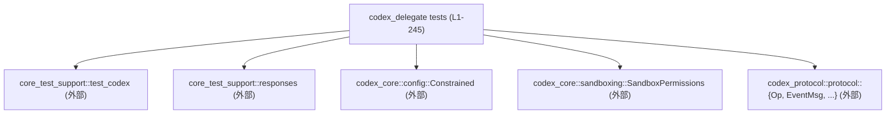
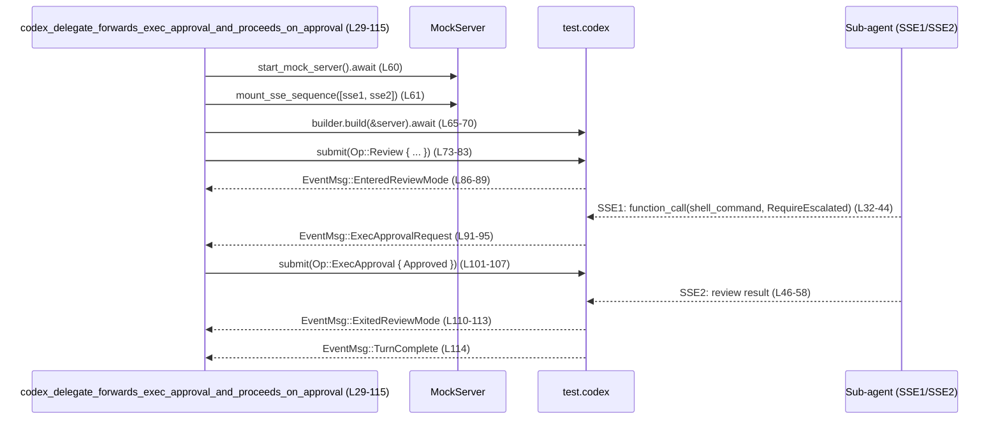
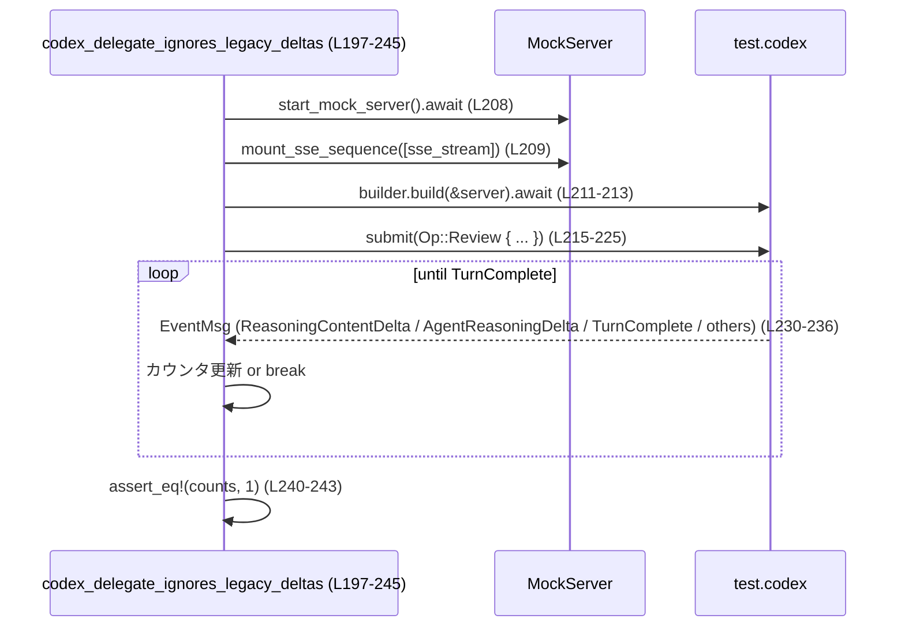

# core/tests/suite/codex_delegate.rs コード解説

## 0. ざっくり一言

Codex の「delegate」機構について、

- 親エージェントへの承認リクエストのフォワード動作  
- reasoning デルタ（新旧形式）のイベント変換

を検証する **非同期統合テスト** をまとめたファイルです  
（`core/tests/suite/codex_delegate.rs:L25-245`）。

---

## 1. このモジュールの役割

### 1.1 概要

このテストモジュールは、Codex システムにおける「delegate」が以下を満たしているかを確認します。

- サブエージェント（sub-agent）の **実行／パッチ適用の承認要求** を親側へ `EventMsg` として中継し、親からの `Op::*Approval` に従ってフローが進むこと  
  （`codex_delegate_forwards_exec_approval_and_proceeds_on_approval`・`codex_delegate_forwards_patch_approval_and_proceeds_on_decision`  
  `core/tests/suite/codex_delegate.rs:L25-194`）。
- reasoning の SSE イベントから、新形式とレガシー形式の両方のデルタイベントを発火すること  
  （`codex_delegate_ignores_legacy_deltas`  
  `core/tests/suite/codex_delegate.rs:L196-245`）。

### 1.2 アーキテクチャ内での位置づけ

このファイルは、テストコードから **モックサーバ** と **Codex 本体（test_codex 経由）** を操作し、`codex_protocol::protocol` の `Op` / `EventMsg` を通して delegate の挙動を間接的に検証します。

主な依存関係は次のとおりです。

- `core_test_support::responses` … SSE（Server-Sent Events）ストリームを構成するテスト用ヘルパ  
  （`sse`, `ev_*`, `mount_sse_sequence`, `start_mock_server` など  
  `core/tests/suite/codex_delegate.rs:L10-19, L32-58, L124-142, L200-206`）
- `core_test_support::test_codex::test_codex` … Codex 本体をテスト用に立ち上げるビルダ  
  （`core/tests/suite/codex_delegate.rs:L21, L65-70, L147-154, L211-212`）
- `codex_protocol::protocol::{Op, EventMsg, …}` … Codex と外部との間でやり取りされる操作・イベント  
  （`core/tests/suite/codex_delegate.rs:L3-8, L73-83, L101-106, L156-166, L168-176, L181-185, L215-236`）
- `codex_core::config::Constrained` と `SandboxPolicy`, `SandboxPermissions` … 承認ポリシ／サンドボックス設定の指定  
  （`core/tests/suite/codex_delegate.rs:L1-2, L9, L65-69, L147-152`）

この関係を簡略図にすると次のようになります。



### 1.3 設計上のポイント

コードから読み取れる設計上の特徴は次のとおりです。

- **完全にテスト専用**  
  公開関数はすべて `#[tokio::test]` 付きの非同期テストであり、ライブラリ API は定義されていません  
  （`core/tests/suite/codex_delegate.rs:L27-29, L119-121, L196-197`）。
- **非同期・イベント駆動のシナリオテスト**  
  `test.codex.submit(Op::Review { ... })` で処理を開始し、`wait_for_event` で `EventMsg` を待ち受けるイベント駆動スタイルになっています  
  （`core/tests/suite/codex_delegate.rs:L73-83, L86-96, L110-114, L156-167, L168-176, L189-193, L215-236`）。
- **モック SSE による sub-agent シミュレーション**  
  `sse` と `ev_*` ヘルパで sub-agent のレスポンスを SSE ストリームとして組み立て、モックサーバにマウントしています  
  （`core/tests/suite/codex_delegate.rs:L32-44, L46-58, L124-130, L131-142, L200-206, L208-209`）。
- **承認ポリシとサンドボックスの明示設定**  
  `config.permissions.approval_policy`, `config.permissions.sandbox_policy` を `Constrained::allow_any(...)` で設定し、delegate が承認要求を発行する条件をテスト側でコントロールしています  
  （`core/tests/suite/codex_delegate.rs:L63-69, L147-152`）。
- **エラー処理はテストらしく `expect` / `panic!` ベース**  
  ビルドや submit が失敗した場合は `expect("...")` や `panic!` でテスト失敗とします  
  （`core/tests/suite/codex_delegate.rs:L70, L82-83, L95-98, L154-155, L165-166, L176-178, L212-213, L224-225`）。

---

## 2. 主要な機能一覧

このファイルの「機能」は 3 つのテストケースです（いずれも async 関数）。

- `codex_delegate_forwards_exec_approval_and_proceeds_on_approval`  
  : sub-agent の `shell_command` 実行に対する **ExecApprovalRequest** が親にフォワードされ、親が承認するとレビュー処理が完了することを検証します  
    （`core/tests/suite/codex_delegate.rs:L25-115`）。
- `codex_delegate_forwards_patch_approval_and_proceeds_on_decision`  
  : sub-agent の patch 適用に対する **ApplyPatchApprovalRequest** が親にフォワードされ、親が拒否しても処理が正常に完了することを検証します  
    （`core/tests/suite/codex_delegate.rs:L117-194`）。
- `codex_delegate_ignores_legacy_deltas`  
  : reasoning 関連の SSE イベントから、`EventMsg::ReasoningContentDelta` と `EventMsg::AgentReasoningDelta` が適切に発行されることをカウントして確認します  
    （`core/tests/suite/codex_delegate.rs:L196-245`）。

### 2.1 コンポーネント一覧（関数インベントリ）

| 名称 | 種別 | 役割 / 用途 | 定義位置 |
|------|------|-------------|----------|
| `codex_delegate_forwards_exec_approval_and_proceeds_on_approval` | `async fn`（`#[tokio::test]`, `#[ignore]`） | sub-agent の `shell_command` 実行に伴う `ExecApprovalRequest` のフォワードと、親からの承認後にレビューが完了するまでのイベントシーケンスを検証する統合テスト | `core/tests/suite/codex_delegate.rs:L29-115` |
| `codex_delegate_forwards_patch_approval_and_proceeds_on_decision` | `async fn`（`#[tokio::test]`, `#[ignore]`） | sub-agent の patch 適用に伴う `ApplyPatchApprovalRequest` のフォワードと、親が `ReviewDecision::Denied` を返しても処理が完了することを検証する統合テスト | `core/tests/suite/codex_delegate.rs:L121-194` |
| `codex_delegate_ignores_legacy_deltas` | `async fn`（`#[tokio::test]`） | reasoning summary に関連する SSE イベントから、新旧 2 形式の reasoning delta イベントそれぞれが 1 回ずつ発行されることをカウントで検証するテスト | `core/tests/suite/codex_delegate.rs:L197-245` |

---

## 3. 公開 API と詳細解説

このファイル自体はテストモジュールであり、ライブラリとしての「公開 API」は提供しません。  
そのため、ここでは **テストから利用している主な外部型** と **テスト関数自体** を整理します。

### 3.1 型一覧（構造体・列挙体など）

このファイル内で新たに定義される型はありません（`core/tests/suite/codex_delegate.rs:L1-245`）。  
テストで使用している主な外部型（役割は本ファイルから読み取れる範囲に限定）を挙げます。

| 名前 | 種別 | 役割 / 用途 | 使用位置 |
|------|------|-------------|----------|
| `Constrained<T>` | 外部構造体（`codex_core::config`） | 権限関連設定をラップし `allow_any(...)` でポリシ値を許可付きで設定するために使用されています | `core/tests/suite/codex_delegate.rs:L1, L65-69, L147-152` |
| `SandboxPermissions` | 外部型（`codex_core::sandboxing`） | コマンド実行に必要なサンドボックス権限を表す型で、`RequireEscalated` 定数が使用されています | `core/tests/suite/codex_delegate.rs:L2, L35-38` |
| `SandboxPolicy` | 外部型（`codex_protocol::protocol`） | サンドボックスのポリシ（ここでは読み取り専用ポリシ）を表す型で、`new_read_only_policy()` が使用されています | `core/tests/suite/codex_delegate.rs:L9, L67-68, L150-151` |
| `AskForApproval` | 列挙体と推測される外部型 | 承認要求のタイミング設定で `OnRequest` バリアントが使用されています | `core/tests/suite/codex_delegate.rs:L3, L65-66, L147-148` |
| `Op` | 列挙体（`codex_protocol::protocol`） | Codex への操作要求を表し、`Review`, `ExecApproval`, `PatchApproval` が使われています | `core/tests/suite/codex_delegate.rs:L5, L73-83, L101-106, L156-166, L181-185` |
| `EventMsg` | 列挙体（`codex_protocol::protocol`） | Codex から発行されるイベントで、多数のバリアント（`EnteredReviewMode`, `ExecApprovalRequest`, `ApplyPatchApprovalRequest`, `ExitedReviewMode`, `TurnComplete`, `ReasoningContentDelta`, `AgentReasoningDelta`）がマッチ対象になっています | `core/tests/suite/codex_delegate.rs:L4, L86-96, L110-114, L168-176, L189-193, L233-235` |
| `ReviewDecision` | 列挙体 | 承認の可否を表す型で、`Approved`, `Denied` バリアントが使用されています | `core/tests/suite/codex_delegate.rs:L6, L105-106, L184-185` |
| `ReviewRequest` / `ReviewTarget` | 構造体／列挙体 | レビュー対象の指定（ここでは `ReviewTarget::Custom { instructions, .. }`）に使用されています | `core/tests/suite/codex_delegate.rs:L7-8, L75-80, L158-163, L217-222` |

> これらの型の正確な定義内容は、このチャンクには含まれていません。そのため、役割説明は **命名と使用箇所からの推測** を含みます（例: 承認に関する型名と `ReviewDecision::Approved` などのバリアント名）。  

### 3.2 関数詳細（テスト 3 件）

#### `codex_delegate_forwards_exec_approval_and_proceeds_on_approval()`

**概要**

- sub-agent が `shell_command` を呼び出し、delegate が **ExecApprovalRequest** を親にフォワードすること、親が承認するとレビュー処理が正常終了することを検証するテストです  
  （`core/tests/suite/codex_delegate.rs:L25-115`）。

**引数**

- なし（`#[tokio::test]` によりテストランナーから直接呼び出されます）。

**戻り値**

- `()`（暗黙）。`async fn` ですが `#[tokio::test]` によって非同期テストとして実行されます  
  （`core/tests/suite/codex_delegate.rs:L28-29`）。

**内部処理の流れ（アルゴリズム）**

1. **ネットワーク依存テストのスキップ判定**

   - 冒頭で `skip_if_no_network!();` を呼び出し、ネットワーク利用が許可されていない環境ではテストをスキップする意図と考えられます（詳細実装はこのチャンクにはありません）  
     （`core/tests/suite/codex_delegate.rs:L30`）。

2. **sub-agent の 1 ターン目 SSE ストリームを構成**

   - `call_id = "call-exec-1"` を定義し、`serde_json::json!` で `command`, `timeout_ms`, `sandbox_permissions`（`SandboxPermissions::RequireEscalated`）を含む JSON を作成、`to_string()` で文字列化しています  
     （`core/tests/suite/codex_delegate.rs:L32-39`）。
   - それを `ev_response_created`, `ev_function_call(call_id, "shell_command", &args)`, `ev_completed` で囲み、`sse(vec![...])` で 1 本の SSE ストリーム `sse1` にしています  
     （`core/tests/suite/codex_delegate.rs:L40-44`）。
   - コメントに「Sub-agent turn 1: emit a shell_command function_call requiring approval, then complete.」とあるため、この SSE が sub-agent の「第 1 ターン」の動作を模しているとわかります  
     （`core/tests/suite/codex_delegate.rs:L32-33`）。

3. **sub-agent の 2 ターン目 SSE ストリームを構成**

   - `review_json` として、`overall_explanation: "delegate approved exec"` などを含む JSON を組み立てて文字列化し  
     （`core/tests/suite/codex_delegate.rs:L46-53`）、
   - `ev_response_created`, `ev_assistant_message("msg-1", &review_json)`, `ev_completed` をまとめて `sse2` として構築しています  
     （`core/tests/suite/codex_delegate.rs:L54-58`）。
   - コメントから、これはレビュー結果（構造化出力）を返して完了する sub-agent の第 2 ターンを表します  
     （`core/tests/suite/codex_delegate.rs:L46`）。

4. **モックサーバと SSE シーケンスのマウント**

   - `start_mock_server().await` でモックサーバ `server` を起動し  
     （`core/tests/suite/codex_delegate.rs:L60`）、
   - `mount_sse_sequence(&server, vec![sse1, sse2]).await` で、2 本の SSE ストリームをシーケンスとしてサーバ側にマウントします  
     （`core/tests/suite/codex_delegate.rs:L61`）。
   - これにより、Codex がサーバに接続した際に `sse1` → `sse2` の順に SSE イベントが配信される前提が作られます。

5. **Codex テストインスタンスの構築（承認必須設定）**

   - `test_codex()` からビルダを作り、`.with_model("gpt-5.1")` でモデル名を指定し、`.with_config(|config| { ... })` で各種ポリシを設定しています  
     （`core/tests/suite/codex_delegate.rs:L65-69`）。
     - `config.permissions.approval_policy = Constrained::allow_any(AskForApproval::OnRequest);`
     - `config.permissions.sandbox_policy = Constrained::allow_any(SandboxPolicy::new_read_only_policy());`
   - これにより「要求があったときに承認を求める」ポリシと「読み取り専用サンドボックス」ポリシが設定され、shell command 実行が承認付きになる前提が作られます。
   - 最後に `builder.build(&server).await.expect("build test codex")` により、実際の Codex インスタンスを含む `test` オブジェクトを構築します  
     （`core/tests/suite/codex_delegate.rs:L70`）。

6. **レビューの開始と review mode への遷移確認**

   - `test.codex.submit(Op::Review { review_request: ReviewRequest { ... } }).await.expect("submit review");` でレビューを開始します  
     （`core/tests/suite/codex_delegate.rs:L73-83`）。
   - 続けて `wait_for_event(&test.codex, |ev| matches!(ev, EventMsg::EnteredReviewMode(_))).await;` で、`EnteredReviewMode` イベントが出るまで待機し、レビュー・モードへ入ったことを確認します  
     （`core/tests/suite/codex_delegate.rs:L85-89`）。

7. **ExecApprovalRequest の受信と承認送信**

   - `wait_for_event(&test.codex, |ev| matches!(ev, EventMsg::ExecApprovalRequest(_))).await;` で delegate から親に転送された `ExecApprovalRequest` を待ち受けています  
     （`core/tests/suite/codex_delegate.rs:L91-95`）。
   - `let EventMsg::ExecApprovalRequest(approval) = approval_event else { panic!("expected ExecApprovalRequest event"); };` によって、イベントの型を厳密に検査し、そうでなければテストを失敗させます  
     （`core/tests/suite/codex_delegate.rs:L96-98`）。
   - その後、`test.codex.submit(Op::ExecApproval { id: approval.effective_approval_id(), turn_id: None, decision: ReviewDecision::Approved }).await.expect("submit exec approval");` によって、親側から承認（Approved）を返します  
     （`core/tests/suite/codex_delegate.rs:L101-107`）。
   - ここで `approval.effective_approval_id()` が「delegate が発行した承認リクエストに紐づく ID」を返す役割と推測できますが、このメソッドの定義はこのチャンクにはありません。

8. **レビュー終了とターン完了の確認**

   - 最後に `ExitedReviewMode` と `TurnComplete` イベントをそれぞれ `wait_for_event` で待受けることで、レビューが正常に終了し、1 ターンの処理が完了したことを確認します  
     （`core/tests/suite/codex_delegate.rs:L110-114`）。

**Examples（使用例）**

このテスト関数自体が「delegate を介した ExecApproval のテストパターン」の具体例になっています。  
同様のテストを作る場合の最小例は次のようになります（構造を抜粋）。

```rust
#[tokio::test(flavor = "multi_thread", worker_threads = 2)]          // tokio のマルチスレッドランタイムで実行されるテスト
async fn example_exec_approval_flow() {
    skip_if_no_network!();                                           // ネットワークが使えない場合はテストをスキップする意図のマクロ

    let sse1 = sse(vec![
        ev_response_created("resp-1"),                               // sub-agent 応答の開始
        ev_function_call("call-exec-1", "shell_command", "{}"),      // shell_command の function_call イベント
        ev_completed("resp-1"),                                      // 応答完了
    ]);

    let server = start_mock_server().await;                          // モックサーバの起動
    mount_sse_sequence(&server, vec![sse1]).await;                   // SSE ストリームをサーバにマウント

    let mut builder = test_codex().with_config(|config| {            // Codex のテストビルダを初期化し設定を変更
        config.permissions.approval_policy =
            Constrained::allow_any(AskForApproval::OnRequest);       // 承認は要求時に求める設定
    });
    let test = builder.build(&server).await.expect("build codex");   // Codex テストインスタンスを構築

    test.codex
        .submit(Op::Review {                                         // レビュー開始の操作を送信
            review_request: ReviewRequest {
                target: ReviewTarget::Custom {
                    instructions: "Please review".to_string(),       // レビュー指示
                },
                user_facing_hint: None,
            },
        })
        .await
        .expect("submit review");                                    // エラーならテスト失敗

    let event = wait_for_event(&test.codex, |ev| {                   // ExecApprovalRequest イベントを待つ
        matches!(ev, EventMsg::ExecApprovalRequest(_))
    })
    .await;

    // event が期待通りであることを検査し、必要なら ExecApproval を返す…
}
```

**Errors / Panics**

- `builder.build(&server).await.expect("build test codex")`  
  → Codex テストインスタンス構築に失敗した場合、`expect` により panic しテストが失敗します  
  （`core/tests/suite/codex_delegate.rs:L70`）。
- `test.codex.submit(...).await.expect("submit review");`  
  および `expect("submit exec approval")`  
  → Codex への操作送信が失敗した場合に panic します  
  （`core/tests/suite/codex_delegate.rs:L82-83, L107-108`）。
- `let EventMsg::ExecApprovalRequest(approval) = approval_event else { panic!("expected ExecApprovalRequest event"); };`  
  → 期待した種別のイベントが届かない場合、明示的に `panic!` します  
  （`core/tests/suite/codex_delegate.rs:L96-98`）。

これらは「テストとして失敗を即座に検知する」ための意図的な panic です。

**Edge cases（エッジケース）**

- **ExecApprovalRequest が決して届かない場合**  
  - `wait_for_event` がどのような実装かはこのチャンクにはありませんが、名前からは「一定条件までイベントを待ち続ける」ことが想定されます  
    （`core/tests/suite/codex_delegate.rs:L92-95`）。
  - タイムアウトやキャンセルがあるかどうかは不明です（このファイルには実装が現れません）。
- **EventMsg が想定と異なる順序で届く場合**  
  - テストは `EnteredReviewMode` → `ExecApprovalRequest` → `ExitedReviewMode` → `TurnComplete` の順に `wait_for_event` で待っています  
    （`core/tests/suite/codex_delegate.rs:L85-89, L91-95, L110-114`）。
  - 順序がずれたり、一部のイベントが欠けたりすると、テストは `panic!` またはハング（もしくは `wait_for_event` のエラー）になります。
- **`approval.effective_approval_id()` が無効な ID を返す場合**  
  - その場合の Codex 側の挙動はこのテストからは見えません。少なくとも、このテストは成功した場合の正常系のみを検証しています  
    （`core/tests/suite/codex_delegate.rs:L101-103`）。

**使用上の注意点**

- この関数は `#[ignore = "TODO once we have a delegate that can ask for approvals"]` が付いており、デフォルトのテスト実行ではスキップされます  
  （`core/tests/suite/codex_delegate.rs:L27`）。
- ネットワーク環境（少なくともモックサーバへの接続）が前提です。`skip_if_no_network!` マクロがそのチェックを担っていると推測されますが、このチャンクには定義がありません  
  （`core/tests/suite/codex_delegate.rs:L30`）。
- Tokio のマルチスレッドランタイム上で実行されるため、内部で `Send` / `Sync` が要求される可能性がありますが、その詳細は `test_codex` 等の実装に依存します  
  （`core/tests/suite/codex_delegate.rs:L28`）。

---

#### `codex_delegate_forwards_patch_approval_and_proceeds_on_decision()`

**概要**

- sub-agent が patch 適用を試みた際に delegate が **ApplyPatchApprovalRequest** を親にフォワードし、親が `ReviewDecision::Denied` を返してもレビュー処理が正常に完了することを検証するテストです  
  （`core/tests/suite/codex_delegate.rs:L117-194`）。

**引数 / 戻り値**

- なし、戻り値は `()`（`#[tokio::test]` による非同期テスト）  
  （`core/tests/suite/codex_delegate.rs:L120-121`）。

**内部処理の流れ**

1. **ネットワークチェック**

   - 冒頭で `skip_if_no_network!();` を呼び出します  
     （`core/tests/suite/codex_delegate.rs:L122`）。

2. **patch 適用用 SSE ストリームの構成**

   - `call_id = "call-patch-1"` とテキストベースの patch (`delegated.txt` に `hello` を追加する形式) を定義し  
     （`core/tests/suite/codex_delegate.rs:L124-125`）、
   - `ev_response_created`, `ev_apply_patch_function_call(call_id, patch)`, `ev_completed` をまとめて `sse1` を構成します  
     （`core/tests/suite/codex_delegate.rs:L126-130`）。
   - 続いて第 2 ターン用にレビュー結果 JSON を作成し  
     （`core/tests/suite/codex_delegate.rs:L131-137`）、
   - `ev_response_created`, `ev_assistant_message("msg-1", &review_json)`, `ev_completed` をまとめて `sse2` を作成します  
     （`core/tests/suite/codex_delegate.rs:L138-142`）。

3. **モックサーバ・Codex テストインスタンスの構築**

   - `start_mock_server` と `mount_sse_sequence` でサーバと SSE シーケンスを準備する点は前のテストと同様です  
     （`core/tests/suite/codex_delegate.rs:L144-145`）。
   - `test_codex().with_model("gpt-5.1").with_config(|config| { ... })` でビルダを構築し、承認ポリシとサンドボックスポリシを設定します  
     （`core/tests/suite/codex_delegate.rs:L147-152`）。
     - コメントに `// Use a restricted sandbox so patch approval is required` とあり、読み取り専用サンドボックスを使うことで patch 適用に承認が必要となる前提を作っています  
       （`core/tests/suite/codex_delegate.rs:L149-151`）。
     - 追加で `config.include_apply_patch_tool = true;` を設定しており、Codex に patch 適用用ツールを有効化していることが分かります  
       （`core/tests/suite/codex_delegate.rs:L152-153`）。
   - `builder.build(&server).await.expect("build test codex")` でテストインスタンスを得ます  
     （`core/tests/suite/codex_delegate.rs:L154`）。

4. **レビュー開始と review mode への遷移**

   - `Op::Review` を送信してレビューを開始する部分は前のテストと同様のパターンです  
     （`core/tests/suite/codex_delegate.rs:L156-166`）。
   - `wait_for_event(... EnteredReviewMode ...)` で review mode への遷移を確認します  
     （`core/tests/suite/codex_delegate.rs:L168-171`）。

5. **ApplyPatchApprovalRequest の受信と Denied 応答**

   - `wait_for_event(&test.codex, |ev| matches!(ev, EventMsg::ApplyPatchApprovalRequest(_))).await;` で patch 承認リクエストを待ち受けます  
     （`core/tests/suite/codex_delegate.rs:L172-175`）。
   - パターンマッチで `EventMsg::ApplyPatchApprovalRequest(approval)` の形であることを確認し、そうでなければ panic します  
     （`core/tests/suite/codex_delegate.rs:L176-178`）。
   - `test.codex.submit(Op::PatchApproval { id: approval.call_id, decision: ReviewDecision::Denied }).await.expect("submit patch approval");` で、`approval.call_id` を用いて「拒否（Denied）」の決定を親から返します  
     （`core/tests/suite/codex_delegate.rs:L181-187`）。

6. **レビュー終了とターン完了の確認**

   - `ExitedReviewMode` と `TurnComplete` のイベントを `wait_for_event` で待つことで、patch 承認が Denied であっても delegate 経由で sub-agent が処理を完了することを確認します  
     （`core/tests/suite/codex_delegate.rs:L189-193`）。

**Examples（使用例）**

このテストは「patch approval フロー」のひな型として、そのまま参考になります。  
たとえば、別の patch 種別やポリシーを検証したい場合は、`patch` 文字列や `ReviewDecision` を変更するだけで済みます  
（`core/tests/suite/codex_delegate.rs:L124-125, L184-185`）。

**Errors / Panics**

- `build` / `submit` での失敗時 `expect` による panic  
  （`core/tests/suite/codex_delegate.rs:L154-155, L165-166, L186-187`）。
- `EventMsg::ApplyPatchApprovalRequest` 以外のイベントが来た場合の `panic!("expected ApplyPatchApprovalRequest event")`  
  （`core/tests/suite/codex_delegate.rs:L176-178`）。

**Edge cases（エッジケース）**

- **ApplyPatchApprovalRequest が来ない**  
  - `wait_for_event` の挙動次第ですが、patch ツールが無効／ポリシが異なるなどでイベントが発生しないとテストは失敗します（少なくとも期待されたイベントが来ないことを検出）  
    （`core/tests/suite/codex_delegate.rs:L172-175`）。
- **`approval.call_id` が無効な場合**  
  - この ID が Codex 内部でどのように検証されるかは、このチャンクからは不明です。テストは正常系での ID 利用のみを前提としています  
    （`core/tests/suite/codex_delegate.rs:L181-183`）。
- **Denied の場合のサブエージェント挙動**  
  - Denied によって sub-agent が patch を適用しない／別の応答を返すなどの詳細な挙動はテスト内では検査しておらず、「最終的に review mode を抜けてターンが完了する」ことのみを条件にしています  
    （`core/tests/suite/codex_delegate.rs:L189-193`）。

**使用上の注意点**

- このテストも `#[ignore]` が付いており、デフォルト実行ではスキップされます  
  （`core/tests/suite/codex_delegate.rs:L119`）。
- patch テキストとしてファイル追加パッチを指定していますが、実際にどのような形で適用が試行されるかは Codex 内部実装に依存し、このチャンクからは分かりません  
  （`core/tests/suite/codex_delegate.rs:L125`）。
- sandbox ポリシを読み取り専用にしているため、この設定と patch 実行との関係を崩すと、ApplyPatchApprovalRequest が発生しなくなる可能性があります（テストがカバーしているのは現状の設定のみです）  
  （`core/tests/suite/codex_delegate.rs:L147-152`）。

---

#### `codex_delegate_ignores_legacy_deltas()`

**概要**

- reasoning summary に関する SSE イベントから、Codex delegate が新形式 `EventMsg::ReasoningContentDelta` とレガシー形式 `EventMsg::AgentReasoningDelta` の両方のイベントを 1 回ずつ発行していることを検証するテストです  
  （`core/tests/suite/codex_delegate.rs:L196-245`）。

**引数 / 戻り値**

- なし、戻り値は `()`（Tokio の非同期テスト）  
  （`core/tests/suite/codex_delegate.rs:L196-197`）。

**内部処理の流れ**

1. **ネットワークチェック**

   - `skip_if_no_network!();` を呼び出します  
     （`core/tests/suite/codex_delegate.rs:L198`）。

2. **reasoning summary 用 SSE ストリームの構成**

   - コメントに「Single response with reasoning summary deltas.」とあり、単一レスポンスで reasoning summary のデルタを送ることを意図した SSE を構成しています  
     （`core/tests/suite/codex_delegate.rs:L200`）。
   - `sse_stream = sse(vec![ ev_response_created("resp-1"), ev_reasoning_item_added("reason-1", &["initial"]), ev_reasoning_summary_text_delta("think-1"), ev_completed("resp-1"), ]);`  
     という構成で  
     - reasoning item の追加  
     - reasoning summary テキストのデルタ  
     を 1 回ずつ含んでいます  
     （`core/tests/suite/codex_delegate.rs:L201-206`）。

3. **モックサーバ・Codex テストインスタンス**

   - `start_mock_server` / `mount_sse_sequence` / `test_codex().build(&server)` で Codex テストインスタンスを構築しています  
     （`core/tests/suite/codex_delegate.rs:L208-209, L211-213`）。
   - 前 2 テストと異なり、特別な config 変更は行っていません（`mut builder = test_codex();` のみ）  
     （`core/tests/suite/codex_delegate.rs:L211`）。

4. **レビュー開始**

   - 他のテストと同様に `Op::Review` を submit してレビューを開始します  
     （`core/tests/suite/codex_delegate.rs:L215-225`）。

5. **イベントループで reasoning デルタをカウント**

   - `reasoning_delta_count` と `legacy_reasoning_delta_count` を 0 で初期化し  
     （`core/tests/suite/codex_delegate.rs:L227-228`）、
   - `loop { let ev = wait_for_event(&test.codex, |_| true).await; match ev { ... } }` で **すべてのイベント** を順次受け取りながら種類別にカウントしています  
     （`core/tests/suite/codex_delegate.rs:L230-236`）。
     - `EventMsg::ReasoningContentDelta(_) => reasoning_delta_count += 1`
     - `EventMsg::AgentReasoningDelta(_) => legacy_reasoning_delta_count += 1`
     - `EventMsg::TurnComplete(_) => break`
     - それ以外のイベントは無視
   - `TurnComplete` が到着したところでループを抜けます  
     （`core/tests/suite/codex_delegate.rs:L235`）。

6. **カウント結果の検証**

   - 最後に `assert_eq!(reasoning_delta_count, 1, "expected one new reasoning delta");`  
     および `assert_eq!(legacy_reasoning_delta_count, 1, "expected one legacy reasoning delta");` で、「新形式・レガシー形式それぞれ 1 回ずつ発行されている」ことを検証します  
     （`core/tests/suite/codex_delegate.rs:L240-243`）。

**Examples（使用例）**

`wait_for_event` と `match` を使ってイベントを種別ごとにカウントするパターンの例として、このテストは参考になります。簡略版を抜粋すると次のようになります。

```rust
let mut new_count = 0;                                              // 新形式イベントの数
let mut legacy_count = 0;                                           // レガシーイベントの数

loop {
    let ev = wait_for_event(&test.codex, |_| true).await;           // 任意のイベントを 1 つ待つ

    match ev {
        EventMsg::ReasoningContentDelta(_) => new_count += 1,       // 新形式 reasoning delta をカウント
        EventMsg::AgentReasoningDelta(_) => legacy_count += 1,      // レガシー形式 reasoning delta をカウント
        EventMsg::TurnComplete(_) => break,                         // ターン完了でループ終了
        _ => {}                                                     // それ以外は無視
    }
}
```

**Errors / Panics**

- `build` / `submit` の `expect` による panic  
  （`core/tests/suite/codex_delegate.rs:L212-213, L224-225`）。
- `assert_eq!` によるテスト失敗（`reasoning_delta_count` もしくは `legacy_reasoning_delta_count` が 1 でない場合）  
  （`core/tests/suite/codex_delegate.rs:L240-243`）。

**Edge cases（エッジケース）**

- **`TurnComplete` が発生しない**  
  - その場合、`loop` が抜けられず、`wait_for_event` の実装次第でタイムアウトやハングの可能性があります  
    （`core/tests/suite/codex_delegate.rs:L230-236`）。
- **reasoning delta が複数回発生する**  
  - カウントが 1 以外になり `assert_eq!` が失敗しますが、このテストは「1 回だけ発行される」ことが仕様である前提に立っています  
    （`core/tests/suite/codex_delegate.rs:L240-243`）。
- **どちらか片方の形式しか発行されない**  
  - 新形式のみ／レガシー形式のみの場合もテストは失敗します（両方 1 回ずつ必要）  
    （`core/tests/suite/codex_delegate.rs:L233-235, L240-243`）。

**使用上の注意点**

- このテストには `#[ignore]` が付いていないため、ネットワークが許可されている環境では通常のテスト実行に含まれます  
  （`core/tests/suite/codex_delegate.rs:L196-198`）。
- 「ignores legacy deltas」という関数名ですが、コード上はレガシー形式 `AgentReasoningDelta` のカウントと存在チェックも行っています。  
  名前と期待の詳細な関係は、このファイルだけでは判断できません。

---

### 3.3 その他の関数

このファイル内で他に定義されている関数はありません（すべてがテスト関数です）。  
`skip_if_no_network!` や `wait_for_event` は **外部マクロ／関数** であり、このチャンクにはその定義は現れません。

---

## 4. データフロー

ここでは代表的なシナリオとして、**ExecApproval フロー** と **reasoning delta フロー** を簡単に図示します。

### 4.1 ExecApproval フロー（`codex_delegate_forwards_exec_approval_and_proceeds_on_approval`）

このシナリオでは、

1. テストがモックサーバに SSE シーケンス（sub-agent 第 1・第 2 ターン）をマウントし  
2. Codex を起動して `Op::Review` を送信  
3. Codex → delegate → 親への `ExecApprovalRequest` をテストが受信し  
4. テストが `Op::ExecApproval` で承認を返すことで  
5. sub-agent のレビュー処理が完了し、`ExitedReviewMode` と `TurnComplete` が届く

という流れになっています  
（`core/tests/suite/codex_delegate.rs:L32-44, L54-58, L60-61, L65-70, L73-83, L86-96, L101-107, L110-114`）。



### 4.2 Reasoning delta フロー（`codex_delegate_ignores_legacy_deltas`）

このシナリオでは、

1. テストが reasoning summary 関連 SSE を 1 本だけマウントし  
2. `Op::Review` を送信して処理を開始  
3. `wait_for_event` で届いたイベントを順次 `match` で分類  
4. 新形式 `ReasoningContentDelta` とレガシー形式 `AgentReasoningDelta` の出現回数をカウント  
5. `TurnComplete` でループを抜けてカウントを検証

という流れになっています  
（`core/tests/suite/codex_delegate.rs:L200-206, L208-209, L211-213, L215-225, L230-236, L240-243`）。



---

## 5. 使い方（How to Use）

### 5.1 基本的な使用方法（テストヘルパの利用パターン）

このファイルはライブラリ API ではなくテストですが、`core_test_support` 系のヘルパを使った典型的なフローを示しています。

1. SSE イベント列を `ev_*` ヘルパで組み立て、`sse(vec![...])` でストリーム化  
   （`core/tests/suite/codex_delegate.rs:L32-44, L46-58, L124-130, L131-142, L201-206`）。
2. `start_mock_server().await` でモックサーバを起動し、`mount_sse_sequence(&server, vec![...]).await` で SSE をマウント  
   （`core/tests/suite/codex_delegate.rs:L60-61, L144-145, L208-209`）。
3. `test_codex()` からビルダを作成し、必要に応じて `with_model` / `with_config` で設定を変更  
   （`core/tests/suite/codex_delegate.rs:L65-69, L147-153, L211`）。
4. `builder.build(&server).await.expect(...)` で `test.codex` を取得  
   （`core/tests/suite/codex_delegate.rs:L70, L154, L212`）。
5. `test.codex.submit(Op::Review { ... }).await.expect(...)` で処理を開始  
   （`core/tests/suite/codex_delegate.rs:L73-83, L156-166, L215-225`）。
6. `wait_for_event(&test.codex, ...)` やループ＋`match` で `EventMsg` を検査  
   （`core/tests/suite/codex_delegate.rs:L86-96, L110-114, L168-176, L189-193, L230-236`）。

### 5.2 よくある使用パターン

- **単発のイベント到着を待つパターン**  
  - 条件付きクロージャを `wait_for_event` に渡し、特定の `EventMsg` が来るまで待つ  
    （`core/tests/suite/codex_delegate.rs:L86-89, L91-95, L110-114, L168-175, L189-193`）。
- **イベントストリームを走査するパターン**  
  - `loop` と `match` を用い、複数種別のイベントをカウントしつつ、終了条件（`TurnComplete`）で抜ける  
    （`core/tests/suite/codex_delegate.rs:L230-236`）。

### 5.3 よくある間違い（想定できる誤用）

このファイルから推測できる、誤りやすそうな点を挙げます。

- **ビルド前の `test.codex` 利用**  
  - 正しいパターンでは必ず `builder.build(&server)` の後で `test.codex` を利用しています  
    （`core/tests/suite/codex_delegate.rs:L65-70, L147-154, L211-213`）。
- **SSE シーケンスのマウントを忘れる**  
  - テストでは Codex 起動前に必ず `mount_sse_sequence` を呼んでいます。これを忘れると Codex が SSE を受け取れず、イベント待ちでハングする可能性があります  
    （`core/tests/suite/codex_delegate.rs:L60-61, L144-145, L208-209`）。

### 5.4 使用上の注意点（まとめ）

- すべてのテストが `skip_if_no_network!` を呼び出しており、ネットワーク利用可否に依存します  
  （`core/tests/suite/codex_delegate.rs:L30, L122, L198`）。
- 2 つの承認系テストは `#[ignore]` で無効化されているため、明示的に有効化しない限り実行されません  
  （`core/tests/suite/codex_delegate.rs:L27, L119`）。
- Tokio のマルチスレッドランタイムを使っているため、`Send`/`Sync` 要件などは `test_codex` や Codex 本体の実装に依存します  
  （`core/tests/suite/codex_delegate.rs:L28, L120, L196`）。

---

## 6. 変更の仕方（How to Modify）

### 6.1 新しいシナリオテストを追加する場合

このファイルと同様のスタイルで新しい delegate シナリオをテストする場合の入口は次のとおりです。

1. **SSE ストリームの定義**  
   - `core_test_support::responses::ev_*` と `sse` を使って sub-agent の期待する挙動を SSE として記述します  
     （`core/tests/suite/codex_delegate.rs:L32-44, L46-58, L124-130, L131-142, L201-206`）。
2. **config の変更**  
   - `with_config(|config| { ... })` 内で、新しいポリシやツールの有効化フラグを設定します（例: `include_apply_patch_tool`）  
     （`core/tests/suite/codex_delegate.rs:L65-69, L147-153`）。
3. **イベントの検証パターン**  
   - `wait_for_event` または `loop` + `match` を使って、期待する `EventMsg` の組み合わせ・順序を検証します  
     （`core/tests/suite/codex_delegate.rs:L86-96, L110-114, L168-176, L189-193, L230-236`）。

### 6.2 既存の機能を変更する場合

- **承認ポリシや sandbox 設定を変更する場合**  
  - `with_config` 内の `config.permissions.approval_policy` / `config.permissions.sandbox_policy` への影響範囲を確認する必要があります  
    （`core/tests/suite/codex_delegate.rs:L65-69, L147-152`）。
- **イベントの期待シーケンスを変更する場合**  
  - `wait_for_event` 呼び出し順序や `match` 内の分岐条件を変更するとテストの意味合いが変わるため、`EventMsg` バリアントの扱いとそれに対応する Codex の仕様を合わせて確認する必要があります  
    （`core/tests/suite/codex_delegate.rs:L85-96, L110-114, L168-176, L189-193, L233-235`）。
- **タイムアウトやエラーハンドリングを強化したい場合**  
  - その場合は `wait_for_event` 側の実装やラッパを変更する必要があり、このファイル単体では完結しません（`wait_for_event` の定義はこのチャンクには現れません）。

---

## 7. 関連ファイル

このテストモジュールと密接に関係する外部モジュール・ファイル（推測を含む）を一覧にします。

| パス / モジュール | 役割 / 関係 |
|-------------------|------------|
| `core_test_support::responses` | SSE ストリームを構築するためのヘルパ関数群（`sse`, `ev_response_created`, `ev_function_call`, `ev_apply_patch_function_call`, `ev_assistant_message`, `ev_completed`, `ev_reasoning_item_added`, `ev_reasoning_summary_text_delta`, `mount_sse_sequence`, `start_mock_server` を提供）※このチャンクには実装は現れませんが、すべて `use` されています（`core/tests/suite/codex_delegate.rs:L10-19, L32-58, L124-142, L200-209`）。 |
| `core_test_support::test_codex` | `test_codex()` ビルダを提供し、テスト用 Codex インスタンスを構築します（`core/tests/suite/codex_delegate.rs:L21, L65-70, L147-154, L211-213`）。 |
| `core_test_support::wait_for_event` | `EventMsg` のストリームから条件に合うイベントを 1 つ待つユーティリティ関数です（役割は使用方法からの推測）。このファイル内で頻繁に使われています（`core/tests/suite/codex_delegate.rs:L22, L86-96, L110-114, L168-176, L189-193, L230-236`）。 |
| `core_test_support::skip_if_no_network` | ネットワークが利用できない環境でテストをスキップする意図のマクロと推測されます（`core/tests/suite/codex_delegate.rs:L20, L30, L122, L198`）。 |
| `codex_core::config` / `codex_core::sandboxing` | Codex の権限／サンドボックス設定まわりのコアコンポーネントで、テストでは delegate から承認要求が発生する条件を調整するために使用されています（`core/tests/suite/codex_delegate.rs:L1-2, L65-69, L147-152`）。 |
| `codex_protocol::protocol` | Codex 外部とのプロトコル定義（`Op`, `EventMsg`, `ReviewRequest`, `ReviewTarget`, `ReviewDecision`, `AskForApproval`, `SandboxPolicy` など）で、このテストでは delegate の挙動を間接的に観測するための主要なインターフェースとして使われています（`core/tests/suite/codex_delegate.rs:L3-9, L73-83, L86-96, L101-107, L110-114, L156-166, L168-176, L181-185, L189-193, L215-236`）。 |

これらの関連モジュールの具体的な実装は、このチャンクには含まれていないため、「delegate」が内部的にどのようにサブエージェントと通信しているかなどは、このファイルだけからは分かりません。
