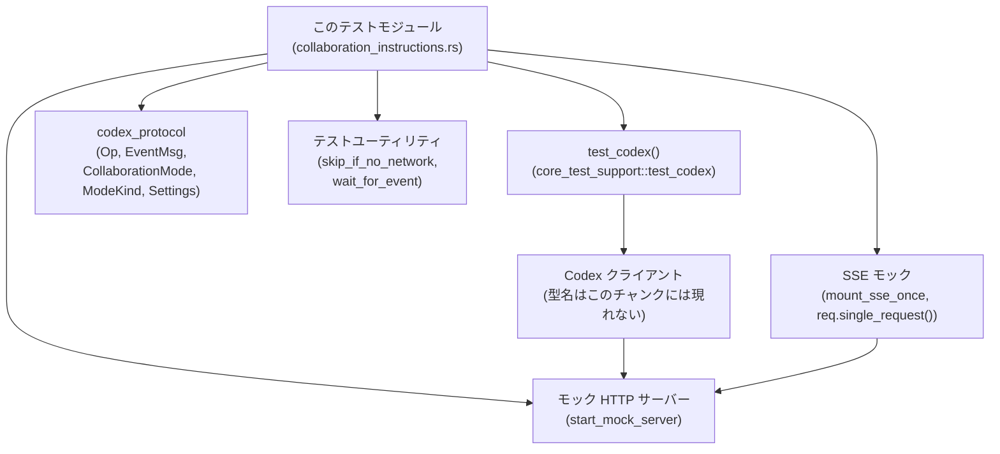
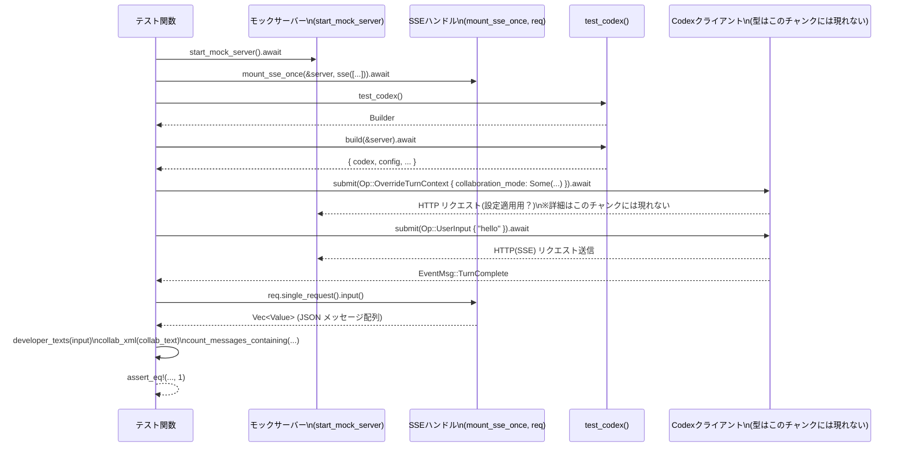

# core/tests/suite/collaboration_instructions.rs コード解説

## 0. ざっくり一言

- Codex の「コラボレーションモード（`CollaborationMode`）」とそのインストラクション文字列が、実際に下流の LLM へどのような developer メッセージとして送られるかを検証する統合テスト群です（core/tests/suite/collaboration_instructions.rs:L21-811）。
- 特に、デフォルト時・`OverrideTurnContext` / `UserTurn` 指定時・更新時・セッション再開時・空文字指定時の扱いを網羅的に確認しています。

---

## 1. このモジュールの役割

### 1.1 概要

- このモジュールは **Codex セッションのコラボレーションモード設定** が、実際のリクエスト JSON の developer メッセージにどのように反映されるかを検証するために存在します（L21-811）。
- SSE モックサーバーを立ち上げ、`Op::UserInput` や `Op::UserTurn` を送った結果として、SSE 経由で送信されたリクエストの内容を取り出し、developer ロールのメッセージに期待どおりの XML タグ付きインストラクションが含まれるかを確認します（L39-65, L67-811）。
- また、コラボレーションモードを更新したときに新しいインストラクションメッセージが追加される条件・追加されない条件、セッション再開時にインストラクションが再送されるかどうかをテストします（L327-753）。

### 1.2 アーキテクチャ内での位置づけ

このファイルは「テストコード」であり、本体ロジック（Codex 本体・プロトコル実装）は他モジュール／crate にあります。依存関係を簡略化すると次のようになります。



- `codex_protocol`（プロトコル定義）は、本テストから直接 `Op`, `EventMsg`, `CollaborationMode`, `ModeKind`, `Settings` などとして参照されます（L2-8, L21-32, L80-88 など）。
- `core_test_support` は Codex 本体を起動・操作するためのテスト用ラッパーやモック SSE サーバーを提供しており、本ファイルはそれを通してのみ Codex とやり取りします（L10-17, L71-79）。
- このファイル自身は新しい型を定義せず、**「Codex が送信したリクエスト JSON」を観測して検証する役** に特化しています。

### 1.3 設計上のポイント

コードから読み取れる特徴を整理します。

- **責務の分割**
  - コラボレーションモード設定の生成を行う小さなヘルパー関数（`collab_mode_with_mode_and_instructions`, `collab_mode_with_instructions`）と（L21-37）、
  - SSE リクエストの JSON から developer メッセージを抽出・カウントするヘルパー（`developer_texts`, `developer_message_count`, `count_messages_containing`）（L39-65）、
  - 実際の振る舞いを検証する複数の async テスト関数（L67-811）
  に分離されています。
- **状態管理**
  - このファイル内で永続状態を持つ構造体はなく、テストごとに `test_codex().build(&server)` で独立した Codex セッションを生成しています（L78-79, L120-120 など）。
  - 一部テストでは `resume` を通じてセッション再開の挙動を検証しますが（L693-735）、その内部状態管理は外部の `test_codex` / Codex 実装に委ねられており、このファイルでは扱いません。
- **エラーハンドリング**
  - すべてのテスト関数は `anyhow::Result<()>` を返し、`?` 演算子でエラーをテストランナーに伝播させます（例: L78-79, L120-120, L343-344）。
  - JSON パースヘルパー（`developer_texts`）は `Option` を返す `?` を `filter_map` の中で利用することで、不完全な JSON エントリを単にスキップしつつパニックを避けています（L43-47）。
- **並行性**
  - すべてのテストは `#[tokio::test(flavor = "multi_thread", worker_threads = 2)]` で実行され、Tokio のマルチスレッドランタイム上の非同期テストになっています（例: L67, L109）。
  - 各テスト内では `await` を直列に実行しており、このファイル内に明示的な並列処理や共有可変状態は存在しません。

---

## 2. 主要な機能一覧

このモジュールが提供する主な「機能」（＝テスト観点）は次のとおりです。

- コラボレーション指示が未指定のとき、developer メッセージに権限インストラクションだけが含まれ、コラボレーションタグは含まれないことの検証（L67-107）。
- `Op::OverrideTurnContext` でコラボレーションインストラクションを設定後の `Op::UserInput` に対し、developer メッセージに XML タグ付きの指示が 1 回だけ含まれることの検証（L109-158）。
- `Op::UserTurn` にコラボレーションインストラクションを指定した場合、そのターンのリクエストに指示が含まれることの検証（L160-206）。
- 事前の `OverrideTurnContext` → 次のターンで、その時点のコラボレーションインストラクションが反映されることの検証（L208-257）。
- すでに存在するベースのインストラクションを、`UserTurn` で別のインストラクションに上書きできることの検証（L259-325）。
- コラボレーションモードの変更時に、新しいインストラクションメッセージが追加されることの検証（L327-411, L496-586）。
- モードやテキストが変わらない場合には、新しいインストラクションメッセージが追加されない（＝1 回だけ存在する）ことの検証（L413-494, L588-675）。
- セッション再開（`resume`）後も、以前に設定されたコラボレーションインストラクションが再送されることの検証（L677-753）。
- 空文字列のコラボレーションインストラクションは無視されることの検証（L755-811）。

### 2.1 関数・テスト一覧（コンポーネントインベントリー）

| 名前 | 種別 | 役割 / 用途 | 行範囲 |
|------|------|-------------|--------|
| `collab_mode_with_mode_and_instructions` | ヘルパー関数 | 指定した `ModeKind` と任意のインストラクションから `CollaborationMode` を構築する | L21-33 |
| `collab_mode_with_instructions` | ヘルパー関数 | `ModeKind::Default` 固定で `CollaborationMode` を構築するショートカット | L35-37 |
| `developer_texts` | ヘルパー関数 | リクエスト JSON（`serde_json::Value` の配列）から developer ロールの text コンテンツだけを抽出する | L39-50 |
| `developer_message_count` | ヘルパー関数 | developer ロールのメッセージ数をカウントする | L52-57 |
| `collab_xml` | ヘルパー関数 | コラボレーションタグのオープン／クローズタグでテキストを囲んだ文字列を生成する | L59-61 |
| `count_messages_containing` | ヘルパー関数 | 与えられた文字列リストのうち、指定文字列を含むメッセージ数をカウントする | L63-65 |
| `no_collaboration_instructions_by_default` | async テスト | デフォルトではコラボレーションタグが送られないことを検証する | L67-107 |
| `user_input_includes_collaboration_instructions_after_override` | async テスト | `OverrideTurnContext` で上書き後の `UserInput` にタグ付き指示が含まれることを検証する | L109-158 |
| `collaboration_instructions_added_on_user_turn` | async テスト | `UserTurn` でコラボレーション指示を指定した場合の挙動を検証する | L160-206 |
| `override_then_next_turn_uses_updated_collaboration_instructions` | async テスト | `OverrideTurnContext` の設定が次のターンに反映されることを検証する | L208-257 |
| `user_turn_overrides_collaboration_instructions_after_override` | async テスト | ベース設定を `UserTurn` で上書きできることを検証する | L259-325 |
| `collaboration_mode_update_emits_new_instruction_message` | async テスト | インストラクション文言の変更ごとに新しい developer メッセージが追加されることを検証する | L327-411 |
| `collaboration_mode_update_noop_does_not_append` | async テスト | 同じインストラクションを再設定した場合にメッセージ数が増えないことを検証する | L413-494 |
| `collaboration_mode_update_emits_new_instruction_message_when_mode_changes` | async テスト | インストラクション文言に加えモード種別も変更した場合の挙動を検証する | L496-586 |
| `collaboration_mode_update_noop_does_not_append_when_mode_is_unchanged` | async テスト | モードが変わらない状態で同じインストラクションを再設定しても追加メッセージが出ないことを検証する | L588-675 |
| `resume_replays_collaboration_instructions` | async テスト | セッション再開後にも以前のコラボレーションインストラクションが再送されることを検証する | L677-753 |
| `empty_collaboration_instructions_are_ignored` | async テスト | 空文字インストラクションが無視されることを検証する | L755-811 |

---

## 3. 公開 API と詳細解説

このファイルはテスト用モジュールであり、外部に `pub` API を公開していません。ただし、テストシナリオを組み立てるうえで中核となる関数・テストを最大 7 件まで詳細に説明します。

### 3.1 型一覧（このファイル内で新規定義される型）

- このファイル内で新しく定義される構造体・列挙体・トレイトはありません（L1-811）。
- ただし、外部 crate から以下の型が重要な役割でインポートされています（定義自体はこのチャンクには現れません）。
  
| 名前 | 種別 | 定義場所（推測されるモジュール） | このファイルでの用途 | 利用行 |
|------|------|---------------------------------|----------------------|--------|
| `CollaborationMode` | 構造体 | `codex_protocol::config_types` | コラボレーションモードとその設定を表す | L2, L21-32, L780-787 |
| `ModeKind` | 列挙体 | 同上 | モード種別（例: `Default`, `Plan`）を表す | L3, L21-22, L35-36, L528-529, L559-560, L618-621, L649-651, L781-782 |
| `Settings` | 構造体 | 同上 | モデル名・推論設定・developer インストラクションなどを保持 | L4, L27-31, L782-786 |
| `Op` | 列挙体 | `codex_protocol::protocol` | Codex への操作（UserInput, UserTurn, OverrideTurnContext など）を表す | L8, L80-88, L124-137, L175-196, ほか多数 |
| `EventMsg` | 列挙体 | 同上 | SSE 経由で通知されるイベントメッセージ（`TurnComplete` など） | L7, L90, L150, L198, ほか多数 |

※ 上記の内部構造・バリアント詳細は、このファイルからは読み取れません。

---

### 3.2 関数詳細（主要 7 件）

#### `collab_mode_with_mode_and_instructions(mode: ModeKind, instructions: Option<&str>) -> CollaborationMode`

**概要**

- 指定されたモード種別と、任意のインストラクション文字列（`Option<&str>`）から `CollaborationMode` インスタンスを組み立てるヘルパーです（L21-33）。
- モデル名には固定で `"gpt-5.1"` を用いています（L28）。

**引数**

| 引数名 | 型 | 説明 |
|--------|----|------|
| `mode` | `ModeKind` | 使用するコラボレーションモード種別（例: `ModeKind::Default`, `ModeKind::Plan`）（L21-22）。 |
| `instructions` | `Option<&str>` | developer インストラクション文字列。`None` の場合は指示を設定しない（L23, L30）。 |

**戻り値**

- `CollaborationMode`  
  - `mode` フィールドに引数 `mode` をそのまま設定し、`settings` 内の `developer_instructions` に `instructions` を `String` へ変換した `Option<String>` を設定した値を返します（L25-32）。

**内部処理の流れ**

1. `CollaborationMode { ... }` リテラルの `mode` フィールドに引数 `mode` を格納します（L25-27）。
2. `settings` フィールドに `Settings` 構造体を生成します（L27-31）。
   - `model` に `"gpt-5.1".to_string()` を設定（L28）。
   - `reasoning_effort` に `None` を設定（L29）。
   - `developer_instructions` には、`instructions.map(str::to_string)` により `Option<&str>` を `Option<String>` に変換したものを設定（L30）。
3. 完成した `CollaborationMode` を返します（L32）。

**Examples（使用例）**

このファイル内での使用例:

```rust
// デフォルトモード＋カスタムインストラクションを作る（L21-37）
let collab_text = "collab instructions";
let collaboration_mode = collab_mode_with_mode_and_instructions(
    ModeKind::Default,
    Some(collab_text),
);
```

- 実際にはラッパー関数 `collab_mode_with_instructions` を通じて呼ばれることが多いです（L35-37, L122-123）。

**Errors / Panics**

- この関数内でエラーを返す処理や `panic!` を発生させるコードはありません（L21-33）。
- `instructions.map(str::to_string)` は `None` を許容し、UTF-8 文字列のコピーのみなのでエラー要因はありません。

**Edge cases（エッジケース）**

- `instructions` が `None` の場合: `developer_instructions` は `None` となり、インストラクションなしの `CollaborationMode` が生成されます（L30）。
- `instructions` が空文字列 `Some("")` の場合: `developer_instructions` は `Some("".to_string())` となります。この値がどのように解釈されるか（無視されるか）は Codex 側の実装次第であり、本ファイルでは `empty_collaboration_instructions_are_ignored` テストでその挙動を確認しています（L780-787, L805-808）。

**使用上の注意点**

- モデル名が `"gpt-5.1"` に固定されているため、現行のセッションモデルと異なるモデルを意図せず指定してしまう可能性があります（L28）。ただしテストではモデル内容を検証していないため、この点はテスト上さほど重要ではありません。
- 実運用コードでは `Settings` の他フィールド（例: `reasoning_effort`）を設定する必要があるかもしれませんが、このテストではコラボレーションインストラクションの有無のみを検証しているため、省略されています。

---

#### `developer_texts(input: &[Value]) -> Vec<String>`

**概要**

- LLM リクエストを表す JSON 配列から、`"role": "developer"` を持つメッセージの `"content"` 配列内の `"text"` フィールドだけを抽出して `Vec<String>` で返すユーティリティです（L39-50）。
- プロトコルの JSON 形式を前提にしたテスト専用の抽出処理です。

**引数**

| 引数名 | 型 | 説明 |
|--------|----|------|
| `input` | `&[Value]` | SSE 経由でキャプチャされたリクエストの JSON メッセージ配列（`serde_json::Value` のスライス）（L39）。 |

**戻り値**

- `Vec<String>`  
  - developer ロールのメッセージのうち、`content` 配列に含まれる要素の `"text"` フィールドをすべて文字列として収集したリストです（L45-49）。

**内部処理の流れ**

1. `input.iter()` で配列の各 JSON オブジェクトに対してイテレーションを開始します（L40）。
2. `filter` で `"role"` フィールドが `"developer"` に一致するオブジェクトだけを残します（L42-42）。
3. `filter_map` で `"content"` フィールドを取り出し、配列であれば `Some(Vec<Value>)` として取得し、そうでなければ `None`（スキップ）とします（L43）。
4. これらの `Vec<Value>` を `flatten()` により一つの連続したストリームにします（L44）。
5. 各 `content` 値に対して `"text"` フィールドを `as_str` で取り出し、`String` に変換して `Some(String)` とし、取得できなければ `None`（スキップ）とする `filter_map` を行います（L45-47）。
6. 最終的に `collect()` で `Vec<String>` にまとめて返します（L48-49）。

**Examples（使用例）**

テスト内での典型的な使用（L92-99）:

```rust
// リクエスト JSON から developer ロールの text コンテンツだけを取り出す（L92-99）
let input = req.single_request().input();        // JSON 配列（Vec<Value>）を取得
let dev_texts = developer_texts(&input);         // developer メッセージの text 一覧を抽出

assert!(
    dev_texts.iter().any(|text| text.contains("<permissions instructions>")),
    "expected permissions instructions in developer messages, got {dev_texts:?}"
);
```

**Errors / Panics**

- `serde_json::Value::get` や `as_str` などは、対象が期待する型でない場合にもエラーではなく `None` を返すため、関数内で `panic!` が発生する可能性は低いです（L42-47）。
- この関数自体は `Result` を返さず、失敗ケース（期待するフィールドの欠如）は単にスキップされます。

**Edge cases（エッジケース）**

- `"role"` フィールドがない、もしくは `"developer"` 以外の場合、そのメッセージは完全に無視されます（L42）。
- `"content"` フィールドが存在しないか配列でない場合、そのメッセージからは何も取得されません（L43）。
- `"content"` 内要素に `"text"` フィールドが存在しない、もしくは文字列以外である場合、その要素は無視されます（L45-47）。
- 上記ケースでは、単に結果ベクタの要素数が減るだけであり、エラーにはなりません。

**使用上の注意点**

- プロトコルの JSON 形式に強く依存しています。もし `content` の構造が変わった場合（例: `"text"` 以外のフィールド名や別形式になるなど）、このテストは developer インストラクションを正しく検出できなくなります。
- 「developer メッセージが複数の `content` エントリを持つ」ケースに対応しており、その場合はそれぞれの `"text"` が別要素として返されます（L44-49）。

---

#### `collab_xml(text: &str) -> String`

**概要**

- コラボレーションインストラクションの本文 `text` を、プロトコルで定義されたオープン／クローズタグで囲んだ XML 風文字列へ変換します（L59-61）。

**引数**

| 引数名 | 型 | 説明 |
|--------|----|------|
| `text` | `&str` | タグで囲みたいインストラクション文字列（L59）。 |

**戻り値**

- `String`  
  - `"{COLLABORATION_MODE_OPEN_TAG}{text}{COLLABORATION_MODE_CLOSE_TAG}"` という形式の文字列です（L60）。

**内部処理の流れ**

1. グローバル定数 `COLLABORATION_MODE_OPEN_TAG` と `COLLABORATION_MODE_CLOSE_TAG` を利用し、`format!` マクロでタグに挟まれた文字列を生成します（L5-6, L59-60）。
2. 生成された `String` を返します（L60）。

**Examples（使用例）**

テスト内での典型パターン:

```rust
let collab_text = "collab instructions";
let wrapped = collab_xml(collab_text);           // 例: "<collab>collab instructions</collab>" のような形式（実際のタグ名は定数依存）

assert_eq!(
    count_messages_containing(&dev_texts, &wrapped),
    1
);
```

- 実際には `user_input_includes_collaboration_instructions_after_override`（L154-155）など複数のテストで同様の使い方をしています。

**Errors / Panics**

- `format!` は通常入力に依存したエラーを発生しません。タグ定数が不正な UTF-8 である場合などは別ですが、それはこのファイルでは確認できません。

**Edge cases（エッジケース）**

- `text` が空文字列 `""` の場合でも、タグだけの文字列（`<open></close>` 形式）を生成します（L59-60）。  
  実際には `empty_collaboration_instructions_are_ignored` テストで、こうしたタグだけのメッセージが送信されないことを検証しています（L805-808）。

**使用上の注意点**

- テストでは「タグで囲まれたインストラクションが 1 回だけ含まれるか」を確認しているため、`count_messages_containing` とセットで使用されます（L155, L203 など）。
- タグの内容（`COLLABORATION_MODE_OPEN_TAG` など）はこのファイルには現れないため、タグ名自体は不明です。

---

#### `no_collaboration_instructions_by_default() -> Result<()>`（async テスト）

```rust
#[tokio::test(flavor = "multi_thread", worker_threads = 2)]
async fn no_collaboration_instructions_by_default() -> Result<()> { ... }
```

**概要**

- Codex セッションを何も上書きせずに `Op::UserInput` を 1 回送った場合、developer メッセージには権限インストラクション（`<permissions instructions>`）のみが含まれ、コラボレーションモード用のタグ（`COLLABORATION_MODE_OPEN_TAG`）は含まれないことを検証するテストです（L67-107）。

**引数**

- 引数はありません（テスト関数シグネチャとして引数を取らない）（L68）。

**戻り値**

- `anyhow::Result<()>`  
  - 途中の非同期操作やテストサポート関数がエラーを返した場合、そのまま `Err` を返してテストは失敗します（L78-79, L80-89）。

**内部処理の流れ**

1. `skip_if_no_network!(Ok(()));` でネットワークが利用できない場合はテストをスキップ／早期終了します（詳細な挙動はマクロの実装次第で、このチャンクには現れません）（L69）。
2. `start_mock_server().await` でモックサーバーを起動します（L71）。
3. `mount_sse_once` により、このサーバーに対して SSE 応答（`ev_response_created("resp-1")`, `ev_completed("resp-1")`）を 1 回分マウントし、リクエストキャプチャ用のハンドル `req` を得ます（L72-76）。
4. `test_codex().build(&server).await?` で Codex テストクライアントを構築します（L78-79）。
5. `test.codex.submit(Op::UserInput { ... }).await?` を呼び出し、単純な `"hello"` 入力を送信します（L80-89）。
6. `wait_for_event(&test.codex, |ev| matches!(ev, EventMsg::TurnComplete(_))).await;` によって、ターンの完了イベントが届くまで待機します（L90）。
7. `req.single_request().input()` で、モックサーバーが受け取った 1 回分のリクエスト JSON を取得します（L92）。
8. `developer_message_count(&input)` で developer メッセージ数が 1 であることを確認します（L93）。
9. `developer_texts(&input)` から developer メッセージのテキストを抽出し、その中に `<permissions instructions>` という文言が含まれていることを `assert!` で検証します（L94-100）。
10. 同時に、`count_messages_containing(&dev_texts, COLLABORATION_MODE_OPEN_TAG)` が 0 であることを確認し、コラボレーションモードタグが含まれていないことを検証します（L101-104）。
11. 最後に `Ok(())` を返してテスト成功とします（L106）。

**Examples（使用例）**

- 本関数自体がテストの使用例です。類似のテストを追加する場合も、`start_mock_server` → `mount_sse_once` → `test_codex().build` → `submit` → `wait_for_event` → `req.single_request().input()` という流れを踏襲します。

**Errors / Panics**

- `build` や `submit` に失敗した場合、`?` により `Err` が返りテストが失敗します（L78-79, L80-89）。
- `assert!` / `assert_eq!` が条件を満たさない場合、標準的なテスト失敗として `panic!` が発生します（L93, L95-100, L101-104）。
- `req.single_request()` がリクエストを 1 件も観測していない場合の挙動は、このチャンクには現れません。名前からは 0 件の場合に panic もしくはエラーを返す可能性がありますが、これは推測であり、コードからは断定できません。

**Edge cases（エッジケース）**

- Developer メッセージが 1 件であることを前提に検証しています（L93）。もしプロトコルにより developer メッセージ数が変化した場合、このテストは失敗します。
- `<permissions instructions>` という文字列で権限インストラクションの存在を検証しており、文言が変わるとテストが壊れます（L95-100）。

**使用上の注意点**

- `skip_if_no_network!` マクロに依存しているため、ネットワーク環境に応じてテストがスキップされる可能性があります（L69）。
- 並行実行（Tokio マルチスレッドランタイム）上で動作しますが、テスト内は直列な `await` のみで構成されており、追加の同期原語は不要です（L67-90）。

---

#### `user_input_includes_collaboration_instructions_after_override() -> Result<()>`（async テスト）

**概要**

- `Op::OverrideTurnContext` でコラボレーションインストラクションを設定したあとに `Op::UserInput` を送信した場合、そのリクエストの developer メッセージにタグ付きコラボレーションインストラクションが 1 回含まれることを検証するテストです（L109-158）。

**内部処理の流れ（要点）**

1. ネットワーク有無を確認してスキップ／継続を決定（L111）。
2. モックサーバーと SSE ハンドル `req` を準備（L113-118）。
3. Codex テストクライアント `test` を構築（L120）。
4. `collab_mode_with_instructions(Some(collab_text))` で `CollaborationMode` を作成し、`Op::OverrideTurnContext` の `collaboration_mode` にセットして `submit`（L122-137）。
5. 続けて `Op::UserInput` を `submit`（L140-148）。
6. `wait_for_event` で `TurnComplete` を待機（L150）。
7. `req.single_request().input()` からリクエスト JSON を取得し、`developer_texts` で developer 文を抽出（L152-153）。
8. `collab_xml(collab_text)` でタグ付きインストラクション文字列を生成し（L154）、`count_messages_containing(&dev_texts, &collab_text)` が 1 であることを検証（L155）。

**安全性・エラー・並行性の観点**

- 非同期処理・エラー伝播の扱いは前述のテストと同様です（L120-148）。
- ここでは「**コンテキストの上書き → 次の UserInput から適用**」というプロトコル上の契約をテストしています。

---

#### `collaboration_instructions_added_on_user_turn() -> Result<()>`（async テスト）

**概要**

- `Op::UserTurn` に `collaboration_mode: Some(...)` を指定した場合、そのターンのリクエストにコラボレーションインストラクションが含まれることを検証します（L160-206）。

**内部処理の流れ（要点）**

1. モックサーバー・SSE を準備（L164-169）。
2. Codex クライアントを構築（L171）。
3. `collab_mode_with_instructions(Some(collab_text))` でモードを作成し（L172-173）、`Op::UserTurn` の `collaboration_mode` に渡します（L175-196）。
   - そのほか `cwd`, `approval_policy`, `sandbox_policy`, `model` など、実行環境に関するパラメータをセッション構成から埋めています（L181-186, L187-191）。
4. `UserTurn` を `submit` し（L175-197）、`TurnComplete` を待機（L198）。
5. `req.single_request().input()` → `developer_texts` → `collab_xml` → `count_messages_containing` という流れで、タグ付きインストラクションが 1 度だけ現れることを検証します（L200-203）。

**このテストが表す契約**

- `OverrideTurnContext` を使わなくても、個々のターン (`UserTurn`) でコラボレーションインストラクションを直接指定でき、そのターンのリクエストにのみ反映されることを前提としています。

---

#### `collaboration_mode_update_emits_new_instruction_message() -> Result<()>`（async テスト）

**概要**

- コラボレーションモードを一度設定して `UserInput` を流した後、別のインストラクション文字列で `OverrideTurnContext` を再度呼び出し、再び `UserInput` を送ったときに、developer メッセージ中に「古いインストラクション」と「新しいインストラクション」がそれぞれ 1 回ずつ現れることを検証するテストです（L327-411）。

**内部処理の流れ（アルゴリズム）**

1. 2 回分の SSE レスポンスを準備し、2 つのリクエストキャプチャ `_req1`, `req2` を取得します（L332-341）。
   - `_req1` は最初の `UserInput` 用、`req2` は 2 回目の `UserInput` 用です。
2. Codex クライアントを構築（L343-344）。
3. 最初のコラボレーションインストラクション `first_text` を `OverrideTurnContext` 経由で設定（L347-360）。
4. `UserInput`（`"hello 1"`）を送信し、`TurnComplete` を待つ（L363-373）。
5. 2 回目のコラボレーションインストラクション `second_text` を新たに `OverrideTurnContext` で設定（L375-388）。
6. `UserInput`（`"hello 2"`）を再度送信し、`TurnComplete` を待つ（L391-401）。
7. 2 回目のリクエスト `req2.single_request().input()` から developer メッセージテキストを抽出し（L403-404）、`collab_xml(first_text)` および `collab_xml(second_text)` の両方が 1 回ずつ含まれることを検証します（L405-408）。

**このテストが確認していること**

- **インストラクションの履歴性**:
  - 新しい `OverrideTurnContext` でインストラクションを更新した場合でも、以前のインストラクションメッセージが履歴として残り、新しいリクエストに再送されることを前提としているように読み取れます（L405-408）。
    - ただし、この挙動が「履歴を積み上げる仕様」なのか「システム内部のキャッシュの結果」なのかは、このチャンクだけでは断定できません。
- 同時に、`collaboration_mode_update_noop_does_not_append` との対比により、「**テキストが変わったときだけ新しいインストラクションが追加されるが、同じ内容なら追加されない**」という仕様がテストされています（L413-494）。

**Errors / Edge cases**

- 内部のエラー処理・エッジケースは他のテストと同様であり、新たな特別なケースはありません。
- テキストが完全一致するかどうかは `collab_xml` でタグ付けした文字列に対する `contains` に依存しているため（L405-408）、インストラクションの中に互いに部分一致する文字列が含まれている場合の挙動はこのテストでは区別していません。

**使用上の注意点**

- 「前回までのインストラクションが次のリクエストにも含まれる」ことを前提とする仕様は、プロトコル設計上の重要な契約です。システムの仕様変更でこれが変わった場合、このテストは失敗することになります。

---

### 3.3 その他の関数

詳細テンプレートで解説しなかった関数・テストの一覧です。

| 関数名 | 役割（1 行） | 行範囲 |
|--------|--------------|--------|
| `collab_mode_with_instructions` | `ModeKind::Default` 固定で `CollaborationMode` を生成するショートカットヘルパー | L35-37 |
| `developer_message_count` | JSON メッセージ配列から `"role": "developer"` の要素数をカウントする | L52-57 |
| `count_messages_containing` | 文字列スライス内で、指定文字列を `contains` する要素の個数を返す | L63-65 |
| `override_then_next_turn_uses_updated_collaboration_instructions` | `OverrideTurnContext` → `UserInput` の組み合わせで上書きされたインストラクションが反映されることを確認するテスト | L208-257 |
| `user_turn_overrides_collaboration_instructions_after_override` | 事前の Override 設定を `UserTurn` で上書きできることを確認するテスト | L259-325 |
| `collaboration_mode_update_noop_does_not_append` | 同じインストラクションを繰り返し設定してもメッセージが増えないことを確認するテスト | L413-494 |
| `collaboration_mode_update_emits_new_instruction_message_when_mode_changes` | モード種別も変更した場合に新しいメッセージが追加されることを確認するテスト | L496-586 |
| `collaboration_mode_update_noop_does_not_append_when_mode_is_unchanged` | モードが変わらない状態で同じインストラクションを再設定しても追加されないことを確認するテスト | L588-675 |
| `resume_replays_collaboration_instructions` | セッション再開後に以前のインストラクションが再送されることを確認するテスト | L677-753 |
| `empty_collaboration_instructions_are_ignored` | 空文字インストラクションが無視されることを確認するテスト | L755-811 |

---

### 3.4 このファイルに関する注意点と潜在的な問題

- **プロトコル形式への依存**  
  - `developer_texts` と `developer_message_count` は、メッセージ JSON が `{ "role": "developer", "content": [ { "text": ... }, ... ] }` のような形であることを前提にしています（L39-47）。  
    JSON 形式が変わるとテストは通らなくなります。
- **文字列ベースの検証**  
  - インストラクションの検証は `String::contains` による部分一致で行われており、より厳密な構造チェック（例: パースして特定フィールドを比較）は行っていません（L63-65, L155, L203）。  
    そのため、インストラクションの一部が別のテキストにも含まれる場合、誤検知の可能性があります。
- **セキュリティ観点**  
  - このファイル自体は外部から入力を受け取ることはなく、テスト用に固定文字列を使用しています。  
  - コラボレーションインストラクションは XML 風タグで囲まれて送られる前提ですが（L59-60）、タグの具体的な内容やエスケープ処理など、入力検証・サニタイズの詳細はこのチャンクからは読み取れません。
- **並行実行・フレークテストの可能性**  
  - すべてのテストが Tokio のマルチスレッドランタイム上で同時に実行される可能性がありますが、それぞれが独立したモックサーバー・Codex セッションを使用しているため、このファイル内に共有可変状態はありません（例: L71-79, L331-344）。  
  - ネットワーク環境に依存する箇所（`skip_if_no_network!`）があるため、環境によってはテストがスキップされることがあります（L69, L111, L162 など）。

---

## 4. データフロー

ここでは、代表的なシナリオとして  
`user_input_includes_collaboration_instructions_after_override`（L109-158）のデータフローを説明します。

### 4.1 処理の要点

1. テストコードがモックサーバーを立ち上げ、SSE 応答をセットし、Codex クライアントを起動します（L113-120）。
2. テストは `OverrideTurnContext` を送信してコラボレーションモードを設定します（L122-137）。
3. その後、`UserInput` を送信すると Codex はバックエンド LLM へのリクエストを生成し、モックサーバーへ送信します（L140-148）。
4. テストは `TurnComplete` イベントを待った後、モックサーバーが受け取ったリクエスト JSON を取得し、developer メッセージからインストラクションの有無を検証します（L150-155）。

### 4.2 シーケンス図



※ Codex がモックサーバーにどのような URL や HTTP メソッドでアクセスしているか、また `OverrideTurnContext` のリクエストがどのような形かは、このチャンクには現れません。

---

## 5. 使い方（How to Use）

このファイルはテストモジュールですが、「**コラボレーションインストラクションに関する新しいシナリオを追加したいとき**」に参考になるパターンが多く含まれています。

### 5.1 基本的な使用方法

新しいシナリオのテストは、おおむね次のパターンになります。

```rust
use anyhow::Result;
use codex_protocol::protocol::{Op, EventMsg};
use codex_protocol::config_types::{CollaborationMode, ModeKind, Settings};
use core_test_support::responses::{start_mock_server, mount_sse_once, sse, ev_response_created, ev_completed};
use core_test_support::{skip_if_no_network, wait_for_event};
use core_test_support::test_codex::test_codex;
use serde_json::Value;

// 新しいテスト例（このファイル内のパターンと同じ構造）
#[tokio::test(flavor = "multi_thread", worker_threads = 2)]
async fn new_collaboration_scenario() -> Result<()> {
    skip_if_no_network!(Ok(()));                     // ネットワークがなければスキップ

    let server = start_mock_server().await;          // モック HTTP サーバー起動
    let req = mount_sse_once(
        &server,
        sse(vec![ev_response_created("resp-1"), ev_completed("resp-1")]),
    )
    .await;                                          // 1 回分の SSE 応答とリクエストキャプチャをセット

    let test = test_codex().build(&server).await?;   // Codex クライアント構築

    // 必要に応じてコラボレーションモードを設定
    let collab = CollaborationMode {
        mode: ModeKind::Default,
        settings: Settings {
            model: "gpt-5.1".to_string(),
            reasoning_effort: None,
            developer_instructions: Some("my instructions".to_string()),
        },
    };

    test.codex
        .submit(Op::OverrideTurnContext {            // コンテキスト上書き
            cwd: None,
            approval_policy: None,
            approvals_reviewer: None,
            sandbox_policy: None,
            windows_sandbox_level: None,
            model: None,
            effort: None,
            summary: None,
            service_tier: None,
            collaboration_mode: Some(collab),
            personality: None,
        })
        .await?;

    // ユーザー入力を送信
    test.codex
        .submit(Op::UserInput {
            items: vec![codex_protocol::user_input::UserInput::Text {
                text: "hello".into(),
                text_elements: Vec::new(),
            }],
            final_output_json_schema: None,
            responsesapi_client_metadata: None,
        })
        .await?;

    // ターン完了を待つ
    wait_for_event(&test.codex, |ev| matches!(ev, EventMsg::TurnComplete(_))).await;

    // リクエスト内容を検証
    let input: Vec<Value> = req.single_request().input();
    let dev_texts = developer_texts(&input);         // developer メッセージのテキストを抽出
    let collab_text = collab_xml("my instructions"); // 期待するタグ付きインストラクション
    assert_eq!(count_messages_containing(&dev_texts, &collab_text), 1);

    Ok(())
}
```

- 上記は本ファイルの既存テストと同じパターンで、コメントを追加したものです。

### 5.2 よくある使用パターン

本ファイル内から読み取れる代表的なパターンを挙げます。

1. **コンテキスト上書き → UserInput**

   - `user_input_includes_collaboration_instructions_after_override` に見られるパターンで、グローバルなコラボレーション設定を行い、その後の `UserInput` で確認します（L122-148）。
   - 複数ターンでも同じ設定を使いたい場合に相当します。

2. **UserTurn ごとの設定**

   - `collaboration_instructions_added_on_user_turn` では、`UserTurn` のフィールドとして `collaboration_mode` を指定し、そのターン固有のインストラクションとして扱っています（L175-196）。
   - 一時的にモードやインストラクションを変更したいケースに対応する形のテストです。

3. **更新・再送の検証**

   - `collaboration_mode_update_emits_new_instruction_message` と `collaboration_mode_update_noop_does_not_append` などで、インストラクションの更新が developer メッセージとしてどのように再送されるか、あるいは再送されないかを確認します（L327-494）。

### 5.3 よくある間違い

このファイルから推測される誤用例と、その修正例です。

```rust
// 誤り例: TurnComplete を待たずにリクエスト内容を検証しようとする
test.codex
    .submit(Op::UserInput { /* ... */ })
    .await?;
// ここで直ちに req.single_request().input() を呼ぶと、
// Codex がまだリクエストを送信していない可能性がある

// 正しい例: 必ずイベントを待ってから検証する（L90, L150 など）
test.codex
    .submit(Op::UserInput { /* ... */ })
    .await?;
wait_for_event(&test.codex, |ev| matches!(ev, EventMsg::TurnComplete(_))).await;
let input = req.single_request().input();
```

```rust
// 誤り例: developer メッセージを自前で雑にパースする
let input = req.single_request().input();
// ここで role や content を手書きで探すと、JSON 形式変更時にバラバラに壊れやすい

// 正しい例: 既存のヘルパーを使う（L39-50, L52-57）
let dev_texts = developer_texts(&input);
let count = developer_message_count(&input);
```

### 5.4 使用上の注意点（まとめ）

- **イベント同期**: `submit` の結果だけでは処理完了を保証しない前提で `wait_for_event` を常に挟んでいるため、新しいテストを書く際も同様のパターンに従う必要があります（L90, L150 など）。
- **JSON 形式への依存**: `developer_texts` はフォームに強く依存するため、プロトコル変更時には同時にテストの見直しが必要です（L39-47）。
- **インストラクションの比較方法**: 現状は `contains` による部分一致比較であり、インストラクションの文言が重なりやすい場合には誤判定のリスクがあります（L63-65）。
- **性能面**: テスト入力はごく小さく、`developer_texts` 内の `cloned()` による配列コピーなども実務上問題になる規模ではないと考えられますが、大量のメッセージをテストするような拡張を行う場合にはこの点を意識する必要があります（L43-44）。

---

## 6. 変更の仕方（How to Modify）

### 6.1 新しい機能を追加する場合（新しいテストシナリオ）

1. **シナリオの選定**
   - 例: 「特定の `ModeKind` とインストラクションの組み合わせで、特別な developer メッセージが出ることを保証したい」など。
2. **テスト骨格のコピー**
   - 既存のテスト（特に `user_input_includes_collaboration_instructions_after_override` や `collaboration_instructions_added_on_user_turn`）をコピーし、必要な差分だけ書き換えると安全です（L109-158, L160-206）。
3. **コラボレーションモードの設定**
   - ベース設定が必要なら `collab_mode_with_instructions` や `collab_mode_with_mode_and_instructions` を利用し、テスト固有のインストラクションに変更します（L21-37）。
4. **検証ロジックの調整**
   - `collab_xml` と `count_messages_containing` を使って、期待するメッセージ数や内容を検証します（L59-65, L155, L203）。
   - 必要であれば `developer_message_count` などでメッセージ総数も確認します（L93, L805）。

### 6.2 既存の機能を変更する場合（契約と影響範囲）

- **コラボレーションモードの仕様を変更する場合**
  - 例: 「インストラクションは毎回上書きで履歴を持たないようにしたい」など。
  - この場合、次のテストに影響が出ます。
    - `collaboration_mode_update_emits_new_instruction_message`（L327-411）
    - `collaboration_mode_update_noop_does_not_append`（L413-494）
    - `resume_replays_collaboration_instructions`（L677-753）
  - 仕様変更後の正しい挙動に合わせて、期待するメッセージ数やパターンを修正する必要があります。
- **JSON 形式変更時**
  - `developer_texts` / `developer_message_count` が直接影響を受けるため（L39-50, L52-57）、まずここを対応させ、その後各テストの `assert!` が意図通り動くかを確認します。
- **エラー処理・非同期 API の変更時**
  - `submit` や `wait_for_event` の戻り値型が変わった場合、すべてのテスト関数のシグネチャ（`Result<()>`）や `?` の扱いを見直す必要があります（L68, L109, L161 など）。
- **テストの観測性（Observability）を強化する場合**
  - 例えば、リクエストのメタデータや他ロールのメッセージを検証したい場合、`developer_texts` に加えて新しい抽出ヘルパーを追加するのが自然です（L39-50）。

---

## 7. 関連ファイル

このモジュールと密接に関連する外部モジュール／crate は次のとおりです（定義はこのチャンクには現れません）。

| パス / モジュール名 | 役割 / 関係 |
|---------------------|------------|
| `codex_protocol::config_types` | `CollaborationMode`, `ModeKind`, `Settings`, `ReasoningSummary` など、コラボレーションモード設定やモデル設定に関する型定義を提供し、本ファイルのヘルパーとテストで使用されています（L2-4, L188-191, L527-531, L558-561, L618-621, L649-652, L781-786）。 |
| `codex_protocol::protocol` | `Op`, `EventMsg`, `COLLABORATION_MODE_OPEN_TAG`, `COLLABORATION_MODE_CLOSE_TAG` など、Codex プロトコルの操作／イベント／タグ定数を提供します（L5-8）。 |
| `codex_protocol::user_input::UserInput` | ユーザー入力の型を提供し、`Op::UserInput` / `Op::UserTurn` の `items` フィールドで使用されます（L9, L82-85, L142-145, L177-180, L241-244, ほか）。 |
| `core_test_support::responses` | `start_mock_server`, `mount_sse_once`, `sse`, `ev_response_created`, `ev_completed` により、モック SSE サーバーとレスポンスシナリオを構築するテスト用ユーティリティ群です（L10-14, L71-76, L332-341 など）。 |
| `core_test_support::test_codex::test_codex` | Codex クライアントをテスト用に構築＆再開するためのビルダーを提供します（L16, L78-79, L120, L171, L219-220, L343-344, L429, L512, L604, L693-735）。 |
| `core_test_support::wait_for_event` | Codex からの `EventMsg` ストリームを監視し、指定した条件（例: `TurnComplete`）が満たされるまで待機する関数です（L17, L90, L150, L198, ほか多数）。 |
| `core_test_support::skip_if_no_network` | ネットワーク環境に応じてテストをスキップ／続行するためのマクロです（L15, L69, L111, L162, ほか全テストの冒頭）。 |

以上により、このファイルは「コラボレーションインストラクションのプロトコル上の挙動」を高い粒度で検証する統合テスト群として位置づけられていることが分かります。
