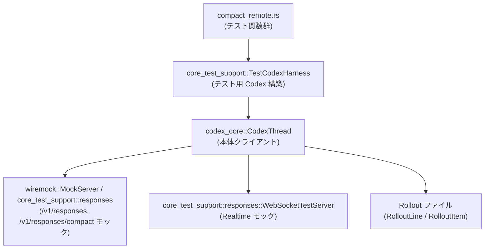
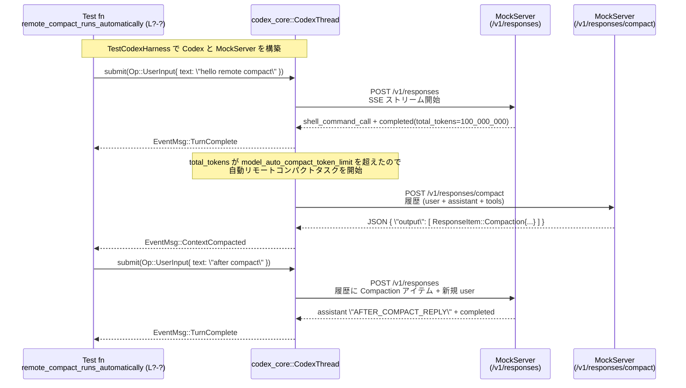

# core/tests/suite/compact_remote.rs

---

## 0. ざっくり一言

- Codex の **リモートコンパクション（/v1/responses/compact を叩く要約機能）** まわりの振る舞いを、HTTP モック・イベント待ちユーティリティ・リアルタイム WebSocket サーバを使って総合的に検証するテストスイートです。

> ※ このチャンクには行番号情報が含まれていないため、以下の `compact_remote.rs:L?-?` という表記は「このファイル内の該当箇所」を指すプレースホルダです。厳密な行番号はここからは特定できません。

---

## 1. このモジュールの役割

### 1.1 概要

- このモジュールは **Codex のリモートコンパクト機能**（`/v1/responses/compact`）と、その前後の **サンプリングリクエスト（/v1/responses）との連携**を検証するために存在します。
- 主な観点は次のとおりです。

  - 手動/自動コンパクション時に **どの履歴がコンパクトリクエストに送られ**、その後のリクエストで **どの履歴が残る/消えるか**。
  - 関数呼び出し（ツールコール）履歴を **文脈ウィンドウに収まるようにトリミングするロジック**。
  - リアルタイム会話状態（開始/終了）の再陳述、モデルスイッチ、コンテキストオーバーライドとコンパクションの組み合わせ。
  - コンパクト失敗時の **エラー伝播・エージェントループ停止** の挙動。

### 1.2 アーキテクチャ内での位置づけ

- 関係する主要コンポーネントと依存関係はおおよそ次のようになっています。



- このファイル自身は **本番コードを直接実装しておらず**、Codex 本体（`codex_core::CodexThread`）に対して
  `Op::*` を送信し、`EventMsg::*` を待つことで振る舞いを検証しています。

### 1.3 設計上のポイント

- 責務の分割

  - 共通のユーティリティ（トークン概算、スナップショット用フォーマット、Realtime 用ビルダーなど）は
    小さなヘルパー関数に切り出されています（`approx_token_count`, `remote_realtime_test_codex_builder` など）。
  - 各テストは **シナリオ毎に完結**しており、1 テストが 1 つの仕様（契約）を表現する構造になっています。

- 状態と並行性

  - すべてのテストは `#[tokio::test(flavor = "multi_thread", worker_threads = 2)]` で、Tokio のマルチスレッドランタイム上で
    非同期に動作します。
  - ただしこのファイル内では **共有の可変状態は持たず**、各テストが自分専用の `MockServer` / `TestCodexHarness` を作成することで
    テスト間の干渉を避けています。
  - イベントは `wait_for_event` / `wait_for_event_match` / `codex.next_event().await` を通じて逐次処理され、
    **レースコンディションを避けた順次的な待ち方**になっています。

- エラーハンドリング

  - すべての非同期テスト関数は `anyhow::Result<()>` を返し、`?` 演算子で失敗時に早期リターンします。
  - Codex 側からのエラーは `EventMsg::Error` として受け取り、その `message` フィールドの内容を
    `assert!` で検証しています（例: コンパクト失敗時の `"Error running remote compact task"`）。
  - コンパクト API の 400 エラー (`context_length_exceeded`) などもモックし、表に出るエラーメッセージを確認しています。

---

## 2. 主要な機能一覧

このテストモジュールがカバーする機能（仕様）は大きく次のカテゴリに整理できます。

- **トークン概算ユーティリティ**
  - `approx_token_count`: 文字列長からざっくりトークン数を推定。
  - `estimate_compact_input_tokens` / `estimate_compact_payload_tokens`: コンパクトリクエストの入力・ペイロードトークンを概算。

- **スナップショット・フォーマットユーティリティ**
  - `context_snapshot_options`, `format_labeled_requests_snapshot`: HTTP リクエストの JSON を読みやすく整形し、
    `insta::assert_snapshot!` 用のラベル付きスナップショットを生成。

- **Realtime / WebSocket テスト補助**
  - `remote_realtime_test_codex_builder`: Realtime WebSocket ベース URL を設定済みの `TestCodexBuilder` を返す。
  - `start_remote_realtime_server`: 事前に決めたシナリオで応答する WebSocket モックサーバを起動。
  - `start_realtime_conversation` / `close_realtime_conversation`: Realtime 会話の開始・終了を `Op::RealtimeConversation*` とイベントで制御。

- **コンパクトリクエスト内容検証ヘルパー**
  - `assert_request_contains_realtime_start` / `assert_request_contains_custom_realtime_start` /
    `assert_request_contains_realtime_end`: Realtime 開始/終了命令が HTTP リクエストに期待通り含まれるかを検証。

- **テストシナリオ群（代表例）**
  - 手動コンパクトで履歴を要約し、**フォローアップリクエストから元のメッセージを排除**する (`remote_compact_replaces_history_for_followups`)。
  - トークン数超過による **自動リモートコンパクト** と、その後の履歴の形 (`remote_compact_runs_automatically`)。
  - 関数呼び出し履歴の **文脈ウィンドウトリミング**（保持されるコールと切り捨てられるコール）2 パターン。
  - コンパクト失敗時に **エージェントループが停止**し、後続リクエストが送られないことの検証。
  - ベースインストラクション・Realtime 状態・モデルスイッチ・コンテキストオーバーライドなどと
    コンパクションの相互作用を詳細にスナップショットで確認。

---

## 3. 公開 API と詳細解説

このファイル自体はライブラリ API を定義していませんが、テスト内で重要な役割を持つ関数と、
外部から利用される型を整理します。

### 3.1 型一覧（構造体・列挙体など）

このファイル「内で定義される」新しい型はありません。ここでは **他モジュールから利用している主要な型**を列挙します。

| 名前 | 種別 | 定義場所 (推定) | 役割 / 用途 |
|------|------|-----------------|-------------|
| `codex_core::CodexThread` | 構造体 | 外部クレート（このファイルには定義なし） | Codex のクライアントスレッド。`submit(Op)` で操作を送り、`next_event().await` で `EventMsg` を受信します。 |
| `TestCodexBuilder` | 構造体 | `core_test_support::test_codex` | テスト用の Codex インスタンスを構築するビルダー。モデルやコンフィグ、認証を設定。 |
| `TestCodexHarness` | 構造体 | `core_test_support::test_codex` | `CodexThread` とモックサーバ (`server()`) をまとめて扱うテスト用ハーネス。 |
| `responses::ResponsesRequest` | 構造体 | `core_test_support::responses` | wiremock で受信した `/v1/responses` / `/v1/responses/compact` リクエストをラップし、ボディ解析ヘルパーを提供。 |
| `ResponseItem` | 列挙体 | `codex_protocol::models` | モデルへの入力/出力アイテム（メッセージ、コンパクションなど）を表現。`Compaction` バリアントが重要。 |
| `ContentItem` | 列挙体 | `codex_protocol::models` | メッセージのコンテンツ（テキスト、ツール I/O 等）を表現。 |
| `EventMsg` | 列挙体 | `codex_protocol::protocol` | Codex からクライアントへ送られるイベント（`TurnComplete`, `Error`, `ContextCompacted`, `ItemStarted` 等）。 |
| `Op` | 列挙体 | `codex_protocol::protocol` | Codex への操作（`UserInput`, `Compact`, `RealtimeConversationStart`, `OverrideTurnContext`, `Shutdown` 等）。 |
| `TurnItem` | 列挙体 | `codex_protocol::items` | 進行中タスクの種別（`ContextCompaction` など）を表し、`ItemStarted`/`ItemCompleted` と組で使われます。 |
| `RolloutLine`, `RolloutItem` | 構造体/列挙体 | `codex_protocol::protocol` | ロールアウトファイルに記録される 1 行分のイベントとその種類。`Compacted` バリアントを検証。 |
| `UserInput` | 列挙体 | `codex_protocol::user_input` | ユーザーからの入力種類（テキスト等）。`Op::UserInput` で使用。 |
| `WebSocketTestServer` | 構造体 | `core_test_support::responses` | テスト用の WebSocket サーバを表し、Realtime 用のモックとして利用。 |

> これらの型の詳細な定義は外部モジュールにあり、このファイルからは利用方法のみが読み取れます。

---

### 3.2 関数詳細（代表 7 件）

#### `approx_token_count(text: &str) -> i64`  （compact_remote.rs:L?-?）

**概要**

- 文字列長から、だいたいのトークン数を `len / 4` 程度で概算する小さなヘルパーです。
- 主に `remote_compact_trim_estimate_uses_session_base_instructions` 内で、コンパクトペイロードのトークン数推定に利用されています。

**引数**

| 引数名 | 型 | 説明 |
|--------|----|------|
| `text` | `&str` | トークン数を概算したいテキスト。 |

**戻り値**

- `i64`: 概算トークン数。`text.len().saturating_add(3) / 4` を `i64` へ変換したもの。
- 変換時にオーバーフローした場合は `i64::MAX` を返します。

**内部処理の流れ**

1. `text.len()` を取り、`saturating_add(3)` してから `/ 4` することで、約 4 文字で 1 トークンという前提で概算します。
2. `usize` から `i64` へ `i64::try_from` で変換します。
3. 変換に失敗した場合は `i64::MAX` を返します。

**Examples（使用例）**

```rust
// 概算トークン数の計算例
let summary = "REMOTE_BASE_INSTRUCTIONS_OVERRIDE ..."; // 任意の長い文字列
let approx = approx_token_count(summary);
println!("approx tokens = {approx}");
```

`remote_compact_trim_estimate_uses_session_base_instructions` 内では、この値を使って
「ベースインストラクションを含めたときにコンテキストウィンドウを超えるか」を判定しています
（compact_remote.rs:L?-? の `pretrim_override_estimate` 計算部分）。

**Errors / Panics**

- `unwrap_or(i64::MAX)` を使っていますが、ここで panic は発生しません（`Result` を `unwrap` していないため）。
- 返り値が `i64::MAX` になるケースは **非常に長い文字列** ですが、テスト用途では実質的な問題にならない前提と考えられます。

**Edge cases**

- 非常に長い文字列: トークン値が `i64::MAX` に丸められます。
- 空文字列: `len = 0` のため 0 トークンとして扱われます。

**使用上の注意点**

- あくまで「概算」であり、実際のトークナイザの出す値とは異なる可能性があります。
- テストでは「この概算がある閾値を超えるかどうか」という相対判定にしか使っていません。

---

#### `estimate_compact_input_tokens(request: &responses::ResponsesRequest) -> i64` （compact_remote.rs:L?-?）

**概要**

- コンパクトリクエストに含まれる **input アイテム（メッセージやツール I/O）のテキスト部分**のトークン数を概算します。
- `ResponsesRequest::input()` が返すアイテム列の `to_string()` を対象に、`approx_token_count` を合計しています。

**引数**

| 引数名 | 型 | 説明 |
|--------|----|------|
| `request` | `&responses::ResponsesRequest` | コンパクトリクエストを表すラッパー。 |

**戻り値**

- `i64`: 入力テキスト全体の概算トークン数。

**内部処理の流れ**

1. `request.input().into_iter()` ですべての入力アイテムを列挙。
2. 各アイテムの `to_string()` を取り、その文字列に対して `approx_token_count` を呼びます。
3. `saturating_add` で合計値を計算します（オーバーフロー安全）。

**Examples**

```rust
let compact_request = baseline_compact_mock.single_request();
let input_tokens = estimate_compact_input_tokens(&compact_request);
println!("input tokens ~= {}", input_tokens);
```

上記のように、`remote_compact_trim_estimate_uses_session_base_instructions` で利用されています
（compact_remote.rs:L?-?）。

**Errors / Panics**

- 内部で panic する可能性はありません（`unwrap` や `expect` は使っていません）。

**Edge cases**

- 入力が空の場合は 0 を返します。
- アイテム数が多い場合も `saturating_add` により `i64::MAX` で頭打ちになるだけです。

**使用上の注意点**

- `to_string()` ベースなので、`ResponsesRequest::input()` の `Display` 実装に依存します。
- 実トークン数ではなく近似値である点は `approx_token_count` と同じです。

---

#### `remote_realtime_test_codex_builder(realtime_server: &responses::WebSocketTestServer) -> TestCodexBuilder` （compact_remote.rs:L?-?）

**概要**

- Realtime WebSocket サーバのベース URL を `config.experimental_realtime_ws_base_url` に設定した
  `TestCodexBuilder` を生成するヘルパーです。
- Realtime 関連テスト（`snapshot_request_shape_remote_pre_turn_compaction_restates_realtime_start` など）の共通セットアップに使われます。

**引数**

| 引数名 | 型 | 説明 |
|--------|----|------|
| `realtime_server` | `&responses::WebSocketTestServer` | 事前に起動しておいたテスト用 WebSocket サーバ。`uri()` でベース URL を取得。 |

**戻り値**

- `TestCodexBuilder`: Realtime ベース URL とダミー API キー認証を設定済み。

**内部処理の流れ**

1. `let realtime_base_url = realtime_server.uri().to_string();`
2. `test_codex()` からデフォルトビルダーを作成。
3. `.with_auth(CodexAuth::from_api_key("dummy"))` でダミー API キーを設定。
4. `.with_config(move |config| { config.experimental_realtime_ws_base_url = Some(realtime_base_url); })`
   でリクエストごとに Realtime WS ベース URL を設定可能にする。

**Examples**

```rust
let realtime_server = start_remote_realtime_server().await;
let mut builder = remote_realtime_test_codex_builder(&realtime_server);
// 必要に応じて追加設定
builder = builder.with_config(|config| {
    config.model_auto_compact_token_limit = Some(200);
});
let test = builder.build(&server).await?;
```

**Errors / Panics**

- この関数自体は `Result` を返さず、panic の可能性はありません。
- 生成した `TestCodexBuilder::build()` が失敗した場合は、その呼び出し側で `?` によってテストが失敗します。

**Edge cases**

- `realtime_server.uri()` が空文字列を返すようなケースは、このファイルからは想定されていません（テスト用サーバが必ず有効な URI を返す前提）。

**使用上の注意点**

- Realtime 関連のテストでは、このビルダーを使うことで設定漏れを防げます。
- WebSocket サーバのライフサイクル（`shutdown().await`）はテスト側で管理する必要があります。

---

#### `start_realtime_conversation(codex: &codex_core::CodexThread) -> Result<()>` （compact_remote.rs:L?-?）

**概要**

- Realtime 会話を開始し、その開始完了と `SessionUpdated` イベントを待つヘルパーです。
- Realtime 関連テストで、リクエストの `<realtime_conversation>` ブロックの内容を検証する前提として使われています。

**引数**

| 引数名 | 型 | 説明 |
|--------|----|------|
| `codex` | `&codex_core::CodexThread` | 操作対象の Codex インスタンス。 |

**戻り値**

- `anyhow::Result<()>`: 成功時は `Ok(())`、失敗時はエラー（`submit` またはイベント待ちが失敗した場合）。

**内部処理の流れ**

1. `Op::RealtimeConversationStart(ConversationStartParams { ... })` を `codex.submit` で送信。
   - `prompt: Some(Some("backend prompt".to_string()))`
   - `session_id`, `transport`, `voice` は `None`。
2. `wait_for_event_match` で `EventMsg::RealtimeConversationStarted` または `EventMsg::Error` を待ちます。
   - `Error` の場合は `panic!("conversation start failed: {err:?}")` するため、テストが即時失敗します。
3. 続けて、`EventMsg::RealtimeConversationRealtime(RealtimeConversationRealtimeEvent { payload: RealtimeEvent::SessionUpdated { session_id, .. }})`
   を待ち、`session_id` を受け取ります（ここでは戻り値には使われていません）。

**Examples**

```rust
let realtime_server = start_remote_realtime_server().await;
let test = remote_realtime_test_codex_builder(&realtime_server)
    .build(&server)
    .await?;
start_realtime_conversation(test.codex.as_ref()).await?;
```

**Errors / Panics**

- `codex.submit(...)` が失敗した場合は `?` で `Err` として返ります。
- `wait_for_event_match` が `EventMsg::Error` を返した場合は `panic!` します。
  - テスト中に Realtime 会話開始に失敗すると、そこですぐにテストが落ちる設計です。

**Edge cases**

- Realtime サーバが起動していない / ハンドシェイクに失敗するケースは、このファイルだけからは分かりませんが、
  その場合 `EventMsg::Error` が来て panic する可能性があります。

**使用上の注意点**

- 呼び出し前に `start_remote_realtime_server().await` と `remote_realtime_test_codex_builder` で環境を整備する必要があります。
- 会話終了時には `close_realtime_conversation` を対応付けて呼び出し、WebSocket サーバも `shutdown()` しています。

---

#### `remote_compact_replaces_history_for_followups() -> Result<()>` （テスト関数, compact_remote.rs:L?-?）

**概要**

- 手動 `Op::Compact` 実行後の **フォローアップ `/v1/responses` リクエスト**が、
  返ってきた `ResponseItem::Compaction` のみを履歴として使い、元のユーザー/アシスタントメッセージを送らないことを検証します。
- 併せて、コンパクトリクエスト自体のヘッダやペイロードが、元の `/v1/responses` リクエストと整合していることも確認します。

**引数 / 戻り値**

- 引数なし、`#[tokio::test]` によりテストランナーから呼ばれます。
- 戻り値は `anyhow::Result<()>`。途中で `?` を使った操作が失敗すると `Err` でテスト失敗になります。

**内部処理の流れ（アルゴリズム）**

1. `TestCodexHarness` を認証付きで構築し、`codex` と `session_id` を取得。
2. `/v1/responses` モックを **2 ステップの SSE シーケンス**として設定:
   - 1 回目: `"FIRST_REMOTE_REPLY"` を返す。
   - 2 回目: `"AFTER_COMPACT_REPLY"` を返す。
3. `/v1/responses/compact` モックを設定し、`output` に `ResponseItem::Compaction` のみを含む JSON を返す。
4. 初回ユーザー入力 `"hello remote compact"` を送信し、`EventMsg::TurnComplete` を待つ。
5. `Op::Compact` を送信し、再度 `TurnComplete` を待つ。
6. 2 回目ユーザー入力 `"after compact"` を送信し、`TurnComplete` を待つ。
7. `compact_mock.single_request()` からコンパクトリクエストを取得し、次を検証:
   - パス `/v1/responses/compact`。
   - ヘッダ `chatgpt-account-id`, `authorization`, `session_id` の値。
   - `"model"`, `"tools"`, `"parallel_tool_calls"`, `"reasoning"`, `"text"` が
     最初の `/v1/responses` リクエストと一致する。
   - ボディ文字列に `"hello remote compact"` と `"FIRST_REMOTE_REPLY"` が含まれる（＝履歴が送られている）。
8. `responses_mock.requests().last()` からフォローアップリクエストを取得し、ボディ文字列について:
   - `"\"type\":\"compaction\""` と `"ENCRYPTED_COMPACTION_SUMMARY"` を含む。
   - `"FIRST_REMOTE_REPLY"` や `"hello remote compact"` を含まない。

**Examples（使用イメージ）**

このテストのパターンは、手動コンパクションを検証したい別のテストを書くときの基本形になります。

```rust
// 1. 初回ターン
codex.submit(Op::UserInput { /* ... */ }).await?;
wait_for_event(&codex, |ev| matches!(ev, EventMsg::TurnComplete(_))).await;

// 2. 手動コンパクト
codex.submit(Op::Compact).await?;
wait_for_event(&codex, |ev| matches!(ev, EventMsg::TurnComplete(_))).await;

// 3. フォローアップターン
codex.submit(Op::UserInput { /* ... */ }).await?;
wait_for_event(&codex, |ev| matches!(ev, EventMsg::TurnComplete(_))).await;

// 4. /v1/responses/compact と /v1/responses のリクエストを検証
let compact_request = compact_mock.single_request();
let followup_request = responses_mock.requests().last().unwrap();
```

**Errors / Panics**

- `skip_if_no_network!(Ok(()));` によりネットワーク環境がない場合はテスト全体がスキップされます。
- `expect` / `assert!` / `assert_eq!` によって期待が満たされない場合は panic し、テスト失敗になります。
- `compact_mock.single_request()` は、リクエスト数が 1 でない場合に panic する可能性があります（定義は外部ですが、
  テスト名とメッセージからそう解釈できます）。

**Edge cases**

- コンパクトから返る `output` が複数アイテムやメッセージを含むケースは、このテストでは扱っていません
  （そのケースは別テストが担当しています）。
- 1 回目の `/v1/responses` リクエストが期待どおりに送られない場合（モック設定ミス）は、多くの `assert_eq!` で検出されます。

**使用上の注意点**

- **先に最初の /v1/responses リクエストを行い、そのスナップショットを取得してからコンパクトを検証している**点が重要です。
  新しいテストでも「初回リクエストとの比較」をする場合には同様の流れが有効です。

---

#### `auto_remote_compact_failure_stops_agent_loop() -> Result<()>` （テスト関数, compact_remote.rs:L?-?）

**概要**

- **自動リモートコンパクトが失敗した場合にエージェントループが停止し、続きの `/v1/responses` リクエストが送られないこと**を検証するテストです。
- コンパクト API から「`output` が不正な JSON 形状」のレスポンスを返し、そのエラーが `EventMsg::Error` として表に出ることも確認します。

**内部処理の流れ**

1. `config.model_auto_compact_token_limit = Some(120)` を設定した Codex を構築。
2. 初回 SSE モックで `"initial turn complete"` メッセージと `total_tokens = 500_000` を返し、
   コンパクト閾値を超えるようにします。
3. コンパクトモック `first_compact_mock` を設定し、`{ "output": "invalid compact payload shape" }` を返すようにします。
4. コンパクト後に続くはずの `/v1/responses` を `post_compact_turn_mock` として用意しますが、
   **呼ばれないことを期待**します。
5. ユーザー入力 1 回目（閾値超え）を送信し、`TurnComplete` を待ちます。
6. ユーザー入力 2 回目（自動コンパクトが発火するターン）を送信。
7. `wait_for_event_match` で `EventMsg::Error` を待ち、その `message` を抽出。
8. `TurnComplete` を待った後、次を検証:
   - `error_message` に `"Error running remote compact task"` が含まれる。
   - `first_compact_mock.requests().len() == 1`（自動コンパクトが 1 回だけ呼ばれる）。
   - `post_compact_turn_mock.requests().is_empty()`（コンパクト失敗後のモデルリクエストは送られない）。

**Errors / Panics**

- 自動コンパクトの内部処理自体はこのテストからは見えませんが、少なくとも **1 回のコンパクト試行の後にエラーが発生し、以降のモデル呼び出しが抑止される**ことがテストで保証されています。
- `assert!` の条件が満たされない場合や、`wait_for_event_match` がエラーイベントを見つけられない場合は panic します。

**Edge cases**

- コンパクト API が別種のエラー（HTTP 4xx/5xx）を返すケースは `snapshot_request_shape_remote_pre_turn_compaction_context_window_exceeded`
  でカバーされています。
- ここでは「JSON 形状が不正」という **パース時エラー**を主眼にしています。

**使用上の注意点**

- ループを止める仕様は「過剰なリトライでさらに状況を悪化させない」ための安全装置と考えられます。
- 同様の仕様変更があった場合には、このテストを更新する必要があります。

---

#### `snapshot_request_shape_remote_pre_turn_compaction_context_window_exceeded() -> Result<()>` （テスト関数, compact_remote.rs:L?-?）

**概要**

- リモート **事前ターンコンパクト (pre-turn auto compact)** がコンテキストウィンドウ超過（`context_length_exceeded`）で失敗した場合、
  - 当該ターンの `/v1/responses` リクエストが発行されないこと、
  - エラーメッセージにコンテキストウィンドウの問題が現れること、
  を検証します。
- 併せて、失敗したコンパクトリクエストのペイロードをスナップショットとして保存します。

**内部処理の流れ**

1. `model_auto_compact_token_limit = Some(200)` を設定した Codex を構築。
2. `/v1/responses` モックは 1 回分だけ用意（`REMOTE_FIRST_REPLY`）。
3. コンパクトモック `mount_compact_response_once` を 1 回分設定し、HTTP ステータス 400・ボディに
   `{"error": {"code": "context_length_exceeded", ...}}` を返すようにする（`ResponseTemplate` を利用）。
4. 失敗後に続くはずの `/v1/responses` を `post_compact_turn_mock` として用意しますが、これも **呼ばれないことを期待**します。
5. ユーザー入力 `"USER_ONE"` を送信し、`TurnComplete` を待つ。
6. ユーザー入力 `"USER_TWO"` を送信し、`EventMsg::Error` を `wait_for_event_match` で待つ。
7. 続けて `TurnComplete` を待つ。
8. 検証:
   - `compact_mock.requests().len() == 1`。
   - `responses_mock.requests().len() == 1`（初回リクエストのみ）。
   - `post_compact_turn_mock.requests().is_empty()`。
   - エラーメッセージ `error_message.to_lowercase()` に `"context window"` が含まれる。
9. `include_attempt_request = compact_mock.single_request()` をスナップショットに流し込む。

**Errors / Panics**

- コンパクト API の 400 エラーは Codex 内部で解釈され、`EventMsg::Error` として表面化します。
- このテストは、そのエラーが「コンテキストウィンドウ超過」を示すメッセージとしてクライアントに届くかどうかを確認します。

**Edge cases**

- 現状の実装では「pre-turn compact リクエストには `incoming user` が含まれない」ことが
  TODO コメントで明記されており、このテストでも
  `"Remote Compaction Request (Incoming User Excluded)"` としてスナップショットを取っています。
- 将来、実装が変更された際にテスト更新が必要である旨がコメントされています。

**使用上の注意点**

- コンテキストウィンドウ超過は典型的な失敗パターンであり、本テストはその **ユーザー体験（後続ターンが走らない・適切なエラーメッセージ）** を保証します。
- エラー文言に完全一致ではなく `"context window"` を含むかどうかで判定している点に注意すると、テストの堅牢性を把握しやすくなります。

---

### 3.3 その他の関数 / テスト関数一覧（コンポーネントインベントリー）

**ヘルパー関数**

| 関数名 | 役割（1 行） | 根拠 |
|--------|--------------|------|
| `estimate_compact_payload_tokens(request: &ResponsesRequest) -> i64` | `estimate_compact_input_tokens` に `request.instructions_text()` のトークン概算を足した値を返す。 | compact_remote.rs:L?-? |
| `summary_with_prefix(summary: &str) -> String` | `SUMMARY_PREFIX` と改行を付けてサマリ文字列を返す。 | compact_remote.rs:L?-? |
| `context_snapshot_options() -> ContextSnapshotOptions` | コンテキストスナップショット用のオプション（能力指示の除去、テキストプレフィクス付き 64 文字まで）を構築。 | compact_remote.rs:L?-? |
| `format_labeled_requests_snapshot(...) -> String` | シナリオ名とリクエスト群から、`insta` 用の整形済みスナップショット文字列を返す。 | compact_remote.rs:L?-? |
| `compacted_summary_only_output(summary: &str) -> Vec<ResponseItem>` | `ResponseItem::Compaction` 1 件だけのベクタを返すショートカット。 | compact_remote.rs:L?-? |
| `start_remote_realtime_server() -> WebSocketTestServer` | 決め打ちシナリオの WebSocket テストサーバを起動し、Realtime セッション更新イベントを返す。 | compact_remote.rs:L?-? |
| `close_realtime_conversation(codex: &CodexThread) -> Result<()>` | `Op::RealtimeConversationClose` を送り、`EventMsg::RealtimeConversationClosed` を待つ。 | compact_remote.rs:L?-? |
| `assert_request_contains_realtime_start(request: &ResponsesRequest)` | リクエストボディに `<realtime_conversation>` と「開始系」のテキストが含まれることを assert。 | compact_remote.rs:L?-? |
| `assert_request_contains_custom_realtime_start(request, instructions)` | `<realtime_conversation>` を含み、かつカスタムインストラクションが含まれることを assert。 | compact_remote.rs:L?-? |
| `assert_request_contains_realtime_end(request: &ResponsesRequest)` | `<realtime_conversation>` と `"Reason: inactive"` を含むことを assert。 | compact_remote.rs:L?-? |

**テスト関数（シナリオ名と要約）**

| テスト名 | 役割 / 仕様（1 行） | 根拠 |
|---------|----------------------|------|
| `remote_compact_runs_automatically` | トークン数が閾値を超えたターン後に自動でリモートコンパクトが走り、次のターンのリクエストにサマリが含まれること。 | compact_remote.rs:L?-? |
| `remote_compact_trims_function_call_history_to_fit_context_window` | 手動コンパクト時、文脈ウィンドウに収まるように古い関数呼び出しペアのみを保持し、末尾のものを落とすこと。 | compact_remote.rs:L?-? |
| `auto_remote_compact_trims_function_call_history_to_fit_context_window` | 自動コンパクトでも同様に関数呼び出し履歴をウィンドウに収まるようトリミングすること。 | compact_remote.rs:L?-? |
| `remote_compact_trim_estimate_uses_session_base_instructions` | トリミングのトークン見積もりに、セッションのベースインストラクション（`config.base_instructions`）を含めること。 | compact_remote.rs:L?-? |
| `remote_manual_compact_emits_context_compaction_items` | 手動 `/compact` 実行時に `TurnItem::ContextCompaction` の `ItemStarted` / `ItemCompleted` とレガシー `ContextCompacted` イベントが出ること。 | compact_remote.rs:L?-? |
| `remote_manual_compact_failure_emits_task_error_event` | 手動コンパクトが不正ペイロードで失敗した場合に、詳細を含んだ `EventMsg::Error` が発火すること。 | compact_remote.rs:L?-? |
| `remote_compact_persists_replacement_history_in_rollout` (ignore) | ロールアウトファイルに、コンパクト時の `replacement_history` が期待通り（サマリ＋アシスタントメモのみ）で保存されること（TODO コメント付き）。 | compact_remote.rs:L?-? |
| `remote_compact_and_resume_refresh_stale_developer_instructions` | コンパクト出力に古い developer メッセージが含まれていても、同一セッションと再開後セッションで新しい permissions メッセージに置き換わること。 | compact_remote.rs:L?-? |
| `remote_compact_refreshes_stale_developer_instructions_without_resume` | セッションを再開せずとも、次のターンで stale developer メッセージが除去されること。 | compact_remote.rs:L?-? |
| `snapshot_request_shape_remote_pre_turn_compaction_restates_realtime_start` | Realtime 有効中の pre-turn auto compact 後、次のリクエストが Realtime 開始指示を再陳述すること。 | compact_remote.rs:L?-? |
| `remote_request_uses_custom_experimental_realtime_start_instructions` | `experimental_realtime_start_instructions` 設定が `<realtime_conversation>` 内の文言として使われること。 | compact_remote.rs:L?-? |
| `snapshot_request_shape_remote_pre_turn_compaction_restates_realtime_end` | Realtime をターン間で閉じた後の pre-turn auto compact でも、次のリクエストが Realtime 終了指示を再陳述すること。 | compact_remote.rs:L?-? |
| `snapshot_request_shape_remote_manual_compact_restates_realtime_start` | Realtime 有効中の手動 `/compact` 後の次ターンで、Realtime 開始指示が再陳述されること。 | compact_remote.rs:L?-? |
| `snapshot_request_shape_remote_mid_turn_compaction_does_not_restate_realtime_end` | あるターンの中で mid-turn compact が走っても、そのターン中に既に inactive baseline を確立済みなら、再度 Realtime 終了指示を繰り返さないこと。 | compact_remote.rs:L?-? |
| `snapshot_request_shape_remote_compact_resume_restates_realtime_end` | 手動 `/compact` → Shutdown → Resume の後、最初のターンで Realtime 終了指示を再陳述すること。 | compact_remote.rs:L?-? |
| `snapshot_request_shape_remote_pre_turn_compaction_including_incoming_user_message` | pre-turn auto compact が incoming user をまだ含めない現状仕様と、コンテキスト diff の扱いをスナップショットで検証（TODO コメントあり）。 | compact_remote.rs:L?-? |
| `snapshot_request_shape_remote_pre_turn_compaction_strips_incoming_model_switch` | モデルスイッチが含まれるターンで pre-turn compact が走るとき、compact リクエストから `<model_switch>` を除去し、ポストコンパクトリクエストで復元すること。 | compact_remote.rs:L?-? |
| `snapshot_request_shape_remote_mid_turn_continuation_compaction` | ツール呼び出し後の mid-turn continuation compact で、ツールアーティファクトを含む compact リクエストと、その後のリクエスト形状をスナップショット。 | compact_remote.rs:L?-? |
| `snapshot_request_shape_remote_mid_turn_compaction_summary_only_reinjects_context` | mid-turn compact の出力がサマリのみの場合、コンテキストをサマリの前に再注入してリクエストを構成すること。 | compact_remote.rs:L?-? |
| `snapshot_request_shape_remote_mid_turn_compaction_multi_summary_reinjects_above_last_summary` | 過去のサマリと新しいサマリが複数あるケースで、compact リクエストに古いサマリを含めつつ、最新サマリの直前にコンテキストを再注入すること。 | compact_remote.rs:L?-? |
| `snapshot_request_shape_remote_manual_compact_without_previous_user_messages` | ユーザーターンが存在しない状態で手動 `/compact` しても、リモート compact リクエスト自体は送られないこと。 | compact_remote.rs:L?-? |

---

## 4. データフロー

ここでは代表的なシナリオとして、**自動リモートコンパクトのフロー**（`remote_compact_runs_automatically`）を図示します。

### 4.1 自動リモートコンパクトのフロー

- ユーザーが長いターンを送信し、モデル応答の `total_tokens` がしきい値を超えると、
  Codex は内部でリモートコンパクトタスクを起動します。
- コンパクトが成功すると、次の `/v1/responses` リクエストでコンパクションアイテムが履歴として送られます。



- `remote_compact_runs_automatically` テストでは、この一連の流れに対して
  - コンパクトリクエストが 1 回だけ発生していること、
  - フォローアップ `/v1/responses` リクエストに `"REMOTE_COMPACTED_SUMMARY"` が含まれること、
  を `assert_eq!` と文字列検索で検証しています（compact_remote.rs:L?-?）。

---

## 5. 使い方（How to Use）

このファイルはテスト用ですが、**新しいコンパクション関連テストを書く際の「パターン集」**として利用できます。

### 5.1 基本的な使用方法（テストの骨格）

典型的なテストの流れは次のようになります。

```rust
#[tokio::test(flavor = "multi_thread", worker_threads = 2)]
async fn example_compact_scenario() -> anyhow::Result<()> {
    skip_if_no_network!(Ok(())); // ネットワークが無い環境ではスキップ

    // 1. Codex とモックサーバを構築
    let harness = TestCodexHarness::with_builder(
        test_codex()
            .with_auth(CodexAuth::create_dummy_chatgpt_auth_for_testing())
            .with_config(|config| {
                config.model_auto_compact_token_limit = Some(200);
            }),
    )
    .await?;
    let codex = harness.test().codex.clone();

    // 2. /v1/responses と /v1/responses/compact のモックを設定
    let responses_mock = responses::mount_sse_once(
        harness.server(),
        responses::sse(vec![
            responses::ev_assistant_message("m1", "REPLY"),
            responses::ev_completed_with_tokens("resp-1", 500_000),
        ]),
    )
    .await;
    let compact_mock = responses::mount_compact_user_history_with_summary_once(
        harness.server(),
        "SUMMARY",
    )
    .await;

    // 3. ユーザー入力を送信し、イベントを待つ
    codex
        .submit(Op::UserInput {
            items: vec![UserInput::Text {
                text: "USER".into(),
                text_elements: Vec::new(),
            }],
            final_output_json_schema: None,
            responsesapi_client_metadata: None,
        })
        .await?;
    wait_for_event(&codex, |ev| matches!(ev, EventMsg::TurnComplete(_))).await;

    // 4. 必要に応じて Compact を起動し、再度 TurnComplete を待つ
    codex.submit(Op::Compact).await?;
    wait_for_event(&codex, |ev| matches!(ev, EventMsg::TurnComplete(_))).await;

    // 5. モックに届いたリクエストを検証
    let compact_request = compact_mock.single_request();
    let followup_request = responses_mock.single_request();
    insta::assert_snapshot!(
        "example_snapshot",
        format_labeled_requests_snapshot(
            "Example scenario",
            &[
                ("Remote Compaction Request", &compact_request),
                ("Remote Post-Compaction History Layout", &followup_request),
            ]
        )
    );

    Ok(())
}
```

### 5.2 よくある使用パターン

1. **手動コンパクトの検証**

   - 流れ: ユーザターン → `Op::Compact` → フォローアップターン。
   - テスト: `remote_compact_replaces_history_for_followups`, `remote_manual_compact_emits_context_compaction_items` など。

2. **自動コンパクトの検証**

   - モデル応答の `total_tokens` を大きくし、`model_auto_compact_token_limit` を下回る/上回るケースを切り替えます。
   - テスト: `remote_compact_runs_automatically`, `auto_remote_compact_trims_function_call_history_to_fit_context_window` など。

3. **Realtime + コンパクト**

   - `start_remote_realtime_server` + `remote_realtime_test_codex_builder` で Realtime 環境を準備。
   - `start_realtime_conversation` / `close_realtime_conversation` を使い、開始/終了状態でのリクエスト形状を比較します。
   - テスト: `snapshot_request_shape_remote_pre_turn_compaction_restates_realtime_start` など。

4. **コンテキストオーバーライド / モデルスイッチ**

   - `Op::OverrideTurnContext` で `cwd` や `model` を変更し、それがコンパクトリクエストやフォローアップリクエストにどう反映されるかを見る。
   - テスト: `snapshot_request_shape_remote_pre_turn_compaction_including_incoming_user_message`, `snapshot_request_shape_remote_pre_turn_compaction_strips_incoming_model_switch`。

### 5.3 よくある間違い

実装から推測できる「避けるべき誤用」を挙げます。

```rust
// 間違い例: TurnComplete を待たずに次の submit を送ってしまう
codex.submit(Op::UserInput { /* ... */ }).await?;
// すぐに次の Op を送る -> イベント順序が不定になり、テストが不安定になる可能性

// 正しい例: 毎ターン必ず TurnComplete を待ってから次の Op を送る
codex.submit(Op::UserInput { /* ... */ }).await?;
wait_for_event(&codex, |ev| matches!(ev, EventMsg::TurnComplete(_))).await;
```

- このファイルのすべてのテストは、**`TurnComplete` を待ってから次の `submit` を呼ぶ**パターンを守っています。
- これにより、非同期イベントの順序が安定し、テスト結果が再現性の高いものになっています。

### 5.4 使用上の注意点（まとめ）＋ Bugs/Security 観点

- **ネットワーク依存**:
  - `skip_if_no_network!` マクロにより、ループバックや WebSocket を含むネットワーク機能が利用できない環境ではテスト自体をスキップします。
  - 実際の外部インターネットには接続しておらず、`wiremock::MockServer` やテスト用 WebSocket サーバのみを使っています。

- **セキュリティ**
  - このファイルはテスト専用であり、実運用コードへの直接的な影響はありません。
  - `/tmp/PRETURN_CONTEXT_DIFF_CWD` など固定パスは、`Op::OverrideTurnContext` の CWD 値として HTTP リクエストに反映されるだけであり、
    ファイルシステムへのアクセスは行っていません（コードから読み取れる範囲）。

- **既知の仕様変更 TODO**
  - `snapshot_request_shape_remote_pre_turn_compaction_including_incoming_user_message` や
    `snapshot_request_shape_remote_pre_turn_compaction_context_window_exceeded` には
    「将来、pre-turn compact に incoming user を含める」「よりリッチな oversize メッセージを出す」などの TODO コメントがあります。
  - これらは **現在の挙動が意図的に暫定である**ことを示しており、実装更新時にテストを更新する必要があります。

---

## 6. 変更の仕方（How to Modify）

### 6.1 新しい機能（テストシナリオ）を追加する場合

1. **シナリオの目的を決める**

   - 例: 「コンパクト出力にツール出力とメッセージが混在している場合のレイアウト」など。

2. **Codex の構築**

   - 既存テストを参考に、`TestCodexHarness::with_builder(test_codex().with_auth(...).with_config(...))` で
     必要な設定（コンテキストウィンドウ、auto_compact 閾値、ベースインストラクションなど）を行います。

3. **モックサーバのシナリオを組む**

   - `/v1/responses` 向けには `responses::mount_sse_once` / `mount_sse_sequence` で応答シーケンスを作る。
   - `/v1/responses/compact` 向けには `mount_compact_*` 系ヘルパーで返したい `output` を JSON で構成。

4. **Op を送ってイベントを待つ**

   - 必ず各 `Op::UserInput` / `Op::Compact` / `Op::OverrideTurnContext` の後に
     `wait_for_event(... TurnComplete ...)` などで完了を待ちます。

5. **リクエスト／イベントを検証**

   - 必要に応じて `insta::assert_snapshot!` と `format_labeled_requests_snapshot` を使って JSON レイアウトを固定。
   - 単純な条件は `assert_eq!` / `assert!` で検証。

### 6.2 既存の機能（テスト）を変更する場合

- 影響範囲の確認

  - テスト名には仕様の要約が含まれているので、**仕様変更がテストの意図と矛盾しないか**をまず確認します。
  - `insta::assert_snapshot!` を使っているテストは、スナップショットファイルの更新が必要になります。

- 契約（前提条件・返り値の意味）

  - 各テストは Codex の「契約」を表現しています。たとえば
    - 「コンパクト失敗後は `/v1/responses` のフォローアップを送らない」
    - 「手動 `/compact` で `ContextCompaction` アイテムイベントが出る」
  - 実装変更で契約が変わる場合は、**テスト名・コメント・assert メッセージも含めて更新**するのが安全です。

- 関連するテスト・使用箇所

  - Realtime + コンパクト、モデルスイッチ + コンパクトなど、似たシナリオのテストが複数存在します。
  - 仕様変更時は **同種のテストをまとめて grep** し、整合性が取れているか確認することが推奨されます。

---

## 7. 関連ファイル / モジュール

このテストモジュールと密接に関係するモジュールを列挙します（実ファイルパスはこのチャンクからは不明なため、モジュールパスで示します）。

| パス / モジュール | 役割 / 関係 |
|------------------|------------|
| `core_test_support::test_codex` | `TestCodexBuilder`, `TestCodexHarness`, `test_codex()` を提供し、テスト用 Codex インスタンスとモックサーバを構築します。 |
| `core_test_support::responses` | `/v1/responses` / `/v1/responses/compact` 用の wiremock ヘルパー（`mount_sse_once`, `mount_compact_*` など）と `ResponsesRequest` 型を提供します。 |
| `core_test_support::context_snapshot` | `ContextSnapshotOptions` および `format_labeled_requests_snapshot` と連携するスナップショットレンダリング処理を提供します。 |
| `codex_core::compact` | `SUMMARY_PREFIX` を定義し、サマリテキストのプレフィクスとして利用されます。 |
| `codex_protocol::protocol` | `Op`, `EventMsg`, `RealtimeEvent`, `RolloutLine`, `RolloutItem` など、Codex プロトコル全般の型定義を提供します。 |
| `codex_protocol::models` | `ResponseItem`, `ContentItem` など、モデル I/O を表す型を定義します。 |
| `codex_protocol::items` | `TurnItem`（`ContextCompaction` など）を定義し、進行中タスクイベントで利用されます。 |

これらのモジュールはすべて **このファイル自身は変更せずに利用する側**であり、
本ファイルはそれらの組み合わせ方・契約をテストによって明示する役割を担っています。
