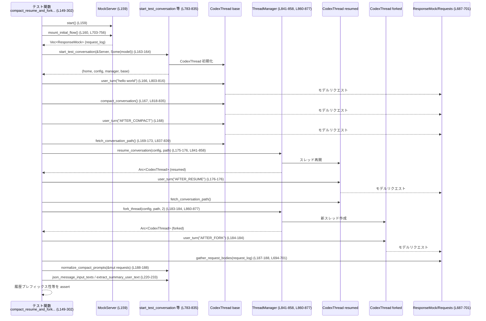

# core/tests/suite/compact_resume_fork.rs コード解説

## 0. ざっくり一言

Codex の会話スレッドに対して **コンパクト化（要約）、再開（resume）、フォーク、ロールバック** を行ったとき、**モデルに送られる履歴（入力 JSON）が期待どおりになるか** を検証する統合テストと、そのための補助関数をまとめたファイルです（`core/tests/suite/compact_resume_fork.rs`）。

---

## 1. このモジュールの役割

### 1.1 概要

- モデルとの SSE 会話を **wiremock の MockServer** でモックし、`CodexThread` を使って実際の会話フローを駆動します（L159-167, L315-323, L454-475, L548-595）。
- 各ステップ後に送信された **リクエストボディ（JSON）を収集・正規化** し、メッセージ列がコンパクト化・再開・フォーク・ロールバックの契約を満たしているかを検証します（L187-201, L352-378, L489-511, L611-647）。
- 4 つのシナリオテストを通じて、**モデルから見える履歴の不変条件** を保証することが目的です（L149-302, L304-439, L441-529, L531-664）。

### 1.2 アーキテクチャ内での位置づけ

このファイルはテスト専用であり、プロダクションコードである `codex_core` / `codex_protocol` / `core_test_support` を利用して、「会話コンパクションまわりの仕様」の振る舞いをブラックボックス的に検証します。

主な依存関係を図示します。

```mermaid
graph TD
    subgraph Tests[テスト関数群 (このファイル)]
        T1["compact_resume_and_fork... (L149-302)"]
        T2["compact_resume_after_second_compaction... (L304-439)"]
        T3["snapshot_rollback_past_compaction... (L441-529)"]
        T4["snapshot_rollback_followup_turn... (L531-664)"]
    end

    subgraph Helpers[テスト補助関数 (このファイル)]
        H1["start_test_conversation (L783-801)"]
        H2["user_turn (L803-816)"]
        H3["compact_conversation (L818-835)"]
        H4["resume_conversation (L841-858)"]
        H5["fork_thread (L860-877)"]
        H6["normalize_compact_prompts (L122-147)"]
        H7["gather_request_bodies (L694-701)"]
    end

    subgraph Core["codex_core / codex_protocol (他ファイル)"]
        C1["CodexThread"]
        C2["ThreadManager"]
        C3["Config"]
        C4["Op / EventMsg / WarningEvent"]
    end

    subgraph TestSupport["core_test_support / wiremock (他ファイル)"]
        S1["test_codex()"]
        S2["ResponseMock / ResponsesRequest"]
        S3["mount_sse_sequence / mount_sse_once_match"]
        S4["sse / ev_assistant_message / ev_completed"]
        S5["wait_for_event"]
        MS["MockServer"]
    end

    T1 --> H1
    T1 --> H2
    T1 --> H3
    T1 --> H4
    T1 --> H5
    T1 --> H6
    T1 --> H7

    T2 --> H1
    T2 --> H2
    T2 --> H3
    T2 --> H4
    T2 --> H5
    T2 --> H6
    T2 --> H7

    T3 --> H1
    T3 --> H2
    T3 --> H3

    T4 --> H1
    T4 --> H2

    H1 --> S1
    H1 --> C1
    H1 --> C2
    H1 --> C3

    H2 --> C1
    H3 --> C1
    H4 --> C2
    H5 --> C2

    T1 --> S2
    T2 --> S2
    T3 --> S2
    T4 --> S2

    T1 --> S3
    T2 --> S3
    T3 --> S3
    T4 --> S3

    S3 --> S4
    Tests --> MS
```

※ `CodexThread` / `ThreadManager` / `Config` / `ResponseMock` などの詳細実装はこのチャンクには現れません。

### 1.3 設計上のポイント

- **テストスキップ条件**  
  環境変数 `CODEX_SANDBOX_NETWORK_DISABLED_ENV_VAR` が設定されている場合、テストをスキップすることで、ネットワーク制限付きサンドボックスでの誤実行を避けています（L48-50, L153-156, L308-311, L446-449, L536-539）。

- **SSE モックとリクエストログ**  
  - `wiremock::MockServer` を起動し（L159, L315, L454, L548）、`core_test_support::responses` のヘルパーで SSE ストリームを組み立てます（L455-468, L552-560, L704-717, L759-778）。
  - リクエストは `ResponseMock` / `ResponsesRequest` を通じて収集し、JSON ボディだけを抽出・正規化します（L687-701）。

- **正規化の徹底**  
  - 改行コードを `\n` に正規化する関数を文字列と JSON 全体に対して用意しています（L86-92, L666-685）。
  - コンパクション用サマリープロンプトと一致するユーザーメッセージをテスト比較から除外するための `normalize_compact_prompts` が用意されています（L122-147）。

- **イベント駆動の安全な待機**  
  - 各操作（ユーザーターン、コンパクト、ロールバック）後に `wait_for_event` で `EventMsg::TurnComplete` や `EventMsg::Warning` を待ち、非同期処理が完了してから次のステップに進みます（L815-815, L823-835, L480-485, L600-607）。
  - これにより、テストが race condition で壊れる可能性を下げています。

- **意図的な panic / expect による失敗検知**  
  - `expect("...")` や `panic!("...")` を多用し、想定外の状態はすべてテスト失敗として検出する方針です（例: L57-60, L98-98, L223-224, L248-249, L482-484）。

---

## 2. 主要な機能一覧

このファイルが提供する主な機能（＝シナリオテスト + 重要ヘルパ）です。

- コンパクト→再開→フォークでの履歴維持検証:  
  `compact_resume_and_fork_preserve_model_history_view`（L149-302）
- フォーク側を再コンパクトした後の再開での履歴維持検証:  
  `compact_resume_after_second_compaction_preserves_history`（L304-439）
- コンパクトより前にロールバックした場合の履歴再構成検証:  
  `snapshot_rollback_past_compaction_replays_append_only_history`（L441-529）
- ロールバック時の「プレターン文脈更新（OverrideTurnContext）」の重複削減検証:  
  `snapshot_rollback_followup_turn_trims_context_updates`（L531-664）
- 会話スレッドの起動と設定（モックモデルとサマリープロンプトの設定）:  
  `start_test_conversation`（L783-801）
- 1 ユーザーターンの送信と完了待ち:  
  `user_turn`（L803-816）
- 会話のコンパクション実行と警告イベントの検証:  
  `compact_conversation`（L818-835）
- ロールアウトファイルからの再開・フォーク:  
  `resume_conversation`（L841-858）, `fork_thread`（L860-877）
- リクエスト JSON の正規化とユーザーメッセージ抽出:  
  `normalize_compact_prompts`（L122-147）,  
  `json_message_input_texts`（L101-120）,  
  `filter_out_ghost_snapshot_entries` / `is_ghost_snapshot_message`（L63-84）

---

## 3. 公開 API と詳細解説

### 3.1 型一覧（構造体・列挙体など）

このファイル内で新規に定義される構造体・列挙体はありません。  
テストで特に重要な外部型をまとめます（定義本体はこのチャンクには現れません）。

| 名前 | 種別 | 定義元 | 役割 / 用途 |
|------|------|--------|-------------|
| `CodexThread` | 構造体（推測） | `codex_core` | 1 つの会話スレッドを表すハンドル。`submit` で `Op` を送り、`rollout_path` でロールアウトファイルを参照します（L803-815, L837-839）。 |
| `ThreadManager` | 構造体（推測） | `codex_core` | スレッドの再開・フォークを行うマネージャ。`resume_thread_from_rollout` / `fork_thread` を提供します（L841-858, L861-877）。 |
| `Config` | 構造体（推測） | `codex_core::config` | Codex の設定。テストではモデルプロバイダ URL・compact 用プロンプトを設定します（L783-795）。 |
| `Op` | 列挙体（推測） | `codex_protocol::protocol` | スレッドへの操作（`UserInput`, `Compact`, `ThreadRollback`, `OverrideTurnContext` など）を表します（L805-812, L820-821, L477-479, L573-592）。 |
| `EventMsg` | 列挙体（推測） | `codex_protocol::protocol` | スレッドからのイベント。ここでは `TurnComplete`, `ThreadRolledBack`, `Warning` をマッチしています（L815, L481-485, L600-607, L823-828, L830-835）。 |
| `ResponseMock` | 構造体（推測） | `core_test_support::responses` | wiremock と SSE 応答の両方をラップし、テスト用に送信リクエストを記録します（L29, L469-469, L703-756）。 |
| `ResponsesRequest` | 構造体（推測） | 同上 | 1 件の送信リクエストを表し、ボディ JSON の取得やメッセージ抽出ヘルパーを提供します（L30, L687-701, L489-507, L611-647）。 |

> これらの型の詳細なフィールドや実装は、このチャンクには現れないため不明です。

---

### 3.2 関数詳細（7 件）

#### `compact_resume_and_fork_preserve_model_history_view() -> ()`（L149-302）

**概要**

- 初回コンパクト後に会話を再開し、1 ターン前にフォークした場合に、**モデルに送られるメッセージ履歴が一貫したプレフィックスになっているか** を検証する統合テストです（L149-152, L190-218）。

**引数**

なし（`#[tokio::test]` によるテストエントリポイント）。

**戻り値**

- 返り値はなく、アサート失敗や `expect` による panic があればテスト失敗になります。

**内部処理の流れ**

1. ネットワーク無効環境ではテストをスキップします（L153-156）。
2. `MockServer` を起動し、初回 compact/resume/fork フロー用の SSE モックとリクエストログを構築します（`mount_initial_flow`、L159-161, L703-756）。
3. `start_test_conversation` で新規会話スレッドを開始し、モデル名を `"gpt-5.1-codex"` に固定します（L161-164）。
4. ベーススレッドで:
   - `"hello world"` のユーザーターン（L166）
   - `Compact` 操作（L167）
   - `"AFTER_COMPACT"` のユーザーターン（L168）
   を順に実行します。各ターン内で `TurnComplete` イベントを待機します（`user_turn` / `compact_conversation` 内部、L803-816, L818-835）。
5. ベーススレッドのロールアウトパスを取得し、存在を確認します（L169-173）。
6. `resume_conversation` で新たなスレッドに再開し、`"AFTER_RESUME"` ユーザーターンを行います（L175-177）。
7. 再開スレッドのロールアウトパスを取得・存在確認後、`fork_thread` で 2 番目のユーザーメッセージを基点にフォークし、`"AFTER_FORK"` ユーザーターンを行います（L178-185）。
8. `gather_request_bodies` で全リクエスト JSON を取得し、`normalize_compact_prompts` でサマリープロンプトに一致する「要約用ユーザー質問」を除去します（L187-189）。
9. 最後 3 つのリクエスト（初回コンパクト後、再開後、フォーク後）の `input` 配列を取り出し、**コンパクト後の `input` が、再開後・フォーク後の `input` のプレフィックスであること** を検証します（L190-218）。
10. 最初のリクエストに含まれる初期ユーザーシード（`hello world` 以外のユーザー文脈）を `seeded_user_prefix` として抽出し（L220-229）、各ステップにおけるユーザーメッセージの期待リストを構築・検証します（L230-301）。

**Examples（使用例）**

このテストのパターンを新しいシナリオで再利用するイメージです。

```rust
#[tokio::test(flavor = "multi_thread", worker_threads = 2)]
async fn custom_flow_preserves_history_prefix() {
    if network_disabled() { return; }

    let server = MockServer::start().await;
    let request_log = mount_initial_flow(&server).await;
    let (_home, config, manager, base) =
        start_test_conversation(&server, Some("gpt-5.1-codex")).await;

    // 任意のユーザーターンと Compact
    user_turn(&base, "first").await;
    compact_conversation(&base).await;
    user_turn(&base, "SECOND").await;

    // resume / fork
    let base_path = fetch_conversation_path(&base);
    let resumed = resume_conversation(&manager, &config, base_path).await;
    user_turn(&resumed, "THIRD").await;
    let resumed_path = fetch_conversation_path(&resumed);
    let forked = fork_thread(&manager, &config, resumed_path, 2).await;
    user_turn(&forked, "FOURTH").await;

    // リクエスト JSON を解析して履歴のプレフィックス不変条件を検証する…
    let mut requests = gather_request_bodies(&request_log);
    normalize_compact_prompts(&mut requests);
    // あとは compact_resume_and_fork_preserve_model_history_view と同様の検証を行う
}
```

**Errors / Panics**

- `start_test_conversation` / `user_turn` / `compact_conversation` / `resume_conversation` / `fork_thread` 内部で `expect` / `panic!` が多数使われているため、**期待されるイベントが届かない**、**ロールアウトパスが取得できない** などの異常はすべて panic となりテストが失敗します（例: L223-224, L248-249, L279-280, L830-832）。
- JSON 解析に失敗した場合も `expect("...")` で panic しますが、テスト内で生成している JSON なので通常は起きない前提です。

**Edge cases（エッジケース）**

- `seeded_user_prefix` が空（最初のリクエストに `hello world` 以外のユーザーメッセージが無い）場合、再開・フォーク後の履歴に余分なプレフィックスが追加されていないことを検証します（L255-261, L285-291）。
- 非空の場合、`seeded_user_prefix` が **整数回繰り返されるだけ** であることを `chunks_exact` と `remainder` を用いてチェックしています（L262-269, L292-299）。

**使用上の注意点**

- モック SSE の構成（`mount_initial_flow`）と、`requests[..]` のインデックス（0〜4）を強く前提にしたテストです（L191-193, L230-233）。モックシーケンスを変える場合は、インデックスも合わせて見直す必要があります。
- `requests.len() == 5` をハードコードで検証しており（L301-301）、将来送信回数が変わるとテストが壊れます。

---

#### `compact_resume_after_second_compaction_preserves_history() -> Result<()>`（L304-439）

**概要**

- フォーク後のブランチをさらにコンパクトし、そのロールアウトから再開した際に、**コンパクト直後の履歴が再開後の履歴のプレフィックスとして再利用される** ことを検証するテストです（L318-350, L362-378）。

**引数**

なし（Tokio テスト）。

**戻り値**

- `anyhow::Result<()>`。正常終了で `Ok(())`、内部で `?` を使っているため I/O などでエラーがあれば `Err` が返ります（L304-311, L663-663）。

**内部処理（要約）**

1. ネットワーク無効ならスキップ（L308-311）。
2. `MockServer` と SSE シーケンスを1本で構成する `mount_second_compact_sequence` を使用し、全リクエストが **一連のストリーム** 上で記録されるようにします（L315-317, L758-781）。
3. 会話フロー: 初回コンパクト→再開→フォーク→2 回目コンパクト→再開、という 6 ステップを `user_turn` / `compact_conversation` / `resume_conversation` / `fork_thread` で実行します（L319-350, L341-349）。
4. `request_log.requests()` で `ResponsesRequest` を取得し、全ボディ JSON を取り出して改行・サマリープロンプトを正規化します（L352-360）。
5. 最後から 2 番目のリクエスト（2 回目コンパクト直後）と最後のリクエスト（再開後）の `input` を比較し、**ゴーストスナップショットメッセージを除いた配列** がプレフィックス関係にあることを検証します（L362-378, L63-84）。
6. 最初のリクエストから `seeded_user_prefix` を抽出し（L379-388）、2 回目コンパクト直後に含まれるユーザーメッセージの期待リストを構築します（L389-403）。
7. 最終リクエスト内に、その期待リスト（もしくはフォークローカルなバリエーション）がどこかの連続ブロックとして存在することを `windows(...).position(...)` で探索し、見つかった位置までを **共通履歴部** とみなします（L404-421）。
8. 残りの suffix が `seeded_user_prefix` の整数回繰り返しになっているかを `chunks_exact` で検証します（L422-437）。

**Errors / Panics**

- `windows(...).position(...)` で共通履歴ブロックが見つからない場合、`panic!` でテストが失敗します（L419-421）。
- その他、`json_message_input_texts` で `input` の形が想定と違う場合は `panic` になります（L404-407）。

**Edge cases**

- 共通履歴が **ベーススレッド全体** なのか、**フォークローカルな部分のみ** なのかの 2 パターンを許容するロジックになっており（`expected_after_second_compact_user_texts` と `expected_fork_local_user_texts` の両方を試す、L391-403, L409-418）、フォーク戦略の実装の違いに対して少し柔軟です。
- ゴーストスナップショットメッセージ（`<ghost_snapshot>` で始まる特殊ユーザー発話）は比較から除外されます（L63-84, L369-370）。

**使用上の注意点**

- リクエスト数・ SSE シーケンス構造に強く依存し、最後の 2 件が「2 回目コンパクト直後」「再開後」であることを前提にしています（L359-360）。シーケンス変更時は合わせて見直す必要があります。

---

#### `snapshot_rollback_past_compaction_replays_append_only_history() -> Result<()>`（L441-529）

**概要**

- 1 ターンコンパクトした後、直後のターンをロールバックして別のユーザー入力を送ったときに、**コンパクトより前の履歴は残り、ロールバック対象のターンだけが消える** ことを検証するテストです（L441-445, L473-487, L489-511）。

**内部処理（要点）**

1. ネットワーク無効ならスキップ（L446-449）。
2. 4 つの SSE ストリームを順番に流すモックを構成（最初の応答、要約、2 回目応答、最後の完了のみ）（L454-468, L469-469）。
3. ベーススレッドで `"hello world"` → `Compact` → `"EDITED_AFTER_COMPACT"` と進めます（L473-475）。
4. `Op::ThreadRollback { num_turns: 1 }` を送信し、`EventMsg::ThreadRolledBack` が返ること・ロールバックされたターン数が 1 であることを確認します（L477-485）。
5. ロールバック後に `"AFTER_ROLLBACK"` を送信します（L487-487）。
6. 記録された 4 件のリクエストのうち、要約リクエスト・ロールバック前リクエスト・ロールバック後リクエストを比較します（L489-511）。
   - ロールバック後のリクエストには `"hello world"` と `SUMMARY_TEXT` が含まれるが、`EDITED_AFTER_COMPACT` は含まれないこと（L492-507）。
   - 最後のユーザーメッセージが `AFTER_ROLLBACK` であること（L495-499）。

**Contracts / Edge cases**

- ロールバックによって **ロールアウトファイルの append-only 部** から履歴が再構築されることを前提としており、「コンパクトより前の履歴 + コンパクト要約」は残り、「コンパクト後に追加されたターン」は除去される、という契約を検証しています（L492-507）。
- リクエスト数が 4 固定であることを assert しているため（L490-490）、会話フローに追加リクエストが入るとテストが壊れます。

---

#### `snapshot_rollback_followup_turn_trims_context_updates() -> Result<()>`（L531-664）

**概要**

- `Op::OverrideTurnContext` による **プレターンコンテキスト変更（例: CWD や developer_instructions）** を含むターンをロールバックしたあと、次のターンでそのコンテキストが **重複なく一度だけ** 送信されることを検証するテストです（L531-535, L570-592, L611-647）。

**内部処理の流れ**

1. ネットワーク無効ならスキップ（L536-539）。
2. 3 つの SSE ストリーム（ターン 1 応答、ターン 2 応答、フォローアップ完了のみ）を構成し、`mount_sse_sequence` で一連のモックにします（L548-563）。
3. `start_test_conversation` で `MODEL = "gpt-5.1-codex"` を指定してスレッドを開始します（L565-566, L541-541）。
4. ターン 1 ユーザー `"turn 1 user"` を送信（L568-568）。
5. `config.cwd` 配下に `PRETURN_CONTEXT_DIFF_CWD` ディレクトリを作成し（L570-571）、そのパスと developer_instructions を含む `Op::OverrideTurnContext` を送信します（L572-593）。
6. ターン 2 ユーザー `"turn 2 user"` を送信（L595-595）。
7. `Op::ThreadRollback { num_turns: 1 }` を送信し（L597-599）、`ThreadRolledBack` イベントと `num_turns == 1` を確認します（L600-607）。
8. フォローアップユーザー `"follow-up user"` を送信（L609-609）。
9. 記録された 3 件のリクエストを解析し、以下を検証します（L611-647）。
   - ロールバック前リクエストでは、developer ロールのメッセージ内に `ROLLED_BACK_DEV_INSTRUCTIONS` が 1 回だけ含まれる（L614-619）。
   - 同じリクエストの user ロールメッセージに `PRETURN_CONTEXT_DIFF_CWD` が 1 回含まれる（L620-627）。
   - ロールバック後リクエストでも、developer ロールでの `ROLLED_BACK_DEV_INSTRUCTIONS` は 1 回だけ（L629-634）。
   - ロールバック後 user メッセージでも `PRETURN_CONTEXT_DIFF_CWD` は 1 回だけで、最後のメッセージが `FOLLOWUP_USER` である（L636-647）。

**Contracts / Edge cases**

- `OverrideTurnContext` によって導入される **持続的な設定変更** は、「ロールバック対象ターンの文脈」として扱われ、ロールバック後の再構築では **重複挿入されない** ことを確認しています（L573-592, L629-643）。
- developer / user ロールごとにカウントしているため、「別ロールに 2 回入る」ような実装変更があればテストで検出されます。

---

#### `start_test_conversation(server: &MockServer, model: Option<&str>) -> (Arc<TempDir>, Config, Arc<ThreadManager>, Arc<CodexThread>)`（L783-801）

**概要**

- モックサーバーを使った Codex 環境を初期化し、テスト用の会話スレッドと設定一式を返すヘルパーです。

**引数**

| 引数名 | 型 | 説明 |
|--------|----|------|
| `server` | `&MockServer` | モック SSE エンドポイントを提供する wiremock サーバー（L783-787）。 |
| `model` | `Option<&str>` | 使用するモデル名。`Some` の場合は `Config::model` に設定されます（L788-795）。 |

**戻り値**

- `(Arc<TempDir>, Config, Arc<ThreadManager>, Arc<CodexThread>)`  
  - `TempDir`: 会話用のホームディレクトリ（L800-800）。
  - `Config`: 実行に用いられた設定（L800-800）。
  - `ThreadManager`: スレッド再開・フォークに利用（L800-800）。
  - `CodexThread`: ベースとなる会話スレッド（L800-800）。

**内部処理**

1. `server.uri()` をベースに `/v1` を付加し、モデルプロバイダのベース URL を構成します（L787-787）。
2. `test_codex().with_config(...)` によってテスト用 Codex インスタンスの設定を上書きします（L789-796）。
   - モデルプロバイダ名を `"Non-OpenAI Model provider"` に設定（L790-790）。
   - モデルプロバイダの `base_url` をモックサーバーに設定（L791-791）。
   - `config.compact_prompt` に `SUMMARIZATION_PROMPT` を設定し、コンパクションが有効になるようにします（L792-792）。
   - `model` 引数が `Some` の場合、`config.model` に設定します（L793-795）。
3. `builder.build(server)` を非同期に実行し、結果から `home`, `config`, `thread_manager`, `codex` を取り出して返します（L797-800）。

**使用上の注意点**

- `test_codex` や `builder.build` の詳細はこのチャンクには現れないため、実際の挙動は外部実装に依存します。
- `Config` は clone して再開・フォークに使われるため（L842-852, L867-871）、ここで設定した compact プロンプト等がすべてのスレッドに適用されます。

---

#### `user_turn(conversation: &Arc<CodexThread>, text: &str)`（L803-816）

**概要**

- 指定したテキスト 1 件からなるユーザーターンを送信し、そのターンの完了 (`TurnComplete`) を待つヘルパーです。

**引数**

| 引数名 | 型 | 説明 |
|--------|----|------|
| `conversation` | `&Arc<CodexThread>` | 対象の会話スレッド（L803-803）。 |
| `text` | `&str` | ユーザー発話のテキスト（L803-803）。 |

**戻り値**

- 返り値なし。非同期関数であり、完了するまで待機します。

**内部処理**

1. `Op::UserInput` を組み立てます。`items` に `UserInput::Text { text, text_elements: Vec::new() }` を 1 件だけ含めます（L805-809）。
2. `conversation.submit(...)` を await し、`expect("submit user turn")` でエラーを panic として扱います（L803-813）。
3. `wait_for_event` で `EventMsg::TurnComplete(_)` を待機します（L815-815）。

**Edge cases**

- `responsesapi_client_metadata` や `final_output_json_schema` は常に `None` で、拡張は考慮していません（L810-811）。
- `text_elements` は空のベクタなので、リッチテキスト要素は用いていません。

**使用上の注意点**

- 非同期テストの中で `.await` し忘れるとコンパイルエラーになるため、安全側になっています。
- エラーはすべて panic 処理でテスト失敗になるため、`Result` を返してハンドリングする用途には向きません。

---

#### `compact_conversation(conversation: &Arc<CodexThread>)`（L818-835）

**概要**

- `Op::Compact` を送信し、**コンパクション完了の警告イベント + ターン完了イベント** が受信されることを確認するヘルパーです。

**内部処理**

1. `conversation.submit(Op::Compact)` を await し、失敗時は panic（L819-823）。
2. `wait_for_event` で `EventMsg::Warning(WarningEvent { message })` を待ち、メッセージが `COMPACT_WARNING_MESSAGE` と一致することを assert します（L823-833）。
3. その後さらに `TurnComplete` イベントが来るまで待機します（L834-834）。

**Contracts / Safety**

- コンパクション操作は必ず `Warning` イベントを発生させる、という仕様をテストレベルで前提としています（L823-833）。
- この契約が変わった場合（例えば warning を出さなくなった場合）、テストヘルパー変更が必要です。

---

#### `resume_conversation(manager: &ThreadManager, config: &Config, path: PathBuf) -> Arc<CodexThread>`（L841-858）

**概要**

- ロールアウトファイルから会話スレッドを再開するヘルパーです。

**内部処理**

1. `codex_core::test_support::auth_manager_from_auth` と `codex_login::CodexAuth::from_api_key("dummy")` から認証マネージャを生成します（L846-848）。
2. `manager.resume_thread_from_rollout(config.clone(), path, auth_manager, None)` を実行し、エラーは `expect("resume conversation")` で panic として扱います（L849-856）。
3. 返り値の `.thread` フィールドを返します（L857-857）。

**Concurrency**

- `ThreadManager` 内部のスレッド管理が非同期で行われますが、このヘルパーは単一の `await` のみで、呼び出し側は直列に実行しています。

---

### 3.3 その他の関数

補助的な関数一覧です。

| 関数名 | 役割（1 行） | 行番号 |
|--------|--------------|--------|
| `network_disabled()` | サンドボックスでネットワークが無効化されているかを環境変数から判定し、テストスキップに使う（L48-50）。 | L48-50 |
| `body_contains_text(body, text)` | HTTP ボディ文字列が JSON エスケープ済みの `text` を含むかを判定（L52-54, L719-753）。 | L52-54 |
| `json_fragment(text)` | `"text"` を JSON 文字列としてシリアライズし、両側の `"` を削った文字列を返す（L56-61）。 | L56-61 |
| `filter_out_ghost_snapshot_entries(items)` | `<ghost_snapshot>` で始まるユーザーメッセージを除外して新しい配列を作る（L63-69, L369-370）。 | L63-69 |
| `is_ghost_snapshot_message(item)` | JSON アイテムがゴーストスナップショットメッセージかをチェック（L71-84）。 | L71-84 |
| `normalize_line_endings_str(text)` | 文字列中の `\r\n` / `\r` を `\n` に統一する（L86-92）。 | L86-92 |
| `extract_summary_user_text(request, summary_text)` | 指定したサマリーテキストを含む user メッセージ本文を 1 つ取り出す（L94-99）。 | L94-99 |
| `json_message_input_texts(request, role)` | リクエスト JSON の `input` から、指定ロールの message の text 部分だけを `Vec<String>` で返す（L101-120）。 | L101-120 |
| `normalize_compact_prompts(requests)` | 各リクエストの `input` から、コンパクト用サマリープロンプトと空文字列の user メッセージを除去する（L122-147）。 | L122-147 |
| `normalize_line_endings(value)` | `serde_json::Value` 全体の文字列フィールドの改行コードを `\n` に統一する（L666-685）。 | L666-685 |
| `gather_requests(request_log)` | `&[ResponseMock]` から全 `ResponsesRequest` をフラットに収集する（L687-692）。 | L687-692 |
| `gather_request_bodies(request_log)` | 全リクエストの JSON ボディを取り出し、改行コードを正規化して返す（L694-701）。 | L694-701 |
| `mount_initial_flow(server)` | 初回 compact/resume/fork シナリオ用の SSE モックとマッチャーを構成し、`ResponseMock` 群を返す（L703-756）。 | L703-756 |
| `mount_second_compact_sequence(server)` | 2 回目のコンパクトを含むシーケンス用の SSE モックを構成し、1 つの `ResponseMock` にまとめて返す（L758-781）。 | L758-781 |
| `fetch_conversation_path(conversation)` | `CodexThread::rollout_path()` を呼び出してロールアウトファイルのパスを取得する（L837-839）。 | L837-839 |
| `fork_thread(manager, config, path, nth_user_message)` | 指定番目のユーザーメッセージで会話をフォークし、新しい `CodexThread` を返す（L860-877）。 | L860-877 |

---

## 4. データフロー

### 4.1 代表的シナリオ: コンパクト → 再開 → フォーク

`compact_resume_and_fork_preserve_model_history_view` の処理の中で、データがどのように流れるかをシーケンス図で示します（L149-302, L783-877）。



この図から分かるポイント:

- すべてのユーザー入力・コンパクト操作は `CodexThread` への `Op` として送られ、結果として `MockServer` に対するリクエストとなり `ResponseMock` に記録されます（L803-823, L703-756）。
- 再開・フォークは `ThreadManager` 経由で行われますが、その結果として得られる新しい `CodexThread` に対しても同様に `user_turn` 等を呼び出しています（L841-858, L860-877）。

---

## 5. 使い方（How to Use）

このファイル自体はテスト専用ですが、**新しいコンパクション関連シナリオ** を書くときに再利用できるパターンを示します。

### 5.1 基本的な使用方法

新しい統合テストを書く場合の典型的な流れです。

```rust
#[tokio::test(flavor = "multi_thread", worker_threads = 2)]
async fn my_new_compaction_scenario() -> anyhow::Result<()> {
    if network_disabled() {
        println!("Skipping test because network is disabled in this sandbox");
        return Ok(());
    }

    // 1. MockServer と SSE 応答シーケンスの準備
    let server = MockServer::start().await;
    let request_log = mount_sse_sequence(
        &server,
        vec![
            sse(vec![ev_assistant_message("m1", "first reply"), ev_completed("r1")]),
            // 必要なだけ SSE ストリームを続ける
        ],
    ).await;

    // 2. 会話スレッドの開始
    let (_home, config, manager, base) = start_test_conversation(&server, None).await;

    // 3. 好きなフローを構成
    user_turn(&base, "hello").await;
    compact_conversation(&base).await;
    // ... 必要なら resume_conversation / fork_thread を使う

    // 4. リクエスト履歴を取得し、JSON の内容を検証
    let mut bodies = request_log
        .requests()
        .into_iter()
        .map(|req| req.body_json())
        .collect::<Vec<_>>();
    bodies.iter_mut().for_each(normalize_line_endings);
    normalize_compact_prompts(&mut bodies);

    // 5. json_message_input_texts や filter_out_ghost_snapshot_entries 等で検証
    let user_texts = json_message_input_texts(&bodies[0], "user");
    assert!(user_texts.contains(&"hello".to_string()));

    Ok(())
}
```

### 5.2 よくある使用パターン

- **履歴のプレフィックス性の検証**（L190-218, L362-378）  
  - compact 前後や resume 前後の `input` 配列同士で、「短い方が長い方のプレフィックスになっているか」を確認する。
  - ゴーストスナップショットメッセージがある場合は `filter_out_ghost_snapshot_entries` で除外してから比較する。

- **特定ロール・特定テキストの出現回数チェック**（L614-619, L629-643）  
  - `ResponsesRequest.message_input_texts(role)` あるいは `json_message_input_texts` を使って、developer / user ロールでの指定テキストの出現回数を数える。

### 5.3 よくある間違い

```rust
// 間違い例: Compact 後の完了イベントを待たずに次の操作を送ってしまう
compact_conversation(&base); // .await を忘れている（コンパイルエラー）

// 正しい例: Compact の完了 (Warning + TurnComplete) を待ってから次の操作
compact_conversation(&base).await;
user_turn(&base, "AFTER_COMPACT").await;
```

```rust
// 間違い例: SSE モックを用意せずにテストを実行しようとする
let server = MockServer::start().await;
// mount_sse_sequence / mount_initial_flow を呼んでいない

// 正しい例: 必要な SSE 応答シーケンスを事前に構成する
let request_log = mount_second_compact_sequence(&server).await;
```

### 5.4 使用上の注意点（まとめ）

- **非同期・並行性**  
  - 全テストは `#[tokio::test(flavor = "multi_thread", worker_threads = 2)]` で実行され（L149, L304, L441, L531）、Tokio マルチスレッドランタイム上で動作します。
  - ただし各テスト内では `user_turn` などを直列に await しており、**同一スレッドへの操作は逐次実行** になっています。

- **エラー処理**  
  - テスト補助関数の多くは `expect` / `panic!` を使うため、「想定外の状態」=「テスト失敗」という設計です（L57-60, L98-98, L830-832）。
  - I/O エラーやディレクトリ作成失敗などは `Result<()>` を返すテスト関数から `?` で外に伝播しています（L571, L592-593, L597-599）。

- **環境依存**  
  - 環境変数 `CODEX_SANDBOX_NETWORK_DISABLED_ENV_VAR` が設定された環境ではテストをスキップするため、本番の CI などでネットワーク制限の有無に注意が必要です（L48-50, L153-156 など）。

---

## 6. 変更の仕方（How to Modify）

### 6.1 新しい機能（シナリオ）を追加する場合

1. **SSE 応答シーケンスの定義**
   - `mount_initial_flow` や `mount_second_compact_sequence` と同様に、新シナリオ用の `mount_*` 関数を追加します（L703-756, L758-781）。
   - `sse`, `ev_assistant_message`, `ev_completed` を組み合わせて応答を構成し、必要なら `mount_sse_once_match` でマッチ条件を定義します。

2. **テスト関数の作成**
   - 既存の 4 つのテストを雛形にし、`start_test_conversation` / `user_turn` / `compact_conversation` / `resume_conversation` / `fork_thread` を組み合わせてフローを記述します（L149-302, L304-439 等）。

3. **検証ロジックの追加**
   - `gather_request_bodies` や `json_message_input_texts` を用いて JSON を解析し、新たな不変条件を assert します。

### 6.2 既存の機能を変更する場合

- **コンパクション仕様の変更**
  - 例えば Warning イベントを出さないようにする場合、`compact_conversation` の Warning 関連の assert を見直し、すべてのテストでこのヘルパーを使用している箇所への影響を確認する必要があります（L818-835）。
- **ロールバック仕様の変更**
  - `ThreadRollback` がどのように履歴を再構成するかを変更した場合、`snapshot_rollback_*` 2 テスト（L441-529, L531-664）の期待ロジックを合わせて調整する必要があります。
- **リクエストフォーマットの変更**
  - `input` や `content` の JSON 構造が変わると、`json_message_input_texts` や `is_ghost_snapshot_message` のフィルタ条件が合わなくなります（L101-120, L71-84）。  
    この場合、まずこれらヘルパーの実装を新フォーマットに合わせ、それから各テストの期待値を更新します。

---

## 7. 関連ファイル

| パス | 役割 / 関係 |
|------|------------|
| `core/tests/suite/compact.rs`（推定） | `super::compact::*`（`COMPACT_WARNING_MESSAGE`, `FIRST_REPLY`, `SUMMARY_TEXT`）を提供するテスト補助モジュール。このチャンクには定義が現れませんが、コンパクション関連の共通定数をまとめていると考えられます（L10-12）。 |
| `core_test_support::responses`（他ファイル） | SSE モック (`sse`, `ev_assistant_message`, `ev_completed`) とリクエスト記録 (`ResponseMock`, `ResponsesRequest`, `mount_sse_sequence`, `mount_sse_once_match`) を提供し、本テストで HTTP レベルの挙動を検証する基盤になっています（L29-35, L469, L703-756, L758-781）。 |
| `core_test_support::test_codex` | `test_codex()` により、テスト用 Codex 環境のビルダを提供します。`start_test_conversation` から使用されています（L36, L789-797）。 |
| `codex_core::compact` | `SUMMARIZATION_PROMPT` を定義し、コンパクション時に用いるプロンプトを提供します（L16, L792）。 |
| `codex_core::spawn` | `CODEX_SANDBOX_NETWORK_DISABLED_ENV_VAR` を定義し、テストスキップ条件として利用されています（L18, L48-50）。 |
| `codex_protocol::protocol` | `Op`, `EventMsg`, `WarningEvent` など、会話オペレーションとイベントの型を提供します。本テストはこれらを通じて会話を駆動・観測します（L22-24, L477-479, L600-607, L823-833）。 |
| `codex_protocol::user_input::UserInput` | `Op::UserInput` のペイロードとなるユーザー入力型で、`user_turn` が利用しています（L25, L805-809）。 |

> これら関連ファイルの具体的な実装内容は、このチャンクには現れないため詳細は不明ですが、本ファイルのテストが依存する重要なコンポーネントです。
