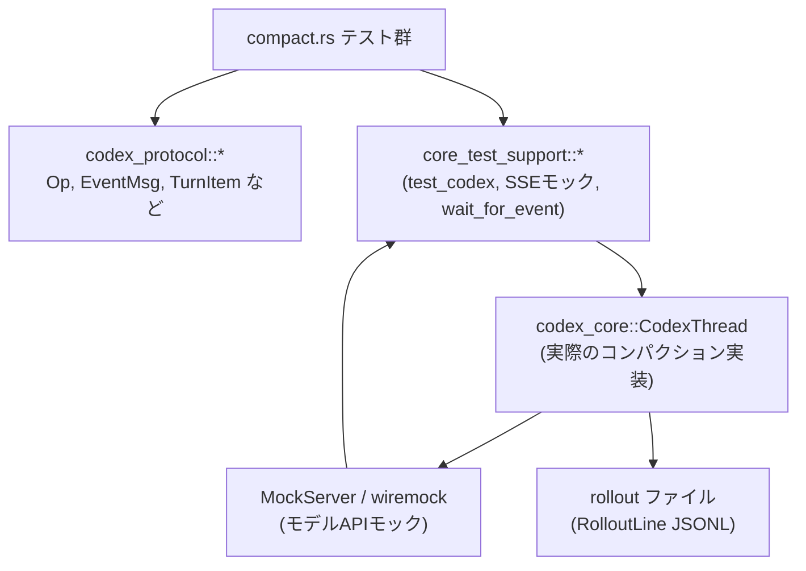
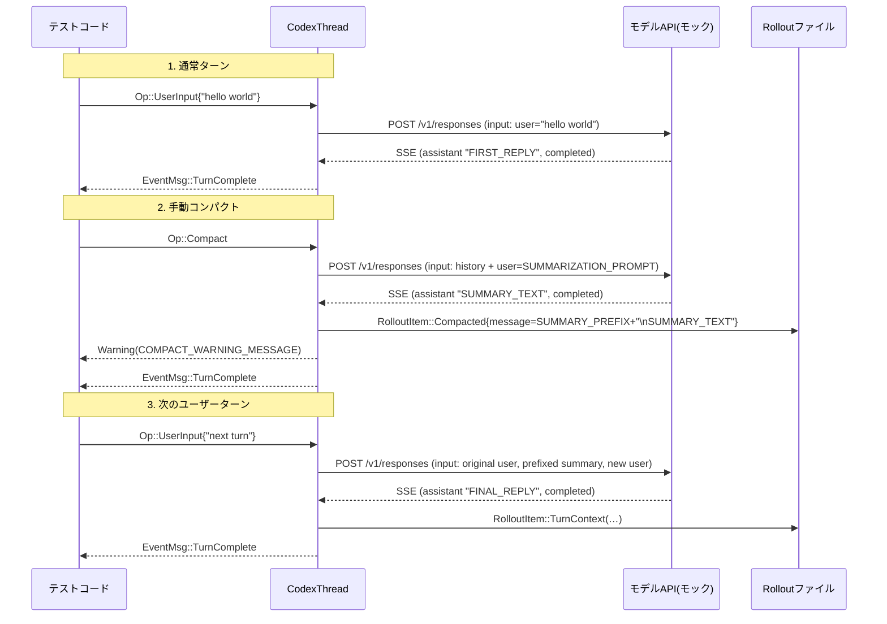

# core/tests/suite/compact.rs

## 0. ざっくり一言

- Codex の **コンテキスト圧縮（compact）機能** を、モックの OpenAI 互換サーバーに対するリクエスト形状・イベント列・ロールアウト永続化を通じて検証するテストモジュールです。
- 手動 `/compact`・自動コンパクト・モデル切り替え時の事前コンパクト・再開（resume）後の挙動など、コンパクション周りのほぼ全パターンを網羅しています。

> 行番号について: 提供されたコード断片には行番号情報が含まれていないため、以下ではすべて「compact.rs:行番号不明」と記載します。

---

## 1. このモジュールの役割

### 1.1 概要

このモジュールは **Codex の会話履歴コンパクションの挙動** を検証するために存在し、主に次のような機能をテストします。

- ユーザーによる手動 `/compact` オペレーションの挙動（警告イベント、トークンカウント、ロールアウトへの記録など）。
- トークン使用量やコンテキストウィンドウ超過に応じて起動する **自動コンパクション** のトリガ条件と、その後の会話フロー。
- モデル切り替え時（コンテキストウィンドウが小さいモデルへの切り替え）やセッション再開時の **事前コンパクション（pre-sampling / pre-turn）** の挙動。
- reasoning item・function call・画像入力などを含む複雑なコンテキストに対するトークン数カウントとコンパクション結果。

### 1.2 アーキテクチャ内での位置づけ

このモジュールは **テストコード** であり、Codex コア本体（`codex_core`）やテスト支援ライブラリ（`core_test_support`）を利用して挙動を外側から検証します。

主な依存関係の関係図は次のとおりです。



- このファイル自体は **新しい型やプロダクション用 API は定義しません**。  
  代わりに、`Op::UserInput` / `Op::Compact` / `EventMsg::*` など既存 API を呼び出し、その契約をテストによって固定しています。

### 1.3 設計上のポイント

コードから読み取れる特徴を列挙します。

- **責務の分割**
  - モックサーバー構築や SSE レスポンス生成は `core_test_support::responses` に委譲。
  - `non_openai_model_provider`, `set_test_compact_prompt` などの小さなヘルパー関数を通じて、テストごとの設定重複を削減。
  - リクエストスナップショット出力は `context_snapshot` に委譲し、テスト側はシナリオ名とセクションのみ指定。

- **状態管理**
  - `codex_core::CodexThread` は `Arc` で共有され、`submit` / `next_event` を通じて非同期イベント駆動で操作されます。
  - セッション再開シナリオでは、`home` と `rollout_path` を保存し、`test_codex().resume(...)` で同じセッション状態を再構築しています。

- **エラーハンドリング方針**
  - テストヘルパー内では `expect`, `unwrap`, `panic!` を多用し、失敗時には即座にテストを落とすスタイルです（プロダクションではなくテストなので許容されています）。
  - コンパクションの失敗（`context_length_exceeded` や `server_error`）に対するコアの挙動は、イベントと再試行回数を通じて検証されます。

- **並行性**
  - すべてのテストは `#[tokio::test(flavor = "multi_thread")]` で実行され、`worker_threads` を 2 または 4 に設定して **SSE ストリームとイベントループが枯渇しないこと** を保証する意図が読み取れます。
  - テスト自体は単一スレッドで `codex.next_event().await` をポーリングする形ですが、バックグラウンドで Codex 内部の処理が複数スレッドで実行される前提になっています。

---

## 2. 主要な機能一覧

このファイルが検証している主な機能を整理します。

- 手動コンパクション (`Op::Compact`)
  - カスタムプロンプトの使用・デフォルトプロンプトの置換。
  - API からのトークン使用量とローカル推定トークン使用量の両方の `TokenCount` イベント発行。
  - `TurnItem::ContextCompaction` とレガシー `EventMsg::ContextCompacted` イベントの両立。
  - コンテキストウィンドウ超過時の **履歴トリミングと再試行**。

- 自動コンパクション（トークン使用量ベース）
  - `model_auto_compact_token_limit` と `model_context_window` に基づく発火条件の検証。
  - コンパクションリクエストにサマリープロンプトを **user message として追加** する挙動。
  - コンパクション後のフォローアップリクエストに、元のユーザーメッセージと要約が含まれることの確認。
  - 自動コンパクションが **独立したタスクの TurnStarted/TurnComplete を発行しない** ことの検証。

- モデル切り替え時の事前コンパクション
  - コンテキストウィンドウの小さいモデルへの切り替え時に、切り替え前のモデルでコンパクションを行う「pre-sampling compaction」。
  - pre-turn コンパクション時に `<model_switch>` アイテムを **compact リクエストからは除去し、フォローアップに復元** する挙動。

- reasoning / function call / 画像を含むコンテキスト処理
  - reasoning item の encrypted_content を **どこまでトークンカウントに含めるか**（最後のユーザーメッセージ以前のみカウント）。
  - function_call_output や shell 呼び出しを含む mid-turn コンパクション（ツール出力が compact 前に送られること）。
  - 画像とテキストを含むマルチモーダル入力に対する pre-turn コンパクションの挙動。

- remote compaction サービス
  - `/v1/responses/compact` エンドポイントへのリクエスト発行条件（トークン上限超過後の次のユーザーメッセージなど）。
  - resume 後も含めた、一貫した remote compact 実行と compaction 結果の履歴へのインジェクション。

- ロールアウトファイルへの永続化
  - 実際のユーザーターンごとに `RolloutItem::TurnContext` 行が 1 つずつ書き込まれること。
  - コンパクション実行時には `RolloutItem::Compacted` 行が追加されること。

---

## 3. 公開 API と詳細解説

### 3.1 型一覧（構造体・列挙体など）

このファイル内では **新しい構造体・列挙体は定義されていません**。  
外部から利用する重要型としては、すべて他クレートからのインポートです（ここでは用途だけ整理します）。

| 名前 | 種別 | 由来 | 役割 / 用途 |
|------|------|------|-------------|
| `Config` | 構造体 | `codex_core::config` | Codex の設定。`compact_prompt`, `model_auto_compact_token_limit`, `model_context_window` 等を設定。 |
| `CodexThread` | 構造体 | `codex_core` | 非同期の会話スレッド。`submit` / `next_event` で操作。 |
| `Op` | enum | `codex_protocol::protocol` | `UserInput`, `UserTurn`, `Compact`, `OverrideTurnContext`, `Shutdown` などの操作を表す。 |
| `EventMsg` | enum | `codex_protocol::protocol` | `TurnStarted`, `TurnComplete`, `ItemStarted`, `ItemCompleted`, `ContextCompacted`, `Warning`, `Error`, `TokenCount` などのイベント種別。 |
| `TurnItem` | enum | `codex_protocol::items` | `ContextCompaction` など、ターン内の作業単位。 |
| `RolloutLine`, `RolloutItem` | enum | `codex_protocol::protocol` | ロールアウトファイルに保存される行の種別（`TurnContext`, `Compacted` 等）。 |
| `ModelProviderInfo` | 構造体 | `codex_model_provider_info` | モデルプロバイダのエンドポイント URL や機能フラグ。テストではモックサーバー向けに書き換え。 |
| `ModelsResponse`, `ModelInfo` | 構造体 | `codex_protocol::openai_models` | 利用可能なモデル一覧とコンテキストウィンドウなどのメタ情報。 |

### 3.2 関数詳細（7件）

#### `auto_summary(summary: &str) -> String`  （compact.rs:行番号不明）

**概要**

- テスト内で「モデルが返した要約テキスト」を表現するための単純なラッパーです。
- 現状は `summary.to_string()` するだけですが、「prefix 付き要約」と区別する用途で使われています。

**引数**

| 引数名 | 型 | 説明 |
|--------|----|------|
| `summary` | `&str` | モデルが返した要約テキスト。 |

**戻り値**

- `String` – 引数の文字列をそのまま所有権付きで返します。

**内部処理の流れ**

1. `summary.to_string()` を呼び、その結果を返すだけです。

**使用例**

```rust
// モデルから返る要約をテスト用に表現
let first_summary_text = "The task is to create an app.";
let first_compact_summary = auto_summary(first_summary_text);
// sse(...) に埋め込んで、要約レスポンスとしてモックする
let sse_compact = sse(vec![
    ev_assistant_message("m2", &first_compact_summary),
    ev_completed_with_tokens("r2", 200),
]);
```

**Errors / Panics**

- パニックやエラーは発生しません。

**Edge cases**

- 空文字列 `""` もそのまま返されます。

**使用上の注意点**

- 現状はただの `to_string` なので、将来 prefix を付与するなどの役割が追加された場合に備え、「要約を表す意図的なヘルパ」として使っています。

---

#### `summary_with_prefix(summary: &str) -> String`  （compact.rs:行番号不明）

**概要**

- Codex コアが使用する `SUMMARY_PREFIX` を先頭に付け、改行を挟んで要約テキストを連結します。
- コア実装が「要約と元メッセージを区別できるようにする」ためのフォーマットをテスト側でも再現します。

**引数**

| 引数名 | 型 | 説明 |
|--------|----|------|
| `summary` | `&str` | 素の要約テキスト。 |

**戻り値**

- `String` – `"{SUMMARY_PREFIX}\n{summary}"` という形式の文字列。

**内部処理**

1. `format!("{SUMMARY_PREFIX}\n{summary}")` で新しい文字列を生成します。

**使用例**

```rust
let raw_summary = "I started to create a react app.";
let prefixed = summary_with_prefix(raw_summary);
// prefixed をユーザーメッセージとしてリクエストに含める前提でアサート
assert!(prefixed.starts_with(SUMMARY_PREFIX));
```

**Errors / Panics**

- 発生しません。

**Edge cases**

- `summary` が複数行でも、そのまま末尾に連結されます。

**使用上の注意点**

- テストでは「フォローアップリクエストに prefix 付き要約が含まれるか」を検証しているため、Prefix 仕様を変える場合はこのヘルパとテスト期待値を更新する必要があります。

---

#### `set_test_compact_prompt(config: &mut Config)`  （compact.rs:行番号不明）

**概要**

- テスト用に `Config.compact_prompt` を Codex デフォルトの `SUMMARIZATION_PROMPT` に設定するヘルパーです。
- 手動・自動コンパクション双方で、どのプロンプトが使われるべきかをテスト側から制御します。

**引数**

| 引数名 | 型 | 説明 |
|--------|----|------|
| `config` | `&mut Config` | Codex の設定オブジェクト。 |

**戻り値**

- なし。

**内部処理の流れ**

1. `config.compact_prompt = Some(SUMMARIZATION_PROMPT.to_string());` を実行するだけです。

**使用例**

```rust
let mut builder = test_codex().with_config(|config| {
    config.model_provider = non_openai_model_provider(&server);
    set_test_compact_prompt(config);                    // ← ここで compact_prompt を明示設定
    config.model_auto_compact_token_limit = Some(200_000);
});
let codex = builder.build(&server).await.unwrap().codex;
```

**Errors / Panics**

- ありません。`SUMMARIZATION_PROMPT` は定数として存在する前提です。

**Edge cases**

- 既に `compact_prompt` が設定されていても上書きします。

**使用上の注意点**

- カスタムプロンプトをテストしたい場合は、この関数を使わず `config.compact_prompt = Some("...".into())` を直接指定しています（`manual_compact_uses_custom_prompt` テストを参照）。

---

#### `non_openai_model_provider(server: &MockServer) -> ModelProviderInfo`  （compact.rs:行番号不明）

**概要**

- 組み込みの "openai" モデルプロバイダ設定をベースに、テスト用のモックサーバーを指す `ModelProviderInfo` を生成します。
- 実際の OpenAI エンドポイントではなく、`wiremock::MockServer` を指す URL に付け替える役割です。

**引数**

| 引数名 | 型 | 説明 |
|--------|----|------|
| `server` | `&MockServer` | テストで起動した Wiremock サーバー。`uri()` でベース URL を取得。 |

**戻り値**

- `ModelProviderInfo` – モックサーバー向けの設定を持つプロバイダ情報。

**内部処理の流れ**

1. `built_in_model_providers(None)["openai"].clone()` で OpenAI 用の定義を複製。
2. `provider.name = "OpenAI (test)".into();` として、テスト識別用の名前に書き換え。
3. `provider.base_url = Some(format!("{}/v1", server.uri()));` でモックサーバーの `/v1` を指す。
4. `provider.supports_websockets = false;` にして、SSE ベースのテスト前提に揃える。
5. 修正した `provider` を返却。

**使用例**

```rust
let server = start_mock_server().await;
let model_provider = non_openai_model_provider(&server);
let codex = test_codex()
    .with_config(move |config| {
        config.model_provider = model_provider;         // 実際の OpenAI ではなくモックを指す
        set_test_compact_prompt(config);
    })
    .build(&server)
    .await
    .unwrap()
    .codex;
```

**Errors / Panics**

- `"openai"` というキーが `built_in_model_providers(None)` に存在しない場合、`["openai"]` でパニックしますが、テスト前提として存在するとみなされています。

**Edge cases**

- `server.uri()` に末尾スラッシュがある場合も `"{}/v1"` によって URL が正しく繋がる想定です（詳細はモックサーバー実装依存で、ここからは読み取れません）。

**使用上の注意点**

- WebSocket ベースのストリーミングをテストしたい場合には、`supports_websockets` を `true` のままにするなどの拡張が必要になりますが、現状のテストは SSE に特化しています。

---

#### `assert_compaction_uses_turn_lifecycle_id(codex: &Arc<codex_core::CodexThread>)` （async） （compact.rs:行番号不明）

**概要**

- コンパクションの `ItemStarted` / `ItemCompleted` イベントが、ターン開始・終了と **同一の event id** を共有していることを検証するテストヘルパーです。
- 「コンパクションはターンの一部として扱われ、別のタスク ID を持たない」という契約を固定します。

**引数**

| 引数名 | 型 | 説明 |
|--------|----|------|
| `codex` | `&Arc<codex_core::CodexThread>` | イベントストリームを監視する Codex スレッド。 |

**戻り値**

- なし（失敗時は `assert_eq!` でパニックし、テスト失敗になります）。

**内部処理の流れ**

1. `turn_started_id`, `turn_completed_id`, `compact_started_id`, `compact_completed_id` を `None` で初期化。
2. `while turn_completed_id.is_none()` でイベントループを回し続ける。
3. 各イベントについて `match event.msg` で以下を記録:
   - `EventMsg::TurnStarted(_)` → `turn_started_id = Some(event.id.clone())`
   - `EventMsg::ItemStarted` かつ `TurnItem::ContextCompaction(_)` → `compact_started_id = Some(event.id.clone())`
   - `EventMsg::ItemCompleted` かつ `TurnItem::ContextCompaction(_)` → `compact_completed_id = Some(event.id.clone())`
   - `EventMsg::TurnComplete(_)` → `turn_completed_id = Some(event.id.clone())`
4. ループ終了後、それぞれの ID が期待通り一致しているかを `assert_eq!` で検証。

**使用例**

`pre_sampling_compact_runs_on_switch_to_smaller_context_model` などから呼ばれます。

```rust
test.codex
    .submit(Op::UserTurn { /* ... */ })
    .await
    .expect("submit second user turn");

// コンパクションを含むターンのイベントを検証
assert_compaction_uses_turn_lifecycle_id(&test.codex).await;
```

**Errors / Panics**

- 該当イベントが一切流れてこない場合は `expect("turn started id")` などがパニックします。
- ID が一致しない場合は `assert_eq!` がパニックします。

**Edge cases**

- ループは「最初の `TurnComplete` まで」イベントを読み続けるため、同一ターン内で複数回コンパクションが起きるケースは考慮していません（テストの想定上 1 回でよいという前提）。

**使用上の注意点**

- このヘルパーを使うテストでは、事前に「コンパクションが発生するターン」をトリガーしておく必要があります。
- 将来コンパクションが別タスクとして切り出される仕様変更を行うと、このテストが失敗し、契約の変更を明示的に伴うことになります。

---

#### `summarize_context_three_requests_and_instructions()` （async テスト） （compact.rs:行番号不明）

**概要**

- 手動 `/compact` によるコンテキスト要約が、3つのリクエストと適切なロールアウトエントリを生成することを検証します。
- ポイント:
  - 手動コンパクト時に **開発者向け instructions が変化しない**。
  - compact リクエストには `SUMMARIZATION_PROMPT` が user message として挿入される。
  - compact 後の次のターンでは、履歴が **元のユーザーメッセージ + prefix 付き summary のみ** になる。
  - ロールアウトファイルには `TurnContext` が 2 件、`Compacted` が 1 件書かれている。

**引数・戻り値**

- テスト関数のため引数・戻り値はありません。

**内部処理の流れ（要約）**

1. モックサーバーを起動し、3 つの SSE シナリオ（通常応答 / 要約応答 / 空の完了）を用意して `mount_sse_sequence`。
2. `non_openai_model_provider` と `set_test_compact_prompt` を使って Codex を構築。
3. 1 回目の `Op::UserInput` を送り、`TurnComplete` まで待機。
4. `Op::Compact` を送り、`Warning(COMPACT_WARNING_MESSAGE)` と `TurnComplete` を確認。
5. 3 回目の `Op::UserInput` を送り、`TurnComplete` を待つ。
6. モックサーバーに対して送られた 3 つのリクエストボディを取得・解析:
   - 1 と 2 の `instructions` が等しいことを確認。
   - 2 の `input` 最後の message が `SUMMARIZATION_PROMPT` の user message であることを確認。
   - 3 の `input` には「元の user メッセージ」「新しい user メッセージ」「prefix 付き summary」が含まれ、`SUMMARIZATION_PROMPT` 自体は含まれないことを確認。
7. `Op::Shutdown` を送り、`RolloutLine` をロールアウトファイルから読み込んで:
   - `RolloutItem::TurnContext` が 2 件。
   - `RolloutItem::Compacted` の `message` が `summary_with_prefix(SUMMARY_TEXT)` と一致。

**Examples（使用例）**

このテスト関数自体が使用例です。手動コンパクト付きの対話を行う最小構成は以下の通りです。

```rust
let server = start_mock_server().await;
let model_provider = non_openai_model_provider(&server);

let test = test_codex().with_config(move |config| {
    config.model_provider = model_provider;
    set_test_compact_prompt(config);
}).build(&server).await.unwrap();

let codex = test.codex.clone();

// 1. 通常のユーザー入力
codex.submit(Op::UserInput { /* ... */ }).await.unwrap();
wait_for_event(&codex, |ev| matches!(ev, EventMsg::TurnComplete(_))).await;

// 2. 手動コンパクト
codex.submit(Op::Compact).await.unwrap();
```

**Errors / Panics**

- モックサーバーからの応答が期待形状でない場合、`unwrap` / `expect` / `assert_eq!` でテストがパニックします。

**Edge cases**

- assistant 側のメッセージが 1 件のみというシンプルなケースで検証しているため、より長い履歴に対しても同じ契約が維持されることは、このテスト単体からは分かりません（他のテストが長い履歴を扱っています）。

**使用上の注意点**

- ロールアウトファイルパスを取得するために `session_configured.rollout_path` を利用しており、セッションごとに異なるファイルに書かれる前提です。
- Instructions が 1 回目と 2 回目で同一であることを前提にしているため、もしコンパクション専用 instructions を導入する設計変更を行うと、このテストの期待も更新する必要があります。

---

#### `auto_compact_runs_after_token_limit_hit()` （async テスト） （compact.rs:行番号不明）

**概要**

- `model_auto_compact_token_limit` を超えるトークン使用量が観測された後、**次のユーザー入力時に自動コンパクトが 1 回だけ走る** ことを検証するテストです。
- コンパクションリクエストには `SUMMARIZATION_PROMPT` が user message として含まれ、その後のフォローアップリクエストには要約とすべてのユーザーメッセージが含まれます。

**内部処理の流れ（要約）**

1. モックサーバーに 4 つの SSE レスポンスを mount:
   - 1: `total_tokens = 70_000`（しきい値下）。
   - 2: `total_tokens = 330_000`（しきい値超過）。
   - 3: 自動コンパクト用要約 (`AUTO_SUMMARY_TEXT`)。
   - 4: フォローアップ応答 (`FINAL_REPLY`)。
2. `model_auto_compact_token_limit = Some(200_000)` に設定して Codex を構築。
3. 3 回 `Op::UserInput` を送信:
   - 1 回目 (`FIRST_AUTO_MSG`) → 通常ターン。
   - 2 回目 (`SECOND_AUTO_MSG`) → トークン超過するターン。
   - 3 回目 (`POST_AUTO_USER_MSG`) → 自動コンパクト + フォローアップ。
4. モックへのリクエストボディを 4 つ取得し:
   - `SUMMARIZATION_PROMPT` を含むボディが **1 回だけ** であること（インデックス 2）。
   - フォローアップ（インデックス 3）には `FIRST_AUTO_MSG`, `SECOND_AUTO_MSG`, `POST_AUTO_USER_MSG` と prefix 付きサマリーテキストが含まれること。

**使用例**

自動コンパクトを有効化する設定例:

```rust
let mut builder = test_codex().with_config(move |config| {
    config.model_provider = non_openai_model_provider(&server);
    set_test_compact_prompt(config);
    config.model_auto_compact_token_limit = Some(200_000); // しきい値
});
let codex = builder.build(&server).await.unwrap().codex;
```

**Errors / Panics**

- 自動コンパクトが 2 回以上走る、または一度も走らない場合、`assert_eq!(auto_compact_count, 1)` 等でテストが失敗します。

**Edge cases**

- 「トークン超過ターンの直後のユーザー入力でコンパクト開始」というタイミングのみ検証しています。
- mid-turn コンパクション（ターン途中で 95% 超過した場合）は別テスト（`snapshot_request_shape_mid_turn_continuation_compaction`）で扱っています。

**使用上の注意点**

- このテストから読み取れる契約:
  - 自動コンパクトは **ユーザーの明示的な入力に続く hidden ターン** として実行され、ユーザーには専用の TurnStarted/TurnComplete イベントを見せません（別テストで検証）。
  - コンパクトリクエストは developer instructions を維持しつつ、最後に `SUMMARIZATION_PROMPT` user message を追加します。

---

#### `manual_compact_retries_after_context_window_error()` （async テスト） （compact.rs:行番号不明）

**概要**

- 手動 `/compact` 実行時に、モデル API が `context_length_exceeded` エラーを返した場合のリトライ戦略を検証します。
- ポイント:
  - 失敗した compact リクエストの直後に、**履歴の最も古いアイテムを 1 つ削除して再試行** する。
  - 再試行時もサマリープロンプトの有無は一貫している。
  - `BackgroundEvent` でトリミング件数を通知し、その後 `Warning(COMPACT_WARNING_MESSAGE)` を発行。

**内部処理の流れ（テスト視点）**

1. ユーザーターン（通常応答）と、
2. `context_length_exceeded` エラーを返す compact 試行、
3. 成功する compact 試行  
   の 3 つの SSE レスポンスを `mount_sse_sequence` で登録。

4. Codex を構築し、通常の `Op::UserInput` を 1 つ送信して `TurnComplete` を待つ。
5. `Op::Compact` を送信。
6. 最初に発生する `EventMsg::BackgroundEvent` を取得し、`"Trimmed 1 older thread item"` を含むことを確認。
7. 続いて `EventMsg::Warning` のメッセージが `COMPACT_WARNING_MESSAGE` であることを確認。
8. 3 つのリクエストボディ（通常ターン + 2 回の compact 試行）を比較し:
   - compact 1・2 の双方で `SUMMARIZATION_PROMPT` の有無が一致すること。
   - retry の `input` 長さが compact 1 よりちょうど 1 要素短いこと。
   - 先頭要素（最も古い履歴アイテム）が入れ替わっていること。

**Errors / Panics**

- 期待する `BackgroundEvent` や `Warning` が発生しない場合、`panic!("expected background event after compact retry")` などでテスト失敗になります。

**Edge cases**

- 複数回連続で `context_length_exceeded` が返るケースはここでは扱っていません（pre-turn の自動コンパクトに対するテストで複数回失敗を扱っています）。
- トリミングされるのは常に「最も古いアイテム」である前提が `assert_ne!(first_before, first_after)` から読み取れます。

**使用上の注意点（契約）**

- 手動コンパクトは、「コンテキストウィンドウ超過時には古い履歴を削って再試行する」という処理がコアに実装されている前提です。
- その際、ユーザー向けには:
  - `BackgroundEvent` で「何件削ったか」をメッセージとして通知。
  - 既定のコンパクション注意喚起 `COMPACT_WARNING_MESSAGE` も合わせて通知。  
  という UX 契約が固定されています。

---

#### `multiple_auto_compact_per_task_runs_after_token_limit_hit()` （async テスト） （compact.rs:行番号不明）

**概要**

- 長いタスク中にトークンが繰り返ししきい値を超える場合に、**複数回の自動コンパクトが正しい形で挿入される** ことを検証する大きな統合テストです。
- また、function call やローカルシェル実行などがコンパクションの前後で正しくログに残ることも検証します。

**内部処理の流れ（要約）**

1. 3 回分の「長い reasoning + shell 実行 + トークン 270,000」の SSE ターンと、それぞれの後に続く compact ターン、および最終応答ターンを `mount_sse_sequence` に登録（計 7 リクエスト）。
2. 初回リクエストの `input` を基準として、`environment_message`（環境説明）とユーザー入力 `"create an app"` を抽出し、正規化関数 `normalize_inputs` で不要な developer メッセージや function_call_output を除去。
3. 各コンパクション後のリクエスト（インデックス 2, 4, 6）に対して:
   - `environment_message`, `user_message`, `prefixed_summary` の 3 つだけが含まれること。
4. さらに、全 7 リクエストの期待される `input` 配列を JSON (`expected_requests_inputs`) で組み立て、`normalize_inputs` 後の結果が実際のリクエストと一致することをアサート。
5. リクエスト数が 7 であることを確認。

**Errors / Panics**

- 1 つでも期待されるリクエスト形状と異なれば `assert_eq!` でテスト失敗します。

**Edge cases**

- reasoning item に `encrypted_content` が含まれ、それが compact リクエストに含まれることを前提にしているため、将来「encrypted reasoning を compact 前に削る」ような仕様変更をすると、このテストを更新する必要があります。

**使用上の注意点**

- ここでは自動コンパクトによって **ユーザーメッセージの履歴が欠落しないこと** が強く検証されています。
- コンパクションが何度行われても、
  - `environment_message`（環境説明）
  - オリジナルのユーザーメッセージ
  - prefix 付き summary
  の 3 つが常に揃っていることが期待値になっています。

---

### 3.3 その他の関数・テスト一覧

（目的別に簡潔に整理します。すべて `compact.rs:行番号不明`）

| 関数名 | 種別 | 役割（1 行） |
|--------|------|--------------|
| `body_contains_text` | ヘルパー | JSON ボディ文字列内に、指定テキストの JSON 断片が含まれるかを判定。 |
| `json_fragment` | ヘルパー | `serde_json::to_string` したうえで両端の `"` を削ることで、JSON 内部でのエスケープ形を再現。 |
| `model_info_with_context_window` | ヘルパー | `models.json` から指定 slug の `ModelInfo` を取り出し、`context_window` を上書き。 |
| `assert_pre_sampling_switch_compaction_requests` | ヘルパー | pre-sampling モデル切り替えコンパクト時の 3 リクエスト（前モデル / compact / 後モデル）の形を検証。 |
| `context_snapshot_options` | ヘルパー | スナップショット出力用の `ContextSnapshotOptions` を作成（種別＋テキスト prefix で 64 文字まで）。 |
| `format_labeled_requests_snapshot` | ヘルパー | 複数リクエストのスナップショットを scenario 付きラベルで整形。 |

テスト関数（抜粋）:

| テスト名 | 役割（1 行） |
|----------|--------------|
| `manual_compact_uses_custom_prompt` | `Config.compact_prompt` をカスタムにした場合、デフォルト `SUMMARIZATION_PROMPT` が使われないことを確認。 |
| `manual_compact_emits_api_and_local_token_usage_events` | compact ターンで、API usage とローカルトークン推定の 2 種類の `TokenCount` が出ることを確認。 |
| `manual_compact_emits_context_compaction_items` | 手動コンパクト時、`TurnItem::ContextCompaction` の `ItemStarted`/`ItemCompleted` と `ContextCompacted` イベントが出ることを確認。 |
| `auto_compact_emits_context_compaction_items` | 自動コンパクト時も同様の `ContextCompaction` item とレガシーイベントが出ることを確認。 |
| `auto_compact_starts_after_turn_started` | 自動コンパクションの `ItemStarted` より先に `TurnStarted` イベントが出ることを保証。 |
| `auto_compact_runs_after_resume_when_token_usage_is_over_limit` | セッション再開後、オーバーリミット状態から初回のユーザーターンでリモートコンパクトが走ることを確認。 |
| `pre_sampling_compact_runs_on_switch_to_smaller_context_model` | モデル切り替え（小さいコンテキストウィンドウ）時に pre-sampling コンパクトが走ることを確認。 |
| `pre_sampling_compact_runs_after_resume_and_switch_to_smaller_model` | resume 後のモデル切り替えでも pre-sampling コンパクトが期待通り動くことを検証。 |
| `auto_compact_persists_rollout_entries` | 自動コンパクトを挟んだ 3 ターンの会話で `TurnContext` が 3 行ロールアウトに残ることを確認。 |
| `manual_compact_non_context_failure_retries_then_emits_task_error` | （ignored）コンテキスト以外のサーバエラー時に再接続＆タスクエラーを出すことを検証（現状の挙動は TODO）。 |
| `manual_compact_twice_preserves_latest_user_messages` | `/compact` を 2 回実行しても最新のユーザーメッセージ履歴が保持されることを確認。 |
| `auto_compact_allows_multiple_attempts_when_interleaved_with_other_turn_events` | function call など他イベントに挟まれた複数 auto compact が正しく走り、専用 Turn lifecycle イベントを持たないことを確認。 |
| `snapshot_request_shape_mid_turn_continuation_compaction` | mid-turn continuation コンパクションの request shape をスナップショットで固定。 |
| `auto_compact_clamps_config_limit_to_context_window` | `model_auto_compact_token_limit` がコンテキストウィンドウを超えても、実際の閾値はウィンドウに clamp されることを確認。 |
| `auto_compact_counts_encrypted_reasoning_before_last_user` | reasoning の encrypted_content を「最後の user 以前のみ」トークンカウントに含めて remote compact トリガすることを検証。 |
| `auto_compact_runs_when_reasoning_header_clears_between_turns` | X-Reasoning-Included ヘッダがクリアされたタイミングで remote compact が走ることを検証。 |
| `snapshot_request_shape_pre_turn_compaction_including_incoming_user_message` | pre-turn コンパクション（コンテキスト override + 画像 + テキスト）の request shape を固定。 |
| `snapshot_request_shape_pre_turn_compaction_strips_incoming_model_switch` | pre-turn コンパクトで `<model_switch>` を除去し、フォローアップで復元する形をスナップショット化。 |
| `snapshot_request_shape_pre_turn_compaction_context_window_exceeded` | pre-turn コンパクトが context window 超過で連続失敗した際のリクエスト形状とエラーメッセージを固定。 |
| `snapshot_request_shape_manual_compact_without_previous_user_messages` | 事前にユーザーターンが無い状態で `/compact` を実行した場合の request shape を検証。 |

---

## 4. データフロー

代表的なシナリオとして、**手動 `/compact` → 要約 → 次のユーザーターン** のフローを図示します（`summarize_context_three_requests_and_instructions` 相当）。



この図から読み取れる要点:

- `/compact` は通常ターンとは別の **隠れたターン** としてモデル API を呼び出しますが、`TurnItem::ContextCompaction` と `Warning` イベントでその存在が可視化されています。
- コンパクト後のターンでは、**履歴から assistant メッセージが消え、ユーザーメッセージ + 要約だけが残る** というコンパクションポリシーがテストによって固定されています。

---

## 5. 使い方（How to Use）

このファイルはテスト専用ですが、Codex コアのコンパクション機能を試す際の実用的な呼び出しパターンとして参考になります。

### 5.1 基本的な使用方法

手動 `/compact` を含む最小コードフロー（テスト準拠の疑似コード）:

```rust
// モックサーバーの起動
let server = start_mock_server().await;                           // モデルAPIモック

// モデルプロバイダをモックサーバーに向ける
let model_provider = non_openai_model_provider(&server);

// Codex インスタンスの構築
let mut builder = test_codex().with_config(move |config| {
    config.model_provider = model_provider;                       // モックを利用
    set_test_compact_prompt(config);                              // compact プロンプト設定
    config.model_auto_compact_token_limit = Some(200_000);        // （任意）自動コンパクト閾値
});
let test = builder.build(&server).await.unwrap();
let codex = test.codex.clone();

// 1. 通常のユーザー入力ターン
codex.submit(Op::UserInput {
    items: vec![UserInput::Text {
        text: "hello world".into(),
        text_elements: Vec::new(),
    }],
    final_output_json_schema: None,
    responsesapi_client_metadata: None,
}).await.unwrap();
wait_for_event(&codex, |ev| matches!(ev, EventMsg::TurnComplete(_))).await;

// 2. 手動コンパクト
codex.submit(Op::Compact).await.unwrap();
wait_for_event(&codex, |ev| matches!(ev, EventMsg::TurnComplete(_))).await;

// 3. コンパクト後のユーザーターン
codex.submit(Op::UserInput {
    items: vec![UserInput::Text {
        text: "next turn".into(),
        text_elements: Vec::new(),
    }],
    final_output_json_schema: None,
    responsesapi_client_metadata: None,
}).await.unwrap();
wait_for_event(&codex, |ev| matches!(ev, EventMsg::TurnComplete(_))).await;
```

### 5.2 よくある使用パターン

1. **自動コンパクトを有効化して長い対話を行う**

```rust
let codex = test_codex()
    .with_config(|config| {
        set_test_compact_prompt(config);
        config.model_auto_compact_token_limit = Some(200_000);
    })
    .build(&server)
    .await?
    .codex;

// 長い対話のたびに UserInput を送るだけで、しきい値超過時に自動コンパクトが挿入される
codex.submit(Op::UserInput { /* ... */ }).await?;
```

1. **resume（セッション再開）と remote compact の組み合わせ**

```rust
// 初回セッションで home と rollout_path を保存
let initial = test_codex().with_config(|config| {
    set_test_compact_prompt(config);
    config.model_auto_compact_token_limit = Some(200_000);
}).build(&server).await?;
let home = initial.home.clone();
let rollout_path = initial.session_configured.rollout_path.clone().unwrap();

// ... Codex を Shutdown した後

// resume して同じセッション状態を再構成
let resumed = test_codex()
    .with_config(|config| {
        set_test_compact_prompt(config);
        config.model_auto_compact_token_limit = Some(200_000);
    })
    .resume(&server, home, rollout_path)
    .await?;
```

### 5.3 よくある間違い

```rust
// 間違い例: compact_prompt を設定しないままコンパクトを前提にテスト
let codex = test_codex().build(&server).await.unwrap();
// 期待と異なるプロンプトが使われる可能性がある
codex.submit(Op::Compact).await.unwrap();

// 正しい例: 明示的に compact_prompt を設定してから compact を呼ぶ
let codex = test_codex()
    .with_config(|config| {
        set_test_compact_prompt(config);
    })
    .build(&server)
    .await
    .unwrap();
codex.submit(Op::Compact).await.unwrap();
```

```rust
// 間違い例: 自動コンパクトを前提にしているが model_auto_compact_token_limit を設定していない
config.model_auto_compact_token_limit = None;

// 正しい例: しきい値を設定し、その上でテストする
config.model_auto_compact_token_limit = Some(200_000);
```

### 5.4 使用上の注意点（まとめ）

- **compact_prompt の一貫性**
  - 手動コンパクト・自動コンパクトの両方で、同じ compact プロンプト（デフォルトまたはカスタム）が一貫して使われる設計になっており、テストもそれを前提としています。

- **トークンしきい値とコンテキストウィンドウ**
  - `model_auto_compact_token_limit` が `model_context_window` より大きい場合、実際の判定にはウィンドウサイズが使われる（clamp される）という契約が `auto_compact_clamps_config_limit_to_context_window` で固定されています。

- **イベントの契約**
  - 手動コンパクトは `TurnItem::ContextCompaction` の start/complete、`ContextCompacted`、`Warning` を発行。
  - 自動コンパクトは **独立した TurnStarted/TurnComplete を持たず**、イベント ID も通常のターンと共有する（特に pre-sampling / pre-turn コンパクションで `assert_compaction_uses_turn_lifecycle_id` が検証）。

- **エラー時の挙動**
  - `context_length_exceeded` に対しては履歴トリミングと再試行を行い、それでも失敗する場合は `EventMsg::Error` でユーザー向けメッセージを返す（pre-turn 自動コンパクションのテスト参照）。
  - 非コンテキストエラーの再試行挙動については TODO として `#[ignore]` テストで管理されています。

---

## 6. 変更の仕方（How to Modify）

### 6.1 新しい機能を追加する場合（新しいコンパクションシナリオ）

1. **テスト対象のシナリオを明確にする**
   - 例: 「pre-turn コンパクトが incoming user を含めるようになった場合の behavior」など。

2. **必要なモックレスポンスの準備**
   - `core_test_support::responses` のヘルパー (`sse`, `sse_failed`, `mount_sse_sequence` など) を使って、
     - 通常ターン
     - コンパクトターン
     - フォローアップターン
     などを組み立てます。

3. **Codex 構築**
   - 既存テストと同様に `test_codex().with_config(...)` から `set_test_compact_prompt`, `model_auto_compact_token_limit` などを設定。

4. **イベント・リクエスト shape の検証**
   - `request_log.requests()` でモデル API に送られた JSON ボディを取得し、`body_json()` で中身を比較。
   - 必要に応じて `insta::assert_snapshot!` を使い、新しい仕様のリクエスト形状をスナップショットテストで固定。

5. **契約コメントの更新**
   - 仕様変更が既存コメント（`TODO` や説明文）と矛盾しないように、説明文も合わせて更新します。

### 6.2 既存の機能を変更する場合（注意点）

- **影響範囲の確認**
  - compact 関連の仕様変更は、このファイル内のほぼ全テストに影響する可能性があります。
  - 特に:
    - プロンプト挿入位置（user / system / developer）
    - 要約 prefix 形式
    - イベントシーケンス（TokenCount, Warning, ContextCompacted）
    - ロールアウトへの永続化形式 (`RolloutItem::Compacted` フィールド)
  - を変更する場合、該当テストを検索して期待値を洗い出す必要があります。

- **契約（前提条件・返り値の意味）**
  - `EventMsg::Error` のメッセージ文言はテストで部分一致確認をしています（例: `"ran out of room in the model's context window"`）。メッセージ変更時はテストも更新が必要です。
  - `auto_compact` が emit しないことを前提にしている Turn lifecycle イベントの契約を変えるときも、`auto_compact_allows_multiple_attempts_when_interleaved_with_other_turn_events` などを見直す必要があります。

- **テストの安定性**
  - SSE の順番やマッチ条件は、かなりピンポイントに書かれています（`mount_sse_once_match` の predicate によるボディ検査など）。  
    新しいフィールドが追加されても多くの場合は影響ありませんが、テキストメッセージの内容を変更する場合は predicate が壊れないかチェックが必要です。

---

## 7. 関連ファイル

このモジュールと密接に関連するファイル・ディレクトリをまとめます。

| パス | 役割 / 関係 |
|------|------------|
| `codex_core::compact` | `SUMMARIZATION_PROMPT`, `SUMMARY_PREFIX` の定義元。コンパクション実装本体が存在。 |
| `codex_core::config::Config` | コンパクションに関する設定項目（`compact_prompt`, `model_auto_compact_token_limit`, `model_context_window` 等）の定義。 |
| `codex_protocol::protocol` | `Op`, `EventMsg`, `RolloutItem` など、ここでテストされている公開プロトコル型の定義。 |
| `core_test_support::test_codex` | `test_codex()` ビルダーの実装。CodexThread のテスト用初期化と resume 処理を提供。 |
| `core_test_support::responses` | `sse`, `sse_failed`, `mount_sse_sequence`, `start_mock_server` など、SSE モックサーバーまわりのユーティリティ。 |
| `core_test_support::context_snapshot` | リクエストボディからコンテキストスナップショットを生成するユーティリティ。`format_labeled_requests_snapshot` を内部で利用。 |
| `codex_model_provider_info::built_in_model_providers` | "openai" などのビルトインモデルプロバイダ定義。テストではこれをコピーしてモックサーバー向けに書き換え。 |
| `codex_models_manager::bundled_models_response` | `model_info_with_context_window` で参照する `models.json` パーサ。モデルごとのコンテキストウィンドウ情報を提供。 |

---

このレポートは、`core/tests/suite/compact.rs` 内のコードとコメントから直接読み取れる事実のみをもとに構成しています。  
コンパクションの仕様や契約を変更する際は、このファイル内のテストがどの条件を前提にしているかを確認することで、安全にリファクタリングを進めることができます。
