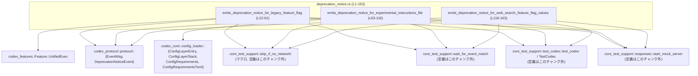
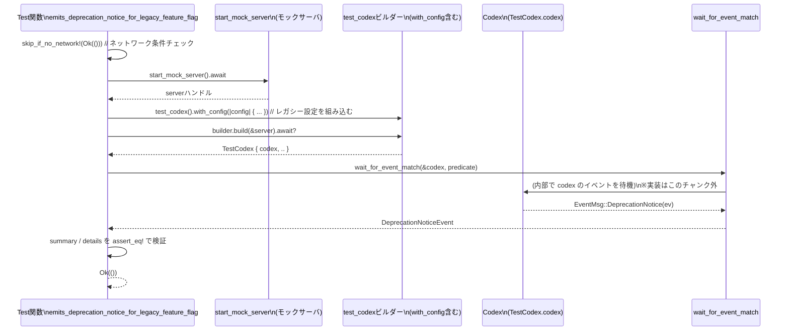

# core/tests/suite/deprecation_notice.rs コード解説

## 0. ざっくり一言

`DeprecationNoticeEvent` が正しく発火するかどうかを検証する **非 Windows 環境向けの非同期テスト集** です。  
レガシーなフラグ／設定キーを使ったときに、期待どおりの非推奨メッセージが届くかを確認します。

---

## 1. このモジュールの役割

### 1.1 概要

このモジュールは、Codex の設定にレガシーな項目が含まれる場合に

- `EventMsg::DeprecationNotice(DeprecationNoticeEvent)` が発行されること
- その `summary` と `details` が期待する文言になっていること

を検証するテストを提供します（`deprecation_notice.rs:L22-163`）。

検証対象のレガシー項目は次の 3 つです。

1. レガシーな機能フラグ `use_experimental_unified_exec_tool`（`[features]` セクション）
2. レガシーな設定キー `experimental_instructions_file`
3. レガシーな機能フラグ `web_search_request`（`[features]` セクション、true/false 両方）

### 1.2 アーキテクチャ内での位置づけ

このテストモジュールは、テスト用ヘルパ（`core_test_support`）と設定ローダ（`codex_core::config_loader`）、プロトコル型（`codex_protocol`）を組み合わせて動作します。



※ 他モジュール（`core_test_support`, `codex_core`, `codex_protocol` など）の実体定義はこのチャンクには含まれていません。

### 1.3 設計上のポイント

- **テスト専用モジュール**
  - `#[tokio::test]` 属性付きの非同期関数のみを提供し、公開 API は定義していません（`deprecation_notice.rs:L22,63,118`）。
- **条件付きコンパイル**
  - `#![cfg(not(target_os = "windows"))]` により、Windows 以外の環境でのみコンパイル・実行されます（`deprecation_notice.rs:L1`）。
- **非同期・並行性**
  - すべてのテストは `tokio` の `multi_thread` ランタイム（`worker_threads = 2`）上で実行されます（`deprecation_notice.rs:L22,63,118`）。
- **エラーハンドリング**
  - 戻り値は `anyhow::Result<()>` で、`builder.build(&server).await?` などで発生したエラーを `?` で呼び出し元（テストランナー）に伝播します（例: `deprecation_notice.rs:L40,90,136`）。
  - 設定更新は `expect("...")` で検証し、失敗時はテストが panic します（`deprecation_notice.rs:L36,86,133`）。
- **ネットワーク依存テストのスキップ**
  - 冒頭で `skip_if_no_network!(Ok(()));` を呼び出しており（`deprecation_notice.rs:L24,65,120`）、ネットワーク条件に応じてテスト挙動が変わる可能性がありますが、マクロの中身はこのチャンクには現れません。

---

## 2. 主要な機能一覧（コンポーネントインベントリー）

### 2.1 ローカル関数・テスト一覧

| 名前 | 種別 | 役割 / 用途 | 定義位置 |
|------|------|------------|----------|
| `emits_deprecation_notice_for_legacy_feature_flag` | 非公開 async 関数（`#[tokio::test]`） | レガシー機能フラグ `use_experimental_unified_exec_tool` 使用時に、対応する `DeprecationNoticeEvent` が発行されることを検証します。 | `deprecation_notice.rs:L22-61` |
| `emits_deprecation_notice_for_experimental_instructions_file` | 非公開 async 関数（`#[tokio::test]`） | レガシー設定キー `experimental_instructions_file` 使用時の非推奨通知とメッセージ内容を検証します。 | `deprecation_notice.rs:L63-116` |
| `emits_deprecation_notice_for_web_search_feature_flag_values` | 非公開 async 関数（`#[tokio::test]`） | レガシー機能フラグ `[features].web_search_request` が true/false いずれの場合も非推奨通知が出ることを検証します。 | `deprecation_notice.rs:L118-163` |

※ このファイル内に構造体や列挙体の定義はありません。

### 2.2 機能概要（箇条書き）

- レガシー UnifiedExec フラグの非推奨通知検証（`deprecation_notice.rs:L22-61`）
- レガシー `experimental_instructions_file` 設定の非推奨通知検証（`deprecation_notice.rs:L63-116`）
- レガシー `web_search_request` 機能フラグ（true/false 両方）の非推奨通知検証（`deprecation_notice.rs:L118-163`）

---

## 3. 公開 API と詳細解説

このファイルの関数はすべてテスト用の非公開関数ですが、モジュールの利用方法を理解するために、テスト関数を「公開インターフェース」とみなして解説します。

### 3.1 型一覧（このモジュールで利用している主な型）

| 名前 | 種別 | 役割 / 用途 | このチャンクでの根拠 |
|------|------|-------------|----------------------|
| `TestCodex` | 構造体 | `builder.build(&server).await?` の戻り値であり、`codex` フィールドを持つテスト用ラッパーです。Codex インスタンスへのアクセサを提供します。 | パターンマッチ `let TestCodex { codex, .. } = ...;`（`deprecation_notice.rs:L40,90,136`） |
| `ConfigLayerEntry` | 構造体 | 設定レイヤー（ソースと TOML 値）を表していると解釈できます。ここでは `experimental_instructions_file` を含むユーザー設定レイヤーを構築するのに利用されます。 | `ConfigLayerEntry::new(...)` 呼び出し（`deprecation_notice.rs:L75-80`） |
| `ConfigLayerStack` | 構造体 | 複数の `ConfigLayerEntry` と設定要件をまとめたコンフィグスタックです。テストでは 1 つのレイヤーからスタックを構築しています。 | `ConfigLayerStack::new(vec![config_layer], ...)`（`deprecation_notice.rs:L81-86`） |
| `ConfigLayerSource` | 列挙体 | 設定レイヤーのソースを表す型です。ここではユーザーの `config.toml` を表す `User { file: ... }` バリアントのみを使用します。 | `ConfigLayerSource::User { file: ... }`（`deprecation_notice.rs:L76-78`） |
| `ConfigRequirements` | 構造体（推定） | 設定に必要な要件をまとめる型と解釈できます。ここでは `default()` で初期化されますが、詳細はこのチャンクには現れません。 | `ConfigRequirements::default()`（`deprecation_notice.rs:L83`） |
| `ConfigRequirementsToml` | 構造体（推定） | TOML 形式の要求仕様を表す型と解釈できます。`default()` で初期化されています。 | `ConfigRequirementsToml::default()`（`deprecation_notice.rs:L84`） |
| `Feature` | 列挙体 | 機能フラグを表す型です。ここでは `Feature::UnifiedExec` を参照し、機能の有効化やレガシー使用記録に使います。 | `Feature::UnifiedExec`（`deprecation_notice.rs:L30,32`） |
| `DeprecationNoticeEvent` | 構造体 | `summary` と `details` フィールドを持つ非推奨通知イベントです。`EventMsg::DeprecationNotice` のペイロードとして使われます。 | 構造体パターン `let DeprecationNoticeEvent { summary, details } = notice;`（`deprecation_notice.rs:L48,102,148`） |
| `EventMsg` | 列挙体 | イベント種別を表す列挙体で、その 1 つが `DeprecationNotice` です。 | パターンマッチ `EventMsg::DeprecationNotice(ev)`（`deprecation_notice.rs:L43,93,139`） |
| `BTreeMap` | 構造体 | `web_search_request` のような設定キー→値のマップを構築するために使います。 | `let mut entries = BTreeMap::new();`（`deprecation_notice.rs:L126`） |
| `TomlValue` (`toml::Value`) | 列挙体 | TOML 設定値を表す型で、ここでは `String` や `Table` として使用します。 | `TomlValue::String("legacy.md".to_string())` など（`deprecation_notice.rs:L73,79`） |

※ これらの型の正確なフィールド構成・内部ロジックは、このチャンクには含まれていません。

### 3.2 関数詳細（テスト 3 件）

#### `emits_deprecation_notice_for_legacy_feature_flag() -> anyhow::Result<()>`

**概要**

レガシー機能フラグ `[features].use_experimental_unified_exec_tool` を設定した状態で Codex を起動し、その結果として送出される `DeprecationNoticeEvent` の `summary` と `details` が期待どおりであることを検証します（`deprecation_notice.rs:L22-61`）。

**引数**

この関数は引数を取りません。`#[tokio::test]` によりテストランナーから直接呼び出されます（`deprecation_notice.rs:L22-23`）。

**戻り値**

- 型: `anyhow::Result<()>`（`deprecation_notice.rs:L23`）
  - 正常時: `Ok(())` を返します（`deprecation_notice.rs:L60`）。
  - 異常時: `anyhow::Error` を内包した `Err` を返し、テストは失敗とみなされます。

**内部処理の流れ**

1. ネットワーク環境チェック  
   `skip_if_no_network!(Ok(()));` を実行します（`deprecation_notice.rs:L24`）。  
   - このマクロ内部の挙動はこのチャンクには現れませんが、引数として `Ok(())` を渡しているため、テストの戻り値と型は揃っています。

2. モックサーバの起動  
   `let server = start_mock_server().await;` でテスト用のモックサーバを非同期に起動します（`deprecation_notice.rs:L26`）。

3. Codex 用ビルダーの構成  

   ```rust
   let mut builder = test_codex().with_config(|config| { ... });
   ```  

   という形で、設定を書き換えるクロージャを渡します（`deprecation_notice.rs:L28-38`）。
   - `config.features.get().clone()` で現行の機能フラグ設定を取得・複製。
   - `features.enable(Feature::UnifiedExec);` で新しい `UnifiedExec` 機能を有効化（`deprecation_notice.rs:L30`）。
   - `features.record_legacy_usage_force("use_experimental_unified_exec_tool", Feature::UnifiedExec);` で、レガシーなフラグを使ったことを明示的に記録（`deprecation_notice.rs:L31-32`）。
   - `config.features.set(features).expect("...");` で更新を反映し、失敗時には panic（`deprecation_notice.rs:L33-36`）。
   - レガシーなブールフラグ `config.use_experimental_unified_exec_tool = true;` を直接設定（`deprecation_notice.rs:L37`）。

4. Codex インスタンスの構築  

   ```rust
   let TestCodex { codex, .. } = builder.build(&server).await?;
   ```  

   により、ビルダーから `TestCodex` を生成し、その中の `codex` フィールドを取り出します（`deprecation_notice.rs:L40`）。  
   - `build` が返すエラーは `?` で `anyhow::Error` として伝播します。

5. 非推奨通知イベントの待機  

   ```rust
   let notice = wait_for_event_match(&codex, |event| match event {
       EventMsg::DeprecationNotice(ev) => Some(ev.clone()),
       _ => None,
   }).await;
   ```  

   で `DeprecationNoticeEvent` を受信するまで待機します（`deprecation_notice.rs:L42-46`）。  
   - `wait_for_event_match` の詳細実装は不明ですが、クロージャの `Some(ev.clone())` が返されているため、`notice` の型は `DeprecationNoticeEvent` であることがわかります（`deprecation_notice.rs:L48`）。

6. メッセージ内容の検証  
   - `let DeprecationNoticeEvent { summary, details } = notice;` でフィールドを分解（`deprecation_notice.rs:L48`）。
   - `assert_eq!(summary, "...".to_string());` でサマリ文字列の完全一致を検証（`deprecation_notice.rs:L49-52`）。
   - `assert_eq!(details.as_deref(), Some("..."));` で詳細メッセージが `Some(&str)` として一致することを検証（`deprecation_notice.rs:L53-58`）。

7. 正常終了  
   最後に `Ok(())` を返してテストを成功とします（`deprecation_notice.rs:L60`）。

**Examples（使用例）**

この関数自体はテストランナーから自動で呼び出されますが、同じパターンで別のレガシー設定を検証するテストの例は次のようになります：

```rust
#[tokio::test(flavor = "multi_thread", worker_threads = 2)] // 非同期テストの宣言
async fn emits_deprecation_notice_for_some_legacy_setting() -> anyhow::Result<()> {
    skip_if_no_network!(Ok(()));                         // ネットワーク条件に応じたスキップ

    let server = start_mock_server().await;              // モックサーバ起動

    // Codex 構成: レガシー設定を仕込む
    let mut builder = test_codex().with_config(|config| {
        // 例: レガシーな設定フラグを true にする（仮の設定名）
        config.some_legacy_flag = true;
    });

    let TestCodex { codex, .. } = builder.build(&server).await?; // Codex 起動

    // 対象の DeprecationNoticeEvent を待機
    let notice = wait_for_event_match(&codex, |event| match event {
        EventMsg::DeprecationNotice(ev)
            if ev.summary.contains("some_legacy_flag") => Some(ev.clone()),
        _ => None,
    }).await;

    let DeprecationNoticeEvent { summary, details } = notice;
    assert_eq!(summary, "`some_legacy_flag` is deprecated.".to_string());
    assert!(details.is_some());

    Ok(())                                                // テスト成功
}
```

**Errors / Panics**

- `builder.build(&server).await?`  
  - ここで発生したエラーは `?` により `anyhow::Error` として呼び出し元（テストランナー）に伝播します（`deprecation_notice.rs:L40`）。  
  - どの条件でエラーになるかは、このチャンクには現れません。
- `config.features.set(features).expect("...")`  
  - 設定の更新に失敗した場合、`expect` により panic します（`deprecation_notice.rs:L33-36`）。
- `wait_for_event_match(...).await`  
  - ここでのエラーやタイムアウトがどう扱われるかは、このチャンクからは分かりません。戻り値は直接 `notice` に束縛されているため、少なくとも `DeprecationNoticeEvent` を返すパスが存在します（`deprecation_notice.rs:L42-48`）。

**Edge cases（エッジケース）**

- ネットワークが利用できない場合  
  - `skip_if_no_network!(Ok(()));` の挙動が鍵ですが、具体的な挙動（スキップ・即時 OK 等）は不明です（`deprecation_notice.rs:L24`）。
- Deprecation イベントが発行されない場合  
  - `wait_for_event_match` がどう振る舞うか（タイムアウトか、ブロックし続けるか）はこのチャンクには現れません。
- `details` が `None` の場合  
  - `details.as_deref()` と `Some(&str)` を比較しているため（`deprecation_notice.rs:L53-58`）、`None` だった場合は `assert_eq!` が失敗しテストが落ちます。

**使用上の注意点**

- このテストはメッセージの文言を **完全一致** でチェックしているため（`assert_eq!`）、メッセージのテキストを変更するとテストも更新する必要があります（`deprecation_notice.rs:L49-52`）。
- 機能フラグの操作は `config.features.get().clone()` → `enable` / `record_legacy_usage_force` → `set` というパターンで行われています（`deprecation_notice.rs:L29-36`）。同様の操作を行う際はこの順序に従うと一貫性があります。
- 非同期テストであるため、テスト内でブロッキング I/O を直接使用すると、Tokio ランタイムのスレッドをブロックする可能性があります。

---

#### `emits_deprecation_notice_for_experimental_instructions_file() -> anyhow::Result<()>`

**概要**

ユーザー設定レイヤーにレガシーなキー `experimental_instructions_file` を含めた場合に、該当する非推奨通知とメッセージが生成されることを検証します（`deprecation_notice.rs:L63-116`）。

**引数**

引数はありません（`deprecation_notice.rs:L63-64`）。

**戻り値**

- `anyhow::Result<()>`（`deprecation_notice.rs:L64`）

**内部処理の流れ**

1. ネットワークチェック（`skip_if_no_network!` 呼び出し、`deprecation_notice.rs:L65`）。
2. モックサーバ起動（`start_mock_server().await`、`deprecation_notice.rs:L67`）。
3. `with_config` クロージャ内で TOML テーブルを構築（`deprecation_notice.rs:L69-74`）。
   - `experimental_instructions_file = "legacy.md"` を設定。
4. `ConfigLayerEntry::new(...)` でユーザー設定レイヤーを生成（`deprecation_notice.rs:L75-80`）。
5. `ConfigLayerStack::new(...)` でスタックを構築し、`config.config_layer_stack` に代入（`deprecation_notice.rs:L81-88`）。
   - `.expect("build config layer stack")` により、構築失敗時は panic。
6. `builder.build(&server).await?` で Codex を起動し、`TestCodex { codex, .. }` を取得（`deprecation_notice.rs:L90`）。
7. `wait_for_event_match` で `summary` に `"experimental_instructions_file"` を含む `DeprecationNoticeEvent` を待機（`deprecation_notice.rs:L92-100`）。
8. `summary` / `details` が期待する文字列と一致することを `assert_eq!` で検証（`deprecation_notice.rs:L102-113`）。
9. `Ok(())` で終了（`deprecation_notice.rs:L115`）。

**Errors / Panics**

- `ConfigLayerStack::new(...).expect("build config layer stack")`  
  - スタック構築に失敗すると panic（`deprecation_notice.rs:L81-86`）。
- `builder.build(&server).await?` のエラーは `anyhow::Error` として伝播（`deprecation_notice.rs:L90`）。

**Edge cases / 注意点**

- サマリのフィルタ条件は `ev.summary.contains("experimental_instructions_file")` で部分一致検索を行っています（`deprecation_notice.rs:L93-95`）。
  - 完全一致ではないため、サマリ文言の前後に多少の変更があってもこのテストは通る可能性があります。
- `details` は `Some("...")` であることを要求しており、`None` だとテスト失敗になります（`deprecation_notice.rs:L108-112`）。

---

#### `emits_deprecation_notice_for_web_search_feature_flag_values() -> anyhow::Result<()>`

**概要**

レガシー機能フラグ `[features].web_search_request` が `true` / `false` いずれの場合でも、同じ非推奨通知が発行されることを検証します（`deprecation_notice.rs:L118-163`）。

**引数**

引数はありません（`deprecation_notice.rs:L118-119`）。

**戻り値**

- `anyhow::Result<()>`（`deprecation_notice.rs:L119`）

**内部処理の流れ**

1. ネットワークチェック（`skip_if_no_network!(Ok(()))`、`deprecation_notice.rs:L120`）。
2. `for enabled in [true, false] { ... }` で 2 パターン（true と false）を順番に検証（`deprecation_notice.rs:L122-160`）。
3. 各ループ内でモックサーバを起動（`start_mock_server().await`、`deprecation_notice.rs:L123`）。
4. `with_config(move |config| { ... })` により、`enabled` をクロージャにムーブして設定を書き換え（`deprecation_notice.rs:L125`）。
   - `BTreeMap<String, bool>` を作成し、`"web_search_request" => enabled` を挿入（`deprecation_notice.rs:L126-127`）。
   - `features.apply_map(&entries);` で機能フラグ群に適用（`deprecation_notice.rs:L128-129`）。
   - `config.features.set(features).expect("...");` で反映（`deprecation_notice.rs:L130-133`）。
5. `builder.build(&server).await?` で `TestCodex { codex, .. }` を取得（`deprecation_notice.rs:L136`）。
6. `wait_for_event_match` で `summary` に `"[features].web_search_request"` を含む非推奨通知を待機（`deprecation_notice.rs:L138-146`）。
7. サマリ／詳細を `assert_eq!` で検証（`deprecation_notice.rs:L148-159`）。
8. ループ完了後に `Ok(())` でテスト成功（`deprecation_notice.rs:L162`）。

**Errors / Panics**

- 設定更新の `config.features.set(features).expect("...")` が失敗した場合に panic（`deprecation_notice.rs:L130-133`）。
- `builder.build(&server).await?` でのエラーは `anyhow::Error` として伝播（`deprecation_notice.rs:L136`）。

**Edge cases / 注意点**

- `enabled` が `true` / `false` 以外になることはありません（固定配列 `[true, false]`、`deprecation_notice.rs:L122`）。
- サマリのフィルタは `ev.summary.contains("[features].web_search_request")` で部分一致です（`deprecation_notice.rs:L139-140`）。
- Web 検索がデフォルトで有効であることを前提にしたメッセージであり、構成の方針が変わるとテストも更新が必要になります（`deprecation_notice.rs:L151-157`）。

---

### 3.3 その他の関数・マクロの利用

ローカルに定義された補助関数はありませんが、以下の外部関数／マクロが重要です。

| 名称 | 種別 | 役割（1 行） | 利用箇所 |
|------|------|--------------|----------|
| `skip_if_no_network!` | マクロ | ネットワークがない環境でテストをスキップする、もしくはそのような制御を行うと推測されるマクロ。実装はこのチャンクにありません。 | `deprecation_notice.rs:L24,65,120` |
| `start_mock_server` | async 関数 | テスト用のモックサーバを起動し、そのハンドル（型不明）を返します。 | `deprecation_notice.rs:L26,67,123` |
| `test_codex` | 関数 | `TestCodex` を構築するためのビルダーを返します。 | `deprecation_notice.rs:L28,69,125` |
| `wait_for_event_match` | async 関数 | Codex からのイベントを監視し、与えたクロージャが `Some` を返す最初のイベントを返します。 | `deprecation_notice.rs:L42-46,92-100,138-146` |

※ これらの挙動は、名称と呼び出し方からの推測を含みます。実装詳細はこのチャンクには現れません。

---

## 4. データフロー

ここでは 1 つ目のテスト `emits_deprecation_notice_for_legacy_feature_flag` における典型的なデータフローを整理します。

### 4.1 処理の要点

- テスト関数は、まずネットワーク環境を確認し、モックサーバを起動します（`deprecation_notice.rs:L24-26`）。
- `test_codex().with_config(...)` でレガシー設定を含むコンフィグを構築し、`builder.build` で Codex インスタンスを起動します（`deprecation_notice.rs:L28-40`）。
- Codex 内部でレガシー設定が検出されると `EventMsg::DeprecationNotice` が発行され、`wait_for_event_match` がそれを受け取ります（`deprecation_notice.rs:L42-48`）。
- テストは受け取った `DeprecationNoticeEvent` の内容を検証します（`deprecation_notice.rs:L48-58`）。

### 4.2 シーケンス図



※ Codex 内部でのイベント発行の詳細はこのチャンクには含まれていませんが、`EventMsg::DeprecationNotice` がパターンマッチされていることから、少なくともそのようなイベントが送出されていることが分かります（`deprecation_notice.rs:L42-44`）。

---

## 5. 使い方（How to Use）

このファイルはテスト用モジュールのため、直接利用するというよりは「同様のテストを書く／既存テストを理解する」ためのガイドとします。

### 5.1 基本的な使用方法（テストパターン）

新しいレガシー設定に対して非推奨通知を検証する場合、以下のような流れになります。

```rust
#[tokio::test(flavor = "multi_thread", worker_threads = 2)] // Tokio マルチスレッドランタイムでのテスト
async fn emits_deprecation_notice_for_new_legacy_setting() -> anyhow::Result<()> {
    skip_if_no_network!(Ok(()));                         // ネットワーク依存テストの事前チェック

    let server = start_mock_server().await;              // モックサーバ起動

    // 1. config を変更するクロージャを with_config に渡す
    let mut builder = test_codex().with_config(|config| {
        // レガシーな設定をここで仕込む
        config.some_legacy_setting = true;               // 例: 新しいレガシー設定
    });

    // 2. Codex を起動
    let TestCodex { codex, .. } = builder.build(&server).await?;

    // 3. DeprecationNoticeEvent を待ち受け
    let notice = wait_for_event_match(&codex, |event| match event {
        EventMsg::DeprecationNotice(ev)
            if ev.summary.contains("some_legacy_setting") => Some(ev.clone()),
        _ => None,
    }).await;

    // 4. メッセージ内容の検証
    let DeprecationNoticeEvent { summary, details } = notice;
    assert!(summary.contains("some_legacy_setting"));
    assert!(details.is_some());

    Ok(())                                              // テスト成功
}
```

### 5.2 よくある使用パターン

このモジュールでは次の 2 パターンが見られます。

1. **サマリ文字列の完全一致検証**（`assert_eq!(summary, "...".to_string())`）  
   - レガシー UnifiedExec フラグ、`experimental_instructions_file`、`web_search_request` のテストが該当します（`deprecation_notice.rs:L49-52,103-107,149-152`）。
2. **サマリに含まれる文字列でイベントをフィルタ**（`ev.summary.contains("...")`）  
   - 特定のレガシーキーに関するイベントだけを `wait_for_event_match` で拾うために利用されています（`deprecation_notice.rs:L93-95,139-140`）。

新たなテストを書く場合も、この 2 パターンを組み合わせることで、目的のイベントだけを受け取りつつメッセージを厳密に検証できます。

### 5.3 よくある間違いとこのモジュールの書き方

このモジュールでは、以下のような点に注意して書かれています。

```rust
// このモジュールの書き方（部分一致でイベントを選び、完全一致でメッセージ検証）
let notice = wait_for_event_match(&codex, |event| match event {
    EventMsg::DeprecationNotice(ev)
        if ev.summary.contains("experimental_instructions_file") => Some(ev.clone()),
    _ => None,
}).await;

assert_eq!(
    summary,
    "`experimental_instructions_file` is deprecated and ignored. Use `model_instructions_file` instead.".to_string(),
);
```

- イベントのフィルタは `contains`（部分一致）で行い、  
  検証は `assert_eq!`（完全一致）で行うことで、
  - 不要なイベントを捉えない
  - かつメッセージの文言が意図せず変わっていないことを保証  
  という両方の目的を満たしています。

別の書き方として、イベントフィルタも完全一致にすると、メッセージ変更の影響がフィルタ条件とアサーションの両方に及ぶため、保守性が低下する可能性があります。

### 5.4 使用上の注意点（まとめ）

- **ターゲット OS**  
  - 冒頭の `#![cfg(not(target_os = "windows"))]` により、Windows ではこのモジュール全体がコンパイル対象から外れます（`deprecation_notice.rs:L1`）。
- **非同期・並行性**  
  - `#[tokio::test(flavor = "multi_thread", worker_threads = 2)]` により、各テストは 2 スレッドのマルチスレッドランタイム上で実行されます（`deprecation_notice.rs:L22,63,118`）。  
    テスト内でブロッキング I/O を行う場合は、`spawn_blocking` 等の利用が望ましいです（一般的な Rust/Tokio の注意点）。
- **エラーハンドリング**  
  - `anyhow::Result<()>` を返すことで、内部のエラーをそのまま `?` で伝播しています（`deprecation_notice.rs:L23,64,119`）。  
    追加のテストを書く場合もこのパターンに揃えると一貫性があります。
- **設定変更の API**  
  - 機能フラグの操作は `config.features.get()` → mutate → `config.features.set(...)` という形で行われています（`deprecation_notice.rs:L29-36,128-133`）。
  - TOML 設定は `ConfigLayerEntry` と `ConfigLayerStack` を通じて組み立てています（`deprecation_notice.rs:L75-88`）。  
    直接フィールドを書き換えるより、このパターンに従うと設定ローダのロジックと整合性が取れます。

---

## 6. 変更の仕方（How to Modify）

### 6.1 新しい機能（新しい非推奨通知の検証）を追加する場合

1. **新しいテスト関数の追加**
   - 本ファイルに `#[tokio::test(flavor = "multi_thread", worker_threads = 2)]` を付けた async 関数を追加します。
2. **レガシー設定の注入**
   - `test_codex().with_config(|config| { ... })` の中で、新しいレガシー設定を反映します。
     - 機能フラグであれば `config.features` 系の API を利用（`deprecation_notice.rs:L29-36,126-133`）。
     - TOML 設定であれば `ConfigLayerEntry` / `ConfigLayerStack` を構築（`deprecation_notice.rs:L69-88`）。
3. **Codex の起動**
   - `builder.build(&server).await?` で `TestCodex { codex, .. }` を取得します（`deprecation_notice.rs:L40,90,136`）。
4. **イベント待機とフィルタ**
   - `wait_for_event_match(&codex, |event| match event { ... })` で `EventMsg::DeprecationNotice` に対するフィルタ条件を記述します（`deprecation_notice.rs:L42-46,92-100,138-146`）。
5. **メッセージ検証**
   - `DeprecationNoticeEvent { summary, details }` を分解し、`assert_eq!` や `contains` などで内容を検証します。

### 6.2 既存の機能（テスト）を変更する場合の注意点

- **メッセージ文言が変わる場合**
  - 本ファイルはメッセージを文字列リテラルでチェックしているため（`deprecation_notice.rs:L49-52,103-107,149-152`）、仕様に沿った変更であればテスト側の文字列も合わせて更新する必要があります。
- **Config API の変更**
  - `config.features` の API や `ConfigLayerStack::new` のシグネチャが変更された場合、それらを呼び出している行（`deprecation_notice.rs:L29-36,69-88,126-133`）の影響範囲を確認する必要があります。
- **テスト条件の追加・変更**
  - `wait_for_event_match` のフィルタ条件（`contains` の対象文字列など）を変更すると、どのイベントを拾うかが変わるため、他のテストと競合しないか、イベントが複数送られるケースで問題がないかに注意する必要があります。

---

## 7. 関連ファイル・モジュール

このチャンクから得られる範囲で、関連するモジュールを一覧にします（実際のファイルパスはこのチャンクには現れません）。

| モジュール / パス | 役割 / 関係 |
|-------------------|------------|
| `core_test_support::test_codex::{test_codex, TestCodex}` | Codex をテスト用に起動するためのビルダーとラッパーを提供します（`deprecation_notice.rs:L15-16,28,40,69,90,125,136`）。 |
| `core_test_support::responses::start_mock_server` | テスト用のモックサーバを起動し、Codex が接続するサーバとして利用されます（`deprecation_notice.rs:L12,26,67,123`）。 |
| `core_test_support::wait_for_event_match` | Codex が発行する `EventMsg` を監視し、特定条件を満たすイベントを待ち受けるユーティリティです（`deprecation_notice.rs:L17,42-46,92-100,138-146`）。 |
| `core_test_support::skip_if_no_network` | ネットワーク環境がない場合にテストの挙動を制御するマクロを提供します（`deprecation_notice.rs:L13,24,65,120`）。 |
| `codex_core::config_loader::{ConfigLayerEntry, ConfigLayerStack, ConfigRequirements, ConfigRequirementsToml}` | TOML ベースの設定レイヤーや設定要件を表す型群で、レガシーな設定キーを含むコンフィグを構築するのに利用されます（`deprecation_notice.rs:L5-8,75-88`）。 |
| `codex_app_server_protocol::ConfigLayerSource` | 設定レイヤーのソース（ユーザーファイル等）を表す型で、本モジュールでは `User { file }` しか利用していません（`deprecation_notice.rs:L4,76-78`）。 |
| `codex_features::Feature` | 機能フラグ列挙体で、UnifiedExec や Web 検索に関する設定を表現します（`deprecation_notice.rs:L9,30,32`）。 |
| `codex_protocol::protocol::{EventMsg, DeprecationNoticeEvent}` | イベント種別と非推奨通知のペイロードを表現するプロトコル型です（`deprecation_notice.rs:L10-11,42-44,92-95,138-141,48,102,148`）。 |

このチャンクにはこれらモジュールの定義は含まれていないため、内部実装の詳細は不明ですが、テストコードからインターフェースとデータフローを把握できます。
