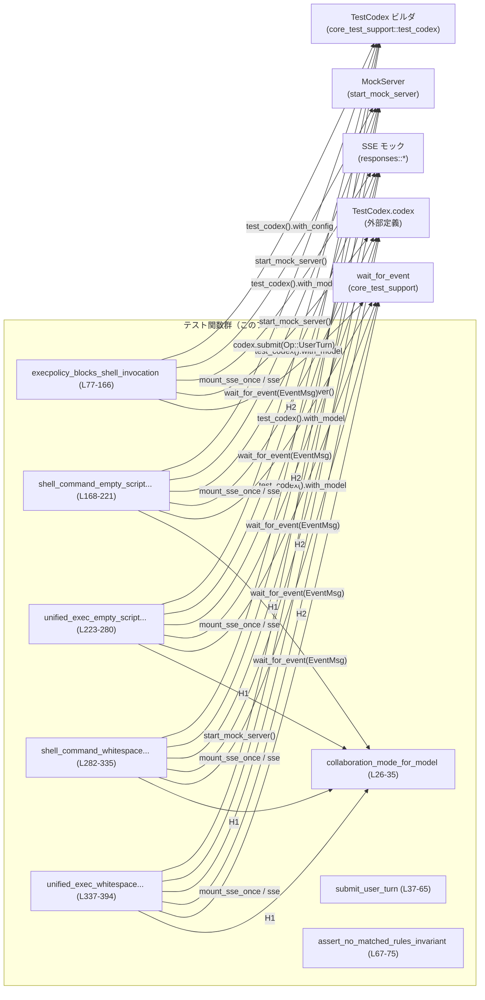
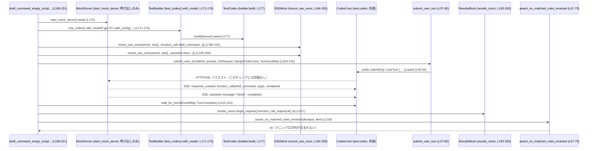

# core/tests/suite/exec_policy.rs

## 0. ざっくり一言

Codex の「実行ポリシー（exec policy）」と「協調モード（collaboration mode）」まわりの挙動を統合テストするモジュールです。  
シェル実行がポリシーでブロックされることと、空／空白だけのスクリプトでもパニックせず安全に処理されることを検証しています。

---

## 1. このモジュールの役割

### 1.1 概要

このモジュールは、次のような問題に対する回帰テストとして機能します。

- **問題 1**: exec policy で禁止されたコマンド（例: `echo` で始まるコマンド）が、正しくブロックされ、ユーザ向け出力にその旨が反映されるか（`execpolicy_blocks_shell_invocation`、`core/tests/suite/exec_policy.rs:L77-166`）。
- **問題 2**: 協調モード（CollaborationModes）と UnifiedExec 機能の有無にかかわらず、
  - 空文字列のスクリプト（`""`）
  - 空白のみのスクリプト（`"  \n\t  "` など）  
  を実行しようとした場合に、内部 invariant パニックメッセージ（`"invariant failed: matched_rules must be non-empty"`）がユーザ向けの JSON 出力に出てこないことを確認する（`core/tests/suite/exec_policy.rs:L168-221, L223-280, L282-335, L337-394`）。

これらはすべて、モックサーバと SSE（Server-Sent Events）を使った非同期テストとして実装されています。

### 1.2 アーキテクチャ内での位置づけ

このファイルは「テスト層」に属し、以下のコンポーネントに依存しています。

- `core_test_support`  
  - `test_codex::test_codex` で Codex のテスト用ビルダを生成（`L20`）。
  - `responses::*` で SSE イベント（レスポンス作成、function_call、assistant メッセージなど）のモックを構築（`L13-19`）。
  - `start_mock_server` でモック HTTP/SSE サーバを起動（`L19`）。
  - `wait_for_event` で `EventMsg` ストリームから条件に一致するイベントを待機（`L21, L146-156, L212-215` など）。
- `codex_protocol`  
  - `Op::UserTurn` などのプロトコル型（`L10, L46-62, L127-143`）。
  - `AskForApproval`, `SandboxPolicy`, `EventMsg`（`L8-11, L146-156`）。
  - 設定系型 `CollaborationMode`, `ModeKind`, `Settings`（`L5-7, L26-35`）。
- `codex_features::Feature`  
  - UnifiedExec や CollaborationModes 機能フラグを有効化（`L171-175, L227-235, L285-289, L341-348`）。

代表的な呼び出し関係は次のとおりです。



※ `Ext*` ノードは、このチャンクには定義がなく、外部クレート／モジュールで定義されています。

### 1.3 設計上のポイント

- **テスト用ヘルパの抽出**  
  - 協調モードの構築ロジックを `collaboration_mode_for_model` に集約（`L26-35`）。
  - ユーザターン送信を `submit_user_turn` に抽象化し、複数テストで共有（`L37-65, L203-210, L262-269, L317-324, L376-383`）。
- **JSON ベースの出力検証**  
  - `serde_json::Value` 経由で function_call の出力を取り出し、特定の substring が含まれないことをチェック（`assert_no_matched_rules_invariant`, `L67-75, L217-218, L276-277, L331-332, L390-391`）。
- **非同期・並行テスト**  
  - すべてのテストは `#[tokio::test]` で非同期に実行（`L77, L168, L223, L282, L337`）。
  - 協調モード系テストは `flavor = "multi_thread", worker_threads = 2` でマルチスレッドランタイムを使用し、並行実行環境を近似（`L168, L223, L282, L337`）。
- **安全性・エラー処理の方針**  
  - テストコードなので Clippy の `unwrap_used` / `expect_used` 警告を抑制（`L1`）。
  - 実際のエラーは `anyhow::Result` と `?` 演算子で呼び出し元（テスト関数）に伝播（`L37-65` など）。
  - 期待された前提が崩れた場合（出力に `output` 文字列がない、など）は明示的に `panic!` / `expect` を使ってテスト失敗とする（`L69-70, L84-97, L171-176` など）。

---

## 2. 主要な機能一覧

- exec ポリシーによるシェルコマンドのブロックを検証する統合テスト。
- 協調モード＋シェルコマンド（空／空白スクリプト）がパニックせず処理されることを検証する統合テスト。
- 協調モード＋UnifiedExec（空／空白スクリプト）がパニックせず処理されることを検証する統合テスト。
- 協調モード設定を組み立てるヘルパ関数。
- ユーザターンを送信する非同期ヘルパ関数。
- function_call の JSON 出力が内部 invariant パニックメッセージを含まないことを検証するヘルパ関数。

### 2.1 コンポーネントインベントリー（関数・構造体）

このチャンクに定義されている関数・型の一覧です。

| 名前 | 種別 | 役割 / 用途 | 定義位置 |
|------|------|-------------|----------|
| `collaboration_mode_for_model` | 関数 | 引数のモデル名から `CollaborationMode` を組み立てるヘルパ | `core/tests/suite/exec_policy.rs:L26-35` |
| `submit_user_turn` | 非同期関数 | `TestCodex` を使って `Op::UserTurn` を送信する共通ヘルパ | `core/tests/suite/exec_policy.rs:L37-65` |
| `assert_no_matched_rules_invariant` | 関数 | JSON 出力中に特定の invariant パニックメッセージが含まれないことをアサート | `core/tests/suite/exec_policy.rs:L67-75` |
| `execpolicy_blocks_shell_invocation` | 非同期テスト関数 | `echo` で始まるシェルコマンドがポリシーでブロックされることを検証 | `core/tests/suite/exec_policy.rs:L77-166` |
| `shell_command_empty_script_with_collaboration_mode_does_not_panic` | 非同期テスト関数 | 協調モード＋空シェルスクリプトでパニックが出力されないことを検証 | `core/tests/suite/exec_policy.rs:L168-221` |
| `unified_exec_empty_script_with_collaboration_mode_does_not_panic` | 非同期テスト関数 | 協調モード＋UnifiedExec＋空コマンドでパニックが出力されないことを検証 | `core/tests/suite/exec_policy.rs:L223-280` |
| `shell_command_whitespace_script_with_collaboration_mode_does_not_panic` | 非同期テスト関数 | 協調モード＋空白のみシェルスクリプトでパニックが出力されないことを検証 | `core/tests/suite/exec_policy.rs:L282-335` |
| `unified_exec_whitespace_script_with_collaboration_mode_does_not_panic` | 非同期テスト関数 | 協調モード＋UnifiedExec＋空白のみコマンドでパニックが出力されないことを検証 | `core/tests/suite/exec_policy.rs:L337-394` |

※ このファイル内で新たな構造体・列挙体などの型定義はありません。

---

## 3. 公開 API と詳細解説

このファイルはテスト用モジュールのため、「外部クレートから利用される API」という意味での公開関数はありませんが、テスト群にとって再利用されるヘルパ関数を中心に解説します。

### 3.1 型一覧（構造体・列挙体など）

このファイル内で定義される新規の型はありません。  
利用している主な外部型のみ列挙します（定義は他ファイル／クレートにあります）。

| 名前 | 種別 | 役割 / 用途 | 参照位置 |
|------|------|-------------|----------|
| `CollaborationMode` | 構造体 | 協調モードの設定を表現 | `L5, L26-35, L42, L60, L202, L261, L316, L375` |
| `ModeKind` | 列挙体 | 協調モードの種類（ここでは `Default`） | `L6, L28` |
| `Settings` | 構造体 | モデル名・推論の努力度・開発者向け指示などの設定 | `L7, L29-33` |
| `AskForApproval` | 列挙体 | 実行前の承認ポリシー（`Never`, `OnRequest` など） | `L8, L40, L134, L206, L265, L320, L379` |
| `SandboxPolicy` | 列挙体 | 実行環境のサンドボックスポリシー（ここでは `DangerFullAccess`） | `L11, L41, L136, L207, L266, L321, L380` |
| `EventMsg` | 列挙体 | Codex コアから送信されるイベント種別 | `L9, L146-156, L212-215, L271-274, L326-329, L385-388` |
| `UserInput` | 列挙体 | ユーザ入力（テキストなど） | `L12, L47-50, L128-131` |

### 3.2 関数詳細（7件）

#### `collaboration_mode_for_model(model: String) -> CollaborationMode`

**定義位置**  

- `core/tests/suite/exec_policy.rs:L26-35`

**概要**

- 渡されたモデル名を設定した `CollaborationMode` を構築するヘルパ関数です。
- モードは常に `ModeKind::Default` で、`developer_instructions` に固定の説明文を設定します（`L28-33`）。

**引数**

| 引数名 | 型 | 説明 |
|--------|----|------|
| `model` | `String` | セッションで使用するモデル名（`Settings.model` に格納される、`L29-31`） |

**戻り値**

- `CollaborationMode`  
  - `mode` フィールドは `ModeKind::Default`（`L28`）。
  - `settings` フィールドには `model` と `developer_instructions` が設定されます（`L29-33`）。

**内部処理の流れ**

- `CollaborationMode` 構造体リテラルを返すだけの純粋関数です（`L26-35`）。
  - `mode` に `ModeKind::Default` を指定。
  - `settings` に `Settings` を構築し、`model` をそのまま代入。
  - `reasoning_effort` は `None` に固定。
  - `developer_instructions` に `"exercise approvals in collaboration mode"` という固定文字列を `Some` で格納。

**Examples（使用例）**

この関数は、協調モード系テストで使用されています。

```rust
// テスト内での使用例（実際のコードを簡略化）                         // 協調モードの設定を組み立てる
let collaboration_mode = collaboration_mode_for_model(
    test.session_configured.model.clone(),                 // セッションで設定されたモデル名をコピー
);                                                         // CollaborationMode が返る
```

（`core/tests/suite/exec_policy.rs:L202-203, L261-262, L316-317, L375-376`）

**Errors / Panics**

- エラーやパニックは発生しません。純粋な構造体生成のみです。

**Edge cases（エッジケース）**

- `model` が空文字列や不正な形式であっても、この関数は検証せず、そのまま `Settings.model` に格納します（`L29-31`）。
  - 実際にそれが許容されるかどうかは、`CollaborationMode` を利用する側の実装次第であり、このチャンクには現れません。

**使用上の注意点**

- `developer_instructions` は固定のテスト向け文言であり、プロダクション用途には直接使わない前提のヘルパと考えられます（命名と固定文字列からの推測であり、詳細な仕様はこのチャンクにはありません）。
- 実際のテストでは、セッションに設定済みの `model` を `clone` して渡しています（`L202-203` など）。

---

#### `submit_user_turn(test: &TestCodex, prompt: &str, approval_policy: AskForApproval, sandbox_policy: SandboxPolicy, collaboration_mode: Option<CollaborationMode>) -> Result<()>`

**定義位置**  

- `core/tests/suite/exec_policy.rs:L37-65`

**概要**

- `TestCodex` ラッパを通して、Codex に `Op::UserTurn` を送信する共通ヘルパ関数です。
- プロンプト文字列と承認ポリシー・サンドボックスポリシー・協調モードを一度に指定できます（`L37-43, L46-62`）。

**引数**

| 引数名 | 型 | 説明 |
|--------|----|------|
| `test` | `&core_test_support::test_codex::TestCodex` | Codex への送信機能やセッション設定を持つテスト用ラッパ | `L38, L44-45, L52` |
| `prompt` | `&str` | ユーザ発話として `UserInput::Text` に埋め込まれる文字列 | `L39, L47-49` |
| `approval_policy` | `AskForApproval` | 実行に対する承認ポリシー（`Never` や `OnRequest` など） | `L40, L53` |
| `sandbox_policy` | `SandboxPolicy` | 実行環境のサンドボックス設定 | `L41, L55` |
| `collaboration_mode` | `Option<CollaborationMode>` | 協調モード設定。`None` の場合は使用しない | `L42, L60` |

**戻り値**

- `Result<()>`（`anyhow::Result`、`L3, L43`）
  - 成功時は `Ok(())`（`L64`）。
  - `test.codex.submit(...).await` が失敗した場合、そのエラーを `?` で呼び出し元に伝播します（`L45-63`）。

**内部処理の流れ**

- `test.session_configured.model.clone()` でセッション設定済みモデル名を取得（`L44`）。
- `test.codex.submit(Op::UserTurn { ... })` を呼び出し、以下のフィールドを指定（`L46-62`）。
  - `items`: `UserInput::Text { text: prompt.into(), text_elements: Vec::new() }`（`L47-50`）。
  - `cwd`: `test.cwd_path().to_path_buf()`（`L52`）。
  - `approval_policy`, `sandbox_policy`, `model`, `collaboration_mode` 等をフィールドとして渡す（`L53-61`）。
- `.await?` により送信処理実行＆エラー伝播（`L63`）。
- 最後に `Ok(())` を返す（`L64`）。

**Examples（使用例）**

テスト内では次のように利用されています。

```rust
// 協調モード付きでユーザターンを送信する例                           // 空シェルコマンドをテストするケース
let collaboration_mode = collaboration_mode_for_model(
    test.session_configured.model.clone(),                 // モデル名を取得
);                                                         // CollaborationMode を生成

submit_user_turn(
    &test,                                                 // TestCodex への参照
    "run an empty shell command",                          // プロンプト
    AskForApproval::OnRequest,                             // 要求時に承認
    SandboxPolicy::DangerFullAccess,                       // 危険だが完全アクセスのサンドボックス
    Some(collaboration_mode),                              // 協調モードを有効化
).await?;                                                  // エラーは ? で伝播
```

（`core/tests/suite/exec_policy.rs:L202-210`）

**Errors / Panics**

- `test.codex.submit(...).await` がエラーを返した場合、この関数も `Err` を返します（`L45-63`）。
  - 具体的なエラー型・条件は `codex.submit` の実装によります。このチャンクには現れません。
- この関数内で `panic!` を呼び出すコードはありません。

**Edge cases（エッジケース）**

- `prompt` が空文字列でも、そのまま `UserInput::Text` として送信されます（`L47-49`）。
- `collaboration_mode` が `None` であれば、`Op::UserTurn` の `collaboration_mode` フィールドは `None` のまま送信されます（`L60`）。
- `test.cwd_path()` が不正なパスを返した場合の挙動は、このチャンクからは分かりませんが、ここでは `.to_path_buf()` で単にクローンしているだけです（`L52`）。

**使用上の注意点**

- `TestCodex` 側のセッション設定（モデル名など）が事前に妥当になっている前提で使用されています（`L44`）。
- エラーは `Result` で返るため、テスト側では `?` を使ってテスト全体を失敗させるのが想定された使い方です（`L168-221` など）。

---

#### `assert_no_matched_rules_invariant(output_item: &Value)`

**定義位置**  

- `core/tests/suite/exec_policy.rs:L67-75`

**概要**

- function_call の JSON 出力オブジェクトから `"output"` フィールドを取り出し、
  - それが文字列であること、
  - かつ `"invariant failed: matched_rules must be non-empty"` という内部 invariant エラーメッセージが含まれていないこと  
  をアサートするヘルパ関数です（`L68-73`）。

**引数**

| 引数名 | 型 | 説明 |
|--------|----|------|
| `output_item` | `&serde_json::Value` | function_call の出力を表す JSON オブジェクト。 `"output"` フィールドに文字列を持つことが期待されている | `L67-69` |

**戻り値**

- 返り値はありません（`()`）。  
  条件を満たさない場合は `panic!` または `assert!` 失敗でテストを落とします（`L69-74`）。

**内部処理の流れ**

1. `output_item.get("output").and_then(Value::as_str)` で `"output"` フィールドを文字列として取得しようとする（`L68`）。
2. `let Some(output) = ... else { panic!(...) }` 構文で、文字列が取得できなければ `panic!`（`L68-70`）。
3. 取得した `output` 文字列に対して  
   `!output.contains("invariant failed: matched_rules must be non-empty")` を `assert!` で確認（`L71-73`）。
4. 条件を満たさない（= substring を含む）場合は `assert!` によりテスト失敗となります。

**Examples（使用例）**

```rust
// results_mock から function_call の出力を取り出す                    // SSE モックから出力 JSON を取得
let output_item = results_mock
    .single_request()                                          // 1 回分のリクエスト分を取得（外部実装）
    .function_call_output(call_id);                            // call_id に対応する function_call 出力を取得

assert_no_matched_rules_invariant(&output_item);               // 内部 invariant のパニックメッセージが無いことを確認
```

（`core/tests/suite/exec_policy.rs:L217-218, L276-277, L331-332, L390-391`）

**Errors / Panics**

- `"output"` フィールドが存在しないか、文字列でない場合:
  - `panic!("function_call_output should include string output payload: {output_item:?}")` により即座にパニック（`L69-70`）。
- `"output"` に `"invariant failed: matched_rules must be non-empty"` が含まれている場合:
  - `assert!` によりテスト失敗（`L71-73`）。

**Edge cases（エッジケース）**

- `"output"` が空文字列のとき:
  - `contains(...)` は `false` となるため、テストは成功します（`L71-73`）。
- `"output"` が非常に長い文字列であっても、`contains` による部分一致チェックだけです（性能的な影響はテスト規模では通常問題になりません）。
- `"output"` の文字エンコーディングや内容について、それ以上の検証は行っていません。

**使用上の注意点**

- この関数は「内部 invariant パニックのメッセージがユーザ向け出力に漏れていないか」を検知するためのガードとして機能しています。
- JSON 形式や `"output"` フィールドの仕様が変わった場合、この関数も合わせて更新する必要があります。

---

#### `execpolicy_blocks_shell_invocation() -> Result<()>`

**定義位置**  

- `core/tests/suite/exec_policy.rs:L77-166`

**概要**

- exec policy が `echo` で始まるシェルコマンドを禁止する設定になっているとき、
  - 実行結果の `EventMsg::ExecCommandEnd` に
    `"policy forbids commands starting with \`echo\`"`というメッセージが含まれること  
  を検証する非同期テストです（`L158-163`）。

**引数**

- テスト関数のため引数はありません。

**戻り値**

- `Result<()>`（`anyhow::Result`）。  
  外部呼び出し（ビルドや submit）が失敗した場合に `Err` を返します（`L98-99, L126-145`）。

**内部処理の流れ**

1. Windows 環境ではこの機能が未対応のため、テストをスキップ（`cfg!(windows)` が `true` の場合 `Ok(())` を返す、`L79-82`）。
2. `test_codex().with_config(|config| { ... })` で設定を上書き（`L84-97`）。
   - `config.codex_home.join("rules").join("policy.rules")` パスにポリシーファイルを作成。
   - ディレクトリ作成には `fs::create_dir_all(...).expect("create policy directory")` を使用（`L86-91`）。
   - 中身として `prefix_rule(pattern=["echo"], decision="forbidden")` を書き込む（`L92-96`）。
3. `start_mock_server().await` でモックサーバを起動し、`builder.build(&server).await?` で `test` を構築（`L98-99`）。
4. `call_id` と `args` を定義（`L101-105`）。
5. `mount_sse_once` と `sse`、`ev_*` ヘルパで SSE レスポンスを 2 セット登録（`L107-123`）。
   - 1つ目: `resp-1` → `function_call(shell_command, args)` → `resp-1 completed`。
   - 2つ目: `resp-2` → assistant message `"done"` → `resp-2 completed`。
6. `test.codex.submit(Op::UserTurn { ... }).await?` でユーザターンを送信（`L125-145`）。
7. `wait_for_event(&test.codex, ...)` を使って `EventMsg::ExecCommandEnd(end)` を待機（`L146-152`）。
8. 再度 `wait_for_event` で `EventMsg::TurnComplete` を待機（`L153-156`）。
9. `end.aggregated_output` に `"policy forbids commands starting with \`echo\`"` が含まれることを `assert!`で確認（`L158-163`）。

**Examples（使用例）**

テスト関数自体が使用例なので、追加のサンプルは省略します。

**Errors / Panics**

- `builder.build(&server).await?` や `submit` が失敗すると `Err` を返し、テストは失敗します（`L98-99, L126-145`）。
- ファイル操作などで `create_dir_all` / `fs::write` が失敗した場合は `.expect(...)` によりパニックします（`L86-97`）。
- `wait_for_event` が条件に合うイベントを永遠に受け取れない場合の挙動は、このチャンクには現れませんが、通常はタイムアウトなどでエラーになることが想定されます（実際の実装は不明）。

**Edge cases（エッジケース）**

- Windows 環境ではテスト冒頭で即 `Ok(())` を返して終了するため、ポリシー検証は行われません（`L79-82`）。
- `ExecCommandEnd` が来なかった場合: `wait_for_event` 側の仕様に依存するため、このチャンクだけでは挙動を断定できません。

**使用上の注意点**

- 実行ポリシーのルールファイルの内容（`prefix_rule(pattern=["echo"], decision="forbidden")`）に依存したテストです（`L92-96`）。  
  ルール DSL の仕様が変わると、このテストも更新が必要になります。
- `SandboxPolicy::DangerFullAccess` が指定されているため、ここでのブロックは exec policy によるものとみなされています（`L136`）。

---

#### `shell_command_empty_script_with_collaboration_mode_does_not_panic() -> Result<()>`

**定義位置**  

- `core/tests/suite/exec_policy.rs:L168-221`

**概要**

- CollaborationModes 機能を有効化した状態で、
  - `shell_command` 関数に空文字列の `command` を渡す function_call をシミュレートし、
  - その結果の `function_call_output` に invariant パニックメッセージが含まれないこと  
  を検証する非同期テストです（`L171-176, L179-182, L217-218`）。

**内部処理の流れ**

1. モックサーバ起動と `TestCodex` 構築（`L170-177`）。
   - `test_codex().with_model("gpt-5")` でモデルを指定。
   - `config.features.enable(Feature::CollaborationModes)` で協調モード機能を有効化（`L171-175`）。
2. `call_id` と `args` を定義（`L178-182`）。
   - `args` は `"command": ""`（空文字列）と `timeout_ms` を含む JSON。
3. `mount_sse_once` で 2 本の SSE シナリオを登録（`L184-200`）。
   - 1本目: `resp-empty-shell-1` → function_call(`shell_command`) → 完了。
   - 2本目: assistant message `"done"` → `resp-empty-shell-2` 完了。
   - 2本目の登録結果 `results_mock` から後で function_call 出力を取り出す（`L193-200`）。
4. `collaboration_mode_for_model` を呼び出して協調モード設定を取得（`L202-203`）。
5. `submit_user_turn` ヘルパでユーザターンを送信（`L203-210`）。
6. `wait_for_event` で `EventMsg::TurnComplete` を待機（`L212-215`）。
7. `results_mock.single_request().function_call_output(call_id)` から JSON 出力を取得（`L217`）。
8. `assert_no_matched_rules_invariant(&output_item)` で invariant パニックメッセージが含まれないことを検証（`L218`）。

**Errors / Panics**

- `builder.build(&server).await?`・`submit_user_turn(...).await?` がエラーを返すとテストは `Err` で終了します（`L177, L203-210`）。
- `Feature::CollaborationModes` の有効化が失敗した場合は `.expect("test config should allow feature update")` によりパニックします（`L171-176`）。
- `results_mock.single_request().function_call_output(call_id)` の仕様はこのチャンクにありませんが、期待した function_call が来ていなければ、そこでパニックやエラーになる可能性があります（行からは不明）。

**Edge cases（エッジケース）**

- 空コマンド（`""`）が渡される点がテストの主目的です（`L179-181`）。
- 協調モードと Dangerous フルアクセスサンドボックスの組み合わせでの挙動を検証しており、他のサンドボックスポリシーはこのテストでは扱っていません（`L207`）。

**使用上の注意点**

- 協調モード機能を利用するテストでは、必ず `Feature::CollaborationModes` を有効化している点に注意が必要です（`L171-176`）。
- 出力検証は invariant 文字列の有無に限定されているため、他のエラー文言については別テストで検証する必要があります。

---

#### `unified_exec_empty_script_with_collaboration_mode_does_not_panic() -> Result<()>`

**定義位置**  

- `core/tests/suite/exec_policy.rs:L223-280`

**概要**

- UnifiedExec と CollaborationModes の両機能を有効にした状態で、
  - `exec_command` 関数に空の `cmd` を渡す function_call をシミュレートし、
  - 出力に invariant パニックメッセージが含まれないこと  
  を検証する非同期テストです（`L227-235, L237-241, L276-277`）。

**内部処理の流れ**

1. モックサーバ起動とビルダ構築（`L225-236`）。
   - `Feature::UnifiedExec` と `Feature::CollaborationModes` を両方有効化（`L227-235`）。
2. `call_id` と `args`（空 `cmd`、`yield_time_ms`） を定義（`L237-241`）。
3. 2 本の SSE シナリオ登録（`L243-259`）。
   - 1本目: `exec_command` 呼び出しを含むレスポンス。
   - 2本目: assistant message `"done"` のレスポンス（`results_mock` に保存）。
4. `collaboration_mode_for_model` と `submit_user_turn` を使ってユーザターン送信（`L261-269`）。
5. `EventMsg::TurnComplete` を待機（`L271-274`）。
6. `function_call_output(call_id)` から JSON 出力を取り出し、`assert_no_matched_rules_invariant` で検証（`L276-277`）。

**Errors / Panics**

- 概ね `shell_command_empty_script...` と同様で、機能フラグの有効化やビルド・送信エラーがあればテストが失敗します（`L227-235, L236-269`）。

**Edge cases（エッジケース）**

- UnifiedExec の `cmd` が空文字列というケースを対象にしています（`L239`）。
- `Feature::UnifiedExec` を有効化していないときの挙動は、このテストでは扱っていません（`L227-230`）。

**使用上の注意点**

- UnifiedExec 機能をテストする場合は、`Feature::UnifiedExec` と `Feature::CollaborationModes` の両方を有効化している点が重要です（`L227-235`）。

---

#### `unified_exec_whitespace_script_with_collaboration_mode_does_not_panic() -> Result<()>`

**定義位置**  

- `core/tests/suite/exec_policy.rs:L337-394`

**概要**

- UnifiedExec + CollaborationModes 環境で、`cmd` が空白文字のみからなるケース（`" \n \t"`）に対しても invariant パニックメッセージが出力されないことを検証するテストです（`L351-355, L390-391`）。

**内部処理の流れ**

1. モックサーバ起動と `TestCodex` 構築（`L339-350`）。
   - `Feature::UnifiedExec` と `Feature::CollaborationModes` を有効化（`L341-348`）。
2. 空白-only の `cmd` を含む `args` を定義（`L351-355`）。
3. 2 本の SSE シナリオ登録（`L357-373`）。
4. `collaboration_mode_for_model`と`submit_user_turn`でユーザターン送信（`L375-383`）。
5. `EventMsg::TurnComplete` を待機（`L385-388`）。
6. `function_call_output(call_id)` を取り出し、`assert_no_matched_rules_invariant` で検証（`L390-391`）。

**Errors / Panics**

- 概ね `unified_exec_empty_script...` と同様です。

**Edge cases（エッジケース）**

- コマンド文字列が空ではなく「空白のみ」である点が特徴です（`L353-354`）。
  - 多くのパーサ実装ではトリミング後に空とみなされるケースであり、その扱いに関連するバグの回避を狙ったテストと考えられます（ただし仕様の詳細はこのチャンクにはありません）。

**使用上の注意点**

- 空と空白のみのケースを別々にテストしているため、新たな変更でこの挙動を変えるときは両方のテストへの影響を確認する必要があります（`L223-280, L337-394`）。

---

### 3.3 その他の関数

| 関数名 | 役割（1 行） | 定義位置 |
|--------|--------------|----------|
| `shell_command_whitespace_script_with_collaboration_mode_does_not_panic` | 協調モード＋シェルコマンド API で、空白のみの `command` に対して invariant パニックメッセージが出力されないことを検証するテスト | `core/tests/suite/exec_policy.rs:L282-335` |

---

## 4. データフロー

ここでは、代表的なシナリオとして  
`shell_command_empty_script_with_collaboration_mode_does_not_panic` のデータフローを整理します（`core/tests/suite/exec_policy.rs:L168-221`）。

### 4.1 処理の要点

- テストはモックサーバを立て、SSE で「空コマンドを伴う `shell_command` function_call」と「assistant の `done` メッセージ」を送出するように設定します（`L170-182, L184-200`）。
- その後、`submit_user_turn` を通じてユーザターンを送信し、Codex が SSE とやり取りして function_call を処理します（`L202-210`）。
- 最終的に `results_mock` 経由で `function_call_output` を取得し、その中身を `assert_no_matched_rules_invariant` が検証します（`L193-200, L217-218`）。

### 4.2 シーケンス図



※ `CodexCore` や `ResultsMock` の内部実装はこのチャンクには現れないため、概念的なノードとして表現しています。

---

## 5. 使い方（How to Use）

このファイルはテストモジュールですが、同様のテストを追加する際の「利用方法」として整理します。

### 5.1 基本的な使用方法

新しい exec policy / 協調モード関連のテストを追加する際の、典型的なフローは次のとおりです。

```rust
use anyhow::Result;                                           // anyhow::Result をインポート
use codex_features::Feature;                                  // 機能フラグ
use codex_protocol::protocol::{AskForApproval, SandboxPolicy};// プロトコル型
use core_test_support::responses::{                            // SSE モック関連
    ev_assistant_message, ev_completed, ev_function_call,
    ev_response_created, mount_sse_once, sse,
};
use core_test_support::responses::start_mock_server;          // モックサーバ起動
use core_test_support::test_codex::test_codex;                // TestCodex ビルダ
use core_test_support::wait_for_event;                        // イベント待機
use serde_json::json;                                         // JSON マクロ

#[tokio::test(flavor = "multi_thread", worker_threads = 2)]   // マルチスレッド tokio テスト
async fn my_new_exec_policy_test() -> Result<()> {            // 新しいテスト関数
    let server = start_mock_server().await;                   // モックサーバを起動
    let mut builder = test_codex().with_model("gpt-5")        // TestCodex ビルダを作成
        .with_config(|config| {                               // 機能フラグなどを設定
            config.features                                   // config.features にアクセス
                .enable(Feature::CollaborationModes)          // 協調モードを有効化
                .expect("test config should allow feature update");
        });
    let test = builder.build(&server).await?;                 // TestCodex を構築

    let call_id = "my-call-id";                               // function_call の識別子
    let args = json!({                                        // function_call の引数 JSON
        "command": "",                                        // 例えば空コマンド
        "timeout_ms": 1_000,
    });

    mount_sse_once(                                           // 1本目の SSE シナリオ
        &server,
        sse(vec![
            ev_response_created("resp-1"),                    // レスポンス作成イベント
            ev_function_call(call_id, "shell_command", &serde_json::to_string(&args)?),
            ev_completed("resp-1"),                           // 完了イベント
        ]),
    ).await;

    let results_mock = mount_sse_once(                        // 2本目の SSE シナリオ
        &server,
        sse(vec![
            ev_assistant_message("msg-1", "done"),            // assistant メッセージ
            ev_completed("resp-2"),
        ]),
    ).await;

    let collaboration_mode =                                  // 協調モードを構築
        collaboration_mode_for_model(test.session_configured.model.clone());

    submit_user_turn(                                         // ユーザターンを送信
        &test,
        "run something",                                      // プロンプト
        AskForApproval::OnRequest,                            // 承認ポリシー
        SandboxPolicy::DangerFullAccess,                      // サンドボックス
        Some(collaboration_mode),                             // 協調モード
    ).await?;

    wait_for_event(&test.codex, |event| {                     // ターン完了イベントを待機
        matches!(event, codex_protocol::protocol::EventMsg::TurnComplete(_))
    }).await;

    let output_item = results_mock                             // function_call 出力を取得
        .single_request()
        .function_call_output(call_id);

    assert_no_matched_rules_invariant(&output_item);          // invariant パニックの有無を確認

    Ok(())                                                    // テスト成功
}
```

この例は、このファイル内のテストパターン（`L168-221` など）を組み合わせたものです。

### 5.2 よくある使用パターン

- **シェルコマンド vs UnifiedExec**
  - シェルコマンド API: function 名に `"shell_command"` を指定し、引数 JSON に `"command"` と `"timeout_ms"` を渡す（`L101-105, L179-182, L293-296`）。
  - UnifiedExec API: function 名に `"exec_command"` を指定し、引数 JSON に `"cmd"` と `"yield_time_ms"` を渡す（`L237-241, L351-355`）。
- **協調モードのみ vs UnifiedExec + 協調モード**
  - 協調モードだけを有効化: `Feature::CollaborationModes` のみ `enable`（`L171-176, L285-289`）。
  - UnifiedExec も同時にテスト: `Feature::UnifiedExec` と `Feature::CollaborationModes` の両方を `enable`（`L227-235, L341-348`）。

### 5.3 よくある間違い

このファイルから推測できる誤用例とその修正パターンを挙げます。

```rust
// 誤りの例: 機能フラグを有効化せずに協調モード付きテストを書いてしまう
let mut builder = test_codex().with_model("gpt-5");
// builder.with_config(...) を呼ばずに build してしまう

// 正しい例: 必要な Feature を enable してから build する
let mut builder = test_codex().with_model("gpt-5").with_config(|config| {
    config
        .features
        .enable(Feature::CollaborationModes)
        .expect("test config should allow feature update");   // L171-176 などと同様
});
let test = builder.build(&server).await?;
```

```rust
// 誤りの例: SSE シナリオを登録せずに submit だけ行う
// mount_sse_once(...) の呼び出しが無いまま submit_user_turn を実行すると、
// Codex 側が期待する SSE 応答が得られない可能性があります（このチャンクには詳細実装はありません）。

// 正しい例: このファイルのテストと同様に、事前に SSE シナリオを登録する
mount_sse_once(&server, sse(vec![ /* ... */ ])).await;
let results_mock = mount_sse_once(&server, sse(vec![ /* ... */ ])).await;
submit_user_turn(&test, "prompt", AskForApproval::OnRequest, SandboxPolicy::DangerFullAccess, Some(collab)).await?;
```

### 5.4 使用上の注意点（まとめ）

- **非同期・並行性**
  - テストは `tokio` の非同期ランタイム上で動作し、一部は `flavor = "multi_thread"` を使用しています（`L168, L223, L282, L337`）。
  - 非同期関数 `submit_user_turn` を呼ぶ際は必ず `.await` が必要です（`L203-210, L262-269`）。
- **エラー処理**
  - テスト関数の戻り値は `anyhow::Result<()>` で、外部呼び出しのエラーを `?` でそのまま伝播します（`L77-166, L168-221` など）。
  - 期待が外れた場合は `panic!` や `assert!`、`expect` で明示的にテストを落としています（`L69-70, L86-97, L171-176`）。
- **セキュリティ・ポリシー**
  - ポリシーやサンドボックス設定を明示的に指定しており、テストが「どの設定下での挙動」を検証しているのかが明確になっています（`L92-96, L134-137, L207-208, L266-267`）。

---

## 6. 変更の仕方（How to Modify）

### 6.1 新しい機能を追加する場合（新しいテストを増やす）

1. **テストの目的を明確にする**
   - 例: 「特定のコマンドパターンを禁止する新しい exec policy の挙動を検証したい」など。
2. **既存テストをテンプレートとしてコピー**
   - 目的に近いテスト（シェルコマンド系なら `execpolicy_blocks_shell_invocation` や `shell_command_*` 系）をベースに、`call_id` や `args`、SSE シナリオを変更します（`L101-105, L179-182, L293-296, L239-241, L353-355`）。
3. **必要な Feature フラグを設定**
   - UnifiedExec や CollaborationModes など、関連機能を `with_config` 内で `enable` します（`L171-176, L227-235, L285-289, L341-348`）。
4. **`submit_user_turn` と `assert_no_matched_rules_invariant` の活用**
   - ユーザターン送信は `submit_user_turn` を使い（`L203-210` など）、結果検証には `assert_no_matched_rules_invariant` を使うことで、既存テストと同程度の検証強度を維持できます（`L217-218, L276-277, L331-332, L390-391`）。

### 6.2 既存の機能を変更する場合

- **影響範囲の確認**
  - JSON 出力形式や `"output"` フィールドの意味を変える場合、このファイルの `assert_no_matched_rules_invariant` とそれを利用するテストすべてに影響します（`L67-75, L217-218, L276-277, L331-332, L390-391`）。
- **契約（前提条件）の把握**
  - `function_call_output(call_id)` が `"output"` 文字列フィールドを持つという前提に依存しています（`L68-70, L217-218`）。
  - これを変更する場合、新しい前提に合わせてヘルパ関数とテストを更新する必要があります。
- **テストの同期条件**
  - イベント順序や種別（`EventMsg::ExecCommandEnd`, `EventMsg::TurnComplete`）に依存した `wait_for_event` の条件があり（`L146-156, L212-215, L271-274, L326-329, L385-388`）、内部イベントシーケンスを変えると、これらの条件も見直す必要があります。

---

## 7. 関連ファイル

このモジュールと密接に関係する外部モジュール／クレートを列挙します（定義はすべてこのチャンク外です）。

| パス | 役割 / 関係 |
|------|------------|
| `core_test_support::test_codex` | `test_codex` 関数を提供し、Codex のテスト用ビルダおよび `TestCodex` 型を通じて `codex.submit` 等を利用可能にしています（`L20, L84-97, L98-99, L170-177`）。 |
| `core_test_support::responses` | `start_mock_server`, `mount_sse_once`, `sse`, `ev_response_created`, `ev_function_call`, `ev_assistant_message`, `ev_completed` など、SSE ベースのモックレスポンス構築とサーバ起動のヘルパ群を提供しています（`L13-19, L98, L107-123, L184-200, L243-259, L298-314, L357-373`）。 |
| `core_test_support::wait_for_event` | `EventMsg` ストリームから条件に一致するイベントが来るまで待機するユーティリティ。テストの同期に利用されています（`L21, L146-156, L212-215, L271-274, L326-329, L385-388`）。 |
| `codex_protocol::protocol` | `Op`, `AskForApproval`, `SandboxPolicy`, `EventMsg` などのプロトコル型を定義しており、`Op::UserTurn` の送信とイベント種別の判定に使われています（`L8-11, L46-62, L127-143, L146-156`）。 |
| `codex_protocol::config_types` | `CollaborationMode`, `ModeKind`, `Settings` など、協調モードやセッション設定を表現する型を提供しています（`L5-7, L26-35`）。 |
| `codex_features::Feature` | 機能フラグ（`UnifiedExec`, `CollaborationModes`）を表す列挙体で、テスト時に特定機能の有効化／無効化を切り替えるのに使用されています（`L4, L171-176, L227-235, L285-289, L341-348`）。 |
| `serde_json` | `json!` マクロや `Value` 型を提供し、function_call の引数や出力を JSON 形式で扱うために使用されています（`L22-23, L101-105, L179-182, L239-241, L293-296, L353-355, L68-75`）。 |

このファイルは、これらのサポートモジュールを組み合わせて、exec policy／協調モード関連の回帰テストを実現している構成になっています。
