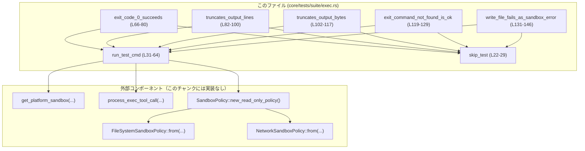
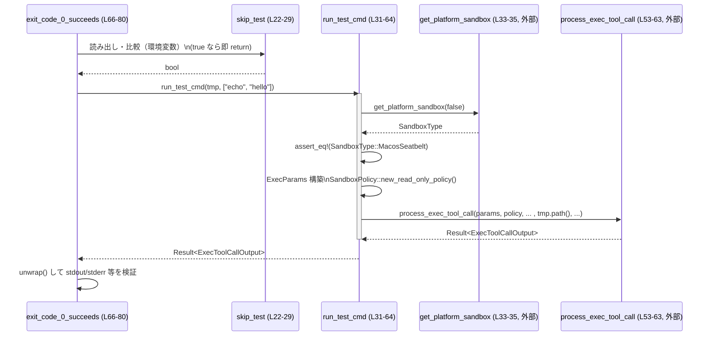

# core/tests/suite/exec.rs コード解説

## 0. ざっくり一言

macOS の seatbelt サンドボックス環境で `process_exec_tool_call` を使った外部コマンド実行が、  
「正常終了」「大量出力」「コマンド未発見」「書き込み禁止」などのケースでどう振る舞うかを検証する非同期テスト群です（根拠: `core/tests/suite/exec.rs:L1-20, L31-32, L66-146`）。

---

## 1. このモジュールの役割

### 1.1 概要

- このモジュールは、macOS 上で seatbelt サンドボックスを利用した Exec 機能の挙動を統合テストするために存在します（`#![cfg(target_os = "macos")]` と `SandboxType::MacosSeatbelt` のアサートより、macOS 専用であることがわかります。根拠: `L1, L33-35`）。
- 共通ヘルパ `run_test_cmd` を通じて `process_exec_tool_call` を呼び出し、  
  - 正常終了時の標準出力・標準エラー
  - 大量出力時のトランケーションの有無
  - コマンド未発見時のエラー扱い
  - サンドボックスによる書き込み禁止時のエラー扱い  
  を検証します（根拠: `L31-64, L66-80, L82-100, L102-117, L119-129, L131-146`）。

### 1.2 アーキテクチャ内での位置づけ

このファイルは「テスト層」に属し、実装層の `codex_core::exec::process_exec_tool_call` とサンドボックス設定 API を利用します。

- テストは `#[tokio::test]` で非同期に実行され、共通ヘルパ `run_test_cmd` を経由して実際の Exec 実装を呼び出します（根拠: `L31-32, L66-68, L82-84, L102-104, L119-121, L131-133`）。
- `run_test_cmd` は:
  - プラットフォームごとのサンドボックスタイプを取得 (`get_platform_sandbox`)（根拠: `L33-35`）
  - macOS seatbelt サンドボックスであることをアサート
  - `ExecParams` を組み立て
  - 読み取り専用の `SandboxPolicy` と、そこから導出したファイルシステム/ネットワークポリシーを生成
  - `process_exec_tool_call` を呼び出し、`ExecToolCallOutput` を返します（根拠: `L37-63`）。

依存関係を簡略図で表すと次のようになります。



> ※ 外部コンポーネントはこのチャンクには実装が現れないため、詳細は不明です。

### 1.3 設計上のポイント

- **OS 条件付きコンパイル**  
  `#![cfg(target_os = "macos")]` により、macOS 以外ではこのテストモジュール自体がコンパイルされません（根拠: `L1`）。
- **環境変数によるテストスキップ**  
  `CODEX_SANDBOX_ENV_VAR` が `"seatbelt"` の場合、全テストをスキップするヘルパ `skip_test` を用意しており、CI や特定環境での衝突を避けています（根拠: `L22-29`）。
- **共通ヘルパによる Exec 呼び出し**  
  `run_test_cmd` が ExecParams の組み立てと `process_exec_tool_call` の呼び出しを一元化し、各テストはコマンドとアサーションに集中する構造になっています（根拠: `L31-64, L66-146`）。
- **サンドボックスの前提確認**  
  実行前に `get_platform_sandbox(false)` の結果が必ず `SandboxType::MacosSeatbelt` であることをアサートし、テストが想定したサンドボックス環境でのみ実行されるようにしています（根拠: `L33-35`）。
- **非同期テストと Tokio**  
  すべてのテストは `#[tokio::test] async fn` として定義され、Tokio ランタイムの上で非同期に `run_test_cmd().await` を実行します（根拠: `L66-68, L82-84, L102-104, L119-121, L131-133`）。

---

## 2. コンポーネント一覧（インベントリー）

### 2.1 関数一覧

| 名前 | 種別 | 行範囲 | 役割 / 用途 | 根拠 |
|------|------|--------|-------------|------|
| `skip_test` | 関数 | L22-29 | 環境変数 `CODEX_SANDBOX_ENV_VAR` が `"seatbelt"` ならテストをスキップするかどうかを判定します。 | `core/tests/suite/exec.rs:L22-29` |
| `run_test_cmd` | 非同期関数 | L31-64 | 一時ディレクトリとコマンド文字列配列を受け取り、macOS seatbelt サンドボックス上で `process_exec_tool_call` を実行して `ExecToolCallOutput` を返す共通ヘルパです。 | `core/tests/suite/exec.rs:L31-64` |
| `exit_code_0_succeeds` | 非同期テスト関数 | L66-80 | `echo hello` を実行し、正常終了時の標準出力・標準エラー・トランケーションなしを検証します。 | `core/tests/suite/exec.rs:L66-80` |
| `truncates_output_lines` | 非同期テスト関数 | L82-100 | `seq 300` の出力が完全に取得され、行数によるトランケーションが発生しないことを検証します。 | `core/tests/suite/exec.rs:L82-100` |
| `truncates_output_bytes` | 非同期テスト関数 | L102-117 | 1 行 1000 バイトの行を 15 行出力するコマンドを実行し、バイト数が大きくてもトランケーションされないことを検証します。 | `core/tests/suite/exec.rs:L102-117` |
| `exit_command_not_found_is_ok` | 非同期テスト関数 | L119-129 | 存在しないコマンドを実行した場合でも、それが「サンドボックスエラー」とは扱われない（`Result` が `Ok` である）ことを検証します。 | `core/tests/suite/exec.rs:L119-129` |
| `write_file_fails_as_sandbox_error` | 非同期テスト関数 | L131-146 | テンポラリディレクトリ内への書き込みを試みるコマンドを実行し、その失敗が Exec の `Err` として扱われること（サンドボックスエラー）を検証します。 | `core/tests/suite/exec.rs:L131-146` |

### 2.2 主な外部型・関数（このチャンク内での使用のみ）

| 名前 | 種別 | このファイルでの使用箇所 / 役割 | 根拠 |
|------|------|-------------------------------|------|
| `ExecParams` | 構造体 | 外部コマンド実行のパラメータ（コマンド列、カレントディレクトリ、タイムアウト、環境変数、サンドボックス関連設定など）をまとめるために使用されています。 | `L37-49` |
| `ExecToolCallOutput` | 構造体 | Exec 実行結果の出力。テストでは `stdout.text`, `stderr.text`, `stdout.truncated_after_lines` フィールドを参照しています。 | `L32, L76-79, L92-99, L113-116` |
| `SandboxPolicy` | 構造体 | `new_read_only_policy()` によって読み取り専用とみられるポリシーを作成し、ファイルシステム/ネットワークポリシーの基として使われています（詳細な挙動はこのチャンクには現れません）。 | `L51, L54-57` |
| `FileSystemSandboxPolicy` | 構造体 | `SandboxPolicy` から生成され、`process_exec_tool_call` への引数として使用されます。ファイルシステムアクセス制御に関係すると考えられますが詳細は不明です。 | `L54, L56` |
| `NetworkSandboxPolicy` | 構造体 | 同上で、ネットワークアクセス制御に関係すると考えられますが詳細は不明です。 | `L55, L57` |
| `SandboxType` | 列挙体 | `MacosSeatbelt` バリアントとの比較により、現在のサンドボックスタイプを確認します。 | `L33-35` |
| `SandboxPermissions` | 列挙体/型 | `SandboxPermissions::UseDefault` として ExecParams に設定されており、サンドボックスの権限設定のデフォルトを指しているとみられます（詳細は不明）。 | `L44` |
| `WindowsSandboxLevel` | 列挙体 | Windows 用のサンドボックスレベル。macOS テストでは `Disabled` に固定されています。 | `L45` |
| `get_platform_sandbox` | 関数 | 現在のプラットフォームで使用するサンドボックスタイプを返す関数。ここでは `false` を渡して Windows サンドボックスを無効化した状態で取得しています（と解釈できますが、内部実装は不明）。 | `L33` |
| `process_exec_tool_call` | 非同期関数 | 実際に外部コマンドをサンドボックス内で実行し、`ExecToolCallOutput` を返す中核 API。テストではブラックボックスとして扱われています。 | `L53-63` |
| `TempDir` | 構造体 | 各テストで一時ディレクトリを作成し、そのパスを作業ディレクトリおよびファイルパスに使用します。 | `L20, L31-32, L73, L89, L109, L126, L138` |
| `PathExt` | トレイト | `tmp.path().abs()` という呼び出しにより、パスに `abs()` メソッドを追加する拡張として使われています。戻り値の詳細はこのチャンクには現れませんが、名前から絶対パスを返すと推測されます。 | `L19, L39` |

---

## 3. 公開 API と詳細解説

このファイル自体には `pub` な API はありませんが、テストヘルパ `run_test_cmd` と各テスト関数は Exec 機能の利用例・契約を示す重要な「利用側 API」として位置づけられます。

### 3.1 型一覧（このファイルで観測できる範囲）

このファイル内で新たに定義される型はありません（根拠: 冒頭から末尾までに `struct` / `enum` 定義が存在しないため `L1-147`）。  
前節 2.2 で外部型の概要を示しましたので、ここでは追加はありません。

### 3.2 関数詳細

#### `run_test_cmd(tmp: TempDir, cmd: Vec<&str>) -> Result<ExecToolCallOutput>`

**概要**

- 一時ディレクトリ `tmp` を作業ディレクトリとして、文字列スライスの配列 `cmd` を実行する共通ヘルパです（根拠: `L31-32, L37-40`）。
- macOS seatbelt サンドボックスが有効であることを確認したうえで、読み取り専用ポリシーで `process_exec_tool_call` を呼び出し、その結果をそのまま返します（根拠: `L33-35, L37-63`）。

**引数**

| 引数名 | 型 | 説明 | 根拠 |
|--------|----|------|------|
| `tmp` | `TempDir` | コマンド実行時のカレントディレクトリとして利用する一時ディレクトリ。`tmp.path()` と `tmp.path().join(...)` に使われます。 | `L31, L39, L58, L73, L89, L109, L126, L138-140` |
| `cmd` | `Vec<&str>` | 実行するコマンドと引数のリスト。`ExecParams.command` に `String` に変換して格納されます。 | `L31-32, L37-38` |

**戻り値**

- `Result<ExecToolCallOutput>`  
  - `Ok(ExecToolCallOutput)` の場合: `process_exec_tool_call` が正常に実行され、その結果が含まれます（標準出力/エラー、トランケーション情報など。根拠: テストから推測 `L76-79, L92-99, L113-116`）。
  - `Err(_)` の場合: コマンド実行またはサンドボックス関連でエラーが発生したことを意味します（具体的なエラー型は `codex_protocol::error::Result` に依存し、このチャンクには現れません。根拠: `L12, L32, L145`）。

**内部処理の流れ**

1. `get_platform_sandbox(false)` で現在のサンドボックスタイプを取得し、`expect` でエラーをパニック扱いにします（根拠: `L33-34`）。
2. 取得したサンドボックスタイプが `SandboxType::MacosSeatbelt` であることを `assert_eq!` で確認します（根拠: `L33-35`）。
3. `ExecParams` 構造体を初期化します（コマンド、カレントディレクトリ、タイムアウト、キャプチャポリシー、環境変数、サンドボックス関連設定を含む）（根拠: `L37-49`）。
4. `SandboxPolicy::new_read_only_policy()` でポリシーを生成します（根拠: `L51`）。
5. ファイルシステム・ネットワーク用のサンドボックスポリシーを `FileSystemSandboxPolicy::from(&policy)` と `NetworkSandboxPolicy::from(&policy)` で作成します（根拠: `L54-57`）。
6. `process_exec_tool_call(...)` を非同期で呼び出し、その `Future` を `.await` して `Result<ExecToolCallOutput>` を返します（根拠: `L53-63`）。

**Examples（テスト内での使用例）**

```rust
// 一時ディレクトリを作成する（失敗するとテストは panic する）
let tmp = TempDir::new().expect("should be able to create temp dir"); // L73

// 実行するコマンドと引数のベクタを作成する
let cmd = vec!["echo", "hello"];                                      // L74

// run_test_cmd を await して結果を取得し、Result を unwrap する
let output = run_test_cmd(tmp, cmd).await.unwrap();                   // L76

// 返ってきた ExecToolCallOutput の stdout/stderr を検証する
assert_eq!(output.stdout.text, "hello\n");                            // L77
assert_eq!(output.stderr.text, "");                                   // L78
```

**Errors / Panics**

- `get_platform_sandbox(false)` が `Err` を返した場合、`expect("should be able to get sandbox type")` によりパニックします（根拠: `L33-34`）。
- サンドボックスタイプが `SandboxType::MacosSeatbelt` でない場合、`assert_eq!` によりパニックします（根拠: `L35`）。
- それ以外のエラーは、`process_exec_tool_call` の `Result` として `Err` に入り、呼び出し側テストが `unwrap()` や `is_err()` で扱います（根拠: `L53-63, L76, L92, L113, L128, L145`）。

**Edge cases（エッジケース）**

- コマンド配列 `cmd` が空の場合の挙動は、このチャンクのコードおよびテストでは扱われていないため不明です（そのようなテストは存在しません。根拠: `L66-146`）。
- 非存在パスのコマンド（例: `/bin/bash -c nonexistent_command_12345`）は `exit_command_not_found_is_ok` で実際にテストされていますが、その詳細なエラー分類は `process_exec_tool_call` 側の実装に依存し、このチャンクには現れません（根拠: `L119-129`）。

**使用上の注意点**

- このヘルパは **macOS seatbelt サンドボックス環境を前提** としているため、他プラットフォームでの再利用は適切ではありません（`cfg` と `SandboxType` のアサートより。根拠: `L1, L33-35`）。
- `expect` / `assert_eq!` により、環境が想定と異なるときは `Result::Err` ではなくテストプロセス自体がパニックします。これは「環境構成ミスを即座に検出する」目的で設計されていると解釈できます（根拠: `L33-35`）。

---

#### `exit_code_0_succeeds()`

**概要**

- `echo hello` を実行し、正常終了時（exit code 0）の挙動が期待通りであることを検証する Tokio テストです（根拠: `L66-80`）。

**内部処理の流れ**

1. `skip_test()` を呼び出し、`true` なら即座に戻ります（根拠: `L68-71`）。
2. `TempDir::new()` で一時ディレクトリを作成します（根拠: `L73`）。
3. `cmd = vec!["echo", "hello"]` を定義します（根拠: `L74`）。
4. `run_test_cmd(tmp, cmd).await.unwrap()` でコマンドを実行し、`Result` を `unwrap` して `ExecToolCallOutput` を取得します（根拠: `L76`）。
5. `stdout.text == "hello\n"`, `stderr.text == ""`, `stdout.truncated_after_lines == None` をアサートします（根拠: `L77-79`）。

**Errors / Panics**

- `skip_test()` が `false` を返す前提で、  
  - `TempDir::new()` の失敗（I/O エラーなど）は `expect` によりパニックします（根拠: `L73`）。
  - `run_test_cmd` が `Err` を返すと `unwrap()` でパニックします（根拠: `L76`）。
  - アサーションに失敗した場合もパニックします（根拠: `L77-79`）。

**Edge cases**

- コマンドに引数がない、または出力が空のケースはこのテストでは扱っていません。
- トランケーションに関するアサーションでは `None` のみをチェックしており、実際に何行まで出力可能なのかはこのテストからは分かりません（根拠: `L79`）。

---

#### `write_file_fails_as_sandbox_error()`

**概要**

- 読み取り専用サンドボックスのもとでファイル書き込みを試みると、Exec が `Err` を返すことを検証するテストです（根拠: コメントとアサーション `L131-146`）。

**内部処理の流れ**

1. `skip_test()` が `true` なら即リターンします（根拠: `L133-136`）。
2. `TempDir::new()` で一時ディレクトリを作成します（根拠: `L138`）。
3. `tmp.path().join("test.txt")` でそのディレクトリ内のファイルパスを組み立てます（根拠: `L139`）。
4. `cmd` ベクタを、`"/user/bin/touch"`（sic）と `path.to_str().expect(...)` を要素として構築します（根拠: `L140-143`）。
5. `run_test_cmd(tmp, cmd).await.is_err()` が `true` であることを `assert!` で検証します（根拠: `L145`）。

**Errors / Panics**

- `TempDir::new()` や `path.to_str().expect(...)` が失敗した場合はパニックします（根拠: `L138, L142`）。
- `run_test_cmd` が `Ok` を返した場合、`assert!(... .is_err())` が失敗してテストはパニックします（根拠: `L145`）。

**Edge cases と注意点**

- コメントは「ファイル書き込みが失敗し、サンドボックスエラーとみなされるべき」と言っていますが（`L131`）、実際のコマンドパスは `"/user/bin/touch"` となっており、一般的な macOS での `touch` コマンドのパス `"/usr/bin/touch"` とは異なります（根拠: `L140-141`）。
  - このため、環境によっては **コマンド自体が見つからない**（`exit_command_not_found_is_ok` でテストするケース）という理由で `Err` になる可能性があり、コメントが意図する「書き込み操作によるサンドボックスエラー」とは異なる振る舞いを生むおそれがあります。
  - ただし、実際にどのパスが存在するかは実行環境に依存するため、このチャンクだけからは断定できません。

---

### 3.3 その他の関数（簡易一覧）

| 関数名 | 行範囲 | 役割（1行） | 根拠 |
|--------|--------|-------------|------|
| `skip_test` | L22-29 | サンドボックス関連の環境変数が特定値の場合にテストをスキップするための共通ヘルパ。 | `core/tests/suite/exec.rs:L22-29` |
| `truncates_output_lines` | L82-100 | `seq 300` の出力がトランケーションされないことを検証し、行数ベースの cut-off がない（または十分大きい）ことを確認します。 | `core/tests/suite/exec.rs:L82-100` |
| `truncates_output_bytes` | L102-117 | 1,000 バイト × 15 行以上の出力でも `truncated_after_lines == None` であることを確認し、バイト数ベースの cut-off が無い（または十分大きい）ことを確認します。 | `core/tests/suite/exec.rs:L102-117` |
| `exit_command_not_found_is_ok` | L119-129 | 非存在コマンドを実行しても `run_test_cmd(...).await.unwrap()` が成功することを通じて「コマンド未発見」はサンドボックスエラーではないという契約を示します。 | `core/tests/suite/exec.rs:L119-129` |

---

## 4. データフロー

代表的なシナリオとして、`exit_code_0_succeeds` の処理フローを説明します。

1. テスト関数が `skip_test` でスキップ判定を行います（根拠: `L68-71`）。
2. 一時ディレクトリを作成し、`cmd = ["echo", "hello"]` を準備します（根拠: `L73-74`）。
3. `run_test_cmd(tmp, cmd)` を `await` し、内部でサンドボックスタイプ取得・ポリシー設定・`process_exec_tool_call` 呼び出しが行われます（根拠: `L31-64, L76`）。
4. `ExecToolCallOutput` が返却され、テストが標準出力・標準エラー・トランケーションフラグを検証します（根拠: `L76-79`）。

これを sequence diagram で表すと次の通りです。



> ※ `get_platform_sandbox` と `process_exec_tool_call` の内部実装はこのチャンクには現れないため、ここでは「ブラックボックス」として扱っています。

---

## 5. 使い方（How to Use）

このファイル自体はテストモジュールですが、`run_test_cmd` およびテストパターンは、Exec 機能の利用例としても参考になります。

### 5.1 基本的な使用方法（テストとして）

以下は、このモジュールのスタイルに倣って新しいテストを追加するイメージ例です。

```rust
// 例: 特定のコマンドが特定の exit code で終了することを検証するテスト
#[tokio::test]                                                // Tokio ランタイム上で実行するテスト（L67, L83 等と同様）
async fn custom_command_exits_with_zero() {                   // 新しいテスト関数
    if skip_test() {                                          // 環境変数に応じてテストをスキップ（L68-71 等）
        return;
    }

    let tmp = TempDir::new().expect("should be able to create temp dir"); // 一時ディレクトリを作成（L73 等）
    let cmd = vec!["/bin/bash", "-c", "echo custom"];         // 実行するコマンドと引数

    let output = run_test_cmd(tmp, cmd).await.unwrap();       // 共通ヘルパで実行し、Result を unwrap（L76 などと同様）

    assert_eq!(output.stdout.text, "custom\n");               // 期待する標準出力を検証（L77 等）
    assert_eq!(output.stderr.text, "");                       // 標準エラーが空であることを検証
    assert_eq!(output.stdout.truncated_after_lines, None);    // トランケーションされていないことを検証（L79 等）
}
```

このように、テスト側は「コマンド」と「期待される出力・エラー」のみを記述し、サンドボックスや ExecParams の詳細は `run_test_cmd` に隠蔽されています。

### 5.2 よくある使用パターン

- **正常系テスト**  
  `run_test_cmd(...).await.unwrap()` を用いて、`Result` が `Ok` であることを前提に標準出力などを検証するパターン（`exit_code_0_succeeds`, `truncates_output_lines`, `truncates_output_bytes`, `exit_command_not_found_is_ok` で使用。根拠: `L76, L92, L113, L128`）。

- **エラー系テスト**  
  `run_test_cmd(...).await.is_err()` を `assert!` で包み、サンドボックスエラーなどで `Err` が返ることを検証するパターン（`write_file_fails_as_sandbox_error` で使用。根拠: `L145`）。

### 5.3 よくある間違い（推測）

このチャンクから推測できる範囲で、誤用になりそうな例を挙げます。

```rust
// 誤りの可能性がある例: サンドボックス種別を確認せずに Exec を使う
async fn run_without_sandbox_check(tmp: TempDir, cmd: Vec<&str>) {
    // get_platform_sandbox や SandboxType のチェックを行っていない
    // このテストファイルでは必ずチェックしている（L33-35）
}

// 正しい例（このファイルの方針に合わせる）
async fn run_with_sandbox_check(tmp: TempDir, cmd: Vec<&str>) {
    let output = run_test_cmd(tmp, cmd).await; // サンドボックスタイプやポリシー設定は run_test_cmd に委譲
    // Result を unwrap / is_err で扱う
}
```

### 5.4 使用上の注意点（まとめ）

- **環境依存性**  
  - テストは macOS かつ seatbelt サンドボックスを前提としています（`cfg` と `SandboxType::MacosSeatbelt` のアサート。根拠: `L1, L33-35`）。
  - `CODEX_SANDBOX_ENV_VAR == "seatbelt"` の場合はテストをスキップするため、CI などで意図せずスキップされていないか注意が必要です（根拠: `L22-29`）。

- **安全性 / エラー処理**  
  - サンドボックス初期化やサンドボックスタイプの不一致はテスト時にパニックとして扱われます（`expect`, `assert_eq!`。根拠: `L33-35`）。
  - 実際の Exec 実行エラー（コマンド未発見、アクセス拒否など）は `Result` の `Err` として返され、テスト側が `unwrap` するか `is_err` で確認します（根拠: `L32, L76, L92, L113, L128, L145`）。

- **並行性**  
  - `#[tokio::test]` により各テストは非同期関数として実行されますが、このファイル内では共有可変状態は扱っておらず、外部副作用は主に OS 上のプロセス実行とファイルシステムへのアクセスです（根拠: `L66-68, L82-84, L102-104, L119-121, L131-133`）。
  - テストが同時に実行された場合でも、それぞれが独立した `TempDir` を使っている点は衝突回避の観点で重要です（根拠: `L73, L89, L109, L126, L138`）。

---

## 6. 変更の仕方（How to Modify）

### 6.1 新しいテスト機能を追加する場合

1. **シナリオの決定**  
   例: 「タイムアウトした場合の挙動」「標準入力を使うコマンド」など。  
   そのシナリオが `process_exec_tool_call` のどの契約を検証するかを明確にします。

2. **テスト関数の追加**  
   - 既存のテストと同様に `#[tokio::test] async fn` として関数を追加します（根拠: `L67, L83, L103, L120, L132`）。
   - 冒頭で `if skip_test() { return; }` を呼ぶことで環境変数によるスキップロジックを共有します（根拠: `L68-71, L85-87, L105-107, L122-124, L134-136`）。

3. **一時ディレクトリとコマンドの準備**  
   - `TempDir::new().expect(...)` で一時ディレクトリを作成し（根拠: `L73, L89, L109, L126, L138`）、必要に応じて `tmp.path().join(...)` でファイルパスを構築します（根拠: `L139`）。
   - `cmd: Vec<&str>` を定義し、`run_test_cmd(tmp, cmd)` を用いて共通の Exec/Sandbox 設定を利用します（根拠: `L74, L90, L111, L127, L140`）。

4. **期待結果のアサート**  
   - 正常系であれば `unwrap()` して `stdout`/`stderr`/`truncated_after_lines` を検証します（根拠: `L76-79, L92-99, L113-116`）。
   - エラー系であれば `is_err()` などで `Result` の種別を検証します（根拠: `L145`）。

### 6.2 既存のテストを変更する場合の注意点

- **契約の維持**  
  - `exit_command_not_found_is_ok` は「コマンド未発見はサンドボックスエラーではない」という契約を示しているため、`unwrap()` を `is_err()` に変えるなどの変更は契約自体を変えることになります（根拠: `L119-129`）。
  - `write_file_fails_as_sandbox_error` は「ファイル書き込みの失敗はサンドボックスエラー扱い」という契約を示しているため、ここを変更する場合は Exec 実装側の仕様変更と同期しているか確認が必要です（根拠: `L131-146`）。

- **パス指定の確認（潜在的なバグ候補）**  
  - `"/user/bin/touch"` のパスは、一般的な macOS の `"/usr/bin/touch"` と異なるため、コメントの意図と実際の挙動が一致しているか確認が必要です（根拠: `L131, L140-141`）。
    - もし意図が「書き込み禁止によるサンドボックスエラーの検証」であれば、存在しないパスによる「コマンド未発見」になっていないか確認が必要です（`exit_command_not_found_is_ok` との対比。根拠: `L119-129, L131-146`）。

- **並行実行時の影響**  
  - `TempDir` を使っているため、ディレクトリ名の衝突は避けられますが、もし将来共有リソース（特定の固定パスなど）を扱うテストを追加する場合は、並行実行時に競合しない設計が重要です。

---

## 7. 関連ファイル・モジュール

このテストモジュールと密接に関係する外部モジュール・クレート（このチャンクには実装が現れないもの）をまとめます。

| パス / モジュール | 役割 / 関係 | 根拠 |
|-------------------|------------|------|
| `codex_core::exec` | `ExecParams`, `ExecCapturePolicy`, `process_exec_tool_call` を提供し、このテストが対象とする Exec 機能の実装側モジュールです。 | `core/tests/suite/exec.rs:L6-8, L37-42, L53-63` |
| `codex_core::sandboxing` | `SandboxPermissions` を通じてサンドボックス権限の設定値を提供します。 | `L9, L44` |
| `codex_core::spawn::CODEX_SANDBOX_ENV_VAR` | 環境変数名の定数として、テストスキップロジックで使用されます。 | `L10, L22-24` |
| `codex_protocol::config_types` | `WindowsSandboxLevel` を定義し、Windows サンドボックス設定を無効化するために用いられています（macOS テストであるため固定値 `Disabled`）。 | `L11, L45` |
| `codex_protocol::exec_output` | `ExecToolCallOutput` 型を定義し、Exec 実行結果の出力表現を提供します（stdout/stderr やトランケーション情報）。 | `L13, L32, L76-79, L92-99, L113-116` |
| `codex_protocol::permissions` | `FileSystemSandboxPolicy`, `NetworkSandboxPolicy` を通じて具体的なファイル/ネットワークサンドボックス設定を提供します。 | `L14-15, L54-57` |
| `codex_protocol::protocol::SandboxPolicy` | 高レベルなサンドボックスポリシーと、その `new_read_only_policy` コンストラクタを提供します。 | `L16, L51, L54-57` |
| `codex_sandboxing` | `get_platform_sandbox`, `SandboxType` を提供し、現在のサンドボックス環境が macOS seatbelt であることを判定するために使用されます。 | `L17-18, L33-35` |
| `core_test_support::PathExt` | Path に `abs()` メソッドを追加するトレイトとして利用されます。 | `L19, L39` |
| `tempfile::TempDir` | テストごとに一時ディレクトリを作成するためのユーティリティです。 | `L20, L31-32, L73, L89, L109, L126, L138` |

> これらのモジュールの内部実装やさらに下位の依存関係は、このチャンクには現れないため不明です。
