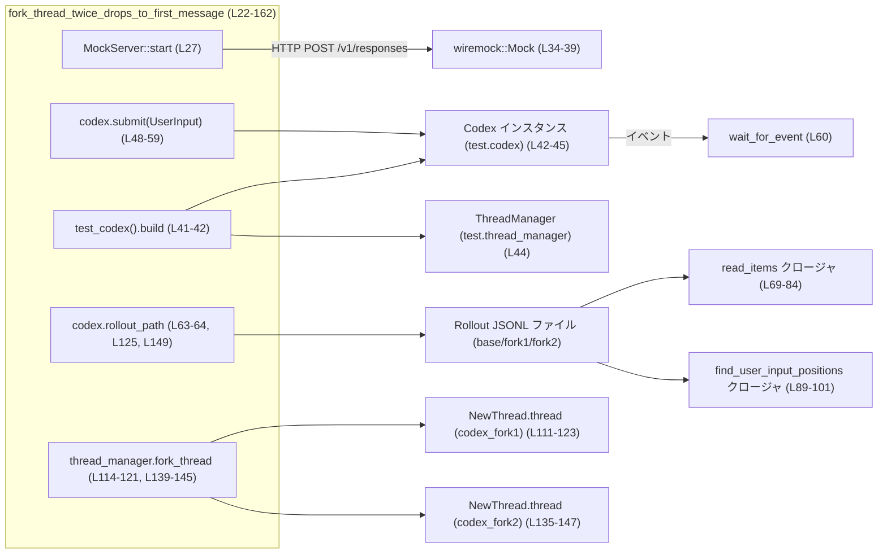
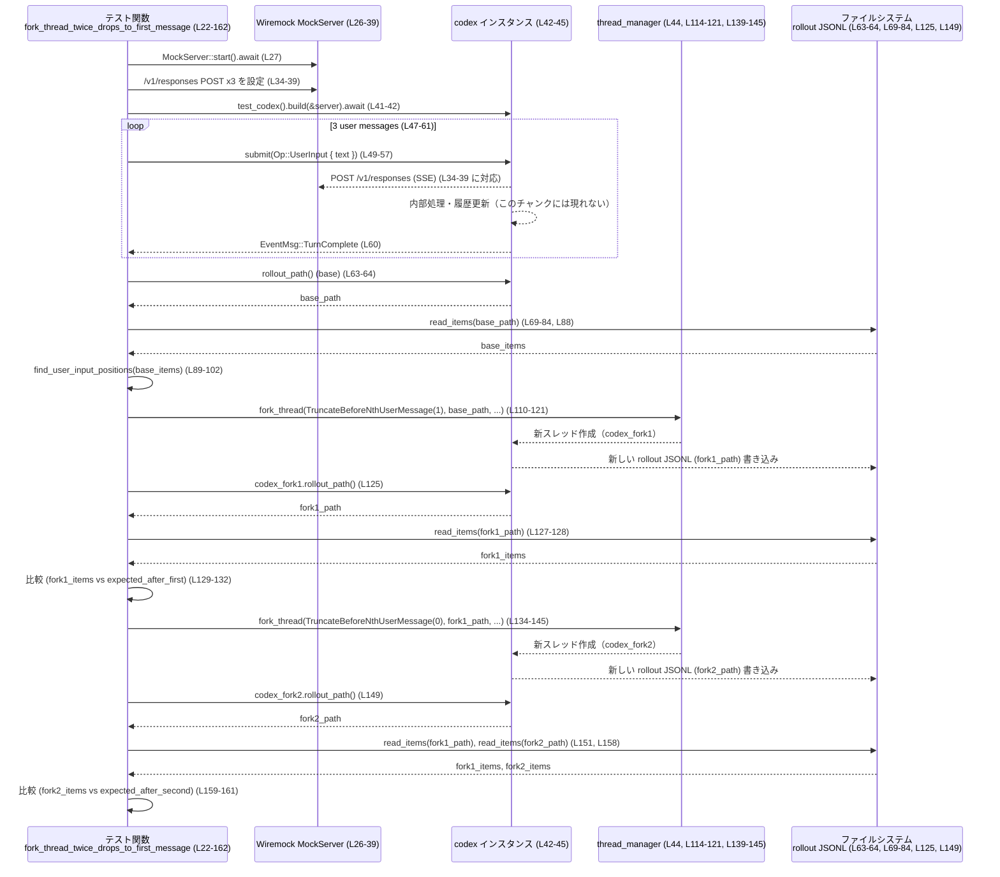

# core/tests/suite/fork_thread.rs コード解説

※行番号は、このチャンク内の先頭行を 1 として付与しています。実際のリポジトリ上の行番号とは異なる可能性があります。

---

## 0. ざっくり一言

`fork_thread_twice_drops_to_first_message` テストは、会話履歴（rollout）ファイルをもとにスレッドをフォークする機能が、  
「n 番目のユーザーメッセージより前で履歴を切り詰める」という契約どおりに動作することを検証する非同期統合テストです  
（core/tests/suite/fork_thread.rs:L22-23, L110-147）。

---

## 1. このモジュールの役割

### 1.1 概要

- このファイルは Codex コア (`codex_core`) の **スレッドフォーク機能** を検証するテストモジュールです。
- モック HTTP サーバーに対して 3 回のレスポンス生成リクエストを投げ、  
  その履歴ファイル（JSONL）の内容を読み取って、`ForkSnapshot::TruncateBeforeNthUserMessage` を指定したフォークの結果が  
  期待どおりに「特定のユーザーメッセージより前のプレフィックス」になっていることを確認します  
  （L26-39, L63-66, L86-107, L110-162）。
- Rust の async/await と Tokio のマルチスレッドランタイム上で動作する、非同期・ファイル I/O・HTTP モックを含む統合テストです（L22-23, L27, L70）。

### 1.2 アーキテクチャ内での位置づけ

このテストが依存している主なコンポーネントと関係を簡略化すると次のようになります。



- **外部依存**  
  - `wiremock` による HTTP モックサーバーとエンドポイント設定（L26-39）。
  - `core_test_support::test_codex` による Codex テスト用ビルダー（L41-42）。
  - `codex_core` の `ForkSnapshot`, `NewThread`, `parse_turn_item` など（L1-3）。
  - `codex_protocol` の `RolloutItem`, `RolloutLine`, `TurnItem`, `EventMsg`, `Op`, `UserInput`（L4-9）。
- **テストの焦点**  
  - `thread_manager.fork_thread` が `ForkSnapshot::TruncateBeforeNthUserMessage(n)` を解釈して  
    「指定ユーザーメッセージより前で履歴ファイルを切り詰めた新しいスレッド」を生成しているかどうかを確認します（L110-123, L134-147）。

### 1.3 設計上のポイント

- **状態管理**
  - このファイル自体は新しい構造体や状態を定義せず、`test_codex` が返す `codex` / `thread_manager` オブジェクトを利用します（L41-45）。
  - 履歴はファイル（JSONL）として永続化されており、そのパスを `rollout_path()` で取得します（L63-64, L125, L149）。
- **エラーハンドリング**
  - テストコードとして、`expect` / `unwrap` による **パニック前提** のエラーハンドリングを行います  
    （例: `builder.build(...).await.expect("create conversation")` や JSON パースの `expect("jsonl line")` など; L42, L70, L76-77, L122-123, L146-147, L159-161）。
  - ファイル内容が想定どおりでない場合や、HTTP 呼び出しが行われない場合、テストは明示的に失敗します。
- **並行性**
  - テストは `#[tokio::test(flavor = "multi_thread", worker_threads = 2)]` で定義され、Tokio のマルチスレッドランタイム上で実行されます（L22）。
  - ただしテスト内の操作は `.await` により順序づけされており、このファイル範囲内で競合状態を起こすような明示的並列処理は行っていません（L27-39, L48-60, L114-123, L139-147）。
- **データ処理**
  - ローカルクロージャ `read_items` で JSONL ファイルを読み、`SessionMeta` を除外した `RolloutItem` のリストを作成します（L69-84）。
  - `find_user_input_positions` でユーザーからのメッセージに該当する位置（インデックス）を抽出し、それをもとに切り詰め位置を決定します（L89-101, L104-107, L151-157）。

---

## 2. 主要な機能一覧

このテストファイルが担う主な機能は以下のとおりです。

- モック HTTP サーバーのセットアップと SSE レスポンスの定義: `/v1/responses` への 3 回の POST を期待し、固定 SSE を返す（L26-39）。
- Codex テスト環境の構築: `test_codex().build(&server)` により Codex と `thread_manager` のペアを構築（L41-45）。
- ユーザー入力を 3 回送信し、それぞれについて `EventMsg::TurnComplete` イベントが発生するまで待機（L47-61）。
- ベーススレッドの履歴ファイル（rollout JSONL）を読み取り、ユーザーメッセージの位置を検出（L63-66, L69-84, L88-102）。
- `ForkSnapshot::TruncateBeforeNthUserMessage(1)` を用いた 1 回目のフォークと、その結果の履歴が「第 2 ユーザーメッセージより前」で切り詰められていることの検証（L104-107, L110-133）。
- `ForkSnapshot::TruncateBeforeNthUserMessage(0)` を用いた 2 回目のフォークと、その結果の履歴が「フォーク元での最後のユーザーメッセージより前」で切り詰められていることの検証（L134-162）。
- JSON 比較 (`serde_json::to_value` + `pretty_assertions::assert_eq`) による、実際の履歴と期待される履歴プレフィックスの厳密な一致確認（L129-132, L159-161）。

---

## 3. 公開 API と詳細解説

### 3.1 型・関数一覧（このファイル内）

このファイル内で **新たに定義される** 型・関数は次のとおりです。

#### ローカルに定義される関数・クロージャ

| 名前 | 種別 | 役割 / 用途 | 行範囲 |
|------|------|-------------|--------|
| `fork_thread_twice_drops_to_first_message` | 非同期テスト関数 (`async fn`, `#[tokio::test]`) | スレッドフォーク機能が、2 回連続でユーザーメッセージを切り落とす挙動を正しく行うか検証する | L22-162 |
| `read_items` | ローカルクロージャ (`Fn(&Path) -> Vec<RolloutItem>`) | 指定された JSONL ファイルから `RolloutItem` を読み込み、`SessionMeta` を除いたリストを返す | L69-84 |
| `find_user_input_positions` | ローカルクロージャ (`Fn(&[RolloutItem]) -> Vec<usize>`) | `RolloutItem` 群から、ユーザーメッセージ（`TurnItem::UserMessage`）に対応するレスポンスのインデックスを抽出する | L89-101 |

#### 外部からインポートされ、重要な役割を持つ型・関数

これらはこのファイルでは定義されませんが、テストのコアロジックを理解するうえで重要です。

| 名前 | 所属モジュール | 想定される役割（コード上の利用から分かる範囲） | 使用箇所 |
|------|----------------|----------------------------------------------|----------|
| `ForkSnapshot::TruncateBeforeNthUserMessage` | `codex_core` | N 番目のユーザーメッセージより前で履歴をトランケートするスナップショット種別 | L116, L140 |
| `NewThread` | `codex_core` | `thread_manager.fork_thread` の戻り値型。少なくとも `thread` フィールドを持つ構造体 | L111-113, L135-137 |
| `parse_turn_item` | `codex_core` | `RolloutItem::ResponseItem` から `TurnItem` を抽出する関数。`Option<TurnItem>` を返す（`if let Some(..)` から推測） | L92-93 |
| `TurnItem::UserMessage` | `codex_protocol::items` | ユーザーメッセージを表すプロトコルアイテムの一種 | L93-97 |
| `RolloutItem`, `RolloutLine` | `codex_protocol::protocol` | ロールアウトファイル中の 1 行を表現する型と、その中のアイテム列挙体 | L7-8, L69-84 |
| `EventMsg::TurnComplete` | `codex_protocol::protocol` | 1 つのターン（ユーザ入力に対する応答）が完了したことを表すイベント | L60 |
| `Op::UserInput` | `codex_protocol::protocol` | Codex に対する「ユーザー入力」操作の種別 | L50 |
| `UserInput::Text` | `codex_protocol::user_input` | テキストベースのユーザー入力を表す型 | L51-53 |
| `test_codex` | `core_test_support::test_codex` | Codex と関連コンポーネントを含むテスト用ビルダーを提供する関数 | L41 |
| `wait_for_event` | `core_test_support` | イベントストリームから条件を満たすイベントが来るまで待機するヘルパー | L60 |
| `skip_if_no_network!` | `core_test_support` | ネットワークが利用できない環境でテストをスキップするマクロ（実装詳細はこのチャンクには現れません） | L24 |
| `MockServer`, `Mock`, `ResponseTemplate` | `wiremock` | HTTP モックサーバーと、そのレスポンス定義、期待呼び出し回数の検証を行う | L26-39 |

### 3.2 関数詳細：`fork_thread_twice_drops_to_first_message`

```rust
#[tokio::test(flavor = "multi_thread", worker_threads = 2)]
async fn fork_thread_twice_drops_to_first_message() { /* ... */ }
```

#### 概要

- Codex の会話履歴からスレッドをフォークする機能に対し、
  1. ベーススレッドから「最後のユーザーメッセージ以降」を削除するフォーク（n=1）
  2. そのフォークからさらに「最後のユーザーメッセージ以降」を削除するフォーク（n=0）
  
  を行った結果の履歴ファイルが、手計算で求めたプレフィックスと一致することを検証する非同期統合テストです（L47-61, L86-107, L110-162）。

#### 引数

- このテスト関数は引数を取りません（Tokio のテストマクロによりテストランナーから直接呼び出される形です）。

#### 戻り値

- 戻り値の型は暗黙に `()` です。
- テストの失敗は `panic!` 相当のパス（`expect` / `unwrap` / `assert_eq!`）によって表現され、  
  成功時は何も返さずに終了します（L42, L59-60, L64, L70, L76-77, L122-123, L129-132, L146-147, L159-161）。

#### 内部処理の流れ（アルゴリズム）

処理の流れを大きく 6 段階に分解すると次のようになります。

1. **前提確認とモックサーバーのセットアップ**  
   - ネットワークが利用できない場合はテストをスキップ（`skip_if_no_network!`）（L24）。
   - `MockServer::start().await` で Wiremock サーバーを起動し（L27）、  
     2 つの SSE イベント（`ev_response_created`, `ev_completed`）から SSE レスポンス文字列を組み立てる（L28）。
   - 200 OK かつ `content-type: text/event-stream` の `ResponseTemplate` を構築し（L29-31）、  
     `/v1/responses` への POST を 3 回期待し、そのたびにこの SSE を返すモックを設定（L33-39）。

2. **Codex テスト環境の構築**  
   - `test_codex()` からビルダーを取得し（L41）、  
     `builder.build(&server).await.expect("create conversation")` で Codex テスト環境を構築（L42）。
   - 結果から `codex` 本体、`thread_manager`、`config_for_fork` をクローンして変数に保持（L43-45）。

3. **3 回分のユーザー入力とターン完了待ち**  
   - `"first"`, `"second"`, `"third"` の 3 つのテキストについてループ（L47-48）。
   - 各ループで `Op::UserInput` を構築し（`UserInput::Text { text, text_elements: Vec::new() }`）、`codex.submit` で送信（L49-57）。
   - `await` 後に `.unwrap()` しており、送信エラーがあればテスト失敗（L58-59）。
   - その後 `wait_for_event(&codex, |ev| matches!(ev, EventMsg::TurnComplete(_)))` で  
     ターン完了イベントが来るまで待機（L60）。これにより、履歴ファイルの更新（GetHistoryなど）が完了する前提が満たされます。

4. **ベース履歴ファイルの読み込みと期待プレフィックスの計算（1 回目フォーク用）**  
   - `codex.rollout_path().expect("rollout path")` で会話履歴を記録した JSONL ファイルのパスを取得（L63-64）。
   - ローカルクロージャ `read_items` により、このパスから `RolloutItem` のベクタ `base_items` を読み出します（L69-84, L88）。
     - 各行を `serde_json::Value` → `RolloutLine` とパースし（L76-77）、  
       `RolloutItem::SessionMeta(_)` 以外を `items` に蓄積（L78-81）。
   - 別のクロージャ `find_user_input_positions` により、`base_items` の中で  
     `parse_turn_item` が `Some(TurnItem::UserMessage(_))` を返す `ResponseItem` のインデックスを収集（L89-101, L102）。
   - `user_inputs.get(1).copied().unwrap_or(0)` によって、2 番目のユーザーメッセージの位置（インデックス）を取得し、見つからない場合は 0 とみなす（L104-105）。
   - `base_items[..cut1].to_vec()` により、「2 番目のユーザーメッセージ **より前** のプレフィックス」が `expected_after_first` として計算されます（L106）。

5. **1 回目のフォークと結果検証（`n=1`）**  
   - `thread_manager.fork_thread(ForkSnapshot::TruncateBeforeNthUserMessage(1), ...)` を呼び出し、  
     ベーススレッドから `n=1`（2 番目のユーザーメッセージより前）で履歴を切り詰めた新しいスレッドを作成（L110-121）。
     - `persist_extended_history` は `false`、`parent_trace` は `None` で呼び出されています（L119-120）。
   - 戻り値 `NewThread { thread: codex_fork1, .. }` から、新しいスレッド用の `codex_fork1` を取り出し（L111-113, L122-123）、  
     `codex_fork1.rollout_path()` でフォーク後の履歴ファイルパスを取得（L125）。
   - `fork1_items = read_items(&fork1_path)` でフォーク後履歴を読み取り（L127-128）、  
     `expected_after_first` を JSON 化したものと `pretty_assertions::assert_eq!` で比較（L129-132）。

6. **2 回目のフォークと結果検証（`n=0`）**  
   - さらに `thread_manager.fork_thread(ForkSnapshot::TruncateBeforeNthUserMessage(0), config_for_fork.clone(), fork1_path.clone(), ...)` を呼び出し（L134-145）、  
     1 回目フォーク後の履歴を基に、「最後のユーザーメッセージより前」で切り詰めた 2 回目フォークスレッド `codex_fork2` を作成（L135-147）。
   - `fork2_path = codex_fork2.rollout_path()` で 2 回目フォークの履歴ファイルパスを取得（L149）。
   - 改めて `fork1_items = read_items(&fork1_path)` を用いて 1 回目フォーク後の履歴を読み込み（L151）、  
     `find_user_input_positions` でユーザーメッセージ位置 `fork1_user_inputs` を計算（L152）。
   - `fork1_user_inputs.len().saturating_sub(1)` により最後のユーザーメッセージのインデックスを求め、  
     `.get(...).copied().unwrap_or(0)` でその位置（なければ 0）を `cut_last_on_fork1` として取得（L153-156）。
   - `fork1_items[..cut_last_on_fork1].to_vec()` により、「最後のユーザーメッセージより **前** のプレフィックス」  
     `expected_after_second` を構築（L157）。
   - 最後に `fork2_items = read_items(&fork2_path)` を読み取り、  
     `expected_after_second` と JSON 経由で比較し、一致を確認します（L158-161）。

#### Examples（使用例）

この関数自体はテストランナーから自動実行されますが、  
`ForkSnapshot::TruncateBeforeNthUserMessage` と `thread_manager.fork_thread` 周辺の使い方の例として読み替えることができます。

フォークの呼び出し部分だけを抜き出すと、次のような利用パターンです（L110-123, L134-147）。

```rust
// ベース会話から「2 番目のユーザーメッセージより前」でフォーク
let NewThread { thread: codex_fork1, .. } = thread_manager
    .fork_thread(
        ForkSnapshot::TruncateBeforeNthUserMessage(1), // n = 1
        config_for_fork.clone(),
        base_path.clone(),                             // ベース履歴ファイルパス
        /*persist_extended_history*/ false,
        /*parent_trace*/ None,
    )
    .await
    .expect("fork 1");

// さらにフォーク1から「最後のユーザーメッセージより前」でフォーク
let NewThread { thread: codex_fork2, .. } = thread_manager
    .fork_thread(
        ForkSnapshot::TruncateBeforeNthUserMessage(0), // n = 0
        config_for_fork.clone(),
        fork1_path.clone(),                            // フォーク1の履歴ファイルパス
        /*persist_extended_history*/ false,
        /*parent_trace*/ None,
    )
    .await
    .expect("fork 2");
```

#### Errors / Panics（どの条件で失敗するか）

このテスト関数は多くの箇所で `expect` / `unwrap` を使用しており、  
条件が満たされないとパニックを起こしてテストが失敗します。

主な失敗条件は次のとおりです（いずれも `panic!` 相当）:

- `builder.build(&server).await.expect("create conversation")`  
  - Codex テスト環境の構築に失敗した場合（L42）。
- `codex.submit(...).await.unwrap()`  
  - ユーザー入力の送信が失敗した場合（L49-59）。
- `codex.rollout_path().expect("rollout path")` / `codex_fork1.rollout_path().expect("rollout path")` / `codex_fork2.rollout_path().expect("rollout path")`  
  - 履歴ファイルパスの取得に失敗した場合（L63-64, L125, L149）。
- `std::fs::read_to_string(p).expect("read rollout file")`  
  - 履歴ファイルが存在しない、または読み出しに失敗した場合（L69-71）。
- `serde_json::from_str(line).expect("jsonl line")` / `serde_json::from_value(v).expect("rollout line")`  
  - JSONL の 1 行が JSON として不正、あるいは `RolloutLine` にデシリアライズできない場合（L76-77）。
- `thread_manager.fork_thread(...).await.expect("fork 1")` / `expect("fork 2")`  
  - フォーク処理が失敗した場合（L110-123, L134-147）。
- `pretty_assertions::assert_eq!` の 2 箇所  
  - フォーク後の履歴が、計算された期待プレフィックスと一致しない場合（L129-132, L159-161）。
- その他、`skip_if_no_network!` の内部条件（ネットワーク有無チェック）の結果によっては、  
  テストがスキップされる可能性があります（L24）。スキップはパニックではなく、テスト不実行として扱われると考えられますが、  
  具体的な挙動はこのチャンクには現れません。

#### Edge cases（エッジケース）

コードから読み取れる挙動を列挙します。

- **ユーザーメッセージが 2 件未満の場合（1 回目フォーク）**  
  - `user_inputs.get(1)` が `None` になり、`copied().unwrap_or(0)` により `cut1` は 0 になります（L104-105）。
  - このとき `expected_after_first` は `base_items[..0]`（空ベクタ）となります（L106）。
  - 実際にはこのテストは `"first"`, `"second"`, `"third"` の 3 件を送信するため、  
    実行時にはこの状況は起こらない設計です（L47-48）。
- **ユーザーメッセージが 1 件未満の場合（2 回目フォーク）**  
  - `fork1_user_inputs.len().saturating_sub(1)` により、長さが 0 でも負にならず 0 になります（L153-154）。
  - `.get(0)` が `None` の場合には `unwrap_or(0)` で 0 となり、`expected_after_second` は空ベクタになります（L155-157）。
- **JSONL 中に空行が含まれる場合**  
  - `line.trim().is_empty()` のチェックにより空行はスキップされ、解析対象になりません（L72-75）。
- **`RolloutItem::SessionMeta(_)` の扱い**  
  - ロールアウトファイル内の `SessionMeta` エントリは `read_items` で除外され、  
    比較対象から外れます。これにより、セッションメタデータの違いに影響されないテストになっています（L78-81）。
- **イベントが到達しない場合**  
  - `wait_for_event` 内部の実装はこのチャンクには現れませんが、条件を満たす `EventMsg::TurnComplete` が届かない場合、  
    タイムアウト等によって `wait_for_event` がエラー・パニックを起こす可能性があります（L60）。

#### 使用上の注意点（このテストロジックを再利用する場合）

- **パニックベースのエラーハンドリング**  
  - 本コードはテスト用であり、あらゆる I/O エラーやフォーク失敗を `expect` / `unwrap` で即座にテスト失敗にします（L42, L59, L64, L70, L76-77, L122-123, L146-147）。  
    本番コードとして再利用する場合は `Result` を返す形に書き換える必要があります。
- **ファイルパスの前提**  
  - `rollout_path()` が返すパスは、呼び出し時にすでに書き込みが完了している前提で使用されています（L66, L127, L150 のコメント）。  
    実装がこの前提を満たさない場合、`read_to_string` で不完全なファイルを読む可能性があります。
- **並行実行時の安定性**  
  - テスト自体はマルチスレッドランタイム上で動作しますが、ここで扱うファイルパスは各テストインスタンス固有である必要があります。  
    共有パスを用いた場合、別テストとの競合が起こりうる点に注意が必要です（このファイルからはパスの一意性は分かりません）。
- **`parse_turn_item` の解釈依存**  
  - `find_user_input_positions` は `ResponseItem` から `TurnItem::UserMessage` を取り出せるケースのみを「ユーザー入力」と見なしています（L89-98）。  
    `parse_turn_item` の仕様が変わると、切り詰め位置の検出ロジックも変える必要があります。

### 3.3 その他の関数（ローカルクロージャ）

| 関数名 | 種別 | 役割（1 行） | 行範囲 |
|--------|------|--------------|--------|
| `read_items` | ローカルクロージャ | JSONL ファイルを読み込み、空行と `SessionMeta` を除いた `RolloutItem` の配列を構築する | L69-84 |
| `find_user_input_positions` | ローカルクロージャ | `RolloutItem` 群から、`TurnItem::UserMessage` に対応するレスポンスのインデックスだけを抽出する | L89-101 |

---

## 4. データフロー

### 4.1 全体の処理シナリオ

このテストの代表的なデータフローは以下のようになります。

1. テスト関数が 3 回の `UserInput` を `codex` に送信する（L47-59）。
2. Codex が内部処理を行い、その結果をロールアウトファイル（JSONL）に追記しつつ、`EventMsg::TurnComplete` を発行する（L60, L63-64）。
   - Codex 内部の詳細なフローは、このファイルからは分かりません。
3. テストが `codex.rollout_path()` から履歴ファイルパスを取得し、その内容を `read_items` で読み出す（L63-66, L69-84, L88）。
4. `find_user_input_positions` により、ユーザーメッセージに対応する位置を抽出し、そこまでのプレフィックスを期待値として計算する（L89-107, L151-157）。
5. `thread_manager.fork_thread` が元の履歴パスを引数にとり、新しいスレッドを作成し、そのスレッドの `rollout_path()` から新しい履歴ファイルを生成する（L110-123, L125-128, L134-147, L149-151）。
6. 最後に、フォーク後の履歴ファイル内容と、計算した期待プレフィックスを JSON ベースで比較する（L129-132, L159-161）。

### 4.2 シーケンス図



---

## 5. 使い方（How to Use）

### 5.1 基本的な使用方法

このファイルはテスト専用であり、通常は `cargo test` の実行によって自動的に実行されます。

```bash
# 全テストの中から、このファイルを含むテストスイートを実行
cargo test --test suite
```

特定のテスト名を指定する場合の一例（テストバイナリ名は実際の構成に依存するため、このチャンクからは不明です）:

```bash
cargo test fork_thread_twice_drops_to_first_message
```

テストが有効に動作する前提条件:

- `skip_if_no_network!` が「ネットワーク利用可能」と判断する環境であること（L24）。
- `wiremock` サーバーがローカルで起動できること（L27）。
- `test_codex().build` が外部依存や設定を満たして正しく起動できること（L41-42）。

### 5.2 よくある使用パターン（ロジックの再利用観点）

このテストコードから、以下のパターンが読み取れます。

1. **フォーク前後で履歴ファイルを比較するパターン**

```rust
let base_path = codex.rollout_path().expect("rollout path"); // ベース履歴 (L63-64)
let base_items = read_items(&base_path);                     // ローカルクロージャ (L69-84, L88)

let NewThread { thread: codex_fork, .. } = thread_manager
    .fork_thread(
        ForkSnapshot::TruncateBeforeNthUserMessage(n),
        config_for_fork.clone(),
        base_path.clone(),
        false,
        None,
    )
    .await
    .expect("fork");

let fork_path = codex_fork.rollout_path().expect("rollout path");
let fork_items = read_items(&fork_path);

// ここで base_items と fork_items の関係を検証する…
```

- このパターンは、他の `ForkSnapshot` バリアントをテストする際にも応用できます。

1. **ユーザーメッセージ位置に基づくプレフィックス計算**

```rust
let user_inputs = find_user_input_positions(&items);        // L89-102

// 例: n番目のユーザーメッセージより前までのプレフィックス
let cut = user_inputs.get(n).copied().unwrap_or(0);         // L104-105 に類似
let prefix: Vec<RolloutItem> = items[..cut].to_vec();
```

### 5.3 よくある間違い（想定される誤用）

テストロジックを他のコンテキストで利用する場合に起こりそうな誤用と、正しい例です。

```rust
// 誤り例: rollout_path() を取得した直後にファイルを読み込む前提が、
// 実装側で「書き込み完了保証」をしていない場合
let path = codex.rollout_path().expect("rollout path");
let items = read_items(&path); // 実装によっては未フラッシュの可能性

// 正しい例: 実装側で「GetHistory が flush を完了してから path を返す」契約を守るか、
// あるいは呼び出し側で flush 完了を明示的に待ってから read する。
// このテストでは前者をコメントで前提としており（L66, L127, L150）、
```

```rust
// 誤り例: parse_turn_item の結果を無視して単に ResponseItem の数で判定する
for (i, it) in items.iter().enumerate() {
    if let RolloutItem::ResponseItem(_) = it {
        // これだとユーザーメッセージかどうか区別できない
    }
}

// 正しい例（本テストの実装）: TurnItem::UserMessage であることを確認する
for (i, it) in items.iter().enumerate() {
    if let RolloutItem::ResponseItem(response_item) = it
        && let Some(TurnItem::UserMessage(_)) = parse_turn_item(response_item)
    {
        pos.push(i);
    }
}
```

### 5.4 使用上の注意点（まとめ）

- このファイルは **テスト専用** であり、本番コードに直接組み込むことは想定されていません。
- ファイル I/O と JSON パースで `expect` を多用しており、  
  普通のアプリケーションコードでは `Result` を返すように改変する必要があります（L69-77）。
- フォーク機能をテストする際は、`RolloutItem` と `TurnItem` の関係（`parse_turn_item` の挙動）に強く依存するため、  
  プロトコル仕様の変更時にはテストも同期的に更新する必要があります（L89-98）。
- 並行実行される可能性があるため、同じ履歴ファイルパスを複数テストで共有しない設計が前提となります（パスの一意性はこのチャンクには現れません）。

---

## 6. 変更の仕方（How to Modify）

### 6.1 新しいフォーク機能を追加する場合（テストの拡張）

新しい `ForkSnapshot` バリアントやフォーク戦略を追加した場合、このテストファイルを拡張する典型的な手順は次のとおりです。

1. **ベースとなる履歴の準備**
   - 既存の `"first"`, `"second"`, `"third"` の 3 入力シナリオをそのまま利用するか、ケースに応じて入力数や内容を調整します（L47-61）。
2. **期待プレフィックスの計算**
   - `read_items` と `find_user_input_positions` を再利用し、新しいフォーク戦略に対応した切り詰め位置（インデックス）を計算します（L69-84, L89-107, L151-157）。
3. **`fork_thread` 呼び出しの追加**
   - 新しい `ForkSnapshot` バリアントを引数とした `thread_manager.fork_thread` 呼び出しを追加し（L110-121, L139-145 を参考）、  
     戻り値から `thread` フィールドを取り出して `rollout_path()` を呼び出します（L111-113, L135-137, L125, L149）。
4. **比較ロジックの追加**
   - `read_items` でフォーク後の履歴を読み込み、計算したプレフィックスと `pretty_assertions::assert_eq!` で比較するコードを追加します（L127-132, L158-161）。

### 6.2 既存の機能を変更する場合（注意点）

- **ユーザーメッセージの定義変更**
  - `TurnItem::UserMessage` 以外の形でユーザー入力を表すよう仕様変更した場合、  
    `parse_turn_item` の戻り値の判定ロジック（L89-98）を合わせて変更する必要があります。
- **履歴フォーマット（RolloutItem / RolloutLine）の変更**
  - JSONL のスキーマが変わる場合、`serde_json::from_str` および `serde_json::from_value` の対象型や  
    `match rl.item { .. }` のパターンを更新する必要があります（L76-81）。
- **フォーク契約（TruncateBeforeNthUserMessage）の変更**
  - 「n 番目のユーザーメッセージより前」の意味（0-based/1-based や inclusive/exclusive）が変わった場合、  
    - `cut1` や `cut_last_on_fork1` の計算ロジック（L104-107, L151-157）
    - テスト名（`fork_thread_twice_drops_to_first_message`）  
    も合わせて更新するべきです。
- **スレッドセーフティと並行実行**
  - `worker_threads` の数を増減するなどランタイム設定を変更する場合（L22）、  
    同時に動作する他テストとの相互作用を再確認する必要があります。

---

## 7. 関連ファイル・モジュール

このテストと密接に関係するファイル・モジュール（コード上から読み取れる範囲）は次のとおりです。

| パス / モジュール | 役割 / 関係 |
|-------------------|------------|
| `codex_core::ForkSnapshot` | フォーク時のスナップショット戦略を表す型。ここでは `TruncateBeforeNthUserMessage` バリアントを使用（L1, L116, L140）。 |
| `codex_core::NewThread` | `thread_manager.fork_thread` の戻り値型。少なくとも `thread` フィールドを持ち、新しいスレッドの Codex インスタンスを提供（L2, L111-113, L135-137）。 |
| `codex_core::parse_turn_item` | `RolloutItem::ResponseItem` を解釈して `Option<TurnItem>` を返す関数（L3, L92-93）。 |
| `codex_protocol::protocol::{RolloutItem, RolloutLine}` | ロールアウトファイル中のレコードを表現する型。JSONL からのデシリアライズ対象（L7-8, L69-84, L88）。 |
| `codex_protocol::items::TurnItem` | `TurnItem::UserMessage` など、会話ターン内のアイテム種別を表す列挙体（L4, L93）。 |
| `codex_protocol::protocol::{EventMsg, Op}` | イベントメッセージと Codex 操作種別を表す型。`TurnComplete` イベントと `UserInput` 操作を使用（L5-6, L50, L60）。 |
| `codex_protocol::user_input::UserInput` | ユーザー入力の表現。`UserInput::Text` を用いてテキスト入力を送信（L9, L51-53）。 |
| `core_test_support::test_codex::test_codex` | Codex テスト用インスタンスを構築するビルダー関数（L14, L41-42）。ファイルパスはこのチャンクには現れません。 |
| `core_test_support::wait_for_event` | Codex からのイベントを待ち受けるヘルパー（L15, L60）。 |
| `core_test_support::responses::{ev_response_created, ev_completed, sse}` | Wiremock が返す SSE レスポンスの構築用ヘルパー群（L10-12, L28）。 |
| `core_test_support::skip_if_no_network` | ネットワーク利用可否に応じてテストをスキップするマクロ（L13, L24）。 |
| `wiremock::{MockServer, Mock, ResponseTemplate, matchers::{method, path}}` | HTTP モックの起動・エンドポイント定義・期待呼び出し回数 (`expect(3)`) などを提供（L16-20, L26-39）。 |

ファイルパス（`src/...` などの実ディスク上の位置）は、このチャンクには現れないため不明です。  
モジュールパスは `use` 宣言から読み取れる情報のみを記載しています。
