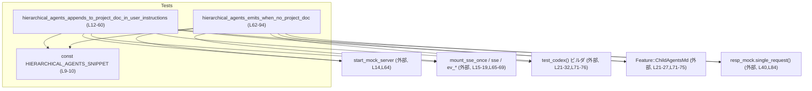
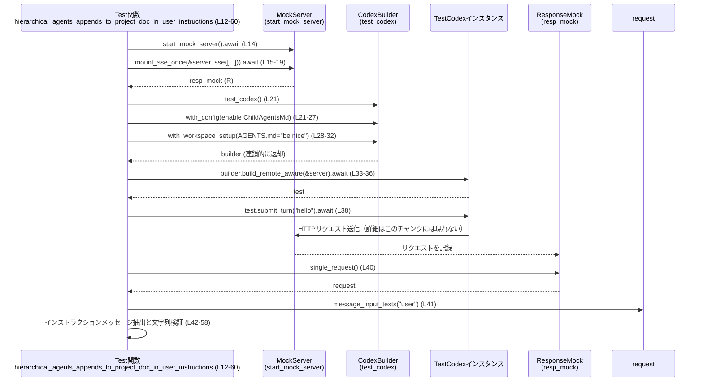

# core/tests/suite/hierarchical_agents.rs コード解説

## 0. ざっくり一言

`Feature::ChildAgentsMd` 機能が有効なときに、

- プロジェクト直下の `AGENTS.md` があればその内容をユーザー向けインストラクションに含めること  
- さらに **階層的エージェントに関する定型スニペット** が後ろに追加されること  

を検証する非同期テストをまとめたファイルです（`core/tests/suite/hierarchical_agents.rs:L9-10,L12-60,L62-94`）。

---

## 1. このモジュールの役割

### 1.1 概要

このテストモジュールは、`codex_features::Feature::ChildAgentsMd` の振る舞いを検証するために存在し、次の 2 点を確認します。

- プロジェクトルートに `AGENTS.md` が存在する場合、ファイル内容がユーザーメッセージ内の `# AGENTS.md instructions for ...` というヘッダ付きインストラクションに含まれること（`core/tests/suite/hierarchical_agents.rs:L21-32,L42-49`）。
- プロジェクトルートに `AGENTS.md` が存在しない場合でも、`HIERARCHICAL_AGENTS_SNIPPET` で定義された定型文がユーザーインストラクションとして出力されること（`core/tests/suite/hierarchical_agents.rs:L9-10,L62-63,L71-76,L84-93`）。

### 1.2 アーキテクチャ内での位置づけ

このファイル自体は「テストスイート」の一部であり、次のようなテストサポートコンポーネントに依存しています。

- `start_mock_server`：テスト用のモックサーバハンドル `server` を非同期で生成（`core/tests/suite/hierarchical_agents.rs:L14,L64`）。
- `mount_sse_once` / `sse` / `ev_response_created` / `ev_completed`：モックサーバに一度だけ返される SSE（Server-Sent Events）レスポンスを設定し、そのリクエストを検査するためのハンドル `resp_mock` を返す（`core/tests/suite/hierarchical_agents.rs:L15-19,L65-69,L40-41,L84-85`）。
- `test_codex`：テスト対象 Codex を構成するビルダを返し、`with_config`・`with_workspace_setup`・`build_remote_aware` などを通じて設定・ワークスペース・リモート接続先を与える（`core/tests/suite/hierarchical_agents.rs:L21-32,L33-36,L71-76,L77-80`）。
- `Feature::ChildAgentsMd`：Codex 側の機能フラグ。テストではこのフラグを有効化してから Codex を構築しています（`core/tests/suite/hierarchical_agents.rs:L21-27,L71-75`）。

依存関係を簡略化した図は次のとおりです。



※ `start_mock_server` などの具体的な内部実装はこのチャンクには現れません。

### 1.3 設計上のポイント

コードから読み取れる特徴は次のとおりです。

- **非同期テスト**  
  - `#[tokio::test(flavor = "multi_thread", worker_threads = 2)]` で 2 ワーカのマルチスレッド Tokio ランタイム上でテストを実行します（`core/tests/suite/hierarchical_agents.rs:L12,L62`）。
- **ビルダパターンによる Codex 構築**  
  - `test_codex()` から得たビルダに対し、`with_config` や `with_workspace_setup` をチェーンして設定・ワークスペースを組み立てています（`core/tests/suite/hierarchical_agents.rs:L21-32,L71-76`）。
- **モックサーバと SSE による外部依存の固定**  
  - `start_mock_server` と `mount_sse_once` により、Codex が外部と通信する際のリクエストをテストコードから検査できるようにしています（`core/tests/suite/hierarchical_agents.rs:L14-19,L64-69,L40,L84`）。
- **テキストベースの検証**  
  - 実際のユーザーメッセージ本文を `message_input_texts("user")` から取得し、`starts_with` / `contains` / `find` といった文字列操作で期待内容や順序を確認しています（`core/tests/suite/hierarchical_agents.rs:L41-58,L85-92`）。

---

## 2. 主要な機能一覧

このファイル内で定義されている主な要素は次のとおりです。

- `HIERARCHICAL_AGENTS_SNIPPET`: 階層的エージェントに関する定型文の期待値文字列（`core/tests/suite/hierarchical_agents.rs:L9-10`）。
- `hierarchical_agents_appends_to_project_doc_in_user_instructions`:  
  プロジェクトの `AGENTS.md` の内容に `HIERARCHICAL_AGENTS_SNIPPET` が**後ろに追加されている**ことを検証する非同期テスト（`core/tests/suite/hierarchical_agents.rs:L12-60`）。
- `hierarchical_agents_emits_when_no_project_doc`:  
  プロジェクトに `AGENTS.md` が存在しなくても `HIERARCHICAL_AGENTS_SNIPPET` がユーザーインストラクションとして出力されることを検証する非同期テスト（`core/tests/suite/hierarchical_agents.rs:L62-94`）。

---

## 3. 公開 API と詳細解説

### 3.1 型一覧（構造体・列挙体など）

このファイル内では**新しい構造体や列挙体は定義されていません**。

唯一の静的要素は文字列スライス定数です。

| 名前 | 種別 | 役割 / 用途 | 根拠 |
|------|------|-------------|------|
| `HIERARCHICAL_AGENTS_SNIPPET` | `&'static str` 定数 | 階層的エージェントに関する定型メッセージの期待値。`instructions` 文字列に含まれていることをテストで確認します。 | 定義と値: `core/tests/suite/hierarchical_agents.rs:L9-10` / 使用箇所: `L50-52,L91-92` |

### 3.1 補足: ローカル関数インベントリー

| 名前 | 種別 | 役割 / 用途 | 定義位置 |
|------|------|-------------|----------|
| `hierarchical_agents_appends_to_project_doc_in_user_instructions` | `async fn` （Tokio テスト） | 既存 `AGENTS.md` 内容がユーザーインストラクションに含まれ、その後ろに階層的エージェントスニペットが来ることを検証します。 | `core/tests/suite/hierarchical_agents.rs:L12-60` |
| `hierarchical_agents_emits_when_no_project_doc` | `async fn` （Tokio テスト） | `AGENTS.md` が存在しない状態でも階層的エージェントスニペットがインストラクションとして出力されることを検証します。 | `core/tests/suite/hierarchical_agents.rs:L62-94` |

### 3.2 関数詳細

#### `hierarchical_agents_appends_to_project_doc_in_user_instructions()`

**概要**

- プロジェクトルートに `AGENTS.md` を用意し、その内容 `"be nice"` がユーザーインストラクションに含まれること、かつ `HIERARCHICAL_AGENTS_SNIPPET` がその後ろに続くことを確認する非同期テストです（`core/tests/suite/hierarchical_agents.rs:L21-32,L42-59`）。

**引数**

- なし（Tokio テスト関数であり、テストランナーから直接呼び出されます）。

**戻り値**

- `()`（暗黙のユニット型）。  
  失敗時には `assert!` や `.expect(...)` による panic が発生します。

**内部処理の流れ（アルゴリズム）**

1. **モックサーバの起動と SSE 設定**  
   - `let server = start_mock_server().await;` でテスト用サーバハンドルを取得（`core/tests/suite/hierarchical_agents.rs:L14`）。
   - `mount_sse_once(&server, sse(vec![ev_response_created("resp1"), ev_completed("resp1")])).await` により、サーバに 1 回分の SSE レスポンスモックを登録し、その結果として `resp_mock` を受け取ります（`core/tests/suite/hierarchical_agents.rs:L15-19`）。
2. **Codex ビルダの構成**  
   - `test_codex()` からビルダを取得し（`L21`）、`with_config` で `Feature::ChildAgentsMd` を有効化します（`L22-27`）。
   - 続けて `with_workspace_setup` を呼び、`cwd` 以下に `AGENTS.md` を作成し `"be nice"` という内容を書き込みます（`L28-31`）。エラー型には `anyhow::Error` が使われています（`L31`）。
3. **Codex インスタンスの構築**  
   - 構成済みビルダから `build_remote_aware(&server).await` を呼び出し、`test` というテスト用 Codex インスタンスを取得します（`L33-36`）。
4. **対話ターンの送信**  
   - `test.submit_turn("hello").await.expect("submit turn");` により、「hello」というユーザー入力を Codex に送信し、結果がエラーにならないことを確認します（`L38`）。
5. **送信されたリクエストの取得**  
   - `resp_mock.single_request()` でモックサーバに送られたリクエストを 1 件取得し（`L40`）、`request.message_input_texts("user")` でユーザー役割のメッセージ本文リストを取り出します（`L41`）。
6. **インストラクションメッセージの抽出**  
   - `user_messages.iter().find(|text| text.starts_with("# AGENTS.md instructions for "))` により、`# AGENTS.md instructions for` で始まるメッセージを探し、これを `instructions` として取得します（`L42-45`）。
7. **内容と順序の検証**  
   - `instructions.contains("be nice")` を `assert!` で確認し、`AGENTS.md` の内容が含まれていることを検証します（`L46-48`）。
   - `instructions.find(HIERARCHICAL_AGENTS_SNIPPET)` と `instructions.find("be nice")` からそれぞれの位置を取得し（`L50-55`）、`snippet_pos > base_pos` を `assert!` で確認することで、階層的エージェントスニペットが `"be nice"` より**後ろに**出現することを検証します（`L56-58`）。

**Examples（使用例）**

この関数自体はテストランナーから呼び出されますが、同様のパターンで別の機能フラグをテストする例は次のようになります（概念的な例・ビルダ API はこのファイルの利用状況に基づくものです）。

```rust
#[tokio::test(flavor = "multi_thread", worker_threads = 2)]
async fn my_feature_injects_custom_instructions() {
    // モックサーバを起動する                            // L14 と同様のパターン
    let server = start_mock_server().await;

    // SSE レスポンスモックを登録する                     // L15-19 と同様のパターン
    let resp_mock = mount_sse_once(
        &server,
        sse(vec![ev_response_created("resp1"), ev_completed("resp1")]),
    )
    .await;

    // 機能フラグを有効化して Codex を構成する              // L21-27 に相当
    let builder = test_codex().with_config(|config| {
        config
            .features
            .enable(Feature::ChildAgentsMd) // 実際には別の Feature を有効化する想定
            .expect("test config should allow feature update");
    });

    let test = builder
        .build_remote_aware(&server)
        .await
        .expect("build test codex");

    // 対話ターンを送信し、失敗しないことを確認する         // L38 と同様
    test.submit_turn("hello").await.expect("submit turn");

    // 送信されたリクエストからユーザーインストラクションを検査する // L40-58 と同様
    let request = resp_mock.single_request();
    let user_messages = request.message_input_texts("user");
    let instructions = user_messages
        .iter()
        .find(|text| text.starts_with("# AGENTS.md instructions for "))
        .expect("instructions message");

    assert!(instructions.contains("期待するテキスト"));
}
```

**Errors / Panics**

このテスト関数は、次の条件で panic を起こし得ます（いずれも `Result` や `Option` に対する `.expect(...)` / `assert!` によるものです）。

- `start_mock_server().await` などで内部的なエラーが起こり、その結果が `.expect(...)` に到達した場合（`build_remote_aware` など、詳細はこのチャンクには現れませんが、`expect("build test codex")` で panic します。`core/tests/suite/hierarchical_agents.rs:L35-36`）。
- `test.submit_turn("hello").await` がエラーを返した場合（`expect("submit turn")` で panic。`core/tests/suite/hierarchical_agents.rs:L38`）。
- `resp_mock.single_request()` が 0 件のリクエストしか保持していない場合など、内部で panic する可能性がありますが、その実装はこのチャンクには現れません（`L40`）。
- `user_messages.iter().find(|text| ...)` が該当メッセージを見つけられなかった場合（`expect("instructions message")` により panic。`L42-45`）。
- `instructions.contains("be nice")` が偽の場合（`assert!` で panic。`L46-48`）。
- `instructions.find(HIERARCHICAL_AGENTS_SNIPPET)` または `instructions.find("be nice")` が `None` の場合（`expect(...)` により panic。`L50-55`）。
- `snippet_pos > base_pos` が成り立たない場合（順序が期待通りでない場合、`assert!` で panic。`L56-58`）。

エラーはすべてテスト失敗として扱われます。

**Edge cases（エッジケース）**

- **インストラクションメッセージが複数ある場合**  
  - `find(|text| text.starts_with(...))` は最初にマッチした 1 件のみを検査します（`core/tests/suite/hierarchical_agents.rs:L42-45`）。  
    他のインストラクションメッセージの内容は検査されません。
- **`AGENTS.md` 内容が空または複数行の場合**  
  - このテストでは `"be nice"` という単純な内容のみを検証しており（`L28-31,L46-48`）、空文字列や複雑なフォーマットの場合の挙動は検証されていません。
- **改行や空白の扱い**  
  - `contains("be nice")` / `find("be nice")` は部分文字列検索であり、前後に改行や空白が入る場合の厳密な位置・フォーマットまでは検証していません（`L46-55`）。

**使用上の注意点**

- テストの成功は `Feature::ChildAgentsMd` が正しく有効化されていることに依存します（`core/tests/suite/hierarchical_agents.rs:L21-27`）。同様のテストを追加する場合も、目的の機能フラグを忘れずに有効化する必要があります。
- モックサーバや SSE モックが 1 回のリクエストのみを想定している場合、テスト中に複数リクエストが発生すると `single_request()` の挙動が想定と異なる可能性がありますが、詳細はこのチャンクには現れません（`L40`）。
- マルチスレッド Tokio ランタイム（`worker_threads = 2`）で動作しているため、Codex 内部の非同期処理は複数スレッド上で実行される可能性があります（`L12`）。  
  このテスト自体は逐次的に `await` しているため、テストコード側で共有可変状態を直接扱うことはありません。

---

#### `hierarchical_agents_emits_when_no_project_doc()`

**概要**

- プロジェクトに `AGENTS.md` を用意しない状態でも、`Feature::ChildAgentsMd` によって `HIERARCHICAL_AGENTS_SNIPPET` がユーザーインストラクションとして出力されることを検証する非同期テストです（`core/tests/suite/hierarchical_agents.rs:L62-94`）。

**引数**

- なし。

**戻り値**

- `()`（ユニット型）。失敗時には panic します。

**内部処理の流れ（アルゴリズム）**

1. **モックサーバの起動と SSE 設定**  
   - `let server = start_mock_server().await;`（`L64`）。  
   - `mount_sse_once(&server, sse(vec![ev_response_created("resp1"), ev_completed("resp1")])).await;` で `resp_mock` を取得（`L65-69`）。
2. **Codex ビルダの構成（`AGENTS.md` は作らない）**  
   - `test_codex().with_config(|config| { ... })` により、`Feature::ChildAgentsMd` を有効化したビルダを構築します（`L71-76`）。  
     このテストでは `with_workspace_setup` を呼ばず、`AGENTS.md` を明示的には作成していません。
3. **Codex インスタンスの構築**  
   - `builder.build_remote_aware(&server).await` から `test` を取得し、`expect("build test codex")` でエラーを検出します（`L77-80`）。
4. **対話ターンの送信**  
   - `test.submit_turn("hello").await.expect("submit turn");` で Codex に入力を送信し、成功を確認します（`L82`）。
5. **リクエストの取得とインストラクション検証**  
   - `resp_mock.single_request()` からリクエストを取り出し（`L84`）、`message_input_texts("user")` でユーザーメッセージを取得します（`L85`）。
   - `user_messages.iter().find(|text| text.starts_with("# AGENTS.md instructions for "))` でインストラクションメッセージを取得します（`L86-89`）。
   - `instructions.contains(HIERARCHICAL_AGENTS_SNIPPET)` を `assert!` で確認し、階層的エージェントスニペットがインストラクションに含まれていることを検証します（`L90-92`）。

**Examples（使用例）**

`AGENTS.md` の有無だけを変えた別シナリオのテスト例（概念的な例）は次のようになります。

```rust
#[tokio::test(flavor = "multi_thread", worker_threads = 2)]
async fn hierarchical_agents_with_empty_project_doc() {
    let server = start_mock_server().await;

    let resp_mock = mount_sse_once(
        &server,
        sse(vec![ev_response_created("resp1"), ev_completed("resp1")]),
    )
    .await;

    // 空の AGENTS.md をわざと作る、など別シナリオを構成するイメージ
    let builder = test_codex()
        .with_config(|config| {
            config
                .features
                .enable(Feature::ChildAgentsMd)
                .expect("test config should allow feature update");
        });
        // 必要に応じて workspace_setup を挟んでもよい（このファイルでは未使用）

    let test = builder
        .build_remote_aware(&server)
        .await
        .expect("build test codex");

    test.submit_turn("hello").await.expect("submit turn");

    let request = resp_mock.single_request();
    let user_messages = request.message_input_texts("user");
    let instructions = user_messages
        .iter()
        .find(|text| text.starts_with("# AGENTS.md instructions for "))
        .expect("instructions message");

    assert!(instructions.contains(HIERARCHICAL_AGENTS_SNIPPET));
}
```

**Errors / Panics**

- `build_remote_aware(&server).await` や `submit_turn("hello").await` がエラーを返した場合、`expect(...)` により panic します（`core/tests/suite/hierarchical_agents.rs:L77-80,L82`）。
- `instructions` メッセージが見つからない場合、`expect("instructions message")` により panic します（`L86-89`）。
- `instructions.contains(HIERARCHICAL_AGENTS_SNIPPET)` が偽の場合、`assert!` により panic します（`L90-92`）。

**Edge cases（エッジケース）**

- `AGENTS.md` が存在するケースはこのテストでは扱わず、別テスト（`hierarchical_agents_appends_to_project_doc_in_user_instructions`）で扱っています。  
  このテストは「ファイルがない」状態だけに焦点を当てています（`core/tests/suite/hierarchical_agents.rs:L71-76` に `with_workspace_setup` がないことから）。
- インストラクションメッセージが複数あっても、最初に見つかった 1 件だけを検査します（`L86-89`）。
- `HIERARCHICAL_AGENTS_SNIPPET` の全文一致ではなく `contains(...)` による部分一致で検証しているため、前後の文脈や改行は検証されません（`L90-92`）。

**使用上の注意点**

- テストは `AGENTS.md` を明示的に作成していないこと自体を前提にしています。別のテストでワークスペースを共有している場合、`AGENTS.md` が残っているとこの前提が崩れる可能性がありますが、このファイル内だけを見る限り、各テストは独立してワークスペースを構成しているように見えます（`core/tests/suite/hierarchical_agents.rs:L21-32,L71-76`）。
- 同一機能を別のテストで検証する場合は、ファイルの有無や内容など、前提条件を明示的に設定することが重要です。

### 3.3 その他の関数・外部コンポーネント

このファイルでは、他モジュールから以下の関数・メソッドが利用されています（実装はこのチャンクには現れません）。

| 関数 / メソッド名 | 所属 | 役割（このファイルから見える範囲） | 使用箇所（行） |
|-------------------|------|--------------------------------------|----------------|
| `start_mock_server()` | `core_test_support::responses` | 非同期にモックサーバハンドル `server` を返し、`mount_sse_once` や `build_remote_aware` の引数として使われています。 | `L14,L64` |
| `mount_sse_once(&server, ...)` | 同上 | `sse(...)` で構成した SSE イベントをモックサーバに 1 回分登録し、そのリクエストを検証するための `resp_mock` を返します。 | `L15-19,L65-69` |
| `sse(vec![...])` | 同上 | `ev_response_created` と `ev_completed` からなる SSE イベント列を構成します。 | `L15-18,L65-68` |
| `ev_response_created("resp1")` | 同上 | `"resp1"` という ID のレスポンス作成イベントを生成していると推測されますが、詳細実装はこのチャンクには現れません。 | `L17,L67` |
| `ev_completed("resp1")` | 同上 | `"resp1"` の完了イベントを生成していると推測されますが、詳細は不明です。 | `L17,L67` |
| `test_codex()` | `core_test_support::test_codex` | テスト対象 Codex のビルダを生成します（`with_config` や `with_workspace_setup` を呼び出せます）。 | `L21,L71` |
| `builder.with_config(|config| { ... })` | `test_codex` が返すビルダ型 | `config.features.enable(Feature::ChildAgentsMd)` を呼び出すための設定クロージャを登録します。 | `L21-27,L71-75` |
| `builder.with_workspace_setup(|cwd, fs| async move { ... })` | 同上 | テストごとにワークスペース（ファイルシステム）を初期化するための非同期クロージャを登録します。 | `L28-32` |
| `builder.build_remote_aware(&server).await` | 同上 | モックサーバ `server` を認識した Codex インスタンス `test` を構築します。 | `L33-36,L77-80` |
| `test.submit_turn("hello").await` | `test` インスタンス | `"hello"` という入力の対話ターンを送信します。 | `L38,L82` |
| `resp_mock.single_request()` | `resp_mock` ハンドル | モックサーバに送信されたリクエストを 1 件取得します。 | `L40,L84` |
| `request.message_input_texts("user")` | リクエスト型 | `"user"` ロールのメッセージ本文を `Vec<String>` などの形で返していると推測されます（実装はこのチャンクには現れません）。 | `L41,L85` |

---

## 4. データフロー

ここでは、`hierarchical_agents_appends_to_project_doc_in_user_instructions` の処理フローを例に、テスト時のデータの流れを説明します。

### 処理の要点（文章）

1. テストはまずモックサーバを起動し、そのサーバに対して SSE レスポンスモックを登録します（`core/tests/suite/hierarchical_agents.rs:L14-19`）。
2. 続いて、`test_codex` ビルダに対して機能フラグとワークスペース初期化 (`AGENTS.md` 作成) を登録し、モックサーバと接続された Codex インスタンス `test` を構築します（`L21-36`）。
3. `test.submit_turn("hello")` によって Codex がモックサーバにリクエストを送り、その様子が `resp_mock` に記録されます（`L38,L40`）。
4. テストは `resp_mock.single_request()` からリクエストを取得し、その中のユーザーメッセージを文字列として取り出し、インストラクションの内容と順序を検証します（`L40-58`）。

### シーケンス図（hierarchical_agents_appends_to_project_doc_in_user_instructions, L12-60）



この図から分かるように、テストコード自体は

- Codex を構成して入力を投げる部分
- モックサーバに送信されたリクエストを取り出して検査する部分

に責務が分かれており、Codex の内部ロジックや HTTP プロトコルの詳細には立ち入りません（それらはこのチャンクには現れません）。

---

## 5. 使い方（How to Use）

このファイルはテスト専用ですが、同様のパターンで新しいテストを追加する際の参考になります。

### 5.1 基本的な使用方法（テスト追加の流れ）

新たに ChildAgentsMd の振る舞いを検証するテストを書く場合、典型的なフローは次のようになります。

1. **モックサーバと SSE モックの準備**
2. **Codex ビルダで機能フラグ・ワークスペースを設定**
3. **Codex インスタンスを構築**
4. **`submit_turn` で対話をトリガし、モックサーバのリクエストを検査**

簡略化したコード例です。

```rust
#[tokio::test(flavor = "multi_thread", worker_threads = 2)]
async fn my_child_agents_scenario() {
    // 1. モックサーバを起動する
    let server = start_mock_server().await;

    // 2. SSEレスポンスモックを設定し、リクエスト検証用ハンドルを取得する
    let resp_mock = mount_sse_once(
        &server,
        sse(vec![ev_response_created("resp1"), ev_completed("resp1")]),
    )
    .await;

    // 3. Codexビルダを取得し、機能フラグ・ワークスペースを設定する
    let builder = test_codex()
        .with_config(|config| {
            config
                .features
                .enable(Feature::ChildAgentsMd)
                .expect("test config should allow feature update");
        });

    // 必要なら with_workspace_setup で AGENTS.md などを作成する
    let test = builder
        .build_remote_aware(&server)
        .await
        .expect("build test codex");

    // 4. ターン送信と検証
    test.submit_turn("hello").await.expect("submit turn");

    let request = resp_mock.single_request();
    let user_messages = request.message_input_texts("user");
    let instructions = user_messages
        .iter()
        .find(|text| text.starts_with("# AGENTS.md instructions for "))
        .expect("instructions message");

    // 期待する内容を assert で検証する
    assert!(instructions.contains(HIERARCHICAL_AGENTS_SNIPPET));
}
```

### 5.2 よくある使用パターン

このファイルから読み取れるパターンは次の 2 つです。

- **プロジェクトドキュメントありの場合の検証**（`AGENTS.md` を作成する）  
  - `with_workspace_setup` で `AGENTS.md` ファイルを生成し、その内容と ChildAgentsMd が追加するテキストの**順序**を検証する（`core/tests/suite/hierarchical_agents.rs:L28-32,L46-58`）。
- **プロジェクトドキュメントなしの場合の検証**（`AGENTS.md` を作成しない）  
  - ワークスペース初期化を行わず、ChildAgentsMd が自前のスニペットを必ず出力することだけを検証する（`core/tests/suite/hierarchical_agents.rs:L71-76,L90-92`）。

### 5.3 よくある間違い（想定される誤用）

コードから推測できる範囲で、起こりうる誤用は次のようなものです（※推測であることを明示します）。

- **機能フラグを有効化し忘れる**  
  - このファイルの両テストは `config.features.enable(Feature::ChildAgentsMd)` を必ず呼んでいます（`core/tests/suite/hierarchical_agents.rs:L21-27,L71-75`）。  
    同様のテストでこれを忘れると、ChildAgentsMd がそもそも動作せず、期待するスニペットが出力されない可能性が高いです。
- **ワークスペース初期化の前提を共有してしまう**  
  - `with_workspace_setup` を使うテストと使わないテストが混在しているため（`L28-32` と `L71-76` の対比）、同一のワークスペースを再利用する設計に変更した場合、`AGENTS.md` の存在有無の前提が崩れうる点に注意が必要です。
- **`single_request()` に対する複数リクエストの誤解**  
  - テストは 1 回の対話ターンのみを想定して `single_request()` を呼んでいます（`L40,L84`）。  
    Codex の実装変更により複数リクエストが飛ぶようになると、このメソッドの挙動とテストの前提がずれる可能性があります（実際の挙動はこのチャンクには現れません）。

### 5.4 使用上の注意点（まとめ）

- **スレッド安全性と非同期実行**  
  - テストは Tokio のマルチスレッドランタイム上で実行されますが（`core/tests/suite/hierarchical_agents.rs:L12,L62`）、テストコード側は共有可変状態を使っておらず、`await` により逐次進行するため、レースコンディションの可能性は低い構造になっています。
- **文字列ベースの検証の脆さ**  
  - `starts_with` / `contains` / `find` による検証のため、インストラクションの見出しや文言が変更されるとテストがすぐに失敗します。これは仕様変更検知という意味では有用ですが、テキストが頻繁に変わる場合は保守コストが増える可能性があります。
- **セキュリティ上の懸念**  
  - このテストコード自体には I/O や権限操作などのセキュリティに直接関わる処理は見当たりません（`core/tests/suite/hierarchical_agents.rs` 全体にファイル読み書きは `AGENTS.md` のみ）。  
    書き込み先もテスト用ワークスペース（`cwd`）であり、パスはテストサポート側で管理されている前提です（`L28-31`）。

---

## 6. 変更の仕方（How to Modify）

### 6.1 新しい機能を追加する場合（テスト観点）

ChildAgentsMd 周辺に新しい振る舞いを追加し、それをテストしたい場合のステップ例です。

1. **テストケースの分類を決める**  
   - 例: 「別ディレクトリ階層の `AGENTS.md` を参照する」「別の Feature と ChildAgentsMd の組み合わせを検証する」など。
2. **既存テストをベースに新規テスト関数を追加**  
   - パターンとしては `hierarchical_agents_appends_to_project_doc_in_user_instructions`（`core/tests/suite/hierarchical_agents.rs:L12-60`）か `hierarchical_agents_emits_when_no_project_doc`（`L62-94`）をコピーし、ワークスペース構成やアサーションを変更する形が取りやすいです。
3. **ワークスペース初期化ロジックの調整**  
   - `with_workspace_setup` のクロージャ内で、必要なディレクトリ構造やファイルを作成します（`L28-32` を参考）。  
   - エラー型は `anyhow::Error` として `Ok::<(), anyhow::Error>(())` を返す形を踏襲します。
4. **アサーションの追加/変更**  
   - 新しい仕様に応じて `instructions.contains(...)` や `find(...)` などを追加し、前提条件を明文化します。

### 6.2 既存の機能を変更する場合（テストの修正）

ChildAgentsMd の仕様変更に伴い、このテストを更新する場合の注意点です。

- **契約の確認（前提条件・返り値の意味）**
  - 「`# AGENTS.md instructions for` というヘッダで始まる」という前提（`starts_with(...)`）が残ってよいかを確認します（`core/tests/suite/hierarchical_agents.rs:L42-45,L86-89`）。
  - `HIERARCHICAL_AGENTS_SNIPPET` の全文や位置関係（`snippet_pos > base_pos`）が仕様として維持されるのか、あるいは一部だけを保証するのかを整理します（`L50-58`）。
- **影響範囲の確認**
  - `HIERARCHICAL_AGENTS_SNIPPET` の文字列を変更した場合、このファイルだけでなく他のテストファイルでも同じ定数を参照していないかどうかを確認する必要があります（他ファイルの状況はこのチャンクには現れません）。
- **テストの再利用性の検討**
  - 類似のセットアップが増えてきた場合、モックサーバと Codex の構築部分をヘルパ関数にまとめて再利用できる構造に変更することも可能です。ただし、このファイルには現時点で共通ヘルパは定義されていません（`core/tests/suite/hierarchical_agents.rs:L12-94`）。

---

## 7. 関連ファイル

このモジュールと密接に関係するファイル・モジュールは、`use` 文から次のように推測できます。

| パス / モジュール | 役割 / 関係 |
|-------------------|------------|
| `codex_features::Feature` | 機能フラグ列挙体（と推測されます）。`Feature::ChildAgentsMd` を通じて、ChildAgentsMd 機能を有効化しています（`core/tests/suite/hierarchical_agents.rs:L1,L21-27,L71-75`）。 |
| `core_test_support::responses` | テスト用レスポンス・モック関連のモジュール。`start_mock_server`・`mount_sse_once`・`sse`・`ev_response_created`・`ev_completed` を提供します（`core/tests/suite/hierarchical_agents.rs:L2-6,L14-19,L64-69`）。実装詳細はこのチャンクには現れません。 |
| `core_test_support::test_codex` | テスト用 Codex ビルダ `test_codex()` を提供します。テストではこれを用いて Codex を構築しています（`core/tests/suite/hierarchical_agents.rs:L7,L21-32,L33-36,L71-76,L77-80`）。 |
| `core/tests/suite` ディレクトリ | 本ファイルが置かれているテストスイートディレクトリです。ほかにも関連する機能を検証するテストが存在する可能性がありますが、このチャンクには現れません。 |

このファイル単体からは、ChildAgentsMd の実際の実装コード（本番側のコアロジック）は参照できませんが、テストで検証している契約（インストラクションメッセージの構造・内容）は明確に読み取ることができます。
