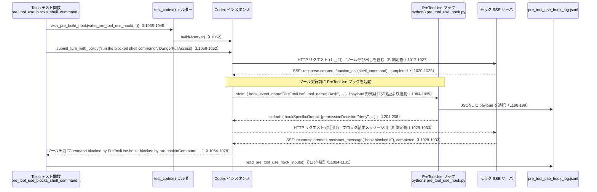

core/tests/suite/hooks.rs

---

## 0. ざっくり一言

Codex の「フック」機構（Stop / UserPromptSubmit / PreToolUse / PostToolUse / SessionStart）が、期待どおりに動作するかを検証する統合テスト群と、そのための補助関数をまとめたファイルです（core/tests/suite/hooks.rs 全体）。

---

## 1. このモジュールの役割

### 1.1 概要

- Codex に外部フック（Python スクリプト）を hooks.json で登録し、  
  対話やツール実行の前後で「ブロック／コンテキスト付与／ログ記録」が行われることをテストします。
- 主なフック種別は Stop / UserPromptSubmit / PreToolUse / PostToolUse / SessionStart で、  
  それぞれがどの JSON を受け取り・どの JSON を返すとコアがどう振る舞うかを確認します（例: write_stop_hook: L39-84, write_pre_tool_use_hook: L177-238, 各テスト: L461-1818）。

### 1.2 アーキテクチャ内での位置づけ

このファイル単体から見える構成を図にすると、概ね次のようになります。

```mermaid
flowchart LR
    subgraph Test["Tokio テスト (hooks.rs)"]
        A[test_codex() ビルダー<br/>hooks.json を生成<br/>(L488-503 など)]
        T1[submit_turn / submit()<br/>で Op を送信<br/>(L505, L900-908)]
    end

    A --> C[Codex インスタンス<br/>(core_test_support::test_codex)]

    C -->|HTTP, SSE| S[モック SSE サーバ<br/>start_mock_server / start_streaming_sse_server<br/>(L465-486, L880-881)]
    C -->|hooks.json を解釈して<br/>外部コマンド起動| H[Python フックスクリプト群<br/>(stop_hook.py など)<br/>L39-347]

    H --> L1[JSONL ログファイル<br/>(*_hook_log.jsonl)<br/>L183-199, L259-262 など]
    L1 --> R[read_*_hook_inputs() で読取<br/>(L382-425)]

    S --> Q[Captured Requests<br/>(responses.requests(), server.requests())<br/>L507, L942-944 など]
    Q --> TestCheck[assert_* による検証<br/>(多数のテスト本体)]
```

- テストコード（本ファイル）が:
  - `with_pre_build_hook` で hooks.json と Python スクリプトを Codex ホームディレクトリに出力します（例: L488-496, L777-784）。
  - SSE モックサーバをセットアップし（L465-486, L1017-1035）、Codex インスタンスに接続します。
  - ユーザー入力やツール呼び出しを行い（`submit_turn`, `Op::UserInput` など: L505, L900-908, L1058-1062）、  
    その結果として送信されたリクエストやフックログファイルを検査します（L507-523, L1084-1105 など）。

このファイルだけでは Codex 本体の実装は分かりませんが、フックの入出力契約（どんな JSON が渡されるか）は具体的に読み取れます。

### 1.3 設計上のポイント

コードから読み取れる特徴は次のとおりです。

- **外部フックは Python コマンドとして起動**  
  - すべてのフックは `python3 <script>` 形式のコマンドとして hooks.json に登録されています（L69-79, L110-112, L164-167 など）。
  - フックへの入力は標準入力経由の JSON、出力も JSON 文字列として扱われます（各スクリプト中の `json.load(sys.stdin)` / `print(json.dumps(...))`）。

- **ログファイルによる観測**  
  - 各フックは JSONL 形式でログファイルに入力ペイロード（あるいは加工した record）を書き出します（例: pre_tool_use: L192-200, post_tool_use: L255-262, SessionStart: L320-328）。
  - テスト側は `read_*_hook_inputs` 系関数でそれらを読み戻し、フィールド内容を検証します（L382-425）。

- **ロールアウト・リクエストからのフックコンテキスト抽出**  
  - `rollout_hook_prompt_texts` はロールアウトログ（1 行 1 JSON）からユーザーメッセージ中の「フック用プロンプトフラグメント」を抽出します（L349-370）。
  - `request_hook_prompt_texts` や `request_message_input_texts` は HTTP リクエストボディから特定ロールのメッセージ内容を抜き出すヘルパーです（L372-380, L443-459）。

- **非同期・並行性**  
  - すべてのテストは `#[tokio::test(flavor = "multi_thread", worker_threads = 2)]` で実行され、  
    Codex の非同期挙動とストリーミング SSE を含めてテストします（L461, L575, L620 など）。
  - `blocked_queued_prompt_does_not_strand_earlier_accepted_prompt` では oneshot チャネルとポーリングでストリーミングを制御し、  
    キューされた複数プロンプトとフックの組み合わせを検証しています（L845-1005）。

- **エラーハンドリングの方針**  
  - 補助関数は多くが `anyhow::Result` を返し、I/O や JSON パース失敗時にコンテキスト付きエラーを返します（例: L42-43, L383-388）。
  - テストのセットアップ段階での失敗は `panic!` で即座にテスト失敗として扱われます（`with_pre_build_hook` 内の if let Err(error) ... panic!: L488-496 など）。
  - いくつかのヘルパー（`request_message_input_texts`）は JSON パースに失敗すると明示的に `panic!` します（L444-447）。

---

## 2. 主要な機能一覧

このモジュールが提供する主な機能を列挙します。

- Stop フック用スクリプトと hooks.json の生成（`write_stop_hook`, `write_parallel_stop_hooks`）
- UserPromptSubmit フックでのプロンプトブロックと追加コンテキスト付与のテスト（`write_user_prompt_submit_hook` とそれを使うテスト群）
- PreToolUse フックによる Bash / local shell / exec_command のブロック・フィードバック動作検証
- PostToolUse フックによるツール出力の上書き・追記コンテキストの検証
- SessionStart フックが materialized な transcript_path を受け取ることの検証
- ロールアウトログや HTTP リクエストからの「フックプロンプトフラグメント」抽出（`rollout_hook_prompt_texts`, `request_hook_prompt_texts`, `request_message_input_texts`）
- 各フックログファイル（JSONL）からの入力読み出しヘルパー（`read_*_hook_inputs` 群）
- ストリーミング SSE を用いた「キューされたプロンプト + フック」の並行シナリオ検証

---

## 3. 公開 API と詳細解説

### 3.1 型・関数一覧（主要コンポーネント）

このファイル内で定義される主な定数と関数の一覧です。

> 行番号はこのファイル内での位置を示します（例: L39-84 は core/tests/suite/hooks.rs:L39-84）。

| 名前 | 種別 | 役割 / 用途 | 定義位置 |
|------|------|-------------|----------|
| `FIRST_CONTINUATION_PROMPT` | 定数 `&'static str` | Stop フックが提示する 1 回目の継続プロンプト | L35 |
| `SECOND_CONTINUATION_PROMPT` | 定数 `&'static str` | Stop フックが提示する 2 回目の継続プロンプト | L36 |
| `BLOCKED_PROMPT_CONTEXT` | 定数 `&'static str` | ブロックされたプロンプトから次ターンに持ち越す developer コンテキスト | L37 |
| `write_stop_hook` | 関数 | Stop フック用の Python スクリプトと hooks.json を生成 | L39-84 |
| `write_parallel_stop_hooks` | 関数 | 複数 Stop フックスクリプトを並列登録し、複数フラグメントを返す設定を生成 | L86-126 |
| `write_user_prompt_submit_hook` | 関数 | UserPromptSubmit フック用スクリプトと hooks.json を生成 | L128-175 |
| `write_pre_tool_use_hook` | 関数 | PreToolUse フック用スクリプトと hooks.json（matcher 付き）を生成 | L177-238 |
| `write_post_tool_use_hook` | 関数 | PostToolUse フック用スクリプトと hooks.json を生成 | L240-309 |
| `write_session_start_hook_recording_transcript` | 関数 | SessionStart フック用スクリプトを生成し、transcript_path の有無をログ | L312-347 |
| `rollout_hook_prompt_texts` | 関数 | ロールアウトファイルから hook プロンプトフラグメントを抽出 | L349-370 |
| `request_hook_prompt_texts` | 関数 | `ResponsesRequest` から user ロールの hook フラグメントを抽出 | L372-380 |
| `read_stop_hook_inputs` 他 | 関数群 | 各フックの JSONL ログを読み込み `Vec<Value>` として返す | L382-425 |
| `ev_message_item_done` | 関数 | SSE 用の `response.output_item.done` イベント JSON を構築 | L427-437 |
| `sse_event` | 関数 | 単一イベントを SSE 文字列にラップ | L439-441 |
| `request_message_input_texts` | 関数 | HTTP リクエストボディからロール別の input_text を抽出 | L443-459 |
| `*_test` 群 | tokio テスト関数 | 各フックシナリオの統合テスト（16 本） | L461-1818 |

以下では、特に重要な 7 つの関数・テストについて詳しく説明します。

---

### 3.2 関数詳細

#### `write_stop_hook(home: &Path, block_prompts: &[&str]) -> Result<()>`  （L39-84）

**概要**

- Stop フック用の Python スクリプト `stop_hook.py` と、それを実行する hooks.json を Codex ホームディレクトリに書き出します。
- フックは呼び出し回数に応じて `decision: "block"` で `reason` を返すか、`systemMessage` を返すかを切り替えます（スクリプト本文: L44-65）。

**引数**

| 引数名 | 型 | 説明 |
|--------|----|------|
| `home` | `&Path` | Codex のホームディレクトリパス。ここにスクリプトと hooks.json を書き込みます。 |
| `block_prompts` | `&[&str]` | 各 Stop フック呼び出しで `decision: "block"` の `reason` として返す文字列配列。呼び出し回数がこの長さを超えたら `systemMessage` に切り替わります。 |

**戻り値**

- `Result<()>`  
  - 成功時は `Ok(())`。  
  - ファイル書き込みや JSON シリアライズに失敗した場合、`anyhow::Error` を返します（L42-43, L81-82）。

**内部処理の流れ**

1. `stop_hook.py` と `stop_hook_log.jsonl` のパスを `home` から生成（L40-41）。
2. `block_prompts` から JSON 文字列を生成（L42-43）。
3. フック Python スクリプト文字列を `format!` で組み立て（L44-65）:
   - 標準入力から JSON `payload` を読み込む（L52）。
   - 既存ログファイルを読み込み、非空行の数を `existing` としてカウント（L53-55）。
   - 今回の `payload` を JSONL として追記（L57-58）。
   - `invocation_index = len(existing)` を使い呼び出し回数を算出（L60）。
   - `invocation_index < len(block_prompts)` の間は `{"decision": "block", "reason": block_prompts[i]}` を出力し、それ以降は `systemMessage` を出力（L61-64）。
4. `hooks.json` には `Stop` イベントに対して 1 本の command フックを登録（L69-79）。
5. スクリプトと hooks.json を `fs::write` で出力（L81-82）。

**Examples（使用例）**

テストでは、`with_pre_build_hook` 内で使用されています（L488-496）。

```rust
.with_pre_build_hook(|home| {
    if let Err(error) = write_stop_hook(
        home,
        &[FIRST_CONTINUATION_PROMPT, SECOND_CONTINUATION_PROMPT],
    ) {
        panic!("failed to write stop hook test fixture: {error}");
    }
})
```

この設定により、1〜2 回目の Stop フック呼び出しは `block` を返し、3 回目以降は `systemMessage` による「通過」を返すようになります。

**Errors / Panics**

- `serde_json::to_string(block_prompts)` が失敗した場合（シリアライズ不可な値が含まれている場合）、エラー（L42-43）。
- `fs::write` に失敗した場合（パスが存在しない、権限不足など）、エラー（L81-82）。
- 呼び出し側テストは `if let Err(error) = ... { panic!(...) }` なので、いずれもテスト失敗として扱われます（L488-495）。

**Edge cases（エッジケース）**

- `block_prompts` が空スライスの場合:  
  - `len(block_prompts) == 0` なので、初回から `systemMessage` 分岐に入ります（スクリプト内の `if invocation_index < len(block_prompts)` 条件: L60-63）。  
  - このケースは本ファイル内ではテストされていませんが、ロジック上はブロックを一切行わず常に pass 相当になります。
- ログファイルが事前に存在しない場合:  
  - `existing = []` から開始し問題なく動作します（L53-55）。

**使用上の注意点**

- Python 3 が `python3` というコマンド名で利用可能であることを前提としています（hooks.json の `"command"`: L74）。
- 実運用コードで流用する場合、ログファイルの肥大化や権限、同一ディレクトリでの複数テスト並行実行に注意が必要ですが、このファイル内では単一テスト環境のみを想定しています。

---

#### `write_pre_tool_use_hook(home: &Path, matcher: Option<&str>, mode: &str, reason: &str) -> Result<()>` （L177-238）

**概要**

- PreToolUse フック用 Python スクリプトと hooks.json を出力します。
- フックはツール実行前に呼ばれ、`mode` に応じて:
  - JSON で `permissionDecision: "deny"` を返してツール実行をブロックする（`json_deny`）
  - `SystemExit(2)` で異常終了する（`exit_2`）  
 という動作を行います（スクリプト本文: L188-211）。

**引数**

| 引数名 | 型 | 説明 |
|--------|----|------|
| `home` | `&Path` | Codex ホームディレクトリパス |
| `matcher` | `Option<&str>` | hooks.json に設定する `"matcher"`（例えば `"^Bash$"`）。`Some` の場合だけ `group["matcher"]` に設定（L225-227）。|
| `mode` | `&str` | `"json_deny"` または `"exit_2"`。スクリプトの分岐に渡されます（L193, L201-211）。|
| `reason` | `&str` | ブロック理由などの文字列。スクリプト内 `reason` 変数として使われます（L194, L205-207, L209-210）。|

**戻り値**

- `Result<()>`。スクリプト・hooks.json の書き込みや JSON シリアライズに失敗した時に `Err`。

**内部処理の流れ**

1. `pre_tool_use_hook.py` と `pre_tool_use_hook_log.jsonl` のパスを決定（L183-184）。
2. `mode` と `reason` を JSON 文字列に変換（L185-186）。
3. Python スクリプト文字列を生成（L188-212）:
   - `payload = json.load(sys.stdin)` で Codex からの JSON ペイロードを受け取り（L196）。
   - `log_path` に `payload` を JSONL として追記（L198-199）。
   - `mode == "json_deny"` のときは `hookSpecificOutput.hookEventName = "PreToolUse"` などを含む JSON を `print`（L201-208）。
   - `mode == "exit_2"` のときは stderr に理由を書き、`SystemExit(2)` で終了（L209-211）。
4. hooks.json 用の `group` JSON を構築（L218-224）。  
   `matcher` が `Some` なら `group["matcher"]` に追加（L225-227）。
5. `"PreToolUse"` に対するフック設定を `hooks` としてまとめ（L229-232）、ファイル出力（L235-236）。

**Examples（使用例）**

シェルコマンドをブロックするテスト（L1008-1108）:

```rust
.with_pre_build_hook(|home| {
    if let Err(error) =
        write_pre_tool_use_hook(home, Some("^Bash$"), "json_deny", "blocked by pre hook")
    {
        panic!("failed to write pre tool use hook test fixture: {error}");
    }
})
```

この設定により、ツール名 `"Bash"` にマッチするツール実行時に PreToolUse フックが呼ばれ、ツールが実行される前に「deny」が返されます。テスト側では、実際にシェルが実行されず、出力に「Command blocked by PreToolUse hook: blocked by pre hook」が含まれることを検証しています（L1064-1079）。

**Errors / Panics**

- スクリプト生成時:
  - `serde_json::to_string(mode)` / `serde_json::to_string(reason)` の失敗（L185-186）。
  - `fs::write` の失敗（L235-236）。
- フック実行時:
  - `mode == "exit_2"` では `SystemExit(2)` による非ゼロ終了コードを返します（L209-211）。  
    Codex 側がこのケースをどう扱うかはこのファイルからは分かりませんが、テストでは「ブロックされた」として扱われています（例: exec_command のテスト: L1268-1275）。

**Edge cases**

- `matcher == None` の場合、hooks.json に `"matcher"` フィールドは設定されません（L225-227）。  
  テスト `pre_tool_use_does_not_fire_for_non_shell_tools` では `matcher: None` + ツール名 `"update_plan"` で「PreToolUse が発火しない」ことを確認しているため（L1324-1337, L1354-1358）、  
  実際の Codex 実装側で「非シェルツールには PreToolUse を適用しない」というロジックがあると推測できますが、具体実装はこのファイルからは分かりません。

**使用上の注意点**

- `"json_deny"` と `"exit_2"` 以外の `mode` 文字列に対してはスクリプトに分岐がなく、何も出力しません（L201-211）。  
  その場合 Codex 側の挙動はこのファイルからは読み取れません。
- `reason` に改行などが含まれる場合、stderr メッセージなどの表示に影響する可能性がありますが、テストでは単一行メッセージのみを使用しています。

---

#### `write_post_tool_use_hook(home: &Path, matcher: Option<&str>, mode: &str, reason: &str) -> Result<()>` （L240-309）

**概要**

- PostToolUse フック用 Python スクリプトと hooks.json を生成します。
- ツール実行後に呼ばれ、`mode` に応じて:
  - 追加コンテキストを返す（`context`）
  - ツール出力を「ブロック理由」に置き換える（`decision_block`）
  - ツール出力を「停止理由」に置き換える（`continue_false`）
  - 非ゼロ終了コードで終了する（`exit_2`）  
  などの動作を行います（L264-283）。

**引数**

`write_pre_tool_use_hook` と同様の構造で、意味だけ異なります。

| 引数名 | 型 | 説明 |
|--------|----|------|
| `home` | `&Path` | Codex ホームディレクトリ |
| `matcher` | `Option<&str>` | `"^Bash$"` など。対象ツールのフィルタリングに使用されます（L297-299）。|
| `mode` | `&str` | `"context"`, `"decision_block"`, `"continue_false"`, `"exit_2"` のいずれか。 |
| `reason` | `&str` | 追加コンテキストやブロック理由／停止理由に使用される文字列。 |

**内部処理の流れ（要点）**

- PreToolUse 版と同様に:
  - 標準入力から `payload` を読み込み、ログファイルに JSONL として追記（L259-262）。
  - `mode` ごとの分岐で JSON を `print` します（L264-283）。  
    例: `"context"` の場合 `hookSpecificOutput.additionalContext = reason`（L264-270）。
- hooks.json で `"PostToolUse"` に対して command フックを登録（L290-305）。

**Examples（使用例）**

追加コンテキストを developer メッセージに反映させるテスト（L1363-1458）:

```rust
.with_pre_build_hook(|home| {
    if let Err(error) =
        write_post_tool_use_hook(home, Some("^Bash$"), "context", post_context)
    {
        panic!("failed to write post tool use hook test fixture: {error}");
    }
})
```

テストでは:

- PostToolUse フックが返した `additionalContext` が次のリクエストの `"developer"` ロールメッセージに含まれること（L1415-1418）。
- かつ、元のツール出力 `"post-tool-output"` がモデルに届いていること（L1420-1427）。  

を検証しています。

**Errors / Panics**

- 生成段階のエラーは PreToolUse と同様（L248-249, L307-308）。
- フック実行時の `exit_2` モードは `SystemExit(2)` を発生させます（L281-283）。  
  テスト `post_tool_use_exit_two_replaces_one_shot_exec_command_output_with_feedback` では、  
  Codex 側がこれを検知し、ツール出力を `reason` 文字列に置き換えていることが検証されています（L1725-1732）。

**Edge cases**

- `mode` が既定の 4 つ以外のときは何も返さず終了します（L264-283）。Codex 側の挙動は不明です。
- `matcher == None` の場合、`post_tool_use_does_not_fire_for_non_shell_tools` によって  
  「非シェルツール (`update_plan`) では PostToolUse が発火せず、ログファイルも生成されない」ことが確認されています（L1758-1777, L1812-1816）。

---

#### `rollout_hook_prompt_texts(text: &str) -> Result<Vec<String>>` （L349-370）

**概要**

- ロールアウトファイル（1 行 1 JSON 形式のログ）から、ユーザーメッセージ内に埋め込まれた「フック用プロンプトフラグメント」を抽出します。
- Stop フックで追加された continuation プロンプトなどを後から検証するために使われます（利用箇所: L560-570, L748-757）。

**引数**

| 引数名 | 型 | 説明 |
|--------|----|------|
| `text` | `&str` | ロールアウトファイル全体の文字列。複数行の JSONL を想定。 |

**戻り値**

- `Result<Vec<String>>`  
  - 各行から抽出されたフラグメント文字列のリスト。  
  - JSON パース失敗時には `anyhow::Error`（`context("parse rollout line")`）を返します（L356）。

**内部処理の流れ**

1. 空の `texts` ベクタを用意（L350）。
2. `text.lines()` で各行をイテレートし、空行はスキップ（L351-355）。
3. 各行を `RolloutLine` としてデシリアライズ（L356）。
4. `rollout.item` が `RolloutItem::ResponseItem(ResponseItem::Message { role, content, .. })` かつ `role == "user"` の場合に限り、中の `content` を走査（L357-359）。
5. 各 `content` 要素が `ContentItem::InputText { text }` で、かつ `parse_hook_prompt_fragment(&text)` が `Some(fragment)` を返した場合、その `fragment.text` を `texts` に追加（L360-365）。
6. すべての行を処理後、`Ok(texts)` を返却（L369）。

**Examples（使用例）**

Stop フック継続プロンプトがロールアウトに保存されていることを確認するテスト（L560-570）:

```rust
let rollout_path = test.codex.rollout_path().expect("rollout path");
let rollout_text = fs::read_to_string(&rollout_path)?;
let hook_prompt_texts = rollout_hook_prompt_texts(&rollout_text)?;
assert!(
    hook_prompt_texts.contains(&FIRST_CONTINUATION_PROMPT.to_string()),
);
```

**Errors / Panics**

- 各行の JSON パースに失敗すると、`context("parse rollout line")` 付きのエラーになります（L356）。
- 途中の行でエラーになると、その時点で処理が停止し `Err` を返します。

**Edge cases**

- 空文字列または空行のみの入力: `texts` が空のまま `Ok(vec![])` を返します（L351-355, L369）。
- user ロール以外のメッセージ／`InputText` 以外の content アイテムはすべて無視されます（L357-363）。
- `parse_hook_prompt_fragment` が `None` を返した場合、そのテキストはフック由来ではないとみなされてスキップされます（L361-363）。

**使用上の注意点**

- 入力はロールアウトファイルの「生テキスト」である必要があります。部分的な JSON 抜粋や改行を意図的に変えた文字列に対しては正しく動作しません。

---

#### `request_message_input_texts(body: &[u8], role: &str) -> Vec<String>` （L443-459）

**概要**

- HTTP リクエストの JSON ボディ `body` から `"input"` 配列の `"message"` タイプ要素をたどり、指定ロール（`role`）の `"input_text"` を抽出します。
- `blocked_queued_prompt_does_not_strand_earlier_accepted_prompt` などで、「どのプロンプトがモデルに送られたか」を検証するために用います（L950-957）。

**引数**

| 引数名 | 型 | 説明 |
|--------|----|------|
| `body` | `&[u8]` | HTTP リクエストボディ（JSON）。 |
| `role` | `&str` | `"user"` や `"developer"` などのメッセージロール。 |

**戻り値**

- `Vec<String>`  
  指定ロールの `"input_text"` スパンのテキスト一覧。

**内部処理の流れ**

1. `serde_json::from_slice(body)` で `serde_json::Value` にパース。失敗した場合は `panic!("parse request body: {error}")`（L444-447）。
2. `"input"` フィールドを配列として取得（`body.get("input").and_then(Value::as_array)`）し、`into_iter().flatten()` でオプション・配列を統一的にイテレート（L448-451）。
3. 各 `item` について:
   - `"type" == "message"` でないものをフィルタで排除（L452）。
   - `"role" == role` でないものをフィルタで排除（L453）。
4. `"content"` を配列として取得し、その中の `"type" == "input_text"` の要素を選択（L454-456）。
5. `"text"` を `String` に変換し、収集（L457）。

**Examples（使用例）**

キューされたプロンプトの 2 回目のリクエストの user メッセージを検査する箇所（L950-957）:

```rust
let second_user_texts = request_message_input_texts(&requests[1], "user");
assert!(
    second_user_texts.contains(&"accepted queued prompt".to_string()),
);
assert!(
    !second_user_texts.contains(&"blocked queued prompt".to_string()),
);
```

**Errors / Panics**

- `body` が有効な JSON でない場合、もしくはトップレベルがオブジェクトでないなどで `serde_json::from_slice` が失敗すると `panic!` します（L444-447）。
- `"input"` フィールドが存在しない／配列でない場合は `and_then(Value::as_array)` が `None` を返し、その後の `into_iter().flatten()` で「空イテレータ」扱いとなるため、空配列を返します。

**Edge cases**

- 対象ロールの `"message"` が 1 件もない場合は空の `Vec` が返ります。
- `"content"` に `"input_text"` 以外のスパンが含まれていても無視されます（L456）。

**使用上の注意点**

- この関数はテスト用であり、エラー時に `Result` ではなく `panic!` します。  
  ライブラリコードとして利用する場合は、`Result` を返すようにラップする必要があります。

---

#### `blocked_queued_prompt_does_not_strand_earlier_accepted_prompt() -> Result<()>` （L845-1006）

**概要**

- 非同期ストリーミング SSE と UserPromptSubmit フックを組み合わせたシナリオテストです。
- 先に送ったプロンプト（accepted queued prompt）は通過し、後からキューされたプロンプトのうちブロック対象（blocked queued prompt）のみがモデルに送られないことを検証します（L950-957, L960-1002）。

**内部処理の流れ（高レベル）**

1. **SSE ストリーミングサーバのセットアップ**（L849-881）
   - `first_chunks`: 1 つ目のレスポンス `resp-1` を複数チャンクに分割し、最後の `completed` に oneshot チャネル `gate_completed_rx` を仕込みます（L849-871）。
   - `second_chunks`: 2 つ目のレスポンス `resp-2` をまとめて返すチャンク群（L872-879）。
   - `start_streaming_sse_server(vec![first_chunks, second_chunks])` でサーバを起動し、`server` を取得（L880-881）。

2. **Codex インスタンスの構築**（L883-898）
   - モデル `"gpt-5.1"` を指定（L884）。
   - `write_user_prompt_submit_hook(home, "blocked queued prompt", BLOCKED_PROMPT_CONTEXT)` を pre_build_hook で実行し、UserPromptSubmit フックを設定（L885-891）。

3. **初回プロンプト送信**（L900-909）
   - `Op::UserInput` で `"initial prompt"` を送信（L901-908）。
   - エージェントの出力デルタイベントが来るまで `wait_for_event` で待機（L911-914）。

4. **キューされた 2 つのプロンプト送信**（L916-927）
   - `"accepted queued prompt"` と `"blocked queued prompt"` を順に送信（L916-927）。

5. **SSE 完了ゲート解除**（L929-930）
   - 少し待ってから `gate_completed_tx.send(())` で 1 つ目のレスポンスを完了させる（L929-930）。

6. **サーバからのリクエストをポーリング取得**（L932-944）
   - 30 秒タイムアウト付きで `server.requests().await` をループし、2 件以上たまったら break（L932-943）。

7. **2 つ目のリクエスト内容を検証**（L948-958）
   - 2 件目の HTTP リクエストボディから user ロールの input_text を抽出（`request_message_input_texts` 使用: L950）。
   - `"accepted queued prompt"` が含まれ、`"blocked queued prompt"` が含まれないことを assert（L951-957）。

8. **UserPromptSubmit フックログの検証**（L960-1002）
   - `read_user_prompt_submit_hook_inputs` で 3 件のログを読み出し（L960-961）。
   - `prompt` フィールドが `"initial prompt"`, `"accepted queued prompt"`, `"blocked queued prompt"` の順になっていること（L962-977）。
   - 全ての `turn_id` が空でないこと、および 3 件の `turn_id` が全て同一であること（L978-1001）を検証。

**並行性 / 安全性のポイント**

- oneshot チャネルと `sleep` / `timeout` を組み合わせて、SSE ストリームの完了タイミングを制御しています（L849-871, L929-944）。
- 30 秒のタイムアウトが設定されており、2 件目のリクエストが来ない場合はテストが失敗します（L932-943）。
- `server.shutdown().await` を最後に呼んでおり、サーバリソースを明示的に解放しています（L1004-1004）。

**Edge cases**

- 2 件目のリクエストが 30 秒以内に届かない場合は `timeout` によりテスト失敗となります（L932-943）。
- フックログが 3 件未満の場合、`assert_eq!(hook_inputs.len(), 3)` によりテスト失敗になります（L960-961）。

---

#### `pre_tool_use_blocks_shell_command_before_execution() -> Result<()>` （L1008-1108）

**概要**

- PreToolUse フックにより、`shell_command` ツールの実行が実際に行われないことを検証するテストです。
- スクリプトは `"Command blocked by PreToolUse hook: <reason>"` をツール出力として返し、元のシェルコマンドを実行しないことを確認します（L1064-1082）。

**処理の流れ（要点）**

1. SSE モックサーバで、1 回目のレスポンスとして `shell_command` ツール呼び出し、2 回目のレスポンスとしてブロック結果メッセージを返すシナリオをセットアップ（L1017-1035）。
2. `write_pre_tool_use_hook(home, Some("^Bash$"), "json_deny", "blocked by pre hook")` で PreToolUse フックを設定（L1038-1045）。
3. テンポラリディレクトリに marker ファイルパスを決定し（L1013-1015）、既に存在していれば削除（L1054-1056）。
4. `"run the blocked shell command"` というプロンプトと `SandboxPolicy::DangerFullAccess` で turn を送信（L1058-1062）。
5. 2 件目のリクエストの `function_call_output` から `"output"` を取り出し、ブロック理由およびブロックされたコマンドが含まれることを検証（L1064-1078）。
6. marker ファイルが存在しないことを assert することで、コマンドが実際には実行されていないことを確認（L1079-1082）。
7. PreToolUse フックログを読み出し、`tool_name == "Bash"`, `tool_use_id == call_id`, `tool_input.command == command` などを確認（L1084-1090）。
8. transcript_path が非空で、かつ実在するファイルであることを検証（L1090-1100）。

**安全性 / エラー**

- コマンド実行前に PreToolUse が走ることにより、任意のシェルコマンド実行を防ぐシナリオをテストしています。
- marker ファイルを用いた「副作用確認」により、本当に実行されていないことを確認しています（L1079-1082）。
- transcript_path の materialization により、フックが過去対話ログへの参照を持てることを確認しています（L1090-1100）。

---

### 3.3 その他の関数

補助的な関数やテストヘルパーの一覧です。

| 関数名 | 役割（1 行） | 定義位置 |
|--------|--------------|----------|
| `write_parallel_stop_hooks` | 複数 Stop フックスクリプトと hooks.json を生成する | L86-126 |
| `write_user_prompt_submit_hook` | UserPromptSubmit フック用スクリプトと hooks.json を生成 | L128-175 |
| `write_session_start_hook_recording_transcript` | SessionStart フックで transcript_path の有無を JSONL に記録 | L312-347 |
| `request_hook_prompt_texts` | `ResponsesRequest` から user ロールの Hook フラグメントを抽出 | L372-380 |
| `read_stop_hook_inputs` | Stop フックログ（stop_hook_log.jsonl）を `Vec<Value>` で取得 | L382-389 |
| `read_pre_tool_use_hook_inputs` | PreToolUse フックログを読み出し | L391-398 |
| `read_post_tool_use_hook_inputs` | PostToolUse フックログを読み出し | L400-407 |
| `read_session_start_hook_inputs` | SessionStart フックログを読み出し | L409-416 |
| `read_user_prompt_submit_hook_inputs` | UserPromptSubmit フックログを読み出し | L418-425 |
| `ev_message_item_done` | SSE イベント `response.output_item.done` JSON を構築 | L427-437 |
| `sse_event` | 1 つの JSON を SSE フォーマット文字列に変換 | L439-441 |
| 16 本の `#[tokio::test]` 関数 | 各種フック動作と履歴・ロールアウト・ログを検証 | L461-1818 |

---

## 4. データフロー

### 4.1 代表的なシナリオ: PreToolUse でシェルコマンドをブロック

テスト `pre_tool_use_blocks_shell_command_before_execution`（L1008-1108）を例に、データの流れを整理します。



要点:

- Codex はツール呼び出しを受け取ると、実際のシェル実行前に PreToolUse フックを起動します。
- フックからの `permissionDecision:"deny"` を受けて、ツールを実行せずに「ブロックされたコマンド」と「理由」を含む文字列をツール出力として生成していることが、テストのアサーションから分かります（L1064-1078）。
- 同時に、フックの入力ペイロードが JSONL ログに残されていることが `read_pre_tool_use_hook_inputs` で検証されています（L1084-1090）。

---

## 5. 使い方（How to Use）

このファイルの関数やパターンはテスト用ですが、他のテストやデバッグ用途で再利用する際の基本的な流れを整理します。

### 5.1 基本的な使用方法

典型的なフックテストの流れ（PreToolUse の例）:

```rust
// 1. SSE モックサーバを用意する（hooks.rs:L1012-1035）
let server = start_mock_server().await;
let responses = mount_sse_sequence(&server, vec![ /* ... */ ]).await;

// 2. Codex ビルダーを作成し、pre_build_hook で hooks.json を書き込む（L1038-1045）
let mut builder = test_codex()
    .with_pre_build_hook(|home| {
        write_pre_tool_use_hook(
            home,
            Some("^Bash$"),        // matcher
            "json_deny",           // mode
            "blocked by pre hook", // reason
        ).unwrap();
    })
    .with_config(|config| {
        config.features.enable(Feature::CodexHooks).unwrap();
    });

// 3. Codex インスタンスをビルド（L1052）
let test = builder.build(&server).await?;

// 4. 入力を送信し、フックの影響を含む挙動をテスト（L1058-1062）
test.submit_turn_with_policy(
    "run the blocked shell command",
    codex_protocol::protocol::SandboxPolicy::DangerFullAccess,
).await?;

// 5. モックサーバのリクエストとフックログを検証（L1064-1105）
let requests = responses.requests();
let hook_inputs = read_pre_tool_use_hook_inputs(test.codex_home_path())?;
```

### 5.2 よくある使用パターン

1. **Stop フックで継続プロンプト履歴をテスト**

   - `write_stop_hook` / `write_parallel_stop_hooks` で Stop フックを設定（L488-496, L718-726）。
   - `request_hook_prompt_texts` で 2 回目以降のリクエストの user メッセージから continuation プロンプトを抽出し、期待どおりか検証（L509-521, L739-745）。

2. **UserPromptSubmit でブロックされたプロンプトの扱いをテスト**

   - `write_user_prompt_submit_hook` で特定プロンプトをブロックしつつ developer コンテキストを保持（L777-784）。
   - 次ターンの request で developer ロールにコンテキストが含まれ、user ロールからはブロックされたプロンプトが除外されていることを確認（L797-816）。

3. **PostToolUse でツール出力の後処理をテスト**

   - `write_post_tool_use_hook` + `mode: "context" / "decision_block" / "continue_false" / "exit_2"` を使い分け（例: L1393-1400, L1490-1497, L1559-1566）。
   - 次ターンの developer ロールにコンテキストが載る／ツール出力が理由文字列に差し替わる／などをアサート（L1415-1418, L1511-1516, L1580-1585）。

### 5.3 よくある間違い

このファイルから推測できる「やってはいけない／忘れがちな点」は次のとおりです。

```rust
// 間違い例: CodexHooks 機能フラグを有効にしていない（フックが動かない）
let mut builder = test_codex();
// builder.with_pre_build_hook(...) だけ設定して config.features.enable をしない

// 正しい例（hooks.rs:L497-502 など）
let mut builder = test_codex()
    .with_pre_build_hook(|home| {
        write_stop_hook(home, &[FIRST_CONTINUATION_PROMPT]).unwrap();
    })
    .with_config(|config| {
        config.features.enable(Feature::CodexHooks).unwrap();
    });
```

- Feature フラグ `Feature::CodexHooks` を有効化しないと、フックは一切動かないと考えられます（全テストで必ず有効化していることから: L497-502 他）。
- PreToolUse / PostToolUse の `matcher` はツール名と一致するように設定する必要があります。例では `"^Bash$"` を使っており、ツール名 `"Bash"` を正確にマッチさせています（L1040-1042, L1145-1147）。

### 5.4 使用上の注意点（まとめ）

- すべてのフックスクリプトは Python で書かれ、`python3` が利用可能であることが前提です。
- ログファイルは JSONL（1 行 1 JSON）形式で追記され、テストではそれを全読みして検証します（L383-388 など）。  
  大量のログを扱う場合は別途ローテーションや削除を考慮する必要がありますが、このファイルでは想定していません。
- `request_message_input_texts` は JSON パース失敗時に `panic!` するため、外部入力に対して使う場合は注意が必要です（L444-447）。

---

## 6. 変更の仕方（How to Modify）

### 6.1 新しいフックシナリオを追加する場合

1. **スクリプト生成ヘルパーを追加**
   - 既存の `write_*_hook` 関数（Stop / PreToolUse / PostToolUse など）を参考に、新しいフックスクリプトと hooks.json の生成関数を追加します（L39-347）。
   - ログ用 JSONL ファイルのパスと記録内容を決め、`read_*_hook_inputs` と同様の読み出し関数を追加するとテストが書きやすくなります（L382-425）。

2. **テスト本体を作成**
   - `#[tokio::test(flavor = "multi_thread", worker_threads = 2)]` で非同期テストを定義し（L461 以降のパターンを参考）、`test_codex()` で Codex インスタンスをセットアップします。
   - SSE モックサーバ（`mount_sse_once` / `mount_sse_sequence` / `start_streaming_sse_server`）を利用して、期待するモデルの応答シナリオを構築します（L465-486, L1017-1035 など）。
   - フックログと HTTP リクエストから、契約どおりのフィールドが渡されていることを `assert_*` で検証します。

3. **データフローを意識してアサーションを配置**
   - 「いつフックが呼ばれるか」「どのプロンプト／ツール呼び出しに対応するか」を明示的にテストするため、  
     `turn_id`, `tool_use_id`, `transcript_path` などのフィールドをチェックするパターンを再利用します（L523-558, L1084-1105, L1431-1455 など）。

### 6.2 既存の機能を変更する場合

- **フック入力・出力の JSON 形式を変える場合**
  - スクリプト側の JSON キーを変更すると、テストで検証しているキー（`hook_event_name`, `tool_input.command`, `tool_response` など）がズレるため、  
    対応する `assert_eq!` 箇所をすべて追跡し、更新する必要があります（例: PreToolUse テストの L1084-1090, PostToolUse テストの L1431-1439 など）。
- **ロギングを変える場合**
  - JSONL ログの書式を変えると、`read_*_hook_inputs` が `serde_json::from_str` でパースできなくなる可能性があります（L383-388）。
  - ログ形式を変える場合は、新しいパーサ（またはバージョン識別）を追加した上でテストを更新する必要があります。
- **並行シナリオの挙動を変える場合**
  - `blocked_queued_prompt_does_not_strand_earlier_accepted_prompt` のようなテストは、  
    キューされたプロンプトとフックの組み合わせに強く依存しています（L916-927, L950-1002）。
  - プロンプトキューイングやフックの適用タイミングを変える場合は、このテストを含め、複数のテストを再設計する必要があります。

---

## 7. 関連ファイル

このモジュールと密接に関係する外部モジュール（コード自体はこのチャンクには含まれていませんが、use 句から分かるもの）です。

| パス / モジュール | 役割 / 関係 |
|-------------------|------------|
| `core_test_support::test_codex` | テスト用 Codex インスタンスを構築するビルダーを提供。`test_codex()` から使用（L27, L488 など）。 |
| `core_test_support::responses` | SSE モックサーバの起動・レスポンスイベント生成・リクエストキャプチャなどを提供（L15-23, L465-486, L1017-1035 など）。 |
| `core_test_support::streaming_sse` | ストリーミング SSE サーバとチャンク制御用の型 `StreamingSseChunk` を提供（L25-26, L849-881）。 |
| `codex_protocol::protocol` | `EventMsg`, `Op`, `RolloutLine`, `RolloutItem` など、Codex プロトコルの型定義を提供（L10-13, L900-908 など）。 |
| `codex_protocol::items::parse_hook_prompt_fragment` | メッセージテキストからフック用プロンプトフラグメントを抽出する関数。`rollout_hook_prompt_texts` 等で使用（L7, L349-370, L372-380）。 |
| `codex_shell_command::parse_command::shlex_join` | ローカルシェルコマンド配列を 1 つの文字列に結合するユーティリティ。Pre/PostToolUse のテストで使用（L1178-1181, L1192-1194, L1600-1607, L1660-1662）。 |
| `core_test_support::wait_for_event` | Codex からのイベント（SSE ストリーム内）を待機するヘルパー関数（L28, L911-914）。 |

---

## Bugs / Security / Contracts / Edge Cases まとめ

このチャンクから読み取れる範囲での注意点を簡潔にまとめます。

- **セキュリティ**
  - フックは任意の Python スクリプトを `python3` 経由で実行します（L69-79, L110-112, L164-167 など）。実運用で同様の仕組みを使う場合は、  
    スクリプト置き場や内容の検証、権限分離が重要です。  
    このファイルではテスト環境のみを想定しており、セキュリティ対策は記述されていません。
  - PreToolUse / PostToolUse はツール実行のブロック・結果の上書きを通じて安全性を高める意図があり、  
    特にシェルコマンド実行（Bash / local shell / exec_command）に対する保護がテストされています（L1008-1289, L1363-1744）。

- **Contracts（契約）**
  - 各フックには暗黙の JSON 契約があります（`hook_event_name`, `tool_name`, `tool_use_id`, `transcript_path`, `turn_id` 等）。  
    テストはそれらが必ず非空・期待どおりの値であることを検証しており（例: L523-558, L1084-1105, L1431-1455）、  
    将来の変更ではこれらのフィールドを維持する必要があると解釈できます。
  - UserPromptSubmit フックはブロックされたプロンプトの `prompt` と `turn_id` を必ず受け取る前提であり（L818-840, L960-1002）、  
    ブロックされたプロンプトはモデルに送られないが、追加コンテキストは次ターンに developer ロールで渡されることが契約になっています（L793-816, L797-802）。

- **エッジケース**
  - ログファイル読み出し関数は、「ファイルが存在しない」ケースを考慮していません。`fs::read_to_string` は失敗時にエラーを返し、テストもそれを前提にしています（L382-425）。  
    実コードで流用する場合は、ファイルの有無を事前にチェックする必要があります。
  - `request_message_input_texts` は JSON 形式の破損を想定せず `panic!` を使っており（L444-447）、外部からの入力に対してはラップが必要です。

- **並行性**
  - `blocked_queued_prompt_does_not_strand_earlier_accepted_prompt` は、ストリーミング SSE と複数プロンプト＋フックの組み合わせが  
    キューを詰まらせないこと（strand しないこと）を保証するテストであり（L845-1002）、  
    Codex 実装の非同期キュー処理に対する回帰テストとして機能します。

このファイルはあくまでテストコードですが、Codex Hooks の入出力・エラー処理・並行シナリオに関する重要な契約を確認する上で有用なリファレンスになっています。
