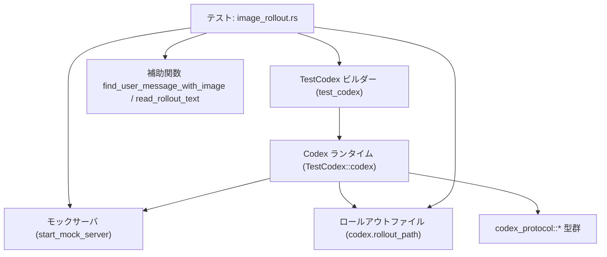
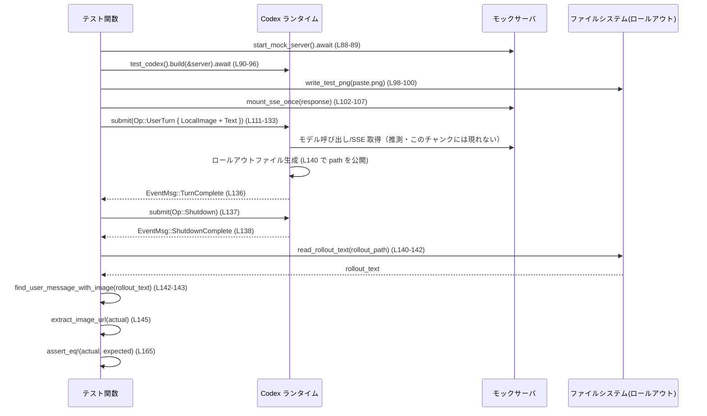

# core/tests/suite/image_rollout.rs コード解説

## 0. ざっくり一言

- Codex の「ロールアウトファイル」に記録されたイベント群から、**ユーザー画像入力付きメッセージが期待どおりの形で残っているか**を検証するテストモジュールです（image_rollout.rs:L27-252）。
- ローカル画像のコピペと、ブラウザ等からのドラッグ＆ドロップ画像の 2 パターンについて、ロールアウトの **Request 形状（タグ＋画像＋テキスト）** が保持されていることを確認します（image_rollout.rs:L84-168, L170-252）。

---

## 1. このモジュールの役割

### 1.1 概要

- このモジュールは、Codex がユーザーからの画像入力を受け取り、**内部的にログされるロールアウト（RolloutLine 群）** において、その入力が正しいプロトコル表現（`ContentItem` の並び）になっていることを検証するために存在します（image_rollout.rs:L33-48, L84-168, L170-252）。
- ローカルファイル経由の画像 (`UserInput::LocalImage`) と、URL/データ URI で与えられる画像 (`UserInput::Image`) の双方について、ロールアウトに現れる `ResponseItem::Message` が期待したタグ構造を持つことを確認します（image_rollout.rs:L114-121, L197-205, L146-163, L230-247）。
- ロールアウトファイルは Codex 本体が生成するため、このテストは Codex の **エンドツーエンドテスト**として機能します（image_rollout.rs:L88-107, L140-142, L174-191, L224-225）。

### 1.2 アーキテクチャ内での位置づけ

このファイルはテストコードであり、Codex 本体・プロトコル定義・テスト支援ライブラリに依存します。おおまかな関係は次のとおりです。



- `test_codex().build(&server)` が Codex のテスト用ラッパを初期化し（image_rollout.rs:L90-96）、その中の `codex` が実際のリクエスト送信・ロールアウト出力を行います。
- `start_mock_server` と `responses::mount_sse_once` により、Codex が接続する**モックバックエンドサーバ**が起動されます（image_rollout.rs:L88-89, L102-107, L174-175, L186-191）。
- テストは Codex に `Op::UserTurn` を送信（image_rollout.rs:L111-133, L195-217）し、`wait_for_event` で `EventMsg::TurnComplete` / `ShutdownComplete` を待ちます（image_rollout.rs:L136-138, L220-222）。
- 生成されたロールアウトファイルを `read_rollout_text` と `find_user_message_with_image` で読み取り・抽出し、期待する `ResponseItem::Message` と比較します（image_rollout.rs:L140-163, L224-247）。

> `TestCodex` や `codex_protocol` 各型の実装はこのチャンクには現れません。名前と使用箇所からのみ役割を説明しています。

### 1.3 設計上のポイント

- **補助関数によるロールアウト解析の共通化**  
  - ロールアウトファイルからユーザー画像メッセージを取り出す処理を `find_user_message_with_image` に切り出し（image_rollout.rs:L27-49）、2 つのテストで共通利用しています（image_rollout.rs:L142-143, L226-227）。
- **ロールアウトファイルの安定化をポーリングで待つ**  
  - `read_rollout_text` は最大 50 回（約 1 秒）ポーリングし、ファイルが存在しかつ非空になるのを待ってから読み取ります（image_rollout.rs:L61-70）。
  - それでも条件を満たさない場合は最後に 1 回だけ読み取りを試み、`anyhow::Context` でエラーメッセージにパス情報を付加します（image_rollout.rs:L71-73）。
- **ファイルシステム利用の安全性**  
  - テスト用 PNG を書き込む前に必ず親ディレクトリを作成し（image_rollout.rs:L75-79）、`?` 演算子で I/O エラーをそのままテスト失敗として扱います（image_rollout.rs:L75-82, L100）。
- **Rust のエラーハンドリングと非同期処理**  
  - すべてのテスト関数は `anyhow::Result<()>` を返し、`?` による早期リターンで失敗を伝播します（image_rollout.rs:L84-85, L170-171）。
  - `#[tokio::test(flavor = "multi_thread", worker_threads = 2)]` により、Tokio のマルチスレッドランタイム上で非同期テストとして実行されます（image_rollout.rs:L84, L170）。

---

## 2. 主要な機能一覧

- ロールアウトテキストから、**ユーザーの画像付きメッセージを 1 件検索する**（image_rollout.rs:L27-49）。
- `ResponseItem` から、**画像 URL（`ContentItem::InputImage`）を抽出する**（image_rollout.rs:L51-59）。
- ロールアウトファイルの存在・非空をポーリングで待ち、**テキストとして読み込む**（image_rollout.rs:L61-73）。
- 指定色の 2x2 PNG 画像ファイルを **テスト用に生成して保存する**（image_rollout.rs:L75-82）。
- ローカル画像のコピペ入力が、**特定のタグ構造を持つロールアウト Request として保存されることを検証するテスト**（image_rollout.rs:L84-168）。
- ドラッグ＆ドロップ画像入力が、**別種のタグ構造を持つロールアウト Request として保存されることを検証するテスト**（image_rollout.rs:L170-252）。

### 2.1 コンポーネント一覧（関数）

| 名前 | 種別 | 役割 / 用途 | 定義行 |
|------|------|-------------|--------|
| `find_user_message_with_image` | 関数 | ロールアウトテキストから、ユーザーの画像付きメッセージ (`ResponseItem::Message`) を 1 件抽出する | image_rollout.rs:L27-49 |
| `extract_image_url` | 関数 | `ResponseItem::Message` の `content` から最初の `ContentItem::InputImage` の URL を取得する | image_rollout.rs:L51-59 |
| `read_rollout_text` | 非同期関数 | ロールアウトファイルの存在・非空を最大 50 回ポーリングしてからテキスト読み込みを行う | image_rollout.rs:L61-73 |
| `write_test_png` | 関数 | 指定した RGBA 色の 2x2 PNG 画像を、必要ならディレクトリ作成の上で保存する | image_rollout.rs:L75-82 |
| `copy_paste_local_image_persists_rollout_request_shape` | 非同期テスト関数 | ローカル画像のコピペ入力がロールアウトに期待どおりの `ContentItem` 列として保存されるかを検証する | image_rollout.rs:L84-168 |
| `drag_drop_image_persists_rollout_request_shape` | 非同期テスト関数 | URL/データ URI 画像のドラッグ＆ドロップ入力がロールアウトに期待どおりの `ContentItem` 列として保存されるかを検証する | image_rollout.rs:L170-252 |

---

## 3. 公開 API と詳細解説

### 3.1 型一覧（構造体・列挙体など）

このファイル内で新たに定義される型（構造体・列挙体など）はありません。

- 使用している主な外部型（定義はこのチャンクには現れません）:
  - `ResponseItem` (`codex_protocol::models::ResponseItem`) — Codex プロトコル上のレスポンス要素（メッセージなど）を表す列挙体（image_rollout.rs:L3, L146-163, L230-247）。
  - `ContentItem` (`codex_protocol::models::ContentItem`) — メッセージ中のテキストや画像などのスパンを表す列挙体（image_rollout.rs:L2, L40-42, L150-159, L234-243）。
  - `RolloutLine`, `RolloutItem` — ロールアウトファイルの 1 行とその中身を表す型（image_rollout.rs:L7-8, L33-44）。
  - `UserInput` — Codex へのユーザー入力（テキスト・画像など）を表す列挙体（image_rollout.rs:L10, L114-121, L197-205）。
  - `Op`, `EventMsg` — Codex に送る操作と、Codex からのイベントを表す列挙体（image_rollout.rs:L5-6, L111-133, L136-138, L195-217, L220-222）。
  - `AskForApproval`, `SandboxPolicy` — Codex 実行時の承認ポリシー・サンドボックス方針（image_rollout.rs:L4, L9, L124-127, L208-211）。
  - `TestCodex` — テストで Codex を起動・制御するためのヘルパー型（image_rollout.rs:L18, L90-96, L176-182）。

これらの型の正確な定義内容は、このチャンクには現れません。

---

### 3.2 関数詳細

#### `find_user_message_with_image(text: &str) -> Option<ResponseItem>`

**概要**

- ロールアウトファイルの生テキスト（複数行）を受け取り、  
  **「ユーザーの画像付きメッセージ」に対応する `ResponseItem`** を最初に見つかった 1 つだけ返します（image_rollout.rs:L27-49）。

**引数**

| 引数名 | 型 | 説明 |
|--------|----|------|
| `text` | `&str` | ロールアウトファイル全体の内容。各行が JSON 文字列として `RolloutLine` を表すことを期待しています（image_rollout.rs:L27-28）。 |

**戻り値**

- `Option<ResponseItem>`  
  - 条件に合致するユーザーメッセージが見つかれば `Some(ResponseItem)`（`RolloutItem::ResponseItem` のクローン）を返します（image_rollout.rs:L43-46）。
  - 見つからなければ `None` を返します（image_rollout.rs:L48）。

**内部処理の流れ**

1. `text.lines()` で各行に分割し、ループします（image_rollout.rs:L27-28）。
2. 各行を `trim()` した結果が空文字列ならスキップします（image_rollout.rs:L29-32）。
3. `serde_json::from_str::<RolloutLine>(trimmed)` で JSON をパースし、失敗した行はスキップします（image_rollout.rs:L33-36）。
4. パース結果の `rollout.item` が  
   `RolloutItem::ResponseItem(ResponseItem::Message { role, content, .. })` にマッチし、
   かつ次の条件を満たすかをチェックします（image_rollout.rs:L37-43）:
   - `role == "user"`（ユーザーメッセージである）（image_rollout.rs:L39）。
   - `content` の中に `ContentItem::InputImage { .. }` が 1 つ以上含まれる（image_rollout.rs:L40-42）。
5. 条件を満たした場合、`rollout.item.clone()` を再度 `RolloutItem::ResponseItem(item)` としてパターンマッチしなおし、`item`（`ResponseItem`）を `Some(item)` で返します（image_rollout.rs:L43-46）。
6. 最後まで見つからなければ `None` を返します（image_rollout.rs:L48）。

**Examples（使用例）**

テスト内での使用例です。ロールアウトファイルを読み込んだ後、ユーザー画像メッセージを 1 件取り出しています（image_rollout.rs:L140-143）。

```rust
// ロールアウトファイルからテキストを取得する（read_rollout_text を使用）
let rollout_text = read_rollout_text(&rollout_path).await?;          // image_rollout.rs:L140-142

// ユーザー画像メッセージを抽出する
let actual = find_user_message_with_image(&rollout_text)             // image_rollout.rs:L142
    .expect("expected user message with input image in rollout");    // 見つからなければテスト失敗
```

**Errors / Panics**

- この関数自身は `Result` ではなく `Option` を返すため、**パニックやエラーを発生させません**。
- JSON パース失敗 (`serde_json::from_str` の `Err`) は即座にスキップされ、テスト失敗には直結しません（image_rollout.rs:L33-36）。
- 呼び出し側で `.expect(...)` を行っているため（image_rollout.rs:L142-143, L226-227）、  
  条件に合致するメッセージが存在しない場合は **テスト側でパニック** します。

**Edge cases（エッジケース）**

- ロールアウトテキストが空文字列、または空行のみ:  
  - 全行スキップされ `None` を返します（image_rollout.rs:L29-32, L48）。
- JSON でない行や、`RolloutLine` としてパースできない行:  
  - `serde_json::from_str` が `Err` を返し、その行は無視されます（image_rollout.rs:L33-36）。
- `RolloutItem::ResponseItem` ではない行:  
  - `if let` のパターンにマッチせず、スキップされます（image_rollout.rs:L37-38）。
- `role != "user"` のメッセージ:  
  - ユーザー以外（例: assistant）のメッセージは除外されます（image_rollout.rs:L39）。
- `InputImage` を含まないユーザーメッセージ:  
  - `content.iter().any(...)` が `false` となり、除外されます（image_rollout.rs:L40-42）。
- 複数の候補がある場合:  
  - 最初に条件を満たした 1 件のみを返します（image_rollout.rs:L45）。

**使用上の注意点**

- 複数のユーザー画像メッセージがロールアウトに含まれる場合でも、**先頭の 1 件しか取得しない**点に注意が必要です。
- JSON 形式や `RolloutLine` の構造が変更された場合、この関数のパターンマッチが成立しなくなり、  
  常に `None` を返す可能性があります。その場合テストは `.expect` により失敗します。
- 処理は `text` 内の全行に対して逐次行われますが、典型的なロールアウトサイズであればパフォーマンス上の問題は小さいと考えられます（このチャンクのコードからの推測です）。

---

#### `extract_image_url(item: &ResponseItem) -> Option<String>`

**概要**

- `ResponseItem` がメッセージ (`ResponseItem::Message`) の場合、その `content` の中から **最初の `ContentItem::InputImage` の `image_url` を取り出して返す**ヘルパー関数です（image_rollout.rs:L51-59）。

**引数**

| 引数名 | 型 | 説明 |
|--------|----|------|
| `item` | `&ResponseItem` | ロールアウトから抽出したレスポンス要素。メッセージであることが期待されます（image_rollout.rs:L51-53）。 |

**戻り値**

- `Option<String>`  
  - `ResponseItem::Message` かつ `content` に `ContentItem::InputImage` があれば、その `image_url` を `String` として `Some(...)` で返します（image_rollout.rs:L53-55）。
  - 該当する画像がなければ `None` を返します（image_rollout.rs:L55-57）。

**内部処理の流れ**

1. `match item` によりバリアントを判定します（image_rollout.rs:L51-53）。
2. `ResponseItem::Message { content, .. }` の場合、`content.iter().find_map(...)` で最初の `InputImage` を検索します（image_rollout.rs:L53-56）。
3. `ContentItem::InputImage { image_url }` にマッチした時点で `Some(image_url.clone())` を返します（image_rollout.rs:L54-55）。
4. 見つからなかった場合は `None` を返します（image_rollout.rs:L55）。
5. `ResponseItem::Message` 以外のバリアントの場合も `None` を返します（image_rollout.rs:L57-58）。

**Examples（使用例）**

テスト内で、ロールアウトから抽出した `ResponseItem` から画像 URL を得るために使用されています（image_rollout.rs:L145, L229）。

```rust
// find_user_message_with_image で取得した ResponseItem から画像 URL を抽出
let image_url = extract_image_url(&actual)                    // image_rollout.rs:L145
    .expect("expected image url in rollout");                // 見つからなければテスト失敗
```

**Errors / Panics**

- この関数自身はパニックしません。戻り値は `Option<String>` です。
- 呼び出し側が `.expect(...)` を使用しているため、画像が存在しない場合は **テストがパニック** します（image_rollout.rs:L145, L229）。

**Edge cases（エッジケース）**

- `ResponseItem` がメッセージではない場合（例: もし別のバリアントが存在するとすれば）:
  - 常に `None` となります（image_rollout.rs:L57-58）。
- `content` に複数の `InputImage` が含まれる場合:
  - 最初の 1 つのみが返されます（`find_map` の仕様）（image_rollout.rs:L53-55）。
- `content` に画像が 1 つもない場合:
  - `None` を返します（image_rollout.rs:L55-56）。

**使用上の注意点**

- メッセージに複数画像がある場合も、**1 枚目のみを対象とする**ことを前提にしてください。
- 画像 URL は `clone()` で `String` として複製するため、大きな文字列が大量に処理されるケースではオーバーヘッドになり得ますが、このファイルではテスト用途に限定されています（image_rollout.rs:L54）。

---

#### `read_rollout_text(path: &Path) -> anyhow::Result<String>`

**概要**

- 指定されたパスのロールアウトファイルについて、**ファイルが存在し・内容が非空になるまで最大 50 回（約 1 秒）ポーリング**し、その後テキストとして読み出して返す非同期関数です（image_rollout.rs:L61-73）。
- 主に Codex がロールアウトを書き終えるまでのタイミング差を吸収するために使われています（image_rollout.rs:L140-142, L224-225）。

**引数**

| 引数名 | 型 | 説明 |
|--------|----|------|
| `path` | `&Path` | ロールアウトファイルのパス。`codex.rollout_path()` により得られます（image_rollout.rs:L61, L140-141, L224-225）。 |

**戻り値**

- `anyhow::Result<String>`  
  - 成功時: ファイル内容全体の文字列。
  - 失敗時: `std::fs::read_to_string` 起因の I/O エラーに、`with_context` で `"read rollout file at {path}"` の文脈が追加された `anyhow::Error` を返します（image_rollout.rs:L71-73）。

**内部処理の流れ**

1. `for _ in 0..50` で最大 50 回ループします（image_rollout.rs:L62）。
2. 各ループで次をチェックします（image_rollout.rs:L63-66）:
   - `path.exists()` が真。
   - `std::fs::read_to_string(path)` が `Ok(text)` を返す。
   - `text.trim()` が空でない。
3. 上記条件をすべて満たした場合、`Ok(text)` をそのまま返します（image_rollout.rs:L67）。
4. 条件を満たさない場合は `tokio::time::sleep(Duration::from_millis(20)).await` で 20ms 待機します（image_rollout.rs:L69）。
5. 50 回の試行後も条件を満たせない場合、最後に 1 回だけ `std::fs::read_to_string(path)` を行い、その結果を `with_context` でラップして返します（image_rollout.rs:L71-73）。  
   - この最後の読み取りでは「非空チェック」を行わず、ファイルが空でも `Ok("")` として返します。

**Examples（使用例）**

テスト内で、ロールアウトファイルを読み込むのに使用されています（image_rollout.rs:L140-142, L224-225）。

```rust
// Codex からロールアウトファイルのパスを取得
let rollout_path = codex.rollout_path().expect("rollout path");  // image_rollout.rs:L140

// ファイルが生成されるのを待ちつつテキストとして読み込む
let rollout_text = read_rollout_text(&rollout_path).await?;      // image_rollout.rs:L141-142
```

**Errors / Panics**

- ファイルシステムに関するエラー（存在しないパス、パーミッションエラー等）は `std::fs::read_to_string` からのエラーとして `Err(anyhow::Error)` で返されます（image_rollout.rs:L71-73）。
- `path.exists()` は失敗してもパニックはしません（標準ライブラリ仕様）。この関数内に `unwrap` / `expect` は存在しません。
- 呼び出し側のテスト関数は `?` 演算子で `anyhow::Result` を伝播させているため、エラーが発生するとテストは失敗します（image_rollout.rs:L85, L171）。

**Edge cases（エッジケース）**

- ファイルが作成される前に関数が呼ばれた場合:
  - 最大 50 回まで `path.exists()` が `false` のため待機を繰り返し、その後最終的に 1 回だけ読み込みを試みます（image_rollout.rs:L61-73）。
- ファイルは存在するが常に空のままの場合:
  - ポーリング中はすべて弾かれ、最終読み込みで空文字列 `""` が返ります（image_rollout.rs:L63-67, L71-73）。
  - その後の `find_user_message_with_image` でユーザー画像メッセージが見つからず、テストが `.expect` で失敗する可能性があります（image_rollout.rs:L142-143, L226-227）。
- ファイルが後から削除されるなど、存在チェックと読み込みの間で状態が変化した場合:
  - このような TOCTOU（存在チェックと使用の間の競合）に起因するエラーは `read_to_string` の `Err` として `anyhow::Error` になり得ます（この点は一般的なファイル I/O の動作からの説明であり、このチャンクに具体的な再現例はありません）。

**使用上の注意点**

- テスト用途とはいえ、`std::fs::read_to_string` は同期 I/O であり、Tokio のスレッドをブロックします。ファイルサイズが大きくなるとパフォーマンスに影響する可能性がありますが、このテストではロールアウトファイルのサイズは小さいと想定されています。
- ポーリングの最大待機時間は `50 * 20ms = 約 1 秒` であり（image_rollout.rs:L62, L69）、Codex がロールアウトを書き出すまで 1 秒以上かかるような性能・環境ではテスト失敗の原因になり得ます（codex の実装依存であり、このチャンクには書かれていません）。
- `with_context` によりエラーにはパス情報が含まれるため、**失敗時の診断は比較的容易**です（image_rollout.rs:L71-73）。

---

#### `write_test_png(path: &Path, color: [u8; 4]) -> anyhow::Result<()>`

**概要**

- テスト用に、指定した RGBA 色で塗りつぶされた 2x2 ピクセルの PNG 画像ファイルを生成し、`path` に保存します（image_rollout.rs:L75-82）。

**引数**

| 引数名 | 型 | 説明 |
|--------|----|------|
| `path` | `&Path` | 画像ファイルを書き込むパス。親ディレクトリが存在しない場合は作成されます（image_rollout.rs:L75-79, L98-100）。 |
| `color` | `[u8; 4]` | RGBA（赤, 緑, 青, アルファ）の 4 byte 配列。各値は 0–255 の範囲を想定しています（image_rollout.rs:L75, L79）。 |

**戻り値**

- `anyhow::Result<()>`  
  - 成功時: `Ok(())`。
  - 失敗時: ディレクトリ作成・画像保存時の I/O / エンコードエラーを `anyhow::Error` に変換した `Err`（image_rollout.rs:L75-82）。

**内部処理の流れ**

1. `path.parent()` で親ディレクトリを取得し、`Some(parent)` の場合は `std::fs::create_dir_all(parent)?` で再帰的に作成します（image_rollout.rs:L75-78）。
2. `ImageBuffer::from_pixel(2, 2, Rgba(color))` で 2x2 ピクセルの画像バッファを生成します（image_rollout.rs:L79）。
3. `image.save(path)?` で PNG 形式として `path` に保存します（image_rollout.rs:L80）。
4. 正常終了時は `Ok(())` を返します（image_rollout.rs:L81）。

**Examples（使用例）**

コピペローカル画像テストで、仮想的な「貼り付け画像」を生成するために使用されています（image_rollout.rs:L98-100）。

```rust
let rel_path = "images/paste.png";                        // 相対パス（image_rollout.rs:L98）
let abs_path = cwd.path().join(rel_path);                 // テスト用 CWD からの絶対パス（image_rollout.rs:L99）
write_test_png(&abs_path, [12, 34, 56, 255])?;            // 2x2 PNG を保存（image_rollout.rs:L100）
```

**Errors / Panics**

- ディレクトリ作成 (`create_dir_all`) やファイル保存 (`image.save`) の失敗は `?` 演算子により `Err(anyhow::Error)` で呼び出し元に伝播します（image_rollout.rs:L75-82）。
- この関数内には `unwrap` / `expect` はなく、パニックは起こしません。
- 呼び出し側テストでは `?` によって即座にテスト失敗となります（image_rollout.rs:L85, L100）。

**Edge cases（エッジケース）**

- `path.parent()` が `None` の場合:
  - 親ディレクトリ作成はスキップされます（image_rollout.rs:L75-78）。  
    （相対パス `"paste.png"` のようなケースで発生し得ますが、このファイルでは `"images/paste.png"` のため `Some("images")` になると考えられます。後半は命名と一般的な `Path` 動作からの推測です。）
- 既にディレクトリが存在する場合:
  - `create_dir_all` は成功扱いで何もせずに進みます（標準ライブラリ仕様）。
- 書き込み不能なパス（読み取り専用ファイルシステム等）の場合:
  - `image.save(path)` がエラーを返し、テストが失敗します（image_rollout.rs:L80-81）。

**使用上の注意点**

- 画像サイズは固定で 2x2 ピクセルであり、内容は単色です。**画像内容そのものではなく「画像が存在すること」が重要なテスト**であるため、この設計になっています（image_rollout.rs:L79-80）。
- `color` 配列の各値は u8 の範囲外になりえないため、追加のバリデーションは行われていません。

---

#### `copy_paste_local_image_persists_rollout_request_shape() -> anyhow::Result<()>`

（`#[tokio::test]` による非同期テスト関数）

**概要**

- ユーザーがローカル画像を「コピー＆ペースト」した場合に相当する入力 (`UserInput::LocalImage`) を Codex に送信し、  
  ロールアウトファイルに残るユーザーメッセージが **`local_image_open_tag_text(1)` → `InputImage` → `image_close_tag_text()` → テキスト** という構造になっていることを検証します（image_rollout.rs:L84-168）。

**引数**

- テスト関数のため、外部からの引数はありません。

**戻り値**

- `anyhow::Result<()>` — テスト中の任意の失敗は `Err(anyhow::Error)` として返され、テストフレームワークによって失敗と判断されます（image_rollout.rs:L84-85）。

**内部処理の流れ（アルゴリズム）**

1. `skip_if_no_network!(Ok(()));` により、ネットワークが利用できない環境ではテストをスキップする（と推測されますが、このマクロの実装はこのチャンクには現れません）（image_rollout.rs:L86）。
2. `start_mock_server().await` でモックサーバを起動します（image_rollout.rs:L88-89）。
3. `test_codex().build(&server).await?` で `TestCodex` を構築し、`codex`, `cwd`, `session_configured` 等を取得します（image_rollout.rs:L90-96）。
4. `cwd` を基準に `"images/paste.png"` の絶対パスを組み立て、`write_test_png` でテスト用 PNG を生成します（image_rollout.rs:L98-100）。
5. `sse([...])` と `responses::mount_sse_once(&server, response).await` によって、Codex が呼び出すバックエンドへの SSE レスポンスをモックします（image_rollout.rs:L102-107）。
6. `session_configured.model.clone()` からモデル名を取得します（image_rollout.rs:L109）。
7. `codex.submit(Op::UserTurn { ... }).await?` を呼び出し、以下の入力を Codex に渡します（image_rollout.rs:L111-133）。
   - `UserInput::LocalImage { path: abs_path.clone() }`
   - `UserInput::Text { text: "pasted image".to_string(), text_elements: Vec::new() }`
   - その他、`cwd`, `approval_policy: AskForApproval::Never`, `sandbox_policy: SandboxPolicy::DangerFullAccess` 等のメタ情報。
8. `wait_for_event(&codex, |event| matches!(event, EventMsg::TurnComplete(_))).await` でターン完了を待機します（image_rollout.rs:L136）。
9. `codex.submit(Op::Shutdown).await?` と `wait_for_event(... ShutdownComplete)` により Codex の正常終了を確認します（image_rollout.rs:L137-138）。
10. `codex.rollout_path().expect("rollout path")` からロールアウトファイルのパスを取得し（image_rollout.rs:L140）、`read_rollout_text` でテキストを取得します（image_rollout.rs:L141）。
11. `find_user_message_with_image` でユーザー画像メッセージを取得し、`extract_image_url` で画像 URL を取り出します（image_rollout.rs:L142-145）。
12. `ResponseItem::Message { ... }` で期待されるメッセージオブジェクトを構築します（image_rollout.rs:L146-163）。
    - `ContentItem::InputText { text: local_image_open_tag_text(1) }`
    - `ContentItem::InputImage { image_url }`
    - `ContentItem::InputText { text: image_close_tag_text() }`
    - `ContentItem::InputText { text: "pasted image".to_string() }`
13. `assert_eq!(actual, expected);` によって、実際のメッセージと期待値が完全一致することを確認します（image_rollout.rs:L165）。

**Examples（使用例）**

テスト関数そのものが使用例です。外部から直接再利用されることは想定されていません。

非同期テストとして `cargo test` から実行されます（Tokio ランタイム構成はアトリビュートで指定: image_rollout.rs:L84）。

**Errors / Panics**

- 任意の I/O・Codex 起動・通信エラーは `?` により `Err(anyhow::Error)` としてテスト失敗になります（image_rollout.rs:L88-100, L102-107, L111-135, L140-142）。
- `codex.rollout_path().expect("rollout path")` が `None` を返した場合、`expect` によりパニックします（image_rollout.rs:L140）。
- `find_user_message_with_image(...).expect(...)` が `None` の場合、パニックします（image_rollout.rs:L142-143）。
- `extract_image_url(...).expect(...)` が `None` の場合もパニックします（image_rollout.rs:L145）。
- `assert_eq!(actual, expected)` が不一致の場合、`pretty_assertions` による差分付きパニックになります（image_rollout.rs:L165）。

**Edge cases（エッジケース）**

- Codex がローカル画像入力をサポートしていない / ロールアウトに記録しない実装になっている場合:
  - `find_user_message_with_image` が `None` となり、テストは失敗します（image_rollout.rs:L142-143）。
- ロールアウトに複数のユーザー画像メッセージが存在する場合:
  - 最初の 1 件のみが検証対象になります（`find_user_message_with_image` の仕様）（image_rollout.rs:L27-49）。
- `local_image_open_tag_text(1)` や `image_close_tag_text()` の仕様変更:
  - テキストの変化があれば比較が不一致になり、テストが失敗します（image_rollout.rs:L150-156）。

**使用上の注意点**

- `SandboxPolicy::DangerFullAccess` を使っているため（image_rollout.rs:L126）、テスト環境ではファイルシステムへのフルアクセスを前提とした動作になっています。  
  本番設定ではより制限されたサンドボックスを使うことが一般的と考えられますが、その設定はこのチャンクには現れません。
- テストはネットワーク依存であり、`skip_if_no_network!` によってネットワーク不可環境ではスキップされます（image_rollout.rs:L86）。  
  ネットワーク条件が不安定な CI 環境では実行有無が変動する可能性があります。
- マルチスレッド Tok io ランタイム上で実行されますが、このテストファイル内には共有可変状態はなく、Rust の所有権・借用ルールによりデータ競合は避けられています（image_rollout.rs:L84, L170）。

---

#### `drag_drop_image_persists_rollout_request_shape() -> anyhow::Result<()>`

**概要**

- ユーザーがブラウザや UI から画像をドラッグ＆ドロップした場合に相当する入力 (`UserInput::Image { image_url }`) を Codex に送信し、  
  ロールアウトファイルに保存されるユーザーメッセージが **`image_open_tag_text()` → `InputImage` → `image_close_tag_text()` → テキスト** という構造になっていることを検証するテストです（image_rollout.rs:L170-252）。

**引数**

- テスト関数のため、外部からの引数はありません。

**戻り値**

- `anyhow::Result<()>` — 失敗時は `Err` でテスト失敗（image_rollout.rs:L170-171）。

**内部処理の流れ**

1. `skip_if_no_network!(Ok(()));` でネットワーク状況に応じたスキップを行います（image_rollout.rs:L172）。
2. `start_mock_server().await` でモックサーバを起動します（image_rollout.rs:L174-175）。
3. `test_codex().build(&server).await?` で `TestCodex` を構築し、`codex`, `cwd`, `session_configured` 等を取得します（image_rollout.rs:L176-182）。
4. データ URI 形式の PNG 画像 `image_url` を文字列として用意します（image_rollout.rs:L184）。
5. `sse([...])` と `responses::mount_sse_once` で SSE レスポンスをモックします（image_rollout.rs:L186-191）。
6. `session_model` を `session_configured.model.clone()` から取得します（image_rollout.rs:L193）。
7. `codex.submit(Op::UserTurn { ... }).await?` を呼び出し、以下の入力を Codex に渡します（image_rollout.rs:L195-217）。
   - `UserInput::Image { image_url: image_url.clone() }`
   - `UserInput::Text { text: "dropped image".to_string(), text_elements: Vec::new() }`
   - その他のメタ情報は前テストと同様。
8. `wait_for_event` で `EventMsg::TurnComplete(_)` を待ちます（image_rollout.rs:L220）。
9. `Op::Shutdown` を送信し、`ShutdownComplete` を待機します（image_rollout.rs:L221-222）。
10. `codex.rollout_path()` からロールアウトパスを取得し、`read_rollout_text` で内容を読み込みます（image_rollout.rs:L224-225）。
11. `find_user_message_with_image` と `extract_image_url` でユーザー画像メッセージとその URL を取得します（image_rollout.rs:L226-229）。
12. 期待する `ResponseItem::Message` を構築します（image_rollout.rs:L230-247）。
    - `ContentItem::InputText { text: image_open_tag_text() }`
    - `ContentItem::InputImage { image_url }`
    - `ContentItem::InputText { text: image_close_tag_text() }`
    - `ContentItem::InputText { text: "dropped image".to_string() }`
13. `assert_eq!(actual, expected);` で完全一致を確認します（image_rollout.rs:L249）。

**Examples（使用例）**

このテスト関数自体が、`UserInput::Image` を用いた Codex API の使い方例にもなっています（image_rollout.rs:L195-205）。

```rust
codex
    .submit(Op::UserTurn {
        items: vec![
            UserInput::Image {                         // URL/データ URI 画像入力（image_rollout.rs:L198-200）
                image_url: image_url.clone(),
            },
            UserInput::Text {                          // 画像に続くユーザーテキスト（image_rollout.rs:L201-204）
                text: "dropped image".to_string(),
                text_elements: Vec::new(),
            },
        ],
        // ... 省略: メタ情報はコピペテストと同様 ...
    })
    .await?;
```

**Errors / Panics**

- エラーハンドリングの挙動はコピペローカル画像テストと同様で、`?`, `expect`, `assert_eq!` によるテスト失敗が発生します（image_rollout.rs:L171, L224-229, L249）。
- ロールアウトに期待するタグ構造が現れない場合、`assert_eq!` で不一致となり、差分が表示されます（image_rollout.rs:L230-247, L249）。

**Edge cases（エッジケース）**

- `image_open_tag_text()` や `image_close_tag_text()` の仕様変更に伴うフォーマット変化:
  - テスト期待値が古いままだと不一致となります（image_rollout.rs:L235-239）。
- `UserInput::Image` がロールアウトに記録されない／異なる表現で記録される実装になった場合:
  - `find_user_message_with_image` の条件（ユーザーかつ `InputImage` を含む）が満たされず、テストが失敗します（image_rollout.rs:L226-227）。

**使用上の注意点**

- こちらのテストではローカルファイルは関与せず、**完全に文字列ベースの画像 URL** を扱います（image_rollout.rs:L184, L198-200）。  
  そのため、ファイルシステムに依存しない形で `UserInput::Image` の動作が検証されています。
- 同様に `SandboxPolicy::DangerFullAccess` を使用しており、テスト環境ではサンドボックス制限を緩くしています（image_rollout.rs:L210）。

---

### 3.3 その他の関数

- このファイルには上記 6 関数以外の関数定義はありません。

---

## 4. データフロー

ここでは、**ローカル画像コピペテスト**における代表的な処理フローを示します。

1. テストが `UserInput::LocalImage` と `UserInput::Text` を Codex に送信します（image_rollout.rs:L111-121）。
2. Codex はモックサーバとの SSE 通信・モデル呼び出しなどを行い、その過程をロールアウトファイルに記録します（モックサーバや Codex の内部実装はこのチャンクには現れません）。
3. テストは Codex の終了後、ロールアウトファイルを読み込み、ユーザー画像メッセージを抽出し、期待される `ResponseItem::Message` と比較します（image_rollout.rs:L140-165）。



このフローはドラッグ＆ドロップ画像テストでもほぼ同じで、`LocalImage` が `Image` に変わるのみです（image_rollout.rs:L195-205）。

---

## 5. 使い方（How to Use）

### 5.1 基本的な使用方法

このファイル自体はテストモジュールであり、**通常は `cargo test` の実行対象**となります。  
もし同様のテストを追加したい場合、以下の流れを踏襲できます。

1. `test_codex().build(&server)` で Codex テスト環境を構築する（image_rollout.rs:L90-96, L176-182）。
2. `codex.submit(Op::UserTurn { ... })` で任意の `UserInput` を送信する（image_rollout.rs:L111-133, L195-217）。
3. `wait_for_event` で `TurnComplete` と `ShutdownComplete` を待機する（image_rollout.rs:L136-138, L220-222）。
4. `codex.rollout_path()` → `read_rollout_text` → `find_user_message_with_image` でロールアウトの内容を検査する（image_rollout.rs:L140-145, L224-229）。

### 5.2 よくある使用パターン

#### パターン 1: ロールアウトから特定のユーザーメッセージを検査する

```rust
// ロールアウトファイルのパスを取得する
let rollout_path = codex.rollout_path().expect("rollout path");          // image_rollout.rs:L140

// ファイル内容を読み取る（非空になるまで待つ）
let rollout_text = read_rollout_text(&rollout_path).await?;              // image_rollout.rs:L141-142

// 条件を満たすユーザーメッセージを 1 件取り出す
let msg = find_user_message_with_image(&rollout_text)                    // image_rollout.rs:L142
    .expect("expected user message with input image in rollout");

// 必要であれば画像 URL のみ抽出
let image_url = extract_image_url(&msg)                                  // image_rollout.rs:L145
    .expect("expected image url in rollout");
```

#### パターン 2: テスト用の画像ファイルを生成する

```rust
// テスト用の作業ディレクトリ配下に画像を作成する
let rel_path = "images/sample.png";
let abs_path = cwd.path().join(rel_path);               // image_rollout.rs:L98-99

// RGBA(赤=255, 緑=0, 青=0, アルファ=255) の 2x2 PNG を作成
write_test_png(&abs_path, [255, 0, 0, 255])?;           // image_rollout.rs:L100
```

### 5.3 よくある間違い

```rust
// 間違い例: ロールアウトファイルの生成完了を待たずに即座に読み込む
let text = std::fs::read_to_string(rollout_path)?;
// -> codex がまだ書き込み中の場合、空ファイルや部分的な内容を読んでしまう可能性があります

// 正しい例: read_rollout_text で存在かつ非空になるまで待ってから読む
let text = read_rollout_text(&rollout_path).await?;     // image_rollout.rs:L61-73
```

```rust
// 間違い例: ロールアウトに複数のユーザー画像メッセージがある場合に、
// どれが検証対象かを意識せず find_user_message_with_image を使う
let msg = find_user_message_with_image(&rollout_text).unwrap();

// 正しい例: 「先頭 1 件のみを検証する」前提をコメントなどで明示するか、
// 必要に応じて関数を拡張して複数件を扱う
let msg = find_user_message_with_image(&rollout_text)
    .expect("first user image message should exist; only first one is checked");
```

### 5.4 使用上の注意点（まとめ）

- **前提条件**
  - `read_rollout_text` は、指定パスがロールアウトファイルとして最終的に存在することを前提とします。存在しないままの場合、I/O エラーが発生しテスト失敗になります（image_rollout.rs:L61-73）。
  - `find_user_message_with_image` / `extract_image_url` は、ロールアウトが `RolloutLine` JSON の集合であり、その中に `ResponseItem::Message` が含まれることを前提としています（image_rollout.rs:L33-44, L53-55）。

- **エラー・パニック条件**
  - 画像付きユーザーメッセージが 1 件も存在しない場合、`.expect(...)` や `assert_eq!` によりテストがパニックします（image_rollout.rs:L142-143, L145, L226-227, L229, L165, L249）。
  - ファイル I/O や Codex 起動・通信に失敗した場合、`?` により `anyhow::Error` がテストランナーに伝播します（image_rollout.rs:L85, L171）。

- **並行性・スレッド安全性**
  - テストは Tokio のマルチスレッドランタイムで実行されますが、このファイル内では共有可変状態を持たず、各テストは自分専用の `TestCodex` インスタンスとロールアウトファイルを扱います（image_rollout.rs:L84-85, L170-171, L90-96, L176-182）。
  - `std::fs::read_to_string` などの同期 I/O が非同期コンテキストから呼ばれていますが、テスト用途であり、ファイルサイズも小さい前提です。

- **パフォーマンス・スケーラビリティ上の考慮点**
  - `read_rollout_text` のポーリング（最大約 1 秒）により、Codex がロールアウトファイルを書き終えるまでの待ち時間を吸収しています（image_rollout.rs:L61-70）。  
    Codex 側の処理時間が大幅に伸びると、ポーリング回数や待ち時間の調整が必要になる可能性があります。
  - ロールアウトファイルが非常に大きくなった場合、全体を `String` として読み込んで全行を走査する `find_user_message_with_image` のコストが増加します（image_rollout.rs:L27-49）。  
    現状はテスト用途であり、そのようなケースは想定していないと考えられます（推測）。

- **セキュリティ観点**
  - テストでは `SandboxPolicy::DangerFullAccess` を使用し、ファイルシステムへの制限を緩めています（image_rollout.rs:L126, L210）。  
    これはテスト環境に限定されており、本番環境ではより安全なポリシーが使われる前提と考えられます（この点は命名からの推測であり、実装はこのチャンクには現れません）。
  - 画像 URL として base64 データ URI を扱っていますが（image_rollout.rs:L184）、テスト内で外部に送信するわけではなく、安全性上の懸念は小さい構成です。

---

## 6. 変更の仕方（How to Modify）

### 6.1 新しい機能を追加する場合

例: 新しい画像入力パターン（例えば「クリップボードの複数画像」）のロールアウトを検証するテストを追加したい場合。

1. **入力の構築**
   - 既存テストにならい、`Op::UserTurn` の `items` に新しい `UserInput` バリアント（または組み合わせ）を追加する形でテスト関数を書くのが自然です（image_rollout.rs:L111-121, L195-205）。
2. **Codex 実行とロールアウト取得**
   - `test_codex().build(&server)` から `codex` を取得し、`submit` → `wait_for_event` → `rollout_path` → `read_rollout_text` の流れを再利用します（image_rollout.rs:L88-96, L136-142, L174-182, L220-225）。
3. **ロールアウト解析**
   - `find_user_message_with_image` と `extract_image_url` で既存のパターンに合う場合はそれを使い、異なる条件が必要なら類似のヘルパー関数を新規に追加します（image_rollout.rs:L27-49, L51-59）。
4. **期待値の構築**
   - 新しい `ContentItem` の並びに基づき、`ResponseItem::Message` の期待値を構築し、`assert_eq!` で比較します（image_rollout.rs:L146-163, L230-247）。

### 6.2 既存の機能を変更する場合

- **ロールアウトの JSON 形式が変わる場合**
  - `RolloutLine` / `RolloutItem` の構造変更に伴い、`find_user_message_with_image` のパターンマッチ（image_rollout.rs:L37-43）や `serde_json::from_str` 部分（image_rollout.rs:L33-36）を調整する必要があります。
  - 変更前後で `ResponseItem` の意味（role, content など）を維持するかどうかを確認することが重要です。

- **画像タグテキストの仕様変更**
  - `local_image_open_tag_text`, `image_open_tag_text`, `image_close_tag_text` の挙動変更時には、期待値の `ContentItem::InputText` 部分を更新する必要があります（image_rollout.rs:L150-156, L235-239）。
  - 互換性を保つ場合、新旧の両方を許容するテストにする（またはテーブルテスト化する）と移行が容易になります。

- **ポーリング条件・待機時間の変更**
  - Codex のロールアウト出力タイミングが変化した場合、`read_rollout_text` のポーリング回数や間隔の調整が必要になるかもしれません（image_rollout.rs:L61-70）。
  - 調整後はテストの安定性（タイムアウトや I/O エラーの頻度）を確認する必要があります。

---

## 7. 関連ファイル

このモジュールと密接に関係する外部モジュール・型です。実際のファイルパスはこのチャンクからは分かりませんが、モジュールパスと役割を示します。

| パス / モジュール | 役割 / 関係 |
|-------------------|------------|
| `codex_protocol::models::ContentItem` | メッセージ中のテキスト・画像などのスパンを表す型。ロールアウトの期待値構築と検索に使用（image_rollout.rs:L2, L40-42, L150-159, L234-243）。 |
| `codex_protocol::models::ResponseItem` | ロールアウトに記録されるレスポンス要素。テストの比較対象となるメッセージ型（image_rollout.rs:L3, L37-38, L146-163, L230-247）。 |
| `codex_protocol::protocol::{RolloutLine, RolloutItem}` | ロールアウトファイルの 1 行とその中身を表現する型。`find_user_message_with_image` で使用（image_rollout.rs:L7-8, L33-44）。 |
| `codex_protocol::protocol::{Op, EventMsg}` | Codex への操作と、その結果としてのイベント通知を表現する列挙体。`submit` と `wait_for_event` の引数として使用（image_rollout.rs:L5-6, L111-133, L136-138, L195-217, L220-222）。 |
| `codex_protocol::protocol::{AskForApproval, SandboxPolicy}` | 承認ポリシーとサンドボックス設定。ユーザーターン送信時のメタ情報として設定（image_rollout.rs:L4, L9, L124-127, L208-211）。 |
| `codex_protocol::user_input::UserInput` | ユーザー入力（テキスト/画像/ローカル画像など）を表現する型。`Op::UserTurn` の `items` に使用（image_rollout.rs:L10, L114-121, L197-205）。 |
| `core_test_support::test_codex::{TestCodex, test_codex}` | Codex のテスト用ラッパ・ビルダー。モックサーバとの接続や作業ディレクトリ設定の抽象化（image_rollout.rs:L18-19, L90-96, L176-182）。 |
| `core_test_support::responses` およびその関数群 | `sse`, `ev_response_created`, `ev_assistant_message`, `ev_completed`, `mount_sse_once` など、Codex のバックエンドレスポンスをモックするユーティリティ群（image_rollout.rs:L11-16, L102-107, L186-191）。 |
| `core_test_support::wait_for_event` | Codex からのイベントストリームを監視し、指定した述語にマッチするイベントが来るまで待機するユーティリティ（image_rollout.rs:L20, L136-138, L220-222）。 |
| `core_test_support::skip_if_no_network` | ネットワーク利用可否に応じてテストをスキップするマクロ（image_rollout.rs:L17, L86, L172）。 |
| `image::{ImageBuffer, Rgba}` | テスト用 PNG を生成するための画像ライブラリ（image_rollout.rs:L21-22, L79-80）。 |

これらの詳細な実装はこのチャンクには現れませんが、テストが依存する重要なコンポーネントです。
