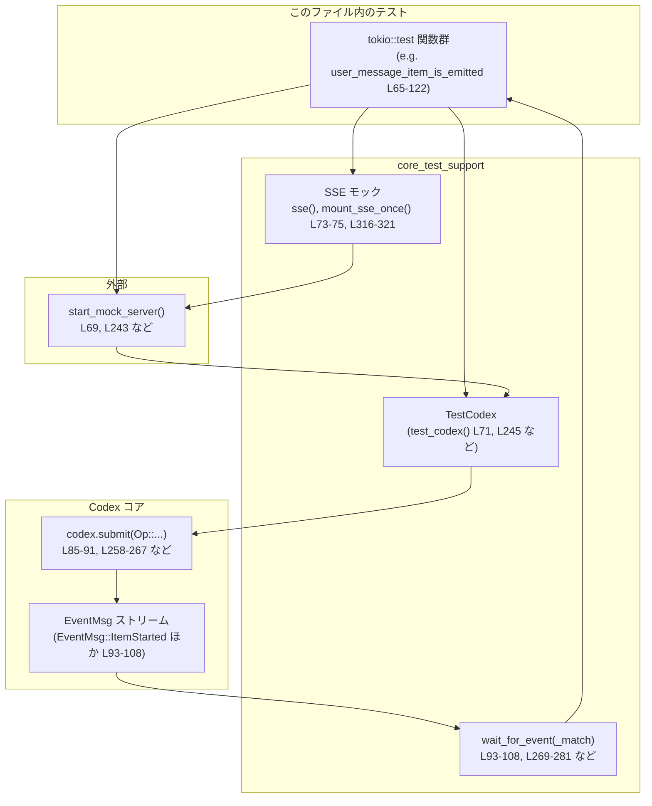
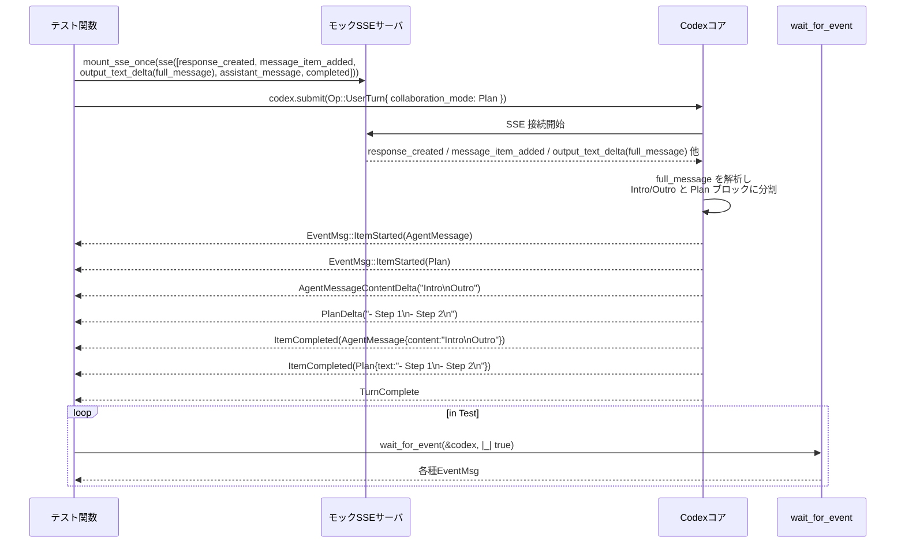
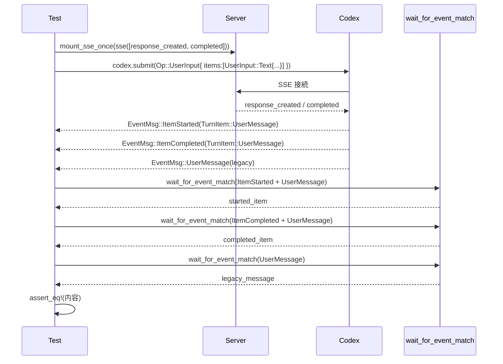

# core/tests/suite/items.rs コード解説

## 0. ざっくり一言

Codex コアが SSE ベースのバックエンドから受け取る各種イベントを、`EventMsg` / `TurnItem` として正しく生成・ストリーミングできているかを検証する非 Windows 向けの統合テスト群です（`cfg(not(target_os = "windows"))`、core/tests/suite/items.rs:L1）。

---

## 1. このモジュールの役割

### 1.1 概要

- このモジュールは Codex の「1ターンの対話処理」と「SSE ストリームからのアイテム生成／ストリーミング」の挙動を検証します。
- ユーザーメッセージ、アシスタントメッセージ、プラン、推論（reasoning）、Web 検索、画像生成など、主要な `TurnItem` 種別に対して、開始・増分（delta）・完了イベントが期待どおりに出ることを確認します（例: core/tests/suite/items.rs:L65-122, L239-294, L491-566, L1071-1123）。
- 画像生成の保存パスのサニタイズや、Plan モード時の `<proposed_plan>` ブロック抽出／ストリップなど、文字列処理まわりの仕様もテストで固定化しています（core/tests/suite/items.rs:L41-63, L580-663, L667-857）。

### 1.2 アーキテクチャ内での位置づけ

このファイルのテストから読み取れる主なコンポーネントの関係を示します。



- 各テストは `start_mock_server` で HTTP サーバモックを起動し、`core_test_support::responses` 由来の `sse(...)` と `mount_sse_once(...)` で Codex が消費する SSE ストリームを準備します（L69-75, L243-257）。
- `TestCodex` から得た `codex` クライアントで `codex.submit(Op::UserInput|UserTurn { ... })` を呼び、SSE に従って `EventMsg` が発火するのを `wait_for_event` / `wait_for_event_match` で待ち受け、期待どおりか検証しています（L85-108, L258-281, L523-541, L1010-1028 など）。

### 1.3 設計上のポイント

- **対象 OS**  
  - ファイル全体が `cfg(not(target_os = "windows"))` により Windows ではコンパイルされません（L1）。
- **非同期・並行性**  
  - 全テストは `#[tokio::test(flavor = "multi_thread", worker_threads = 2)]` で実行されます（例: L65, L124, L239）。  
    マルチスレッドランタイム上ですが、各テスト内部は「1つの async 関数内で直列に `.await`」する構造です。
- **ネットワーク依存とスキップ**  
  - 全テストは開始時に `skip_if_no_network!(Ok(()));` を呼び、ネットワークが使えない環境では早期にスキップする設計です（例: L67, L126, L241）。
- **イベント駆動の契約テスト**  
  - `EventMsg::ItemStarted`, `EventMsg::ItemCompleted`, 各種 `*Delta` イベントの発火とその順序／メタデータを、`wait_for_event_match` などで観測して契約として固定しています（例: L93-108, L451-478, L745-855, L1099-1121）。
- **安全なファイルパス生成**  
  - 画像生成結果を保存するパスは `image_generation_artifact_path` でサニタイズされ、ASCII 英数字・`-`・`_` 以外を `_` に置き換え、空文字列は `"generated_image"` にフォールバックする仕様です（L41-57）。
- **Plan モードのテキスト処理**  
  - `<proposed_plan> ... </proposed_plan>` ブロックがアシスタントメッセージから切り出され `TurnItem::Plan` に渡される一方、ユーザー向けのアシスタントメッセージからはこのブロックと `<oai-mem-citation>` タグが除去されることをテストしています（L491-566, L568-665, L667-857, L859-977, L979-1069）。

---

## 2. 主要な機能一覧（＋コンポーネントインベントリー）

### 2.1 機能レベルの一覧

- ユーザーメッセージの `TurnItem::UserMessage` ItemStarted/ItemCompleted/レガシー `EventMsg::UserMessage` の整合性検証（L65-122）。
- アシスタントメッセージの `TurnItem::AgentMessage` とそのテキストコンテンツの検証（L124-175）。
- Reasoning アイテム（要約テキスト＋生の reasoning trace）の ItemStarted/ItemCompleted と delta イベントの検証（L177-237, L1071-1123, L1126-1183）。
- Web 検索コールの begin / completed アイテムと `WebSearchAction::Search` 内容の検証（L239-294）。
- 画像生成コールの begin / end イベントと、base64 データの保存／失敗時挙動の検証（L296-417）。
- Agent メッセージのストリーミング delta (`AgentMessageContentDelta`) とメタデータ（thread_id / turn_id / item_id）の検証（L419-489）。
- Plan モードでの `<proposed_plan>` ブロック抽出・ストリップ・タグ分割／欠落時の扱いの検証（L491-566, L568-665, L667-857, L859-977, L979-1069）。
- 画像生成保存パスの構築・サニタイズロジック（L41-63）。

### 2.2 関数・テスト関数一覧（コンポーネントインベントリー）

| 名前 | 種別 | 役割 / 用途 | 定義位置 |
|------|------|-------------|----------|
| `image_generation_artifact_path` | 通常関数 | 画像生成結果を保存するためのパスを、`codex_home` / `session_id` / `call_id` から構築しサニタイズする | core/tests/suite/items.rs:L41-63 |
| `sanitize` | ローカル関数（`image_generation_artifact_path` 内） | `session_id` / `call_id` 文字列から ASCII 英数字と `-`/`_` 以外を `_` に置換し、空の場合 `"generated_image"` にする | core/tests/suite/items.rs:L42-57 |
| `user_message_item_is_emitted` | `#[tokio::test]` 非同期テスト | `Op::UserInput` 送信時に `TurnItem::UserMessage` の ItemStarted/ItemCompleted とレガシー `EventMsg::UserMessage` が正しく生成されることを検証 | core/tests/suite/items.rs:L65-122 |
| `assistant_message_item_is_emitted` | 非同期テスト | SSE 上のアシスタントメッセージから `TurnItem::AgentMessage` アイテムが生成され、テキストが一致することを検証 | core/tests/suite/items.rs:L124-175 |
| `reasoning_item_is_emitted` | 非同期テスト | SSE 上の Reasoning イベントから `TurnItem::Reasoning` が生成され、`summary_text` / `raw_content` が期待どおりかを検証 | core/tests/suite/items.rs:L177-237 |
| `web_search_item_is_emitted` | 非同期テスト | Web 検索コールに対する `EventMsg::WebSearchBegin` と `TurnItem::WebSearch` 完了イベント、および `WebSearchAction::Search` の内容を検証 | core/tests/suite/items.rs:L239-294 |
| `image_generation_call_event_is_emitted` | 非同期テスト | 正常な画像生成コールでの `ImageGenerationBegin` / `ImageGenerationEnd` イベントとファイル保存成功を検証 | core/tests/suite/items.rs:L296-358 |
| `image_generation_call_event_is_emitted_when_image_save_fails` | 非同期テスト | 壊れた payload で画像保存に失敗した場合に `saved_path` が `None` となり、ファイルが存在しないことを検証 | core/tests/suite/items.rs:L360-417 |
| `agent_message_content_delta_has_item_metadata` | 非同期テスト | ストリーミング中の `AgentMessageContentDelta` に thread/turn/item ID が正しく付与され、レガシー `AgentMessageDelta` と delta 内容が一致することを検証 | core/tests/suite/items.rs:L419-489 |
| `plan_mode_emits_plan_item_from_proposed_plan_block` | 非同期テスト | Plan モードで `<proposed_plan>` ブロックから `TurnItem::Plan` と `PlanDelta` が生成されることを検証 | core/tests/suite/items.rs:L491-566 |
| `plan_mode_strips_plan_from_agent_messages` | 非同期テスト | Plan モードで `<proposed_plan>` 部分を `Plan` アイテムに切り出し、アシスタントメッセージからは除去してストリーミングすることを検証 | core/tests/suite/items.rs:L568-665 |
| `plan_mode_streaming_citations_are_stripped_across_added_deltas_and_done` | 非同期テスト | `<oai-mem-citation>` タグが SSE の added テキスト・複数の delta・最終メッセージにまたがる場合でも、Agent/Plan 両方から citation タグが完全に除去されることとイベント順序を検証 | core/tests/suite/items.rs:L667-857 |
| `plan_mode_streaming_proposed_plan_tag_split_across_added_and_delta_is_parsed` | 非同期テスト | `<proposed_plan>` 開始タグが added テキストと delta にまたがる場合でも Plan 部分が正しく抽出され、Agent 側には含まれないことを検証 | core/tests/suite/items.rs:L859-977 |
| `plan_mode_handles_missing_plan_close_tag` | 非同期テスト | `</proposed_plan>` が欠落しても Plan 部分が抽出され、Agent メッセージには前半のみが残ることを検証 | core/tests/suite/items.rs:L979-1069 |
| `reasoning_content_delta_has_item_metadata` | 非同期テスト | Reasoning の summary テキスト delta (`ReasoningContentDelta`) に item_id などのメタデータが正しく付与されることを検証 | core/tests/suite/items.rs:L1071-1123 |
| `reasoning_raw_content_delta_respects_flag` | 非同期テスト | 設定 `show_raw_agent_reasoning = true` のときのみ raw reasoning delta (`ReasoningRawContentDelta`) が出ること、およびレガシーイベントとの整合性を検証 | core/tests/suite/items.rs:L1126-1183 |

---

## 3. 公開 API と詳細解説

このファイル内で新たな公開型は定義されていません。ここでは、テストが依拠している挙動の「契約」として重要な関数・テストを7件選び、詳細を整理します。

### 3.1 型一覧（このファイル内で定義される型）

- このファイル内で新たに定義される構造体・列挙体はありません。
- 使用している主な外部型（実装は別モジュールにあります）:
  - `codex_protocol::protocol::EventMsg`（L10）
  - `codex_protocol::items::TurnItem`（L8）
  - `codex_protocol::items::AgentMessageContent`（L7）
  - `codex_protocol::models::WebSearchAction`（L9）
  - `codex_protocol::config_types::{CollaborationMode, ModeKind, Settings}`（L4-6）
  - `codex_protocol::user_input::{UserInput, TextElement, ByteRange}`（L14-16）

これらの型の詳細な定義はこのチャンクには現れません。

### 3.2 関数詳細

#### `image_generation_artifact_path(codex_home: &Path, session_id: &str, call_id: &str) -> PathBuf`

**概要**

- Codex のホームディレクトリ配下に画像生成結果を保存するためのパスを構築します。
- `session_id` と `call_id` をディレクトリ名・ファイル名として使う際に、ASCII 英数字と `-`・`_` 以外の文字を `_` に置き換え、空文字列は `"generated_image"` に置き換えます（L41-57）。

**引数**

| 引数名 | 型 | 説明 |
|--------|----|------|
| `codex_home` | `&Path` | Codex のホームディレクトリのパス（`config.codex_home.as_path()` が渡されています、L310）。 |
| `session_id` | `&str` | セッションID文字列。ディレクトリ名としてサニタイズした上で使用されます（L311-312）。 |
| `call_id` | `&str` | 画像生成コールID。ファイル名 (`{call_id}.png`) としてサニタイズして使用されます（L318-319）。 |

**戻り値**

- `PathBuf`  
  `codex_home/generated_images/<sanitized_session_id>/<sanitized_call_id>.png` というパスを返します（L59-62）。

**内部処理の流れ**

1. ローカル関数 `sanitize(value: &str) -> String` を定義します（L42）。
2. `sanitize` では、
   - `value.chars()` を走査し、ASCII 英数字 (`ch.is_ascii_alphanumeric()`) または `-`・`_` の場合だけそのまま、それ以外は `'_'` にマッピングして `String` に収集します（L43-51）。
   - 結果が空文字列なら `"generated_image"` に置き換えます（L53-55）。
3. `codex_home.join("generated_images")` の下に、`sanitize(session_id)` ディレクトリを作り（パス構築）、最後に `format!("{}.png", sanitize(call_id))` を join してファイルパスを構築します（L59-62）。

**Examples（使用例）**

テスト内での使用例（正常系）:

```rust
let expected_saved_path = image_generation_artifact_path(
    config.codex_home.as_path(),                             // Codex のホームディレクトリ
    &session_configured.session_id.to_string(),              // セッション ID を文字列化
    "ig_image_saved_to_temp_dir_default",                    // call_id
); // core/tests/suite/items.rs:L308-313
```

**Errors / Panics**

- この関数自体は `Result` ではなく、内部でパニックを発生させるコードもありません。
- ただし、戻り値のパスを元に `std::fs::read` などの I/O を実行するときには I/O エラーがありえます（その扱いは `image_generation_call_event_is_emitted` テスト側で `?` によって `anyhow::Result` に伝播されています、L354-357）。

**Edge cases（エッジケース）**

- `session_id` / `call_id` が空文字列の場合  
  - `sanitize` により `"generated_image"` に置き換えられます（L53-55）。
- 非英数字やスペース・スラッシュ等を含む ID の場合  
  - `is_ascii_alphanumeric()` か `-`・`_` 以外はすべて `'_'` になるため、パスインジェクションのような問題を避ける方向の挙動になっています（L46-51）。

**使用上の注意点**

- `codex_home` 以下に `"generated_images"` ディレクトリが存在しない場合、呼び出し側でファイル出力前にディレクトリ作成が必要です（このモジュールではその詳細は見えません）。
- サニタイズの仕様（ASCII かどうかなど）はこのテストから読み取れる範囲であり、実際にパスとして有効かどうかはファイルシステム依存です。

---

#### `user_message_item_is_emitted() -> anyhow::Result<()>`

**概要**

- ユーザーがテキスト入力を行ったとき、Codex が `TurnItem::UserMessage` の ItemStarted/ItemCompleted を発火し、その内容が送信した `UserInput` と一致することを検証します（L65-113）。
- 併せて、レガシーな `EventMsg::UserMessage` イベントとの互換性も検証します（L114-120）。

**引数**

- なし（`#[tokio::test]` によるテスト関数、L65）。

**戻り値**

- `anyhow::Result<()>`  
  テスト内で発生したエラーは `?` によって `Err` として返され、テスト失敗になります（例: `test_codex().build(&server).await?;` L71）。

**内部処理の流れ**

1. `skip_if_no_network!(Ok(()));` でネットワークが無い環境ではテストをスキップします（L67）。
2. `start_mock_server().await` で SSE を受け付けるモックサーバを起動します（L69）。
3. `test_codex().build(&server).await?` により `TestCodex { codex, .. }` を取得します（L71）。
4. SSE ストリームとして、レスポンス生成イベントと完了イベントのみを流す `first_response` を定義し、`mount_sse_once` でモックサーバに登録します（L73-75）。
5. `TextElement` と `UserInput::Text` を構築し、期待する入力 `expected_input` を作ります（L76-83）。
6. `codex.submit(Op::UserInput { items: vec![expected_input.clone()], ... }).await?` でユーザー入力を Codex に送信します（L85-91）。
7. `wait_for_event_match` で `EventMsg::ItemStarted` の中から `TurnItem::UserMessage` を持つイベントを待ち、`started_item` を取得します（L93-100）。
8. 同様に `ItemCompleted` から `TurnItem::UserMessage` を待ち、`completed_item` を取得します（L101-108）。
9. `started_item.id` と `completed_item.id` が等しいこと、および両者の `content` が `expected_input` を 1 要素として持つことを `assert_eq!` で検証します（L110-112）。
10. レガシーな `EventMsg::UserMessage` を `wait_for_event_match` で受け取り、`message` と `text_elements` が送信した値と一致することを検証します（L114-120）。

**Examples（使用例）**

テスト自体が代表的な使用例になっています。Codex を直接利用するコードのイメージ：

```rust
// サーバと Codex クライアントの初期化（テストでは test_codex().build(&server)）
let server = start_mock_server().await;
let TestCodex { codex, .. } = test_codex().build(&server).await?;

// ユーザー入力の構築
let text_elements = vec![TextElement::new(
    ByteRange { start: 0, end: 6 },
    Some("<file>".into()),
)];
let input = UserInput::Text {
    text: "please inspect sample.txt".into(),
    text_elements,
};

// 入力を送信
codex
    .submit(Op::UserInput {
        items: vec![input],
        final_output_json_schema: None,
        responsesapi_client_metadata: None,
    })
    .await?;
```

**Errors / Panics**

- `test_codex().build(&server).await?` や `submit(...).await?` がエラーを返した場合、`?` によりテスト全体が `Err` を返し失敗します（L71, L90-91）。
- イベントが期待どおりに来なかった場合 `wait_for_event_match` の内部でタイムアウト等が発生する可能性がありますが、その詳細はこのチャンクには現れません。
- `assert_eq!` 失敗時はパニックとなりテストが失敗します（L110-112, L119-120）。

**Edge cases（エッジケース）**

- `text_elements` が空でないケース（単一要素）をテストしています（L76-79）。
- 複数アイテムや空リストの場合の挙動はこのテストからは分かりません（他のテストも同様に `items` に 1 要素のみ渡しています）。

**使用上の注意点**

- `wait_for_event_match` を条件付きクロージャとともに使うことで、`EventMsg` 列の中から目的のイベントだけを取り出しています（L93-108）。条件が厳しすぎたり誤っているとテストがハングする可能性があります。
- このテストは `EventMsg::UserMessage` というレガシーイベントとの互換性も契約として固定しているため、このイベントを削除・変更する場合はテストの修正が必要になります（L114-120）。

---

#### `web_search_item_is_emitted() -> anyhow::Result<()>`

**概要**

- Web 検索が行われるケースで、`EventMsg::WebSearchBegin` と `TurnItem::WebSearch` を含む `ItemCompleted` イベントが正しく発火し、`WebSearchAction::Search` のパラメータが SSE 側の `query` と一致することを検証します（L239-294）。

**引数**

- なし。

**戻り値**

- `anyhow::Result<()>`（エラー時にテスト失敗、L239）。

**内部処理の流れ**

1. ネットワークチェック → モックサーバ起動 → `TestCodex` 構築は他のテストと同様です（L241-246）。
2. SSE 側で Web 検索コールの「追加」イベントと「完了」イベントを準備します（L247-248）。
3. それらを含む SSE ストリームを `sse(vec![...])` で構築し、`mount_sse_once` でモックサーバに登録します（L250-256）。
4. `codex.submit(Op::UserInput { text: "find the weather", ... })` を送信します（L258-267）。
5. `EventMsg::WebSearchBegin(event)` を待ち受け、`begin` として保持します（L269-273）。
6. `EventMsg::ItemCompleted` のうち `TurnItem::WebSearch(item)` を持つものを待ち受け、`completed` として保持します（L274-281）。
7. `begin.call_id == "web-search-1"`、`completed.id == begin.call_id`、`completed.action == WebSearchAction::Search { query: Some("weather seattle"), queries: None }` を `assert_eq!` で検証します（L283-291）。

**Errors / Panics**

- `submit(...).await?` の失敗、`wait_for_event_match` の内部エラーはテスト失敗となります（L267, L272-281）。
- 期待する call_id や query と異なる場合は `assert_eq!` によりパニックします（L283-291）。

**Edge cases（エッジケース）**

- `queries` フィールドが `None` のケースのみをテストしています（L287-291）。
- 同一 `call_id` の複数 WebSearch イベントや、`query` が `None` のケースはこのテストからは分かりません。

**使用上の注意点**

- `WebSearchBegin` (`EventMsg::WebSearchBegin`) の `call_id` が、後続の `TurnItem::WebSearch` の `id` と一致することを前提とした契約をテストで固定しています（L283-285）。
- 実装を変更して `call_id` とアイテム `id` の関係が変わる場合、このテストの更新が必要です。

---

#### `image_generation_call_event_is_emitted() -> anyhow::Result<()>`

**概要**

- 画像生成コールが正常に完了した場合、
  - `EventMsg::ImageGenerationBegin` / `EventMsg::ImageGenerationEnd`
  - 結果 base64 文字列（ここでは `"Zm9v" == "foo"`）
  - `image_generation_artifact_path` で構築されるパスへのファイル保存
  が正しく行われることを検証します（L296-358）。

**引数**

- なし。

**戻り値**

- `anyhow::Result<()>`。

**内部処理の流れ**

1. ネットワークチェック → モックサーバ → `TestCodex` 構築（`codex` / `config` / `session_configured` を取得）を行います（L298-307）。
2. `call_id` を `"ig_image_saved_to_temp_dir_default"` とし、`image_generation_artifact_path` で期待される保存パス `expected_saved_path` を算出します（L308-313）。
3. テスト前に既存ファイルがあれば削除しておきます（L314）。
4. SSE ストリームに `ev_image_generation_call(call_id, "completed", "A tiny blue square", "Zm9v")` を含めて登録します（L316-321）。
5. `codex.submit(Op::UserInput { text: "generate a tiny blue square", ...})` を送信します（L323-332）。
6. `ImageGenerationBegin` と `ImageGenerationEnd` のイベントを `wait_for_event_match` で順に取得します（L334-343）。
7. `begin.call_id` / `end.call_id` / `end.status` / `end.revised_prompt` / `end.result` / `end.saved_path` を `assert_eq!` で検証し、`std::fs::read(&expected_saved_path)? == b"foo"` を確認します（L345-354）。
8. テスト終了時にファイルを削除します（L355）。

**Errors / Panics**

- ファイル読み込み `std::fs::read(&expected_saved_path)?` が失敗した場合、I/O エラーが `anyhow::Result` に伝播してテスト失敗となります（L354-357）。
- `end.saved_path` が期待するパス文字列と一致しない場合に `assert_eq!` がパニックします（L351-353）。
- 画像保存自体の失敗パスは別テスト `image_generation_call_event_is_emitted_when_image_save_fails` で検証されています（L360-417）。

**Edge cases（エッジケース）**

- 正常系のみを扱い、base64 文字列 `"Zm9v"` が正しい画像データにデコードされ、保存される前提になっています（L318, L354）。
- 保存に失敗するケースでは、`image_generation_call_event_is_emitted_when_image_save_fails` にて `end.saved_path == None` とファイル非存在を検証しており、この関数と併せて「成功時は saved_path が Some でファイルあり、失敗時は None でファイルなし」という契約をテストしています（L408-414）。

**使用上の注意点**

- テストでは保存先ファイルを事前・事後に削除することで、テスト間の副作用を減らしています（L314, L355）。
- 実装側で保存ディレクトリのパーミッションや存在チェックが変わると、このテストが I/O エラーで失敗する可能性があります。

---

#### `agent_message_content_delta_has_item_metadata() -> anyhow::Result<()>`

**概要**

- ストリーミング中のアシスタントメッセージに対して発行される `EventMsg::AgentMessageContentDelta`（新 API）と `EventMsg::AgentMessageDelta`（レガシー API）が、同じテキストデルタとアイテムメタデータを持つことを確認します（L419-489）。

**引数**

- なし。

**戻り値**

- `anyhow::Result<()>`。

**内部処理の流れ**

1. SSE ストリームを、
   - `ev_message_item_added("msg-1", "")`
   - `ev_output_text_delta("streamed response")`
   - `ev_assistant_message("msg-1", "streamed response")`
   などで構成し（L431-436）、モックサーバに登録します（L438）。
2. `codex.submit(Op::UserInput { text: "please stream text", ... })` を送信します（L440-449）。
3. 最初の `ItemStarted` イベントから `TurnItem::AgentMessage(item)` を取り出し、`started_turn_id` と `started_item` を取得します（L451-459）。
4. `AgentMessageContentDelta` イベントを待ち受け、`delta_event` として保持します（L461-465）。
5. レガシーな `AgentMessageDelta` を受け取り、`legacy_delta` として保持します（L466-470）。
6. `ItemCompleted` の `TurnItem::AgentMessage` を待って `completed_item` として保持します（L471-478）。
7. `delta_event.thread_id` がセッションID（`session_configured.session_id.to_string()`）と一致し、`delta_event.turn_id` / `item_id` がそれぞれ `started_turn_id` / `started_item.id` と一致することを検証します（L480-483）。
8. `delta_event.delta` と `legacy_delta.delta` の両方が `"streamed response"` であることを検証します（L484-485）。
9. `completed_item.id == started_item.id` を検証し、開始と完了が同一アイテムであることを確認します（L486）。

**Errors / Panics**

- `assert_eq!` 失敗時はパニックとなります（L480-486）。
- イベントが来ない場合の挙動は `wait_for_event_match` 次第で、このチャンクからは分かりません。

**Edge cases（エッジケース）**

- 単一の delta（"streamed response"）のみを扱っています（L434-435）。
- 複数 delta にまたがる長文ストリームや、空 delta、エラー時の delta などは別テスト（Plan モード関連）で部分的にカバーされています（L620-651, L763-775）。

**使用上の注意点**

- 新旧 API の併存をテストで確認しているため、片方を削除する場合は互換性ポリシーを見直す必要があります。
- `thread_id` / `turn_id` / `item_id` の3つを組み合わせた識別子の整合性が、ダッシュボードやクライアント側での追跡に重要になると考えられます（テストから読み取れる範囲での推測です）。

---

#### `plan_mode_strips_plan_from_agent_messages() -> anyhow::Result<()>`

**概要**

- Plan モードで `<proposed_plan> ... </proposed_plan>` ブロックを含むアシスタントメッセージがストリーミングされる場合に、
  - Plan 部分が `TurnItem::Plan` として抽出され、
  - アシスタントメッセージのストリームからは Plan ブロックが除去される
 ことを検証します（L568-665）。

**引数**

- なし。

**戻り値**

- `anyhow::Result<()>`。

**内部処理の流れ（アルゴリズムの観測）**

1. Plan ブロックを含むメッセージを用意します。  
   `plan_block = "<proposed_plan>\n- Step 1\n- Step 2\n</proposed_plan>\n"`（L580）。  
   `full_message = "Intro\n{plan_block}Outro"`（L581）。
2. SSE ストリームとして、最初に `ev_message_item_added("msg-1", "")` を送り、その後 `ev_output_text_delta(&full_message)`、最終的に `ev_assistant_message("msg-1", &full_message)` を送る構成にします（L582-587）。
3. `CollaborationMode { mode: ModeKind::Plan, ... }` を設定し（L591-598）、`Op::UserTurn` で Plan モードのターンを送信します（L600-617）。
4. ループ内で `wait_for_event(&codex, |_| true)` により全イベントを逐次受け取り、以下の4種類のイベントを収集します（L625-648）。
   - `AgentMessageContentDelta(event)` → `agent_deltas.push(event.delta)`
   - `PlanDelta(event)` → `plan_delta = Some(event.delta)`
   - `ItemCompleted` の `TurnItem::AgentMessage(item)` → `agent_item = Some(item)`
   - `ItemCompleted` の `TurnItem::Plan(item)` → `plan_item = Some(item)`
5. `PlanDelta` / Agent / Plan の ItemCompleted の 3者が得られるまでループを続けます（L625-648）。
6. 収集した `agent_deltas` を結合し、`agent_text` として `"Intro\nOutro"` になることを検証します（L650-652）。  
   つまり Plan ブロックが Agent ストリームから除去されていることを確認しています。
7. `plan_delta.unwrap()` と `plan_item.unwrap().text` の両方が `" - Step 1\n- Step 2\n"` であることを検証し、Plan テキストが正しく抽出されていることを確認します（L652-653）。
8. `agent_item.content` を `AgentMessageContent::Text` として結合した文字列が `"Intro\nOutro"` であることを確認し、アイテム完了時の Agent メッセージも Plan 部分を含まないことを検証します（L654-662）。

**Errors / Panics**

- Plan や Agent のアイテムが想定どおりに生成されない場合、`unwrap()` や `assert_eq!` がパニックします（L652-653, L655-662）。
- イベントがいずれか欠けているとループが抜けられずハングする可能性があります（L625-648）。

**Edge cases（エッジケース）**

- `<proposed_plan>` ブロックが 1つだけ存在するケースです。
- Plan ブロックが複数ある場合、ネストしている場合、タグが分割される場合の挙動は、別テスト（L667-857, L859-977, L979-1069）で部分的に検証されています。
- Plan ブロックの閉じタグが欠けている場合は `plan_mode_handles_missing_plan_close_tag` で別途テストされます（L979-1069）。

**使用上の注意点**

- クライアントに見せるテキスト（Agent メッセージ）と、内部 Plan テキストが明確に分離される契約になっているため、クライアント側で `<proposed_plan>` タグを意識する必要はない想定と解釈できます（コード上の挙動からの推測です）。
- Plan テキストは `PlanDelta` / `TurnItem::Plan` の text フィールド経由で取得する前提になっています（L652-653）。

---

#### `reasoning_raw_content_delta_respects_flag() -> anyhow::Result<()>`

**概要**

- Codex の設定 `show_raw_agent_reasoning` が `true` の場合にだけ、生の reasoning テキストの delta イベント（`ReasoningRawContentDelta` とレガシー `AgentReasoningRawContentDelta`）が発火することを検証します（L1126-1183）。
- ここでは「true のときに delta が飛ぶ」ことのみを確認しており、「false のときに飛ばない」テストはこのファイルには含まれていません。

**引数**

- なし。

**戻り値**

- `anyhow::Result<()>`。

**内部処理の流れ**

1. `test_codex().with_config(|config| { config.show_raw_agent_reasoning = true; })` により、テスト用 Codex インスタンスの設定で `show_raw_agent_reasoning` を有効にします（L1132-1135）。
2. SSE ストリームとして、
   - `ev_reasoning_item_added("reasoning-raw", &[""])`
   - `ev_reasoning_text_delta("raw detail")`
   - `ev_reasoning_item("reasoning-raw", &["complete"], &["raw detail"])`
   を含むイベント列を用意し（L1139-1144）、`mount_sse_once` でモックサーバに登録します（L1145-1146）。
3. `codex.submit(Op::UserInput { text: "show raw reasoning", ... })` を送信します（L1148-1156）。
4. `ItemStarted` から `TurnItem::Reasoning(item)` を取得し、`reasoning_item` とします（L1159-1166）。
5. `ReasoningRawContentDelta` イベントを待ち受け、`delta_event` として保持します（L1168-1172）。
6. レガシーな `AgentReasoningRawContentDelta` を待ち受け、`legacy_delta` として保持します（L1173-1177）。
7. `delta_event.item_id == reasoning_item.id`、`delta_event.delta == "raw detail"`、`legacy_delta.delta == "raw detail"` を `assert_eq!` で検証します（L1179-1181）。

**Errors / Panics**

- 設定の伝播（`with_config`）や SSE の送信に失敗すると、`?` によってテスト失敗になります（L1132-1137, L1145-1157）。
- delta が発火しない場合は `wait_for_event_match` がタイムアウトなどを起こす可能性があります（詳細はこのチャンクにはありません）。
- `assert_eq!` 失敗でパニックします（L1179-1181）。

**Edge cases（エッジケース）**

- `show_raw_agent_reasoning = true` のケースのみを扱っています。
- false のケース、複数 delta、空 delta などは別途検証されていません（このファイルには現れません）。

**使用上の注意点**

- このテストは「フラグ有効時に delta が出る」ことだけを固定しているため、「フラグ無効時に delta が出ない」ことを保証したい場合は、追加テストが必要です。
- 生の reasoning テキストはモデルの内部推論内容を含むことが多く、ユーザーへの露出ポリシーと密接に関わるため、設定変更時にはこのテストを参考に挙動を確認する必要があります。

---

### 3.3 その他の関数

詳細を省略したテスト関数の概要を一覧にします。

| 関数名 | 役割（1 行） | 定義位置 |
|--------|--------------|----------|
| `assistant_message_item_is_emitted` | SSE のアシスタントメッセージから `TurnItem::AgentMessage` が生成され、テキスト内容が一致することを検証 | core/tests/suite/items.rs:L124-175 |
| `reasoning_item_is_emitted` | Reasoning 用 SSE イベントから `TurnItem::Reasoning` が生成され、`summary_text` / `raw_content` が期待どおりか検証 | core/tests/suite/items.rs:L177-237 |
| `image_generation_call_event_is_emitted_when_image_save_fails` | 画像保存に失敗した場合に `saved_path == None` かつファイルが存在しないことを検証 | core/tests/suite/items.rs:L360-417 |
| `plan_mode_emits_plan_item_from_proposed_plan_block` | Plan モードで `<proposed_plan>` ブロックだけから Plan Delta / `TurnItem::Plan` が生成されることを検証 | core/tests/suite/items.rs:L491-566 |
| `plan_mode_streaming_citations_are_stripped_across_added_deltas_and_done` | `<oai-mem-citation>` タグが added テキスト＋複数 delta＋done にまたがる場合でも、Agent/Plan 両方からタグが完全に除去されること、さらにイベント順序が正しいことを検証 | core/tests/suite/items.rs:L667-857 |
| `plan_mode_streaming_proposed_plan_tag_split_across_added_and_delta_is_parsed` | `<proposed_plan>` 開始タグが added テキストと delta にまたがるケースでも Plan 抽出が正しく行われることを検証 | core/tests/suite/items.rs:L859-977 |
| `plan_mode_handles_missing_plan_close_tag` | `</proposed_plan>` が欠落している場合でも Plan テキストが抽出され、Agent メッセージが前半のみになることを検証 | core/tests/suite/items.rs:L979-1069 |
| `reasoning_content_delta_has_item_metadata` | Reasoning の summary テキスト delta (`ReasoningContentDelta` とレガシー `AgentReasoningDelta`) に item_id と delta 内容が一致することを検証 | core/tests/suite/items.rs:L1071-1123 |

---

## 4. データフロー

ここでは代表的なシナリオとして、Plan モードにおけるメッセージ／Plan の分離処理のデータフローを示します。

### 4.1 Plan モードでのストリーミング分離（`plan_mode_strips_plan_from_agent_messages` L568-665）

このテストでは、以下のようなフローが確認されています：

1. テストがモックサーバに SSE イベント列（`response_created` → `message_item_added` → `output_text_delta(full_message)` → `assistant_message(full_message)` → `completed`）を設定（L580-589）。
2. `codex.submit(Op::UserTurn { ... collaboration_mode: Plan })` を送信（L600-617）。
3. Codex コアが SSE を読み取り、内部で `<proposed_plan>` ブロックとそれ以外のテキストを解析。
4. クライアント向けには、Plan ブロックを除いたテキストを `AgentMessageContentDelta` としてストリーミングし、Plan ブロックを `PlanDelta` として別途ストリーミング。
5. ターン終了時に、`TurnItem::AgentMessage` と `TurnItem::Plan` の `ItemCompleted` をそれぞれ発火。



- テスト側では `AgentMessageContentDelta` と `PlanDelta` を別々に収集し、後で `agent_deltas.concat() == "Intro\nOutro"`、`plan_delta == "- Step 1\n- Step 2\n"` を検証しています（L620-652）。
- さらに `ItemCompleted` の `AgentMessage`／`Plan` アイテムがそれぞれ同じテキストを持つことを確認し、ストリーミング中と完了時で内容が一致することを保証しています（L652-662）。

### 4.2 ユーザーメッセージのデータフロー（`user_message_item_is_emitted` L65-122）

簡略版のフローです。



この図から、Codex がレガシー API と新しい Item ベース API を同時に発火していることがわかります（L93-120）。

---

## 5. 使い方（How to Use）

このファイル自体はテストモジュールですが、Codex コアのイベント駆動 API の使い方を知るサンプルとしても機能します。

### 5.1 基本的な使用方法（テスト観点）

1. **モックサーバの起動と SSE 設定**  
   `start_mock_server().await` でモックサーバを立て、`sse(vec![...])` と `mount_sse_once` で Codex に返す SSE を設定します（L69-75, L431-438）。

2. **TestCodex の構築と submit**  

```rust
let server = start_mock_server().await;                    // モックサーバ起動 (L69)
let TestCodex { codex, .. } = test_codex()
    .build(&server)
    .await?;                                              // Codex クライアント生成 (L71)

codex
    .submit(Op::UserInput {
        items: vec![UserInput::Text {
            text: "some text".into(),
            text_elements: Vec::new(),
        }],
        final_output_json_schema: None,
        responsesapi_client_metadata: None,
    })
    .await?;                                              // 処理のキック (L85-91)
```

1. **EventMsg の待ち受け**  
   `wait_for_event_match(&codex, |ev| match ev { ... })` で関心のあるイベントだけを抽出します（L93-108, L269-281）。

### 5.2 よくある使用パターン

- **1アイテムの開始・完了の対応確認**  
  - 多くのテストで `ItemStarted` と `ItemCompleted` の `id` を比較し、同じアイテムであることを確認しています（例: UserMessage L110, WebSearch L283-285, Plan mode L803-804）。
- **ストリーミング delta と最終アイテムの整合性**  
  - Agent メッセージ、Plan、Reasoning について、ストリーミング delta を連結したテキストが ItemCompleted のコンテンツと一致することを検証しています（L650-662, L821-828, L969-974）。
- **設定フラグによる挙動切り替え**  
  - `with_config` コールバックで設定を変更し、挙動の違いをテストします（`show_raw_agent_reasoning` L1132-1135）。

### 5.3 よくある間違い（推測される誤用と正しい例）

このファイルから推測できる「誤りやすい」ポイントと正しいパターンです。

```rust
// 誤りやすい例: 目的のイベントを待たずにすぐアサートしてしまう
// let started = next_event(); // 何のイベントか分からない状態で使う

// 正しい例: wait_for_event_match で型と中身を絞り込んでから使う
let started = wait_for_event_match(&codex, |ev| match ev {
    EventMsg::ItemStarted(ItemStartedEvent {
        item: TurnItem::AgentMessage(item),
        ..
    }) => Some(item.clone()),
    _ => None,
})
.await; // core/tests/suite/items.rs:L150-157
```

```rust
// 誤りやすい例: Plan モードでも通常の UserInput を使い、PlanDelta を期待する
// codex.submit(Op::UserInput { .. }).await?;

// 正しい例: Plan モードでは Op::UserTurn を使い、collaboration_mode に ModeKind::Plan を指定
codex
    .submit(Op::UserTurn {
        items: vec![UserInput::Text {
            text: "please plan".into(),
            text_elements: Vec::new(),
        }],
        // ...
        collaboration_mode: Some(collaboration_mode),      // ModeKind::Plan (L591-598)
        // ...
    })
    .await?;
```

### 5.4 使用上の注意点（まとめ）

- **非同期とブロッキング**  
  - `wait_for_event` / `wait_for_event_match` をループで使用するテスト（Plan 関連）は、期待するイベントが来ないと永遠に待ち続ける可能性があります（L625-648, L745-796, L923-947, L1034-1054）。テストタイムアウトの設定と併用することが重要です。
- **ファイルシステムの副作用**  
  - 画像生成テストではファイルを生成・削除するため、テスト環境のパスと権限に注意が必要です（L308-315, L354-355, L372-378, L413-414）。
- **OS 依存**  
  - このファイルは Windows ではコンパイルされないため（L1）、Windows 上で同等の挙動を確認するには別テストが必要です。
- **セキュリティ／サニタイズ**  
  - パス生成時のサニタイズや、 `<oai-mem-citation>` / `<proposed_plan>` タグの除去により、内部メタ情報や特殊タグがクライアントに露出しないことをテストで確認しています（L41-57, L680-686, L830-839）。

---

## 6. 変更の仕方（How to Modify）

### 6.1 新しい機能を追加する場合（新しい Item 種別など）

1. **SSE イベントの追加**  
   - `core_test_support::responses` に対応する `ev_xxx` ヘルパーがある場合はそれを利用し、なければ同種の関数に倣って追加します（このチャンクには実装はありません）。
2. **SSE シナリオの構成**  
   - 既存のテストに倣って `sse(vec![..])` に必要なイベント列を定義し、`mount_sse_once` で登録します（例: L316-321, L431-438）。
3. **Codex 呼び出しパターンの選択**  
   - ユーザー入力のみなら `Op::UserInput`（L85-91）、Plan モードや複雑なターンなら `Op::UserTurn`（L523-541, L1010-1028）を使用します。
4. **EventMsg の検証**  
   - `wait_for_event_match` で関心のある `EventMsg` をフィルタし、新しい Item 種別が期待どおりの `ItemStarted` / `ItemCompleted` / delta イベントを発火することをアサートします。

### 6.2 既存の機能を変更する場合

- **影響範囲の確認**
  - 例えば Plan モードのタグ処理を変更する場合、以下のテストすべてが影響を受ける可能性があります：  
    - `plan_mode_emits_plan_item_from_proposed_plan_block`（L491-566）  
    - `plan_mode_strips_plan_from_agent_messages`（L568-665）  
    - `plan_mode_streaming_citations_are_stripped_across_added_deltas_and_done`（L667-857）  
    - `plan_mode_streaming_proposed_plan_tag_split_across_added_and_delta_is_parsed`（L859-977）  
    - `plan_mode_handles_missing_plan_close_tag`（L979-1069）
- **契約の確認（前提条件・返り値の意味）**
  - 画像生成では「成功時 saved_path=Some + ファイル存在」「失敗時 saved_path=None + ファイルなし」という契約がテストで固定化されています（L350-355, L408-414）。
  - Reasoning では `summary_text` と `raw_content` の両方が存在する前提があり（L228-234, L1139-1144）、どちらかを省略する設計変更はテストの更新が必要です。
- **テストの追加・更新**
  - 挙動変更時は、新旧の両方のシナリオをカバーするテストを追加し、移行期間中の互換性を明示することが望ましいです（例: レガシー `AgentMessageDelta` / `AgentReasoningDelta` 系との併存 L467-470, L1113-1117, L1173-1177）。

---

## 7. 関連ファイル

このモジュールから参照されている外部モジュール／型との関係を整理します。

| パス（モジュール名） | 役割 / 関係 |
|----------------------|------------|
| `core_test_support::test_codex` | `TestCodex` と `test_codex()` ビルダーを提供し、Codex コアをテスト用に初期化します（L33-34, L71, L245, L303-307 など）。 |
| `core_test_support::responses` | 各種 SSE イベントを生成するヘルパー関数群（`sse`, `mount_sse_once`, `ev_response_created`, `ev_assistant_message`, `ev_image_generation_call` 等）を提供します（L17-31, L73-75, L316-321 など）。 |
| `core_test_support::{wait_for_event, wait_for_event_match}` | Codex からの `EventMsg` ストリームを待ち受け、条件に合うイベントを返すユーティリティです（L35-36, L93-108, L451-459, L745-796, L923-947, L1034-1054）。 |
| `core_test_support::skip_if_no_network` | ネットワークが利用できない環境でテストをスキップするマクロを提供します（L32, L67, L126, L241 ほか）。 |
| `codex_protocol::protocol` | `EventMsg`, `ItemStartedEvent`, `ItemCompletedEvent`, `Op`, `AskForApproval`, `SandboxPolicy` など、Codex プロトコルの基本的な型を提供します（L10-13, L531-534, L1018-1020）。 |
| `codex_protocol::items` | `TurnItem` と `AgentMessageContent` など、1ターン内のアイテム表現を提供します（L7-8）。 |
| `codex_protocol::config_types` | `CollaborationMode`, `ModeKind`, `Settings` など、Plan モード等の設定値を提供します（L4-6, L514-521, L591-598, L887-894, L1001-1008）。 |
| `codex_protocol::user_input` | `UserInput`, `TextElement`, `ByteRange` など、ユーザーからの入力表現を提供します（L14-16, L80-83, L200-203, L260-263）。 |
| `codex_protocol::models::WebSearchAction` | Web 検索コールのアクション表現を提供し、`TurnItem::WebSearch` の `action` フィールドで使用されます（L9, L286-291）。 |

> これら外部モジュールの内部実装はこのチャンクには現れないため、ここではインターフェース上の利用方法のみを記述しました。
