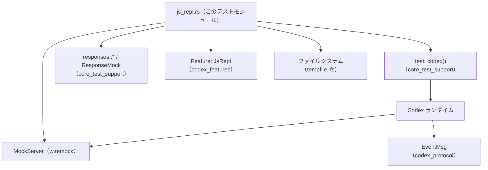
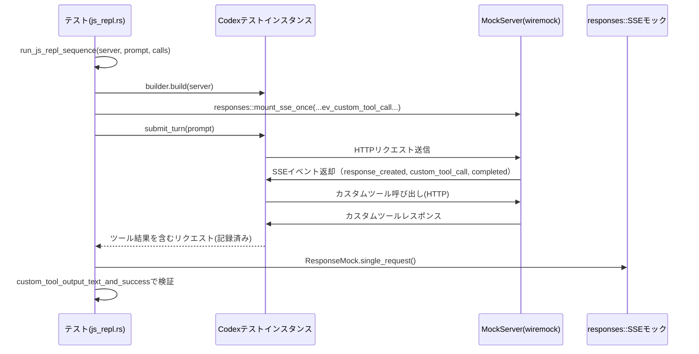

# core/tests/suite/js_repl.rs コード解説

## 0. ざっくり一言

Node ベースの JavaScript REPL 機能（`js_repl`）について、**状態永続化・エラー時の挙動・セキュリティ制限** を網羅的に検証する非同期統合テスト群です。

---

## 1. このモジュールの役割

### 1.1 概要

- このモジュールは、Codex の JavaScript REPL 機能（`Feature::JsRepl`）の **仕様どおりの振る舞いを確認するためのテストスイート** です。
- 主な検証対象は次の通りです。
  - Node ランタイムのバージョンが古い場合の `js_repl` 無効化と広告抑止
  - REPL セッションでの **変数・関数の永続化とエラー時のコミット境界**
  - `codex.tool` 経由のツール呼び出しや再帰禁止（`js_repl` から `js_repl` を呼ばない）
  - `process` グローバルや `node:process` のような **センシティブな Node API の遮断**
  - Codex が提供するパス系ヘルパー（`codex.cwd`, `codex.homeDir`）の利用可能性

### 1.2 アーキテクチャ内での位置づけ

このファイルは「テストコード」であり、本番実装ではありません。以下のコンポーネントに依存しています。

- `core_test_support::test_codex::test_codex`
  - テスト用 Codex インスタンスを構築するビルダ
- `core_test_support::responses`
  - SSE（Server-Sent Events）でやり取りされるイベントのモックと、`ResponseMock` 型
- `codex_features::Feature`
  - `JsRepl` 機能フラグ
- `codex_protocol::protocol::EventMsg`
  - ランタイムから発行されるイベント（ここでは Warning の検出に使用）
- `wiremock::MockServer`
  - HTTP サーバのモック（Codex がツール呼び出しなどで叩く先）
- `tempfile::tempdir`, `std::fs`
  - 古い Node を模倣するスクリプトの一時ファイル作成

依存関係の概要は次のようになります（行番号はチャンクに含まれていないため不明）:



### 1.3 設計上のポイント

コードから読み取れる設計上の特徴をまとめます。

- **ヘルパ関数による共通処理の抽出**
  - `run_js_repl_sequence` / `run_js_repl_turn` が、モックサーバのセットアップ・SSE モックの登録・`submit_turn` 呼び出しをカプセル化しています。
  - `custom_tool_output_text_and_success`, `assert_js_repl_ok`, `assert_js_repl_err` が、ツール呼び出し結果の検証を共通化しています。
- **状態永続化のテストを強調**
  - ほとんどのテストが「複数セル（複数回の js_repl 呼び出し）にまたがる変数・関数の状態」を検証しています。
  - エラー発生時でも、どこまでのバインディングが永続化されるべきかを詳細にカバーしています。
- **エラーハンドリング**
  - テスト関数はすべて `anyhow::Result<()>` を返し、`?` 演算子でエラーを伝播させています。
  - テスト失敗は Rust 側の `assert!` / `assert_ne!` か、`anyhow::Error` のどちらかで表現されます。
- **並行性**
  - すべてのテストに `#[tokio::test(flavor = "multi_thread", worker_threads = 2)]` が付いており、Tokio のマルチスレッドランタイム上で実行されます。
  - このファイル内では共有ミュータブル状態を直接扱っておらず、各テストは独立した `MockServer` と一時リソースを使用しています。
- **セキュリティ検証**
  - `js_repl_does_not_expose_process_global`
  - `js_repl_blocks_sensitive_builtin_imports`
  - `js_repl_tool_call_rejects_recursive_js_repl_invocation`
  などが、REPL における安全性の契約をテストとして明文化しています。

---

## 2. 主要な機能一覧（コンポーネントインベントリー付き）

### 2.1 機能リスト（概要）

- カスタムツール呼び出しの結果取得・アサーション
- Node バージョンを「古い」と見せるテスト用スクリプトの生成
- `js_repl` を用いた 1〜複数セルのシナリオ実行ヘルパ
- 失敗セルと後続セルの挙動をまとめて検証するヘルパ
- Node バージョン不一致時の機能無効化と広告抑止のテスト
- 変数・関数・`var` ホイスティングの「永続化境界」を検証する多数のテスト
- `codex.tool` からのビルトインツール呼び出しおよび自己再帰禁止のテスト
- `process` グローバルや `node:process` などセンシティブ API の遮断テスト
- `codex.cwd`, `codex.homeDir` のようなパスヘルパの公開テスト

### 2.2 関数インベントリー

> 注: 行番号はこのチャンクには含まれていないため、`行範囲` は `不明` と記載します。

| 名前 | 種別 | 非同期 | 役割 / 用途 | 行範囲（根拠） |
|------|------|--------|-------------|----------------|
| `custom_tool_output_text_and_success` | ヘルパ関数 | いいえ | `ResponsesRequest` からカスタムツール呼び出しの出力テキストと成功フラグを取り出す | `core/tests/suite/js_repl.rs:L?-?` |
| `assert_js_repl_ok` | ヘルパ関数 | いいえ | `js_repl` ツール呼び出しが成功し、出力に指定文字列が含まれることを検証 | 同上 |
| `assert_js_repl_err` | ヘルパ関数 | いいえ | `js_repl` ツール呼び出しが失敗し、出力に指定文字列が含まれることを検証 | 同上 |
| `tool_names` | ヘルパ関数 | いいえ | リクエストボディ JSON から `tools` 配列のツール名一覧を抽出 | 同上 |
| `write_too_old_node_script` | ヘルパ関数 | いいえ | 「古い Node」を模倣するスクリプト（一時ファイル）を生成（OS ごとに分岐） | 同上 |
| `run_js_repl_turn` | ヘルパ関数 | はい | 1 つのテストターンで `js_repl` を何度か呼ぶシナリオを実行し、最後の `ResponseMock` を返す | 同上 |
| `run_js_repl_sequence` | ヘルパ関数 | はい | モックサーバと SSE イベントを構成し、複数回の `js_repl` 呼び出し＋最終メッセージまでのモック群を返す | 同上 |
| `assert_failed_cell_followup` | ヘルパ関数 | はい | 「失敗セル＋後続セル」のペアを一括で実行し、期待される失敗と成功を検証 | 同上 |
| `js_repl_is_not_advertised_when_startup_node_is_incompatible` | テスト（Tokio） | はい | Node が古く `js_repl` が無効化された場合、ツールリストや説明文に `js_repl` が現れないことを検証 | 同上 |
| `js_repl_persists_top_level_destructured_bindings_and_supports_tla` | テスト | はい | トップレベルの `await`（TLA）と分割代入したバインディングが次のセルにも残ることを検証 | 同上 |
| `js_repl_failed_cells_commit_initialized_bindings_only` | テスト | はい | 失敗セルでも**初期化済みのバインディングのみ**後続セルに残り、未評価のものは残らないことを検証 | 同上 |
| `js_repl_failed_cells_preserve_initialized_lexical_destructuring_bindings` | テスト | はい | オブジェクト分割代入中にエラーが起きた場合、エラー発生前に初期化された `const` 変数だけが残ることを検証 | 同上 |
| `js_repl_link_failures_keep_prior_module_state` | テスト | はい | 静的インポートがサポートされずに失敗しても、それ以前に定義したバインディングは保持されることを検証 | 同上 |
| `js_repl_failed_cells_do_not_commit_unreached_hoisted_bindings` | テスト | はい | `var` や関数宣言の「ホイスティング」があっても、実際に到達しなかった宣言は永続化されないことを検証 | 同上 |
| `js_repl_failed_cells_do_not_preserve_hoisted_function_reads_before_declaration` | テスト | はい | 宣言前に関数を参照しようとして失敗した場合、その関数は後続セルからも参照できないことを検証 | 同上 |
| `js_repl_failed_cells_preserve_functions_when_declaration_sites_are_reached` | テスト | はい | 関数宣言まで実行された後にエラーが出た場合、その関数は後続セルで利用可能であることを検証 | 同上 |
| `js_repl_failed_cells_preserve_prior_binding_writes_without_new_bindings` | テスト | はい | 既存変数への代入後にエラーが起きても、その**更新結果**は後続セルに残ることを検証 | 同上 |
| `js_repl_failed_cells_var_persistence_boundaries` | テスト | はい | 複数ケースをループで検証し、`var` に関するさまざまな書き込みパターンの永続化境界を確認 | 同上 |
| `js_repl_failed_cells_commit_non_empty_loop_vars_but_skip_empty_loops` | テスト | はい | 反復した `for (var ...)` のループ変数は残り、空ループの変数は残らないことを検証 | 同上 |
| `js_repl_keeps_function_to_string_stable` | テスト | はい | 内部計測用コードが挿入されても `foo.toString()` の結果が変化しないことを検証 | 同上 |
| `js_repl_allows_globalthis_shadowing_with_instrumented_bindings` | テスト | はい | 計測用バインディングが導入されていても、ユーザコードが `globalThis` をシャドウイングできることを検証 | 同上 |
| `js_repl_can_invoke_builtin_tools` | テスト | はい | REPL 内から `codex.tool("list_mcp_resources", {})` を呼び出せることを検証 | 同上 |
| `js_repl_tool_call_rejects_recursive_js_repl_invocation` | テスト | はい | `codex.tool("js_repl", ...)` を呼び出そうとするとエラーになる（再帰禁止）ことを検証 | 同上 |
| `js_repl_does_not_expose_process_global` | テスト | はい | REPL 内で `typeof process` が `undefined` になること（`process` グローバルが隠蔽されること）を検証 | 同上 |
| `js_repl_exposes_codex_path_helpers` | テスト | はい | `codex.cwd` と `codex.homeDir` が期待どおりの型／値で利用可能であることを検証 | 同上 |
| `js_repl_blocks_sensitive_builtin_imports` | テスト | はい | `await import("node:process")` が禁止され、対応するエラーメッセージを返すことを検証 | 同上 |

---

## 3. 公開 API と詳細解説

このファイルはテストモジュールのため、外部クレートから直接利用される「公開 API」はありません。ただし、**同一テストスイート内で再利用されるヘルパ** は事実上の API とみなせるため、これらを中心に解説します。

### 3.1 型一覧

このファイル内で新しい構造体・列挙体は定義されていません。

利用している主な外部型（定義は他ファイル、ここでは概要のみ）:

| 名前 | 所属 | 役割 / 用途 |
|------|------|-------------|
| `ResponsesRequest` | `core_test_support::responses` | モックサーバに届いた 1 リクエスト分の情報を表す（ツール出力の抽出に使用） |
| `ResponseMock` | 同上 | モックされた SSE セッションに対するアサーションヘルパ（`single_request()` など） |
| `MockServer` | `wiremock` | モック HTTP サーバ |
| `EventMsg` | `codex_protocol::protocol` | Codex ランタイムからのイベント（ここでは Warning の検出に使用） |

### 3.2 関数詳細（重要な 7 件）

#### `custom_tool_output_text_and_success(req: &ResponsesRequest, call_id: &str) -> (String, Option<bool>)`

**概要**

- 特定のツール呼び出し（ここでは主に `"js_repl"`）に対するレスポンスから、
  - 出力テキスト（`String`）
  - 成功フラグ（`Option<bool>`）
  を取り出しやすい形にまとめるヘルパです。

**引数**

| 引数名 | 型 | 説明 |
|--------|----|------|
| `req` | `&ResponsesRequest` | 1 回の SSE セッションに対応するリクエスト情報 |
| `call_id` | `&str` | 対象とするカスタムツール呼び出しの ID（例: `"call-1"`） |

**戻り値**

- `(String, Option<bool>)`
  - 第 1 要素: ツール呼び出しの出力テキスト。`None` の場合は空文字列にフォールバックします（`unwrap_or_default()`）。
  - 第 2 要素: 成功フラグ。`Some(true)` / `Some(false)` / `None` のいずれか。

**内部処理の流れ**

1. `req.custom_tool_call_output_content_and_success(call_id)` を呼び出し、`(Option<String>, Option<bool>)` のようなペアを取得する。
2. `expect("custom tool output should be present")` により、ツール出力が存在しない場合は **panic** させる。
3. `output.unwrap_or_default()` により、`None` のときは `""`（空文字列）に置き換え。
4. `(output_string, success)` を返す。

**Examples（使用例）**

```rust
// js_repl の出力テキストと成功フラグを取り出す例
let req = mock.single_request();                           // ResponseMock から ResponsesRequest を取得
let (output, success) = custom_tool_output_text_and_success(&req, "call-1");
assert_eq!(success, Some(true));                           // 成功したことを期待
assert!(output.contains("42"));                            // 出力に "42" が含まれることを検証
```

**Errors / Panics**

- `req.custom_tool_call_output_content_and_success(call_id)` が `None` を返した場合、`expect` により panic します。
  - これはテストコード内での想定外ケース（SSE の組み立てミス）を早期に検知するためのものです。

**Edge cases（エッジケース）**

- 出力テキストが `None` の場合、空文字列が返ります。
  - テスト側では `"output was: {output}"` といったメッセージで中身を確認できます。
- `success` が `None` のケースもあり得ます（成功/失敗が明示されない呼び出し）。この場合もそのまま `None` が返されます。

**使用上の注意点**

- **前提条件**: 対象の `call_id` に対応するツール呼び出しが必ず存在すること（そうでないと panic）。
- 主にテストコード専用であり、本番コードでの利用は想定されていない構造になっています（`expect` 使用）。

---

#### `run_js_repl_sequence(server: &MockServer, prompt: &str, calls: &[(&str, &str)]) -> Result<Vec<ResponseMock>>`

**概要**

- `js_repl` を複数回呼び出す 1 ターンの会話をセットアップし、
  - 各ツール呼び出しをトリガーする SSE イベント列をモック登録し、
  - その際に生成された `ResponseMock` の一覧を返すヘルパです。
- この関数が **テスト内のコアデータフロー** を構成しています。

**引数**

| 引数名 | 型 | 説明 |
|--------|----|------|
| `server` | `&MockServer` | wiremock のモックサーバ |
| `prompt` | `&str` | Codex に送信する最初のプロンプト文字列 |
| `calls` | `&[(&str, &str)]` | 各 `js_repl` 呼び出しを表す `(call_id, js_input)` の配列 |

**戻り値**

- `Result<Vec<ResponseMock>>`
  - 正常時: 各 SSE シーケンスに対する `ResponseMock` を格納したベクタ
    - `calls.len() - 1` 個のセル用モック + 最後の完了メッセージ用モック の計 `calls.len()` 個
  - 異常時: `anyhow::Error`（ビルダ構築失敗、モック登録失敗など）

**内部処理の流れ**

1. `anyhow::ensure!(!calls.is_empty(), ...)` で `calls` が空でないことを保証。
2. `test_codex().with_config(...)` でテスト用 Codex ビルダを作成し、`config.features.enable(Feature::JsRepl)` で `js_repl` 機能を有効化。
3. `builder.build(server).await?` で Codex テスト環境を構築。
4. **最初のセル**用に、以下を含む SSE イベント列を 1 回分登録:
   - `ev_response_created("resp-1")`
   - `ev_custom_tool_call(calls[0].0, "js_repl", calls[0].1)`
   - `ev_completed("resp-1")`
5. 2 つ目以降のセルについて `for` ループを回し、それぞれ
   - 新しい `response_id`（`"resp-{index}"`）
   - 対応する `ev_response_created`, `ev_custom_tool_call`, `ev_completed`
   を持つ SSE モックを登録し、`mocks` ベクタに push。
6. **最終応答**として、アシスタントメッセージ `"done"` と `ev_completed` のみを含む SSE モックを登録し、`mocks` に追加。
7. `test.submit_turn(prompt).await?` で、実際に Codex にプロンプトを送信。
8. `mocks` を返す。

**Examples（使用例）**

```rust
let server = responses::start_mock_server().await;          // モックサーバを起動
let mocks = run_js_repl_sequence(
    &server,
    "run js_repl twice",
    &[
        ("call-1", "console.log(1);"),
        ("call-2", "console.log(2);"),
    ],
).await?;

// 1 回目のセルの出力を検証
assert_js_repl_ok(&mocks[0].single_request(), "call-1", "1");
// 2 回目のセルの出力を検証
assert_js_repl_ok(&mocks[1].single_request(), "call-2", "2");
```

**Errors / Panics**

- `calls.is_empty()` の場合は `anyhow::ensure!` により `Err` になります（panic ではなく `Result` として返る）。
- 内部で呼び出される `builder.build` や `responses::mount_sse_once` などが `Err` を返した場合、それがそのまま `?` 経由で伝播します。

**Edge cases（エッジケース）**

- `calls.len() == 1` の場合
  - 最初のセル用モック（`calls[0]`）と最後の `"done"` メッセージ用モックの計 2 つが登録されます。
- `calls` が長い場合
  - 各セルごとに `resp-2`, `resp-3`, ... と順番に `response_id` が振られます。テスト側では `mocks[i]` としてアクセスします。

**使用上の注意点**

- **前提条件**: `calls` は空であってはならず、各 `call_id` は SSE 側でユニークである必要があります。
- SSE イベント列は `js_repl` を前提にしているため、別のツール名で流用するには `ev_custom_tool_call` の第 2 引数を書き換える必要があります。

---

#### `run_js_repl_turn(server: &MockServer, prompt: &str, calls: &[(&str, &str)]) -> Result<ResponseMock>`

**概要**

- `run_js_repl_sequence` のラッパで、**最後の `ResponseMock` だけを返す**簡便版です。
- 「単一セル」または「最後のセルの結果だけ見ればよい」テストで利用されています。

**引数**

| 引数名 | 型 | 説明 |
|--------|----|------|
| `server` | `&MockServer` | モックサーバ |
| `prompt` | `&str` | プロンプト文字列 |
| `calls` | `&[(&str, &str)]` | `(call_id, js_input)` の配列 |

**戻り値**

- `Result<ResponseMock>`: `run_js_repl_sequence` の結果ベクタから `.pop().expect(...)` した最後のモック。

**内部処理の流れ**

1. `run_js_repl_sequence(server, prompt, calls).await?` を呼び出す。
2. 返ってきた `Vec<ResponseMock>` から `pop()` で最後の要素を取り出し、`expect("js_repl test should return a request mock")` で存在を保証。
3. その `ResponseMock` を `Ok` で返す。

**Examples（使用例）**

```rust
let mock = run_js_repl_turn(
    &server,
    "check process visibility",
    &[("call-1", "console.log(typeof process);")],
).await?;
let req = mock.single_request();
let (output, success) = custom_tool_output_text_and_success(&req, "call-1");
assert!(output.contains("undefined"));
```

**Errors / Panics**

- `run_js_repl_sequence` が `Err` を返した場合、そのまま `Err` が返ります。
- `mocks.pop()` が `None` の場合（正常であれば起こらない想定）、`expect` により panic します。

**Edge cases**

- `calls.len() == 1` の典型的なケースで使用されます。
- 複数セルを登録した場合でも、最後のモック（多くは `"done"` を含む SSE セッション）が返ってくる点に注意が必要です。

**使用上の注意点**

- **最後のモック**は必ずしも最後の `js_repl` 呼び出しではなく、「最終アシスタントメッセージ」の SSE を表すことに注意が必要です。
  - そのため、`js_repl` の出力を見るには `mock.single_request()` が返すリクエストボディ内のツール呼び出しを参照する必要があります（テストでは `custom_tool_output_text_and_success` を利用）。

---

#### `assert_failed_cell_followup(...) -> Result<()>`

```rust
async fn assert_failed_cell_followup(
    server: &MockServer,
    prompt: &str,
    failing_cell: &str,
    followup_cell: &str,
    expected_followup_output: &str,
) -> Result<()>
```

**概要**

- 「失敗セル → 後続セル」という 2 ステップの典型パターンをまとめて検証するヘルパです。
- `js_repl_failed_cells_var_persistence_boundaries` で複数ケースを共通処理として扱うために利用されています。

**引数**

| 引数名 | 型 | 説明 |
|--------|----|------|
| `server` | `&MockServer` | モックサーバ |
| `prompt` | `&str` | テストケース固有のプロンプト |
| `failing_cell` | `&str` | 失敗することを期待する JS コード |
| `followup_cell` | `&str` | 続くセルで実行される JS コード |
| `expected_followup_output` | `&str` | 後続セルの出力に含まれるべき文字列 |

**戻り値**

- `Result<()>`: すべてのアサーションが通れば `Ok(())`、それ以外は `anyhow::Error`。

**内部処理の流れ**

1. `run_js_repl_sequence` を2セル構成で呼び出し（`call-1`, `call-2`）、`mocks` を取得。
2. 1 セル目（`mocks[0]`）について:
   - `assert_js_repl_err(&mocks[0].single_request(), "call-1", "boom")` で失敗と `"boom"` メッセージを確認。
3. 2 セル目（`mocks[1]`）について:
   - `assert_js_repl_ok(&mocks[1].single_request(), "call-2", expected_followup_output)` で成功と期待出力を確認。
4. 問題がなければ `Ok(())`。

**Examples（使用例）**

```rust
for (prompt, failing_cell, followup_cell, expected_output) in cases {
    assert_failed_cell_followup(
        &server,
        prompt,
        failing_cell,
        followup_cell,
        expected_output,
    ).await?;
}
```

**Errors / Panics**

- `run_js_repl_sequence` がエラーを返した場合、そのまま `Err` が伝播します。
- `assert_js_repl_err` / `assert_js_repl_ok` が内部で使う `assert!` により、条件を満たさない場合は panic します（テスト失敗）。

**Edge cases**

- 1 セル目のエラー文字列は常に `"boom"` を期待しているため、JS コード側もそれに合わせたエラーを投げる必要があります。

**使用上の注意点**

- このヘルパは「失敗セルのエラー文字列が `"boom"` 固定」という前提で設計されているため、別のエラーメッセージを使うケースでは適用できません。

---

#### `js_repl_is_not_advertised_when_startup_node_is_incompatible() -> Result<()>`

**概要**

- Node ランタイムが古すぎて `js_repl` が使えない場合に、
  - セッション開始時に Warning イベントが発行されること
  - ツール一覧や指示文 (`instructions`) に `js_repl` / `js_repl_reset` が含まれないこと
  を検証するテストです。

**引数 / 戻り値**

- 引数なし（Tokio テスト関数）。
- `Result<()>` を返し、失敗時は `anyhow::Error` や `assert!` の panic でテストが落ちます。

**内部処理の流れ**

1. `skip_if_no_network!(Ok(()));`
   - ネットワーク環境が整っていない場合のスキップマクロ（詳細はこのファイルからは不明）。
2. `CODEX_JS_REPL_NODE_PATH` 環境変数が設定されていれば早期 `Ok(())` で終了（既存 Node パス優先）。
3. モックサーバを起動し、一時ディレクトリを作成。
4. `write_too_old_node_script(temp.path())` により、「古い Node バージョン」を出力するスクリプトを生成。
5. `test_codex().with_config` で `Feature::JsRepl` を有効にした上で、`config.js_repl_node_path = Some(old_node);` とし、このスクリプトを Node として利用するよう構成。
6. `wait_for_event_match(&test.codex, |event| match event { ... })` で:
   - `EventMsg::Warning` かつメッセージに `"Disabled`js_repl`for this session"` が含まれるイベントを待機し、メッセージ文字列を取得。
7. `warning.contains("Node runtime")` を確認し、「Node 互換性の問題」である旨の説明が含まれることを検証。
8. 通常の SSE セッション（`ev_assistant_message` + `ev_completed`）をモック登録。
9. `test.submit_turn("hello").await?` を実行し、`request_mock.single_request().body_json()` から送信された JSON ボディを取得。
10. `tool_names` を使って `tools` 配列からツール名一覧を抽出し、
    - `"js_repl"` / `"js_repl_reset"` が含まれないことを検証。
11. `body["instructions"]` 文字列に `"## JavaScript REPL (Node)"` が含まれないことを検証。

**Edge cases / 契約**

- `CODEX_JS_REPL_NODE_PATH` が設定されている環境では、このテストは **何も検証せずに成功** します。
- Warning イベントが発行されない場合は `wait_for_event_match` がどう振る舞うかはこのファイルからは不明ですが、少なくとも期待どおりの Warning が来ないと以降の `assert!` が失敗します。

**セキュリティ / 安全性**

- 古い Node では REPL を無効にし、「使えるように見せない（広告しない）」ことを確認しているため、サポート外ランタイムに対する誤用を防ぐ仕様をテストしています。

---

#### `js_repl_failed_cells_var_persistence_boundaries() -> Result<()>`

**概要**

- 1 つのテストで複数のサブケースをループし、`var` 関連のさまざまな書き込みパターンに対する「永続化／非永続化」の境界（boundary）を検証しています。

**内部データ構造**

```rust
let cases = [
    (prompt1, failing_cell1, followup_cell1, expected_output1),
    (prompt2, failing_cell2, followup_cell2, expected_output2),
    // ... 5ケース
];
```

各タプルの中身は:

1. プロンプト文字列
2. 失敗するセルの JS コード
3. 後続セルの JS コード
4. 後続セルの標準出力に含まれるべき文字列

**ケースごとの意味（要約）**

1. **事前代入 + `var` 宣言**
   - 失敗セル: `x = 5; y = 1; y += 2; z = 1; z++; throw ...; var x, y, z;`
   - 後続: `console.log(x, y, z);` → `"5 3 2"`
   - 意味: 事前代入された `x, y, z` が、`throw` 以降にある `var` 宣言より前に実行されていれば、その最終値が永続化される。

2. **ショートサーキット論理代入**
   - 失敗セル: `x &&= 1; y ||= 2; z ??= 3; throw ...; var x, y, z;`
   - 後続: `console.log(xValue, y, z);`（`xValue` は `x` 読み取りの結果）→ `"ReferenceError 2 3"`
   - 意味:
     - `x` は未定義のままなので後続セルから読むと `ReferenceError`
     - `y` と `z` は代入が行われたため 2, 3 が永続化される。

3. **ネストスコープでの `let` と `var` の衝突**
   - 失敗セル: `{ let x = 1; x = 2; } throw ...; var x;`
   - 後続: `console.log(value);`（`x` 読み取り結果）→ `"ReferenceError"`
   - 意味:
     - ブロックスコープ内の `let x` はセル終了時に破棄され、後続セルで `var x` として自動的に定義されるわけではない。

4. **ネストした代入 `x = (y = 1)`**
   - 失敗セル: `x = (y = 1); throw ...; var x, y;`
   - 後続: `console.log(x, yValue);` → `"1 ReferenceError"`
   - 意味:
     - `x` の書き込みは永続化されるが、内部の `y` 書き込みは永続化されない。

5. **`var` の分割代入エラー**
   - 失敗セル: `var { a, b } = { a: 1, get b() { throw ...; } };`
   - 後続: `console.log(aValue, bValue);` → `"ReferenceError ReferenceError"`
   - 意味:
     - 分割代入中にエラーが発生した場合、`var` のバインディングも永続化されない。

**内部処理の流れ**

- 上記の `cases` を `for` ループで回し、各ケースについて `assert_failed_cell_followup` を呼び出して検証しています。

**Edge cases / 契約**

- すべての失敗セルは `throw new Error("boom");` などで `"boom"` を含むエラーを発生させる前提になっています（`assert_failed_cell_followup` の仕様）。
- このテストにより、`js_repl` の実装が **JS の直感的な `var` の挙動** と一致するかどうかがチェックされますが、実装詳細はこのファイルからは分かりません。

---

#### `js_repl_blocks_sensitive_builtin_imports() -> Result<()>`

**概要**

- `await import("node:process")` のようなセンシティブな Node 組み込みモジュールを REPL から読み込もうとするとブロックされることを検証します。

**内部処理の流れ**

1. `skip_if_no_network!(Ok(()));` で前提条件をチェック。
2. モックサーバを起動。
3. `run_js_repl_turn` を使い、次の JS コードを含むセルを実行:
   - `await import("node:process");`
4. `custom_tool_output_text_and_success` で `(output, success)` を取得。
5. `assert_ne!(success, Some(true), "blocked import unexpectedly succeeded: {output}")`
   - 成功フラグが `Some(true)` でないことを確認。
6. `assert!(output.contains("Importing module \"node:process\" is not allowed in js_repl"))`
   - エラーメッセージに期待文言が含まれることを確認。

**Edge cases / 契約**

- メッセージ文言 `"Importing module \"node:process\" is not allowed in js_repl"` に依存しており、実装側が文言を変更するとテストが落ちます。
- 他の `node:*` モジュールがどう扱われるかは、このテストだけでは分かりません。

**セキュリティ上の意味**

- REPL からプロセス情報や環境にアクセスしうる `node:process` のようなモジュールのインポートを禁止することで、
  - 実行環境の覗き見や、
  - センシティブな情報の漏洩
  を防ぐ設計が守られているかどうかをテストしています。

---

### 3.3 その他の関数（概要一覧）

詳細解説を行っていない関数の役割一覧です。

| 関数名 | 役割（1 行） |
|--------|--------------|
| `assert_js_repl_ok` | `js_repl` 呼び出しが成功し、指定した文字列が出力に含まれることを `assert!` で検証します。 |
| `assert_js_repl_err` | `js_repl` 呼び出しが失敗し、指定した文字列が出力に含まれることを検証します。 |
| `tool_names` | JSON ボディの `tools` 配列から `name` または `type` を抽出した文字列ベクタを返します。 |
| `write_too_old_node_script` | OS ごとに異なるスクリプトファイル（`.cmd` / `.sh`）を生成し、`v0.0.1` を出力する古い Node を模倣します。 |
| `js_repl_persists_top_level_destructured_bindings_and_supports_tla` | トップレベル `await` と分割代入した変数が後続セルでも利用可能であることを検証します。 |
| `js_repl_failed_cells_commit_initialized_bindings_only` | 失敗セルでも `base` や `session` のような初期化済み変数だけが残り、未到達の変数は残らないことを検証します。 |
| `js_repl_failed_cells_preserve_initialized_lexical_destructuring_bindings` | 分割代入で一部のプロパティ取得が失敗しても、成功したプロパティだけは `const` バインディングとして残ることを検証します。 |
| `js_repl_link_failures_keep_prior_module_state` | 静的 `import "./foo"` がサポートされず失敗しても、既存の `answer` 変数は後続セルで加算できることを検証します。 |
| `js_repl_failed_cells_do_not_commit_unreached_hoisted_bindings` | `throw` で中断されたセルにおいて、到達しなかった `var` や関数宣言が永続化されないことを検証します。 |
| `js_repl_failed_cells_do_not_preserve_hoisted_function_reads_before_declaration` | 宣言前に関数を呼び出そうとして失敗した場合、その関数を後続セルで参照すると `ReferenceError` になることを検証します。 |
| `js_repl_failed_cells_preserve_functions_when_declaration_sites_are_reached` | 関数宣言まで実行された後のエラーであれば、その関数は後続セルで `typeof foo === "function"` となることを検証します。 |
| `js_repl_failed_cells_preserve_prior_binding_writes_without_new_bindings` | 既存変数 `x` を `1` から `2` に更新した後のエラーでも、後続セルからは `x === 2` と見えることを検証します。 |
| `js_repl_failed_cells_commit_non_empty_loop_vars_but_skip_empty_loops` | `for (var item of [2])` のような非空ループのループ変数は残り、空配列に対するループ変数は残らないことを検証します。 |
| `js_repl_keeps_function_to_string_stable` | `foo.toString()` の結果に内部計測用コードが混入しないことを検証します。 |
| `js_repl_allows_globalthis_shadowing_with_instrumented_bindings` | ユーザコードが `const globalThis = {};` としても、`typeof globalThis` が `object` となり正しくシャドウイングされることを検証します。 |
| `js_repl_can_invoke_builtin_tools` | `codex.tool("list_mcp_resources", {})` が成功し、出力に `"function_call_output"` が含まれることを検証します。 |
| `js_repl_tool_call_rejects_recursive_js_repl_invocation` | `codex.tool("js_repl", ...)` がエラーになり、`"js_repl cannot invoke itself"` を含む出力になることを検証します。 |
| `js_repl_does_not_expose_process_global` | `console.log(typeof process);` が `"undefined"` を含む出力となることを検証します。 |
| `js_repl_exposes_codex_path_helpers` | `codex.cwd` が非空文字列、`codex.homeDir` が `null` か文字列であることを検証します。 |

---

## 4. データフロー

### 4.1 代表的な処理シナリオ

ここでは `run_js_repl_sequence` を用いたシナリオのデータフローを説明します。

1. テストコードが `run_js_repl_sequence(&server, prompt, calls)` を呼び出す。
2. 関数内部で Codex テストインスタンスが構築され、`Feature::JsRepl` が有効化される。
3. `responses::mount_sse_once` により、MockServer に対して SSE イベント列（`ev_response_created`, `ev_custom_tool_call`, `ev_completed`）が登録される。
4. `test.submit_turn(prompt)` により Codex が `MockServer` に HTTP リクエストを送り、SSE を通じてイベントを受信する。
5. Codex が SSE イベントを処理し、`js_repl` ツールを呼ぶべき箇所でカスタムツール呼び出しを行う。
6. `ResponseMock` 経由で、テストコードは送信されたリクエストボディ JSON を取得し、ツール名・ツール引数・出力などを検証する。

この流れをシーケンス図で示します（`run_js_repl_sequence` に対応、行番号は不明）:



---

## 5. 使い方（How to Use）

このモジュールはテスト専用ですが、**新しい js_repl テストケースを追加する際**の使い方をまとめます。

### 5.1 基本的な使用方法

単一セルの js_repl 呼び出しをテストする最小構成例です。

```rust
#[tokio::test(flavor = "multi_thread", worker_threads = 2)]
async fn my_js_repl_test() -> anyhow::Result<()> {
    skip_if_no_network!(Ok(()));                         // ネットワーク前提チェック（挙動は他ファイル）

    let server = responses::start_mock_server().await;   // MockServer を起動

    // 1 セルだけを含むシナリオを run_js_repl_turn で実行
    let mock = run_js_repl_turn(
        &server,
        "my js_repl test",
        &[("call-1", "console.log(40 + 2);")],
    )
    .await?;

    let req = mock.single_request();                     // このターンで送信されたリクエストを取得
    assert_js_repl_ok(&req, "call-1", "42");             // 成功と "42" 出力を検証

    Ok(())
}
```

### 5.2 よくある使用パターン

1. **複数セルを通じた状態永続化の検証**

```rust
let mocks = run_js_repl_sequence(
    &server,
    "run js_repl twice",
    &[
        ("call-1", "let x = 41; console.log(x);"),
        ("call-2", "console.log(x + 1);"),
    ],
).await?;

assert_js_repl_ok(&mocks[0].single_request(), "call-1", "41");
assert_js_repl_ok(&mocks[1].single_request(), "call-2", "42");
```

1. **失敗セル＋後続セルのペアをまとめて検証**

```rust
assert_failed_cell_followup(
    &server,
    "run js_repl through failed loop bindings",
    "for (var item of [2]) {} throw new Error(\"boom\");",
    "console.log(item);",
    "2",
).await?;
```

1. **セキュリティ特性の確認**

```rust
let mock = run_js_repl_turn(
    &server,
    "check process visibility",
    &[("call-1", "console.log(typeof process);")],
).await?;

let (output, success) = custom_tool_output_text_and_success(&mock.single_request(), "call-1");
assert_ne!(success, Some(false));
assert!(output.contains("undefined"));                   // process は見えない
```

### 5.3 よくある間違い

```rust
// 間違い例: calls を空スライスで呼び出してしまう
// let mocks = run_js_repl_sequence(&server, "prompt", &[]).await?;
// → anyhow::ensure! により Err が返る

// 正しい例: 少なくとも 1 つのセルを指定する
let mocks = run_js_repl_sequence(&server, "prompt", &[("call-1", "console.log(1);")]).await?;
```

```rust
// 間違い例: run_js_repl_turn の戻り値を最後の js_repl セルだと思い込む
let mock = run_js_repl_turn(
    &server,
    "prompt",
    &[
        ("call-1", "console.log(1);"),
        ("call-2", "console.log(2);"),
    ],
).await?;
// mock は「最終 SSE セッション」を表すだけであり、call-2 が必ず含まれるとは限らない

// 正しい例: 複数セルを扱う場合は run_js_repl_sequence を使い、個別に mocks[i] を検査する
let mocks = run_js_repl_sequence(
    &server,
    "prompt",
    &[
        ("call-1", "console.log(1);"),
        ("call-2", "console.log(2);"),
    ],
).await?;
assert_js_repl_ok(&mocks[0].single_request(), "call-1", "1");
assert_js_repl_ok(&mocks[1].single_request(), "call-2", "2");
```

### 5.4 使用上の注意点（まとめ）

- **前提条件**
  - `skip_if_no_network!` の挙動に依存しているため、ネットワーク接続が必要なテスト環境かどうかで挙動が変わります（スキップされる可能性）。
  - `run_js_repl_sequence` / `run_js_repl_turn` の `calls` は空であってはなりません。
- **エラー／パニック**
  - 多くのヘルパが `expect` / `assert!` を使用しており、前提が崩れると panic します。これはテストコードとして意図された挙動です。
- **並行性**
  - すべてのテストは `#[tokio::test(flavor = "multi_thread", worker_threads = 2)]` で実行されますが、このファイル内で共有可変状態は持っていないため、競合状態は直接は発生しにくい構造になっています。
- **セキュリティ契約**
  - `process` グローバルが `undefined` であること
  - `import("node:process")` が禁止されること
  - `js_repl` が自分自身を `codex.tool` から呼べないこと
  - などの仕様にテストが強く依存しており、実装側でこれらを変更するとテストが失敗します。

---

## 6. 変更の仕方（How to Modify）

### 6.1 新しい機能を追加する場合（新しい js_repl テストの追加）

1. **テスト関数の雛形を作成**
   - 他のテストと同様に `#[tokio::test(flavor = "multi_thread", worker_threads = 2)]` と `async fn ... -> Result<()>` を用いる。
2. **前提条件チェック**
   - 必要であれば、`skip_if_no_network!(Ok(()));` を先頭に置く。
3. **モックサーバとシナリオの構築**
   - `let server = responses::start_mock_server().await;`
   - 単一セルなら `run_js_repl_turn`、複数セルなら `run_js_repl_sequence` を選択。
4. **アサーション**
   - `assert_js_repl_ok` / `assert_js_repl_err` や `custom_tool_output_text_and_success` を使って、出力・成功フラグ・エラーメッセージを検証する。

### 6.2 既存の機能を変更する場合（ヘルパやテストの修正）

- **影響範囲の確認**
  - `run_js_repl_sequence`, `run_js_repl_turn`, `assert_failed_cell_followup`, `assert_js_repl_ok`, `assert_js_repl_err`, `custom_tool_output_text_and_success` は複数テストから呼ばれているため、シグネチャや戻り値を変更すると関連テストすべてに影響します。
- **契約の保持**
  - エラーメッセージ文字列に依存するアサーション（例: `"Importing module \"node:process\" is not allowed in js_repl"`）を変更する場合、実装側かテスト側どちらを正とするかを明確にする必要があります。
  - `js_repl` の変数永続化仕様を変更する場合は、どのテストが仕様の一部を表現しているかを確認しながら更新する必要があります。
- **テスト追加時の注意**
  - 同じ `call_id` を複数セルで再利用すると、`ResponsesRequest` の検索が意図しない結果になる可能性があります（このファイルでは常に `"call-1"`, `"call-2"` ... とユニークな ID を使っています）。

---

## 7. 関連ファイル

このモジュールと密接に関係するファイル・ディレクトリ（定義はこのチャンクには含まれませんが、名称から推測できる範囲で記載します）。

| パス | 役割 / 関係 |
|------|------------|
| `core_test_support::test_codex` | `test_codex()` ビルダを提供し、テスト用 Codex インスタンスの構築を行います。 |
| `core_test_support::responses` | SSE イベント (`ev_response_created`, `ev_custom_tool_call`, `ev_completed`, `ev_assistant_message`, `sse`) や `ResponseMock`、`ResponsesRequest` を提供します。 |
| `core_test_support::wait_for_event_match` | `EventMsg` ストリームから条件に合うイベントを待ち受けるヘルパで、Warning イベントを検知するのに使用されています。 |
| `core_test_support::skip_if_no_network` | ネットワーク前提が満たされない場合にテストをスキップするためのマクロと推測されますが、詳細実装はこのファイルからは分かりません。 |
| `codex_features::Feature` | `Feature::JsRepl` フラグを定義し、テスト構成で REPL 機能を有効化するのに使用されます。 |
| `codex_protocol::protocol::EventMsg` | Codex ランタイムからのイベント型で、Warning イベントの内容をテストするのに使用されています。 |
| `wiremock::MockServer` | 外部リソース（ここでは Codex がアクセスする HTTP エンドポイント）をモックするためのライブラリです。 |
| `std::fs` / `tempfile` / `std::os::unix::fs::PermissionsExt` | 「古い Node スクリプト」作成用のファイル操作・一時ディレクトリ・実行権限設定に使用されています。 |

このファイルは本番の `js_repl` 実装そのものではなく、「どのような動作・安全性が期待されているか」をテストとして明文化したものです。そのため、`js_repl` の仕様を理解する上でのリファレンスとしても利用できます。
