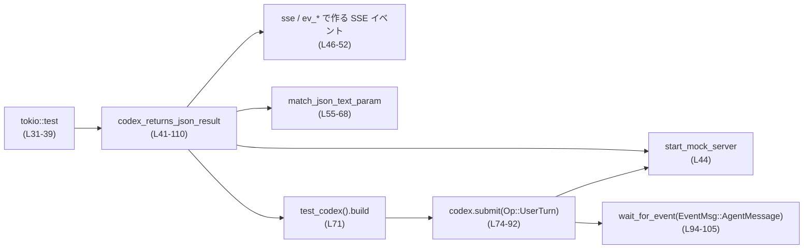
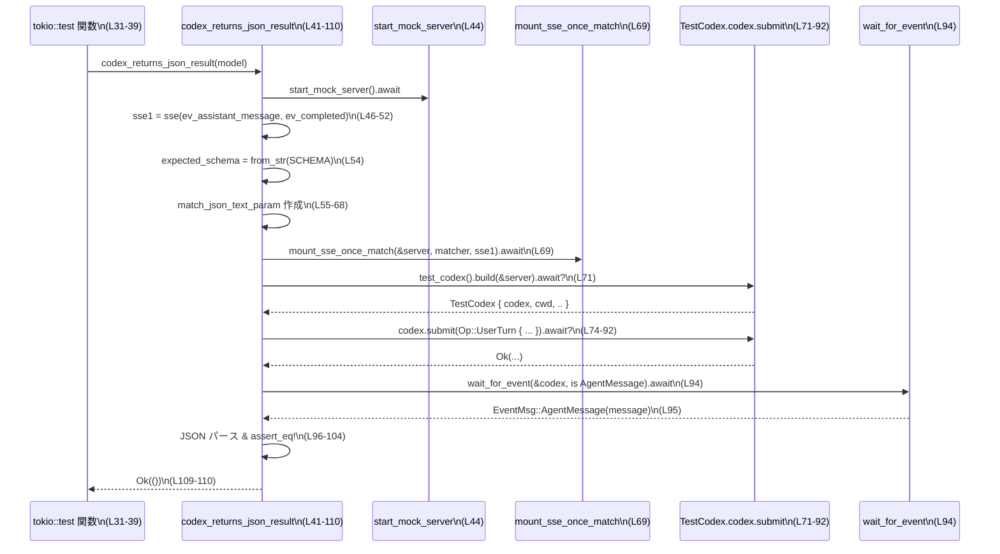

# core/tests/suite/json_result.rs

## 0. ざっくり一言

`codex` が JSON スキーマを指定したときに、期待どおりの JSON 形式の最終結果を返すかどうかを、モック SSE サーバーを用いて検証する非 windows 向けの Tokio 非同期テストです。  
（根拠: `SCHEMA` 定義と 2 つの `#[tokio::test]`、および `codex_returns_json_result` の中での SSE / JSON 処理 `json_result.rs:L19-29, L31-39, L41-110`）

---

## 1. このモジュールの役割

### 1.1 概要

- このモジュールは **Codex クライアントが `final_output_json_schema` で指定された JSON スキーマに従った出力を返すか** を検証するために存在し、  
  モックサーバー経由で SSE 応答を送り、Codex からの `EventMsg::AgentMessage` の中身が期待どおりかをチェックします。  
  （`codex_returns_json_result` 内の `final_output_json_schema` 指定と `EventMsg::AgentMessage` へのアサート `json_result.rs:L41-42, L74-81, L94-105`）

- `gpt-5.1` と `gpt-5.1-codex` の 2 種類のモデル ID に対して、同じシナリオを共有のヘルパー関数でテストします。  
  （`codex_returns_json_result_for_gpt5` / `_for_gpt5_codex` が同じヘルパーを呼び出している `json_result.rs:L31-39`）

### 1.2 アーキテクチャ内での位置づけ

このテストは以下のコンポーネントと連携しています。

- `core_test_support::test_codex::TestCodex` / `test_codex()` で Codex テストクライアントを生成する。`json_result.rs:L10-11, L71`
- `core_test_support::responses` 群でモック SSE サーバーとイベント列を構築する。`json_result.rs:L8, L14-17, L46-52, L69`
- `codex_protocol::protocol` の `Op`, `EventMsg`, `AskForApproval`, `SandboxPolicy` などのドメイン型を使って、Codex への操作やイベントを表現する。`json_result.rs:L3-7, L75-85, L94-105`
- `tokio::test` によるマルチスレッド非同期テストとして実行される。`json_result.rs:L31, L36`

これを簡略図にすると次のようになります。



### 1.3 設計上のポイント

- **テストロジックの共通化**  
  モデル名以外は同一のシナリオであるため、共通処理を `codex_returns_json_result(model: String)` に切り出し、  
  個別のテスト関数はモデル名だけを変えてヘルパーを呼び出しています。  
  （`json_result.rs:L31-39, L41-41`）

- **プラットフォーム条件付きコンパイル**  
  `#![cfg(not(target_os = "windows"))]` により、このテストは Windows ではビルド・実行されません。  
  （`json_result.rs:L1`）

- **Tokio マルチスレッドランタイムを使用**  
  2 つのテストはともに `#[tokio::test(flavor = "multi_thread", worker_threads = 2)]` で定義され、  
  マルチスレッドな Tokio ランタイム上で非同期に実行されます。  
  （`json_result.rs:L31, L36`）

- **SSE とモックサーバーによる外部依存のスタブ化**  
  `start_mock_server` でモックサーバーを立て、`mount_sse_once_match` と `match_json_text_param` で  
  特定の HTTP リクエスト条件を満たしたときにだけ、用意した SSE イベント列を返すようにしています。  
  （`json_result.rs:L44, L46-52, L55-69`）

- **出力 JSON スキーマの検証**  
  リクエストボディに含まれる `text.format` フィールド内の JSON が、定数 `SCHEMA` の内容と完全一致し、  
  name/type/strict フラグも期待どおりであるかをクロージャでチェックしています。  
  （`json_result.rs:L19-29, L54-67`）

- **イベント駆動のアサーション**  
  `wait_for_event` を用いて `EventMsg::AgentMessage` が届くまで待ち、メッセージ文字列を JSON としてパースし、  
  `explanation` と `final_answer` フィールド値を検証します。  
  （`json_result.rs:L94-105`）

---

## 2. 主要な機能一覧

- Codex に JSON スキーマ付きの `Op::UserTurn` を送信し、モック SSE サーバーからの応答を処理するテストシナリオを実行する。`json_result.rs:L41-52, L69-92`
- Codex の送信するリクエストボディ内の `text.format` パラメータが、指定した JSON スキーマとメタ情報（name/type/strict）に一致するかを判定する。`json_result.rs:L54-68`
- Codex からの `EventMsg::AgentMessage` イベント中の JSON メッセージが、期待する `explanation` / `final_answer` を持っているかを検証する。`json_result.rs:L94-105`

### 2.1 関数・定数インベントリー

| 名前 | 種別 | 概要 | 定義位置 |
|------|------|------|----------|
| `SCHEMA` | 定数 `&'static str` | Codex の最終出力が従うべき JSON スキーマ（`explanation` と `final_answer` の 2 フィールドを要求） | `json_result.rs:L19-29` |
| `codex_returns_json_result_for_gpt5` | 非同期テスト関数 | モデル `"gpt-5.1"` で共通シナリオを実行する Tokio テスト | `json_result.rs:L31-34` |
| `codex_returns_json_result_for_gpt5_codex` | 非同期テスト関数 | モデル `"gpt-5.1-codex"` で共通シナリオを実行する Tokio テスト | `json_result.rs:L36-39` |
| `codex_returns_json_result` | 非公開 非同期関数 | モックサーバーの起動、SSE 応答設定、Codex 呼び出し、イベント検証までを一括で行うテスト本体 | `json_result.rs:L41-110` |

---

## 3. 公開 API と詳細解説

このファイルはテスト用モジュールであり、`pub` な型や関数は定義されていません。  
以下では、テスト内で重要な役割を持つ定数および関数を解説します。

### 3.1 型一覧（構造体・列挙体など）

このファイル内で新たに定義される構造体・列挙体はありません。  
外部型（`Op`, `EventMsg`, `UserInput`, `TestCodex` など）は他モジュール由来であり、このチャンクには定義が現れません。`json_result.rs:L3-7, L10-12`

#### 定数

| 名前 | 種別 | 役割 / 用途 | 定義位置 |
|------|------|-------------|----------|
| `SCHEMA` | `&'static str` | Codex の `final_output_json_schema` とモックサーバー側の検証の両方で利用される JSON スキーマ文字列。`explanation` と `final_answer` を必須プロパティとし、追加プロパティを禁止する。 | `json_result.rs:L19-29` |

### 3.2 関数詳細

#### `async fn codex_returns_json_result(model: String) -> anyhow::Result<()>`

**概要**

指定されたモデル ID を使って Codex クライアントを起動し、JSON スキーマを伴う `Op::UserTurn` を送信して、  
モック SSE サーバー経由で返された JSON 文字列が期待どおりであるかを検証する、テスト本体の非同期関数です。  
（`json_result.rs:L41-42, L44-52, L71-92, L94-105`）

**引数**

| 引数名 | 型 | 説明 |
|--------|----|------|
| `model` | `String` | 使用する Codex モデル ID。`Op::UserTurn` の `model` フィールドにそのまま渡されます。`json_result.rs:L41, L85` |

**戻り値**

- 型: `anyhow::Result<()>`  
- 意味:  
  - 成功時は `Ok(())` を返し、テスト条件がすべて満たされたことを表します。`json_result.rs:L109-110`  
  - モックサーバーのセットアップ失敗、JSON のパース失敗、Codex 操作のエラー、期待と異なるイベント種別などが発生した場合には `Err` を返します。`json_result.rs:L54, L71-72, L80, L92, L96, L106`

**内部処理の流れ（アルゴリズム）**

1. **ネットワーク環境のチェック**  
   `skip_if_no_network!(Ok(()));` により、必要なネットワーク環境がない場合にはテストをスキップする（と推測されますが、正確な挙動はこのチャンクには現れません）。`json_result.rs:L42`  

2. **モックサーバーの起動**  
   `start_mock_server().await` により SSE を返すモック HTTP サーバーを立ち上げます。`json_result.rs:L44`

3. **SSE レスポンスの準備**  
   - `sse(vec![ ... ])` で SSE イベント列を構築します。  
   - 最初のイベントは `ev_assistant_message` で、JSON 文字列 `{"explanation": "explanation", "final_answer": "final_answer"}` をペイロードに持つアシスタントメッセージです。`json_result.rs:L46-50`  
   - 2 番目のイベントは `ev_completed("r1")` で、リクエスト完了を示すイベントです。`json_result.rs:L51-52`

4. **リクエストマッチャの準備**  
   - `SCHEMA` を `serde_json::Value` にパースして `expected_schema` とします。`json_result.rs:L54`  
   - クロージャ `match_json_text_param` を定義し、受信した `wiremock::Request` のボディを JSON パースして、以下の条件を満たすか判定します。`json_result.rs:L55-68`  
     - ルートに `"text"` オブジェクトがあり、その中に `"format"` オブジェクトがある。`json_result.rs:L57-62`  
     - `format.name == "codex_output_schema"`  
     - `format.type == "json_schema"`  
     - `format.strict == true`  
     - `format.schema == expected_schema`（定数 `SCHEMA` と完全一致）`json_result.rs:L64-67`  

5. **モックサーバーへの SSE マウント**  
   `responses::mount_sse_once_match(&server, match_json_text_param, sse1).await;` により、  
   上記条件にマッチしたリクエストが来たときに限り `sse1` を 1 回だけ返すよう設定します。`json_result.rs:L69`

6. **Codex クライアントの構築**  
   `test_codex().build(&server).await?` で `TestCodex { codex, cwd, .. }` を取得します。  
   ここで `codex` は Codex クライアント、`cwd` はテスト用のカレントディレクトリ（パス）です。`json_result.rs:L71`

7. **Codex へのユーザー入力送信**  
   `codex.submit(Op::UserTurn { ... }).await?` を呼び出し、以下の内容を送信します。`json_result.rs:L74-92`  
   - `items`: `"hello world"` を含む `UserInput::Text` の 1 要素のみ。`json_result.rs:L76-79`  
   - `final_output_json_schema`: `SCHEMA` を JSON として `Some(...)` で渡す。`json_result.rs:L80`  
   - `cwd`: `cwd.path().to_path_buf()` によるパス。`json_result.rs:L81`  
   - `approval_policy`: `AskForApproval::Never`。`json_result.rs:L82`  
   - `sandbox_policy`: `SandboxPolicy::DangerFullAccess`。`json_result.rs:L84`  
   - `model`: 引数で受け取った `model`。`json_result.rs:L85`  
   - 他のフィールド (`effort`, `summary`, `service_tier`, `collaboration_mode`, `personality`) は `None`。`json_result.rs:L86-90`

8. **イベント待機と検証**  
   - `wait_for_event(&codex, |ev| matches!(ev, EventMsg::AgentMessage(_))).await` により、  
     最初に `EventMsg::AgentMessage` となるイベントが届くまで待機します。`json_result.rs:L94`  
   - マッチしたイベントが `EventMsg::AgentMessage(message)` であれば、`message.message` を `serde_json::Value` としてパースし、  
     `explanation` / `final_answer` がそれぞれ `"explanation"` / `"final_answer"` であることを `assert_eq!` で検証します。`json_result.rs:L95-104`  
   - それ以外のイベント種別であれば `anyhow::bail!("expected agent message event");` によりエラーとして終了します。`json_result.rs:L105-107`

9. **正常終了**  
   すべての検証が通れば `Ok(())` を返します。`json_result.rs:L109-110`

**Examples（使用例）**

この関数はテストモジュール内で直接呼び出されています。`gpt-5.1` 用のテストからの利用例は次のとおりです。`json_result.rs:L31-34`

```rust
// モデル "gpt-5.1" に対して JSON 結果を検証するテスト
#[tokio::test(flavor = "multi_thread", worker_threads = 2)]
async fn codex_returns_json_result_for_gpt5() -> anyhow::Result<()> {
    // 共通のテストシナリオを呼び出す
    codex_returns_json_result("gpt-5.1".to_string()).await
}
```

別のモデルに対して利用する場合は、引数の文字列だけを変更します。`json_result.rs:L36-39`

```rust
// モデル "gpt-5.1-codex" に対するテスト
#[tokio::test(flavor = "multi_thread", worker_threads = 2)]
async fn codex_returns_json_result_for_gpt5_codex() -> anyhow::Result<()> {
    codex_returns_json_result("gpt-5.1-codex".to_string()).await
}
```

**Errors / Panics**

この関数は `?` 演算子や `anyhow::bail!` によってエラーを返す可能性があります。

- `serde_json::from_str(SCHEMA)` が失敗したとき  
  - `expected_schema` 生成時、および `final_output_json_schema` の `Some(serde_json::from_str(SCHEMA)?)` でエラーを伝播します。`json_result.rs:L54, L80`  
- `test_codex().build(&server).await?` が失敗したとき  
  - Codex クライアントの構築に失敗すると `Err` が返ります。`json_result.rs:L71-72`
- `codex.submit(...).await?` が失敗したとき  
  - Codex 側の処理エラーや通信エラーなどが `Err` として伝播します。`json_result.rs:L74-92`
- `serde_json::from_str(&message.message)?` が失敗したとき  
  - 受信したメッセージが JSON でない、あるいは壊れている場合にエラーになります。`json_result.rs:L96`
- 想定外のイベント種別が返ってきたとき  
  - `if let EventMsg::AgentMessage(message) = message { ... } else { anyhow::bail!(...) }` により、  
    `AgentMessage` 以外であれば `Err` になります。`json_result.rs:L95, L105-107`

panic について:

- この関数内では `unwrap` ではなく `unwrap_or_default` のみが使用されているため、ここから直接 panic は発生しません。`json_result.rs:L56`  
- ただし、外部関数（`test_codex`, `wait_for_event` など）が内部で panic する可能性については、このチャンクには現れません。

**Edge cases（エッジケース）**

- **ネットワークが利用できない場合**  
  `skip_if_no_network!(Ok(()));` によりテストがスキップされるか、即座に `Ok(())` を返すと推測されますが、  
  正確な挙動はこのチャンクには現れません。`json_result.rs:L42`
- **リクエストボディが JSON でない場合**  
  `serde_json::from_slice(&req.body).unwrap_or_default()` により、パースに失敗すると空の `Value` が使われ、  
  `text` / `format` が取得できないため `match_json_text_param` は `false` を返します。`json_result.rs:L55-62`  
  その結果、モックサーバーが `sse1` を返さない可能性があります。
- **Codex が `EventMsg::AgentMessage` を返さない場合**  
  `wait_for_event` の挙動はこのチャンクには現れませんが、  
  該当イベントが届かない場合には待ち続けるか、何らかのタイムアウトエラーになると考えられます。`json_result.rs:L94`
- **SSE レスポンスの JSON が期待と異なる場合**  
  `serde_json::from_str(&message.message)?` でパースできても、`explanation` / `final_answer` の値が異なる場合、  
  `assert_eq!` によりテスト失敗（panic）になります。`json_result.rs:L96-104`

**使用上の注意点**

- この関数は Tokio ランタイム上の非同期コンテキストからのみ呼び出すことを前提としています（`async fn` かつ `.await` が必要）。`json_result.rs:L41, L31-39`
- Windows ではモジュール自体がコンパイル対象外となるため、この関数も利用できません。`json_result.rs:L1`
- `SCHEMA` の内容を変更する場合は、次の 3 か所を整合させる必要があります。  
  - `SCHEMA` 定数の JSON テキスト。`json_result.rs:L19-29`  
  - `match_json_text_param` で比較している `expected_schema`。`json_result.rs:L54-67`  
  - モック SSE 内の `ev_assistant_message` の JSON ペイロード（出力例）。`json_result.rs:L46-50`
- この関数はテスト用途のため、セキュリティやパフォーマンスよりも検証の明確さを優先しています。  
  たとえばリクエストボディのパース失敗を `unwrap_or_default` で握りつぶしている点は、  
  本番コードでは注意が必要ですが、ここではテスト簡略化のためと考えられます。`json_result.rs:L55-56`

### 3.3 その他の関数

| 関数名 | シグネチャ | 役割（1 行） | 定義位置 |
|--------|------------|--------------|----------|
| `codex_returns_json_result_for_gpt5` | `async fn() -> anyhow::Result<()>` | モデル `"gpt-5.1"` に対して `codex_returns_json_result` を呼び出す Tokio テスト関数。 | `json_result.rs:L31-34` |
| `codex_returns_json_result_for_gpt5_codex` | `async fn() -> anyhow::Result<()>` | モデル `"gpt-5.1-codex"` に対して同様のシナリオを実行する Tokio テスト関数。 | `json_result.rs:L36-39` |

---

## 4. データフロー

このセクションでは、`codex_returns_json_result` 実行時の代表的なデータフローを示します。

### 4.1 シーケンス図



この図から分かるポイント:

- テストは単一のヘルパー関数に集約されており、Codex との通信自体は `TestCodex` にカプセル化されています。`json_result.rs:L41-42, L71-72`
- モックサーバーは、リクエスト内容（特に `text.format`）に応じて SSE イベント列 `sse1` を返します。`json_result.rs:L46-52, L55-69`
- Codex からのイベントストリームは `wait_for_event` によってフィルタリングされ、`AgentMessage` のみを対象に検証が行われます。`json_result.rs:L94-105`

---

## 5. 使い方（How to Use）

このファイル自体はテスト専用ですが、構造を理解することで類似テストの追加や変更が行いやすくなります。

### 5.1 基本的な使用方法

同様のテストシナリオを追加する場合の基本フローは、既存テストと同様になります。`json_result.rs:L31-39, L41-110`

1. `SCHEMA` 定数か、別のスキーマ定数を準備する。`json_result.rs:L19-29`
2. `codex_returns_json_result` のようなヘルパー関数内で:
   - モックサーバーを起動し、SSE イベント列を構築する。`json_result.rs:L44-52`
   - リクエストボディの期待構造をクロージャで定義し、`mount_sse_once_match` に渡す。`json_result.rs:L55-69`
   - `TestCodex` から `codex` と `cwd` を取得する。`json_result.rs:L71`
   - `codex.submit(Op::UserTurn { ... })` を呼び出し、必要なフィールドを設定する。`json_result.rs:L74-92`
   - `wait_for_event` で目的のイベントを待ち、内容を検証する。`json_result.rs:L94-105`
3. それをモデル別の `#[tokio::test]` 関数から呼び出す。`json_result.rs:L31-39`

### 5.2 よくある使用パターン

- **モデル違いのテストを追加する**  
  新しいモデル ID（例: `"gpt-5.2"`）に対して同じシナリオを走らせたい場合、以下のようなテスト関数を追加するのが自然です（擬似コード）。

```rust
// 新しいモデル ID に対するテスト（例）
#[tokio::test(flavor = "multi_thread", worker_threads = 2)]
async fn codex_returns_json_result_for_gpt52() -> anyhow::Result<()> {
    codex_returns_json_result("gpt-5.2".to_string()).await  // モデル名だけを変更
}
```

  既存のテストと同じヘルパー関数を使うため、変更箇所はモデル名のみで済みます。  
  （この追加関数は例示であり、このチャンクには定義されていません）

- **スキーマや出力フィールドを変更したテスト**  
  フィールド名や構造が異なる JSON スキーマを検証したい場合:
  - `SCHEMA` に相当する新しい定数を定義する。`json_result.rs:L19-29`
  - モック SSE の `ev_assistant_message` 部分の JSON ペイロードを、新しいスキーマに合わせて変更する。`json_result.rs:L46-50`
  - `match_json_text_param` の `expected_schema` を新しいスキーマに差し替える。`json_result.rs:L54-67`
  - `assert_eq!` でチェックするフィールド名・値も変更する。`json_result.rs:L97-104`

### 5.3 よくある間違い

このコードから推測できる、起こりやすい誤用例とその修正例です。

```rust
// 誤り例: final_output_json_schema を指定し忘れている
codex
    .submit(Op::UserTurn {
        items: vec![/* ... */],
        final_output_json_schema: None,  // スキーマ未指定
        // ...
    })
    .await?;
```

上記のように `final_output_json_schema` を設定しない場合、Codex 側が JSON スキーマに基づいた整形を行わない可能性があり、  
モックサーバーの `match_json_text_param` にマッチせず、SSE イベントが返ってこないことにつながります。`json_result.rs:L55-69, L74-81`

```rust
// 正しい例: SCHEMA に基づく JSON スキーマを指定する
codex
    .submit(Op::UserTurn {
        items: vec![UserInput::Text {
            text: "hello world".into(),
            text_elements: Vec::new(),
        }],
        final_output_json_schema: Some(serde_json::from_str(SCHEMA)?), // スキーマを指定
        cwd: cwd.path().to_path_buf(),
        approval_policy: AskForApproval::Never,
        approvals_reviewer: None,
        sandbox_policy: SandboxPolicy::DangerFullAccess,
        model,
        effort: None,
        summary: None,
        service_tier: None,
        collaboration_mode: None,
        personality: None,
    })
    .await?;
```

### 5.4 使用上の注意点（まとめ）

- **非同期実行環境の必須性**  
  関数はすべて `async fn` であり、`tokio::test` 属性を前提とします。同期コンテキストから直接呼ぶことはできません。`json_result.rs:L31-41`
- **Windows では有効でない**  
  モジュール先頭の `#![cfg(not(target_os = "windows"))]` により、Windows ではこのテストはコンパイルされません。`json_result.rs:L1`
- **JSON スキーマの一貫性**  
  スキーマ文字列 (`SCHEMA`)、モック SSE のペイロード、`assert_eq!` の期待値は常に整合させる必要があります。  
  どれか一つだけ変更するとテストが意図せず失敗します。`json_result.rs:L19-29, L46-50, L97-104`
- **テストでの安全性 / セキュリティ**  
  - `SandboxPolicy::DangerFullAccess` が指定されていますが、その実際の制約内容はこのチャンクには現れません。`json_result.rs:L84`  
  - 本コードはテスト用であり、モックサーバーのみを相手にしているため、直接的な外部攻撃ベクトルは読み取れません。  

---

## 6. 変更の仕方（How to Modify）

### 6.1 新しい機能（テストケース）を追加する場合

1. **新しいモデル向けテストを追加する**  
   - 既存の 2 つのテスト関数を参考に、新しいモデル ID を使った `#[tokio::test]` 関数を追加し、  
     `codex_returns_json_result("<new-model>".to_string()).await` を呼び出します。`json_result.rs:L31-39, L41`
2. **新しい JSON スキーマを検証するテスト**  
   - `SCHEMA` と同様の定数を追加し、検証したいフィールド構造を持つ JSON スキーマを定義します。`json_result.rs:L19-29`
   - `codex_returns_json_result` と同様のヘルパー関数を新規に作成し、その中で:
     - 新しいスキーマ定数を `expected_schema` としてパースする。`json_result.rs:L54`
     - `final_output_json_schema` にも同じスキーマを渡す。`json_result.rs:L80`
     - モック SSE の `ev_assistant_message` のペイロードと `assert_eq!` の期待値を一致させる。`json_result.rs:L46-50, L97-104`

### 6.2 既存の機能を変更する場合

- **SCHEMA を変更する際の影響範囲**  
  - `SCHEMA` の JSON テキストを変更した場合、`expected_schema` と `match_json_text_param` の比較も自動的に変わりますが、  
    SSE ペイロードと `assert_eq!` の期待値を手動で更新する必要があります。`json_result.rs:L19-29, L54-67, L46-50, L97-104`
- **イベント種別の検証方法を変更する**  
  - 現在は最初の `EventMsg::AgentMessage` のみを対象に検証しています。`json_result.rs:L94-95`  
  - もし複数イベントを順次検証したい場合は、`wait_for_event` の利用箇所や、`matches!` の条件を変更する必要があります。  
    ただし、`wait_for_event` の仕様はこのチャンクには現れないため、変更前にその実装を確認する必要があります。
- **エラー条件やメッセージを変更する**  
  - `anyhow::bail!("expected agent message event")` のメッセージを変更することは容易ですが、  
    他のテストやログ解析ロジックがこのメッセージに依存していないかを確認する必要があります。`json_result.rs:L105-107`

---

## 7. 関連ファイル

このモジュールと密接に関係するコンポーネントは、モジュールパスとして次のとおりです。  
（具体的なファイルパスはこのチャンクには現れません。）

| パス / モジュール | 役割 / 関係 |
|-------------------|------------|
| `core_test_support::test_codex` | `TestCodex` 型および `test_codex()` 関数を提供し、Codex クライアントとテスト用カレントディレクトリのセットアップを行います。`json_result.rs:L10-11, L71` |
| `core_test_support::responses` | `sse`, `ev_assistant_message`, `ev_completed`, `start_mock_server`, `mount_sse_once_match` など、モック SSE サーバーおよびレスポンス構築のユーティリティを提供します。`json_result.rs:L8, L14-17, L46-52, L69` |
| `core_test_support::wait_for_event` | Codex からのイベントストリームの中から、条件に合うイベントを待機して返すユーティリティ関数です。`json_result.rs:L12, L94` |
| `core_test_support::skip_if_no_network` | ネットワーク環境がない場合にテストをスキップするためのマクロと考えられますが、詳細な挙動はこのチャンクには現れません。`json_result.rs:L9, L42` |
| `codex_protocol::protocol` | `AskForApproval`, `EventMsg`, `Op`, `SandboxPolicy` など、Codex のプロトコル（操作・イベント・ポリシー）を表す型を提供します。`json_result.rs:L3-6, L75-85, L94-105` |
| `codex_protocol::user_input` | `UserInput` 型を提供し、ユーザーからの入力メッセージを表現します。`json_result.rs:L7, L75-79` |

このレポートは、このチャンクに現れる情報のみを基にしており、他ファイルの詳細な実装や追加の仕様については「不明」としています。
