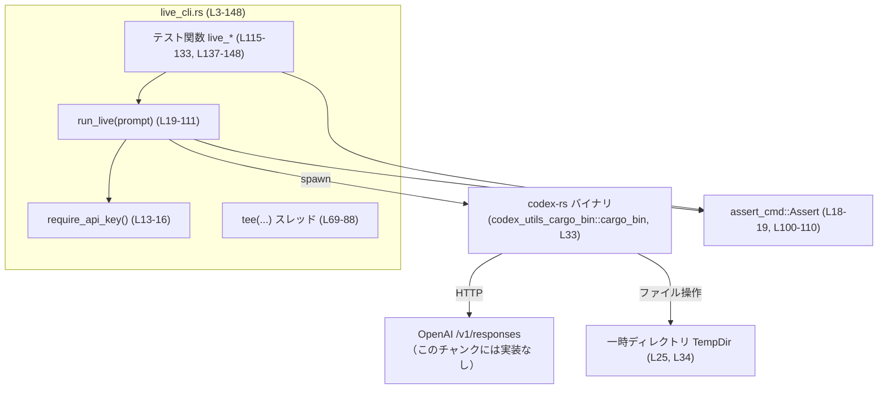
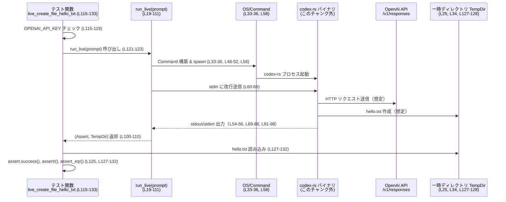

core/tests/suite/live_cli.rs

---

## 0. ざっくり一言

`codex-rs` CLI バイナリを実行し、実際の OpenAI `/v1/responses` エンドポイントを叩くライブスモークテストを定義するファイルです（core/tests/suite/live_cli.rs:L3-5）。  
CLI の標準出力・標準エラーを端末にストリーミングしつつ `assert_cmd` で検証できるようにするヘルパー `run_live` が中心のコンポーネントです（L18-31, L48-110）。

---

## 1. このモジュールの役割

### 1.1 概要

- 実環境の OpenAI API を使う CLI のライブテストを行うためのテストモジュールです（L3-5）。
- `OPENAI_API_KEY` 環境変数が設定されている場合のみ、`codex-rs` バイナリをサブプロセスとして起動し、対話セッションを 1 ターンで終了させるテストを実行します（L13-16, L60-66, L115-123, L137-143）。
- CLI の標準出力・標準エラーを
  - 親プロセスの端末にそのままストリーミングしつつ
  - バッファとして保存し `assert_cmd::Assert` 経由で検証する
  ための I/O スレッドを内部で生成します（L69-88, L91-103）。

### 1.2 アーキテクチャ内での位置づけ

このファイルはテストスイート側にあり、`codex-rs` 実行ファイルと外部サービス（OpenAI API）・ファイルシステムの間に位置するテストハーネスです。



- テスト関数 `live_create_file_hello_txt` / `live_print_working_directory` は共通ヘルパー `run_live` を呼び出します（L121, L143）。
- `run_live` は `codex_utils_cargo_bin::cargo_bin("codex-rs")` から CLI バイナリへのパスを取得し、`std::process::Command` でプロセスを生成します（L33-35, L58）。
- CLI の I/O は `tee` スレッドで親プロセスの標準出力／標準エラーとバッファに分岐され、バッファは `assert_cmd::Assert` に渡されます（L69-88, L91-103, L110）。

### 1.3 設計上のポイント

- **ライブテストの明示的な opt‑in**  
  - テスト全体が `#[ignore]` でマークされており、通常の CI では実行されません（L113, L135）。
  - `OPENAI_API_KEY` が無い場合はテスト内で早期リターンして「スキップした」旨を標準エラーに表示します（L115-119, L137-141）。

- **CLI 実行のラップ**  
  - `run_live` が CLI 起動・I/O 設定・終了待ち・`assert_cmd::Assert` への変換までを一括で行います（L19-21, L25, L33-36, L48-56, L58-66, L91-110）。

- **I/O ストリーミングとキャプチャの両立**  
  - stdout/stderr を `Stdio::piped()` にし（L54-56）、専用スレッド `tee` で端末とメモリバッファの両方に書き出すことで、ライブな出力観察とテスト用アサーションを両立しています（L69-88, L91-98）。

- **簡易なエラーハンドリング**  
  - API キー参照やコマンドの spawn、子プロセスの wait には `unwrap` / `expect` を使い、失敗時はテストが即座に panic する設計です（L14-16, L25, L33, L58, L60-66, L100-102）。

- **1 ターンでのセッション終了**  
  - 子プロセスの標準入力に改行のみを書き込むことで（L60-66）、CLI セッションを 1 ターンで終了させています（コメントでその意図が説明されています：L60）。

---

## 2. 主要な機能・コンポーネント一覧

### 2.1 コンポーネントインベントリー（関数）

| 名前 | 種別 | 概要 | 定義位置 |
|------|------|------|----------|
| `require_api_key` | ユーティリティ関数 | `OPENAI_API_KEY` 環境変数を取得し、未設定なら panic します。 | core/tests/suite/live_cli.rs:L13-16 |
| `run_live` | テスト用ヘルパー関数 | 一時ディレクトリ内で `codex-rs` CLI を実行し、I/O を tee しつつ `assert_cmd::Assert` と `TempDir` を返します。 | L18-111 |
| `tee` | 内部ヘルパー関数（`run_live` 内部） | 子プロセスの stdout/stderr を親プロセスの標準ストリームとメモリバッファに同時書き込みします。別スレッドとして実行されます。 | L69-88 |
| `live_create_file_hello_txt` | テスト関数 | shell ツールを介して `hello.txt` を作成させ、中身が `"hello"` か検証するライブテストです。 | L113-133 |
| `live_print_working_directory` | テスト関数 | shell 関数でカレントディレクトリを出力させ、その内容に一時ディレクトリパスが含まれることを検証するライブテストです。 | L135-148 |

### 2.2 主要な機能一覧（箇条書き）

- `OPENAI_API_KEY` の存在確認と取得（L13-16, L115-119, L137-141）
- 一時ディレクトリを用いた `codex-rs` CLI のサンドボックス実行（L25, L34, L121-123, L143）
- CLI 標準入力への 1 行入力とセッション終了制御（L60-66）
- stdout/stderr のライブストリーミングとバッファリング（L54-56, L69-88, L91-103）
- `assert_cmd` / `predicates` による結果検証
  - プロセス終了ステータスの成功確認（L125, L145-147）
  - 出力ファイルの存在と内容の検証（L127-132）
  - 出力テキストへの部分文字列マッチ（L145-147）

---

## 3. 公開 API と詳細解説

### 3.1 型一覧（このファイル内で定義される型）

このファイル内で新たに定義されている構造体・列挙体・型エイリアスはありません（core/tests/suite/live_cli.rs 全体）。

参考として、頻繁に利用される外部型のみ列挙します（いずれもこのチャンク外で定義）。

| 名前 | 定義元 | 役割 / 用途 | 使用箇所 |
|------|--------|-------------|----------|
| `TempDir` | `tempfile` クレート | 一時ディレクトリを作成し、スコープ終了時に自動削除するユーティリティ。 | L11, L19, L25, L34, L110, L121-123, L127-128, L143 |
| `assert_cmd::assert::Assert` | `assert_cmd` クレート | 外部コマンド実行結果に対するアサーション用ラッパー。 | L18-19, L100-110, L121, L125, L143, L145-147 |

> これらの型の内部実装はこのチャンクには現れないため不明です。

---

### 3.2 関数詳細

#### `require_api_key() -> String`

**概要**

- 環境変数 `OPENAI_API_KEY` を取得し、その値を `String` として返します（L13-15）。
- 環境変数が未設定または取得に失敗した場合、`expect` によりテストプロセスを panic させます（L14-15）。

**引数**

なし（L13）。

**戻り値**

- 型: `String`
- 内容: 環境変数 `OPENAI_API_KEY` の値（L13-15）。

**内部処理の流れ**

1. `std::env::var("OPENAI_API_KEY")` を呼び出して環境変数を取得（L14）。
2. 取得に失敗した場合、`expect("OPENAI_API_KEY env var not set — skip running live tests")` により panic（L14-15）。
3. 成功した値を `String` として返却（L13-16）。

**使用例**

```rust
// run_live 内（L33-36）
cmd.env("OPENAI_API_KEY", require_api_key());
```

**Errors / Panics**

- 失敗時は `Err` ではなく panic。
- panic 条件:
  - `OPENAI_API_KEY` 未設定または `std::env::var` でエラー（L14-15）。

**Edge cases**

- 空文字列の `OPENAI_API_KEY`: 正常とみなされ、そのまま返されます（追加チェックなし: L13-16）。
- 非 UTF-8 な値: `std::env::var` がエラーとなり、`expect` で panic（L14-15）。

**使用上の注意点**

- テスト側で未設定時にスキップするロジックを用意する前提です（L115-119, L137-141）。
- ライブラリ用途で使うには、panic ではなく `Result` を返す別関数が必要ですが、このチャンクには存在しません。

---

#### `run_live(prompt: &str) -> (assert_cmd::assert::Assert, TempDir)`

**概要**

- 指定された `prompt` を引数に `codex-rs` CLI を一時ディレクトリ内で実行し、標準入出力を tee しつつ `assert_cmd::Assert` と `TempDir` を返します（L18-21, L25, L33-36, L48-56, L58-66, L91-110）。

**引数**

| 引数名 | 型 | 説明 |
|--------|----|------|
| `prompt` | `&str` | `codex-rs` CLI に `--` の後ろの位置引数として渡すユーザープロンプト（L48-52, L121-123, L143）。 |

**戻り値**

- 型: `(assert_cmd::assert::Assert, TempDir)`（L19, L110）
  - 第 1 要素: CLI 実行結果へのアサーションインターフェース（L100-110）。
  - 第 2 要素: CLI 実行時のカレントディレクトリとして使われた一時ディレクトリ `TempDir`（L25, L34, L110）。

**内部処理の流れ**

1. 一時ディレクトリ `dir` を作成（`TempDir::new().unwrap()`）（L25）。
2. `Command::new(codex_utils_cargo_bin::cargo_bin("codex-rs").unwrap())` で CLI プロセスを構築（L33）。
3. `current_dir(dir.path())` で子プロセスのカレントディレクトリを `dir` に設定（L34）。
4. `cmd.env("OPENAI_API_KEY", require_api_key())` で API キーを子プロセス環境にセット（L35）。
5. 引数 `--allow-no-git-exec -v -- <prompt>` を設定（L48-52）。
6. stdin / stdout / stderr をすべて `Stdio::piped()` に設定（L54-56）。
7. `cmd.spawn()` で子プロセス起動し、失敗時は `expect` で panic（L58）。
8. `child.stdin` に改行 (`b"\n"`) を書き込み、1 ターンでセッションを終了させる（L60-66）。
9. 内部ヘルパー `tee` を用いて stdout/stderr 用スレッドを起動し、それぞれ親プロセスの `stdout` / `stderr` とバッファに出力（L69-88, L91-98）。
10. `child.wait()` でプロセス終了を待ち（L100）、`stdout_handle.join()` / `stderr_handle.join()` で tee スレッドの終了とバッファ取得を行う（L101-102）。
11. `std::process::Output { status, stdout, stderr }` を構築し（L104-108）、`output.assert()` から `assert_cmd::Assert` を生成して `TempDir` と共に返す（L110）。

**使用例**

```rust
// live_create_file_hello_txt からの使用（L121-123）
let (assert, dir) = run_live(
    "Use the shell tool ... create a file named hello.txt containing the text 'hello'.",
);

assert.success(); // 終了ステータスが成功かをチェック（L125）
```

**Errors / Panics**

- `TempDir::new().unwrap()` 失敗 → panic（L25）。
- `cargo_bin("codex-rs").unwrap()` 失敗 → panic（L33）。
- `cmd.spawn().expect("failed to spawn codex-rs")` 失敗 → panic（L58）。
- `child.stdin` 取得や書き込みに失敗 → `expect` により panic（L61-66）。
- `child.wait()` 失敗 → `expect` により panic（L100）。
- tee スレッドが panic した場合 → `join().expect("... panicked")` で panic（L101-102）。

**Edge cases**

- `prompt` が空文字列でも特別な処理はなく、そのまま CLI に渡されます（L48-52）。
- 子プロセスが出力しない場合、tee スレッドは `Ok(0)` を受け取り、空バッファを返します（L77-78, L87, L101-102）。
- stdout/stderr が大量の場合、全量を `Vec<u8>` に保持するためメモリ使用量が増加します（L74-75, L80-83）。

**使用上の注意点**

- `run_live` はテスト用途の設計であり、失敗時は `Result` ではなく panic で終了します（L25, L33, L58, L60-66, L100-102）。
- 戻り値の `TempDir` はスコープ終了時に自動削除されるので、ファイル検査はテスト関数内で完結させる必要があります（L110, L127-132）。

---

#### `tee<R: Read + Send + 'static>(reader: R, writer: impl Write + Send + 'static) -> thread::JoinHandle<Vec<u8>>`

（`run_live` 内にネストされたヘルパー関数）（L69-88）。

**概要**

- `reader` から読み出したデータを `writer` と `Vec<u8>` の両方に書き込み、読み出し済みデータを返すスレッドを生成します（L69-83）。

**引数**

| 引数名 | 型 | 説明 |
|--------|----|------|
| `reader` | `R: Read + Send + 'static` | 子プロセスの stdout / stderr などから読み取るストリーム（L69-71, L91-98）。 |
| `writer` | `impl Write + Send + 'static` | 親プロセスの stdout / stderr などに書き出すストリーム（L69-71, L91-98）。 |

**戻り値**

- 型: `thread::JoinHandle<Vec<u8>>`（L72-73）
- 内容: スレッド終了時点までに読み取ったすべてのバイト列。

**内部処理の流れ**

1. `thread::spawn` で新スレッドを生成（L73）。
2. `buf: Vec<u8>` と `chunk: [0u8; 4096]` を用意（L74-75）。
3. `loop` で `reader.read(&mut chunk)` を繰り返す（L76-77）。
   - `Ok(0)`（EOF） → ループ終了（L78）。
   - `Ok(n)` → `writer.write_all(&chunk[..n]).ok()` で書き出し、`writer.flush().ok()` でフラッシュ（L80-81）、`buf.extend_from_slice(&chunk[..n])` でバッファに保存（L82）。
   - `Err(_)` → ループ終了（L84-85）。
4. `buf` を戻り値として返す（L87）。

**使用例**

```rust
let stdout_handle = tee(
    child.stdout.take().expect("child stdout"), // Reader（L91-92）
    std::io::stdout(),                          // Writer（L93）
);
```

stderr についても同様です（L95-97）。

**Errors / Panics**

- 内部では `unwrap` / `expect` を使用していないため、`read`/`write` の I/O エラーでは panic しません（L73-88）。
- `write_all` と `flush` のエラーは `.ok()` で無視されます（L80-81）。
- `read` のエラー時にはループを抜け、その時点までの `buf` を返します（L84-85）。

**Edge cases**

- 即座に EOF の場合、空の `Vec<u8>` を返します（L77-78, L87）。
- 出力が非常に大きい場合、`buf` が同じサイズのメモリを消費します（L74-75, L82）。

**使用上の注意点**

- 呼び出し側は必ず `JoinHandle` を `join` してスレッド終了と `Vec<u8>` の取得を行う必要があります（`run_live` では L101-102 で実施）。
- `writer` にはスレッドからの同時アクセスに耐えられるハンドルを渡す必要がありますが、このファイルでは `std::io::stdout()` / `stderr()` が使用されています（L91-98）。

---

#### `live_create_file_hello_txt()`

**概要**

- shell ツールと `apply_patch` コマンドを使って `hello.txt` ファイルを作成させ、その内容が `"hello"` であることを検証するライブテストです（L121-123, L127-132）。
- `#[ignore]` 付きのため、明示的に指定しない限り実行されません（L113）。

**引数・戻り値**

- 引数なし、戻り値 `()` の通常のテスト関数です（L115）。

**内部処理の流れ**

1. `std::env::var("OPENAI_API_KEY").is_err()` で API キーの有無をチェック（L116）。
2. 未設定の場合、スキップメッセージを `eprintln!` し、`return`（L117-119）。
3. 設定されている場合、`run_live` をプロンプト付きで呼び出し（L121-123）、`assert` と `dir` を取得。
4. `assert.success()` でプロセスが成功終了したことを確認（L125）。
5. `dir.path().join("hello.txt")` でファイルパスを組み立て、`assert!(path.exists(), ...)` でファイル存在を検証（L127-128）。
6. `std::fs::read_to_string(path).unwrap()` で内容を読み取り（L130）、`assert_eq!(contents.trim(), "hello")` で内容を検証（L132）。

**Errors / Panics**

- API キー未設定時はスキップするのみで panic しません（L115-119）。
- `run_live` 内で発生しうる panic は前述の通りです（L19-111）。
- `read_to_string(path).unwrap()` が失敗した場合（ファイルが読めない等）、`unwrap` により panic（L130）。
- `assert!` / `assert_eq!` が失敗した場合、テスト失敗として panic（L128, L132）。

**Edge cases**

- モデルが `hello.txt` 以外の名前のファイルを作成した場合 → `path.exists()` が偽となりテスト失敗（L127-128）。
- `hello.txt` 内の内容が `"hello"` 以外、または改行のみ追加されている場合:
  - 前後の空白は `trim()` で削除されるため、内部文字列 `"hello"` が一致しない限りテスト失敗（L132）。

**使用上の注意点**

- プロンプトは自然言語であり、モデルの挙動は完全には決定論的ではない可能性がありますが、このチャンクにはその安定性に関する情報はありません（L121-123）。
- 影響範囲は一時ディレクトリ内に限定される設計です（L25, L34, L121-123, L127-128）。

---

#### `live_print_working_directory()`

**概要**

- shell 関数を使ってカレントディレクトリを表示させ、その出力に一時ディレクトリパス文字列が含まれることを検証するライブテストです（L137-148）。
- `#[ignore]` 付きです（L135）。

**引数・戻り値**

- 引数なし、戻り値 `()` の通常のテスト関数です（L137）。

**内部処理の流れ**

1. `OPENAI_API_KEY` をチェックし、未設定ならスキップメッセージを表示して `return`（L138-141）。
2. `run_live("Print the current working directory using the shell function.")` を呼び出し（L143）、`assert` と `dir` を取得。
3. `assert.success()` で成功終了を確認（L145-146）。
4. `stdout(predicate::str::contains(dir.path().to_string_lossy()))` で、標準出力に一時ディレクトリのパス文字列が含まれていることを検証（L145-147）。

**Errors / Panics**

- API キー未設定時はスキップのみで panic しません（L138-141）。
- `run_live` 内部での panic 条件は前述の通りです（L19-111）。
- `assert_cmd` のアサーションが失敗した場合（終了コードが非ゼロまたは stdout が期待に合致しない場合）、テスト失敗として扱われます（L145-147）。

**Edge cases**

- CLI がカレントディレクトリパスを stderr に出力する場合:
  - テストは stdout だけを検査しているため、失敗します（L145-147）。
- パス文字列が `to_string_lossy()` によって変換されるため、特殊な文字を含むパスでは文字化けする可能性がありますが、通常の環境では問題にならない想定です（L147）。

**使用上の注意点**

- カレントディレクトリは `run_live` が `TempDir` を `current_dir` に設定しているため、常に一時ディレクトリ（L34, L143）になります。
- パスの比較は文字列包含で行われるため、出力に他の文字が混ざっていても `dir.path()` の文字列表現が含まれていればテストは成功します（L145-147）。

---

### 3.3 その他の関数

上記 5 つ以外に、このファイルで定義されている関数はありません（core/tests/suite/live_cli.rs 全体）。

---

## 4. データフロー

`live_create_file_hello_txt` 実行時の代表的なデータフローを示します。

1. テストランナーが `live_create_file_hello_txt` を呼び出す（L115）。
2. テストが `OPENAI_API_KEY` の有無を確認し、設定済みなら `run_live` を呼び出す（L115-121）。
3. `run_live` が一時ディレクトリを作成し（L25）、そのディレクトリをカレントディレクトリに設定した状態で `codex-rs` CLI を起動する（L34, L33, L58）。
4. CLI に `prompt` と `OPENAI_API_KEY` が渡され、CLI 側が OpenAI API へリクエストを送る（CLI 側の実装はこのチャンク外）。
5. CLI が shell ツールを介して `hello.txt` を作成し、内容を書き込む（CLI 側の実装であり、このチャンクには現れません）。
6. CLI の stdout/stderr は tee スレッドで端末出力とバッファに分配される（L69-88, L91-98）。
7. CLI 終了後、`run_live` が `Assert` と `TempDir` をテストに返し（L100-110）、テストが一時ディレクトリ内の `hello.txt` を読み取ってアサートする（L127-132）。



---

## 5. 使い方（How to Use）

### 5.1 基本的な使用方法

**ライブテストの実行**

1. 有効な API キーを環境変数 `OPENAI_API_KEY` に設定（L13-16, L115-119, L137-141）。
2. `cargo test` で `--ignored` を付けてこのテストファイルを実行（L3-5）。

```bash
export OPENAI_API_KEY=sk-...  # 実際のキーに置き換え
cargo test --test live_cli -- --ignored
```

- `--test live_cli` は `live_cli.rs` に対応するテストバイナリを対象にします（L3-5）。
- `--ignored` は `#[ignore]` を付けたテストを含めて実行します（L113, L135）。

### 5.2 よくある使用パターン

**パターン 1: 新しいライブテストの追加**

```rust
#[ignore]
#[test]
fn live_list_files() {
    // API キー未設定時はスキップ（L115-119, L138-141 と同パターン）
    if std::env::var("OPENAI_API_KEY").is_err() {
        eprintln!("skipping live_list_files – OPENAI_API_KEY not set");
        return;
    }

    // run_live で任意のプロンプトを実行
    let (assert, dir) = run_live("List all files in the current directory.");

    assert.success(); // プロセスが成功終了しているか確認

    // dir 内のファイルや stdout を検証するロジックを追加できる
}
```

**パターン 2: stdout だけを検証するテスト**

`live_print_working_directory` のように、ファイル操作を行わず stdout を検証するケースです（L137-148）。

### 5.3 よくある間違い

```rust
// 間違い例: OPENAI_API_KEY チェックをせず run_live を呼ぶ
#[test]
fn live_without_key() {
    // OPENAI_API_KEY が未設定だと、run_live 内で require_api_key() が panic する可能性がある（L13-16, L35）
    let (_assert, _dir) = run_live("Some prompt");
}

// 正しい例: 事前に環境変数の有無をチェックしてスキップ
#[ignore]
#[test]
fn live_with_key_check() {
    if std::env::var("OPENAI_API_KEY").is_err() {
        eprintln!("skipping – OPENAI_API_KEY not set");
        return;
    }
    let (assert, _dir) = run_live("Some prompt");
    assert.success();
}
```

### 5.4 使用上の注意点（まとめ）

- **環境変数前提**: `run_live` は `require_api_key` を通じて `OPENAI_API_KEY` を必須とするため（L35, L13-16）、テスト側での事前チェックが必要です（L115-119, L137-141）。
- **外部サービス依存**: OpenAI API と `codex-rs` の挙動に依存するため、ネットワークやモデル更新によりテスト結果が変動する可能性がありますが、その詳細はこのチャンクにはありません。
- **一時ディレクトリのライフサイクル**: `TempDir` のスコープが終わるとディレクトリは削除されるため、ファイル検査はテスト関数内で行う必要があります（L25, L110, L127-132）。
- **出力量とメモリ**: `tee` は出力をすべて `Vec<u8>` に溜めるため、極端に大きな出力はメモリ消費を増加させます（L74-75, L80-83）。

---

## 6. 変更の仕方（How to Modify）

### 6.1 新しい機能（テストケース）を追加する場合

1. **検証したい CLI 機能を定義**  
   例: 新しいツール呼び出し、エラーケースの挙動など。

2. **新しい `#[ignore] #[test]` 関数を追加**  
   - `live_` プレフィックスの名前を付け、`OPENAI_API_KEY` チェックと `run_live` 呼び出しを行います（L113-119, L137-143 を参考）。

3. **アサーションを書く**  
   - `assert.success()`（L125, L145-146）や、ファイル存在チェック（L127-128）、`predicate::str::contains` を用いた出力検証（L145-147）を組み合わせて目的に応じたアサートを追加します。

### 6.2 既存の機能を変更する場合

- **バイナリ名の変更**  
  - `Command::new(codex_utils_cargo_bin::cargo_bin("codex-rs").unwrap())` の `"codex-rs"` を新しいバイナリ名に変更します（L33）。

- **I/O ストリーミング方式の変更**  
  - stdout/stderr の扱いを変えたい場合、`tee` 実装（L69-88）とその呼び出し（L91-98）を変更します。
  - それに伴い、`stdout_handle.join()` / `stderr_handle.join()` の結果（L101-102, L104-108）の扱いも調整が必要になる可能性があります。

- **エラー処理方針の変更**  
  - `require_api_key` や `run_live` 内にある `unwrap` / `expect` を `Result` ベースに変えることで、panic ではなくテストスキップや詳細ログにできます（L14-16, L25, L33, L58, L60-66, L100-102）。
  - その場合、テスト関数側も `Result` を返すようなシグネチャに変更する必要が出ます（このファイルにはそのような例はありません）。

変更時の確認ポイント:

- `run_live` を利用している全テスト（L113-133, L137-148）。
- `OPENAI_API_KEY` を参照している箇所（L13-16, L115-119, L137-141）。

---

## 7. 関連ファイル・コンポーネント

| パス / コンポーネント | 役割 / 関係 |
|-----------------------|------------|
| `core/tests/suite/live_cli.rs` | 本レポートの対象ファイル。ライブ CLI テストと `run_live` ヘルパーを提供します。 |
| `codex_utils_cargo_bin::cargo_bin`（クレート） | `codex-rs` バイナリのパスを解決するために使用されています（L33）。定義場所はこのチャンクには現れません。 |
| `codex-rs` CLI バイナリ | `run_live` が実行する対象のバイナリです（L33, L48-52, L58）。OpenAI API とのやりとりや shell ツールの実装はこのチャンク外にあります。 |
| `assert_cmd` クレート | 外部コマンドの実行とアサーションを行うためのユーティリティとして使用されています（L7-8, L18-19, L100-110, L125, L145-147）。 |
| `predicates` クレート | 標準出力の部分一致など、柔軟なアサーション条件を提供します（L8, L145-147）。 |
| `tempfile` クレート | 一時ディレクトリ `TempDir` の提供元であり、テストの副作用をサンドボックス内に閉じ込めるために利用されています（L11, L25, L34, L110, L121-123, L127-128, L143）。 |

これら外部コンポーネントの詳細実装や API はこのチャンクには含まれていないため、不明な点は各クレートやバイナリのドキュメントを参照する必要があります。
