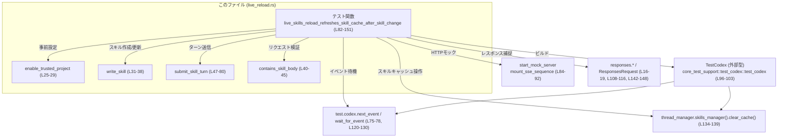
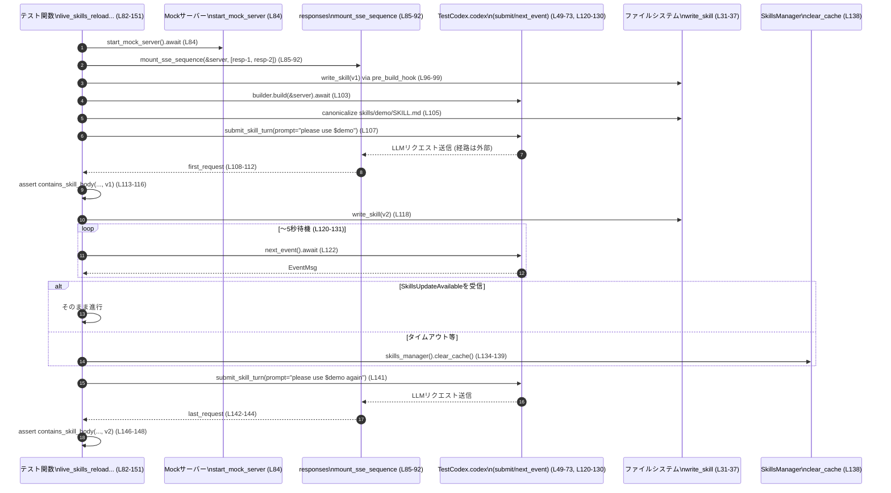

# core/tests/suite/live_reload.rs コード解説

## 0. ざっくり一言

Codex の「スキル」Markdown ファイルを書き換えたときに、ライブリロード機構によってスキルキャッシュが更新され、次のユーザーターンで新しい内容が反映されることを検証する非同期テストです（`live_skills_reload_refreshes_skill_cache_after_skill_change`）（core/tests/suite/live_reload.rs:L82-151）。

---

## 1. このモジュールの役割

### 1.1 概要

- このファイルは、Codex コアの **スキルライブリロード機能** を検証するためのテストを提供します。
- 具体的には、スキルファイル（`SKILL.md`）の内容を変更したあとに、  
  1 回目のターンでは古い内容、2 回目のターンでは新しい内容が LLM へのリクエストに含まれることを確認します（core/tests/suite/live_reload.rs:L94-96, L107-116, L141-149）。
- さらに、一部環境でファイル監視イベントが来ない場合のフォールバックとして、スキルキャッシュを手動でクリアする経路もテストしています（core/tests/suite/live_reload.rs:L134-139）。

### 1.2 アーキテクチャ内での位置づけ

このテストは、`core_test_support` が提供するテスト用 Codex ランタイムとモックサーバーの上で動作し、実際の Codex コア（イベントストリーム・スキルマネージャなど）に対する **ブラックボックスに近い形の統合テスト**になっています（core/tests/suite/live_reload.rs:L16-23, L82-104, L120-130, L138）。

主な関係は次の通りです。



> 注: `TestCodex` や `skills_manager()` などの内部実装はこのチャンクには現れず、ここではテストからの呼び出し関係のみを示しています。

### 1.3 設計上のポイント

- **責務の分割**
  - コンフィグ設定（`enable_trusted_project`）、スキルファイルの書き込み（`write_skill`）、リクエスト内容の検査（`contains_skill_body`）、1 ターンを投げる処理（`submit_skill_turn`）をヘルパー関数として切り出しています（core/tests/suite/live_reload.rs:L25-45, L47-80）。
- **状態管理**
  - テスト側では `TestCodex` インスタンスとスキルファイル（`SKILL.md`）のみを直接扱い、Codex 内部の状態（キャッシュやスレッドなど）は `TestCodex` や `thread_manager` に委譲しています（core/tests/suite/live_reload.rs:L96-104, L118-120, L134-139）。
- **エラーハンドリング方針**
  - 実テスト関数は `anyhow::Result<()>` を返し、`?` 演算子で外部 API のエラーを伝播します（core/tests/suite/live_reload.rs:L8, L82-83, L103-105, L131-132）。
  - テスト用ヘルパーではファイル I/O の失敗時に `expect` で即座に panic させる設計になっています（core/tests/suite/live_reload.rs:L31-37）。
- **並行性 / 非同期**
  - Tokio のマルチスレッドランタイム（`#[tokio::test(flavor = "multi_thread", worker_threads = 2)]`）上で動作し、`async`/`await` と `tokio::time::timeout` を用いて非同期イベント（SkillsUpdateAvailable）を待機します（core/tests/suite/live_reload.rs:L82, L120-132）。

---

## 2. 主要な機能一覧

- スキル信頼設定の有効化: `enable_trusted_project` でプロジェクトの trust_level を Trusted に設定する（core/tests/suite/live_reload.rs:L25-29）。
- スキルファイルの生成・更新: `write_skill` で `skills/<name>/SKILL.md` を YAML フロントマター付きで書き出す（core/tests/suite/live_reload.rs:L31-37）。
- リクエストに含まれるスキル本文の検査: `contains_skill_body` で送信されたメッセージに期待するスキル本文が埋め込まれているか確認する（core/tests/suite/live_reload.rs:L40-45）。
- 1 ユーザーターンの送信と完了待機: `submit_skill_turn` で Codex にユーザー入力＋スキル参照を送り、`TurnComplete` イベントまで待機する（core/tests/suite/live_reload.rs:L47-80）。
- ライブリロードの統合テスト:
  - `live_skills_reload_refreshes_skill_cache_after_skill_change` で、スキル更新後に `SkillsUpdateAvailable` を待機（もしくはキャッシュを明示的にクリア）し、次のターンで更新後のスキル本文が使われることを検証する（core/tests/suite/live_reload.rs:L82-151）。

### 2.1 コンポーネント一覧（関数）

| 名前 | 種別 | 役割 / 用途 | 行範囲 |
|------|------|-------------|--------|
| `enable_trusted_project` | 関数 | プロジェクト設定の `trust_level` を Trusted にする | core/tests/suite/live_reload.rs:L25-29 |
| `write_skill` | 関数 | 指定ホームディレクトリ配下にスキルディレクトリを作成し、`SKILL.md` を書き出す | core/tests/suite/live_reload.rs:L31-37 |
| `contains_skill_body` | 関数 | `ResponsesRequest` 中のユーザーメッセージにスキル本文と `<skill>` タグが含まれるか判定する | core/tests/suite/live_reload.rs:L40-45 |
| `submit_skill_turn` | 非同期関数 | Codex に 1 回分のユーザーターンを送信し、`TurnComplete` イベントまで待機する | core/tests/suite/live_reload.rs:L47-80 |
| `live_skills_reload_refreshes_skill_cache_after_skill_change` | 非同期テスト | スキルファイルの更新がキャッシュに反映されることを Mock サーバー経由で検証する | core/tests/suite/live_reload.rs:L82-151 |

---

## 3. 公開 API と詳細解説

このファイルはテストコードであり、クレート外に公開される API は定義していませんが、テスト内で再利用されるヘルパー関数群とメインのテスト関数を「API」とみなして解説します。

### 3.1 型一覧（構造体・列挙体など）

このファイル内で新しく定義されている構造体・列挙体はありません。

テストの理解に重要な外部型のみ列挙します（定義は他ファイルにあります）。

| 名前 | 種別 | 定義元 / 用途 |
|------|------|---------------|
| `codex_core::config::Config` | 構造体 | Codex コア設定。ここでは `active_project` フィールドに `ProjectConfig` を設定するために使用されます（core/tests/suite/live_reload.rs:L25-29）。 |
| `ProjectConfig` | 構造体 | `codex_config::config_toml::ProjectConfig`。プロジェクト単位の設定で、`trust_level` を含みます（core/tests/suite/live_reload.rs:L9, L25-28）。 |
| `TrustLevel` | 列挙体 | `codex_protocol::config_types::TrustLevel`。ここでは `Trusted` バリアントを使用します（core/tests/suite/live_reload.rs:L10, L27）。 |
| `TestCodex` | 構造体 | テスト用 Codex ラッパー。`codex`、`thread_manager`、`cwd_path` などを提供します（core/tests/suite/live_reload.rs:L20-21, L47-80, L120-130, L138）。 |
| `ResponsesRequest` | 構造体 | モックサーバーに送られた LLM リクエストを表すテスト用型で、`message_input_texts` メソッドを持ちます（core/tests/suite/live_reload.rs:L17, L40-44）。 |
| `EventMsg` | 列挙体 | Codex のイベント種別。ここでは `TurnComplete(_)` と `SkillsUpdateAvailable` を使用します（core/tests/suite/live_reload.rs:L12, L75-77, L124-125）。 |
| `UserInput` | 列挙体 | ユーザー入力タイプ。ここでは `Text` と `Skill` バリアントを使用します（core/tests/suite/live_reload.rs:L15, L51-59）。 |
| `AskForApproval` | 列挙体 | 承認ポリシー。ここでは `Never` を指定し、承認フローを無効化しています（core/tests/suite/live_reload.rs:L11, L63）。 |
| `SandboxPolicy` | 列挙体 | サンドボックスポリシー。ここでは `DangerFullAccess` を使用します（core/tests/suite/live_reload.rs:L14, L65）。 |

> これらの型の詳細なフィールドや内部実装はこのチャンクには現れません。

---

### 3.2 関数詳細

#### `enable_trusted_project(config: &mut codex_core::config::Config)`

**概要**

プロジェクトの設定に `ProjectConfig { trust_level: Some(TrustLevel::Trusted) }` を設定し、そのプロジェクトを「Trusted」として扱うようにします（core/tests/suite/live_reload.rs:L25-28）。

**引数**

| 引数名 | 型 | 説明 |
|--------|----|------|
| `config` | `&mut codex_core::config::Config` | 書き換え対象の Codex コア設定。`active_project` フィールドを上書きします（core/tests/suite/live_reload.rs:L25-28）。 |

**戻り値**

- なし（`()`）。副作用として `config.active_project` を変更します（core/tests/suite/live_reload.rs:L25-28）。

**内部処理の流れ**

1. 引数の `config` の `active_project` フィールドに、新しい `ProjectConfig` インスタンスを代入します（core/tests/suite/live_reload.rs:L25-27）。
2. その `ProjectConfig` の `trust_level` フィールドには `Some(TrustLevel::Trusted)` を設定します（core/tests/suite/live_reload.rs:L27）。

**Examples（使用例）**

このファイル内では、テスト用 Codex をビルドする際の設定フックで使用されています。

```rust
let mut builder = test_codex()
    .with_pre_build_hook(move |home| {
        write_skill(home, "demo", "demo skill", skill_v1); // スキル生成（L96-99）
    })
    .with_config(|config| {
        enable_trusted_project(config);                    // 信頼プロジェクト設定（L100-102）
    });
```

このコードにより、テスト対象の Codex インスタンスが Trusted プロジェクトとして初期化されます（core/tests/suite/live_reload.rs:L96-103）。

**Errors / Panics**

- 直接的なエラーや panic は発生しません。  
  ただし、`config.active_project` のフィールド構造が変わった場合などはコンパイルエラーになります。

**Edge cases（エッジケース）**

- `config.active_project` にもともと別の設定が入っていても、無条件に上書きされます（core/tests/suite/live_reload.rs:L25-28）。
- `config` が `None` などになるケースは型シグネチャ上存在しないため、考慮されていません。

**使用上の注意点**

- 既存の `active_project` 設定を尊重したい場合には、その前後の値を保存するなど、別途配慮が必要になります。この関数は単純に Trusted プロジェクトを設定します。

---

#### `write_skill(home: &Path, name: &str, description: &str, body: &str) -> PathBuf`

**概要**

指定されたホームディレクトリ以下に `skills/<name>/` ディレクトリを作成し、YAML フロントマターと本文からなる `SKILL.md` を書き出して、そのパスを返します（core/tests/suite/live_reload.rs:L31-37）。

**引数**

| 引数名 | 型 | 説明 |
|--------|----|------|
| `home` | `&Path` | スキルディレクトリを作成するベースパス（例: Codex のホームディレクトリ）（core/tests/suite/live_reload.rs:L31-33）。 |
| `name` | `&str` | スキル名。`skills/<name>` ディレクトリ名と YAML フロントマターの `name` に使用されます（core/tests/suite/live_reload.rs:L31-35）。 |
| `description` | `&str` | スキルの説明。YAML フロントマターの `description` に使用されます（core/tests/suite/live_reload.rs:L34）。 |
| `body` | `&str` | スキル本文。フロントマターのあとにそのまま書き出されます（core/tests/suite/live_reload.rs:L34）。 |

**戻り値**

- `PathBuf` – 作成した `SKILL.md` ファイルのパス（core/tests/suite/live_reload.rs:L35-37）。

**内部処理の流れ**

1. `home.join("skills").join(name)` で `skills/<name>` ディレクトリパスを計算します（core/tests/suite/live_reload.rs:L31-32）。
2. `fs::create_dir_all(&skill_dir)` でディレクトリを再帰的に作成し、失敗時は `expect("create skill dir")` で panic します（core/tests/suite/live_reload.rs:L32-33）。
3. YAML フロントマター (`--- ... ---`) と本文を含む文字列 `contents` を `format!` で生成します（core/tests/suite/live_reload.rs:L34）。
4. `skill_dir.join("SKILL.md")` でファイルパスを作り、`fs::write(&path, contents)` で書き出します。失敗時は `expect("write skill")` で panic します（core/tests/suite/live_reload.rs:L35-36）。
5. 最後に `path` を返します（core/tests/suite/live_reload.rs:L37）。

**Examples（使用例）**

テスト用 Codex のビルド前フックで、初期スキルを作成するときに使われます。

```rust
let skill_v1 = "skill body v1";                    // 初期スキル本文（L94）
let mut builder = test_codex()
    .with_pre_build_hook(move |home| {
        write_skill(home, "demo", "demo skill", skill_v1);  // スキルv1生成（L96-99）
    });
```

スキル更新時にも同じ関数が再利用され、`body` だけを変えてスキルファイルを書き換えています（core/tests/suite/live_reload.rs:L118）。

```rust
let skill_v2 = "skill body v2";                    // 更新後本文（L95）
write_skill(test.codex_home_path(), "demo", "demo skill", skill_v2); // v2に上書き（L118）
```

**Errors / Panics**

- `fs::create_dir_all` が失敗すると panic します（core/tests/suite/live_reload.rs:L32-33）。
- `fs::write` が失敗すると panic します（core/tests/suite/live_reload.rs:L36）。
- これらはテストコードであるため、I/O 失敗時に即座にテストを落とす設計になっています。

**Edge cases（エッジケース）**

- `home` が書き込み不可なパスであれば、ディレクトリ作成かファイル書き込みのどこかで panic します（core/tests/suite/live_reload.rs:L31-37）。
- 既に `skills/<name>/SKILL.md` が存在する場合でも、その内容は無条件に上書きされます（core/tests/suite/live_reload.rs:L35-36）。
- `body` が空文字列でも、そのまま空本文として書き出されます。

**使用上の注意点**

- テスト以外で使う場合は、`expect` による panic ではなく `Result` を返す設計にするなど、用途に応じたエラーハンドリングが必要になる可能性があります。

---

#### `contains_skill_body(request: &ResponsesRequest, skill_body: &str) -> bool`

**概要**

モックサーバーに送信された LLM リクエスト (`ResponsesRequest`) のユーザーメッセージから、指定したスキル本文と `<skill>` タグの両方を含むテキストが存在するかを判定します（core/tests/suite/live_reload.rs:L40-45）。

**引数**

| 引数名 | 型 | 説明 |
|--------|----|------|
| `request` | `&ResponsesRequest` | LLM リクエスト全体を表すテスト用型。`message_input_texts("user")` でユーザー入力テキスト一覧を取得します（core/tests/suite/live_reload.rs:L17, L40-44）。 |
| `skill_body` | `&str` | 検索対象のスキル本文。リクエスト内のテキストがこれを含むかチェックします（core/tests/suite/live_reload.rs:L40-44）。 |

**戻り値**

- `bool` – ユーザーメッセージのどれか一つでも `skill_body` と `<skill>` の両方を含んでいれば `true`、それ以外は `false`（core/tests/suite/live_reload.rs:L41-45）。

**内部処理の流れ**

1. `request.message_input_texts("user")` を呼んで、ユーザー起因のメッセージテキスト一覧を取得します（core/tests/suite/live_reload.rs:L41-42）。
2. 取得した `&[String]` のイテレータに対して `.iter().any(...)` を適用し、各テキストについて以下を確認します（core/tests/suite/live_reload.rs:L42-44）。
   - `text.contains(skill_body)` かつ `text.contains("<skill>")` が両方とも `true` であるか。
3. 条件を満たすテキストがあれば `true` を返し、なければ `false` を返します（core/tests/suite/live_reload.rs:L44-45）。

**Examples（使用例）**

1 回目のターンでは、初期スキル本文 `skill_v1` が含まれていることを確認しています。

```rust
let first_request = responses
    .requests()
    .first()
    .cloned()
    .expect("first request captured");                            // 最初の送信リクエスト（L108-112）

assert!(
    contains_skill_body(&first_request, skill_v1),                // v1が含まれることを検証（L113-115）
    "expected initial skill body in request"
);
```

2 回目のターンでは、更新後の本文 `skill_v2` が含まれていることを確認します（core/tests/suite/live_reload.rs:L142-148）。

```rust
let last_request = responses
    .last_request()
    .expect("request captured after skill update");               // 最後のリクエスト（L142-144）

assert!(
    contains_skill_body(&last_request, skill_v2),                 // v2が含まれることを検証（L146-148）
    "expected updated skill body after reload"
);
```

**Errors / Panics**

- この関数自体はエラーも panic も発生させません。
- `request.message_input_texts("user")` の実装によっては内部で panic する可能性はありますが、その挙動はこのチャンクには現れません。

**Edge cases（エッジケース）**

- ユーザーメッセージが 1 件もない場合、`.any(...)` に渡すイテレータが空になり、`false` を返します（core/tests/suite/live_reload.rs:L41-45）。
- `skill_body` が空文字列の場合、すべてのテキストが `text.contains("") == true` となるため、`<skill>` を含む任意のテキストがあれば `true` になります。
- `<skill>` タグがない形式の埋め込みに変わった場合、この関数は常に `false` を返すようになります。

**使用上の注意点**

- `<skill>` という文字列に依存しているため、テンプレートフォーマットやタグ名が変わった場合にはテストも合わせて変更する必要があります。

---

#### `submit_skill_turn(test: &TestCodex, skill_path: PathBuf, prompt: &str) -> Result<()>`

**概要**

`TestCodex` を通じて Codex に 1 回分のユーザーターンを送信し、`TurnComplete` イベントが到着するまで待機する補助関数です（core/tests/suite/live_reload.rs:L47-80）。

**引数**

| 引数名 | 型 | 説明 |
|--------|----|------|
| `test` | `&TestCodex` | テスト用 Codex ラッパー。`codex` インスタンス、セッション設定、作業ディレクトリパスを提供します（core/tests/suite/live_reload.rs:L20-21, L47-49, L62-63）。 |
| `skill_path` | `PathBuf` | 使用するスキルファイル (`SKILL.md`) のパス。`UserInput::Skill` に渡されます（core/tests/suite/live_reload.rs:L47, L56-59）。 |
| `prompt` | `&str` | ユーザープロンプト文。`UserInput::Text` に渡されます（core/tests/suite/live_reload.rs:L47, L52-54）。 |

**戻り値**

- `Result<()>`（`anyhow::Result` 型） – 成功時は `Ok(())`、`submit` や `wait_for_event` の内部で発生したエラーをそのまま `Err` として返します（core/tests/suite/live_reload.rs:L8, L47, L72-73, L79-80）。

**内部処理の流れ**

1. `test.session_configured.model.clone()` で使用するモデル設定を取得します（core/tests/suite/live_reload.rs:L48）。
2. `test.codex.submit(Op::UserTurn { ... }).await?` を呼び出し、1 ターン分の入力を送信します（core/tests/suite/live_reload.rs:L49-73）。
   - `items`:
     - `UserInput::Text { text: prompt.to_string(), text_elements: Vec::new() }`（core/tests/suite/live_reload.rs:L51-55）。
     - `UserInput::Skill { name: "demo".to_string(), path: skill_path }`（core/tests/suite/live_reload.rs:L56-59）。
   - `final_output_json_schema`: `None`（core/tests/suite/live_reload.rs:L61）。
   - `cwd`: `test.cwd_path().to_path_buf()`（core/tests/suite/live_reload.rs:L62）。
   - `approval_policy`: `AskForApproval::Never`（core/tests/suite/live_reload.rs:L63）。
   - `sandbox_policy`: `SandboxPolicy::DangerFullAccess`（core/tests/suite/live_reload.rs:L65）。
   - `model`: 1. で取得した `session_model`（core/tests/suite/live_reload.rs:L66）。
   - その他オプション (`effort`, `summary`, `service_tier`, `collaboration_mode`, `personality`) は `None`（core/tests/suite/live_reload.rs:L67-71）。
3. 送信に成功したら、`wait_for_event(test.codex.as_ref(), |event| { matches!(event, EventMsg::TurnComplete(_)) }).await;` を呼び出し、`TurnComplete` イベントが届くまで非同期で待機します（core/tests/suite/live_reload.rs:L75-78）。
4. 最後に `Ok(())` を返します（core/tests/suite/live_reload.rs:L79-80）。

**Examples（使用例）**

テストでは、スキル更新前後の 2 回、同じスキルパスに対して異なるプロンプトで呼び出しています（core/tests/suite/live_reload.rs:L107, L141）。

```rust
// 1回目: 初期スキルv1を使用
submit_skill_turn(&test, skill_path.clone(), "please use $demo").await?;      // L107

// 2回目: 更新後スキルv2を使用
submit_skill_turn(&test, skill_path.clone(), "please use $demo again").await?; // L141
```

**Errors / Panics**

- `test.codex.submit(...).await?` または `wait_for_event(...).await` が `Err` を返した場合、そのエラーを呼び出し元（テスト関数）に伝播します（core/tests/suite/live_reload.rs:L72-73, L75-80）。
- この関数自体は panic を発生させません。

**Edge cases（エッジケース）**

- `skill_path` が存在しない場合や読めない場合、`submit` 内部でエラーとなる可能性がありますが、その挙動はこのチャンクには現れません。
- イベントストリームが何らかの理由で `TurnComplete` を送信しない場合、`wait_for_event` がどう振る舞うかはこのチャンクには現れません（タイムアウトやストリーム終了など）。

**使用上の注意点**

- この関数は `TurnComplete` イベントが来るまでブロック（await）するため、多数のターンを並列に投げるケースでは使用方法を検討する必要があります。
- `SandboxPolicy::DangerFullAccess` を使用している点から、実行環境に対してフルアクセスが許可される前提のテストであることが示唆されます（core/tests/suite/live_reload.rs:L65）が、実際の権限範囲はこのチャンクには現れません。

---

#### `live_skills_reload_refreshes_skill_cache_after_skill_change() -> Result<()>`

**概要**

Tokio 上の非同期テスト。モックサーバーと `TestCodex` を使って、スキルファイルの内容変更が Codex のスキルキャッシュに反映され、次のユーザーターンで更新後のスキル本文が LLM リクエストに含まれることを検証します（core/tests/suite/live_reload.rs:L82-151）。

**引数**

- なし。Tokio のテストマクロ `#[tokio::test(flavor = "multi_thread", worker_threads = 2)]` により非同期テストとして実行されます（core/tests/suite/live_reload.rs:L82）。

**戻り値**

- `Result<()>`（`anyhow::Result`） – テスト成功で `Ok(())`。途中の `?` で伝播されたエラーがあればテストは失敗します（core/tests/suite/live_reload.rs:L83, L103-105, L131-133, L151-151）。

**内部処理の流れ（アルゴリズム）**

1. **モックサーバーとレスポンスのセットアップ**
   - `start_mock_server().await` でモックサーバーを起動します（core/tests/suite/live_reload.rs:L84）。
   - `mount_sse_sequence` で、2 回分の SSE シーケンスを設定します。各ターンに対して `ev_completed("resp-1")` と `ev_completed("resp-2")` を返すようにしています（core/tests/suite/live_reload.rs:L85-92）。
2. **スキル初期値と Codex インスタンスの構築**
   - `skill_v1` / `skill_v2` に初期本文と更新後本文を文字列で定義します（core/tests/suite/live_reload.rs:L94-95）。
   - `test_codex()` ビルダーに対し:
     - `with_pre_build_hook` で、ビルド前に `write_skill(home, "demo", "demo skill", skill_v1)` を実行し、`demo` スキルの v1 を作成します（core/tests/suite/live_reload.rs:L96-99）。
     - `with_config` で `enable_trusted_project(config)` を呼び、プロジェクトを Trusted に設定します（core/tests/suite/live_reload.rs:L100-102）。
   - `builder.build(&server).await?` で `TestCodex` を構築します（core/tests/suite/live_reload.rs:L103）。
3. **スキルファイルパスの決定**
   - `test.codex_home_path().join("skills/demo/SKILL.md")` を `dunce::canonicalize` で正規化し、スキルファイルへの絶対パスを得ます（core/tests/suite/live_reload.rs:L105）。
4. **1 回目のターン: v1 の確認**
   - `submit_skill_turn(&test, skill_path.clone(), "please use $demo").await?;` を呼び出し、v1 のスキル内容を使ってターンを完了させます（core/tests/suite/live_reload.rs:L107）。
   - `responses.requests().first().cloned().expect("first request captured")` で最初の LLM リクエストを取得します（core/tests/suite/live_reload.rs:L108-112）。
   - `assert!(contains_skill_body(&first_request, skill_v1), ...)` で、リクエストに v1 の本文が `<skill>` タグとともに含まれていることを検証します（core/tests/suite/live_reload.rs:L113-116）。
5. **スキルファイルの更新（v2 への上書き）**
   - `write_skill(test.codex_home_path(), "demo", "demo skill", skill_v2);` を呼び出し、同じ場所に v2 の本文を書き込みます（core/tests/suite/live_reload.rs:L118）。
6. **SkillsUpdateAvailable イベントの待機 or キャッシュクリア**
   - `timeout(Duration::from_secs(5), async { ... }).await;` で最大 5 秒間、`test.codex.next_event().await` をループし、`EventMsg::SkillsUpdateAvailable` が来るのを待ちます（core/tests/suite/live_reload.rs:L120-132）。
   - イベントが `SkillsUpdateAvailable` であればループを抜け、`saw_skills_update` は `Ok(())` 状態で終了します（core/tests/suite/live_reload.rs:L120-127, L131-132）。
   - タイムアウト等で `saw_skills_update.is_err()` が `true` の場合:
     - コメントで、ファイル監視イベントがうまく上がってこない環境があること、その場合でもテストを続行するためにスキルキャッシュを明示的にクリアする意図が説明されています（core/tests/suite/live_reload.rs:L134-138）。
     - `test.thread_manager.skills_manager().clear_cache();` を呼び出し、スキルキャッシュをクリアします（メソッド名からそう推測されますが、内部実装はこのチャンクには現れません）（core/tests/suite/live_reload.rs:L138）。
7. **2 回目のターン: v2 の確認**
   - `submit_skill_turn(&test, skill_path.clone(), "please use $demo again").await?;` を呼び出し、更新後スキル v2 を使用してターンを完了させます（core/tests/suite/live_reload.rs:L141）。
   - `responses.last_request().expect("request captured after skill update");` で最後に送られた LLM リクエストを取得します（core/tests/suite/live_reload.rs:L142-144）。
   - `assert!(contains_skill_body(&last_request, skill_v2), ...)` で、v2 の本文が `<skill>` タグとともに含まれていることを確認します（core/tests/suite/live_reload.rs:L146-148）。
8. **テスト成功**
   - 最後に `Ok(())` を返します（core/tests/suite/live_reload.rs:L151）。

**Mermaid フロー（このテスト全体のシナリオ）**



**Errors / Panics**

- `?` をつけて呼び出している箇所でエラーが発生するとテストが失敗します（core/tests/suite/live_reload.rs:L103-105, L105, L107, L131-133, L141）。
  - 例: Codex のビルド失敗、`canonicalize` の失敗、`submit_skill_turn` 内のエラーなど。
- `expect(...)` を使用している箇所が複数あり、ここが失敗すると panic によりテストが落ちます（core/tests/suite/live_reload.rs:L108-112, L142-144）。
- `next_event` が `Err(err)` を返した場合、`panic!("event stream ended unexpectedly: {err}")` を発生させます（core/tests/suite/live_reload.rs:L122-129）。

**Edge cases（エッジケース）**

- **ファイル監視イベントが届かない環境**:
  - コメントにある通り、「Some environments do not reliably surface file watcher events for skill changes」と記載されており、その場合 `timeout` が `Err` になり `clear_cache()` で補う設計になっています（core/tests/suite/live_reload.rs:L134-138）。
- **イベントストリームの終了**:
  - `test.codex.next_event().await` が `Err(err)` を返した場合は即座に panic し、テストが失敗します（core/tests/suite/live_reload.rs:L122-129）。
- **LLM リクエストが 2 回送信されない場合**:
  - `responses.last_request()` が `None` を返すと `expect("request captured after skill update")` で panic します（core/tests/suite/live_reload.rs:L142-144）。

**使用上の注意点**

- テストはモックサーバーに対し 2 回分のレスポンス (`resp-1`, `resp-2`) を設定しているため、テスト対象が 2 回以上リクエストを送る前提になっています（core/tests/suite/live_reload.rs:L85-90）。
- `SkillsUpdateAvailable` イベントの有無にかかわらず、最終的にスキルキャッシュを最新に保つことを前提としたテストになっている点に注意が必要です（core/tests/suite/live_reload.rs:L120-139）。

---

### 3.3 その他の関数

- このファイルには、上記で詳細に説明した 5 つ以外の関数は存在しません。

---

## 4. データフロー

代表的な処理シナリオは、`live_skills_reload_refreshes_skill_cache_after_skill_change` テスト全体です（core/tests/suite/live_reload.rs:L82-151）。

1. モックサーバーと SSE レスポンスがセットアップされる（core/tests/suite/live_reload.rs:L84-92）。
2. `write_skill` により v1 のスキルファイルが `skills/demo/SKILL.md` に作成される（core/tests/suite/live_reload.rs:L96-99）。
3. `TestCodex` がビルドされ、Codex はこのスキルファイルを読み込む前提になります（core/tests/suite/live_reload.rs:L103-105）。
4. 最初のターンで、ユーザープロンプトとスキル指定（`UserInput::Skill`）が送信され、Codex はスキル本文をリクエストに埋め込んでモックサーバーに送信します（core/tests/suite/live_reload.rs:L47-73, L107）。
5. テストは `responses.requests().first()` を通じて、そのリクエストに v1 が含まれることを確認します（core/tests/suite/live_reload.rs:L108-116）。
6. `write_skill` により同じパスの `SKILL.md` が v2 に上書きされ、Codex のファイル監視が変化を検知することが期待されます（core/tests/suite/live_reload.rs:L118, L120-127）。
7. `SkillsUpdateAvailable` イベントを待機し、来なければ `skills_manager().clear_cache()` で明示的にキャッシュをクリアします（core/tests/suite/live_reload.rs:L120-139）。
8. 2 回目のターンでは、Codex が更新されたスキル内容 v2 を読み込み、モックサーバーへのリクエストに埋め込むことを期待します（core/tests/suite/live_reload.rs:L141-148）。
9. テストは `responses.last_request()` からそのリクエストを取得し、v2 が含まれていることを検証します（core/tests/suite/live_reload.rs:L142-148）。

このフローにより、「スキルファイル更新 → キャッシュ更新 → 次回ターンへの反映」という一連のデータフローが確認されています。

---

## 5. 使い方（How to Use）

### 5.1 基本的な使用方法

このモジュールはテスト専用ですが、同様のテストを追加する際の典型的な流れは次のようになります。

```rust
#[tokio::test(flavor = "multi_thread", worker_threads = 2)]
async fn my_new_skill_test() -> Result<()> {
    // 1. モックサーバーとレスポンスのセットアップ
    let server = start_mock_server().await;                         // L84
    let responses = mount_sse_sequence(&server, vec![ /* ... */ ]).await; // L85-92

    // 2. 初期スキルの作成と Codex の構築
    let mut builder = test_codex()
        .with_pre_build_hook(move |home| {
            write_skill(home, "my_skill", "desc", "initial body");  // L96-99 のパターン
        })
        .with_config(|config| {
            enable_trusted_project(config);                         // L100-102
        });
    let test = builder.build(&server).await?;                       // L103

    // 3. スキルパスの取得
    let skill_path = dunce::canonicalize(
        test.codex_home_path().join("skills/my_skill/SKILL.md")     // L105 のパターン
    )?;

    // 4. 1回目のターン
    submit_skill_turn(&test, skill_path.clone(), "please use $my_skill").await?;

    // responses を使ってリクエスト検証
    let first_request = responses.requests().first().cloned().unwrap();
    assert!(contains_skill_body(&first_request, "initial body"));

    Ok(())
}
```

このように、`write_skill` + `test_codex` + `submit_skill_turn` + `responses` の組み合わせで、スキル関連の振る舞いをテストできます。

### 5.2 よくある使用パターン

- **スキル内容の検証**
  - スキル本文が LLM リクエストにどのように埋め込まれるかを検証したい場合:
    - `write_skill` で任意の本文を設定し、`submit_skill_turn` でターンを送信し、`contains_skill_body` で検証する（core/tests/suite/live_reload.rs:L94-99, L107-116, L141-148）。
- **イベントベースの挙動テスト**
  - ファイル変更 → `SkillsUpdateAvailable` イベント → 次のターン、というフローを確認するために `timeout + next_event` のループを使う（core/tests/suite/live_reload.rs:L120-131）。

### 5.3 よくある間違い

```rust
// 間違い例: スキルを書き込まずにターンを送信してしまう
// test_codex().build(&server).await?;
// submit_skill_turn(&test, skill_path.clone(), "please use $demo").await?;
// → スキルが存在しないため、リクエストにスキル本文が含まれない可能性がある

// 正しい例: with_pre_build_hook でスキルを作成してからビルドする
let mut builder = test_codex()
    .with_pre_build_hook(move |home| {
        write_skill(home, "demo", "demo skill", "body");            // L96-99
    });
let test = builder.build(&server).await?;                           // L103
submit_skill_turn(&test, skill_path.clone(), "please use $demo").await?;
```

### 5.4 使用上の注意点（まとめ）

- ファイル監視イベントに依存するテストは、CI やファイルシステムの違いにより不安定になる可能性があります。そのため、このテストも `clear_cache()` というフォールバックを用意しています（core/tests/suite/live_reload.rs:L134-139）。
- `write_skill` は I/O エラー時に panic するため、テスト失敗の原因が環境依存のファイル権限やパスに起因することがあります（core/tests/suite/live_reload.rs:L31-37）。
- `submit_skill_turn` は `TurnComplete` イベントまで待機するため、ターンが完了しないバグがあるとテストがハング、もしくは内部の `wait_for_event` によるエラーとなる可能性があります（core/tests/suite/live_reload.rs:L47-80）。

---

## 6. 変更の仕方（How to Modify）

### 6.1 新しい機能を追加する場合

- **新しいスキル関連シナリオのテストを追加する**
  1. 本ファイル、もしくは同様のテストファイルに新しい `#[tokio::test]` 関数を追加します。
  2. モックサーバー・`test_codex`・`write_skill`・`submit_skill_turn` を再利用してシナリオを組み立てます（core/tests/suite/live_reload.rs:L84-107, L141）。
  3. 必要に応じて `contains_skill_body` を拡張するか、新しい検査ヘルパー関数を追加します（core/tests/suite/live_reload.rs:L40-45）。

- **別のイベントを検証したい場合**
  - `timeout` ループ内での `matches!(event.msg, ...)` のパターンを変更し、目的のイベント種別に合わせます（core/tests/suite/live_reload.rs:L120-127）。

### 6.2 既存の機能を変更する場合

- **スキルファイル形式の変更**
  - YAML フロントマターのキー名を変えたい場合は `write_skill` 内の `format!` 文字列を変更します（core/tests/suite/live_reload.rs:L34）。
  - それに伴い、本テスト以外で `SKILL.md` を解析しているコードへの影響も確認する必要があります（このチャンクには現れません）。

- **イベント名の変更**
  - Codex 側の `EventMsg::SkillsUpdateAvailable` の名称が変わる場合は、テスト内の `matches!(event.msg, ...)` 部分を更新します（core/tests/suite/live_reload.rs:L124-125）。
  - 影響範囲を確認するには、`SkillsUpdateAvailable` を参照している他テストや実装ファイルを全体検索する必要があります（このチャンクには現れません）。

- **契約（前提条件・返り値の意味）の注意点**
  - `submit_skill_turn` は「1 回のユーザーターンが `TurnComplete` で終わる」ことを前提としているため、この契約が変わる場合（例えば複数の completion イベントが来るなど）には `wait_for_event` の条件も見直す必要があります（core/tests/suite/live_reload.rs:L75-77）。
  - `contains_skill_body` は `<skill>` タグが含まれることを前提とした検査なので、タグ形式が変わる場合はテストの意図と実装を揃える必要があります（core/tests/suite/live_reload.rs:L40-45）。

---

## 7. 関連ファイル

このモジュールと密接に関係するファイル・ディレクトリは次の通りです（定義や実装の詳細はこのチャンクには現れません）。

| パス / モジュール | 役割 / 関係 |
|-------------------|-------------|
| `core_test_support::test_codex` | `TestCodex` 型と `test_codex()` ビルダーを提供し、このテストで Codex インスタンスの構築に使用されています（core/tests/suite/live_reload.rs:L20-21, L96-103）。 |
| `core_test_support::responses` | モックサーバーとの連携と、送信された LLM リクエストの記録・取得 API (`ResponsesRequest`, `mount_sse_sequence`, `start_mock_server`) を提供します（core/tests/suite/live_reload.rs:L16-19, L85-92, L108-116, L142-148）。 |
| `core_test_support::wait_for_event` | 特定のイベントが到着するまで Codex イベントストリームを待機するユーティリティ関数で、`submit_skill_turn` 内で `TurnComplete` イベントの待機に使用されます（core/tests/suite/live_reload.rs:L22, L75-78）。 |
| `codex_config::config_toml::ProjectConfig` | プロジェクト設定構造体。`enable_trusted_project` で `active_project` に設定されます（core/tests/suite/live_reload.rs:L9, L25-28）。 |
| `codex_protocol::protocol::EventMsg` | Codex のイベント種別。`TurnComplete(_)` と `SkillsUpdateAvailable` がこのテストで参照されています（core/tests/suite/live_reload.rs:L12, L75-77, L124-125）。 |
| `skills/demo/SKILL.md`（実ファイル） | テスト実行時に `write_skill` によって生成・更新されるスキルファイル。Codex のスキルキャッシュが参照する対象です（core/tests/suite/live_reload.rs:L31-37, L94-95, L96-99, L105, L118）。 |

このレポートは、あくまで `core/tests/suite/live_reload.rs` 内のコードから読み取れる範囲に基づいており、関連モジュールの詳細実装についてはこのチャンクには現れません。
