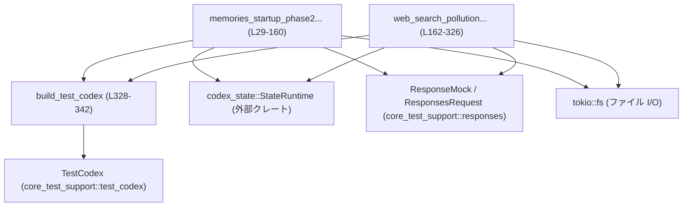
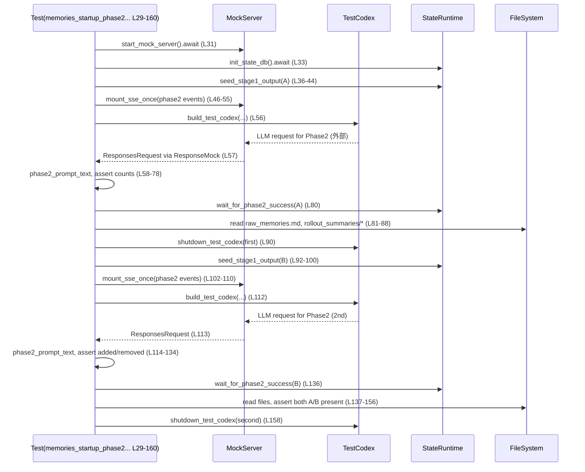
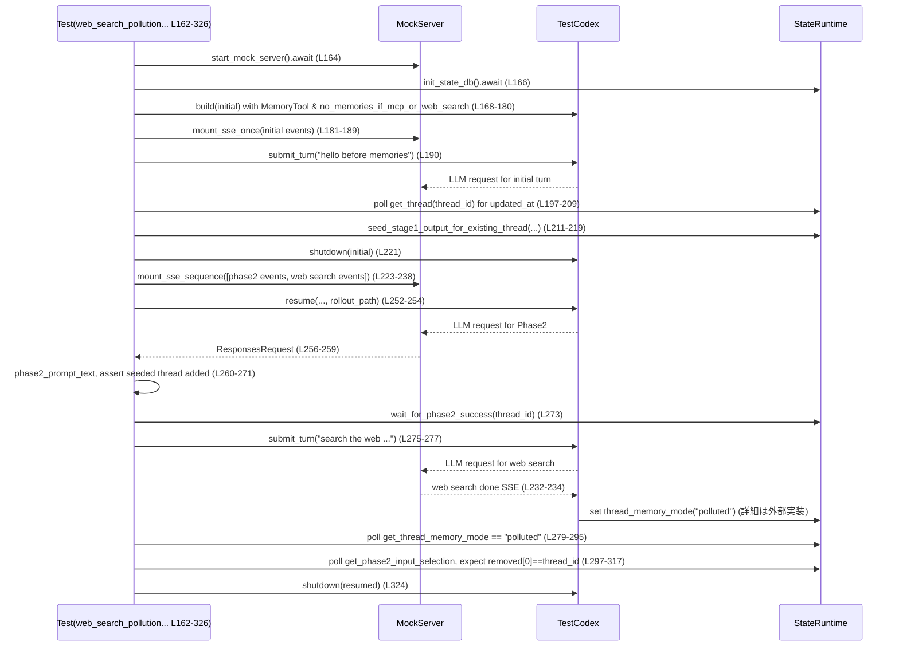

# core/tests/suite/memories.rs コード解説

## 0. ざっくり一言

Codex の「メモリ」機能（Phase 1/2 の入力選択とファイル出力）が、  
アプリ再起動や Web 検索による「汚染」後も期待どおりに動くことを、SSE モックとテスト用ランタイム `TestCodex` を使って **エンドツーエンドで検証するテスト群**です（`core/tests/suite/memories.rs:L29-488`）。

---

## 1. このモジュールの役割

### 1.1 概要

- このモジュールは **Codex のメモリ統合（Phase 2）まわりのふるまい**を検証するために存在し、以下をテストします。
  - Phase 2 の初回・再実行をまたいだときに、**新規追加されたスレッド／前回から外れたスレッドが正しくプロンプトに反映されること**（`memories_startup_phase2_tracks_added_and_removed_inputs_across_runs`, `L29-160`）。
  - Web 検索でスレッドのメモリモードが「polluted」になった場合に、**Phase 2 の対象から外れ「removed」側に移動すること**（`web_search_pollution_moves_selected_thread_into_removed_phase2_inputs`, `L162-326`）。
- そのために、テスト用の状態 DB (`codex_state::StateRuntime`) を初期化し、Stage 1 出力のシード、Phase 2 成功状態のポーリング、出力ファイルの読み取りなどの **ヘルパー関数群**を提供します（`L344-488`）。

### 1.2 アーキテクチャ内での位置づけ

このテストファイルは、本番コードの API を直接呼ぶのではなく、テスト用ラッパー `TestCodex` とモックサーバ `wiremock::MockServer` を介して **外部境界（LLM 呼び出し / SSE）を含めた一連のフロー**を検証しています。



- テスト関数は `init_state_db`・`seed_stage1_output` などのヘルパーを通じて **DB 状態を直接操作**します（`L344-383`）。
- `build_test_codex` / `resume` を通じて `TestCodex` を起動し、内部で Phase 2 ジョブや Web 検索が走ります（`L328-342`, `L168-180`, `L240-254`）。
- LLM への問い合わせは `core_test_support::responses` が提供する **SSE モック**を通じて観測し、プロンプト文字列の内容を検査します（`L46-58`, `L223-238`）。

### 1.3 設計上のポイント

- **非同期 & マルチスレッドテスト**
  - 両テストとも `#[tokio::test(flavor = "multi_thread", worker_threads = 2)]` で実行され、Tokio のマルチスレッドランタイム上で動作します（`L29`, `L162`）。
  - DB ポーリングや SSE リクエスト待ちには `async fn` と `tokio::time::sleep` を使った **非同期ループ＋タイムアウト**を採用しており、無限ループを避けています（`wait_for_request`, `L389-402`; `wait_for_phase2_success`, `L413-435`）。
- **状態 DB との明示的な契約**
  - `codex_state::StateRuntime` に対して、`get_phase2_input_selection` / `try_claim_stage1_job` / `mark_stage1_job_succeeded` などのメソッドを直接呼び出し、Phase 2 入力選択と Stage 1 のジョブ処理の契約をテストレベルで確認しています（`L420-421`, `L448-452`, `L459-466`）。
- **時間に依存するロジック**
  - スレッドの新旧は `Utc::now()` と `chrono::Duration` による「現在からの相対時刻」で表現され、Phase 2 選択ロジックが **更新時間順**に振る舞うことを前提としています（`L35-43`, `L92-99`）。
- **ファイルベースのメモリ出力検証**
  - メモリの内容は `memories/raw_memories.md` と `memories/rollout_summaries/*` のファイル内容として検証され、DB だけでなく **永続化されたファイルの整合性**も確認します（`L81-88`, `L137-156`, `L474-482`）。

---

## 2. 主要な機能一覧

このモジュールが提供する主な機能を箇条書きで示します。

- Phase 2 再実行時の選択差分の検証:  
  初回 Phase 2 実行と再実行とで、「新規追加」「削除済み」のスレッド数と ID がプロンプトに正しく表示されることを検証（`memories_startup_phase2_tracks_added_and_removed_inputs_across_runs`, `L29-160`）。
- Web 検索によるメモリ汚染の検証:  
  スレッドが `"polluted"` なメモリモードに遷移したとき、Phase 2 入力選択から外れ `removed` に入ることを検証（`web_search_pollution_moves_selected_thread_into_removed_phase2_inputs`, `L162-326`）。
- テスト用 DB の初期化:  
  テンポラリディレクトリ上に `codex_state::StateRuntime` を構築し、バックフィル完了マークを付ける（`init_state_db`, `L344-349`）。
- Stage 1 出力のシード:  
  新規／既存スレッドに対し Stage 1 ジョブを直接完了させ、Phase 2 の入力候補を DB に登録するヘルパー（`seed_stage1_output`, `L351-383`; `seed_stage1_output_for_existing_thread`, `L438-472`）。
- Phase 2 成功状態の待機:  
  `get_phase2_input_selection` をポーリングし、期待するスレッドだけが `selected` と `retained_thread_ids` に載るまで待つ（`wait_for_phase2_success`, `L413-435`）。
- SSE リクエスト待ちとプロンプト抽出:  
  LLM へのリクエストが所定回数送信されるまで待ち、ユーザープロンプトから Phase 2 用の説明テキストを抽出する（`wait_for_request`, `L389-402`; `phase2_prompt_text`, `L404-411`）。
- メモリ出力ファイルの読み取り:  
  `rollout_summaries` ディレクトリ以下の全サマリファイルを読み込み、テキスト内容で検証する（`read_rollout_summary_bodies`, `L474-482`）。
- テスト用 Codex のシャットダウン:  
  `Op::Shutdown` を送信し `EventMsg::ShutdownComplete` を待つことで、背景タスク完了と状態永続化を保証する（`shutdown_test_codex`, `L484-488`）。

---

## 3. 公開 API と詳細解説

このファイル自体はテストモジュールのため「公開 API」はありませんが、**他のテストからも再利用可能なヘルパー関数**がいくつか定義されています。

### 3.1 型一覧（構造体・列挙体など）

このファイル内で新たな型定義はありませんが、理解のために **主に登場する外部型**を整理します。

| 名前 | 種別 | 所属 | 役割 / 用途 | このファイル内の利用箇所 |
|------|------|------|-------------|---------------------------|
| `TestCodex` | 構造体 | `core_test_support::test_codex` | Codex 本体をテスト用に起動・操作するラッパー。メッセージ送信やシャットダウンを行う（利用方法からの推測）。 | `L19`, `L180`, `L252`, `L484-488` |
| `codex_state::StateRuntime` | 構造体 | `codex_state` クレート | スレッドメタデータや Phase 1/2 の状態を保持する非同期データベースランタイム。 | `L344-349`, `L351-383`, `L413-435`, `L438-472` |
| `ThreadId` | 構造体/新タイプ | `codex_protocol` | スレッド（会話）の一意識別子。新規スレッド生成や DB クエリに使用。 | `L5`, `L36`, `L92`, `L196-197`, `L438-447` |
| `ResponseMock` | 構造体 | `core_test_support::responses` | モック SSE サーバへのリクエスト記録と応答制御を行うテスト用型。 | `L9`, `L46-55`, `L181-189`, `L223-238`, `L385-402` |
| `ResponsesRequest` | 構造体 | `core_test_support::responses` | LLM への各リクエストの内容（メッセージ群など）を保持するテスト用型。 | `L10`, `L57-58`, `L113-114`, `L256-259`, `L385-387`, `L404-411` |
| `EventMsg` | enum | `codex_protocol::protocol` | Codex からのイベント（`ShutdownComplete` など）を表す。 | `L6`, `L484-488` |
| `Op` | enum | `codex_protocol::protocol` | Codex への操作（`Shutdown` など）を表す。 | `L7`, `L484-488` |

> 役割はこのファイル内での利用方法から読み取れる範囲で記述しています。

---

### 3.2 関数詳細（重要 7 件）

#### 3.2.1 `memories_startup_phase2_tracks_added_and_removed_inputs_across_runs() -> Result<()>`（L29-160）

**概要**

- Phase 2 のメモリ統合が **アプリの再起動をまたいだときに、選択されたスレッドの増減を正しくトラッキングできるか**を検証するエンドツーエンドテストです（`L29-160`）。
- 2 つのスレッド A/B の Stage 1 出力を用意し、Phase 2 を 2 回実行したときのプロンプトと生成ファイルを検査します。

**引数**

- なし（Tokio テスト関数としてフレームワーク側から呼ばれます）。

**戻り値**

- `Result<()>`（`anyhow::Result`）  
  テスト内で `?` を使ってエラーを伝播させるためのラッパーです（`L29`）。

**内部処理の流れ**

1. モックサーバと TempDir ベースのホームディレクトリ、状態 DB を初期化（`L31-34`）。
2. 現在時刻から 2 時間前の `updated_at` を持つスレッド A の Stage 1 出力を `seed_stage1_output` でシード（`L35-44`）。
3. Phase 2 用の SSE モックを 1 回分マウントし（`mount_sse_once`, `L46-55`）、`build_test_codex` で Codex を起動（`L56`）。
4. 最初の Phase 2 リクエストを `wait_for_single_request` で取得し、`phase2_prompt_text` でユーザープロンプトを抽出（`L57-58`）。
5. プロンプト中の統計値・一覧が期待どおりであることを `assert!` で確認（選択 1 件、新規追加 1 件、削除 0 件、A が `[added]` として表示、削除一覧は `- none`）（`L59-78`）。
6. `wait_for_phase2_success` で DB の Phase 2 入力選択が A で安定するまで待機（`L80`）。
7. `memories/raw_memories.md` に A の raw memory だけが含まれ、rollout サマリが 1 件かつ branch 情報が `branch-rollout-a` であることを検証（`L81-88`）。
8. Codex をシャットダウン（`shutdown_test_codex`, `L90`）。
9. 1 時間前の `updated_at` を持つスレッド B をシード（`L92-100`）。
10. 同様に Phase 2 を再実行し、プロンプトの統計値が「選択 1、新規追加 1、削除 1」となり、B が `[added]`、A が削除側に現れることを検証（`L102-134`）。
11. 再度 `wait_for_phase2_success` で B による成功状態を確認（`L136`）。
12. ファイル出力として raw memories に A/B 両方が含まれ、rollout サマリが 2 件（A/B 両方・各 branch 情報付き）であることを確認（`L137-156`）。
13. Codex をシャットダウンして終了（`L158-159`）。

**Examples（使用例）**

テストそのものが使用例ですが、ヘルパーの使い方として抜粋すると次のようになります。

```rust
// TempDir と状態 DB を初期化する（L31-34）
let home = Arc::new(TempDir::new()?);                  // 一時ディレクトリを共有するため Arc で包む
let db = init_state_db(&home).await?;                  // StateRuntime を初期化しバックフィル完了マークを付ける

// スレッド A の Stage 1 出力をシードする（L35-44）
let now = Utc::now();                                  // 現在時刻を取得
let thread_a = seed_stage1_output(
    db.as_ref(),                                       // &StateRuntime に変換（Arc から参照取得）
    home.path(),                                       // ホームディレクトリのパス
    now - ChronoDuration::hours(2),                    // 2 時間前
    "raw memory A",                                    // 生メモリ
    "rollout summary A",                               // ロールアウトサマリ
    "rollout-a",                                       // ロールアウト識別子
).await?;
```

**Errors / Panics**

- `?` により、I/O や DB 操作（`TempDir::new`, `init_state_db`, `seed_stage1_output`, `tokio::fs::read_to_string` など）がエラーを返した場合にテスト自体が失敗します（`L31-34`, `L35-44`, `L81-88`）。
- `assert!` / `assert_eq!` が条件を満たさない場合には panic し、テストが失敗します（`L59-78`, `L86`, `L140-156`）。
- `wait_for_phase2_success` 内でタイムアウトすると `assert!` が失敗し panic します（`L413-435` 経由）。

**Edge cases（エッジケース）**

- Phase 2 が 10 秒以内に完了しない場合、`wait_for_phase2_success` 内のタイムアウトによりテストが失敗します（`L417-435`）。
- メモリファイルが予期せず存在しない／フォーマットが異なる場合、`tokio::fs::read_to_string` でエラーとなり、`?` を通じてテストエラーになります（`L81-88`）。
- システムクロックが極端にずれている場合、`ChronoDuration` を用いた更新時刻の比較に影響し、どのスレッドが新しいかの判定に影響が出る可能性があります（`L35-43`, `L92-99`）。

**使用上の注意点**

- このテストは **本番の選択ロジックが「より新しいスレッドを優先する」こと**を前提にしています。ロジック変更時にはテスト結果も変わる可能性があるため、仕様とテストの整合を確認する必要があります。
- 非同期に Phase 2 が進むため、**ポーリング＋タイムアウト**というパターンを採用しており、CI 等で遅延が大きい環境ではタイムアウトを調整する必要が生じることがあります（`L80`, `L417-435`）。
- `TempDir` はスコープ終了時に削除されるため、テスト中に `home` のライフタイムを切らさないよう、`Arc<TempDir>` で共有しています（`L32`）。

---

#### 3.2.2 `web_search_pollution_moves_selected_thread_into_removed_phase2_inputs() -> Result<()>`（L162-326）

**概要**

- Web 検索によってスレッドのメモリモードが `"polluted"` に変わった場合に、そのスレッドが **Phase 2 の `selected` / `retained_thread_ids` から外れ、`removed` リストに入る**ことを検証するテストです（`L162-326`）。
- `no_memories_if_mcp_or_web_search = true` という設定が有効な状態での振る舞いを確認します（`L168-179`, `L240-251`）。

**引数**

- なし。

**戻り値**

- `Result<()>`（`anyhow::Result`）。

**内部処理の流れ**

1. モックサーバ・TempDir・状態 DB を初期化（`L164-166`）。
2. `test_codex().with_config` を用いて初期ビルダーを作成し、`Feature::Sqlite` と `Feature::MemoryTool` を有効化、`max_raw_memories_for_consolidation = 1` および `no_memories_if_mcp_or_web_search = true` を設定（`L168-179`）。
3. Codex を起動し、SSE モックを通じて最初のターン（メモリ確立前）を完了させる（`L180-190`）。
4. スレッド ID (`session_id`) と rollout パスを取得（`L191-197`）。
5. DB の `get_thread` をポーリングして、スレッドの `updated_at` を得る（`L197-209`）。
6. 既存スレッドに対して `seed_stage1_output_for_existing_thread` を呼び出し、Stage 1 出力をシード（`L211-219`）。
7. 初期 Codex をシャットダウン（`L221-221`）。
8. Phase 2 用と Web 検索用の 2 つの SSE シナリオを `mount_sse_sequence` で登録（`L223-238`）。
9. 同じホーム・rollout パスで Codex を `resume` し、最初の Phase 2 リクエストを待ってプロンプト内容を検査（選択 1、新規追加 1、対象スレッドの ID が `[added]`）（`L240-271`）。
10. `wait_for_phase2_success` で Phase 2 成功状態を確認（`L273`）。
11. 次のターンで "search the web for …" を送信し、DB の `get_thread_memory_mode` をポーリングして `"polluted"` になるまで待つ（`L275-295`）。
12. 再度 `get_phase2_input_selection` をポーリングし、`selected` と `retained_thread_ids` が空で `removed` に対象スレッドだけが含まれる状態になるまで待つ（`L297-317`）。
13. SSE モックに対するリクエストが 2 件であること、および `selection` が期待どおりであることを最終確認（`L318-322`）。
14. Codex をシャットダウン（`L324`）。

**Errors / Panics**

- DB クエリや I/O のエラーは `?` でテストエラーになります（`L166`, `L211-219`, `L280-283`, `L300-302`）。
- スレッドメタデータ／メモリモード／Phase 2 選択が 10 秒以内に期待値に達しない場合、ポーリングループ内の `assert!` が失敗して panic します（`L197-209`, `L279-295`, `L297-317`）。
- SSE シナリオが 2 回分消費されなかった場合、`assert_eq!(responses.requests().len(), 2)` が失敗します（`L318`）。

**Edge cases**

- Web 検索を行ってもメモリモードが `"polluted"` にならない場合、タイムアウトによりテストが失敗します（`L280-295`）。
- `no_memories_if_mcp_or_web_search` が `false` の設定に変更された場合、このテストで期待している振る舞い（removed に移動）が変わる可能性があります（`L177-178`, `L249-250`）。

**使用上の注意点**

- `mount_sse_sequence` で **順序付きの SSE シナリオ**を定義しているため、テスト内容を変更する際には「どのリクエストに対してどの SSE 応答が返るか」を崩さない必要があります（`L223-238`）。
- スレッドのメモリモード文字列 `"polluted"` はコード上の文字列リテラルで比較しているため、仕様変更で値が変わった場合にはテストも更新が必要です（`L282-295`）。
- 本テストは「ポリシーとして Web 検索が走ったスレッドはメモリから除外される」という振る舞いを前提としており、これが仕様として意図されたものかを確認の上で維持する必要があります。

---

#### 3.2.3 `seed_stage1_output`（L351-383）

```rust
async fn seed_stage1_output(
    db: &codex_state::StateRuntime,
    codex_home: &Path,
    updated_at: chrono::DateTime<Utc>,
    raw_memory: &str,
    rollout_summary: &str,
    rollout_slug: &str,
) -> Result<ThreadId>
```

**概要**

- **新しいスレッドを作成し、そのスレッドに対して Stage 1 出力をシードする**ヘルパーです（`L351-383`）。
- メタデータ（rollout ファイルパス、cwd、model_provider、git_branch）を構築し、DB に upsert したのち、`seed_stage1_output_for_existing_thread` を呼び出します。

**引数**

| 引数名 | 型 | 説明 |
|--------|----|------|
| `db` | `&codex_state::StateRuntime` | 状態 DB ランタイムへの参照（`L352`）。 |
| `codex_home` | `&Path` | Codex ホームディレクトリへのパス。rollout ファイルや workspace ディレクトリの基準（`L353`）。 |
| `updated_at` | `chrono::DateTime<Utc>` | スレッドの最終更新時刻。選択ロジックの新旧判定に利用されます（`L354`）。 |
| `raw_memory` | `&str` | Stage 1 によって抽出された生メモリテキスト（`L355`）。 |
| `rollout_summary` | `&str` | rollout のサマリテキスト（`L356`）。 |
| `rollout_slug` | `&str` | rollout に紐づくスラグ。workspace ディレクトリ名や git ブランチに含まれます（`L357`）。 |

**戻り値**

- `Result<ThreadId>`  
  新しく作成されたスレッド ID を返します（`L359-383`）。

**内部処理の流れ**

1. `ThreadId::new()` で新規スレッド ID を生成（`L359`）。
2. `ThreadMetadataBuilder::new` に rollout ファイルパス・更新時刻・セッションソース（CLI）を渡してメタデータビルダーを作成（`L360-365`）。
3. `cwd`・`model_provider`・`git_branch` を手動で設定（`L366-368`）。
4. `build("test-provider")` でメタデータを完成させ、`upsert_thread` により DB に保存（`L369-370`）。
5. `seed_stage1_output_for_existing_thread` を呼び出して Stage 1 出力を登録（`L372-379`）。
6. スレッド ID を返す（`L382`）。

**Errors / Panics**

- DB 操作（`upsert_thread`、`seed_stage1_output_for_existing_thread` 内の操作）がエラーの場合、`?` でエラーを伝播します（`L370`, `L373-380`）。

**Edge cases**

- `rollout_slug` にファイル名として不正な文字が含まれている場合、workspace パスや git ブランチ文字列の生成で問題になる可能性があります（`L366-368`）。
- `updated_at` が極端に未来／過去である場合、選択ロジックに対して予期しない影響を与える可能性があります（`L354`）。

**使用上の注意点**

- 既存スレッドに対して Stage 1 出力を追加したい場合は、`seed_stage1_output_for_existing_thread` を直接使う方が自然です（`L438-472`）。
- `SessionSource::Cli` 固定でメタデータを作成しているため、他のセッション種別での挙動を確認したい場合はメタデータ生成部分を調整する必要があります（`L364`）。

---

#### 3.2.4 `seed_stage1_output_for_existing_thread`（L438-472）

```rust
async fn seed_stage1_output_for_existing_thread(
    db: &codex_state::StateRuntime,
    thread_id: ThreadId,
    updated_at: i64,
    raw_memory: &str,
    rollout_summary: &str,
    rollout_slug: Option<&str>,
) -> Result<()>
```

**概要**

- 既に DB に存在するスレッドに対して、**Stage 1 ジョブをクレームし、成功としてマークして Stage 1 出力を登録する**ヘルパーです（`L438-472`）。
- Stage 1 ジョブキューの契約（クレーム → 成功）をテストから手動で再現しています。

**引数**

| 引数名 | 型 | 説明 |
|--------|----|------|
| `db` | `&codex_state::StateRuntime` | 状態 DB。Stage 1 ジョブのクレーム・完了に使用（`L439`）。 |
| `thread_id` | `ThreadId` | 対象スレッド ID（`L440`）。 |
| `updated_at` | `i64` | 更新時刻（UNIX タイムスタンプ）。`try_claim_stage1_job`・`mark_stage1_job_succeeded` に渡されます（`L441`）。 |
| `raw_memory` | `&str` | Stage 1 の生メモリテキスト（`L442`）。 |
| `rollout_summary` | `&str` | rollout サマリテキスト（`L443`）。 |
| `rollout_slug` | `Option<&str>` | rollout スラグ（任意）。DB 側でサマリ記録に利用されると考えられます（`L444`）。 |

**戻り値**

- `Result<()>`  
  すべての操作が成功すれば `Ok(())`、途中でエラーがあれば `Err` を返します（`L471-471`）。

**内部処理の流れ**

1. 新たなオーナー ID として `ThreadId::new()` を生成（`L446`）。
2. `try_claim_stage1_job` を呼び出し、指定スレッドの Stage 1 ジョブをクレーム（`L447-452`）。
3. 戻り値が `Stage1JobClaimOutcome::Claimed { ownership_token }` でなければ panic（`L453-456`）。
4. `mark_stage1_job_succeeded` に thread_id, ownership_token, updated_at, raw_memory, rollout_summary, rollout_slug を渡して Stage 1 成功を記録（`L458-466`）。
5. 戻り値が `true` であること（グローバル統合ジョブがキューに入ったこと）を `assert!` で確認（`L458-469`）。

**Errors / Panics**

- `try_claim_stage1_job`・`mark_stage1_job_succeeded` が `Err` を返すとそのまま伝播します（`L447-452`, `L458-466`）。
- `try_claim_stage1_job` の結果が `Claimed` 以外の場合、`panic!("unexpected stage-1 claim outcome: {other:?}")` により即座に panic します（`L453-456`）。
- `mark_stage1_job_succeeded` が `false` を返した場合、`assert!` で panic します（`L458-469`）。

**Edge cases**

- 同一スレッドに対して他のプロセスが同時に Stage 1 ジョブをクレームするような状況では、この関数が `Claimed` 以外を受け取り panic する可能性があります。テスト環境では単一プロセス前提です（`L447-456`）。
- `updated_at` と既存メタデータの更新時刻が不整合な場合の挙動は、このチャンクだけからは分かりません。

**使用上の注意点**

- 本関数は **テスト専用**であり、panic を許容しています。実運用コードで同様の処理を行う場合は、`Stage1JobClaimOutcome` の他ケース（例: 既に処理中など）を明示的に扱う必要があります。
- `max_running_jobs` を 64 に固定しているため、異なる同時実行制限をテストしたい場合は引数化が必要です（`L449-450`）。

---

#### 3.2.5 `wait_for_phase2_success`（L413-435）

```rust
async fn wait_for_phase2_success(
    db: &codex_state::StateRuntime,
    expected_thread_id: ThreadId,
) -> Result<()>
```

**概要**

- Phase 2 入力選択が **特定のスレッド 1 件に安定し、removed が空になる状態**になるまで DB をポーリングするヘルパーです（`L413-435`）。

**引数**

| 引数名 | 型 | 説明 |
|--------|----|------|
| `db` | `&codex_state::StateRuntime` | 状態 DB。`get_phase2_input_selection` を呼び出します（`L414`）。 |
| `expected_thread_id` | `ThreadId` | 期待される選択スレッド ID（`L415`）。 |

**戻り値**

- `Result<()>`  
  期待状態になれば `Ok(())`、DB 操作エラーは `Err` として返されます（`L416-427`）。

**内部処理の流れ**

1. `deadline = Instant::now() + Duration::from_secs(10)` で 10 秒のタイムアウトを設定（`L417`）。
2. ループ内で `get_phase2_input_selection(1, 30)` を呼び、結果を `selection` として取得（`L419-421`）。
3. `selection.selected.len() == 1`・`selected[0].thread_id == expected_thread_id`・`retained_thread_ids == vec![expected_thread_id]`・`removed.is_empty()` のすべてを満たせば `Ok(())` を返す（`L422-427`）。
4. 条件を満たさない場合、`Instant::now() < deadline` を確認し、過ぎていれば `assert!` で panic、そうでなければ 50ms スリープして再試行（`L430-435`）。

**Errors / Panics**

- `get_phase2_input_selection` が `Err` を返すと、そのまま `?` で伝播します（`L420-421`）。
- 10 秒以内に条件を満たさない場合、`assert!` によって panic します（`L430-433`）。

**Edge cases**

- `max_unused_days` を 30 固定で呼び出しており、この値に応じてどのスレッドが対象になるかが変わります（`L421`）。ここでは具体的なロジックはこのチャンクからは不明です。
- `selected` に複数スレッドが含まれる仕様の場合、このヘルパーは決して成功しません。

**使用上の注意点**

- 非同期ポーリングを行っているため、**CPU を占有しないよう `tokio::time::sleep` で待機している**点が Rust の非同期安全性の観点で重要です（`L434`）。
- テスト環境外で流用する場合、タイムアウトやポーリング間隔は環境に応じて調整が必要です。

---

#### 3.2.6 `wait_for_request`（L389-402）

```rust
async fn wait_for_request(mock: &ResponseMock, expected_count: usize) -> Vec<ResponsesRequest>
```

**概要**

- モック SSE サーバ `ResponseMock` に記録されたリクエスト数が **`expected_count` 以上になるまで非同期に待機する**ヘルパーです（`L389-402`）。
- Phase 2 や Web 検索の LLM 呼び出しが正しく行われたかをテストで確認するために使われます。

**引数**

| 引数名 | 型 | 説明 |
|--------|----|------|
| `mock` | `&ResponseMock` | SSE モック。`requests()` で記録済みリクエストを取得（`L389-392`）。 |
| `expected_count` | `usize` | 待機するリクエスト数の下限（`L389`）。 |

**戻り値**

- `Vec<ResponsesRequest>`  
  `mock.requests()` の結果をそのまま返します（`L393-395`）。

**内部処理の流れ**

1. 10 秒のタイムアウトを `Instant` で設定（`L390`）。
2. ループ内で `mock.requests()` を取得し、`requests.len() >= expected_count` なら `requests` を返す（`L391-395`）。
3. 条件を満たさない場合、`Instant::now() < deadline` を確認し、過ぎていれば `assert!` で panic（`L396-399`）。
4. そうでなければ 50ms スリープして再試行（`L400`）。

**Errors / Panics**

- `ResponseMock::requests()` は `Result` を返さないので、Rust 的なエラーは発生しません（`L392`）。
- 10 秒以内に `expected_count` に達しない場合、`assert!` により panic します（`L396-399`）。

**Edge cases**

- `expected_count = 0` を渡した場合、最初の呼び出しで即座に `requests()` の結果を返します。
- リクエスト数が増加している途中に `requests()` を何度も呼び出す形になるため、`ResponseMock` の実装がスレッドセーフであることが前提となります（実装はこのチャンクには現れません）。

**使用上の注意点**

- テストでは `wait_for_single_request`（`expected_count = 1` のラッパー）経由で使うパターンが多くなっています（`L385-387`）。
- 非同期コンテキストでのみ使用可能です。同期テストから呼ぶ場合は `tokio::test` などでラップする必要があります。

---

#### 3.2.7 `read_rollout_summary_bodies`（L474-482）

```rust
async fn read_rollout_summary_bodies(memory_root: &Path) -> Result<Vec<String>>
```

**概要**

- `memory_root/rollout_summaries` ディレクトリ内の **すべてのファイル本体を読み込み、文字列ベクタとして返す**関数です（`L474-482`）。
- Phase 2 の結果として生成される rollout サマリの内容をテストで検証するために使われます。

**引数**

| 引数名 | 型 | 説明 |
|--------|----|------|
| `memory_root` | `&Path` | `memories` ディレクトリへのパス。ここから `rollout_summaries` サブディレクトリを検索します（`L474-475`）。 |

**戻り値**

- `Result<Vec<String>>`  
  各ファイルの内容を文字列として格納したベクタを返します。`summaries.sort()` によりファイル名順でソート済みです（`L476-481`）。

**内部処理の流れ**

1. `tokio::fs::read_dir(memory_root.join("rollout_summaries"))` で非同期ディレクトリ読み取りを開始（`L475`）。
2. ループで `next_entry().await?` を呼び出し、各ディレクトリエントリに対して `tokio::fs::read_to_string(entry.path()).await?` でファイル内容を読み取って `summaries` に追加（`L477-479`）。
3. 読み終わったら `summaries.sort()` でソートし、返す（`L480-481`）。

**Errors / Panics**

- ディレクトリが存在しない場合やファイル読み取りに失敗した場合、`?` により `Err` を返します（`L475-479`）。
- panic を起こす要素はありません。

**Edge cases**

- ディレクトリ内にファイルが 1 つもない場合、空の `Vec<String>` を返します。
- 大量のファイルが存在する場合、読み取り時間が長くなりますが、非同期 I/O であるためイベントループをブロックしません。

**使用上の注意点**

- 非同期関数のため、呼び出し側は `await` する必要があります。
- ファイル数に比例した I/O が発生するため、パフォーマンスが問題になる場合は、より効率的な検査方法（例えば件数とサマリの一部のみ確認するなど）を検討できます。

---

### 3.3 その他の関数

| 関数名 | 役割（1 行） | 定義位置 |
|--------|--------------|----------|
| `build_test_codex` | `TestCodex` を指定ホームと設定で構築するヘルパー。`Feature::Sqlite` / `Feature::MemoryTool` を有効化し、`max_raw_memories_for_consolidation` を 1 に設定（`L328-342`）。 | `core/tests/suite/memories.rs:L328-342` |
| `init_state_db` | 与えられたホームディレクトリ上に `StateRuntime` を初期化し、`mark_backfill_complete(None)` を呼んでバックフィル完了状態にする（`L344-349`）。 | `L344-349` |
| `wait_for_single_request` | `wait_for_request(mock, 1)` の薄いラッパーで、最初のリクエストのみを返す（`L385-387`）。 | `L385-387` |
| `phase2_prompt_text` | `ResponsesRequest` からユーザーメッセージのうち `"Current selected Phase 1 inputs:"` を含むテキストを抽出する（`L404-411`）。 | `L404-411` |
| `shutdown_test_codex` | Codex に `Op::Shutdown{}` を送信し、`EventMsg::ShutdownComplete` を受け取るまで待つことで安全にシャットダウンする（`L484-488`）。 | `L484-488` |

---

## 4. データフロー

ここでは、代表的な 2 つのテストシナリオのデータフローを説明します。

### 4.1 Phase 2 再起動シナリオ（memories_startup_phase2... L29-160）

このシナリオでは、スレッド A/B の Stage 1 出力を用意し、Phase 2 を 2 回実行してプロンプトとファイルを検証します。



- **重要なポイント**: Phase 2 選択の結果は DB 内の `get_phase2_input_selection` と、ファイル出力 `memories/*` の両方に反映されることを、このシーケンスを通じて確認しています。

### 4.2 Web 検索汚染シナリオ（web_search_pollution... L162-326）



- このフローにより、「Phase 2 で一度選ばれたスレッドが、その後の Web 検索により removed に移される」というライフサイクルをテストしています。

---

## 5. 使い方（How to Use）

### 5.1 基本的な使用方法（ヘルパーを使った新規テストの流れ）

新しいメモリ関連テストを書く場合の基本的な流れは、既存テストと同様に次のステップになります。

1. TempDir と状態 DB を初期化（`init_state_db`, `L344-349`）。
2. `seed_stage1_output`／`seed_stage1_output_for_existing_thread` で Stage 1 出力を準備。
3. `mount_sse_once` / `mount_sse_sequence` で SSE 応答を定義。
4. `build_test_codex` または `resume` で Codex を起動。
5. `wait_for_request` と `phase2_prompt_text` で LLM プロンプトを検査。
6. `wait_for_phase2_success` やファイル読み取りで状態を確認。
7. `shutdown_test_codex` で安全に終了。

簡略コード例は次のとおりです。

```rust
// 1. TempDir と DB を準備する
let home = Arc::new(TempDir::new()?);                     // 一時ディレクトリ（L32）
let db = init_state_db(&home).await?;                     // StateRuntime を初期化（L344-349）

// 2. スレッドの Stage 1 出力をシードする
let thread_id = seed_stage1_output(
    db.as_ref(),                                          // Arc から &StateRuntime を取得
    home.path(),                                          // ホームディレクトリパス
    Utc::now(),                                           // 現在時刻
    "example raw memory",                                 // 生メモリ
    "example rollout summary",                            // rollout サマリ
    "example-rollout",                                    // rollout スラグ
).await?;                                                 // 新しい ThreadId を受け取る

// 3. SSE をモックし Codex を起動する
let server = start_mock_server().await;                   // モック HTTP サーバ
let sse_mock = mount_sse_once(
    &server,
    sse(vec![ev_response_created("resp-1"),
             ev_assistant_message("msg-1", "ok"),
             ev_completed("resp-1")]),
).await;                                                  // 1 回分の SSE 応答を登録（L46-55）

let codex = build_test_codex(&server, home.clone()).await?; // TestCodex を起動（L328-342）

// 4. リクエストを待ってプロンプトを検査する
let request = wait_for_single_request(&sse_mock).await;   // L385-387
let prompt = phase2_prompt_text(&request);                // L404-411
assert!(prompt.contains("Current selected Phase 1 inputs:"));
```

### 5.2 よくある使用パターン

- **再起動を跨いだテスト**  
  - 一度 Codex を起動して Phase 2 を完了 → `shutdown_test_codex` → さらに Stage 1 出力を追加 → 再度 `build_test_codex`／`resume` して差分を検証する（`L90`, `L158`, `L221`, `L324`）。
- **状態 DB だけを直接操作するテスト**  
  - `seed_stage1_output_for_existing_thread` と `get_phase2_input_selection` を組み合わせ、Codex を起動せずに DB のロジックのみを検証することも可能です（DB API はこのチャンクには現れませんが、利用方法は `L438-472`, `L420-421` から読み取れます）。

### 5.3 よくある間違い

```rust
// 間違い例: Codex をシャットダウンせずに TempDir を再利用しようとする
let codex = build_test_codex(&server, home.clone()).await?;
// ここで直接新しい TestCodex を起動するなどすると、バックグラウンドタスクが残る可能性がある

// 正しい例: 必ずシャットダウンを挟む（L90, L158, L221, L324）
shutdown_test_codex(&codex).await?;
let codex2 = build_test_codex(&server, home.clone()).await?;
```

- `wait_for_request` / `wait_for_phase2_success` を使わずに即座に状態を検査すると、**非同期処理がまだ完了しておらずテストが不安定になる**可能性があります。

### 5.4 使用上の注意点（まとめ）

- **並行性・ランタイム**
  - すべてのヘルパー関数は `async fn` であり、`tokio::test` などの非同期コンテキストから呼ぶ必要があります（`L29`, `L162`, `L328`, `L344` など）。
  - マルチスレッドランタイムを使っているため、DB やモックの実装がスレッドセーフであることが前提です。
- **タイムアウトと安定性**
  - 各種 `wait_*` 関数は 10 秒のタイムアウトを持ちます。CI 環境が遅い場合は、この値を要調整です（`L390`, `L417`, `L197`, `L280`, `L298`）。
- **バグ・セキュリティに関する観点**
  - このファイルはテスト専用で、外部入力を直接受け取らず、ローカルファイルとモックサーバのみを扱うため、一般的なセキュリティリスクは低いと考えられます。
  - 時刻依存のテストのため、システム時計が大きくずれていると、選択結果が変わる可能性があります（`L35-43`, `L92-99`, `L197-209`）。

---

## 6. 変更の仕方（How to Modify）

### 6.1 新しい機能を追加する場合（新規テストの追加）

1. **用途の整理**
   - 追加したい仕様（例: Phase 2 の `max_unused_days` の影響、別種の汚染モードなど）を決める。
2. **Stage 1 / DB 状態の準備**
   - 既存の `seed_stage1_output` / `seed_stage1_output_for_existing_thread` を使って、必要なスレッド・メモリ状態を用意する（`L351-383`, `L438-472`）。
3. **SSE モックの設計**
   - `mount_sse_once` または `mount_sse_sequence` を使い、Codex からの LLM 呼び出しにどう応答するかシナリオを定義する（例は `L46-55`, `L181-189`, `L223-238`）。
4. **Codex の起動・操作**
   - `build_test_codex` / `resume` を用いてテスト環境を起動し、`submit_turn` などでトリガーとなる操作を行う（`L56`, `L168-180`, `L240-254`）。
5. **検証ポイントの実装**
   - `wait_for_request`・`phase2_prompt_text`・`wait_for_phase2_success` などのヘルパーを使って、期待する状態が達成されるまで待ち、`assert!` で検証する（`L57-80`, `L256-273`）。
6. **終了処理**
   - `shutdown_test_codex` を呼び、Codex とバックグラウンドタスクを安全に終了させる（`L90`, `L158`, `L221`, `L324`, `L484-488`）。

### 6.2 既存の機能を変更する場合

- **影響範囲の確認**
  - DB インターフェースのシグネチャ変更（`get_phase2_input_selection`, `try_claim_stage1_job` など）を行う場合は、本ファイル内の該当箇所（`L420-421`, `L448-452`, `L458-466`）をすべて検索し、引数や戻り値の扱いを更新する必要があります。
- **契約の維持**
  - `wait_for_phase2_success` は「selected 1 件・retained_thread_ids 1 件・removed 空」という状態を契約として前提にしています（`L422-425`）。仕様変更でこの契約が変わる場合は、テストの期待値を明示的に書き換える必要があります。
- **タイムアウト値の調整**
  - 処理時間が伸びるような変更を行った場合、`Duration::from_secs(10)` を定義している箇所（`L390`, `L417`, `L197`, `L280`, `L298`）を確認し、必要であれば緩和します。
- **テストの安定性**
  - ループ内の条件に分岐追加やログ追加を行う際は、非同期ループがブロッキングにならないよう、必ず `tokio::time::sleep` などの待機を維持することが重要です（`L400`, `L434`, `L207-208`, `L290-291`, `L315-316`）。

---

## 7. 関連ファイル

このモジュールと密接に関係すると思われるクレート／モジュールを列挙します（実際のファイルパスはこのチャンクには現れません）。

| パス / モジュール | 役割 / 関係 |
|-------------------|------------|
| `core_test_support::test_codex` | `TestCodex` と `test_codex()` を提供し、Codex 本体をテストモードで起動するラッパーを定義していると考えられます（利用箇所: `L19`, `L168-180`, `L240-254`, `L484-488`）。 |
| `core_test_support::responses` | SSE モック (`ResponseMock`, `ResponsesRequest`, `mount_sse_once`, `mount_sse_sequence`, `sse`, `ev_*`) を提供し、LLM 通信のテストを行うためのインフラを提供します（`L9-18`, `L46-55`, `L181-189`, `L223-238`）。 |
| `codex_state` | `StateRuntime`, `ThreadMetadataBuilder`, `Stage1JobClaimOutcome` など、メモリとジョブ管理の永続層を提供します（`L344-349`, `L360-370`, `L447-456`, `L458-466`）。 |
| `codex_protocol` | `ThreadId`, `EventMsg`, `Op`, `SessionSource` など、Codex 間で共有されるプロトコル型を定義します（`L5-8`, `L360-365`, `L484-488`）。 |
| `core/tests/suite/…`（他のテストファイル） | 本ファイルと同様に、Codex の別機能（対話など）をエンドツーエンドでテストしている可能性がありますが、このチャンクからは詳細不明です。 |

このファイルは、**メモリ統合と Web 検索汚染に関するふるまい**を検証するテストスイートとして、状態 DB・ファイル出力・LLM プロンプトという複数のレイヤの一致を確認する役割を担っています。
