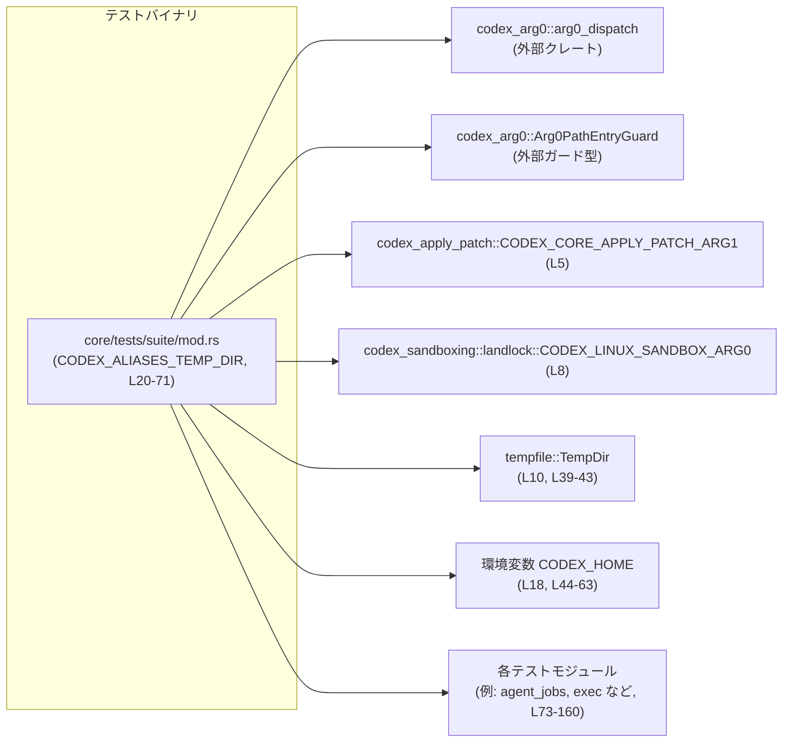
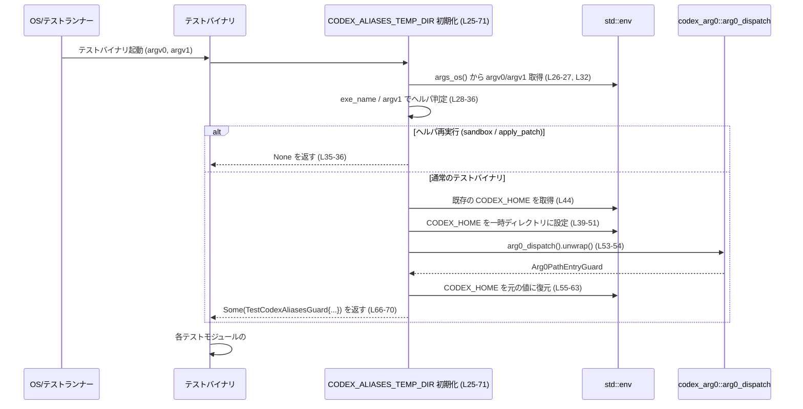

# core/tests/suite/mod.rs コード解説

## 0. ざっくり一言

`core/tests/suite/mod.rs` は、**コアの統合テストをまとめるエントリポイント**であり、テストバイナリ起動時に `codex` 実行ファイルのエイリアス環境を整える初期化処理を提供するモジュールです（core/tests/suite/mod.rs:L1-1, L20-71）。

---

## 1. このモジュールの役割

### 1.1 概要

このモジュールは次の 2 点を担っています。

- テストバイナリ起動直後に、`CODEX_HOME` 環境変数と `arg0_dispatch` を使って **`codex` 用のヘルパ実行ファイルへのエイリアスを一時ディレクトリに構築**する（core/tests/suite/mod.rs:L20-71）。
- 多数の統合テストファイル（例: `agent_jobs`, `exec`, `tools` など）を `mod` として集約し、**単一のテストバイナリで一括実行できるようにする**（core/tests/suite/mod.rs:L73-160）。

### 1.2 アーキテクチャ内での位置づけ

このモジュールを中心とした依存関係は概ね次のようになります。



- テストバイナリ起動時に `CODEX_ALIASES_TEMP_DIR` の初期化ブロックが走り、`codex_arg0::arg0_dispatch` などを呼び出します（core/tests/suite/mod.rs:L25-71）。
- その後に通常の `#[test]` 群が、`mod agent_jobs;` などで読み込まれたサブモジュール内で実行されます（core/tests/suite/mod.rs:L73-160）。

### 1.3 設計上のポイント

コードから読み取れる設計上の特徴は以下のとおりです。

- **RAII（スコープ終端で自動クリーンアップ）によるリソース管理**  
  `TestCodexAliasesGuard` に `TempDir` と `Arg0PathEntryGuard` を保持し、プロセス終了時に一時ディレクトリとリンクを自動でクリーンアップする構造になっています（core/tests/suite/mod.rs:L12-16, L66-70）。
- **プロセス全体の環境変数を一時的に変更**  
  `CODEX_HOME` をテスト専用の一時ディレクトリに切り替え、`arg0_dispatch` 実行後に元の値を即座に戻すことで、本来のユーザ環境 (`~/.codex`) を汚さないようにしています（core/tests/suite/mod.rs:L44-63）。
- **並行性に配慮した unsafe ブロックの利用**  
  環境変数操作自体は安全な API ですが、「テスト開始前でスレッドが存在しない」という前提をコメントで明示し、`unsafe` ブロック内にまとめています（core/tests/suite/mod.rs:L48-51, L58-63）。
- **再実行ヘルパー検出による条件分岐**  
  再実行されたヘルパ（`codex-linux-sandbox` や `apply_patch` ヘルパ）では、`CODEX_HOME` の一時ディレクトリ作成をスキップするための条件分岐を行っています（core/tests/suite/mod.rs:L33-36）。
- **OS 依存テストの切り分け**  
  一部のテストモジュールは `#[cfg(not(target_os = "windows"))]` でガードされており、Windows 以外でのみコンパイル・実行されます（core/tests/suite/mod.rs:L73, L79, L95, L122-125）。

---

## 2. 主要な機能一覧

このモジュールが提供する主要な機能を列挙します。

- **CODEX_HOME のテスト用一時ディレクトリ設定**  
  テスト開始前に `CODEX_HOME` を一時ディレクトリに切り替え、`arg0_dispatch` によるヘルパリンク作成が開発者の本物の `~/.codex` を汚さないようにします（core/tests/suite/mod.rs:L39-51, L45-47）。
- **arg0 ベースのヘルパ実行ファイルエイリアス設定**  
  `codex_arg0::arg0_dispatch` を呼び出し、`arg0`（実行ファイル名）に応じて `apply_patch` や `codex-linux-sandbox` などへのリンクを `CODEX_HOME/tmp` 配下に作成します（core/tests/suite/mod.rs:L53-54, コメント L45-46）。
- **再実行ヘルパ（sandbox / apply_patch）時の初期化スキップ**  
  `exe_name` や `argv1` を見て、ヘルパプロセス内では一時ディレクトリ作成や `arg0_dispatch` の再実行をスキップし、`None` を返します（core/tests/suite/mod.rs:L26-36）。
- **統合テストモジュールの集約**  
  `abort_tasks`, `agent_jobs`, `exec`, `tools` など多数のテストモジュールを `mod` としてインポートし、1 つのテストバイナリに統合します（core/tests/suite/mod.rs:L73-160）。

---

## 3. 公開 API と詳細解説

### 3.1 型一覧（構造体・定数・静的変数）

#### 型・定数・静的変数

| 名前 | 種別 | 役割 / 用途 | 定義箇所 |
|------|------|-------------|----------|
| `TestCodexAliasesGuard` | 構造体 | 一時 `CODEX_HOME` ディレクトリ (`TempDir`) と `arg0` エイリアス用のガード (`Arg0PathEntryGuard`)、および元の `CODEX_HOME` の値を保持する RAII ガードです。プロセス終了時にヘルパリンクと一時ディレクトリをクリーンアップする目的とみなせます。 | core/tests/suite/mod.rs:L12-16 |
| `CODEX_HOME_ENV_VAR` | `const &str` | 使用する環境変数名 `"CODEX_HOME"` を表します。`set_var` / `var_os` などの呼び出しで共通利用されます。 | core/tests/suite/mod.rs:L18 |
| `CODEX_ALIASES_TEMP_DIR` | `pub static Option<TestCodexAliasesGuard>` | テストプロセス起動時に初期化される静的変数で、`Some(TestCodexAliasesGuard)` であればエイリアス環境を保持し、`None` であればヘルパ再実行などにより初期化をスキップしたことを示します。`#[ctor]` によりテスト実行前に初期化ブロックが実行されます。 | core/tests/suite/mod.rs:L24-71 |

#### テストサブモジュール（概要）

各 `mod` 行は、同名の `core/tests/suite/<name>.rs` などにある統合テストコードを取り込みます。このファイルからは **中身は分からない** ため、役割は名前から推測される範囲にとどめます。

- 非 Windows のみ有効: `abort_tasks`, `approvals`, `hooks`, `request_permissions`, `request_permissions_tool`（core/tests/suite/mod.rs:L73, L79, L95, L122-125）
- 常に有効（抜粋）: `agent_jobs`, `agent_websocket`, `apply_patch_cli`, `cli_stream`, `client`, `exec`, `tools`, `web_search`, `window_headers` など多数（core/tests/suite/mod.rs:L75-160）

> それぞれのテストモジュールの具体的な内容は、このチャンクには現れません。

### 3.2 重要な「処理ブロック」の詳細

このファイルには名前付き関数は定義されていませんが、`CODEX_ALIASES_TEMP_DIR` の初期化ブロックが実質的に「メイン処理」に相当します。そのため、これを関数に準じて解説します。

#### `CODEX_ALIASES_TEMP_DIR` 初期化ブロック (L25-71)

```rust
#[ctor]
pub static CODEX_ALIASES_TEMP_DIR: Option<TestCodexAliasesGuard> = {
    /* ... 省略 ... */
};
```

**概要**

- テストプロセス起動時（`main` や `#[test]` より前）に実行され、  
  - 再実行ヘルパ（sandbox / apply_patch）であれば **何もしないで `None` を返す**（core/tests/suite/mod.rs:L33-36）。
  - それ以外であれば、**一時 `CODEX_HOME` を作成し `arg0_dispatch()` を実行した上で `Some(TestCodexAliasesGuard)` を返す**（core/tests/suite/mod.rs:L39-70）。

**引数**

- なし（静的初期化ブロックなので、外部引数は取りません）。

**戻り値**

- 型: `Option<TestCodexAliasesGuard>`（core/tests/suite/mod.rs:L25）
  - `None`: sandbox ヘルパや `apply_patch` ヘルパ本体など、再実行されたプロセスであることを表し、一時 `CODEX_HOME` 等を設定しません（core/tests/suite/mod.rs:L33-36）。
  - `Some(TestCodexAliasesGuard)`:  
    テストバイナリとして起動された場合に、一時ディレクトリと `arg0` エイリアス構成を保持します（core/tests/suite/mod.rs:L39-70）。

**内部処理の流れ（アルゴリズム）**

1. **引数の取得と実行ファイル名の抽出**  
   - `std::env::args_os()` から `argv0` と `argv1` を取得し（core/tests/suite/mod.rs:L26-27, L32）、`Path::new(&argv0).file_name().and_then(|name| name.to_str()).unwrap_or("")` で実行ファイル名（`exe_name`）を `&str` で取り出します（core/tests/suite/mod.rs:L28-31）。
2. **再実行ヘルパの検出**  
   - コメントにあるとおり、ヘルパの再実行プロセスでもこの ctor が走ります（core/tests/suite/mod.rs:L33-34）。
   - `exe_name == CODEX_LINUX_SANDBOX_ARG0 || argv1 == CODEX_CORE_APPLY_PATCH_ARG1` の場合、`return None;` で早期リターンします（core/tests/suite/mod.rs:L35-36）。
3. **一時 CODEX_HOME ディレクトリの作成**  
   - `tempfile::Builder::new().prefix("codex-core-tests").tempdir().unwrap()` で一時ディレクトリを作成し（core/tests/suite/mod.rs:L39-43）、`codex_home` に保持します。
   - 同時に、現在の `CODEX_HOME` の値を `std::env::var_os(CODEX_HOME_ENV_VAR)` で取得し、`previous_codex_home` に保存します（core/tests/suite/mod.rs:L44）。
4. **環境変数 CODEX_HOME の一時設定**  
   - コメントで「Safety: #[ctor] runs before tests start, so no test threads exist yet.」と説明した上で（core/tests/suite/mod.rs:L48）、`unsafe` ブロック内で `std::env::set_var(CODEX_HOME_ENV_VAR, codex_home.path());` を呼び、プロセス全体の `CODEX_HOME` を一時ディレクトリに変更します（core/tests/suite/mod.rs:L49-51）。
5. **arg0_dispatch の実行**  
   - `arg0_dispatch().unwrap()` を呼び出し、一時 `CODEX_HOME/tmp` 以下にヘルパリンクを作成します（core/tests/suite/mod.rs:L53-54）。
   - 返り値の `Arg0PathEntryGuard` を `arg0` に保持します。
6. **元の CODEX_HOME の復元**  
   - 直後に `previous_codex_home` の有無に応じて  
     - `Some(value)` の場合は `set_var` で元の値を戻し（core/tests/suite/mod.rs:L57-60）  
     - `None` の場合は `remove_var` で環境変数を削除します（core/tests/suite/mod.rs:L61-63）。
7. **ガードの構築と返却**  
   - 最後に `TestCodexAliasesGuard` を構築し（core/tests/suite/mod.rs:L66-70）、`Some(...)` を返して初期化を完了します。

**Examples（使用例）**

通常、この静的変数は「参照しなくても」プロセス起動時に初期化されます。そのため、テストコード側で明示的に呼び出す必要はありませんが、状態を確認したいユーティリティ関数を追加する場合は次のように扱えます（同一モジュール内の想定例）。

```rust
// CODEX_ALIASES_TEMP_DIR が初期化されているかを確認するヘルパ
fn is_codex_aliases_enabled() -> bool {
    // 静的変数は即座に参照可能です（core/tests/suite/mod.rs:L25-71 に定義）
    CODEX_ALIASES_TEMP_DIR.is_some()
}
```

> このように、`CODEX_ALIASES_TEMP_DIR` は「テスト起動時の環境を整える」ための副作用が主目的であり、通常のテストでは値を直接触る必要はありません。

**Errors / Panics**

このブロック内でエラーやパニックが起こり得る箇所は以下です。

- `tempfile::Builder::new().prefix(...).tempdir().unwrap()`（core/tests/suite/mod.rs:L39-43）  
  - 一時ディレクトリの作成に失敗した場合（ディスクフル、パーミッションエラーなど）、`unwrap()` により **パニック** します。
- `arg0_dispatch().unwrap()`（core/tests/suite/mod.rs:L53-54）  
  - `arg0_dispatch()` が `Result::Err` を返した場合、同様に **パニック** します。
- それ以外の `unwrap_or_default` / `unwrap_or` は、`Option` に対するデフォルト値供給であり、パニック要因ではありません（core/tests/suite/mod.rs:L27, L31, L32）。

これらのパニックは **テストプロセス起動直後に発生する** ため、問題があればすべてのテストが実行される前に即座に失敗します。

**Edge cases（エッジケース）**

- **ヘルパ再実行プロセス**  
  - `exe_name == CODEX_LINUX_SANDBOX_ARG0` または `argv1 == CODEX_CORE_APPLY_PATCH_ARG1` の場合、`None` を返し、一時 `CODEX_HOME` やヘルパリンクを作成しません（core/tests/suite/mod.rs:L35-36）。
  - これにより、sandbox 内や `apply_patch` ヘルパ自身が再帰的に同じ初期化を行うことを防いでいます。
- **コマンドライン引数が足りない場合**  
  - `args.next().unwrap_or_default()` を使っているため、引数が 1 つもない場合でも空の `OsString` が使われ、パニックにはなりません（core/tests/suite/mod.rs:L26-27, L32）。
  - `exe_name` はその場合 `""` になるため、上記のヘルパ判定には一致しません（core/tests/suite/mod.rs:L28-31）。
- **`CODEX_HOME` が元々未設定の場合**  
  - `previous_codex_home` は `None` になり、初期化後に `std::env::remove_var(CODEX_HOME_ENV_VAR)` が呼ばれます（core/tests/suite/mod.rs:L44, L61-63）。
  - つまり、テスト終了後の環境は「起動前と同じ状態」に戻されます。
- **ARM 環境**  
  - コメントに「NOTE: this doesn't work on ARM」とありますが（core/tests/suite/mod.rs:L23）、具体的な失敗内容や回避策はこのファイルからは読み取れません。

**使用上の注意点**

- **スレッドセーフティ**  
  - 環境変数操作はプロセス全体に影響するため、多数のスレッドから同時に操作すると「どの値が見えるか」が不定になります。  
    このコードでは `#[ctor]` により「テスト開始前＝スレッド未生成」の段階でのみ `set_var` / `remove_var` を実行することで、その問題を避ける方針になっています（core/tests/suite/mod.rs:L48-51, L58-63）。
- **`CODEX_HOME` に依存するテストの前提**  
  - `arg0_dispatch` 実行後には `CODEX_HOME` は元の値に戻されるため（core/tests/suite/mod.rs:L55-63）、  
    テストコードが「`CODEX_HOME` が一時ディレクトリのままである」ことを前提にしていると期待と異なる動作になります。
- **一時ディレクトリのライフタイム**  
  - 一時ディレクトリは `TestCodexAliasesGuard` に所有されており（core/tests/suite/mod.rs:L12-16, L66-70）、プロセス終了まで存続します。テスト実行中はディレクトリが削除されない前提で利用できます。
- **パニック時の影響範囲**  
  - 起動時のパニック (`tempdir().unwrap()` や `arg0_dispatch().unwrap()`) はテスト全体を停止させます。  
    これは「環境構築に失敗したら一括でテストを止める」という動作と解釈できます。

### 3.3 その他の関数

- このファイルには名前付きの通常関数は定義されていません。

---

## 4. データフロー

ここでは、「テストバイナリが起動して、`CODEX_ALIASES_TEMP_DIR` が初期化される」までの典型的な流れを示します。

### 4.1 処理の要点

- OS／テストランナーがテストバイナリを起動すると、`#[ctor]` によって `CODEX_ALIASES_TEMP_DIR` 初期化ブロックが **テスト関数より先に**実行されます（core/tests/suite/mod.rs:L20-25）。
- 初期化ブロックは `argv0`, `argv1` を検査し、ヘルパ再実行かどうかを判定します（core/tests/suite/mod.rs:L26-36）。
- 通常のテストバイナリ起動の場合、一時 `CODEX_HOME` を設定して `arg0_dispatch()` を呼び、ヘルパリンクを作成してから環境変数を元に戻します（core/tests/suite/mod.rs:L39-63）。
- その後、`mod agent_jobs;` などで取り込まれた各テストモジュール内のテストが実行されます（core/tests/suite/mod.rs:L73-160）。

### 4.2 シーケンス図



---

## 5. 使い方（How to Use）

### 5.1 基本的な使用方法

このモジュールは **テストバイナリの起動時に自動的に利用**されるため、一般的なテストコードから直接呼び出す必要はありません。

新しい統合テストを追加する場合の典型的な流れは次のとおりです。

1. `core/tests/suite/` に新しいテストファイル（例: `new_feature.rs`）を追加する。
2. `core/tests/suite/mod.rs` に `mod new_feature;` を追記する（core/tests/suite/mod.rs:L73-160 のパターンに倣う）。
3. `new_feature.rs` 内で通常どおり `#[test]` を書く。  
   この時点で、`CODEX_ALIASES_TEMP_DIR` により `arg0` エイリアス環境が既に構成されているものとみなせます。

```rust
// core/tests/suite/new_feature.rs（想定例）
#[test]
fn end_to_end_for_new_feature() {
    // CODEX_ALIASES_TEMP_DIR による初期化がすでに終わっている前提で、
    // codex コマンドの挙動を検証するテストを書くことができます。
    // 実際の呼び出し方法はこのチャンクには現れません。
}
```

### 5.2 よくある使用パターン

このファイル単体から読み取れる範囲で想定されるパターンは次のとおりです。

- **CLI 振る舞いを検証する統合テスト**  
  `arg0_dispatch` により `argv0` に応じたヘルパ実行ファイルが `CODEX_HOME/tmp` 配下に作成されるため、テストでは「テストバイナリを特定の `argv0` で再実行して、`codex`, `codex-linux-sandbox`, `apply_patch` などの挙動を確認する」という形が想定されます（core/tests/suite/mod.rs:L45-46）。
- **sandbox 下での動作検証**  
  `CODEX_LINUX_SANDBOX_ARG0` の値に基づいて sandbox 内ヘルパを判定しているため（core/tests/suite/mod.rs:L8, L33-36）、sandbox 再実行時には余分な一時ディレクトリ作成を行わず、すでに構成された環境を使う前提でテストが書かれていると考えられます。

※ 具体的なテストケースの書き方は、各モジュール（`agent_jobs` など）のコードがこのチャンクには含まれていないため不明です。

### 5.3 よくある間違い（起こり得る誤用）

コードから推測できる、発生しやすそうな誤用例とその正しい扱いです。

```rust
// 誤りの可能性があるイメージ:
// CODEX_HOME がテスト中も一時ディレクトリのままだと決めつけている
fn assumes_temp_codex_home_is_global() {
    let home = std::env::var("CODEX_HOME").unwrap();
    // ここで home がテスト専用ディレクトリであることを前提にするのは危険
    // （core/tests/suite/mod.rs:L55-63 で元の値に戻されるため）
}
```

```rust
// より安全な例:
// CODEX_HOME は起動前の値に復元される前提で振る舞いを考える
fn uses_codex_home_carefully() {
    let home = std::env::var("CODEX_HOME").ok();
    // home がユーザの ~/.codex である可能性も考慮し、
    // テスト専用ディレクトリでなければ書き込みを避ける、などの配慮が必要です。
}
```

### 5.4 使用上の注意点（まとめ）

- `CODEX_HOME` の値は、`arg0_dispatch` 実行中だけ一時ディレクトリに切り替わり、その後 **必ず元に戻されます**（core/tests/suite/mod.rs:L44-63）。  
  テストコードは「`CODEX_HOME` が一時ディレクトリのまま」だと仮定しない方が安全です。
- 環境変数操作はプロセス全体に影響するため、**テスト起動後に独自に `CODEX_HOME` を変更するテスト**を書くと、他のテストに影響を与える可能性があります。
- `CODEX_ALIASES_TEMP_DIR` の初期化は `#[ctor]` によって自動的に行われるため、**手動で初期化しようとするコード（例えば状態をリセットする関数）を追加すると、二重初期化や期待しない再設定**に繋がる可能性があります。

---

## 6. 変更の仕方（How to Modify）

### 6.1 新しい機能を追加する場合

このモジュールに新たなテスト周辺機能を追加する場合の入口は以下です。

1. **新種のヘルパ実行ファイルを導入する場合**  
   - 新しいヘルパの `argv0` または `argv1` で再実行されるプロセスでは `CODEX_ALIASES_TEMP_DIR` の初期化をスキップしたい場合、  
     `if exe_name == ... || argv1 == ... { return None; }` の条件（core/tests/suite/mod.rs:L35-36）に対応する定数を追加して判定を拡張するのが自然です。
2. **追加のテストモジュールを集約したい場合**  
   - `core/tests/suite/<name>.rs` を作成し、`mod <name>;` をこのファイル末尾付近に追加します（core/tests/suite/mod.rs:L73-160）。
3. **追加の環境設定が必要な場合**  
   - `CODEX_HOME` と同様に「テスト中だけ一時的に変更する」環境変数がある場合、  
     - 既存パターン（値を保存 → 一時変更 → すぐに復元）に倣い、  
     - `TestCodexAliasesGuard` にフィールドを追加して状態を保持する  
     といった拡張が考えられます（構造体は core/tests/suite/mod.rs:L12-16 に定義）。

### 6.2 既存の機能を変更する場合

- **`CODEX_HOME` の扱いを変更する場合**  
  - `previous_codex_home` の保存と復元のロジック（core/tests/suite/mod.rs:L44, L55-63）が、`arg0_dispatch` 以外の箇所からも影響を受けるようになります。  
    変更時には「テスト中に期待される `CODEX_HOME` の値」と「開発者の実環境」の両方を再確認する必要があります。
- **`arg0_dispatch` の呼び出し方法を変更する場合**  
  - `arg0_dispatch()` のエラーが `unwrap()` でパニックになっている前提（core/tests/suite/mod.rs:L53-54）を変えると、  
    エラー時の挙動（全テスト停止 vs 一部スキップなど）が変わります。  
    エラーを呼び出し元に返す設計に変える場合は、テストフレームワーク側での扱いを含めて見直しが必要です。
- **OS/アーキテクチャ依存の制約**  
  - コメントにある ARM の制約（core/tests/suite/mod.rs:L23）を考慮し、ARM サポートを改善したい場合は、  
    - `CODEX_LINUX_SANDBOX_ARG0` や `arg0_dispatch` の ARM 上での挙動  
    - および `tempfile::TempDir` の挙動  
    を含めて検証する必要があります。この情報はこのチャンクには含まれていません。

---

## 7. 関連ファイル

このモジュールが参照しているサブモジュールおよび外部クレートとの関係をまとめます。

### 7.1 サブモジュール（テストコード）

| パス（推定） | 役割 / 関係 |
|-------------|------------|
| `core/tests/suite/abort_tasks.rs` | 非 Windows 環境向けの統合テストモジュール（`#[cfg(not(target_os = "windows"))]`、core/tests/suite/mod.rs:L73-74）。中身はこのチャンクには現れません。 |
| `core/tests/suite/agent_jobs.rs` | エージェントジョブ関連と思われる統合テスト（core/tests/suite/mod.rs:L75）。内容は不明。 |
| `core/tests/suite/agent_websocket.rs` | WebSocket 経由のエージェント関連テストと推測されます（core/tests/suite/mod.rs:L76）。内容は不明。 |
| `core/tests/suite/agents_md.rs` | エージェントの Markdown 表現に関するテストと推測（core/tests/suite/mod.rs:L77）。内容は不明。 |
| `core/tests/suite/apply_patch_cli.rs` | `apply_patch` CLI 統合テストと推測（core/tests/suite/mod.rs:L78）。内容は不明。 |
| `core/tests/suite/approvals.rs` | 非 Windows 環境での承認フローに関するテストと推測（core/tests/suite/mod.rs:L79-80）。内容は不明。 |
| `core/tests/suite/cli_stream.rs` 〜 `core/tests/suite/window_headers.rs` | CLI ストリーム、クライアント、実行、ツール、Web 検索、ヘッダなど、さまざまな機能の統合テストモジュールです（core/tests/suite/mod.rs:L81-160）。個々の詳細はこのチャンクには現れません。 |

> モジュール名からある程度用途は推測できますが、**実際のテスト内容や仕様は、このファイルからは分かりません**。

### 7.2 外部クレート・型

| パス | 役割 / 関係 |
|------|------------|
| `codex_apply_patch::CODEX_CORE_APPLY_PATCH_ARG1` | `argv1` が `apply_patch` ヘルパ再実行であるかどうかを判定するための定数です（core/tests/suite/mod.rs:L5, L35-36）。 |
| `codex_arg0::Arg0PathEntryGuard` | `arg0_dispatch()` によって作成されるヘルパリンクのライフタイムを管理するガード型です（core/tests/suite/mod.rs:L6, L14, L54, L66-69）。詳細はこのチャンクには現れませんが、Drop 時にリンクをクリーンアップする役割と推測されます。 |
| `codex_arg0::arg0_dispatch` | `CODEX_HOME/tmp` 配下にヘルパリンクを作成し、`Arg0PathEntryGuard` を返す関数です（core/tests/suite/mod.rs:L7, L45-46, L53-54）。実装はこのチャンクには現れません。 |
| `codex_sandboxing::landlock::CODEX_LINUX_SANDBOX_ARG0` | sandbox ヘルパプロセスを識別するための `argv0` 文字列定数です（core/tests/suite/mod.rs:L8, L35）。 |
| `tempfile::TempDir` | 一時ディレクトリを作成・自動削除するための型で、`TestCodexAliasesGuard` 内で保持されます（core/tests/suite/mod.rs:L10, L12-13, L39-43, L66-67）。 |
| `ctor::ctor` | `#[ctor]` 属性を提供し、`CODEX_ALIASES_TEMP_DIR` 初期化ブロックをテスト開始前に実行させるために使用されています（core/tests/suite/mod.rs:L9, L24-25）。 |

---

以上が、`core/tests/suite/mod.rs` に基づいて読み取れる構造とデータフロー、および安全性・エラーハンドリング・並行性に関する解説です。
