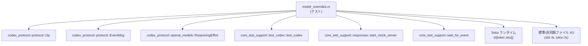
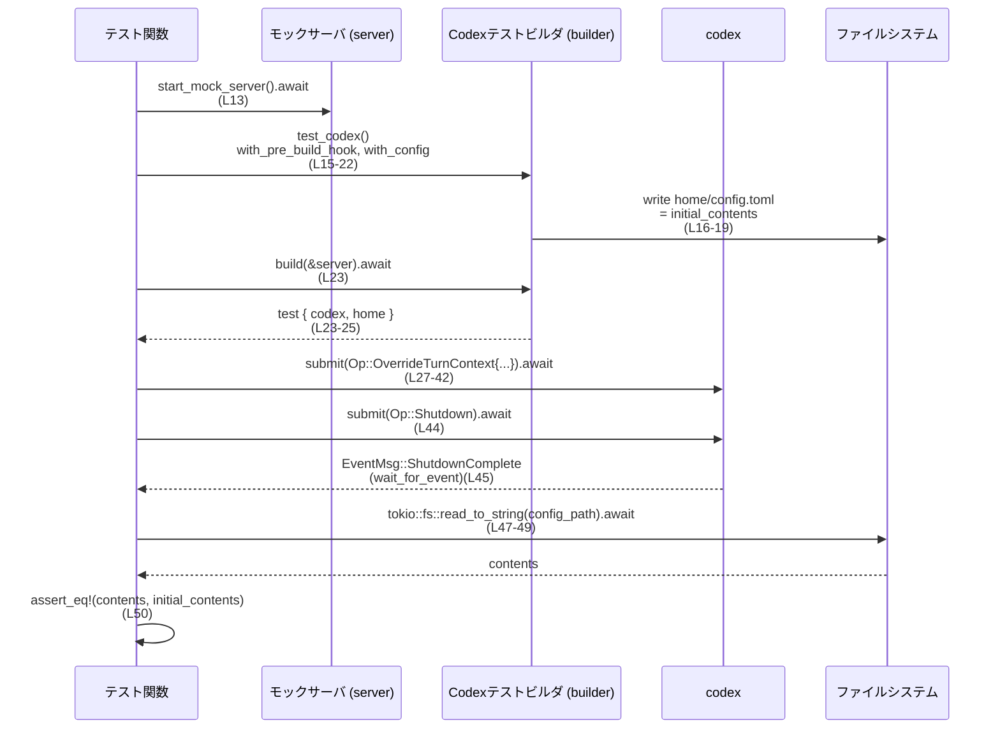

# core/tests/suite/model_overrides.rs コード解説

## 0. ざっくり一言

Codex の `OverrideTurnContext` オペレーションが、グローバル設定ファイル `config.toml` を **書き換えない／新規作成しない** ことを検証する、Tokio ベースの非同期統合テストを定義したファイルです（`core/tests/suite/model_overrides.rs:L11-51`, `L53-89`）。

---

## 1. このモジュールの役割

### 1.1 概要

このテストモジュールは次の問題を検証します。

> 「対話の 1 ターンのみのコンテキスト上書き (`OverrideTurnContext`) を行ったとき、グローバル設定ファイル `config.toml` が永続的に変更されてはならない。」

具体的には、以下 2 点を確認します。

- 既存の `config.toml` がある場合でも、`OverrideTurnContext` 実行後も内容が一切変化しないこと（`L11-51`）。
- `config.toml` が存在しない状態で `OverrideTurnContext` を実行しても、新しい `config.toml` ファイルが作成されないこと（`L53-89`）。

### 1.2 アーキテクチャ内での位置づけ

このファイルは「テストコード」であり、本体ロジックではなく **Codex の公開 API の振る舞い契約** を検証しています。

主な依存関係は以下の通りです。

- Codex プロトコル
  - `Op::OverrideTurnContext`, `Op::Shutdown`（`L3`, `L28-40`, `L44`, `L66-78`, `L82`）
  - `EventMsg::ShutdownComplete`（`L2`, `L45`, `L83`）
  - `ReasoningEffort::{High, Medium}`（`L1`, `L35`, `L73`）
- テスト用ヘルパ
  - `start_mock_server`（モックサーバ起動、`L4`, `L13`, `L55`）
  - `test_codex`（Codex テスト環境ビルダ、`L5`, `L15`, `L56`）
  - `wait_for_event`（イベント待ち合わせ、`L6`, `L45`, `L83`）
- 非同期ランタイム・I/O
  - `#[tokio::test(flavor = "multi_thread", worker_threads = 2)]` によるマルチスレッド Tokio ランタイム（`L11`, `L53`）
  - `std::fs::write` による同期ファイル書き込み（`L18`）
  - `tokio::fs::read_to_string` による非同期ファイル読み込み（`L47-49`）

依存関係の概略図です。



### 1.3 設計上のポイント

コードから読み取れる設計上の特徴は次の通りです。

- **責務の分割**
  - Codex 本体のロジックには触れず、`Op` と `EventMsg` を使って **ブラックボックス的に振る舞いのみを検証** しています（`L27-45`, `L65-83`）。
  - テスト環境構築（モックサーバ、Codex インスタンス、ホームディレクトリ）は `core_test_support` 側に委譲しています（`L13`, `L15`, `L23`, `L55-58`）。

- **状態管理**
  - 設定ファイル `config.toml` は `CONFIG_TOML` 定数により名前を固定し（`L9`）、`test.home.path()` 以下に作成・参照します（`L17`, `L25`, `L59`）。
  - `OverrideTurnContext` 実行前後で **ファイルシステム上の状態**（存在有無・内容）を比較することで、永続化有無を検証します。

- **エラーハンドリングの方針**
  - すべての I/O・非同期処理の失敗は `expect` / `assert!` / `assert_eq!` により **テストの即時失敗（panic）** として扱います（`L18`, `L23`, `L41-42`, `L44`, `L47-49`, `L60-63`, `L79-80`, `L82`, `L85-88`）。
  - 本番コードでのリカバリではなく、「期待通り動かなければテストを落とす」という単純な方針です。

- **並行性**
  - 各テストは `#[tokio::test(flavor = "multi_thread", worker_threads = 2)]` により **マルチスレッド Tokio ランタイム** 上で動作します（`L11`, `L53`）。
  - テスト本体は逐次的に `await` を行いますが、内部で生成される Codex タスクやイベント処理は複数スレッドで並行実行される前提です。

---

## 2. 主要な機能一覧（コンポーネントインベントリー）

このファイルで定義・使用される主な要素と役割です。

| 種別 | 名前 | 役割 / 用途 | 定義/利用位置 |
|------|------|-------------|----------------|
| 定数 | `CONFIG_TOML` | 設定ファイル名 `"config.toml"` を表す定数。ホームディレクトリとの結合に利用。 | 定義: `core/tests/suite/model_overrides.rs:L9` |
| テスト関数 | `override_turn_context_does_not_persist_when_config_exists` | 既存の `config.toml` がある状態で `OverrideTurnContext` を実行しても内容が変更されないことを検証。 | 定義: `L11-51` |
| テスト関数 | `override_turn_context_does_not_create_config_file` | `config.toml` が存在しない状態で `OverrideTurnContext` を実行してもファイルが新規作成されないことを検証。 | 定義: `L53-89` |
| 外部型 | `Op` | Codex に送る操作を表すプロトコル型。このファイルでは `OverrideTurnContext` と `Shutdown` バリアントのみ使用。 | 利用: `L3`, `L28-40`, `L44`, `L66-78`, `L82` |
| 外部型 | `EventMsg` | Codex から送られるイベントメッセージ。ここでは `ShutdownComplete` の発生を待つために使用。 | 利用: `L2`, `L45`, `L83` |
| 外部型 | `ReasoningEffort` | 推論の「努力度」を表す列挙体と思われる型。このファイルでは `High` と `Medium` を指定していることのみ分かる。 | 利用: `L1`, `L35`, `L73` |
| 外部関数 | `start_mock_server` | Codex テスト用のモックサーバを非同期に起動。 | 利用: `L4`, `L13`, `L55` |
| 外部関数 | `test_codex` | Codex テスト環境を構築するためのビルダを返す関数。 | 利用: `L5`, `L15`, `L56` |
| 外部関数 | `wait_for_event` | 指定した述語に一致する `EventMsg` が来るまで待機する非同期関数。 | 利用: `L6`, `L45`, `L83` |

※ `Op`, `EventMsg`, `ReasoningEffort` の詳細な定義はこのチャンクには現れないため、ここでは名前と利用されているバリアント名のみを根拠として記載しています。

---

## 3. 公開 API と詳細解説

このファイルはテストモジュールであり、ライブラリとしての公開 API は定義していません。ただし、テストの観点から **「テストのエントリポイント」となる関数** と、その中で呼び出される外部 API の使い方を整理します。

### 3.1 型一覧（構造体・列挙体など）

このファイル内に新たな構造体・列挙体は定義されていません。

テストから利用している外部型の概要（このチャンクから分かる範囲）は以下の通りです。

| 名前 | 種別 | このチャンクから分かる役割 | 根拠 |
|------|------|---------------------------|------|
| `Op` | 列挙体と思われる | 操作種別を表す型。`OverrideTurnContext { ... }` と `Shutdown` という 2 種類のバリアントが存在する（`L28-40`, `L44`, `L66-78`, `L82`）。 | `core/tests/suite/model_overrides.rs:L3`, `L28-40`, `L44`, `L66-78`, `L82` |
| `EventMsg` | 列挙体と思われる | イベント種別を表す型。`ShutdownComplete` バリアントが存在する（`L45`, `L83`）。 | `core/tests/suite/model_overrides.rs:L2`, `L45`, `L83` |
| `ReasoningEffort` | 列挙体と思われる | 推論の強度または「努力度」を指定する型。`High` と `Medium` バリアントがある。 | `core/tests/suite/model_overrides.rs:L1`, `L35`, `L73` |

※ 型のフィールド構成や他のバリアントは、このチャンクには現れないため不明です。

### 3.2 関数詳細

#### `override_turn_context_does_not_persist_when_config_exists() -> ()`

**概要**

既存の `config.toml` がある環境で Codex を起動し、`Op::OverrideTurnContext` を 1 回送った後にシャットダウンします。その後 `config.toml` の内容を読み出し、**初期内容と完全一致していること** を検証します（`L11-51`）。

**引数**

- なし（Tokio テスト関数として `#[tokio::test]` によりテストランナーから直接呼ばれます）。

**戻り値**

- `()`（暗黙のユニット）。関数内の `expect` / `assert_eq!` が失敗した場合は panic し、テストが失敗します。

**内部処理の流れ（アルゴリズム）**

1. **モックサーバ起動**  
   `start_mock_server().await` で Codex が接続するためのモックサーバを起動し、そのハンドルを `server` に保持します（`L13`）。

2. **初期設定内容の定義**  
   `initial_contents` として `model = "gpt-4o"\n` を定義します（`L14`）。

3. **テスト用 Codex ビルダの構築**  
   - `test_codex()` でビルダを生成（`L15`）。
   - `with_pre_build_hook(move |home| { ... })` を設定し、ビルド前フックで `home.join(CONFIG_TOML)` に対して `std::fs::write` で `initial_contents` を書き込み、初期の `config.toml` を生成します（`L16-19`）。
   - `with_config(|config| { config.model = Some("gpt-4o".to_string()); })` で、メモリ上の設定も同じモデル名を指すように調整します（`L20-22`）。

4. **Codex テスト環境のビルド**  
   `builder.build(&server).await.expect("create conversation")` で Codex テスト環境を構築し、`test` に格納します（`L23`）。`test` から `codex` と `home`（ホームディレクトリ）へのアクセスを得ます（`L24-25`）。

5. **OverrideTurnContext の送信**  
   `codex.submit(Op::OverrideTurnContext { ... }).await.expect("submit override");` を呼び出し（`L27-42`）、以下の内容で 1 回のターンコンテキスト上書きを指示します。
   - `model: Some("o3".to_string())`（`L34`）
   - `effort: Some(Some(ReasoningEffort::High))`（二重の `Option` でラップされていることが分かる、`L35`）
   - その他のフィールドはすべて `None`（`L29-33`, `L36-39`）

6. **シャットダウンと完了待ち**  
   - `codex.submit(Op::Shutdown).await.expect("request shutdown");` でシャットダウンを要求（`L44`）。
   - `wait_for_event(&codex, |ev| matches!(ev, EventMsg::ShutdownComplete)).await;` で `ShutdownComplete` イベントが来るまで待機し、内部処理の完了を保証します（`L45`）。

7. **設定ファイルの読み取りと検証**  
   - `tokio::fs::read_to_string(&config_path).await.expect("read config.toml after override");` で `config.toml` の内容を非同期に読み出します（`L47-49`）。
   - `assert_eq!(contents, initial_contents);` で初期内容と完全一致することを検証します（`L50`）。

**Examples（使用例）**

このテスト関数自身が、Codex に対して `OverrideTurnContext` を使う最小限の例になっています。テスト外で同様のパターンを用いる場合の概要は以下の通りです。

```rust
// モックサーバや Codex インスタンスの準備はテストヘルパに依存します。
// このコードは core/tests/suite/model_overrides.rs:L27-45 を簡略化したものです。

// ターンごとの一時的なコンテキスト変更を指示する
codex
    .submit(Op::OverrideTurnContext {
        cwd: None,
        approval_policy: None,
        approvals_reviewer: None,
        sandbox_policy: None,
        windows_sandbox_level: None,
        model: Some("o3".to_string()),                 // 一時的に使用するモデルを指定
        effort: Some(Some(ReasoningEffort::High)),     // 推論の努力度を指定
        summary: None,
        service_tier: None,
        collaboration_mode: None,
        personality: None,
    })
    .await
    .expect("submit override");

// シャットダウンと完了イベント待ち
codex.submit(Op::Shutdown).await.expect("request shutdown");
wait_for_event(&codex, |ev| matches!(ev, EventMsg::ShutdownComplete)).await;
```

**Errors / Panics**

- `start_mock_server().await` が失敗した場合の挙動はこのチャンクからは不明ですが、返り値を `expect` していないため、そのまま `Result` ではなく「サーバハンドル」を返していると推測されます（これは推測であり、定義はこのチャンクにはありません）。
- 以下の箇所は `Result` に対して `expect` を呼び出しているため、エラー時には panic します。
  - `std::fs::write(config_path, initial_contents).expect("seed config.toml");`（`L18`）
  - `builder.build(&server).await.expect("create conversation");`（`L23`）
  - `codex.submit(...).await.expect("submit override");`（`L41-42`）
  - `codex.submit(Op::Shutdown).await.expect("request shutdown");`（`L44`）
  - `tokio::fs::read_to_string(&config_path).await.expect("read config.toml after override");`（`L47-49`）

**Edge cases（エッジケース）**

- **設定ファイルが書き込めない場合**  
  権限などの問題で `std::fs::write` が失敗すると `expect("seed config.toml")` で panic し、テスト全体が失敗します（`L18`）。
- **Codex ビルドや `submit` が失敗した場合**  
  何らかの理由で `builder.build` や `submit` が `Err` を返すと即座に panic します（`L23`, `L41-42`, `L44`）。
- **設定ファイルが削除されている場合**  
  `tokio::fs::read_to_string` が `config_path` 読み取りに失敗した場合も `expect` により panic します（`L47-49`）。

**使用上の注意点**

- **非同期コンテキストが前提**  
  関数は `#[tokio::test(flavor = "multi_thread")]` で実行されるため、`await` を含む処理は Tokia ランタイム上でのみ動作します（`L11`）。
- **シャットダウン完了を待ってからファイルを読む**  
  `wait_for_event` で `ShutdownComplete` を待った後に `config.toml` を読むようになっており（`L45-49`）、この順序がファイル内容の確定に必要である前提でテストが書かれています。
- **テストホームディレクトリの外には書き込まない**  
  `config.toml` は `home.join(CONFIG_TOML)` として、テスト用ホームディレクトリ配下にのみ作成されます（`L17`, `L25`）。

---

#### `override_turn_context_does_not_create_config_file() -> ()`

**概要**

`config.toml` が存在しない状態から Codex テスト環境を起動し、`Op::OverrideTurnContext` を 1 回送った後にシャットダウンします。その後、`config.toml` が **存在しないまま** であることを検証します（`L53-89`）。

**引数**

- なし（Tokio テスト関数としてテストランナーから直接呼ばれます）。

**戻り値**

- `()`（ユニット）。`assert!` / `expect` 失敗時は panic します。

**内部処理の流れ（アルゴリズム）**

1. **モックサーバ起動**  
   `start_mock_server().await` でモックサーバを起動し、`server` に保持します（`L55`）。

2. **テスト用 Codex ビルダの構築とビルド**  
   - `test_codex()` でビルダを作成（`L56`）。
   - 追加の `with_pre_build_hook` や `with_config` は設定せず、そのまま `builder.build(&server).await.expect("create conversation")` で Codex テスト環境を構築します（`L57`）。

3. **設定ファイルパスと初期状態の確認**  
   - `config_path = test.home.path().join(CONFIG_TOML)` で `config.toml` のパスを決定（`L59`）。
   - `assert!(!config_path.exists(), "test setup should start without config");` で、テスト開始時点でファイルが存在しないことを確認します（`L60-63`）。

4. **OverrideTurnContext の送信**  
   `codex.submit(Op::OverrideTurnContext { ... }).await.expect("submit override");` を呼び出し（`L65-80`）、以下の内容で一時的なコンテキスト変更を指示します。
   - `model: Some("o3".to_string())`（`L72`）
   - `effort: Some(Some(ReasoningEffort::Medium))`（`L73`）
   - 他のフィールドは `None`（`L67-71`, `L74-77`）

5. **シャットダウンと完了待ち**  
   `codex.submit(Op::Shutdown).await.expect("request shutdown");`（`L82`）、続けて `wait_for_event(... ShutdownComplete ...)` でシャットダウン完了を待機します（`L83`）。

6. **設定ファイルの非存在確認**  
   `assert!(!config_path.exists(), "override should not create config.toml");` で、`config.toml` が新規作成されていないことを確認します（`L85-88`）。

**Examples（使用例）**

このテストは、「設定ファイルがない場合に `OverrideTurnContext` がどのように振る舞うか」の標準パターンを示しています。テスト環境構築の部分を除いた簡略イメージは次のようになります。

```rust
// 初期状態: config.toml は存在しない
assert!(
    !config_path.exists(),
    "test setup should start without config"
);

// 一時的なコンテキスト上書き
codex
    .submit(Op::OverrideTurnContext {
        cwd: None,
        approval_policy: None,
        approvals_reviewer: None,
        sandbox_policy: None,
        windows_sandbox_level: None,
        model: Some("o3".to_string()),
        effort: Some(Some(ReasoningEffort::Medium)),
        summary: None,
        service_tier: None,
        collaboration_mode: None,
        personality: None,
    })
    .await
    .expect("submit override");

codex.submit(Op::Shutdown).await.expect("request shutdown");
wait_for_event(&codex, |ev| matches!(ev, EventMsg::ShutdownComplete)).await;

// override によって config.toml が作成されていないことを確認
assert!(
    !config_path.exists(),
    "override should not create config.toml"
);
```

**Errors / Panics**

- `builder.build(&server).await.expect("create conversation");` が `Err` を返すと panic（`L57`）。
- `codex.submit(...).await.expect("submit override");` が `Err` を返すと panic（`L79-80`）。
- `codex.submit(Op::Shutdown)...expect("request shutdown");` 失敗時も同様（`L82`）。
- `assert!(!config_path.exists(), ...)` が失敗した場合（つまりファイルが存在した場合）、panic（`L60-63`, `L85-88`）。

**Edge cases（エッジケース）**

- **初期状態で既に `config.toml` が存在するケース**  
  このテストでは明示的に `assert!(!config_path.exists(), ...)` で除外されているため（`L60-63`）、そのようなケースは別のテスト（前述の 1 本目）で扱われます。
- **OverrideTurnContext の複数回送信**  
  このテストは 1 回だけ `OverrideTurnContext` を送っています（`L65-80`）。複数回送信時の挙動は、このチャンクからは分かりません。

**使用上の注意点**

- **ファイル存在チェックに依存したテスト**  
  `config_path.exists()` を用いてファイルの有無を判定しており（`L60-63`, `L85-88`）、ファイルシステムの状態がテストの前提条件になっています。
- **設定ファイル非存在時の契約の明文化**  
  このテストにより「`OverrideTurnContext` は設定ファイルを新規作成しない」という契約が暗黙に定義されています。

### 3.3 その他の関数

このファイル内に、上記以外の関数定義はありません。

---

## 4. データフロー

代表的な処理シナリオとして、既存 `config.toml` がある場合のテスト（`override_turn_context_does_not_persist_when_config_exists`）のデータフローを示します。

1. テスト関数がモックサーバと Codex テスト環境を構築する。
2. ビルド前フックによって `home/config.toml` に初期内容を書き込む。
3. Codex に `Op::OverrideTurnContext` を送信し、ターンコンテキストを一時的に上書きする。
4. シャットダウン要求と `ShutdownComplete` イベント待ちにより処理完了を待つ。
5. 最後に `home/config.toml` を読み出し、初期内容と一致することを確認する。



このシーケンスから分かる重要な点:

- `OverrideTurnContext` の効果は Codex 内部の状態に限定され、`config.toml` には影響しないことをテストで保証しています。
- ファイル読み込みは **シャットダウン完了イベントの後** に行っており、非同期処理の完了を同期的に待ってから状態を検査しています（`L45-49`）。

---

## 5. 使い方（How to Use）

ここでは、このテストが示すパターンをもとに、`OverrideTurnContext` とシャットダウン手順の **利用方法と注意点** を整理します。

### 5.1 基本的な使用方法

典型的なフローは以下のようになります（テストヘルパ部分は概念的なものです）。

```rust
// テスト用または実験用の Codex 環境を構築する
let server = start_mock_server().await;                         // モックサーバ起動（L13, L55）
let builder = test_codex();                                     // ビルダ取得（L15, L56）
let test = builder.build(&server).await.expect("create conv");  // Codex 環境構築（L23, L57）

let codex = test.codex.clone();                                // Codex ハンドルをクローン（L24, L58）

// 必要に応じて設定ファイルパスを計算
let config_path = test.home.path().join(CONFIG_TOML);          // L25, L59

// 1 ターンだけモデルなどを上書きする
codex
    .submit(Op::OverrideTurnContext {
        cwd: None,
        approval_policy: None,
        approvals_reviewer: None,
        sandbox_policy: None,
        windows_sandbox_level: None,
        model: Some("o3".to_string()),
        effort: Some(Some(ReasoningEffort::High)),
        summary: None,
        service_tier: None,
        collaboration_mode: None,
        personality: None,
    })
    .await
    .expect("submit override");

// その後シャットダウンを要求し、完了を待つ
codex.submit(Op::Shutdown).await.expect("request shutdown");
wait_for_event(&codex, |ev| matches!(ev, EventMsg::ShutdownComplete)).await;
```

このパターンは、**ターンごとの一時的設定変更 → シャットダウン → 完了イベント待ち** という基本形を示しています。

### 5.2 よくある使用パターン

このファイルには 2 つの代表的なパターンが現れています。

1. **設定ファイルが存在する場合の一時的上書き**（`L11-51`）
   - ビルド前フックで `config.toml` をあらかじめ作成する（`L16-19`）。
   - メモリ上の `config.model` も同じ値に揃える（`L20-22`）。
   - `OverrideTurnContext` で別モデル（ここでは `"o3"）を指定しても、ファイル自体は変更されないことを確認。

2. **設定ファイルが存在しない場合の一時的上書き**（`L53-89`）
   - 初期状態で `config_path.exists()` が `false` であることを確認（`L60-63`）。
   - `OverrideTurnContext` を送信しても `config.toml` が新規作成されないことを確認（`L85-88`）。

### 5.3 よくある間違い（テスト観点で想定されるもの）

コードから推測できる、避けるべき使い方の例です。

```rust
// NG 例: シャットダウン完了イベントを待たずにファイルを読む
codex.submit(Op::Shutdown).await.expect("request shutdown");
// すぐにファイルを読み始める（テストコードではこの順序は取っていない）
let contents = tokio::fs::read_to_string(&config_path).await?;

// OK 例: テストと同様に ShutdownComplete を待ってから読む
codex.submit(Op::Shutdown).await.expect("request shutdown");
wait_for_event(&codex, |ev| matches!(ev, EventMsg::ShutdownComplete)).await;
let contents = tokio::fs::read_to_string(&config_path).await?;
```

このファイルのテストは必ず `ShutdownComplete` を待ってからファイルの状態を検査しているため（`L45`, `L83`）、**内部の非同期処理が完了していない状態でファイルを読まない** ことが暗黙の前提になっていると解釈できます。

### 5.4 使用上の注意点（まとめ）

- **設定ファイルの永続性とターンコンテキストは別物**  
  `Op::OverrideTurnContext` は「ターンごとの一時的なコンテキスト変更」であり、`config.toml` のような永続設定には影響しないことがテストで前提とされています（`L47-50`, `L85-88`）。
- **ファイルパスのスコープ**  
  テストでは `test.home.path().join(CONFIG_TOML)` というホームディレクトリ配下のみを扱っており（`L17`, `L25`, `L59`）、グローバルな設定ディレクトリとは別扱いであることが示唆されます。
- **エラーはすべてテスト失敗として扱う**  
  `expect` / `assert!` によって、どの段階で問題が発生しても即座にテストが失敗します（`L18`, `L23`, `L41-42`, `L44`, `L47-49`, `L60-63`, `L79-80`, `L82`, `L85-88`）。
- **並行性の考慮**  
  テストは Tokio のマルチスレッドランタイム上で動作するため（`L11`, `L53`）、Codex 内部でスレッド間並行処理が行われている可能性がありますが、テスト自体は逐次的に `await` しているため、呼び出し側のコードは同期的な順序で読めます。

---

## 6. 変更の仕方（How to Modify）

### 6.1 新しい機能（テスト）を追加する場合

`OverrideTurnContext` に関連する新しい振る舞いをテストしたい場合の一般的な手順です。

1. **このファイルに新しい `#[tokio::test]` 関数を追加する**
   - 既存の 2 関数（`L11-51`, `L53-89`）を参考に、`start_mock_server`, `test_codex`, `wait_for_event` を用いて環境を構築します。

2. **必要な前提状態を構成する**
   - 設定ファイルの状態を変えたい場合は `with_pre_build_hook` を追加し、`home.join(CONFIG_TOML)` に対する書き込みなどを定義します（`L16-19` と同様）。

3. **`Op::OverrideTurnContext` のフィールドを変更してテストする**
   - このチャンクでは `model` と `effort` のみを変更していますが（`L34-35`, `L72-73`）、他のフィールド（`cwd`, `approval_policy` など）についてもテストしたい場合は、それらを `Some(...)` にして送信するシナリオを追加できます。

4. **シャットダウンと状態検査**
   - 既存テストと同様に `Op::Shutdown` と `wait_for_event` を必ず通し、その後にファイルやその他の状態を検査します（`L44-45`, `L82-83`）。

### 6.2 既存の機能（テスト）を変更する場合

既存テストの期待値や前提条件を変更する際に注意すべき点です。

- **契約の変更を意図しているか確認する**  
  例えば「`OverrideTurnContext` が `config.toml` を更新する仕様に変わった」場合、`assert_eq!(contents, initial_contents);`（`L50`）や `assert!(!config_path.exists(), ...)`（`L85-88`）を変更する必要があります。これは Codex の外部仕様の変更に直結します。

- **影響範囲の把握**
  - `Op::OverrideTurnContext` のフィールド追加/削除や意味の変更が行われた場合、本ファイル以外のテストや実装も影響を受けます。`Op` の定義場所（このチャンクにはない）を確認する必要があります。

- **並行性とタイミング**
  - `wait_for_event` を削除したり、順序を変えたりすると、非同期処理完了前に状態を検査してしまう可能性があります（`L45`, `L83`）。その場合テストの安定性に影響が出るため注意が必要です。

- **Bugs / Security 観点**
  - このファイルはテストのみであり、直接的なセキュリティ上の問題は見当たりません。  
    ただし、テストが「設定ファイルへの書き込みが行われないこと」を前提にしているため、今後の実装変更により誤ってグローバルな設定ディレクトリへ書き込みを行うようになった場合、このテストを拡張して **対象パスがテスト用ホームディレクトリから外れていないか** もチェックする余地があります。

---

## 7. 関連ファイル

このモジュールと密接に関係するファイル・モジュール（このチャンクから参照が見えるもの）をまとめます。

| パス / モジュール | 役割 / 関係 |
|-------------------|------------|
| `codex_protocol::protocol::Op` | Codex に送られる操作を表すプロトコル型。ここでは `OverrideTurnContext` と `Shutdown` を使用し、設定の一時的上書きとシャットダウンを指示している（`L3`, `L28-40`, `L44`, `L66-78`, `L82`）。 |
| `codex_protocol::protocol::EventMsg` | Codex から送られるイベント。`ShutdownComplete` イベントを待つことで、シャットダウン完了を検出している（`L2`, `L45`, `L83`）。 |
| `codex_protocol::openai_models::ReasoningEffort` | 推論の「努力度」を指定する列挙体と思われる型。テストでは `High` と `Medium` を指定している（`L1`, `L35`, `L73`）。 |
| `core_test_support::responses::start_mock_server` | Codex が接続するモックサーバを起動するテスト用ヘルパ関数（`L4`, `L13`, `L55`）。 |
| `core_test_support::test_codex::test_codex` | Codex テスト環境ビルダを返す関数。`with_pre_build_hook`, `with_config`, `build` を通じてテスト環境を構築する（`L5`, `L15-23`, `L56-57`）。 |
| `core_test_support::wait_for_event` | 指定した条件を満たす `EventMsg` が届くまで待機する非同期関数。シャットダウン完了を待つために使用（`L6`, `L45`, `L83`）。 |
| `tokio::fs` | 非同期ファイル I/O を提供する標準クレート。ここでは `read_to_string` により `config.toml` を非同期に読み出している（`L47-49`）。 |
| `std::fs` | 同期ファイル I/O を提供する標準ライブラリ。`config.toml` の初期書き込みに使用（`L18`）。 |

このファイルは、これらの外部モジュール・型に対して **期待される振る舞い（契約）** をテストで固定化する役割を持っています。
